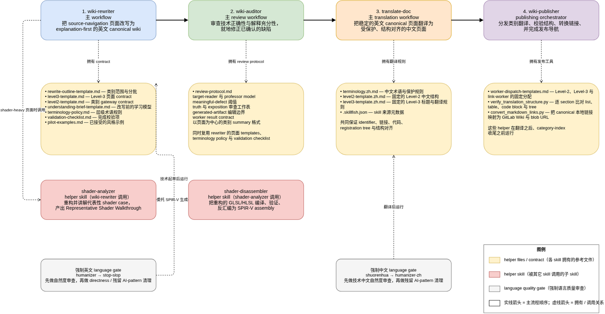

# HBF 07.24.2026 Speaker Note

## Recap Vulkan CTS

- [CTS_Framework.md](../vkcts-wiki-pages//CTS_Framework.md)

## Harness Setup Overview



**心得分享**:

1. 大型项目、复杂任务时，先用`/plan`做好规划，把目标分成一个一个清晰的TODO。
2. 不要过分纠结于plan阶段的质量，持续修改TODO而不开始是很低效的做法。随着TODO一个个完成，自然就知道怎么修改已完成任务和调整接下来的TODO。
3. 以后会大量重复的操作可以提取为agent skill，可以理解为给agent的操作手册。SKILL.md也不需要自己创建，可以用skill来自然创建skill（套娃！）。
4. skill创建完一定要测试。第一次做 -> 发现会重复做 -> 总结成skill -> beta test, 改动skill

```sh
code -r ~/.agents/skills/skill-creator/SKILL.md
```

## Multi-agent Workflow Live Demo

TUI vs GUI

### MTCode

- 多窗口，独立指令，并行独立运行。
- Orchestrator mode，总指令，顺序运行，汇总结果。

```txt
@/diagrams/drawio-prompt.md 
按照prompt完成

@/diagrams/mermaid-prompt.md 
按照prompt完成

@/diagrams/drawio-prompt.md 
@/diagrams/mermaid-prompt.md
创建两个subtasks，分别完成这两个prompt，你来汇总结果。
```

### Hermes Desktop

- master agent + subagents，总指令，**并行运行**，汇总结果。

```txt
使用 .agents/skills/wiki-publisher，对象是test category memory. 严格遵守skill harness。

memory 有14个level-3 pages。分三个batch下发subagents，每个完整处理一个page。
```

### 字节TRAE Work Solo

更好的UI，更流畅体验，免费的GLM5.2。
