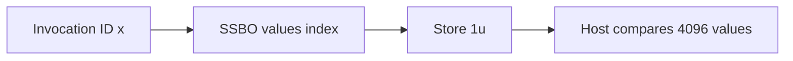

## Overview

**Core question:** Does `VK_AMD_gpa_interface` preserve session state and produce usable sample results while exercising compute and graphics workloads?

- The implementation is [`vktApiGPAInterfaceTests.cpp`](../../../modules/vulkan/api/vktApiGPAInterfaceTests.cpp#L64-L80).
- The family checks clock information, session lifecycle/status, secondary-session copying, reset behavior, and result retrieval.
- Regular sessions place a GPA sample around either a compute dispatch or a graphics draw and then validate the workload output.

## Background Knowledge

- A GPA session is an AMD extension object that records samples between `vkCmdBeginGpaSessionAMD` and `vkCmdEndGpaSessionAMD`.
- A cumulative sample collects selected performance counters; a timing sample additionally supplies top- and bottom-of-pipe sample stages.
- Vulkan command-buffer submission completion is distinct from querying a session: the test waits for the queue, then checks the session status and retrieves the sample payload.

## Registration Hierarchy

```text
api.gpa_interface
├── device_clock_info
├── create_destroy_basic
├── create_destroy_copy
├── empty_sessions
├── created_status
├── unfinished_status
├── empty_sessions_multi_cmd
├── empty_secondary_with_copy
├── reset_empty_session
├── regular_session_comp
├── regular_session_comp_timing
├── regular_session_vert_frag
├── regular_session_vert_frag_timing
├── regular_session_vert_tess_frag
├── regular_session_vert_tess_frag_timing
├── regular_session_vert_geom_frag
├── regular_session_vert_geom_frag_timing
├── regular_session_vert_tess_geom_frag
└── regular_session_vert_tess_geom_frag_timing
```

The exact registrations are in [`createGpaInterfaceTests`](../../../modules/vulkan/api/vktApiGPAInterfaceTests.cpp#L989-L1032). All cases require `VK_AMD_gpa_interface`; `empty_secondary_with_copy` also requires `VK_KHR_synchronization2` ([support gate](../../../modules/vulkan/api/vktApiGPAInterfaceTests.cpp#L378-L382)).

## Parameter Dimensions and Observed Values

| Dimension | Registered values | Meaning in this test | Evidence |
|---|---|---|---|
| Lifecycle leaf | `device_clock_info`, `create_destroy_basic`, `create_destroy_copy`, `empty_sessions`, `created_status`, `unfinished_status`, `empty_sessions_multi_cmd`, `empty_secondary_with_copy`, `reset_empty_session` | Exercises one API/session contract directly | [registration](../../../modules/vulkan/api/vktApiGPAInterfaceTests.cpp#L995-L1003) |
| Shader stages | `comp`, `vert_frag`, `vert_tess_frag`, `vert_geom_frag`, `vert_tess_geom_frag` | Selects compute or graphics construction and its output path | [stage matrix](../../../modules/vulkan/api/vktApiGPAInterfaceTests.cpp#L1005-L1024) |
| Sample mode | cumulative (no suffix), timing (`_timing`) | Selects `VK_GPA_SAMPLE_TYPE_CUMULATIVE_AMD` or `VK_GPA_SAMPLE_TYPE_TIMING_AMD` | [sample setup](../../../modules/vulkan/api/vktApiGPAInterfaceTests.cpp#L716-L753) |
| Workload dimensions | compute local size `64`, workgroups `64`; graphics extent `64×64×1` | Produces 4096 compute values or one triangle per pixel | [workload setup](../../../modules/vulkan/api/vktApiGPAInterfaceTests.cpp#L494-L507) |

## Behavior Parameters

The primary behavioral axis is the registered lifecycle or stage/mode leaf.

### Lifecycle leaves — session contract

The nine fixed leaves cover clock-range sanity checks, creation/destruction, copying after a completed source session, empty sessions, expected `VK_NOT_READY` states, multi-command-buffer sequencing, secondary-command-buffer copying, and reset/reuse. Their implementations and checks are linked from the registration list above and the lifecycle code ([status checks](../../../modules/vulkan/api/vktApiGPAInterfaceTests.cpp#L215-L309), [reset](../../../modules/vulkan/api/vktApiGPAInterfaceTests.cpp#L437-L481)).

### Regular stage leaves — workload contract

`comp` writes `1u` to every storage-buffer element. Graphics variants use a vertex shader and optional passthrough tessellation and geometry stages; the stage that writes the final color determines the expected color. The stage builders are [`initRegularPrograms`](../../../modules/vulkan/api/vktApiGPAInterfaceTests.cpp#L559-L670).

### Timing variants — sample contract

Each stage combination has a cumulative and timing form. Timing adds top-of-pipe and bottom-of-pipe sample stages; it does not change the output workload. The perf-counter feature gate applies to both forms ([gate](../../../modules/vulkan/api/vktApiGPAInterfaceTests.cpp#L546-L557)).

## Shader Analysis

The compute case is the most compact representative: it is generated from the exact `regular_session_comp` builder and compiled locally with `glslangValidator -V`; `spirv-dis` produced the artifact below. The shader writes one to the invocation-indexed SSBO element, while the host dispatches 64 workgroups of 64 invocations.

### Representative Shader Walkthrough 1

#### Parameter Values Chosen

Representative path:

```text
dEQP-VK.api.gpa_interface.regular_session_comp
```

| Parameter choice | Meaning in this representative case |
|------------------|-------------------------------------|
| `comp` | Compute writes one result per invocation into the SSBO. |
| cumulative sample | GPA collection surrounds the dispatch without changing shader code. |

#### Purpose

Validate GPA collection around a deterministic compute workload.

#### Structural Design



#### Shader Code

```glsl
#version 460
layout(local_size_x=64) in;
layout(set=0,binding=0,std430) buffer BufferBlock { uint values[]; } ssbo;
void main(void) { ssbo.values[gl_GlobalInvocationID.x] = 1u; }
```

#### Additional Info

- The dispatch covers all 4096 buffer elements; each invocation writes a distinct index.

#### Parameter Variation Summary

| Parameter dimension | Shader-level variation from this shader | Evidence |
|---------------------|---------------------------------------|----------|
| timing | The compute shader remains unchanged. | [builder](../../../modules/vulkan/api/vktApiGPAInterfaceTests.cpp#L559-L569) |
| graphics stage chain | Replaces storage writes with stage-dependent color output. | [graphics builders](../../../modules/vulkan/api/vktApiGPAInterfaceTests.cpp#L570-L670) |

#### SPIR-V

- Status: generated and validated
- Source: reconstructed `GLSL` from this walkthrough
- Stage: `comp`
- Target SPIRV version: `spirv1.0`

<details>
<summary>Click to expand SPIRV asm code</summary>

```llvm
; SPIR-V
; Version: 1.0
; Generator: Khronos Glslang Reference Front End; 11
; Bound: 25
; Schema: 0
               OpCapability Shader
          %1 = OpExtInstImport "GLSL.std.450"
               OpMemoryModel Logical GLSL450
               OpEntryPoint GLCompute %main "main" %gl_GlobalInvocationID
               OpExecutionMode %main LocalSize 64 1 1
               OpSource GLSL 460
               OpName %main "main"
               OpName %BufferBlock "BufferBlock"
               OpMemberName %BufferBlock 0 "values"
               OpName %ssbo "ssbo"
               OpName %gl_GlobalInvocationID "gl_GlobalInvocationID"
               OpDecorate %_runtimearr_uint ArrayStride 4
               OpDecorate %BufferBlock BufferBlock
               OpMemberDecorate %BufferBlock 0 Offset 0
               OpDecorate %ssbo Binding 0
               OpDecorate %ssbo DescriptorSet 0
               OpDecorate %gl_GlobalInvocationID BuiltIn GlobalInvocationId
               OpDecorate %gl_WorkGroupSize BuiltIn WorkgroupSize
       %void = OpTypeVoid
          %3 = OpTypeFunction %void
       %uint = OpTypeInt 32 0
%_runtimearr_uint = OpTypeRuntimeArray %uint
%BufferBlock = OpTypeStruct %_runtimearr_uint
%_ptr_Uniform_BufferBlock = OpTypePointer Uniform %BufferBlock
       %ssbo = OpVariable %_ptr_Uniform_BufferBlock Uniform
        %int = OpTypeInt 32 1
      %int_0 = OpConstant %int 0
     %v3uint = OpTypeVector %uint 3
%_ptr_Input_v3uint = OpTypePointer Input %v3uint
%gl_GlobalInvocationID = OpVariable %_ptr_Input_v3uint Input
     %uint_0 = OpConstant %uint 0
%_ptr_Input_uint = OpTypePointer Input %uint
     %uint_1 = OpConstant %uint 1
%_ptr_Uniform_uint = OpTypePointer Uniform %uint
    %uint_64 = OpConstant %uint 64
%gl_WorkGroupSize = OpConstantComposite %v3uint %uint_64 %uint_1 %uint_1
       %main = OpFunction %void None %3
          %5 = OpLabel
         %18 = OpAccessChain %_ptr_Input_uint %gl_GlobalInvocationID %uint_0
         %19 = OpLoad %uint %18
         %22 = OpAccessChain %_ptr_Uniform_uint %ssbo %int_0 %19
               OpStore %22 %uint_1
               OpReturn
               OpFunctionEnd
```

</details>

## Runtime Execution and Result Checking

- The regular test enumerates physical-device GPA performance blocks, skips blocks with no instances/events, skips selected problematic exposed blocks, and for cumulative mode requires global-only counters. It then begins the session and sample around the workload ([counter selection](../../../modules/vulkan/api/vktApiGPAInterfaceTests.cpp#L691-L753)).
- Compute creates a storage buffer, clears it, dispatches `64,1,1`, inserts a shader-write-to-host-read barrier, and copies the mapped result back. Every one of 4096 values must equal `1` ([dispatch and check](../../../modules/vulkan/api/vktApiGPAInterfaceTests.cpp#L882-L962)).
- Graphics renders a `64×64` image using one triangle per pixel, copies the image to a host-visible buffer, and compares every pixel against the stage-dependent final color with zero threshold ([draw and check](../../../modules/vulkan/api/vktApiGPAInterfaceTests.cpp#L895-L979)).
- The host requires a completed session, performs the two-call result-size/data query, and fails if the byte count changes between calls ([result query](../../../modules/vulkan/api/vktApiGPAInterfaceTests.cpp#L914-L937)). This checks size consistency, not the numeric contents of GPA counter records.

## Failure Meaning

### Failure Cause Mapping

| If this behavior parameter value fails | Possible failure cause(s) |
|---|---|
| Clock or lifecycle leaf | Extension implementation returns invalid clock/status or mishandles session state, copy, reset, or command sequencing. |
| Regular cumulative leaf | GPA counter enumeration/collection, command execution, synchronization, or workload output failure. |
| Regular timing leaf | Timing sample setup/collection, command execution, synchronization, or workload output failure. |

### Cause Analysis

#### Session state and extension API failures

**Possible failure symptoms:** An unexpected status, failed API call, invalid clock range, or inconsistent result size is reported.

**Possible implementation causes:** Source evidence identifies an extension/session contract failure but does not distinguish driver, hardware, or host cause; further implementation-level investigation is required.

#### Workload output or synchronization failures

**Possible failure symptoms:** A compute element is not `1`, or a rendered pixel differs from the exact expected color.

**Possible implementation causes:** The failure can arise from shader execution, resource visibility, command synchronization, pipeline stage handling, or host readback; this test does not isolate those causes further.

## Case Pruning

### Requirement-based pruning

Every case requires `VK_AMD_gpa_interface`. Tessellation and geometry variants require their corresponding core features; the secondary-copy case requires synchronization2. Unsupported requirements are reported as not supported rather than treated as workload failures ([support logic](../../../modules/vulkan/api/vktApiGPAInterfaceTests.cpp#L64-L80), [regular support](../../../modules/vulkan/api/vktApiGPAInterfaceTests.cpp#L546-L557)).

### Design-based pruning

Regular sessions skip unavailable performance blocks (zero instances/events), cumulative blocks without global-only counters, and a fixed set of blocks documented in source as problematic because they may be exposed but absent. This changes counter selection, not the registered stage/mode matrix ([selection](../../../modules/vulkan/api/vktApiGPAInterfaceTests.cpp#L699-L728)).

## Key Takeaways

- The nine lifecycle leaves validate session state transitions and API mechanics; the ten regular leaves repeat one workload across five stage combinations and two sample modes.
- Timing changes sample boundaries, not shader output.
- GPA result-byte size consistency is checked, while compute and graphics correctness are validated independently through host-visible workload results.
- Clock bounds are heuristic sanity ranges in the CTS implementation, not claims about a Vulkan-specified frequency interval.

## Source Reference Appendix

- [Registration and parameters](../../../modules/vulkan/api/vktApiGPAInterfaceTests.cpp#L989-L1032)
- [Regular execution and validation](../../../modules/vulkan/api/vktApiGPAInterfaceTests.cpp#L691-L984)
