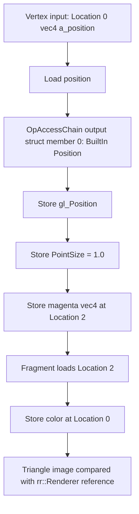

## Overview

**Core question:** can the implementation create the most basic Vulkan objects and complete a minimal end-to-end rendering pass without errors?

- Source file covered: [`vktApiSmokeTests.cpp`](../../../modules/vulkan/api/vktApiSmokeTests.cpp#L1).
- Test category: `api`. Test family: `smoke`. Test case leaves: `create_sampler`, `create_shader`, `triangle`, `asm_triangle`, `asm_triangle_no_opname`, `unused_resolve_attachment`.
- Core test idea: run a small set of independent smoke cases that each touch one basic Vulkan code path: sampler creation, GLSL shader-module creation, full GLSL triangle rendering, SPIR-V-assembly triangle rendering, SPIR-V assembly without `OpName`, and a render pass with an unused resolve attachment.
- The remaining sections cover the six leaves, what each one changes, what is checked, and what a failure of each one means.

## Background Knowledge

- **`Move<VkT>` and `Unique<VkT>`.** The CTS framework wraps Vulkan object handles in `Move<VkT>`, a movable unique handle, and `Unique<VkT>`, a non-movable guard that destroys the object at scope exit. The `create_sampler` case exercises `Move<VkSampler>` assignment, which transfers ownership between handles. This is a CTS framework property, not a Vulkan API property.
- **`rr` software reference renderer.** The reference renderer in `rr::Renderer` rasterizes a triangle on the host using a software vertex and fragment shader. The triangle cases compare the device-rendered image against this reference image instead of against a hard-coded golden buffer.
- **`VK_ATTACHMENT_UNUSED` in `pResolveAttachments`.** A render pass may declare a `pResolveAttachments` array whose entries point to attachment indices. When an entry is `VK_ATTACHMENT_UNUSED`, the spec requires that no resolve operation is performed for that color attachment, even though the array is non-NULL. The `unused_resolve_attachment` case exercises that path.
- **Non-zero memory binding offsets.** `vkBindBufferMemory` and `vkBindImageMemory` accept a `VkDeviceSize` offset into the bound `VkDeviceMemory`. The `triangle` case binds vertex buffer, readback buffer, and color image at non-zero offsets equal to the reported alignment to exercise that code path.

## Registration Hierarchy

```text
api.smoke
├── create_sampler
├── create_shader
├── triangle
├── asm_triangle
├── asm_triangle_no_opname
└── unused_resolve_attachment
```

The `smoke` test family is created by [`createSmokeTests()`](../../../modules/vulkan/api/vktApiSmokeTests.cpp#L864) and attached to the `api` test category by [`vktApiTests.cpp#L94`](../../../modules/vulkan/api/vktApiTests.cpp#L94). The six test case leaves are added at [`vktApiSmokeTests.cpp#L868-L874`](../../../modules/vulkan/api/vktApiSmokeTests.cpp#L868-L874). The family is excluded from Vulkan SC builds through the `CTS_USES_VULKANSC` guard at [`vktApiTests.cpp#L55`](../../../modules/vulkan/api/vktApiTests.cpp#L55).

## Parameter Dimensions and Observed Values

| Dimension | Registered values | Meaning in this test | Evidence |
|-----------|-------------------|----------------------|----------|
| Test case leaf | `create_sampler`, `create_shader`, `triangle`, `asm_triangle`, `asm_triangle_no_opname`, `unused_resolve_attachment` | Each leaf selects one basic Vulkan code path to exercise independently. | [`createSmokeTests()`](../../../modules/vulkan/api/vktApiSmokeTests.cpp#L864) |
| Shader source | none, GLSL, SPIR-V assembly with `OpName`, SPIR-V assembly without `OpName` | Selects the program-collection function and the shader-module creation path. | `createShaderProgs`, `createTriangleProgs`, `createTriangleAsmProgs`, `createProgsNoOpName` |
| Render size | `256x256` | Fixed render target size for the four triangle cases. | [`renderTriangleTest()`](../../../modules/vulkan/api/vktApiSmokeTests.cpp#L333) |
| Color format | `VK_FORMAT_R8G8B8A8_UNORM` | Fixed color attachment format. | [`vktApiSmokeTests.cpp#L334`](../../../modules/vulkan/api/vktApiSmokeTests.cpp#L334) |
| Clear color | `(0.125, 0.25, 0.75, 1.0)` | Background color used for both device and reference rendering. | [`vktApiSmokeTests.cpp#L335`](../../../modules/vulkan/api/vktApiSmokeTests.cpp#L335) |
| Triangle vertices | `(-0.5,-0.5,0,1)`, `(+0.5,-0.5,0,1)`, `(0,+0.5,0,1)` | Fixed vertex positions used by every triangle case. | [`vktApiSmokeTests.cpp#L337-L338`](../../../modules/vulkan/api/vktApiSmokeTests.cpp#L337-L338) |
| Memory binding offset | zero (default), non-zero (alignment) | `triangle` uses non-zero offsets on vertex buffer, readback buffer, and image; `unused_resolve_attachment` uses zero offsets. | [`vktApiSmokeTests.cpp#L352-L404`](../../../modules/vulkan/api/vktApiSmokeTests.cpp#L352-L404) |
| Resolve attachment | none, `VK_ATTACHMENT_UNUSED` | `triangle` uses a render pass without resolve; `unused_resolve_attachment` declares `VK_ATTACHMENT_UNUSED` in `pResolveAttachments`. | [`vktApiSmokeTests.cpp#L670`](../../../modules/vulkan/api/vktApiSmokeTests.cpp#L670) |

## Behavior Parameters

The primary behavioral axis is the test case leaf. Each leaf changes which basic Vulkan code path is exercised: object creation, shader-module creation, GLSL rendering, SPIR-V-assembly rendering, SPIR-V assembly without `OpName`, or rendering with an unused resolve attachment.

### create_sampler — Sampler creation with Move assignment

Tests `vkCreateSampler` with `VK_FILTER_NEAREST` filtering and `VK_SAMPLER_ADDRESS_MODE_CLAMP_TO_EDGE` addressing, then exercises `Move<VkSampler>` assignment between two handles. Passes when `createSampler` returns successfully and the move-assignment transfers ownership without error. No shader programs are required.

### create_shader — Shader module creation from GLSL

Tests `vkCreateShaderModule` from a compiled GLSL vertex shader. The program-collection function emits a single `#version 310 es` vertex shader that copies `a_position` into `gl_Position`. Passes when `createShaderModule` returns successfully. No pipeline, framebuffer, or draw is recorded.

### triangle — Triangle rendering with GLSL shaders

Tests a minimal end-to-end GLSL rendering pipeline: vertex buffer, color image, render pass, pipeline, framebuffer, command buffer, draw, image-to-buffer copy, host readback, and comparison against a software reference. The pipeline uses a GLSL vertex shader and a GLSL fragment shader that emits `vec4(1.0, 0.0, 1.0, 1.0)`. Buffer and image memory bindings use non-zero offsets equal to the reported alignment.

### asm_triangle — Triangle rendering with SPIR-V assembly

Same pipeline as `triangle`, but the shader modules come from SPIR-V assembly strings that contain `OpName` decorations. The case uses the same `renderTriangleTest` function and the same reference comparison. The SPIR-V vertex shader loads `a_position` and stores it to `gl_Position`; the SPIR-V fragment shader stores the constant `(1.0, 0.0, 1.0, 1.0)` to `o_color`.

### asm_triangle_no_opname — SPIR-V assembly without OpName

Same pipeline as `asm_triangle` but the SPIR-V assembly strings omit `OpName` and use a different layout for `gl_Position`: it is wrapped in an `OpTypeStruct` along with `PointSize`, accessed through `OpAccessChain`. The case verifies that the implementation can consume SPIR-V that lacks debug names and uses struct-based built-in decoration.

### unused_resolve_attachment — Render pass with an unused resolve attachment

Same GLSL rendering pipeline as `triangle`, but the render pass declares a `pResolveAttachments` array whose single entry is `VK_ATTACHMENT_UNUSED`. The case creates no resolve attachment image. The test verifies that the implementation accepts a non-NULL `pResolveAttachments` array with an unused entry and produces the same triangle rendering as the regular `triangle` case. Unlike `triangle`, this case uses zero memory binding offsets.

## Shader Analysis
The representative `asm_triangle_no_opname` case is the strongest shader-focused walkthrough because it keeps the shared triangle pipeline and software-reference oracle fixed while replacing the ordinary GLSL/annotated SPIR-V path with structurally distinct SPIR-V assembly that has no `OpName` instructions. The source entrypoint is [`createProgsNoOpName`](../../../modules/vulkan/api/vktApiSmokeTests.cpp#L192-L259), registered for [`dEQP-VK.api.smoke.asm_triangle_no_opname`](../../../modules/vulkan/api/vktApiSmokeTests.cpp#L864-L874) and executed by [`renderTriangleTest`](../../../modules/vulkan/api/vktApiSmokeTests.cpp#L325-L573).

### Representative Shader Walkthrough 1

#### Parameter Values Chosen

Representative path:

```text
dEQP-VK.api.smoke.asm_triangle_no_opname
```

| Parameter choice | Meaning in this representative case |
|------------------|-------------------------------------|
| Test case leaf `asm_triangle_no_opname` | Selects `createProgsNoOpName()` and the shared `renderTriangleTest()` path; the shader modules are authored SPIR-V assembly without debug `OpName` instructions. |
| Shader stages `vert` + `frag` | The vertex stage copies the position and writes the fixed magenta varying; the fragment stage forwards that varying to color output. |
| Vertex output layout | `gl_Position` is represented by a two-member output struct containing `Position` and `PointSize`, reached through `OpAccessChain`; the varying is a separate `Location 2` output. |
| Shared rendering oracle | Three fixed vertices are drawn into a `256x256` `VK_FORMAT_R8G8B8A8_UNORM` target and compared with the software reference triangle. |

#### Purpose

This case checks that an implementation accepts and executes structurally distinct SPIR-V without `OpName`, including a struct-based built-in `Position` decorated through `OpMemberDecorate`. The software-reference comparison verifies the resulting triangle, while the fragment stage provides the fixed magenta output used by the common rendering path.

#### Structural Design



#### Shader Code

##### Vertex Shader

```glsl
#version 310 es
/// Reconstructed from createProgsNoOpName: the input position is copied to
/// the Position member of the built-in output block.
layout(location = 0) in highp vec4 a_position;
/// Location 2 is the stage interface consumed by the fixed fragment module.
layout(location = 2) out highp vec4 v_color;
void main (void)
{
    /// The source assembly reaches Position and PointSize through OpAccessChain
    /// on a two-member output struct; these are equivalent GLSL assignments.
    gl_Position = a_position;
    gl_PointSize = 1.0;
    v_color = vec4(1.0, 0.0, 1.0, 1.0);
}
```

##### Fragment Shader

```glsl
#version 310 es
/// Location 2 matches the vertex output; color is written at Location 0.
layout(location = 2) in highp vec4 v_color;
layout(location = 0) out lowp vec4 o_color;
void main (void)
{
    o_color = v_color;
}
```

#### Additional Info

- The fragment module is fixed across the smoke triangle variants: it consumes the stage value at `Location 2` and stores it at color `Location 0`; it matters here because the no-`OpName` vertex module must link into the same interface.
- `createProgsNoOpName()` intentionally omits `OpName` while retaining executable declarations and decorations. The reconstructed GLSL is a semantic equivalent, so the compiler-generated verification assembly can contain harmless `OpName` metadata.
- The host test does not inspect shader outputs directly. It uploads `(-0.5,-0.5,0,1)`, `(+0.5,-0.5,0,1)`, and `(0,+0.5,0,1)`, then compares the device image against `renderReferenceTriangle()` with zero color threshold and one-pixel position deviation.

#### Parameter Variation Summary

| Parameter dimension | Shader-level variation from this shader | Evidence |
|---------------------|---------------------------------------|----------|
| `asm_triangle` vs `asm_triangle_no_opname` | Keeps the same vertex/fragment dataflow but changes from assembly with `OpName` decorations to assembly without `OpName`; the no-name case also uses the struct-based `Position`/`PointSize` output layout. | [`createTriangleAsmProgs`](../../../modules/vulkan/api/vktApiSmokeTests.cpp#L118-L180), [`createProgsNoOpName`](../../../modules/vulkan/api/vktApiSmokeTests.cpp#L192-L259) |
| `triangle` / `unused_resolve_attachment` vs this case | Uses GLSL sources instead of SPIR-V assembly; the host rendering and reference comparison remain shared or equivalent. | [`createTriangleProgs`](../../../modules/vulkan/api/vktApiSmokeTests.cpp#L182-L190), [`renderTriangleTest`](../../../modules/vulkan/api/vktApiSmokeTests.cpp#L325-L573) |
| Render-pass configuration | Does not change the shader: `unused_resolve_attachment` changes only the render pass to include `VK_ATTACHMENT_UNUSED`, while the no-`OpName` case uses the normal render pass. | [`renderTriangleUnusedResolveAttachmentTest`](../../../modules/vulkan/api/vktApiSmokeTests.cpp#L581-L860) |

#### SPIR-V

##### Vertex Shader

- Status: generated and validated
- Source: reconstructed `GLSL` from this walkthrough
- Stage: `vert`
- Target SPIRV version: `spirv1.0`

<details>
<summary>Click to expand SPIRV asm code</summary>

```llvm
; SPIR-V
; Version: 1.0
; Generator: Khronos Glslang Reference Front End; 11
; Bound: 25
; Schema: 0
               OpCapability Shader
          %1 = OpExtInstImport "GLSL.std.450"
               OpMemoryModel Logical GLSL450
               OpEntryPoint Vertex %main "main" %_ %a_position %v_color
               OpSource ESSL 310
               OpName %main "main"
               OpName %gl_PerVertex "gl_PerVertex"
               OpMemberName %gl_PerVertex 0 "gl_Position"
               OpMemberName %gl_PerVertex 1 "gl_PointSize"
               OpName %_ ""
               OpName %a_position "a_position"
               OpName %v_color "v_color"
               OpDecorate %gl_PerVertex Block
               OpMemberDecorate %gl_PerVertex 0 BuiltIn Position
               OpMemberDecorate %gl_PerVertex 1 BuiltIn PointSize
               OpDecorate %a_position Location 0
               OpDecorate %v_color Location 2
       %void = OpTypeVoid
          %3 = OpTypeFunction %void
      %float = OpTypeFloat 32
    %v4float = OpTypeVector %float 4
%gl_PerVertex = OpTypeStruct %v4float %float
%_ptr_Output_gl_PerVertex = OpTypePointer Output %gl_PerVertex
          %_ = OpVariable %_ptr_Output_gl_PerVertex Output
        %int = OpTypeInt 32 1
      %int_0 = OpConstant %int 0
%_ptr_Input_v4float = OpTypePointer Input %v4float
 %a_position = OpVariable %_ptr_Input_v4float Input
%_ptr_Output_v4float = OpTypePointer Output %v4float
      %int_1 = OpConstant %int 1
    %float_1 = OpConstant %float 1
%_ptr_Output_float = OpTypePointer Output %float
    %v_color = OpVariable %_ptr_Output_v4float Output
    %float_0 = OpConstant %float 0
         %24 = OpConstantComposite %v4float %float_1 %float_0 %float_1 %float_1
       %main = OpFunction %void None %3
          %5 = OpLabel
         %15 = OpLoad %v4float %a_position
         %17 = OpAccessChain %_ptr_Output_v4float %_ %int_0
               OpStore %17 %15
         %21 = OpAccessChain %_ptr_Output_float %_ %int_1
               OpStore %21 %float_1
               OpStore %v_color %24
               OpReturn
               OpFunctionEnd
```

</details>

##### Fragment Shader

- Status: generated and validated
- Source: reconstructed `GLSL` from this walkthrough
- Stage: `frag`
- Target SPIRV version: `spirv1.0`

<details>
<summary>Click to expand SPIRV asm code</summary>

```llvm
; SPIR-V
; Version: 1.0
; Generator: Khronos Glslang Reference Front End; 11
; Bound: 13
; Schema: 0
               OpCapability Shader
          %1 = OpExtInstImport "GLSL.std.450"
               OpMemoryModel Logical GLSL450
               OpEntryPoint Fragment %main "main" %o_color %v_color
               OpExecutionMode %main OriginUpperLeft
               OpSource ESSL 310
               OpName %main "main"
               OpName %o_color "o_color"
               OpName %v_color "v_color"
               OpDecorate %o_color RelaxedPrecision
               OpDecorate %o_color Location 0
               OpDecorate %v_color Location 2
       %void = OpTypeVoid
          %3 = OpTypeFunction %void
      %float = OpTypeFloat 32
    %v4float = OpTypeVector %float 4
%_ptr_Output_v4float = OpTypePointer Output %v4float
    %o_color = OpVariable %_ptr_Output_v4float Output
%_ptr_Input_v4float = OpTypePointer Input %v4float
    %v_color = OpVariable %_ptr_Input_v4float Input
       %main = OpFunction %void None %3
          %5 = OpLabel
         %12 = OpLoad %v4float %v_color
               OpStore %o_color %12
               OpReturn
               OpFunctionEnd
```

</details>

## Runtime Execution and Result Checking

### create_sampler and create_shader

The two creation cases do not record command buffers:

1. Build a `VkSamplerCreateInfo` with NEAREST filtering and CLAMP_TO_EDGE addressing; call `vkCreateSampler` and assign the resulting handle through `Move<VkSampler>` ([`vktApiSmokeTests.cpp#L64-L100`](../../../modules/vulkan/api/vktApiSmokeTests.cpp#L64-L100)).
2. Build a `VkShaderModule` from the GLSL program named `test`; call `vkCreateShaderModule` ([`vktApiSmokeTests.cpp#L109-L116`](../../../modules/vulkan/api/vktApiSmokeTests.cpp#L109-L116)).

Both cases pass when the creation call returns `VK_SUCCESS` and the framework handle wrapper remains valid.

### triangle, asm_triangle, asm_triangle_no_opname

The three rendering cases share [`renderTriangleTest()`](../../../modules/vulkan/api/vktApiSmokeTests.cpp#L325) and follow the same sequence:

1. Allocate vertex buffer, readback buffer, and color image through a `SimpleAllocator`. For each, allocate `size + alignment` bytes and bind at the non-zero offset `alignment` to exercise the offset path ([`vktApiSmokeTests.cpp#L351-L404`](../../../modules/vulkan/api/vktApiSmokeTests.cpp#L351-L404)).
2. Create render pass, image view, pipeline layout, shader modules, graphics pipeline, and framebuffer.
3. Record a command buffer: pipeline barrier from `HOST_WRITE_BIT` to vertex-attribute and color-attachment access, `beginRenderPass` with the clear color, `cmdBindPipeline`, `cmdBindVertexBuffers`, `cmdDraw(3, 1, 0, 0)`, `endRenderPass`, then `copyImageToBuffer` ([`vktApiSmokeTests.cpp#L494-L536`](../../../modules/vulkan/api/vktApiSmokeTests.cpp#L494-L536)).
4. Upload vertex data with `deMemcpy` and `flushAlloc`; submit and wait.
5. Invalidate the readback allocation, render a reference triangle through `rr::Renderer` into a `tcu::TextureLevel`, and compare with `tcu::intThresholdPositionDeviationCompare` using zero color threshold and `(1, 1, 0)` position deviation ([`vktApiSmokeTests.cpp#L546-L569`](../../../modules/vulkan/api/vktApiSmokeTests.cpp#L546-L569)).

Pass condition: the device image matches the software reference within zero color threshold and one-pixel position deviation.

### unused_resolve_attachment

Follows the same flow as `triangle` with three differences:

- A custom `VkRenderPassCreateInfo` is built with a `pResolveAttachments` array whose single entry is `{VK_ATTACHMENT_UNUSED, VK_IMAGE_LAYOUT_GENERAL}` ([`vktApiSmokeTests.cpp#L670`](../../../modules/vulkan/api/vktApiSmokeTests.cpp#L670)).
- Memory bindings use zero offsets: vertex buffer, readback buffer, and image are bound at `vertexBufferMemory->getOffset()` ([`vktApiSmokeTests.cpp#L610-L653`](../../../modules/vulkan/api/vktApiSmokeTests.cpp#L610-L653)).
- The readback pixel access reads from `readImageBufferMemory->getHostPtr()` without adding an offset ([`vktApiSmokeTests.cpp#L837`](../../../modules/vulkan/api/vktApiSmokeTests.cpp#L837)).

Pass condition is the same image-comparison check as the other rendering cases.

## Failure Meaning

### Failure Cause Mapping

| If this behavior parameter value fails | Possible failure cause(s) |
|----------------------------------------|---------------------------|
| `create_sampler` | Sampler creation failure or `Move<VkSampler>` assignment failure. |
| `create_shader` | Shader module creation failure from GLSL program. |
| `triangle` | GLSL pipeline setup, non-zero-offset memory binding, or image comparison mismatch. |
| `asm_triangle` | SPIR-V assembly parsing or translation, or the same rendering failure modes as `triangle`. |
| `asm_triangle_no_opname` | SPIR-V consumption without `OpName` or with struct-based built-in decoration. |
| `unused_resolve_attachment` | Render pass creation with `VK_ATTACHMENT_UNUSED` in `pResolveAttachments`, or the same rendering failure modes as `triangle`. |

### Cause Analysis

#### Sampler creation failure

**Possible failure symptoms:** `vkCreateSampler` returns a non-`VK_SUCCESS` result, or the `Move<VkSampler>` assignment throws a framework error.

**Possible implementation causes:** the driver rejected a `VkSamplerCreateInfo` that uses `VK_FILTER_NEAREST`, `VK_SAMPLER_MIPMAP_MODE_NEAREST`, `VK_SAMPLER_ADDRESS_MODE_CLAMP_TO_EDGE`, and `VK_BORDER_COLOR_FLOAT_TRANSPARENT_BLACK`. The `Move<VkSampler>` assignment failure is a CTS framework issue rather than a driver bug; investigation should start from the framework's move-semantics implementation rather than from driver behavior.

#### Shader module creation failure

**Possible failure symptoms:** `vkCreateShaderModule` returns a non-`VK_SUCCESS` result, or `context.getBinaryCollection().get("test")` cannot resolve the compiled GLSL.

**Possible implementation causes:** the driver rejected the compiled GLSL vertex shader, the GLSL-to-SPIR-V frontend produced invalid SPIR-V, or the CTS binary collection did not register the program. Source-level investigation is needed to distinguish a driver SPIR-V acceptance bug from a build-pipeline failure.

#### GLSL triangle rendering failure

**Possible failure symptoms:** `vkCreateBuffer`, `vkCreateImage`, `vkAllocateMemory`, `vkBindBufferMemory`, `vkBindImageMemory`, pipeline creation, or framebuffer creation returns a non-`VK_SUCCESS` result; command buffer recording or submission fails; or `tcu::intThresholdPositionDeviationCompare` reports a mismatch exceeding zero color threshold and one-pixel position deviation.

**Possible implementation causes:** a non-zero-offset memory binding returned `VK_ERROR_OUT_OF_DEVICE_MEMORY` or `VK_ERROR_OUT_OF_HOST_MEMORY` because the test allocates `size + alignment` bytes; the implementation rejected the bind offset because it was not aligned to `VkMemoryRequirements::alignment`; the clear color, vertex positions, or fragment output did not match the reference renderer; or the pipeline barrier did not flush host-written vertex data before the draw. The reference comparison uses `subPixelPrecisionBits` from `VkPhysicalDeviceLimits`, so a misreport there would also distort the reference triangle.

#### SPIR-V assembly translation failure

**Possible failure symptoms:** `vkCreateShaderModule` returns a non-`VK_SUCCESS` result for the SPIR-V assembly strings, or the rendered image does not match the reference.

**Possible implementation causes:** the driver's SPIR-V parser rejected valid SPIR-V that uses `OpCapability Shader`, `OpMemoryModel Logical GLSL450`, and `OpEntryPoint` for the vertex or fragment stage; the parser mishandled `OpName` decorations that should be metadata-only; or the parser failed to honor `OpDecorate` for `BuiltIn Position`, `BuiltIn VertexIndex`, or `BuiltIn InstanceIndex`. Per spec, `OpName` and other debug instructions must not affect the executable behavior of a module, so a difference between `asm_triangle` and `asm_triangle_no_opname` points to the SPIR-V parser treating debug instructions as semantically meaningful.

#### Render pass with unused resolve attachment failure

**Possible failure symptoms:** `vkCreateRenderPass` returns a non-`VK_SUCCESS` result, command buffer recording fails inside the render pass, or the rendered image does not match the reference.

**Possible implementation causes:** the implementation rejected a render pass whose `pResolveAttachments` array is non-NULL but contains `VK_ATTACHMENT_UNUSED`. Per spec, an unused resolve attachment entry must skip the resolve operation for that color attachment, so a rejection is a conformance failure. The remaining failure modes overlap with `triangle` because the rest of the pipeline is identical; the only structural difference is the resolve attachment reference, so a difference in pass/fail between the two cases points to the unused-resolve path.

## Case Pruning

### Requirement-based pruning

The `smoke` test family is excluded from Vulkan SC builds through a `#ifndef CTS_USES_VULKANSC` guard at [`vktApiTests.cpp#L55`](../../../modules/vulkan/api/vktApiTests.cpp#L55) and [`vktApiTests.cpp#L93-L95`](../../../modules/vulkan/api/vktApiTests.cpp#L93-L95). No additional device feature, format, or extension is queried; the family uses only core Vulkan 1.0 entry points and `VK_FORMAT_R8G8B8A8_UNORM`.

### Design-based pruning

No parameter matrix is generated. The family contains six hand-written cases, each chosen to exercise one basic code path. No combinations of shader source, render size, format, or offset are produced; those dimensions are fixed at the values shown in `## Parameter Dimensions and Observed Values`.

## Key Takeaways

- The `smoke` family is a small set of independent leaves that each touch one basic Vulkan code path; nothing in the family generates a parameter matrix.
- The four rendering cases share a common pipeline structure and a software-reference comparison through `rr::Renderer`, so a difference between them points to the dimension each one varies: shader source language, `OpName` presence, or the unused-resolve render-pass configuration.
- The `triangle` case uses non-zero memory binding offsets equal to the reported alignment; `unused_resolve_attachment` uses zero offsets. Comparing the two confirms whether the offset path is exercised.
- Per spec, `OpName` and other debug instructions must not affect SPIR-V executable behavior. A pass on `asm_triangle` and a fail on `asm_triangle_no_opname` (or vice versa) is a strong signal of a SPIR-V parser bug, not a rendering bug.
- Per spec, `VK_ATTACHMENT_UNUSED` in `pResolveAttachments` must skip the resolve operation. A render-pass creation failure on `unused_resolve_attachment` is a conformance failure.

## Source Reference Appendix

| Entry point | Link | Why it matters |
|-------------|------|----------------|
| `createSmokeTests()` | [`vktApiSmokeTests.cpp#L864`](../../../modules/vulkan/api/vktApiSmokeTests.cpp#L864) | Family registration and leaf case additions. |
| Parent attach | [`vktApiTests.cpp#L94`](../../../modules/vulkan/api/vktApiTests.cpp#L94) | Attaches the `smoke` family to the `api` test category. |
| Vulkan SC guard | [`vktApiTests.cpp#L55`](../../../modules/vulkan/api/vktApiTests.cpp#L55) | Excludes the family from Vulkan SC builds. |
| `createSamplerTest()` | [`vktApiSmokeTests.cpp#L64-L100`](../../../modules/vulkan/api/vktApiSmokeTests.cpp#L64-L100) | `create_sampler` implementation. |
| `createShaderModuleTest()` | [`vktApiSmokeTests.cpp#L109-L116`](../../../modules/vulkan/api/vktApiSmokeTests.cpp#L109-L116) | `create_shader` implementation. |
| `createShaderProgs()` | [`vktApiSmokeTests.cpp#L102-L107`](../../../modules/vulkan/api/vktApiSmokeTests.cpp#L102-L107) | GLSL vertex program for `create_shader`. |
| `renderTriangleTest()` | [`vktApiSmokeTests.cpp#L325-L573`](../../../modules/vulkan/api/vktApiSmokeTests.cpp#L325-L573) | Shared implementation of `triangle`, `asm_triangle`, and `asm_triangle_no_opname`. |
| `createTriangleProgs()` | [`vktApiSmokeTests.cpp#L182-L190`](../../../modules/vulkan/api/vktApiSmokeTests.cpp#L182-L190) | GLSL programs for `triangle` and `unused_resolve_attachment`. |
| `createTriangleAsmProgs()` | [`vktApiSmokeTests.cpp#L118-L180`](../../../modules/vulkan/api/vktApiSmokeTests.cpp#L118-L180) | SPIR-V assembly programs with `OpName` for `asm_triangle`. |
| `createProgsNoOpName()` | [`vktApiSmokeTests.cpp#L192-L259`](../../../modules/vulkan/api/vktApiSmokeTests.cpp#L192-L259) | SPIR-V assembly programs without `OpName` for `asm_triangle_no_opname`. |
| `renderTriangleUnusedResolveAttachmentTest()` | [`vktApiSmokeTests.cpp#L581-L860`](../../../modules/vulkan/api/vktApiSmokeTests.cpp#L581-L860) | `unused_resolve_attachment` implementation. |
| `renderReferenceTriangle()` | [`vktApiSmokeTests.cpp#L307-L323`](../../../modules/vulkan/api/vktApiSmokeTests.cpp#L307-L323) | Reference renderer invocation through `rr::Renderer`. |
| Image comparison | [`vktApiSmokeTests.cpp#L563-L568`](../../../modules/vulkan/api/vktApiSmokeTests.cpp#L563-L568) | `tcu::intThresholdPositionDeviationCompare` pass/fail decision. |
| Header | [`vktApiSmokeTests.hpp`](../../../modules/vulkan/api/vktApiSmokeTests.hpp#L1) | Declares `createSmokeTests`. |
