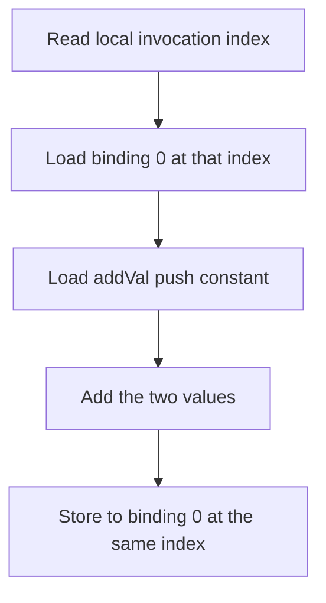
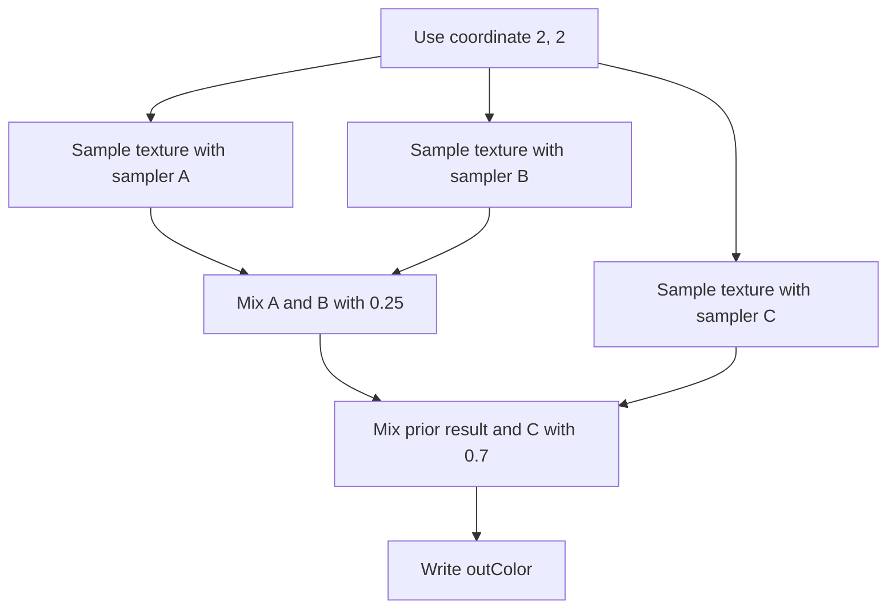

## Overview

**Core question:** Do descriptor-buffer operations preserve the intended descriptor state when mixed with traditional binding commands, and does sampler capture replay preserve custom border-color descriptor data?

- [`vktBindingDescriptorCombinationTests.cpp`](../../../modules/vulkan/binding_model/vktBindingDescriptorCombinationTests.cpp) implements the `binding_model.descriptor_combination` test family. It registers two fixed cases under `basic`.
- `descriptor_buffer_and_legacy_descriptor_in_command_buffer` alternates push descriptors, a traditional descriptor set, and a descriptor buffer within one compute command buffer. Exact storage-buffer arrays expose every selected path and arithmetic step.
- `descriptor_buffer_capture_replay_with_custom_border_color` captures three custom-border samplers, recreates them in reverse order, and samples the original descriptor-buffer encodings. A rendered color exposes whether replay kept each sampler descriptor stable.

## Background Knowledge

For the shared concepts of active descriptor state and availability and visibility, see [Background Knowledge](../../categories/binding_model.md#background-knowledge) of the `binding_model` page.

- **Descriptor binding state.** Descriptor buffers store implementation-produced descriptor bytes in application-managed memory. `vkCmdBindDescriptorBuffersEXT` binds their addresses, and `vkCmdSetDescriptorBufferOffsetsEXT` selects the buffer and offset for each descriptor set. At the same pipeline bind point, setting a descriptor-buffer offset invalidates a traditional `vkCmdBindDescriptorSets` binding for that set, and binding a descriptor set invalidates the descriptor-buffer selection ([descriptor-buffer binding](../../../../vulkan-docs/src/chapters/descriptorbuffers.adoc#L661-L677), [descriptor-set binding](../../../../vulkan-docs/src/chapters/descriptorsets.adoc#L4541-L4586)). Push descriptors are command-buffer-managed descriptor state recorded by `vkCmdPushDescriptorSet` ([push descriptor updates](../../../../vulkan-docs/src/chapters/descriptorsets.adoc#L4779-L4828)).
- **Opaque capture data.** With `descriptorBufferCaptureReplay`, an application can query opaque bytes for a sampler and pass those bytes through `VkOpaqueCaptureDescriptorDataCreateInfoEXT` when it recreates the sampler. The bytes are opaque: the application preserves and reuses them rather than interpreting them ([capture and replay](../../../../vulkan-docs/src/chapters/descriptorbuffers.adoc#L1196-L1208), [sampler capture query](../../../../vulkan-docs/src/chapters/descriptorbuffers.adoc#L1374-L1402), [replay structure](../../../../vulkan-docs/src/chapters/descriptorbuffers.adoc#L1502-L1548)).
- **Custom border sampling.** A sampler with `CLAMP_TO_BORDER` returns its border color for out-of-range texels. `VK_BORDER_COLOR_FLOAT_CUSTOM_EXT` obtains that value from `VkSamplerCustomBorderColorCreateInfoEXT`; its format describes the sampled image format ([custom border colors](../../../../vulkan-docs/src/chapters/samplers.adoc#L1203-L1268), [border replacement](../../../../vulkan-docs/src/chapters/textures.adoc#L582-L615)).

## Registration Hierarchy

```text
binding_model.descriptor_combination
└── basic
```

The source registers two leaves under `basic`, and the default Vulkan mustpass list contains both exact paths ([registration](../../../modules/vulkan/binding_model/vktBindingDescriptorCombinationTests.cpp#L668-L691), [mustpass lines](../../../mustpass/main/vk-default/binding-model.txt#L10150-L10151)). The parent `binding_model` factory attaches this test family only outside `CTS_USES_VULKANSC` ([category attachment](../../../modules/vulkan/binding_model/vktBindingModelTests.cpp#L52-L70)). The leaf names and their behavior are listed in `## Parameter Dimensions and Observed Values`.

## Parameter Dimensions and Observed Values

The family has no generated combinatorial matrix. Its two leaves fix distinct resource and command sequences.

| Dimension | Registered values | Meaning in this test | Evidence |
|-----------|-------------------|----------------------|----------|
| Test case leaf | `descriptor_buffer_and_legacy_descriptor_in_command_buffer`, `descriptor_buffer_capture_replay_with_custom_border_color` | Selects descriptor-state interaction or sampler capture-replay behavior. | [`caseList`](../../../modules/vulkan/binding_model/vktBindingDescriptorCombinationTests.cpp#L668-L684) |
| Descriptor mechanism in the first leaf | push descriptor, traditional descriptor set, descriptor buffer | Selects one of three separate storage buffers and its matching pipeline layout. | [resource and layout setup](../../../modules/vulkan/binding_model/vktBindingDescriptorCombinationTests.cpp#L89-L204) |
| Compute operation in the first leaf | initialize by multiplication, update by addition | Produces exact per-index values that reveal missing, stale, or misdirected dispatches. | [shader generation](../../../modules/vulkan/binding_model/vktBindingDescriptorCombinationTests.cpp#L605-L630) |
| Sampler identity in the second leaf | A red, B green, C magenta | Gives each captured sampler descriptor a distinct observable border color. | [sampler colors](../../../modules/vulkan/binding_model/vktBindingDescriptorCombinationTests.cpp#L397-L419) |
| Sampler object order | create A, B, C; recreate C, B, A | Separates replay identity from allocation or creation order. | [capture and recreation](../../../modules/vulkan/binding_model/vktBindingDescriptorCombinationTests.cpp#L464-L503) |
| Build availability | Vulkan only | The `binding_model` dispatcher omits `descriptor_combination` under `CTS_USES_VULKANSC`. | [`createChildren()`](../../../modules/vulkan/binding_model/vktBindingModelTests.cpp#L61-L70) |

## Behavior Parameters

The primary behavioral axis is the registered test case leaf under `binding_model.descriptor_combination.basic`. Each value selects a different test instance, descriptor contract, command sequence, observable, and support gate.

### `descriptor_buffer_and_legacy_descriptor_in_command_buffer`: Descriptor state changes in one command buffer

The host creates one 16-element storage buffer for each descriptor mechanism. It initializes them through push-descriptor, traditional descriptor-set, and descriptor-buffer pipelines with multiplication factors 3, 5, and 6. After a shader-write to shader-read barrier, it adds values through an ordered sequence of the same binding paths. Push descriptors add 2 three times, the traditional set adds 1 once, and the descriptor buffer adds 3 once ([command sequence](../../../modules/vulkan/binding_model/vktBindingDescriptorCombinationTests.cpp#L208-L292)).

The test does not ask one dispatch to consume traditional and descriptor-buffer state simultaneously. It checks the required transitions: each command records the descriptor state needed by its next dispatch, and later descriptor commands replace incompatible state for set 0. The three exact result arrays reveal stale bindings, an invalidation error, a wrong pipeline-layout association, or a dispatch that reached the wrong storage buffer.

The push-descriptor pipelines use a separate push-descriptor layout. They are not descriptor-buffer pipelines and do not combine the push-descriptor and descriptor-buffer layout flags. This leaf therefore checks state changes in one command buffer, not the optional `descriptorBufferPushDescriptors` mechanism described by the descriptor-buffer feature and property rules ([pipeline layouts](../../../modules/vulkan/binding_model/vktBindingDescriptorCombinationTests.cpp#L110-L120), [pipeline creation](../../../modules/vulkan/binding_model/vktBindingDescriptorCombinationTests.cpp#L189-L204), [push descriptors with descriptor buffers](../../../../vulkan-docs/src/chapters/descriptorbuffers.adoc#L1175-L1193)).

### `descriptor_buffer_capture_replay_with_custom_border_color`: Replayed sampler identity and border color

The host creates red, green, and magenta custom-border samplers A, B, and C with the descriptor-buffer capture-replay flag. It encodes a sampled-image descriptor and the three sampler descriptors into one host-visible descriptor buffer. It then queries the opaque bytes for every sampler, destroys the original objects, and recreates them in order C, B, A while supplying the matching bytes and custom color to each new sampler ([descriptor encoding](../../../modules/vulkan/binding_model/vktBindingDescriptorCombinationTests.cpp#L424-L486), [reverse recreation](../../../modules/vulkan/binding_model/vktBindingDescriptorCombinationTests.cpp#L488-L503)).

The descriptor buffer itself still contains the A, B, C encodings made before destruction. A fragment shader samples bindings 1, 2, and 3 at the out-of-range coordinate `(2, 2)`, so each lookup returns its custom border color. It mixes all three colors into one output. The result checks capture replay through shader-visible descriptor behavior rather than comparing opaque bytes.

## Shader Analysis

Two walkthroughs are needed because the registered leaves use unrelated observability paths. The first shows the storage-buffer read and update that makes descriptor state visible. The second shows how three replayed sampler descriptors become a checked color. Both use the default CTS GLSL build target, `vk::getBaselineSpirvVersion()`, which is SPIR-V 1.0 ([baseline target](../../../framework/vulkan/vkPrograms.cpp#L1048-L1052), [default build options](../../../modules/vulkan/vktTestPackage.cpp#L476-L482)).

### Representative Shader Walkthrough 1

#### Parameter Values Chosen

Representative path:

```text
dEQP-VK.binding_model.descriptor_combination.basic.descriptor_buffer_and_legacy_descriptor_in_command_buffer
```

| Parameter choice | Meaning in this representative case |
|------------------|-------------------------------------|
| `comp_add` | Reads and updates a storage-buffer value, so stale or misdirected descriptor state changes the final array. |
| Local size `4 x 4` | One dispatch produces 16 invocations, one per checked array element. |
| Push constant `addVal` | The host uses 2, 1, or 3 to identify the recorded update step. |

#### Purpose

The shader reads binding 0 at its local invocation index, adds the current push constant, and stores the result at the same index. Host command state decides which of the three storage buffers binding 0 denotes.

#### Structural Design



#### Shader Code

```glsl
#version 460
layout(local_size_x = 4, local_size_y = 4) in;
layout(push_constant) uniform Params { int addVal; } params;
/// Binding 0 is one 16-element storage buffer. The active descriptor mechanism selects which of the three buffers this dispatch updates.
layout(binding = 0, std430) buffer InOutBuf { uint v[]; } inOutBuf;
void main()
{
  /// Each invocation reads its own element and adds the host-selected push constant.
  uint value = inOutBuf.v[gl_LocalInvocationIndex];  inOutBuf.v[gl_LocalInvocationIndex] = value + params.addVal;
}
```

#### Additional Info

- The apparent two-space separation between statements preserves the exact source-generated text: the C++ string has no newline after the first semicolon ([`compAddSrc`](../../../modules/vulkan/binding_model/vktBindingDescriptorCombinationTests.cpp#L618-L626)).
- `comp_init` has the same workgroup and descriptor interface but writes `index * mulVal`. Its multiplication establishes 3x, 5x, and 6x base arrays before this shader adds the path-specific values.
- The descriptor-buffer version of the pipeline uses `VK_PIPELINE_CREATE_DESCRIPTOR_BUFFER_BIT_EXT`; the push and traditional versions use the same shader without that flag ([pipeline creation](../../../modules/vulkan/binding_model/vktBindingDescriptorCombinationTests.cpp#L189-L204)).

#### Parameter Variation Summary

| Parameter dimension | Shader-level variation from this shader | Evidence |
|---------------------|---------------------------------------|----------|
| Operation | `comp_init` replaces the load/add/store expression with `index * mulVal`; declarations and local size stay the same. | [program generation](../../../modules/vulkan/binding_model/vktBindingDescriptorCombinationTests.cpp#L605-L630) |
| Descriptor mechanism | Shader code does not change. Pipeline layout and command-buffer descriptor state select a different storage buffer. | [pipeline and command setup](../../../modules/vulkan/binding_model/vktBindingDescriptorCombinationTests.cpp#L189-L290) |
| Push constant | `addVal` changes among 2, 1, and 3 according to the target and position in the command sequence. | [add dispatches](../../../modules/vulkan/binding_model/vktBindingDescriptorCombinationTests.cpp#L240-L290) |

#### SPIR-V

- Status: generated and validated
- Source: reconstructed `GLSL` from this walkthrough
- Stage: `comp`
- Target SPIRV version: `spirv1.0`

<details>
<summary>Click to expand SPIRV asm code</summary>

```llvm
; SPIR-V
; Version: 1.0
; Generator: Khronos Glslang Reference Front End; 11
; Bound: 36
; Schema: 0
               OpCapability Shader
          %1 = OpExtInstImport "GLSL.std.450"
               OpMemoryModel Logical GLSL450
               OpEntryPoint GLCompute %main "main" %gl_LocalInvocationIndex
               OpExecutionMode %main LocalSize 4 4 1
               OpSource GLSL 460
               OpName %main "main"
               OpName %value "value"
               OpName %InOutBuf "InOutBuf"
               OpMemberName %InOutBuf 0 "v"
               OpName %inOutBuf "inOutBuf"
               OpName %gl_LocalInvocationIndex "gl_LocalInvocationIndex"
               OpName %Params "Params"
               OpMemberName %Params 0 "addVal"
               OpName %params "params"
               OpDecorate %_runtimearr_uint ArrayStride 4
               OpDecorate %InOutBuf BufferBlock
               OpMemberDecorate %InOutBuf 0 Offset 0
               OpDecorate %inOutBuf Binding 0
               OpDecorate %inOutBuf DescriptorSet 0
               OpDecorate %gl_LocalInvocationIndex BuiltIn LocalInvocationIndex
               OpDecorate %Params Block
               OpMemberDecorate %Params 0 Offset 0
               OpDecorate %gl_WorkGroupSize BuiltIn WorkgroupSize
       %void = OpTypeVoid
          %3 = OpTypeFunction %void
       %uint = OpTypeInt 32 0
%_ptr_Function_uint = OpTypePointer Function %uint
%_runtimearr_uint = OpTypeRuntimeArray %uint
   %InOutBuf = OpTypeStruct %_runtimearr_uint
%_ptr_Uniform_InOutBuf = OpTypePointer Uniform %InOutBuf
   %inOutBuf = OpVariable %_ptr_Uniform_InOutBuf Uniform
        %int = OpTypeInt 32 1
      %int_0 = OpConstant %int 0
%_ptr_Input_uint = OpTypePointer Input %uint
%gl_LocalInvocationIndex = OpVariable %_ptr_Input_uint Input
%_ptr_Uniform_uint = OpTypePointer Uniform %uint
     %Params = OpTypeStruct %int
%_ptr_PushConstant_Params = OpTypePointer PushConstant %Params
     %params = OpVariable %_ptr_PushConstant_Params PushConstant
%_ptr_PushConstant_int = OpTypePointer PushConstant %int
     %v3uint = OpTypeVector %uint 3
     %uint_4 = OpConstant %uint 4
     %uint_1 = OpConstant %uint 1
%gl_WorkGroupSize = OpConstantComposite %v3uint %uint_4 %uint_4 %uint_1
       %main = OpFunction %void None %3
          %5 = OpLabel
      %value = OpVariable %_ptr_Function_uint Function
         %17 = OpLoad %uint %gl_LocalInvocationIndex
         %19 = OpAccessChain %_ptr_Uniform_uint %inOutBuf %int_0 %17
         %20 = OpLoad %uint %19
               OpStore %value %20
         %21 = OpLoad %uint %gl_LocalInvocationIndex
         %22 = OpLoad %uint %value
         %27 = OpAccessChain %_ptr_PushConstant_int %params %int_0
         %28 = OpLoad %int %27
         %29 = OpBitcast %uint %28
         %30 = OpIAdd %uint %22 %29
         %31 = OpAccessChain %_ptr_Uniform_uint %inOutBuf %int_0 %21
               OpStore %31 %30
               OpReturn
               OpFunctionEnd
```

</details>

### Representative Shader Walkthrough 2

#### Parameter Values Chosen

Representative path:

```text
dEQP-VK.binding_model.descriptor_combination.basic.descriptor_buffer_capture_replay_with_custom_border_color
```

| Parameter choice | Meaning in this representative case |
|------------------|-------------------------------------|
| Samplers A, B, C | Bindings 1, 2, and 3 hold captured descriptors for red, green, and magenta custom-border samplers. |
| Coordinate `(2, 2)` | Lies outside the normalized image range and forces clamp-to-border sampling. |
| Mix weights `0.25`, `0.7` | Makes every sampler result contribute to the final pixel. |

#### Purpose

The fragment shader combines one sampled image with each of three sampler descriptors. Out-of-range coordinates turn sampler identity and custom border color into the output value checked by the host.

#### Structural Design



#### Shader Code

```glsl
#version 460
/// Binding 0 is the sampled image. Bindings 1 through 3 are separate sampler descriptors whose captured A, B, and C encodings remain in the descriptor buffer.
layout(binding = 0) uniform texture2D tex;
layout(binding = 1) uniform sampler samplerA;
layout(binding = 2) uniform sampler samplerB;
layout(binding = 3) uniform sampler samplerC;
layout(location = 0) out vec4 outColor;
void main()
{
    /// Coordinates (2, 2) lie outside the 2D image, so clamp-to-border returns each sampler's custom border color.
    vec2 uv = vec2(2.0, 2.0);
    vec4 colorA = texture(sampler2D(tex, samplerA), uv);
    vec4 colorB = texture(sampler2D(tex, samplerB), uv);
    vec4 colorC = texture(sampler2D(tex, samplerC), uv);
    /// The weighted result makes all three captured sampler descriptors observable in one rendered color.
    outColor = mix(mix(colorA, colorB, 0.25), colorC, 0.7);
}
```

#### Additional Info

- The vertex shader is fixed across this leaf. It derives a full-screen triangle from `gl_VertexIndex`; it neither reads descriptors nor contributes values to the color calculation ([vertex source](../../../modules/vulkan/binding_model/vktBindingDescriptorCombinationTests.cpp#L633-L640)).
- The weighted expected value is `(0.925, 0.075, 0.7, 1.0)` before `R8G8B8A8_UNORM` quantization. The host computes the same nested `mix` from its three source colors rather than hard-coding those components.
- The descriptor buffer retains the sampler encodings produced before object destruction. The reverse-order sampler objects exist to replay the identities referenced by those encodings.

#### Parameter Variation Summary

| Parameter dimension | Shader-level variation from this shader | Evidence |
|---------------------|---------------------------------------|----------|
| Sampler identity | The three shader bindings stay fixed; host creation, capture, and replay data give each binding its distinct border color. | [sampler setup and descriptor encoding](../../../modules/vulkan/binding_model/vktBindingDescriptorCombinationTests.cpp#L397-L486) |
| Recreation order | Shader code does not change when the host recreates C, B, A. A correct replay keeps the descriptor-buffer order A, B, C observable. | [reverse recreation](../../../modules/vulkan/binding_model/vktBindingDescriptorCombinationTests.cpp#L488-L503) |
| Observation | The coordinate and mix expression are fixed because this leaf has no generated shader variants. | [fragment source](../../../modules/vulkan/binding_model/vktBindingDescriptorCombinationTests.cpp#L642-L656) |

#### SPIR-V

- Status: generated and validated
- Source: reconstructed `GLSL` from this walkthrough
- Stage: `frag`
- Target SPIRV version: `spirv1.0`

<details>
<summary>Click to expand SPIRV asm code</summary>

```llvm
; SPIR-V
; Version: 1.0
; Generator: Khronos Glslang Reference Front End; 11
; Bound: 52
; Schema: 0
               OpCapability Shader
          %1 = OpExtInstImport "GLSL.std.450"
               OpMemoryModel Logical GLSL450
               OpEntryPoint Fragment %main "main" %outColor
               OpExecutionMode %main OriginUpperLeft
               OpSource GLSL 460
               OpName %main "main"
               OpName %uv "uv"
               OpName %colorA "colorA"
               OpName %tex "tex"
               OpName %samplerA "samplerA"
               OpName %colorB "colorB"
               OpName %samplerB "samplerB"
               OpName %colorC "colorC"
               OpName %samplerC "samplerC"
               OpName %outColor "outColor"
               OpDecorate %tex Binding 0
               OpDecorate %tex DescriptorSet 0
               OpDecorate %samplerA Binding 1
               OpDecorate %samplerA DescriptorSet 0
               OpDecorate %samplerB Binding 2
               OpDecorate %samplerB DescriptorSet 0
               OpDecorate %samplerC Binding 3
               OpDecorate %samplerC DescriptorSet 0
               OpDecorate %outColor Location 0
       %void = OpTypeVoid
          %3 = OpTypeFunction %void
      %float = OpTypeFloat 32
    %v2float = OpTypeVector %float 2
%_ptr_Function_v2float = OpTypePointer Function %v2float
    %float_2 = OpConstant %float 2
         %11 = OpConstantComposite %v2float %float_2 %float_2
    %v4float = OpTypeVector %float 4
%_ptr_Function_v4float = OpTypePointer Function %v4float
         %15 = OpTypeImage %float 2D 0 0 0 1 Unknown
%_ptr_UniformConstant_15 = OpTypePointer UniformConstant %15
        %tex = OpVariable %_ptr_UniformConstant_15 UniformConstant
         %19 = OpTypeSampler
%_ptr_UniformConstant_19 = OpTypePointer UniformConstant %19
   %samplerA = OpVariable %_ptr_UniformConstant_19 UniformConstant
         %23 = OpTypeSampledImage %15
   %samplerB = OpVariable %_ptr_UniformConstant_19 UniformConstant
   %samplerC = OpVariable %_ptr_UniformConstant_19 UniformConstant
%_ptr_Output_v4float = OpTypePointer Output %v4float
   %outColor = OpVariable %_ptr_Output_v4float Output
 %float_0_25 = OpConstant %float 0.25
%float_0_699999988 = OpConstant %float 0.699999988
       %main = OpFunction %void None %3
          %5 = OpLabel
         %uv = OpVariable %_ptr_Function_v2float Function
     %colorA = OpVariable %_ptr_Function_v4float Function
     %colorB = OpVariable %_ptr_Function_v4float Function
     %colorC = OpVariable %_ptr_Function_v4float Function
               OpStore %uv %11
         %18 = OpLoad %15 %tex
         %22 = OpLoad %19 %samplerA
         %24 = OpSampledImage %23 %18 %22
         %25 = OpLoad %v2float %uv
         %26 = OpImageSampleImplicitLod %v4float %24 %25
               OpStore %colorA %26
         %28 = OpLoad %15 %tex
         %30 = OpLoad %19 %samplerB
         %31 = OpSampledImage %23 %28 %30
         %32 = OpLoad %v2float %uv
         %33 = OpImageSampleImplicitLod %v4float %31 %32
               OpStore %colorB %33
         %35 = OpLoad %15 %tex
         %37 = OpLoad %19 %samplerC
         %38 = OpSampledImage %23 %35 %37
         %39 = OpLoad %v2float %uv
         %40 = OpImageSampleImplicitLod %v4float %38 %39
               OpStore %colorC %40
         %43 = OpLoad %v4float %colorA
         %44 = OpLoad %v4float %colorB
         %46 = OpCompositeConstruct %v4float %float_0_25 %float_0_25 %float_0_25 %float_0_25
         %47 = OpExtInst %v4float %1 FMix %43 %44 %46
         %48 = OpLoad %v4float %colorC
         %50 = OpCompositeConstruct %v4float %float_0_699999988 %float_0_699999988 %float_0_699999988 %float_0_699999988
         %51 = OpExtInst %v4float %1 FMix %47 %48 %50
               OpStore %outColor %51
               OpReturn
               OpFunctionEnd
```

</details>

## Runtime Execution and Result Checking

### Legacy and descriptor-buffer state interaction

- The host creates three host-visible storage buffers with 16 `uint32_t` elements. The descriptor-buffer target also has a device address. It creates a traditional descriptor set, a push-descriptor write, and a host-visible descriptor buffer containing the encoded storage-buffer descriptor at the implementation-reported binding offset ([resource setup](../../../modules/vulkan/binding_model/vktBindingDescriptorCombinationTests.cpp#L89-L172)).
- It creates `comp_init` and `comp_add` pipelines for all three layouts. Only descriptor-buffer pipelines carry `VK_PIPELINE_CREATE_DESCRIPTOR_BUFFER_BIT_EXT`.
- One command buffer records initialization through push, traditional, and descriptor-buffer state with factors 3, 5, and 6. It inserts a compute shader-write to compute shader-read memory barrier before any add shader reads those buffers.
- It then records push `+2`, traditional `+1`, push `+2`, descriptor buffer `+3`, and push `+2`. Barriers before later dependent work make earlier storage-buffer writes visible. Every push use records `vkCmdPushDescriptorSet`; every descriptor-buffer use binds the descriptor buffer and resets its set offset ([full command sequence](../../../modules/vulkan/binding_model/vktBindingDescriptorCombinationTests.cpp#L208-L292)).
- After queue completion, the host invalidates each mapped allocation and compares all 64 bytes against its exact array. The expected forms are `5*i + 1` for the traditional buffer, `3*i + 6` for the push buffer, and `6*i + 3` for the descriptor-buffer target. Any byte mismatch returns `Fail` ([expected arrays and comparison](../../../modules/vulkan/binding_model/vktBindingDescriptorCombinationTests.cpp#L295-L312)).

### Capture replay with custom border color

- The host creates an 8 by 8 `VK_FORMAT_R8G8B8A8_UNORM` sampled image, an 8 by 8 color attachment with transfer readback, and three clamp-to-border samplers. The colors are red `(1,0,0,1)`, green `(0,1,0,1)`, and magenta `(1,0,1,1)`.
- It queries the descriptor-set layout size and uses `sampledImageDescriptorSize` and `samplerDescriptorSize` to place one image descriptor followed by sampler descriptors A, B, and C. It flushes that host-visible descriptor memory before submission ([descriptor buffer setup](../../../modules/vulkan/binding_model/vktBindingDescriptorCombinationTests.cpp#L424-L474)).
- It allocates `samplerCaptureReplayDescriptorDataSize` bytes per sampler, captures all three opaque payloads, destroys the original samplers, and recreates C, B, A with matching replay bytes and colors.
- The command buffer transitions the texture for shader reads, starts the render pass, binds the descriptor-buffer graphics pipeline, sets the descriptor-buffer offset for set 0, and draws a full-screen triangle. It then copies the color attachment to a host-visible buffer and waits ([draw and copy](../../../modules/vulkan/binding_model/vktBindingDescriptorCombinationTests.cpp#L505-L545)).
- The host checks four fragments. Each component must differ by no more than `0.05` from `mix(mix(red, green, 0.25), magenta, 0.7)`. A mismatch logs the full image and returns `Fail` ([pixel check](../../../modules/vulkan/binding_model/vktBindingDescriptorCombinationTests.cpp#L547-L569)).

## Failure Meaning

A failure says that the selected cross-mechanism contract did not produce its source-defined observable. The case result alone does not identify whether the fault is in API state handling, shader compilation, resource access, synchronization, or readback.

### Failure Cause Mapping

| If this behavior parameter value fails | Possible failure cause(s) |
|----------------------------------------|---------------------------|
| `descriptor_buffer_and_legacy_descriptor_in_command_buffer` | Descriptor-buffer, push-descriptor, or traditional descriptor-set state selection failure; missing shader-write to shader-read ordering; or storage-buffer result/readback failure. |
| `descriptor_buffer_capture_replay_with_custom_border_color` | Sampler opaque capture-data replay failure; custom border-color or sampler descriptor encoding failure; sampled-image layout or graphics synchronization failure; or color result/readback failure. |

### Cause Analysis

#### Descriptor-buffer, push-descriptor, or traditional descriptor-set state selection failure

**Possible failure symptoms:** One or more 16-element arrays differ from their exact expected values. A whole array may remain at a prior arithmetic stage, one descriptor path may update another path's buffer, or only values after a state transition may be wrong.

**Possible implementation causes:** The command processor may retain descriptor-buffer offsets after a traditional descriptor-set bind, retain the traditional set after `vkCmdSetDescriptorBufferOffsetsEXT`, associate set 0 with the wrong pipeline layout, or consume stale push-descriptor state. Vulkan defines descriptor-buffer and descriptor-set state as mutually invalidating for affected sets, and push descriptors must be defined for a statically used binding when a dispatch is recorded ([descriptor-buffer invalidation](../../../../vulkan-docs/src/chapters/descriptorbuffers.adoc#L661-L677), [push descriptor state](../../../../vulkan-docs/src/chapters/descriptorsets.adoc#L4815-L4836)). A mismatch can also come from an incorrectly encoded storage-buffer descriptor or wrong descriptor-buffer binding offset.

#### Missing shader-write to shader-read ordering

**Possible failure symptoms:** Initialization values are correct in isolation, but later additions load stale data or lose an earlier update. Failures may begin after one of the three compute barriers and may vary across array elements.

**Possible implementation causes:** The implementation may fail to apply the compute-stage `VK_ACCESS_SHADER_WRITE_BIT` to `VK_ACCESS_SHADER_READ_BIT` dependency to the storage-buffer accesses, or shader compilation may reorder the load and store beyond the dependency's guarantees. The recorded barrier and source-defined access scopes support the expected write visibility, but the final array cannot identify which synchronization stage failed.

#### Storage-buffer result or readback failure

**Possible failure symptoms:** Several descriptor paths fail with unrelated values, mapped memory does not reflect completed shader writes, or exact byte comparisons fail despite a correct command sequence.

**Possible implementation causes:** Storage-buffer addressing, host-visible memory invalidation, queue completion, or shader lowering of the multiply/add operations may be wrong. The source checks bytes only after `submitCommandsAndWait` and `invalidateAlloc`; separating those mechanisms needs source-level investigation.

#### Sampler opaque capture-data replay failure

**Possible failure symptoms:** The rendered color suggests swapped, duplicated, or missing A, B, or C contributions after reverse-order recreation. A failure may persist even though custom border colors work without capture replay.

**Possible implementation causes:** `vkGetSamplerOpaqueCaptureDescriptorDataEXT` may return bytes that do not recreate the original descriptor identity, or sampler creation may ignore or misassociate `VkOpaqueCaptureDescriptorDataCreateInfoEXT`. Vulkan requires the capture-replay feature for the query and uses `samplerCaptureReplayDescriptorDataSize` to size the payload ([sampler query validity](../../../../vulkan-docs/src/chapters/descriptorbuffers.adoc#L1374-L1402), [capture-replay property](../../../../vulkan-docs/src/chapters/limits.adoc#L4431-L4450)).

#### Custom border-color or sampler descriptor encoding failure

**Possible failure symptoms:** One or more sampled contributions use the wrong color, return a predefined border value, or fail consistently for a particular sampler binding. The final pixel differs from the nested host mix by more than `0.05`.

**Possible implementation causes:** The sampler may not preserve its `VkSamplerCustomBorderColorCreateInfoEXT` value and format, the descriptor bytes written by `vkGetDescriptorEXT` may reference the wrong sampler, or shader sampler/image combination may select the wrong binding. The custom color is format-qualified and must replace out-of-range texels for the chosen clamp mode ([sampler creation rules](../../../../vulkan-docs/src/chapters/samplers.adoc#L358-L394), [custom border replacement](../../../../vulkan-docs/src/chapters/textures.adoc#L582-L615)).

#### Sampled-image layout or graphics synchronization failure

**Possible failure symptoms:** All sampler contributions are absent or corrupted, the attachment remains at its clear value, or results vary spatially instead of showing one mixed border color.

**Possible implementation causes:** The implementation may mishandle the texture's transition to shader-read layout, consume the sampled-image descriptor's layout incorrectly, fail to make the fragment result available to the image-to-buffer copy, or execute the draw with invalid descriptor state. `descriptorBufferImageLayoutIgnored` determines whether `vkGetDescriptorEXT` ignores the supplied `imageLayout` ([feature definition](../../../../vulkan-docs/src/chapters/features.adoc#L6156-L6159)). The copied image cannot distinguish image layout, rasterization, attachment synchronization, and descriptor access without further source-level investigation.

#### Color result or readback failure

**Possible failure symptoms:** The shader-visible samples may be correct, but one or more of the four checked fragments differs after UNORM conversion and copyback. The test logs the complete 8 by 8 image.

**Possible implementation causes:** Fragment shader lowering of the nested `mix`, color-attachment conversion, image-to-buffer copy, mapped-memory invalidation, or host interpretation may be wrong. The `0.05` tolerance covers normal `R8G8B8A8_UNORM` quantization by a wide margin, so a larger difference is a real mismatch, but the check does not isolate its layer.

## Case Pruning

### Requirement-based pruning

- Both leaves require `VK_EXT_descriptor_buffer`. The first also requires `VK_KHR_push_descriptor` ([support check](../../../modules/vulkan/binding_model/vktBindingDescriptorCombinationTests.cpp#L592-L603)).
- The first leaf does not require `descriptorBufferPushDescriptors`: its push descriptors use a separate push-descriptor layout and a pipeline without `VK_PIPELINE_CREATE_DESCRIPTOR_BUFFER_BIT_EXT`. The optional feature applies when push descriptors are used with descriptor-buffer state ([source layouts and pipelines](../../../modules/vulkan/binding_model/vktBindingDescriptorCombinationTests.cpp#L110-L120), [descriptor-buffer push descriptors](../../../../vulkan-docs/src/chapters/descriptorbuffers.adoc#L1175-L1193)).
- The capture-replay leaf requires `VK_EXT_custom_border_color` and `descriptorBufferCaptureReplay`. The source reports `NotSupported` when the feature is false. Vulkan also requires `customBorderColors` to use `VK_BORDER_COLOR_FLOAT_CUSTOM_EXT`, and requires capture replay for `VK_SAMPLER_CREATE_DESCRIPTOR_BUFFER_CAPTURE_REPLAY_BIT_EXT` ([feature definitions](../../../../vulkan-docs/src/chapters/features.adoc#L5293-L5311), [sampler validity](../../../../vulkan-docs/src/chapters/samplers.adoc#L358-L394)).
- The source does not check `descriptorBufferImageLayoutIgnored`. It encodes the sampled image with `VK_IMAGE_LAYOUT_ATTACHMENT_OPTIMAL` but transitions the image to `VK_IMAGE_LAYOUT_SHADER_READ_ONLY_OPTIMAL` before access. When the feature is false, the descriptor layout is not ignored and Vulkan requires it to match the subresource layout. The source therefore supplies a legal layout combination only when `descriptorBufferImageLayoutIgnored` is true, but `checkSupport()` does not prune the false case ([descriptor and transition](../../../modules/vulkan/binding_model/vktBindingDescriptorCombinationTests.cpp#L454-L462), [transition](../../../modules/vulkan/binding_model/vktBindingDescriptorCombinationTests.cpp#L524-L529), [feature definition](../../../../vulkan-docs/src/chapters/features.adoc#L6156-L6159), [layout matching](../../../../vulkan-docs/src/chapters/resources.adoc#L5603-L5631)).
- `samplerCaptureReplayDescriptorDataSize` and the implementation-reported descriptor sizes determine allocation sizes rather than generating extra cases ([descriptor-buffer properties](../../../../vulkan-docs/src/chapters/limits.adoc#L4431-L4450)).
- The entire family is excluded from Vulkan SC by the parent registration guard.

### Design-based pruning

- The source registers one fixed leaf per mechanism. It does not multiply descriptor mechanisms, colors, formats, workgroup sizes, or recreation orders because each leaf targets a specific interaction sequence.
- The first leaf uses separate buffers and pipeline layouts for the three descriptor paths. This prevents one path's expected result from being confused with another while still exercising their command-buffer state transitions.
- The second leaf uses separate sampled-image and sampler descriptors instead of combined-image-sampler descriptors. That layout lets the same image be paired with three independently captured sampler encodings.
- Four sampled fragments are sufficient for the fixed full-screen output; the source logs the full image only on a mismatch.

## Key Takeaways

- The first leaf checks sequential descriptor state replacement in one command buffer. Push, traditional, and descriptor-buffer commands each select a separate storage buffer, and exact arithmetic arrays expose incorrect state carryover.
- Its barriers order storage-buffer data accesses. Descriptor binds still provide the resource-selection state for each dispatch.
- The capture-replay leaf leaves A, B, and C descriptor encodings in memory, destroys the sampler objects, and recreates C, B, A. Correct output therefore depends on opaque replay identity rather than object creation order.
- Sampling outside the image turns three custom border colors into a compact observable. See `## Failure Meaning` for what a mismatch can and cannot identify.

## Source Reference Appendix

| Entry point | Link | Why it matters |
|-------------|------|----------------|
| Binding-model category attachment | [`createChildren()`](../../../modules/vulkan/binding_model/vktBindingModelTests.cpp#L52-L70) | Attaches this Vulkan-only test family under `binding_model`. |
| Test family and leaf registration | [`populateDescriptorCombinationTests()`](../../../modules/vulkan/binding_model/vktBindingDescriptorCombinationTests.cpp#L668-L691) | Registers `basic` and both exact leaves. |
| First-leaf resource and descriptor setup | [`DescriptorCombinationTestInstance::iterate()` setup](../../../modules/vulkan/binding_model/vktBindingDescriptorCombinationTests.cpp#L81-L204) | Creates the three descriptor paths, descriptor bytes, layouts, and pipelines. |
| First-leaf command and result sequence | [compute recording and comparison](../../../modules/vulkan/binding_model/vktBindingDescriptorCombinationTests.cpp#L208-L312) | Records all state transitions and checks the exact arrays. |
| Second-leaf sampler and descriptor setup | [`DescriptorCustomBorderColorTestInstance::iterate()` setup](../../../modules/vulkan/binding_model/vktBindingDescriptorCombinationTests.cpp#L362-L503) | Creates custom samplers, writes descriptor bytes, captures opaque data, and recreates the objects. |
| Second-leaf draw and result check | [graphics recording and comparison](../../../modules/vulkan/binding_model/vktBindingDescriptorCombinationTests.cpp#L505-L569) | Binds the descriptor buffer, draws, copies, and checks four fragments. |
| Support and shader generation | [`DescriptorCombinationTestCase`](../../../modules/vulkan/binding_model/vktBindingDescriptorCombinationTests.cpp#L572-L666) | Defines explicit gates, inline GLSL, and test-instance selection. |
| Mustpass evidence | [`binding-model.txt`](../../../mustpass/main/vk-default/binding-model.txt#L10150-L10151) | Confirms both executable paths. |
| Descriptor-buffer binding contract | [Binding Descriptor Buffers](../../../../vulkan-docs/src/chapters/descriptorbuffers.adoc#L661-L900) | Defines address binding, set offsets, invalidation, and descriptor-memory visibility. |
| Traditional and push descriptor contract | [Descriptor Set Binding](../../../../vulkan-docs/src/chapters/descriptorsets.adoc#L4541-L4594), [Push Descriptor Updates](../../../../vulkan-docs/src/chapters/descriptorsets.adoc#L4779-L4838) | Defines traditional set lifetime and command-buffer-managed push state. |
| Capture and replay contract | [Capture and Replay](../../../../vulkan-docs/src/chapters/descriptorbuffers.adoc#L1196-L1548) | Defines opaque capture queries and replay creation data. |
| Sampler and border-color contract | [Samplers](../../../../vulkan-docs/src/chapters/samplers.adoc#L358-L394), [Custom Border Colors](../../../../vulkan-docs/src/chapters/samplers.adoc#L1203-L1268) | Defines capture-replay sampler flags and custom color creation. |
| Feature and property gates | [Descriptor-buffer features](../../../../vulkan-docs/src/chapters/features.adoc#L6128-L6162), [descriptor-buffer properties](../../../../vulkan-docs/src/chapters/limits.adoc#L4431-L4450) | Defines capture-replay support, image-layout behavior, and payload sizes. |
| Synchronization semantics | [Memory dependencies](../../../../vulkan-docs/src/chapters/synchronization.adoc#L71-L147) | Defines execution, availability, and visibility used by the compute barriers. |
