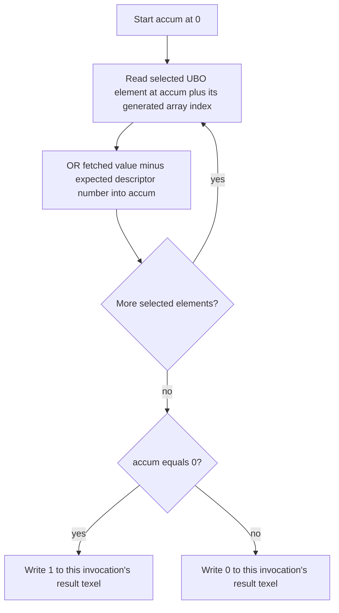

## Overview

**Core question:** Do descriptor layouts, updates, and shader accesses preserve the value assigned to each descriptor across randomized multi-set layouts and indexing modes?

- [`vktBindingDescriptorSetRandomTests.cpp`](../../../modules/vulkan/binding_model/vktBindingDescriptorSetRandomTests.cpp) implements the `binding_model.descriptorset_random` test family.
- For each executable leaf, the test uses registered limits and an internal seed to generate descriptor-set layouts, resources, shader declarations, access expressions, and stage-specific execution.
- The shader compares descriptor reads with a global descriptor number. The host also checks selected shader writes, so one case can expose incorrect layout creation, allocation, updating, binding, indexing, execution, or readback.

## Background Knowledge

For the shared concepts of descriptor interfaces and active descriptor state, see [Background Knowledge](../../categories/binding_model.md#background-knowledge) of the `binding_model` page.

- **Update-after-bind.** After the host binds a descriptor set, it can update an eligible binding with `VK_DESCRIPTOR_BINDING_UPDATE_AFTER_BIND_BIT`, subject to the descriptor indexing rules. The matching layout and pool flags permit that update model ([descriptor binding flag semantics](../../../../vulkan-docs/src/chapters/descriptorsets.adoc#L753-L816)).
- **Variable descriptor counts.** A layout can declare an upper bound for its last eligible binding while allocation chooses the count available in a particular set. Shader accesses must stay within the allocated count ([descriptor binding flag semantics](../../../../vulkan-docs/src/chapters/descriptorsets.adoc#L753-L816)).

## Registration Hierarchy

```text
binding_model.descriptorset_random
├── sets4
├── sets8
├── sets16
└── sets32
```

Under each set-count intermediate node, registration iterates the same dimensions: indexing mode, UBO limit, SSBO limit, sampled-image limit, storage-image and storage-texel-buffer limit, inline-uniform-block limit, update-after-bind choice, shader stage, input-attachment limit, and the test case leaf ([registration loops](../../../modules/vulkan/binding_model/vktBindingDescriptorSetRandomTests.cpp#L3290-L3435)).

## Parameter Dimensions and Observed Values

The current `vk-default` mustpass list contains 35,148 executable leaves. `sets4` contains 14,106; `sets8`, `sets16`, and `sets32` contain 7,014 each.

| Dimension | Registered values | Meaning in this test | Evidence |
|-----------|-------------------|----------------------|----------|
| Descriptor-set count | `sets4`, `sets8`, `sets16`, `sets32` | Changes the number of set layouts in the pipeline layout while keeping the binding workload roughly fixed. | [`setsCases`](../../../modules/vulkan/binding_model/vktBindingDescriptorSetRandomTests.cpp#L3162-L3171) |
| Descriptor indexing mode | `noarray`, `constant`, `unifindexed`, `dynindexed`, `runtimesize` | Changes descriptor declaration shape and the expression used for each selected access. | [`indexCases`](../../../modules/vulkan/binding_model/vktBindingDescriptorSetRandomTests.cpp#L3173-L3184) |
| UBO limit | `noubo`, `ubolimitlow`, `ubolimithigh` | Allows 0, 12, or 4096 uniform-buffer descriptors before support and device-limit pruning. | [`uboCases`](../../../modules/vulkan/binding_model/vktBindingDescriptorSetRandomTests.cpp#L3186-L3193) |
| SSBO limit | `nosbo`, `sbolimitlow`, `sbolimithigh` | Allows 0, 4, or 4096 storage-buffer descriptors. Some generated SSBO descriptors become shader-write targets. | [`sboCases`](../../../modules/vulkan/binding_model/vktBindingDescriptorSetRandomTests.cpp#L3195-L3202) |
| Sampled-image limit | `nosampledimg`, `sampledimglow`, `sampledimghigh` | Allows 0, 16, or 4096 uniform texel-buffer descriptors in this generator. | [`sampledImgCases`](../../../modules/vulkan/binding_model/vktBindingDescriptorSetRandomTests.cpp#L3213-L3220) |
| Storage image and texel-buffer limit | `outimgonly`, `outimgtexlow`, `lowimgnotex`, `lowimgsingletex`, `storageimghigh` | Keeps the result image and varies extra storage images and storage texel buffers. | [`sImgTexCases`](../../../modules/vulkan/binding_model/vktBindingDescriptorSetRandomTests.cpp#L3222-L3238) |
| Inline uniform blocks | `noiub`, `iublimitlow`, `iublimithigh` | Selects no inline blocks, 4 blocks of up to 256 bytes, or 8 blocks of up to 4096 bytes. | [`iubCases`](../../../modules/vulkan/binding_model/vktBindingDescriptorSetRandomTests.cpp#L3240-L3252) |
| Update after bind | `nouab`, `uab` | Disables random update-after-bind selection or lets eligible generated bindings receive it when supported. | [`uabCases`](../../../modules/vulkan/binding_model/vktBindingDescriptorSetRandomTests.cpp#L3283-L3288), [binding selection](../../../modules/vulkan/binding_model/vktBindingDescriptorSetRandomTests.cpp#L1545-L1586) |
| Shader stage | `comp`, `frag`, `vert`, `rgnv`, `rgen`, `sect`, `ahit`, `chit`, `miss`, `call`, `task`, `mesh` | Chooses the pipeline and shader stage that performs the descriptor checks. Vulkan SC registers only `comp`, `frag`, and `vert`. | [`stageCases`](../../../modules/vulkan/binding_model/vktBindingDescriptorSetRandomTests.cpp#L3254-L3281) |
| Input attachments | `noia`, `ialimitlow`, `ialimithigh` | Allows 0, 4, or 64 input attachments. Nonzero values appear only under `frag`. | [`iaCases`](../../../modules/vulkan/binding_model/vktBindingDescriptorSetRandomTests.cpp#L3204-L3211), [fragment-only rule](../../../modules/vulkan/binding_model/vktBindingDescriptorSetRandomTests.cpp#L3326-L3330) |
| Test case leaf | `0`; selected low-limit `sets4` combinations use `0` through `9` | Selects one deterministic generated layout. The visible leaf number is local to its parameter combination; source assigns a separate monotonically increasing internal seed. | [seed construction](../../../modules/vulkan/binding_model/vktBindingDescriptorSetRandomTests.cpp#L3375-L3414) |

## Behavior Parameters

The primary behavioral axis is the descriptor indexing mode, the first intermediate node under each `sets*` value. It changes the shader declaration and access expression. Other dimensions change scale, resource mix, stage, or update conditions around that access.

### `noarray`: Scalar descriptor declarations

The generator emits scalar descriptor declarations. The shader reads or writes each resource without an array subscript, which isolates binding and descriptor delivery from descriptor-array indexing.

### `constant`: Literal descriptor-array indexes

The generator can emit arrays, and each selected access uses a literal index such as `[3]`. This checks fixed descriptor-array element selection.

### `unifindexed`: Push-constant-driven indexes

The shader declares `pc.identity[32]`, and the host supplies identity values through push constants. Each array access uses `pc.identity[ai]`, which makes the selected index uniform at run time. Literal indexes appear in `constant` cases.

### `dynindexed`: Dependent dynamically uniform indexes

Each selected array access uses `accum + ai`. Correct descriptor values keep `accum` at zero. A bad read changes later indexes and the final pass value. The expression stays dynamically uniform because all invocations follow the same descriptor-dependent chain when reads are correct.

### `runtimesize`: Runtime-sized descriptor arrays

The shader emits unsized arrays and uses the same dependent index form as `dynindexed`. The generator can mark the last eligible binding as variable count, records its allocation size, and omits shader checks outside that allocated range.

## Shader Analysis

A compute case exposes the common generated contract without stage-specific ray tracing or graphics scaffolding. It uses four descriptor sets and dependent indexing. The deterministic internal seed produces a small layout that remains readable in full.

### Representative Shader Walkthrough 1

#### Parameter Values Chosen

Representative path:

```text
dEQP-VK.binding_model.descriptorset_random.sets4.dynindexed.ubolimitlow.nosbo.nosampledimg.outimgonly.noiub.uab.comp.noia.0
```

| Parameter choice | Meaning in this representative case |
|------------------|-------------------------------------|
| `sets4.dynindexed` | Generates four set layouts and dependent dynamically uniform UBO-array indexes. |
| `ubolimitlow.nosbo.nosampledimg.outimgonly.noiub` | Allows 12 UBO descriptors and only the fixed output storage image among the other randomized descriptor classes. |
| `uab.comp.noia` | Allows eligible update-after-bind selection, runs the checks in a compute shader, and uses no input attachments. |
| `0` | Names the first local leaf for this parameter combination. Its source-assigned internal seed is `7512`. |

#### Purpose

The host layout uses `VK_DESCRIPTOR_TYPE_STORAGE_IMAGE` for the result and `VK_DESCRIPTOR_TYPE_UNIFORM_BUFFER` for the three UBO arrays. The shader compares nine selected array elements across sets 1, 2, and 3 with their global descriptor numbers. Each of 64 compute invocations records whether the complete dependent access chain stayed correct.

#### Structural Design



#### Shader Code

```glsl
#version 450 core
#extension GL_EXT_nonuniform_qualifier : enable
/// Set 0 binding 0 is the fixed r32i output image. Each of the 64 compute invocations writes one pass or fail texel.
layout(r32i, set = 0, binding = 0) uniform iimage2D simage0_0;
/// These UBO arrays occupy three randomly selected bindings across descriptor sets 1, 2, and 3.
/// The host stores each descriptor's global descriptor number in the referenced buffer range.
layout(set = 1, binding = 0) uniform ubodef1_0 { int val; } ubo1_0[6];
layout(set = 2, binding = 10) uniform ubodef2_10 { int val; } ubo2_10[1];
layout(set = 3, binding = 0) uniform ubodef3_0 { int val; } ubo3_0[5];
/// A dispatch of 8 by 8 workgroups with one invocation each covers the 8 by 8 output image.
layout(local_size_x = 1, local_size_y = 1) in;
void main()
{
  const int invocationID = int(gl_GlobalInvocationID.y) * 8 + int(gl_GlobalInvocationID.x);
  int accum = 0, temp;
  /// Each access uses the accumulated result as part of a dynamically uniform index.
  /// Correct values keep accum at zero; any mismatch makes this invocation write a fail texel.
  temp = ubo1_0[accum + 0].val;
  accum |= temp - 1;
  temp = ubo1_0[accum + 1].val;
  accum |= temp - 2;
  temp = ubo1_0[accum + 2].val;
  accum |= temp - 3;
  temp = ubo1_0[accum + 5].val;
  accum |= temp - 6;
  temp = ubo2_10[accum + 0].val;
  accum |= temp - 7;
  temp = ubo3_0[accum + 0].val;
  accum |= temp - 8;
  temp = ubo3_0[accum + 1].val;
  accum |= temp - 9;
  temp = ubo3_0[accum + 2].val;
  accum |= temp - 10;
  temp = ubo3_0[accum + 4].val;
  accum |= temp - 12;
  ivec4 color = (accum != 0) ? ivec4(0,0,0,0) : ivec4(1,0,0,1);
  imageStore(simage0_0, ivec2(gl_GlobalInvocationID.xy), color);
}
```

#### Additional Info

- The CTS `deRandom` replay with internal seed `7512` produces 7, 18, 16, and 29 binding slots for sets 0 through 3. Only the four declarations shown above have nonzero descriptor counts.
- The registered `uab` choice makes eligible bindings candidates for update-after-bind. This generated layout has no update-after-bind binding, so its shader walkthrough focuses on the `dynindexed` access path.
- [`initPrograms`](../../../modules/vulkan/binding_model/vktBindingDescriptorSetRandomTests.cpp#L832-L841) requests `SPIRV_VERSION_1_4`. The CCVDO run compiled the annotated GLSL, validated the binary with the matching SPIR-V environment, and disassembled it without edits.

#### Parameter Variation Summary

| Parameter dimension | Shader-level variation from this shader | Evidence |
|---------------------|---------------------------------------|----------|
| Indexing mode | Removes arrays, uses literal indexes, reads identity indexes from push constants, or emits unsized arrays. | [declarations and index construction](../../../modules/vulkan/binding_model/vktBindingDescriptorSetRandomTests.cpp#L864-L1006) |
| Resource limits and seed | Changes which bindings survive with nonzero counts, their descriptor types, array sizes, and selected read or write checks. | [`generateRandomLayout`](../../../modules/vulkan/binding_model/vktBindingDescriptorSetRandomTests.cpp#L512-L788), [`CheckDecider`](../../../modules/vulkan/binding_model/vktBindingDescriptorSetRandomTests.cpp#L790-L830) |
| Shader stage | Wraps the same generated declarations and checks in compute, graphics, ray tracing, task, or mesh stage code. | [stage shader generation](../../../modules/vulkan/binding_model/vktBindingDescriptorSetRandomTests.cpp#L1102-L1448) |
| Writable descriptors | Replaces a selected read and comparison with a single-invocation write of that descriptor's number. | [generated write checks](../../../modules/vulkan/binding_model/vktBindingDescriptorSetRandomTests.cpp#L1011-L1080) |

#### SPIR-V

- Status: generated and validated
- Source: reconstructed `GLSL` from this walkthrough
- Stage: `comp`
- Target SPIRV version: `spirv1.4`

<details>
<summary>Click to expand SPIRV asm code</summary>

```llvm
; SPIR-V
; Version: 1.4
; Generator: Khronos Glslang Reference Front End; 11
; Bound: 145
; Schema: 0
               OpCapability Shader
          %1 = OpExtInstImport "GLSL.std.450"
               OpMemoryModel Logical GLSL450
               OpEntryPoint GLCompute %main "main" %gl_GlobalInvocationID %ubo1_0 %ubo2_10 %ubo3_0 %simage0_0
               OpExecutionMode %main LocalSize 1 1 1
               OpSource GLSL 450
               OpSourceExtension "GL_EXT_nonuniform_qualifier"
               OpName %main "main"
               OpName %invocationID "invocationID"
               OpName %gl_GlobalInvocationID "gl_GlobalInvocationID"
               OpName %accum "accum"
               OpName %temp "temp"
               OpName %ubodef1_0 "ubodef1_0"
               OpMemberName %ubodef1_0 0 "val"
               OpName %ubo1_0 "ubo1_0"
               OpName %ubodef2_10 "ubodef2_10"
               OpMemberName %ubodef2_10 0 "val"
               OpName %ubo2_10 "ubo2_10"
               OpName %ubodef3_0 "ubodef3_0"
               OpMemberName %ubodef3_0 0 "val"
               OpName %ubo3_0 "ubo3_0"
               OpName %color "color"
               OpName %simage0_0 "simage0_0"
               OpDecorate %gl_GlobalInvocationID BuiltIn GlobalInvocationId
               OpDecorate %ubodef1_0 Block
               OpMemberDecorate %ubodef1_0 0 Offset 0
               OpDecorate %ubo1_0 Binding 0
               OpDecorate %ubo1_0 DescriptorSet 1
               OpDecorate %ubodef2_10 Block
               OpMemberDecorate %ubodef2_10 0 Offset 0
               OpDecorate %ubo2_10 Binding 10
               OpDecorate %ubo2_10 DescriptorSet 2
               OpDecorate %ubodef3_0 Block
               OpMemberDecorate %ubodef3_0 0 Offset 0
               OpDecorate %ubo3_0 Binding 0
               OpDecorate %ubo3_0 DescriptorSet 3
               OpDecorate %simage0_0 Binding 0
               OpDecorate %simage0_0 DescriptorSet 0
               OpDecorate %gl_WorkGroupSize BuiltIn WorkgroupSize
       %void = OpTypeVoid
          %3 = OpTypeFunction %void
        %int = OpTypeInt 32 1
%_ptr_Function_int = OpTypePointer Function %int
       %uint = OpTypeInt 32 0
     %v3uint = OpTypeVector %uint 3
%_ptr_Input_v3uint = OpTypePointer Input %v3uint
%gl_GlobalInvocationID = OpVariable %_ptr_Input_v3uint Input
     %uint_1 = OpConstant %uint 1
%_ptr_Input_uint = OpTypePointer Input %uint
      %int_8 = OpConstant %int 8
     %uint_0 = OpConstant %uint 0
      %int_0 = OpConstant %int 0
  %ubodef1_0 = OpTypeStruct %int
     %uint_6 = OpConstant %uint 6
%_arr_ubodef1_0_uint_6 = OpTypeArray %ubodef1_0 %uint_6
%_ptr_Uniform__arr_ubodef1_0_uint_6 = OpTypePointer Uniform %_arr_ubodef1_0_uint_6
     %ubo1_0 = OpVariable %_ptr_Uniform__arr_ubodef1_0_uint_6 Uniform
%_ptr_Uniform_int = OpTypePointer Uniform %int
      %int_1 = OpConstant %int 1
      %int_2 = OpConstant %int 2
      %int_3 = OpConstant %int 3
      %int_5 = OpConstant %int 5
      %int_6 = OpConstant %int 6
 %ubodef2_10 = OpTypeStruct %int
%_arr_ubodef2_10_uint_1 = OpTypeArray %ubodef2_10 %uint_1
%_ptr_Uniform__arr_ubodef2_10_uint_1 = OpTypePointer Uniform %_arr_ubodef2_10_uint_1
    %ubo2_10 = OpVariable %_ptr_Uniform__arr_ubodef2_10_uint_1 Uniform
      %int_7 = OpConstant %int 7
  %ubodef3_0 = OpTypeStruct %int
     %uint_5 = OpConstant %uint 5
%_arr_ubodef3_0_uint_5 = OpTypeArray %ubodef3_0 %uint_5
%_ptr_Uniform__arr_ubodef3_0_uint_5 = OpTypePointer Uniform %_arr_ubodef3_0_uint_5
     %ubo3_0 = OpVariable %_ptr_Uniform__arr_ubodef3_0_uint_5 Uniform
      %int_9 = OpConstant %int 9
     %int_10 = OpConstant %int 10
      %int_4 = OpConstant %int 4
     %int_12 = OpConstant %int 12
      %v4int = OpTypeVector %int 4
%_ptr_Function_v4int = OpTypePointer Function %v4int
       %bool = OpTypeBool
        %131 = OpConstantComposite %v4int %int_0 %int_0 %int_0 %int_0
        %132 = OpConstantComposite %v4int %int_1 %int_0 %int_0 %int_1
        %134 = OpTypeImage %int 2D 0 0 0 2 R32i
%_ptr_UniformConstant_134 = OpTypePointer UniformConstant %134
  %simage0_0 = OpVariable %_ptr_UniformConstant_134 UniformConstant
     %v2uint = OpTypeVector %uint 2
      %v2int = OpTypeVector %int 2
%gl_WorkGroupSize = OpConstantComposite %v3uint %uint_1 %uint_1 %uint_1
       %main = OpFunction %void None %3
          %5 = OpLabel
%invocationID = OpVariable %_ptr_Function_int Function
      %accum = OpVariable %_ptr_Function_int Function
       %temp = OpVariable %_ptr_Function_int Function
      %color = OpVariable %_ptr_Function_v4int Function
         %15 = OpAccessChain %_ptr_Input_uint %gl_GlobalInvocationID %uint_1
         %16 = OpLoad %uint %15
         %17 = OpBitcast %int %16
         %19 = OpIMul %int %17 %int_8
         %21 = OpAccessChain %_ptr_Input_uint %gl_GlobalInvocationID %uint_0
         %22 = OpLoad %uint %21
         %23 = OpBitcast %int %22
         %24 = OpIAdd %int %19 %23
               OpStore %invocationID %24
               OpStore %accum %int_0
         %33 = OpLoad %int %accum
         %34 = OpIAdd %int %33 %int_0
         %36 = OpAccessChain %_ptr_Uniform_int %ubo1_0 %34 %int_0
         %37 = OpLoad %int %36
               OpStore %temp %37
         %38 = OpLoad %int %temp
         %40 = OpISub %int %38 %int_1
         %41 = OpLoad %int %accum
         %42 = OpBitwiseOr %int %41 %40
               OpStore %accum %42
         %43 = OpLoad %int %accum
         %44 = OpIAdd %int %43 %int_1
         %45 = OpAccessChain %_ptr_Uniform_int %ubo1_0 %44 %int_0
         %46 = OpLoad %int %45
               OpStore %temp %46
         %47 = OpLoad %int %temp
         %49 = OpISub %int %47 %int_2
         %50 = OpLoad %int %accum
         %51 = OpBitwiseOr %int %50 %49
               OpStore %accum %51
         %52 = OpLoad %int %accum
         %53 = OpIAdd %int %52 %int_2
         %54 = OpAccessChain %_ptr_Uniform_int %ubo1_0 %53 %int_0
         %55 = OpLoad %int %54
               OpStore %temp %55
         %56 = OpLoad %int %temp
         %58 = OpISub %int %56 %int_3
         %59 = OpLoad %int %accum
         %60 = OpBitwiseOr %int %59 %58
               OpStore %accum %60
         %61 = OpLoad %int %accum
         %63 = OpIAdd %int %61 %int_5
         %64 = OpAccessChain %_ptr_Uniform_int %ubo1_0 %63 %int_0
         %65 = OpLoad %int %64
               OpStore %temp %65
         %66 = OpLoad %int %temp
         %68 = OpISub %int %66 %int_6
         %69 = OpLoad %int %accum
         %70 = OpBitwiseOr %int %69 %68
               OpStore %accum %70
         %75 = OpLoad %int %accum
         %76 = OpIAdd %int %75 %int_0
         %77 = OpAccessChain %_ptr_Uniform_int %ubo2_10 %76 %int_0
         %78 = OpLoad %int %77
               OpStore %temp %78
         %79 = OpLoad %int %temp
         %81 = OpISub %int %79 %int_7
         %82 = OpLoad %int %accum
         %83 = OpBitwiseOr %int %82 %81
               OpStore %accum %83
         %89 = OpLoad %int %accum
         %90 = OpIAdd %int %89 %int_0
         %91 = OpAccessChain %_ptr_Uniform_int %ubo3_0 %90 %int_0
         %92 = OpLoad %int %91
               OpStore %temp %92
         %93 = OpLoad %int %temp
         %94 = OpISub %int %93 %int_8
         %95 = OpLoad %int %accum
         %96 = OpBitwiseOr %int %95 %94
               OpStore %accum %96
         %97 = OpLoad %int %accum
         %98 = OpIAdd %int %97 %int_1
         %99 = OpAccessChain %_ptr_Uniform_int %ubo3_0 %98 %int_0
        %100 = OpLoad %int %99
               OpStore %temp %100
        %101 = OpLoad %int %temp
        %103 = OpISub %int %101 %int_9
        %104 = OpLoad %int %accum
        %105 = OpBitwiseOr %int %104 %103
               OpStore %accum %105
        %106 = OpLoad %int %accum
        %107 = OpIAdd %int %106 %int_2
        %108 = OpAccessChain %_ptr_Uniform_int %ubo3_0 %107 %int_0
        %109 = OpLoad %int %108
               OpStore %temp %109
        %110 = OpLoad %int %temp
        %112 = OpISub %int %110 %int_10
        %113 = OpLoad %int %accum
        %114 = OpBitwiseOr %int %113 %112
               OpStore %accum %114
        %115 = OpLoad %int %accum
        %117 = OpIAdd %int %115 %int_4
        %118 = OpAccessChain %_ptr_Uniform_int %ubo3_0 %117 %int_0
        %119 = OpLoad %int %118
               OpStore %temp %119
        %120 = OpLoad %int %temp
        %122 = OpISub %int %120 %int_12
        %123 = OpLoad %int %accum
        %124 = OpBitwiseOr %int %123 %122
               OpStore %accum %124
        %128 = OpLoad %int %accum
        %130 = OpINotEqual %bool %128 %int_0
        %133 = OpSelect %v4int %130 %131 %132
               OpStore %color %133
        %137 = OpLoad %134 %simage0_0
        %139 = OpLoad %v3uint %gl_GlobalInvocationID
        %140 = OpVectorShuffle %v2uint %139 %139 0 1
        %142 = OpBitcast %v2int %140
        %143 = OpLoad %v4int %color
               OpImageWrite %137 %142 %143 SignExtend
               OpReturn
               OpFunctionEnd
```

</details>

## Runtime Execution and Result Checking

- The test replays the internal seed used during shader generation, then creates each generated descriptor-set layout. It applies variable-count and update-after-bind flags where the generated binding and device support permit them.
- It creates descriptor pools and sets, one pipeline layout containing all 4, 8, 16, or 32 set layouts, and the stage-specific pipeline. The test creates buffer, image, texel-buffer, input-attachment, inline-uniform-block, and acceleration-structure resources when the generated case needs them.
- Each readable descriptor receives its global descriptor number. Before binding each set, the host writes ordinary descriptors. It calls `vkCmdBindDescriptorSets`, then writes bindings selected for update-after-bind.
- The host clears the 8 by 8 result image, inserts barriers around shader access, and runs the selected stage. Compute dispatches 8 by 8 one-invocation workgroups. Graphics, mesh, and ray-tracing variants produce the same 64 logical results through their stage-specific launch path.
- The host copies the result image and writable storage images to host-visible buffers, waits for completion, and invalidates the mapped ranges. All 64 result texels must equal 1. Each generated shader-write target must contain its expected descriptor number.
- The case passes when the combined failure count is zero. Result-image mismatches log `Failure in copy buffer`; write-target mismatches log `Failure in write operation` ([verification](../../../modules/vulkan/binding_model/vktBindingDescriptorSetRandomTests.cpp#L3108-L3145)).

## Failure Meaning

A failed case identifies a mismatch in the registered descriptor-access contract. Its full path, internal seed, generated layout, and failure log help narrow the investigation, but the result alone does not assign the fault to a particular implementation layer.

### Failure Cause Mapping

| If this behavior parameter value fails | Possible failure cause(s) |
|----------------------------------------|---------------------------|
| `noarray` | Scalar descriptor layout, update, or binding mismatch. |
| `constant` | Constant-index descriptor-array access failure. |
| `unifindexed` | Push-constant-driven descriptor-array access failure. |
| `dynindexed` | Dependent dynamically uniform descriptor-array access failure. |
| `runtimesize` | Runtime-sized or variable-count descriptor-array failure. |

A failure in any value can also come from the shared descriptor-resource setup, execution, synchronization, or readback path.

### Cause Analysis

#### Scalar descriptor layout, update, or binding mismatch

**Possible failure symptoms:** one or more result texels contain 0, or a writable descriptor retains the initialization value instead of its expected descriptor number. Failures occur in `noarray` while comparable array cases may pass.

**Possible implementation causes:** the implementation may create the wrong binding type or count, associate the shader's `DescriptorSet` and `Binding` decorations with the wrong API binding, consume stale descriptor contents, or bind a descriptor set against the wrong pipeline-layout slot.

#### Constant-index descriptor-array access failure

**Possible failure symptoms:** failures follow `constant` and may repeat for one descriptor type, array size, binding, set, shader stage, or selected literal element.

**Possible implementation causes:** descriptor-array layout or shader lowering may select the wrong element for a literal index, calculate the wrong resource address, or apply an incorrect descriptor count or range.

#### Push-constant-driven descriptor-array access failure

**Possible failure symptoms:** `unifindexed` fails while the corresponding literal-index path passes. Result texels show that one or more identity-driven accesses returned the wrong descriptor value.

**Possible implementation causes:** the implementation may deliver the wrong push-constant bytes or range, lower `pc.identity[ai]` incorrectly, or use the resulting index to select the wrong descriptor-array element.

#### Dependent dynamically uniform descriptor-array access failure

**Possible failure symptoms:** `dynindexed` reports 0 in one or more result texels. A first bad read can also redirect later dependent accesses because each index includes `accum`.

**Possible implementation causes:** dynamic descriptor indexing may select the wrong element, or shader compilation may lower the dependent index and descriptor access incorrectly. A failure can also begin with an ordinary descriptor delivery error and then spread through the deliberate dependency chain.

#### Runtime-sized or variable-count descriptor-array failure

**Possible failure symptoms:** `runtimesize` fails while a fixed-size dependent-index case with a similar resource mix passes. Failures may correlate with the final binding in a set or a reduced allocated count.

**Possible implementation causes:** the implementation may mishandle an unsized shader declaration, ignore the allocated variable descriptor count, expose the wrong elements, or lower a legal in-range access incorrectly. The generator omits accesses beyond the allocated count, so an out-of-range check generated by the test is not the expected cause.

#### Shared descriptor-resource, execution, synchronization, or readback failure

**Possible failure symptoms:** several indexing modes fail for the same descriptor type, set count, stage, update-after-bind choice, or seed. Result texels may stay at the clear value, and writable resources may keep their initialization values.

**Possible implementation causes:** shared resource initialization, descriptor writes, update-after-bind handling, pipeline setup, command execution, image or buffer barriers, transfer copies, or host cache invalidation may make correct shader results unavailable to the final scan. Compare the failing matrix coordinates and both failure log forms before choosing one path for source-level investigation.

## Case Pruning

### Requirement-based pruning

- The selected set count must not exceed `maxBoundDescriptorSets`, and requested per-stage descriptor totals must fit the applicable device limits. Unsupported cases raise `NotSupportedError` before execution.
- `unifindexed`, `dynindexed`, and `runtimesize` require the descriptor-type-specific dynamic indexing features used by the case. `runtimesize` also requires `runtimeDescriptorArray` ([support checks](../../../modules/vulkan/binding_model/vktBindingDescriptorSetRandomTests.cpp#L416-L475)).
- Vertex-pipeline stages that write the result image require `vertexPipelineStoresAndAtomics`. Ray-tracing, task, and mesh stages require their corresponding extensions and features.
- Inline-uniform-block cases require `VK_EXT_inline_uniform_block`, `inlineUniformBlock`, and sufficient block count and size limits.

### Design-based pruning

- Nonzero input-attachment limits appear only with `frag`.
- The registration matrix keeps configurations with at most one high resource limit, plus configurations with all five high limits. It also retains selected zero-limit patterns without enumerating the full sparse product.
- Registration omits multiple storage images for `noarray` and `constant`. Those modes also omit combinations with no UBOs, SSBOs, or sampled images.
- Selected low-limit `sets4` combinations use 10 test case leaves; all other combinations use one. A combination with no optional descriptors uses one seed.
- Update-after-bind generation excludes dynamic buffer descriptor types because the test does not mix those types with update-after-bind bindings in one set ([layout generation](../../../modules/vulkan/binding_model/vktBindingDescriptorSetRandomTests.cpp#L560-L561)).

## Key Takeaways

- Each executable leaf combines registered limits and a deterministic internal seed into a concrete multi-set layout, shader interface, descriptor update sequence, and host-visible check.
- Descriptor indexing mode is the main behavior change: scalar access, literal array access, push-constant indexing, dependent dynamic indexing, or runtime-sized arrays.
- A global descriptor number links host initialization, shader reads or writes, and final validation. The 64-texel result image reports read-chain success; selected writable descriptors provide a second check.
- The exact path and seed matter when diagnosing a failure because other dimensions and random generation determine the resources, bindings, stage, and update conditions around the indexing mode. See `Failure Meaning` for the corresponding causes.

## Source Reference Appendix

| Entry point | Link | Why it matters |
|-------------|------|----------------|
| Support checks | [`DescriptorSetRandomTestCase::checkSupport`](../../../modules/vulkan/binding_model/vktBindingDescriptorSetRandomTests.cpp#L347-L477) | Gates stages, indexing modes, set count, descriptor limits, and inline uniform blocks. |
| Random layout generation | [`generateRandomLayout`](../../../modules/vulkan/binding_model/vktBindingDescriptorSetRandomTests.cpp#L512-L788) | Chooses binding counts, types, arrays, write targets, and variable descriptor counts. |
| Shader generation | [`DescriptorSetRandomTestCase::initPrograms`](../../../modules/vulkan/binding_model/vktBindingDescriptorSetRandomTests.cpp#L832-L1449) | Emits declarations, indexing expressions, checks, stage wrappers, and the SPIR-V 1.4 build target. |
| Runtime setup and descriptor updates | [`DescriptorSetRandomTestInstance::iterate`](../../../modules/vulkan/binding_model/vktBindingDescriptorSetRandomTests.cpp#L1472-L2492) | Creates resources, allocates sets, writes descriptor data, binds sets, and applies update-after-bind writes. |
| Execution and verification | [command recording and final checks](../../../modules/vulkan/binding_model/vktBindingDescriptorSetRandomTests.cpp#L2946-L3145) | Runs the selected stage, copies results, and computes the failure count. |
| Registration matrix | [`createDescriptorSetRandomTests`](../../../modules/vulkan/binding_model/vktBindingDescriptorSetRandomTests.cpp#L3150-L3435) | Defines the exact hierarchy, values, pruning rules, test case leaf names, and internal seed order. |
| Representative mustpass leaf | [`binding-model.txt`](../../../mustpass/main/vk-default/binding-model.txt#L28091) | Confirms the exact executable path used in the shader walkthrough. |
| Descriptor layout and indexing rules | [`descriptorsets.adoc`](../../../../vulkan-docs/src/chapters/descriptorsets.adoc#descriptors-sets) | Defines descriptor-set layouts, pipeline layouts, update-after-bind, and variable descriptor counts. |
