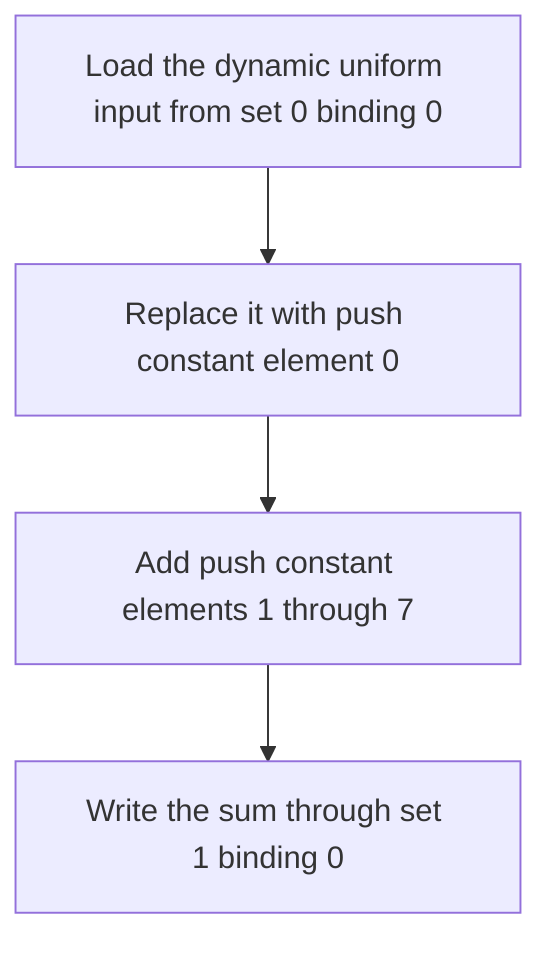

## Overview

**Core question:** Do dynamic buffer offsets keep selecting the intended regions when descriptor and push-constant state crosses a pipeline change?

- [`vktBindingDynamicOffsetTests.cpp`](../../../modules/vulkan/binding_model/vktBindingDynamicOffsetTests.cpp) implements the `binding_model.dynamic_offset` test family with 14 executable leaves: 2 loaded Amber scripts and 12 generated compute cases.
- The Amber leaves reuse one shader program across two pipeline descriptions with different descriptor layouts and dynamic offsets.
- The generated `two_pipelines*` cases combine shared or different pipeline layouts, one or two descriptor sets, early or late push-constant updates, and shared or separate dynamic offsets. The host compares the complete output buffer with an expected byte layout.

## Background Knowledge

For the shared concepts of descriptor interfaces and pipeline layouts, see [Background Knowledge](../../categories/binding_model.md#background-knowledge) of the `binding_model` page.

- **Dynamic buffer descriptors.** A descriptor update supplies a base offset and range. `vkCmdBindDescriptorSets` adds the matching dynamic offset. Vulkan consumes the offset list by set number, then binding number, then array element ([dynamic offset order and effective address](../../../../vulkan-docs/src/chapters/descriptorsets.adoc#L4627-L4643)). Uniform and storage dynamic offsets must meet their respective device alignment limits ([dynamic-offset valid usage](../../../../vulkan-docs/src/chapters/commonvalidity/bind_descriptor_sets_common.adoc#L14-L35)).
- **Pipeline-layout compatibility.** A pipeline layout combines descriptor-set layouts and push-constant ranges. Compatibility for set N requires identically defined set layouts through N and identical push-constant ranges. Compatible descriptor bindings can survive a pipeline change; incompatible bindings may be disturbed ([Pipeline Layout Compatibility](../../../../vulkan-docs/src/chapters/descriptorsets.adoc#L2021-L2055)).
- **Push-constant state.** Push constants belong to command-buffer state. Binding an incompatible pipeline does not erase their values, but a dispatch that reads them must use a layout compatible with the layout used for the update ([Push Constant Updates](../../../../vulkan-docs/src/chapters/descriptorsets.adoc#L5156-L5208)).

## Registration Hierarchy

```text
binding_model.dynamic_offset
├── shader_reuse_differing_layout_compute
├── shader_reuse_differing_layout_graphics
├── two_pipelines
├── two_pipelines_different_sets
├── two_pipelines_pc_first
├── two_pipelines_pc_first_different_sets
├── two_pipelines_pc_first_single_layout
├── two_pipelines_separate_offsets
├── two_pipelines_separate_offsets_different_sets
├── two_pipelines_separate_offsets_pc_first
├── two_pipelines_separate_offsets_pc_first_different_sets
├── two_pipelines_separate_offsets_pc_first_single_layout
├── two_pipelines_separate_offsets_single_layout
└── two_pipelines_single_layout
```

The current `vk-default` mustpass file lists all 14 leaves together ([mustpass entries](../../../mustpass/main/vk-default/binding-model.txt#L46169-L46182)). The category dispatcher excludes this test family from Vulkan SC registration ([category registration](../../../modules/vulkan/binding_model/vktBindingModelTests.cpp#L41-L68)).

## Parameter Dimensions and Observed Values

The two Amber leaves are fixed scripts. The C++ registration loop generates the other leaves from four Boolean dimensions and removes four incompatible combinations.

| Dimension | Registered values | Meaning in this test | Evidence |
|-----------|-------------------|----------------------|----------|
| Execution path | `shader_reuse_differing_layout_compute`, `shader_reuse_differing_layout_graphics`, `two_pipelines*` | Chooses an Amber compute flow, an Amber graphics flow, or the generated two-dispatch compute flow. | [Amber registration and matrix loop](../../../modules/vulkan/binding_model/vktBindingDynamicOffsetTests.cpp#L388-L418) |
| `separateOffsets` | `false`, `true` | Keeps both generated dispatches on the second aligned buffer item, or doubles the second dispatch's uniform and storage offsets. | [offset construction](../../../modules/vulkan/binding_model/vktBindingDynamicOffsetTests.cpp#L297-L315) |
| `pcFirst` | `false`, `true` | Updates push constants near the consuming dispatch, or before any descriptor or pipeline binding. | [command ordering](../../../modules/vulkan/binding_model/vktBindingDynamicOffsetTests.cpp#L316-L337) |
| `singleLayout` | `false`, `true` | Gives pipeline0 its layout without push constants, or gives both pipelines the layout with the push-constant range. | [layout selection](../../../modules/vulkan/binding_model/vktBindingDynamicOffsetTests.cpp#L240-L259) |
| `differentSets` | `false`, `true` | Places `comp1` output at set 0 binding 1, or at set 1 binding 0 and binds both sets for its dispatch. | [shader specialization](../../../modules/vulkan/binding_model/vktBindingDynamicOffsetTests.cpp#L122-L147), [descriptor setup](../../../modules/vulkan/binding_model/vktBindingDynamicOffsetTests.cpp#L225-L292) |

| Generated test name | `separateOffsets` | `pcFirst` | `singleLayout` | `differentSets` |
|---------------------|:-----------------:|:---------:|:--------------:|:---------------:|
| `two_pipelines` | false | false | false | false |
| `two_pipelines_different_sets` | false | false | false | true |
| `two_pipelines_single_layout` | false | false | true | false |
| `two_pipelines_pc_first` | false | true | false | false |
| `two_pipelines_pc_first_different_sets` | false | true | false | true |
| `two_pipelines_pc_first_single_layout` | false | true | true | false |
| `two_pipelines_separate_offsets` | true | false | false | false |
| `two_pipelines_separate_offsets_different_sets` | true | false | false | true |
| `two_pipelines_separate_offsets_single_layout` | true | false | true | false |
| `two_pipelines_separate_offsets_pc_first` | true | true | false | false |
| `two_pipelines_separate_offsets_pc_first_different_sets` | true | true | false | true |
| `two_pipelines_separate_offsets_pc_first_single_layout` | true | true | true | false |

## Behavior Parameters

The primary behavioral axis is the execution-flow behavioral group. The two Amber leaves each define a fixed pipeline-reuse flow. The `two_pipelines*` leaves form one generated flow whose suffixes select state-ordering and layout variants.

### `shader_reuse_differing_layout_compute`: Loaded Amber compute flow

The script attaches the same compute shader to `pipeline0` and `pipeline1`. `pipeline0` has an unused dynamic uniform binding before the dynamic storage binding, while `pipeline1` only binds the storage buffer. The storage dynamic offsets are 0 and 256 bytes. Both runs must write `(1, 2, 3, 4)` to their selected `buf` regions ([compute Amber script](../../../data/vulkan/amber/binding_model/dynamic_offset/shader_reuse_differing_layout_compute.amber)).

### `shader_reuse_differing_layout_graphics`: Loaded Amber graphics flow

The script reuses one vertex shader and one fragment shader. The first pipeline layout includes an unused dynamic uniform binding before the color uniform; the second only binds the color uniform. Offset 0 selects red and offset 256 selects green. Two rectangle draws must leave red in the top-left quadrant, green in the bottom-right quadrant, and black elsewhere ([graphics Amber script](../../../data/vulkan/amber/binding_model/dynamic_offset/shader_reuse_differing_layout_graphics.amber)).

### `two_pipelines*`: Generated descriptor and push-constant flow

The C++ source specializes a GLSL template into `comp0` and `comp1`. The first shader copies a dynamically selected uniform-buffer value. The second replaces that input with the sum of eight push-constant `vec4` values and writes through its selected storage descriptor ([shader generation](../../../modules/vulkan/binding_model/vktBindingDynamicOffsetTests.cpp#L91-L149)).

Layout selection controls whether descriptor state can remain bound across the pipeline switch. With `singleLayout`, both pipelines use `pipelineLayout1`; a descriptor rebind is needed only when `separateOffsets` changes the dynamic offsets. Without `singleLayout`, the push-constant ranges differ, so the code rebinds descriptor state with `pipelineLayout1` before the second dispatch. `differentSets` adds set 1 and a third dynamic offset, including an offset for set 0 binding 1 even though `comp1` does not use that binding.

## Shader Analysis

The Amber leaves load complete scripts with embedded GLSL. They do not pass through `DynamicOffsetPCCase::initPrograms`, so their shaders are described as loaded artifacts above rather than reconstructed as C++-generated output. The walkthrough below uses a generated case that combines separate offsets, an early push-constant update, different pipeline layouts, and a second descriptor set.

### Representative Shader Walkthrough 1

#### Parameter Values Chosen

Representative path:

```text
dEQP-VK.binding_model.dynamic_offset.two_pipelines_separate_offsets_pc_first_different_sets
```

| Parameter choice | Meaning in this representative case |
|------------------|-------------------------------------|
| `separate_offsets` | The second descriptor bind doubles both base offset strides, so pipeline1 writes the third output item. |
| `pc_first` | The host records all 128 bytes of push constants before descriptor or pipeline binding. |
| `different_sets` | `comp1` reads set 0 binding 0 and writes set 1 binding 0; pipeline0 and pipeline1 use different layouts. |

#### Purpose

This shader makes pipeline1's output depend on push-constant state recorded before an intervening dispatch with an incompatible pipeline layout. Its set 1 storage descriptor also makes descriptor-set selection and three-entry dynamic-offset ordering part of the same case.

#### Structural Design



#### Shader Code

```glsl
#version 460
/// One invocation executes each dispatch.
layout (local_size_x=1, local_size_y=1, local_size_z=1) in;
/// Set 0 binding 0 is the dynamic uniform descriptor. The generator loads it before replacing color with push constants.
layout (set=0, binding=0) uniform InputBlock { vec4 color; } ib;
/// differentSets places pipeline1's dynamic storage descriptor at set 1 binding 0.
layout (set=1, binding=0) buffer OutputBlock { vec4 color; } ob;
/// The host updates 8 vec4 values. Element 0 is (100, 200, 300, 400); the remaining elements are zero.
layout (push_constant) uniform PCBlock { vec4 color[8]; } pc;
void main(void) {
    vec4 color = ib.color;
    color = pc.color[0];
    color = color + pc.color[1];
    color = color + pc.color[2];
    color = color + pc.color[3];
    color = color + pc.color[4];
    color = color + pc.color[5];
    color = color + pc.color[6];
    color = color + pc.color[7];
    ob.color = color;
}
```

#### Additional Info

- `pipelineLayout0` has set 0 and no push-constant range. `pipelineLayout1` has sets 0 and 1 plus the 128-byte compute range. The early update uses `pipelineLayout1`; pipeline0 does not consume it.
- The second bind supplies offsets for set 0 binding 0, set 0 binding 1, and set 1 binding 0 in that order. The final two values match because both storage descriptors refer to the same output buffer.
- `initPrograms` supplies no explicit `ShaderBuildOptions`, so the CTS default source collection selects baseline SPIR-V 1.0 ([default source collections](../../../modules/vulkan/vktTestPackage.cpp#L476-L483), [baseline version](../../../framework/vulkan/vkPrograms.cpp#L1048-L1052)).

#### Parameter Variation Summary

| Parameter dimension | Shader-level variation from this shader | Evidence |
|---------------------|---------------------------------------|----------|
| `differentSets` | Moves `OutputBlock` from set 1 binding 0 to set 0 binding 1. | [output mapping](../../../modules/vulkan/binding_model/vktBindingDynamicOffsetTests.cpp#L122-L147) |
| `singleLayout` | Is excluded with `differentSets`; in valid shared-layout cases it also adds the push-constant declaration to `comp0`. | [`comp0` specialization](../../../modules/vulkan/binding_model/vktBindingDynamicOffsetTests.cpp#L110-L120), [registration pruning](../../../modules/vulkan/binding_model/vktBindingDynamicOffsetTests.cpp#L399-L417) |
| `separateOffsets` and `pcFirst` | Do not change `comp1` text. They change descriptor offsets and command order around the same shader. | [command recording](../../../modules/vulkan/binding_model/vktBindingDynamicOffsetTests.cpp#L297-L337) |

#### SPIR-V

- Status: generated and validated
- Source: reconstructed `GLSL` from this walkthrough
- Stage: `comp`
- Target SPIRV version: `spirv1.0`

<details>
<summary>Click to expand SPIRV asm code</summary>

```llvm
; SPIR-V
; Version: 1.0
; Generator: Khronos Glslang Reference Front End; 11
; Bound: 70
; Schema: 0
               OpCapability Shader
          %1 = OpExtInstImport "GLSL.std.450"
               OpMemoryModel Logical GLSL450
               OpEntryPoint GLCompute %main "main"
               OpExecutionMode %main LocalSize 1 1 1
               OpSource GLSL 460
               OpName %main "main"
               OpName %color "color"
               OpName %InputBlock "InputBlock"
               OpMemberName %InputBlock 0 "color"
               OpName %ib "ib"
               OpName %PCBlock "PCBlock"
               OpMemberName %PCBlock 0 "color"
               OpName %pc "pc"
               OpName %OutputBlock "OutputBlock"
               OpMemberName %OutputBlock 0 "color"
               OpName %ob "ob"
               OpDecorate %InputBlock Block
               OpMemberDecorate %InputBlock 0 Offset 0
               OpDecorate %ib Binding 0
               OpDecorate %ib DescriptorSet 0
               OpDecorate %_arr_v4float_uint_8 ArrayStride 16
               OpDecorate %PCBlock Block
               OpMemberDecorate %PCBlock 0 Offset 0
               OpDecorate %OutputBlock BufferBlock
               OpMemberDecorate %OutputBlock 0 Offset 0
               OpDecorate %ob Binding 0
               OpDecorate %ob DescriptorSet 1
               OpDecorate %gl_WorkGroupSize BuiltIn WorkgroupSize
       %void = OpTypeVoid
          %3 = OpTypeFunction %void
      %float = OpTypeFloat 32
    %v4float = OpTypeVector %float 4
%_ptr_Function_v4float = OpTypePointer Function %v4float
 %InputBlock = OpTypeStruct %v4float
%_ptr_Uniform_InputBlock = OpTypePointer Uniform %InputBlock
         %ib = OpVariable %_ptr_Uniform_InputBlock Uniform
        %int = OpTypeInt 32 1
      %int_0 = OpConstant %int 0
%_ptr_Uniform_v4float = OpTypePointer Uniform %v4float
       %uint = OpTypeInt 32 0
     %uint_8 = OpConstant %uint 8
%_arr_v4float_uint_8 = OpTypeArray %v4float %uint_8
    %PCBlock = OpTypeStruct %_arr_v4float_uint_8
%_ptr_PushConstant_PCBlock = OpTypePointer PushConstant %PCBlock
         %pc = OpVariable %_ptr_PushConstant_PCBlock PushConstant
%_ptr_PushConstant_v4float = OpTypePointer PushConstant %v4float
      %int_1 = OpConstant %int 1
      %int_2 = OpConstant %int 2
      %int_3 = OpConstant %int 3
      %int_4 = OpConstant %int 4
      %int_5 = OpConstant %int 5
      %int_6 = OpConstant %int 6
      %int_7 = OpConstant %int 7
%OutputBlock = OpTypeStruct %v4float
%_ptr_Uniform_OutputBlock = OpTypePointer Uniform %OutputBlock
         %ob = OpVariable %_ptr_Uniform_OutputBlock Uniform
     %v3uint = OpTypeVector %uint 3
     %uint_1 = OpConstant %uint 1
%gl_WorkGroupSize = OpConstantComposite %v3uint %uint_1 %uint_1 %uint_1
       %main = OpFunction %void None %3
          %5 = OpLabel
      %color = OpVariable %_ptr_Function_v4float Function
         %16 = OpAccessChain %_ptr_Uniform_v4float %ib %int_0
         %17 = OpLoad %v4float %16
               OpStore %color %17
         %25 = OpAccessChain %_ptr_PushConstant_v4float %pc %int_0 %int_0
         %26 = OpLoad %v4float %25
               OpStore %color %26
         %27 = OpLoad %v4float %color
         %29 = OpAccessChain %_ptr_PushConstant_v4float %pc %int_0 %int_1
         %30 = OpLoad %v4float %29
         %31 = OpFAdd %v4float %27 %30
               OpStore %color %31
         %32 = OpLoad %v4float %color
         %34 = OpAccessChain %_ptr_PushConstant_v4float %pc %int_0 %int_2
         %35 = OpLoad %v4float %34
         %36 = OpFAdd %v4float %32 %35
               OpStore %color %36
         %37 = OpLoad %v4float %color
         %39 = OpAccessChain %_ptr_PushConstant_v4float %pc %int_0 %int_3
         %40 = OpLoad %v4float %39
         %41 = OpFAdd %v4float %37 %40
               OpStore %color %41
         %42 = OpLoad %v4float %color
         %44 = OpAccessChain %_ptr_PushConstant_v4float %pc %int_0 %int_4
         %45 = OpLoad %v4float %44
         %46 = OpFAdd %v4float %42 %45
               OpStore %color %46
         %47 = OpLoad %v4float %color
         %49 = OpAccessChain %_ptr_PushConstant_v4float %pc %int_0 %int_5
         %50 = OpLoad %v4float %49
         %51 = OpFAdd %v4float %47 %50
               OpStore %color %51
         %52 = OpLoad %v4float %color
         %54 = OpAccessChain %_ptr_PushConstant_v4float %pc %int_0 %int_6
         %55 = OpLoad %v4float %54
         %56 = OpFAdd %v4float %52 %55
               OpStore %color %56
         %57 = OpLoad %v4float %color
         %59 = OpAccessChain %_ptr_PushConstant_v4float %pc %int_0 %int_7
         %60 = OpLoad %v4float %59
         %61 = OpFAdd %v4float %57 %60
               OpStore %color %61
         %65 = OpLoad %v4float %color
         %66 = OpAccessChain %_ptr_Uniform_v4float %ob %int_0
               OpStore %66 %65
               OpReturn
               OpFunctionEnd
```

</details>

## Runtime Execution and Result Checking

### Amber shader-reuse execution

- The compute script creates a 17-element `vec4` storage buffer so byte offset 256 still leaves room for one `vec4`. `pipeline0` binds an unused dynamic uniform at binding 0 and `buf` at dynamic storage binding 1 with offset 0. `pipeline1` binds only `buf` at binding 1 with offset 256. Amber runs one workgroup through each and checks both regions.
- The graphics script places red at byte offset 0 and green at byte offset 256 in a uniform buffer. Each pipeline draws a 128 by 128 rectangle into a 256 by 256 framebuffer with the reused vertex and fragment shaders. Amber checks all four quadrants.
- These resources, pipeline descriptions, shader sources, run commands, and `EXPECT` statements come from the loaded `.amber` files. The C++ source only registers those files.

### Generated two-pipeline execution

- The host rounds a 16-byte `vec4` up to `minUniformBufferOffsetAlignment` and `minStorageBufferOffsetAlignment`. Each buffer has three aligned items. Input item 0 is zero, item 1 is `(1, 2, 3, 4)`, and item 2 is `(5, 6, 7, 8)` ([buffer setup](../../../modules/vulkan/binding_model/vktBindingDynamicOffsetTests.cpp#L160-L211)).
- Set layout 0 contains a dynamic uniform at binding 0 and dynamic storage at binding 1. `differentSets` adds set layout 1 with a dynamic storage binding 0. Both descriptor buffer infos use base offset 0 and a static range of one `vec4` ([layout and descriptor setup](../../../modules/vulkan/binding_model/vktBindingDynamicOffsetTests.cpp#L217-L287)).
- The first offset list is `[itemSizeUniform, itemSizeStorage]`. The second starts with the same list, doubles both values for `separateOffsets`, and appends its final storage offset for `differentSets`. This follows Vulkan's set-first, binding-second dynamic-offset order.
- Push-constant element 0 is `(100, 200, 300, 400)`; elements 1 through 7 are zero. `pcFirst` records the update before the first descriptor bind. Otherwise, shared-layout cases update before the first dispatch and separate-layout cases update immediately before the second dispatch.
- Pipeline0 dispatches once, then a compute-to-compute memory barrier orders its storage write before a possible second write to the same region. The host rebinds descriptors when the layouts differ or offsets change, binds pipeline1, and dispatches once. A compute-to-host barrier precedes submission completion and mapped-memory invalidation ([command recording](../../../modules/vulkan/binding_model/vktBindingDynamicOffsetTests.cpp#L294-L347)).
- The host initializes an expected array to zero, copies input item 1 to the first output offset, then copies push-constant element 0 to the second output offset. If the offsets match, the push-constant value replaces the first expected value. It compares every output float and logs each mismatch ([expected result and comparison](../../../modules/vulkan/binding_model/vktBindingDynamicOffsetTests.cpp#L349-L385)).

## Failure Meaning

### Failure Cause Mapping

| If this behavior parameter value fails | Possible failure cause(s) |
|----------------------------------------|---------------------------|
| `shader_reuse_differing_layout_compute` | Compute-shader reuse across differing pipeline layouts, storage dynamic-offset selection, or Amber buffer validation failure. |
| `shader_reuse_differing_layout_graphics` | Graphics-shader reuse across differing pipeline layouts, uniform dynamic-offset selection, rendering, or framebuffer validation failure. |
| `two_pipelines*` | Pipeline-layout compatibility or rebinding failure, push-constant ordering or preservation failure, descriptor-set or dynamic-offset ordering failure, or generated output synchronization and readback failure. |

### Cause Analysis

#### Compute shader reuse, storage offsets, or Amber buffer validation

**Possible failure symptoms:** Offset 0, offset 256, or both contain a value other than `(1, 2, 3, 4)` after the two Amber compute runs.

**Possible implementation causes:** The implementation may associate the storage dynamic offset with the wrong binding when the first layout has an earlier unused dynamic uniform binding, retain stale descriptor state across the pipeline change, or mishandle reuse of the same shader module with the narrower second layout. A failure isolated to expectation handling requires inspection of Amber's resource readback and comparison path.

#### Graphics shader reuse, uniform offsets, rendering, or Amber framebuffer validation

**Possible failure symptoms:** The red and green quadrants appear in the wrong locations or colors, or pixels expected to remain black change.

**Possible implementation causes:** The implementation may select the wrong uniform-buffer region after the layout change, disturb compatible shader interfaces during pipeline reuse, or fail in draw, rasterization, color conversion, synchronization, or framebuffer readback. A wrong color with correct draw coverage points more directly to descriptor and offset selection; wrong coverage broadens the investigation to graphics execution.

#### Generated layout, push-constant, descriptor, synchronization, or readback path

**Possible failure symptoms:** The log reports one or more float indexes where the output differs from zero, `(1, 2, 3, 4)`, or `(100, 200, 300, 400)` at the location selected by that leaf's offsets.

**Possible implementation causes:** A shared-layout failure can indicate that descriptor state did not survive a compatible pipeline switch. A separate-layout failure can indicate that rebinding did not program state for the second pipeline. Failures tied to `pc_first` can indicate that an intervening incompatible pipeline bind incorrectly disturbed push-constant values. Failures tied to `different_sets` can indicate that dynamic offsets were not consumed in set and binding order, including the offset for the unused set 0 storage binding. Failures tied to `separate_offsets` can indicate stale or incorrectly scaled dynamic offsets. If shader writes are correct but host values are stale, investigate the barriers, queue completion, memory invalidation, and mapped-memory readback path.

## Case Pruning

### Requirement-based pruning

- `DynamicOffsetPCCase::checkSupport` adds no feature or extension requirement. The generated flow uses core compute pipelines, descriptors, push constants, and host-visible buffers.
- The 128-byte push-constant block fits the Vulkan core minimum `maxPushConstantsSize` ([required limit](../../../../vulkan-docs/src/chapters/limits.adoc#L6561-L6566)). Buffer strides are rounded to each device's dynamic-offset alignment before descriptor binding.
- The category dispatcher does not register this family for Vulkan SC. The Amber scripts contain no `REQUIRE` directives.

### Design-based pruning

The generator excludes all four combinations where `singleLayout=true` and `differentSets=true` ([registration loop](../../../modules/vulkan/binding_model/vktBindingDynamicOffsetTests.cpp#L399-L417)). `singleLayout` means both pipelines share `pipelineLayout1`; `differentSets` describes the separate-layout form where pipeline1 adds set 1. The parameter comment states that `differentSets` assumes `singleLayout` is false, so those combinations do not describe the intended matrix.

## Key Takeaways

- The Amber leaves test fixed compute and graphics shader-reuse scenarios loaded from scripts. The 12 `two_pipelines*` leaves use GLSL generated by the C++ test case.
- Dynamic offsets are positional state. The `different_sets` cases deliberately require three entries, including one for a layout binding that `comp1` does not access.
- Pipeline-layout compatibility determines whether the first descriptor binding can remain valid. Push-constant values survive pipeline binding, but the consuming layout must be compatible with the layout used for the update.
- Generated validation checks the entire aligned output allocation, so wrong target regions and unexpected writes are visible. See `Failure Meaning` for how each execution group narrows investigation.

## Source Reference Appendix

| Entry point | Link | Why it matters |
|-------------|------|----------------|
| Amber compute flow | [`shader_reuse_differing_layout_compute.amber`](../../../data/vulkan/amber/binding_model/dynamic_offset/shader_reuse_differing_layout_compute.amber) | Defines the loaded compute shader, pipeline layouts, offsets, runs, and buffer checks. |
| Amber graphics flow | [`shader_reuse_differing_layout_graphics.amber`](../../../data/vulkan/amber/binding_model/dynamic_offset/shader_reuse_differing_layout_graphics.amber) | Defines the loaded graphics shaders, layouts, offsets, draws, and framebuffer checks. |
| Generated shader source | [`DynamicOffsetPCCase::initPrograms`](../../../modules/vulkan/binding_model/vktBindingDynamicOffsetTests.cpp#L91-L149) | Specializes `comp0` and `comp1`, including descriptor sets and the eight push-constant reads. |
| Generated runtime and validation | [`DynamicOffsetPCInstance::iterate`](../../../modules/vulkan/binding_model/vktBindingDynamicOffsetTests.cpp#L160-L385) | Creates resources and layouts, records both dispatches, synchronizes, and compares output. |
| Registration matrix | [`populateDynamicOffsetTests`](../../../modules/vulkan/binding_model/vktBindingDynamicOffsetTests.cpp#L388-L418) | Registers both Amber leaves and the 12 valid Boolean combinations. |
| Family registration | [`createDynamicOffsetTests`](../../../modules/vulkan/binding_model/vktBindingDynamicOffsetTests.cpp#L423-L426) | Creates the `dynamic_offset` test family. |
| Mustpass coverage | [`binding-model.txt`](../../../mustpass/main/vk-default/binding-model.txt#L46169-L46182) | Confirms the 14 executable paths in `vk-default`. |
| Descriptor-set binding and offsets | [Descriptor Set Binding](../../../../vulkan-docs/src/chapters/descriptorsets.adoc#L4550-L4674) | Defines binding lifetime, dynamic-offset count and order, effective offsets, and compatibility. |
| Pipeline-layout compatibility | [Pipeline Layout Compatibility](../../../../vulkan-docs/src/chapters/descriptorsets.adoc#L2021-L2055) | Defines when descriptor and push-constant layouts are compatible. |
| Push-constant ordering | [Push Constant Updates](../../../../vulkan-docs/src/chapters/descriptorsets.adoc#L5156-L5208) | Defines update state and compatibility at dispatch time. |
| Pipeline model | [Compute Pipelines](../../../../vulkan-docs/src/chapters/pipelines.adoc#L808-L820) | Defines the compute shader and pipeline layout used by each generated compute pipeline. |
