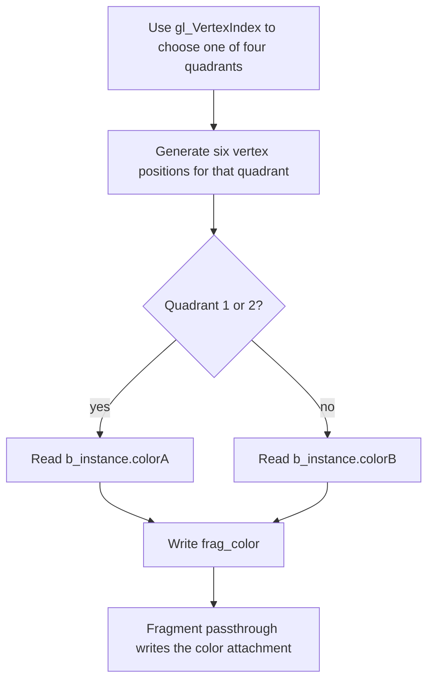

## Overview

**Core question:** Does descriptor state bound or pushed in the selected command buffer deliver the intended resource data to every active shader stage?

- This page covers the `binding_model.shader_access` test family implemented in [`vktBindingShaderAccessTests.cpp`](../../../modules/vulkan/binding_model/vktBindingShaderAccessTests.cpp).
- The direct behavior split is where the test records descriptor-set binding or push-descriptor writes and the consuming draw: `primary_cmd_buf` or `secondary_cmd_buf`.
- Inside both paths, the generated matrix varies the descriptor bind command, update method, descriptor type, shader stage, descriptor-set layout, shader interface shape, and resource-specific offset or image-view details.
- Graphics cases render descriptor-derived quadrant colors. Compute cases write four descriptor-derived values to a host-visible result path. The host compares the output with values calculated from the selected resources and bindings.

## Background Knowledge

For the shared concept of descriptor interfaces and pipeline layouts, see [Background Knowledge](../../categories/binding_model.md#background-knowledge) of the `binding_model` page.

- **Secondary command execution.** A secondary command buffer cannot be submitted directly. A primary command buffer executes it with `vkCmdExecuteCommands`. When that execution occurs inside a render pass, the secondary command buffer carries matching render-pass inheritance information. See [Secondary Command Buffer Execution](../../../../vulkan-docs/src/chapters/cmdbuffers.adoc#commandbuffers-secondary).
- **Dynamic descriptor offsets.** A dynamic uniform or storage-buffer descriptor combines its descriptor base offset with the dynamic offset passed to the bind command. Vulkan orders those offsets by set, binding, and array element. See [dynamic descriptor offsets](../../../../vulkan-docs/src/chapters/descriptorsets.adoc#descriptors-binding-dynamicoffsets).

## Registration Hierarchy

```text
binding_model.shader_access
├── primary_cmd_buf
└── secondary_cmd_buf
```

These two direct children are intermediate nodes under the `shader_access` test family. Deeper components select the bind command, update method, descriptor type, active shader stage, set-count arrangement, interface shape, and executable resource variant.

## Parameter Dimensions and Observed Values

| Dimension | Registered values | Meaning in this test | Evidence |
|-----------|-------------------|----------------------|----------|
| Command-buffer binding path | `primary_cmd_buf`, `secondary_cmd_buf` | Selects whether descriptor binding and the consuming draw are recorded directly in the primary buffer or in a secondary buffer executed by the primary. | [binding-path registration](../../../modules/vulkan/binding_model/vktBindingShaderAccessTests.cpp#L9726-L9735) |
| Descriptor bind-command branch | `bind`, `bind2` | For normal and template-updated descriptor sets, selects `vkCmdBindDescriptorSets` or `vkCmdBindDescriptorSets2`. Push update methods instead record push-descriptor commands, although their cases remain nested under these two registered branch names. | [bind-command registration](../../../modules/vulkan/binding_model/vktBindingShaderAccessTests.cpp#L9855-L9863), [binding helper](../../../modules/vulkan/binding_model/vktBindingShaderAccessTests.cpp#L478-L508), [buffer command recording](../../../modules/vulkan/binding_model/vktBindingShaderAccessTests.cpp#L1868-L1933) |
| Update method | normal path with no extra name, `with_template`, `with_push`, `with_push_template` | Chooses direct descriptor writes, descriptor update templates, push descriptors, or push descriptor templates. | [update-method registration](../../../modules/vulkan/binding_model/vktBindingShaderAccessTests.cpp#L9736-L9750) |
| Descriptor type | `sampler_mutable`, `sampler_immutable`, `combined_image_sampler_mutable`, `combined_image_sampler_immutable`, `storage_image`, `uniform_texel_buffer`, `storage_texel_buffer`, `uniform_buffer`, `storage_buffer`, `uniform_buffer_dynamic`, `storage_buffer_dynamic` | Changes the resource class, shader declaration, descriptor writes, and reference calculation. | [descriptor-type registration](../../../modules/vulkan/binding_model/vktBindingShaderAccessTests.cpp#L9751-L9778) |
| Active shader stage | `no_access`, `vertex`, `tess_ctrl`, `tess_eval`, `geometry`, `fragment`, `compute`, `vertex_fragment` | Chooses which generated stage consumes descriptors. `no_access` keeps descriptors unused; `vertex_fragment` makes both graphics stages consume them. | [stage registration](../../../modules/vulkan/binding_model/vktBindingShaderAccessTests.cpp#L9779-L9843) |
| Shader interface shape | `single_descriptor`, `multiple_contiguous_descriptors`, `multiple_discontiguous_descriptors`, `multiple_arbitrary_descriptors`, `descriptor_array` | Changes the generated binding numbers and whether the shader reads one descriptor, two bindings, or a two-element array. | [interface enum](../../../modules/vulkan/binding_model/vktBindingShaderAccessTests.cpp#L1109-L1138), [interface registration](../../../modules/vulkan/binding_model/vktBindingShaderAccessTests.cpp#L9844-L9854) |
| Descriptor-set arrangement | single set, `multiple_descriptor_sets`, `multiple_discontiguous_descriptor_sets` | Uses set `0`; sets `0` and `1`; or sets `0` and `2` with an unused layout at set `1`. | [set index mapping](../../../modules/vulkan/binding_model/vktBindingShaderAccessTests.cpp#L1064-L1107), [set-count registration](../../../modules/vulkan/binding_model/vktBindingShaderAccessTests.cpp#L9892-L9986) |
| Buffer leaf | `offset_view_zero`, `offset_view_nonzero`; dynamic descriptors add `offset_view_zero_dynamic_zero`, `offset_view_zero_dynamic_nonzero`, `offset_view_nonzero_dynamic_zero`, `offset_view_nonzero_dynamic_nonzero` | Changes the descriptor range and, for dynamic descriptors, the bind-time offset used to reach the initialized color data. | [buffer leaves](../../../modules/vulkan/binding_model/vktBindingShaderAccessTests.cpp#L9676-L9719) |
| Texel-buffer leaf | `offset_zero`, `offset_nonzero` | Selects a zero or nonzero buffer-view offset. | [texel-buffer leaves](../../../modules/vulkan/binding_model/vktBindingShaderAccessTests.cpp#L9648-L9673) |
| Image leaf | `1d`, `1d_array`, `2d`, `2d_array`, `3d`, `cube`, `cube_array`, with applicable `_base_mip` and `_base_slice` forms | Changes image-view dimensionality and the selected mip or array slice. | [image leaves](../../../modules/vulkan/binding_model/vktBindingShaderAccessTests.cpp#L9578-L9645) |

In the normal update path, the descriptor type follows `bind` or `bind2` directly because the empty update-method name does not add an intermediate path component. The other update methods add their registered name before the descriptor type.

## Behavior Parameters

The primary behavioral axis is the command-buffer binding path. Its values are the two direct intermediate nodes under `binding_model.shader_access`, and they change where Vulkan records the state that the draw consumes.

### `primary_cmd_buf`: bind and consume in the primary command buffer

The primary path records pipeline binding, descriptor binding or descriptor pushing, and the draw in the same primary command buffer that begins the render pass. Compute cases also belong only to this path; they bind the compute pipeline and descriptors, dispatch four workgroups, and place a shader-to-host barrier before result inspection. All update methods, descriptor classes, active-stage choices, interface shapes, and set-count arrangements are exercised through this direct recording path when legal.

### `secondary_cmd_buf`: bind and consume in an executed secondary command buffer

The secondary path allocates a secondary command buffer with render-pass continuation and matching inheritance information. It records the graphics pipeline, descriptor binding or pushing, and draw there. The primary command buffer begins the render pass with secondary-command contents and executes the secondary buffer with `vkCmdExecuteCommands`. The descriptor matrix otherwise mirrors the graphics coverage of `primary_cmd_buf`; `compute` is absent because the source marks that stage as unsupported for this secondary path.

## Shader Analysis

One graphics walkthrough is enough to expose the common generated structure: derive a quadrant, read the resource selected by the registered descriptor interface, and carry the resulting color to host-visible output. Image, texel-buffer, descriptor-array, multi-set, compute, and stage changes are summarized after the code.

### Representative Shader Walkthrough 1

#### Parameter Values Chosen

Representative path:

```text
dEQP-VK.binding_model.shader_access.primary_cmd_buf.bind.storage_buffer.vertex.single_descriptor.offset_view_zero
```

| Parameter choice | Meaning in this representative case |
|------------------|-------------------------------------|
| `primary_cmd_buf.bind` | Records `vkCmdBindDescriptorSets` and the draw in the primary command buffer. |
| `storage_buffer.vertex` | A vertex shader reads a storage-buffer descriptor; the fragment shader only forwards the interpolated color. |
| `single_descriptor` | Generates one resource block at set `0`, binding `0`. |
| `offset_view_zero` | The descriptor starts at buffer offset zero and addresses the two initialized `vec4` members directly. |

#### Purpose

This shader checks that a storage-buffer descriptor bound through the primary graphics path supplies the expected two color values to the vertex stage. The quadrant pattern makes a wrong binding, range, or member selection visible in the rendered image.

#### Structural Design



#### Shader Code

```glsl
#version 310 es

/// Set 0, binding 0 is a storage-buffer descriptor. The host places two vec4 colors at the descriptor's selected range.
layout(set = 0, binding = 0, std140) buffer BufferName
{
    highp vec4 colorA;
    highp vec4 colorB;
} b_instance;

/// The selected vertex stage passes its descriptor-derived color to the fragment shader.
layout(location = 0) out mediump vec4 frag_color;

void main (void)
{
    highp vec4 result_position;
    highp int quadrant_id;

    /// Six vertices form each quadrant. The vertex index selects both position and the expected descriptor member.
    highp int quadPhase = gl_VertexIndex % 6;
    highp int quadXcoord = int(quadPhase == 1 || quadPhase == 4 || quadPhase == 5);
    highp int quadYcoord = int(quadPhase == 2 || quadPhase == 3 || quadPhase == 5);
    highp int quadOriginX = (gl_VertexIndex / 6) % 2;
    highp int quadOriginY = (gl_VertexIndex / 6) / 2;
    quadrant_id = gl_VertexIndex / 6;
    result_position = vec4(float(quadOriginX + quadXcoord - 1), float(quadOriginY + quadYcoord - 1), 0.0, 1.0);
    gl_Position = result_position;

    highp vec4 result_color;
    result_color = vec4(0.0);
    if (quadrant_id == 1 || quadrant_id == 2)
        result_color += b_instance.colorA;
    else
        result_color += b_instance.colorB;
    frag_color = result_color;
}
```

#### Additional Info

- [`BufferDescriptorCase`](../../../modules/vulkan/binding_model/vktBindingShaderAccessTests.cpp#L3442-L3457) fixes this generated source at GLSL ES 3.10. `QuadrantRendederCase::initPrograms()` supplies no explicit shader build options, so the CTS baseline target is SPIR-V 1.0.
- The generated fragment shader is a fixed passthrough for this `vertex` case: it copies `frag_color` to the color attachment and does not access the descriptor.

#### Parameter Variation Summary

| Parameter dimension | Shader-level variation from this shader | Evidence |
|---------------------|---------------------------------------|----------|
| Shader interface shape | Emits a second binding at `1`, `2`, or the high arbitrary binding values `0x7FFE` and `0xFFFE`, or emits a two-element descriptor array. | [buffer declarations](../../../modules/vulkan/binding_model/vktBindingShaderAccessTests.cpp#L3466-L3553) |
| Descriptor-set arrangement | Repeats resource declarations at sets `0` and `1`, or sets `0` and `2`, then averages values read from both sets. | [set mapping and resource access](../../../modules/vulkan/binding_model/vktBindingShaderAccessTests.cpp#L3481-L3600) |
| Active stage | Moves resource declarations and access code to vertex, tessellation control, tessellation evaluation, geometry, fragment, compute, or both vertex and fragment stages. | [stage generators](../../../modules/vulkan/binding_model/vktBindingShaderAccessTests.cpp#L3052-L3400) |
| Descriptor type | Replaces the buffer block with sampler, combined image sampler, storage image, or texel-buffer declarations and corresponding sample, fetch, or load expressions. | [image declarations and access](../../../modules/vulkan/binding_model/vktBindingShaderAccessTests.cpp#L7446-L7868), [texel-buffer declarations and access](../../../modules/vulkan/binding_model/vktBindingShaderAccessTests.cpp#L9428-L9550) |
| `no_access` | Omits the tested descriptor declarations and generates fixed green/yellow quadrant colors. | [buffer no-access source](../../../modules/vulkan/binding_model/vktBindingShaderAccessTests.cpp#L3605-L3610) |
| `compute` | Generates one workgroup per result, writes four `vec4` values to `b_out`, and uses binding `1` for the first tested resource because binding `0` is the output buffer. | [compute generator](../../../modules/vulkan/binding_model/vktBindingShaderAccessTests.cpp#L3358-L3379), [compute binding adjustment](../../../modules/vulkan/binding_model/vktBindingShaderAccessTests.cpp#L3476-L3482) |

#### SPIR-V

- Status: generated and validated
- Source: reconstructed `GLSL` from this walkthrough
- Stage: `vert`
- Target SPIRV version: `spirv1.0`

<details>
<summary>Click to expand SPIRV asm code</summary>

```llvm
; SPIR-V
; Version: 1.0
; Generator: Khronos Glslang Reference Front End; 11
; Bound: 99
; Schema: 0
               OpCapability Shader
          %1 = OpExtInstImport "GLSL.std.450"
               OpMemoryModel Logical GLSL450
               OpEntryPoint Vertex %main "main" %gl_VertexIndex %_ %frag_color
               OpSource ESSL 310
               OpName %main "main"
               OpName %quadPhase "quadPhase"
               OpName %gl_VertexIndex "gl_VertexIndex"
               OpName %quadXcoord "quadXcoord"
               OpName %quadYcoord "quadYcoord"
               OpName %quadOriginX "quadOriginX"
               OpName %quadOriginY "quadOriginY"
               OpName %quadrant_id "quadrant_id"
               OpName %result_position "result_position"
               OpName %gl_PerVertex "gl_PerVertex"
               OpMemberName %gl_PerVertex 0 "gl_Position"
               OpMemberName %gl_PerVertex 1 "gl_PointSize"
               OpName %_ ""
               OpName %result_color "result_color"
               OpName %BufferName "BufferName"
               OpMemberName %BufferName 0 "colorA"
               OpMemberName %BufferName 1 "colorB"
               OpName %b_instance "b_instance"
               OpName %frag_color "frag_color"
               OpDecorate %gl_VertexIndex BuiltIn VertexIndex
               OpDecorate %gl_PerVertex Block
               OpMemberDecorate %gl_PerVertex 0 BuiltIn Position
               OpMemberDecorate %gl_PerVertex 1 BuiltIn PointSize
               OpDecorate %BufferName BufferBlock
               OpMemberDecorate %BufferName 0 Offset 0
               OpMemberDecorate %BufferName 1 Offset 16
               OpDecorate %b_instance Binding 0
               OpDecorate %b_instance DescriptorSet 0
               OpDecorate %frag_color RelaxedPrecision
               OpDecorate %frag_color Location 0
       %void = OpTypeVoid
          %3 = OpTypeFunction %void
        %int = OpTypeInt 32 1
%_ptr_Function_int = OpTypePointer Function %int
%_ptr_Input_int = OpTypePointer Input %int
%gl_VertexIndex = OpVariable %_ptr_Input_int Input
      %int_6 = OpConstant %int 6
      %int_1 = OpConstant %int 1
       %bool = OpTypeBool
      %int_4 = OpConstant %int 4
      %int_5 = OpConstant %int 5
      %int_0 = OpConstant %int 0
      %int_2 = OpConstant %int 2
      %int_3 = OpConstant %int 3
      %float = OpTypeFloat 32
    %v4float = OpTypeVector %float 4
%_ptr_Function_v4float = OpTypePointer Function %v4float
    %float_0 = OpConstant %float 0
    %float_1 = OpConstant %float 1
%gl_PerVertex = OpTypeStruct %v4float %float
%_ptr_Output_gl_PerVertex = OpTypePointer Output %gl_PerVertex
          %_ = OpVariable %_ptr_Output_gl_PerVertex Output
%_ptr_Output_v4float = OpTypePointer Output %v4float
         %76 = OpConstantComposite %v4float %float_0 %float_0 %float_0 %float_0
 %BufferName = OpTypeStruct %v4float %v4float
%_ptr_Uniform_BufferName = OpTypePointer Uniform %BufferName
 %b_instance = OpVariable %_ptr_Uniform_BufferName Uniform
%_ptr_Uniform_v4float = OpTypePointer Uniform %v4float
 %frag_color = OpVariable %_ptr_Output_v4float Output
       %main = OpFunction %void None %3
          %5 = OpLabel
  %quadPhase = OpVariable %_ptr_Function_int Function
 %quadXcoord = OpVariable %_ptr_Function_int Function
 %quadYcoord = OpVariable %_ptr_Function_int Function
%quadOriginX = OpVariable %_ptr_Function_int Function
%quadOriginY = OpVariable %_ptr_Function_int Function
%quadrant_id = OpVariable %_ptr_Function_int Function
%result_position = OpVariable %_ptr_Function_v4float Function
%result_color = OpVariable %_ptr_Function_v4float Function
         %11 = OpLoad %int %gl_VertexIndex
         %13 = OpSMod %int %11 %int_6
               OpStore %quadPhase %13
         %15 = OpLoad %int %quadPhase
         %18 = OpIEqual %bool %15 %int_1
         %19 = OpLoad %int %quadPhase
         %21 = OpIEqual %bool %19 %int_4
         %22 = OpLogicalOr %bool %18 %21
         %23 = OpLoad %int %quadPhase
         %25 = OpIEqual %bool %23 %int_5
         %26 = OpLogicalOr %bool %22 %25
         %28 = OpSelect %int %26 %int_1 %int_0
               OpStore %quadXcoord %28
         %30 = OpLoad %int %quadPhase
         %32 = OpIEqual %bool %30 %int_2
         %33 = OpLoad %int %quadPhase
         %35 = OpIEqual %bool %33 %int_3
         %36 = OpLogicalOr %bool %32 %35
         %37 = OpLoad %int %quadPhase
         %38 = OpIEqual %bool %37 %int_5
         %39 = OpLogicalOr %bool %36 %38
         %40 = OpSelect %int %39 %int_1 %int_0
               OpStore %quadYcoord %40
         %42 = OpLoad %int %gl_VertexIndex
         %43 = OpSDiv %int %42 %int_6
         %44 = OpSMod %int %43 %int_2
               OpStore %quadOriginX %44
         %46 = OpLoad %int %gl_VertexIndex
         %47 = OpSDiv %int %46 %int_6
         %48 = OpSDiv %int %47 %int_2
               OpStore %quadOriginY %48
         %50 = OpLoad %int %gl_VertexIndex
         %51 = OpSDiv %int %50 %int_6
               OpStore %quadrant_id %51
         %56 = OpLoad %int %quadOriginX
         %57 = OpLoad %int %quadXcoord
         %58 = OpIAdd %int %56 %57
         %59 = OpISub %int %58 %int_1
         %60 = OpConvertSToF %float %59
         %61 = OpLoad %int %quadOriginY
         %62 = OpLoad %int %quadYcoord
         %63 = OpIAdd %int %61 %62
         %64 = OpISub %int %63 %int_1
         %65 = OpConvertSToF %float %64
         %68 = OpCompositeConstruct %v4float %60 %65 %float_0 %float_1
               OpStore %result_position %68
         %72 = OpLoad %v4float %result_position
         %74 = OpAccessChain %_ptr_Output_v4float %_ %int_0
               OpStore %74 %72
               OpStore %result_color %76
         %77 = OpLoad %int %quadrant_id
         %78 = OpIEqual %bool %77 %int_1
         %79 = OpLoad %int %quadrant_id
         %80 = OpIEqual %bool %79 %int_2
         %81 = OpLogicalOr %bool %78 %80
               OpSelectionMerge %83 None
               OpBranchConditional %81 %82 %92
         %82 = OpLabel
         %88 = OpAccessChain %_ptr_Uniform_v4float %b_instance %int_0
         %89 = OpLoad %v4float %88
         %90 = OpLoad %v4float %result_color
         %91 = OpFAdd %v4float %90 %89
               OpStore %result_color %91
               OpBranch %83
         %92 = OpLabel
         %93 = OpAccessChain %_ptr_Uniform_v4float %b_instance %int_1
         %94 = OpLoad %v4float %93
         %95 = OpLoad %v4float %result_color
         %96 = OpFAdd %v4float %95 %94
               OpStore %result_color %96
               OpBranch %83
         %83 = OpLabel
         %98 = OpLoad %v4float %result_color
               OpStore %frag_color %98
               OpReturn
               OpFunctionEnd
```

</details>

## Runtime Execution and Result Checking

- The host creates resource data whose color values identify which descriptor, set, array element, range, mip, or slice the shader reached. Buffer cases place guard values outside the selected data range so an offset mistake does not silently read the same payload.
- Descriptor-set layouts mirror the generated `set` and `binding` declarations. The host populates ordinary sets with direct writes or update templates. Push variants record descriptor writes in the command buffer instead of binding allocated descriptor sets.
- For normal and template-updated sets, `bind` records `vkCmdBindDescriptorSets`, while `bind2` records `vkCmdBindDescriptorSets2` with the pipeline layout, set range, descriptor sets, dynamic offsets, and existing stage mask. Push variants bypass both bind commands and record `vkCmdPushDescriptorSetKHR` or `vkCmdPushDescriptorSetWithTemplateKHR`-style operations through the CTS device interface.
- Graphics cases draw 24 vertices, six per quadrant, into a 128 by 128 color attachment. In the secondary path, pipeline binding, descriptor state, and drawing live in the secondary buffer; the primary buffer provides and executes the render pass.
- The host copies the graphics target to readable memory and compares it with a generated four-quadrant reference. The reference accounts for active stages and averages values when two descriptor sets contribute.
- Compute cases bind the same descriptor layouts to a compute pipeline and dispatch four one-invocation workgroups. Buffer and texel-buffer paths apply host-write to shader-read barriers; image paths instead use resources uploaded and transitioned before dispatch. Every compute path applies a shader-write to host-read barrier, and the shader writes one `vec4` per workgroup to a result buffer initialized to `-1`.
- A graphics case passes only when `bilinearCompare` accepts the full reference image. Buffer compute cases require exact equality for all four result vectors. Image-fetch and texel-buffer compute cases allow per-component error up to `1/255`, while sampled-image cases allow `8/255`; all four vectors must satisfy the applicable check. Four untouched `-1` values produce `Result buffer was not written to`; other mismatches produce `Invalid result values`.

## Failure Meaning

### Failure Cause Mapping

| If this behavior parameter value fails | Possible failure cause(s) |
|----------------------------------------|---------------------------|
| `primary_cmd_buf` | Descriptor delivery through the selected layout, update, bind, shader interface, or primary execution path. |
| `secondary_cmd_buf` | Descriptor and pipeline state recorded in the secondary command buffer, or its render-pass inheritance and execution from the primary command buffer. |

### Cause Analysis

#### Descriptor delivery through the primary path

**Possible failure symptoms:** a graphics case renders one or more wrong quadrants, or a compute case leaves the result buffer at `-1` or writes values that differ from all four references. Failures may follow one descriptor type, update method, binding number pattern, set arrangement, offset form, or active stage.

**Possible implementation causes:** the implementation may associate a shader `DescriptorSet` or `Binding` decoration with the wrong API binding, consume stale or incorrectly updated descriptor contents, apply an incompatible pipeline layout, mishandle dynamic offset order or effective addresses, lower the shader resource access incorrectly, or execute the primary binding state incorrectly. The failing matrix coordinates narrow the investigation: an isolated `bind2` failure among normal or template-updated descriptor sets points toward maintenance6 binding state, while an isolated descriptor type or shader stage points toward that interface and access path.

#### Secondary command-buffer state or execution

**Possible failure symptoms:** equivalent graphics cases pass under `primary_cmd_buf` but render wrong quadrants under `secondary_cmd_buf`. A broad secondary-only failure can affect all descriptor classes; a narrow one can follow one update method, bind command, stage, or interface shape.

**Possible implementation causes:** the implementation may lose or disturb descriptor and pipeline state recorded in the secondary command buffer, execute it with incorrect render-pass inheritance, or consume the wrong binding state at `vkCmdExecuteCommands`. Vulkan requires secondary buffers executed inside a render pass to use continuation and compatible inheritance state. If primary and secondary variants fail together, the shared descriptor, shader, resource, or validation path remains a stronger lead than secondary execution itself.

## Case Pruning

### Requirement-based pruning

- All `bind2` cases require `VK_KHR_maintenance6`.
- Descriptor update templates and push descriptor methods require their corresponding device functionality; these update-method branches are absent from Vulkan SC builds.
- Storage image, storage texel-buffer, and storage-buffer access in vertex-pipeline stages requires `vertexPipelineStoresAndAtomics`; fragment access requires `fragmentStoresAndAtomics`.
- Cube-array image cases require `imageCubeArray`. Tessellation and geometry paths also depend on support for those shader stages.
- Unsupported cases raise `NotSupportedError`; they do not report a conformance failure.

### Design-based pruning

- `compute` is omitted from `secondary_cmd_buf` because this implementation uses secondary command buffers only for draws inside a render pass.
- Push descriptor methods omit multiple descriptor-set arrangements because a push-descriptor pipeline layout can contain only one set layout created with `VK_DESCRIPTOR_SET_LAYOUT_CREATE_PUSH_DESCRIPTOR_BIT_KHR` in this test design.
- Dynamic uniform and storage-buffer descriptors omit push update methods.
- Image cases restrict discontiguous and arbitrary descriptor interfaces, compute discontiguous interfaces, and discontiguous descriptor-set arrangements to selected 2D views to avoid redundant expansion.
- `VK_DESCRIPTOR_TYPE_SAMPLED_IMAGE` is not registered because this test's generated access requires a sampler.

## Key Takeaways

- `primary_cmd_buf` and `secondary_cmd_buf` test the same descriptor-access idea through two recording and execution paths; compute coverage belongs only to the primary path.
- The output encodes descriptor selection as colors. Wrong binding numbers, set numbers, offsets, descriptor contents, stage visibility, or resource views become wrong quadrants or wrong result-buffer vectors.
- `no_access` checks that the pipeline remains valid when the layouts contain descriptors that no active stage consumes.
- `bind`, `bind2`, direct updates, templates, push descriptors, descriptor classes, stage choices, and interface shapes all feed the same host-visible comparison, which makes failures attributable to their registered matrix coordinates.
- See `Failure Meaning` for how primary-only, secondary-only, and shared failures guide source-level investigation.

## Source Reference Appendix

| Entry point | Link | Why it matters |
|-------------|------|----------------|
| Matrix registration | [createShaderAccessTests()](../../../modules/vulkan/binding_model/vktBindingShaderAccessTests.cpp#L9724-L10011) | Builds both command-buffer binding paths and every common parameter dimension. |
| Resource-specific leaf generation | [image](../../../modules/vulkan/binding_model/vktBindingShaderAccessTests.cpp#L9578-L9645), [texel buffer](../../../modules/vulkan/binding_model/vktBindingShaderAccessTests.cpp#L9648-L9673), [buffer](../../../modules/vulkan/binding_model/vktBindingShaderAccessTests.cpp#L9676-L9719) | Adds executable image-view and offset variants and applies design pruning. |
| Descriptor binding helper | [bindDescriptorSets()](../../../modules/vulkan/binding_model/vktBindingShaderAccessTests.cpp#L478-L508) | Selects the legacy or maintenance6 descriptor-set bind command. |
| Graphics command-buffer path | [SingleCmdRenderInstance::renderToTarget()](../../../modules/vulkan/binding_model/vktBindingShaderAccessTests.cpp#L1001-L1062) | Records the inline primary path or executes the recorded secondary path. |
| Buffer graphics binding and checking | [writeDrawCmdBuffer()](../../../modules/vulkan/binding_model/vktBindingShaderAccessTests.cpp#L1868-L1937), [verifyResultImage()](../../../modules/vulkan/binding_model/vktBindingShaderAccessTests.cpp#L1939-L1983) | Binds or pushes descriptors, draws four quadrants, and compares the result image. |
| Compute submission and checking | [ComputeCommand::submitAndWait()](../../../modules/vulkan/binding_model/vktBindingShaderAccessTests.cpp#L2226-L2317), [buffer checks](../../../modules/vulkan/binding_model/vktBindingShaderAccessTests.cpp#L2804-L3008), [image-fetch checks](../../../modules/vulkan/binding_model/vktBindingShaderAccessTests.cpp#L5083-L5191), [sampled-image checks](../../../modules/vulkan/binding_model/vktBindingShaderAccessTests.cpp#L7304-L7341), [texel-buffer checks](../../../modules/vulkan/binding_model/vktBindingShaderAccessTests.cpp#L9257-L9363) | Records binding, barriers, dispatch, readback, and resource-specific exact or tolerant result checks. |
| Stage shader generation | [QuadrantRendederCase generators](../../../modules/vulkan/binding_model/vktBindingShaderAccessTests.cpp#L3052-L3400) | Emits active-stage resource access and graphics passthrough or compute output code. |
| Buffer declaration and access generation | [resource declarations](../../../modules/vulkan/binding_model/vktBindingShaderAccessTests.cpp#L3466-L3553), [resource access](../../../modules/vulkan/binding_model/vktBindingShaderAccessTests.cpp#L3556-L3602) | Supports the representative walkthrough and all buffer interface shapes. |
| Support checks | [verifyDriverSupport()](../../../modules/vulkan/binding_model/vktBindingShaderAccessTests.cpp#L164-L259), [`bind2` buffer support](../../../modules/vulkan/binding_model/vktBindingShaderAccessTests.cpp#L3631-L3635), [`bind2` image support](../../../modules/vulkan/binding_model/vktBindingShaderAccessTests.cpp#L7411-L7434), [`bind2` texel-buffer support](../../../modules/vulkan/binding_model/vktBindingShaderAccessTests.cpp#L9416-L9420) | Defines extension, feature, image, stage, and maintenance6 requirements. |
| Mustpass representative | [binding-model.txt](../../../mustpass/main/vk-default/binding-model.txt#L65909) | Confirms the exact case reconstructed in the shader walkthrough. |
| Vulkan descriptor rules | [descriptors.adoc](../../../../vulkan-docs/src/chapters/descriptors.adoc#descriptors), [descriptorsets.adoc](../../../../vulkan-docs/src/chapters/descriptorsets.adoc#descriptor-set-binding) | Defines shader descriptor mapping, binding lifetime, validity, and dynamic offsets. |
| Vulkan secondary execution rules | [cmdbuffers.adoc](../../../../vulkan-docs/src/chapters/cmdbuffers.adoc#commandbuffers-secondary) | Defines how a primary command buffer executes secondary command buffers. |
| Vulkan access-mask meanings | [synchronization.adoc](../../../../vulkan-docs/src/chapters/synchronization.adoc#synchronization-access-types) | Grounds the host, shader, transfer, uniform, sampled, and storage accesses used by runtime barriers. |
