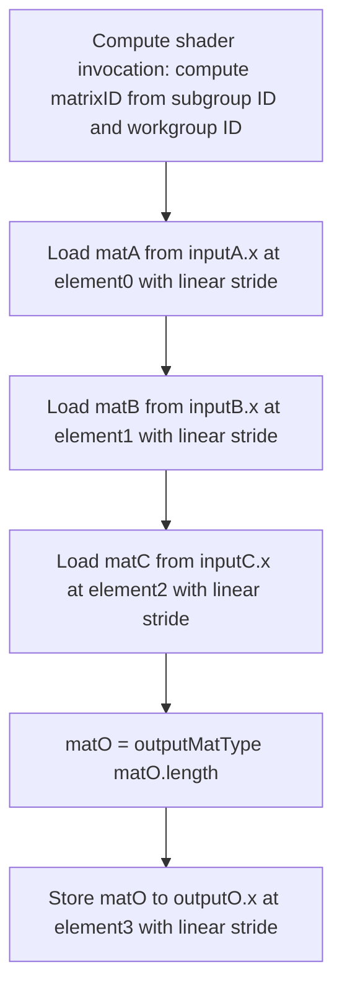

## Overview

**Core question:** When a compute shader uses cooperative matrix operations through the NV or KHR cooperative matrix extensions, do the generated GLSL shaders correctly compile, execute the requested operation under the selected scope, use type, component type, storage class, layout, and address method, and produce per-element values that match the host-side reference formula?

- [vktComputeCooperativeMatrixTests.cpp](../../../modules/vulkan/compute/vktComputeCooperativeMatrixTests.cpp#L6475-L6507) is the primary `cooperative_matrix` implementation. It creates cooperative-matrix test branches for the NV and KHR matrix use modes, delegates `op_constant_null` registration to [vktComputeCooperativeMatrixOpConstantNullTests.cpp](../../../modules/vulkan/compute/vktComputeCooperativeMatrixOpConstantNullTests.cpp#L1847-L1866), and adds non-VulkanSC 64-bit indexing cooperative-matrix cases.
- The file implements five cooperative-matrix use-mode children (`nv`, `khr_a`, `khr_b`, `khr_c`, `khr_r`) plus the delegated `op_constant_null` subtree and the non-VulkanSC `64b_indexing` subtree. Every test family here is non-VulkanSC.
- The core test checks cooperative matrix operations, type conversions, reductions, tensor-layout addressing, clamp addressing, multicomponent loads and stores, and 64-bit indexing, by having the shader write `matO` to a host-visible storage buffer and comparing every output element against a host-computed reference.
- The C++ code builds the parameter matrix, generates GLSL via template-style string concatenation in `CooperativeMatrixTestCase::initPrograms()`, allocates input and output buffers, dispatches the shader, and runs a per-element reference comparison.

## Background Knowledge

- **Cooperative matrix concept.** A cooperative matrix is a matrix value whose individual elements are distributed across invocations of a single scope (subgroup or workgroup). Each invocation owns a slice; `coopMatLoad`, `coopMatStore`, `coopMatMulAdd`, `coopMatTransposeNV`, `OpCooperativeMatrixReduceNV`, and `coopMatLoadTensorNV` then perform the matrix-wide computation collectively. The matrix type carries a `scope`, `M`, optional `N` (and `K` for multiply), a component type, and a **use** (`gl_MatrixUseA`, `gl_MatrixUseB`, or `gl_MatrixUseAccumulator`) that determines which operand role the matrix fills.
- **NV vs KHR syntax.** NV matrices use the `fcoopmatNV<bits, scope, M, N>` template syntax; KHR matrices use `coopmat<T, scope, M, N, use>`. NV does not require a use type; KHR does. The two branches `nv` and `khr_*` therefore produce different shader declarations.
- **Use types in this file.** The internal enum `UT_NV`, `UT_KHR_A`, `UT_KHR_B`, `UT_KHR_C`, `UT_KHR_Result` is mapped to the registered child names `nv`, `khr_a`, `khr_b`, `khr_c`, `khr_r` by `getUseType(UseType)` [vktComputeCooperativeMatrixTests.cpp#L5503-L5520](../../../modules/vulkan/compute/vktComputeCooperativeMatrixTests.cpp#L5503-L5520). The use type determines which matrix-multiplication skip rules apply, which feature gates are required, and which declaration form the shader emits.
- **Scope interaction with use type.** `scopeCases` enumerates `subgroupscope` (default for both NV and KHR) and `workgroupscope` (KHR-only, gated behind `cooperativeMatrixWorkgroupScope`). Scope and storage class are independent: shared arrays, input copies, and the `controlBarrier` are emitted only for the `workgroup` and `workgroup_varptr` storage classes. Workgroup-scope matrices use one matrix per workgroup; subgroup-scope matrices use one per subgroup.
- **Subgroup-size mode.** `SUBGROUP_SIZE_NONE` uses the device's reported subgroup size without requesting a required size. `_min` and `_max` select the device's minimum or maximum supported subgroup size and pass it to `ComputePipelineWrapper::setSubgroupSize()`; they do not add a `gl_SubgroupSize` declaration to the generated GLSL. Only `TT_MATRIXMULADD` enumerates `_min`/`_max`.
- **Address method.** `linear` (`ADDR_LINEAR`) is the default and uses `coopMatLoad`/`coopMatStore` with explicit stride and row/column-major flag. `tensorlayout` (`ADDR_TENSORLAYOUT`) uses `createTensorLayoutNV` plus `coopMatLoadTensorNV` with `sliceTensorLayoutNV`, gated behind `cooperativeMatrixTensorAddressing`. `decode` (`ADDR_DECODE`) and `blocksize` (`ADDR_BLOCKSIZE`) add a `decodeFunc` or block-quantized addressing on top of the tensor layout and require `cooperativeMatrixBlockLoads`. The `decode` path is also used by `TT_MATRIXMULADD_DEQUANT` to express a 4bpp quantized buffer.
- **Storage class.** `scCases` controls where the A/B/C buffers live: SSBO (`buffer`), workgroup-shared (`workgroup`), SSBO with variable pointers (`buffer_varptr`), workgroup with variable pointers (`workgroup_varptr`), or physical storage buffer (`physical_buffer`). `physical_buffer` uses `buffer_reference` declarations at binding 4 instead of separate bindings 0..3.
- **Cooperative matrix dimensions.** The M, N, K tuple is chosen from `VkCooperativeMatrixPropertiesKHR` for the matching scope, types, and (optionally) saturation. `cooperativeMatrixFlexibleDimensions` enables additional (M, N, K) tuples driven by `VkCooperativeMatrixFlexibleDimensionsPropertiesNV`.
- **Vulkan memory model requirement.** Every cooperative-matrix case requires `vulkanMemoryModel` because the generated shaders rely on it. Other gating features include `cooperativeMatrix` (KHR or NV), `variablePointers` (for variable-pointer storage classes), `bufferDeviceAddress` (for physical storage buffers), `shaderFloat16` (for fp16 inputs or outputs), `cooperativeMatrixWorkgroupScope`, `cooperativeMatrixReductions`, `cooperativeMatrixConversions`, `cooperativeMatrixPerElementOperations`, `cooperativeMatrixTensorAddressing`, `cooperativeMatrixFlexibleDimensions`, `cooperativeMatrixBlockLoads`, `shaderBFloat16CooperativeMatrix`, `shaderFloat8CooperativeMatrix`, and `shader64BitIndexing` (for `64b_indexing`).

## Registration Hierarchy

```text
compute.pipeline.cooperative_matrix
├── nv
├── khr_a
├── khr_b
├── khr_c
├── khr_r
├── op_constant_null (registration only)
└── 64b_indexing
```

`op_constant_null` is registered by the file but its leaves (`null_a`, `null_b`, `null_c`, `null_r`) are implemented in a separate source file. The non-VulkanSC `64b_indexing` subtree is documented here as the only 64-bit indexing cooperative-matrix leaf set in the repository; its six concrete leaves live under that subtree.

## Parameter Dimensions and Observed Values

The full parameter matrix is built by nested loops in `createCooperativeMatrixTestsInternal()` [vktComputeCooperativeMatrixTests.cpp#L5522-L6013](../../../modules/vulkan/compute/vktComputeCooperativeMatrixTests.cpp#L5522-L6013), with two side branches for `convert`/`convert_sat` [vktComputeCooperativeMatrixTests.cpp#L6025-L6108](../../../modules/vulkan/compute/vktComputeCooperativeMatrixTests.cpp#L6025-L6108) and `multicomponent` [vktComputeCooperativeMatrixTests.cpp#L6110-L6180](../../../modules/vulkan/compute/vktComputeCooperativeMatrixTests.cpp#L6110-L6180). The table below keeps the registered values but adds why each dimension matters for this test.

| Dimension | Registered values | Meaning in this test | Evidence |
|-----------|-------------------|----------------------|----------|
| Use type | `nv`, `khr_a`, `khr_b`, `khr_c`, `khr_r` | Selects the matrix template syntax (`fcoopmatNV` vs `coopmat`) and the matrix-multiplication skip rules. `khr_r` uniquely hosts `convert_acc_to_*` and `transpose_acc_to_b`. | [root factory](../../../modules/vulkan/compute/vktComputeCooperativeMatrixTests.cpp#L6480-L6484), [getUseType](../../../modules/vulkan/compute/vktComputeCooperativeMatrixTests.cpp#L5503-L5520) |
| Scope | `subgroupscope`, `workgroupscope` | `workgroupscope` requires `cooperativeMatrixWorkgroupScope`, uses shared-memory staging, and is KHR-only. `NV + workgroupscope` is pruned. | [scopeCases / scope loop](../../../modules/vulkan/compute/vktComputeCooperativeMatrixTests.cpp#L5718-L5721), [scope pruning](../../../modules/vulkan/compute/vktComputeCooperativeMatrixTests.cpp#L5760-L5781) |
| Test type | `length`, `constant`, `add`, `sub`, `mul`, `div`, `negate`, `matrixtimesscalar`, `func`, `func_const_in`, `matrixmuladd`, `matrixmuladd_*`, `composite`, `composite_rvalue`, `composite_array`, `convert_acc_to_a`, `convert_acc_to_b`, `transpose_acc_to_b`, `reduce_*`, `per_element_op*`, `tensorlayout*`, `clamp*`, `spacetodepth`, `multicomponent.load`, `multicomponent.save` | Selects which SPIR-V op (or GLSL builtin) the shader emits and which host-side reference formula is used. | [ttCases table](../../../modules/vulkan/compute/vktComputeCooperativeMatrixTests.cpp#L5562-L5644) |
| Subgroup-size mode | `""`, `_min`, `_max` | Only `TT_MATRIXMULADD` enumerates `_min`/`_max`; they require `cooperativeMatrixFlexibleDimensions`. | [sgsCases / pruning](../../../modules/vulkan/compute/vktComputeCooperativeMatrixTests.cpp#L5697-L5704), [matrixmuladd pruning](../../../modules/vulkan/compute/vktComputeCooperativeMatrixTests.cpp#L5773-L5778) |
| Component type pair | `float32_float32`, `float32_float16`, `float16_float32`, `float16_float16`, `uint8_uint8`, `uint8_uint32`, `sint8_*`, `uint8_sint32`, `uint32_*`, `sint32_*` (plus non-VulkanSC `bfloat16_*`, `floate5m2_*`, `floate4m3_*`) | Determines the matrix component type and which use types and test types are legal; the `convert` branch uses `allTypes` for finer conversion coverage. | [dtCases](../../../modules/vulkan/compute/vktComputeCooperativeMatrixTests.cpp#L5645-L5695), [allTypes](../../../modules/vulkan/compute/vktComputeCooperativeMatrixTests.cpp#L5737-L5745) |
| Storage class | `buffer`, `workgroup`, `buffer_varptr`, `workgroup_varptr`, `physical_buffer` | Controls where the A/B/C buffers live and whether shared-memory staging or buffer-reference declarations are emitted. | [scCases](../../../modules/vulkan/compute/vktComputeCooperativeMatrixTests.cpp#L5723-L5734), [storage-class declarations](../../../modules/vulkan/compute/vktComputeCooperativeMatrixTests.cpp#L1254-L1282) |
| Layout | `rowmajor`, `colmajor` | Selects row-major or column-major addressing for `coopMatLoad`/`coopMatStore`. | [colCases / colMajor binding](../../../modules/vulkan/compute/vktComputeCooperativeMatrixTests.cpp#L5706-L5709), [colMajor string](../../../modules/vulkan/compute/vktComputeCooperativeMatrixTests.cpp#L1673-L1676) |
| Address method | `linear`, `tensorlayout`, `blocksize`, `decode` | Selects between linear load/store, tensor-layout addressing, block-quantized layout, and decode-style addressing. | [addrCases / addrMethod branching](../../../modules/vulkan/compute/vktComputeCooperativeMatrixTests.cpp#L5711-L5716), [addrMethod select](../../../modules/vulkan/compute/vktComputeCooperativeMatrixTests.cpp#L1702-L1862) |
| Matrix dimension tuple | `M`, `N`, `K` from `VkCooperativeMatrixPropertiesKHR`; expanded by `VkCooperativeMatrixFlexibleDimensionsPropertiesNV` when `cooperativeMatrixFlexibleDimensions` is supported | Chooses which concrete cooperative matrix shape is dispatched; for `matrixmuladd` the shader recompiles for every (M, N, K) tuple, and the host loops over every supported tuple. | [dimension selection](../../../modules/vulkan/compute/vktComputeCooperativeMatrixTests.cpp#L3210-L3216), [flexible-dimensions enumeration](../../../modules/vulkan/compute/vktComputeCooperativeMatrixTests.cpp#L2989-L3170) |
| 64-bit indexing offset | `1536`, `1 GiB`, nominal `5 GiB` | Adds row-major and tensor-layout leaves. The current constructor and member take `uint32_t`; therefore the source expression `5u * 1024 * 1024 * 1024` wraps modulo 2^32 to `1 GiB`, so the two `largeoffset` leaves currently duplicate the medium offset rather than crossing 4 GiB. | [constructor/member types](../../../modules/vulkan/compute/vktComputeCooperativeMatrixTests.cpp#L6189-L6203), [64b_indexing registration](../../../modules/vulkan/compute/vktComputeCooperativeMatrixTests.cpp#L6487-L6505) |

## Behavior Parameters

The primary behavioral axis for this page is the **use type** under `cooperative_matrix`. Each use type changes the shader declarations, the matrix-multiplication skip rules, the feature gates, and which test types can appear under that leaf. The `64b_indexing` subtree is structurally separate (hand-written GLSL, special pipeline create flag) and is documented as a distinct behavior below the use-type subsections.

### nv: NV cooperative matrix use mode

`nv` is produced by `createCooperativeMatrixTestsInternal(..., UT_NV)` [vktComputeCooperativeMatrixTests.cpp#L6480-L6481](../../../modules/vulkan/compute/vktComputeCooperativeMatrixTests.cpp#L6480-L6481). Its internal generator names the branch with `getUseType(UT_NV)` and uses the `fcoopmatNV<bits, scope, M, N>` template syntax [vktComputeCooperativeMatrixTests.cpp#L1348-L1360](../../../modules/vulkan/compute/vktComputeCooperativeMatrixTests.cpp#L1348-L1360). The `nv` branch skips `workgroupscope` (NV does not support workgroup scope), skips reduce and per-element operations, and restricts the address method to `linear`. The matrix multiply path requires signed input and output types to match [vktComputeCooperativeMatrixTests.cpp#L5827-L5831](../../../modules/vulkan/compute/vktComputeCooperativeMatrixTests.cpp#L5827-L5831). NV cannot be combined with `bfloat16_*`, `floate5m2_*`, or `floate4m3_*` component types [vktComputeCooperativeMatrixTests.cpp#L5837-L5849](../../../modules/vulkan/compute/vktComputeCooperativeMatrixTests.cpp#L5837-L5849).

### khr_a: KHR matrix A use mode

`khr_a` is registered by the root factory [vktComputeCooperativeMatrixTests.cpp#L6481-L6482](../../../modules/vulkan/compute/vktComputeCooperativeMatrixTests.cpp#L6481-L6482) and uses `coopmat<T, scope, M, N, gl_MatrixUseA>` for every matrix. Because `useSame` is true when the test type is not a matrix multiply, A/B/C/Result are all declared with `gl_MatrixUseA` [vktComputeCooperativeMatrixTests.cpp#L1316-L1337](../../../modules/vulkan/compute/vktComputeCooperativeMatrixTests.cpp#L1316-L1337). Matrix multiply cases are skipped here to avoid generating three copies of the same `matrixmuladd` test [vktComputeCooperativeMatrixTests.cpp#L5820-L5824](../../../modules/vulkan/compute/vktComputeCooperativeMatrixTests.cpp#L5820-L5824).

### khr_b: KHR matrix B use mode

`khr_b` is registered alongside `khr_a` [vktComputeCooperativeMatrixTests.cpp#L6481-L6483](../../../modules/vulkan/compute/vktComputeCooperativeMatrixTests.cpp#L6481-L6483) and uses `gl_MatrixUseB` for every matrix. The same matrix-multiply skip rule as `khr_a` applies. The shader-visible declarations are otherwise identical to `khr_a`, but the use type matters because each cooperative-matrix matrix type carries its use and SPIR-V requires a matching use at the call site.

### khr_c: KHR matrix C use mode

`khr_c` is registered by `createCooperativeMatrixTests()` [vktComputeCooperativeMatrixTests.cpp#L6482-L6484](../../../modules/vulkan/compute/vktComputeCooperativeMatrixTests.cpp#L6482-L6484). The generator skips most non-matrix-multiply tests for matrix C because `UT_KHR_C` cannot be used as an arithmetic operand in those operations [vktComputeCooperativeMatrixTests.cpp#L5812-L5818](../../../modules/vulkan/compute/vktComputeCooperativeMatrixTests.cpp#L5812-L5818). The `convert` and `multicomponent` side branches are also skipped under `UT_KHR_C` because their matrix declarations would need a non-C use type.

### khr_r: KHR result matrix use mode

`khr_r` is registered by the root factory [vktComputeCooperativeMatrixTests.cpp#L6483-L6484](../../../modules/vulkan/compute/vktComputeCooperativeMatrixTests.cpp#L6483-L6484) and uniquely hosts accumulator conversion and transpose tests (`convert_acc_to_a`, `convert_acc_to_b`, `transpose_acc_to_b`) [vktComputeCooperativeMatrixTests.cpp#L5926-L5932](../../../modules/vulkan/compute/vktComputeCooperativeMatrixTests.cpp#L5926-L5932). The shader declares `matA`/`matB`/`matC`/`matO` with `gl_MatrixUseAccumulator` by default, then swaps the use type for accumulator-conversion and transpose cases [vktComputeCooperativeMatrixTests.cpp#L1316-L1337](../../../modules/vulkan/compute/vktComputeCooperativeMatrixTests.cpp#L1316-L1337). Unlike `khr_a` and `khr_b`, `khr_r` retains the ordinary matrix-multiply families; for multiply shaders, the generator assigns A, B, C, and result uses explicitly and the outer use type does not alter those declarations.

### op_constant_null: Null cooperative-matrix constants (delegated)

The `op_constant_null` subtree is registered by `createCooperativeMatrixOpConstantNullTests()` and adds `null_a`, `null_b`, `null_c`, and `null_r` leaves under `cooperative_matrix` [vktComputeCooperativeMatrixOpConstantNullTests.cpp#L1847-L1866](../../../modules/vulkan/compute/vktComputeCooperativeMatrixOpConstantNullTests.cpp#L1847-L1866). Its test-family and intermediate-node semantics are documented in a separate Level-3 page because the implementation file is a different source file.

### 64b_indexing: Large cooperative-matrix buffer indexing

`64b_indexing` is non-VulkanSC only. It registers six leaves covering row-major and tensor-layout addressing with normal, medium, and nominally large byte offsets [vktComputeCooperativeMatrixTests.cpp#L6487-L6505](../../../modules/vulkan/compute/vktComputeCooperativeMatrixTests.cpp#L6487-L6505). The shader is handwritten GLSL compiled to SPIR-V 1.6, uses `VK_PIPELINE_CREATE_2_64_BIT_INDEXING_BIT_EXT`, and uses push constants to carry `uint64_t offset`, `uint stride`, and `uint height`. The shader loads a `16 × 16` `coopmat<int32_t, gl_ScopeSubgroup, M, N, gl_MatrixUseAccumulator>` at the pushed offset, complements every element, and stores the matrix back to the same offset. The host reference inverts the same operation in-place: in-matrix elements must equal `~input`; out-of-matrix elements must remain `input` [vktComputeCooperativeMatrixTests.cpp#L6312-L6459](../../../modules/vulkan/compute/vktComputeCooperativeMatrixTests.cpp#L6312-L6459). Despite the leaf name, `largeoffset` currently receives `1 GiB` after unsigned 32-bit wraparound, as noted in the parameter table.

## Shader Analysis

The shaders in this file are generated as GLSL strings by `CooperativeMatrixTestCase::initPrograms()` [vktComputeCooperativeMatrixTests.cpp#L1183-L2230](../../../modules/vulkan/compute/vktComputeCooperativeMatrixTests.cpp#L1183-L2230), with a separate hand-written SPIR-V path used by `CooperativeMatrixTestCase::initProgramsSPIRV()` [vktComputeCooperativeMatrixTests.cpp#L2280-L2590](../../../modules/vulkan/compute/vktComputeCooperativeMatrixTests.cpp#L2280-L2590). The `64b_indexing` subtree uses handwritten GLSL emitted by `CoopMat64bTest::initPrograms()` [vktComputeCooperativeMatrixTests.cpp#L6240-L6283](../../../modules/vulkan/compute/vktComputeCooperativeMatrixTests.cpp#L6240-L6283). This page uses one walkthrough because the canonical `khr_a.length.float32_float32.buffer.rowmajor.linear` shader captures the descriptor layout, use-type declaration, and host-side reference contract that the rest of the page refers to.

### Representative Shader Walkthrough 1

#### Parameter Values Chosen

Representative path:

```text
compute.pipeline.cooperative_matrix.khr_a.subgroupscope.length.float32_float32.buffer.rowmajor.linear
```

| Parameter choice | Meaning in this representative case |
|------------------|-------------------------------------|
| `khr_a` | Uses KHR syntax with `gl_MatrixUseA` for every matrix and skips the matrix-multiply redundant test copies. |
| `subgroupscope` | Default scope for both NV and KHR; uses `gl_ScopeSubgroup`. |
| `length` | Simplest test type; the shader returns a matrix whose every element equals the matrix's `length()`, which proves that load, construct, and store all agree on the cooperative-matrix shape. |
| `float32_float32` | Input and output both use `float32_t`; the matrix declarations use `coopmat<float32_t, gl_ScopeSubgroup, M, N, gl_MatrixUseA>`. |
| `buffer` | Storage class is `SC_BUFFER`; the four input and output matrices live in SSBOs at bindings 0..3. |
| `rowmajor` + `linear` | Selects `gl_CooperativeMatrixLayoutRowMajor` and the linear (non-tensor-layout) load/store path. |

#### Purpose

This shader proves that an implementation can load a cooperative matrix from an SSBO, perform an operation that exposes the matrix's `length()`, and store the result back into a different SSBO under the KHR use-type contract.

#### Structural Design



#### Shader Code

Reconstructed GLSL for this path:

```glsl
#version 450 core
#pragma use_vulkan_memory_model
#extension GL_KHR_cooperative_matrix : enable
#extension GL_KHR_memory_scope_semantics : enable
#extension GL_EXT_shader_explicit_arithmetic_types : enable
// strides overriden by spec constants
layout(constant_id = 2) const int M = 1;
layout(constant_id = 3) const int N = 1;
layout(constant_id = 4) const int K = 1;
layout(local_size_x_id = 0, local_size_y_id = 1, local_size_z = 1) in;
const int workgroupsX = 4;
const uvec2 subgroupsPerWG = uvec2(2, 2);
/// Bindings 0..3 are coherent storage buffers carrying the four matrices A, B, C, and Output.
layout(set=0, binding=0) coherent buffer InputA { float32_t x[]; } inputA;
layout(set=0, binding=1) coherent buffer InputB { float32_t x[]; } inputB;
layout(set=0, binding=2) coherent buffer InputC { float32_t x[]; } inputC;
layout(set=0, binding=3) coherent buffer Output { float32_t x[]; } outputO;
/// ARows/ACols/ORows/OCols are macros that match `dims[0]` and `dims[3]` for the selected test type.
#define ARows M
#define ACols N
#define ORows M
#define OCols N
/// useType == UT_KHR_A and testType == TT_LENGTH forces every matrix to use `gl_MatrixUseA`.
coopmat<float32_t, gl_ScopeSubgroup, ARows, ACols, gl_MatrixUseA> matA;
coopmat<float32_t, gl_ScopeSubgroup, M, N, gl_MatrixUseA> matB;
coopmat<float32_t, gl_ScopeSubgroup, M, N, gl_MatrixUseA> matC;
coopmat<float32_t, gl_ScopeSubgroup, ORows, OCols, gl_MatrixUseA> matO;
void main()
{
    /// Each subgroup owns one cooperative matrix identified by its subgroup ID.
    uvec2 subgroupXY = uvec2(gl_SubgroupID % subgroupsPerWG.x, gl_SubgroupID / subgroupsPerWG.x);
    uvec2 matrixID = uvec2(gl_WorkGroupID.xy) * subgroupsPerWG + subgroupXY;
    /// element<i> is the starting element in buffer memory for matrix <i>; strides[0..3] are spec constants.
    uint element0 = (N * subgroupsPerWG.x * workgroupsX * M * subgroupsPerWG.y * workgroupsX * matrixID.y + M * subgroupsPerWG.x * workgroupsX * matrixID.x);
    uint element1 = (N * subgroupsPerWG.x * workgroupsX * N * subgroupsPerWG.y * workgroupsY * matrixID.y + N * subgroupsPerWG.x * workgroupsX * matrixID.x);
    uint element2 = (N * subgroupsPerWG.x * workgroupsX * N * subgroupsPerWG.y * workgroupsY * matrixID.y + N * subgroupsPerWG.x * workgroupsX * matrixID.x);
    uint element3 = (N * subgroupsPerWG.x * workgroupsX * N * subgroupsPerWG.y * workgroupsY * matrixID.y + N * subgroupsPerWG.x * workgroupsX * matrixID.x);
    uint elementS0, elementS1, elementS2, elementS3;
    /// Linear load/store path: A/B/C are loaded directly from bindings 0..2; output is stored to binding 3.
    coopMatLoad(matA, inputA.x, element0, N * subgroupsPerWG.x * workgroupsX, gl_CooperativeMatrixLayoutRowMajor);
    coopMatLoad(matB, inputB.x, element1, N * subgroupsPerWG.x * workgroupsX, gl_CooperativeMatrixLayoutRowMajor);
    coopMatLoad(matC, inputC.x, element2, N * subgroupsPerWG.x * workgroupsX, gl_CooperativeMatrixLayoutRowMajor);
    /// `length` test type: every element of matO is set to the matrix's `length()`.
    matO = coopmat<float32_t, gl_ScopeSubgroup, ORows, OCols, gl_MatrixUseA>(matO.length());
    coopMatStore(matO, outputO.x, element3, N * subgroupsPerWG.x * workgroupsX, gl_CooperativeMatrixLayoutRowMajor);
}
```

#### Additional Info

- The chosen use type forces every matrix declaration to use `gl_MatrixUseA`. This is the only test family where a single use type covers all four matrices, which is why the walkthrough avoids the `cooperativeMatrixPerElementOpNV` and `coopMatMulAdd` declarations used elsewhere.
- `TT_LENGTH` does not use A's loaded values; the host still loads A because the test type's GLSL template still emits the load code. The reference is independent of the input value.
- The `KHR_A` matrix-multiply skip rule keeps `matrixmuladd` and its variants from appearing under `khr_a`; the same skip applies to `khr_b`, but not `khr_r`. Because the special `matrixmuladd_cross` branch bypasses the otherwise unconditional `khr_c` pruning, `khr_c` contains only `matrixmuladd_cross` cases.

#### Parameter Variation Summary

| Parameter dimension | Shader-level variation from this shader | Evidence |
|---------------------|---------------------------------------|----------|
| Use type | `nv` switches the matrix declarations to `fcoopmatNV<32, gl_ScopeSubgroup, M, N>` and drops the use parameter; `khr_*` switches to `coopmat<T, scope, M, N, use>`. `khr_c` reuses KHR syntax but skips most non-multiply test types. | [matAType branching](../../../modules/vulkan/compute/vktComputeCooperativeMatrixTests.cpp#L1284-L1365) |
| Scope | `workgroupscope` declares `sharedA/sharedB/sharedC/sharedO`, copies A/B/C into shared memory at the start of `main()`, and emits a `controlBarrier` after the copies. | [workgroup staging](../../../modules/vulkan/compute/vktComputeCooperativeMatrixTests.cpp#L1271-L1282), [workgroup staging body](../../../modules/vulkan/compute/vktComputeCooperativeMatrixTests.cpp#L1575-L1671) |
| Test type | `length`, `constant`, `add`, `sub`, `mul`, `div`, `negate`, `func`, `func_const_in`, `matrixtimesscalar`, `composite`, `composite_rvalue`, `composite_array`, `convert_acc_to_a`, `convert_acc_to_b`, `transpose_acc_to_b`, `reduce_*`, `per_element_op*`, `tensorlayout*`, `clamp*`, `spacetodepth` each emit a different GLSL expression for `matO`. | [switch on testType](../../../modules/vulkan/compute/vktComputeCooperativeMatrixTests.cpp#L1903-L2107) |
| Subgroup-size mode | `_min`/`_max` are only added for `TT_MATRIXMULADD`; the selected size is supplied as a required subgroup size through the pipeline wrapper, not through GLSL source text. | [sgsCases / pruning](../../../modules/vulkan/compute/vktComputeCooperativeMatrixTests.cpp#L5697-L5704), [pipeline subgroup size](../../../modules/vulkan/compute/vktComputeCooperativeMatrixTests.cpp#L3642-L3644) |
| Component type pair | `dtCases` swaps the matrix type and the input and output element types; `convert`/`convert_sat` also iterate over `allTypes` for cross-type conversions. | [dtCases](../../../modules/vulkan/compute/vktComputeCooperativeMatrixTests.cpp#L5645-L5695), [convert branch](../../../modules/vulkan/compute/vktComputeCooperativeMatrixTests.cpp#L6025-L6108) |
| Storage class | `physical_buffer` switches the four input and output declarations to `buffer_reference` types and binds them at binding 4 instead of bindings 0..3; `workgroup` adds `sharedA/sharedB/sharedC/sharedO` arrays; `*_varptr` adds the `variablePointers` feature gate. | [storage class branching](../../../modules/vulkan/compute/vktComputeCooperativeMatrixTests.cpp#L1254-L1282), [physical_buffer body](../../../modules/vulkan/compute/vktComputeCooperativeMatrixTests.cpp#L1485-L1491) |
| Layout | `colmajor` switches `gl_CooperativeMatrixLayoutColumnMajor` and the host-side reference formula. | [colMajor binding](../../../modules/vulkan/compute/vktComputeCooperativeMatrixTests.cpp#L1673-L1676) |
| Address method | `tensorlayout`, `blocksize`, `decode` switch the load/store path to `coopMatLoadTensorNV` with `sliceTensorLayoutNV`, optionally adding `setTensorLayoutBlockSizeNV` and a `decodeFunc`. | [tensor-layout body](../../../modules/vulkan/compute/vktComputeCooperativeMatrixTests.cpp#L1702-L1862) |
| `64b_indexing` subtree | Uses handwritten GLSL: load `coopmat<int32_t, gl_ScopeSubgroup, 16, 16, gl_MatrixUseAccumulator>` at the push-constant offset, complement every element, store back. Compiles with SPIR-V 1.6 and `VK_PIPELINE_CREATE_2_64_BIT_INDEXING_BIT_EXT`. | [64b_indexing initPrograms](../../../modules/vulkan/compute/vktComputeCooperativeMatrixTests.cpp#L6240-L6283), [64b_indexing registration](../../../modules/vulkan/compute/vktComputeCooperativeMatrixTests.cpp#L6487-L6505) |

#### SPIR-V

- Status: generated and validated
- Source: reconstructed GLSL from this walkthrough
- Stage: `comp`
- Target SPIRV version: `spirv1.6`

<details>
<summary>Click to expand SPIRV asm code</summary>

```llvm
; SPIR-V
; Version: 1.6
; Generator: Khronos Glslang Reference Front End; 11
; Bound: 165
; Schema: 0
               OpCapability Shader
               OpCapability GroupNonUniform
               OpCapability VulkanMemoryModel
               OpCapability CooperativeMatrixKHR
               OpExtension "SPV_KHR_cooperative_matrix"
          %1 = OpExtInstImport "GLSL.std.450"
               OpMemoryModel Logical Vulkan
               OpEntryPoint GLCompute %main "main" %gl_SubgroupID %gl_WorkGroupID %matA %inputA %matB %inputB %matC %inputC %matO %outputO
               OpExecutionModeId %main LocalSizeId %7 %8 %uint_1
               OpSource GLSL 450
               OpSourceExtension "GL_EXT_shader_explicit_arithmetic_types"
               OpSourceExtension "GL_KHR_cooperative_matrix"
               OpSourceExtension "GL_KHR_memory_scope_semantics"
               OpSourceExtension "GL_KHR_shader_subgroup_basic"
               OpName %main "main"
               OpName %subgroupXY "subgroupXY"
               OpName %gl_SubgroupID "gl_SubgroupID"
               OpName %matrixID "matrixID"
               OpName %gl_WorkGroupID "gl_WorkGroupID"
               OpName %element0 "element0"
               OpName %N "N"
               OpName %M "M"
               OpName %element1 "element1"
               OpName %element2 "element2"
               OpName %element3 "element3"
               OpName %matA "matA"
               OpName %InputA "InputA"
               OpMemberName %InputA 0 "x"
               OpName %inputA "inputA"
               OpName %matB "matB"
               OpName %InputB "InputB"
               OpMemberName %InputB 0 "x"
               OpName %inputB "inputB"
               OpName %matC "matC"
               OpName %InputC "InputC"
               OpMemberName %InputC 0 "x"
               OpName %inputC "inputC"
               OpName %matO "matO"
               OpName %Output "Output"
               OpMemberName %Output 0 "x"
               OpName %outputO "outputO"
               OpName %K "K"
               OpDecorate %7 SpecId 0
               OpDecorate %8 SpecId 1
               OpDecorate %gl_SubgroupID BuiltIn SubgroupId
               OpDecorate %gl_WorkGroupID BuiltIn WorkgroupId
               OpDecorate %N SpecId 3
               OpDecorate %M SpecId 2
               OpDecorate %_runtimearr_float ArrayStride 4
               OpDecorate %InputA Block
               OpMemberDecorate %InputA 0 Offset 0
               OpDecorate %inputA Binding 0
               OpDecorate %inputA DescriptorSet 0
               OpDecorate %_runtimearr_float_0 ArrayStride 4
               OpDecorate %InputB Block
               OpMemberDecorate %InputB 0 Offset 0
               OpDecorate %inputB Binding 1
               OpDecorate %inputB DescriptorSet 0
               OpDecorate %_runtimearr_float_1 ArrayStride 4
               OpDecorate %InputC Block
               OpMemberDecorate %InputC 0 Offset 0
               OpDecorate %inputC Binding 2
               OpDecorate %inputC DescriptorSet 0
               OpDecorate %_runtimearr_float_2 ArrayStride 4
               OpDecorate %Output Block
               OpMemberDecorate %Output 0 Offset 0
               OpDecorate %outputO Binding 3
               OpDecorate %outputO DescriptorSet 0
               OpDecorate %K SpecId 4
               OpDecorate %162 SpecId 0
               OpDecorate %163 SpecId 1
       %void = OpTypeVoid
          %3 = OpTypeFunction %void
       %uint = OpTypeInt 32 0
          %7 = OpSpecConstant %uint 1
          %8 = OpSpecConstant %uint 1
     %uint_1 = OpConstant %uint 1
     %v2uint = OpTypeVector %uint 2
%_ptr_Function_v2uint = OpTypePointer Function %v2uint
%_ptr_Input_uint = OpTypePointer Input %uint
%gl_SubgroupID = OpVariable %_ptr_Input_uint Input
     %uint_2 = OpConstant %uint 2
     %v3uint = OpTypeVector %uint 3
%_ptr_Input_v3uint = OpTypePointer Input %v3uint
%gl_WorkGroupID = OpVariable %_ptr_Input_v3uint Input
         %27 = OpConstantComposite %v2uint %uint_2 %uint_2
%_ptr_Function_uint = OpTypePointer Function %uint
        %int = OpTypeInt 32 1
          %N = OpSpecConstant %int 8
      %int_2 = OpConstant %int 2
         %36 = OpSpecConstantOp %int IMul %N %int_2
      %int_4 = OpConstant %int 4
         %38 = OpSpecConstantOp %int IMul %36 %int_4
          %M = OpSpecConstant %int 8
         %40 = OpSpecConstantOp %int IMul %M %int_2
         %41 = OpSpecConstantOp %int IMul %40 %int_4
         %42 = OpSpecConstantOp %int IMul %38 %41
     %uint_0 = OpConstant %uint 0
         %44 = OpSpecConstantOp %uint IAdd %42 %uint_0
         %48 = OpSpecConstantOp %int IMul %M %int_2
         %49 = OpSpecConstantOp %int IMul %48 %int_4
         %50 = OpSpecConstantOp %uint IAdd %49 %uint_0
         %56 = OpSpecConstantOp %int IMul %N %int_2
         %57 = OpSpecConstantOp %int IMul %56 %int_4
         %58 = OpSpecConstantOp %int IMul %N %int_2
         %59 = OpSpecConstantOp %int IMul %58 %int_4
         %60 = OpSpecConstantOp %int IMul %57 %59
         %61 = OpSpecConstantOp %uint IAdd %60 %uint_0
         %65 = OpSpecConstantOp %int IMul %N %int_2
         %66 = OpSpecConstantOp %int IMul %65 %int_4
         %67 = OpSpecConstantOp %uint IAdd %66 %uint_0
         %73 = OpSpecConstantOp %int IMul %N %int_2
         %74 = OpSpecConstantOp %int IMul %73 %int_4
         %75 = OpSpecConstantOp %int IMul %N %int_2
         %76 = OpSpecConstantOp %int IMul %75 %int_4
         %77 = OpSpecConstantOp %int IMul %74 %76
         %78 = OpSpecConstantOp %uint IAdd %77 %uint_0
         %82 = OpSpecConstantOp %int IMul %N %int_2
         %83 = OpSpecConstantOp %int IMul %82 %int_4
         %84 = OpSpecConstantOp %uint IAdd %83 %uint_0
         %90 = OpSpecConstantOp %int IMul %N %int_2
         %91 = OpSpecConstantOp %int IMul %90 %int_4
         %92 = OpSpecConstantOp %int IMul %N %int_2
         %93 = OpSpecConstantOp %int IMul %92 %int_4
         %94 = OpSpecConstantOp %int IMul %91 %93
         %95 = OpSpecConstantOp %uint IAdd %94 %uint_0
         %99 = OpSpecConstantOp %int IMul %N %int_2
        %100 = OpSpecConstantOp %int IMul %99 %int_4
        %101 = OpSpecConstantOp %uint IAdd %100 %uint_0
      %float = OpTypeFloat 32
     %uint_3 = OpConstant %uint 3
        %108 = OpTypeCooperativeMatrixKHR %float %uint_3 %M %N %uint_0
%_ptr_Private_108 = OpTypePointer Private %108
       %matA = OpVariable %_ptr_Private_108 Private
%_runtimearr_float = OpTypeRuntimeArray %float
     %InputA = OpTypeStruct %_runtimearr_float
%_ptr_StorageBuffer_InputA = OpTypePointer StorageBuffer %InputA
     %inputA = OpVariable %_ptr_StorageBuffer_InputA StorageBuffer
      %int_0 = OpConstant %int 0
     %uint_5 = OpConstant %uint 5
%_ptr_StorageBuffer_float = OpTypePointer StorageBuffer %float
        %120 = OpSpecConstantOp %int IMul %N %int_2
        %121 = OpSpecConstantOp %int IMul %120 %int_4
        %122 = OpSpecConstantOp %uint IAdd %121 %uint_0
       %matB = OpVariable %_ptr_Private_108 Private
%_runtimearr_float_0 = OpTypeRuntimeArray %float
     %InputB = OpTypeStruct %_runtimearr_float_0
%_ptr_StorageBuffer_InputB = OpTypePointer StorageBuffer %InputB
     %inputB = OpVariable %_ptr_StorageBuffer_InputB StorageBuffer
        %131 = OpSpecConstantOp %int IMul %N %int_2
        %132 = OpSpecConstantOp %int IMul %131 %int_4
        %133 = OpSpecConstantOp %uint IAdd %132 %uint_0
       %matC = OpVariable %_ptr_Private_108 Private
%_runtimearr_float_1 = OpTypeRuntimeArray %float
     %InputC = OpTypeStruct %_runtimearr_float_1
%_ptr_StorageBuffer_InputC = OpTypePointer StorageBuffer %InputC
     %inputC = OpVariable %_ptr_StorageBuffer_InputC StorageBuffer
        %142 = OpSpecConstantOp %int IMul %N %int_2
        %143 = OpSpecConstantOp %int IMul %142 %int_4
        %144 = OpSpecConstantOp %uint IAdd %143 %uint_0
       %matO = OpVariable %_ptr_Private_108 Private
%_runtimearr_float_2 = OpTypeRuntimeArray %float
     %Output = OpTypeStruct %_runtimearr_float_2
%_ptr_StorageBuffer_Output = OpTypePointer StorageBuffer %Output
    %outputO = OpVariable %_ptr_StorageBuffer_Output StorageBuffer
        %158 = OpSpecConstantOp %int IMul %N %int_2
        %159 = OpSpecConstantOp %int IMul %158 %int_4
        %160 = OpSpecConstantOp %uint IAdd %159 %uint_0
          %K = OpSpecConstant %int 8
        %162 = OpSpecConstant %uint 1
        %163 = OpSpecConstant %uint 1
        %164 = OpSpecConstantComposite %v3uint %162 %163 %uint_1
       %main = OpFunction %void None %3
          %5 = OpLabel
 %subgroupXY = OpVariable %_ptr_Function_v2uint Function
   %matrixID = OpVariable %_ptr_Function_v2uint Function
   %element0 = OpVariable %_ptr_Function_uint Function
   %element1 = OpVariable %_ptr_Function_uint Function
   %element2 = OpVariable %_ptr_Function_uint Function
   %element3 = OpVariable %_ptr_Function_uint Function
         %15 = OpLoad %uint %gl_SubgroupID
         %17 = OpUMod %uint %15 %uint_2
         %18 = OpLoad %uint %gl_SubgroupID
         %19 = OpUDiv %uint %18 %uint_2
         %20 = OpCompositeConstruct %v2uint %17 %19
               OpStore %subgroupXY %20
         %25 = OpLoad %v3uint %gl_WorkGroupID
         %26 = OpVectorShuffle %v2uint %25 %25 0 1
         %28 = OpIMul %v2uint %26 %27
         %29 = OpLoad %v2uint %subgroupXY
         %30 = OpIAdd %v2uint %28 %29
               OpStore %matrixID %30
         %45 = OpAccessChain %_ptr_Function_uint %matrixID %uint_1
         %46 = OpLoad %uint %45
         %47 = OpIMul %uint %44 %46
         %51 = OpAccessChain %_ptr_Function_uint %matrixID %uint_0
         %52 = OpLoad %uint %51
         %53 = OpIMul %uint %50 %52
         %54 = OpIAdd %uint %47 %53
               OpStore %element0 %54
         %62 = OpAccessChain %_ptr_Function_uint %matrixID %uint_1
         %63 = OpLoad %uint %62
         %64 = OpIMul %uint %61 %63
         %68 = OpAccessChain %_ptr_Function_uint %matrixID %uint_0
         %69 = OpLoad %uint %68
         %70 = OpIMul %uint %67 %69
         %71 = OpIAdd %uint %64 %70
               OpStore %element1 %71
         %79 = OpAccessChain %_ptr_Function_uint %matrixID %uint_1
         %80 = OpLoad %uint %79
         %81 = OpIMul %uint %78 %80
         %85 = OpAccessChain %_ptr_Function_uint %matrixID %uint_0
         %86 = OpLoad %uint %85
         %87 = OpIMul %uint %84 %86
         %88 = OpIAdd %uint %81 %87
               OpStore %element2 %88
         %96 = OpAccessChain %_ptr_Function_uint %matrixID %uint_1
         %97 = OpLoad %uint %96
         %98 = OpIMul %uint %95 %97
        %102 = OpAccessChain %_ptr_Function_uint %matrixID %uint_0
        %103 = OpLoad %uint %102
        %104 = OpIMul %uint %101 %103
        %105 = OpIAdd %uint %98 %104
               OpStore %element3 %105
        %116 = OpLoad %uint %element0
        %119 = OpAccessChain %_ptr_StorageBuffer_float %inputA %int_0 %116
        %123 = OpCooperativeMatrixLoadKHR %108 %119 %int_0 %122 MakePointerVisible|NonPrivatePointer %uint_5
               OpStore %matA %123
        %129 = OpLoad %uint %element1
        %130 = OpAccessChain %_ptr_StorageBuffer_float %inputB %int_0 %129
        %134 = OpCooperativeMatrixLoadKHR %108 %130 %int_0 %133 MakePointerVisible|NonPrivatePointer %uint_5
               OpStore %matB %134
        %140 = OpLoad %uint %element2
        %141 = OpAccessChain %_ptr_StorageBuffer_float %inputC %int_0 %140
        %145 = OpCooperativeMatrixLoadKHR %108 %141 %int_0 %144 MakePointerVisible|NonPrivatePointer %uint_5
               OpStore %matC %145
        %147 = OpCooperativeMatrixLengthKHR %uint %108
        %148 = OpBitcast %int %147
        %149 = OpConvertSToF %float %148
        %150 = OpCompositeConstruct %108 %149
               OpStore %matO %150
        %151 = OpLoad %108 %matO
        %156 = OpLoad %uint %element3
        %157 = OpAccessChain %_ptr_StorageBuffer_float %outputO %int_0 %156
               OpCooperativeMatrixStoreKHR %157 %151 %int_0 %160 MakePointerAvailable|NonPrivatePointer %uint_5
               OpReturn
               OpFunctionEnd
```

</details>

## Runtime Execution and Result Checking

- **Matrix-size enumeration.** The host enumerates `VkCooperativeMatrixPropertiesKHR` and, when `cooperativeMatrixFlexibleDimensions` is supported, `VkCooperativeMatrixFlexibleDimensionsPropertiesNV`. For each tuple that matches the test's scope, types, and saturation, the host builds one `CooperativeMatrixTestInstance::iterate()` iteration that records `(M, N, K, workgroupSize)` and runs the case for that tuple [vktComputeCooperativeMatrixTests.cpp#L2865-L3206](../../../modules/vulkan/compute/vktComputeCooperativeMatrixTests.cpp#L2865-L3206).
- **Shared-memory staging.** For `workgroup` and `workgroup_varptr` storage classes, the host computes the per-matrix shared-memory usage as `M × N × subgroupsPerWG.x × subgroupsPerWG.y × componentSize × componentCount`. If the total exceeds `maxComputeSharedMemorySize` (minus the `cooperativeMatrixWorkgroupScopeReservedSharedMemory` when workgroup scope is supported under `cooperativeMatrix2`), the iteration skips that size [vktComputeCooperativeMatrixTests.cpp#L3299-L3310](../../../modules/vulkan/compute/vktComputeCooperativeMatrixTests.cpp#L3299-L3310).
- **Buffer setup.** The host creates four `BufferWithMemory` SSBOs sized by `(M, N, K)`, the `subgroupsPerWorkgroup` pair, and the `workgroupsX/Y` pair, plus an optional fifth buffer for the `physical_buffer` storage class [vktComputeCooperativeMatrixTests.cpp#L3273-L3367](../../../modules/vulkan/compute/vktComputeCooperativeMatrixTests.cpp#L3273-L3367). When `physical_buffer` is selected, the host binds four `VkDeviceAddress` values into a `Params` struct at binding 4 [vktComputeCooperativeMatrixTests.cpp#L3397-L3426](../../../modules/vulkan/compute/vktComputeCooperativeMatrixTests.cpp#L3397-L3426).
- **Pipeline setup.** The host compiles the generated GLSL with `vk::SPIRV_VERSION_1_6` [vktComputeCooperativeMatrixTests.cpp#L2227](../../../modules/vulkan/compute/vktComputeCooperativeMatrixTests.cpp#L2227). For `64b_indexing`, the host uses `vk::SPIRV_VERSION_1_6` and the `VK_PIPELINE_CREATE_2_64_BIT_INDEXING_BIT_EXT` flag [vktComputeCooperativeMatrixTests.cpp#L6280](../../../modules/vulkan/compute/vktComputeCooperativeMatrixTests.cpp#L6280), [vktComputeCooperativeMatrixTests.cpp#L6399](../../../modules/vulkan/compute/vktComputeCooperativeMatrixTests.cpp#L6399). The pipeline is built with the requested `vk::ComputePipelineConstructionType`, so the same generated GLSL runs under the category dispatcher's `pipeline`, `shader_object_spirv`, and `shader_object_binary` roots in non-VulkanSC builds [vktComputeCooperativeMatrixTests.cpp#L55-L63](../../../modules/vulkan/compute/vktComputeCooperativeMatrixTests.cpp#L55-L63).
- **Specialization constants.** The host passes `(local_size_x, local_size_y, strides[0..3], M, N, K)` through `VkSpecializationInfo` for the regular cases [vktComputeCooperativeMatrixTests.cpp#L3430-L3460](../../../modules/vulkan/compute/vktComputeCooperativeMatrixTests.cpp#L3430-L3460) and `(subgroupSize, M, N)` for the `64b_indexing` cases [vktComputeCooperativeMatrixTests.cpp#L6363-L6378](../../../modules/vulkan/compute/vktComputeCooperativeMatrixTests.cpp#L6363-L6378). `local_size_x` is the device's subgroup size multiplied by `subgroupsPerWorkgroupX`, except for workgroup scope where it equals the chosen `workgroupSize`.
- **Input data.** The host fills each input buffer with deterministic pseudo-random data using a fixed-seed `deRandom` (seed `1234`). For `TT_CONVERT`/`TT_CONVERT_SAT`, the host fills the input with special float values (`inf`, `largestNormal`, `largestNormal * 2`, `largestNormal * 0.75`) for the first elements so the conversion exercises the boundary cases [vktComputeCooperativeMatrixTests.cpp#L3462-L3477](../../../modules/vulkan/compute/vktComputeCooperativeMatrixTests.cpp#L3462-L3477). For `TT_MATRIXMULADD_WRAPPING` the host uses values clustered near the type's wrap boundary; for `TT_DIV` it avoids the trap values for signed integer types.
- **Execution.** The host records the dispatch grid as `workgroupsX × workgroupsY × 1` workgroups with the chosen local size. The shader writes `matO` to binding 3, then the host reads it back and compares every element against the reference.
- **Result checking.** The reference rule depends on the test type:
  - `length`: every element equals the matrix's `length()`.
  - `add`/`sub`/`mul`/`div`/`matrixtimesscalar`/`negate`/`func`: per-element operation on the loaded input values.
  - `matrixmuladd` and its variants: per-output-element sum over `k` of `A[i,k] * B[k,j]` plus `C[i,j]`; for float, `fabs(ref - Dij) <= 1.0 / 2^17`; for integer types smaller than 32 bits, the reference is bit-masked to that width.
  - `convert` / `convert_sat`: round-to-nearest conversion between two component types; saturation clamps to the target's largest normal.
  - `reduce_*`: combine identity with row/col/2x2 reductions; the result is compared against the per-output-position combination of the input matrix.
  - `per_element_op*`: host runs the same user-supplied element function as the shader.
  - `tensorlayout*` and `clamp*`: the host reconstructs the tensor coordinate or clamp-applied coordinate and compares the output against the loaded value at that position.
  - `64b_indexing`: in-matrix elements must equal `~input`; out-of-matrix elements must equal `input`.
  - The first mismatch sets `QP_TEST_RESULT_FAIL` and logs the `(M, N, K, workgroupSize)` tuple; the case returns `QP_TEST_RESULT_FAIL` if any size mismatch was observed [vktComputeCooperativeMatrixTests.cpp#L5474-L5501](../../../modules/vulkan/compute/vktComputeCooperativeMatrixTests.cpp#L5474-L5501).

## Failure Meaning

### Failure Cause Mapping

| If this behavior parameter value fails | Possible failure cause(s) |
|----------------------------------------|---------------------------|
| `nv` | Incorrect lowering of an NV cooperative-matrix SPIR-V op or wrong result for an operation under the NV syntax. |
| `khr_a` | Wrong result for a non-multiply operation under `gl_MatrixUseA`, or wrong use-type declaration handling. |
| `khr_b` | Wrong result for a non-multiply operation under `gl_MatrixUseB`, or wrong use-type declaration handling. |
| `khr_c` | Wrong result for a multiply with accumulator C, or wrong use-type declaration handling for `gl_MatrixUseAccumulator`. |
| `khr_r` | Wrong result for accumulator-to-A/B conversion or transpose under `gl_MatrixUseAccumulator`. |
| `64b_indexing` | The shader loaded or stored the matrix at the wrong offset, used the wrong row-major versus tensor-layout addressing, or the pipeline did not honor `VK_PIPELINE_CREATE_2_64_BIT_INDEXING_BIT_EXT`. |

All cases report failure through the same per-element comparison loop: a shader writes a wrong output element and the host sets `QP_TEST_RESULT_FAIL`.

### Cause Analysis

#### Wrong cooperative-matrix operation result

**Possible failure symptoms:** A non-multiply case writes an output element that does not match the per-element reference formula (or the matrix's `length()` for `TT_LENGTH`). A multiply case writes an element that does not satisfy the per-output-element `A*B + C` reference formula under the chosen epsilon or bit mask.

**Possible implementation causes:** This depends on which test type failed. Evidence from the generator shows that the operation is selected by the test-type switch in `initPrograms()` [vktComputeCooperativeMatrixTests.cpp#L1903-L2107](../../../modules/vulkan/compute/vktComputeCooperativeMatrixTests.cpp#L1903-L2107). A grounded investigation should check whether the compiler and runtime preserve the requested SPIR-V op or GLSL builtin, whether the result type matches the requested use, and whether the address math (stride, layout, row/column-major) is honored.

#### Wrong use-type declaration

**Possible failure symptoms:** A `khr_*` case fails compilation or produces a wrong result because the matrix declarations disagree with the cooperative-matrix call site.

**Possible implementation causes:** The `useSame` branch forces every matrix to carry the same use for non-multiply cases [vktComputeCooperativeMatrixTests.cpp#L1316-L1337](../../../modules/vulkan/compute/vktComputeCooperativeMatrixTests.cpp#L1316-L1337). For matrix multiply the use is per matrix (`gl_MatrixUseA`, `gl_MatrixUseB`, `gl_MatrixUseAccumulator`); the property check at `checkSupport()` rejects combinations where the requested use type does not match any `VkCooperativeMatrixPropertiesKHR` record [vktComputeCooperativeMatrixTests.cpp#L827-L901](../../../modules/vulkan/compute/vktComputeCooperativeMatrixTests.cpp#L827-L901). A grounded investigation should focus on whether the compiler correctly distinguishes the use parameter and rejects type-incompatible conversions.

#### Wrong accumulator-conversion or transpose result

**Possible failure symptoms:** A `khr_r.convert_acc_to_a`, `khr_r.convert_acc_to_b`, or `khr_r.transpose_acc_to_b` case writes an output element that does not match the converted or transposed value.

**Possible implementation causes:** The generator emits explicit `matO = outputMatType(matA)` for the conversion cases and `coopMatTransposeNV(matO, matA)` for the transpose case [vktComputeCooperativeMatrixTests.cpp#L1991-L1997](../../../modules/vulkan/compute/vktComputeCooperativeMatrixTests.cpp#L1991-L1997). Both are KHR-only and require `cooperativeMatrixConversions`. A grounded investigation should focus on whether the conversion or transpose lowers correctly and whether the property reporting for the conversion combination is honored.

#### Wrong tensor-layout or clamp-addressing result

**Possible failure symptoms:** A `tensorlayout*` or `clamp*` case writes an output element that does not match the per-tensor-coordinate reference value, including the clamp-applied coordinate for `clampconstant`/`clamptoedge`/`clamprepeat`/`clampmirrorrepeat`.

**Possible implementation causes:** The generator emits `createTensorLayoutNV` plus `coopMatLoadTensorNV` with `sliceTensorLayoutNV` and (for clamp) `setTensorLayoutClampValueNV` [vktComputeCooperativeMatrixTests.cpp#L1702-L1760](../../../modules/vulkan/compute/vktComputeCooperativeMatrixTests.cpp#L1702-L1760), [vktComputeCooperativeMatrixTests.cpp#L2196-L2215](../../../modules/vulkan/compute/vktComputeCooperativeMatrixTests.cpp#L2196-L2215). A grounded investigation should focus on whether the layout, slice, and clamp-value settings produce the expected tensor coordinates and whether the device reports support for `cooperativeMatrixTensorAddressing` and (for clamp) the clamp value encoding.

#### Wrong 64-bit indexing offset or stride

**Possible failure symptoms:** A `64b_indexing` case writes an output element that is not `~input` for in-matrix positions or not `input` for out-of-matrix positions.

**Possible implementation causes:** The shader uses `pc.offset` as a `uint64_t` byte offset into a `uint8_t[]` view of a buffer containing 2 Gi (`2^31`) `uint32_t` values—8 GiB of bytes [vktComputeCooperativeMatrixTests.cpp#L6312-L6317](../../../modules/vulkan/compute/vktComputeCooperativeMatrixTests.cpp#L6312-L6317); the host validation checks every 32-bit buffer element against the inverted input [vktComputeCooperativeMatrixTests.cpp#L6442-L6458](../../../modules/vulkan/compute/vktComputeCooperativeMatrixTests.cpp#L6442-L6458). A grounded investigation should focus on whether `VK_PIPELINE_CREATE_2_64_BIT_INDEXING_BIT_EXT` is honored, whether `pc.stride` is interpreted in bytes or elements (row-major uses bytes, tensor layout uses matrix elements), and whether `pc.height` correctly limits the in-matrix region. The current 32-bit host-side offset storage must also be considered: it prevents the nominal `5 GiB` case from reaching a byte offset above 4 GiB.

#### Failure with no shader-side explanation

**Possible failure symptoms:** The host reports `QP_TEST_RESULT_FAIL` because at least one output element did not match the reference.

**Possible implementation causes:** The host allocates buffers, fills them with pseudo random data, dispatches the pipeline, reads back the output buffer, and walks every element of every matrix. Source-level investigation is needed to distinguish an actual shader-side ordering or operation defect from an unexpected problem in buffer allocation, descriptor-set binding, push-constant setup, or host-side reference computation.

## Case Pruning

### Requirement-based pruning

- Every generated `CooperativeMatrixTestCase` requires Vulkan 1.1 [vktComputeCooperativeMatrixTests.cpp#L741-L744](../../../modules/vulkan/compute/vktComputeCooperativeMatrixTests.cpp#L741-L744).
- KHR use types require `VkPhysicalDeviceCooperativeMatrixFeaturesKHR::cooperativeMatrix`; `UT_NV` requires `VkPhysicalDeviceCooperativeMatrixFeaturesNV::cooperativeMatrix` [vktComputeCooperativeMatrixTests.cpp#L746-L761](../../../modules/vulkan/compute/vktComputeCooperativeMatrixTests.cpp#L746-L761).
- `vulkanMemoryModel` is required for every case [vktComputeCooperativeMatrixTests.cpp#L763-L766](../../../modules/vulkan/compute/vktComputeCooperativeMatrixTests.cpp#L763-L766).
- `variablePointers` is required for `SC_BUFFER_VARIABLE_POINTERS` and `SC_WORKGROUP_VARIABLE_POINTERS` [vktComputeCooperativeMatrixTests.cpp#L768-L772](../../../modules/vulkan/compute/vktComputeCooperativeMatrixTests.cpp#L768-L772).
- `bufferDeviceAddress` is required for `SC_PHYSICAL_STORAGE_BUFFER` [vktComputeCooperativeMatrixTests.cpp#L774-L777](../../../modules/vulkan/compute/vktComputeCooperativeMatrixTests.cpp#L774-L777).
- `shaderFloat16` is required when either input or output is `float16` [vktComputeCooperativeMatrixTests.cpp#L779-L783](../../../modules/vulkan/compute/vktComputeCooperativeMatrixTests.cpp#L779-L783).
- `VK_NV_cooperative_matrix2` features gate workgroup scope, reduce operations, per-element operations, tensor addressing, flexible dimensions, block loads, and conversions [vktComputeCooperativeMatrixTests.cpp#L785-L825](../../../modules/vulkan/compute/vktComputeCooperativeMatrixTests.cpp#L785-L825).
- The host's per-case property check rejects cases where the requested `(scope, inputType, outputType, saturation)` combination does not match any `VkCooperativeMatrixPropertiesKHR` [vktComputeCooperativeMatrixTests.cpp#L827-L901](../../../modules/vulkan/compute/vktComputeCooperativeMatrixTests.cpp#L827-L901) or `VkCooperativeMatrixFlexibleDimensionsPropertiesNV` [vktComputeCooperativeMatrixTests.cpp#L904-L991](../../../modules/vulkan/compute/vktComputeCooperativeMatrixTests.cpp#L904-L991).
- Non-VulkanSC: `bfloat16_*` and `float8_*` component types require `shaderBFloat16Type` and `shaderBFloat16CooperativeMatrix`, plus `shaderFloat8` and `shaderFloat8CooperativeMatrix` [vktComputeCooperativeMatrixTests.cpp#L1000-L1025](../../../modules/vulkan/compute/vktComputeCooperativeMatrixTests.cpp#L1000-L1025).
- `64b_indexing` requires `shader64BitIndexing` and `checkShaderObjectRequirements` [vktComputeCooperativeMatrixTests.cpp#L6232-L6238](../../../modules/vulkan/compute/vktComputeCooperativeMatrixTests.cpp#L6232-L6238).

### Design-based pruning

- `UT_NV` skips workgroup scope (NV does not support it), reduce and per-element operations, all non-linear address methods, and the matrix-multiply saturated/wrapping/stride0 variants [vktComputeCooperativeMatrixTests.cpp#L5762-L5765](../../../modules/vulkan/compute/vktComputeCooperativeMatrixTests.cpp#L5762-L5765), [vktComputeCooperativeMatrixTests.cpp#L5897-L5924](../../../modules/vulkan/compute/vktComputeCooperativeMatrixTests.cpp#L5897-L5924).
- `UT_KHR_C` is skipped by the general branch for every test except `TT_MATRIXMULADD_CROSS`; consequently its registered leaves are the cross-signedness matrix-multiply cases. It also skips the `convert` and `multicomponent` side branches [vktComputeCooperativeMatrixTests.cpp#L5803-L5819](../../../modules/vulkan/compute/vktComputeCooperativeMatrixTests.cpp#L5803-L5819).
- `UT_KHR_A` and `UT_KHR_B` skip matrix-multiply cases to avoid duplicate shaders. `UT_KHR_Result` does not: it is the branch that retains the ordinary matrix-multiply families [vktComputeCooperativeMatrixTests.cpp#L5821-L5824](../../../modules/vulkan/compute/vktComputeCooperativeMatrixTests.cpp#L5821-L5824).
- Reduce operations are generated only under `UT_KHR_Result`: `UT_NV` is rejected by the NV pruning rule, `UT_KHR_A` and `UT_KHR_B` are rejected by the reduce-specific rule, and `UT_KHR_C` is rejected by the general non-cross pruning rule [vktComputeCooperativeMatrixTests.cpp#L5813-L5819](../../../modules/vulkan/compute/vktComputeCooperativeMatrixTests.cpp#L5813-L5819), [vktComputeCooperativeMatrixTests.cpp#L5921-L5938](../../../modules/vulkan/compute/vktComputeCooperativeMatrixTests.cpp#L5921-L5938).
- `convert_acc_to_a`, `convert_acc_to_b`, and `transpose_acc_to_b` are only generated under `UT_KHR_Result` because they hard-code the use [vktComputeCooperativeMatrixTests.cpp#L5926-L5932](../../../modules/vulkan/compute/vktComputeCooperativeMatrixTests.cpp#L5926-L5932).
- `TT_MATRIXMULADD_CROSS` skips float component types, `UT_NV`, workgroup scope, and non-`SC_BUFFER` storage classes [vktComputeCooperativeMatrixTests.cpp#L5802-L5811](../../../modules/vulkan/compute/vktComputeCooperativeMatrixTests.cpp#L5802-L5811).
- `TT_MATRIXMULADD_DEQUANT` requires `decode` addressing, row-major layout, and an input type of `float16`, `bfloat16`, `floate5m2`, or `floate4m3` [vktComputeCooperativeMatrixTests.cpp#L5852-L5873](../../../modules/vulkan/compute/vktComputeCooperativeMatrixTests.cpp#L5852-L5873).
- `blocksize` and `decode` address methods skip non-multiply test types except `negate` and `matrixmuladd_dequant`, and skip `workgroup` and `workgroup_varptr` storage classes [vktComputeCooperativeMatrixTests.cpp#L5875-L5890](../../../modules/vulkan/compute/vktComputeCooperativeMatrixTests.cpp#L5875-L5890).
- The `convert`/`convert_sat` side branch trims `buffer_varptr`, `workgroup_varptr`, and column-major layouts to keep the matrix manageable [vktComputeCooperativeMatrixTests.cpp#L6063-L6074](../../../modules/vulkan/compute/vktComputeCooperativeMatrixTests.cpp#L6063-L6074).
- The `multicomponent` side branch trims column-major layouts and uses `vec2`/`vec4` input or output types per `multicomponentTypes` [vktComputeCooperativeMatrixTests.cpp#L6144-L6148](../../../modules/vulkan/compute/vktComputeCooperativeMatrixTests.cpp#L6144-L6148).

## Key Takeaways

- The use type (`nv`, `khr_a`, `khr_b`, `khr_c`, `khr_r`) is the primary behavioral axis. Each use type changes the matrix template syntax, the matrix-multiply skip rules, and which feature gates apply. `khr_r` uniquely hosts the accumulator-conversion and transpose tests.
- `64b_indexing` is structurally separate from the generated GLSL matrix: it uses handwritten GLSL compiled to SPIR-V 1.6 with `VK_PIPELINE_CREATE_2_64_BIT_INDEXING_BIT_EXT`, and the host validates in-place inversion. It deserves a different mechanism but the same per-element host-side comparison contract.
- `op_constant_null` is delegated to a separate source file and is documented separately. Its registration is the only thing this page owns for it.
- The host-side validation is per-element. The host walks every output element of every cooperative matrix in the dispatch grid and applies the reference rule chosen by `testType`. A single mismatch fails the case and logs the `(M, N, K, workgroupSize)` tuple.
- The matrix dimensions (M, N, K) come from `VkCooperativeMatrixPropertiesKHR` (or `VkCooperativeMatrixFlexibleDimensionsPropertiesNV` when supported). The host loops over every matching tuple and reports the smallest size that failed.
- Both generated-GLSL paths explicitly request `vk::SPIRV_VERSION_1_6` from the CTS shader build options. This is the version selected by this implementation; it should not be read as a general statement that every use of `CooperativeMatrixKHR` inherently requires SPIR-V 1.6.

## Source Reference Appendix

| Entry point | Link | Why it matters |
|-------------|------|----------------|
| Package-level registration | [vktComputeTests.cpp#L48-L64](../../../modules/vulkan/compute/vktComputeTests.cpp#L48-L64), [vktComputeTests.cpp#L68-L85](../../../modules/vulkan/compute/vktComputeTests.cpp#L68-L85) | Wires `createCooperativeMatrixTests` into the `compute.pipeline` subtree, gated to non-VulkanSC builds. |
| Factory declaration | [vktComputeCooperativeMatrixTests.hpp#L37-L38](../../../modules/vulkan/compute/vktComputeCooperativeMatrixTests.hpp#L37-L38) | Declares `createCooperativeMatrixTests`. |
| Root factory body | [vktComputeCooperativeMatrixTests.cpp#L6475-L6507](../../../modules/vulkan/compute/vktComputeCooperativeMatrixTests.cpp#L6475-L6507) | Adds the five use-type children, calls the delegated `op_constant_null` factory, and adds `64b_indexing` for non-VulkanSC builds. |
| Internal matrix factory | [vktComputeCooperativeMatrixTests.cpp#L5522-L6185](../../../modules/vulkan/compute/vktComputeCooperativeMatrixTests.cpp#L5522-L6185) | Builds the nested scope/test-type/component/storage/layout/address matrices and adds `convert`/`multicomponent` branches. |
| Use-type string mapping | [vktComputeCooperativeMatrixTests.cpp#L5503-L5520](../../../modules/vulkan/compute/vktComputeCooperativeMatrixTests.cpp#L5503-L5520) | Maps `UT_NV` → `nv`, `UT_KHR_A` → `khr_a`, etc. |
| Support gating | [vktComputeCooperativeMatrixTests.cpp#L739-L1027](../../../modules/vulkan/compute/vktComputeCooperativeMatrixTests.cpp#L739-L1027) | API version, cooperative-matrix features, scope/use/type/feature subset, bfloat16 / float8 features. |
| Generated GLSL | [vktComputeCooperativeMatrixTests.cpp#L1183-L2230](../../../modules/vulkan/compute/vktComputeCooperativeMatrixTests.cpp#L1183-L2230) | Per-case shader built by string concatenation. |
| Hand-written SPIR-V | [vktComputeCooperativeMatrixTests.cpp#L2280-L2590](../../../modules/vulkan/compute/vktComputeCooperativeMatrixTests.cpp#L2280-L2590) | Used for cases that need assembly-level control. |
| Runtime buffer setup | [vktComputeCooperativeMatrixTests.cpp#L3210-L3426](../../../modules/vulkan/compute/vktComputeCooperativeMatrixTests.cpp#L3210-L3426) | Builds input/output buffers, device-address buffer for physical_buffer, descriptor sets. |
| Runtime dispatch | [vktComputeCooperativeMatrixTests.cpp#L5474-L5501](../../../modules/vulkan/compute/vktComputeCooperativeMatrixTests.cpp#L5474-L5501) | Records `QP_TEST_RESULT_FAIL` on the first mismatch and returns the final result. |
| `64b_indexing` test case | [vktComputeCooperativeMatrixTests.cpp#L6187-L6467](../../../modules/vulkan/compute/vktComputeCooperativeMatrixTests.cpp#L6187-L6467) | Defines `CoopMat64bTest` and `CoopMat64bTestInstance`. |
| `op_constant_null` delegation | [vktComputeCooperativeMatrixOpConstantNullTests.cpp#L1847-L1866](../../../modules/vulkan/compute/vktComputeCooperativeMatrixOpConstantNullTests.cpp#L1847-L1866) | Delegated factory, separate Level-3 page. |