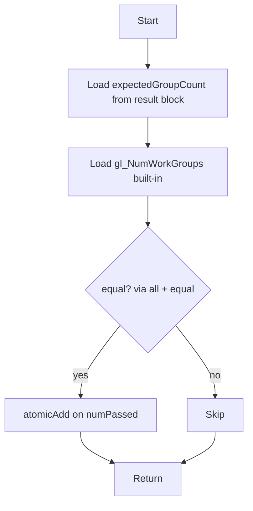

## Overview

**Core question:** When `vkCmdDispatchIndirect` (or its device-address variant) consumes a `VkDispatchIndirectCommand` triplet whose contents are either host-uploaded or written by a preceding compute shader, does the dispatch actually run with the supplied workgroup counts and reach every expected invocation?

- [vktComputeIndirectComputeDispatchTests.cpp](../../../modules/vulkan/compute/vktComputeIndirectComputeDispatchTests.cpp#L1) implements the `indirect_dispatch` test family under `compute.pipeline` and the two shader-object construction roots. Two intermediate nodes share the same parameter matrix: `upload_buffer` (host fills the indirect command buffer) and `gen_in_compute` (a generator shader writes the indirect command buffer, then a compute-to-indirect barrier hands it off to `vkCmdDispatchIndirect`).
- The host validation is one atomic-add counter per dispatch command: each verifier invocation increments the counter when its `gl_NumWorkGroups` matches the host-known triplet, and the host expects `numPassed == workGroupSize.product() * numWorkGroups.product()` for every block.
- The base matrix is registered for both `upload_buffer` and `gen_in_compute`, with a `_compute_only_queue` leaf for every base case. Non-VulkanSC builds add `_device_address` leaves only for alternating case indices, placing each such leaf in one of the two subgroups according to the pipeline-construction type; these modifiers therefore do not apply to every matrix entry.
- The page explains how each flavor wires up the indirect command buffer, where the only nontrivial synchronization (compute-to-indirect buffer barrier) lives, and how a failure would point to specific buffer-layout, barrier, descriptor, or pipeline-construction defects.

## Background Knowledge

- **`VkDispatchIndirectCommand` layout.** The indirect buffer consumed by `vkCmdDispatchIndirect` holds three `uint32_t` values in order: `groupCountX`, `groupCountY`, `groupCountZ`. The host pre-fills a result block using the same triplet layout so the verifier shader can compare its built-in `gl_NumWorkGroups` against the host-known triplet. The constant `INDIRECT_COMMAND_OFFSET = 3 * sizeof(uint32_t)` is the command-record size (12 bytes); `multi_dispatch` includes adjacent records at offsets 0/12 and 40/52, while `multi_dispatch_reuse_command` deliberately dispatches repeatedly from offsets 0, 104, and 52.
- **Compute-to-indirect barrier.** When the indirect buffer is written by a compute shader (the `gen_in_compute` flavor), the spec requires a buffer memory barrier from `VK_ACCESS_SHADER_WRITE_BIT` (source) to `VK_ACCESS_INDIRECT_COMMAND_READ_BIT` (destination), with `VK_PIPELINE_STAGE_COMPUTE_SHADER_BIT` as the source stage and `VK_PIPELINE_STAGE_DRAW_INDIRECT_BIT` as the destination stage. The `upload_buffer` flavor does not need this barrier because the host flushes the allocation directly with `vk::flushAlloc`.
- **Compute-only queue families.** The `_compute_only_queue` modifier requires a queue family that exposes `VK_QUEUE_COMPUTE_BIT` without `VK_QUEUE_GRAPHICS_BIT`, and the host builds a custom device to expose that queue alongside the universal queue family. If no such family exists, the test throws `NotSupportedError`.
- **Device-address dispatch variant.** Under non-VulkanSC builds the `_device_address` modifier switches to `vkCmdDispatchIndirect2KHR`. The indirect buffer is also created with `VK_BUFFER_USAGE_SHADER_DEVICE_ADDRESS_BIT`, and the host populates `VkDispatchIndirect2InfoKHR::addressRange` from `getBufferDeviceAddress`. Several `addressFlags` values are exercised: `VK_ADDRESS_COMMAND_UNKNOWN_STORAGE_BUFFER_USAGE_BIT_KHR` is always set, plus `VK_ADDRESS_COMMAND_UNKNOWN_TRANSFORM_FEEDBACK_BUFFER_USAGE_BIT_KHR` when `workGroupSize.x() > 1` and `VK_ADDRESS_COMMAND_FULLY_BOUND_BIT_KHR` when `workGroupSize.y() > 1`.
- **Pipeline construction variant.** The category dispatcher runs every child factory under three roots (`pipeline`, `shader_object_spirv`, `shader_object_binary`); the shader-object roots are non-VulkanSC. The instance code uses `vk::ComputePipelineWrapper` for the verifier pipeline; only the generator pipeline (`gen_in_compute` only) is built with `makeComputePipeline`.

## Registration Hierarchy

```text
compute.pipeline.indirect_dispatch
├── upload_buffer
└── gen_in_compute
```

The same two children appear under `compute.shader_object_spirv.indirect_dispatch` and `compute.shader_object_binary.indirect_dispatch`. Each base case in `s_dispatchCases` produces a base leaf plus a `_compute_only_queue` leaf under both subgroups. The `_device_address` modifier is non-VulkanSC only and alternates between subgroups based on `(ndx % 2) == (computePipelineConstructionType % 2)`.

## Parameter Dimensions and Observed Values

| Dimension | Registered values | Meaning in this test | Evidence |
|-----------|-------------------|----------------------|----------|
| Subgroup flavor | `upload_buffer`, `gen_in_compute` | Selects host-uploaded vs compute-generated indirect command buffer; the only structural difference between flavors. | [createIndirectComputeDispatchTests](../../../modules/vulkan/compute/vktComputeIndirectComputeDispatchTests.cpp#L874-L880) |
| Dispatch case name | `single_invocation`, `multiple_groups`, `multiple_groups_multiple_invocations`, `small_offset`, `large_offset`, `large_offset_multiple_invocations`, `empty_command`, `multi_dispatch`, `multi_dispatch_reuse_command` | Single vs multi workgroup, single vs multi invocation, small/large offset, empty command, multi-dispatch with/without offset reuse. | [s_dispatchCases](../../../modules/vulkan/compute/vktComputeIndirectComputeDispatchTests.cpp#L842-L872) |
| Workgroup size | `(1,1,1)`, `(2,3,1)`, `(3,1,2)` examples | Single invocation, multi invocation per group, non-uniform axes. Used both as `local_size_*` in the verifier shader and as inputs to the `addressFlags` selection. | [s_dispatchCases](../../../modules/vulkan/compute/vktComputeIndirectComputeDispatchTests.cpp#L844-L867) |
| Indirect buffer offset | `0`, `16`, `(1 << 20) + 12`; `multi_dispatch` uses `0`, `12`, `104`, `40`, and `52`, while `multi_dispatch_reuse_command` repeats `0`, `104`, and `52` | Verifies offset arithmetic into the indirect buffer; large offset also forces the buffer size to `2 MiB`, and repeated offsets verify command reuse. | [s_dispatchCases](../../../modules/vulkan/compute/vktComputeIndirectComputeDispatchTests.cpp#L852-L870) |
| Indirect buffer size | `INDIRECT_COMMAND_OFFSET` (12 B), `16 + INDIRECT_COMMAND_OFFSET` (28 B), `(2 << 20)` (2 MiB), `1 << 10` (1 KiB) | Drives the host `flushAlloc` range and (for `gen_in_compute`) the size of the buffer barrier. | [s_dispatchCases](../../../modules/vulkan/compute/vktComputeIndirectComputeDispatchTests.cpp#L844-L870) |
| Queue family selector | base case (universal queue), `_compute_only_queue` modifier | Routes the dispatch through a custom device with a non-graphics compute queue family when the modifier is set. | [Registration loop](../../../modules/vulkan/compute/vktComputeIndirectComputeDispatchTests.cpp#L882-L897) |
| Indirect dispatch command | `vkCmdDispatchIndirect` (default) or `vkCmdDispatchIndirect2KHR` (`_device_address` modifier, non-VulkanSC only) | Selects the buffer-offset form vs the device-address form of the indirect command. | [Registration loop](../../../modules/vulkan/compute/vktComputeIndirectComputeDispatchTests.cpp#L899-L917) |
| Pipeline construction variant | `pipeline`, `shader_object_spirv` (non-VulkanSC), `shader_object_binary` (non-VulkanSC) | Selects which root the same child factory runs under; the `_device_address` alternation rule uses `computePipelineConstructionType % 2`. | [Category dispatcher](../../../modules/vulkan/compute/vktComputeTests.cpp#L48-L85) |

## Behavior Parameters

The primary behavioral axis for this page is the **subgroup flavor** rooted at `compute.pipeline.indirect_dispatch`. The flavor decides the buffer-filling mechanism and therefore whether the compute-to-indirect barrier is required. The modifier suffixes (`_compute_only_queue`, `_device_address`) live in `## Parameter Dimensions` and are not flavors.

### upload_buffer — Host-uploaded indirect command buffer

The host allocates an indirect buffer with `VK_BUFFER_USAGE_INDIRECT_BUFFER_BIT | VK_BUFFER_USAGE_STORAGE_BUFFER_BIT` (plus `VK_BUFFER_USAGE_SHADER_DEVICE_ADDRESS_BIT` for the `_device_address` modifier), writes the `VkDispatchIndirectCommand` triplet at the registered offset, and calls `vk::flushAlloc` to make the host write visible to the device [fillIndirectBufferData](../../../modules/vulkan/compute/vktComputeIndirectComputeDispatchTests.cpp#L326-L349), [Dispatch loop](../../../modules/vulkan/compute/vktComputeIndirectComputeDispatchTests.cpp#L466-L538). The same record-then-submit sequence records a separate descriptor set for each command, binds it, and issues one `vkCmdDispatchIndirect` (or `vkCmdDispatchIndirect2KHR`) per command, then closes with a `cmdPipelineBarrier(COMPUTE_SHADER → HOST, SHADER_WRITE → HOST_READ)` so the shader's atomic counter is visible to the host readback.

The verifier pipeline reads `gl_NumWorkGroups` and compares it against the host-pre-filled `expectedGroupCount`; on equality the invocation increments a `coherent uint numPassed` atomic counter. The host expects `numPassed == workGroupSize.product() * numWorkGroups.product()` for every result block; `empty_command` is the special case where the dispatch is `(0,0,0)`, the shader does not run, and the expected count is `0`. The `multi_dispatch_reuse_command` case repeats offsets; the same triplet must be honored twice. A wrong triplet interpretation, a missing `flushAlloc`, or a missing compute-to-host barrier surfaces as `numPassed` not matching the expected count.

### gen_in_compute — Compute-generated indirect command buffer

The host allocates the same indirect buffer but does not fill it; instead a generator compute shader runs first and writes each registered triplet at the registered offset [Generator shader generation](../../../modules/vulkan/compute/vktComputeIndirectComputeDispatchTests.cpp#L790-L830), [Compute-generated buffer fill](../../../modules/vulkan/compute/vktComputeIndirectComputeDispatchTests.cpp#L717-L769). After `cmdDispatch(1,1,1)` on the generator pipeline, the host inserts the compute-to-indirect barrier (`SHADER_WRITE → INDIRECT_COMMAND_READ`, `COMPUTE_SHADER → DRAW_INDIRECT`) and then runs the same descriptor-bind-then-`vkCmdDispatchIndirect` sequence as `upload_buffer`.

This flavor is the only place on the page where nontrivial synchronization lives: a missing or mis-scoped barrier produces the wrong triplet at the indirect-dispatch consumer, and the verifier counter will not match. The generator shader itself is hard-coded to `local_size = (1,1,1)` and emits one `writeCmd(offset, uvec3)` call per registered command; an error in offset-to-element arithmetic or in the descriptor layout of the generator's storage buffer would also surface as wrong triplets reaching the verifier.

## Shader Analysis

The two flavors share the same verifier shader and only differ in how the indirect buffer is filled. This page uses one walkthrough for the verifier shader because it is the canonical read-and-compare shape that every case exercises, and the generator shader is essentially a writer that funnels the same triplets into the indirect buffer.

### Representative Shader Walkthrough 1

#### Parameter Values Chosen

Representative path:

```text
dEQP-VK.compute.pipeline.indirect_dispatch.upload_buffer.single_invocation
```

The same verifier-shader generator also backs `single_invocation_compute_only_queue` and, under non-VulkanSC, `single_invocation_device_address` in the pipeline and shader-object-binary roots. (The shader-object-SPIR-V root places that index's device-address leaf in `gen_in_compute` instead.) The `_compute_only_queue` and `_device_address` modifiers do not change the verifier shader.

| Parameter choice | Meaning in this representative case |
|------------------|-------------------------------------|
| `upload_buffer` flavor | The verifier sees a host-uploaded indirect command buffer; there is no compute-to-indirect barrier, which keeps the walkthrough focused on the atomic-add validation signal rather than on the generator barrier path. |
| `single_invocation` case | `local_size = (1,1,1)` and `numWorkGroups = (1,1,1)` keep the shader trivially serial; one invocation runs and the host expects exactly one atomic increment. |
| `numWorkGroups` offset `0` | Smallest buffer; the indirect triplet sits at the buffer's first three `uint32_t` slots. |
| Workgroup size `(1,1,1)` | Sets `LOCAL_SIZE_X/Y/Z = 1` in the GLSL template, which is the parameterization most `single_*` cases share. |

#### Purpose

The shader must compare its built-in `gl_NumWorkGroups` against the host-pre-filled `expectedGroupCount` triplet, and on equality atomically increment a per-block counter so the host can detect missing or extra invocations.

#### Structural Design



The control flow is one branch on vector equality; no loops, no shared memory, no descriptor-set switching inside the shader.

#### Shader Code

```glsl
#version 310 es
/// Generated by IndirectDispatchCaseBufferUpload::initPrograms for the verifier pipeline.
/// Selected dimensions: local_size = (1,1,1), workgroups = (1,1,1), numWorkGroups = (1,1,1).
/// The shader is reused unchanged for every case in s_dispatchCases; only the layout(local_size_*) qualifiers vary.
layout(local_size_x = 1, local_size_y = 1, local_size_z = 1) in;
/// Binding 0 is the only descriptor: one result block per registered dispatch command.
/// result.expectedGroupCount is pre-filled by the host from the same VkDispatchIndirectCommand triplet.
/// result.numPassed is a coherent uint that the verifier increments; the host expects it to equal
/// workGroupSize.product() * numWorkGroups.product().
layout(set = 0, binding = 0, std430) buffer Result
{
    uvec3           expectedGroupCount;
    coherent uint   numPassed;
} result;
void main (void)
{
    /// Single guard: when gl_NumWorkGroups matches the pre-filled triplet, count this invocation.
    if (all(equal(result.expectedGroupCount, gl_NumWorkGroups)))
        atomicAdd(result.numPassed, 1u);
}
```

#### Additional Info

- The verifier pipeline uses `vk::ComputePipelineWrapper` and is created with the descriptor set layout that has one `STORAGE_BUFFER` binding at `set = 0, binding = 0`. The host allocates one descriptor set per registered command and binds them in sequence, so the same result-block layout serves as the only descriptor binding for every case.
- The host pre-fills `result.expectedGroupCount` and resets `result.numPassed = 0` for every block before recording the dispatch loop, so the shader does not need to clear its own counters.
- For the `empty_command` case the host registers `(0,0,0)` workgroups; the verifier shader never runs and the host accepts `numPassed == 0`. The shader still compiles and the descriptor set is still bound, so the indirect-dispatch code path is exercised.

#### Parameter Variation Summary

| Parameter dimension | Shader-level variation from this shader | Evidence |
|---------------------|---------------------------------------|----------|
| Local size | `layout(local_size_x/y/z)` is parameterized from `m_params.workGroupSize` per case. `multiple_groups_multiple_invocations` and `large_offset_multiple_invocations` use `(2,3,1)`; `multi_dispatch` and `multi_dispatch_reuse_command` use `(3,1,2)`. | [IndirectDispatchCaseBufferUpload::initPrograms](../../../modules/vulkan/compute/vktComputeIndirectComputeDispatchTests.cpp#L624-L654) |
| Flavor | `gen_in_compute` uses the same verifier shader text plus a separate generator shader that writes the indirect buffer triplets at the registered offsets. The verifier shader does not change. | [IndirectDispatchCaseBufferGenerate::initPrograms](../../../modules/vulkan/compute/vktComputeIndirectComputeDispatchTests.cpp#L790-L830) |
| Pipeline construction variant | The shader does not change. `vk::ComputePipelineWrapper` selects between pipeline creation and shader-object creation at pipeline build time. | [computePipeline binding](../../../modules/vulkan/compute/vktComputeIndirectComputeDispatchTests.cpp#L444-L449), [Category dispatcher](../../../modules/vulkan/compute/vktComputeTests.cpp#L48-L85) |
| `_device_address` modifier | The shader does not change. The dispatch call switches from `vkCmdDispatchIndirect(buffer, offset)` to `vkCmdDispatchIndirect2KHR(&dispatchIndirect2Info)`; the indirect buffer is created with `VK_BUFFER_USAGE_SHADER_DEVICE_ADDRESS_BIT` and a device address is queried for `addressRange`. | [Dispatch loop](../../../modules/vulkan/compute/vktComputeIndirectComputeDispatchTests.cpp#L471-L532) |
| `addressFlags` for device-address variant | `addressFlags` selection depends on the registered workgroup size: `UNKNOWN_STORAGE_BUFFER_USAGE_BIT` always, plus `UNKNOWN_TRANSFORM_FEEDBACK_BUFFER_USAGE_BIT` when `workGroupSize.x() > 1`, plus `FULLY_BOUND_BIT` when `workGroupSize.y() > 1`. The shader does not see these flags. | [Dispatch loop](../../../modules/vulkan/compute/vktComputeIndirectComputeDispatchTests.cpp#L518-L532) |

#### SPIR-V

- Status: generated and validated
- Source: reconstructed `GLSL` from this walkthrough
- Stage: `comp`
- Target SPIRV version: `spirv1.0`

<details>
<summary>Click to expand SPIRV asm code</summary>

```llvm
; SPIR-V
; Version: 1.0
; Generator: Khronos Glslang Reference Front End; 11
; Bound: 32
; Schema: 0
               OpCapability Shader
          %1 = OpExtInstImport "GLSL.std.450"
               OpMemoryModel Logical GLSL450
               OpEntryPoint GLCompute %main "main" %gl_NumWorkGroups
               OpExecutionMode %main LocalSize 1 1 1
               OpSource ESSL 310
               OpName %main "main"
               OpName %Result "Result"
               OpMemberName %Result 0 "expectedGroupCount"
               OpMemberName %Result 1 "numPassed"
               OpName %result "result"
               OpName %gl_NumWorkGroups "gl_NumWorkGroups"
               OpDecorate %Result BufferBlock
               OpMemberDecorate %Result 0 Offset 0
               OpMemberDecorate %Result 1 Coherent
               OpMemberDecorate %Result 1 Offset 12
               OpDecorate %result Binding 0
               OpDecorate %result DescriptorSet 0
               OpDecorate %gl_NumWorkGroups BuiltIn NumWorkgroups
               OpDecorate %gl_WorkGroupSize BuiltIn WorkgroupSize
       %void = OpTypeVoid
          %3 = OpTypeFunction %void
       %uint = OpTypeInt 32 0
     %v3uint = OpTypeVector %uint 3
     %Result = OpTypeStruct %v3uint %uint
%_ptr_Uniform_Result = OpTypePointer Uniform %Result
     %result = OpVariable %_ptr_Uniform_Result Uniform
        %int = OpTypeInt 32 1
      %int_0 = OpConstant %int 0
%_ptr_Uniform_v3uint = OpTypePointer Uniform %v3uint
%_ptr_Input_v3uint = OpTypePointer Input %v3uint
%gl_NumWorkGroups = OpVariable %_ptr_Input_v3uint Input
       %bool = OpTypeBool
     %v3bool = OpTypeVector %bool 3
      %int_1 = OpConstant %int 1
%_ptr_Uniform_uint = OpTypePointer Uniform %uint
     %uint_1 = OpConstant %uint 1
     %uint_0 = OpConstant %uint 0
%gl_WorkGroupSize = OpConstantComposite %v3uint %uint_1 %uint_1 %uint_1
       %main = OpFunction %void None %3
          %5 = OpLabel
         %14 = OpAccessChain %_ptr_Uniform_v3uint %result %int_0
         %15 = OpLoad %v3uint %14
         %18 = OpLoad %v3uint %gl_NumWorkGroups
         %21 = OpIEqual %v3bool %15 %18
         %22 = OpAll %bool %21
               OpSelectionMerge %24 None
               OpBranchConditional %22 %23 %24
         %23 = OpLabel
         %27 = OpAccessChain %_ptr_Uniform_uint %result %int_1
         %30 = OpAtomicIAdd %uint %27 %uint_1 %uint_0 %uint_1
               OpBranch %24
         %24 = OpLabel
               OpReturn
               OpFunctionEnd
```

</details>

## Runtime Execution and Result Checking

- **Resource setup.** Each test instance allocates an indirect command buffer with `INDIRECT_BUFFER_BIT | STORAGE_BUFFER_BIT` (plus `SHADER_DEVICE_ADDRESS_BIT` for the device-address modifier), a result buffer with one `std430` block per registered command (size aligned to `minStorageBufferOffsetAlignment`), a descriptor pool sized to one descriptor per command, and one descriptor set per command bound to a slice of the result buffer [Resource setup](../../../modules/vulkan/compute/vktComputeIndirectComputeDispatchTests.cpp#L412-L456), [Descriptor set allocation](../../../modules/vulkan/compute/vktComputeIndirectComputeDispatchTests.cpp#L487-L510).
- **Pipeline build.** The verifier pipeline uses `vk::ComputePipelineWrapper` and the binary collection entry `indirect_dispatch_<case>_verify`. The generator pipeline (`gen_in_compute` only) uses `makeComputePipeline` with the binary collection entry `indirect_dispatch_<case>_generate`.
- **Indirect buffer fill.** `upload_buffer` writes the triplet directly into the host pointer and calls `vk::flushAlloc` [fillIndirectBufferData (upload)](../../../modules/vulkan/compute/vktComputeIndirectComputeDispatchTests.cpp#L326-L349). `gen_in_compute` records a `cmdDispatch(1,1,1)` on the generator pipeline with a single descriptor set bound to the indirect buffer, then inserts a `VkBufferMemoryBarrier(SHADER_WRITE → INDIRECT_COMMAND_READ, COMPUTE_SHADER → DRAW_INDIRECT)` [fillIndirectBufferData (generate)](../../../modules/vulkan/compute/vktComputeIndirectComputeDispatchTests.cpp#L717-L769).
- **Dispatch loop.** For each registered command the host binds the corresponding descriptor set and issues one `vkCmdDispatchIndirect(buffer, offset)` (or `vkCmdDispatchIndirect2KHR(&info)` for the device-address variant). The descriptor offset inside the result buffer advances by `resultBlockSize` after every command [Dispatch loop](../../../modules/vulkan/compute/vktComputeIndirectComputeDispatchTests.cpp#L466-L538).
- **Result readback.** After the dispatch loop the host inserts a `cmdPipelineBarrier(COMPUTE_SHADER → HOST, SHADER_WRITE → HOST_READ)` on the result buffer, submits the command buffer, and waits. `verifyResultBuffer` walks every block and compares the shader-incremented `numPassed` against `workGroupSize.product() * numWorkGroups.product()` [Result verification](../../../modules/vulkan/compute/vktComputeIndirectComputeDispatchTests.cpp#L557-L590).
- **Compute-only queue variant.** When `m_params.computeOnlyQueue` is true the host builds a custom device with a separate non-graphics compute queue family, creates a new `DeviceDriver` (`DeviceDriverSC` on VulkanSC) bound to that device, and routes `m_queue` to the compute queue. The `_device_address` modifier alternates whether `useComputeOnlyQueue` is true based on `(ndx % 4) == 0`.
- **Test log.** Before execution the host logs the buffer size and every registered command triplet (`offset`, `numWorkGroups`) so a failing case can be inspected without re-running [Test log](../../../modules/vulkan/compute/vktComputeIndirectComputeDispatchTests.cpp#L362-L374).

## Failure Meaning

### Failure Cause Mapping

| If this behavior parameter value fails | Possible failure cause(s) |
|----------------------------------------|---------------------------|
| `upload_buffer` | Wrong `VkDispatchIndirectCommand` layout interpretation; offset into the indirect buffer misread; result block pre-fill mismatch; missing `flushAlloc` after host fill; compute-to-host `cmdPipelineBarrier` failing to make shader atomic writes visible; missing descriptor set bind between dispatches; descriptor type or range mismatch on the result buffer; pipeline construction (pipeline vs shader object) mishandling; queue family selector picking the wrong queue; `vkCmdDispatchIndirect2KHR` path failing when `_device_address` modifier is set. |
| `gen_in_compute` | Missing `VkBufferMemoryBarrier` from `SHADER_WRITE` to `INDIRECT_COMMAND_READ` between the generator dispatch and the indirect dispatch; wrong source or destination stage on the compute-to-indirect barrier; generator shader writing triplets at wrong offsets; generator shader local size or descriptor layout mismatch; result-block pre-fill mismatch on the host; compute-to-host `cmdPipelineBarrier` failing; pipeline construction mishandling; queue family selector picking the wrong queue for the `_compute_only_queue` modifier; `vkCmdDispatchIndirect2KHR` path failing when `_device_address` modifier is set. |

### Cause Analysis

#### `upload_buffer` failures

**Possible failure symptoms:** A `Comparison failed for Output` mismatch in `verifyResultBuffer` logging `ERROR: got invalid result for invocation <i>: got numPassed = <v>, expected <v>`; the test log shows the expected triplet but `numPassed` is `0`, a partial count, or a count that matches an unexpected workgroup shape.

**Possible implementation causes:** A driver that interprets `vkCmdDispatchIndirect(buffer, offset)` as reading from the start of the buffer rather than at the registered offset surfaces as `numPassed == 0` for the `small_offset` and `large_offset*` cases. A driver that does not honor the host-side `flushAlloc` (or that requires a `HOST → INDIRECT_COMMAND_READ` barrier on the indirect buffer for the upload path) also surfaces as `numPassed == 0`. A wrong `std430` block layout, a missing descriptor bind between dispatches, or a result-buffer range that does not cover the full block produces a partial `numPassed` count. For the `_device_address` modifier, a driver that does not support the chosen `addressFlags` combination (`UNKNOWN_STORAGE_BUFFER_USAGE_BIT_KHR`, plus `UNKNOWN_TRANSFORM_FEEDBACK_BUFFER_USAGE_BIT_KHR` for `workGroupSize.x() > 1`, plus `FULLY_BOUND_BIT_KHR` for `workGroupSize.y() > 1`) may reject the dispatch or silently consume the wrong range. Other failure sources require source-level investigation.

#### `gen_in_compute` failures

**Possible failure symptoms:** A `Comparison failed for Output` mismatch where `numPassed == 0` for cases whose generator wrote a non-zero triplet; a mismatch whose `numPassed` matches the workgroup shape but not the workgroup count (suggests a stale buffer that still held the host-side triplet from a prior pass); a `NotSupportedError` from `checkSupport` for the `_compute_only_queue` or `_device_address` modifier.

**Possible implementation causes:** The compute-to-indirect barrier is the central synchronization point. A driver that omits `VkBufferMemoryBarrier(SHADER_WRITE → INDIRECT_COMMAND_READ, COMPUTE_SHADER → DRAW_INDIRECT)` after the generator dispatch executes the indirect dispatch with stale or zero triplets and `numPassed == 0`. A driver that uses the wrong source or destination stage (for example, `COMPUTE_SHADER → HOST` instead of `COMPUTE_SHADER → DRAW_INDIRECT`) does not synchronize the write into the indirect-command consumer. The generator shader writes triplets at the registered offset divided by `sizeof(uint32_t)`; a driver that misaligns the storage buffer or that uses a non-`std430` runtime array produces wrong triplets that surface as a count that does not match any registered triplet. For the `_device_address` modifier, a missing `VK_KHR_device_address_commands` check throws `NotSupportedError`. Other failure sources require source-level investigation.

## Case Pruning

### Requirement-based pruning

- The `_compute_only_queue` modifier requires a queue family that exposes `VK_QUEUE_COMPUTE_BIT` without `VK_QUEUE_GRAPHICS_BIT`; if no such family exists, the case throws `NotSupportedError` [checkSupport](../../../modules/vulkan/compute/vktComputeIndirectComputeDispatchTests.cpp#L661-L681).
- The `_device_address` modifier requires `VK_KHR_device_address_commands`; without it the case throws `NotSupportedError` [checkSupport](../../../modules/vulkan/compute/vktComputeIndirectComputeDispatchTests.cpp#L683-L684).
- `checkShaderObjectRequirements` is called regardless of pipeline-construction variant; a missing shader-object feature would skip the case under `compute.shader_object_spirv.*` and `compute.shader_object_binary.*` roots [checkSupport](../../../modules/vulkan/compute/vktComputeIndirectComputeDispatchTests.cpp#L686-L687).
- The `_device_address` modifier is conditionally compiled out under `CTS_USES_VULKANSC`; the corresponding mustpass coverage in `vksc-default/compute.txt` does not list `_device_address` leaves.

### Design-based pruning

- `s_dispatchCases` intentionally uses `local_size = (1,1,1)` for the offset-variation cases so the host can pinpoint per-element mismatches to offset arithmetic rather than to multi-invocation race conditions. Multi-invocation and multi-group shapes are concentrated in `multiple_groups_multiple_invocations`, `large_offset_multiple_invocations`, and the two `multi_dispatch` cases.
- `_device_address` alternation: the registration loop adds each device-address case to either `upload_buffer` or `gen_in_compute` based on `(ndx % 2) == (computePipelineConstructionType % 2)`. This is a deliberate matrix-split design choice, not a bug; the mustpass coverage reflects it.
- `multi_dispatch_reuse_command` repeats offsets `0`, `104`, and `52` so the same triplet is consumed multiple times; the buffer must be sized to hold the highest offset plus the triplet. The `1 KiB` buffer size covers all offsets in this case.
- `empty_command` registers `numWorkGroups = (0,0,0)`; the indirect-dispatch code path is still exercised, but the shader does not run and the host expects `numPassed == 0`.

## Key Takeaways

- The page covers two flavors (`upload_buffer`, `gen_in_compute`) that share one dispatch parameter matrix; the only structural difference is how the indirect command buffer is populated and whether the compute-to-indirect barrier is required.
- The verifier shader is one atomic-add counter per dispatch command; the host expects `numPassed == workGroupSize.product() * numWorkGroups.product()` for every result block, and `numPassed == 0` for `empty_command`.
- The `_compute_only_queue` modifier forces a custom device with a non-graphics compute queue family; the `_device_address` modifier switches to `vkCmdDispatchIndirect2KHR` under `VK_KHR_device_address_commands` (non-VulkanSC only) and alternates between subgroups based on the case index and the pipeline construction type.
- The compute-to-indirect `VkBufferMemoryBarrier(SHADER_WRITE → INDIRECT_COMMAND_READ, COMPUTE_SHADER → DRAW_INDIRECT)` is the only nontrivial synchronization on the page; a missing or mis-scoped barrier surfaces as `numPassed == 0` for the `gen_in_compute` flavor.
- See `## Failure Meaning` for per-flavor failure analysis grounded in the test's validation logic.

## Source Reference Appendix

| Entry point | Link | Why it matters |
|-------------|------|----------------|
| `createIndirectComputeDispatchTests` | [vktComputeIndirectComputeDispatchTests.cpp#L839-L921](../../../modules/vulkan/compute/vktComputeIndirectComputeDispatchTests.cpp#L839-L921) | Registers `indirect_dispatch`, both subgroups, both modifiers, and the dispatch parameter matrix. |
| `IndirectDispatchCaseBufferUpload::initPrograms` | [vktComputeIndirectComputeDispatchTests.cpp#L624-L654](../../../modules/vulkan/compute/vktComputeIndirectComputeDispatchTests.cpp#L624-L654) | Generates the verifier shader `indirect_dispatch_<case>_verify`. |
| `IndirectDispatchCaseBufferGenerate::initPrograms` | [vktComputeIndirectComputeDispatchTests.cpp#L790-L830](../../../modules/vulkan/compute/vktComputeIndirectComputeDispatchTests.cpp#L790-L830) | Generates the generator shader `indirect_dispatch_<case>_generate` (gen_in_compute only). |
| `IndirectDispatchInstanceBufferUpload::iterate` | [vktComputeIndirectComputeDispatchTests.cpp#L351-L555](../../../modules/vulkan/compute/vktComputeIndirectComputeDispatchTests.cpp#L351-L555) | Allocates buffers, binds descriptor sets, records the dispatch loop, runs the compute-to-host barrier, and verifies the result. |
| `fillIndirectBufferData` (upload) | [vktComputeIndirectComputeDispatchTests.cpp#L326-L349](../../../modules/vulkan/compute/vktComputeIndirectComputeDispatchTests.cpp#L326-L349) | Writes the indirect triplet into the host pointer and flushes the allocation. |
| `fillIndirectBufferData` (generate) | [vktComputeIndirectComputeDispatchTests.cpp#L717-L769](../../../modules/vulkan/compute/vktComputeIndirectComputeDispatchTests.cpp#L717-L769) | Records the generator pipeline dispatch and inserts the compute-to-indirect barrier. |
| `verifyResultBuffer` | [vktComputeIndirectComputeDispatchTests.cpp#L557-L590](../../../modules/vulkan/compute/vktComputeIndirectComputeDispatchTests.cpp#L557-L590) | Walks every result block and checks `numPassed` against the expected count. |
| `IndirectDispatchCaseBufferUpload::checkSupport` | [vktComputeIndirectComputeDispatchTests.cpp#L661-L688](../../../modules/vulkan/compute/vktComputeIndirectComputeDispatchTests.cpp#L661-L688) | Gates `_compute_only_queue`, `_device_address`, and shader-object requirements. |
| `createCustomDevice` | [vktComputeIndirectComputeDispatchTests.cpp#L88-L206](../../../modules/vulkan/compute/vktComputeIndirectComputeDispatchTests.cpp#L88-L206) | Builds a custom device with a separate non-graphics compute queue family for the `_compute_only_queue` modifier. |
| Category dispatcher | [vktComputeTests.cpp#L48-L85](../../../modules/vulkan/compute/vktComputeTests.cpp#L48-L85) | `pipeline` / `shader_object_spirv` / `shader_object_binary` roots. |
| Header | [vktComputeIndirectComputeDispatchTests.hpp#L37-L38](../../../modules/vulkan/compute/vktComputeIndirectComputeDispatchTests.hpp#L37-L38) | Factory declaration. |
