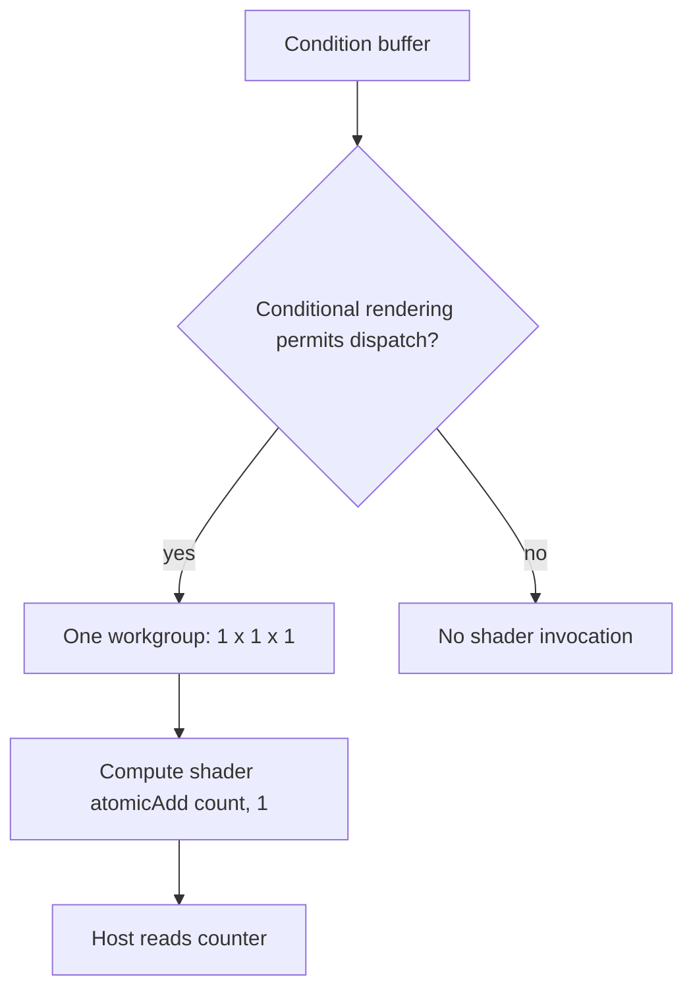

## Overview

**Core question:** Do direct, indirect, and base compute dispatch commands execute exactly when `VK_EXT_conditional_rendering` permits them?

- This page covers the `conditional_rendering.dispatch` test family implemented in [vktConditionalDispatchTests.cpp](../../../modules/vulkan/conditional_rendering/vktConditionalDispatchTests.cpp).
- The family uses one fixed compute shader. Each executed dispatch adds one to a coherent storage-buffer counter, so the host can distinguish executed work from suppressed work.
- The main matrix combines the shared condition data with `dispatch`, `dispatch_indirect`, and `dispatch_base`. Focused groups check 32-bit predicate interpretation, allocation offsets, and submission on a compute queue.
- The page explains the command-buffer paths, predicate storage, exact counter validation, support gates, and the fixed compute shader.

## Background Knowledge

- **Conditional rendering predicates.** `VK_EXT_conditional_rendering` brackets affected commands with `vkCmdBeginConditionalRenderingEXT` and `vkCmdEndConditionalRenderingEXT`. The implementation reads a 32-bit value at the specified buffer offset. Without inversion, zero suppresses the commands and a nonzero value permits them. `VK_CONDITIONAL_RENDERING_INVERTED_BIT_EXT` reverses this decision. See [Conditional Rendering](../../../../vulkan-docs/src/chapters/drawing.adoc#L2086-L2167).
- **Secondary command-buffer inheritance.** A secondary command buffer may execute while conditional rendering is active in its primary command buffer only when its inheritance information enables conditional rendering. This page uses that mechanism to separate command placement from predicate interpretation. See [conditional-rendering inheritance](../../../../vulkan-docs/src/chapters/cmdbuffers.adoc#L1285-L1318).
- **Indirect dispatch.** `vkCmdDispatchIndirect` reads three workgroup counts from a `VkDispatchIndirectCommand` in a buffer. The test keeps those counts at `1, 1, 1`, so the command form changes how arguments arrive without changing the shader workload.

## Registration Hierarchy

```text
conditional_rendering.dispatch
├── alloc_offset
├── compute_queue
├── condition_host_memory_expect_execution
├── condition_host_memory_expect_execution_inverted
├── condition_host_memory_expect_noop
├── condition_host_memory_expect_noop_inverted
├── condition_host_memory_inherited_expect_execution
├── condition_host_memory_inherited_expect_execution_inverted
├── condition_host_memory_inherited_expect_noop
├── condition_host_memory_inherited_expect_noop_inverted
├── condition_host_memory_nested_buffer_expect_execution
├── condition_host_memory_nested_buffer_expect_execution_inverted
├── condition_host_memory_nested_buffer_expect_noop
├── condition_host_memory_nested_buffer_expect_noop_inverted
├── condition_host_memory_nested_buffer_nested_inherited_expect_execution
├── condition_host_memory_nested_buffer_nested_inherited_expect_execution_inverted
├── condition_host_memory_nested_buffer_nested_inherited_expect_noop
├── condition_host_memory_nested_buffer_nested_inherited_expect_noop_inverted
├── condition_host_memory_nested_inherited_expect_execution
├── condition_host_memory_nested_inherited_expect_execution_inverted
├── condition_host_memory_nested_inherited_expect_noop
├── condition_host_memory_nested_inherited_expect_noop_inverted
├── condition_host_memory_secondary_buffer_expect_execution
├── condition_host_memory_secondary_buffer_expect_execution_inverted
├── condition_host_memory_secondary_buffer_expect_noop
├── condition_host_memory_secondary_buffer_expect_noop_inverted
├── condition_host_memory_secondary_buffer_inherited_expect_execution
├── condition_host_memory_secondary_buffer_inherited_expect_execution_inverted
├── condition_host_memory_secondary_buffer_inherited_expect_noop
├── condition_host_memory_secondary_buffer_inherited_expect_noop_inverted
├── condition_local_memory_expect_execution
├── condition_local_memory_expect_execution_inverted
├── condition_local_memory_expect_noop
├── condition_local_memory_expect_noop_inverted
├── condition_local_memory_inherited_expect_execution
├── condition_local_memory_inherited_expect_execution_inverted
├── condition_local_memory_inherited_expect_noop
├── condition_local_memory_inherited_expect_noop_inverted
├── condition_local_memory_nested_buffer_expect_execution
├── condition_local_memory_nested_buffer_expect_execution_inverted
├── condition_local_memory_nested_buffer_expect_noop
├── condition_local_memory_nested_buffer_expect_noop_inverted
├── condition_local_memory_nested_buffer_nested_inherited_expect_execution
├── condition_local_memory_nested_buffer_nested_inherited_expect_execution_inverted
├── condition_local_memory_nested_buffer_nested_inherited_expect_noop
├── condition_local_memory_nested_buffer_nested_inherited_expect_noop_inverted
├── condition_local_memory_nested_inherited_expect_execution
├── condition_local_memory_nested_inherited_expect_execution_inverted
├── condition_local_memory_nested_inherited_expect_noop
├── condition_local_memory_nested_inherited_expect_noop_inverted
├── condition_local_memory_secondary_buffer_expect_execution
├── condition_local_memory_secondary_buffer_expect_execution_inverted
├── condition_local_memory_secondary_buffer_expect_noop
├── condition_local_memory_secondary_buffer_expect_noop_inverted
├── condition_local_memory_secondary_buffer_inherited_expect_execution
├── condition_local_memory_secondary_buffer_inherited_expect_execution_inverted
├── condition_local_memory_secondary_buffer_inherited_expect_noop
├── condition_local_memory_secondary_buffer_inherited_expect_noop_inverted
├── condition_size
├── no_condition_host_memory_nested_buffer_nested_inherited_expect_execution
├── no_condition_host_memory_secondary_buffer_inherited_expect_execution
├── no_condition_local_memory_nested_buffer_nested_inherited_expect_execution
└── no_condition_local_memory_secondary_buffer_inherited_expect_execution
```

Each shared condition-data child has `dispatch`, `dispatch_indirect`, and `dispatch_base` leaves. The focused `condition_size`, `alloc_offset`, and `compute_queue` groups expand their own intermediate nodes and command cases. The exact executable paths are listed in the [conditional-rendering mustpass file](../../../mustpass/main/vk-default/conditional-rendering.txt).

## Parameter Dimensions and Observed Values

| Dimension | Registered values | Meaning in this test | Evidence |
|---|---|---|---|
| Shared condition area | `condition_*`, `no_condition_*` | Varies predicate placement, inversion, memory type, command-buffer placement, inheritance, nesting, and expected execution. | [`s_testsData`](../../../modules/vulkan/conditional_rendering/vktConditionalRenderingTestUtil.hpp#L61-L144) |
| Dispatch command | `dispatch`, `dispatch_indirect`, `dispatch_base` | Tests direct counts, buffer-supplied counts, and base dispatch arguments with the same one-workgroup workload. | [`getDispatchCommandTypeName()` and `recordDispatch()`](../../../modules/vulkan/conditional_rendering/vktConditionalDispatchTests.cpp#L42-L186) |
| Predicate-size case | `first_byte`, `second_byte`, `third_byte`, `fourth_byte`, `padded_zero` | Checks all four bytes of the 32-bit predicate and confirms nonzero padding does not make a zero predicate execute. | [`kConditionValueResults`](../../../modules/vulkan/conditional_rendering/vktConditionalDispatchTests.cpp#L450-L535) |
| Command-buffer location | `primary`, `inherited`, `secondary`, `secondary_inherited` | Places the conditional block and dispatch in primary or secondary command buffers, with or without inherited state. | [`ConditionLocation`](../../../modules/vulkan/conditional_rendering/vktConditionalDispatchTests.cpp#L442-L540) |
| Predicate value with allocation offset | `zero`, `nonzero` | Tests a zero or nonzero predicate while the condition buffer is bound with a nonzero memory-allocation offset. | [`alloc_offset` registration](../../../modules/vulkan/conditional_rendering/vktConditionalDispatchTests.cpp#L543-L649) |
| Condition memory | `host_visible`, `device_local` | Uses a host-visible condition buffer directly or copies it to device-local memory before execution. | [`createConditionalRenderingBuffer()`](../../../modules/vulkan/conditional_rendering/vktConditionalRenderingTestUtil.cpp#L70-L121) |
| Queue and command form | `compute_queue`, direct or `_indirect_dispatch` | Repeats one-dispatch cases on a compute queue using direct or indirect command recording. | [`compute_queue` registration](../../../modules/vulkan/conditional_rendering/vktConditionalDispatchTests.cpp#L652-L755) |
| Dispatch count | `3` in the main matrix, `1` in focused groups | Sets the counter value expected when all affected dispatches execute. | [`ConditionalDispatchTests::init()`](../../../modules/vulkan/conditional_rendering/vktConditionalDispatchTests.cpp#L414-L755) |

The complete family contains 280 mustpass paths: 180 main-matrix leaves, 20 predicate-size leaves, 16 allocation-offset leaves, and 64 compute-queue leaves.

## Behavior Parameters

The primary behavioral axis is the registered behavior area. The command leaf is a second axis that changes command encoding while preserving the expected counter rule.

### `condition_*` and `no_condition_*`: shared predicate and placement matrix

`condition_*` cases read a selected predicate and execute or suppress the enclosed dispatches according to its value and inversion flag. `no_condition_*` cases exercise the corresponding inherited or nested command-buffer path without an active conditional block. The main rows record three dispatches.

### `condition_size`: four-byte predicate interpretation

The test places a nonzero bit in each of the four bytes of the condition value. `padded_zero` places a zero value beside nonzero padding and must remain suppressed. Each location uses one direct dispatch.

### `alloc_offset`: condition-buffer address calculation

These cases bind the condition buffer with a nonzero allocation offset, then test zero and nonzero predicate values in all four command-buffer locations and both host-visible and device-local memory. A correct implementation reads the predicate from the buffer's data address, not from the start of its allocation.

### `compute_queue`: conditional dispatch on a compute queue

These cases combine four predicate/inversion outcomes with direct or indirect dispatch, host-visible or device-local condition memory, and four command-buffer locations. Each case records one dispatch and expects either one counter increment or zero.

### `dispatch`, `dispatch_indirect`, and `dispatch_base`: command encoding

The direct command records `vkCmdDispatch(1, 1, 1)`. The indirect command reads one `{1, 1, 1}` `VkDispatchIndirectCommand` from a host-visible buffer. The base command records `vkCmdDispatchBase(0, 0, 0, 1, 1, 1)`. All three forms use the same compute pipeline and counter shader.

## Shader Analysis

The shader does not evaluate conditional rendering. Vulkan command execution decides whether a dispatch reaches the shader. The fixed compute shader turns each reached invocation into one counter increment, which gives the host an exact signal.

### Representative Shader Walkthrough 1

#### Parameter Values Chosen

Representative path:

```text
dEQP-VK.conditional_rendering.dispatch.condition_host_memory_expect_execution.dispatch
```

| Parameter choice | Meaning in this representative case |
|---|---|
| `condition_host_memory_expect_execution` | A host-visible buffer contains `1`; the non-inverted primary condition permits the dispatches. |
| `dispatch` | The test records direct `vkCmdDispatch(1, 1, 1)` calls. |
| `numCalls = 3` | Three one-invocation dispatches should increment the counter to `3`. |

#### Purpose

Each permitted dispatch launches one compute invocation. The invocation atomically adds `1` to the storage-buffer counter, so the final count exposes whether conditional rendering allowed the expected command work.

#### Structural Design



#### Shader Code

```glsl
#version 310 es
layout(local_size_x = 1u, local_size_y = 1u, local_size_z = 1u) in;

layout(set = 0, binding = 0, std140) buffer Out
{
    /// Binding 0 contains the host-observed counter. Coherent access makes the atomic update visible to the host after the test barrier.
    coherent uint count;
};

void main(void)
{
    /// One executed invocation contributes exactly one to the expected dispatch count.
    atomicAdd(count, 1u);
}
```

#### Additional Info

- The source constructs this shader in `initPrograms`; command variants and conditional placement do not change the shader source.
- A direct three-call case should produce `3` when permitted and `0` when suppressed. Focused one-call cases use the same shader and compare against `1` or `0`.

#### Parameter Variation Summary

| Parameter dimension | Shader-level variation from this shader | Evidence |
|---|---|---|
| Condition area | No shader change. Conditional rendering controls whether the command reaches the shader. | [`ConditionalDispatchTestInstance::iterate()`](../../../modules/vulkan/conditional_rendering/vktConditionalDispatchTests.cpp#L188-L400) |
| Dispatch command | No shader change. Direct, indirect, and base forms launch the same `1 x 1 x 1` workgroup. | [`recordDispatch()`](../../../modules/vulkan/conditional_rendering/vktConditionalDispatchTests.cpp#L160-L186) |
| Counter resource | Binding 0 is a coherent storage-buffer member at offset `0`; the host checks its first 32-bit word. | [`descriptorInfo` and result check](../../../modules/vulkan/conditional_rendering/vktConditionalDispatchTests.cpp#L227-L232) |

#### SPIR-V

- Status: generated and validated
- Source: reconstructed `GLSL` from this walkthrough
- Stage: `comp`
- Target SPIRV version: `spirv1.0`

<details>
<summary>Click to expand SPIRV asm code</summary>

```llvm
; SPIR-V
; Version: 1.0
; Generator: Khronos Glslang Reference Front End; 11
; Bound: 19
; Schema: 0
               OpCapability Shader
          %1 = OpExtInstImport "GLSL.std.450"
               OpMemoryModel Logical GLSL450
               OpEntryPoint GLCompute %main "main"
               OpExecutionMode %main LocalSize 1 1 1
               OpSource ESSL 310
               OpName %main "main"
               OpName %Out "Out"
               OpMemberName %Out 0 "count"
               OpName %_ ""
               OpDecorate %Out BufferBlock
               OpMemberDecorate %Out 0 Coherent
               OpMemberDecorate %Out 0 Offset 0
               OpDecorate %_ Binding 0
               OpDecorate %_ DescriptorSet 0
               OpDecorate %gl_WorkGroupSize BuiltIn WorkgroupSize
       %void = OpTypeVoid
          %3 = OpTypeFunction %void
       %uint = OpTypeInt 32 0
        %Out = OpTypeStruct %uint
%_ptr_Uniform_Out = OpTypePointer Uniform %Out
          %_ = OpVariable %_ptr_Uniform_Out Uniform
        %int = OpTypeInt 32 1
      %int_0 = OpConstant %int 0
%_ptr_Uniform_uint = OpTypePointer Uniform %uint
     %uint_1 = OpConstant %uint 1
     %uint_0 = OpConstant %uint 0
     %v3uint = OpTypeVector %uint 3
%gl_WorkGroupSize = OpConstantComposite %v3uint %uint_1 %uint_1 %uint_1
       %main = OpFunction %void None %3
          %5 = OpLabel
         %13 = OpAccessChain %_ptr_Uniform_uint %_ %int_0
         %16 = OpAtomicIAdd %uint %13 %uint_1 %uint_0 %uint_1
               OpReturn
               OpFunctionEnd
```

</details>

## Runtime Execution and Result Checking

- The test creates a host-visible output buffer, initializes its first 32-bit word to zero, and binds it at descriptor set `0`, binding `0`.
- It creates a compute pipeline from the fixed shader. An indirect case also creates a host-visible indirect buffer containing `{1, 1, 1}`.
- The shared helper creates the condition buffer. Device-local cases populate it through a staging copy; host-visible cases write it directly. The selected `ConditionalData` determines the condition offset, inversion, memory placement, and command-buffer path.
- The command buffer records the selected direct, indirect, or base dispatch. Secondary cases record and execute secondary command buffers, and nested cases add another secondary execution level. A primary-active inherited case relies on `VkCommandBufferInheritanceConditionalRenderingInfoEXT`.
- A buffer memory barrier makes shader writes available to host reads. The test waits for queue completion, invalidates the output allocation, and reads the first 32-bit word.
- The expected result is exactly `numCalls` when `expectCommandExecution` is true, otherwise `0`. Any other value fails the case.

## Failure Meaning

### Failure Cause Mapping

| If this behavior parameter value fails | Possible failure cause(s) |
|---|---|
| `condition_*` and `no_condition_*` | Incorrect predicate, inversion, command-buffer placement, inheritance, nesting, or dispatch-command handling in the shared condition matrix. |
| `condition_size` | The implementation did not read exactly the selected 32-bit predicate at the begin offset. |
| `alloc_offset` | The implementation used the wrong memory address when the condition buffer was bound at a nonzero allocation offset. |
| `compute_queue` | Conditional dispatch behavior failed on a compute queue for a direct or indirect command or for the selected predicate memory type. |

### Cause Analysis

#### Predicate and command-scope handling

**Possible failure symptoms:** The counter is `0` when permitted, nonzero when suppressed, or differs from `numCalls` in a multi-dispatch case. The same mismatch may appear only in a primary, secondary, inherited, or nested path.

**Possible implementation causes:** The implementation may apply the predicate or inversion flag incorrectly, fail to carry active conditional state across an allowed secondary-command-buffer boundary, or treat an affected dispatch form differently from the others. The source and specification identify these semantics, but a failing result alone does not locate the defect more precisely.

#### 32-bit predicate and address calculation

**Possible failure symptoms:** `condition_size` fails only for a bit in a particular byte, `padded_zero` executes, or `alloc_offset` reads the wrong zero/nonzero state.

**Possible implementation causes:** The conditional-rendering read may use the wrong width, byte offset, or address formed from the buffer and allocation offset. These cases distinguish the required four-byte predicate from surrounding padding and exercise the source-selected begin offset.

#### Queue and command recording

**Possible failure symptoms:** A direct or indirect compute-queue case produces the wrong counter while corresponding universal-queue or command-form cases pass.

**Possible implementation causes:** The implementation may mishandle conditional dispatch state on the selected queue or the argument-fetch path for `vkCmdDispatchIndirect`. The test does not by itself distinguish queue submission, command decoding, and device-specific scheduling causes.

## Case Pruning

### Requirement-based pruning

- Every case requires `VK_EXT_conditional_rendering` and the feature bits required by its `ConditionalData`. Inherited and nested command-buffer cases are checked by the shared capability helper.
- `dispatch_base` requires `VK_KHR_device_group`.
- Compute-queue cases require an available compute queue. Cases whose required functionality or queue is unavailable are skipped rather than reported as functional failures.

### Design-based pruning

- The main matrix skips shared condition rows with `clearInRenderPass`, because those rows belong to attachment-clear behavior rather than dispatch behavior.
- The focused groups fix the dispatch count at one and vary only the dimension under examination. The main matrix fixes it at three to make suppression and partial execution visible in the counter.
- Device-local and host-visible condition memory are tested in focused cases where the memory-placement read path is the subject; unrelated combinations are not multiplied into every group.

## Key Takeaways

- Conditional rendering is tested at command execution time. The compute shader only supplies a counter that makes permitted dispatches observable.
- Direct, indirect, and base dispatch commands share the same expected counter rule, while their argument transport differs.
- The focused predicate-size and allocation-offset groups test the address and width of the condition read, not shader behavior.
- Secondary inheritance, nested execution, and compute-queue cases isolate command placement and submission paths that can otherwise be hidden by a flat primary-command test.
- A failure identifies a mismatch in conditional dispatch behavior or its observation path. The exact implementation layer requires further source and device investigation.

## Source Reference Appendix

| Entry point | Link | Why it matters |
|---|---|---|
| `initPrograms()` | [`vktConditionalDispatchTests.cpp#L121-L136`](../../../modules/vulkan/conditional_rendering/vktConditionalDispatchTests.cpp#L121-L136) | Defines the fixed counter shader. |
| `recordDispatch()` | [`vktConditionalDispatchTests.cpp#L160-L186`](../../../modules/vulkan/conditional_rendering/vktConditionalDispatchTests.cpp#L160-L186) | Records direct, indirect, and base dispatch commands. |
| `iterate()` | [`vktConditionalDispatchTests.cpp#L188-L400`](../../../modules/vulkan/conditional_rendering/vktConditionalDispatchTests.cpp#L188-L400) | Builds resources, records command buffers, submits work, and checks the counter. |
| Main and focused registration | [`ConditionalDispatchTests::init()`](../../../modules/vulkan/conditional_rendering/vktConditionalDispatchTests.cpp#L414-L755) | Defines the 63 direct children and their expanded cases. |
| Shared condition data | [`ConditionalData` and `s_testsData`](../../../modules/vulkan/conditional_rendering/vktConditionalRenderingTestUtil.hpp#L44-L144) | Defines predicate, memory, placement, inheritance, nesting, and expected execution values. |
| Condition-buffer creation | [`createConditionalRenderingBuffer()`](../../../modules/vulkan/conditional_rendering/vktConditionalRenderingTestUtil.cpp#L70-L121) | Handles padding, memory type, staging, and allocation-offset setup. |
| Conditional-rendering semantics | [Vulkan drawing chapter](../../../../vulkan-docs/src/chapters/drawing.adoc#L2086-L2167) | Defines affected commands and predicate interpretation. |
| Inheritance semantics | [Vulkan command-buffer chapter](../../../../vulkan-docs/src/chapters/cmdbuffers.adoc#L1285-L1318) | Defines secondary-command-buffer conditional-rendering inheritance. |
| Mustpass coverage | [conditional-rendering.txt](../../../mustpass/main/vk-default/conditional-rendering.txt#L219-L498) | Lists the 280 executable dispatch paths. |
