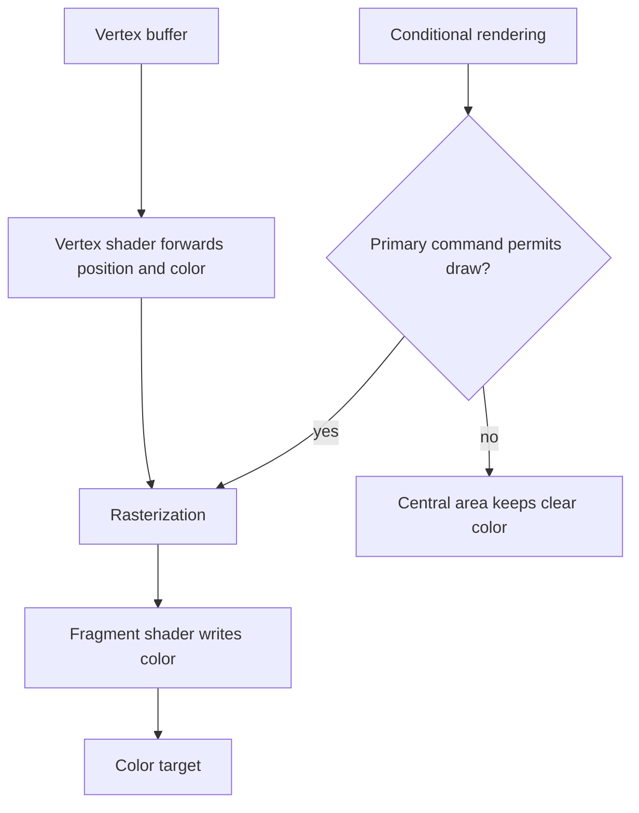

## Overview

**Core question:** Do all registered draw forms obey conditional rendering, including secondary-command-buffer inheritance?

- `vktConditionalDrawTests.cpp` implements the `conditional_rendering.draw` test family. Each condition-data row creates six executable draw leaves.
- The leaves cover direct, indexed, indirect, indexed-indirect, indirect-count, and indexed-indirect-count commands.
- Each case records four blue central rectangles over a colored background. The condition value decides whether those rectangles appear.
- The page explains condition-data dimensions, command-buffer placement, indirect command construction, image validation, and the fixed vertex and fragment shaders.

## Background Knowledge

- Conditional rendering uses a value read from a buffer to permit or suppress draws inside a conditional block. `VK_CONDITIONAL_RENDERING_INVERTED_BIT_EXT` reverses the predicate interpretation. The extension's affected command set includes draws, compute dispatches, and attachment clears, but not copies or blits. See the [extension description](../../../../vulkan-docs/src/appendices/VK_EXT_conditional_rendering.adoc#L21-L29).
- A secondary command buffer can inherit the conditional-rendering state from its primary command buffer when its inheritance information enables it. This matters here because the test records conditional blocks in primary or secondary command buffers and also executes a secondary command buffer nested inside another secondary command buffer. See the extension's [secondary-command-buffer resolution](../../../../vulkan-docs/src/appendices/VK_EXT_conditional_rendering.adoc#L38-L45).

## Registration Hierarchy

```text
conditional_rendering.draw
├── condition_host_memory_expect_execution
├── condition_host_memory_expect_execution_inverted
├── condition_host_memory_expect_execution_inverted_rp_clear
├── condition_host_memory_expect_execution_rp_clear
├── condition_host_memory_expect_noop
├── condition_host_memory_expect_noop_inverted
├── condition_host_memory_expect_noop_inverted_rp_clear
├── condition_host_memory_expect_noop_rp_clear
├── condition_host_memory_inherited_expect_execution
├── condition_host_memory_inherited_expect_execution_inverted
├── condition_host_memory_inherited_expect_noop
├── condition_host_memory_inherited_expect_noop_inverted
├── condition_host_memory_nested_buffer_expect_execution
├── condition_host_memory_nested_buffer_expect_execution_inverted
├── condition_host_memory_nested_buffer_expect_noop
├── condition_host_memory_nested_buffer_expect_noop_inverted
├── condition_host_memory_nested_buffer_nested_inherited_expect_execution
├── condition_host_memory_nested_buffer_nested_inherited_expect_execution_inverted
├── condition_host_memory_nested_buffer_nested_inherited_expect_noop
├── condition_host_memory_nested_buffer_nested_inherited_expect_noop_inverted
├── condition_host_memory_nested_inherited_expect_execution
├── condition_host_memory_nested_inherited_expect_execution_inverted
├── condition_host_memory_nested_inherited_expect_noop
├── condition_host_memory_nested_inherited_expect_noop_inverted
├── condition_host_memory_secondary_buffer_expect_execution
├── condition_host_memory_secondary_buffer_expect_execution_inverted
├── condition_host_memory_secondary_buffer_expect_noop
├── condition_host_memory_secondary_buffer_expect_noop_inverted
├── condition_host_memory_secondary_buffer_inherited_expect_execution
├── condition_host_memory_secondary_buffer_inherited_expect_execution_inverted
├── condition_host_memory_secondary_buffer_inherited_expect_noop
├── condition_host_memory_secondary_buffer_inherited_expect_noop_inverted
├── condition_local_memory_expect_execution
├── condition_local_memory_expect_execution_inverted
├── condition_local_memory_expect_noop
├── condition_local_memory_expect_noop_inverted
├── condition_local_memory_inherited_expect_execution
├── condition_local_memory_inherited_expect_execution_inverted
├── condition_local_memory_inherited_expect_noop
├── condition_local_memory_inherited_expect_noop_inverted
├── condition_local_memory_nested_buffer_expect_execution
├── condition_local_memory_nested_buffer_expect_execution_inverted
├── condition_local_memory_nested_buffer_expect_noop
├── condition_local_memory_nested_buffer_expect_noop_inverted
├── condition_local_memory_nested_buffer_nested_inherited_expect_execution
├── condition_local_memory_nested_buffer_nested_inherited_expect_execution_inverted
├── condition_local_memory_nested_buffer_nested_inherited_expect_noop
├── condition_local_memory_nested_buffer_nested_inherited_expect_noop_inverted
├── condition_local_memory_nested_inherited_expect_execution
├── condition_local_memory_nested_inherited_expect_execution_inverted
├── condition_local_memory_nested_inherited_expect_noop
├── condition_local_memory_nested_inherited_expect_noop_inverted
├── condition_local_memory_secondary_buffer_expect_execution
├── condition_local_memory_secondary_buffer_expect_execution_inverted
├── condition_local_memory_secondary_buffer_expect_noop
├── condition_local_memory_secondary_buffer_expect_noop_inverted
├── condition_local_memory_secondary_buffer_inherited_expect_execution
├── condition_local_memory_secondary_buffer_inherited_expect_execution_inverted
├── condition_local_memory_secondary_buffer_inherited_expect_noop
├── condition_local_memory_secondary_buffer_inherited_expect_noop_inverted
├── no_condition_host_memory_nested_buffer_nested_inherited_expect_execution
├── no_condition_host_memory_secondary_buffer_inherited_expect_execution
├── no_condition_local_memory_nested_buffer_nested_inherited_expect_execution
└── no_condition_local_memory_secondary_buffer_inherited_expect_execution
```

Each direct child expands to the six draw-command leaves `draw`, `draw_indexed`, `draw_indirect`, `draw_indexed_indirect`, `draw_indirect_count`, and `draw_indexed_indirect_count`. The full executable paths are listed in the [conditional-rendering mustpass file](../../../mustpass/main/vk-default/conditional-rendering.txt).

## Parameter Dimensions and Observed Values

| Dimension | Registered values | Meaning in this test | Evidence |
|-----------|-------------------|----------------------|----------|
| Condition-data row | `condition_*`, `no_condition_*` names listed in the hierarchy | Selects whether the predicate is active, its memory placement, command-buffer placement, inheritance, inversion, expected result, nesting, and render-pass clear behavior. | [`ConditionalData` and `s_testsData`](../../../modules/vulkan/conditional_rendering/vktConditionalRenderingTestUtil.hpp#L44-L144) |
| Condition memory | `host_memory`, `local_memory` | Tests a host-visible conditional buffer directly or a device-local buffer populated through a staging copy. | [`createConditionalRenderingBuffer()`](../../../modules/vulkan/conditional_rendering/vktConditionalRenderingTestUtil.cpp#L70-L121) |
| Condition placement | primary command buffer, secondary command buffer, inherited state, or no active condition | Moves the conditional block and the draw recording across primary and secondary command buffers. | [`ConditionalDraw::iterate()`](../../../modules/vulkan/conditional_rendering/vktConditionalDrawTests.cpp#L391-L544) |
| Predicate interpretation | `conditionValue` `0` or `1`, with `conditionInverted` false or true | Chooses execution or suppression. Inverted cases swap the meaning of the buffer value. | [`beginConditionalRendering()`](../../../modules/vulkan/conditional_rendering/vktConditionalRenderingTestUtil.cpp#L124-L136) |
| Render-pass clear | ordinary render path or `*_rp_clear` | Uses a white `VK_ATTACHMENT_LOAD_OP_CLEAR` while conditional rendering surrounds the whole render pass; the background stays white and the predicate controls whether the blue draws execute. | [`createRenderPassWithClear()`](../../../modules/vulkan/conditional_rendering/vktConditionalDrawTests.cpp#L195-L220) and [`ConditionalDraw::iterate()`](../../../modules/vulkan/conditional_rendering/vktConditionalDrawTests.cpp#L399-L405) |
| Secondary nesting | ordinary secondary buffer or `*_nested_buffer*` | Adds a secondary command buffer that executes another secondary command buffer. | [`ConditionalDraw::iterate()`](../../../modules/vulkan/conditional_rendering/vktConditionalDrawTests.cpp#L435-L443) |
| Draw command | `draw`, `draw_indexed`, `draw_indirect`, `draw_indexed_indirect`, `draw_indirect_count`, `draw_indexed_indirect_count` | Uses six API command forms to check that conditional execution is independent of how the draw arguments are supplied. | [`getDrawCommandTypeName()` and `recordDraw()`](../../../modules/vulkan/conditional_rendering/vktConditionalDrawTests.cpp#L51-L83) |
| Draw count | `4` | Creates four central rectangles and records one command per rectangle. | [`ConditionalDrawTests::init()`](../../../modules/vulkan/conditional_rendering/vktConditionalDrawTests.cpp#L618-L643) |

`padConditionValue` and `allocationOffset` are fields in `ConditionalData`, but both are false in every row used by this draw family. The formatter still supports their names for shared utility users.

## Behavior Parameters

The primary behavioral axis is the condition-data row. It changes whether the draw is permitted and where conditional state is recorded or inherited. The draw-command leaf is a second axis that changes the command encoding while keeping the expected image behavior the same.

### `expect_execution` and `expect_noop`: visible predicate result

`expect_execution` rows expect the four blue central rectangles to be rendered. `expect_noop` rows expect the conditional draws to leave the background unchanged. The expected result is set in the shared condition-data table and controls the reference image color.

### Primary, secondary, and inherited condition state: command-buffer scope

A primary condition surrounds inline draws or execution of a secondary command buffer. A secondary condition begins inside the secondary command buffer. An inherited condition records the draw in a secondary command buffer and relies on the inherited `conditionalRenderingEnable` value. Nested rows add another execution level without changing the draw's expected image.

### `draw`, `draw_indexed`, `draw_indirect`, `draw_indexed_indirect`, `draw_indirect_count`, and `draw_indexed_indirect_count`: command encoding

The direct form supplies vertex arguments, and the indexed form supplies an index buffer. The indirect forms read commands from a buffer. The count forms additionally read a count value; each count call allows up to three commands with a stride of one command, and starts at the first command in a three-command window. The count value is `1`, so only the valid command is selected. All six forms record four commands, one for each blue rectangle.

### Host and local condition memory: predicate storage

Host-memory rows bind the host-visible buffer used to write the condition value. Local-memory rows copy the same bytes into a device-local buffer before recording the draw. This axis checks the conditional-rendering read path rather than shader memory access.

### Render-pass clear and nested secondary buffer: special execution paths

The render-pass-clear rows begin conditional rendering before `vk::beginRenderPass()`, but the render-pass `VK_ATTACHMENT_LOAD_OP_CLEAR` is not itself a conditional-rendering-affected command, so the attachment is cleared to white in both execution and no-op cases. The conditional block then controls the blue draws. Nested rows execute a secondary command buffer from another secondary command buffer and check that the relevant conditional state survives that path.

## Shader Analysis

The predicate is evaluated by Vulkan command execution, not by the shaders. The fixed shaders provide the image signal: the vertex stage forwards position and color, and the fragment stage writes that color. One representative walkthrough covers the ordinary direct-draw path; the command and condition variations are summarized rather than repeated as separate shader reconstructions.

### Representative Shader Walkthrough 1

#### Parameter Values Chosen

Representative path:

```text
dEQP-VK.conditional_rendering.draw.condition_host_memory_expect_execution.draw
```

| Parameter choice | Meaning in this representative case |
|------------------|-------------------------------------|
| `condition_host_memory_expect_execution` | A host-visible buffer contains `1`, the condition is recorded in the primary command buffer, and the non-inverted predicate permits the draws. |
| `draw` | The case records four direct `vkCmdDraw` operations, each with six vertices. |
| `drawCalls = 4` | The vertex data contains four blue central rectangles, one per draw call. |

#### Purpose

The shader pair turns vertex data into a colored image. It does not implement the conditional predicate, so the rendered central rectangles provide an observable signal for whether Vulkan executed the draw commands.

#### Structural Design



#### Shader Code

##### Vertex Shader

```glsl
#version 450
precision highp float;

/// Location 0 carries the position of the background or one central rectangle.
layout(location = 0) in vec4 in_position;
/// Location 1 carries the red or blue color stored with each vertex.
layout(location = 1) in vec4 in_color;

/// The fragment stage receives this color at location 0.
layout(location = 0) out vec4 out_color;
out gl_PerVertex { vec4 gl_Position; };

void main() {
    /// The vertex position is already expressed in clip-space coordinates.
    gl_Position = in_position;
    /// Pass the vertex color to the fragment stage.
    out_color = in_color;
}
```

##### Fragment Shader

```glsl
#version 310 es
precision highp float;

/// This input matches the vertex stage output at location 0.
layout(location = 0) in vec4 in_color;
/// The output is written to the color attachment.
layout(location = 0) out vec4 out_color;

void main()
{
  /// The conditional-rendering result is observed through this attachment write.
  out_color = in_color;
}
```

#### Additional Info

- The selected case uses the ordinary direct-draw path. Indexed and indirect cases change command argument transport but reuse this shader pair.
- The source files contain no generated shader comments. The `///` lines above describe interface and data flow without changing the shader source semantics.

#### Parameter Variation Summary

| Parameter dimension | Shader-level variation from this shader | Evidence |
|---------------------|----------------------------------------|----------|
| Condition-data row | No shader text changes. The row changes whether Vulkan reaches rasterization and which clear color the host expects. | [`ConditionalDraw::iterate()`](../../../modules/vulkan/conditional_rendering/vktConditionalDrawTests.cpp#L376-L409) |
| Draw command | No shader text changes. Direct, indexed, indirect, and count commands address the same vertex and color data. | [`recordDraw()`](../../../modules/vulkan/conditional_rendering/vktConditionalDrawTests.cpp#L326-L374) |
| Vertex data | The shader reads either red full-target vertices or blue central-rectangle vertices supplied by the host. | [`ConditionalDraw` constructor](../../../modules/vulkan/conditional_rendering/vktConditionalDrawTests.cpp#L151-L175) |

#### SPIR-V

##### Vertex Shader SPIR-V

- Status: generated and validated
- Source: reconstructed `GLSL` from this walkthrough
- Stage: `vert`
- Target SPIRV version: `spirv1.0`

<details>
<summary>Click to expand SPIRV asm code</summary>

```llvm
; SPIR-V
; Version: 1.0
; Generator: Khronos Glslang Reference Front End; 11
; Bound: 21
; Schema: 0
               OpCapability Shader
          %1 = OpExtInstImport "GLSL.std.450"
               OpMemoryModel Logical GLSL450
               OpEntryPoint Vertex %main "main" %_ %in_position %out_color %in_color
               OpSource GLSL 450
               OpName %main "main"
               OpName %gl_PerVertex "gl_PerVertex"
               OpMemberName %gl_PerVertex 0 "gl_Position"
               OpName %_ ""
               OpName %in_position "in_position"
               OpName %out_color "out_color"
               OpName %in_color "in_color"
               OpDecorate %gl_PerVertex Block
               OpMemberDecorate %gl_PerVertex 0 BuiltIn Position
               OpDecorate %in_position Location 0
               OpDecorate %out_color Location 0
               OpDecorate %in_color Location 1
       %void = OpTypeVoid
          %3 = OpTypeFunction %void
      %float = OpTypeFloat 32
    %v4float = OpTypeVector %float 4
%gl_PerVertex = OpTypeStruct %v4float
%_ptr_Output_gl_PerVertex = OpTypePointer Output %gl_PerVertex
          %_ = OpVariable %_ptr_Output_gl_PerVertex Output
        %int = OpTypeInt 32 1
      %int_0 = OpConstant %int 0
%_ptr_Input_v4float = OpTypePointer Input %v4float
%in_position = OpVariable %_ptr_Input_v4float Input
%_ptr_Output_v4float = OpTypePointer Output %v4float
  %out_color = OpVariable %_ptr_Output_v4float Output
   %in_color = OpVariable %_ptr_Input_v4float Input
       %main = OpFunction %void None %3
          %5 = OpLabel
         %15 = OpLoad %v4float %in_position
         %17 = OpAccessChain %_ptr_Output_v4float %_ %int_0
               OpStore %17 %15
         %20 = OpLoad %v4float %in_color
               OpStore %out_color %20
               OpReturn
               OpFunctionEnd
```

</details>

##### Fragment Shader SPIR-V

- Status: generated and validated
- Source: reconstructed `GLSL` from this walkthrough
- Stage: `frag`
- Target SPIRV version: `spirv1.0`

<details>
<summary>Click to expand SPIRV asm code</summary>

```llvm
; SPIR-V
; Version: 1.0
; Generator: Khronos Glslang Reference Front End; 11
; Bound: 13
; Schema: 0
               OpCapability Shader
          %1 = OpExtInstImport "GLSL.std.450"
               OpMemoryModel Logical GLSL450
               OpEntryPoint Fragment %main "main" %out_color %in_color
               OpExecutionMode %main OriginUpperLeft
               OpSource ESSL 310
               OpName %main "main"
               OpName %out_color "out_color"
               OpName %in_color "in_color"
               OpDecorate %out_color Location 0
               OpDecorate %in_color Location 0
       %void = OpTypeVoid
          %3 = OpTypeFunction %void
      %float = OpTypeFloat 32
    %v4float = OpTypeVector %float 4
%_ptr_Output_v4float = OpTypePointer Output %v4float
  %out_color = OpVariable %_ptr_Output_v4float Output
%_ptr_Input_v4float = OpTypePointer Input %v4float
   %in_color = OpVariable %_ptr_Input_v4float Input
       %main = OpFunction %void None %3
          %5 = OpLabel
         %12 = OpLoad %v4float %in_color
               OpStore %out_color %12
               OpReturn
               OpFunctionEnd
```

</details>

## Runtime Execution and Result Checking

- The constructor requires `VK_EXT_conditional_rendering` and the `conditionalRendering` feature, and it unconditionally requires `VK_EXT_nested_command_buffer`, `nestedCommandBuffer`, and `nestedCommandBufferRendering`. Inherited rows also require `inheritedConditionalRendering`. The two indirect-count leaves require `VK_KHR_draw_indirect_count`; inherited conditions recorded outside the secondary command buffer require `VK_KHR_maintenance7`. See [`checkConditionalRenderingCapabilities()`](../../../modules/vulkan/conditional_rendering/vktConditionalRenderingTestUtil.cpp#L36-L68) and [`checkSupport()`](../../../modules/vulkan/conditional_rendering/vktConditionalDrawTests.cpp#L129-L136).
- The condition buffer contains `conditionValue` as a 32-bit value. Local-memory cases first fill a host-visible staging buffer, then copy it to a device-local buffer with conditional-rendering and transfer-destination usage. [`createConditionalRenderingBuffer()`](../../../modules/vulkan/conditional_rendering/vktConditionalRenderingTestUtil.cpp#L70-L121) performs this setup.
- The test creates six vertices per rectangle and appends six red vertices covering the full target. Four draw calls use the blue rectangles. Direct and indirect variants select each rectangle with `firstVertex` or `firstIndex` equal to `6 * drawIdx`.
- Indirect command buffers store `goodCommand badCommand badCommand` for each draw slot. The good command addresses the blue rectangle. The two bad commands address the vertices after the blue rectangles. The count buffer contains `1`; count calls allow up to three commands with a byte stride of `sizeof(VkDrawIndirectCommand)` or `sizeof(VkDrawIndexedIndirectCommand)`, so the first valid command is the only one selected from each window.
- If `clearInRenderPass` is false, the test begins a legacy render path and clears the target to black. If it is true, it begins conditional rendering before `vk::beginRenderPass()`; that render pass uses `VK_ATTACHMENT_LOAD_OP_CLEAR` with a white clear value, so the conditional block covers the attachment clear as well as the draws. Secondary and nested rows select the corresponding subpass contents and inheritance structures.
- After ending the conditional block and render pass, the test submits the primary command buffer and waits. It builds a reference image with the selected clear color and sets the central rectangle to blue when `expectCommandExecution` is true. Otherwise the central rectangle keeps the clear color.
- The test reads the color target in `VK_IMAGE_LAYOUT_GENERAL` and calls `tcu::fuzzyCompare()` with threshold `0.05f`. Any visible difference from the reference image returns `QP_TEST_RESULT_FAIL`.

## Failure Meaning

### Failure Cause Mapping

| If this behavior parameter value fails | Possible failure cause(s) |
|----------------------------------------|---------------------------|
| `expect_execution` | Conditional rendering incorrectly suppresses an allowed draw, or the selected direct, indexed, indirect, or count command does not execute as recorded. |
| `expect_noop` | Conditional rendering incorrectly executes a suppressed draw, or the image clear and conditional block interaction is wrong. |
| `conditionInverted` | The implementation applies the non-inverted predicate rule when `VK_CONDITIONAL_RENDERING_INVERTED_BIT_EXT` is set. |
| primary conditional block | The primary command buffer does not apply the buffer value and flags to its draw commands. |
| secondary conditional block | The conditional block recorded in a secondary command buffer does not control the draws in that buffer. |
| inherited conditional state | Command-buffer inheritance does not propagate the enabled state required by the selected `VkCommandBufferInheritanceConditionalRenderingInfoEXT`. |
| nested secondary command buffer | Conditional state is lost or applied at the wrong level when a primary command buffer executes a nested secondary command buffer. |
| `draw`, `draw_indexed` | Direct or indexed draw recording, vertex access, or index-buffer binding produces the wrong central image. |
| `draw_indirect`, `draw_indexed_indirect` | Indirect command decoding or conditional suppression fails to execute the valid command or renders the wrong rectangle. |
| `draw_indirect_count`, `draw_indexed_indirect_count` | The count-command path ignores the conditional state, command stride, or count value, allowing a deliberately invalid-position command to render or suppressing the valid command. |
| host versus local condition buffer | Conditional-rendering buffer reads or the staging copy expose different predicate values between host-visible and device-local memory. |
| render-pass clear variant | The conditional block does not correctly cover the render-pass begin clear, or the clear color is not preserved for the expected no-op result. |

### Cause Analysis

#### Predicate interpretation and command suppression

**Possible failure symptoms:** An execution case leaves the central rectangles at the clear color, or a no-op case paints them blue. The same mismatch can appear in the inverted rows with the opposite condition value.

**Possible implementation causes:** The extension requires the buffer value and `VK_CONDITIONAL_RENDERING_INVERTED_BIT_EXT` to determine whether commands in the block execute. A mismatch points to conditional predicate handling that does not follow those semantics. The test source establishes the expected value and flags in [`beginConditionalRendering()`](../../../modules/vulkan/conditional_rendering/vktConditionalRenderingTestUtil.cpp#L124-L136); source-level investigation is needed to locate the failing implementation layer.

#### Command encoding and indirect selection

**Possible failure symptoms:** Direct or indexed cases show the wrong rectangle, or indirect cases render one of the bad commands outside the intended central area. Count cases may execute too many commands or skip the valid command.

**Possible implementation causes:** The command implementation may decode vertex, index, offset, stride, or count arguments incorrectly. The test records a valid command followed by two commands with `firstVertex` or `firstIndex` after the blue data, then sets the count to `1`. These source-defined inputs ground the symptom, but source-level investigation is needed to identify whether command decoding, conditional suppression, or buffer access caused it.

#### Command-buffer scope and inheritance

**Possible failure symptoms:** Inline primary cases pass while secondary, inherited, or nested cases produce a different central image. A nested case can lose the draw entirely or execute it despite a no-op predicate.

**Possible implementation causes:** The extension specifies how active conditional rendering affects secondary command buffers and how `conditionalRenderingEnable` controls inheritance. A mismatch indicates that the active state or inherited state was not applied at the command-buffer level required by the case. The exact failing mechanism needs source-level investigation in the implementation.

#### Condition-buffer storage and staging

**Possible failure symptoms:** Host-memory and local-memory rows disagree for the same predicate and command path. The image then shows execution in one row and suppression in the other.

**Possible implementation causes:** The host-visible write, flush, staging copy, device-local read, or conditional-rendering buffer binding may expose bytes other than the selected `conditionValue`. The utility source proves the staging and copy sequence, but it does not identify a particular implementation fault. Source-level investigation is needed.

#### Render-pass clear interaction

**Possible failure symptoms:** A render-pass-clear execution case has the wrong background, or a render-pass-clear no-op case paints the central area blue or retains the wrong clear color.

**Possible implementation causes:** The extension limits conditional rendering to drawing commands, dispatching commands, and `vkCmdClearAttachments`; other rendering commands remain unaffected. The test nevertheless begins conditional rendering before `vk::beginRenderPass()` and uses `VK_ATTACHMENT_LOAD_OP_CLEAR`, exercising the rule that conditional rendering may begin before and end after an entire render pass. The mismatch indicates a problem in the interaction between the active conditional block and render-pass attachment load behavior. Source-level investigation is needed.

#### Image comparison and draw data

**Possible failure symptoms:** The result has a color or geometry mismatch even when the conditional execution decision appears correct. The fuzzy comparison reports failure against the generated image.

**Possible implementation causes:** Vertex-buffer reads, index-buffer reads, rasterization, fragment output, image layout handling, or copyback can change the observed pixels. The fixed shader pair only forwards the supplied position and color, so the source evidence does not isolate one implementation cause. Source-level investigation is needed.

## Case Pruning

### Requirement-based pruning

- Cases using indirect-count commands require `VK_KHR_draw_indirect_count`.
- Inherited conditional state recorded outside the secondary command buffer requires `VK_KHR_maintenance7`.
- Every case requires `VK_EXT_conditional_rendering` and the `conditionalRendering` feature. Rows using inheritance require `inheritedConditionalRendering`.
- Nested secondary-buffer rows require `VK_EXT_nested_command_buffer`, `nestedCommandBuffer`, and `nestedCommandBufferRendering`.
- The constructor rejects the combination of `clearInRenderPass` and `conditionInSecondaryCommandBuffer` with an assertion, so the registered table does not include that combination.

### Design-based pruning

- `padConditionValue` and `allocationOffset` stay false in this family, so the draw matrix does not cover padded condition locations or allocation offsets.
- The draw generator fixes `drawCalls` at `4`; it does not create a separate dimension for the number of rectangles.
- Each condition-data row uses the same six command leaves. The matrix varies command encoding without duplicating separate shader programs.
- The indirect buffer deliberately includes two bad commands after each good command. The count value `1` and stride `sizeof(VkDrawIndirectCommand)` or `sizeof(VkDrawIndexedIndirectCommand)` keep the count cases focused on conditional command execution.

## Key Takeaways

- The condition-data row controls the predicate, memory placement, command-buffer scope, inheritance, nesting, clear path, and expected image.
- Six draw command leaves apply the same conditional behavior to direct, indexed, indirect, and indirect-count argument paths.
- Indirect buffers make accidental execution visible by placing two commands after each valid command that address vertices outside the blue rectangle data.
- The predicate is tested outside the shader. The fixed shader pair only converts vertex position and color data into the image used for validation.
- A successful submission is insufficient. The test passes only when the rendered image matches the expected clear and central-rectangle colors within the `0.05f` fuzzy threshold.

## Source Reference Appendix

| Entry point | Link | Why it matters |
|-------------|------|----------------|
| Draw command names and test specification | [`DrawCommandType` and `ConditionalTestSpec`](../../../modules/vulkan/conditional_rendering/vktConditionalDrawTests.cpp#L51-L90) | Defines the six command leaves and the condition-data payload used by each case. |
| Support and constructor setup | [`checkSupport()` and `ConditionalDraw::ConditionalDraw()`](../../../modules/vulkan/conditional_rendering/vktConditionalDrawTests.cpp#L129-L193) | Establishes feature requirements, draw count, geometry, and secondary command buffers. |
| Render-pass clear setup | [`createRenderPassWithClear()`](../../../modules/vulkan/conditional_rendering/vktConditionalDrawTests.cpp#L195-L220) | Creates the attachment load-clear variant. |
| Indirect command construction | [`createIndirectBuffer()`, `createIndexedIndirectBuffer()`, and `createIndirectCountBuffer()`](../../../modules/vulkan/conditional_rendering/vktConditionalDrawTests.cpp#L238-L324) | Defines valid and bad commands, offsets, and the count value. |
| Command recording | [`recordDraw()`](../../../modules/vulkan/conditional_rendering/vktConditionalDrawTests.cpp#L326-L374) | Maps each registered command leaf to its Vulkan draw command. |
| Runtime control flow | [`ConditionalDraw::iterate()`](../../../modules/vulkan/conditional_rendering/vktConditionalDrawTests.cpp#L376-L559) | Records conditions, render passes, primary and secondary buffers, nesting, submission, and waits. |
| Reference image and comparison | [`ConditionalDraw::iterate()` validation](../../../modules/vulkan/conditional_rendering/vktConditionalDrawTests.cpp#L561-L604) | Builds expected colors and applies the `0.05f` fuzzy image comparison. |
| Shared condition rows | [`ConditionalData` and `s_testsData`](../../../modules/vulkan/conditional_rendering/vktConditionalRenderingTestUtil.hpp#L44-L144) | Supplies the registered condition combinations and expected results. |
| Condition buffer and begin info | [`createConditionalRenderingBuffer()` and `beginConditionalRendering()`](../../../modules/vulkan/conditional_rendering/vktConditionalRenderingTestUtil.cpp#L70-L136) | Defines memory placement, staging, offset, and inversion behavior. |
| Shader sources | [`VertexFetch.vert`](../../../data/vulkan/dynamic_state/VertexFetch.vert) and [`VertexFetch.frag`](../../../data/vulkan/dynamic_state/VertexFetch.frag) | Provide the fixed pass-through vertex and fragment stages. |
| Registration evidence | [`conditional-rendering.txt`](../../../mustpass/main/vk-default/conditional-rendering.txt) | Lists the executable `dEQP-VK.conditional_rendering.draw` paths. |
| Extension semantics | [VK_EXT_conditional_rendering](../../../../vulkan-docs/src/appendices/VK_EXT_conditional_rendering.adoc#L21-L45) | Defines affected commands and secondary-command-buffer behavior. |
