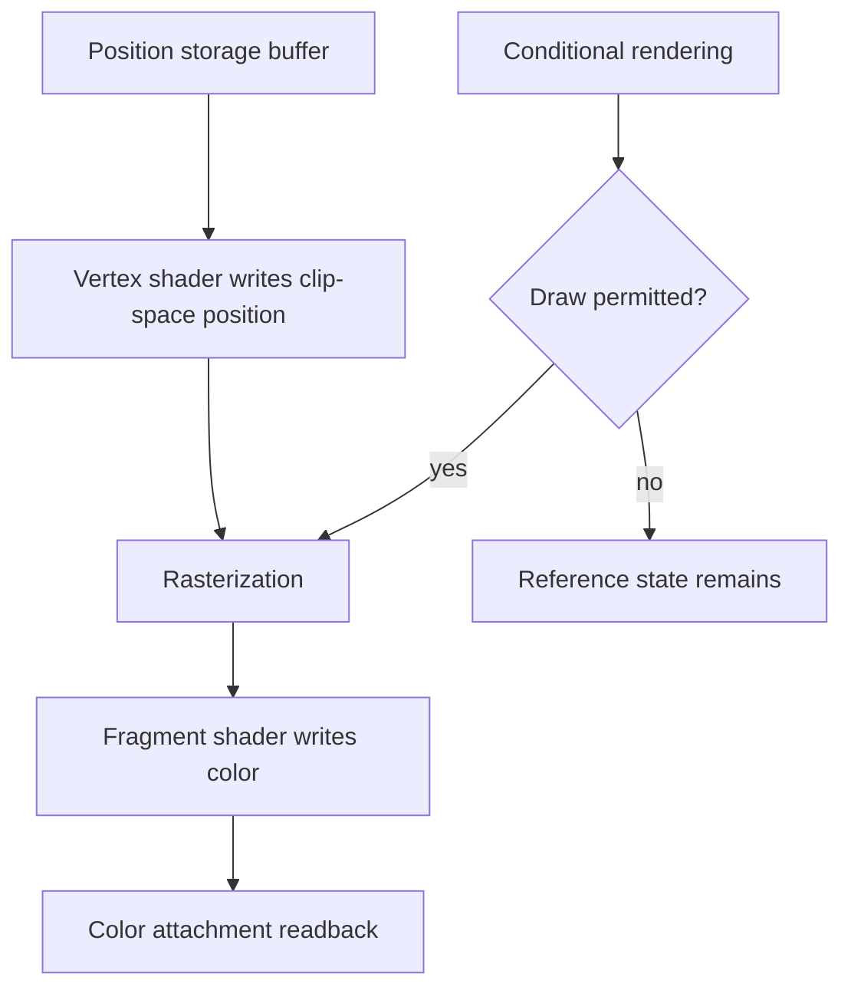

## Overview

**Core question:** Do attachment clears and draws obey conditional rendering when predicate setup, scope, and update method vary?

- This page covers the `conditional_rendering.draw_clear` test family implemented in [vktConditionalDrawAndClearTests.cpp](../../../modules/vulkan/conditional_rendering/vktConditionalDrawAndClearTests.cpp).
- The family has two direct registered children: `clear` checks conditional color and depth clears, while `draw` checks conditional draws and draw-side predicate updates.
- The cases use operation-specific parameter grids for predicate value, inversion, memory type, clear shape, draw-command placement, and predicate updates.
- Color and depth/stencil image observations turn command execution into explicit pass/fail results; predicate-buffer contents are an intermediate input or update target.

## Background Knowledge

- **Conditional rendering predicates.** `VK_EXT_conditional_rendering` brackets affected commands with `vkCmdBeginConditionalRenderingEXT` and `vkCmdEndConditionalRenderingEXT`. A zero 32-bit value suppresses affected commands unless inversion is enabled; a nonzero value normally permits them. See [Conditional Rendering](../../../../vulkan-docs/src/chapters/drawing.adoc#L2086-L2167).
- **Attachment clears.** `vkCmdClearAttachments` writes selected color or depth/stencil regions inside a render pass instance. It is an affected command, so its visible result can distinguish a permitted clear from a suppressed clear.
- **Shader storage-buffer atomics.** A shader can atomically modify a value in a storage buffer. The `update_with_rendering` cases use this capability to change the predicate buffer during command execution before a later conditional draw; the update is part of the test mechanism, not the final comparison target.

## Registration Hierarchy

```text
conditional_rendering.draw_clear
├── clear
└── draw
```

`clear` expands into color and depth cases. `draw` expands into generated draw cases, `update_with_rendering` cases, and feature-gated command variants. Exact executable paths appear in the [conditional-rendering mustpass file](../../../mustpass/main/vk-default/conditional-rendering.txt).

## Parameter Dimensions and Observed Values

| Dimension | Registered values | Meaning in this test | Evidence |
|---|---|---|---|
| Test family | `clear`, `draw` | Selects attachment-clear behavior or draw and predicate-update behavior. | [`init()`](../../../modules/vulkan/conditional_rendering/vktConditionalDrawAndClearTests.cpp#L1698-L1767) |
| Predicate and draw controls | `discard`/`no_discard`, `invert`/`no_invert`, draw bitmasks, and update modes | Selects predicate value, inversion, which of the four primary draws are bracketed, and whether an update shader changes the predicate before the conditional draw. | [`ClearTestParams`, `DrawTestParams`, and update parameters](../../../modules/vulkan/conditional_rendering/vktConditionalDrawAndClearTests.cpp#L52-L208) |
| Clear kind | `color`, `depth` | Chooses the attachment aspect whose clear result is checked. | [`clear` registration](../../../modules/vulkan/conditional_rendering/vktConditionalDrawAndClearTests.cpp#L1698-L1735) |
| Clear shape | full or partial, with offset variants | Checks that conditional control applies to the selected clear regions and predicate-buffer offsets. | [`clear parameter grids and execution`](../../../modules/vulkan/conditional_rendering/vktConditionalDrawAndClearTests.cpp#L63-L115) |
| Draw behavior | generated draw, update-with-rendering, feature variants | Tests conditional execution around four draws and cases where an earlier shader draw changes the predicate for a later conditional draw. | [`draw` registration](../../../modules/vulkan/conditional_rendering/vktConditionalDrawAndClearTests.cpp#L1735-L1761) |
| Memory type | host-visible or device-local | Exercises direct predicate access and staged predicate population. | [`createInitBufferWithPredicate()`](../../../modules/vulkan/conditional_rendering/vktConditionalDrawAndClearTests.cpp#L378-L465) |

## Behavior Parameters

The primary behavioral axis is the direct test family. Within each family, its local parameter values determine whether and where the affected operation should change the observable result.

### `clear`: conditional attachment clearing

The clear cases first establish an image or depth attachment in a known state, then issue a conditional clear. A permitted clear changes the selected aspect to its clear value; a suppressed clear leaves the established state visible. Color and depth cases use separate references because they observe different attachment aspects.

### `draw`: conditional drawing and predicate-update interaction

The generated draw cases use a graphics pipeline and generated vertex data to make the execution of four draws visible in separate horizontal image regions. `update_with_rendering` cases add an unconditional shader draw that atomically changes the predicate before a later conditional draw. The feature variants preserve the same conditional question while changing predicate-buffer creation or conditional-begin addressing.

### Condition execution and inversion: predicate result

For clear cases, `no_discard` expects the affected clear to take effect while `discard` expects it to be suppressed. Inverted variants swap the predicate interpretation. The `update_with_rendering` cases use a first, unconditional draw to update the predicate buffer and then test a second draw under conditional rendering; this page's implementation records these paths in primary command buffers rather than testing secondary-command-buffer inheritance.

### Primary command-buffer placement: draw scope

The clear and update-with-rendering paths record their operations in a primary command buffer. The generated draw cases vary begin/end placement around four primary `vkCmdDraw` calls using bitmasks; they keep the shader interface fixed while changing which draws are conditionally executed.

## Shader Analysis

Shader code is part of the `draw` implementation, but the condition is evaluated by Vulkan command execution rather than by a shader. The fixed draw shaders provide positioned geometry with a green fragment output for image comparison. The `clear` implementation does not need a shader walkthrough because its correctness signal comes from attachment operations and readback.

### Representative Shader Walkthrough 1

#### Parameter Values Chosen

Representative path:

```text
dEQP-VK.conditional_rendering.draw_clear.draw.case_0_host_memory
```

| Parameter choice | Meaning in this representative case |
|---|---|
| `draw` | Selects the graphics path that renders geometry under conditional control. |
| `case_0_host_memory` | The first generated draw case uses a host-visible predicate buffer with no inversion. |
| Generated draw case | Supplies four clip-space positions; the fragment shader supplies a fixed green output for the visible reference image. |

#### Purpose

The shader pair turns the draw command into a color change that the host can compare. It does not read the condition buffer. Conditional rendering decides whether the draw reaches rasterization.

#### Structural Design



#### Shader Code

##### Vertex Shader

```glsl
#version 430

/// Binding 0 stores the clip-space positions consumed by gl_VertexIndex.
layout(std430, binding = 0) buffer BufferPos {
    vec4 p[100];
} pos;

out gl_PerVertex {
    vec4 gl_Position;
};

void main()
{
    /// The draw-generated vertex index chooses one of the four host-provided positions.
    gl_Position = pos.p[gl_VertexIndex];
}
```

##### Fragment Shader

```glsl
#version 430

/// The draw writes the color used by image comparison.
layout(location = 0) out vec4 my_FragColor;

/// The push constant selects which horizontal area accepts the fragment.
layout(push_constant) uniform AreaSelect {
    ivec4 number;
} Area;

void main()
{
    /// Only the selected area survives; the four draw calls can be distinguished.
    if ((gl_FragCoord.y < 64) && (Area.number.x != 0)) discard;
    if ((gl_FragCoord.y >= 64) && (gl_FragCoord.y < 128) && (Area.number.x != 1)) discard;
    if ((gl_FragCoord.y >= 128) && (gl_FragCoord.y < 192) && (Area.number.x != 2)) discard;
    if ((gl_FragCoord.y >= 192) && (Area.number.x != 3)) discard;
    my_FragColor = vec4(0, 1, 0, 1);
}
```

#### Additional Info

- The representative draw uses the same shader role as the generated `case_*` variants. Their predicate-memory, begin/end placement, maintenance5, and device-address setup vary on the host side; the shader interface remains the same. The separate `update_with_rendering` variants use additional update/discard shaders.
- The fragment stage discards fragments outside the selected region so that each draw's execution can be identified in the final image.
- Clear cases are validated through attachment contents and do not depend on this shader pair.

#### Parameter Variation Summary

| Parameter dimension | Shader-level variation from this shader | Evidence |
|---|---|---|
| Predicate and draw controls | No shader change. The command executor decides whether each primary draw runs. | [`ConditionalRenderingDrawTestInstance::iterate()`](../../../modules/vulkan/conditional_rendering/vktConditionalDrawAndClearTests.cpp#L1033-L1246) |
| Draw command variant | The generated cases change predicate setup and begin/end placement around `vkCmdDraw`; the graphics shader interface remains the same. | [`drawTestGrid` and draw loop](../../../modules/vulkan/conditional_rendering/vktConditionalDrawAndClearTests.cpp#L162-L194) |
| Vertex data | The vertex shader reads host-generated positions from the storage buffer. | [`AddProgramsDraw`](../../../modules/vulkan/conditional_rendering/vktConditionalDrawAndClearTests.cpp#L1553-L1594) |
| Area selection | The fragment push constant selects the one of four image regions that accepts the draw. | [`AddProgramsDraw`](../../../modules/vulkan/conditional_rendering/vktConditionalDrawAndClearTests.cpp#L1575-L1592) |

#### SPIR-V

##### Vertex Shader SPIR-V

- Status: generated and validated
- Source: reconstructed `GLSL` from this walkthrough
- Stage: `vert`
- Target SPIRV version: `spirv1.0`

<details>
<summary>Click to expand SPIRV asm code</summary>

```llvm
; SPIR-V
; Version: 1.0
; Generator: Khronos Glslang Reference Front End; 11
; Bound: 27
; Schema: 0
               OpCapability Shader
          %1 = OpExtInstImport "GLSL.std.450"
               OpMemoryModel Logical GLSL450
               OpEntryPoint Vertex %main "main" %_ %gl_VertexIndex
               OpSource GLSL 430
               OpName %main "main"
               OpName %gl_PerVertex "gl_PerVertex"
               OpMemberName %gl_PerVertex 0 "gl_Position"
               OpName %_ ""
               OpName %BufferPos "BufferPos"
               OpMemberName %BufferPos 0 "p"
               OpName %pos "pos"
               OpName %gl_VertexIndex "gl_VertexIndex"
               OpDecorate %gl_PerVertex Block
               OpMemberDecorate %gl_PerVertex 0 BuiltIn Position
               OpDecorate %_arr_v4float_uint_100 ArrayStride 16
               OpDecorate %BufferPos BufferBlock
               OpMemberDecorate %BufferPos 0 Offset 0
               OpDecorate %pos Binding 0
               OpDecorate %pos DescriptorSet 0
               OpDecorate %gl_VertexIndex BuiltIn VertexIndex
       %void = OpTypeVoid
          %3 = OpTypeFunction %void
      %float = OpTypeFloat 32
    %v4float = OpTypeVector %float 4
%gl_PerVertex = OpTypeStruct %v4float
%_ptr_Output_gl_PerVertex = OpTypePointer Output %gl_PerVertex
          %_ = OpVariable %_ptr_Output_gl_PerVertex Output
        %int = OpTypeInt 32 1
      %int_0 = OpConstant %int 0
       %uint = OpTypeInt 32 0
   %uint_100 = OpConstant %uint 100
%_arr_v4float_uint_100 = OpTypeArray %v4float %uint_100
  %BufferPos = OpTypeStruct %_arr_v4float_uint_100
%_ptr_Uniform_BufferPos = OpTypePointer Uniform %BufferPos
        %pos = OpVariable %_ptr_Uniform_BufferPos Uniform
%_ptr_Input_int = OpTypePointer Input %int
%gl_VertexIndex = OpVariable %_ptr_Input_int Input
%_ptr_Uniform_v4float = OpTypePointer Uniform %v4float
%_ptr_Output_v4float = OpTypePointer Output %v4float
       %main = OpFunction %void None %3
          %5 = OpLabel
         %21 = OpLoad %int %gl_VertexIndex
         %23 = OpAccessChain %_ptr_Uniform_v4float %pos %int_0 %21
         %24 = OpLoad %v4float %23
         %26 = OpAccessChain %_ptr_Output_v4float %_ %int_0
               OpStore %26 %24
               OpReturn
               OpFunctionEnd
```

</details>

## Runtime Execution and Result Checking

- The test instance creates the selected image, attachment, buffers, pipeline state, and command buffers. It initializes the observed resources to known values before recording the conditional operation.
- Clear cases record the clear inside the relevant render-pass path and compare the resulting color or depth/stencil attachment against the expected reference.
- Draw cases bind the graphics state and record four primary `vkCmdDraw` calls, with begin/end placement selected by the generated case. `update_with_rendering` first draws with a vertex shader that atomically updates the predicate buffer, then submits a second draw under conditional rendering.
- The color or depth image is copied into a host-visible result buffer after synchronization and compared with the reference image. The predicate buffer is an intermediate control resource, not a separately compared final result.
- A case passes only when the copied image matches the case-specific reference: clear cases derive it from `discard`, clear shape, and clear count; generated draw cases use `resultBits`; update-with-rendering cases expect either the green draw or the initial blue image.

## Failure Meaning

### Failure Cause Mapping

| If this behavior parameter value fails | Possible failure cause(s) |
|---|---|
| `clear` | Incorrect conditional handling for color or depth/stencil attachment clears, including clear-region setup or render-pass command scope. |
| `draw` | Incorrect conditional handling for the four primary draw calls, predicate setup, update-with-rendering interaction, or graphics result validation. |
| Predicate and placement variants | Incorrect predicate/inversion handling, predicate-buffer memory setup, begin/end placement, or the feature-specific primary-command path. |

### Cause Analysis

#### Conditional command execution

**Possible failure symptoms:** A clear changes an attachment when it should be suppressed, a permitted draw is missing, or a suppressed draw changes its image region.

**Possible implementation causes:** The implementation may apply the predicate or inversion flag incorrectly, or may apply the active conditional block to the wrong subset of primary draw commands. The result does not alone identify the responsible implementation layer.

#### Attachment and graphics result handling

**Possible failure symptoms:** Only color, depth/stencil, partial-region, or draw image comparisons fail while other operation types pass.

**Possible implementation causes:** The failure may involve the affected command's attachment coverage, render-pass interaction, graphics state, or image-to-host synchronization. Further source and device investigation is needed to distinguish these causes.

#### Predicate update and feature-specific handling

**Possible failure symptoms:** `update_with_rendering` cases fail while equivalent generated draw cases pass, or only feature-specific variants fail.

**Possible implementation causes:** The implementation may mishandle visibility of the shader's predicate-buffer update or the feature-specific command path. The CTS result narrows the failing behavior but does not prove a single cause.

## Case Pruning

### Requirement-based pruning

- Cases require `VK_EXT_conditional_rendering`; the source's support callbacks additionally gate the relevant draw variants on portability-subset triangle-fan support, `VK_KHR_maintenance5`, `VK_KHR_device_address_commands`, or vertex pipeline stores and atomics.
- Draw variants may require portability-subset triangle-fan support, `VK_KHR_maintenance5`, or `VK_KHR_device_address_commands` according to the registered variant.
- Cases that require unavailable extensions or device features are skipped by support checks rather than reported as functional failures.

### Design-based pruning

- The category separates clear and draw behavior so attachment operations are not conflated with graphics and predicate-update operations.
- The two direct children are retained in the parseable hierarchy; deeper generated leaves are described in the parameter sections.

## Key Takeaways

- `draw_clear` checks the visible consequences of conditional execution for both attachment clears and graphics-side operations.
- The shaders only make draw execution observable. The conditional predicate is interpreted by Vulkan command execution.
- Color, depth, four-region draw, predicate-update, maintenance5, and device-address cases help localize which command interaction failed, but a result alone does not identify a specific driver or hardware defect.

## Source Reference Appendix

| Entry point | Link | Why it matters |
|---|---|---|
| Category registration | [`init()`](../../../modules/vulkan/conditional_rendering/vktConditionalDrawAndClearTests.cpp#L1698-L1767) | Registers `clear` and `draw`. |
| Clear execution and comparison | [`ConditionalRenderingClearAttachmentsTestInstance::iterate()`](../../../modules/vulkan/conditional_rendering/vktConditionalDrawAndClearTests.cpp#L843-L1023) | Executes conditional color/depth clears and compares the copied image. |
| Draw registration | [`vktConditionalDrawAndClearTests.cpp`](../../../modules/vulkan/conditional_rendering/vktConditionalDrawAndClearTests.cpp#L1735-L1761) | Defines generated draw and `update_with_rendering` variants. |
| Local parameter grids | [`ClearTestParams`, `DrawTestParams`, and update parameters](../../../modules/vulkan/conditional_rendering/vktConditionalDrawAndClearTests.cpp#L52-L208) | Define clear, draw, predicate, and update-with-rendering dimensions for this family. |
| Capability checks | [`checkSupport()` through `checkFanAndVertexStores()`](../../../modules/vulkan/conditional_rendering/vktConditionalDrawAndClearTests.cpp#L1658-L1694) | Applies extension and draw-variant feature requirements. |
| Conditional-rendering semantics | [Vulkan drawing chapter](../../../../vulkan-docs/src/chapters/drawing.adoc#L2086-L2167) | Defines affected commands and predicate interpretation. |
| Mustpass coverage | [conditional-rendering.txt](../../../mustpass/main/vk-default/conditional-rendering.txt) | Lists executable category paths. |
