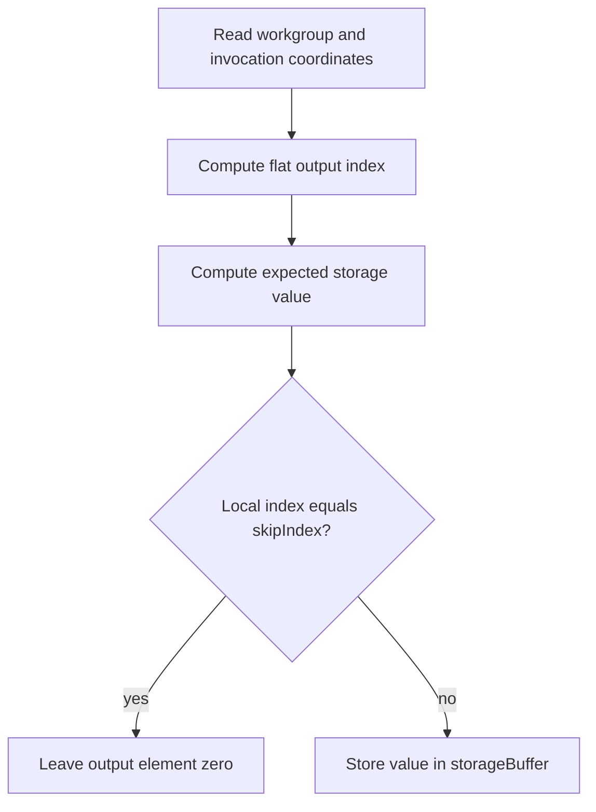

## Overview

**Core question:** Does each EXT generated-command layout deliver the intended compute state to every indirect dispatch?

- This page covers the implementation and registration in [vktDGCComputeLayoutTestsExt.cpp](../../../modules/vulkan/device_generated_commands/vktDGCComputeLayoutTestsExt.cpp#L54-L124).
- The test category is `dgc.ext.compute.layout`. It combines nine `TestType` families with shader-object, queue, dynamic-layout, execution-set-layout lifetime, and descriptor-heap choices.
- Each case generates four dispatches, writes encoded values to a storage buffer, and checks the result for every invocation.

## Background Knowledge

- A `VkIndirectCommandsLayoutEXT` defines an ordered sequence of generated-command tokens. State-update tokens provide push constants, sequence indices, or execution-set selection before the final action token. The DGC specification requires the layout to describe how token data is consumed, so token offsets and ordering affect shader-visible state. See [Device-Generated Commands](../../../../vulkan-docs/src/chapters/device_generated_commands/generatedcommands.adoc#device-generated-commands).
- A compute dispatch creates workgroups from `VkDispatchIndirectCommand`. Each workgroup contains the invocations specified by the shader's local size. This test uses 64 local invocations and indexes its output with workgroup and invocation coordinates. See [Dispatching Commands](../../../../vulkan-docs/src/chapters/dispatch.adoc#dispatching-commands).
- An indirect execution set selects a pipeline or shader object by index. The selected object can carry specialization constants, while generated push tokens can update the remaining push-constant values.

## Registration Hierarchy

```text
dgc.ext.compute.layout
├── push_dispatch
├── complementary_push_dispatch
├── complementary_push_index_dispatch
├── multi_push_dispatch
├── offset_execution_set_dispatch
├── execution_set_dispatch
├── execution_set_push_dispatch
├── execution_set_index_push_dispatch
└── execution_set_complementary_push_dispatch
```

The registration loop appends suffixes for the Boolean dimensions described below. The complete registered paths appear in [dgc.txt](../../../mustpass/main/vk-default/dgc.txt#L62-L245), for example [the shader-object, compute-queue, dynamic-layout, descriptor-heap case](../../../mustpass/main/vk-default/dgc.txt#L238-L245).

## Parameter Dimensions and Observed Values

| Dimension | Registered values | Meaning in this test | Evidence |
|-----------|-------------------|----------------------|----------|
| `TestType` | `push_dispatch`, `complementary_push_dispatch`, `complementary_push_index_dispatch`, `multi_push_dispatch`, `offset_execution_set_dispatch`, `execution_set_dispatch`, `execution_set_push_dispatch`, `execution_set_index_push_dispatch`, `execution_set_complementary_push_dispatch` | Selects the token mix and the source of values used by the shader. | [TestType table](../../../modules/vulkan/device_generated_commands/vktDGCComputeLayoutTestsExt.cpp#L54-L71) |
| `shader_objects` | absent, `_shader_objects` | Uses compute pipelines or `VkShaderEXT` objects. | [pipeline and shader creation](../../../modules/vulkan/device_generated_commands/vktDGCComputeLayoutTestsExt.cpp#L368-L534) |
| `computeQueue` | absent, `_cq` | Runs the generated commands on the device's compute queue instead of the default queue. | [queue selection](../../../modules/vulkan/device_generated_commands/vktDGCComputeLayoutTestsExt.cpp#L835-L840) |
| `dynamicPipelineLayout` | absent, `_dynamic_pipeline_layout` | Supplies the pipeline layout create information while building the commands layout instead of passing a fixed layout handle. | [dynamic layout selection](../../../modules/vulkan/device_generated_commands/vktDGCComputeLayoutTestsExt.cpp#L995-L1005) |
| `destroySetLayout` | absent, `_destroy_ies_set_layout` | Destroys the original descriptor-set layout after creating shader-object execution-set layout information. This suffix is generated only for shader-object execution-set cases. | [registration pruning](../../../modules/vulkan/device_generated_commands/vktDGCComputeLayoutTestsExt.cpp#L1179-L1203) |
| `useDescriptorHeap` | absent, `_descriptor_heap` | Uses `VK_EXT_descriptor_heap`, resource descriptors, and push-data tokens instead of ordinary descriptor-set binding and push-constant tokens where applicable. | [descriptor-heap setup](../../../modules/vulkan/device_generated_commands/vktDGCComputeLayoutTestsExt.cpp#L908-L947) |

The generator keeps four sequences in every case. It chooses each workgroup count deterministically in the inclusive range 1 through 16. For dispatch `i`, `dispatchOffset` is the preceding sequence count multiplied by 64, `skipIndex` selects one local invocation, and `valueOffset` is `(i + 1) << 20`.

## Behavior Parameters

`TestType` is the primary behavior parameter. The Boolean dimensions change transport or execution objects, while these nine values change the token behavior under test.

### `push_dispatch` | Push all dispatch values

A push-constant or push-data token supplies `dispatchOffset`, `skipIndex`, and `valueOffset`, followed by the dispatch token.

### `complementary_push_dispatch` | Add an externally pushed value

The generated push data supplies the per-dispatch values, while the host pushes `valueOffset2` outside the indirect command stream. The shader adds both value offsets.

### `complementary_push_index_dispatch` | Add a sequence index

The layout adds a sequence-index token after the generated push data. The shader adds the current sequence index to the stored value, while the host still supplies the complementary push constant.

### `multi_push_dispatch` | Update push ranges in two steps

Two push tokens update constants 1 and 2 first, then constant 0. The case checks that separate updates reach the intended ranges and retain the correct ordering.

### `offset_execution_set_dispatch` | Select with a nonzero token offset

An execution-set token selects one pipeline or shader object per dispatch. The token starts at offset 4 instead of zero, testing decoding of a nonzero token offset.

### `execution_set_dispatch` | Select specialized entries

The execution set contains one pipeline or shader object per dispatch. Specialization constants provide all three per-dispatch values to the selected entry.

### `execution_set_push_dispatch` | Combine selection and push data

The execution-set token selects the pipeline or shader object, a push token supplies `dispatchOffset` and `skipIndex`, and specialization constant ID 2 supplies `valueOffset`.

### `execution_set_index_push_dispatch` | Combine selection, push data, and index

The selected entry receives `valueOffset` through specialization, while generated push data supplies the other values and a sequence-index token supplies the dispatch index.

### `execution_set_complementary_push_dispatch` | Combine selection and external push data

The selected entry receives `valueOffset` through specialization. Generated push data supplies `dispatchOffset` and `skipIndex`, and the host pushes `valueOffset2` into the complementary range.

## Shader Analysis

The representative case below uses the exact registered path `dEQP-VK.dgc.ext.compute.layout.push_dispatch_shader_objects_cq_dynamic_pipeline_layout_descriptor_heap`. Its shader source is unchanged by the queue, dynamic-layout, shader-object, and descriptor-heap choices. Those choices affect host-side object creation and resource mapping; the source still declares one storage buffer and the push-constant fields selected by `TestType`.

### Representative Shader Walkthrough 1

#### Parameter Values Chosen

Representative path:

```text
dEQP-VK.dgc.ext.compute.layout.push_dispatch_shader_objects_cq_dynamic_pipeline_layout_descriptor_heap
```

| Parameter choice | Meaning in this representative case |
|------------------|-------------------------------------|
| `push_dispatch` | Generated push data supplies the three values used by the shader. |
| `shader_objects` | The host creates a `VkShaderEXT` compute shader instead of a compute pipeline. |
| `_cq` | The command buffer submits to the compute queue. |
| `_dynamic_pipeline_layout` | The commands layout receives pipeline-layout create information dynamically. |
| `_descriptor_heap` | Binding 0 is resolved through a descriptor heap and the generated state uses push-data transport. |

#### Purpose

The shader writes one value for each invocation of each generated dispatch. It leaves one selected local invocation at zero so the test can detect incorrect dispatch offsets, value offsets, sequence handling, or writes.

#### Structural Design



#### Shader Code

```glsl
#version 460

/// The generated dispatch launches 64 invocations in each workgroup.
layout (local_size_x=64, local_size_y=1, local_size_z=1) in;

/// Binding 0 is the host-visible storage buffer checked after command execution.
layout (set=0, binding=0, std430) buffer StorageBlock { uint values[]; } storageBuffer;

/// DGC push-data tokens update these three uint values for each sequence.
layout (push_constant, std430) uniform PushConstantBlock {
    uint dispatchOffset;
    uint skipIndex;
    uint valueOffset;
} pc;

void main (void) {
    /// Flatten the three-dimensional workgroup ID into the sequence's workgroup index.
    const uint workGroupIndex = gl_NumWorkGroups.x * gl_NumWorkGroups.y * gl_WorkGroupID.z +
        gl_NumWorkGroups.x * gl_WorkGroupID.y + gl_WorkGroupID.x;

    /// Each invocation maps to one contiguous uint in the output buffer.
    const uint valueIndex = pc.dispatchOffset + workGroupIndex * gl_WorkGroupSize.x + gl_LocalInvocationIndex;

    /// The value offset separates dispatches, while the workgroup shift separates workgroups.
    const uint storageValue = pc.valueOffset + (workGroupIndex << 10) + gl_LocalInvocationIndex;

    /// One invocation per dispatch is intentionally left unchanged at its zeroed value.
    if (pc.skipIndex != gl_LocalInvocationIndex) {
        storageBuffer.values[valueIndex] = storageValue;
    }
}
```

#### Additional Info

- The representative path uses the descriptor-heap host path, but the GLSL storage-buffer declaration remains the same. The host maps the shader resource through `VkShaderDescriptorSetAndBindingMappingInfoEXT`.
- `shader_objects`, `_cq`, and `_dynamic_pipeline_layout` do not add shader branches for this `push_dispatch` family. They select the shader object, queue, and layout construction path in the host code.

#### Parameter Variation Summary

| Parameter dimension | Shader-level variation from this shader | Evidence |
|---------------------|-----------------------------------------|----------|
| `TestType` | Push-only cases declare push constants. Execution-set-only cases instead declare specialization constants, and mixed cases specialize `valueOffset` while pushing the other fields. Index and complementary variants add `sequenceIndex` or `valueOffset2`. | [shader constant branches](../../../modules/vulkan/device_generated_commands/vktDGCComputeLayoutTestsExt.cpp#L253-L330) |
| `shader_objects` | The generated GLSL is unchanged. The host creates either a compute pipeline or `VkShaderEXT`. | [shader-object branch](../../../modules/vulkan/device_generated_commands/vktDGCComputeLayoutTestsExt.cpp#L396-L404) |
| `useDescriptorHeap` | The generated GLSL is unchanged. The host maps set 0, binding 0 through a descriptor heap and, where applicable, uses push-data token forms. | [descriptor mapping and token selection](../../../modules/vulkan/device_generated_commands/vktDGCComputeLayoutTestsExt.cpp#L377-L394) |
| `computeQueue` | The shader is unchanged. Only the queue family and queue used for submission change. | [queue selection](../../../modules/vulkan/device_generated_commands/vktDGCComputeLayoutTestsExt.cpp#L835-L840) |

#### SPIR-V

- Status: generated and validated
- Source: reconstructed `GLSL` from this walkthrough
- Stage: `comp`
- Target SPIRV version: `spirv1.0`

<details>
<summary>Click to expand SPIRV asm code</summary>

```llvm
; SPIR-V
; Version: 1.0
; Generator: Khronos Glslang Reference Front End; 11
; Bound: 77
; Schema: 0
               OpCapability Shader
          %1 = OpExtInstImport "GLSL.std.450"
               OpMemoryModel Logical GLSL450
               OpEntryPoint GLCompute %main "main" %gl_NumWorkGroups %gl_WorkGroupID %gl_LocalInvocationIndex
               OpExecutionMode %main LocalSize 64 1 1
               OpSource GLSL 460
               OpName %main "main"
               OpName %workGroupIndex "workGroupIndex"
               OpName %gl_NumWorkGroups "gl_NumWorkGroups"
               OpName %gl_WorkGroupID "gl_WorkGroupID"
               OpName %valueIndex "valueIndex"
               OpName %PushConstantBlock "PushConstantBlock"
               OpMemberName %PushConstantBlock 0 "dispatchOffset"
               OpMemberName %PushConstantBlock 1 "skipIndex"
               OpMemberName %PushConstantBlock 2 "valueOffset"
               OpName %pc "pc"
               OpName %gl_LocalInvocationIndex "gl_LocalInvocationIndex"
               OpName %storageValue "storageValue"
               OpName %StorageBlock "StorageBlock"
               OpMemberName %StorageBlock 0 "values"
               OpName %storageBuffer "storageBuffer"
               OpDecorate %gl_NumWorkGroups BuiltIn NumWorkgroups
               OpDecorate %gl_WorkGroupID BuiltIn WorkgroupId
               OpDecorate %PushConstantBlock Block
               OpMemberDecorate %PushConstantBlock 0 Offset 0
               OpMemberDecorate %PushConstantBlock 1 Offset 4
               OpMemberDecorate %PushConstantBlock 2 Offset 8
               OpDecorate %gl_LocalInvocationIndex BuiltIn LocalInvocationIndex
               OpDecorate %_runtimearr_uint ArrayStride 4
               OpDecorate %StorageBlock BufferBlock
               OpMemberDecorate %StorageBlock 0 Offset 0
               OpDecorate %storageBuffer Binding 0
               OpDecorate %storageBuffer DescriptorSet 0
               OpDecorate %gl_WorkGroupSize BuiltIn WorkgroupSize
       %void = OpTypeVoid
          %3 = OpTypeFunction %void
       %uint = OpTypeInt 32 0
%_ptr_Function_uint = OpTypePointer Function %uint
     %v3uint = OpTypeVector %uint 3
%_ptr_Input_v3uint = OpTypePointer Input %v3uint
%gl_NumWorkGroups = OpVariable %_ptr_Input_v3uint Input
     %uint_0 = OpConstant %uint 0
%_ptr_Input_uint = OpTypePointer Input %uint
     %uint_1 = OpConstant %uint 1
%gl_WorkGroupID = OpVariable %_ptr_Input_v3uint Input
     %uint_2 = OpConstant %uint 2
%PushConstantBlock = OpTypeStruct %uint %uint %uint
%_ptr_PushConstant_PushConstantBlock = OpTypePointer PushConstant %PushConstantBlock
         %pc = OpVariable %_ptr_PushConstant_PushConstantBlock PushConstant
        %int = OpTypeInt 32 1
      %int_0 = OpConstant %int 0
%_ptr_PushConstant_uint = OpTypePointer PushConstant %uint
    %uint_64 = OpConstant %uint 64
%gl_LocalInvocationIndex = OpVariable %_ptr_Input_uint Input
      %int_2 = OpConstant %int 2
     %int_10 = OpConstant %int 10
      %int_1 = OpConstant %int 1
       %bool = OpTypeBool
%_runtimearr_uint = OpTypeRuntimeArray %uint
%StorageBlock = OpTypeStruct %_runtimearr_uint
%_ptr_Uniform_StorageBlock = OpTypePointer Uniform %StorageBlock
%storageBuffer = OpVariable %_ptr_Uniform_StorageBlock Uniform
%_ptr_Uniform_uint = OpTypePointer Uniform %uint
%gl_WorkGroupSize = OpConstantComposite %v3uint %uint_64 %uint_1 %uint_1
       %main = OpFunction %void None %3
          %5 = OpLabel
%workGroupIndex = OpVariable %_ptr_Function_uint Function
 %valueIndex = OpVariable %_ptr_Function_uint Function
%storageValue = OpVariable %_ptr_Function_uint Function
         %14 = OpAccessChain %_ptr_Input_uint %gl_NumWorkGroups %uint_0
         %15 = OpLoad %uint %14
         %17 = OpAccessChain %_ptr_Input_uint %gl_NumWorkGroups %uint_1
         %18 = OpLoad %uint %17
         %19 = OpIMul %uint %15 %18
         %22 = OpAccessChain %_ptr_Input_uint %gl_WorkGroupID %uint_2
         %23 = OpLoad %uint %22
         %24 = OpIMul %uint %19 %23
         %25 = OpAccessChain %_ptr_Input_uint %gl_NumWorkGroups %uint_0
         %26 = OpLoad %uint %25
         %27 = OpAccessChain %_ptr_Input_uint %gl_WorkGroupID %uint_1
         %28 = OpLoad %uint %27
         %29 = OpIMul %uint %26 %28
         %30 = OpIAdd %uint %24 %29
         %31 = OpAccessChain %_ptr_Input_uint %gl_WorkGroupID %uint_0
         %32 = OpLoad %uint %31
         %33 = OpIAdd %uint %30 %32
               OpStore %workGroupIndex %33
         %41 = OpAccessChain %_ptr_PushConstant_uint %pc %int_0
         %42 = OpLoad %uint %41
         %43 = OpLoad %uint %workGroupIndex
         %45 = OpIMul %uint %43 %uint_64
         %46 = OpIAdd %uint %42 %45
         %48 = OpLoad %uint %gl_LocalInvocationIndex
         %49 = OpIAdd %uint %46 %48
               OpStore %valueIndex %49
         %52 = OpAccessChain %_ptr_PushConstant_uint %pc %int_2
         %53 = OpLoad %uint %52
         %54 = OpLoad %uint %workGroupIndex
         %56 = OpShiftLeftLogical %uint %54 %int_10
         %57 = OpIAdd %uint %53 %56
         %58 = OpLoad %uint %gl_LocalInvocationIndex
         %59 = OpIAdd %uint %57 %58
               OpStore %storageValue %59
         %61 = OpAccessChain %_ptr_PushConstant_uint %pc %int_1
         %62 = OpLoad %uint %61
         %63 = OpLoad %uint %gl_LocalInvocationIndex
         %65 = OpINotEqual %bool %62 %63
               OpSelectionMerge %67 None
               OpBranchConditional %65 %66 %67
         %66 = OpLabel
         %72 = OpLoad %uint %valueIndex
         %73 = OpLoad %uint %storageValue
         %75 = OpAccessChain %_ptr_Uniform_uint %storageBuffer %int_0 %72
               OpStore %75 %73
               OpBranch %67
         %67 = OpLabel
               OpReturn
               OpFunctionEnd
```

</details>

## Runtime Execution and Result Checking

- `iterate()` chooses the default or compute queue, generates four workgroup counts, and creates one `SpecializationData` record per dispatch. The output buffer has one host-visible `uint` for every invocation.
- Non-heap cases create a descriptor set with storage-buffer binding 0. Heap cases create a host-visible resource heap, obtain the output buffer device address, and write a storage-buffer resource descriptor into the heap.
- The test creates one pipeline or shader object for push-only cases. Execution-set cases create one specialized pipeline or shader object per dispatch, add them to an indirect execution set, and update that set after preprocess memory requirements are queried.
- `makeCommandsLayout()` adds the state tokens selected by `TestType`, then always adds `VK_INDIRECT_COMMANDS_TOKEN_TYPE_DISPATCH_EXT` last. Heap variants use push-data token forms, and ordinary variants use push-constant forms.
- The host writes the indirect command buffer, allocates the preprocess buffer, binds the descriptor state and initial compute object, applies any complementary push constant, and calls `vkCmdExecuteGeneratedCommandsEXT` with four sequences.
- A shader-write to host-read barrier precedes submission completion. The host invalidates the output allocation and checks every element. It expects zero at each selected `skipIndex`; every other element must equal `valueOffset + (workGroupIndex << 10) + invocationIndex`, plus `valueOffset2` for complementary cases and the dispatch index for sequence-index cases. The test returns `Pass` only when all values match. See [runtime and result checking](../../../modules/vulkan/device_generated_commands/vktDGCComputeLayoutTestsExt.cpp#L835-L1152).

## Failure Meaning

### Failure Cause Mapping

| If this behavior parameter value fails | Possible failure cause(s) |
|----------------------------------------|---------------------------|
| `push_dispatch` | Push-constant token range or per-dispatch payload was applied incorrectly; dispatch data was decoded incorrectly. |
| `complementary_push_dispatch` | Generated push data was combined with the externally pushed `valueOffset2` at the wrong offset; dispatch data was decoded incorrectly. |
| `complementary_push_index_dispatch` | Sequence-index token or complementary push range was applied at the wrong offset; dispatch data was decoded incorrectly. |
| `multi_push_dispatch` | Multiple push tokens failed to update the intended ranges or update ordering was mishandled. |
| `offset_execution_set_dispatch` | Nonzero execution-set token offset was decoded incorrectly, or the selected pipeline/shader entry was wrong. |
| `execution_set_dispatch` | Execution-set selection or per-entry specialization data was wrong. |
| `execution_set_push_dispatch` | Execution-set selection and generated push-constant updates were combined incorrectly. |
| `execution_set_index_push_dispatch` | Execution-set selection, push-constant updates, or sequence-index transport was wrong. |
| `execution_set_complementary_push_dispatch` | Execution-set selection, generated push constants, or the externally pushed complementary value was wrong. |

### Cause Analysis

#### Push-constant and push-data updates

**Possible failure symptoms:** Output elements contain incorrect values, or the selected invocation is nonzero. The log reports the flat index, expected value, actual value, dispatch index, workgroup index, invocation index, and offsets.

**Possible implementation causes:** The implementation may decode a token range, offset, or update order incorrectly. The heap path may map push data to the wrong shader-visible range. The source does not identify a more specific implementation cause, so a failing result requires source-level investigation.

#### Execution-set selection and specialization

**Possible failure symptoms:** A dispatch writes values computed from the wrong per-dispatch offsets, or it writes to a location associated with another dispatch. The same output scan catches both pipeline and shader-object variants.

**Possible implementation causes:** The implementation may select the wrong execution-set entry, apply specialization data to the wrong entry, or mishandle the nonzero token offset in `offset_execution_set_dispatch`. The source does not isolate the fault to a driver, compiler, or hardware component, so further investigation must follow the failing variant.

#### Sequence-index and complementary state

**Possible failure symptoms:** Cases using a sequence index or `valueOffset2` differ from the expected value by the index or complementary offset, while push-only cases may pass.

**Possible implementation causes:** The implementation may place the sequence-index token at the wrong push-constant offset or apply the host push to the wrong range. In a complementary index case, the indirect buffer contains a sequence-index placeholder after the other push values, while the layout range accounts for the complementary value. A failure in this interaction requires source-level investigation.

#### Resource binding, queue, and synchronization

**Possible failure symptoms:** Values are missing, written to the wrong storage-buffer elements, or remain stale after execution. The failure can be limited to descriptor-heap, compute-queue, or dynamic-layout variants.

**Possible implementation causes:** The implementation may resolve binding 0 incorrectly through the descriptor heap, execute the generated sequence with incompatible layout state, or fail to make shader writes visible to the host. The test source establishes the barrier and readback contract but does not prove which implementation layer failed.

## Case Pruning

### Requirement-based pruning

- All cases require the EXT compute DGC support checked by `checkDGCExtComputeSupport()`.
- Shader-object cases require `VK_EXT_shader_object`. Execution-set shader-object cases also require a nonzero `maxIndirectShaderObjectCount`.
- Compute-queue cases require an available compute queue.
- Dynamic-layout cases require the `dynamicGeneratedPipelineLayout` feature.
- Descriptor-heap cases require `VK_EXT_descriptor_heap`.
- The relevant execution-set cases require either indirect pipeline or indirect shader binding support, depending on `shader_objects`. Unsupported cases are skipped by support checks rather than reported as test failures. See [support checks](../../../modules/vulkan/device_generated_commands/vktDGCComputeLayoutTestsExt.cpp#L215-L251).

### Design-based pruning

- `destroySetLayout` is skipped without shader objects because it exercises `VkIndirectExecutionSetShaderLayoutInfoEXT` lifetime for shader-object execution sets.
- `destroySetLayout` is skipped for `TestType` values without an execution set because there is no indirect execution-set layout to test.
- The shader uses one fixed local size and four generated sequences so the validation formula can compare each dispatch independently. The smoke tests cover dispatch-only layouts; this file focuses on additional state-token layouts. See [the test distinction](../../../modules/vulkan/device_generated_commands/vktDGCComputeLayoutTestsExt.cpp#L54-L59).

## Key Takeaways

- `TestType` controls the state-token behavior: push ranges, multiple updates, sequence indices, execution-set selection, and combinations of those mechanisms.
- Every layout ends with a dispatch action token. The preceding tokens must update the state consumed by that dispatch at the declared offsets.
- Pipeline and shader-object execution sets carry the same per-dispatch compute logic through different Vulkan objects. Descriptor heaps change resource mapping and push-data transport, not the storage-buffer algorithm.
- The output formula gives each generated dispatch and workgroup a distinct check. A mismatch identifies a token, selection, resource, queue, synchronization, or shader specialization problem in the failing variant.

## Source Reference Appendix

| Entry point | Link | Why it matters |
|-------------|------|----------------|
| `TestType` and `TestParams` | [source definitions](../../../modules/vulkan/device_generated_commands/vktDGCComputeLayoutTestsExt.cpp#L54-L124) | Defines the primary behavior axis and Boolean dimensions. |
| `LayoutTestCase::checkSupport()` | [support checks](../../../modules/vulkan/device_generated_commands/vktDGCComputeLayoutTestsExt.cpp#L215-L251) | Defines feature, queue, and extension requirements. |
| `LayoutTestCase::initPrograms()` | [shader generator](../../../modules/vulkan/device_generated_commands/vktDGCComputeLayoutTestsExt.cpp#L253-L331) | Emits the compute shader and its token-dependent constant declarations. |
| `LayoutTestInstance::createPipelinesOrShaders()` | [pipeline and shader setup](../../../modules/vulkan/device_generated_commands/vktDGCComputeLayoutTestsExt.cpp#L368-L534) | Creates ordinary or execution-set compute objects and descriptor mappings. |
| `LayoutTestInstance::makeCommandsLayout()` | [token layout builder](../../../modules/vulkan/device_generated_commands/vktDGCComputeLayoutTestsExt.cpp#L552-L672) | Defines token order, ranges, offsets, and the final dispatch action. |
| `LayoutTestInstance::makeIndirectCommands()` | [indirect payload encoding](../../../modules/vulkan/device_generated_commands/vktDGCComputeLayoutTestsExt.cpp#L674-L780) | Encodes per-dispatch state and dispatch dimensions. |
| `LayoutTestInstance::iterate()` | [runtime execution](../../../modules/vulkan/device_generated_commands/vktDGCComputeLayoutTestsExt.cpp#L835-L1102) | Creates resources, preprocesses commands, submits work, and reads back results. |
| Result scan | [validation](../../../modules/vulkan/device_generated_commands/vktDGCComputeLayoutTestsExt.cpp#L1108-L1152) | Defines expected values and pass/fail behavior. |
| `createDGCComputeLayoutTestsExt()` | [registration](../../../modules/vulkan/device_generated_commands/vktDGCComputeLayoutTestsExt.cpp#L1157-L1207) | Builds the nine-family matrix and suffix combinations. |
| Mustpass coverage | [dgc.txt](../../../mustpass/main/vk-default/dgc.txt#L62-L245) | Lists the registered EXT compute layout paths. |
| Shared DGC layout helpers | [vktDGCUtilExt.cpp](../../../modules/vulkan/device_generated_commands/vktDGCUtilExt.cpp#L661-L721) | Supplies common layout construction and token sizing behavior. |
| Vulkan DGC semantics | [Device-Generated Commands](../../../../vulkan-docs/src/chapters/device_generated_commands/generatedcommands.adoc#device-generated-commands) | Defines generated-command layout, preprocessing, and execution semantics. |
| Vulkan dispatch semantics | [Dispatching Commands](../../../../vulkan-docs/src/chapters/dispatch.adoc#dispatching-commands) | Defines indirect dispatch dimensions and workgroup behavior. |
