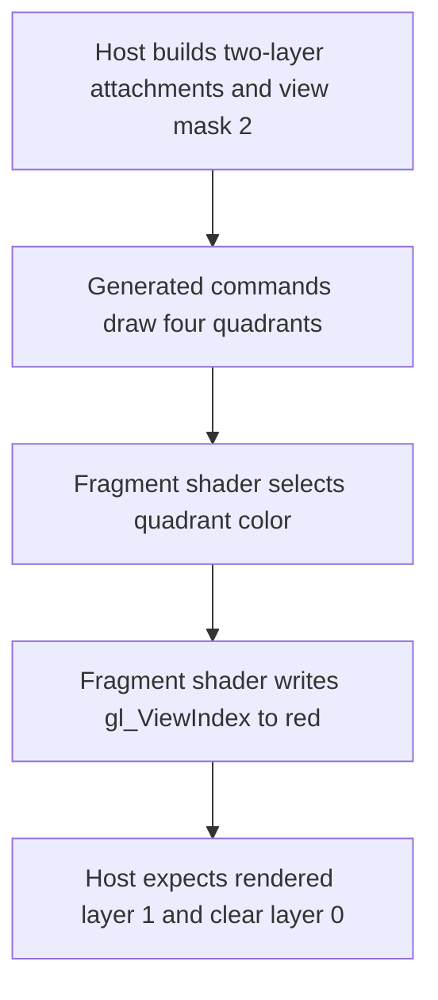

## Overview

**Core question:** Does device-generated graphics execution respect the selected multiview views while producing the expected color and depth for every generated draw?

- This page covers the implementation in [`vktDGCGraphicsMultiviewTestsExt.cpp`](../../../modules/vulkan/device_generated_commands/vktDGCGraphicsMultiviewTestsExt.cpp#L223-L762) and its registered test family `dgc.ext.graphics.multiview`.
- The tests combine multiview rendering with device-generated commands. They vary the view mask, graphics pipeline construction, draw form, vertex and index buffer tokens, preprocessing, and dynamic rendering.
- Each case renders four quadrants into a 2-layer, 2 by 2 color and depth image. The fragment shader writes `gl_ViewIndex` into red so the result also checks view selection.
- The page explains the parameter matrix, host and device execution, reference-image checks, intentional pruning, and what a failure can mean.

## Background Knowledge

- **Multiview rendering:** A multiview subpass or dynamic-rendering instance runs the shader for the views selected by its view mask. In this test, view bit `i` selects image layer `i`, and the fragment shader can read that view number through `gl_ViewIndex`.
- **Device-generated commands:** `VK_EXT_device_generated_commands` lets the implementation execute draw state described by a GPU-visible command stream. The stream can select pipelines, bind vertex or index buffers, and issue regular or indexed draws. Preprocessing creates implementation-dependent state before execution; it does not change the expected rendered image.
- **View-mask consistency:** The render pass uses `VkRenderPassMultiviewCreateInfo`, while the dynamic-rendering path supplies the same mask through `VkPipelineRenderingCreateInfo`. An unset bit leaves that layer at its clear values, so an inactive layer is part of the check rather than ignored.

## Registration Hierarchy

```text
dgc.ext.graphics.multiview
├── view_mask_1
├── view_mask_2
└── view_mask_3
```

The implementation registers the three direct test families in the source loop order `view_mask_3`, `view_mask_1`, `view_mask_2`; the canonical tree above and the mustpass paths are shown in `view_mask_1`, `view_mask_2`, `view_mask_3` order. Each family has `no_ies_monolithic` and `no_ies_gpl` intermediate nodes, followed by the generated draw variants described below.

## Parameter Dimensions and Observed Values

| Dimension | Registered values | Meaning in this test | Evidence |
|-----------|-------------------|----------------------|----------|
| View mask test family | `view_mask_1`, `view_mask_2`, `view_mask_3` | Selects layer 0, layer 1, or both layers through mask values `1`, `2`, and `3`. | [`populateMainGroup`](../../../modules/vulkan/device_generated_commands/vktDGCGraphicsMultiviewTestsExt.cpp#L817-L824) |
| Pipeline construction | `no_ies_monolithic`, `no_ies_gpl` | Chooses monolithic pipeline construction or fast-linked graphics pipeline libraries. | [`populateMaskTypeGroup`](../../../modules/vulkan/device_generated_commands/vktDGCGraphicsMultiviewTestsExt.cpp#L797-L815) |
| Draw form | `regular_draw`, `indexed_draw` | Uses `vkCmdDraw`-style or `vkCmdDrawIndexed`-style generated draw data. | [`populatePipelineGroup`](../../../modules/vulkan/device_generated_commands/vktDGCGraphicsMultiviewTestsExt.cpp#L771-L795) |
| Vertex and index buffer binding | absent or `_buffer_tokens` | Either binds complete buffers before execution or changes buffer addresses and ranges from DGC tokens for each quadrant. | [`IndirectCommandsLayoutBuilderExt` setup](../../../modules/vulkan/device_generated_commands/vktDGCGraphicsMultiviewTestsExt.cpp#L483-L503) |
| Preprocessing | absent or `_preprocess` | Executes `vkCmdPreprocessGeneratedCommandsEXT` before the generated commands when enabled. | [`preprocess` path](../../../modules/vulkan/device_generated_commands/vktDGCGraphicsMultiviewTestsExt.cpp#L658-L669) |
| Rendering mode | absent or `_dynamic_rendering` | Uses the render-pass multiview description or dynamic rendering with the same `viewMask`. | [`VkPipelineRenderingCreateInfo`](../../../modules/vulkan/device_generated_commands/vktDGCGraphicsMultiviewTestsExt.cpp#L435-L467) |

The registered matrix contains 3 view masks, 2 pipeline forms, 2 draw forms, 2 buffer-binding modes, 2 preprocessing modes, and 2 rendering modes. The indirect execution-set dimension exists in the implementation parameter structure, but the registration excludes it because the specification bans DGC combined with multiview and an indirect execution set. The resulting mustpass list contains 96 cases: 3 masks times 2 pipeline forms times 16 draw, binding, preprocessing, and rendering combinations.

## Behavior Parameters

The primary behavioral axis is the `view_mask_*` test family. The other dimensions exercise command-generation paths against the same multiview contract.

### `view_mask_1` - layer 0 is active

The render pass or dynamic-rendering instance selects view bit 0. Layer 0 must contain the four rendered quadrants, with the red component equal to `0.0` because `gl_ViewIndex` is zero. Layer 1 must remain at the clear color and clear depth.

### `view_mask_2` - layer 1 is active

The selected view is bit 1. Layer 1 must contain the four quadrants, with red equal to `1.0`, while layer 0 must retain the clear values. This case distinguishes a view mask from a simple two-layer render that writes both layers.

### `view_mask_3` - both layers are active

Bits 0 and 1 are selected. Both layers must contain all four quadrants. Their red components differ by view, with `0.0` in layer 0 and `1.0` in layer 1; the blue and green quadrant components remain determined by the shader's quadrant-color table.

## Shader Analysis

### Representative Shader Walkthrough 1

#### Parameter Values Chosen

Representative path:

```text
dEQP-VK.dgc.ext.graphics.multiview.view_mask_2.no_ies_monolithic.regular_draw
```

| Parameter choice | Meaning in this representative case |
|------------------|-------------------------------------|
| `view_mask_2` | Selects view 1, so layer 1 receives the rendered quadrants and layer 0 remains clear. |
| `no_ies_monolithic` | Uses the registered monolithic pipeline path without an indirect execution set. |
| `regular_draw` | Each generated sequence issues a non-indexed draw. |

#### Purpose

The vertex shader passes the input position to `gl_Position`. The fragment shader requires `GL_EXT_multiview`, derives a quadrant index from `gl_FragCoord`, selects one of four base colors, and replaces the red component with `float(gl_ViewIndex)`. This makes both quadrant selection and view routing visible in the color image.

#### Structural Design



#### Shader Code

Reconstructed GLSL for this path:

```glsl
#version 460
#extension GL_EXT_multiview : require
layout (location=0) out vec4 outColor;
layout (push_constant, std430) uniform PushConstantBlock { vec4 fbSize; } pc;
vec4 quadColors[4] = vec4[4](
    vec4(0.0, 0.0, 0.0, 1.0),
    vec4(0.0, 0.0, 1.0, 1.0),
    vec4(0.0, 1.0, 0.0, 1.0),
    vec4(0.0, 1.0, 1.0, 1.0)
);

void main(void)
{
    vec2 normCoord = (gl_FragCoord.xy / pc.fbSize.xy) * 2.0 - 1.0;
    uint quadIndex = 0u;
    if (normCoord.x > 0.0)
        quadIndex |= 2u;
    if (normCoord.y > 0.0)
        quadIndex |= 1u;
    vec4 chosenColor = quadColors[quadIndex];
    chosenColor.r = float(gl_ViewIndex);
    outColor = chosenColor;
}
```

#### Additional Info

- The fragment shader uses the view index as an explicit result marker. For this representative path, every rendered pixel in layer 1 has red `1.0`.
- The vertex source and generated fragment source come from [`initPrograms`](../../../modules/vulkan/device_generated_commands/vktDGCGraphicsMultiviewTestsExt.cpp#L177-L221). The quadrant geometry and depth values are prepared in [`iterate`](../../../modules/vulkan/device_generated_commands/vktDGCGraphicsMultiviewTestsExt.cpp#L223-L277).

#### Parameter Variation Summary

| Parameter dimension | Shader-level variation from this shader | Evidence |
|---------------------|---------------------------------------|----------|
| View mask | The same shader writes `gl_ViewIndex`; the selected mask changes which layers receive its output. | [`viewMask` setup and checks](../../../modules/vulkan/device_generated_commands/vktDGCGraphicsMultiviewTestsExt.cpp#L360-L362) |
| Indirect execution set | A second fragment shader reverses the color table when `useIES` is enabled, but registration skips that path. | [`getFragShaderCount` and shader generation](../../../modules/vulkan/device_generated_commands/vktDGCGraphicsMultiviewTestsExt.cpp#L144-L147) |

#### SPIR-V

- Status: generated and validated
- Source: reconstructed GLSL from this walkthrough
- Stage: `frag`
- Target SPIRV version: `spirv1.0`

<details>
<summary>Click to expand SPIRV asm code</summary>

```llvm
; SPIR-V
; Version: 1.0
; Generator: Khronos Glslang Reference Front End; 11
; Bound: 76
; Schema: 0
               OpCapability Shader
               OpCapability MultiView
               OpExtension "SPV_KHR_multiview"
          %1 = OpExtInstImport "GLSL.std.450"
               OpMemoryModel Logical GLSL450
               OpEntryPoint Fragment %main "main" %gl_FragCoord %gl_ViewIndex %outColor
               OpExecutionMode %main OriginUpperLeft
               OpSource GLSL 460
               OpSourceExtension "GL_EXT_multiview"
               OpName %main "main"
               OpName %quadColors "quadColors"
               OpName %normCoord "normCoord"
               OpName %gl_FragCoord "gl_FragCoord"
               OpName %PushConstantBlock "PushConstantBlock"
               OpMemberName %PushConstantBlock 0 "fbSize"
               OpName %pc "pc"
               OpName %quadIndex "quadIndex"
               OpName %chosenColor "chosenColor"
               OpName %gl_ViewIndex "gl_ViewIndex"
               OpName %outColor "outColor"
               OpDecorate %gl_FragCoord BuiltIn FragCoord
               OpDecorate %PushConstantBlock Block
               OpMemberDecorate %PushConstantBlock 0 Offset 0
               OpDecorate %gl_ViewIndex BuiltIn ViewIndex
               OpDecorate %gl_ViewIndex Flat
               OpDecorate %outColor Location 0
       %void = OpTypeVoid
          %3 = OpTypeFunction %void
      %float = OpTypeFloat 32
    %v4float = OpTypeVector %float 4
       %uint = OpTypeInt 32 0
     %uint_4 = OpConstant %uint 4
%_arr_v4float_uint_4 = OpTypeArray %v4float %uint_4
%_ptr_Private__arr_v4float_uint_4 = OpTypePointer Private %_arr_v4float_uint_4
 %quadColors = OpVariable %_ptr_Private__arr_v4float_uint_4 Private
    %float_0 = OpConstant %float 0
    %float_1 = OpConstant %float 1
         %15 = OpConstantComposite %v4float %float_0 %float_0 %float_0 %float_1
         %16 = OpConstantComposite %v4float %float_0 %float_0 %float_1 %float_1
         %17 = OpConstantComposite %v4float %float_0 %float_1 %float_0 %float_1
         %18 = OpConstantComposite %v4float %float_0 %float_1 %float_1 %float_1
         %19 = OpConstantComposite %_arr_v4float_uint_4 %15 %16 %17 %18
    %v2float = OpTypeVector %float 2
%_ptr_Function_v2float = OpTypePointer Function %v2float
%_ptr_Input_v4float = OpTypePointer Input %v4float
%gl_FragCoord = OpVariable %_ptr_Input_v4float Input
%PushConstantBlock = OpTypeStruct %v4float
%_ptr_PushConstant_PushConstantBlock = OpTypePointer PushConstant %PushConstantBlock
         %pc = OpVariable %_ptr_PushConstant_PushConstantBlock PushConstant
        %int = OpTypeInt 32 1
      %int_0 = OpConstant %int 0
%_ptr_PushConstant_v4float = OpTypePointer PushConstant %v4float
    %float_2 = OpConstant %float 2
%_ptr_Function_uint = OpTypePointer Function %uint
     %uint_0 = OpConstant %uint 0
%_ptr_Function_float = OpTypePointer Function %float
       %bool = OpTypeBool
     %uint_2 = OpConstant %uint 2
     %uint_1 = OpConstant %uint 1
%_ptr_Function_v4float = OpTypePointer Function %v4float
%_ptr_Private_v4float = OpTypePointer Private %v4float
%_ptr_Input_int = OpTypePointer Input %int
%gl_ViewIndex = OpVariable %_ptr_Input_int Input
%_ptr_Output_v4float = OpTypePointer Output %v4float
   %outColor = OpVariable %_ptr_Output_v4float Output
       %main = OpFunction %void None %3
          %5 = OpLabel
  %normCoord = OpVariable %_ptr_Function_v2float Function
  %quadIndex = OpVariable %_ptr_Function_uint Function
%chosenColor = OpVariable %_ptr_Function_v4float Function
               OpStore %quadColors %19
         %25 = OpLoad %v4float %gl_FragCoord
         %26 = OpVectorShuffle %v2float %25 %25 0 1
         %33 = OpAccessChain %_ptr_PushConstant_v4float %pc %int_0
         %34 = OpLoad %v4float %33
         %35 = OpVectorShuffle %v2float %34 %34 0 1
         %36 = OpFDiv %v2float %26 %35
         %38 = OpVectorTimesScalar %v2float %36 %float_2
         %39 = OpCompositeConstruct %v2float %float_1 %float_1
         %40 = OpFSub %v2float %38 %39
               OpStore %normCoord %40
               OpStore %quadIndex %uint_0
         %45 = OpAccessChain %_ptr_Function_float %normCoord %uint_0
         %46 = OpLoad %float %45
         %48 = OpFOrdGreaterThan %bool %46 %float_0
               OpSelectionMerge %50 None
               OpBranchConditional %48 %49 %50
         %49 = OpLabel
         %52 = OpLoad %uint %quadIndex
         %53 = OpBitwiseOr %uint %52 %uint_2
               OpStore %quadIndex %53
               OpBranch %50
         %50 = OpLabel
         %55 = OpAccessChain %_ptr_Function_float %normCoord %uint_1
         %56 = OpLoad %float %55
         %57 = OpFOrdGreaterThan %bool %56 %float_0
               OpSelectionMerge %59 None
               OpBranchConditional %57 %58 %59
         %58 = OpLabel
         %60 = OpLoad %uint %quadIndex
         %61 = OpBitwiseOr %uint %60 %uint_1
               OpStore %quadIndex %61
               OpBranch %59
         %59 = OpLabel
         %64 = OpLoad %uint %quadIndex
         %66 = OpAccessChain %_ptr_Private_v4float %quadColors %64
         %67 = OpLoad %v4float %66
               OpStore %chosenColor %67
         %70 = OpLoad %int %gl_ViewIndex
         %71 = OpConvertSToF %float %70
         %72 = OpAccessChain %_ptr_Function_float %chosenColor %uint_0
               OpStore %72 %71
         %75 = OpLoad %v4float %chosenColor
               OpStore %outColor %75
               OpReturn
               OpFunctionEnd
```

</details>

## Runtime Execution and Result Checking

- The host creates one 2 by 2 image with two layers for color, and a matching depth image. Both have transfer usage so the rendered data can be copied into host-visible buffers.
- It builds one vertex buffer containing four groups of four vertices. Each group covers one quadrant and carries a distinct depth value: `0.25`, `0.50`, `0.75`, or `1.00`. Indexed cases also create indices `0` through `15`.
- The render pass carries the view mask through `VkRenderPassMultiviewCreateInfo`. With dynamic rendering, the pipeline carries it through `VkPipelineRenderingCreateInfo` instead. The pipeline uses either monolithic construction or `VK_EXT_graphics_pipeline_library`.
- The host builds a DGC layout with an execution-set token only for the implementation's pruned IES path, optional vertex and index buffer tokens, and either a draw or indexed-draw token. Four command sequences cover the four quadrants.
- Without buffer tokens, the complete vertex buffer and, for indexed draws, the complete index buffer are bound before generated execution. With tokens, each sequence points at its quadrant. Indexed commands then use `firstIndex = 0` and a negative `vertexOffset` to compensate for indices that still contain their original absolute values.
- The host clears both images to color `(0, 0, 0, 0)` and depth `0.0`, inserts image barriers, begins rendering, binds the initial pipeline, and pushes the framebuffer extent. If preprocessing is enabled, it records preprocessing in a separate command buffer and uses the required preprocess-to-execute barrier.
- `vkCmdExecuteGeneratedCommandsEXT` runs four generated sequences. The command buffer then copies every color and depth layer to host-visible buffers and submits work with `submitAndWaitWithPreprocess`.
- The host builds reference images one layer at a time. An inactive layer gets the clear color and clear depth. An active layer gets the expected quadrant color, with red set to the layer index, and the expected quadrant depth.
- `tcu::floatThresholdCompare` compares color with a zero threshold. `tcu::dsThresholdCompare` compares depth with threshold `0.00002f`. A mismatch in any layer sets `fail`; the case then fails with `Unexpected results in color or depth buffers; check log for details --`. Otherwise it returns `Pass`.

## Failure Meaning

### Failure Cause Mapping

| If this behavior parameter value fails | Possible failure cause(s) |
|----------------------------------------|---------------------------|
| `view_mask_1` | Incorrect selection or routing of view bit 0, or incorrect handling of the inactive layer 1. |
| `view_mask_2` | Incorrect selection or routing of view bit 1, or incorrect handling of the inactive layer 0. |
| `view_mask_3` | Incorrect handling of simultaneous views, view-to-layer mapping, or per-view `gl_ViewIndex` values. |
| Any view mask | Generated draw state, resource binding, synchronization, pipeline construction, or result copyback can produce a color or depth mismatch. |

### Cause Analysis

#### View-mask or per-view execution

**Possible failure symptoms:** A selected layer is clear, an unselected layer contains geometry, or the red channel does not equal the expected `gl_ViewIndex` for that layer. In `view_mask_3`, one of the two layers can fail while the other passes.

**Possible implementation causes:** The multiview view mask may not reach the render pass or dynamic-rendering pipeline state correctly, or the implementation may map view invocations to image layers incorrectly. The shader's `GL_EXT_multiview` interface or `gl_ViewIndex` handling may also be wrong. These causes are grounded in the test's explicit `viewMask` and shader checks; a more specific fault location requires implementation investigation.

#### Generated graphics state and buffer addressing

**Possible failure symptoms:** A quadrant has the wrong color or depth, or indexed and non-indexed variants disagree. Buffer-token variants can fail only for a quadrant whose address, range, or index offset is wrong.

**Possible implementation causes:** DGC token decoding, generated draw parameters, vertex or index buffer address handling, or the indexed `vertexOffset` adjustment may not match the command stream. The pipeline selected by the generated state may also differ from the initialized pipeline. The source establishes these command variations, but it does not identify a particular driver or hardware component.

#### Pipeline, preprocessing, synchronization, or copyback

**Possible failure symptoms:** The rendered data is stale, incomplete, or different from the reference in both color and depth. Preprocess cases can fail at execution even when direct execution succeeds. Dynamic-rendering or graphics-pipeline-library variants can show a path-specific mismatch.

**Possible implementation causes:** The implementation may mishandle `vkCmdPreprocessGeneratedCommandsEXT`, the preprocess-to-execute dependency, multiview pipeline state, attachment transitions, or transfer copyback. The test source provides the barriers and waits but does not prove which implementation layer caused a failure, so source-level investigation is needed for attribution.

## Case Pruning

### Requirement-based pruning

- Every case requires `VK_KHR_multiview`, checked by `checkSupport`.
- DGC support is checked for vertex and fragment stages. Buffer-token cases additionally require `VK_EXT_extended_dynamic_state`.
- Pipeline-library cases require `VK_EXT_graphics_pipeline_library`.
- Dynamic-rendering cases require `VK_KHR_dynamic_rendering`.
- The implementation's `useIES` branch is skipped because the specification bans DGC with multiview and indirect execution sets. This is a validity restriction, not an expected test failure.

### Design-based pruning

- The registered matrix fixes the framebuffer at 2 by 2 pixels and two layers, with four quadrant draws. Those dimensions make view routing, per-quadrant color, and depth easy to compare without adding unrelated cases.
- The registration includes both regular and indexed draws, both complete-buffer and buffer-token binding, both preprocessing modes, both pipeline construction modes, and both rendering modes. The indirect execution-set variation remains in the implementation scaffolding but is intentionally absent from the registered test matrix.

## Key Takeaways

- `view_mask_1`, `view_mask_2`, and `view_mask_3` test layer 0, layer 1, and both layers respectively. Inactive layers must stay clear.
- The fragment shader makes view routing visible by writing `gl_ViewIndex` into the red channel.
- Four DGC sequences cover four quadrants, and indexed buffer-token cases need an explicit offset correction because each token binds a subsection of a buffer.
- The same multiview result contract applies across monolithic and graphics-pipeline-library paths, regular and indexed draws, preprocessing, and dynamic rendering.
- A failure means that at least one expected color or depth value differs. Use the per-layer comparison logs and the failing parameter path to separate view-mask errors from command-generation and synchronization paths.

## Source Reference Appendix

| Entry point | Link | Why it matters |
|-------------|------|----------------|
| `Params` and support gates | [`Params` and `checkSupport`](../../../modules/vulkan/device_generated_commands/vktDGCGraphicsMultiviewTestsExt.cpp#L99-L175) | Defines masks, matrix flags, and feature requirements. |
| Generated shaders | [`initPrograms`](../../../modules/vulkan/device_generated_commands/vktDGCGraphicsMultiviewTestsExt.cpp#L177-L221) | Defines quadrant colors and the `gl_ViewIndex` check. |
| Image and multiview setup | [`iterate`, render-pass setup](../../../modules/vulkan/device_generated_commands/vktDGCGraphicsMultiviewTestsExt.cpp#L315-L467) | Creates the two-layer attachments and propagates the view mask. |
| DGC layout and command data | [`iterate`, generated command construction](../../../modules/vulkan/device_generated_commands/vktDGCGraphicsMultiviewTestsExt.cpp#L483-L598) | Defines tokens, four sequences, and indexed offset handling. |
| Submission and result checking | [`iterate`, execution and comparisons](../../../modules/vulkan/device_generated_commands/vktDGCGraphicsMultiviewTestsExt.cpp#L604-L762) | Clears, preprocesses, executes, copies back, and compares results. |
| Registration | [`createDGCGraphicsMultiviewTestsExt`](../../../modules/vulkan/device_generated_commands/vktDGCGraphicsMultiviewTestsExt.cpp#L817-L831) | Registers `multiview` and the three view-mask test families. |
| Mustpass coverage | [`dgc.txt` multiview entries](../../../mustpass/main/vk-default/dgc.txt#L2372-L2467) | Lists the 96 registered combinations. |
