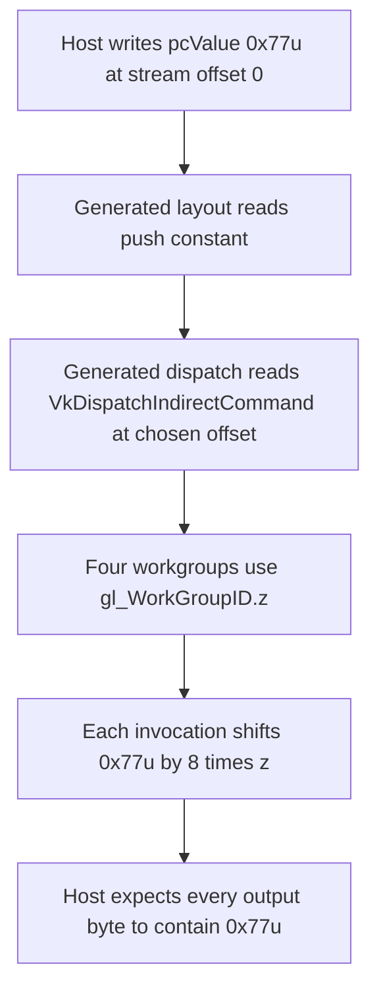

## Overview

**Core question:** Do Vulkan implementations report and honor the `VK_EXT_device_generated_commands` limits used by generated command streams?

- This page covers the `dgc.ext.misc.properties` test family implemented by `vktDGCPropertyTestsExt.cpp`.
- The family registers six test case leaves: `maxIndirectCommandsStreamIndirect`, `maxIndirectCommandsTokenCount_16`, `maxIndirectCommandsTokenCount_32`, `maxIndirectCommandsTokenOffset`, `maxIndirectSequenceCount`, and `valid_limits`.
- The tests query `VkPhysicalDeviceDeviceGeneratedCommandsPropertiesEXT`, exercise selected limits with compute dispatches or graphics draws, and compare host-visible results with exact expectations.
- The page explains the property checks, support gates, generated command layouts, shader roles, host-side validation, and the cases the source leaves untested.

## Background Knowledge

- **Generated command layouts.** A `VkIndirectCommandsLayoutEXT` describes how tokens such as push constants, dispatches, and draws are read from an indirect command stream. Each token has a byte offset, and the layout has a stream stride that separates successive sequences.
- **DGC properties and support bits.** `VkPhysicalDeviceDeviceGeneratedCommandsPropertiesEXT` supplies numeric limits and bitmasks. A test can be unsupported when the device lacks the extension, a required shader stage, or a required input mode. That outcome is different from a failed property or execution check.
- **Preprocessing and execution.** These tests allocate a preprocessing buffer for the generated sequences, then execute the same layout through `cmdExecuteGeneratedCommandsEXT`. A memory barrier makes shader writes or color attachment writes available to the host-side readback path.

## Registration Hierarchy

```text
dgc.ext.misc.properties
├── maxIndirectCommandsStreamIndirect
├── maxIndirectCommandsTokenCount_16
├── maxIndirectCommandsTokenCount_32
├── maxIndirectCommandsTokenOffset
├── maxIndirectSequenceCount
└── valid_limits
```

The six direct children appear in the `vk-default` mustpass list and the EXT property factory. The source registers `maxIndirectCommandsTokenCount_16` and `maxIndirectCommandsTokenCount_32` from one loop, but they remain separate registered test case leaves.

## Parameter Dimensions and Observed Values

The registered test case leaf is the primary dimension. The implementation also fixes values that define the command stream, resource sizes, and expected output for each leaf.

| Dimension | Registered values | Meaning in this test | Evidence |
|-----------|-------------------|----------------------|----------|
| Property-check leaf | `valid_limits` | Reads the EXT property structure and checks required minimums and feature bits without executing generated commands. | [valid limits](../../../modules/vulkan/device_generated_commands/vktDGCPropertyTestsExt.cpp#L164-L201) |
| Token-count leaf | `maxIndirectCommandsTokenCount_16`, `maxIndirectCommandsTokenCount_32` | Uses 15 or 31 push-constant tokens followed by one dispatch token, so the command layout contains exactly 16 or 32 tokens. | [token-count registration](../../../modules/vulkan/device_generated_commands/vktDGCPropertyTestsExt.cpp#L820-L829) |
| Token-count push-constant size | `pcSizeBytes = (tokenCount - 1u) * DE_SIZEOF32(uint32_t)` | Produces 60 bytes for `_16` and 124 bytes for `_32`; the support check compares this size with `maxPushConstantsSize`. | [token-count support](../../../modules/vulkan/device_generated_commands/vktDGCPropertyTestsExt.cpp#L65-L90) |
| Token offset leaf | `maxIndirectCommandsTokenOffset` | Places a dispatch token at the largest usable aligned offset allowed by `maxIndirectCommandsTokenOffset`, `maxIndirectCommandsIndirectStride`, and the test hard maximum. | [token-offset setup](../../../modules/vulkan/device_generated_commands/vktDGCPropertyTestsExt.cpp#L402-L427) |
| Stream stride leaf | `maxIndirectCommandsStreamIndirect` | Sets the command stream stride to the largest usable 4-byte-aligned value, bounded by `maxIndirectCommandsIndirectStride` and `1024u * 1024u`. | [stream-stride setup](../../../modules/vulkan/device_generated_commands/vktDGCPropertyTestsExt.cpp#L573-L597) |
| Sequence-count leaf | `maxIndirectSequenceCount` | Generates one point draw per pixel in a `1024 x 1024 x 1` framebuffer, producing `1u << 20` sequences. | [sequence-count setup](../../../modules/vulkan/device_generated_commands/vktDGCPropertyTestsExt.cpp#L693-L762) |
| Valid-limit thresholds | `1u << 20`, `16u`, `2047u`, `2048u`, `1u << 12` | Required minimums for `maxIndirectSequenceCount`, `maxIndirectCommandsTokenCount`, `maxIndirectCommandsTokenOffset`, `maxIndirectCommandsIndirectStride`, and `maxIndirectPipelineCount`. | [property thresholds](../../../modules/vulkan/device_generated_commands/vktDGCPropertyTestsExt.cpp#L164-L186) |
| Required EXT bits | `VK_INDIRECT_COMMANDS_INPUT_MODE_VULKAN_INDEX_BUFFER_EXT`; `VK_SHADER_STAGE_COMPUTE_BIT`, `VK_SHADER_STAGE_VERTEX_BIT`, `VK_SHADER_STAGE_FRAGMENT_BIT` | Requires Vulkan index-buffer input support and DGC support for the compute, vertex, and fragment stages. | [required property bits](../../../modules/vulkan/device_generated_commands/vktDGCPropertyTestsExt.cpp#L188-L199) |

## Behavior Parameters

The six registered test case leaves form the behavioral axis. Each leaf checks a different property or limit behavior.

### `valid_limits` | Property ranges and support bits

The test reads `context.getDeviceGeneratedCommandsPropertiesEXT()` and checks the required numeric ranges and bitmasks. It requires `maxIndirectSequenceCount >= (1u << 20)`, `maxIndirectCommandsTokenCount >= 16u`, `maxIndirectCommandsTokenOffset >= 2047u`, `maxIndirectCommandsIndirectStride >= 2048u`, and `maxIndirectPipelineCount >= (1u << 12)`. A nonzero `maxIndirectShaderObjectCount` must also be at least `1u << 12`. It requires the Vulkan index-buffer input bit and the compute, vertex, and fragment shader-stage bits.

### `maxIndirectCommandsTokenCount_16` | Sixteen command tokens

The registration loop sets `tokenCount` to `16u`, which gives 15 one-word push-constant tokens and one dispatch token. The generated compute shader copies a 15-element push-constant array into a storage buffer. The host expects the values `1000u` through `1014u` after one generated dispatch.

### `maxIndirectCommandsTokenCount_32` | Thirty-two command tokens

The registration loop sets `tokenCount` to `32u`, which gives 31 one-word push-constant tokens and one dispatch token. The generated compute shader copies a 31-element push-constant array into a storage buffer. The host expects the values `1000u` through `1030u` after one generated dispatch.

### `maxIndirectCommandsTokenOffset` | Dispatch at the allowed token offset

The test creates a push-constant token at offset `0u` and a dispatch token at a chosen aligned offset. The chosen offset is the smaller of `1024u * 1024u` and the minimum of the device's maximum stream stride minus the dispatch size and `maxIndirectCommandsTokenOffset`, rounded down to `sizeof(uint32_t)`. The dispatch uses `{1u, 1u, 4u}` so the compute shader writes the push-constant byte value `0x77u` into four byte positions of one output word.

### `maxIndirectCommandsStreamIndirect` | Maximum indirect stream stride

The test creates two command sequences with push constants `{0u, 555u}` and `{1u, 777u}`. It sets the layout stream stride to the largest usable 4-byte-aligned value bounded by `maxIndirectCommandsIndirectStride` and `1024u * 1024u`. Each dispatch stores its push-constant value at the indexed output position, so the host expects `{555u, 777u}`.

### `maxIndirectSequenceCount` | One draw per sequence

The test creates `1024 * 1024 * 1` vertices and one `VkDrawIndirectCommand` for each vertex. Each command draws one point with `firstVertex` equal to its sequence index. The vertex shader maps each vertex to the center of its pixel, and the fragment shader writes blue. The host expects the complete `1024 x 1024` color image to equal `(0.0f, 0.0f, 1.0f, 1.0f)` with a zero threshold.

## Shader Analysis

The source generates compute shaders for the token-count, token-offset, and stream-stride cases, and generates fixed vertex and fragment shaders for `maxIndirectSequenceCount`. The compute shader for `maxIndirectCommandsTokenOffset` is a representative walkthrough because its `gl_WorkGroupID.z` use makes the indirect dispatch dimensions observable in the readback word.

### Representative Shader Walkthrough 1

#### Parameter Values Chosen

Representative path:

```text
dEQP-VK.dgc.ext.misc.properties.maxIndirectCommandsTokenOffset
```

| Parameter choice | Meaning in this representative case |
|------------------|-------------------------------------|
| `maxIndirectCommandsTokenOffset` | Selects the compute test that places the dispatch token at a device-dependent, aligned stream offset. |
| `pcValue = 0x77u` | Supplies the byte-sized value that the shader shifts into each output byte position. |
| `VkDispatchIndirectCommand{1u, 1u, 4u}` | Gives the generated dispatch four workgroups along Z, one for each byte position checked by the host. |
| `VK_DESCRIPTOR_TYPE_STORAGE_BUFFER` at set `0`, binding `0` | Provides the host-visible output word written by the compute shader. |

#### Purpose

This shader checks that a dispatch token can be read from the selected maximum token offset and that its Z dimension reaches the shader unchanged. Each of four workgroups ORs `0x77u` into a different byte of the output word.

#### Structural Design



#### Shader Code

Reconstructed GLSL for this path:

```glsl
#version 460
/// The shader executes one invocation per workgroup. The indirect dispatch supplies four Z workgroups.
layout (local_size_x=1, local_size_y=1, local_size_z=1) in;
/// Set 0, binding 0 is the host-visible storage buffer containing the result word.
layout (set=0, binding=0, std430) buffer OutputBlock { uint value; } outputBuffer;
/// The generated push-constant token writes the test value used for every output byte.
layout (push_constant, std430) uniform PushConstantBlock { uint value; } pc;
void main (void) {
    /// Workgroup Z selects the byte position. The atomic OR combines the four invocations in one word.
    atomicOr(outputBuffer.value, (pc.value << (8 * gl_WorkGroupID.z)));
}
```

#### Additional Info

- The host rounds the selected token offset down to a `uint32_t` boundary before building the layout, while the stream stride remains the selected offset plus `sizeof(VkDispatchIndirectCommand)`. See [offset selection](../../../modules/vulkan/device_generated_commands/vktDGCPropertyTestsExt.cpp#L407-L445).
- The output word starts at zero. The host computes the expected value by shifting `pcValue` by `8 * i` for each byte position, matching the shader expression. See [offset result check](../../../modules/vulkan/device_generated_commands/vktDGCPropertyTestsExt.cpp#L490-L505).

#### Parameter Variation Summary

| Parameter dimension | Shader-level variation from this shader | Evidence |
|---------------------|----------------------------------------|----------|
| `maxIndirectCommandsTokenOffset` | The shader stays fixed while the generated command layout changes the dispatch token's byte offset. | [token-offset layout](../../../modules/vulkan/device_generated_commands/vktDGCPropertyTestsExt.cpp#L402-L439) |
| `maxIndirectCommandsTokenCount_16`, `maxIndirectCommandsTokenCount_32` | A separate generated shader changes the push-constant array length to 15 or 31 values and copies that array to the output buffer. | [array shader generator](../../../modules/vulkan/device_generated_commands/vktDGCPropertyTestsExt.cpp#L146-L161) |
| `maxIndirectCommandsStreamIndirect` | A separate generated shader changes the output to an indexed `uint values[]` array and writes `pc.value` at `pc.index`. | [indexed shader generator](../../../modules/vulkan/device_generated_commands/vktDGCPropertyTestsExt.cpp#L134-L143) |
| `maxIndirectSequenceCount` | The graphics path uses fixed `vert` and `frag` shaders. The vertex input and generated draw count vary, while the shaders map points and write blue. | [graphics shader generator](../../../modules/vulkan/device_generated_commands/vktDGCPropertyTestsExt.cpp#L99-L116) |

#### SPIR-V

- Status: generated and validated
- Source: reconstructed GLSL from this walkthrough
- Stage: `comp`
- Target SPIRV version: `spirv1.0`

<details>
<summary>Click to expand SPIRV asm code</summary>

```llvm
; SPIR-V
; Version: 1.0
; Generator: Khronos Glslang Reference Front End; 11
; Bound: 34
; Schema: 0
               OpCapability Shader
          %1 = OpExtInstImport "GLSL.std.450"
               OpMemoryModel Logical GLSL450
               OpEntryPoint GLCompute %main "main" %gl_WorkGroupID
               OpExecutionMode %main LocalSize 1 1 1
               OpSource GLSL 460
               OpName %main "main"
               OpName %OutputBlock "OutputBlock"
               OpMemberName %OutputBlock 0 "value"
               OpName %outputBuffer "outputBuffer"
               OpName %PushConstantBlock "PushConstantBlock"
               OpMemberName %PushConstantBlock 0 "value"
               OpName %pc "pc"
               OpName %gl_WorkGroupID "gl_WorkGroupID"
               OpDecorate %OutputBlock BufferBlock
               OpMemberDecorate %OutputBlock 0 Offset 0
               OpDecorate %outputBuffer Binding 0
               OpDecorate %outputBuffer DescriptorSet 0
               OpDecorate %PushConstantBlock Block
               OpMemberDecorate %PushConstantBlock 0 Offset 0
               OpDecorate %gl_WorkGroupID BuiltIn WorkgroupId
               OpDecorate %gl_WorkGroupSize BuiltIn WorkgroupSize
       %void = OpTypeVoid
          %3 = OpTypeFunction %void
       %uint = OpTypeInt 32 0
%OutputBlock = OpTypeStruct %uint
%_ptr_Uniform_OutputBlock = OpTypePointer Uniform %OutputBlock
%outputBuffer = OpVariable %_ptr_Uniform_OutputBlock Uniform
        %int = OpTypeInt 32 1
      %int_0 = OpConstant %int 0
%_ptr_Uniform_uint = OpTypePointer Uniform %uint
%PushConstantBlock = OpTypeStruct %uint
%_ptr_PushConstant_PushConstantBlock = OpTypePointer PushConstant %PushConstantBlock
         %pc = OpVariable %_ptr_PushConstant_PushConstantBlock PushConstant
%_ptr_PushConstant_uint = OpTypePointer PushConstant %uint
     %uint_8 = OpConstant %uint 8
     %v3uint = OpTypeVector %uint 3
%_ptr_Input_v3uint = OpTypePointer Input %v3uint
%gl_WorkGroupID = OpVariable %_ptr_Input_v3uint Input
     %uint_2 = OpConstant %uint 2
%_ptr_Input_uint = OpTypePointer Input %uint
     %uint_1 = OpConstant %uint 1
     %uint_0 = OpConstant %uint 0
%gl_WorkGroupSize = OpConstantComposite %v3uint %uint_1 %uint_1 %uint_1
       %main = OpFunction %void None %3
          %5 = OpLabel
         %13 = OpAccessChain %_ptr_Uniform_uint %outputBuffer %int_0
         %18 = OpAccessChain %_ptr_PushConstant_uint %pc %int_0
         %19 = OpLoad %uint %18
         %26 = OpAccessChain %_ptr_Input_uint %gl_WorkGroupID %uint_2
         %27 = OpLoad %uint %26
         %28 = OpIMul %uint %uint_8 %27
         %29 = OpShiftLeftLogical %uint %19 %28
         %32 = OpAtomicOr %uint %13 %uint_1 %uint_0 %29
               OpReturn
               OpFunctionEnd
```

</details>

## Runtime Execution and Result Checking

- `checkDGCExtSupport` requires `VK_EXT_device_generated_commands`, then checks requested shader stages, binding stages, input modes, and transform feedback support. The property page uses no transform feedback or index-buffer input mode for its executing cases. Compute cases use `checkDGCExtComputeSupport` with `DGCComputeSupportType::BASIC`; the graphics sequence case requests vertex and fragment stages. See [EXT support helpers](../../../modules/vulkan/device_generated_commands/vktDGCUtilExt.cpp#L44-L75).
- The compute cases create a host-visible storage output buffer, a descriptor set with a storage-buffer binding, a pipeline layout, and a compute pipeline. The graphics sequence case instead creates a color image with a host-visible verification buffer, a pipeline layout, and a graphics pipeline; it does not use a descriptor set. `DGCBuffer` stores the generated command stream, and `PreprocessBufferExt` allocates the preprocessing buffer for the sequence count. See [DGC helper declarations](../../../modules/vulkan/device_generated_commands/vktDGCUtilExt.hpp#L166-L200) and [buffer helpers](../../../modules/vulkan/device_generated_commands/vktDGCUtilExt.hpp#L282-L362).
- The token-count cases write one push-constant word per token, append `VkDispatchIndirectCommand{1u, 1u, 1u}`, execute one sequence, and compare every output word with the expected `1000u`-based sequence. See [token-count execution and check](../../../modules/vulkan/device_generated_commands/vktDGCPropertyTestsExt.cpp#L256-L346).
- The token-offset case writes the push constant at stream offset `0u` and the dispatch command at the selected offset, executes one sequence, then checks the packed output word. See [token-offset execution](../../../modules/vulkan/device_generated_commands/vktDGCPropertyTestsExt.cpp#L435-L505).
- The stream-stride case writes two command sequences separated by the chosen stride, executes two sequences, and checks the output array against the push-constant values selected by each `index`. See [stream-stride execution and check](../../../modules/vulkan/device_generated_commands/vktDGCPropertyTestsExt.cpp#L592-L690).
- The sequence-count case binds a point-list graphics pipeline, executes `de::sizeU32(drawCmds)` generated draw commands inside a render pass, copies the color image to a host-visible buffer, and compares it with a solid blue reference image at a zero threshold. See [sequence-count execution and check](../../../modules/vulkan/device_generated_commands/vktDGCPropertyTestsExt.cpp#L753-L808).
- Compute cases insert a shader-write to host-read barrier before submission completes. The graphics case copies color attachment output to the readback buffer through the image-to-buffer helper before the host comparison.

| Resource | Created/configured by host? | Bound to GPU? | Device access | Host readback | Role |
|----------|-----------------------------|---------------|---------------|---------------|------|
| Generated command stream | Yes, through `DGCBuffer` | Device address in `VkGeneratedCommandsInfoEXT` | Read by DGC preprocessing and execution | No | Carries push constants, dispatch commands, or draw commands at the tested offsets and strides. |
| Preprocessing buffer | Yes, through `PreprocessBufferExt` | Device address in `VkGeneratedCommandsInfoEXT` | Written during preprocessing and read during execution | No | Holds implementation-generated preprocessing data for the requested sequence count. |
| Compute output storage buffer | Yes | Set `0`, binding `0` | Written by compute shader | Yes | Receives copied push constants, indexed values, or packed byte results. |
| Graphics vertex buffer | Yes | Vertex binding `0` | Read by vertex shader | No | Contains one pixel-centered point position per sequence. |
| Graphics color image and readback buffer | Yes | Color attachment and transfer destination | Written by fragment output, then copied | Yes | Records the result of the `maxIndirectSequenceCount` point draws. |
| Push constants | Host data in the generated command stream | Push-constant range in the pipeline layout | Read by compute shader | No | Supplies array values, `index` and `value` pairs, or `0x77u`. |

## Failure Meaning

### Failure Cause Mapping

| If this behavior parameter value fails | Possible failure cause(s) |
|----------------------------------------|---------------------------|
| `valid_limits` | The implementation reports a numeric property below the required range or omits a required input-mode or shader-stage bit. |
| `maxIndirectCommandsTokenCount_16` | The implementation cannot represent or execute the 16-token layout, or the generated push-constant values do not reach the output buffer. |
| `maxIndirectCommandsTokenCount_32` | The implementation cannot represent or execute the 32-token layout, or the generated push-constant values do not reach the output buffer. |
| `maxIndirectCommandsTokenOffset` | The implementation does not read the dispatch token correctly at the selected offset, or the dispatch Z dimension does not reach the shader. |
| `maxIndirectCommandsStreamIndirect` | The implementation does not honor the selected stream stride, sequence separation, or push-constant-to-output indexing. |
| `maxIndirectSequenceCount` | The implementation does not execute all generated draw sequences or produces an unexpected framebuffer result. |

### Cause Analysis

#### Reported EXT property values or support bits are insufficient

**Possible failure symptoms:** `valid_limits` returns a test failure naming a property range or required bit that did not meet the source check.

**Possible implementation causes:** The physical-device property query may report values or capability bits that do not satisfy the minimums required by the EXT test. The source does not identify a narrower implementation cause, so source-level investigation is needed to determine why the reported properties are insufficient.

#### Generated compute layout or push-constant transfer is incorrect

**Possible failure symptoms:** A token-count case reports an unexpected value at an output-buffer position. The expected sequence starts at `1000u`; the result comes from the generated push-constant array.

**Possible implementation causes:** The implementation may calculate token positions or push-constant ranges incorrectly, fail to execute one of the push-constant tokens, or fail to make the shader write visible to the host after the compute-to-host barrier. The test source does not establish which implementation component would be responsible for a particular mismatch.

#### Dispatch token offset or dimensions are incorrect

**Possible failure symptoms:** `maxIndirectCommandsTokenOffset` reports an output word different from the expected value formed by placing `0x77u` in all four bytes.

**Possible implementation causes:** The implementation may read the dispatch token from the wrong stream offset, decode its Z dimension incorrectly, or fail to apply the generated push constant to the shader. The source-level check cannot distinguish those possibilities from the output word alone.

#### Maximum stream stride or sequence addressing is incorrect

**Possible failure symptoms:** `maxIndirectCommandsStreamIndirect` reports a value other than `555u` at index `0` or `777u` at index `1`.

**Possible implementation causes:** The implementation may advance between command sequences by the wrong stride, decode the `index` or `value` fields incorrectly, or fail to execute both sequences. The host comparison reports the mismatch but does not locate the failing layer.

#### Generated draw execution or color readback is incorrect

**Possible failure symptoms:** `maxIndirectSequenceCount` fails the exact image comparison because one or more pixels differ from the solid blue reference image.

**Possible implementation causes:** The implementation may omit or misdecode a generated draw, use the wrong `firstVertex`, fail to rasterize a point at its supplied pixel center, or fail to copy the rendered image into the host-visible buffer correctly. The source establishes the expected image and comparison, but further source and implementation investigation is needed for a specific failure.

## Case Pruning

### Requirement-based pruning

- Every case requires `VK_EXT_device_generated_commands`; `checkDGCExtSupport` calls `context.requireDeviceFunctionality` before it queries the EXT property structure. See [EXT support check](../../../modules/vulkan/device_generated_commands/vktDGCUtilExt.cpp#L44-L52).
- Compute cases require DGC compute-stage support. The token-count cases also require enough `maxPushConstantsSize` for their selected push-constant array and enough `maxIndirectCommandsTokenCount` for the push-constant tokens plus the dispatch token. See [compute support and token-count gates](../../../modules/vulkan/device_generated_commands/vktDGCPropertyTestsExt.cpp#L60-L90).
- The token-offset and stream-stride cases require `maxIndirectCommandsIndirectStride` and `maxIndirectCommandsTokenOffset` to cover their minimum command layouts. If either property is too small, the case returns `NotSupportedError` or fails the explicit minimum check in the execution function. See [offset requirements](../../../modules/vulkan/device_generated_commands/vktDGCPropertyTestsExt.cpp#L413-L427) and [stride requirements](../../../modules/vulkan/device_generated_commands/vktDGCPropertyTestsExt.cpp#L575-L585).
- The graphics sequence case requires DGC support for both `VK_SHADER_STAGE_VERTEX_BIT` and `VK_SHADER_STAGE_FRAGMENT_BIT`. See [graphics support](../../../modules/vulkan/device_generated_commands/vktDGCPropertyTestsExt.cpp#L93-L97).

### Design-based pruning

- `maxIndirectPipelineCount` and `maxIndirectShaderObjectCount` are queried by `valid_limits`, but the source does not generate thousands of pipelines or shader objects to exercise those maxima. The source comments record both as not tested because their minimum scale is too large. See [uncovered EXT limits](../../../modules/vulkan/device_generated_commands/vktDGCPropertyTestsExt.cpp#L838-L840).
- The token-count matrix contains only `16u` and `32u` leaves. The factory does not register other token counts. See [token-count registration loop](../../../modules/vulkan/device_generated_commands/vktDGCPropertyTestsExt.cpp#L820-L829).
- The token-offset and stream-stride executions cap allocations at `1024u * 1024u`, even when a device property is larger. This is a test-design limit that keeps one sequence or the two-sequence stream bounded while still exercising the largest selected usable value.

## Key Takeaways

- `valid_limits` checks both numeric EXT properties and required capability bits. It does not execute a generated command stream.
- The token-count cases use one push-constant token per word and append a dispatch token, so `_16` and `_32` test layouts with exactly 16 and 32 tokens.
- `maxIndirectCommandsTokenOffset` makes the dispatch location observable through four workgroups and four byte shifts of `0x77u`.
- `maxIndirectCommandsStreamIndirect` checks that two sequences remain separated by the selected stream stride and write to the indexed output positions `{555u, 777u}`.
- `maxIndirectSequenceCount` turns the minimum sequence count into one point draw per pixel and compares the result with a solid blue image.
- A failure identifies the observed property, generated-command result, or image mismatch. The host checks do not by themselves identify a specific driver, compiler, hardware, or host cause.

## Source Reference Appendix

| Entry point | Link | Why it matters |
|-------------|------|----------------|
| EXT property test factory | [createDGCPropertyTestsExt](../../../modules/vulkan/device_generated_commands/vktDGCPropertyTestsExt.cpp#L813-L842) | Registers the `properties` group and all six exact test case leaves. |
| Property query and limit validation | [validLimits](../../../modules/vulkan/device_generated_commands/vktDGCPropertyTestsExt.cpp#L164-L201) | Checks EXT numeric limits and required input-mode and shader-stage bits. |
| Token-count support and execution | [maxIndirectCommandsTokenCountRun](../../../modules/vulkan/device_generated_commands/vktDGCPropertyTestsExt.cpp#L65-L90), [execution](../../../modules/vulkan/device_generated_commands/vktDGCPropertyTestsExt.cpp#L204-L347) | Gates the push-constant sizes and verifies the 16-token and 32-token layouts. |
| Token-offset execution | [maxIndirectCommandsTokenOffsetRun](../../../modules/vulkan/device_generated_commands/vktDGCPropertyTestsExt.cpp#L349-L506) | Chooses the aligned dispatch offset and checks the packed byte result. |
| Stream-stride execution | [maxIndirectCommandsIndirectStrideRun](../../../modules/vulkan/device_generated_commands/vktDGCPropertyTestsExt.cpp#L508-L691) | Chooses the stream stride, emits two sequences, and checks indexed output values. |
| Sequence-count execution | [maxIndirectSequenceCountRun](../../../modules/vulkan/device_generated_commands/vktDGCPropertyTestsExt.cpp#L693-L808) | Emits one point draw per pixel and compares the copied framebuffer. |
| Generated compute shaders | [shader generators](../../../modules/vulkan/device_generated_commands/vktDGCPropertyTestsExt.cpp#L119-L161) | Defines the dispatch-Z byte test, indexed output test, and push-constant-array test. |
| Generated graphics shaders | [basicGraphicsPrograms](../../../modules/vulkan/device_generated_commands/vktDGCPropertyTestsExt.cpp#L99-L116) | Defines the vertex position pass-through and solid-blue fragment output. |
| EXT support helper | [checkDGCExtSupport](../../../modules/vulkan/device_generated_commands/vktDGCUtilExt.cpp#L44-L75) | Requires the extension and validates shader-stage, binding, and input-mode support. |
| DGC layout and execution helpers | [DGC utility declarations](../../../modules/vulkan/device_generated_commands/vktDGCUtilExt.hpp#L166-L327) | Describes the `DGCGenCmdsInfo`, `IndirectCommandsLayoutBuilderExt`, and `PreprocessBufferExt` wrappers used by the tests. |
| vk-default mustpass paths | [dgc.txt](../../../mustpass/main/vk-default/dgc.txt#L4328-L4333) | Lists all six `dEQP-VK.dgc.ext.misc.properties` paths. |
| Android mustpass paths | The Android mustpass file is outside this repository checkout; the vk-default list above is the available local mustpass evidence. |
