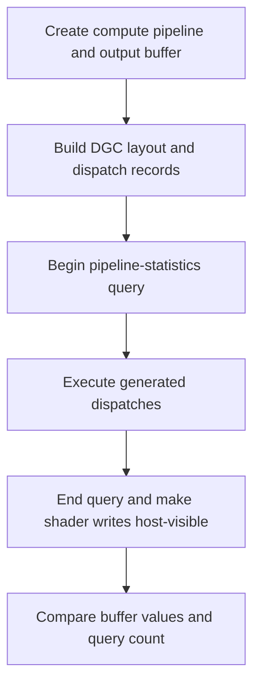

## Overview

**Core question:** Does `VK_EXT_device_generated_commands` preserve the selected pipeline-statistics counts while generated compute or graphics work executes through each supported construction and preprocessing path?

- This page documents the implementation-bearing `dgc.ext.stat_query` family in [`vktDGCStatQueryTestsExt.cpp`](../../../modules/vulkan/device_generated_commands/vktDGCStatQueryTestsExt.cpp#L57-L203).
- The source registers 120 exact leaves: ten statistic selections, three construction modes, optional execution sets, and optional preprocessing. All 120 appear in the default mustpass inventory ([registration](../../../modules/vulkan/device_generated_commands/vktDGCStatQueryTestsExt.cpp#L1404-L1449), [mustpass](../../../mustpass/main/vk-default/dgc.txt#L4376-L4495)).
- Compute cases validate a storage-buffer result and the selected query counter. Graphics cases validate rendered colors and the selected query counter.
- The page explains the complete direct-child hierarchy, parameter matrix, support gates, generated shader roles, execution flow, result checks, and evidence-backed failure meaning.

## Background Knowledge

- **Pipeline statistics queries.** A query pool configured with selected statistic bits counts activity between `cmdBeginQuery` and `cmdEndQuery`. Some counters have exact expected values; invocation counters can have implementation-dependent extra work and are therefore checked with lower bounds.
- **Device-generated commands.** A generated-command layout describes how an indirect stream supplies execution-set indices, offsets, dispatches, or draws. Preprocessing optionally converts that stream into implementation-defined state before a later execute command.
- **Execution sets and construction modes.** An execution set selects among pre-created pipelines or shader objects. Monolithic pipelines, fast-linked libraries, and unlinked shader objects are distinct ways to prepare the executable state that generated commands consume.
- **Pipeline statistics depend on shader stages.** The selected statistic determines which shader stages are required. For example, `comp_inv` needs a compute stage, while `task_mesh_inv` needs task and mesh shader query support.

## Registration Hierarchy

```text
dgc.ext.stat_query
├── comp_inv_fast_lib
├── comp_inv_fast_lib_ies
├── comp_inv_fast_lib_ies_preprocess
├── comp_inv_fast_lib_preprocess
├── comp_inv_monolithic
├── comp_inv_monolithic_ies
├── comp_inv_monolithic_ies_preprocess
├── comp_inv_monolithic_preprocess
├── comp_inv_shader_obj
├── comp_inv_shader_obj_ies
├── comp_inv_shader_obj_ies_preprocess
├── comp_inv_shader_obj_preprocess
├── frag_inv_fast_lib
├── frag_inv_fast_lib_ies
├── frag_inv_fast_lib_ies_preprocess
├── frag_inv_fast_lib_preprocess
├── frag_inv_monolithic
├── frag_inv_monolithic_ies
├── frag_inv_monolithic_ies_preprocess
├── frag_inv_monolithic_preprocess
├── frag_inv_shader_obj
├── frag_inv_shader_obj_ies
├── frag_inv_shader_obj_ies_preprocess
├── frag_inv_shader_obj_preprocess
├── geom_inv_fast_lib
├── geom_inv_fast_lib_ies
├── geom_inv_fast_lib_ies_preprocess
├── geom_inv_fast_lib_preprocess
├── geom_inv_monolithic
├── geom_inv_monolithic_ies
├── geom_inv_monolithic_ies_preprocess
├── geom_inv_monolithic_preprocess
├── geom_inv_shader_obj
├── geom_inv_shader_obj_ies
├── geom_inv_shader_obj_ies_preprocess
├── geom_inv_shader_obj_preprocess
├── geom_prim_fast_lib
├── geom_prim_fast_lib_ies
├── geom_prim_fast_lib_ies_preprocess
├── geom_prim_fast_lib_preprocess
├── geom_prim_monolithic
├── geom_prim_monolithic_ies
├── geom_prim_monolithic_ies_preprocess
├── geom_prim_monolithic_preprocess
├── geom_prim_shader_obj
├── geom_prim_shader_obj_ies
├── geom_prim_shader_obj_ies_preprocess
├── geom_prim_shader_obj_preprocess
├── input_prim_fast_lib
├── input_prim_fast_lib_ies
├── input_prim_fast_lib_ies_preprocess
├── input_prim_fast_lib_preprocess
├── input_prim_monolithic
├── input_prim_monolithic_ies
├── input_prim_monolithic_ies_preprocess
├── input_prim_monolithic_preprocess
├── input_prim_shader_obj
├── input_prim_shader_obj_ies
├── input_prim_shader_obj_ies_preprocess
├── input_prim_shader_obj_preprocess
├── input_vert_fast_lib
├── input_vert_fast_lib_ies
├── input_vert_fast_lib_ies_preprocess
├── input_vert_fast_lib_preprocess
├── input_vert_monolithic
├── input_vert_monolithic_ies
├── input_vert_monolithic_ies_preprocess
├── input_vert_monolithic_preprocess
├── input_vert_shader_obj
├── input_vert_shader_obj_ies
├── input_vert_shader_obj_ies_preprocess
├── input_vert_shader_obj_preprocess
├── task_mesh_inv_fast_lib
├── task_mesh_inv_fast_lib_ies
├── task_mesh_inv_fast_lib_ies_preprocess
├── task_mesh_inv_fast_lib_preprocess
├── task_mesh_inv_monolithic
├── task_mesh_inv_monolithic_ies
├── task_mesh_inv_monolithic_ies_preprocess
├── task_mesh_inv_monolithic_preprocess
├── task_mesh_inv_shader_obj
├── task_mesh_inv_shader_obj_ies
├── task_mesh_inv_shader_obj_ies_preprocess
├── task_mesh_inv_shader_obj_preprocess
├── tesc_patch_fast_lib
├── tesc_patch_fast_lib_ies
├── tesc_patch_fast_lib_ies_preprocess
├── tesc_patch_fast_lib_preprocess
├── tesc_patch_monolithic
├── tesc_patch_monolithic_ies
├── tesc_patch_monolithic_ies_preprocess
├── tesc_patch_monolithic_preprocess
├── tesc_patch_shader_obj
├── tesc_patch_shader_obj_ies
├── tesc_patch_shader_obj_ies_preprocess
├── tesc_patch_shader_obj_preprocess
├── tese_inv_fast_lib
├── tese_inv_fast_lib_ies
├── tese_inv_fast_lib_ies_preprocess
├── tese_inv_fast_lib_preprocess
├── tese_inv_monolithic
├── tese_inv_monolithic_ies
├── tese_inv_monolithic_ies_preprocess
├── tese_inv_monolithic_preprocess
├── tese_inv_shader_obj
├── tese_inv_shader_obj_ies
├── tese_inv_shader_obj_ies_preprocess
├── tese_inv_shader_obj_preprocess
├── vert_inv_fast_lib
├── vert_inv_fast_lib_ies
├── vert_inv_fast_lib_ies_preprocess
├── vert_inv_fast_lib_preprocess
├── vert_inv_monolithic
├── vert_inv_monolithic_ies
├── vert_inv_monolithic_ies_preprocess
├── vert_inv_monolithic_preprocess
├── vert_inv_shader_obj
├── vert_inv_shader_obj_ies
├── vert_inv_shader_obj_ies_preprocess
└── vert_inv_shader_obj_preprocess
```

The source registers the 120 direct test-case leaves shown above. They are the Cartesian product of ten statistic selections, three construction modes, optional execution sets, and optional preprocessing ([registration](../../../modules/vulkan/device_generated_commands/vktDGCStatQueryTestsExt.cpp#L1404-L1449)).

## Parameter Dimensions and Observed Values

| Dimension | Registered values | Meaning in this test | Evidence |
|---|---|---|---|
| Pipeline statistic | `input_vert`, `input_prim`, `vert_inv`, `geom_inv`, `geom_prim`, `frag_inv`, `tesc_patch`, `tese_inv`, `comp_inv`, `task_mesh_inv` | Selects the query bit, required shader stages, generated workload, and exact or minimum expected count. | [stat cases](../../../modules/vulkan/device_generated_commands/vktDGCStatQueryTestsExt.cpp#L1406-L1419) |
| Pipeline construction | `monolithic`, `fast_lib`, `shader_obj` | Selects ordinary pipelines, fast-linked libraries, or unlinked shader objects. | [construction cases](../../../modules/vulkan/device_generated_commands/vktDGCStatQueryTestsExt.cpp#L1421-L1425) |
| Execution set | absent, `_ies` | Selects direct pipeline/shader binding or an execution-set index in generated command data. | [generated command setup](../../../modules/vulkan/device_generated_commands/vktDGCStatQueryTestsExt.cpp#L920-L944) |
| Preprocessing | absent, `_preprocess` | Selects direct execution or a separate preprocessing command followed by execution. | [preprocess path](../../../modules/vulkan/device_generated_commands/vktDGCStatQueryTestsExt.cpp#L1042-L1050) |
| Workload shape | compute: 64 workgroups × 64 invocations; graphics: 8×8 extent | Determines the data written by compute or colors produced by graphics while the query is active. | [fixed dimensions](../../../modules/vulkan/device_generated_commands/vktDGCStatQueryTestsExt.cpp#L154-L173) |

## Behavior Parameters

The primary behavioral axis is the pipeline statistic. Each value changes which stages are created or queried and which result contract is checked; construction, execution-set, and preprocessing are orthogonal execution variants.

### `input_vert` and `input_prim` — input-assembly counts

These graphics variants query input-assembly vertices or primitives. The source requires exact counts: the vertex count is the generated vertex-buffer size, while the primitive count is derived from the selected graphics topology ([query checks](../../../modules/vulkan/device_generated_commands/vktDGCStatQueryTestsExt.cpp#L1212-L1265)).

### `vert_inv`, `geom_inv`, `frag_inv`, and `tese_inv` — stage invocation lower bounds

These cases query vertex, geometry, fragment, or tessellation-evaluation invocations. The source uses lower bounds where implementation execution may legally exceed the minimum; fragment invocations additionally account for the device's maximum fragment size when fragment shading rate is supported ([query checks](../../../modules/vulkan/device_generated_commands/vktDGCStatQueryTestsExt.cpp#L1267-L1344)).

### `geom_prim` and `tesc_patch` — exact graphics structure

Geometry primitives and tessellation-control patches use exact expected counts derived from the generated workload. These values verify that generated draws reach the intended topology and tessellation stages ([geometry check](../../../modules/vulkan/device_generated_commands/vktDGCStatQueryTestsExt.cpp#L1278-L1292), [tessellation check](../../../modules/vulkan/device_generated_commands/vktDGCStatQueryTestsExt.cpp#L1323-L1333)).

### `comp_inv` — compute invocation lower bound

The compute variant dispatches 64 workgroups of 64 invocations and requires at least that many compute shader invocations. It also compares every storage-buffer item with the source-defined shader-variant reference ([compute dimensions](../../../modules/vulkan/device_generated_commands/vktDGCStatQueryTestsExt.cpp#L165-L173), [compute result](../../../modules/vulkan/device_generated_commands/vktDGCStatQueryTestsExt.cpp#L1089-L1123), [query check](../../../modules/vulkan/device_generated_commands/vktDGCStatQueryTestsExt.cpp#L1346-L1356)).

### `task_mesh_inv` — task and mesh invocation counts

The combined task/mesh statistic selects task and mesh shader stages. The source requires exact task and mesh invocation counts derived from the 8×8 graphics extent and fixed task/mesh workgroup sizes ([support](../../../modules/vulkan/device_generated_commands/vktDGCStatQueryTestsExt.cpp#L187-L191), [query checks](../../../modules/vulkan/device_generated_commands/vktDGCStatQueryTestsExt.cpp#L1357-L1379)).

## Shader Analysis

The family generates compute, vertex, tessellation, geometry, fragment, task, and mesh shaders according to the selected statistic. The central shader-side role is to produce distinguishable output for execution-set variants; the query counters are collected by the host around generated execution. The compute path below is representative because it exposes the storage-buffer result contract directly.

### Representative Shader Walkthrough 1

#### Parameter Values Chosen

Representative path:

```text
dEQP-VK.dgc.ext.stat_query.comp_inv_monolithic
```

| Parameter choice | Meaning in this representative case |
|---|---|
| `comp_inv` | Query compute-shader invocations and require the minimum dispatch count. |
| `monolithic` | Bind one ordinary compute pipeline rather than an execution-set or shader-object variant. |
| no `_ies`, no `_preprocess` | Execute the generated command stream directly with no execution-set index and no separate preprocessing command. |

#### Purpose

The compute path makes generated dispatch execution observable through both a storage-buffer pattern and the compute invocation query. The query begins before generated execution and ends immediately after it, so the count covers the generated work.

#### Structural Design



#### Shader Code

```glsl
#version 460
/// One invocation runs for each local ID in a 64-invocation workgroup.
layout (local_size_x=64) in;
/// The generated command stream supplies the workgroup offset through this push constant.
layout (push_constant, std430) uniform PCBlock { uint wgOffset; } pc;
/// The host maps this storage buffer after execution and compares every element.
layout (set=0, binding=0, std430) buffer BufferBlock {
    uint values[];
} ssbo;
void main(void) {
    /// Convert the generated sequence offset and local invocation into one output index.
    uint global_id = (gl_WorkGroupID.x + pc.wgOffset) * gl_WorkGroupSize.x + gl_LocalInvocationIndex;
    /// The shader variant writes i+1; execution-set variants use a different i.
    ssbo.values[global_id] = 1u;
}
```

#### Additional Info

- The source changes the final literal from `1u` to `i + 1` when execution-set shader variants are generated; the representative monolithic case therefore writes `1u` ([compute generator](../../../modules/vulkan/device_generated_commands/vktDGCStatQueryTestsExt.cpp#L349-L367)).
- The host requires DGC support for the selected compute stage, pipeline-statistics-query support, and the selected pipeline-construction requirements ([support](../../../modules/vulkan/device_generated_commands/vktDGCStatQueryTestsExt.cpp#L177-L203)).
- Graphics cases replace the storage-buffer output with an 8×8 color image and generate stage-specific colors so execution-set selection is reflected in the reference image ([graphics validation](../../../modules/vulkan/device_generated_commands/vktDGCStatQueryTestsExt.cpp#L1125-L1209)).

#### Parameter Variation Summary

| Parameter dimension | Shader-level variation from this shader | Evidence |
|---|---|---|
| Statistic | Graphics statistics add vertex, tessellation, geometry, fragment, task, or mesh stages and use stage-specific exact/minimum checks. | [stage selection](../../../modules/vulkan/device_generated_commands/vktDGCStatQueryTestsExt.cpp#L69-L112) |
| Construction | `fast_lib` uses fast-linked pipeline construction; `shader_obj` binds shader objects and changes the execution-set binding path. | [construction loop](../../../modules/vulkan/device_generated_commands/vktDGCStatQueryTestsExt.cpp#L1421-L1425), [binding](../../../modules/vulkan/device_generated_commands/vktDGCStatQueryTestsExt.cpp#L1027-L1041) |
| Execution set | `_ies` adds execution-set indices to generated command records and creates shader/pipeline variants where the selected statistic needs them. | [variant counts](../../../modules/vulkan/device_generated_commands/vktDGCStatQueryTestsExt.cpp#L114-L151) |
| Preprocessing | `_preprocess` runs `cmdPreprocessGeneratedCommandsEXT` before execution. | [preprocess execution](../../../modules/vulkan/device_generated_commands/vktDGCStatQueryTestsExt.cpp#L1042-L1050) |

#### SPIR-V

- Status: generated and validated
- Source: reconstructed GLSL from this walkthrough
- Stage: `comp`
- Target SPIRV version: `spirv1.4`

<details>
<summary>Click to expand SPIRV asm code</summary>

```llvm
; SPIR-V
; Version: 1.4
; Generator: Khronos Glslang Reference Front End; 11
; Bound: 39
; Schema: 0
               OpCapability Shader
          %1 = OpExtInstImport "GLSL.std.450"
               OpMemoryModel Logical GLSL450
               OpEntryPoint GLCompute %main "main" %gl_WorkGroupID %pc %gl_LocalInvocationIndex %ssbo
               OpExecutionMode %main LocalSize 64 1 1
               OpSource GLSL 460
               OpName %main "main"
               OpName %global_id "global_id"
               OpName %gl_WorkGroupID "gl_WorkGroupID"
               OpName %PCBlock "PCBlock"
               OpMemberName %PCBlock 0 "wgOffset"
               OpName %pc "pc"
               OpName %gl_LocalInvocationIndex "gl_LocalInvocationIndex"
               OpName %BufferBlock "BufferBlock"
               OpMemberName %BufferBlock 0 "values"
               OpName %ssbo "ssbo"
               OpDecorate %gl_WorkGroupID BuiltIn WorkgroupId
               OpDecorate %PCBlock Block
               OpMemberDecorate %PCBlock 0 Offset 0
               OpDecorate %gl_LocalInvocationIndex BuiltIn LocalInvocationIndex
               OpDecorate %_runtimearr_uint ArrayStride 4
               OpDecorate %BufferBlock Block
               OpMemberDecorate %BufferBlock 0 Offset 0
               OpDecorate %ssbo Binding 0
               OpDecorate %ssbo DescriptorSet 0
               OpDecorate %gl_WorkGroupSize BuiltIn WorkgroupSize
       %void = OpTypeVoid
          %3 = OpTypeFunction %void
       %uint = OpTypeInt 32 0
%_ptr_Function_uint = OpTypePointer Function %uint
     %v3uint = OpTypeVector %uint 3
%_ptr_Input_v3uint = OpTypePointer Input %v3uint
%gl_WorkGroupID = OpVariable %_ptr_Input_v3uint Input
     %uint_0 = OpConstant %uint 0
%_ptr_Input_uint = OpTypePointer Input %uint
    %PCBlock = OpTypeStruct %uint
%_ptr_PushConstant_PCBlock = OpTypePointer PushConstant %PCBlock
         %pc = OpVariable %_ptr_PushConstant_PCBlock PushConstant
        %int = OpTypeInt 32 1
      %int_0 = OpConstant %int 0
%_ptr_PushConstant_uint = OpTypePointer PushConstant %uint
    %uint_64 = OpConstant %uint 64
%gl_LocalInvocationIndex = OpVariable %_ptr_Input_uint Input
%_runtimearr_uint = OpTypeRuntimeArray %uint
%BufferBlock = OpTypeStruct %_runtimearr_uint
%_ptr_StorageBuffer_BufferBlock = OpTypePointer StorageBuffer %BufferBlock
       %ssbo = OpVariable %_ptr_StorageBuffer_BufferBlock StorageBuffer
     %uint_1 = OpConstant %uint 1
%_ptr_StorageBuffer_uint = OpTypePointer StorageBuffer %uint
%gl_WorkGroupSize = OpConstantComposite %v3uint %uint_64 %uint_1 %uint_1
       %main = OpFunction %void None %3
          %5 = OpLabel
  %global_id = OpVariable %_ptr_Function_uint Function
         %14 = OpAccessChain %_ptr_Input_uint %gl_WorkGroupID %uint_0
         %15 = OpLoad %uint %14
         %22 = OpAccessChain %_ptr_PushConstant_uint %pc %int_0
         %23 = OpLoad %uint %22
         %24 = OpIAdd %uint %15 %23
         %26 = OpIMul %uint %24 %uint_64
         %28 = OpLoad %uint %gl_LocalInvocationIndex
         %29 = OpIAdd %uint %26 %28
               OpStore %global_id %29
         %34 = OpLoad %uint %global_id
         %37 = OpAccessChain %_ptr_StorageBuffer_uint %ssbo %int_0 %34
               OpStore %37 %uint_1
               OpReturn
               OpFunctionEnd
```

</details>

## Runtime Execution and Result Checking

- Support checks derive required shader stages from the selected statistic, then require DGC support, pipeline-construction requirements, pipeline-statistics-query support, and geometry, tessellation, or mesh features where needed ([support](../../../modules/vulkan/device_generated_commands/vktDGCStatQueryTestsExt.cpp#L177-L203)).
- The host creates a storage buffer for compute cases or an 8×8 color image and readback buffer for graphics cases. It builds the selected pipeline or shader-object state and the generated-command stream ([resource setup](../../../modules/vulkan/device_generated_commands/vktDGCStatQueryTestsExt.cpp#L440-L504), [command data](../../../modules/vulkan/device_generated_commands/vktDGCStatQueryTestsExt.cpp#L920-L1009)).
- The query pool is created with the selected statistic bit. The command buffer begins the query, optionally runs preprocessing, executes generated commands, ends the query, and inserts the relevant visibility/copy operations ([query and execution](../../../modules/vulkan/device_generated_commands/vktDGCStatQueryTestsExt.cpp#L1017-L1084)).
- Compute output is compared element-by-element against the shader-variant reference. Graphics output is compared pixel-by-pixel against a source-derived reference image. Query results then receive exact or minimum checks according to the selected statistic ([output checks](../../../modules/vulkan/device_generated_commands/vktDGCStatQueryTestsExt.cpp#L1086-L1209), [query checks](../../../modules/vulkan/device_generated_commands/vktDGCStatQueryTestsExt.cpp#L1212-L1383)).

## Failure Meaning

### Failure Cause Mapping

| Observation | What it establishes | What it does not establish |
|---|---|---|
| Support rejection | The selected stage, construction mode, execution-set mode, or feature combination is unavailable. | It does not establish an implementation failure for a supported combination. |
| Compute buffer mismatch | Generated compute execution or shader-variant selection produced an unexpected value. | It does not by itself isolate command-stream addressing, descriptor state, shader code, or synchronization. |
| Graphics image mismatch | Generated graphics execution produced an unexpected stage-color result. | It does not identify which stage or binding path caused the mismatch. |
| Query count mismatch | The reported statistic did not satisfy the source-defined exact or minimum contract. | It does not identify whether pipeline setup, generated execution, query accounting, or the implementation's counter caused the discrepancy. |

### Cause Analysis

#### Generated compute output mismatch

**Possible failure symptoms:** A storage-buffer item differs from the expected shader-variant value.

**Possible implementation causes:** Investigate generated-command offsets, execution-set selection, descriptor binding, compute shader execution, and shader-write visibility. The source comparison does not isolate those mechanisms.

#### Generated graphics output mismatch

**Possible failure symptoms:** The 8×8 color image differs from the reference image.

**Possible implementation causes:** Investigate generated draw records, pipeline or shader-object selection, stage interfaces, render-pass/image transitions, and readback synchronization.

#### Pipeline-statistics query mismatch

**Possible failure symptoms:** An exact count differs, or a lower-bound count is below the required minimum.

**Possible implementation causes:** Investigate query begin/end scope, generated execution coverage, stage enablement, primitive topology, feature support, and implementation counter accounting. The source does not provide a narrower diagnosis.

## Case Pruning

### Requirement-based pruning

The source prunes at support-check time: unsupported DGC stages, execution-set binding modes, pipeline-construction requirements, pipeline statistics queries, geometry/tessellation features, and mesh shader query features produce a support skip rather than a registered-case omission ([support](../../../modules/vulkan/device_generated_commands/vktDGCStatQueryTestsExt.cpp#L177-L203)).

### Design-based pruning

The registration deliberately fixes the statistic set, three construction modes, two execution-set states, two preprocessing states, an 8×8 graphics extent, and a 64×64 compute workload. It does not explore other statistics, extents, workgroup sizes, construction modes, or arbitrary combinations outside the 120 generated leaves ([registration](../../../modules/vulkan/device_generated_commands/vktDGCStatQueryTestsExt.cpp#L1404-L1449)).

## Key Takeaways

- The ten direct statistic names are the page's complete registration roots; construction, execution-set, and preprocessing suffixes generate the 120 leaves.
- Compute cases validate a generated storage-buffer pattern and a pipeline-statistics counter; graphics cases validate an image and a counter.
- Exact and lower-bound query checks are intentionally different because Vulkan permits extra invocations for some stages.
- Support checks distinguish unavailable feature combinations from failures in supported generated-command execution.

## Source Reference Appendix

| Entry point | Link | Why it matters |
|---|---|---|
| `TestParams` | [dimensions and stage selection](../../../modules/vulkan/device_generated_commands/vktDGCStatQueryTestsExt.cpp#L57-L175) | Defines statistic-to-stage mapping and fixed workloads. |
| `checkSupport` | [support gates](../../../modules/vulkan/device_generated_commands/vktDGCStatQueryTestsExt.cpp#L177-L203) | Defines feature and construction requirements. |
| `initPrograms` | [generated shaders](../../../modules/vulkan/device_generated_commands/vktDGCStatQueryTestsExt.cpp#L205-L434) | Emits the stage-specific shader variants. |
| `iterate` | [execution and checks](../../../modules/vulkan/device_generated_commands/vktDGCStatQueryTestsExt.cpp#L440-L1389) | Records generated execution, readback, image comparison, and query validation. |
| `populateStatQueryTestGroup` | [registration](../../../modules/vulkan/device_generated_commands/vktDGCStatQueryTestsExt.cpp#L1404-L1449) | Defines the ten direct children and 120 generated leaves. |
