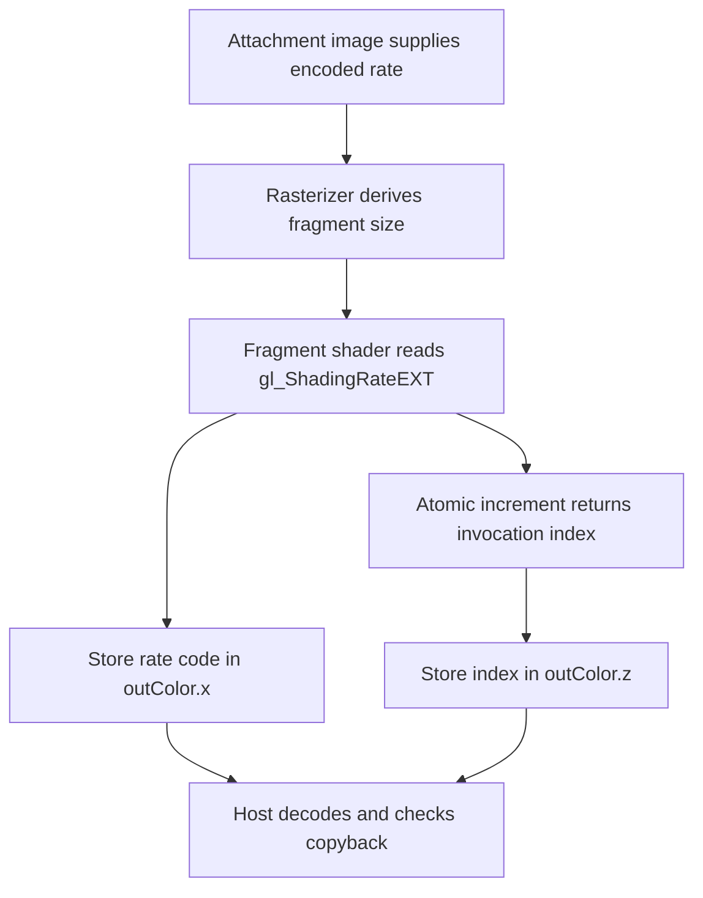

## Overview

**Core question:** Does a fragment shading rate attachment make rasterization use the requested fragment size, regardless of how the attachment data reaches the GPU?

- This page covers the implementation and registration in [`vktAttachmentRateTests.cpp`](../../../modules/vulkan/fragment_shading_rate/vktAttachmentRateTests.cpp#L184-L305).
- The `attachment_rate` test family prepares an attachment image through six setup paths, renders triangles with it, and checks the fragment-rate result.
- The matrix varies 16 unsigned-integer attachment formats, nine requested fragment sizes, render-pass attachment variants, and `_null_shading` leaves registered under the dynamic-rendering permutation (the current source parameters route those duplicates through the render-pass path; see the note below).
- The `misc` area adds two subpasses, explicit memory-access synchronization, read-only depth/stencil layouts, and a dynamic-rendering `maintenance5` case.
- The test records `gl_ShadingRateEXT` and an atomic invocation index in a color attachment, then checks the image after copyback.

## Background Knowledge

- A fragment shading rate attachment maps framebuffer pixels to attachment texels. For a framebuffer pixel `(x, y)`, the implementation reads texel `(floor(x / region.x), floor(y / region.y))`, where `region` is `shadingRateAttachmentTexelSize`. The first component encodes the fragment width and height as powers of two. See [Attachment Fragment Shading Rate](../../../../vulkan-docs/src/chapters/primsrast.adoc#primsrast-fragment-shading-rate-attachment).
- Rasterization combines pipeline, primitive, and attachment rates. This test keeps the pipeline and primitive contributions at `1x1`, so the attachment rate is the value under test. The fragment shader exposes the final value through `gl_ShadingRateEXT`. See [Combining the Fragment Shading Rates](../../../../vulkan-docs/src/chapters/primsrast.adoc#primsrast-fragment-shading-rate-combining).
- A shading-rate attachment read occurs in `VK_PIPELINE_STAGE_FRAGMENT_SHADING_RATE_ATTACHMENT_BIT_KHR` and uses `VK_ACCESS_FRAGMENT_SHADING_RATE_ATTACHMENT_READ_BIT_KHR`. Setup writes therefore need a dependency before rasterization reads. See [supported fragment shading-rate access](../../../../vulkan-docs/src/chapters/synchronization.adoc#synchronization-access-types-supported).

## Registration Hierarchy

```text
fragment_shading_rate.renderpass2.monolithic.attachment_rate
├── setup_with_atomics
├── setup_with_fragment
├── setup_with_copying
├── setup_with_copying_using_transfer_queue_concurent
├── setup_with_copying_using_transfer_queue_exclusive
├── setup_with_linear_tiled_image
└── misc

fragment_shading_rate.dynamic_rendering.primary_cmd_buff.monolithic.attachment_rate
├── setup_with_atomics
├── setup_with_fragment
├── setup_with_copying
├── setup_with_copying_using_transfer_queue_concurent
├── setup_with_copying_using_transfer_queue_exclusive
├── setup_with_linear_tiled_image
└── misc
```

The source adds `attachment_rate` only for monolithic pipelines without secondary command buffers. Dynamic rendering is created as a separate top-level permutation, and Vulkan SC excludes that branch. The checked mustpass files contain the render-pass tree in `fragment-shading-rate.txt` for both `vk-default` and `vksc-default`; the non-SC file also contains the dynamic-rendering primary-command-buffer tree. The dynamic `misc` leaf is `maintenance5`, while the render-pass `misc` group contains six leaves.

## Parameter Dimensions and Observed Values

| Dimension | Registered values | Meaning in this test | Evidence |
|-----------|-------------------|----------------------|----------|
| Setup mode | `setup_with_atomics`, `setup_with_fragment`, `setup_with_copying`, `setup_with_copying_using_transfer_queue_concurent`, `setup_with_copying_using_transfer_queue_exclusive`, `setup_with_linear_tiled_image` | Changes how the shading-rate image receives its constant encoded rate before the draw. | [`testModeParams`](../../../modules/vulkan/fragment_shading_rate/vktAttachmentRateTests.cpp#L2578-L2593) |
| Shading-rate format | `r8_uint`, `r8g8_uint`, `r8g8b8_uint`, `r8g8b8a8_uint`, `r16_uint`, `r16g16_uint`, `r16g16b16_uint`, `r16g16b16a16_uint`, `r32_uint`, `r32g32_uint`, `r32g32b32_uint`, `r32g32b32a32_uint`, `r64_uint`, `r64g64_uint`, `r64g64b64_uint`, `r64g64b64a64_uint` | Exercises the attachment format and its format-feature advertisement. Only the first component carries the shading-rate code. | [`srFormats`](../../../modules/vulkan/fragment_shading_rate/vktAttachmentRateTests.cpp#L2542-L2565) |
| Requested fragment size | `rate_1x1`, `rate_1x2`, `rate_1x4`, `rate_2x1`, `rate_2x2`, `rate_2x4`, `rate_4x1`, `rate_4x2`, `rate_4x4` | Selects the encoded value written into every shading-rate texel and the expected decoded rate. | [`srRates`](../../../modules/vulkan/fragment_shading_rate/vktAttachmentRateTests.cpp#L2567-L2576) |
| Render-pass attachment variant | base, `<rate>_imageless`, `<rate>_general_layout` | Uses an ordinary framebuffer, an imageless framebuffer, or `VK_IMAGE_LAYOUT_GENERAL` for the shading-rate attachment. | [`createAttachmentRateTests`](../../../modules/vulkan/fragment_shading_rate/vktAttachmentRateTests.cpp#L2619-L2666) |
| `_null_shading` duplicate | `<rate>_null_shading` in the dynamic-rendering registration tree | The registration name suggests a dynamic-rendering null-image case, but `createAttachmentRateTests` sets `useDynamicRendering` to `false` for these duplicates. They therefore execute the render-pass path with a normal shading-rate image; `startRendering`'s `VK_NULL_HANDLE` branch is not reached. | [`createAttachmentRateTests`](../../../modules/vulkan/fragment_shading_rate/vktAttachmentRateTests.cpp#L2619-L2634) and [`startRendering`](../../../modules/vulkan/fragment_shading_rate/vktAttachmentRateTests.cpp#L920-L970) |
| Depth/stencil option | `ro_ds_read_only_optimal`, `ro_ds_depth_read_only_optimal`, `ro_ds_stencil_read_only_optimal`, `ro_ds_general` | Adds a depth or stencil attachment in a read-only or general layout while the shading-rate image is produced through the memory-access path. | [`createAttachmentRateTests`](../../../modules/vulkan/fragment_shading_rate/vktAttachmentRateTests.cpp#L2690-L2729) |

For each ordinary render-pass format/mode combination, the source creates 9 base cases plus 9 imageless and 9 general-layout cases, producing 27 cases per format. The dynamic-rendering registration tree creates 9 base cases with `useDynamicRendering = true` and 9 `_null_shading` duplicates whose current source parameters set `useDynamicRendering = false`; those duplicates therefore run through the render-pass path, producing 18 registered leaves per format but not 18 dynamic-rendering executions. The `vk-default` mustpass records 432 leaves for each six mode/format branch and 1 leaf for each render-pass `misc` case, plus the dynamic-rendering branches. The `vksc-default` mustpass records only the render-pass branches and has no `maintenance5` leaf.

## Behavior Parameters

The primary behavioral axis is the registered setup mode. All modes use the same final draw and checker, but each places the requested rate into the attachment through a different resource and synchronization path.

### `setup_with_atomics`: compute writes the attachment

The test adds `VK_IMAGE_USAGE_STORAGE_BIT`, binds the shading-rate image as an `r32ui` storage image, and dispatches one invocation per attachment texel. Each invocation applies `imageAtomicAdd` with the encoded requested rate. The source has a compile-time debug switch that can replace the atomic operation with `imageStore`, but `DEBUG_USE_STORE_INSTEAD_OF_ATOMICS` is `0` in the implementation. The image then transitions from `VK_IMAGE_LAYOUT_GENERAL` to `VK_IMAGE_LAYOUT_FRAGMENT_SHADING_RATE_ATTACHMENT_OPTIMAL_KHR` unless the general-layout variant is selected.

### `setup_with_fragment`: a fragment draw writes the attachment

The test first renders a large triangle into the shading-rate image as a color attachment. A barrier makes those color-attachment writes available to the fragment shading-rate attachment read. A second render pass uses the image as its shading-rate attachment and draws the test triangle. The `memory_access` and `maintenance5` cases reuse this runtime path with different access and pipeline setup details.

### `setup_with_copying`: same-queue image copy

The test clears a separate source image to the encoded rate, copies the source image into the shading-rate image, and inserts transfer-to-attachment synchronization before the draw. Both images use `VK_IMAGE_LAYOUT_GENERAL` during the copy. The destination becomes the fragment shading-rate attachment input for the render pass.

### `setup_with_copying_using_transfer_queue_concurent`: concurrent sharing

The test creates a separate transfer queue and graphics queue. The shading-rate image uses `VK_SHARING_MODE_CONCURRENT` with both queue-family indices, so the transfer queue copies the prepared data and the graphics queue consumes it without an ownership transfer for that image. A semaphore orders the queue submissions, and fences wait for both operations before host checking.

### `setup_with_copying_using_transfer_queue_exclusive`: ownership transfer

This path uses the same two-queue copy flow, but the shading-rate image keeps exclusive sharing. The transfer command buffer releases ownership with `srcQueueFamilyIndex` and `dstQueueFamilyIndex`; the graphics command buffer first acquires ownership while the image remains in `VK_IMAGE_LAYOUT_GENERAL`, then a separate barrier changes it to the fragment-shading-rate attachment layout. The test therefore checks both image data transfer and queue-family ownership handling.

### `setup_with_linear_tiled_image`: host fills a linear image

The test creates the shading-rate image with `VK_IMAGE_TILING_LINEAR` and host-visible memory. It queries `VkSubresourceLayout`, writes the encoded byte row by row using `rowPitch`, and then uses the image as the attachment. This path checks host population and linear-tiled layout handling rather than a shader or transfer copy.

### `misc`: focused render-pass and synchronization cases

`two_subpass` creates two shading-rate attachments with different texel sizes, uses one in each subpass, and checks two triangles separately. `memory_access` writes the shading-rate image with the fragment setup shader but uses memory access masks for the dependency. The four `ro_ds_*` leaves add `VK_FORMAT_D16_UNORM` or `VK_FORMAT_S8_UINT` with the selected read-only/general layout. Dynamic rendering registers `maintenance5`, which exercises the maintenance5 pipeline-flags form for a dynamic rendering fragment shading-rate attachment.

## Shader Analysis

The final fragment shader is shared by the ordinary setup modes and the `misc` paths that render the rate. The setup shader is only needed to produce the attachment in `setup_with_fragment`, `memory_access`, and `maintenance5`; the other setup modes use compute, transfer, or host writes. The walkthrough below uses the exact registered `setup_with_fragment` path and the shared fragment shader because it shows the value the test observes and the atomic signal used by the checker.

### Representative Shader Walkthrough 1

#### Parameter Values Chosen

Representative path:

```text
dEQP-VK.fragment_shading_rate.renderpass2.monolithic.attachment_rate.setup_with_fragment.r8_uint.rate_2x2
```

| Parameter choice | Meaning in this representative case |
|------------------|-------------------------------------|
| `setup_with_fragment` | A preceding fragment draw writes the shading-rate image as a color attachment. |
| `r8_uint` | The attachment uses an 8-bit unsigned integer format; its first component stores the rate code. |
| `rate_2x2` | `calculateRate(2, 2)` produces `5`, which the setup fragment shader writes and the final shader should observe as a `2x2` fragment size. |
| `renderpass2.monolithic` | The final draw uses a render pass and a monolithic graphics pipeline. |

#### Purpose

The fragment shader reports the final combined shading rate and gives each invocation a unique atomic counter value. The host checker uses those values to confirm both the decoded rate and the expected number of fragments sharing one invocation index.

#### Structural Design



#### Shader Code

```glsl
#version 450 core
#extension GL_EXT_fragment_shading_rate : enable
/// Binding 0 is a host-created storage buffer containing one uint counter shared by fragment invocations.
layout(set = 0, binding = 0) buffer Block { uint counter; } buf;
/// The color attachment is an unsigned integer image. x carries gl_ShadingRateEXT; z carries the atomic result.
layout(location = 0) out uvec4 outColor;
void main()
{
  /// This is the final rate after Vulkan combines the pipeline, primitive, and attachment rates.
  outColor.x = gl_ShadingRateEXT;
  outColor.y = 0;
  /// Each covered fragment receives the value returned by the shared atomic increment.
  outColor.z = atomicAdd(buf.counter, 1);
  outColor.w = 0;
}
```

#### Additional Info

- The source generator emits `#extension GL_EXT_fragment_shading_rate : enable` and maps the built-in to Vulkan's `ShadingRateKHR` interface.
- The vertex shader is the fixed triangle generator from [`initPrograms`](../../../modules/vulkan/fragment_shading_rate/vktAttachmentRateTests.cpp#L2465-L2495); the `setup_with_fragment` path separately uses a large triangle to cover the shading-rate image at [`initPrograms`](../../../modules/vulkan/fragment_shading_rate/vktAttachmentRateTests.cpp#L2497-L2516).
- `calculateRate()` stores width in bits 2 and 3 and height in bits 0 and 1. For `rate_2x2`, the encoded value is `5`. See [`calculateRate`](../../../modules/vulkan/fragment_shading_rate/vktAttachmentRateTests.cpp#L161-L164).

#### Parameter Variation Summary

| Parameter dimension | Shader-level variation from this shader | Evidence |
|---------------------|---------------------------------------|----------|
| Setup mode | The final `frag` shader stays fixed. Only `setup_with_fragment`, `memory_access`, and `maintenance5` add `vert_setup` and `frag_setup`; the other modes prepare the image without this setup shader. | [`initPrograms`](../../../modules/vulkan/fragment_shading_rate/vktAttachmentRateTests.cpp#L2439-L2529) |
| Requested fragment size | The final shader has no rate literal. The host injects the selected value into the attachment producer, and `gl_ShadingRateEXT` reports the resulting code. | [`calculateRate`](../../../modules/vulkan/fragment_shading_rate/vktAttachmentRateTests.cpp#L161-L164) |
| Attachment format | The final shader remains `uvec4`; the selected format changes the attachment image and its required format features, while the first component carries the code. | [`srFormats`](../../../modules/vulkan/fragment_shading_rate/vktAttachmentRateTests.cpp#L2548-L2565) |

#### SPIR-V

- Status: generated and validated
- Source: reconstructed `GLSL` from this walkthrough
- Stage: `frag`
- Target SPIRV version: `spirv1.0`

<details>
<summary>Click to expand SPIRV asm code</summary>

```llvm
; SPIR-V
; Version: 1.0
; Generator: Khronos Glslang Reference Front End; 11
; Bound: 31
; Schema: 0
               OpCapability Shader
               OpCapability FragmentShadingRateKHR
               OpExtension "SPV_KHR_fragment_shading_rate"
          %1 = OpExtInstImport "GLSL.std.450"
               OpMemoryModel Logical GLSL450
               OpEntryPoint Fragment %main "main" %outColor %gl_ShadingRateEXT
               OpExecutionMode %main OriginUpperLeft
               OpSource GLSL 450
               OpSourceExtension "GL_EXT_fragment_shading_rate"
               OpName %main "main"
               OpName %outColor "outColor"
               OpName %gl_ShadingRateEXT "gl_ShadingRateEXT"
               OpName %Block "Block"
               OpMemberName %Block 0 "counter"
               OpName %buf "buf"
               OpDecorate %outColor Location 0
               OpDecorate %gl_ShadingRateEXT BuiltIn ShadingRateKHR
               OpDecorate %gl_ShadingRateEXT Flat
               OpDecorate %Block BufferBlock
               OpMemberDecorate %Block 0 Offset 0
               OpDecorate %buf Binding 0
               OpDecorate %buf DescriptorSet 0
       %void = OpTypeVoid
          %3 = OpTypeFunction %void
       %uint = OpTypeInt 32 0
     %v4uint = OpTypeVector %uint 4
%_ptr_Output_v4uint = OpTypePointer Output %v4uint
   %outColor = OpVariable %_ptr_Output_v4uint Output
        %int = OpTypeInt 32 1
%_ptr_Input_int = OpTypePointer Input %int
%gl_ShadingRateEXT = OpVariable %_ptr_Input_int Input
     %uint_0 = OpConstant %uint 0
%_ptr_Output_uint = OpTypePointer Output %uint
     %uint_1 = OpConstant %uint 1
      %Block = OpTypeStruct %uint
%_ptr_Uniform_Block = OpTypePointer Uniform %Block
        %buf = OpVariable %_ptr_Uniform_Block Uniform
      %int_0 = OpConstant %int 0
%_ptr_Uniform_uint = OpTypePointer Uniform %uint
     %uint_2 = OpConstant %uint 2
     %uint_3 = OpConstant %uint 3
       %main = OpFunction %void None %3
          %5 = OpLabel
         %13 = OpLoad %int %gl_ShadingRateEXT
         %14 = OpBitcast %uint %13
         %17 = OpAccessChain %_ptr_Output_uint %outColor %uint_0
               OpStore %17 %14
         %19 = OpAccessChain %_ptr_Output_uint %outColor %uint_1
               OpStore %19 %uint_0
         %25 = OpAccessChain %_ptr_Uniform_uint %buf %int_0
         %26 = OpAtomicIAdd %uint %25 %uint_1 %uint_0 %uint_1
         %28 = OpAccessChain %_ptr_Output_uint %outColor %uint_2
               OpStore %28 %26
         %30 = OpAccessChain %_ptr_Output_uint %outColor %uint_3
               OpStore %30 %uint_0
               OpReturn
               OpFunctionEnd
```

</details>

## Runtime Execution and Result Checking

- The instance fixes the color target at `60 x 60` pixels and uses `VK_FORMAT_R32G32B32A32_UINT`. It creates a host-visible readback buffer large enough for four 32-bit components per color pixel. The shading-rate image dimensions are rounded up as `ceil(60 / tileWidth)` by `ceil(60 / tileHeight)`, where the tile size comes from the device's `minFragmentShadingRateAttachmentTexelSize` through `maxFragmentShadingRateAttachmentTexelSize` limits.
- Each ordinary mode loops over power-of-two tile widths and heights. It skips a tile pair when its width-to-height or height-to-width ratio exceeds `maxFragmentShadingRateAttachmentTexelSizeAspectRatio`. The device limits, rather than the requested `rate_*` value, determine the attachment texel region being tested.
- The render-pass path attaches the color image at `VK_IMAGE_LAYOUT_GENERAL` and the shading-rate image at either `VK_IMAGE_LAYOUT_FRAGMENT_SHADING_RATE_ATTACHMENT_OPTIMAL_KHR` or `VK_IMAGE_LAYOUT_GENERAL`. The shading-rate attachment's texel size is passed through `VkFragmentShadingRateAttachmentInfoKHR`.
- The genuine dynamic-rendering cases supply the attachment through `VkRenderingFragmentShadingRateAttachmentInfoKHR`. The registered `<rate>_null_shading` duplicates do not currently exercise its null-image behavior: their source parameters set `useDynamicRendering = false`, so they use the render-pass path and a non-null shading-rate view. The `startRendering` null-image branch would use the specification-defined default `1x1`, but these registered duplicates do not reach that branch. Their requested `srRate` is still used by the render-pass producer.
- The graphics pipeline uses `VK_FRAGMENT_SHADING_RATE_COMBINER_OP_KEEP_KHR` for the pipeline input and `VK_FRAGMENT_SHADING_RATE_COMBINER_OP_REPLACE_KHR` for the attachment input. The source does not set a primitive shading rate, so the attachment value controls the final result.
- After the triangle draw, a color-attachment-output to transfer dependency makes the color image readable. `vkCmdCopyImageToBuffer` copies it to the host-visible readback buffer, and the host invalidates the allocation before scanning it.
- The checker skips pixels not covered by the triangle, requires `outColor.y` and `outColor.w` to be zero, decodes `outColor.x` as `fragmentRateX = 1 << ((rate / 4) & 3)` and `fragmentRateY = 1 << (rate & 3)`, and compares both dimensions with the requested rate.
- The checker groups covered pixels by `outColor.z`. Each group should contain `rateWidth * rateHeight` pixels close to its first pixel. It accounts for partial groups at the triangle's right and bottom edges. A rate mismatch, nonzero reserved output component, group-size error, or no valid fragments fails the test. A successful instance returns `Pass`; the first failed mode or tile pair returns `Fail`.
- `two_subpass` clears two shading-rate images with the largest and smallest supported fragment rates, renders one triangle per subpass, copies both color images back, and runs the same checker against each result.

## Failure Meaning

### Failure Cause Mapping

| If this behavior parameter value fails | Possible failure cause(s) |
|----------------------------------------|---------------------------|
| `setup_with_atomics` | Storage-image atomic writes, compute-to-rasterization synchronization, attachment image layout transition, or attachment-rate consumption. |
| `setup_with_fragment` | Color-attachment setup draw, color-to-rasterization synchronization, attachment image layout transition, or attachment-rate consumption. |
| `setup_with_copying` | Transfer clear/copy ordering, same-queue image-copy handling, image layout transition, or attachment-rate consumption. |
| `setup_with_copying_using_transfer_queue_concurent` | Transfer/graphics semaphore ordering, concurrent queue-family sharing, image-copy handling, or attachment-rate consumption. |
| `setup_with_copying_using_transfer_queue_exclusive` | Queue-family ownership release/acquire, transfer/graphics ordering, image layout transition, or attachment-rate consumption. |
| `setup_with_linear_tiled_image` | Host-visible linear-image writes, `rowPitch` addressing, host/device availability, or attachment-rate consumption. |
| `misc` | Per-subpass attachment selection, explicit memory-access dependency, read-only depth/stencil layout handling, or maintenance5 dynamic-rendering pipeline flags. |

### Cause Analysis

#### Attachment data production and synchronization

**Possible failure symptoms:** Covered output pixels report a different `gl_ShadingRateEXT` code, reserved output components are nonzero, or pixels grouped by one atomic value do not form the expected fragment-size area.

**Possible implementation causes:** The selected producer path may not make the encoded first-component values available to the fragment shading-rate attachment read. The source distinguishes compute shader writes, color attachment writes, transfer writes, and host writes, and uses matching stage/access dependencies before rasterization. Queue paths add semaphore ordering and, for exclusive sharing, queue-family ownership transfer. The specification assigns attachment reads to `VK_PIPELINE_STAGE_FRAGMENT_SHADING_RATE_ATTACHMENT_BIT_KHR`, so a failure can result from incorrect handling of that dependency or ownership transition.

#### Attachment mapping or rate decoding

**Possible failure symptoms:** The readback contains valid-looking fragment output, but the decoded width or height does not equal the requested `rate_*` value, or a group contains the wrong number of covered pixels.

**Possible implementation causes:** The implementation may map framebuffer pixels to the wrong shading-rate texel, use the wrong `shadingRateAttachmentTexelSize`, decode the first component incorrectly, or combine the attachment rate incorrectly. The test sets the pipeline combiner to keep and the attachment combiner to replace, which isolates the attachment contribution under the conditions covered here.

#### Format, layout, or render-path handling

**Possible failure symptoms:** A case cannot create or use the attachment, or only an imageless, general-layout, dynamic-rendering null-image, read-only depth/stencil, or two-subpass variant fails.

**Possible implementation causes:** The failing path may mishandle the required image usage or format feature, the render-pass attachment reference, dynamic-rendering pNext structure, imageless framebuffer attachment description, read-only depth/stencil layout, or maintenance5 pipeline flag. The source-level checker cannot distinguish these mechanisms from a generic case failure, so the exact Vulkan validation or device trace is needed for further attribution.

## Case Pruning

### Requirement-based pruning

- Every case requires `VK_KHR_fragment_shading_rate` and `attachmentFragmentShadingRate`.
- Dynamic-rendering cases require `VK_KHR_dynamic_rendering`; imageless cases require `VK_KHR_imageless_framebuffer`.
- The selected shading-rate format must support `VK_IMAGE_USAGE_FRAGMENT_SHADING_RATE_ATTACHMENT_BIT_KHR | VK_IMAGE_USAGE_TRANSFER_DST_BIT` for optimal tiling. The atomic mode also requires `VK_FORMAT_FEATURE_STORAGE_IMAGE_ATOMIC_BIT`; the fragment mode also requires `VK_FORMAT_FEATURE_COLOR_ATTACHMENT_BIT`.
- The linear-tiled mode checks the same attachment requirement in `linearTilingFeatures` and creates host-visible linear image memory.
- The requested `srRate` must appear in `vkGetPhysicalDeviceFragmentShadingRatesKHR`, except for `two_subpass`, which selects supported rates itself. A device that lacks a requested rate is reported as `NotSupported`, not `Fail`.
- Depth/stencil variants require the selected depth/stencil format to support `VK_FORMAT_FEATURE_DEPTH_STENCIL_ATTACHMENT_BIT`.
- The transfer-queue modes require separate graphics and transfer queue families. If either is absent, the test reports `NotSupported`.
- `maintenance5` requires `VK_KHR_maintenance5` and is compiled only outside Vulkan SC. Dynamic rendering and the maintenance5 pipeline-flags form are also excluded from Vulkan SC by the source guards.
- Tile-size pairs whose aspect ratio exceeds `maxFragmentShadingRateAttachmentTexelSizeAspectRatio` are skipped inside the instance. Unsupported device capabilities therefore remove cases before they can produce a conformance failure.

### Design-based pruning

- The attachment matrix uses unsigned integer formats from one to four components at 8, 16, 32, and 64 bits per component. The generator does not create every possible Vulkan format; it uses this fixed 16-format list.
- The dynamic-rendering registration matrix adds `_null_shading` duplicates, but the current source constructs those duplicates with `useDynamicRendering = false`; they therefore do not exercise dynamic-rendering null-image handling and instead repeat the render-pass path with the shading-rate view attached. This parameter mismatch is distinct from the specification's dynamic-rendering null-image behavior.
- Attachment tests are not repeated for secondary command buffers or non-monolithic pipeline construction types. The source comment explains that `attachmentFragmentShadingRate` is already covered by these monolithic cases.
- `two_subpass` does not use `srRate`; it chooses the device's largest and smallest supported rates and uses fixed `VK_FORMAT_R8_UINT` attachments. The dynamic-rendering permutation omits it because subpasses do not translate to dynamic rendering.

## Key Takeaways

- The six setup modes test the same attachment-rate contract through distinct producer and queue paths, so a failure should first be read against the mode's resource and synchronization path.
- The requested `rate_*` value is stored in the first attachment component using the Vulkan fragment-shading-rate encoding. The final shader reads the resulting `gl_ShadingRateEXT`; it does not hard-code the expected rate.
- The checker validates both the reported rate and the number of pixels sharing one fragment invocation. This catches a correct-looking rate code paired with incorrect fragment grouping.
- The `<rate>_null_shading` names appear in the dynamic-rendering registration tree, but the current source gives those duplicates `useDynamicRendering = false`, so they do not intentionally exercise a null dynamic-rendering shading-rate image or the `1x1` default.
- The transfer-queue exclusive and concurrent cases differ in image sharing and queue-family ownership, not in the fragment shader or final checker.

## Source Reference Appendix

| Entry point | Link | Why it matters |
|-------------|------|----------------|
| `AttachmentRateTestCase::checkSupport` | [`checkSupport`](../../../modules/vulkan/fragment_shading_rate/vktAttachmentRateTests.cpp#L2336-L2437) | Device features, format capabilities, supported rates, queue-independent pruning, and extension requirements. |
| `AttachmentRateTestCase::initPrograms` | [`initPrograms`](../../../modules/vulkan/fragment_shading_rate/vktAttachmentRateTests.cpp#L2439-L2530) | Generated compute, setup, vertex, and final fragment shaders. |
| `AttachmentRateInstance::verifyUsingAtomicChecks` | [`verifyUsingAtomicChecks`](../../../modules/vulkan/fragment_shading_rate/vktAttachmentRateTests.cpp#L1042-L1200) | Decodes output, checks fragment-rate codes, groups atomic values, and handles triangle edges. |
| `AttachmentRateInstance::runComputeShaderMode` | [`runComputeShaderMode`](../../../modules/vulkan/fragment_shading_rate/vktAttachmentRateTests.cpp#L1207-L1360) | Compute storage-image production and compute-to-attachment synchronization. |
| `AttachmentRateInstance::runFragmentShaderMode` | [`runFragmentShaderMode`](../../../modules/vulkan/fragment_shading_rate/vktAttachmentRateTests.cpp#L1362-L1524) | Fragment setup draw, memory-access variant, final draw, and readback. |
| `AttachmentRateInstance::runCopyMode` | [`runCopyMode`](../../../modules/vulkan/fragment_shading_rate/vktAttachmentRateTests.cpp#L1526-L1678) | Same-queue source-image clear and copy. |
| `AttachmentRateInstance::runCopyModeOnTransferQueue` | [`runCopyModeOnTransferQueue`](../../../modules/vulkan/fragment_shading_rate/vktAttachmentRateTests.cpp#L1680-L2019) | Separate transfer and graphics queues, concurrent sharing, and exclusive ownership transfer. |
| `AttachmentRateInstance::runFillLinearTiledImage` | [`runFillLinearTiledImage`](../../../modules/vulkan/fragment_shading_rate/vktAttachmentRateTests.cpp#L2021-L2147) | Host writes through the linear image subresource layout. |
| `AttachmentRateInstance::runTwoSubpassMode` | [`runTwoSubpassMode`](../../../modules/vulkan/fragment_shading_rate/vktAttachmentRateTests.cpp#L2149-L2313) | Two subpasses with different shading-rate attachments and two output checks. |
| Registration and mode matrix | [`createAttachmentRateTests`](../../../modules/vulkan/fragment_shading_rate/vktAttachmentRateTests.cpp#L2539-L2753) | Exact group names, format/rate values, duplicate cases, and `misc` leaves. |
| Top-level permutations | [`createTests`](../../../modules/vulkan/fragment_shading_rate/vktFragmentShadingRateTests.cpp#L534-L557) and [`createDynamicRenderingPermutations`](../../../modules/vulkan/fragment_shading_rate/vktFragmentShadingRateTests.cpp#L594-L625) | Monolithic/secondary-command-buffer gating and dynamic-rendering placement. |
| Attachment fragment-rate semantics | [Vulkan primitive rasterization](../../../../vulkan-docs/src/chapters/primsrast.adoc#primsrast-fragment-shading-rate-attachment) | Pixel-to-texel mapping and first-component encoding. |
| Dynamic-rendering attachment structure | [Vulkan render pass](../../../../vulkan-docs/src/chapters/renderpass.adoc#renderpass) | `VkRenderingFragmentShadingRateAttachmentInfoKHR`, null-image default, layout, and usage requirements. |
| Attachment read synchronization | [Vulkan synchronization](../../../../vulkan-docs/src/chapters/synchronization.adoc#synchronization-access-types-supported) | Pipeline stage and access type for fragment shading-rate attachment reads. |
| `vk-default` registration evidence | [`fragment-shading-rate.txt`](../../../mustpass/main/vk-default/fragment-shading-rate.txt) | Non-SC mustpass branches, including render-pass and dynamic-rendering attachment cases. |
| `vksc-default` registration evidence | [`fragment-shading-rate.txt`](../../../mustpass/main/vksc-default/fragment-shading-rate.txt) | Vulkan SC render-pass attachment cases and absence of the dynamic-rendering branch. |
