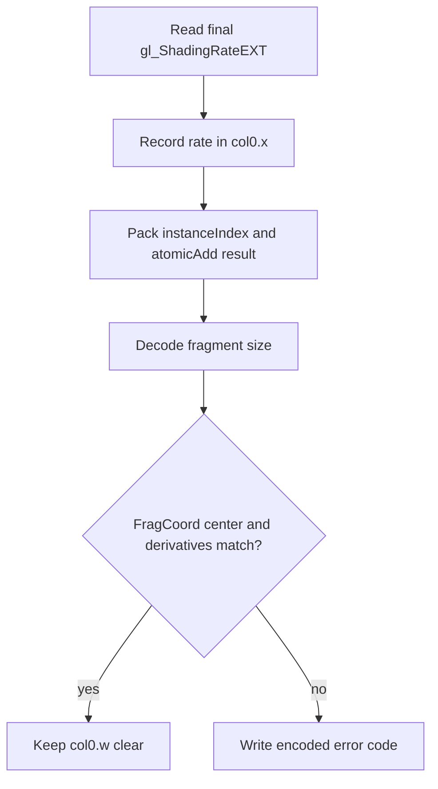

## Overview

**Core question:** Does the implementation produce the fragment shading rate that follows from pipeline, primitive, and attachment state, while preserving fragment, sample, depth, stencil, layer, and view behavior?

- This page covers the implementation and registrations created by [`createBasicTests()`](../../../modules/vulkan/fragment_shading_rate/vktFragmentShadingRateBasic.cpp#L3594-L4085).
- The page owns eight registration roots and lists their actual test-family branches. The generated dimensions below each branch are intentionally summarized rather than enumerated.
- The `basic` test family combines dynamic or static pipeline state, optional fragment shading rate attachments, optional primitive shader output, two combiner operations, framebuffer sizes, sample counts, and vertex, geometry, or mesh shader paths.
- The same implementation file owns related families for sample masks, conservative rasterization, depth and stencil output, layered rendering, multiview, fragment shader interlock, custom sample locations, multipass depth and stencil, maintenance6, and sample-mask output.
- The test records the final rate, primitive identity, atomic invocation order, and error codes in a color attachment. A compute shader linearizes color, depth, and stencil images for host checks.

## Background Knowledge

- Fragment shading rate state changes the number of pixels covered by one fragment shader invocation. Vulkan can supply a pipeline rate, a primitive rate, and an attachment rate, then combine them with two `VkFragmentShadingRateCombinerOpKHR` operations.
- `gl_PrimitiveShadingRateEXT` is a pre-rasterization shader output. `gl_ShadingRateEXT` is a fragment shader input containing the final rate for the current invocation. The specification describes the corresponding SPIR-V built-ins as `PrimitiveShadingRateKHR` and `ShadingRateKHR`.
- A fragment shading rate attachment maps framebuffer regions to attachment texels. Layered rendering can select a layer of that attachment, while multiview uses a view mask and has separate multiview rules.
- Sample shading changes the fragment invocation model. The source therefore forces the expected rate to `1x1` for `sampleshadingenable` and `sampleshadinginput`, and omits derivative checks for those cases.

## Registration Hierarchy

```text
fragment_shading_rate.renderpass2.monolithic
├── basic
├── apisamplemask
├── colorlayered
├── conservativeunder
├── conservativeover
├── fragdepth
├── fragdepth_baselevel
├── fragdepth_clear
├── fragdepth_early_late
├── fragstencil
├── fragstencil_baselevel
├── fragstencil_clear
├── fragstencil_early_late
├── interlock
├── maintenance6
├── misc_tests
├── multipass
├── multipass_fragdepth
├── multipass_fragstencil
├── multiview
├── multiviewcorrelation
├── multiviewport
├── multiviewsrlayered
├── samplelocations
├── samplemaskin
├── samplemaskout
├── sampleshadingenable
├── sampleshadinginput
└── srlayered

fragment_shading_rate.renderpass2.pipeline_library
├── conservativeunder
├── conservativeover
├── interlock
├── misc_tests
├── multiview
├── multiviewcorrelation
├── multiviewsrlayered
├── samplelocations
├── samplemaskin
└── sampleshadingenable

fragment_shading_rate.renderpass2.fast_linked_library
├── conservativeunder
├── conservativeover
├── interlock
├── misc_tests
├── multiview
├── multiviewcorrelation
├── multiviewsrlayered
├── samplelocations
├── samplemaskin
└── sampleshadingenable

fragment_shading_rate.dynamic_rendering.primary_cmd_buff.monolithic
├── basic
├── apisamplemask
├── colorlayered
├── conservativeover
├── conservativeunder
├── fragdepth
├── fragdepth_early_late
├── fragstencil
├── fragstencil_early_late
├── interlock
├── misc_tests
├── multiview
├── multiviewport
├── multiviewsrlayered
├── samplelocations
├── samplemaskin
├── samplemaskout
├── sampleshadingenable
├── sampleshadinginput
└── srlayered

fragment_shading_rate.dynamic_rendering.primary_cmd_buff.pipeline_library
├── conservativeunder
├── conservativeover
├── interlock
├── misc_tests
├── multiview
├── multiviewsrlayered
├── samplelocations
├── samplemaskin
└── sampleshadingenable

fragment_shading_rate.dynamic_rendering.primary_cmd_buff.fast_linked_library
├── conservativeunder
├── conservativeover
├── interlock
├── misc_tests
├── multiview
├── multiviewsrlayered
├── samplelocations
├── samplemaskin
└── sampleshadingenable

fragment_shading_rate.dynamic_rendering.complete_secondary_cmd_buff
├── basic
├── apisamplemask
├── colorlayered
├── conservativeover
├── conservativeunder
├── fragdepth
├── fragdepth_early_late
├── fragstencil
├── fragstencil_early_late
├── interlock
├── multiview
├── multiviewport
├── multiviewsrlayered
├── samplelocations
├── samplemaskin
├── samplemaskout
├── sampleshadingenable
├── sampleshadinginput
└── srlayered

fragment_shading_rate.dynamic_rendering.partial_secondary_cmd_buff
├── basic
├── apisamplemask
├── colorlayered
├── conservativeover
├── conservativeunder
├── fragdepth
├── fragdepth_early_late
├── fragstencil
├── fragstencil_early_late
├── interlock
├── multiview
├── multiviewport
├── multiviewsrlayered
├── samplelocations
├── samplemaskin
├── samplemaskout
├── sampleshadingenable
├── sampleshadinginput
└── srlayered
```

The tree deliberately stops after the family component. The `vk-default` mustpass contains 105,768 leaves owned by this page across these eight roots; `basic` is only one family and is not the name of the whole page's registration space. The format, rate, attachment, shader, sample, and other generated dimensions are descendants of each listed family and are omitted from the compact tree. The pipeline-library and fast-linked-library roots have no `basic` family, but their listed families still belong to this page. `misc_tests` is the Basic implementation's fixed-case branch; the separate `misc` branch belongs to `Misc.md` and is intentionally not listed here. Vulkan SC registers the renderpass2 monolithic root only. The parent creates these rendering, command-buffer, and pipeline-construction permutations before calling `createBasicTests()` in [`createTests()`](../../../modules/vulkan/fragment_shading_rate/vktFragmentShadingRateTests.cpp#L534-L557).

## Parameter Dimensions and Observed Values

| Dimension | Registered values | Meaning in this test | Evidence |
|-----------|-------------------|----------------------|----------|
| Test family | `basic`, `apisamplemask`, `samplemaskin`, `conservativeunder`, `conservativeover`, `fragdepth`, `fragstencil`, `multiviewport`, `colorlayered`, `srlayered`, `multiview`, `multiviewsrlayered`, `multiviewcorrelation`, `interlock`, `samplelocations`, `sampleshadingenable`, `sampleshadinginput`, `fragdepth_early_late`, `fragstencil_early_late`, `fragdepth_clear`, `fragstencil_clear`, `fragdepth_baselevel`, `fragstencil_baselevel`, `multipass`, `multipass_fragdepth`, `multipass_fragstencil`, `maintenance6`, `samplemaskout` | Selects the interaction under test. The early-and-late and `maintenance6` families are excluded by `CTS_USES_VULKANSC`. | [`groupCases[]`](../../../modules/vulkan/fragment_shading_rate/vktFragmentShadingRateBasic.cpp#L3614-L3666) |
| Pipeline state | `dynamic`, `static` | Dynamic cases put `VK_DYNAMIC_STATE_FRAGMENT_SHADING_RATE_KHR` on one graphics pipeline and call `vkCmdSetFragmentShadingRateKHR` before each triangle. Static cases create a graphics pipeline for each pipeline rate. | [`dynCases[]`](../../../modules/vulkan/fragment_shading_rate/vktFragmentShadingRateBasic.cpp#L3668-L3673), [`drawCommands()`](../../../modules/vulkan/fragment_shading_rate/vktFragmentShadingRateBasic.cpp#L3473-L3544) |
| Attachment usage | `noattachment`, `attachment`, `noattachmentptr`, `attachment_noimageview` | Selects no attachment info, a real fragment shading rate image, a null `pFragmentShadingRateAttachment`, or an attachment info with no image view in the dynamic-rendering path. | [`attCases[]`](../../../modules/vulkan/fragment_shading_rate/vktFragmentShadingRateBasic.cpp#L3675-L3684), [attachment info](../../../modules/vulkan/fragment_shading_rate/vktFragmentShadingRateBasic.cpp#L1940-L1954) |
| Primitive shader output | `noshaderrate`, `shaderrate` | Controls whether the vertex, geometry, or mesh shader writes `gl_PrimitiveShadingRateEXT`. | [`shdCases[]`](../../../modules/vulkan/fragment_shading_rate/vktFragmentShadingRateBasic.cpp#L3686-L3691), [shader generation](../../../modules/vulkan/fragment_shading_rate/vktFragmentShadingRateBasic.cpp#L475-L510) |
| Combiner 0 and combiner 1 | `keep`, `replace`, `min`, `max`, `mul` | Combines pipeline with primitive rate, then combines that result with attachment rate. `KEEP` and `REPLACE` select an input; `MIN` and `MAX` operate per dimension; `MUL` multiplies dimensions, subject to `fragmentShadingRateStrictMultiplyCombiner`. | [`combCases[]`](../../../modules/vulkan/fragment_shading_rate/vktFragmentShadingRateBasic.cpp#L3693-L3699), [`Combine()`](../../../modules/vulkan/fragment_shading_rate/vktFragmentShadingRateBasic.cpp#L854-L883) |
| Framebuffer extent | `1x1`, `4x4`, `33x35`, `151x431`, `256x256` | Exercises exact, odd, large, and square render areas. Odd extents also exercise fragment-region clamping at the framebuffer edge. | [`extentCases[]`](../../../modules/vulkan/fragment_shading_rate/vktFragmentShadingRateBasic.cpp#L3701-L3703), [edge clamp](../../../modules/vulkan/fragment_shading_rate/vktFragmentShadingRateBasic.cpp#L2689-L2700) |
| Rasterization samples | `samples1`, `samples2`, `samples4`, `samples8`, `samples16` | Selects multisample image types, sample-specific supported rates, and per-sample readback. | [`sampCases[]`](../../../modules/vulkan/fragment_shading_rate/vktFragmentShadingRateBasic.cpp#L3705-L3708) |
| Pre-rasterization shader path | `vs`, `gs`, `ms` | Uses a vertex shader, vertex plus geometry shader, or mesh shader. `ms` is excluded from Vulkan SC. | [`shaderCases[]`](../../../modules/vulkan/fragment_shading_rate/vktFragmentShadingRateBasic.cpp#L3710-L3719) |
| Attachment image modes | default, optimal layout, imageless framebuffer, 2D array, linear tiling | Expands the attachment path in `iterate()`. The 2D array mode matters for `srlayered`; the other modes exercise creation, layout, and framebuffer variants. | [`AttachmentModes`](../../../modules/vulkan/fragment_shading_rate/vktFragmentShadingRateBasic.cpp#L1164-L1173), [attachment setup](../../../modules/vulkan/fragment_shading_rate/vktFragmentShadingRateBasic.cpp#L1668-L1723) |

## Behavior Parameters

The primary behavioral axis is the test family. `basic` is the broad matrix, but it is only one branch among the eight-root registration space shown above; the sibling families reuse the same `CaseDef` and change one interaction flag or a small fixed setup. The registration tree is a compact one-level view, not an assertion that all leaves have `basic` in their path.

### `basic` and pipeline state: combine the three rate sources

The matrix supplies pipeline, primitive, and optional attachment rates. `PrimIDToPipelineShadingRate()` maps `primID / 9` to a 3 by 3 set of power-of-two widths and heights. `PrimIDToPrimitiveShadingRate()` maps `primID % 9` to another 3 by 3 set. The fragment shader reports `gl_ShadingRateEXT`, and the host computes the allowed result mask with the same two combiner operations.

Dynamic cases use one pipeline and update the pipeline rate before each of the `NUM_TRIANGLES` draws. Static cases update `fragmentSize` in `VkPipelineFragmentShadingRateStateCreateInfoKHR` and build one pipeline per draw. `basic` retains all five combiner values; sibling families restrict both combiners to `KEEP` or `REPLACE` and retain dynamic state only where it is meaningful.

### Attachment variants: map framebuffer regions to rates

`attachment` creates an image with `VK_IMAGE_USAGE_FRAGMENT_SHADING_RATE_ATTACHMENT_BIT_KHR`, fills it with generated supported-rate values, and binds it through `VkFragmentShadingRateAttachmentInfoKHR`. `noattachment` omits the source. `noattachmentptr` supplies the structure with a null attachment reference for dynamic rendering. `attachment_noimageview` covers the dynamic-rendering structure where the attachment reference has no image view.

When `srlayered` is enabled, the attachment has two array layers and the host selects the rate from the layer corresponding to the rendered color layer. The source rejects layered shading-rate attachment cases without a real attachment.

### `apisamplemask`, `samplemaskin`, and `samplemaskout`: sample coverage

`apisamplemask` passes `0x7D56` or the case-specific mask through `VkPipelineMultisampleStateCreateInfo::pSampleMask`; `samplemaskin` reads `gl_SampleMaskIn[0]`; `samplemaskout` writes `0x55555555` to `gl_SampleMask[0]` and reports the surviving input mask. The host checks that masked samples are not written as the tested primitive and that unmasked samples do not acquire that primitive's output.

The standalone `misc_tests.sample_mask_test` case uses a `2x2` fragment size and mask `0x9`, which makes coverage loss inside a multi-pixel fragment visible. That case is registered by the same implementation block at [`misc_tests`](../../../modules/vulkan/fragment_shading_rate/vktFragmentShadingRateBasic.cpp#L3942-L3988).

### Conservative rasterization and custom sample locations: coverage boundaries

`conservativeunder` and `conservativeover` select `VK_CONSERVATIVE_RASTERIZATION_MODE_UNDERESTIMATE_EXT` or `VK_CONSERVATIVE_RASTERIZATION_MODE_OVERESTIMATE_EXT`. For either conservative mode, the host requires samples in the current pixel to be covered when the primitive reports output. `samplelocations` puts all samples at `{0.5f, 0.5f}` and applies `VkPipelineSampleLocationsStateCreateInfoEXT`; it uses the same full-coverage check for samples in one pixel.

### `fragdepth`, `fragstencil`, and maintenance variants: depth/stencil writes

`fragdepth` writes `gl_FragDepth = float(instanceIndex) / 81.0`. The host compares each depth sample with `primID / NUM_TRIANGLES`. `fragstencil` writes `gl_FragStencilRefARB = instanceIndex`, and the host compares the stencil sample with `primID`.

The early-and-late variants add `layout(early_and_late_fragment_tests_amd) in` and the AMD extension. The clear variants use a depth/stencil attachment clear operation and check the clear-path results. The base-level variants use depth or stencil attachment mip level `1`. Multipass variants use a second subpass and check fixed values written by the simple second-subpass fragment shader. `maintenance6` changes the combiner simulation according to `fragmentShadingRateClampCombinerInputs` and requires a fragment shading rate attachment.

### Layered, multiview, and interlock variants: preserve routing and ordering

`multiviewport` splits the framebuffer into left and right scissors and writes `gl_ViewportIndex` from the primitive or instance index. `colorlayered` writes `gl_Layer` to one of two color layers. The host rejects primitives outside their expected viewport or in the wrong layer.

`multiview` uses view mask `0x3` and checks that paired layers contain the same primitive ID. `multiviewsrlayered` combines multiview with a two-layer shading rate attachment. `multiviewcorrelation` adds correlated view mask `0x3` to the render pass. `interlock` adds `layout(pixel_interlock_ordered) in`, calls `beginInvocationInterlockARB()`, and closes with `endInvocationInterlockARB()` around the fragment output and atomic operation.

### Sample shading variants: force the safe observable behavior

`sampleShadingEnable` sets `sampleShadingEnable` in `VkPipelineMultisampleStateCreateInfo`. `sampleShadingInput` declares the interpolant as `sample` and multiplies the error-output seed by `gl_SampleID`. `Force1x1()` returns true for either variant, and the source skips derivative validation because sample shading can make `gl_FragCoord` derivatives differ across partially covered quads.

## Shader Analysis

The fragment shader carries the main observation logic. The vertex and geometry paths transport positions, primitive IDs, and optional primitive rates. The mesh path emits one triangle and writes `gl_MeshPrimitivesEXT[0].gl_PrimitiveShadingRateEXT`; a compute shader copies the multisample images into linear buffers. The walkthrough uses the common fragment generator with rate and derivative checks enabled.

### Representative Shader Walkthrough 1

#### Parameter Values Chosen

Representative path:

```text
dEQP-VK.fragment_shading_rate.renderpass2.monolithic.basic.dynamic.attachment.shaderrate.replace.mul.33x35.samples4.vs
```

| Parameter choice | Meaning in this representative case |
|------------------|-------------------------------------|
| `basic.dynamic` | The command buffer changes the pipeline rate with `vkCmdSetFragmentShadingRateKHR` before each triangle. |
| `attachment.shaderrate` | The final rate combines an attachment value and a primitive rate written by the vertex shader. |
| `replace.mul` | The first combiner selects the primitive rate, then the second multiplies by the attachment rate. |
| `33x35`, `samples4` | The host checks odd framebuffer-edge clamping and four samples per pixel. |
| `vs` | The vertex shader writes `gl_PrimitiveShadingRateEXT` and transports `instanceIndex` to the fragment shader. |

#### Purpose

The fragment shader records the final shading rate and a per-primitive atomic invocation value. It also checks fragment-center alignment and derivatives implied by the rate.

#### Structural Design



#### Shader Code

The following reconstruction keeps the generator's declarations and device-side checks for the selected common path. `///` comments identify the code's role in the test.

```glsl
#version 450 core
#extension GL_EXT_fragment_shading_rate : enable
#extension GL_ARB_shader_stencil_export : enable
#extension GL_ARB_fragment_shader_interlock : enable
layout(location = 0) out uvec4 col0;
layout(set = 0, binding = 0) buffer Block { uint counter; } buf;
layout(set = 0, binding = 3) uniform usampler2D tex;
layout(location = 0) flat in int instanceIndex;
layout(location = 1) flat in int readbackok;
layout(location = 2) in float zero;
void main()
{
  /// X records the final fragment shading rate built-in.
  col0.x = gl_ShadingRateEXT;
  col0.y = 0;
  /// Z packs the primitive ID with a unique invocation value.
  col0.z = (instanceIndex << 24) | ((atomicAdd(buf.counter, 1) + 1) & 0x00FFFFFFu);
  ivec2 fragCoordXY = ivec2(gl_FragCoord.xy);
  /// Decode the width and height represented by the rate flags.
  ivec2 fragSize = ivec2(1<<((gl_ShadingRateEXT/4)&3), 1<<(gl_ShadingRateEXT&3));
  col0.w = uint(zero);
  /// A fragment center must align with the decoded fragment rectangle.
  if (((fragCoordXY - fragSize / 2) % fragSize) != ivec2(0,0))
    col0.w = 1;
  if (readbackok != 1)
    col0.w = 2;
  /// The explicit derivative must match the fragment dimensions.
  if (dFdx(gl_FragCoord.xy) != ivec2(fragSize.x, 0) || dFdy(gl_FragCoord.xy) != ivec2(0, fragSize.y))
    col0.w = (fragSize.y << 26) | (fragSize.x << 20) | (int(dFdx(gl_FragCoord.xy)) << 14) | (int(dFdx(gl_FragCoord.xy)) << 8) | 3;
  /// An implicit texture lookup checks derivatives in both axes.
  uint implicitDerivX = texture(tex, vec2(gl_FragCoord.x / textureSize(tex, 0).x, 0)).x;
  uint implicitDerivY = texture(tex, vec2(0, gl_FragCoord.y / textureSize(tex, 0).y)).x;
  if (implicitDerivX != fragSize.x || implicitDerivY != fragSize.y)
    col0.w = (fragSize.y << 26) | (fragSize.x << 20) | (implicitDerivY << 14) | (implicitDerivX << 8) | 4;
}
```

#### Additional Info

- The selected `vs` path also writes `gl_PrimitiveShadingRateEXT = pc.shadingRate` and checks that it can read the output value before passing `readbackok` downstream [vertex generator](../../../modules/vulkan/fragment_shading_rate/vktFragmentShadingRateBasic.cpp#L452-L493).
- The host generates `9 * 9` triangles. `primID % 9` selects the primitive rate and `primID / 9` selects the pipeline rate [rate mapping](../../../modules/vulkan/fragment_shading_rate/vktFragmentShadingRateBasic.cpp#L1058-L1087).

#### Parameter Variation Summary

| Parameter dimension | Shader-level variation from this shader | Evidence |
|---------------------|-----------------------------------------|----------|
| `shaderWritesRate` | Adds `gl_PrimitiveShadingRateEXT` to vertex, geometry, or mesh generation and enables the readback error path. | [pre-rasterization generators](../../../modules/vulkan/fragment_shading_rate/vktFragmentShadingRateBasic.cpp#L475-L510) |
| `useSampleMaskIn` and `useSampleMaskOut` | Replaces `col0.y` with `gl_SampleMaskIn[0]`, and output cases mask it with `0x55555555` after writing `gl_SampleMask[0]`. | [fragment generator](../../../modules/vulkan/fragment_shading_rate/vktFragmentShadingRateBasic.cpp#L710-L715) |
| `fragDepth` and `fragStencil` | Adds `gl_FragDepth` or `gl_FragStencilRefARB` writes with values derived from `instanceIndex`. | [depth and stencil generation](../../../modules/vulkan/fragment_shading_rate/vktFragmentShadingRateBasic.cpp#L717-L721) |
| `interlock` | Adds ordered pixel interlock execution mode and begin/end calls around fragment work. | [interlock generation](../../../modules/vulkan/fragment_shading_rate/vktFragmentShadingRateBasic.cpp#L658-L665), [interlock close](../../../modules/vulkan/fragment_shading_rate/vktFragmentShadingRateBasic.cpp#L723-L724) |
| `sampleShadingInput` | Declares the `zero` input with `sample` interpolation and multiplies the error seed by `gl_SampleID`. | [sample input generation](../../../modules/vulkan/fragment_shading_rate/vktFragmentShadingRateBasic.cpp#L641-L681) |

#### SPIR-V

- Status: generated and validated
- Source: reconstructed GLSL from this walkthrough
- Stage: `frag`
- Target SPIRV version: `spirv1.0`

<details>
<summary>Click to expand SPIRV asm code</summary>

```llvm
; SPIR-V
; Version: 1.0
; Generator: Khronos Glslang Reference Front End; 11
; Bound: 207
; Schema: 0
               OpCapability Shader
               OpCapability ImageQuery
               OpCapability FragmentShadingRateKHR
               OpExtension "SPV_KHR_fragment_shading_rate"
          %1 = OpExtInstImport "GLSL.std.450"
               OpMemoryModel Logical GLSL450
               OpEntryPoint Fragment %main "main" %col0 %gl_ShadingRateEXT %instanceIndex %gl_FragCoord %zero %readbackok
               OpExecutionMode %main OriginUpperLeft
               OpSource GLSL 450
               OpSourceExtension "GL_ARB_fragment_shader_interlock"
               OpSourceExtension "GL_ARB_shader_stencil_export"
               OpSourceExtension "GL_EXT_fragment_shading_rate"
               OpName %main "main"
               OpName %col0 "col0"
               OpName %gl_ShadingRateEXT "gl_ShadingRateEXT"
               OpName %instanceIndex "instanceIndex"
               OpName %Block "Block"
               OpMemberName %Block 0 "counter"
               OpName %buf "buf"
               OpName %fragCoordXY "fragCoordXY"
               OpName %gl_FragCoord "gl_FragCoord"
               OpName %fragSize "fragSize"
               OpName %zero "zero"
               OpName %readbackok "readbackok"
               OpName %implicitDerivX "implicitDerivX"
               OpName %tex "tex"
               OpName %implicitDerivY "implicitDerivY"
               OpDecorate %col0 Location 0
               OpDecorate %gl_ShadingRateEXT BuiltIn ShadingRateKHR
               OpDecorate %gl_ShadingRateEXT Flat
               OpDecorate %instanceIndex Flat
               OpDecorate %instanceIndex Location 0
               OpDecorate %Block BufferBlock
               OpMemberDecorate %Block 0 Offset 0
               OpDecorate %buf Binding 0
               OpDecorate %buf DescriptorSet 0
               OpDecorate %gl_FragCoord BuiltIn FragCoord
               OpDecorate %zero Location 2
               OpDecorate %readbackok Flat
               OpDecorate %readbackok Location 1
               OpDecorate %tex Binding 3
               OpDecorate %tex DescriptorSet 0
       %void = OpTypeVoid
          %3 = OpTypeFunction %void
       %uint = OpTypeInt 32 0
     %v4uint = OpTypeVector %uint 4
%_ptr_Output_v4uint = OpTypePointer Output %v4uint
       %col0 = OpVariable %_ptr_Output_v4uint Output
        %int = OpTypeInt 32 1
%_ptr_Input_int = OpTypePointer Input %int
%gl_ShadingRateEXT = OpVariable %_ptr_Input_int Input
     %uint_0 = OpConstant %uint 0
%_ptr_Output_uint = OpTypePointer Output %uint
     %uint_1 = OpConstant %uint 1
%instanceIndex = OpVariable %_ptr_Input_int Input
     %int_24 = OpConstant %int 24
      %Block = OpTypeStruct %uint
%_ptr_Uniform_Block = OpTypePointer Uniform %Block
        %buf = OpVariable %_ptr_Uniform_Block Uniform
      %int_0 = OpConstant %int 0
%_ptr_Uniform_uint = OpTypePointer Uniform %uint
%uint_16777215 = OpConstant %uint 16777215
     %uint_2 = OpConstant %uint 2
      %v2int = OpTypeVector %int 2
%_ptr_Function_v2int = OpTypePointer Function %v2int
      %float = OpTypeFloat 32
    %v4float = OpTypeVector %float 4
%_ptr_Input_v4float = OpTypePointer Input %v4float
%gl_FragCoord = OpVariable %_ptr_Input_v4float Input
    %v2float = OpTypeVector %float 2
      %int_1 = OpConstant %int 1
      %int_4 = OpConstant %int 4
      %int_3 = OpConstant %int 3
%_ptr_Input_float = OpTypePointer Input %float
       %zero = OpVariable %_ptr_Input_float Input
     %uint_3 = OpConstant %uint 3
      %int_2 = OpConstant %int 2
         %75 = OpConstantComposite %v2int %int_0 %int_0
       %bool = OpTypeBool
     %v2bool = OpTypeVector %bool 2
 %readbackok = OpVariable %_ptr_Input_int Input
%_ptr_Function_int = OpTypePointer Function %int
     %int_26 = OpConstant %int 26
     %int_20 = OpConstant %int 20
     %int_14 = OpConstant %int 14
      %int_8 = OpConstant %int 8
%_ptr_Function_uint = OpTypePointer Function %uint
        %144 = OpTypeImage %uint 2D 0 0 0 1 Unknown
        %145 = OpTypeSampledImage %144
%_ptr_UniformConstant_145 = OpTypePointer UniformConstant %145
        %tex = OpVariable %_ptr_UniformConstant_145 UniformConstant
    %float_0 = OpConstant %float 0
     %uint_4 = OpConstant %uint 4
       %main = OpFunction %void None %3
          %5 = OpLabel
%fragCoordXY = OpVariable %_ptr_Function_v2int Function
   %fragSize = OpVariable %_ptr_Function_v2int Function
%implicitDerivX = OpVariable %_ptr_Function_uint Function
%implicitDerivY = OpVariable %_ptr_Function_uint Function
         %13 = OpLoad %int %gl_ShadingRateEXT
         %14 = OpBitcast %uint %13
         %17 = OpAccessChain %_ptr_Output_uint %col0 %uint_0
               OpStore %17 %14
         %19 = OpAccessChain %_ptr_Output_uint %col0 %uint_1
               OpStore %19 %uint_0
         %21 = OpLoad %int %instanceIndex
         %23 = OpShiftLeftLogical %int %21 %int_24
         %24 = OpBitcast %uint %23
         %30 = OpAccessChain %_ptr_Uniform_uint %buf %int_0
         %31 = OpAtomicIAdd %uint %30 %uint_1 %uint_0 %uint_1
         %32 = OpIAdd %uint %31 %uint_1
         %34 = OpBitwiseAnd %uint %32 %uint_16777215
         %35 = OpBitwiseOr %uint %24 %34
         %37 = OpAccessChain %_ptr_Output_uint %col0 %uint_2
               OpStore %37 %35
         %46 = OpLoad %v4float %gl_FragCoord
         %47 = OpVectorShuffle %v2float %46 %46 0 1
         %48 = OpConvertFToS %v2int %47
               OpStore %fragCoordXY %48
         %51 = OpLoad %int %gl_ShadingRateEXT
         %53 = OpSDiv %int %51 %int_4
         %55 = OpBitwiseAnd %int %53 %int_3
         %56 = OpShiftLeftLogical %int %int_1 %55
         %57 = OpLoad %int %gl_ShadingRateEXT
         %58 = OpBitwiseAnd %int %57 %int_3
         %59 = OpShiftLeftLogical %int %int_1 %58
         %60 = OpCompositeConstruct %v2int %56 %59
               OpStore %fragSize %60
         %63 = OpLoad %float %zero
         %64 = OpConvertFToU %uint %63
         %66 = OpAccessChain %_ptr_Output_uint %col0 %uint_3
               OpStore %66 %64
         %67 = OpLoad %v2int %fragCoordXY
         %68 = OpLoad %v2int %fragSize
         %70 = OpCompositeConstruct %v2int %int_2 %int_2
         %71 = OpSDiv %v2int %68 %70
         %72 = OpISub %v2int %67 %71
         %73 = OpLoad %v2int %fragSize
         %74 = OpSMod %v2int %72 %73
         %78 = OpINotEqual %v2bool %74 %75
         %79 = OpAny %bool %78
               OpSelectionMerge %81 None
               OpBranchConditional %79 %80 %81
         %80 = OpLabel
         %82 = OpAccessChain %_ptr_Output_uint %col0 %uint_3
               OpStore %82 %uint_1
               OpBranch %81
         %81 = OpLabel
         %84 = OpLoad %int %readbackok
         %85 = OpINotEqual %bool %84 %int_1
               OpSelectionMerge %87 None
               OpBranchConditional %85 %86 %87
         %86 = OpLabel
         %88 = OpAccessChain %_ptr_Output_uint %col0 %uint_3
               OpStore %88 %uint_2
               OpBranch %87
         %87 = OpLabel
         %89 = OpLoad %v4float %gl_FragCoord
         %90 = OpVectorShuffle %v2float %89 %89 0 1
         %91 = OpDPdx %v2float %90
         %93 = OpAccessChain %_ptr_Function_int %fragSize %uint_0
         %94 = OpLoad %int %93
         %95 = OpCompositeConstruct %v2int %94 %int_0
         %96 = OpConvertSToF %v2float %95
         %97 = OpFUnordNotEqual %v2bool %91 %96
         %98 = OpAny %bool %97
         %99 = OpLogicalNot %bool %98
               OpSelectionMerge %101 None
               OpBranchConditional %99 %100 %101
        %100 = OpLabel
        %102 = OpLoad %v4float %gl_FragCoord
        %103 = OpVectorShuffle %v2float %102 %102 0 1
        %104 = OpDPdy %v2float %103
        %105 = OpAccessChain %_ptr_Function_int %fragSize %uint_1
        %106 = OpLoad %int %105
        %107 = OpCompositeConstruct %v2int %int_0 %106
        %108 = OpConvertSToF %v2float %107
        %109 = OpFUnordNotEqual %v2bool %104 %108
        %110 = OpAny %bool %109
               OpBranch %101
        %101 = OpLabel
        %111 = OpPhi %bool %98 %87 %110 %100
               OpSelectionMerge %113 None
               OpBranchConditional %111 %112 %113
        %112 = OpLabel
        %114 = OpAccessChain %_ptr_Function_int %fragSize %uint_1
        %115 = OpLoad %int %114
        %117 = OpShiftLeftLogical %int %115 %int_26
        %118 = OpAccessChain %_ptr_Function_int %fragSize %uint_0
        %119 = OpLoad %int %118
        %121 = OpShiftLeftLogical %int %119 %int_20
        %122 = OpBitwiseOr %int %117 %121
        %123 = OpLoad %v4float %gl_FragCoord
        %124 = OpVectorShuffle %v2float %123 %123 0 1
        %125 = OpDPdx %v2float %124
        %126 = OpConvertFToS %v2int %125
        %127 = OpCompositeExtract %int %126 0
        %129 = OpShiftLeftLogical %int %127 %int_14
        %130 = OpBitwiseOr %int %122 %129
        %131 = OpLoad %v4float %gl_FragCoord
        %132 = OpVectorShuffle %v2float %131 %131 0 1
        %133 = OpDPdx %v2float %132
        %134 = OpConvertFToS %v2int %133
        %135 = OpCompositeExtract %int %134 0
        %137 = OpShiftLeftLogical %int %135 %int_8
        %138 = OpBitwiseOr %int %130 %137
        %139 = OpBitwiseOr %int %138 %int_3
        %140 = OpBitcast %uint %139
        %141 = OpAccessChain %_ptr_Output_uint %col0 %uint_3
               OpStore %141 %140
               OpBranch %113
        %113 = OpLabel
        %148 = OpLoad %145 %tex
        %149 = OpAccessChain %_ptr_Input_float %gl_FragCoord %uint_0
        %150 = OpLoad %float %149
        %151 = OpLoad %145 %tex
        %152 = OpImage %144 %151
        %153 = OpImageQuerySizeLod %v2int %152 %int_0
        %154 = OpCompositeExtract %int %153 0
        %155 = OpConvertSToF %float %154
        %156 = OpFDiv %float %150 %155
        %158 = OpCompositeConstruct %v2float %156 %float_0
        %159 = OpImageSampleImplicitLod %v4uint %148 %158
        %160 = OpCompositeExtract %uint %159 0
               OpStore %implicitDerivX %160
        %162 = OpLoad %145 %tex
        %163 = OpAccessChain %_ptr_Input_float %gl_FragCoord %uint_1
        %164 = OpLoad %float %163
        %165 = OpLoad %145 %tex
        %166 = OpImage %144 %165
        %167 = OpImageQuerySizeLod %v2int %166 %int_0
        %168 = OpCompositeExtract %int %167 1
        %169 = OpConvertSToF %float %168
        %170 = OpFDiv %float %164 %169
        %171 = OpCompositeConstruct %v2float %float_0 %170
        %172 = OpImageSampleImplicitLod %v4uint %162 %171
        %173 = OpCompositeExtract %uint %172 0
               OpStore %implicitDerivY %173
        %174 = OpLoad %uint %implicitDerivX
        %175 = OpAccessChain %_ptr_Function_int %fragSize %uint_0
        %176 = OpLoad %int %175
        %177 = OpBitcast %uint %176
        %178 = OpINotEqual %bool %174 %177
        %179 = OpLogicalNot %bool %178
               OpSelectionMerge %181 None
               OpBranchConditional %179 %180 %181
        %180 = OpLabel
        %182 = OpLoad %uint %implicitDerivY
        %183 = OpAccessChain %_ptr_Function_int %fragSize %uint_1
        %184 = OpLoad %int %183
        %185 = OpBitcast %uint %184
        %186 = OpINotEqual %bool %182 %185
               OpBranch %181
        %181 = OpLabel
        %187 = OpPhi %bool %178 %113 %186 %180
               OpSelectionMerge %189 None
               OpBranchConditional %187 %188 %189
        %188 = OpLabel
        %190 = OpAccessChain %_ptr_Function_int %fragSize %uint_1
        %191 = OpLoad %int %190
        %192 = OpShiftLeftLogical %int %191 %int_26
        %193 = OpAccessChain %_ptr_Function_int %fragSize %uint_0
        %194 = OpLoad %int %193
        %195 = OpShiftLeftLogical %int %194 %int_20
        %196 = OpBitwiseOr %int %192 %195
        %197 = OpBitcast %uint %196
        %198 = OpLoad %uint %implicitDerivY
        %199 = OpShiftLeftLogical %uint %198 %int_14
        %200 = OpBitwiseOr %uint %197 %199
        %201 = OpLoad %uint %implicitDerivX
        %202 = OpShiftLeftLogical %uint %201 %int_8
        %203 = OpBitwiseOr %uint %200 %202
        %205 = OpBitwiseOr %uint %203 %uint_4
        %206 = OpAccessChain %_ptr_Output_uint %col0 %uint_3
               OpStore %206 %205
               OpBranch %189
        %189 = OpLabel
               OpReturn
               OpFunctionEnd
```

</details>

## Runtime Execution and Result Checking

- `iterate()` queries supported fragment shading rates and properties, chooses a depth/stencil format when needed, creates the atomic counter and host-visible output buffers, and fills a random vertex buffer for `NUM_TRIANGLES` triangles [instance setup](../../../modules/vulkan/fragment_shading_rate/vktFragmentShadingRateBasic.cpp#L1105-L1259).
- The color image uses `VK_FORMAT_R32G32B32A32_UINT`. The fragment shader writes rate in `col0.x`, sample-mask or helper information in `col0.y`, packed primitive and atomic values in `col0.z`, and an error code in `col0.w`.
- The compute shader uses `texture2DMSArray` for multisample images and `texture2DArray` for single-sample images. A one-workgroup-per-texel dispatch copies color, depth, and stencil samples to linear storage buffers [compute generator](../../../modules/vulkan/fragment_shading_rate/vktFragmentShadingRateBasic.cpp#L730-L771).
- The host decodes rate flags into `pixelsX` and `pixelsY`, computes the fragment rectangle, clamps it to odd framebuffer dimensions, and derives pipeline, primitive, and attachment rates from the observed primitive and coordinate [rate simulation and region](../../../modules/vulkan/fragment_shading_rate/vktFragmentShadingRateBasic.cpp#L2683-L2723).
- The host accepts the observed rate only when it appears in the mask returned by `Simulate()`. It then checks depth, stencil, viewport, layer, multiview, sample-mask, coverage, and same-fragment consistency as enabled by `CaseDef` [result checks](../../../modules/vulkan/fragment_shading_rate/vktFragmentShadingRateBasic.cpp#L2720-L2919).
- Every nonzero fragment error code fails the case. Code `1` means fragment-center alignment, code `2` means pre-rasterization output readback, code `3` means explicit `gl_FragCoord` derivatives, and code `4` means implicit texture derivatives. If more than 16 samples all observe `1x1` while a larger expected mask exists, the test returns `quality_warning` rather than `fail` [error handling and quality warning](../../../modules/vulkan/fragment_shading_rate/vktFragmentShadingRateBasic.cpp#L2641-L2679), [quality warning](../../../modules/vulkan/fragment_shading_rate/vktFragmentShadingRateBasic.cpp#L2993-L3002).

## Failure Meaning

### Failure Cause Mapping

| If this behavior parameter value fails | Possible failure cause(s) |
|----------------------------------------|---------------------------|
| `basic` | Incorrect combination or clamping of pipeline, primitive, and attachment rates, fragment built-in observation, derivative behavior, or host simulation. |
| `apisamplemask` / `samplemaskin` / `samplemaskout` | Incorrect interaction between fragment shading rate and API or shader sample masks, or incorrect sample readback. |
| `conservativeunder` / `conservativeover` / `samplelocations` | Incorrect coverage at a conservative or custom sample location, or unsupported interaction with fragment shading rate. |
| `fragdepth` / `fragstencil` and their early-and-late, clear, base-level, or multipass variants | Incorrect shader depth or stencil export, fixed-function test ordering, attachment mip selection, subpass handling, or readback. |
| `multiviewport` / `colorlayered` / `srlayered` / `multiview` / `multiviewsrlayered` / `multiviewcorrelation` | Incorrect viewport, color-layer, view, or layered attachment routing. |
| `interlock` | Incorrect ordered fragment interlock behavior around atomic and output operations. |
| `sampleshadingenable` / `sampleshadinginput` | Incorrect interaction between sample shading and fragment shading rate. |
| `multipass` | Incorrect propagation of fragment shading rate attachment or depth/stencil state across subpasses. |
| `maintenance6` | Incorrect handling of unclamped combiner inputs under `fragmentShadingRateClampCombinerInputs`. |

### Cause Analysis

#### Rate combination or fragment observation

**Possible failure symptoms:** The host logs an unexpected shading rate, a fragment-center error, a derivative error, a pre-rasterization readback error, or the quality warning that all observed fragments became `1x1`.

**Possible implementation causes:** The implementation may combine the three rate sources incorrectly, clamp a supported or unsupported intermediate at the wrong point, expose a wrong `gl_ShadingRateEXT`, or produce fragment coordinates and derivatives inconsistent with the final size. The source simulation accounts for supported sample-count-specific rates, `fragmentShadingRateStrictMultiplyCombiner`, and the maintenance6 clamp-input property. A failing case does not identify which pipeline stage caused the discrepancy.

#### Sample coverage and depth/stencil export

**Possible failure symptoms:** The host finds a written sample outside the API mask, a missing sample inside `gl_SampleMaskIn`, a non-full pixel under conservative or centered custom locations, a depth value different from `primID / NUM_TRIANGLES`, or a stencil value different from `primID`.

**Possible implementation causes:** The failure can come from fragment coverage, sample-mask application, shader export, depth/stencil test ordering, image transitions, or host copyback. The relevant specification interaction depends on the selected family and needs an API trace or implementation inspection when the log cannot distinguish them.

#### Layer, view, interlock, and subpass behavior

**Possible failure symptoms:** A primitive appears outside its expected viewport, in the wrong color layer, with a mismatched primitive ID in the paired multiview layer, or with inconsistent same-fragment atomic values. Multipass checks can instead report wrong second-subpass color, depth, or stencil values.

**Possible implementation causes:** The result can indicate incorrect `gl_ViewportIndex` or `gl_Layer` routing, view-mask execution, layered attachment selection, ordered interlock scope, subpass dependencies, or image layout handling. These causes require investigation against the selected rendering and pipeline permutation.

## Case Pruning

### Requirement-based pruning

- Each `FSRTestCase` requires `VK_KHR_fragment_shading_rate`, `pipelineFragmentShadingRate`, a supported `VK_FORMAT_R32G32B32A32_UINT` color image, and the selected sample count within both `maxFragmentShadingRateRasterizationSamples` and `maxFragmentShadingRateCoverageSamples` [support callback](../../../modules/vulkan/fragment_shading_rate/vktFragmentShadingRateBasic.cpp#L315-L370).
- Primitive shader output requires `primitiveFragmentShadingRate`. Non-`KEEP` first combiners require primitive support, and non-`KEEP` second combiners require attachment support. Nontrivial combiner operations also require `fragmentShadingRateNonTrivialCombinerOps` [support callback](../../../modules/vulkan/fragment_shading_rate/vktFragmentShadingRateBasic.cpp#L322-L369).
- Conservative cases require `VK_EXT_conservative_rasterization` and primitive underestimation support for `conservativeunder`. Stencil cases require `VK_EXT_shader_stencil_export`. Viewport and color-layer cases require `primitiveFragmentShadingRateWithMultipleViewports` when applicable and `VK_EXT_shader_viewport_index_layer` when no geometry shader supplies the built-in [support callback](../../../modules/vulkan/fragment_shading_rate/vktFragmentShadingRateBasic.cpp#L371-L390).
- Layered attachments require `layeredShadingRateAttachments`; geometry multiview requires `multiviewGeometryShader`; mesh cases require `VK_EXT_mesh_shader` and the matching primitive-rate or multiview mesh feature. Interlock and sample-location cases require their extension feature and the matching fragment shading rate property [support callback](../../../modules/vulkan/fragment_shading_rate/vktFragmentShadingRateBasic.cpp#L386-L420).
- Depth/stencil, API sample mask, shader sample mask, conservative, interlock, and custom sample-location cases force `1x1` when the corresponding interaction property is absent. Sample shading cases always force `1x1` and still require sample-rate shading [force behavior](../../../modules/vulkan/fragment_shading_rate/vktFragmentShadingRateBasic.cpp#L278-L306).
- Dynamic rendering excludes `noattachmentptr` from the wrong path and omits `multiviewcorrelation` and `maintenance6`; renderpass2 excludes `attachment_noimageview`. Early-and-late and `maintenance6` are excluded from Vulkan SC. Secondary command buffers retain dynamic cases and reduce extent, sample, shader, and group selections. Pipeline-library permutations keep selected groups and every other extent [matrix pruning](../../../modules/vulkan/fragment_shading_rate/vktFragmentShadingRateBasic.cpp#L3723-L3777).

### Design-based pruning

- Sibling families keep only `KEEP` and `REPLACE` combiner inputs, while `basic` retains all five combiner operations. This prevents interaction-specific families from duplicating the full combiner matrix [family pruning](../../../modules/vulkan/fragment_shading_rate/vktFragmentShadingRateBasic.cpp#L3828-L3839).
- Geometry shaders are omitted for sample-mask, conservative, depth/stencil, maintenance6, sample-mask-output, non-dynamic-state, and other cases where that shader path is not part of the selected behavior. Layered and multiple-viewport groups require `shaderrate`. Clear, base-level, and multipass depth/stencil cases require a real attachment, renderpass2, and one sample [case pruning](../../../modules/vulkan/fragment_shading_rate/vktFragmentShadingRateBasic.cpp#L3841-L3879).
- `misc_tests.sample_mask_test`, `helper_invocation`, and non-SC `garbage_color_attachment` are fixed cases outside the generated matrix. Their registration and fixed `CaseDef` values are kept in [`misc_tests`](../../../modules/vulkan/fragment_shading_rate/vktFragmentShadingRateBasic.cpp#L3942-L4085).

Unsupported cases throw `NotSupportedError` from `checkSupport()`. That result prunes the case. It does not mean the implementation failed an executed conformance check.

## Key Takeaways

- `basic` varies pipeline, primitive, and attachment inputs independently, then compares the implementation's final rate with a source-matched simulation.
- `Basic.md` owns eight registration roots and their listed family branches. The tree intentionally omits the generated dimensions below each family; `basic` is one family, not a synonym for the complete `fragment_shading_rate` coverage.
- Dynamic and static state test the same rate behavior through different Vulkan state paths. Dynamic cases update one pipeline; static cases build per-draw pipeline state.
- The shader checks more than the final enum. It records primitive identity and atomic order, verifies fragment-center and derivative behavior, and exposes interaction-specific failures through depth, stencil, sample, layer, and view outputs.
- The source reduces or removes combinations that cannot test the selected interaction. Read `NotSupportedError` as pruning; read `fail` or `quality_warning` from `iterate()` as an executed result.

## Source Reference Appendix

| Entry point | Link | Why it matters |
|-------------|------|----------------|
| Shared test parameters | [vktFragmentShadingRateBasic.hpp](../../../modules/vulkan/fragment_shading_rate/vktFragmentShadingRateBasic.hpp#L27-L39), [vktFragmentShadingRateGroupParams.hpp](../../../modules/vulkan/fragment_shading_rate/vktFragmentShadingRateGroupParams.hpp#L34-L52) | Declares `createBasicTests()` and the rendering and pipeline-construction parameters shared by the test category. |
| Parent registration | [vktFragmentShadingRateTests.cpp#L534-L557](../../../modules/vulkan/fragment_shading_rate/vktFragmentShadingRateTests.cpp#L534-L557) | Places basic tests among attachment, miscellaneous, and pixel-consistency families. |
| Matrix registration | [createBasicTests()](../../../modules/vulkan/fragment_shading_rate/vktFragmentShadingRateBasic.cpp#L3594-L3940) | Creates the family, state, attachment, shader, combiner, extent, sample, and pre-rasterization hierarchy. |
| Support and pruning | [FSRTestCase::checkSupport()](../../../modules/vulkan/fragment_shading_rate/vktFragmentShadingRateBasic.cpp#L315-L436), [Force1x1()](../../../modules/vulkan/fragment_shading_rate/vktFragmentShadingRateBasic.cpp#L278-L306) | Separates unsupported cases and interaction-driven `1x1` fallback from executed failures. |
| Shader generation | [FSRTestCase::initPrograms()](../../../modules/vulkan/fragment_shading_rate/vktFragmentShadingRateBasic.cpp#L448-L830) | Emits vertex, geometry, mesh, fragment, compute, and second-subpass shaders. |
| Rate simulation | [Simulate() and `CombineMasks()`](../../../modules/vulkan/fragment_shading_rate/vktFragmentShadingRateBasic.cpp#L885-L961) | Computes possible final rates with clamping and the maintenance6 input rule. |
| Runtime and result scan | [FSRTestInstance::iterate()](../../../modules/vulkan/fragment_shading_rate/vktFragmentShadingRateBasic.cpp#L1105-L3003) | Creates resources, submits rendering and copy work, and checks all observed outputs. |
| Fragment shading rate specification | [VK_KHR_fragment_shading_rate.adoc](../../../../vulkan-docs/src/appendices/VK_KHR_fragment_shading_rate.adoc) and [primsrast.adoc#fragment-shading-rates](../../../../vulkan-docs/src/chapters/primsrast.adoc#fragment-shading-rates) | Defines the three rate sources, built-ins, combiner operations, limits, attachment mapping, and maintenance6 behavior. |
| Multiview and attachment rules | [renderpass.adoc#renderpass-multiview](../../../../vulkan-docs/src/chapters/renderpass.adoc#renderpass-multiview), [interfaces.adoc#interfaces-builtin-variables-shadingratekhr](../../../../vulkan-docs/src/chapters/interfaces.adoc#interfaces-builtin-variables-shadingratekhr) | Defines view masks, correlated views, layered attachment handling, and the fragment built-in interface. |
| Vulkan mustpass | [fragment-shading-rate.txt](../../../mustpass/main/vk-default/fragment-shading-rate.txt) | Registers Vulkan Basic-owned leaves across eight roots and their family branches. |
| Vulkan SC mustpass | [fragment-shading-rate.txt](../../../mustpass/main/vksc-default/fragment-shading-rate.txt) | Registers the Vulkan SC renderpass2 monolithic `basic` leaves. |
