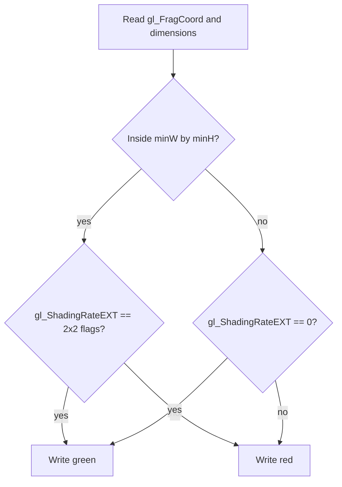

## Overview

**Core question:** Do fragment shading rate properties, attachment reads, and attachment enablement follow the Vulkan contract in the edge cases that ordinary rendering does not cover?

- This page covers the `misc` test group assembled by [`createMiscTests()`](../../../modules/vulkan/fragment_shading_rate/vktFragmentShadingRateTests.cpp#L514-L531) and extended by [`createFragmentShadingRateMiscTests()`](../../../modules/vulkan/fragment_shading_rate/vktFragmentShadingRateMiscTests.cpp#L1497-L1530).
- The group checks reported limits and `vkGetPhysicalDeviceFragmentShadingRatesKHR`, then exercises attachment enablement, rendering without a fragment shader, and out-of-bounds fragment shading rate attachment access.
- Renderpass2 monolithic runs contain `limits`, `shading_rates`, `enable_disable_attachment`, `no_frag_shader`, `test_oob_attachment`, and `test_oob_attachment_robustness2`. Dynamic-rendering primary-command-buffer monolithic runs add `explicit_and_implicit_enable` outside Vulkan SC.
- The page explains the support checks, the host-side image comparisons, and what each failure can establish.

## Background Knowledge

- A fragment shading rate describes how many covered pixels one fragment shader invocation may cover. Vulkan can combine per-draw, per-primitive, and per-region rates; a fragment shading rate attachment supplies the per-region value through one image texel per render-area region.
- The attachment texel size maps render-area coordinates to attachment coordinates. Without `robustFragmentShadingRateAttachmentAccess`, or when the selected image view has a nonzero base mip level, the attachment must cover the render area after that mapping. With that property and a base mip level of `0`, missing attachment texels follow shader out-of-bounds behavior.
- A missing rate source contributes the default rate `{1, 1}` to the combiner operations. This matters when dynamic rendering begins once with an attachment and again without one while the same pipeline remains bound.
- `gl_ShadingRateEXT` is a fragment-stage built-in that exposes the final rate for the current fragment invocation. The OOB shader uses it as the device-side observation of attachment access.

## Registration Hierarchy

```text
fragment_shading_rate.renderpass2.monolithic.misc
├── limits
├── shading_rates
├── enable_disable_attachment
├── no_frag_shader
├── test_oob_attachment
└── test_oob_attachment_robustness2

fragment_shading_rate.dynamic_rendering.primary_cmd_buff.monolithic.misc
└── explicit_and_implicit_enable
```

The first root is present only when dynamic rendering and secondary command buffers are disabled and pipeline construction is monolithic. The second root is the dynamic-rendering branch of the implementation and is excluded by `CTS_USES_VULKANSC`.

## Parameter Dimensions and Observed Values

| Dimension | Registered values | Meaning in this test | Evidence |
|-----------|-------------------|----------------------|----------|
| Rendering model | `renderpass2`, `dynamic_rendering` | Selects the renderpass attachment path or the dynamic-rendering path. | [misc factory](../../../modules/vulkan/fragment_shading_rate/vktFragmentShadingRateMiscTests.cpp#L1497-L1529), [parent gating](../../../modules/vulkan/fragment_shading_rate/vktFragmentShadingRateTests.cpp#L514-L529) |
| Test family | `limits`, `shading_rates`, `enable_disable_attachment`, `no_frag_shader`, `test_oob_attachment`, `test_oob_attachment_robustness2`, `explicit_and_implicit_enable` | Selects the property query or rendering behavior under test. | [registration](../../../modules/vulkan/fragment_shading_rate/vktFragmentShadingRateMiscTests.cpp#L1497-L1529), [parent registrations](../../../modules/vulkan/fragment_shading_rate/vktFragmentShadingRateTests.cpp#L518-L523) |
| OOB access mode | `test_oob_attachment`, `test_oob_attachment_robustness2` | Chooses `VK_EXT_image_robustness` with `robustImageAccess` or robustness2 with `robustImageAccess2` when creating the test device. | [support and parameter](../../../modules/vulkan/fragment_shading_rate/vktFragmentShadingRateMiscTests.cpp#L739-L775), [device creation](../../../modules/vulkan/fragment_shading_rate/vktFragmentShadingRateMiscTests.cpp#L814-L893) |
| OOB base mip | `0` in the ordinary case, `1` in the internal `TestParams` path | Selects the image view mip level used by the OOB implementation. The public registrations pass `useBaseMipLevel1 = false`. | [parameters and image view](../../../modules/vulkan/fragment_shading_rate/vktFragmentShadingRateMiscTests.cpp#L72-L76), [OOB setup](../../../modules/vulkan/fragment_shading_rate/vktFragmentShadingRateMiscTests.cpp#L941-L969) |

## Behavior Parameters

The primary behavioral axis is the registered test family. `limits` and `shading_rates` are implemented in the parent source file because they are property-query checks, while the remaining families are implemented in `vktFragmentShadingRateMiscTests.cpp`.

### `limits` | Validate reported fragment shading rate properties

The test checks feature and property relationships and minimum or maximum values. It verifies, among other conditions, the mandatory pipeline feature, valid relationships for multiple viewports and layered attachments, power-of-two attachment texel sizes, `{2,2}` minimum and `{4,4}` maximum `maxFragmentSize`, at least `16` coverage samples, and at least `VK_SAMPLE_COUNT_4_BIT` rasterization support. A failed condition is logged and the case returns `fail`.

### `shading_rates` | Validate the advertised rate list

The test queries the rate count, deliberately retries with a one-entry destination to require `VK_INCOMPLETE` or `VK_ERROR_OUT_OF_HOST_MEMORY`, then queries the full list. For each entry it checks power-of-two dimensions, the relevant size and coverage limits, ordering from largest to smallest width and height, unique dimensions, and sample-count requirements. Rates below `3` in both dimensions must support sample counts `1` and `4`, and must also support `2` when `framebufferColorSampleCounts` advertises it.

### `enable_disable_attachment` | Switch from attachment-driven VRS to no pipeline VRS

The renderpass uses an `R8_UINT` fragment shading rate attachment containing the `2x2` flag and creates two pipelines. The first pipeline has fragment shading rate state and the second has no such state. Both draw in one render pass. The first draw uses reversed vertex colors and the second uses normal colors, so a stale attachment-driven rate or stale pipeline state changes the resulting image.

### `no_frag_shader` | Keep rasterization and depth writes with no fragment stage

The pipeline has a vertex shader, no fragment shader, forced rasterization, depth testing, and a `2x2` pipeline rate. The color attachment must remain transparent black because no fragment shader writes it. The depth attachment must still receive the interpolated depth values. This distinguishes fragment invocation behavior from fixed-function depth testing and writing.

### `test_oob_attachment` | Read an undersized attachment with image robustness

The case uses a `1x1` fragment shading rate image for a render area four times the minimum attachment texel size in each dimension. The fragment shader tests the final rate in the area that corresponds to the valid attachment texel and outside that area. Green means the observed rate is the expected `2x2` flag in the first area or zero outside it. The ordinary variant enables `robustImageAccess` through `VK_EXT_image_robustness`.

### `test_oob_attachment_robustness2` | Read the same undersized attachment with robustness2

This uses the same rendering and shader checks as `test_oob_attachment`, but creates the device with `robustImageAccess2` through `VK_KHR_robustness2` or `VK_EXT_robustness2`. The separate registration confirms the robustness2 feature path rather than combining both feature mechanisms in one case.

### `explicit_and_implicit_enable` | Reuse one dynamic-rendering pipeline

Outside Vulkan SC, the pipeline specifies `2x2` with combiner operations `KEEP` and `REPLACE`. The first dynamic-rendering instance supplies a `1x1` attachment value explicitly. The second omits the attachment, so the absent source contributes `{1,1}`. Both draws must therefore produce the `1x1` reference image even though the pipeline state remains bound once.

## Shader Analysis

The OOB fragment shader is the most representative shader for this page because it observes the final rate directly and turns attachment bounds behavior into a visible color result. The vertex shader only covers the render area with a full-screen triangle and does not carry the tested state.

### Representative Shader Walkthrough 1

#### Parameter Values Chosen

Representative path:

```text
dEQP-VK.fragment_shading_rate.renderpass2.monolithic.misc.test_oob_attachment
```

| Parameter choice | Meaning in this representative case |
|------------------|-------------------------------------|
| `test_oob_attachment` | Selects the attachment bounds case using the non-robustness2 support path. |
| `VK_FORMAT_R8_UINT` | Stores the fragment shading rate flags in the attachment image. |
| `1x1` attachment extent | Makes attachment reads outside the single valid texel observable across the larger render area. |
| `gl_ShadingRateEXT` | Supplies the final rate that the shader maps to green or red. |

#### Purpose

The fragment shader checks that a valid attachment region reports the `2x2` rate and that an out-of-bounds region reports the robust default rate `0`, which represents `1x1`.

#### Structural Design



#### Shader Code

Reconstructed GLSL for the `test_oob_attachment` path:

```glsl
#version 460
#extension GL_EXT_fragment_shading_rate : enable
layout (location=0) out vec4 outColor;
/// Binding 0 is a read-only storage buffer containing the width and height of the valid attachment region.
layout (std430, binding = 0) readonly buffer Dimensions {
    uint minW;
    uint minH;
} dimensions;
void main (void) {
    /// The first branch covers the render-area portion mapped to the valid attachment texel.
    if (gl_FragCoord.x < dimensions.minW && gl_FragCoord.y < dimensions.minH) {
        /// The 2x2 attachment flags are 1 for vertical pixels and 4 for horizontal pixels.
        outColor = (gl_ShadingRateEXT == (gl_ShadingRateFlag2VerticalPixelsEXT | gl_ShadingRateFlag2HorizontalPixelsEXT))
                                ? vec4(0.0, 1.0, 0.0, 1.0) : vec4(1.0, 0.0, 0.0, 1.0);
    } else {
        /// Robust out-of-bounds access must expose the zero rate flag, which corresponds to 1x1.
        outColor = (gl_ShadingRateEXT == 0) ? vec4(0.0, 1.0, 0.0, 1.0) : vec4(1.0, 0.0, 0.0, 1.0);
    }
}
```

#### Additional Info

- The host stores `minW` and `minH` as the device's `minFragmentShadingRateAttachmentTexelSize` and renders an image with four times those dimensions in each axis [OOB dimensions and output](../../../modules/vulkan/fragment_shading_rate/vktFragmentShadingRateMiscTests.cpp#L896-L949).
- The robustness2 registration changes the device feature chain, not the generated GLSL [robust device](../../../modules/vulkan/fragment_shading_rate/vktFragmentShadingRateMiscTests.cpp#L814-L893).

#### Parameter Variation Summary

| Parameter dimension | Shader-level variation from this shader | Evidence |
|---------------------|---------------------------------------|----------|
| Robustness path | `test_oob_attachment` and `test_oob_attachment_robustness2` use the same shader; only device image-access robustness changes. | [registration and parameter](../../../modules/vulkan/fragment_shading_rate/vktFragmentShadingRateMiscTests.cpp#L1513-L1518) |
| Attachment base mip | The shader is unchanged when the internal base-mip path selects mip level `1`; host image creation and view range change. | [image view setup](../../../modules/vulkan/fragment_shading_rate/vktFragmentShadingRateMiscTests.cpp#L941-L969) |

#### SPIR-V

- Status: generated and validated
- Source: reconstructed GLSL from this walkthrough
- Stage: `frag`
- Target SPIRV version: `spirv1.0`

<details>
<summary>Click to expand SPIRV asm code</summary>

```llvm
; SPIR-V
; Version: 1.0
; Generator: Khronos Glslang Reference Front End; 11
; Bound: 58
; Schema: 0
               OpCapability Shader
               OpCapability FragmentShadingRateKHR
               OpExtension "SPV_KHR_fragment_shading_rate"
          %1 = OpExtInstImport "GLSL.std.450"
               OpMemoryModel Logical GLSL450
               OpEntryPoint Fragment %main "main" %gl_FragCoord %outColor %gl_ShadingRateEXT
               OpExecutionMode %main OriginUpperLeft
               OpSource GLSL 460
               OpSourceExtension "GL_EXT_fragment_shading_rate"
               OpName %main "main"
               OpName %gl_FragCoord "gl_FragCoord"
               OpName %Dimensions "Dimensions"
               OpMemberName %Dimensions 0 "minW"
               OpMemberName %Dimensions 1 "minH"
               OpName %dimensions "dimensions"
               OpName %outColor "outColor"
               OpName %gl_ShadingRateEXT "gl_ShadingRateEXT"
               OpDecorate %gl_FragCoord BuiltIn FragCoord
               OpDecorate %Dimensions BufferBlock
               OpMemberDecorate %Dimensions 0 NonWritable
               OpMemberDecorate %Dimensions 0 Offset 0
               OpMemberDecorate %Dimensions 1 NonWritable
               OpMemberDecorate %Dimensions 1 Offset 4
               OpDecorate %dimensions NonWritable
               OpDecorate %dimensions Binding 0
               OpDecorate %dimensions DescriptorSet 0
               OpDecorate %outColor Location 0
               OpDecorate %gl_ShadingRateEXT BuiltIn ShadingRateKHR
               OpDecorate %gl_ShadingRateEXT Flat
       %void = OpTypeVoid
          %3 = OpTypeFunction %void
       %bool = OpTypeBool
      %float = OpTypeFloat 32
    %v4float = OpTypeVector %float 4
%_ptr_Input_v4float = OpTypePointer Input %v4float
%gl_FragCoord = OpVariable %_ptr_Input_v4float Input
       %uint = OpTypeInt 32 0
     %uint_0 = OpConstant %uint 0
%_ptr_Input_float = OpTypePointer Input %float
 %Dimensions = OpTypeStruct %uint %uint
%_ptr_Uniform_Dimensions = OpTypePointer Uniform %Dimensions
 %dimensions = OpVariable %_ptr_Uniform_Dimensions Uniform
        %int = OpTypeInt 32 1
      %int_0 = OpConstant %int 0
%_ptr_Uniform_uint = OpTypePointer Uniform %uint
     %uint_1 = OpConstant %uint 1
      %int_1 = OpConstant %int 1
%_ptr_Output_v4float = OpTypePointer Output %v4float
   %outColor = OpVariable %_ptr_Output_v4float Output
%_ptr_Input_int = OpTypePointer Input %int
%gl_ShadingRateEXT = OpVariable %_ptr_Input_int Input
      %int_5 = OpConstant %int 5
    %float_0 = OpConstant %float 0
    %float_1 = OpConstant %float 1
         %48 = OpConstantComposite %v4float %float_0 %float_1 %float_0 %float_1
         %49 = OpConstantComposite %v4float %float_1 %float_0 %float_0 %float_1
     %v4bool = OpTypeVector %bool 4
       %main = OpFunction %void None %3
          %5 = OpLabel
         %14 = OpAccessChain %_ptr_Input_float %gl_FragCoord %uint_0
         %15 = OpLoad %float %14
         %22 = OpAccessChain %_ptr_Uniform_uint %dimensions %int_0
         %23 = OpLoad %uint %22
         %24 = OpConvertUToF %float %23
         %25 = OpFOrdLessThan %bool %15 %24
               OpSelectionMerge %27 None
               OpBranchConditional %25 %26 %27
         %26 = OpLabel
         %29 = OpAccessChain %_ptr_Input_float %gl_FragCoord %uint_1
         %30 = OpLoad %float %29
         %32 = OpAccessChain %_ptr_Uniform_uint %dimensions %int_1
         %33 = OpLoad %uint %32
         %34 = OpConvertUToF %float %33
         %35 = OpFOrdLessThan %bool %30 %34
               OpBranch %27
         %27 = OpLabel
         %36 = OpPhi %bool %25 %5 %35 %26
               OpSelectionMerge %38 None
               OpBranchConditional %36 %37 %53
         %37 = OpLabel
         %43 = OpLoad %int %gl_ShadingRateEXT
         %45 = OpIEqual %bool %43 %int_5
         %51 = OpCompositeConstruct %v4bool %45 %45 %45 %45
         %52 = OpSelect %v4float %51 %48 %49
               OpStore %outColor %52
               OpBranch %38
         %53 = OpLabel
         %54 = OpLoad %int %gl_ShadingRateEXT
         %55 = OpIEqual %bool %54 %int_0
         %56 = OpCompositeConstruct %v4bool %55 %55 %55 %55
         %57 = OpSelect %v4float %56 %48 %49
               OpStore %outColor %57
               OpBranch %38
         %38 = OpLabel
               OpReturn
               OpFunctionEnd
```

</details>

## Runtime Execution and Result Checking

- `enable_disable_attachment` creates an `8x8x1` color image after clamping the default extent to the device's minimum and maximum attachment texel sizes. It initializes a `1x1` `VK_FORMAT_R8_UINT` attachment with value `5`, the `2x2` combination of the vertical and horizontal flags, and inserts transfer-to-attachment barriers before the render pass [setup and attachment initialization](../../../modules/vulkan/fragment_shading_rate/vktFragmentShadingRateMiscTests.cpp#L214-L264), [draw loop and copyback](../../../modules/vulkan/fragment_shading_rate/vktFragmentShadingRateMiscTests.cpp#L430-L512).
- The first enable/disable draw uses a pipeline with `KEEP` and `REPLACE` combiners and reversed colors. The second uses a pipeline without fragment shading rate state and normal colors. The host compares the copied color image with a per-pixel interpolated reference using `0.005f` component thresholds [pipelines](../../../modules/vulkan/fragment_shading_rate/vktFragmentShadingRateMiscTests.cpp#L363-L425), [reference and comparison](../../../modules/vulkan/fragment_shading_rate/vktFragmentShadingRateMiscTests.cpp#L514-L542).
- `no_frag_shader` renders an `8x1x1` strip with a `2x2` pipeline rate. It copies both color and depth images after the render pass. The color image must equal transparent black exactly. The depth image must match `(x + 0.5) / width` with a `0.000025f` depth threshold [render and copyback](../../../modules/vulkan/fragment_shading_rate/vktFragmentShadingRateMiscTests.cpp#L545-L700), [checks](../../../modules/vulkan/fragment_shading_rate/vktFragmentShadingRateMiscTests.cpp#L702-L736).
- Each OOB case writes the `R8_UINT` attachment with the `2x2` value, renders a full-screen triangle into an image sized `4 * minFragmentShadingRateAttachmentTexelSize` in each axis, and copies the color result after the required barriers. The test expects green for both the valid and robust OOB observations, and red for an unexpected final rate [OOB render and result comparison](../../../modules/vulkan/fragment_shading_rate/vktFragmentShadingRateMiscTests.cpp#L896-L1177).
- `explicit_and_implicit_enable` uses dynamic rendering. It binds one pipeline, draws once with a `1x1` attachment value, draws again without the attachment, and compares the image with a `1x1` interpolated red and blue reference within `0.005f` per component [dynamic rendering setup](../../../modules/vulkan/fragment_shading_rate/vktFragmentShadingRateMiscTests.cpp#L1180-L1313), [two rendering instances and comparison](../../../modules/vulkan/fragment_shading_rate/vktFragmentShadingRateMiscTests.cpp#L1341-L1491).

| Resource | Created/configured by host? | Bound to GPU? | Device access | Host readback | Why it matters |
|----------|-----------------------------|---------------|---------------|---------------|----------------|
| Color image | Yes | Color attachment | Written by rasterization or fragment shader | Yes | Carries the observable result for all rendering cases. |
| Fragment shading rate image | Yes | Renderpass2 attachment or dynamic-rendering attachment | Read by the fragment shading rate stage | No | Supplies the per-region rate and exposes attachment bounds behavior. |
| Depth image | Yes, only for `no_frag_shader` | Depth/stencil attachment | Written by fixed-function depth testing | Yes | Shows that no fragment shader does not disable depth writes. |
| Dimensions storage buffer | Yes, only for OOB cases | Descriptor set binding `0` | Read by the fragment shader | No | Tells the shader where the valid attachment region ends. |
| Vertex buffers | Yes, for the enable/disable and no-fragment-shader cases | Vertex input binding `0` | Read by vertex processing | No | Selects position, depth, and color gradients that make rate mistakes visible. |

## Failure Meaning

### Failure Cause Mapping

| If this behavior parameter value fails | Possible failure cause(s) |
|----------------------------------------|---------------------------|
| `limits` | Invalid fragment shading rate feature or property relationships, or a value outside the required implementation limits. |
| `shading_rates` | Invalid result from `vkGetPhysicalDeviceFragmentShadingRatesKHR`, unsupported mandatory rate, invalid sample counts, dimensions, ordering, or duplicate rate dimensions. |
| `enable_disable_attachment` | Attachment-driven rate state was not applied or was retained after switching to a pipeline without VRS state. |
| `no_frag_shader` | Rasterization or depth behavior changed incorrectly when the fragment stage is absent, or the host readback/reference path is wrong. |
| `test_oob_attachment` | Robust out-of-bounds fragment shading rate attachment access did not return the expected rate, or the attachment synchronization and image setup failed. |
| `test_oob_attachment_robustness2` | The robustness2-enabled out-of-bounds access path did not return the expected rate, or its separately created device state was not honored. |
| `explicit_and_implicit_enable` | Dynamic rendering did not treat an absent attachment as the default `{1,1}` source in the combiner sequence, or the two-draw result was wrong. |

### Cause Analysis

#### Property query or limit inconsistency

**Possible failure symptoms:** `limits` logs one or more failed property assertions and returns `fail`, or `shading_rates` logs an invalid API result or rate-list invariant and returns `fail`.

**Possible implementation causes:** The reported feature, property, or rate list may not match the constraints in the fragment shading rate specification. The failure can also come from a query-count or partial-array result that violates the required `VK_INCOMPLETE` behavior. The source does not identify whether a failing value originates in device reporting or query handling, so that distinction needs source-level or API-trace investigation.

#### Attachment state transition

**Possible failure symptoms:** `enable_disable_attachment` reports a color mismatch against its interpolated reference, or `explicit_and_implicit_enable` reports unexpected color contents after the second dynamic-rendering instance.

**Possible implementation causes:** The result can indicate incorrect combination of pipeline and attachment rates, stale attachment state after a pipeline change, or failure to use `{1,1}` when the dynamic-rendering attachment is absent. The two tests use different rendering APIs, so a failure in only one path narrows the investigation to that API's state transition and attachment handling.

#### No fragment shader fixed-function path

**Possible failure symptoms:** `no_frag_shader` reports a non-black color attachment or a depth image outside the generated per-pixel depth reference.

**Possible implementation causes:** A non-black color result would contradict the absence of a fragment-stage color store or indicate an unexpected render-target write. A depth mismatch would implicate fixed-function rasterization, interpolation, depth testing or writing, image transitions, or host copyback. The test comment explicitly records that fragment shading rate changes fragment shader invocations, not depth-buffer behavior.

#### Robust attachment access

**Possible failure symptoms:** Either OOB case maps one or more pixels to red, meaning the shader observed a rate other than `5` in the valid region or `0` in the OOB region, and the color comparison fails.

**Possible implementation causes:** The implementation may not apply the advertised `robustFragmentShadingRateAttachmentAccess` behavior to the undersized attachment, may use the wrong attachment coordinate or mip view, or may mishandle the selected `robustImageAccess` or `robustImageAccess2` feature chain. The test's result alone does not distinguish those mechanisms; an API trace and implementation investigation are needed.

## Case Pruning

### Requirement-based pruning

- Every family requires `VK_KHR_fragment_shading_rate`. `enable_disable_attachment` and `explicit_and_implicit_enable` require both `pipelineFragmentShadingRate` and `attachmentFragmentShadingRate`; `no_frag_shader` requires `pipelineFragmentShadingRate` [support checks](../../../modules/vulkan/fragment_shading_rate/vktFragmentShadingRateMiscTests.cpp#L83-L114).
- The OOB cases also require `VK_KHR_get_physical_device_properties2`, the pipeline and attachment features, and `robustFragmentShadingRateAttachmentAccess`. The ordinary case requires `VK_EXT_image_robustness`; the robustness2 case requires `VK_KHR_robustness2` or `VK_EXT_robustness2` and `robustImageAccess2` [OOB support](../../../modules/vulkan/fragment_shading_rate/vktFragmentShadingRateMiscTests.cpp#L739-L775).
- In a Vulkan SC build, the OOB support check cannot obtain the maintenance7 property and leaves its allow flag false, so the OOB cases remain registered in the SC mustpass but are pruned with `NotSupportedError` [SC-gated support check](../../../modules/vulkan/fragment_shading_rate/vktFragmentShadingRateMiscTests.cpp#L739-L750), [SC mustpass](../../../mustpass/main/vksc-default/fragment-shading-rate.txt#L18074-L18079).
- `explicit_and_implicit_enable` requires `VK_KHR_dynamic_rendering` and is not compiled for Vulkan SC [support and registration](../../../modules/vulkan/fragment_shading_rate/vktFragmentShadingRateMiscTests.cpp#L103-L109), [dynamic branch](../../../modules/vulkan/fragment_shading_rate/vktFragmentShadingRateMiscTests.cpp#L1521-L1529).
- The parent registers `limits` and `shading_rates` only for renderpass2, without secondary command buffers, and with monolithic pipeline construction. The parent also invokes this implementation only for monolithic pipelines without secondary command buffers [parent gating](../../../modules/vulkan/fragment_shading_rate/vktFragmentShadingRateTests.cpp#L518-L529).
- Unsupported cases throw `NotSupportedError` during the support callback. They are pruned as unsupported, not reported as implementation failures.

### Design-based pruning

- The renderpass path does not create dynamic-rendering variants of `enable_disable_attachment`, `no_frag_shader`, or the two OOB cases. The dynamic-rendering path registers only `explicit_and_implicit_enable` because that case specifically tests attachment presence across two dynamic-rendering instances.
- The two OOB registrations share `initOOBShaders()` and `testOOB()`. `useRobustness2` changes the device feature path, while `useBaseMipLevel1` remains an internal setup dimension and is not exposed as a separate registered test.
- The public registration has no generated image-format, sample-count, or attachment-size matrix. Fixed values such as `VK_FORMAT_R8_UINT`, `VK_SAMPLE_COUNT_1_BIT`, and the `1x1` attachment are part of the cases' design.

## Key Takeaways

- `limits` checks both mandatory minimums and relationships among reported fragment shading rate properties; `shading_rates` checks the API's complete, ordered list and its sample-count contracts.
- `enable_disable_attachment` detects stale or incorrectly combined attachment state by changing pipelines inside one render pass.
- `no_frag_shader` checks that fragment shading rate does not suppress the fixed-function depth path when rasterization is explicitly enabled.
- The OOB cases use `gl_ShadingRateEXT` as a direct observation of robust attachment reads and compare two distinct device robustness feature paths.
- `explicit_and_implicit_enable` checks that dynamic rendering treats an absent attachment as `{1,1}` while the pipeline remains bound.
- A `NotSupportedError` is pruning, not a failed conformance result. A returned `fail` means the executed query, state transition, shader observation, or image comparison violated the case's check.

## Source Reference Appendix

| Entry point | Link | Why it matters |
|-------------|------|----------------|
| Parent misc factory | [vktFragmentShadingRateTests.cpp#L514-L531](../../../modules/vulkan/fragment_shading_rate/vktFragmentShadingRateTests.cpp#L514-L531) | Creates `misc`, registers `limits` and `shading_rates`, and applies monolithic and command-buffer gating. |
| Limit checks | [vktFragmentShadingRateTests.cpp#L45-L301](../../../modules/vulkan/fragment_shading_rate/vktFragmentShadingRateTests.cpp#L45-L301) | Checks reported fragment shading rate properties and required relationships. |
| Rate-list checks | [vktFragmentShadingRateTests.cpp#L303-L506](../../../modules/vulkan/fragment_shading_rate/vktFragmentShadingRateTests.cpp#L303-L506) | Queries and validates `vkGetPhysicalDeviceFragmentShadingRatesKHR`. |
| Misc registration | [vktFragmentShadingRateMiscTests.cpp#L1497-L1530](../../../modules/vulkan/fragment_shading_rate/vktFragmentShadingRateMiscTests.cpp#L1497-L1530) | Registers renderpass and dynamic-rendering miscellaneous families. |
| Enable and disable implementation | [vktFragmentShadingRateMiscTests.cpp#L214-L542](../../../modules/vulkan/fragment_shading_rate/vktFragmentShadingRateMiscTests.cpp#L214-L542) | Builds the two-pipeline renderpass comparison. |
| No fragment shader implementation | [vktFragmentShadingRateMiscTests.cpp#L545-L736](../../../modules/vulkan/fragment_shading_rate/vktFragmentShadingRateMiscTests.cpp#L545-L736) | Renders and checks color and depth without a fragment shader. |
| OOB support and device setup | [vktFragmentShadingRateMiscTests.cpp#L739-L893](../../../modules/vulkan/fragment_shading_rate/vktFragmentShadingRateMiscTests.cpp#L739-L893) | Selects required robustness features and creates the custom device. |
| OOB implementation | [vktFragmentShadingRateMiscTests.cpp#L896-L1177](../../../modules/vulkan/fragment_shading_rate/vktFragmentShadingRateMiscTests.cpp#L896-L1177) | Creates the undersized attachment, runs the shader, and checks the color result. |
| Dynamic explicit and implicit enable | [vktFragmentShadingRateMiscTests.cpp#L1180-L1492](../../../modules/vulkan/fragment_shading_rate/vktFragmentShadingRateMiscTests.cpp#L1180-L1492) | Tests attachment presence changes with one dynamic-rendering pipeline. |
| Fragment shading rate specification | [VK_KHR_fragment_shading_rate.adoc](../../../../vulkan-docs/src/appendices/VK_KHR_fragment_shading_rate.adoc) | Defines attachment mapping, properties, available rates, and feature behavior. |
| Robust attachment limit | [limits.adoc#L1937-L1943](../../../../vulkan-docs/src/chapters/limits.adoc#L1937-L1943) | Defines when a fragment shading rate attachment may be smaller than the render area. |
| Vulkan SC mustpass | [fragment-shading-rate.txt](../../../mustpass/main/vksc-default/fragment-shading-rate.txt) | Contains the Vulkan SC renderpass2 miscellaneous registrations. |
| Vulkan mustpass | [fragment-shading-rate.txt](../../../mustpass/main/vk-default/fragment-shading-rate.txt) | Contains the Vulkan renderpass2 and dynamic-rendering miscellaneous registrations. |
