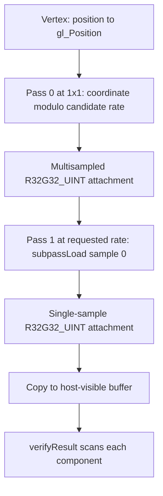

## Overview

**Core question:** Does a coarse fragment select one pixel-index value and replicate it consistently to all of its covered pixels?

- `vktFragmentShadingRatePixelConsistency.cpp` implements the `pixel_consistency` test family under `fragment_shading_rate.renderpass2.monolithic`.
- The family tests all nine pipeline fragment sizes from `rate_1x1` through `rate_4x4`, five rasterization sample counts, five framebuffer extents, and selected `FragCoord.zw` cases.
- A first subpass, rendered at the default `1x1` rate, writes a repeating pixel-index pattern derived from fragment coordinates. A second subpass uses the requested pipeline fragment size, reads the first image as an input attachment, and produces the value copied back for host checking.
- The check accepts the Vulkan rules for fragments at the framebuffer edge and rejects inconsistent values inside a fragment area or invalid pixel indices.

## Background Knowledge

- **Pipeline fragment shading rate.** `VkPipelineFragmentShadingRateStateCreateInfoKHR::fragmentSize` defines the width and height of the fragment area for a pipeline draw. The final rate can combine pipeline, primitive, and attachment rates. In this test, the first-pass pipeline omits this state and therefore defaults to `1x1`; the second-pass pipeline supplies the requested rate and keeps both combiner operations at `VK_FRAGMENT_SHADING_RATE_COMBINER_OP_KEEP_KHR`. See [Pipeline Fragment Shading Rate](../../../../vulkan-docs/src/chapters/primsrast.adoc#primsrast-fragment-shading-rate-pipeline) and [Combining the Fragment Shading Rates](../../../../vulkan-docs/src/chapters/primsrast.adoc#primsrast-fragment-shading-rate-combining).
- **Pixel index in a multi-pixel fragment.** For a fragment size `(f_w, f_h)`, a covered pixel has `p_x = x % f_w`, `p_y = y % f_h`, and `p = p_x + p_y * f_w`. The index identifies the pixel's position inside that fragment area. See [coverage mask and fragment shading rate pixel indices](../../../../vulkan-docs/src/chapters/primsrast.adoc#primsrast-multisampling-coverage-mask-vrfs).
- **Framebuffer boundaries.** Rasterization generates fragments only for pixels inside the framebuffer. A fragment area can extend beyond the framebuffer when an extent is not divisible by the requested rate, so the test treats those boundary pixels differently. See [Rasterization](../../../../vulkan-docs/src/chapters/primsrast.adoc#primsrast-rasterization).
- **Input attachments and subpasses.** The second subpass reads the first subpass's color attachment with `subpassLoad`. The subpass dependency orders color writes before input-attachment reads. See [Subpasses](../../../../vulkan-docs/src/chapters/renderpass.adoc#renderpass-subpasses).

## Registration Hierarchy

```text
fragment_shading_rate.renderpass2.monolithic.pixel_consistency
├── rate_1x1
├── rate_1x2
├── rate_1x4
├── rate_2x1
├── rate_2x2
├── rate_2x4
├── rate_4x1
├── rate_4x2
└── rate_4x4
```

The implementation creates the `pixel_consistency` group and then adds the nine rate families. Current `vk-default` and `vksc-default` mustpass files each contain 261 executable paths below this hierarchy.

## Parameter Dimensions and Observed Values

| Dimension | Registered values | Meaning in this test | Evidence |
|-----------|-------------------|----------------------|----------|
| Pipeline fragment size | `rate_1x1`, `rate_1x2`, `rate_1x4`, `rate_2x1`, `rate_2x2`, `rate_2x4`, `rate_4x1`, `rate_4x2`, `rate_4x4` | Changes the fragment area and the valid pixel-index range. | [`shadingRateCases[]`](../../../modules/vulkan/fragment_shading_rate/vktFragmentShadingRatePixelConsistency.cpp#L1250-L1272) |
| Rasterization sample count | `samples_1`, `samples_2`, `samples_4`, `samples_8`, `samples_16` | Creates the multisampled first color attachment and selects the single-sample or multisample input-attachment declaration in the second pass. | [`sampCases[]` and image creation](../../../modules/vulkan/fragment_shading_rate/vktFragmentShadingRatePixelConsistency.cpp#L1274-L1278) |
| Framebuffer extent | `extent_1x1`, `extent_4x4`, `extent_33x35`, `extent_151x431`, `extent_256x256` | Exercises tiny images, dimensions aligned to some rates, odd dimensions, and a larger square image. Non-divisible extents create boundary fragment areas. | [`extentCases[]`](../../../modules/vulkan/fragment_shading_rate/vktFragmentShadingRatePixelConsistency.cpp#L1280-L1283) |
| Coordinate source | no suffix, `*_zw_coord` | The ordinary cases calculate the index from `gl_FragCoord.x` and `.y`; the selected suffix cases calculate it from `.z` and `.w`. | [`initPrograms()`](../../../modules/vulkan/fragment_shading_rate/vktFragmentShadingRatePixelConsistency.cpp#L186-L265) and case generation ([`createPixelConsistencyTests()`](../../../modules/vulkan/fragment_shading_rate/vktFragmentShadingRatePixelConsistency.cpp#L1299-L1308)) |

The generator creates `9 * 5 * 5 = 225` ordinary cases. It adds `*_zw_coord` only for `extent_151x431` and `extent_256x256` with `samples_1` or `samples_4`, adding 36 cases for 261 total paths per mustpass file. The `vk-default` file uses the `dEQP-VK.` prefix and the `vksc-default` file uses `dEQP-VKSC.`; their suffixes and case counts match.

## Behavior Parameters

The primary behavioral axis is the pipeline fragment-size family. The family name selects `CaseDef::shadingRate`, which becomes the second-pass `VkPipelineFragmentShadingRateStateCreateInfoKHR::fragmentSize`. The first-pass shader instead receives one or more supported sizes that are possible clamped results for that request and uses them as modulus bases when generating the input pattern.

### `rate_1x1` - one pixel per fragment area

The first pass writes only `0`. This is the baseline for the same coordinate and input-attachment path without coarse grouping in the second pass.

### `rate_1x2` - one by two pixel area

The first pass alternates `0` and `1` by row. Each second-pass `1x2` fragment selects one of those values and must replicate it consistently over its two covered pixels.

### `rate_1x4` - one by four pixel area

The first pass repeats values `0` through `3` vertically; each second-pass fragment must produce one consistent selected value over its four covered pixels.

### `rate_2x1` - two by one pixel area

The first pass alternates `0` and `1` horizontally; each second-pass fragment must produce one consistent selected value over its two covered pixels.

### `rate_2x2` - two by two pixel area

The first-pass pattern encodes the four positions as `p_x + p_y * 2`. The second pass tests that one selected value is replicated consistently over each square fragment area.

### `rate_2x4` - two by four pixel area

The first pass generates an eight-value rectangular pattern. The second pass exercises replication over an area whose vertical dimension is larger than its horizontal dimension.

### `rate_4x1` - four by one pixel area

The first pass repeats four values horizontally, and the second pass exercises the transposed one-dimensional coarse-fragment case.

### `rate_4x2` - four by two pixel area

The first pass generates an eight-value rectangular pattern. The second pass exercises replication over an area whose horizontal dimension is larger than its vertical dimension.

### `rate_4x4` - four by four pixel area

The first pass generates the full `0` through `15` pattern. The second pass uses the largest fragment area in this family and must replicate one selected value across it.

For a requested rate, the instance queries the device's supported fragment shading rates. `clampShadingRate()` keeps an exact supported size when available. Otherwise it looks for supported sizes no larger than the request, starting at the requested area and halving the desired area until it finds candidates. Those one or more candidate sizes are passed in the push constant and checked independently because the implementation can clamp the requested second-pass rate to a supported size.

## Shader Analysis

The walkthrough below covers an exact `rate_2x4`, four-sample, `151x431` case with the `zw_coord` branch. The vertex stage supplies the coordinate data and the first-pass fragment stage computes both output components at the default `1x1` rate. The second-pass fragment stage performs the input-attachment load while the requested `2x4` pipeline rate controls coarse replication into the host-readable attachment.

### Representative Shader Walkthrough 1

#### Parameter Values Chosen

Representative path:

```text
dEQP-VK.fragment_shading_rate.renderpass2.monolithic.pixel_consistency.rate_2x4.samples_4.extent_151x431_zw_coord
```

| Parameter choice | Meaning in this representative case |
|------------------|-------------------------------------|
| `rate_2x4` | Requests a fragment area with two horizontal and four vertical positions. |
| `samples_4` | Makes the first color attachment multisampled and selects `usubpassInputMS` in the second pass. |
| `extent_151x431` | Produces a large, non-square framebuffer whose dimensions expose boundary areas. |
| `*_zw_coord` | Selects the vertex branch that writes `position` into both depth and clip `w`, and makes pass 0 index `gl_FragCoord.zw`. |

#### Purpose

Pass 0 writes a repeating pixel-index pattern at a `1x1` shading rate. Each coarse pass 1 invocation loads one value from that pattern and writes it to its covered pixels, allowing the host to test whether the value is replicated consistently.

#### Structural Design



#### Shader Code

##### Vertex Shader

```glsl
#version 450 core
layout(location = 0) in vec2 position;
out gl_PerVertex
{
   vec4 gl_Position;
};
void main()
{
  gl_Position = vec4(position, position);
}
```

##### Pass 0 Fragment Shader

```glsl
#version 450 core
layout(push_constant) uniform PC {
    uvec2 shadingRate[2];
} pc;
layout(location = 0) out uvec2 col0;
void main()
{
  col0.x = (uint(gl_FragCoord.z) % pc.shadingRate[0].x) + ((uint(gl_FragCoord.w) % pc.shadingRate[0].y) * pc.shadingRate[0].x);
  col0.y = (uint(gl_FragCoord.z) % pc.shadingRate[1].x) + ((uint(gl_FragCoord.w) % pc.shadingRate[1].y) * pc.shadingRate[1].x);
}
```

##### Pass 1 Fragment Shader

```glsl
#version 450 core
layout(input_attachment_index=0, set=0, binding=0) uniform usubpassInputMS inputAttachment;
layout(location = 0) out uvec2 col0;
void main()
{
  col0 = subpassLoad(inputAttachment, 0).xy;
}
```

#### Additional Info

- The vertex shader is the same generated stage for ordinary and `zw_coord` cases except for the `gl_Position` assignment branch; the suffix exists to exercise `FragCoord.zw` rather than duplicate every extent and sample-count combination.
- Pass 1 does not compute a new index. It reads sample 0 from the first attachment, so a mismatch reported by the host can originate in the pass 0 coordinate calculation, fragment-rate behavior, attachment access, or result handling.
- The two `shadingRate` entries are pushed when the device exposes multiple selected supported sizes. Each output component is checked against its corresponding selected size.

#### Parameter Variation Summary

| Parameter dimension | Shader-level variation from this shader | Evidence |
|---------------------|---------------------------------------|----------|
| Pipeline fragment size | Changes the requested `fragmentSize` in the pass 1 pipeline state and the candidate clamped sizes used as pass 0 push-constant modulus bases. | [`CaseDef`, push constants, and pipeline state](../../../modules/vulkan/fragment_shading_rate/vktFragmentShadingRatePixelConsistency.cpp#L68-L74) ([`clampShadingRate()`](../../../modules/vulkan/fragment_shading_rate/vktFragmentShadingRatePixelConsistency.cpp#L291-L357)) |
| Sample count | Changes `usubpassInput` to `usubpassInputMS` and changes the first attachment and pass 0 multisample state. | [`initPrograms()`](../../../modules/vulkan/fragment_shading_rate/vktFragmentShadingRatePixelConsistency.cpp#L241-L260) and [`pipelinePass0`](../../../modules/vulkan/fragment_shading_rate/vktFragmentShadingRatePixelConsistency.cpp#L830-L839) |
| Framebuffer extent | Changes image, framebuffer, viewport, scissor, draw area, and readback dimensions. | [`iterate()` resource and framebuffer setup](../../../modules/vulkan/fragment_shading_rate/vktFragmentShadingRatePixelConsistency.cpp#L450-L480) and [`VkFramebufferCreateInfo`](../../../modules/vulkan/fragment_shading_rate/vktFragmentShadingRatePixelConsistency.cpp#L660-L679) |
| Coordinate source | Selects `gl_FragCoord.xy` for ordinary cases or `gl_FragCoord.zw` for the restricted suffix cases. | [`initPrograms()` coordinate branches](../../../modules/vulkan/fragment_shading_rate/vktFragmentShadingRatePixelConsistency.cpp#L198-L205) ([`initPrograms()` fragment branches](../../../modules/vulkan/fragment_shading_rate/vktFragmentShadingRatePixelConsistency.cpp#L219-L231)) |

#### SPIR-V

##### Pass 0 Fragment SPIR-V

- Status: generated and validated
- Source: reconstructed `GLSL` from this walkthrough
- Stage: `frag`
- Target SPIRV version: `spirv1.0`

<details>
<summary>Click to expand SPIRV asm code</summary>

```llvm
; SPIR-V
; Version: 1.0
; Generator: Khronos Glslang Reference Front End; 11
; Bound: 62
; Schema: 0
               OpCapability Shader
          %1 = OpExtInstImport "GLSL.std.450"
               OpMemoryModel Logical GLSL450
               OpEntryPoint Fragment %main "main" %col0 %gl_FragCoord
               OpExecutionMode %main OriginUpperLeft
               OpSource GLSL 450
               OpName %main "main"
               OpName %col0 "col0"
               OpName %gl_FragCoord "gl_FragCoord"
               OpName %PC "PC"
               OpMemberName %PC 0 "shadingRate"
               OpName %pc "pc"
               OpDecorate %col0 Location 0
               OpDecorate %gl_FragCoord BuiltIn FragCoord
               OpDecorate %_arr_v2uint_uint_2 ArrayStride 8
               OpDecorate %PC Block
               OpMemberDecorate %PC 0 Offset 0
       %void = OpTypeVoid
          %3 = OpTypeFunction %void
       %uint = OpTypeInt 32 0
     %v2uint = OpTypeVector %uint 2
%_ptr_Output_v2uint = OpTypePointer Output %v2uint
       %col0 = OpVariable %_ptr_Output_v2uint Output
      %float = OpTypeFloat 32
    %v4float = OpTypeVector %float 4
%_ptr_Input_v4float = OpTypePointer Input %v4float
%gl_FragCoord = OpVariable %_ptr_Input_v4float Input
     %uint_2 = OpConstant %uint 2
%_ptr_Input_float = OpTypePointer Input %float
%_arr_v2uint_uint_2 = OpTypeArray %v2uint %uint_2
         %PC = OpTypeStruct %_arr_v2uint_uint_2
%_ptr_PushConstant_PC = OpTypePointer PushConstant %PC
         %pc = OpVariable %_ptr_PushConstant_PC PushConstant
        %int = OpTypeInt 32 1
      %int_0 = OpConstant %int 0
     %uint_0 = OpConstant %uint 0
%_ptr_PushConstant_uint = OpTypePointer PushConstant %uint
     %uint_3 = OpConstant %uint 3
     %uint_1 = OpConstant %uint 1
%_ptr_Output_uint = OpTypePointer Output %uint
      %int_1 = OpConstant %int 1
       %main = OpFunction %void None %3
          %5 = OpLabel
         %16 = OpAccessChain %_ptr_Input_float %gl_FragCoord %uint_2
         %17 = OpLoad %float %16
         %18 = OpConvertFToU %uint %17
         %27 = OpAccessChain %_ptr_PushConstant_uint %pc %int_0 %int_0 %uint_0
         %28 = OpLoad %uint %27
         %29 = OpUMod %uint %18 %28
         %31 = OpAccessChain %_ptr_Input_float %gl_FragCoord %uint_3
         %32 = OpLoad %float %31
         %33 = OpConvertFToU %uint %32
         %35 = OpAccessChain %_ptr_PushConstant_uint %pc %int_0 %int_0 %uint_1
         %36 = OpLoad %uint %35
         %37 = OpUMod %uint %33 %36
         %38 = OpAccessChain %_ptr_PushConstant_uint %pc %int_0 %int_0 %uint_0
         %39 = OpLoad %uint %38
         %40 = OpIMul %uint %37 %39
         %41 = OpIAdd %uint %29 %40
         %43 = OpAccessChain %_ptr_Output_uint %col0 %uint_0
               OpStore %43 %41
         %44 = OpAccessChain %_ptr_Input_float %gl_FragCoord %uint_2
         %45 = OpLoad %float %44
         %46 = OpConvertFToU %uint %45
         %48 = OpAccessChain %_ptr_PushConstant_uint %pc %int_0 %int_1 %uint_0
         %49 = OpLoad %uint %48
         %50 = OpUMod %uint %46 %49
         %51 = OpAccessChain %_ptr_Input_float %gl_FragCoord %uint_3
         %52 = OpLoad %float %51
         %53 = OpConvertFToU %uint %52
         %54 = OpAccessChain %_ptr_PushConstant_uint %pc %int_0 %int_1 %uint_1
         %55 = OpLoad %uint %54
         %56 = OpUMod %uint %53 %55
         %57 = OpAccessChain %_ptr_PushConstant_uint %pc %int_0 %int_1 %uint_0
         %58 = OpLoad %uint %57
         %59 = OpIMul %uint %56 %58
         %60 = OpIAdd %uint %50 %59
         %61 = OpAccessChain %_ptr_Output_uint %col0 %uint_1
               OpStore %61 %60
               OpReturn
               OpFunctionEnd
```

</details>

## Runtime Execution and Result Checking

- The instance creates a host-visible vertex buffer containing two triangles that cover the framebuffer, a host-visible readback buffer, and two `VK_FORMAT_R32G32_UINT` color images. The first image uses the selected sample count; the second uses `VK_SAMPLE_COUNT_1_BIT`.
- The command buffer clears both images to `UINT_MAX`, inserts image barriers, begins one render pass, and draws the triangles in subpass 0. The pass 0 pipeline has the default `1x1` shading rate and pushes the candidate clamped rates to the fragment shader so it can generate the repeating index patterns.
- Subpass 1 binds the input-attachment descriptor for the first image and draws the same triangles with `m_data.shadingRate` as its pipeline `fragmentSize`. Its `subpassLoad` selects values from the first image, and the coarse fragment invocation writes those values over its covered pixels in the second image.
- A color-attachment-to-transfer barrier precedes `vkCmdCopyImageToBuffer`. A transfer-to-host barrier and allocation invalidation make the copied image available to the host.
- `verifyResult()` scans each component independently. It skips `UINT_MAX` pixels left uncovered by the two triangles. The first interior value in the entire image must be less than `width * height`, and every other interior pixel in that component must match it; the repeated pass 0 pattern means a correctly aligned coarse pass 1 invocation selects the same relative pixel index in every interior fragment area.
- For a fragment area that crosses the right or bottom framebuffer edge, `VK_EXT_image_robustness` permits zero or a value from the in-framebuffer part. The checker records the first such value and rejects differing nonzero corner values. Without image robustness, it skips those boundary pixels because their values are undefined.
- The case passes when at least one selected clamped-rate component passes `verifyResult()`. It fails after all selected components fail.

## Failure Meaning

### Failure Cause Mapping

| If this behavior parameter value fails | Possible failure cause(s) |
|----------------------------------------|---------------------------|
| `rate_1x1` | Incorrect baseline pipeline-rate handling, coordinate-to-index conversion, input-attachment transfer, or host scan. |
| `rate_1x2` | Incorrect vertical grouping or handling of a two-pixel fragment area, in addition to shared pipeline and copyback causes. |
| `rate_1x4` | Incorrect vertical grouping for four pixels, in addition to shared causes. |
| `rate_2x1` | Incorrect horizontal grouping for two pixels, in addition to shared causes. |
| `rate_2x2` | Incorrect two-dimensional grouping or index ordering, in addition to shared causes. |
| `rate_2x4` | Incorrect rectangular grouping or index ordering for eight positions, in addition to shared causes. |
| `rate_4x1` | Incorrect horizontal grouping for four pixels, in addition to shared causes. |
| `rate_4x2` | Incorrect rectangular grouping or index ordering for eight positions, in addition to shared causes. |
| `rate_4x4` | Incorrect largest-area grouping or index range for sixteen positions, in addition to shared causes. |

A failure in a `*_zw_coord` case additionally points to the `FragCoord.zw` coordinate path or to interpolation/rasterization behavior used to produce those built-ins. A failure limited to an odd extent or boundary region points to edge-fragment handling or robustness behavior rather than necessarily to interior consistency.

### Cause Analysis

#### Fragment-area consistency or index calculation

**Possible failure symptoms:** An interior pixel has a different component value from the first interior pixel, or a value is at least the selected fragment area. The symptom appears in one or more rate families.

**Possible implementation causes:** The implementation may form the second-pass fragment areas incorrectly, fail to replicate one coarse invocation's output consistently to its covered pixels, select inconsistent input-attachment values between aligned fragment areas, or lower the pipeline fragment-size state or first-pass integer modulus operations incorrectly. The exact cause requires investigation of the failing rate, sample count, and coordinate branch.

#### Boundary fragment values

**Possible failure symptoms:** Covered pixels in a fragment area crossing the right or bottom edge contain different nonzero values when robustness is enabled. Without robustness, this path is skipped.

**Possible implementation causes:** The implementation may mishandle values for pixels outside the framebuffer portion of a coarse fragment or may not provide the robustness behavior expected by the test. The checker intentionally does not interpret undefined boundary values when `VK_EXT_image_robustness` is unavailable.

#### Pass-to-pass transfer or host result handling

**Possible failure symptoms:** The output contains unexpected values after pass 1, including mismatches that affect all pixels or all rate families.

**Possible implementation causes:** The failure may involve the subpass input-attachment read, the subpass dependency, image layout or memory synchronization, the image-to-buffer copy, allocation visibility, or the host-side scan. The test source does not distinguish these causes from a shader or rasterization failure in its final status.

## Case Pruning

### Requirement-based pruning

- `checkSupport()` requires `VK_KHR_fragment_shading_rate` and the `pipelineFragmentShadingRate` feature.
- The device must support `VK_FORMAT_R32G32_UINT` with color-attachment, input-attachment, and transfer usage, the selected sample count, and the requested framebuffer extent.
- The implementation queries supported fragment shading rates and can clamp the requested rate to supported sizes before execution. This is support handling, not evidence that every device runs the originally requested `VkExtent2D` unchanged.

### Design-based pruning

- The `FragCoord.zw` branch is limited to `extent_151x431` and `extent_256x256` with `samples_1` or `samples_4`. The source comment explicitly limits it to avoid duplicating the ordinary matrix.
- The family is registered only when the parent dispatcher selects render pass 2, a monolithic pipeline, no dynamic rendering, and no secondary command buffer. The parent source notes that subpasses cannot be translated to dynamic rendering.
- All nine rate families share the same implementation and matrix. The separate family names expose the fragment-area shape without duplicating the runtime design.

## Key Takeaways

- The test does not compare an image against a precomputed picture. It asks whether coarse pass 1 invocations select the same relative position from the repeating pass 0 index pattern and replicate that value consistently over all interior pixels.
- The two output components allow the instance to check one or more selected supported fragment sizes using one pass 0 shader and one readback image.
- Odd framebuffer extents matter because a coarse fragment can straddle the framebuffer edge. The checker applies the robustness rule only where it has defined meaning.
- `rate_1x1` through `rate_4x4` cover both orientations of each rectangular size, plus the square sizes, while the matrix varies sample count and extent independently.

## Source Reference Appendix

| Entry point | Link | Why it matters |
|-------------|------|----------------|
| Case definition and support | [`FSRPixelConsistencyTestCase::checkSupport()`](../../../modules/vulkan/fragment_shading_rate/vktFragmentShadingRatePixelConsistency.cpp#L131-L184) | Defines required extension, feature, format, sample-count, and extent support. |
| Shader generation | [`FSRPixelConsistencyTestCase::initPrograms()`](../../../modules/vulkan/fragment_shading_rate/vktFragmentShadingRatePixelConsistency.cpp#L186-L266) | Emits the coordinate-producing vertex shader and both fragment shaders. |
| Rate fallback | [`FSRPixelConsistencyInstance::clampShadingRate()`](../../../modules/vulkan/fragment_shading_rate/vktFragmentShadingRatePixelConsistency.cpp#L291-L357) | Selects supported fragment sizes used by the push constant and checker. |
| Host validation | [`FSRPixelConsistencyInstance::verifyResult()`](../../../modules/vulkan/fragment_shading_rate/vktFragmentShadingRatePixelConsistency.cpp#L359-L425) | Defines uncovered-pixel, boundary, range, equality, and pass behavior. |
| Render and readback | [`FSRPixelConsistencyInstance::iterate()`](../../../modules/vulkan/fragment_shading_rate/vktFragmentShadingRatePixelConsistency.cpp#L427-L1232) | Builds resources and pipelines, executes both subpasses, copies the result, and invokes validation. |
| Registration matrix | [`createPixelConsistencyTests()`](../../../modules/vulkan/fragment_shading_rate/vktFragmentShadingRatePixelConsistency.cpp#L1236-L1317) | Registers all rate, sample, extent, and `zw_coord` combinations. |
| Parent permutation gate | [`createTests()`](../../../modules/vulkan/fragment_shading_rate/vktFragmentShadingRateTests.cpp#L547-L556) | Restricts this subpass-based family to the renderpass2 monolithic permutation. |
| Vulkan fragment-rate semantics | [Pipeline fragment shading rate](../../../../vulkan-docs/src/chapters/primsrast.adoc#primsrast-fragment-shading-rate-pipeline) | Defines `fragmentSize` and the pipeline rate state used by the test. |
| Vulkan pixel-index semantics | [Multisampling coverage mask and fragment shading rate](../../../../vulkan-docs/src/chapters/primsrast.adoc#primsrast-multisampling-coverage-mask-vrfs) | Defines pixel positions and indices inside multi-pixel fragments. |
| Vulkan fragment boundaries | [Rasterization](../../../../vulkan-docs/src/chapters/primsrast.adoc#primsrast-rasterization) | Defines coverage and the relationship between fragments and framebuffer pixels. |
| Mustpass evidence | [`vk-default/fragment-shading-rate.txt`](../../../mustpass/main/vk-default/fragment-shading-rate.txt) and [`vksc-default/fragment-shading-rate.txt`](../../../mustpass/main/vksc-default/fragment-shading-rate.txt) | Each file contains 261 `pixel_consistency` paths, covering the same matrix with its own package prefix. |

**Validation results and risks:** The required shader tools were present: `glslangValidator` 16.3.0, `spirv-val` v2026.2, and `spirv-dis` v2026.2. The representative `zw_coord` pass 0 fragment shader compiled for `spirv1.0`, validated with `spv1.0`, and disassembled successfully; the output header is `; Version: 1.0`. The ordinary `gl_FragCoord.xy` variant also compiled, validated, and disassembled successfully for `spirv1.0`. The page describes source behavior, not a device run. The final status does not identify whether a mismatch came from rate implementation, shader generation, input-attachment access, synchronization, copyback, or host checking. The clamping path and the final "at least one selected component passes" rule are source behaviors that deserve attention when interpreting a failure, especially if a device advertises multiple same-area rates.
