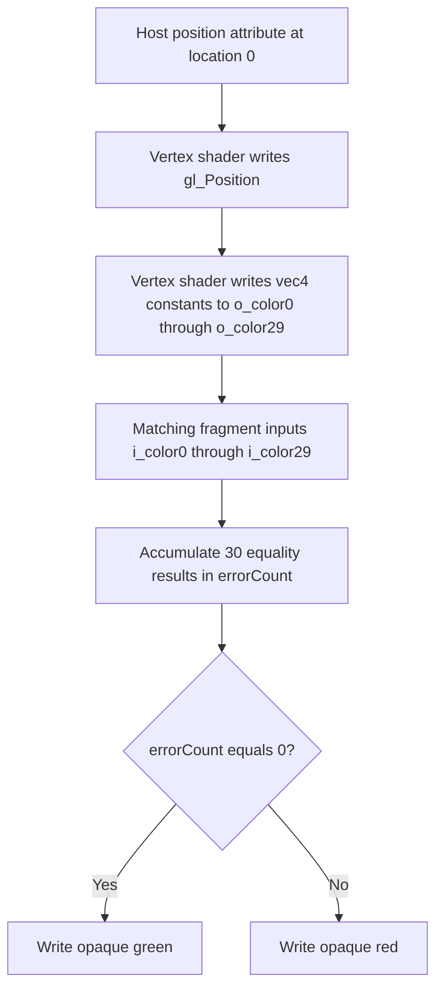

## Overview

**Core question:** Can a graphics implementation accept and correctly pass fragment inputs at the near-limit component counts registered by `glsl.limits`?

- [`vktShaderRenderLimitTests.cpp`](../../../modules/vulkan/shaderrender/vktShaderRenderLimitTests.cpp#L48-L261) implements the `glsl.limits.near_max.fragment_input` family.
- Each case generates matching vertex-output and fragment-input GLSL interfaces, renders a quad, and checks for an opaque-green result.
- The factory registers 15 leaves from three generator seeds: 64, 128, and 256 components, with five values immediately below each seed.
- This page explains the generated interface, device-limit checks, render validation, and what each result means.

## Background Knowledge

- Vulkan shader input and output limits count built-in interface variables together with user-defined interface variables. This page therefore treats `gl_Position` as part of the vertex-output budget, rather than counting only the generated user varyings.
- An explicit interface location pairs a vertex-stage output with the fragment-stage input at the same location. The generated shaders use matching declarations and types so that the fragment shader can compare the value written by the vertex shader.
- A `NotSupportedError` means that a case cannot run under the device limits checked by the test. It is different from a completed draw whose result image fails comparison.

## Registration Hierarchy

```text
glsl.limits
└── near_max
```

The implementation adds `fragment_input` below `near_max`, then registers the 15 `components_N` leaves below that family. The complete paths appear in both default mustpass profiles: [Vulkan default](../../../mustpass/main/vk-default/glsl.txt#L8015-L8029) and [Vulkan SC default](../../../mustpass/main/vksc-default/glsl.txt#L7096-L7110). The profile-specific prefixes are `dEQP-VK` and `dEQP-VKSC`.

## Parameter Dimensions and Observed Values

| Dimension | Registered values | Meaning in this test | Evidence |
|-----------|-------------------|----------------------|----------|
| Limit seed | `64`, `128`, `256` | Selects the component budget around which the generator creates near-limit cases. | [`createLimitTests()`](../../../modules/vulkan/shaderrender/vktShaderRenderLimitTests.cpp#L241-L261) |
| Case offset | Five values immediately below each seed | Varies the requested interface count while keeping the same generated test mechanism. | [`createLimitTests()`](../../../modules/vulkan/shaderrender/vktShaderRenderLimitTests.cpp#L250-L257) |
| Requested input components | `59` through `63`; `123` through `127`; `251` through `255` | Sets `m_inputComponents`, which controls the generated user interface and both device-limit checks. | [`FragmentInputComponentCase`](../../../modules/vulkan/shaderrender/vktShaderRenderLimitTests.cpp#L131-L237) |
| Shader interface shape | Full `vec4` locations plus a final `float`, `vec2`, `vec3`, or `vec4` | Packs the requested component count into explicit locations without adding unused components to the final declaration. | [`initPrograms()`](../../../modules/vulkan/shaderrender/vktShaderRenderLimitTests.cpp#L156-L210) |

The seed values are generator inputs, not promises that a device exposes those exact limits. A case runs only when the physical-device limits satisfy the checks described below.

## Behavior Parameters

The primary behavioral axis is the registered test case leaf, `components_N`. Its value changes the requested interface size; the generator and validation path stay the same.

### `components_59` through `components_63` | 64-component group

These leaves request 59, 60, 61, 62, or 63 fragment-input components. They exercise the generated interface just below the 64-component seed.

### `components_123` through `components_127` | 128-component group

These leaves request 123, 124, 125, 126, or 127 fragment-input components. For example, the 128-component seed produces 124 user-declared components after reserving the four components of `gl_Position`, as described by the implementation comment and accounting in [`initPrograms()`](../../../modules/vulkan/shaderrender/vktShaderRenderLimitTests.cpp#L156-L171).

### `components_251` through `components_255` | 256-component group

These leaves request 251, 252, 253, 254, or 255 fragment-input components. They use the same packing and comparison logic at the highest registered seed.

For every leaf, the generator computes `ceil((m_inputComponents - 4) / 4)` user locations. Earlier locations use `vec4`; the last location uses the type required by the remaining component count. The vertex shader writes a value derived from each location number, and the fragment shader compares the corresponding input with the same value.

## Shader Analysis

### Representative Shader Walkthrough 1

#### Parameter Values Chosen

Representative path:

```text
dEQP-VK.glsl.limits.near_max.fragment_input.components_124
```

| Parameter choice | Meaning in this representative case |
|------------------|-------------------------------------|
| `128` limit seed, offset `4` | [`createLimitTests()`](../../../modules/vulkan/shaderrender/vktShaderRenderLimitTests.cpp#L241-L261) registers `components_124` by subtracting the loop value `4` from the `128` seed. |
| `m_inputComponents = 124` | This exact leaf drives generation and the two device-limit checks. |
| `maxLocations = ceil((124 - 4) / 4) = 30` | [`initPrograms()`](../../../modules/vulkan/shaderrender/vktShaderRenderLimitTests.cpp#L131-L210) emits matching interface variables at locations 0 through 29. For the last location, `124 - 29 * 4` is `8`, so the generator's `default` arm selects `vec4`. |
| Fragment stage as primary | The fragment shader checks every generated interface value and produces the green/red validation signal consumed by the image oracle. |

#### Purpose

This exact specialization checks that 30 matching `vec4` vertex-output/fragment-input locations preserve their location-derived values. The fragment shader emits opaque green only when all 30 comparisons succeed.

#### Structural Design



#### Shader Code

##### Fragment Shader

```glsl
#version 450
/// The render-target output is location 0; opaque green means every generated input matched.
layout(location = 0) out highp vec4 o_color;
/// Locations 0-29 are stage-interface inputs matching the vertex shader outputs; there are no descriptors.
layout(location = 0) in highp vec4 i_color0;
layout(location = 1) in highp vec4 i_color1;
layout(location = 2) in highp vec4 i_color2;
layout(location = 3) in highp vec4 i_color3;
layout(location = 4) in highp vec4 i_color4;
layout(location = 5) in highp vec4 i_color5;
layout(location = 6) in highp vec4 i_color6;
layout(location = 7) in highp vec4 i_color7;
layout(location = 8) in highp vec4 i_color8;
layout(location = 9) in highp vec4 i_color9;
layout(location = 10) in highp vec4 i_color10;
layout(location = 11) in highp vec4 i_color11;
layout(location = 12) in highp vec4 i_color12;
layout(location = 13) in highp vec4 i_color13;
layout(location = 14) in highp vec4 i_color14;
layout(location = 15) in highp vec4 i_color15;
layout(location = 16) in highp vec4 i_color16;
layout(location = 17) in highp vec4 i_color17;
layout(location = 18) in highp vec4 i_color18;
layout(location = 19) in highp vec4 i_color19;
layout(location = 20) in highp vec4 i_color20;
layout(location = 21) in highp vec4 i_color21;
layout(location = 22) in highp vec4 i_color22;
layout(location = 23) in highp vec4 i_color23;
layout(location = 24) in highp vec4 i_color24;
layout(location = 25) in highp vec4 i_color25;
layout(location = 26) in highp vec4 i_color26;
layout(location = 27) in highp vec4 i_color27;
layout(location = 28) in highp vec4 i_color28;
layout(location = 29) in highp vec4 i_color29;
void main (void)
{
    int errorCount = 0;
    /// Check every generated input against the constructor written by the matching vertex output.
    errorCount += (i_color0 == vec4(0.0)) ? 0 : 1;
    errorCount += (i_color1 == vec4(1.0)) ? 0 : 1;
    errorCount += (i_color2 == vec4(2.0)) ? 0 : 1;
    errorCount += (i_color3 == vec4(3.0)) ? 0 : 1;
    errorCount += (i_color4 == vec4(4.0)) ? 0 : 1;
    errorCount += (i_color5 == vec4(5.0)) ? 0 : 1;
    errorCount += (i_color6 == vec4(6.0)) ? 0 : 1;
    errorCount += (i_color7 == vec4(7.0)) ? 0 : 1;
    errorCount += (i_color8 == vec4(8.0)) ? 0 : 1;
    errorCount += (i_color9 == vec4(9.0)) ? 0 : 1;
    errorCount += (i_color10 == vec4(10.0)) ? 0 : 1;
    errorCount += (i_color11 == vec4(11.0)) ? 0 : 1;
    errorCount += (i_color12 == vec4(12.0)) ? 0 : 1;
    errorCount += (i_color13 == vec4(13.0)) ? 0 : 1;
    errorCount += (i_color14 == vec4(14.0)) ? 0 : 1;
    errorCount += (i_color15 == vec4(15.0)) ? 0 : 1;
    errorCount += (i_color16 == vec4(16.0)) ? 0 : 1;
    errorCount += (i_color17 == vec4(17.0)) ? 0 : 1;
    errorCount += (i_color18 == vec4(18.0)) ? 0 : 1;
    errorCount += (i_color19 == vec4(19.0)) ? 0 : 1;
    errorCount += (i_color20 == vec4(20.0)) ? 0 : 1;
    errorCount += (i_color21 == vec4(21.0)) ? 0 : 1;
    errorCount += (i_color22 == vec4(22.0)) ? 0 : 1;
    errorCount += (i_color23 == vec4(23.0)) ? 0 : 1;
    errorCount += (i_color24 == vec4(24.0)) ? 0 : 1;
    errorCount += (i_color25 == vec4(25.0)) ? 0 : 1;
    errorCount += (i_color26 == vec4(26.0)) ? 0 : 1;
    errorCount += (i_color27 == vec4(27.0)) ? 0 : 1;
    errorCount += (i_color28 == vec4(28.0)) ? 0 : 1;
    errorCount += (i_color29 == vec4(29.0)) ? 0 : 1;

    /// Collapse all interface checks into the green pass/red fail attachment value.
    if (errorCount == 0)
        o_color = vec4(0.0, 1.0, 0.0, 1.0);
    else
        o_color = vec4(1.0, 0.0, 0.0, 1.0);
}
```

##### Vertex Shader

```glsl
#version 450
/// Location 0 is the six-element VK_FORMAT_R32G32B32A32_SFLOAT host vertex attribute.
layout(location = 0) in highp vec4 a_position;
/// Locations 0-29 are user-defined stage outputs matched by the fragment shader inputs.
layout(location = 0) out highp vec4 o_color0;
layout(location = 1) out highp vec4 o_color1;
layout(location = 2) out highp vec4 o_color2;
layout(location = 3) out highp vec4 o_color3;
layout(location = 4) out highp vec4 o_color4;
layout(location = 5) out highp vec4 o_color5;
layout(location = 6) out highp vec4 o_color6;
layout(location = 7) out highp vec4 o_color7;
layout(location = 8) out highp vec4 o_color8;
layout(location = 9) out highp vec4 o_color9;
layout(location = 10) out highp vec4 o_color10;
layout(location = 11) out highp vec4 o_color11;
layout(location = 12) out highp vec4 o_color12;
layout(location = 13) out highp vec4 o_color13;
layout(location = 14) out highp vec4 o_color14;
layout(location = 15) out highp vec4 o_color15;
layout(location = 16) out highp vec4 o_color16;
layout(location = 17) out highp vec4 o_color17;
layout(location = 18) out highp vec4 o_color18;
layout(location = 19) out highp vec4 o_color19;
layout(location = 20) out highp vec4 o_color20;
layout(location = 21) out highp vec4 o_color21;
layout(location = 22) out highp vec4 o_color22;
layout(location = 23) out highp vec4 o_color23;
layout(location = 24) out highp vec4 o_color24;
layout(location = 25) out highp vec4 o_color25;
layout(location = 26) out highp vec4 o_color26;
layout(location = 27) out highp vec4 o_color27;
layout(location = 28) out highp vec4 o_color28;
layout(location = 29) out highp vec4 o_color29;
void main (void)
{
    /// Forward the host position to the built-in vertex output.
    gl_Position = a_position;
    /// Write a location-derived constant to every generated output for fragment-stage verification.
    o_color0 = vec4(0.0);
    o_color1 = vec4(1.0);
    o_color2 = vec4(2.0);
    o_color3 = vec4(3.0);
    o_color4 = vec4(4.0);
    o_color5 = vec4(5.0);
    o_color6 = vec4(6.0);
    o_color7 = vec4(7.0);
    o_color8 = vec4(8.0);
    o_color9 = vec4(9.0);
    o_color10 = vec4(10.0);
    o_color11 = vec4(11.0);
    o_color12 = vec4(12.0);
    o_color13 = vec4(13.0);
    o_color14 = vec4(14.0);
    o_color15 = vec4(15.0);
    o_color16 = vec4(16.0);
    o_color17 = vec4(17.0);
    o_color18 = vec4(18.0);
    o_color19 = vec4(19.0);
    o_color20 = vec4(20.0);
    o_color21 = vec4(21.0);
    o_color22 = vec4(22.0);
    o_color23 = vec4(23.0);
    o_color24 = vec4(24.0);
    o_color25 = vec4(25.0);
    o_color26 = vec4(26.0);
    o_color27 = vec4(27.0);
    o_color28 = vec4(28.0);
    o_color29 = vec4(29.0);
}
```

#### Additional Info

- The non-primary vertex shader varies with the selected leaf through the same `maxLocations` loop as the fragment shader. Here it supplies the tested dataflow by writing `vec4(location.0)` at all 30 matching locations, while `a_position` only supplies `gl_Position`.
- For this exact specialization, the generated user interface contains 30 `vec4` values, or 120 user-defined components. The case parameter is 124 because the generator reserves four components for `gl_Position` when deriving the vertex-output interface; [`createInstance()`](../../../modules/vulkan/shaderrender/vktShaderRenderLimitTests.cpp#L212-L237) nevertheless compares the parameter value 124 directly with `maxFragmentInputComponents` and compares 128 with `maxVertexOutputComponents`.
- The `float`, `vec2`, and `vec3` switch arms exist in the builder, but `components_124` reaches the `default` `vec4` arm; no partial-width declaration was substituted into this reconstruction.

#### Parameter Variation Summary

| Parameter dimension | Shader-level variation from this shader | Evidence |
|---------------------|---------------------------------------|----------|
| Registered `components_N` leaf | Changes `maxLocations = ceil((N - 4) / 4)`, so the vertex output declarations/writes and fragment input declarations/checks grow or shrink together. | [`initPrograms()`](../../../modules/vulkan/shaderrender/vktShaderRenderLimitTests.cpp#L171-L206) |
| Location count across the three seeds | The registered leaves generate 14 or 15 locations near seed 64, 30 or 31 near seed 128, and 62 or 63 near seed 256. | [`createLimitTests()`](../../../modules/vulkan/shaderrender/vktShaderRenderLimitTests.cpp#L248-L257), [`initPrograms()`](../../../modules/vulkan/shaderrender/vktShaderRenderLimitTests.cpp#L171-L206) |
| Final generated type | For every currently registered leaf, the final switch operand is between 5 and 8, so the `default` arm emits `vec4`; the narrower switch arms would affect other, unregistered component values. | [`initPrograms()`](../../../modules/vulkan/shaderrender/vktShaderRenderLimitTests.cpp#L176-L196) |
| Expected constants and validation | Each added or removed location adds/removes one `vec4(location.0)` vertex assignment and its matching fragment equality check; the final green/red decision is unchanged. | [`initPrograms()`](../../../modules/vulkan/shaderrender/vktShaderRenderLimitTests.cpp#L198-L205) |

#### SPIR-V

##### Fragment Shader

- Status: generated and validated
- Source: reconstructed `GLSL` from this walkthrough
- Stage: `frag`
- Target SPIRV version: `spirv1.0`

<details>
<summary>Click to expand SPIRV asm code</summary>

```llvm
; SPIR-V
; Version: 1.0
; Generator: Khronos Glslang Reference Front End; 11
; Bound: 295
; Schema: 0
               OpCapability Shader
          %1 = OpExtInstImport "GLSL.std.450"
               OpMemoryModel Logical GLSL450
               OpEntryPoint Fragment %main "main" %i_color0 %i_color1 %i_color2 %i_color3 %i_color4 %i_color5 %i_color6 %i_color7 %i_color8 %i_color9 %i_color10 %i_color11 %i_color12 %i_color13 %i_color14 %i_color15 %i_color16 %i_color17 %i_color18 %i_color19 %i_color20 %i_color21 %i_color22 %i_color23 %i_color24 %i_color25 %i_color26 %i_color27 %i_color28 %i_color29 %o_color
               OpExecutionMode %main OriginUpperLeft
               OpSource GLSL 450
               OpName %main "main"
               OpName %errorCount "errorCount"
               OpName %i_color0 "i_color0"
               OpName %i_color1 "i_color1"
               OpName %i_color2 "i_color2"
               OpName %i_color3 "i_color3"
               OpName %i_color4 "i_color4"
               OpName %i_color5 "i_color5"
               OpName %i_color6 "i_color6"
               OpName %i_color7 "i_color7"
               OpName %i_color8 "i_color8"
               OpName %i_color9 "i_color9"
               OpName %i_color10 "i_color10"
               OpName %i_color11 "i_color11"
               OpName %i_color12 "i_color12"
               OpName %i_color13 "i_color13"
               OpName %i_color14 "i_color14"
               OpName %i_color15 "i_color15"
               OpName %i_color16 "i_color16"
               OpName %i_color17 "i_color17"
               OpName %i_color18 "i_color18"
               OpName %i_color19 "i_color19"
               OpName %i_color20 "i_color20"
               OpName %i_color21 "i_color21"
               OpName %i_color22 "i_color22"
               OpName %i_color23 "i_color23"
               OpName %i_color24 "i_color24"
               OpName %i_color25 "i_color25"
               OpName %i_color26 "i_color26"
               OpName %i_color27 "i_color27"
               OpName %i_color28 "i_color28"
               OpName %i_color29 "i_color29"
               OpName %o_color "o_color"
               OpDecorate %i_color0 Location 0
               OpDecorate %i_color1 Location 1
               OpDecorate %i_color2 Location 2
               OpDecorate %i_color3 Location 3
               OpDecorate %i_color4 Location 4
               OpDecorate %i_color5 Location 5
               OpDecorate %i_color6 Location 6
               OpDecorate %i_color7 Location 7
               OpDecorate %i_color8 Location 8
               OpDecorate %i_color9 Location 9
               OpDecorate %i_color10 Location 10
               OpDecorate %i_color11 Location 11
               OpDecorate %i_color12 Location 12
               OpDecorate %i_color13 Location 13
               OpDecorate %i_color14 Location 14
               OpDecorate %i_color15 Location 15
               OpDecorate %i_color16 Location 16
               OpDecorate %i_color17 Location 17
               OpDecorate %i_color18 Location 18
               OpDecorate %i_color19 Location 19
               OpDecorate %i_color20 Location 20
               OpDecorate %i_color21 Location 21
               OpDecorate %i_color22 Location 22
               OpDecorate %i_color23 Location 23
               OpDecorate %i_color24 Location 24
               OpDecorate %i_color25 Location 25
               OpDecorate %i_color26 Location 26
               OpDecorate %i_color27 Location 27
               OpDecorate %i_color28 Location 28
               OpDecorate %i_color29 Location 29
               OpDecorate %o_color Location 0
       %void = OpTypeVoid
          %3 = OpTypeFunction %void
        %int = OpTypeInt 32 1
%_ptr_Function_int = OpTypePointer Function %int
      %int_0 = OpConstant %int 0
      %float = OpTypeFloat 32
    %v4float = OpTypeVector %float 4
%_ptr_Input_v4float = OpTypePointer Input %v4float
   %i_color0 = OpVariable %_ptr_Input_v4float Input
    %float_0 = OpConstant %float 0
         %16 = OpConstantComposite %v4float %float_0 %float_0 %float_0 %float_0
       %bool = OpTypeBool
     %v4bool = OpTypeVector %bool 4
      %int_1 = OpConstant %int 1
   %i_color1 = OpVariable %_ptr_Input_v4float Input
    %float_1 = OpConstant %float 1
         %28 = OpConstantComposite %v4float %float_1 %float_1 %float_1 %float_1
   %i_color2 = OpVariable %_ptr_Input_v4float Input
    %float_2 = OpConstant %float 2
         %37 = OpConstantComposite %v4float %float_2 %float_2 %float_2 %float_2
   %i_color3 = OpVariable %_ptr_Input_v4float Input
    %float_3 = OpConstant %float 3
         %46 = OpConstantComposite %v4float %float_3 %float_3 %float_3 %float_3
   %i_color4 = OpVariable %_ptr_Input_v4float Input
    %float_4 = OpConstant %float 4
         %55 = OpConstantComposite %v4float %float_4 %float_4 %float_4 %float_4
   %i_color5 = OpVariable %_ptr_Input_v4float Input
    %float_5 = OpConstant %float 5
         %64 = OpConstantComposite %v4float %float_5 %float_5 %float_5 %float_5
   %i_color6 = OpVariable %_ptr_Input_v4float Input
    %float_6 = OpConstant %float 6
         %73 = OpConstantComposite %v4float %float_6 %float_6 %float_6 %float_6
   %i_color7 = OpVariable %_ptr_Input_v4float Input
    %float_7 = OpConstant %float 7
         %82 = OpConstantComposite %v4float %float_7 %float_7 %float_7 %float_7
   %i_color8 = OpVariable %_ptr_Input_v4float Input
    %float_8 = OpConstant %float 8
         %91 = OpConstantComposite %v4float %float_8 %float_8 %float_8 %float_8
   %i_color9 = OpVariable %_ptr_Input_v4float Input
    %float_9 = OpConstant %float 9
        %100 = OpConstantComposite %v4float %float_9 %float_9 %float_9 %float_9
  %i_color10 = OpVariable %_ptr_Input_v4float Input
   %float_10 = OpConstant %float 10
        %109 = OpConstantComposite %v4float %float_10 %float_10 %float_10 %float_10
  %i_color11 = OpVariable %_ptr_Input_v4float Input
   %float_11 = OpConstant %float 11
        %118 = OpConstantComposite %v4float %float_11 %float_11 %float_11 %float_11
  %i_color12 = OpVariable %_ptr_Input_v4float Input
   %float_12 = OpConstant %float 12
        %127 = OpConstantComposite %v4float %float_12 %float_12 %float_12 %float_12
  %i_color13 = OpVariable %_ptr_Input_v4float Input
   %float_13 = OpConstant %float 13
        %136 = OpConstantComposite %v4float %float_13 %float_13 %float_13 %float_13
  %i_color14 = OpVariable %_ptr_Input_v4float Input
   %float_14 = OpConstant %float 14
        %145 = OpConstantComposite %v4float %float_14 %float_14 %float_14 %float_14
  %i_color15 = OpVariable %_ptr_Input_v4float Input
   %float_15 = OpConstant %float 15
        %154 = OpConstantComposite %v4float %float_15 %float_15 %float_15 %float_15
  %i_color16 = OpVariable %_ptr_Input_v4float Input
   %float_16 = OpConstant %float 16
        %163 = OpConstantComposite %v4float %float_16 %float_16 %float_16 %float_16
  %i_color17 = OpVariable %_ptr_Input_v4float Input
   %float_17 = OpConstant %float 17
        %172 = OpConstantComposite %v4float %float_17 %float_17 %float_17 %float_17
  %i_color18 = OpVariable %_ptr_Input_v4float Input
   %float_18 = OpConstant %float 18
        %181 = OpConstantComposite %v4float %float_18 %float_18 %float_18 %float_18
  %i_color19 = OpVariable %_ptr_Input_v4float Input
   %float_19 = OpConstant %float 19
        %190 = OpConstantComposite %v4float %float_19 %float_19 %float_19 %float_19
  %i_color20 = OpVariable %_ptr_Input_v4float Input
   %float_20 = OpConstant %float 20
        %199 = OpConstantComposite %v4float %float_20 %float_20 %float_20 %float_20
  %i_color21 = OpVariable %_ptr_Input_v4float Input
   %float_21 = OpConstant %float 21
        %208 = OpConstantComposite %v4float %float_21 %float_21 %float_21 %float_21
  %i_color22 = OpVariable %_ptr_Input_v4float Input
   %float_22 = OpConstant %float 22
        %217 = OpConstantComposite %v4float %float_22 %float_22 %float_22 %float_22
  %i_color23 = OpVariable %_ptr_Input_v4float Input
   %float_23 = OpConstant %float 23
        %226 = OpConstantComposite %v4float %float_23 %float_23 %float_23 %float_23
  %i_color24 = OpVariable %_ptr_Input_v4float Input
   %float_24 = OpConstant %float 24
        %235 = OpConstantComposite %v4float %float_24 %float_24 %float_24 %float_24
  %i_color25 = OpVariable %_ptr_Input_v4float Input
   %float_25 = OpConstant %float 25
        %244 = OpConstantComposite %v4float %float_25 %float_25 %float_25 %float_25
  %i_color26 = OpVariable %_ptr_Input_v4float Input
   %float_26 = OpConstant %float 26
        %253 = OpConstantComposite %v4float %float_26 %float_26 %float_26 %float_26
  %i_color27 = OpVariable %_ptr_Input_v4float Input
   %float_27 = OpConstant %float 27
        %262 = OpConstantComposite %v4float %float_27 %float_27 %float_27 %float_27
  %i_color28 = OpVariable %_ptr_Input_v4float Input
   %float_28 = OpConstant %float 28
        %271 = OpConstantComposite %v4float %float_28 %float_28 %float_28 %float_28
  %i_color29 = OpVariable %_ptr_Input_v4float Input
   %float_29 = OpConstant %float 29
        %280 = OpConstantComposite %v4float %float_29 %float_29 %float_29 %float_29
%_ptr_Output_v4float = OpTypePointer Output %v4float
    %o_color = OpVariable %_ptr_Output_v4float Output
        %292 = OpConstantComposite %v4float %float_0 %float_1 %float_0 %float_1
        %294 = OpConstantComposite %v4float %float_1 %float_0 %float_0 %float_1
       %main = OpFunction %void None %3
          %5 = OpLabel
 %errorCount = OpVariable %_ptr_Function_int Function
               OpStore %errorCount %int_0
         %14 = OpLoad %v4float %i_color0
         %19 = OpFOrdEqual %v4bool %14 %16
         %20 = OpAll %bool %19
         %22 = OpSelect %int %20 %int_0 %int_1
         %23 = OpLoad %int %errorCount
         %24 = OpIAdd %int %23 %22
               OpStore %errorCount %24
         %26 = OpLoad %v4float %i_color1
         %29 = OpFOrdEqual %v4bool %26 %28
         %30 = OpAll %bool %29
         %31 = OpSelect %int %30 %int_0 %int_1
         %32 = OpLoad %int %errorCount
         %33 = OpIAdd %int %32 %31
               OpStore %errorCount %33
         %35 = OpLoad %v4float %i_color2
         %38 = OpFOrdEqual %v4bool %35 %37
         %39 = OpAll %bool %38
         %40 = OpSelect %int %39 %int_0 %int_1
         %41 = OpLoad %int %errorCount
         %42 = OpIAdd %int %41 %40
               OpStore %errorCount %42
         %44 = OpLoad %v4float %i_color3
         %47 = OpFOrdEqual %v4bool %44 %46
         %48 = OpAll %bool %47
         %49 = OpSelect %int %48 %int_0 %int_1
         %50 = OpLoad %int %errorCount
         %51 = OpIAdd %int %50 %49
               OpStore %errorCount %51
         %53 = OpLoad %v4float %i_color4
         %56 = OpFOrdEqual %v4bool %53 %55
         %57 = OpAll %bool %56
         %58 = OpSelect %int %57 %int_0 %int_1
         %59 = OpLoad %int %errorCount
         %60 = OpIAdd %int %59 %58
               OpStore %errorCount %60
         %62 = OpLoad %v4float %i_color5
         %65 = OpFOrdEqual %v4bool %62 %64
         %66 = OpAll %bool %65
         %67 = OpSelect %int %66 %int_0 %int_1
         %68 = OpLoad %int %errorCount
         %69 = OpIAdd %int %68 %67
               OpStore %errorCount %69
         %71 = OpLoad %v4float %i_color6
         %74 = OpFOrdEqual %v4bool %71 %73
         %75 = OpAll %bool %74
         %76 = OpSelect %int %75 %int_0 %int_1
         %77 = OpLoad %int %errorCount
         %78 = OpIAdd %int %77 %76
               OpStore %errorCount %78
         %80 = OpLoad %v4float %i_color7
         %83 = OpFOrdEqual %v4bool %80 %82
         %84 = OpAll %bool %83
         %85 = OpSelect %int %84 %int_0 %int_1
         %86 = OpLoad %int %errorCount
         %87 = OpIAdd %int %86 %85
               OpStore %errorCount %87
         %89 = OpLoad %v4float %i_color8
         %92 = OpFOrdEqual %v4bool %89 %91
         %93 = OpAll %bool %92
         %94 = OpSelect %int %93 %int_0 %int_1
         %95 = OpLoad %int %errorCount
         %96 = OpIAdd %int %95 %94
               OpStore %errorCount %96
         %98 = OpLoad %v4float %i_color9
        %101 = OpFOrdEqual %v4bool %98 %100
        %102 = OpAll %bool %101
        %103 = OpSelect %int %102 %int_0 %int_1
        %104 = OpLoad %int %errorCount
        %105 = OpIAdd %int %104 %103
               OpStore %errorCount %105
        %107 = OpLoad %v4float %i_color10
        %110 = OpFOrdEqual %v4bool %107 %109
        %111 = OpAll %bool %110
        %112 = OpSelect %int %111 %int_0 %int_1
        %113 = OpLoad %int %errorCount
        %114 = OpIAdd %int %113 %112
               OpStore %errorCount %114
        %116 = OpLoad %v4float %i_color11
        %119 = OpFOrdEqual %v4bool %116 %118
        %120 = OpAll %bool %119
        %121 = OpSelect %int %120 %int_0 %int_1
        %122 = OpLoad %int %errorCount
        %123 = OpIAdd %int %122 %121
               OpStore %errorCount %123
        %125 = OpLoad %v4float %i_color12
        %128 = OpFOrdEqual %v4bool %125 %127
        %129 = OpAll %bool %128
        %130 = OpSelect %int %129 %int_0 %int_1
        %131 = OpLoad %int %errorCount
        %132 = OpIAdd %int %131 %130
               OpStore %errorCount %132
        %134 = OpLoad %v4float %i_color13
        %137 = OpFOrdEqual %v4bool %134 %136
        %138 = OpAll %bool %137
        %139 = OpSelect %int %138 %int_0 %int_1
        %140 = OpLoad %int %errorCount
        %141 = OpIAdd %int %140 %139
               OpStore %errorCount %141
        %143 = OpLoad %v4float %i_color14
        %146 = OpFOrdEqual %v4bool %143 %145
        %147 = OpAll %bool %146
        %148 = OpSelect %int %147 %int_0 %int_1
        %149 = OpLoad %int %errorCount
        %150 = OpIAdd %int %149 %148
               OpStore %errorCount %150
        %152 = OpLoad %v4float %i_color15
        %155 = OpFOrdEqual %v4bool %152 %154
        %156 = OpAll %bool %155
        %157 = OpSelect %int %156 %int_0 %int_1
        %158 = OpLoad %int %errorCount
        %159 = OpIAdd %int %158 %157
               OpStore %errorCount %159
        %161 = OpLoad %v4float %i_color16
        %164 = OpFOrdEqual %v4bool %161 %163
        %165 = OpAll %bool %164
        %166 = OpSelect %int %165 %int_0 %int_1
        %167 = OpLoad %int %errorCount
        %168 = OpIAdd %int %167 %166
               OpStore %errorCount %168
        %170 = OpLoad %v4float %i_color17
        %173 = OpFOrdEqual %v4bool %170 %172
        %174 = OpAll %bool %173
        %175 = OpSelect %int %174 %int_0 %int_1
        %176 = OpLoad %int %errorCount
        %177 = OpIAdd %int %176 %175
               OpStore %errorCount %177
        %179 = OpLoad %v4float %i_color18
        %182 = OpFOrdEqual %v4bool %179 %181
        %183 = OpAll %bool %182
        %184 = OpSelect %int %183 %int_0 %int_1
        %185 = OpLoad %int %errorCount
        %186 = OpIAdd %int %185 %184
               OpStore %errorCount %186
        %188 = OpLoad %v4float %i_color19
        %191 = OpFOrdEqual %v4bool %188 %190
        %192 = OpAll %bool %191
        %193 = OpSelect %int %192 %int_0 %int_1
        %194 = OpLoad %int %errorCount
        %195 = OpIAdd %int %194 %193
               OpStore %errorCount %195
        %197 = OpLoad %v4float %i_color20
        %200 = OpFOrdEqual %v4bool %197 %199
        %201 = OpAll %bool %200
        %202 = OpSelect %int %201 %int_0 %int_1
        %203 = OpLoad %int %errorCount
        %204 = OpIAdd %int %203 %202
               OpStore %errorCount %204
        %206 = OpLoad %v4float %i_color21
        %209 = OpFOrdEqual %v4bool %206 %208
        %210 = OpAll %bool %209
        %211 = OpSelect %int %210 %int_0 %int_1
        %212 = OpLoad %int %errorCount
        %213 = OpIAdd %int %212 %211
               OpStore %errorCount %213
        %215 = OpLoad %v4float %i_color22
        %218 = OpFOrdEqual %v4bool %215 %217
        %219 = OpAll %bool %218
        %220 = OpSelect %int %219 %int_0 %int_1
        %221 = OpLoad %int %errorCount
        %222 = OpIAdd %int %221 %220
               OpStore %errorCount %222
        %224 = OpLoad %v4float %i_color23
        %227 = OpFOrdEqual %v4bool %224 %226
        %228 = OpAll %bool %227
        %229 = OpSelect %int %228 %int_0 %int_1
        %230 = OpLoad %int %errorCount
        %231 = OpIAdd %int %230 %229
               OpStore %errorCount %231
        %233 = OpLoad %v4float %i_color24
        %236 = OpFOrdEqual %v4bool %233 %235
        %237 = OpAll %bool %236
        %238 = OpSelect %int %237 %int_0 %int_1
        %239 = OpLoad %int %errorCount
        %240 = OpIAdd %int %239 %238
               OpStore %errorCount %240
        %242 = OpLoad %v4float %i_color25
        %245 = OpFOrdEqual %v4bool %242 %244
        %246 = OpAll %bool %245
        %247 = OpSelect %int %246 %int_0 %int_1
        %248 = OpLoad %int %errorCount
        %249 = OpIAdd %int %248 %247
               OpStore %errorCount %249
        %251 = OpLoad %v4float %i_color26
        %254 = OpFOrdEqual %v4bool %251 %253
        %255 = OpAll %bool %254
        %256 = OpSelect %int %255 %int_0 %int_1
        %257 = OpLoad %int %errorCount
        %258 = OpIAdd %int %257 %256
               OpStore %errorCount %258
        %260 = OpLoad %v4float %i_color27
        %263 = OpFOrdEqual %v4bool %260 %262
        %264 = OpAll %bool %263
        %265 = OpSelect %int %264 %int_0 %int_1
        %266 = OpLoad %int %errorCount
        %267 = OpIAdd %int %266 %265
               OpStore %errorCount %267
        %269 = OpLoad %v4float %i_color28
        %272 = OpFOrdEqual %v4bool %269 %271
        %273 = OpAll %bool %272
        %274 = OpSelect %int %273 %int_0 %int_1
        %275 = OpLoad %int %errorCount
        %276 = OpIAdd %int %275 %274
               OpStore %errorCount %276
        %278 = OpLoad %v4float %i_color29
        %281 = OpFOrdEqual %v4bool %278 %280
        %282 = OpAll %bool %281
        %283 = OpSelect %int %282 %int_0 %int_1
        %284 = OpLoad %int %errorCount
        %285 = OpIAdd %int %284 %283
               OpStore %errorCount %285
        %286 = OpLoad %int %errorCount
        %287 = OpIEqual %bool %286 %int_0
               OpSelectionMerge %289 None
               OpBranchConditional %287 %288 %293
        %288 = OpLabel
               OpStore %o_color %292
               OpBranch %289
        %293 = OpLabel
               OpStore %o_color %294
               OpBranch %289
        %289 = OpLabel
               OpReturn
               OpFunctionEnd
```

</details>

##### Vertex Shader

- Status: generated and validated
- Source: reconstructed `GLSL` from this walkthrough
- Stage: `vert`
- Target SPIRV version: `spirv1.0`

<details>
<summary>Click to expand SPIRV asm code</summary>

```llvm
; SPIR-V
; Version: 1.0
; Generator: Khronos Glslang Reference Front End; 11
; Bound: 111
; Schema: 0
               OpCapability Shader
          %1 = OpExtInstImport "GLSL.std.450"
               OpMemoryModel Logical GLSL450
               OpEntryPoint Vertex %main "main" %_ %a_position %o_color0 %o_color1 %o_color2 %o_color3 %o_color4 %o_color5 %o_color6 %o_color7 %o_color8 %o_color9 %o_color10 %o_color11 %o_color12 %o_color13 %o_color14 %o_color15 %o_color16 %o_color17 %o_color18 %o_color19 %o_color20 %o_color21 %o_color22 %o_color23 %o_color24 %o_color25 %o_color26 %o_color27 %o_color28 %o_color29
               OpSource GLSL 450
               OpName %main "main"
               OpName %gl_PerVertex "gl_PerVertex"
               OpMemberName %gl_PerVertex 0 "gl_Position"
               OpMemberName %gl_PerVertex 1 "gl_PointSize"
               OpMemberName %gl_PerVertex 2 "gl_ClipDistance"
               OpMemberName %gl_PerVertex 3 "gl_CullDistance"
               OpName %_ ""
               OpName %a_position "a_position"
               OpName %o_color0 "o_color0"
               OpName %o_color1 "o_color1"
               OpName %o_color2 "o_color2"
               OpName %o_color3 "o_color3"
               OpName %o_color4 "o_color4"
               OpName %o_color5 "o_color5"
               OpName %o_color6 "o_color6"
               OpName %o_color7 "o_color7"
               OpName %o_color8 "o_color8"
               OpName %o_color9 "o_color9"
               OpName %o_color10 "o_color10"
               OpName %o_color11 "o_color11"
               OpName %o_color12 "o_color12"
               OpName %o_color13 "o_color13"
               OpName %o_color14 "o_color14"
               OpName %o_color15 "o_color15"
               OpName %o_color16 "o_color16"
               OpName %o_color17 "o_color17"
               OpName %o_color18 "o_color18"
               OpName %o_color19 "o_color19"
               OpName %o_color20 "o_color20"
               OpName %o_color21 "o_color21"
               OpName %o_color22 "o_color22"
               OpName %o_color23 "o_color23"
               OpName %o_color24 "o_color24"
               OpName %o_color25 "o_color25"
               OpName %o_color26 "o_color26"
               OpName %o_color27 "o_color27"
               OpName %o_color28 "o_color28"
               OpName %o_color29 "o_color29"
               OpDecorate %gl_PerVertex Block
               OpMemberDecorate %gl_PerVertex 0 BuiltIn Position
               OpMemberDecorate %gl_PerVertex 1 BuiltIn PointSize
               OpMemberDecorate %gl_PerVertex 2 BuiltIn ClipDistance
               OpMemberDecorate %gl_PerVertex 3 BuiltIn CullDistance
               OpDecorate %a_position Location 0
               OpDecorate %o_color0 Location 0
               OpDecorate %o_color1 Location 1
               OpDecorate %o_color2 Location 2
               OpDecorate %o_color3 Location 3
               OpDecorate %o_color4 Location 4
               OpDecorate %o_color5 Location 5
               OpDecorate %o_color6 Location 6
               OpDecorate %o_color7 Location 7
               OpDecorate %o_color8 Location 8
               OpDecorate %o_color9 Location 9
               OpDecorate %o_color10 Location 10
               OpDecorate %o_color11 Location 11
               OpDecorate %o_color12 Location 12
               OpDecorate %o_color13 Location 13
               OpDecorate %o_color14 Location 14
               OpDecorate %o_color15 Location 15
               OpDecorate %o_color16 Location 16
               OpDecorate %o_color17 Location 17
               OpDecorate %o_color18 Location 18
               OpDecorate %o_color19 Location 19
               OpDecorate %o_color20 Location 20
               OpDecorate %o_color21 Location 21
               OpDecorate %o_color22 Location 22
               OpDecorate %o_color23 Location 23
               OpDecorate %o_color24 Location 24
               OpDecorate %o_color25 Location 25
               OpDecorate %o_color26 Location 26
               OpDecorate %o_color27 Location 27
               OpDecorate %o_color28 Location 28
               OpDecorate %o_color29 Location 29
       %void = OpTypeVoid
          %3 = OpTypeFunction %void
      %float = OpTypeFloat 32
    %v4float = OpTypeVector %float 4
       %uint = OpTypeInt 32 0
     %uint_1 = OpConstant %uint 1
%_arr_float_uint_1 = OpTypeArray %float %uint_1
%gl_PerVertex = OpTypeStruct %v4float %float %_arr_float_uint_1 %_arr_float_uint_1
%_ptr_Output_gl_PerVertex = OpTypePointer Output %gl_PerVertex
          %_ = OpVariable %_ptr_Output_gl_PerVertex Output
        %int = OpTypeInt 32 1
      %int_0 = OpConstant %int 0
%_ptr_Input_v4float = OpTypePointer Input %v4float
 %a_position = OpVariable %_ptr_Input_v4float Input
%_ptr_Output_v4float = OpTypePointer Output %v4float
   %o_color0 = OpVariable %_ptr_Output_v4float Output
    %float_0 = OpConstant %float 0
         %23 = OpConstantComposite %v4float %float_0 %float_0 %float_0 %float_0
   %o_color1 = OpVariable %_ptr_Output_v4float Output
    %float_1 = OpConstant %float 1
         %26 = OpConstantComposite %v4float %float_1 %float_1 %float_1 %float_1
   %o_color2 = OpVariable %_ptr_Output_v4float Output
    %float_2 = OpConstant %float 2
         %29 = OpConstantComposite %v4float %float_2 %float_2 %float_2 %float_2
   %o_color3 = OpVariable %_ptr_Output_v4float Output
    %float_3 = OpConstant %float 3
         %32 = OpConstantComposite %v4float %float_3 %float_3 %float_3 %float_3
   %o_color4 = OpVariable %_ptr_Output_v4float Output
    %float_4 = OpConstant %float 4
         %35 = OpConstantComposite %v4float %float_4 %float_4 %float_4 %float_4
   %o_color5 = OpVariable %_ptr_Output_v4float Output
    %float_5 = OpConstant %float 5
         %38 = OpConstantComposite %v4float %float_5 %float_5 %float_5 %float_5
   %o_color6 = OpVariable %_ptr_Output_v4float Output
    %float_6 = OpConstant %float 6
         %41 = OpConstantComposite %v4float %float_6 %float_6 %float_6 %float_6
   %o_color7 = OpVariable %_ptr_Output_v4float Output
    %float_7 = OpConstant %float 7
         %44 = OpConstantComposite %v4float %float_7 %float_7 %float_7 %float_7
   %o_color8 = OpVariable %_ptr_Output_v4float Output
    %float_8 = OpConstant %float 8
         %47 = OpConstantComposite %v4float %float_8 %float_8 %float_8 %float_8
   %o_color9 = OpVariable %_ptr_Output_v4float Output
    %float_9 = OpConstant %float 9
         %50 = OpConstantComposite %v4float %float_9 %float_9 %float_9 %float_9
  %o_color10 = OpVariable %_ptr_Output_v4float Output
   %float_10 = OpConstant %float 10
         %53 = OpConstantComposite %v4float %float_10 %float_10 %float_10 %float_10
  %o_color11 = OpVariable %_ptr_Output_v4float Output
   %float_11 = OpConstant %float 11
         %56 = OpConstantComposite %v4float %float_11 %float_11 %float_11 %float_11
  %o_color12 = OpVariable %_ptr_Output_v4float Output
   %float_12 = OpConstant %float 12
         %59 = OpConstantComposite %v4float %float_12 %float_12 %float_12 %float_12
  %o_color13 = OpVariable %_ptr_Output_v4float Output
   %float_13 = OpConstant %float 13
         %62 = OpConstantComposite %v4float %float_13 %float_13 %float_13 %float_13
  %o_color14 = OpVariable %_ptr_Output_v4float Output
   %float_14 = OpConstant %float 14
         %65 = OpConstantComposite %v4float %float_14 %float_14 %float_14 %float_14
  %o_color15 = OpVariable %_ptr_Output_v4float Output
   %float_15 = OpConstant %float 15
         %68 = OpConstantComposite %v4float %float_15 %float_15 %float_15 %float_15
  %o_color16 = OpVariable %_ptr_Output_v4float Output
   %float_16 = OpConstant %float 16
         %71 = OpConstantComposite %v4float %float_16 %float_16 %float_16 %float_16
  %o_color17 = OpVariable %_ptr_Output_v4float Output
   %float_17 = OpConstant %float 17
         %74 = OpConstantComposite %v4float %float_17 %float_17 %float_17 %float_17
  %o_color18 = OpVariable %_ptr_Output_v4float Output
   %float_18 = OpConstant %float 18
         %77 = OpConstantComposite %v4float %float_18 %float_18 %float_18 %float_18
  %o_color19 = OpVariable %_ptr_Output_v4float Output
   %float_19 = OpConstant %float 19
         %80 = OpConstantComposite %v4float %float_19 %float_19 %float_19 %float_19
  %o_color20 = OpVariable %_ptr_Output_v4float Output
   %float_20 = OpConstant %float 20
         %83 = OpConstantComposite %v4float %float_20 %float_20 %float_20 %float_20
  %o_color21 = OpVariable %_ptr_Output_v4float Output
   %float_21 = OpConstant %float 21
         %86 = OpConstantComposite %v4float %float_21 %float_21 %float_21 %float_21
  %o_color22 = OpVariable %_ptr_Output_v4float Output
   %float_22 = OpConstant %float 22
         %89 = OpConstantComposite %v4float %float_22 %float_22 %float_22 %float_22
  %o_color23 = OpVariable %_ptr_Output_v4float Output
   %float_23 = OpConstant %float 23
         %92 = OpConstantComposite %v4float %float_23 %float_23 %float_23 %float_23
  %o_color24 = OpVariable %_ptr_Output_v4float Output
   %float_24 = OpConstant %float 24
         %95 = OpConstantComposite %v4float %float_24 %float_24 %float_24 %float_24
  %o_color25 = OpVariable %_ptr_Output_v4float Output
   %float_25 = OpConstant %float 25
         %98 = OpConstantComposite %v4float %float_25 %float_25 %float_25 %float_25
  %o_color26 = OpVariable %_ptr_Output_v4float Output
   %float_26 = OpConstant %float 26
        %101 = OpConstantComposite %v4float %float_26 %float_26 %float_26 %float_26
  %o_color27 = OpVariable %_ptr_Output_v4float Output
   %float_27 = OpConstant %float 27
        %104 = OpConstantComposite %v4float %float_27 %float_27 %float_27 %float_27
  %o_color28 = OpVariable %_ptr_Output_v4float Output
   %float_28 = OpConstant %float 28
        %107 = OpConstantComposite %v4float %float_28 %float_28 %float_28 %float_28
  %o_color29 = OpVariable %_ptr_Output_v4float Output
   %float_29 = OpConstant %float 29
        %110 = OpConstantComposite %v4float %float_29 %float_29 %float_29 %float_29
       %main = OpFunction %void None %3
          %5 = OpLabel
         %18 = OpLoad %v4float %a_position
         %20 = OpAccessChain %_ptr_Output_v4float %_ %int_0
               OpStore %20 %18
               OpStore %o_color0 %23
               OpStore %o_color1 %26
               OpStore %o_color2 %29
               OpStore %o_color3 %32
               OpStore %o_color4 %35
               OpStore %o_color5 %38
               OpStore %o_color6 %41
               OpStore %o_color7 %44
               OpStore %o_color8 %47
               OpStore %o_color9 %50
               OpStore %o_color10 %53
               OpStore %o_color11 %56
               OpStore %o_color12 %59
               OpStore %o_color13 %62
               OpStore %o_color14 %65
               OpStore %o_color15 %68
               OpStore %o_color16 %71
               OpStore %o_color17 %74
               OpStore %o_color18 %77
               OpStore %o_color19 %80
               OpStore %o_color20 %83
               OpStore %o_color21 %86
               OpStore %o_color22 %89
               OpStore %o_color23 %92
               OpStore %o_color24 %95
               OpStore %o_color25 %98
               OpStore %o_color26 %101
               OpStore %o_color27 %104
               OpStore %o_color28 %107
               OpStore %o_color29 %110
               OpReturn
               OpFunctionEnd
```

</details>

## Runtime Execution and Result Checking

- `setupDefaultInputs()` supplies six four-component positions in a `VK_FORMAT_R32G32B32A32_SFLOAT` attribute at location 0. [`setupDefaultInputs()`](../../../modules/vulkan/shaderrender/vktShaderRenderLimitTests.cpp#L98-L104)
- `iterate()` calls `setup()`, renders six vertices as four indexed triangles using 12 indices, and copies the result image. [`iterate()`](../../../modules/vulkan/shaderrender/vktShaderRenderLimitTests.cpp#L66-L96)
- The host creates a reference image filled with opaque green, `(0, 255, 0, 255)`, and compares the rendered image with `tcu::pixelThresholdCompare()` using `tcu::RGBA(2, 2, 2, 2)`.
- A matching image returns `TestStatus::pass("Result image matches reference")`. A mismatch returns `TestStatus::fail("Image mismatch")`.
- The green image is the final host oracle. It confirms the complete generated interface and draw path produced the expected output, but it does not identify the first varying location that differed.

## Failure Meaning

### Failure Cause Mapping

| If this behavior parameter value fails | Possible failure cause(s) |
|----------------------------------------|---------------------------|
| `components_59`, `components_60`, `components_61`, `components_62`, or `components_63` | The implementation rejected or mishandled the generated interface at the requested count, or the completed render did not produce the green reference. |
| `components_123`, `components_124`, `components_125`, `components_126`, or `components_127` | The implementation rejected or mishandled the generated interface at the requested count, including the final partial location where applicable, or the completed render did not produce the green reference. |
| `components_251`, `components_252`, `components_253`, `components_254`, or `components_255` | The implementation rejected or mishandled the generated interface at the requested count, or the completed render did not produce the green reference. |
| Any registered leaf that raises `NotSupportedError` before rendering | The requested count is greater than `maxFragmentInputComponents`, or the requested count plus four `gl_Position` components is greater than `maxVertexOutputComponents`. |

### Cause Analysis

#### Device-limit requirement is not met

**Possible failure symptoms:** The case reports `NotSupportedError` before it creates an executable instance or performs the image comparison.

**Possible implementation causes:** The device properties expose a `maxFragmentInputComponents` value below `m_inputComponents`, or a `maxVertexOutputComponents` value below `m_inputComponents + 4`. The source checks these properties directly in [`createInstance()`](../../../modules/vulkan/shaderrender/vktShaderRenderLimitTests.cpp#L212-L237). This outcome describes unsupported execution on the current device, not a failed rendering result.

#### Generated interface is rejected

**Possible failure symptoms:** Shader or pipeline creation fails before `iterate()` can return a result image.

**Possible implementation causes:** The implementation did not accept the generated GLSL interface at the requested count or type layout. The inspected CTS source establishes the generated declarations and the device-limit preconditions, but it does not localize a creation failure to a particular compiler, driver, or hardware component. Source-level investigation is needed for that distinction.

#### Fragment-stage interface comparison detects a mismatch

**Possible failure symptoms:** The fragment shader increments `errorCount` for one or more generated locations and writes red, so the final image differs from the green reference.

**Possible implementation causes:** A matching vertex output and fragment input did not preserve the value written by the vertex shader, or the generated shader did not execute with the expected interface semantics. The source comparison checks every generated location, but the red image does not encode which location failed. Further shader or implementation inspection is needed to identify the exact cause.

#### Host image comparison fails after the draw

**Possible failure symptoms:** The draw completes, but `pixelThresholdCompare()` returns false and the test reports `Image mismatch`.

**Possible implementation causes:** The rendered image differs from the opaque-green reference beyond the per-channel threshold of 2. The checked source does not attribute every possible image difference to a specific stage, so determining whether the mismatch came from generated shader behavior, pipeline execution, rasterization, or result handling requires further investigation.

## Case Pruning

### Requirement-based pruning

- `createInstance()` skips a case with `NotSupportedError` when `m_inputComponents > maxFragmentInputComponents`.
- It also skips a case when `m_inputComponents + 4 > maxVertexOutputComponents`, because `gl_Position` contributes four vertex-output components.
- The inspected implementation has no additional file-local feature-bit, extension, or `checkSupport()` gate around this family. The two physical-device limit checks are the documented execution requirements.

### Design-based pruning

- The factory chooses the three seeds `64`, `128`, and `256`, then registers five values immediately below each seed. It does not generate every component count or values at or above a seed.
- The generator keeps one common interface mechanism across all leaves. It varies the requested count and the final partial type instead of creating separate families for each packing shape.
- The page scope ends at `fragment_input`; other GLSL limit properties are not implied by this source file or its registration.

## Key Takeaways

- The 15 leaves test requested fragment-input counts from 59 through 63, 123 through 127, and 251 through 255.
- The requested count includes the four `gl_Position` components for the vertex-output check, while generated user varyings use the remaining component budget.
- The shader writes green only when every generated fragment input matches the value written by its corresponding vertex output.
- A limit shortfall produces `NotSupportedError`; it is not an image failure.
- A completed case passes only when the rendered image matches opaque green within the `(2, 2, 2, 2)` threshold. The failure result does not identify a particular interface location.

## Source Reference Appendix

| Entry point | Link | Why it matters |
|-------------|------|----------------|
| `FragmentInputComponentCaseInstance::iterate()` | [`iterate()`](../../../modules/vulkan/shaderrender/vktShaderRenderLimitTests.cpp#L66-L96) | Records the draw, copies the result, and performs the green-image comparison. |
| `FragmentInputComponentCaseInstance::setupDefaultInputs()` | [`setupDefaultInputs()`](../../../modules/vulkan/shaderrender/vktShaderRenderLimitTests.cpp#L98-L104) | Defines the six vertex positions and attribute format. |
| `FragmentInputComponentCase::initPrograms()` | [`initPrograms()`](../../../modules/vulkan/shaderrender/vktShaderRenderLimitTests.cpp#L131-L210) | Generates the vertex and fragment GLSL templates, declarations, values, and comparisons. |
| `FragmentInputComponentCase::createInstance()` | [`createInstance()`](../../../modules/vulkan/shaderrender/vktShaderRenderLimitTests.cpp#L212-L237) | Checks `maxFragmentInputComponents` and `maxVertexOutputComponents` before execution. |
| `createLimitTests()` | [`createLimitTests()`](../../../modules/vulkan/shaderrender/vktShaderRenderLimitTests.cpp#L241-L261) | Registers `limits`, `near_max`, `fragment_input`, and the 15 leaves. |
| GLSL parent registration | [`createGlslTests()`](../../../modules/vulkan/vktTestPackage.cpp#L1253-L1269) | Attaches the limit test group to the GLSL package. |
| Vulkan package root | [`Vulkan package registration`](../../../modules/vulkan/vktTestPackage.cpp#L1345-L1354) | Attaches the GLSL group to the Vulkan package. |
| Vulkan SC package root | [`Vulkan SC package registration`](../../../modules/vulkan/vktTestPackage.cpp#L1413-L1422) | Attaches the GLSL group to the Vulkan SC package. |
| Vulkan default mustpass | [`glsl.txt`](../../../mustpass/main/vk-default/glsl.txt#L8015-L8029) | Lists all 15 `dEQP-VK.glsl.limits.near_max.fragment_input` leaves. |
| Vulkan SC default mustpass | [`glsl.txt`](../../../mustpass/main/vksc-default/glsl.txt#L7096-L7110) | Lists the same 15 leaves under the `dEQP-VKSC` prefix. |
