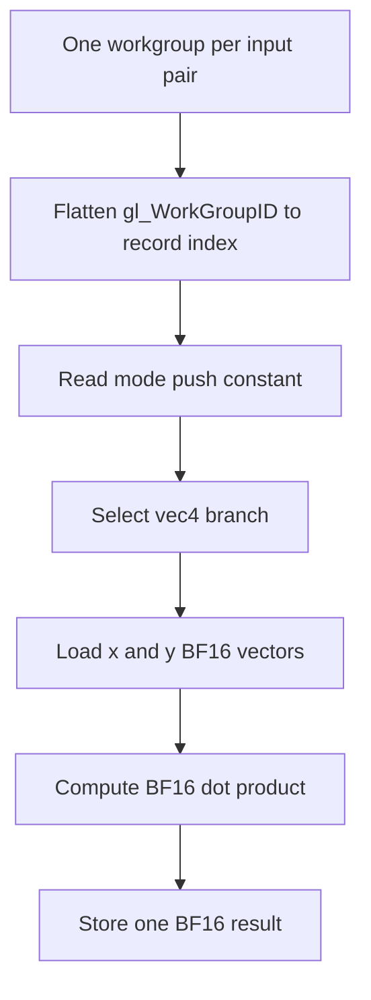

## Overview

**Core question:** Do BF16 and FP8 shader types preserve the required values and operations across dot products, specialization constants, composites, access chains, function calls, and swizzles?

- This page covers the `glsl.bfloat16` test family, which registers 16 executable test case leaves under the `dot`, `constant`, and `various` intermediate nodes.
- The family factory owns the GLSL extension and type-name mappings used by the implementation files. The executable logic lives in the delegated dot-product, specialization-constant, and combination-test sources.
- `dot` checks BF16 vector dot products with finite values, infinities, and NaNs. `constant` checks BF16 plus the E5M2 and E4M3 FP8 formats in compute, vertex, and fragment specialization constants. `various` checks BF16 data movement through common GLSL language constructs.
- Every leaf reads back a storage buffer, a rendered image, or both and compares the observed values with host-generated references. Successful compilation alone does not pass a case.

## Background Knowledge

- BF16 is a 16-bit floating-point encoding with an 8-bit exponent and 7 explicit fraction bits. It retains the exponent range of a 32-bit float but has less precision. The Vulkan feature `shaderBFloat16Type` enables the SPIR-V `BFloat16TypeKHR` capability, while BF16 dot products require the separate `shaderBFloat16DotProduct` feature ([feature definitions](../../../../vulkan-docs/src/chapters/features.adoc#L8910-L8924)).
- E5M2 and E4M3 are 8-bit floating-point encodings. The `constant` tests use their distinct GLSL extensions and scalar/vector type names and require `shaderFloat8`.
- Vulkan specialization constants receive values when the pipeline is created. A shader can use them as ordinary constants and, in a compute shader, as specialized workgroup dimensions through `local_size_*_id`.
- Storage buffers expose typed records to shaders and make the result available to the host. These tests require 16-bit storage-buffer access because BF16 values, and FP8 values in the `constant` branch, travel through storage-buffer members.

## Registration Hierarchy

```text
glsl.bfloat16
├── dot
├── constant
└── various
```

The GLSL package registers `createBFloat16Tests()` only in non-Vulkan-SC builds ([package registration](../../../modules/vulkan/vktTestPackage.cpp#L1253-L1260)). The family factory creates the three intermediate nodes shown above ([family factory](../../../modules/vulkan/shaderexecutor/vktShaderBFloat16Tests.cpp#L200-L211)). The Vulkan default mustpass list contains all 16 executable leaves ([mustpass entries](../../../mustpass/main/vk-default/glsl.txt#L1215-L1230)).

## Parameter Dimensions and Observed Values

| Dimension | Registered values | Meaning in this test | Evidence |
|-----------|-------------------|----------------------|----------|
| Behavior intermediate node | `dot`, `constant`, `various` | Selects BF16 arithmetic, specialization-constant handling, or GLSL data-manipulation behavior within the `bfloat16` test family. | [Family factory](../../../modules/vulkan/shaderexecutor/vktShaderBFloat16Tests.cpp#L200-L211) |
| Dot vector width | `vec2`, `vec3`, `vec4` | Selects how many leading components of each four-component input record participate in the BF16 dot product. | [Dot registration](../../../modules/vulkan/shaderexecutor/vktShaderBFloat16DotTests.cpp#L341-L357) |
| Constant format | `bf16`, `fe5m2`, `fe4m3` | Selects the narrow floating-point type used by shader specialization constants and storage-buffer observations. | [Constant registration](../../../modules/vulkan/shaderexecutor/vktShaderBFloat16ConstantTests.cpp#L1150-L1174) |
| Constant stage | `compute`, `vertex`, `fragment` | Selects the pipeline stage that consumes the specialization values. The format and stage tokens are concatenated in each leaf name, such as `computebf16`. | [Stage-specific cases](../../../modules/vulkan/shaderexecutor/vktShaderBFloat16ConstantTests.cpp#L376-L407), [leaf table](../../../modules/vulkan/shaderexecutor/vktShaderBFloat16ConstantTests.cpp#L1153-L1163) |
| Various behavior leaf | `composites`, `access_chains`, `function_call`, `swizzling` | Selects the GLSL data-manipulation construct applied to BF16 scalar and vector values. | [Various registration](../../../modules/vulkan/shaderexecutor/vktShaderBFloat16ComboTests.cpp#L878-L889) |
| Function-call runtime variant | `ret_in`, `ret_ref` | Runs the same registered `function_call` leaf once with direct return values and once with `out` parameters. This is a push-constant runtime choice, not another test case leaf. | [Variant table](../../../modules/vulkan/shaderexecutor/vktShaderBFloat16ComboTests.cpp#L701-L707) |

The 16 leaves comprise 3 dot cases, 9 constant cases, and 4 various cases. Shared mappings provide exact GLSL spellings for BF16, E5M2, and E4M3 scalar/vector types and their required extensions ([BF16 mappings](../../../modules/vulkan/shaderexecutor/vktShaderBFloat16Tests.cpp#L37-L67), [FP8 mappings](../../../modules/vulkan/shaderexecutor/vktShaderBFloat16Tests.cpp#L146-L196)).

## Behavior Parameters

The primary behavioral axis is the direct intermediate node below the `glsl.bfloat16` test family. Each value checks a different part of narrow floating-point shader handling.

### `dot`: BF16 vector dot products

Each leaf dispatches a compute shader over generated pairs of `bf16vec4` records. A push constant selects a two-, three-, or four-component view, and GLSL `dot()` writes one BF16 result per record. The generated data includes finite half-step values and designated NaN and infinity records. The host recomputes each active-width dot product in 32-bit arithmetic after converting the BF16 inputs. If an active input component is NaN, the observed BF16 result must also be NaN ([shader generator](../../../modules/vulkan/shaderexecutor/vktShaderBFloat16DotTests.cpp#L112-L151), [input and reference logic](../../../modules/vulkan/shaderexecutor/vktShaderBFloat16DotTests.cpp#L264-L337)).

### `constant`: BF16 and FP8 specialization constants

This branch crosses three narrow formats with compute, vertex, and fragment stages. The compute shader specializes workgroup sizes with IDs `0`, `2`, and `4`, specializes narrow or 32-bit constants with the remaining IDs, converts selected values, and writes three `vec4` records ([compute shader](../../../modules/vulkan/shaderexecutor/vktShaderBFloat16ConstantTests.cpp#L409-L456)).

The graphics leaves specialize IDs `0` through `13`. The vertex path writes the values to a storage buffer, derives positions from them, and renders white triangles. The fragment path receives ordinary vertex positions, writes the specialized values, and colors each triangle from `gl_PrimitiveID` ([vertex shader](../../../modules/vulkan/shaderexecutor/vktShaderBFloat16ConstantTests.cpp#L458-L517), [fragment shader](../../../modules/vulkan/shaderexecutor/vktShaderBFloat16ConstantTests.cpp#L519-L582)). This separates stage-specific specialization handling from the format choice.

### `various`: BF16 values through GLSL language constructs

The four leaves use compute shaders and BF16 scalar, `vec2`, `vec3`, and `vec4` data:

- `composites` copies individual structure fields in one direction and a whole structure in the other, so the output structures exchange their input values ([composite shader and check](../../../modules/vulkan/shaderexecutor/vktShaderBFloat16ComboTests.cpp#L208-L290)).
- `access_chains` reads and writes nested structure members and arrays with constant and loop-derived indices. The host checks the same cyclic member mapping ([access-chain shader](../../../modules/vulkan/shaderexecutor/vktShaderBFloat16ComboTests.cpp#L434-L485), [reference check](../../../modules/vulkan/shaderexecutor/vktShaderBFloat16ComboTests.cpp#L550-L572)).
- `function_call` reverses each BF16 vector through either a direct return value or an `out` parameter. The shared runtime dispatches both push-constant variants and requires both result regions to match ([shader and variants](../../../modules/vulkan/shaderexecutor/vktShaderBFloat16ComboTests.cpp#L575-L707), [reference check](../../../modules/vulkan/shaderexecutor/vktShaderBFloat16ComboTests.cpp#L709-L794)).
- `swizzling` emits 124 records while cycling through all scalar, two-, three-, and four-component permutation periods. The host advances the corresponding permutation maps and compares every record ([swizzle shader](../../../modules/vulkan/shaderexecutor/vktShaderBFloat16ComboTests.cpp#L293-L360), [output and check](../../../modules/vulkan/shaderexecutor/vktShaderBFloat16ComboTests.cpp#L383-L431)).

## Shader Analysis

The `dot.vec4` compute shader represents the BF16 arithmetic path. The `constant` and `various` intermediate nodes generate different shaders; their differences appear in the behavior and runtime sections rather than duplicate full walkthroughs.

### Representative Shader Walkthrough 1

#### Parameter Values Chosen

Representative path:

```text
dEQP-VK.glsl.bfloat16.dot.vec4
```

| Parameter choice | Meaning in this representative case |
|------------------|-------------------------------------|
| `dot` | Selects BF16 `dot()` arithmetic and the three-buffer compute path. |
| `vec4` | Pushes mode `3`, so all four components of each input record participate. |
| Seed `21` | The registration loop starts at seed `19` and increments once per width, making `vec4` the third deterministic input stream. |

#### Purpose

This shader checks whether a four-component BF16 dot product reads the correct storage-buffer records and writes the correct BF16 scalar for every dispatched record.

#### Structural Design



#### Shader Code

```glsl
#version 450
#extension GL_EXT_bfloat16 : require

/// Each workgroup reads one pair of four-component BF16 records.
layout(binding=0) buffer InBufferX { bf16vec4 x[]; };
layout(binding=1) buffer InBufferY { bf16vec4 y[]; };
/// The selected BF16 dot product is written as one BF16 scalar.
layout(binding=2) buffer OutBuffer { bfloat16_t z[]; };
/// The host pushes 3 for the vec4 test case.
layout(push_constant) uniform PC { uint mode; };
layout(local_size_x = 1, local_size_y = 1, local_size_z = 1) in;

void main() {
    /// Flatten the dispatched workgroup coordinate to the storage-buffer record index.
    uint id = gl_WorkGroupID.z * gl_NumWorkGroups.x * gl_NumWorkGroups.y
        + gl_WorkGroupID.y * gl_NumWorkGroups.x + gl_WorkGroupID.x;
    switch (mode) {
        case 3:
             z[id] = dot(bf16vec4(x[id]), bf16vec4(y[id]));
             break;
        case 2:
             z[id] = dot(bf16vec3(x[id]), bf16vec3(y[id]));
             break;
        case 1:
             z[id] = dot(bf16vec2(x[id]), bf16vec2(y[id]));
             break;
        default:
             z[id] = bfloat16_t(1.0);
    }
}
```

#### Additional Info

- The reconstructed source replaces the generator's `${EXTENSION}`, `${VEC1}` through `${VEC4}`, and `${CASE2}` through `${CASE4}` placeholders with their BF16 values ([template substitutions](../../../modules/vulkan/shaderexecutor/vktShaderBFloat16DotTests.cpp#L112-L150)).
- The host allocates every input record as four BF16 components. The mode changes the constructor width used by `dot()`, not the input buffer stride ([buffer sizing and pushed mode](../../../modules/vulkan/shaderexecutor/vktShaderBFloat16DotTests.cpp#L191-L245)).

#### Parameter Variation Summary

| Parameter dimension | Shader-level variation from this shader | Evidence |
|---------------------|---------------------------------------|----------|
| Vector width | `vec2` and `vec3` push modes `1` and `2`, select the corresponding switch branch, and construct shorter BF16 vectors from the leading input components. | [Dot shader template](../../../modules/vulkan/shaderexecutor/vktShaderBFloat16DotTests.cpp#L112-L150) |
| Behavior intermediate node | `constant` replaces the push-controlled dot product with specialized constants; `various` replaces it with fixed composite, access-chain, function, or swizzle logic. | [Constant shaders](../../../modules/vulkan/shaderexecutor/vktShaderBFloat16ConstantTests.cpp#L409-L582), [various shaders](../../../modules/vulkan/shaderexecutor/vktShaderBFloat16ComboTests.cpp#L208-L662) |

#### SPIR-V

- Status: generated and validated
- Source: reconstructed `GLSL` from this walkthrough
- Stage: `comp`
- Target SPIRV version: `spirv1.0`

<details>
<summary>Click to expand SPIRV asm code</summary>

```llvm
; SPIR-V
; Version: 1.0
; Generator: Khronos Glslang Reference Front End; 11
; Bound: 114
; Schema: 0
               OpCapability Shader
               OpCapability Float16
               OpCapability BFloat16TypeKHR
               OpCapability BFloat16DotProductKHR
               OpExtension "SPV_KHR_bfloat16"
          %1 = OpExtInstImport "GLSL.std.450"
               OpMemoryModel Logical GLSL450
               OpEntryPoint GLCompute %main "main" %gl_WorkGroupID %gl_NumWorkGroups
               OpExecutionMode %main LocalSize 1 1 1
               OpSource GLSL 450
               OpSourceExtension "GL_EXT_bfloat16"
               OpName %main "main"
               OpName %id "id"
               OpName %gl_WorkGroupID "gl_WorkGroupID"
               OpName %gl_NumWorkGroups "gl_NumWorkGroups"
               OpName %PC "PC"
               OpMemberName %PC 0 "mode"
               OpName %_ ""
               OpName %OutBuffer "OutBuffer"
               OpMemberName %OutBuffer 0 "z"
               OpName %__0 ""
               OpName %InBufferX "InBufferX"
               OpMemberName %InBufferX 0 "x"
               OpName %__1 ""
               OpName %InBufferY "InBufferY"
               OpMemberName %InBufferY 0 "y"
               OpName %__2 ""
               OpDecorate %gl_WorkGroupID BuiltIn WorkgroupId
               OpDecorate %gl_NumWorkGroups BuiltIn NumWorkgroups
               OpDecorate %PC Block
               OpMemberDecorate %PC 0 Offset 0
               OpDecorate %_runtimearr_bfloat16 ArrayStride 2
               OpDecorate %OutBuffer BufferBlock
               OpMemberDecorate %OutBuffer 0 Offset 0
               OpDecorate %__0 Binding 2
               OpDecorate %__0 DescriptorSet 0
               OpDecorate %_runtimearr_v4bfloat16 ArrayStride 8
               OpDecorate %InBufferX BufferBlock
               OpMemberDecorate %InBufferX 0 Offset 0
               OpDecorate %__1 Binding 0
               OpDecorate %__1 DescriptorSet 0
               OpDecorate %_runtimearr_v4bfloat16_0 ArrayStride 8
               OpDecorate %InBufferY BufferBlock
               OpMemberDecorate %InBufferY 0 Offset 0
               OpDecorate %__2 Binding 1
               OpDecorate %__2 DescriptorSet 0
               OpDecorate %gl_WorkGroupSize BuiltIn WorkgroupSize
       %void = OpTypeVoid
          %3 = OpTypeFunction %void
       %uint = OpTypeInt 32 0
%_ptr_Function_uint = OpTypePointer Function %uint
     %v3uint = OpTypeVector %uint 3
%_ptr_Input_v3uint = OpTypePointer Input %v3uint
%gl_WorkGroupID = OpVariable %_ptr_Input_v3uint Input
     %uint_2 = OpConstant %uint 2
%_ptr_Input_uint = OpTypePointer Input %uint
%gl_NumWorkGroups = OpVariable %_ptr_Input_v3uint Input
     %uint_0 = OpConstant %uint 0
     %uint_1 = OpConstant %uint 1
         %PC = OpTypeStruct %uint
%_ptr_PushConstant_PC = OpTypePointer PushConstant %PC
          %_ = OpVariable %_ptr_PushConstant_PC PushConstant
        %int = OpTypeInt 32 1
      %int_0 = OpConstant %int 0
%_ptr_PushConstant_uint = OpTypePointer PushConstant %uint
   %bfloat16 = OpTypeFloat 16 BFloat16KHR
%_runtimearr_bfloat16 = OpTypeRuntimeArray %bfloat16
  %OutBuffer = OpTypeStruct %_runtimearr_bfloat16
%_ptr_Uniform_OutBuffer = OpTypePointer Uniform %OutBuffer
        %__0 = OpVariable %_ptr_Uniform_OutBuffer Uniform
 %v4bfloat16 = OpTypeVector %bfloat16 4
%_runtimearr_v4bfloat16 = OpTypeRuntimeArray %v4bfloat16
  %InBufferX = OpTypeStruct %_runtimearr_v4bfloat16
%_ptr_Uniform_InBufferX = OpTypePointer Uniform %InBufferX
        %__1 = OpVariable %_ptr_Uniform_InBufferX Uniform
%_ptr_Uniform_v4bfloat16 = OpTypePointer Uniform %v4bfloat16
%_runtimearr_v4bfloat16_0 = OpTypeRuntimeArray %v4bfloat16
  %InBufferY = OpTypeStruct %_runtimearr_v4bfloat16_0
%_ptr_Uniform_InBufferY = OpTypePointer Uniform %InBufferY
        %__2 = OpVariable %_ptr_Uniform_InBufferY Uniform
%_ptr_Uniform_bfloat16 = OpTypePointer Uniform %bfloat16
 %v3bfloat16 = OpTypeVector %bfloat16 3
 %v2bfloat16 = OpTypeVector %bfloat16 2
%bfloat16_0x1p_0 = OpConstant %bfloat16 0x1p+0
%gl_WorkGroupSize = OpConstantComposite %v3uint %uint_1 %uint_1 %uint_1
       %main = OpFunction %void None %3
          %5 = OpLabel
         %id = OpVariable %_ptr_Function_uint Function
         %14 = OpAccessChain %_ptr_Input_uint %gl_WorkGroupID %uint_2
         %15 = OpLoad %uint %14
         %18 = OpAccessChain %_ptr_Input_uint %gl_NumWorkGroups %uint_0
         %19 = OpLoad %uint %18
         %20 = OpIMul %uint %15 %19
         %22 = OpAccessChain %_ptr_Input_uint %gl_NumWorkGroups %uint_1
         %23 = OpLoad %uint %22
         %24 = OpIMul %uint %20 %23
         %25 = OpAccessChain %_ptr_Input_uint %gl_WorkGroupID %uint_1
         %26 = OpLoad %uint %25
         %27 = OpAccessChain %_ptr_Input_uint %gl_NumWorkGroups %uint_0
         %28 = OpLoad %uint %27
         %29 = OpIMul %uint %26 %28
         %30 = OpIAdd %uint %24 %29
         %31 = OpAccessChain %_ptr_Input_uint %gl_WorkGroupID %uint_0
         %32 = OpLoad %uint %31
         %33 = OpIAdd %uint %30 %32
               OpStore %id %33
         %40 = OpAccessChain %_ptr_PushConstant_uint %_ %int_0
         %41 = OpLoad %uint %40
               OpSelectionMerge %46 None
               OpSwitch %41 %45 3 %42 2 %43 1 %44
         %45 = OpLabel
        %109 = OpLoad %uint %id
        %111 = OpAccessChain %_ptr_Uniform_bfloat16 %__0 %int_0 %109
               OpStore %111 %bfloat16_0x1p_0
               OpBranch %46
         %42 = OpLabel
         %52 = OpLoad %uint %id
         %58 = OpLoad %uint %id
         %60 = OpAccessChain %_ptr_Uniform_v4bfloat16 %__1 %int_0 %58
         %61 = OpLoad %v4bfloat16 %60
         %66 = OpLoad %uint %id
         %67 = OpAccessChain %_ptr_Uniform_v4bfloat16 %__2 %int_0 %66
         %68 = OpLoad %v4bfloat16 %67
         %69 = OpDot %bfloat16 %61 %68
         %71 = OpAccessChain %_ptr_Uniform_bfloat16 %__0 %int_0 %52
               OpStore %71 %69
               OpBranch %46
         %43 = OpLabel
         %73 = OpLoad %uint %id
         %74 = OpLoad %uint %id
         %75 = OpAccessChain %_ptr_Uniform_v4bfloat16 %__1 %int_0 %74
         %76 = OpLoad %v4bfloat16 %75
         %78 = OpCompositeExtract %bfloat16 %76 0
         %79 = OpCompositeExtract %bfloat16 %76 1
         %80 = OpCompositeExtract %bfloat16 %76 2
         %81 = OpCompositeConstruct %v3bfloat16 %78 %79 %80
         %82 = OpLoad %uint %id
         %83 = OpAccessChain %_ptr_Uniform_v4bfloat16 %__2 %int_0 %82
         %84 = OpLoad %v4bfloat16 %83
         %85 = OpCompositeExtract %bfloat16 %84 0
         %86 = OpCompositeExtract %bfloat16 %84 1
         %87 = OpCompositeExtract %bfloat16 %84 2
         %88 = OpCompositeConstruct %v3bfloat16 %85 %86 %87
         %89 = OpDot %bfloat16 %81 %88
         %90 = OpAccessChain %_ptr_Uniform_bfloat16 %__0 %int_0 %73
               OpStore %90 %89
               OpBranch %46
         %44 = OpLabel
         %92 = OpLoad %uint %id
         %93 = OpLoad %uint %id
         %94 = OpAccessChain %_ptr_Uniform_v4bfloat16 %__1 %int_0 %93
         %95 = OpLoad %v4bfloat16 %94
         %97 = OpCompositeExtract %bfloat16 %95 0
         %98 = OpCompositeExtract %bfloat16 %95 1
         %99 = OpCompositeConstruct %v2bfloat16 %97 %98
        %100 = OpLoad %uint %id
        %101 = OpAccessChain %_ptr_Uniform_v4bfloat16 %__2 %int_0 %100
        %102 = OpLoad %v4bfloat16 %101
        %103 = OpCompositeExtract %bfloat16 %102 0
        %104 = OpCompositeExtract %bfloat16 %102 1
        %105 = OpCompositeConstruct %v2bfloat16 %103 %104
        %106 = OpDot %bfloat16 %99 %105
        %107 = OpAccessChain %_ptr_Uniform_bfloat16 %__0 %int_0 %92
               OpStore %107 %106
               OpBranch %46
         %46 = OpLabel
               OpReturn
               OpFunctionEnd
```

</details>

## Runtime Execution and Result Checking

- `dot` allocates two host-visible BF16 vector storage buffers and one BF16 scalar output buffer. It generates a deterministic record count with `(random + 5) % 64`, fills both inputs, pushes the selected width, and dispatches `ioCount` workgroups. After waiting and invalidating the output allocation, it reports `Mismatches <n> from <ioCount>` when any host reference differs ([execution](../../../modules/vulkan/shaderexecutor/vktShaderBFloat16DotTests.cpp#L182-L262), [verification](../../../modules/vulkan/shaderexecutor/vktShaderBFloat16DotTests.cpp#L292-L337)).
- Every constant case allocates three 1024-record storage buffers at bindings 0 through 2. The compute path builds a typed specialization map, dispatches one workgroup, and compares the first three output records component by component ([common resources](../../../modules/vulkan/shaderexecutor/vktShaderBFloat16ConstantTests.cpp#L178-L225), [compute pipeline and check](../../../modules/vulkan/shaderexecutor/vktShaderBFloat16ConstantTests.cpp#L626-L700)).
- Constant graphics cases render seven vertices as a triangle fan into a 64 by 64 `VK_FORMAT_R32G32B32A32_SFLOAT` image, copy that image to a host-visible buffer, and inspect the shader-written storage buffer ([fixed parameters](../../../modules/vulkan/shaderexecutor/vktShaderBFloat16ConstantTests.cpp#L60-L66), [graphics execution](../../../modules/vulkan/shaderexecutor/vktShaderBFloat16ConstantTests.cpp#L703-L862)). Vertex cases require every checked triangle barycenter to be white. Fragment cases require the barycenter color to equal the one-based primitive number, with alpha `1.0` ([vertex check](../../../modules/vulkan/shaderexecutor/vktShaderBFloat16ConstantTests.cpp#L947-L996), [fragment check](../../../modules/vulkan/shaderexecutor/vktShaderBFloat16ConstantTests.cpp#L1090-L1140)).
- The four `various` leaves share two host-visible storage buffers and a four-byte push constant. The host clears the output, uploads operation-specific input, dispatches once per runtime variant, invalidates and decodes the output, then calls the operation-specific comparison. `function_call` dispatches twice; the other leaves dispatch once ([shared combo execution](../../../modules/vulkan/shaderexecutor/vktShaderBFloat16ComboTests.cpp#L796-L873)).

A leaf passes only after every check assigned to its branch succeeds. The constant graphics checks combine shader-written data with rasterized-image evidence, so they verify both specialization values and the stage-specific use of those values.

## Failure Meaning

### Failure Cause Mapping

| If this behavior parameter value fails | Possible failure cause(s) |
|----------------------------------------|---------------------------|
| `dot` | Incorrect BF16 dot-product support, active-width selection, special-value propagation, storage-buffer access, or result conversion |
| `constant` | Incorrect specialization-map consumption, narrow-format constant representation or conversion, specialized workgroup size, stage-specific execution, storage write, or graphics observation |
| `various` | Incorrect BF16 composite copying, access-chain addressing, function argument/return handling, `out` parameters, vector swizzling, or shared compute-buffer execution |

All three behavior branches depend on GLSL-to-SPIR-V compilation, descriptor binding, command submission, host-visible memory synchronization, and their host reference code. A broad failure across unrelated leaves does not identify one implementation layer by itself.

### Cause Analysis

#### BF16 dot-product or width-selection failure

**Possible failure symptoms:** A `dot.vec2`, `dot.vec3`, or `dot.vec4` leaf reports one or more mismatches. Finite and infinite inputs may produce an unequal BF16 result, or an active NaN input may produce a non-NaN result. Width-specific failures follow the mode-selected leading-component count.

**Possible implementation causes:** The shader compiler or implementation may lower the BF16 `dot()` operation with the wrong vector width, read the wrong storage-buffer elements, round or store the scalar result incorrectly, or fail to preserve NaN behavior. Comparing the three widths separates a general BF16 dot problem from construction of the shorter vectors.

#### Specialization-constant or stage-observation failure

**Possible failure symptoms:** A compute leaf writes a value different from the typed specialization reference or reports a wrong specialized workgroup dimension. A vertex or fragment leaf can fail its storage-buffer comparison, its barycenter color check, or both. Failures may cluster by `bf16`, `fe5m2`, `fe4m3`, or shader stage.

**Possible implementation causes:** Pipeline specialization data may be mapped to the wrong constant ID, decoded with the wrong byte size, or converted incorrectly between the narrow type and `float`. Compute-only failures can involve `local_size_*_id`. Stage-specific graphics failures can involve specialization in that stage, storage writes from that stage, position or primitive-color generation, or later rasterization and image copyback. The two graphics observations help distinguish a wrong specialized value from a failure in how that value affects rendering, but logs and narrower comparisons are needed to assign the exact layer.

#### BF16 composite and access-chain failure

**Possible failure symptoms:** `composites` fails to exchange complete scalar/vector structures, or `access_chains` returns values from the wrong nested structure or array member.

**Possible implementation causes:** The compiler or implementation may calculate BF16 structure member offsets, vector alignment, array strides, or nested access-chain indices incorrectly. A composite-only failure points more toward whole-object or field copying; an access-chain-only failure points more toward nested addressing and loop-derived indices.

#### BF16 function and swizzle failure

**Possible failure symptoms:** `function_call` fails one or both output regions for the direct-return and `out`-parameter variants, or `swizzling` produces a record that differs from the host's current component permutation.

**Possible implementation causes:** BF16 scalar/vector parameters may be passed or returned with the wrong width or component order, an `out` parameter may not receive the function result, or swizzle lowering may select the wrong lanes. Because `function_call` validates both variants in one leaf, its final status alone does not identify which variant failed; source-level logging or buffer inspection is needed for that distinction.

#### Shared execution or readback failure

**Possible failure symptoms:** Many unrelated leaves fail with unchanged output, widespread mismatches, shader compilation errors, or invalid graphics readback rather than a pattern tied to one behavior.

**Possible implementation causes:** Descriptor setup, buffer layout, pipeline creation, dispatch or draw submission, cache management for host-visible allocations, image barriers, image-to-buffer copy, or host reference handling may be involved. The final status is not enough to choose among these shared paths, so source-level investigation and CTS logs are required.

## Case Pruning

### Requirement-based pruning

- The GLSL package does not register `glsl.bfloat16` in Vulkan SC builds ([registration guard](../../../modules/vulkan/vktTestPackage.cpp#L1253-L1260)).
- Every leaf requires `storageBuffer16BitAccess`; unsupported devices return `NotSupported` before creating the storage-buffer execution path ([dot check](../../../modules/vulkan/shaderexecutor/vktShaderBFloat16DotTests.cpp#L83-L109), [constant check](../../../modules/vulkan/shaderexecutor/vktShaderBFloat16ConstantTests.cpp#L135-L156), [various check](../../../modules/vulkan/shaderexecutor/vktShaderBFloat16ComboTests.cpp#L72-L83)).
- `dot` also requires both `shaderBFloat16Type` and `shaderBFloat16DotProduct`.
- BF16 `constant` leaves require `shaderBFloat16Type`, while E5M2 and E4M3 leaves require `shaderFloat8`. The check follows the registered format, so unsupported FP8 does not remove BF16 coverage.
- `various` requires `shaderBFloat16Type` and has no FP8 variants.

These are runtime support decisions for registered leaves. They differ from the design exclusions below.

### Design-based pruning

- `dot` registers vector widths 2 through 4. It omits a scalar case because GLSL `dot()` is the tested operation and the inputs are vector records.
- `constant` registers exactly the three formats BF16, E5M2, and E4M3 in compute, vertex, and fragment stages. The shared helper knows Float16 spellings, but the constant registration table does not create Float16 leaves ([shared Float16 mappings](../../../modules/vulkan/shaderexecutor/vktShaderBFloat16Tests.cpp#L43-L87), [registered constant leaves](../../../modules/vulkan/shaderexecutor/vktShaderBFloat16ConstantTests.cpp#L1153-L1163)).
- `constant` has no geometry, tessellation, ray-tracing, mesh, or task variants. Its graphics design uses only vertex and fragment specialization paths around one triangle-fan render.
- `various` keeps four fixed BF16 behaviors. Scalar and vector widths are exercised within each shader rather than expanded into separate registered leaves.
- `function_call` keeps `ret_in` and `ret_ref` as two dispatches inside one executable leaf. `swizzling` likewise checks all permutation periods in one leaf instead of registering each permutation.

## Key Takeaways

- `glsl.bfloat16` is a 16-leaf test family: 3 BF16 dot-product leaves, 9 BF16/FP8 specialization-constant leaves, and 4 BF16 language-construct leaves.
- The direct intermediate node is the main behavior choice. Width refines `dot`; format and stage refine `constant`; the leaf name selects the construct under `various`.
- The `constant` branch belongs under `bfloat16` but intentionally includes E5M2 and E4M3 FP8 coverage.
- Every branch verifies device output against host expectations. The graphics constant paths add an image check to the storage-buffer check.
- Feature checks prune unsupported registered leaves, while the smaller width, stage, format, and construct matrices are design choices. See `Failure Meaning` for symptom-based diagnosis.

## Source Reference Appendix

| Entry point | Link | Why it matters |
|-------------|------|----------------|
| Family mappings and registration | [`vktShaderBFloat16Tests.cpp`](../../../modules/vulkan/shaderexecutor/vktShaderBFloat16Tests.cpp#L37-L211) | Defines GLSL extension/type spellings and registers the `dot`, `constant`, and `various` intermediate nodes. |
| Aligned host BF16 types | [`vktShaderBFloat16Tests.hpp`](../../../modules/vulkan/shaderexecutor/vktShaderBFloat16Tests.hpp#L120-L177) | Defines host structures used to mirror BF16 scalar/vector storage layouts. |
| Dot shader and support check | [`BFloat16OpDotCase`](../../../modules/vulkan/shaderexecutor/vktShaderBFloat16DotTests.cpp#L69-L151) | Generates the width-selected BF16 dot shader and checks required features. |
| Dot runtime and reference | [`BFloat16OpDotInstance`](../../../modules/vulkan/shaderexecutor/vktShaderBFloat16DotTests.cpp#L182-L337) | Generates inputs, dispatches records, and checks finite and NaN results. |
| Dot registration | [`createBFloat16DotTests()`](../../../modules/vulkan/shaderexecutor/vktShaderBFloat16DotTests.cpp#L341-L357) | Registers `vec2`, `vec3`, and `vec4`. |
| Constant support and shared resources | [`BFloat16ConstantCase` and instance setup](../../../modules/vulkan/shaderexecutor/vktShaderBFloat16ConstantTests.cpp#L118-L283) | Applies format-specific feature gates and creates the three storage buffers. |
| Constant shader builders | [Compute, vertex, and fragment shader generation](../../../modules/vulkan/shaderexecutor/vktShaderBFloat16ConstantTests.cpp#L376-L582) | Defines specialization IDs and stage-specific observations. |
| Constant execution and checks | [Compute and graphics instances](../../../modules/vulkan/shaderexecutor/vktShaderBFloat16ConstantTests.cpp#L584-L1140) | Builds specialization maps, dispatches or draws, copies image data, and checks results. |
| Constant registration | [`createBFloat16ConstantTests()`](../../../modules/vulkan/shaderexecutor/vktShaderBFloat16ConstantTests.cpp#L1150-L1174) | Registers the three-format by three-stage matrix. |
| Various shader behaviors | [Composite, swizzle, access-chain, and function shaders](../../../modules/vulkan/shaderexecutor/vktShaderBFloat16ComboTests.cpp#L208-L794) | Implements the four BF16 data-manipulation leaves and their references. |
| Various shared runtime and registration | [`iterate()` and `createBFloat16ComboTests()`](../../../modules/vulkan/shaderexecutor/vktShaderBFloat16ComboTests.cpp#L796-L889) | Dispatches runtime variants, checks output, and registers the four leaves. |
| GLSL package registration | [`vktTestPackage.cpp`](../../../modules/vulkan/vktTestPackage.cpp#L1253-L1260) | Places the test under `glsl` and excludes Vulkan SC builds. |
| Vulkan default mustpass coverage | [`glsl.txt`](../../../mustpass/main/vk-default/glsl.txt#L1215-L1230) | Lists all 16 concrete `dEQP-VK.glsl.bfloat16.*` leaves. |
