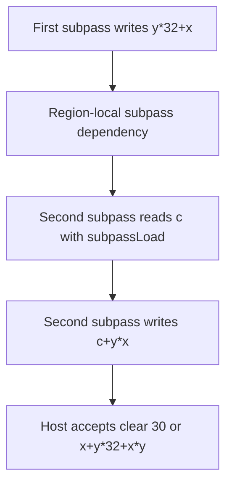

## Overview

**Core question:** Do values loaded through each tested resource path produce the expected edge derivatives, with fragment output confined to the rendered triangle?

- [`vktShaderHelperInvocationsTests.cpp`](../../../modules/vulkan/shaderexecutor/vktShaderHelperInvocationsTests.cpp#L47-L68) implements the `glsl.helper_invocations` test family and registers six direct test case leaves.
- Five `load_from_*` cases render a constant-valued triangle, expose that first-pass image through a selected buffer or image path, and apply `fwidth()` to the loaded value during a second draw. The edge derivatives depend on helper invocations reading the neighboring covered or uncovered locations correctly.
- `output_variables` uses two subpasses instead. It passes a coordinate-derived fragment output through an input attachment and checks a second coordinate-derived result.
- Every case uses a 32 x 32, single-sample `VK_FORMAT_R32_UINT` target. The host reads the second result back and applies the oracle for the selected test case.

## Background Knowledge

- Fragment derivatives operate on neighboring invocations in a derivative group. A fragment shader that statically executes a derivative operation must launch enough invocations to calculate it, including helper invocations for framebuffer locations that rasterization did not cover when necessary. [`shaders.adoc`](../../../../vulkan-docs/src/chapters/shaders.adoc#L3636-L3647)
- `fwidth(p)` is `abs(dFdx(p)) + abs(dFdy(p))`. For a value that changes from `84` inside this triangle to `21` outside it, one changing axis contributes `63` and two changing axes contribute `126`. [`shaders.adoc`](../../../../vulkan-docs/src/chapters/shaders.adoc#L3660-L3679), [`shaders.adoc`](../../../../vulkan-docs/src/chapters/shaders.adoc#L3711-L3713)
- Helper invocations may calculate values used by covered fragments, but their fragment output does not affect the framebuffer. This distinction lets the load cases use edge derivatives while also checking that pixels outside the triangle retain the second-pass clear value. [`shaders.adoc`](../../../../vulkan-docs/src/chapters/shaders.adoc#L3729-L3752)

## Registration Hierarchy

```text
glsl.helper_invocations
├── load_from_ssbo
├── load_from_address
├── load_from_ubo
├── load_from_image
├── load_from_texture
└── output_variables
```

The factory adds these six test case leaves directly under the test family. Both default mustpass profiles contain the same six names: [`vk-default/glsl.txt`](../../../mustpass/main/vk-default/glsl.txt#L7177-L7182) and [`vksc-default/glsl.txt`](../../../mustpass/main/vksc-default/glsl.txt#L6258-L6263).

## Parameter Dimensions and Observed Values

| Dimension | Registered values | Meaning in this test | Evidence |
|---|---|---|---|
| Behavior leaf | `load_from_ssbo`, `load_from_address`, `load_from_ubo`, `load_from_image`, `load_from_texture`, `output_variables` | Selects the second fragment shader, the input transport, and one of two host oracles. | [`TestType` and `TestParam`](../../../modules/vulkan/shaderexecutor/vktShaderHelperInvocationsTests.cpp#L55-L68), [`addShaderHelperInvocationsTests()`](../../../modules/vulkan/shaderexecutor/vktShaderHelperInvocationsTests.cpp#L615-L630) |
| Render target | 32 x 32, `VK_FORMAT_R32_UINT`, one sample | Provides 1,024 integer pixels for the first-pass pattern and final readback. | [`iterate()` image setup](../../../modules/vulkan/shaderexecutor/vktShaderHelperInvocationsTests.cpp#L162-L208) |
| First-pass values | Clear `21`; triangle value `84` for the load cases; coordinate value `y*32+x` for `output_variables` | Produces the `63` step used by the derivative oracle or the per-pixel value used by the input-attachment oracle. | [Clear values](../../../modules/vulkan/shaderexecutor/vktShaderHelperInvocationsTests.cpp#L162-L170), [first fragment shader](../../../modules/vulkan/shaderexecutor/vktShaderHelperInvocationsTests.cpp#L541-L549) |
| Final-pass values | Clear `30`; allowed load-case outputs `0`, `63`, and `126`; `output_variables` result `x+y*32+x*y` | Distinguishes untouched pixels, constant derivative quads, one-axis edges, two-axis edges, and the input-attachment arithmetic path. | [Load-case verification](../../../modules/vulkan/shaderexecutor/vktShaderHelperInvocationsTests.cpp#L407-L439), [`output_variables` verification](../../../modules/vulkan/shaderexecutor/vktShaderHelperInvocationsTests.cpp#L384-L406) |
| Input transport | Storage buffer, buffer device address, uniform buffer, storage image, combined image sampler, or input attachment | Changes how the second fragment shader obtains first-pass data. | [Constructor configuration](../../../modules/vulkan/shaderexecutor/vktShaderHelperInvocationsTests.cpp#L95-L142) |
| Pass structure | Two render passes for `load_from_*`; two subpasses in one render pass for `output_variables` | Selects explicit copy/barrier handling or a subpass dependency and input attachment. | [Command recording](../../../modules/vulkan/shaderexecutor/vktShaderHelperInvocationsTests.cpp#L282-L353), [`setupRenderPass()`](../../../modules/vulkan/shaderexecutor/vktShaderHelperInvocationsTests.cpp#L450-L504) |

## Behavior Parameters

The primary behavioral axis is the test case leaf. Five leaves keep the derivative oracle and change the resource access path. The sixth changes both the shader behavior and the oracle to cover fragment output carried through an input attachment.

### `load_from_ssbo`: storage-buffer load

The first image is copied to a 4,096-byte buffer bound as a read-only `std430` storage buffer. The second fragment shader calculates a row-major index and applies `fwidth()` to `v[i]`. This is the baseline load path and supplies the configuration defaults shared by the other load cases. [Configuration](../../../modules/vulkan/shaderexecutor/vktShaderHelperInvocationsTests.cpp#L101-L110), [shader](../../../modules/vulkan/shaderexecutor/vktShaderHelperInvocationsTests.cpp#L551-L559)

### `load_from_address`: buffer-reference load

This leaf reads the same copied buffer through a device address. The shader requires `GL_EXT_buffer_reference`; the host puts the 64-bit address in a fragment-stage push constant instead of binding a descriptor set. The derivative and host oracle remain the same as in `load_from_ssbo`. [Configuration](../../../modules/vulkan/shaderexecutor/vktShaderHelperInvocationsTests.cpp#L112-L117), [address and push constant](../../../modules/vulkan/shaderexecutor/vktShaderHelperInvocationsTests.cpp#L197-L213), [shader](../../../modules/vulkan/shaderexecutor/vktShaderHelperInvocationsTests.cpp#L560-L570)

### `load_from_ubo`: uniform-buffer load

The copied image is exposed as `uvec4 v[32*8]` in a uniform buffer. The shader maps each pixel to a vector element and selects the component corresponding to `x % 4` before calling `fwidth()`. This preserves the same 1,024 scalar values while exercising uniform-buffer layout and indexing. [Configuration](../../../modules/vulkan/shaderexecutor/vktShaderHelperInvocationsTests.cpp#L118-L122), [shader](../../../modules/vulkan/shaderexecutor/vktShaderHelperInvocationsTests.cpp#L571-L579)

### `load_from_image`: storage-image load

The first color image remains an image and gains `VK_IMAGE_USAGE_STORAGE_BIT`. The second shader reads the current `r32ui` texel with `imageLoad()` and applies `fwidth()` to its red component. No image-to-buffer copy is needed for the shader input. [Configuration](../../../modules/vulkan/shaderexecutor/vktShaderHelperInvocationsTests.cpp#L123-L128), [shader](../../../modules/vulkan/shaderexecutor/vktShaderHelperInvocationsTests.cpp#L580-L587)

### `load_from_texture`: sampled-texture load

The first image is bound with a sampler as a `usampler2D`. The shader derives normalized coordinates from `gl_FragCoord.xy / 32`, samples the source, and applies `fwidth()` to the returned red value. This leaf exercises the sampled-image path while retaining the same derivative histogram. [Configuration](../../../modules/vulkan/shaderexecutor/vktShaderHelperInvocationsTests.cpp#L129-L135), [sampler and descriptor setup](../../../modules/vulkan/shaderexecutor/vktShaderHelperInvocationsTests.cpp#L214-L247), [shader](../../../modules/vulkan/shaderexecutor/vktShaderHelperInvocationsTests.cpp#L588-L596)

### `output_variables`: subpass output and input-attachment load

The first subpass writes `y*32+x` to one attachment. The second subpass reads that value through `subpassLoad()` and writes `c+y*x` to the final attachment. A region-local subpass dependency makes the color write available to the input-attachment read. This leaf does not call `fwidth()` and uses a per-pixel arithmetic oracle rather than the load-case histogram. [Shaders](../../../modules/vulkan/shaderexecutor/vktShaderHelperInvocationsTests.cpp#L541-L549), [input-attachment shader](../../../modules/vulkan/shaderexecutor/vktShaderHelperInvocationsTests.cpp#L597-L604), [render-pass dependency](../../../modules/vulkan/shaderexecutor/vktShaderHelperInvocationsTests.cpp#L471-L504)

## Shader Analysis

Two walkthroughs are needed because the five `load_from_*` leaves share a derivative structure, while `output_variables` uses a separate two-subpass dataflow with no derivative instruction. `load_from_ssbo` represents the common derivative path; `output_variables` represents the input-attachment path.

### Representative Shader Walkthrough 1

#### Parameter Values Chosen

Representative path:

```text
dEQP-VK.glsl.helper_invocations.load_from_ssbo
```

| Parameter choice | Meaning in this representative case |
|---|---|
| `load_from_ssbo` | Uses the baseline descriptor-backed storage-buffer path for the first-pass image. |
| 32 x 32 `VK_FORMAT_R32_UINT` | Makes each source pixel one `uint` in a 1,024-element row-major buffer. |

#### Purpose

This path checks whether derivative-group invocations, including helper invocations at triangle edges, can read the copied first-pass value from an SSBO. The final output must contain only the derivative values implied by the `21` to `84` boundary, while uncovered pixels remain at the second-pass clear value.

#### Structural Design

| Phase | Fragment behavior | Observable value |
|---|---|---|
| First draw | Write `84` inside the triangle; leave the surrounding attachment at clear value `21`. | A two-valued source image. |
| Transfer | Copy all 1,024 `uint` values to binding 0. | SSBO `v[]`. |
| Second draw | Load `v[i]`, calculate `fwidth()`, and write the converted result. | `0`, `63`, or `126` on covered fragments. |
| Host check | Include untouched final-clear pixels and scan the full image. | Only `0`, `30`, `63`, or `126`. |

#### Shader Code

##### First-Pass Fragment Shader

```glsl
#version 450
layout(location = 0) out uint outColor;
void main (void)
{
    /// The source image contains 84 inside the triangle and the render-pass clear value 21 outside it.
    outColor = 84;
}
```

##### Second-Pass Fragment Shader

```glsl
#version 450
layout(location = 0) out uint outColor;
/// Binding 0 is a read-only std430 storage buffer containing the 32x32 first-pass image in row-major order.
layout(std430, binding=0) readonly buffer Input { uint v[]; };
void main (void)
{
    /// Read the value at this fragment coordinate, then compute its quad derivative width.
    uint i = uint(gl_FragCoord.y)*32+uint(gl_FragCoord.x);
    outColor = uint(fwidth(v[i]));
}
```

#### Additional Info

- The first-pass fragment shader stays fixed across all five `load_from_*` leaves. It creates the `84` versus `21` step that the second pass observes.
- The vertex shader also stays fixed. It generates the three triangle vertices from `gl_VertexIndex`, so no vertex buffer participates in the test. [`initPrograms()`](../../../modules/vulkan/shaderexecutor/vktShaderHelperInvocationsTests.cpp#L531-L549)

#### Parameter Variation Summary

| Parameter dimension | Shader-level variation from this shader | Evidence |
|---|---|---|
| `load_from_address` | Replaces binding 0 with a buffer reference delivered through a push constant; indexing and `fwidth()` stay equivalent. | [Source](../../../modules/vulkan/shaderexecutor/vktShaderHelperInvocationsTests.cpp#L560-L570) |
| `load_from_ubo` | Packs four scalar pixels per `uvec4` uniform element and selects one component before `fwidth()`. | [Source](../../../modules/vulkan/shaderexecutor/vktShaderHelperInvocationsTests.cpp#L571-L579) |
| `load_from_image` | Replaces the buffer load with `imageLoad()` from an `r32ui` storage image. | [Source](../../../modules/vulkan/shaderexecutor/vktShaderHelperInvocationsTests.cpp#L580-L587) |
| `load_from_texture` | Replaces the buffer load with a `usampler2D` sample at normalized fragment coordinates. | [Source](../../../modules/vulkan/shaderexecutor/vktShaderHelperInvocationsTests.cpp#L588-L596) |
| `output_variables` | Uses `subpassLoad()` and coordinate arithmetic instead of `fwidth()`; Walkthrough 2 covers this separate shape. | [Source](../../../modules/vulkan/shaderexecutor/vktShaderHelperInvocationsTests.cpp#L597-L604) |

#### SPIR-V

##### First-Pass Fragment Shader

- Status: generated and validated
- Source: reconstructed `GLSL` from this walkthrough
- Stage: `frag`
- Target SPIRV version: `spirv1.0`

<details>
<summary>Click to expand SPIRV asm code</summary>

```llvm
; SPIR-V
; Version: 1.0
; Generator: Khronos Glslang Reference Front End; 11
; Bound: 10
; Schema: 0
               OpCapability Shader
          %1 = OpExtInstImport "GLSL.std.450"
               OpMemoryModel Logical GLSL450
               OpEntryPoint Fragment %main "main" %outColor
               OpExecutionMode %main OriginUpperLeft
               OpSource GLSL 450
               OpName %main "main"
               OpName %outColor "outColor"
               OpDecorate %outColor Location 0
       %void = OpTypeVoid
          %3 = OpTypeFunction %void
       %uint = OpTypeInt 32 0
%_ptr_Output_uint = OpTypePointer Output %uint
   %outColor = OpVariable %_ptr_Output_uint Output
    %uint_84 = OpConstant %uint 84
       %main = OpFunction %void None %3
          %5 = OpLabel
               OpStore %outColor %uint_84
               OpReturn
               OpFunctionEnd
```

</details>

##### Second-Pass Fragment Shader

- Status: generated and validated
- Source: reconstructed `GLSL` from this walkthrough
- Stage: `frag`
- Target SPIRV version: `spirv1.0`

<details>
<summary>Click to expand SPIRV asm code</summary>

```llvm
; SPIR-V
; Version: 1.0
; Generator: Khronos Glslang Reference Front End; 11
; Bound: 40
; Schema: 0
               OpCapability Shader
          %1 = OpExtInstImport "GLSL.std.450"
               OpMemoryModel Logical GLSL450
               OpEntryPoint Fragment %main "main" %gl_FragCoord %outColor
               OpExecutionMode %main OriginUpperLeft
               OpSource GLSL 450
               OpName %main "main"
               OpName %i "i"
               OpName %gl_FragCoord "gl_FragCoord"
               OpName %outColor "outColor"
               OpName %Input "Input"
               OpMemberName %Input 0 "v"
               OpName %_ ""
               OpDecorate %gl_FragCoord BuiltIn FragCoord
               OpDecorate %outColor Location 0
               OpDecorate %_runtimearr_uint ArrayStride 4
               OpDecorate %Input BufferBlock
               OpMemberDecorate %Input 0 NonWritable
               OpMemberDecorate %Input 0 Offset 0
               OpDecorate %_ NonWritable
               OpDecorate %_ Binding 0
               OpDecorate %_ DescriptorSet 0
       %void = OpTypeVoid
          %3 = OpTypeFunction %void
       %uint = OpTypeInt 32 0
%_ptr_Function_uint = OpTypePointer Function %uint
      %float = OpTypeFloat 32
    %v4float = OpTypeVector %float 4
%_ptr_Input_v4float = OpTypePointer Input %v4float
%gl_FragCoord = OpVariable %_ptr_Input_v4float Input
     %uint_1 = OpConstant %uint 1
%_ptr_Input_float = OpTypePointer Input %float
    %uint_32 = OpConstant %uint 32
     %uint_0 = OpConstant %uint 0
%_ptr_Output_uint = OpTypePointer Output %uint
   %outColor = OpVariable %_ptr_Output_uint Output
%_runtimearr_uint = OpTypeRuntimeArray %uint
      %Input = OpTypeStruct %_runtimearr_uint
%_ptr_Uniform_Input = OpTypePointer Uniform %Input
          %_ = OpVariable %_ptr_Uniform_Input Uniform
        %int = OpTypeInt 32 1
      %int_0 = OpConstant %int 0
%_ptr_Uniform_uint = OpTypePointer Uniform %uint
       %main = OpFunction %void None %3
          %5 = OpLabel
          %i = OpVariable %_ptr_Function_uint Function
         %15 = OpAccessChain %_ptr_Input_float %gl_FragCoord %uint_1
         %16 = OpLoad %float %15
         %17 = OpConvertFToU %uint %16
         %19 = OpIMul %uint %17 %uint_32
         %21 = OpAccessChain %_ptr_Input_float %gl_FragCoord %uint_0
         %22 = OpLoad %float %21
         %23 = OpConvertFToU %uint %22
         %24 = OpIAdd %uint %19 %23
               OpStore %i %24
         %33 = OpLoad %uint %i
         %35 = OpAccessChain %_ptr_Uniform_uint %_ %int_0 %33
         %36 = OpLoad %uint %35
         %37 = OpConvertUToF %float %36
         %38 = OpFwidth %float %37
         %39 = OpConvertFToU %uint %38
               OpStore %outColor %39
               OpReturn
               OpFunctionEnd
```

</details>

### Representative Shader Walkthrough 2

#### Parameter Values Chosen

Representative path:

```text
dEQP-VK.glsl.helper_invocations.output_variables
```

| Parameter choice | Meaning in this representative case |
|---|---|
| `output_variables` | Selects two subpasses, a coordinate-valued first output, and an input-attachment read in the second fragment shader. |
| Binding 0, input attachment index 0 | Maps the first subpass color output to `usubpassInput image` in the second subpass. |

#### Purpose

This path checks that a value written by the first fragment shader can be read at the same fragment location through an input attachment and combined with a second coordinate expression. Its per-pixel oracle separates this behavior from the derivative histogram used by the five load cases.

#### Structural Design



#### Shader Code

##### First-Subpass Fragment Shader

```glsl
#version 450
layout(location = 0) out uint outColor;
void main (void)
{
    outColor = 84;
    /// This assignment replaces 84 for output_variables and identifies the current source pixel.
    outColor = uint(gl_FragCoord.y)*32+uint(gl_FragCoord.x);
}
```

##### Second-Subpass Fragment Shader

```glsl
#version 450
layout(location = 0) out uint outColor;
/// Binding 0 reads the first subpass color attachment at the current fragment location.
layout(input_attachment_index=0, binding=0) uniform usubpassInput image;
void main (void)
{
    /// Combine the first-subpass value with a coordinate-dependent product for host verification.
    uint c = subpassLoad(image).x;
    outColor = c + uint(gl_FragCoord.y) * uint(gl_FragCoord.x);
}
```

#### Additional Info

- The first-subpass shader differs from the load-case writer by appending the coordinate assignment after `outColor = 84`; the later assignment is the value stored for this leaf.
- Both shaders draw the same generated triangle. The second subpass reads attachment 0 and writes attachment 1, with a `VK_DEPENDENCY_BY_REGION_BIT` dependency between them. [`setupRenderPass()`](../../../modules/vulkan/shaderexecutor/vktShaderHelperInvocationsTests.cpp#L471-L504)

#### Parameter Variation Summary

| Parameter dimension | Shader-level variation from this shader | Evidence |
|---|---|---|
| Behavior leaf | Only `output_variables` uses the coordinate-valued writer and `usubpassInput`; all five `load_from_*` leaves use the constant writer and `fwidth()` readers. | [`initPrograms()`](../../../modules/vulkan/shaderexecutor/vktShaderHelperInvocationsTests.cpp#L541-L607) |

#### SPIR-V

##### First-Subpass Fragment Shader

- Status: generated and validated
- Source: reconstructed `GLSL` from this walkthrough
- Stage: `frag`
- Target SPIRV version: `spirv1.0`

<details>
<summary>Click to expand SPIRV asm code</summary>

```llvm
; SPIR-V
; Version: 1.0
; Generator: Khronos Glslang Reference Front End; 11
; Bound: 26
; Schema: 0
               OpCapability Shader
          %1 = OpExtInstImport "GLSL.std.450"
               OpMemoryModel Logical GLSL450
               OpEntryPoint Fragment %main "main" %outColor %gl_FragCoord
               OpExecutionMode %main OriginUpperLeft
               OpSource GLSL 450
               OpName %main "main"
               OpName %outColor "outColor"
               OpName %gl_FragCoord "gl_FragCoord"
               OpDecorate %outColor Location 0
               OpDecorate %gl_FragCoord BuiltIn FragCoord
       %void = OpTypeVoid
          %3 = OpTypeFunction %void
       %uint = OpTypeInt 32 0
%_ptr_Output_uint = OpTypePointer Output %uint
   %outColor = OpVariable %_ptr_Output_uint Output
    %uint_84 = OpConstant %uint 84
      %float = OpTypeFloat 32
    %v4float = OpTypeVector %float 4
%_ptr_Input_v4float = OpTypePointer Input %v4float
%gl_FragCoord = OpVariable %_ptr_Input_v4float Input
     %uint_1 = OpConstant %uint 1
%_ptr_Input_float = OpTypePointer Input %float
    %uint_32 = OpConstant %uint 32
     %uint_0 = OpConstant %uint 0
       %main = OpFunction %void None %3
          %5 = OpLabel
               OpStore %outColor %uint_84
         %16 = OpAccessChain %_ptr_Input_float %gl_FragCoord %uint_1
         %17 = OpLoad %float %16
         %18 = OpConvertFToU %uint %17
         %20 = OpIMul %uint %18 %uint_32
         %22 = OpAccessChain %_ptr_Input_float %gl_FragCoord %uint_0
         %23 = OpLoad %float %22
         %24 = OpConvertFToU %uint %23
         %25 = OpIAdd %uint %20 %24
               OpStore %outColor %25
               OpReturn
               OpFunctionEnd
```

</details>

##### Second-Subpass Fragment Shader

- Status: generated and validated
- Source: reconstructed `GLSL` from this walkthrough
- Stage: `frag`
- Target SPIRV version: `spirv1.0`

<details>
<summary>Click to expand SPIRV asm code</summary>

```llvm
; SPIR-V
; Version: 1.0
; Generator: Khronos Glslang Reference Front End; 11
; Bound: 38
; Schema: 0
               OpCapability Shader
               OpCapability InputAttachment
          %1 = OpExtInstImport "GLSL.std.450"
               OpMemoryModel Logical GLSL450
               OpEntryPoint Fragment %main "main" %outColor %gl_FragCoord
               OpExecutionMode %main OriginUpperLeft
               OpSource GLSL 450
               OpName %main "main"
               OpName %c "c"
               OpName %image "image"
               OpName %outColor "outColor"
               OpName %gl_FragCoord "gl_FragCoord"
               OpDecorate %image Binding 0
               OpDecorate %image DescriptorSet 0
               OpDecorate %image InputAttachmentIndex 0
               OpDecorate %outColor Location 0
               OpDecorate %gl_FragCoord BuiltIn FragCoord
       %void = OpTypeVoid
          %3 = OpTypeFunction %void
       %uint = OpTypeInt 32 0
%_ptr_Function_uint = OpTypePointer Function %uint
          %9 = OpTypeImage %uint SubpassData 0 0 0 2 Unknown
%_ptr_UniformConstant_9 = OpTypePointer UniformConstant %9
      %image = OpVariable %_ptr_UniformConstant_9 UniformConstant
        %int = OpTypeInt 32 1
      %int_0 = OpConstant %int 0
      %v2int = OpTypeVector %int 2
         %16 = OpConstantComposite %v2int %int_0 %int_0
     %v4uint = OpTypeVector %uint 4
     %uint_0 = OpConstant %uint 0
%_ptr_Output_uint = OpTypePointer Output %uint
   %outColor = OpVariable %_ptr_Output_uint Output
      %float = OpTypeFloat 32
    %v4float = OpTypeVector %float 4
%_ptr_Input_v4float = OpTypePointer Input %v4float
%gl_FragCoord = OpVariable %_ptr_Input_v4float Input
     %uint_1 = OpConstant %uint 1
%_ptr_Input_float = OpTypePointer Input %float
       %main = OpFunction %void None %3
          %5 = OpLabel
          %c = OpVariable %_ptr_Function_uint Function
         %12 = OpLoad %9 %image
         %18 = OpImageRead %v4uint %12 %16
         %20 = OpCompositeExtract %uint %18 0
               OpStore %c %20
         %23 = OpLoad %uint %c
         %30 = OpAccessChain %_ptr_Input_float %gl_FragCoord %uint_1
         %31 = OpLoad %float %30
         %32 = OpConvertFToU %uint %31
         %33 = OpAccessChain %_ptr_Input_float %gl_FragCoord %uint_0
         %34 = OpLoad %float %33
         %35 = OpConvertFToU %uint %34
         %36 = OpIMul %uint %32 %35
         %37 = OpIAdd %uint %23 %36
               OpStore %outColor %37
               OpReturn
               OpFunctionEnd
```

</details>

## Runtime Execution and Result Checking

- The instance creates two 32 x 32 `VK_FORMAT_R32_UINT` images, a 4,096-byte host-visible input buffer, and a host-visible final buffer. It also creates the descriptor, sampler, or device-address state selected by the leaf. [`iterate()` resource setup](../../../modules/vulkan/shaderexecutor/vktShaderHelperInvocationsTests.cpp#L162-L248)
- In each `load_from_*` case, the first render pass clears the source image to `21` and draws the triangle with value `84`. Buffer cases copy that image to the input buffer; image and texture cases read the image directly. Barriers make the first-pass writes or transfer writes available to the second fragment shader. [Command recording](../../../modules/vulkan/shaderexecutor/vktShaderHelperInvocationsTests.cpp#L304-L352)
- In `output_variables`, one render pass contains two subpasses and two attachments. The first draw writes the coordinate value, `vkCmdNextSubpass` advances to the second subpass, and the second draw reads the first attachment before writing the final one. [Two-subpass recording](../../../modules/vulkan/shaderexecutor/vktShaderHelperInvocationsTests.cpp#L284-L303)
- After either path, the command buffer makes the final color writes available to transfer, copies the final image to the final buffer, makes the transfer visible to the host, submits, waits, and invalidates the host allocations. [Readback and submit](../../../modules/vulkan/shaderexecutor/vktShaderHelperInvocationsTests.cpp#L355-L382)
- For a load case, all 1,024 pixels must be one of `0`, `30`, `63`, or `126`. The image must contain more than 120 zeros, more than 30 values of `63`, and more than 3 values of `126`. The verifier also treats `inputData[i] == 21 && finalData[i] != 30` as evidence of a helper-invocation framebuffer write. This comparison is source-backed for the three buffer leaves because their first-pass image is copied into `inputBuffer`. In `load_from_image` and `load_from_texture`, the source still reads `inputBuffer` even though it never populated that buffer from the image, so this particular cross-check is not reliable for those two leaves. [Input transfer branch](../../../modules/vulkan/shaderexecutor/vktShaderHelperInvocationsTests.cpp#L304-L335), [histogram and helper-write checks](../../../modules/vulkan/shaderexecutor/vktShaderHelperInvocationsTests.cpp#L407-L439)
- For `output_variables`, each pixel must be either final clear `30` or `x+y*32+x*y`. The verifier uses the observed clear value to decide whether the triangle covered that pixel. [`output_variables` oracle](../../../modules/vulkan/shaderexecutor/vktShaderHelperInvocationsTests.cpp#L384-L406)
- On failure, the test logs both the input and final images and returns `Fail`. A passing load case reports the number of pixels equal to `63`; `output_variables` reports `Pass`. [Result reporting](../../../modules/vulkan/shaderexecutor/vktShaderHelperInvocationsTests.cpp#L404-L447)

## Failure Meaning

### Failure Cause Mapping

| If this behavior parameter value fails | Possible failure cause(s) |
|---|---|
| `load_from_ssbo` | Storage-buffer transfer, descriptor access, indexing, derivative evaluation, or helper-invocation participation/output suppression. |
| `load_from_address` | Device-address setup or push-constant transport, buffer-reference access, derivative evaluation, or helper-invocation participation/output suppression. |
| `load_from_ubo` | Uniform-buffer layout/component selection, descriptor access, derivative evaluation, or helper-invocation participation/output suppression. |
| `load_from_image` | Storage-image visibility or `imageLoad()`, derivative evaluation, or helper-invocation participation/output suppression. |
| `load_from_texture` | Sampled-image visibility, sampler/coordinate handling, texture access, derivative evaluation, or helper-invocation participation/output suppression. |
| `output_variables` | First-subpass output, subpass dependency, input-attachment read, coordinate arithmetic, or final attachment write. |
| Any executed leaf | Shared pipeline creation, draw, synchronization, final image copy, host visibility, or host verification can also prevent the expected result. |

### Cause Analysis

#### First-pass data access failures

**Possible failure symptoms:** One load case produces a value outside `0`, `30`, `63`, and `126`, misses one of the required minimum histogram counts, or fails while its sibling resource paths pass. The failing leaf identifies the transport under test but does not isolate descriptor setup, synchronization, addressing, or the shader load instruction.

**Possible implementation causes:** The implementation may expose stale or incorrectly addressed first-pass data through the selected buffer, image, sampler, or device-address path. Descriptor interpretation, image-to-buffer transfer visibility, attachment-write visibility, uniform packing, and sampled-coordinate handling differ by leaf and can produce the same host symptom.

#### Derivative or helper-invocation failures

**Possible failure symptoms:** Any `load_from_*` leaf can produce the wrong edge histogram or omit expected `63` or `126` values. The three buffer leaves can also report a final change where the copied first-pass value stayed at clear value `21`. For image and texture leaves, the same source check reads an input buffer that does not contain the first-pass image and can therefore produce a misleading result.

**Possible implementation causes:** The fragment implementation may fail to launch or retain the invocations needed by `fwidth()`, may provide the wrong loaded value to a derivative-group member, may calculate the derivative incorrectly, or may allow a helper invocation to affect the framebuffer. The histogram cannot distinguish those mechanisms by itself. An image- or texture-leaf failure in the helper-write cross-check can instead come from the unpopulated host input buffer; that source defect remains unresolved.

#### Subpass output and input-attachment failures

**Possible failure symptoms:** `output_variables` returns a covered-pixel value other than `x+y*32+x*y`, or an uncovered pixel differs from clear value `30`.

**Possible implementation causes:** The first subpass may write an incorrect coordinate value, the region-local dependency may fail to make that output visible, `subpassLoad()` may read the wrong value, or the second shader or attachment write may produce the wrong arithmetic result. The host oracle observes the combined path and does not identify one stage of it.

#### Shared graphics, copyback, or host-oracle failures

**Possible failure symptoms:** Several or all leaves fail with corrupted final images, resource or pipeline setup errors, or values that do not fit either leaf-specific oracle.

**Possible implementation causes:** Shared graphics pipeline creation, render-pass behavior, command synchronization, the final image-to-buffer copy, host cache invalidation, or shader compilation can affect every leaf. Source-level and driver-level investigation is needed before assigning such a failure to the named GLSL operation.

## Case Pruning

### Requirement-based pruning

- `load_from_address` calls `requireDeviceFunctionality("VK_KHR_buffer_device_address")`. If the functionality is unavailable, the framework reports that leaf as unsupported before creating the instance. [`checkSupport()`](../../../modules/vulkan/shaderexecutor/vktShaderHelperInvocationsTests.cpp#L525-L529)
- That leaf also requests device-address-capable memory and adds `VK_BUFFER_USAGE_SHADER_DEVICE_ADDRESS_BIT`; these requirements do not apply to the other five leaves. [Buffer allocation](../../../modules/vulkan/shaderexecutor/vktShaderHelperInvocationsTests.cpp#L196-L213)
- The source declares no other leaf-specific support check. The remaining leaves still depend on successful creation and use of their source-defined formats, usage flags, descriptors, shaders, and render-pass operations.

### Design-based pruning

- The source registers exactly six hand-selected leaves rather than a cross product of resource types, pass structures, formats, dimensions, or sample counts. The format, extent, sample count, triangle, and clear values remain fixed so the load cases share one derivative oracle. [`addShaderHelperInvocationsTests()`](../../../modules/vulkan/shaderexecutor/vktShaderHelperInvocationsTests.cpp#L615-L630), [fixed render setup](../../../modules/vulkan/shaderexecutor/vktShaderHelperInvocationsTests.cpp#L162-L183)
- `output_variables` is intentionally separate from the five `fwidth()` leaves. It uses an input attachment and arithmetic oracle, so combining it with the load-case histogram would not represent the implemented test design.

## Key Takeaways

- The five `load_from_*` leaves hold the geometry and derivative oracle constant while changing how derivative-group invocations obtain first-pass values.
- The accepted load-case image is a four-value pattern: final clear `30`, interior derivative `0`, one-axis edge derivative `63`, and two-axis edge derivative `126`. Minimum counts keep the test from passing on a degenerate subset of that pattern.
- For SSBO, device-address, and UBO leaves, comparing the copied first-pass clear region with the final clear region checks that helper invocations did not affect the framebuffer. The image and texture leaves execute the same host check against an unpopulated input buffer, so the current source does not provide the same reliable correspondence for those leaves.
- `output_variables` covers a different path: a first-subpass fragment output becomes a second-subpass input attachment and must satisfy a coordinate-based host oracle.
- A failed leaf narrows the affected mechanism, but shared draw, synchronization, compiler, copyback, and host-verification paths remain possible causes. See `Failure Meaning` before attributing a failure to one operation.

## Source Reference Appendix

| Entry point | Link | Why it matters |
|---|---|---|
| GLSL test-category registration | [`vktTestPackage.cpp`](../../../modules/vulkan/vktTestPackage.cpp#L1274-L1279) | Adds the `helper_invocations` test family under `glsl`. |
| Public factory | [`vktShaderHelperInvocationsTests.hpp`](../../../modules/vulkan/shaderexecutor/vktShaderHelperInvocationsTests.hpp#L29-L34) | Declares the test-family factory. |
| Behavior types and instance configuration | [`TestType` and constructor](../../../modules/vulkan/shaderexecutor/vktShaderHelperInvocationsTests.cpp#L55-L142) | Maps each leaf to its resource, descriptor, and pass structure. |
| Runtime execution and verification | [`HelperInvocationsTestInstance::iterate()`](../../../modules/vulkan/shaderexecutor/vktShaderHelperInvocationsTests.cpp#L145-L448) | Creates resources, records both draws, reads the image back, and applies both host oracles. |
| Render-pass and subpass construction | [`setupRenderPass()`](../../../modules/vulkan/shaderexecutor/vktShaderHelperInvocationsTests.cpp#L450-L504) | Defines the one-pass and two-subpass attachment layouts and dependency. |
| Support check and generated GLSL | [`HelperInvocationsTestCase`](../../../modules/vulkan/shaderexecutor/vktShaderHelperInvocationsTests.cpp#L507-L613) | Gates buffer-device-address use and emits the vertex and fragment shaders. |
| Leaf registration and test-family factory | [`addShaderHelperInvocationsTests()` and factory](../../../modules/vulkan/shaderexecutor/vktShaderHelperInvocationsTests.cpp#L615-L637) | Registers the six exact leaves under `glsl.helper_invocations`. |
| Default Vulkan mustpass coverage | [`vk-default/glsl.txt`](../../../mustpass/main/vk-default/glsl.txt#L7177-L7182) | Confirms all six `dEQP-VK` paths. |
| Vulkan SC mustpass coverage | [`vksc-default/glsl.txt`](../../../mustpass/main/vksc-default/glsl.txt#L6258-L6263) | Confirms the same six `dEQP-VKSC` paths. |
| Derivative and helper-invocation semantics | [`shaders.adoc`](../../../../vulkan-docs/src/chapters/shaders.adoc#L3636-L3752) | Defines derivative grouping, helper invocation launch, and framebuffer side-effect rules used by the test rationale. |
