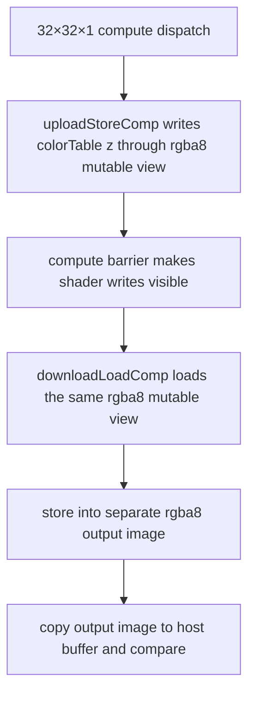

## Overview

**Core question:** Can an image created in one color format be accessed through a distinct mutable-format view and still produce the expected pixels after transfer, storage-image, sampled-image, or color-attachment operations?

[`vktImageMutableTests.cpp`](../../../modules/vulkan/image/vktImageMutableTests.cpp) implements two sibling `image` families:

- `image.mutable` allocates an ordinary optimal-tiled image with `VK_IMAGE_CREATE_MUTABLE_FORMAT_BIT`.
- `image.swapchain_mutable` acquires an image from a mutable-format swapchain and exercises the same upload/download routes.

Each leaf selects an image/view format pair, an upload route, and a download route. Ordinary-image leaves additionally cover an optional image-format list, three resolve-attachment arrangements, and a one-layer load-op-clear case. The test writes a layer-dependent reference color, reads it through the selected route, copies the observation to host-visible memory, and compares every pixel with a generated reference.

## Background Knowledge

For the shared concept image/view/format interpretation, see [Background Knowledge](../../categories/image.md#background-knowledge) of the `image` page.

- `VK_IMAGE_CREATE_MUTABLE_FORMAT_BIT` permits an image view whose format differs from the image format, but the view format must satisfy Vulkan's format-compatibility rules. `VkImageFormatListCreateInfo`, when chained to image creation, restricts the allowed view formats to its list. The CTS generator uses **distinct pairs having equal mapped pixel size** as its pair-selection predicate; that source-level predicate is not a replacement for the Vulkan compatibility rules. See [mutable image creation and image views](../../../../vulkan-docs/src/chapters/resources.adoc#L4148-L4154) and [format-list validity](../../../../vulkan-docs/src/chapters/resources.adoc#L2752-L2762).
- `VK_IMAGE_CREATE_EXTENDED_USAGE_BIT` (from Vulkan 1.1 / `VK_KHR_maintenance2`) permits an image usage supported by a view format even when the creation format does not support it. The test uses it when maintenance2 is available, and chains `VkImageViewUsageCreateInfo` to storage, sampled, or color-attachment views as appropriate. See [extended usage](../../../../vulkan-docs/src/chapters/resources.adoc#L1822-L1832).
- `VK_SWAPCHAIN_CREATE_MUTABLE_FORMAT_BIT_KHR` makes swapchain images mutable-format images and requires a nonempty `VkImageFormatListCreateInfo` that includes the swapchain image format; every listed view format must be compatible. The swapchain test always supplies its two-format list. See [swapchain requirements](../../../../vulkan-docs/src/chapters/VK_KHR_surface/wsi.adoc#L6203-L6224).

## Registration Hierarchy

```text
image.mutable
├── 2d
└── 2d_array

image.swapchain_mutable
├── xlib
├── xcb
├── wayland
├── android
├── win32
├── metal
├── headless
├── direct_drm
└── direct
```

Both roots are added under `image` by [`createImageTests()`](../../../modules/vulkan/image/vktImageTests.cpp#L61-L100). The ordinary factory creates generated leaves directly below `2d` and `2d_array`. The swapchain factory iterates every `vk::wsi::Type` before `TYPE_LAST`, then adds the same two image-type groups and generated leaves below each WSI group ([`createSwapchainImageMutableTests()`](../../../modules/vulkan/image/vktImageMutableTests.cpp#L2380-L2446)).

The checked-in default mustpass inventory is split by family: [`image/mutable.txt`](../../../mustpass/main/vk-default/image/mutable.txt) contains **10,118 `image.mutable` leaves**, while [`image/swapchain-mutable.txt`](../../../mustpass/main/vk-default/image/swapchain-mutable.txt) contains **3,240 `image.swapchain_mutable` leaves**. The latter includes the nine WSI paths shown above; platform availability can still prune individual executions.

## Parameter Dimensions and Observed Values

| Dimension | Values observed in source | Effect |
|---|---|---|
| Family | `image.mutable`; `image.swapchain_mutable` | Selects an allocated image or an acquired swapchain image. |
| Image type | `2d`, `2d_array` | Both use a 32×32 extent; `2d` has one layer and `2d_array` has four. |
| Ordinary format set | 23 formats: 32/16-bit float; 32/16/8-bit uint and sint; 8-bit RGBA/BGRA UNORM, SNORM, and sRGB | Supplies both ordered members of the ordinary format pair. |
| Swapchain format set | Six 8-bit RGBA/BGRA UNORM, SNORM, and sRGB formats | Supplies both members of the swapchain pair. |
| Pair filter | Ordered, distinct pairs with equal mapped pixel size | Selects candidate reinterpretation pairs; it does not itself prove spec compatibility. |
| Upload | `clear`, `copy`, `store`, `draw` | Writes through transfer clear, buffer-to-image copy, compute `imageStore`, or color attachment rendering. |
| Download | `copy`, `load`, `texture` | Reads through image-to-buffer copy, compute `imageLoad`, or sampled `texelFetch`. |
| Ordinary format-list variant | no suffix; `_format_list` | Omits or chains `VkImageFormatListCreateInfo` with the image and view formats. |
| Resolve variant | `_resolve`, `_resolve_mutable_resolve_att`, `_resolve_mutable_color_att` | Uses draw/copy only; chooses whether both attachments, only the resolve attachment, or only the multisampled color attachment is mutable. |
| Load-op-clear variant | `_load_op_clear` | A 2D draw/copy case only; draws a smaller quad so the render pass's `VK_ATTACHMENT_LOAD_OP_CLEAR` result remains observable outside it. |

The normal route matrix is generated for every permitted pair. `store` is skipped when the view format is not image-load/store capable; `load` and `texture` are likewise skipped for such a view format. The support callback then checks route-specific optimal-tiling feature bits ([`checkSupport()`](../../../modules/vulkan/image/vktImageMutableTests.cpp#L1774-L1856)).

## Behavior Parameters

### `image.mutable`: allocated mutable image

The executor creates an optimal-tiled image in `imageFormat`, sets `VK_IMAGE_CREATE_MUTABLE_FORMAT_BIT`, and, when maintenance2 is supported, also sets `VK_IMAGE_CREATE_EXTENDED_USAGE_BIT`. It creates the access view in `viewFormat`. In the resolve variants it creates a multisampled color image and a single-sample resolve image; the variant determines which one has mutable-format creation flags. The normal routes add both no-list and `_format_list` leaves.

### `image.swapchain_mutable`: acquired swapchain image

The test creates a surface, finds both selected formats in that surface's format list, checks the requested usage and array-layer limit, then creates a swapchain with `VK_SWAPCHAIN_CREATE_MUTABLE_FORMAT_BIT_KHR` and a two-entry format list. It acquires one image, runs the selected route, reads it back, and does **not** present it. Swapchain leaves always use `_format_list`; they have no resolve or `_load_op_clear` variants.

## Shader Analysis

### Representative Shader Walkthrough 1

#### Parameter Values Chosen

Representative path:

```text
dEQP-VK.image.mutable.2d.b8g8r8a8_snorm_r8g8b8a8_unorm_store_load
```

| Parameter choice | Meaning in this representative case |
|------------------|-------------------------------------|
| `2d` | Creates a 32×32, one-layer image and generates `image2D` declarations with `ivec2` coordinates. |
| `b8g8r8a8_snorm_r8g8b8a8_unorm` | Creates the image as `B8G8R8A8_SNORM` but exposes shader storage views as `R8G8B8A8_UNORM`, whose GLSL format qualifier is `rgba8`. |
| `store_load` | Selects the compute `imageStore` upload followed by a compute `imageLoad` into a separate output image. |

#### Purpose

This case verifies that normalized colors written and read through an `R8G8B8A8_UNORM` storage view of a mutable `B8G8R8A8_SNORM` image survive the complete shader and host-readback path.

#### Structural Design



#### Shader Code

##### Upload Compute Shader

```glsl
#version 450

layout (local_size_x = 1) in;

/// Mutable image view in R8G8B8A8_UNORM; the host binds it at set 0, binding 0 in GENERAL layout.
layout(binding=0, rgba8) writeonly uniform image2D u_image;

/// One reference color per possible array layer; this 2D case dispatches only z = 0.
const vec4 colorTable[] = vec4[](
     vec4(0, 0.4, 0.8, 0.1),
     vec4(0.5, 0.1, 0.9, 0.2),
     vec4(0.2, 0.6, 1, 0.3),
     vec4(0.3, 0.7, 0, 0.4)
);

void main(void)
{
    /// One invocation addresses one texel of the 32 x 32 view.
    ivec2 pos = ivec2(gl_GlobalInvocationID.xy);
    vec4 color = colorTable[gl_GlobalInvocationID.z];
    /// Store normalized RGBA values through the alternate-format view.
    imageStore(u_image, pos, color);
}
```

##### Download Compute Shader

```glsl
#version 450

layout (local_size_x = 1) in;

/// Mutable R8G8B8A8_UNORM view of the B8G8R8A8_SNORM image, bound as the input storage image.
layout(binding=0, rgba8) readonly uniform image2D in_image;
/// Separate non-mutable R8G8B8A8_UNORM output image used for transfer readback.
layout(binding=1, rgba8) writeonly uniform image2D out_image;

void main(void)
{
    /// One invocation forwards one texel without changing its view-format value.
    ivec2 pos = ivec2(gl_GlobalInvocationID.xy);
    imageStore(out_image, pos, imageLoad(in_image, pos));
}
```

#### Additional Info

- The download compute shader varies with image type and view-format class: this case uses two `rgba8 image2D` resources, while array cases use `image2DArray`/`ivec3` and integer formats use signed or unsigned image types. It matters because it transports the value observed through the mutable view into a non-mutable image that can be copied to the host ([source](../../../modules/vulkan/image/vktImageMutableTests.cpp#L469-L500)).
- The host dispatches both shaders as 32×32×1. Before the download dispatch, it makes the upload shader write visible to shader reads and transitions both storage images to `VK_IMAGE_LAYOUT_GENERAL`; afterward it copies the output image to the host buffer ([source](../../../modules/vulkan/image/vktImageMutableTests.cpp#L1627-L1666)).

#### Parameter Variation Summary

| Parameter dimension | Shader-level variation from this shader | Evidence |
|---------------------|------------------------------------------|----------|
| Image type | `2d_array` changes both storage-image types to `image2DArray`, coordinates to `ivec3`, and dispatch depth to four layers; `gl_GlobalInvocationID.z` selects the layer color. | [`initPrograms()`](../../../modules/vulkan/image/vktImageMutableTests.cpp#L414-L500) |
| View format | The view format selects the storage-image format qualifier and `image*`, `iimage*`, or `uimage*` type; integer uploads also use `ivec4` or `uvec4` color tables. | [`initPrograms()`](../../../modules/vulkan/image/vktImageMutableTests.cpp#L414-L484) |
| Upload route | Only `store` generates this upload compute shader; `draw` generates vertex/fragment stages, while transfer `clear` and `copy` need no upload shader. | [`initPrograms()`](../../../modules/vulkan/image/vktImageMutableTests.cpp#L363-L467) |
| Download route | `load` uses `imageLoad` and two storage images; `texture` uses `texelFetch` with a sampler and output storage image, while `copy` needs no download shader. | [`initPrograms()`](../../../modules/vulkan/image/vktImageMutableTests.cpp#L469-L536) |

#### SPIR-V

##### Upload Compute Shader

- Status: generated and validated
- Source: reconstructed `GLSL` from this walkthrough
- Stage: `comp`
- Target SPIRV version: `spirv1.0`

<details>
<summary>Click to expand SPIRV asm code</summary>

```llvm
; SPIR-V
; Version: 1.0
; Generator: Khronos Glslang Reference Front End; 11
; Bound: 56
; Schema: 0
               OpCapability Shader
          %1 = OpExtInstImport "GLSL.std.450"
               OpMemoryModel Logical GLSL450
               OpEntryPoint GLCompute %main "main" %gl_GlobalInvocationID
               OpExecutionMode %main LocalSize 1 1 1
               OpSource GLSL 450
               OpName %main "main"
               OpName %pos "pos"
               OpName %gl_GlobalInvocationID "gl_GlobalInvocationID"
               OpName %color "color"
               OpName %indexable "indexable"
               OpName %u_image "u_image"
               OpDecorate %gl_GlobalInvocationID BuiltIn GlobalInvocationId
               OpDecorate %u_image NonReadable
               OpDecorate %u_image Binding 0
               OpDecorate %u_image DescriptorSet 0
               OpDecorate %gl_WorkGroupSize BuiltIn WorkgroupSize
       %void = OpTypeVoid
          %3 = OpTypeFunction %void
        %int = OpTypeInt 32 1
      %v2int = OpTypeVector %int 2
%_ptr_Function_v2int = OpTypePointer Function %v2int
       %uint = OpTypeInt 32 0
     %v3uint = OpTypeVector %uint 3
%_ptr_Input_v3uint = OpTypePointer Input %v3uint
%gl_GlobalInvocationID = OpVariable %_ptr_Input_v3uint Input
     %v2uint = OpTypeVector %uint 2
      %float = OpTypeFloat 32
    %v4float = OpTypeVector %float 4
%_ptr_Function_v4float = OpTypePointer Function %v4float
     %uint_4 = OpConstant %uint 4
%_arr_v4float_uint_4 = OpTypeArray %v4float %uint_4
    %float_0 = OpConstant %float 0
%float_0_400000006 = OpConstant %float 0.400000006
%float_0_800000012 = OpConstant %float 0.800000012
%float_0_100000001 = OpConstant %float 0.100000001
         %28 = OpConstantComposite %v4float %float_0 %float_0_400000006 %float_0_800000012 %float_0_100000001
  %float_0_5 = OpConstant %float 0.5
%float_0_899999976 = OpConstant %float 0.899999976
%float_0_200000003 = OpConstant %float 0.200000003
         %32 = OpConstantComposite %v4float %float_0_5 %float_0_100000001 %float_0_899999976 %float_0_200000003
%float_0_600000024 = OpConstant %float 0.600000024
    %float_1 = OpConstant %float 1
%float_0_300000012 = OpConstant %float 0.300000012
         %36 = OpConstantComposite %v4float %float_0_200000003 %float_0_600000024 %float_1 %float_0_300000012
%float_0_699999988 = OpConstant %float 0.699999988
         %38 = OpConstantComposite %v4float %float_0_300000012 %float_0_699999988 %float_0 %float_0_400000006
         %39 = OpConstantComposite %_arr_v4float_uint_4 %28 %32 %36 %38
     %uint_2 = OpConstant %uint 2
%_ptr_Input_uint = OpTypePointer Input %uint
%_ptr_Function__arr_v4float_uint_4 = OpTypePointer Function %_arr_v4float_uint_4
         %48 = OpTypeImage %float 2D 0 0 0 2 Rgba8
%_ptr_UniformConstant_48 = OpTypePointer UniformConstant %48
    %u_image = OpVariable %_ptr_UniformConstant_48 UniformConstant
     %uint_1 = OpConstant %uint 1
%gl_WorkGroupSize = OpConstantComposite %v3uint %uint_1 %uint_1 %uint_1
       %main = OpFunction %void None %3
          %5 = OpLabel
        %pos = OpVariable %_ptr_Function_v2int Function
      %color = OpVariable %_ptr_Function_v4float Function
  %indexable = OpVariable %_ptr_Function__arr_v4float_uint_4 Function
         %15 = OpLoad %v3uint %gl_GlobalInvocationID
         %16 = OpVectorShuffle %v2uint %15 %15 0 1
         %17 = OpBitcast %v2int %16
               OpStore %pos %17
         %42 = OpAccessChain %_ptr_Input_uint %gl_GlobalInvocationID %uint_2
         %43 = OpLoad %uint %42
               OpStore %indexable %39
         %46 = OpAccessChain %_ptr_Function_v4float %indexable %43
         %47 = OpLoad %v4float %46
               OpStore %color %47
         %51 = OpLoad %48 %u_image
         %52 = OpLoad %v2int %pos
         %53 = OpLoad %v4float %color
               OpImageWrite %51 %52 %53
               OpReturn
               OpFunctionEnd
```

</details>

##### Download Compute Shader

- Status: generated and validated
- Source: reconstructed `GLSL` from this walkthrough
- Stage: `comp`
- Target SPIRV version: `spirv1.0`

<details>
<summary>Click to expand SPIRV asm code</summary>

```llvm
; SPIR-V
; Version: 1.0
; Generator: Khronos Glslang Reference Front End; 11
; Bound: 31
; Schema: 0
               OpCapability Shader
          %1 = OpExtInstImport "GLSL.std.450"
               OpMemoryModel Logical GLSL450
               OpEntryPoint GLCompute %main "main" %gl_GlobalInvocationID
               OpExecutionMode %main LocalSize 1 1 1
               OpSource GLSL 450
               OpName %main "main"
               OpName %pos "pos"
               OpName %gl_GlobalInvocationID "gl_GlobalInvocationID"
               OpName %out_image "out_image"
               OpName %in_image "in_image"
               OpDecorate %gl_GlobalInvocationID BuiltIn GlobalInvocationId
               OpDecorate %out_image NonReadable
               OpDecorate %out_image Binding 1
               OpDecorate %out_image DescriptorSet 0
               OpDecorate %in_image NonWritable
               OpDecorate %in_image Binding 0
               OpDecorate %in_image DescriptorSet 0
               OpDecorate %gl_WorkGroupSize BuiltIn WorkgroupSize
       %void = OpTypeVoid
          %3 = OpTypeFunction %void
        %int = OpTypeInt 32 1
      %v2int = OpTypeVector %int 2
%_ptr_Function_v2int = OpTypePointer Function %v2int
       %uint = OpTypeInt 32 0
     %v3uint = OpTypeVector %uint 3
%_ptr_Input_v3uint = OpTypePointer Input %v3uint
%gl_GlobalInvocationID = OpVariable %_ptr_Input_v3uint Input
     %v2uint = OpTypeVector %uint 2
      %float = OpTypeFloat 32
         %19 = OpTypeImage %float 2D 0 0 0 2 Rgba8
%_ptr_UniformConstant_19 = OpTypePointer UniformConstant %19
  %out_image = OpVariable %_ptr_UniformConstant_19 UniformConstant
   %in_image = OpVariable %_ptr_UniformConstant_19 UniformConstant
    %v4float = OpTypeVector %float 4
     %uint_1 = OpConstant %uint 1
%gl_WorkGroupSize = OpConstantComposite %v3uint %uint_1 %uint_1 %uint_1
       %main = OpFunction %void None %3
          %5 = OpLabel
        %pos = OpVariable %_ptr_Function_v2int Function
         %15 = OpLoad %v3uint %gl_GlobalInvocationID
         %16 = OpVectorShuffle %v2uint %15 %15 0 1
         %17 = OpBitcast %v2int %16
               OpStore %pos %17
         %22 = OpLoad %19 %out_image
         %23 = OpLoad %v2int %pos
         %25 = OpLoad %19 %in_image
         %26 = OpLoad %v2int %pos
         %28 = OpImageRead %v4float %25 %26
               OpImageWrite %22 %23 %28
               OpReturn
               OpFunctionEnd
```

</details>

## Runtime Execution and Result Checking

```text
select pair + route
        │
        ├─ ordinary: create/bind mutable image
        └─ swapchain: create mutable-format swapchain, acquire image
        │
write one reference color per layer
  clear | buffer copy | compute imageStore | draw
        │
read selected view
  image→buffer copy | compute imageLoad→output image | texelFetch→output image
        │
copy result to host-visible buffer → invalidate mapping → compare every pixel
```

- The reference tables contain four float colors and four integer colors. Layer `z` uses entry `z % 4`; the 2D case uses entry zero. Integer values are masked to the channel width used by the writer to avoid problematic reinterpretations ([`getClearValueInt()`](../../../modules/vulkan/image/vktImageMutableTests.cpp#L170-L217)).
- `clear` and `copy` write in the image's creation-format interpretation. `store` and `draw` access the alternate view format. The comparison similarly interprets readback in `imageFormat` for `clear`/`copy` and `viewFormat` for `store`/`draw` ([`testMutable()`](../../../modules/vulkan/image/vktImageMutableTests.cpp#L1724-L1771)).
- `load` and `texture` first write a separate, non-mutable output image in `viewFormat`, then copy that image to the host buffer. The executor records layout/access barriers between the upload, shader access, transfer copy, and host read.
- If the selected writing interpretation is sRGB, `generateExpectedImage()` applies the source's linear-to-sRGB conversion rule. Integer comparison permits one unit per component; other formats use a `0.01` float threshold ([`generateExpectedImage()`](../../../modules/vulkan/image/vktImageMutableTests.cpp#L819-L846)).

## Failure Meaning

### Failure Cause Mapping

| Failing dimension | Investigate first |
|---|---|
| One ordered format pair across routes | Mutable image/view legality, format-list contents, view-format interpretation, or format-specific feature support. Verify the pair against the Vulkan compatibility table; equal pixel size is only this generator's filter. |
| `clear` or `copy` upload | Creation-format transfer write, buffer contents/region, layout transition, or expected-image interpretation. |
| `store` upload | Storage-image view usage, generated image qualifier/type, descriptor binding, compute dispatch, or shader-write synchronization. |
| `draw` upload | Color-attachment view, fragment output type, render pass/framebuffer, vertex data, resolve setup, or attachment transition. |
| `copy` download | Transfer-source layout/access, copy region, or host-read synchronization. |
| `load` / `texture` download | Input view usage/layout, image load or sampled fetch, output storage image, compute dispatch, or output copyback. |
| `_format_list` only | `VK_KHR_image_format_list` enablement or `VkImageFormatListCreateInfo` chain/list handling. |
| Resolve suffix only | Multisample support, which attachment is mutable, render-pass resolve descriptions, framebuffer attachment ordering, or resolve execution. |
| `_load_op_clear` only | Render pass clear/load behavior or the intentionally smaller draw quad that exposes the clear outside the quad. |
| Swapchain family only | WSI extension/device setup, surface format or usage selection, mutable swapchain list, acquire synchronization, or platform surface setup. |

### Cause Analysis

#### Route-specific data path or support gate

**Possible failure symptoms:** A pixel mismatch is reported as `Fail`; a missing format feature, extension, sample count, surface capability, or platform facility is normally reported as `NotSupported`.

**Possible implementation causes:** For `Fail`, investigate the format pair and selected upload/download or resolve route identified in the mapping above. For `NotSupported`, investigate the applicable format-feature, extension, sample-count, surface-capability, or platform-facility gate. These outcomes have different diagnostic meanings.

## Case Pruning

### Requirement-based pruning

| Condition | Outcome in this test |
|---|---|
| `_format_list` ordinary leaf | Requires `VK_KHR_image_format_list`. |
| Selected route | The view format must support the route's optimal-tiling feature bits; `texture` also needs storage support because its output image is written by a shader. |
| Base-format feature mismatch | Without maintenance2, the base image format must support the view-required features. With maintenance2, extended usage plus per-view usage can permit the view's supported usage. |
| Ordinary sample count | The shared ordinary support check rejects a case if the maximum available sample count is only `VK_SAMPLE_COUNT_1_BIT`, even when that leaf is not a resolve leaf. |
| Swapchain | Requires `VK_KHR_surface`, the selected WSI surface extension, `VK_KHR_swapchain`, `VK_KHR_swapchain_mutable_format`, both formats supported by the surface, requested surface usage, and sufficient image array layers. |
| WSI environment | Unsupported extensions, native display/window facilities, or surface properties produce `NotSupported`/environment-dependent outcomes rather than a pixel-comparison failure. |

### Design-based pruning

Identical formats are deliberately excluded. Resolve and load-op-clear leaves are ordinary-image-only design variants; the resolve matrix is fixed to `draw_copy`, and `_load_op_clear` is fixed to the one-layer texture. The Vulkan test-plan's broader image-view objective is to create valid views from compatible images and verify differing formats ([`apitests.adoc`](../../../../../doc/testspecs/VK/apitests.adoc#L483-L504)).

## Key Takeaways

- The family is a mutable-view data-path test, not a same-format-view test: all generated pairs are distinct.
- It exercises transfer, storage-image, sampled-image, color-attachment, resolve, and mutable swapchain paths against one layer-dependent color contract.
- The source's equal-pixel-size predicate generates candidate pairs; Vulkan's compatibility and format-list requirements remain authoritative.
- The default mustpass inventory is split into ordinary `image.mutable` and WSI `image.swapchain_mutable` files; the source registers the latter for all WSI types.

## Source Reference Appendix

| Topic | Source |
|---|---|
| Case definitions, colors, formats, pair filter | [`vktImageMutableTests.cpp#L78-L303`](../../../modules/vulkan/image/vktImageMutableTests.cpp#L78-L303) |
| Generated draw/store/load/texture shaders | [`initPrograms()`](../../../modules/vulkan/image/vktImageMutableTests.cpp#L363-L536) |
| Image creation and optional format list | [`makeImage()`](../../../modules/vulkan/image/vktImageMutableTests.cpp#L540-L572) |
| Expected-image generation and route usage | [`generateExpectedImage()` / `getImageUsageForTestCase()`](../../../modules/vulkan/image/vktImageMutableTests.cpp#L819-L895) |
| Ordinary executor and comparison | [`run()` / `testMutable()`](../../../modules/vulkan/image/vktImageMutableTests.cpp#L1081-L1175) and [`testMutable()`](../../../modules/vulkan/image/vktImageMutableTests.cpp#L1724-L1771) |
| Support and ordinary registration | [`checkSupport()` / `createImageMutableTests()`](../../../modules/vulkan/image/vktImageMutableTests.cpp#L1774-L1987) |
| Mutable swapchain setup, execution, registration | [`makeSwapchain()` / `testSwapchainMutable()`](../../../modules/vulkan/image/vktImageMutableTests.cpp#L2208-L2377) and [`createSwapchainImageMutableTests()`](../../../modules/vulkan/image/vktImageMutableTests.cpp#L2380-L2446) |
| Parent registration | [`vktImageTests.cpp#L61-L100`](../../../modules/vulkan/image/vktImageTests.cpp#L61-L100) |
| Default mustpass inventory | [`image/mutable.txt`](../../../mustpass/main/vk-default/image/mutable.txt) |
