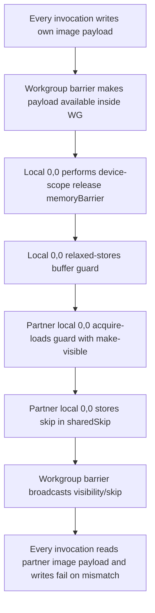

## Overview

**Core question:** Once a shader invocation observes a synchronization guard, do Vulkan/SPIR-V memory-model rules make the
partner payload that happened before that guard visible across the selected scope, storage class, stage, and synchronization form?

- [vktMemoryModelMessagePassing.cpp](../../../modules/vulkan/memory_model/vktMemoryModelMessagePassing.cpp) is the main
  `memory_model` test category implementation: `createTests(testCtx, name)` creates the category root and registers most test families.
- The file's shader-heavy test families are `message_passing`, `write_after_read`, and `transitive`; it also attaches delegated
  `padding` and `shared` test families implemented in separate files.
- The core test logic is to stress Vulkan/SPIR-V memory-model ordering by separating **payload** data from a **guard** signal:
  once a shader invocation observes the partner's guard, it checks whether the payload that should have happened before that
  guard is visible.
- The C++ code mainly builds the parameter matrix, generates GLSL, allocates resources, repeats dispatch/draw work, and scans a
  fail buffer. The most concrete test logic is in the generated shaders.

## Background Knowledge

- **Payload and guard.** The payload is the data whose visibility is being tested; the guard is the synchronization signal. The
  important rule is not that the guard is always observed, but that observing the guard implies the expected payload visibility.
- **Release and acquire.** The writer side uses release semantics or a release-like barrier before/with the guard signal. The
  reader side uses acquire semantics or an acquire-like barrier after/with the guard observation.
- **Availability and visibility.** Extension-mode memory-model shaders can add `gl_SemanticsMakeAvailable` on the writer side
  and `gl_SemanticsMakeVisible` on the reader side. Intuitively, availability pushes writes toward a domain where they can be
  seen, and visibility lets the reader observe those writes.
- **Scope.** The same protocol is tested at device, queue-family, workgroup, and subgroup scopes. Scope controls how far the
  synchronization guarantee is supposed to reach.
- **Skipped race instances.** A shader may set `skip` when it does not observe the partner guard. That race instance is not a
  failure; the failure condition only applies after the guard is observed.

## Registration Hierarchy

```text
memory_model
├── message_passing
├── write_after_read
├── transitive
├── padding (registration only)
└── shared (registration only)
```

`padding` and `shared` are registered by this file but implemented and explained in separate Level-3 pages.

## Test Families

### message_passing — Payload-before-guard synchronization

`message_passing` checks the classic message-passing property: if invocation A writes payload A before signaling guard A, then
invocation B must see payload A once it observes guard A. The generated shader writes its own payload, performs one selected
release/acquire synchronization form through a guard or control barrier, then checks the partner payload only when the partner
guard was observed [vktMemoryModelMessagePassing.cpp](../../../modules/vulkan/memory_model/vktMemoryModelMessagePassing.cpp#L749-L973).

For non-VulkanSC builds, `message_passing` also includes `permuted_index` Amber cases named `barrier`, `release_acquire`, and
`release_acquire_atomic_payload`. These are separate Amber tests under the same family and require compute workgroup limits of
at least 256 in the checked x/invocation dimensions
[vktMemoryModelMessagePassing.cpp](../../../modules/vulkan/memory_model/vktMemoryModelMessagePassing.cpp#L2020-L2055).

### write_after_read — Read-before-partner-write hazard

`write_after_read` uses the same broad matrix as `message_passing`, but inverts the timing question. Each invocation reads the
partner payload before the synchronization step, then writes its own payload only after the partner has had a chance to perform
that early read. The test fails if the early read sees a nonzero value that should not yet be visible
[vktMemoryModelMessagePassing.cpp](../../../modules/vulkan/memory_model/vktMemoryModelMessagePassing.cpp#L795-L814) and
[vktMemoryModelMessagePassing.cpp](../../../modules/vulkan/memory_model/vktMemoryModelMessagePassing.cpp#L975-L1004).

### transitive — Availability/visibility chain tests

`transitive` tests whether payload visibility can be carried through an availability/visibility chain instead of only by direct
per-invocation synchronization. It is compute-only, extension-mode, device-scope, `uint` message passing, but still varies
coherence, synchronization form, payload/guard placement, and whether the acquire/visibility step is performed by local
`(0,0)` or by destination invocations [vktMemoryModelMessagePassing.cpp](../../../modules/vulkan/memory_model/vktMemoryModelMessagePassing.cpp#L2341-L2408).

This family uses a separate shader builder because the shader has a different workgroup-representative structure and explicitly
uses make-available / make-visible paths
[vktMemoryModelMessagePassing.cpp](../../../modules/vulkan/memory_model/vktMemoryModelMessagePassing.cpp#L1075-L1344).

## Parameter Dimensions and Observed Values

The regular generated matrix is built from `TestGroupCase` arrays and nested loops
[vktMemoryModelMessagePassing.cpp](../../../modules/vulkan/memory_model/vktMemoryModelMessagePassing.cpp#L2070-L2167) and
[vktMemoryModelMessagePassing.cpp](../../../modules/vulkan/memory_model/vktMemoryModelMessagePassing.cpp#L2169-L2339). The table below
keeps the registered values but adds why each dimension matters for this test.

| Dimension | Registered values | Meaning in this test | Evidence |
|-----------|-------------------|----------------------|----------|
| Test type | `message_passing`, `write_after_read` | Selects whether the shader checks payload visibility after observing the guard, or checks that an earlier read did not see a later partner write. | [ttCases](../../../modules/vulkan/memory_model/vktMemoryModelMessagePassing.cpp#L2070-L2073) |
| API/memory-model mode | `core11`, `ext` | Chooses legacy Vulkan 1.1 memory semantics versus extension-mode shaders using `#pragma use_vulkan_memory_model` and make-available / make-visible flags. | [core11Cases](../../../modules/vulkan/memory_model/vktMemoryModelMessagePassing.cpp#L2075-L2080), [shader header](../../../modules/vulkan/memory_model/vktMemoryModelMessagePassing.cpp#L481-L500) |
| Data type | `u32`, `u64`, `f32`, `f64` | Changes payload type and atomic-feature pressure; non-`u32` cases mainly stress atomic support and are heavily pruned outside atomic-atomic synchronization. | [dtCases](../../../modules/vulkan/memory_model/vktMemoryModelMessagePassing.cpp#L2082-L2091), [atomic-testing pruning](../../../modules/vulkan/memory_model/vktMemoryModelMessagePassing.cpp#L2285-L2292) |
| Payload coherence | `coherent`, `noncoherent` | Controls memory qualifiers and whether extension-mode shaders need explicit make-available / make-visible semantics for payload visibility. | [cohCases](../../../modules/vulkan/memory_model/vktMemoryModelMessagePassing.cpp#L2093-L2098), [semantic flags](../../../modules/vulkan/memory_model/vktMemoryModelMessagePassing.cpp#L468-L479) |
| Synchronization form | `fence_fence`, `fence_atomic`, `atomic_fence`, `atomic_atomic`, `control_barrier`, `control_and_memory_barrier` | Moves release/acquire responsibility among explicit memory barriers, guard atomics, and control barriers. | [stCases](../../../modules/vulkan/memory_model/vktMemoryModelMessagePassing.cpp#L2100-L2113), [sync generation](../../../modules/vulkan/memory_model/vktMemoryModelMessagePassing.cpp#L815-L951) |
| Atomic operation kind | `atomicwrite`, `atomicrmw` | Chooses simple atomic store/load guard signaling or RMW exchange signaling; RMW is limited to `atomic_atomic`. | [rmwCases](../../../modules/vulkan/memory_model/vktMemoryModelMessagePassing.cpp#L2115-L2118), [RMW pruning](../../../modules/vulkan/memory_model/vktMemoryModelMessagePassing.cpp#L2279-L2283) |
| Scope | `device`, `queuefamily`, `workgroup`, `subgroup` | Changes the synchronization reach and also changes coordinate pairing: global mirror, local workgroup mirror, or subgroup-lane pairing. | [scopeCases](../../../modules/vulkan/memory_model/vktMemoryModelMessagePassing.cpp#L2120-L2125), [coordinate formulas](../../../modules/vulkan/memory_model/vktMemoryModelMessagePassing.cpp#L617-L723) |
| Payload locality | `payload_nonlocal`, `payload_local` | Selects non-local versus device-local memory allocation for buffer/image payload resources where that distinction is meaningful. | [plCases](../../../modules/vulkan/memory_model/vktMemoryModelMessagePassing.cpp#L2127-L2132), [allocation selection](../../../modules/vulkan/memory_model/vktMemoryModelMessagePassing.cpp#L1402-L1436) |
| Payload storage | `buffer`, `image`, `workgroup`, `physbuffer` | Places the payload in storage buffers, storage images, shared workgroup memory, or physical storage buffers to test the same ordering rule across storage classes. | [pscCases](../../../modules/vulkan/memory_model/vktMemoryModelMessagePassing.cpp#L2134-L2143), [payload declarations](../../../modules/vulkan/memory_model/vktMemoryModelMessagePassing.cpp#L546-L567) |
| Guard locality | `guard_nonlocal`, `guard_local` | Selects non-local versus device-local memory allocation for guard resources where external memory allocation is involved. | [glCases](../../../modules/vulkan/memory_model/vktMemoryModelMessagePassing.cpp#L2145-L2150), [allocation selection](../../../modules/vulkan/memory_model/vktMemoryModelMessagePassing.cpp#L1402-L1436) |
| Guard storage | `buffer`, `image`, `workgroup`, `physbuffer` | Places the synchronization signal in different atomic-capable storage classes. | [gscCases](../../../modules/vulkan/memory_model/vktMemoryModelMessagePassing.cpp#L2152-L2161), [guard declarations](../../../modules/vulkan/memory_model/vktMemoryModelMessagePassing.cpp#L568-L591) |
| Shader stage | `comp`, `vert`, `frag` | Runs the ordering protocol through compute, vertex, or fragment execution when the selected scope and storage combination is valid. | [stageCases](../../../modules/vulkan/memory_model/vktMemoryModelMessagePassing.cpp#L2163-L2167), [pipeline setup](../../../modules/vulkan/memory_model/vktMemoryModelMessagePassing.cpp#L1649-L1691) |
| Transitive visibility | `nontransvis`, `transvis` | For transitive cases, selects whether the destination invocation performs acquire/visibility itself or local `(0,0)` performs it and broadcasts the result. | [transVisCases](../../../modules/vulkan/memory_model/vktMemoryModelMessagePassing.cpp#L2341-L2346), [transitive visibility branch](../../../modules/vulkan/memory_model/vktMemoryModelMessagePassing.cpp#L1273-L1327) |

## Shader Analysis

The main shaders in this file are generated as GLSL strings rather than stored as checked-in shader files. This page uses two
walkthroughs because the regular `initPrograms()` shader family and the `initProgramsTransitive()` shader family have
significantly different synchronization structure
[vktMemoryModelMessagePassing.cpp](../../../modules/vulkan/memory_model/vktMemoryModelMessagePassing.cpp#L368-L374). Ordinary
parameter differences are summarized in the variation tables instead of receiving separate walkthroughs.

### Representative Shader Walkthrough 1

#### Parameter Values Chosen

Representative path:

```text
memory_model.message_passing.ext.u32.noncoherent.atomic_atomic.atomicwrite.subgroup.payload_nonlocal.buffer.guard_nonlocal.buffer.comp
```

| Parameter choice | Meaning in this representative case |
|------------------|-------------------------------------|
| `message_passing` | Tests the payload-before-guard rule: after observing the partner guard, the partner payload must be visible. |
| `ext` + `noncoherent` | Uses Vulkan memory-model GLSL and adds explicit `gl_SemanticsMakeAvailable` / `gl_SemanticsMakeVisible` to release/acquire operations. |
| `u32` | Uses `uint` payload and guard values, avoiding 64-bit or floating-point atomic feature complications. |
| `atomic_atomic` + `atomicwrite` | Puts release semantics on `atomicStore` of the guard and acquire semantics on `atomicLoad` of the partner guard. |
| `subgroup` | Pairs active subgroup lanes with `gl_SubgroupInvocationID ^ (gl_SubgroupSize - 1)` instead of global or workgroup mirroring. |
| `payload_nonlocal.buffer` | Uses a non-local storage-buffer payload at binding 0, with one slot per participating invocation. |
| `guard_nonlocal.buffer` | Uses a non-local storage-buffer guard at binding 1, with one atomic signal slot per participating invocation. |
| `comp` | Emits a compute shader with specialization-controlled workgroup dimensions. |

#### Purpose

This shader checks the classic message-passing guarantee inside a subgroup: if an invocation observes its partner's guard through an
acquire atomic load, the payload written before the partner's release guard store must be visible with the expected value.

#### Structural Design

| Step | Invocation A | Invocation B | Meaning |
|------|--------------|--------------|---------|
| 1 | Write payload A | Write payload B | Each lane publishes the data its partner may later validate. |
| 2 | Release-store guard A | Release-store guard B | The guard is the synchronization signal; release/make-available is attached to the store. |
| 3 | Acquire-load guard B | Acquire-load guard A | Observing the partner guard makes the partner payload visibility check meaningful. |
| 4 | Check payload B unless skipped | Check payload A unless skipped | A stale payload after a visible guard writes the fail buffer. |

#### Shader Code

Reconstructed GLSL for this path:

```glsl
#version 450 core
#pragma use_vulkan_memory_model
#extension GL_KHR_shader_subgroup_basic : enable
#extension GL_KHR_shader_subgroup_shuffle : enable
#extension GL_KHR_shader_subgroup_ballot : enable
#extension GL_KHR_memory_scope_semantics : enable
#extension GL_ARB_gpu_shader_int64 : enable
#extension GL_EXT_buffer_reference : enable
// DIM/NUM_WORKGROUP_EACH_DIM overriden by spec constants
/// Runtime supplies DIM and NUM_WORKGROUP_EACH_DIM through specialization constants; the host normally uses
/// DIM = 31 and NUM_WORKGROUP_EACH_DIM = 8 unless the workgroup invocation limit shrinks DIM.
layout(constant_id = 0) const int DIM = 1;
layout(constant_id = 1) const int NUM_WORKGROUP_EACH_DIM = 1;
/// For this `u32` case, payload and guard elements are 32-bit unsigned integers.
struct S { uint x[DIM*DIM]; };
layout(local_size_x_id = 0, local_size_y_id = 0, local_size_z = 1) in;
/// Binding 0 is the non-private payload storage buffer: one uint slot per invocation in the dispatch grid.
layout(set=0, binding=0) nonprivate buffer Payload { uint x[]; } payload;
/// Binding 1 is the guard storage buffer. Atomic guard operations publish and observe synchronization signals.
layout(set=0, binding=1) buffer Guard { uint x[]; } guard;
/// Binding 2 is the host-visible fail buffer. A nonzero write marks a payload-visibility failure for that invocation.
layout(set=0, binding=2) buffer Fail { uint x[]; } fail;
void main()
{
   bool pass = true;
   bool skip = false;
   /// Subgroup pairing uses XOR with `gl_SubgroupSize - 1`. If the partner lane is inactive, the shader exits
   /// before `subgroupShuffleXor` can return an undefined partner coordinate.
   uvec4 ballot = subgroupBallot(true);
   if (!subgroupBallotBitExtract(ballot, gl_SubgroupInvocationID^(gl_SubgroupSize-1))) { return; }
   ivec2 localId           = ivec2(gl_LocalInvocationID.xy);
   ivec2 partnerLocalId    = subgroupShuffleXor(localId, gl_SubgroupSize-1);
   /// Convert this lane and its subgroup partner into linear payload/guard slots inside the current workgroup.
   uint sharedCoord        = localId.y * DIM + localId.x;
   uint partnerSharedCoord = partnerLocalId.y * DIM + partnerLocalId.x;
   uint bufferCoord        = (gl_WorkGroupID.y * NUM_WORKGROUP_EACH_DIM + gl_WorkGroupID.x)*DIM*DIM + sharedCoord;
   uint partnerBufferCoord = (gl_WorkGroupID.y * NUM_WORKGROUP_EACH_DIM + gl_WorkGroupID.x)*DIM*DIM + partnerSharedCoord;
   ivec2 imageCoord        = ivec2(gl_WorkGroupID.xy * gl_WorkGroupSize.xy + localId);
   ivec2 partnerImageCoord = ivec2(gl_WorkGroupID.xy * gl_WorkGroupSize.xy + partnerLocalId);
   /// Write this invocation's payload before publishing the guard. The partner read is a generated dependency/noise term;
   /// with zero-cleared resources it does not change the expected stored value.
   payload.x[bufferCoord] = bufferCoord + (payload.x[partnerBufferCoord]>>31);
   /// `atomic_atomic` + `atomicwrite`: the guard store itself carries release/make-available semantics.
   atomicStore(guard.x[bufferCoord], uint(1u), gl_ScopeSubgroup, gl_StorageSemanticsBuffer, gl_SemanticsRelease | gl_SemanticsMakeAvailable);
   /// If the partner guard is not observed, this race instance is skipped. If it is observed, acquire/make-visible
   /// requires the partner payload write to be visible before the final check.
   skip = atomicLoad(guard.x[partnerBufferCoord], gl_ScopeSubgroup, gl_StorageSemanticsBuffer, gl_SemanticsAcquire | gl_SemanticsMakeVisible) == 0;
   uint r = payload.x[partnerBufferCoord];
   if (!skip && r != uint(partnerBufferCoord)) { fail.x[bufferCoord] = 1; }
}
```

#### Additional Info

- Subgroup partner selection is lane-based, not global-coordinate based: active lane `i` talks to lane
  `i ^ (gl_SubgroupSize - 1)` [subgroup coordinate branch](../../../modules/vulkan/memory_model/vktMemoryModelMessagePassing.cpp#L625-L645).
- The ballot guard is required because `subgroupShuffleXor` would otherwise read undefined data when the computed partner lane is
  inactive [subgroup active-lane check](../../../modules/vulkan/memory_model/vktMemoryModelMessagePassing.cpp#L625-L628).
- Although the path says `payload_nonlocal` and `guard_nonlocal`, those locality choices affect host allocation requirements; the
  shader-visible declarations are the storage-buffer payload and guard at bindings 0 and 1
  [resource declarations](../../../modules/vulkan/memory_model/vktMemoryModelMessagePassing.cpp#L546-L591).

#### Parameter Variation Summary

| Parameter dimension | GLSL-level variation from this shader | Evidence |
|---------------------|---------------------------------------|----------|
| API / memory-model mode | `core11` removes `#pragma use_vulkan_memory_model`; extension-mode noncoherent cases add make-available / make-visible semantics. | [header and semantic flags](../../../modules/vulkan/memory_model/vktMemoryModelMessagePassing.cpp#L468-L500) |
| Data type | `uint` becomes `uint64_t`, `float`, or `double` in `struct S`, resource declarations, casts, guard atomics, and payload checks. Float-like payload expressions use `floatBitsToInt(float(...)) >> 31`. | [type selection](../../../modules/vulkan/memory_model/vktMemoryModelMessagePassing.cpp#L403-L407), [payload expressions](../../../modules/vulkan/memory_model/vktMemoryModelMessagePassing.cpp#L749-L793) |
| Scope | `gl_ScopeSubgroup` changes to device, queue-family, or workgroup scope; the coordinate block changes from subgroup ballot/shuffle pairing to global or local mirroring. | [scope token selection](../../../modules/vulkan/memory_model/vktMemoryModelMessagePassing.cpp#L384-L401), [coordinate formulas](../../../modules/vulkan/memory_model/vktMemoryModelMessagePassing.cpp#L617-L723) |
| Payload storage class | Buffer payload uses `payload.x[...]`; image payload uses `imageStore` / `imageLoad`; workgroup payload uses shared memory and an initialization barrier; physical-buffer payload uses `PayloadRef`. | [payload declarations](../../../modules/vulkan/memory_model/vktMemoryModelMessagePassing.cpp#L546-L567), [payload accesses](../../../modules/vulkan/memory_model/vktMemoryModelMessagePassing.cpp#L749-L793), [shared initialization](../../../modules/vulkan/memory_model/vktMemoryModelMessagePassing.cpp#L725-L747) |
| Guard storage class | Buffer guard atomics access `guard.x[...]`; image guard variants use image atomics; workgroup guard uses shared-memory atomics; physical-buffer guard uses `GuardRef`. Barrier-only sync forms remove the separate guard declaration. | [guard declarations](../../../modules/vulkan/memory_model/vktMemoryModelMessagePassing.cpp#L568-L591), [guard atomics](../../../modules/vulkan/memory_model/vktMemoryModelMessagePassing.cpp#L850-L945) |
| Synchronization form | `atomic_atomic` keeps release/acquire semantics on guard atomics; fence forms move one or both sides to `memoryBarrier(...)`; control-barrier forms use `controlBarrier(...)` and omit the guard variable. | [control-barrier forms](../../../modules/vulkan/memory_model/vktMemoryModelMessagePassing.cpp#L815-L832), [fence/atomic forms](../../../modules/vulkan/memory_model/vktMemoryModelMessagePassing.cpp#L838-L951) |
| Atomic operation kind | `atomicwrite` uses `atomicStore` plus `atomicLoad`; `atomicrmw` replaces both sides with `atomicExchange`, including a reader-side exchange with `2u`. | [atomic write/RMW branches](../../../modules/vulkan/memory_model/vktMemoryModelMessagePassing.cpp#L850-L945) |
| Shader stage | Compute uses invocation IDs; vertex uses `gl_VertexIndex` and point-position boilerplate; fragment uses `gl_FragCoord` and starts with a `gl_HelperInvocation` return. | [fragment helper return](../../../modules/vulkan/memory_model/vktMemoryModelMessagePassing.cpp#L609-L615), [stage coordinate formulas](../../../modules/vulkan/memory_model/vktMemoryModelMessagePassing.cpp#L630-L720) |
| Test type | `message_passing` writes payload before synchronization and checks partner payload after it; `write_after_read` performs the partner-payload read before synchronization and checks that early value against zero. | [message-passing store](../../../modules/vulkan/memory_model/vktMemoryModelMessagePassing.cpp#L749-L793), [write-after-read early load](../../../modules/vulkan/memory_model/vktMemoryModelMessagePassing.cpp#L795-L814), [final checks](../../../modules/vulkan/memory_model/vktMemoryModelMessagePassing.cpp#L953-L1004) |

#### SPIR-V

- Status: generated and validated
- Source: reconstructed GLSL from this walkthrough
- Stage: `comp`
- Target SPIRV version: `spirv1.3`

<details>
<summary>Click to expand SPIRV asm code</summary>

```llvm
; SPIR-V
; Version: 1.3
; Generator: Khronos Glslang Reference Front End; 10
; Bound: 171
; Schema: 0
               OpCapability Shader
               OpCapability GroupNonUniform
               OpCapability GroupNonUniformBallot
               OpCapability GroupNonUniformShuffle
               OpCapability VulkanMemoryModel
               OpExtension "SPV_KHR_vulkan_memory_model"
          %1 = OpExtInstImport "GLSL.std.450"
               OpMemoryModel Logical Vulkan
               OpEntryPoint GLCompute %main "main" %gl_SubgroupInvocationID %gl_SubgroupSize %gl_LocalInvocationID %gl_WorkGroupID
               OpExecutionMode %main LocalSize 1 1 1
               OpSource GLSL 450
               OpSourceExtension "GL_ARB_gpu_shader_int64"
               OpSourceExtension "GL_EXT_buffer_reference"
               OpSourceExtension "GL_KHR_memory_scope_semantics"
               OpSourceExtension "GL_KHR_shader_subgroup_ballot"
               OpSourceExtension "GL_KHR_shader_subgroup_basic"
               OpSourceExtension "GL_KHR_shader_subgroup_shuffle"
               OpName %main "main"
               OpName %pass "pass"
               OpName %skip "skip"
               OpName %ballot "ballot"
               OpName %gl_SubgroupInvocationID "gl_SubgroupInvocationID"
               OpName %gl_SubgroupSize "gl_SubgroupSize"
               OpName %localId "localId"
               OpName %gl_LocalInvocationID "gl_LocalInvocationID"
               OpName %partnerLocalId "partnerLocalId"
               OpName %sharedCoord "sharedCoord"
               OpName %DIM "DIM"
               OpName %partnerSharedCoord "partnerSharedCoord"
               OpName %bufferCoord "bufferCoord"
               OpName %gl_WorkGroupID "gl_WorkGroupID"
               OpName %NUM_WORKGROUP_EACH_DIM "NUM_WORKGROUP_EACH_DIM"
               OpName %partnerBufferCoord "partnerBufferCoord"
               OpName %imageCoord "imageCoord"
               OpName %partnerImageCoord "partnerImageCoord"
               OpName %Payload "Payload"
               OpMemberName %Payload 0 "x"
               OpName %payload "payload"
               OpName %Guard "Guard"
               OpMemberName %Guard 0 "x"
               OpName %guard "guard"
               OpName %r "r"
               OpName %Fail "Fail"
               OpMemberName %Fail 0 "x"
               OpName %fail "fail"
               OpDecorate %gl_SubgroupInvocationID RelaxedPrecision
               OpDecorate %gl_SubgroupInvocationID BuiltIn SubgroupLocalInvocationId
               OpDecorate %21 RelaxedPrecision
               OpDecorate %gl_SubgroupSize RelaxedPrecision
               OpDecorate %gl_SubgroupSize BuiltIn SubgroupSize
               OpDecorate %23 RelaxedPrecision
               OpDecorate %25 RelaxedPrecision
               OpDecorate %26 RelaxedPrecision
               OpDecorate %gl_LocalInvocationID BuiltIn LocalInvocationId
               OpDecorate %45 RelaxedPrecision
               OpDecorate %46 RelaxedPrecision
               OpDecorate %DIM SpecId 0
               OpDecorate %gl_WorkGroupID BuiltIn WorkgroupId
               OpDecorate %NUM_WORKGROUP_EACH_DIM SpecId 1
               OpDecorate %101 SpecId 0
               OpDecorate %102 SpecId 0
               OpDecorate %gl_WorkGroupSize BuiltIn WorkgroupSize
               OpDecorate %_runtimearr_uint ArrayStride 4
               OpMemberDecorate %Payload 0 Offset 0
               OpDecorate %Payload Block
               OpDecorate %payload DescriptorSet 0
               OpDecorate %payload Binding 0
               OpDecorate %_runtimearr_uint_0 ArrayStride 4
               OpMemberDecorate %Guard 0 Offset 0
               OpDecorate %Guard Block
               OpDecorate %guard DescriptorSet 0
               OpDecorate %guard Binding 1
               OpDecorate %_runtimearr_uint_1 ArrayStride 4
               OpMemberDecorate %Fail 0 Offset 0
               OpDecorate %Fail Block
               OpDecorate %fail DescriptorSet 0
               OpDecorate %fail Binding 2
       %void = OpTypeVoid
          %3 = OpTypeFunction %void
       %bool = OpTypeBool
%_ptr_Function_bool = OpTypePointer Function %bool
       %true = OpConstantTrue %bool
      %false = OpConstantFalse %bool
       %uint = OpTypeInt 32 0
     %v4uint = OpTypeVector %uint 4
%_ptr_Function_v4uint = OpTypePointer Function %v4uint
     %uint_3 = OpConstant %uint 3
%_ptr_Input_uint = OpTypePointer Input %uint
%gl_SubgroupInvocationID = OpVariable %_ptr_Input_uint Input
%gl_SubgroupSize = OpVariable %_ptr_Input_uint Input
     %uint_1 = OpConstant %uint 1
        %int = OpTypeInt 32 1
      %v2int = OpTypeVector %int 2
%_ptr_Function_v2int = OpTypePointer Function %v2int
     %v3uint = OpTypeVector %uint 3
%_ptr_Input_v3uint = OpTypePointer Input %v3uint
%gl_LocalInvocationID = OpVariable %_ptr_Input_v3uint Input
     %v2uint = OpTypeVector %uint 2
%_ptr_Function_uint = OpTypePointer Function %uint
%_ptr_Function_int = OpTypePointer Function %int
        %DIM = OpSpecConstant %int 1
     %uint_0 = OpConstant %uint 0
%gl_WorkGroupID = OpVariable %_ptr_Input_v3uint Input
%NUM_WORKGROUP_EACH_DIM = OpSpecConstant %int 1
         %73 = OpSpecConstantOp %uint IAdd %NUM_WORKGROUP_EACH_DIM %uint_0
         %78 = OpSpecConstantOp %uint IAdd %DIM %uint_0
         %80 = OpSpecConstantOp %uint IAdd %DIM %uint_0
         %87 = OpSpecConstantOp %uint IAdd %NUM_WORKGROUP_EACH_DIM %uint_0
         %92 = OpSpecConstantOp %uint IAdd %DIM %uint_0
         %94 = OpSpecConstantOp %uint IAdd %DIM %uint_0
        %101 = OpSpecConstant %uint 1
        %102 = OpSpecConstant %uint 1
%gl_WorkGroupSize = OpSpecConstantComposite %v3uint %101 %102 %uint_1
%_runtimearr_uint = OpTypeRuntimeArray %uint
    %Payload = OpTypeStruct %_runtimearr_uint
%_ptr_StorageBuffer_Payload = OpTypePointer StorageBuffer %Payload
    %payload = OpVariable %_ptr_StorageBuffer_Payload StorageBuffer
      %int_0 = OpConstant %int 0
%_ptr_StorageBuffer_uint = OpTypePointer StorageBuffer %uint
     %int_31 = OpConstant %int 31
%_runtimearr_uint_0 = OpTypeRuntimeArray %uint
      %Guard = OpTypeStruct %_runtimearr_uint_0
%_ptr_StorageBuffer_Guard = OpTypePointer StorageBuffer %Guard
      %guard = OpVariable %_ptr_StorageBuffer_Guard StorageBuffer
      %int_3 = OpConstant %int 3
     %int_64 = OpConstant %int 64
   %int_8196 = OpConstant %int 8196
     %uint_5 = OpConstant %uint 5
  %uint_8260 = OpConstant %uint 8260
  %int_16386 = OpConstant %int 16386
 %uint_16450 = OpConstant %uint 16450
%_runtimearr_uint_1 = OpTypeRuntimeArray %uint
       %Fail = OpTypeStruct %_runtimearr_uint_1
%_ptr_StorageBuffer_Fail = OpTypePointer StorageBuffer %Fail
       %fail = OpVariable %_ptr_StorageBuffer_Fail StorageBuffer
       %main = OpFunction %void None %3
          %5 = OpLabel
       %pass = OpVariable %_ptr_Function_bool Function
       %skip = OpVariable %_ptr_Function_bool Function
     %ballot = OpVariable %_ptr_Function_v4uint Function
    %localId = OpVariable %_ptr_Function_v2int Function
%partnerLocalId = OpVariable %_ptr_Function_v2int Function
%sharedCoord = OpVariable %_ptr_Function_uint Function
%partnerSharedCoord = OpVariable %_ptr_Function_uint Function
%bufferCoord = OpVariable %_ptr_Function_uint Function
%partnerBufferCoord = OpVariable %_ptr_Function_uint Function
 %imageCoord = OpVariable %_ptr_Function_v2int Function
%partnerImageCoord = OpVariable %_ptr_Function_v2int Function
          %r = OpVariable %_ptr_Function_uint Function
               OpStore %pass %true
               OpStore %skip %false
         %17 = OpGroupNonUniformBallot %v4uint %uint_3 %true
               OpStore %ballot %17
         %18 = OpLoad %v4uint %ballot
         %21 = OpLoad %uint %gl_SubgroupInvocationID
         %23 = OpLoad %uint %gl_SubgroupSize
         %25 = OpISub %uint %23 %uint_1
         %26 = OpBitwiseXor %uint %21 %25
         %27 = OpGroupNonUniformBallotBitExtract %bool %uint_3 %18 %26
         %28 = OpLogicalNot %bool %27
               OpSelectionMerge %30 None
               OpBranchConditional %28 %29 %30
         %29 = OpLabel
               OpReturn
         %30 = OpLabel
         %40 = OpLoad %v3uint %gl_LocalInvocationID
         %41 = OpVectorShuffle %v2uint %40 %40 0 1
         %42 = OpBitcast %v2int %41
               OpStore %localId %42
         %44 = OpLoad %v2int %localId
         %45 = OpLoad %uint %gl_SubgroupSize
         %46 = OpISub %uint %45 %uint_1
         %47 = OpGroupNonUniformShuffleXor %v2int %uint_3 %44 %46
               OpStore %partnerLocalId %47
         %51 = OpAccessChain %_ptr_Function_int %localId %uint_1
         %52 = OpLoad %int %51
         %54 = OpIMul %int %52 %DIM
         %56 = OpAccessChain %_ptr_Function_int %localId %uint_0
         %57 = OpLoad %int %56
         %58 = OpIAdd %int %54 %57
         %59 = OpBitcast %uint %58
               OpStore %sharedCoord %59
         %61 = OpAccessChain %_ptr_Function_int %partnerLocalId %uint_1
         %62 = OpLoad %int %61
         %63 = OpIMul %int %62 %DIM
         %64 = OpAccessChain %_ptr_Function_int %partnerLocalId %uint_0
         %65 = OpLoad %int %64
         %66 = OpIAdd %int %63 %65
         %67 = OpBitcast %uint %66
               OpStore %partnerSharedCoord %67
         %70 = OpAccessChain %_ptr_Input_uint %gl_WorkGroupID %uint_1
         %71 = OpLoad %uint %70
         %74 = OpIMul %uint %71 %73
         %75 = OpAccessChain %_ptr_Input_uint %gl_WorkGroupID %uint_0
         %76 = OpLoad %uint %75
         %77 = OpIAdd %uint %74 %76
         %79 = OpIMul %uint %77 %78
         %81 = OpIMul %uint %79 %80
         %82 = OpLoad %uint %sharedCoord
         %83 = OpIAdd %uint %81 %82
               OpStore %bufferCoord %83
         %85 = OpAccessChain %_ptr_Input_uint %gl_WorkGroupID %uint_1
         %86 = OpLoad %uint %85
         %88 = OpIMul %uint %86 %87
         %89 = OpAccessChain %_ptr_Input_uint %gl_WorkGroupID %uint_0
         %90 = OpLoad %uint %89
         %91 = OpIAdd %uint %88 %90
         %93 = OpIMul %uint %91 %92
         %95 = OpIMul %uint %93 %94
         %96 = OpLoad %uint %partnerSharedCoord
         %97 = OpIAdd %uint %95 %96
               OpStore %partnerBufferCoord %97
         %99 = OpLoad %v3uint %gl_WorkGroupID
        %100 = OpVectorShuffle %v2uint %99 %99 0 1
        %104 = OpVectorShuffle %v2uint %gl_WorkGroupSize %gl_WorkGroupSize 0 1
        %105 = OpIMul %v2uint %100 %104
        %106 = OpLoad %v2int %localId
        %107 = OpBitcast %v2uint %106
        %108 = OpIAdd %v2uint %105 %107
        %109 = OpBitcast %v2int %108
               OpStore %imageCoord %109
        %111 = OpLoad %v3uint %gl_WorkGroupID
        %112 = OpVectorShuffle %v2uint %111 %111 0 1
        %113 = OpVectorShuffle %v2uint %gl_WorkGroupSize %gl_WorkGroupSize 0 1
        %114 = OpIMul %v2uint %112 %113
        %115 = OpLoad %v2int %partnerLocalId
        %116 = OpBitcast %v2uint %115
        %117 = OpIAdd %v2uint %114 %116
        %118 = OpBitcast %v2int %117
               OpStore %partnerImageCoord %118
        %124 = OpLoad %uint %bufferCoord
        %125 = OpLoad %uint %bufferCoord
        %126 = OpLoad %uint %partnerBufferCoord
        %128 = OpAccessChain %_ptr_StorageBuffer_uint %payload %int_0 %126
        %129 = OpLoad %uint %128 NonPrivatePointer
        %131 = OpShiftRightLogical %uint %129 %int_31
        %132 = OpIAdd %uint %125 %131
        %133 = OpAccessChain %_ptr_StorageBuffer_uint %payload %int_0 %124
               OpStore %133 %132 NonPrivatePointer
        %138 = OpLoad %uint %bufferCoord
        %139 = OpAccessChain %_ptr_StorageBuffer_uint %guard %int_0 %138
               OpAtomicStore %139 %int_3 %uint_8260 %uint_1
        %145 = OpLoad %uint %partnerBufferCoord
        %146 = OpAccessChain %_ptr_StorageBuffer_uint %guard %int_0 %145
        %149 = OpAtomicLoad %uint %146 %int_3 %uint_16450
        %150 = OpIEqual %bool %149 %uint_0
               OpStore %skip %150
        %152 = OpLoad %uint %partnerBufferCoord
        %153 = OpAccessChain %_ptr_StorageBuffer_uint %payload %int_0 %152
        %154 = OpLoad %uint %153 NonPrivatePointer
               OpStore %r %154
        %155 = OpLoad %bool %skip
        %156 = OpLogicalNot %bool %155
               OpSelectionMerge %158 None
               OpBranchConditional %156 %157 %158
        %157 = OpLabel
        %159 = OpLoad %uint %r
        %160 = OpLoad %uint %partnerBufferCoord
        %161 = OpINotEqual %bool %159 %160
               OpBranch %158
        %158 = OpLabel
        %162 = OpPhi %bool %156 %30 %161 %157
               OpSelectionMerge %164 None
               OpBranchConditional %162 %163 %164
        %163 = OpLabel
        %169 = OpLoad %uint %bufferCoord
        %170 = OpAccessChain %_ptr_StorageBuffer_uint %fail %int_0 %169
               OpStore %170 %uint_1
               OpBranch %164
        %164 = OpLabel
               OpReturn
               OpFunctionEnd
```

</details>
### Representative Shader Walkthrough 2

#### Parameter Values Chosen

Representative path:

```text
memory_model.transitive.noncoherent.fence_atomic.payload_nonlocal.image.guard_nonlocal.buffer.transvis
```

| Parameter choice | Meaning in this representative case |
|------------------|-------------------------------------|
| `transitive` | Selects the separate availability/visibility-chain shader builder rather than the regular message-passing builder. |
| `noncoherent` | Uses `nonprivate` payload memory plus explicit `gl_SemanticsMakeAvailable` and `gl_SemanticsMakeVisible` bits. |
| `fence_atomic` | Performs the writer-side release/make-available step with `memoryBarrier`, then publishes the guard with a relaxed atomic store; the representative acquire/make-visible operation is on the guard atomic load. |
| `payload_nonlocal.image` | Stores the payload in a non-local `r32ui` storage image at descriptor binding 0. |
| `guard_nonlocal.buffer` | Stores the guard signal in a non-local storage buffer at descriptor binding 1. |
| `transvis` | Only the local `(0,0)` invocation of each workgroup performs the device-scope acquire/visibility step, then shares the skip decision with the rest of its workgroup. |
| Fixed transitive dimensions | The transitive matrix fixes this family to extension-mode `uint`, device scope, compute stage, non-RMW message passing. |

#### Purpose

This path tests a transitive availability/visibility chain: once a workgroup representative observes the partner representative's
buffer guard, the image payload written by that partner workgroup must become visible to the destination workgroup's invocations.

#### Structural Design



#### Shader Code

Reconstructed GLSL for this path:

```glsl
#version 450 core
#pragma use_vulkan_memory_model
#extension GL_KHR_shader_subgroup_basic : enable
#extension GL_KHR_shader_subgroup_shuffle : enable
#extension GL_KHR_shader_subgroup_ballot : enable
#extension GL_KHR_memory_scope_semantics : enable
#extension GL_ARB_gpu_shader_int64 : enable
#extension GL_EXT_buffer_reference : enable
// DIM/NUM_WORKGROUP_EACH_DIM overriden by spec constants
/// Runtime supplies DIM and NUM_WORKGROUP_EACH_DIM through specialization constants; the host normally uses
/// DIM = 31 and NUM_WORKGROUP_EACH_DIM = 8 unless the workgroup invocation limit shrinks DIM.
layout(constant_id = 0) const int DIM = 1;
layout(constant_id = 1) const int NUM_WORKGROUP_EACH_DIM = 1;
/// Shared workgroup flag used only in `transvis`: local invocation (0,0) records whether it observed the partner guard.
shared bool sharedSkip;

layout(local_size_x_id = 0, local_size_y_id = 0, local_size_z = 1) in;
/// Binding 0 is a non-private r32ui storage image. Its extent is DIM * NUM_WORKGROUP_EACH_DIM in both x and y,
/// giving one payload texel per compute invocation in the full dispatch grid.
layout(set=0, binding=0, r32ui) uniform nonprivate uimage2D payload;
/// Binding 1 is a storage buffer containing one uint guard slot per invocation. In this exact case only the
/// representative slots for local (0,0) invocations are used for the inter-workgroup guard chain.
layout(set=0, binding=1) buffer Guard { uint x[]; } guard;
/// Binding 2 is a uint fail buffer. Any invocation that observes the guard but not the matching payload writes 1.
layout(set=0, binding=2) buffer Fail { uint x[]; } fail;
void main()
{
   bool pass = true;
   bool skip = false;
   sharedSkip = false;
   /// Device-scope transitive cases mirror each global invocation across the full DIM*NUM_WORKGROUP_EACH_DIM square.
   /// The `00` coordinates address the local (0,0) representative of this workgroup and its mirrored partner workgroup.
   ivec2 globalId          = ivec2(gl_GlobalInvocationID.xy);
   ivec2 partnerGlobalId   = ivec2(DIM*NUM_WORKGROUP_EACH_DIM-1) - ivec2(gl_GlobalInvocationID.xy);
   uint bufferCoord        = globalId.y * DIM*NUM_WORKGROUP_EACH_DIM + globalId.x;
   uint partnerBufferCoord = partnerGlobalId.y * DIM*NUM_WORKGROUP_EACH_DIM + partnerGlobalId.x;
   ivec2 imageCoord        = globalId;
   ivec2 partnerImageCoord = partnerGlobalId;
   ivec2 globalId00          = ivec2(DIM) * ivec2(gl_WorkGroupID.xy);
   ivec2 partnerGlobalId00   = ivec2(DIM) * (ivec2(NUM_WORKGROUP_EACH_DIM-1) - ivec2(gl_WorkGroupID.xy));
   uint bufferCoord00        = globalId00.y * DIM*NUM_WORKGROUP_EACH_DIM + globalId00.x;
   uint partnerBufferCoord00 = partnerGlobalId00.y * DIM*NUM_WORKGROUP_EACH_DIM + partnerGlobalId00.x;
   ivec2 imageCoord00        = globalId00;
   ivec2 partnerImageCoord00 = partnerGlobalId00;
   /// Write this invocation's payload image texel before the representative guard is published. The partner read in
   /// the expression is a generated dependency/noise term; with zero-cleared resources it does not change the expected value.
   imageStore(payload, imageCoord, uvec4(bufferCoord + (imageLoad(payload, partnerImageCoord).x>>31), 0, 0, 0));
   /// Synchronize payload writes with other invocations in the same workgroup and make noncoherent image/shared writes available.
   controlBarrier(gl_ScopeWorkgroup, gl_ScopeWorkgroup, gl_StorageSemanticsImage | gl_StorageSemanticsShared, gl_SemanticsAcquireRelease | gl_SemanticsMakeAvailable);
   /// Only local invocation (0,0) participates in the device-scope guard protocol for its workgroup.
   if (all(equal(gl_LocalInvocationID.xy, ivec2(0,0)))) {
       /// `fence_atomic` puts release/make-available on an explicit memory barrier covering image payload and buffer guard storage.
       memoryBarrier(gl_ScopeDevice, gl_StorageSemanticsImage | gl_StorageSemanticsBuffer, gl_SemanticsRelease | gl_SemanticsMakeAvailable);
       /// The guard store itself is relaxed; ordering came from the preceding fence.
       atomicStore(guard.x[bufferCoord], uint(1u), gl_ScopeDevice, 0, 0);
       /// In `transvis`, the representative also acquire-loads the mirrored partner representative's guard. The acquire
       /// operation carries image storage semantics and make-visible so partner image payload writes can become visible transitively.
       skip = atomicLoad(guard.x[partnerBufferCoord00], gl_ScopeDevice, gl_StorageSemanticsImage, gl_SemanticsAcquire | gl_SemanticsMakeVisible) == 0;
       sharedSkip = skip;
   }
   /// Broadcast the representative's skip decision and, for noncoherent payload memory, make the representative's visibility
   /// available to the rest of the workgroup before non-representative invocations read partner image payloads.
   controlBarrier(gl_ScopeWorkgroup, gl_ScopeWorkgroup, gl_StorageSemanticsImage | gl_StorageSemanticsShared, gl_SemanticsAcquireRelease | gl_SemanticsMakeVisible);
   skip = sharedSkip;
   /// Every invocation checks its own mirrored partner payload. A missing guard observation is not a failure; a visible guard
   /// combined with a stale or wrong image payload records failure at this invocation's buffer slot.
   uint r = imageLoad(payload, partnerImageCoord).x;
   if (!skip && r != uint(partnerBufferCoord)) { fail.x[bufferCoord] = 1; }
}
```

#### Additional Info

- The selected case is emitted by the transitive registration loop, which fixes `core11 = false`, `atomicRMW = false`,
  `testType = TT_MP`, `scope = SCOPE_DEVICE`, `stage = STAGE_COMPUTE`, `dataType = DATA_TYPE_UINT`, and `transitive = true`
  [transitive case construction](../../../modules/vulkan/memory_model/vktMemoryModelMessagePassing.cpp#L2370-L2385).
- The transitive family skips workgroup storage and control-barrier synchronization forms, so `payload_nonlocal.image`,
  `guard_nonlocal.buffer`, and `fence_atomic` remain valid in this matrix
  [transitive pruning](../../../modules/vulkan/memory_model/vktMemoryModelMessagePassing.cpp#L2386-L2394).
- The acquire guard load intentionally uses the payload storage semantics string (`gl_StorageSemanticsImage`) in the generated
  shader, because that operation is the point where payload image writes are made visible after the guard is observed
  [transitive acquire branch](../../../modules/vulkan/memory_model/vktMemoryModelMessagePassing.cpp#L1278-L1292).

#### Parameter Variation Summary

| Parameter dimension | GLSL-level variation from this shader | Evidence |
|---------------------|---------------------------------------|----------|
| Coherence | `coherent` changes the image declaration qualifier from `nonprivate` to `workgroupcoherent` and removes the explicit make-available / make-visible semantic suffixes used by this `noncoherent` shader. | [coherence branch](../../../modules/vulkan/memory_model/vktMemoryModelMessagePassing.cpp#L1096-L1108) |
| Synchronization form | `fence_fence` keeps release and acquire in `memoryBarrier` calls; `atomic_fence` and `atomic_atomic` move release semantics onto the guard store; `fence_atomic` is the shown release fence plus acquire atomic-load form. | [release side](../../../modules/vulkan/memory_model/vktMemoryModelMessagePassing.cpp#L1234-L1271), [acquire side](../../../modules/vulkan/memory_model/vktMemoryModelMessagePassing.cpp#L1273-L1311) |
| Payload storage class | Buffer and physical-buffer payloads use `payload.x[bufferCoord]` and `payload.x[partnerBufferCoord]`; image payloads use `imageStore` / `imageLoad` with `r32ui` for this uint case. | [payload declarations](../../../modules/vulkan/memory_model/vktMemoryModelMessagePassing.cpp#L1112-L1129), [payload accesses](../../../modules/vulkan/memory_model/vktMemoryModelMessagePassing.cpp#L1190-L1224) |
| Guard storage class | Buffer guard atomics access `guard.x[...]`; image guard variants use `imageAtomicStore` / `imageAtomicLoad`; physical-buffer variants pass a `GuardRef` through push constants. | [guard declarations](../../../modules/vulkan/memory_model/vktMemoryModelMessagePassing.cpp#L1131-L1149), [guard atomics](../../../modules/vulkan/memory_model/vktMemoryModelMessagePassing.cpp#L1238-L1307) |
| Transitive visibility | `nontransvis` lets every destination invocation acquire-load the partner representative guard directly; `transvis` keeps that load inside local `(0,0)` and then broadcasts `sharedSkip` through a workgroup barrier. | [transitive visibility branch](../../../modules/vulkan/memory_model/vktMemoryModelMessagePassing.cpp#L1273-L1327) |
| Payload/guard memory locality | The GLSL declarations do not encode `payload_nonlocal` or `guard_nonlocal`; those choices affect host memory allocation requirements for image and buffer resources. | [support memory check](../../../modules/vulkan/memory_model/vktMemoryModelMessagePassing.cpp#L330-L365), [runtime allocation](../../../modules/vulkan/memory_model/vktMemoryModelMessagePassing.cpp#L1402-L1540) |

#### SPIR-V

- Status: generated and validated
- Source: reconstructed GLSL from this walkthrough
- Stage: `comp`
- Target SPIRV version: `spirv1.3`

<details>
<summary>Click to expand SPIRV asm code</summary>

```llvm
; SPIR-V
; Version: 1.3
; Generator: Khronos Glslang Reference Front End; 10
; Bound: 177
; Schema: 0
               OpCapability Shader
               OpCapability VulkanMemoryModel
               OpCapability VulkanMemoryModelDeviceScope
               OpExtension "SPV_KHR_vulkan_memory_model"
          %1 = OpExtInstImport "GLSL.std.450"
               OpMemoryModel Logical Vulkan
               OpEntryPoint GLCompute %main "main" %gl_GlobalInvocationID %gl_WorkGroupID %gl_LocalInvocationID
               OpExecutionMode %main LocalSize 1 1 1
               OpSource GLSL 450
               OpSourceExtension "GL_ARB_gpu_shader_int64"
               OpSourceExtension "GL_EXT_buffer_reference"
               OpSourceExtension "GL_KHR_memory_scope_semantics"
               OpSourceExtension "GL_KHR_shader_subgroup_ballot"
               OpSourceExtension "GL_KHR_shader_subgroup_basic"
               OpSourceExtension "GL_KHR_shader_subgroup_shuffle"
               OpName %main "main"
               OpName %pass "pass"
               OpName %skip "skip"
               OpName %sharedSkip "sharedSkip"
               OpName %globalId "globalId"
               OpName %gl_GlobalInvocationID "gl_GlobalInvocationID"
               OpName %partnerGlobalId "partnerGlobalId"
               OpName %DIM "DIM"
               OpName %NUM_WORKGROUP_EACH_DIM "NUM_WORKGROUP_EACH_DIM"
               OpName %bufferCoord "bufferCoord"
               OpName %partnerBufferCoord "partnerBufferCoord"
               OpName %imageCoord "imageCoord"
               OpName %partnerImageCoord "partnerImageCoord"
               OpName %globalId00 "globalId00"
               OpName %gl_WorkGroupID "gl_WorkGroupID"
               OpName %partnerGlobalId00 "partnerGlobalId00"
               OpName %bufferCoord00 "bufferCoord00"
               OpName %partnerBufferCoord00 "partnerBufferCoord00"
               OpName %imageCoord00 "imageCoord00"
               OpName %partnerImageCoord00 "partnerImageCoord00"
               OpName %payload "payload"
               OpName %gl_LocalInvocationID "gl_LocalInvocationID"
               OpName %Guard "Guard"
               OpMemberName %Guard 0 "x"
               OpName %guard "guard"
               OpName %r "r"
               OpName %Fail "Fail"
               OpMemberName %Fail 0 "x"
               OpName %fail "fail"
               OpDecorate %gl_GlobalInvocationID BuiltIn GlobalInvocationId
               OpDecorate %DIM SpecId 0
               OpDecorate %NUM_WORKGROUP_EACH_DIM SpecId 1
               OpDecorate %gl_WorkGroupID BuiltIn WorkgroupId
               OpDecorate %payload DescriptorSet 0
               OpDecorate %payload Binding 0
               OpDecorate %gl_LocalInvocationID BuiltIn LocalInvocationId
               OpDecorate %_runtimearr_uint ArrayStride 4
               OpMemberDecorate %Guard 0 Offset 0
               OpDecorate %Guard Block
               OpDecorate %guard DescriptorSet 0
               OpDecorate %guard Binding 1
               OpDecorate %_runtimearr_uint_0 ArrayStride 4
               OpMemberDecorate %Fail 0 Offset 0
               OpDecorate %Fail Block
               OpDecorate %fail DescriptorSet 0
               OpDecorate %fail Binding 2
               OpDecorate %174 SpecId 0
               OpDecorate %175 SpecId 0
               OpDecorate %gl_WorkGroupSize BuiltIn WorkgroupSize
       %void = OpTypeVoid
          %3 = OpTypeFunction %void
       %bool = OpTypeBool
%_ptr_Function_bool = OpTypePointer Function %bool
       %true = OpConstantTrue %bool
      %false = OpConstantFalse %bool
%_ptr_Workgroup_bool = OpTypePointer Workgroup %bool
 %sharedSkip = OpVariable %_ptr_Workgroup_bool Workgroup
       %uint = OpTypeInt 32 0
     %uint_2 = OpConstant %uint 2
        %int = OpTypeInt 32 1
      %v2int = OpTypeVector %int 2
%_ptr_Function_v2int = OpTypePointer Function %v2int
     %v3uint = OpTypeVector %uint 3
%_ptr_Input_v3uint = OpTypePointer Input %v3uint
%gl_GlobalInvocationID = OpVariable %_ptr_Input_v3uint Input
     %v2uint = OpTypeVector %uint 2
        %DIM = OpSpecConstant %int 1
%NUM_WORKGROUP_EACH_DIM = OpSpecConstant %int 1
         %30 = OpSpecConstantOp %int IMul %DIM %NUM_WORKGROUP_EACH_DIM
      %int_1 = OpConstant %int 1
         %32 = OpSpecConstantOp %int ISub %30 %int_1
         %33 = OpSpecConstantComposite %v2int %32 %32
%_ptr_Function_uint = OpTypePointer Function %uint
     %uint_1 = OpConstant %uint 1
%_ptr_Function_int = OpTypePointer Function %int
     %uint_0 = OpConstant %uint 0
         %65 = OpSpecConstantComposite %v2int %DIM %DIM
%gl_WorkGroupID = OpVariable %_ptr_Input_v3uint Input
         %72 = OpSpecConstantComposite %v2int %DIM %DIM
         %73 = OpSpecConstantOp %int ISub %NUM_WORKGROUP_EACH_DIM %int_1
         %74 = OpSpecConstantComposite %v2int %73 %73
        %102 = OpTypeImage %uint 2D 0 0 0 2 R32ui
%_ptr_UniformConstant_102 = OpTypePointer UniformConstant %102
    %payload = OpVariable %_ptr_UniformConstant_102 UniformConstant
     %v4uint = OpTypeVector %uint 4
     %int_31 = OpConstant %int 31
      %int_2 = OpConstant %int 2
   %int_2304 = OpConstant %int 2304
   %int_8200 = OpConstant %int 8200
 %uint_10504 = OpConstant %uint 10504
%gl_LocalInvocationID = OpVariable %_ptr_Input_v3uint Input
        %124 = OpConstantComposite %v2uint %uint_0 %uint_0
     %v2bool = OpTypeVector %bool 2
   %int_2112 = OpConstant %int 2112
   %int_8196 = OpConstant %int 8196
 %uint_10308 = OpConstant %uint 10308
%_runtimearr_uint = OpTypeRuntimeArray %uint
      %Guard = OpTypeStruct %_runtimearr_uint
%_ptr_StorageBuffer_Guard = OpTypePointer StorageBuffer %Guard
      %guard = OpVariable %_ptr_StorageBuffer_Guard StorageBuffer
      %int_0 = OpConstant %int 0
%_ptr_StorageBuffer_uint = OpTypePointer StorageBuffer %uint
     %uint_5 = OpConstant %uint 5
   %int_2048 = OpConstant %int 2048
  %int_16386 = OpConstant %int 16386
 %uint_18434 = OpConstant %uint 18434
  %int_16392 = OpConstant %int 16392
 %uint_18696 = OpConstant %uint 18696
%_runtimearr_uint_0 = OpTypeRuntimeArray %uint
       %Fail = OpTypeStruct %_runtimearr_uint_0
%_ptr_StorageBuffer_Fail = OpTypePointer StorageBuffer %Fail
       %fail = OpVariable %_ptr_StorageBuffer_Fail StorageBuffer
        %174 = OpSpecConstant %uint 1
        %175 = OpSpecConstant %uint 1
%gl_WorkGroupSize = OpSpecConstantComposite %v3uint %174 %175 %uint_1
       %main = OpFunction %void None %3
          %5 = OpLabel
       %pass = OpVariable %_ptr_Function_bool Function
       %skip = OpVariable %_ptr_Function_bool Function
   %globalId = OpVariable %_ptr_Function_v2int Function
%partnerGlobalId = OpVariable %_ptr_Function_v2int Function
%bufferCoord = OpVariable %_ptr_Function_uint Function
%partnerBufferCoord = OpVariable %_ptr_Function_uint Function
 %imageCoord = OpVariable %_ptr_Function_v2int Function
%partnerImageCoord = OpVariable %_ptr_Function_v2int Function
 %globalId00 = OpVariable %_ptr_Function_v2int Function
%partnerGlobalId00 = OpVariable %_ptr_Function_v2int Function
%bufferCoord00 = OpVariable %_ptr_Function_uint Function
%partnerBufferCoord00 = OpVariable %_ptr_Function_uint Function
%imageCoord00 = OpVariable %_ptr_Function_v2int Function
%partnerImageCoord00 = OpVariable %_ptr_Function_v2int Function
          %r = OpVariable %_ptr_Function_uint Function
               OpStore %pass %true
               OpStore %skip %false
               OpStore %sharedSkip %false MakePointerAvailable|NonPrivatePointer %uint_2
         %24 = OpLoad %v3uint %gl_GlobalInvocationID
         %25 = OpVectorShuffle %v2uint %24 %24 0 1
         %26 = OpBitcast %v2int %25
               OpStore %globalId %26
         %34 = OpLoad %v3uint %gl_GlobalInvocationID
         %35 = OpVectorShuffle %v2uint %34 %34 0 1
         %36 = OpBitcast %v2int %35
         %37 = OpISub %v2int %33 %36
               OpStore %partnerGlobalId %37
         %42 = OpAccessChain %_ptr_Function_int %globalId %uint_1
         %43 = OpLoad %int %42
         %44 = OpIMul %int %43 %DIM
         %45 = OpIMul %int %44 %NUM_WORKGROUP_EACH_DIM
         %47 = OpAccessChain %_ptr_Function_int %globalId %uint_0
         %48 = OpLoad %int %47
         %49 = OpIAdd %int %45 %48
         %50 = OpBitcast %uint %49
               OpStore %bufferCoord %50
         %52 = OpAccessChain %_ptr_Function_int %partnerGlobalId %uint_1
         %53 = OpLoad %int %52
         %54 = OpIMul %int %53 %DIM
         %55 = OpIMul %int %54 %NUM_WORKGROUP_EACH_DIM
         %56 = OpAccessChain %_ptr_Function_int %partnerGlobalId %uint_0
         %57 = OpLoad %int %56
         %58 = OpIAdd %int %55 %57
         %59 = OpBitcast %uint %58
               OpStore %partnerBufferCoord %59
         %61 = OpLoad %v2int %globalId
               OpStore %imageCoord %61
         %63 = OpLoad %v2int %partnerGlobalId
               OpStore %partnerImageCoord %63
         %67 = OpLoad %v3uint %gl_WorkGroupID
         %68 = OpVectorShuffle %v2uint %67 %67 0 1
         %69 = OpBitcast %v2int %68
         %70 = OpIMul %v2int %65 %69
               OpStore %globalId00 %70
         %75 = OpLoad %v3uint %gl_WorkGroupID
         %76 = OpVectorShuffle %v2uint %75 %75 0 1
         %77 = OpBitcast %v2int %76
         %78 = OpISub %v2int %74 %77
         %79 = OpIMul %v2int %72 %78
               OpStore %partnerGlobalId00 %79
         %81 = OpAccessChain %_ptr_Function_int %globalId00 %uint_1
         %82 = OpLoad %int %81
         %83 = OpIMul %int %82 %DIM
         %84 = OpIMul %int %83 %NUM_WORKGROUP_EACH_DIM
         %85 = OpAccessChain %_ptr_Function_int %globalId00 %uint_0
         %86 = OpLoad %int %85
         %87 = OpIAdd %int %84 %86
         %88 = OpBitcast %uint %87
               OpStore %bufferCoord00 %88
         %90 = OpAccessChain %_ptr_Function_int %partnerGlobalId00 %uint_1
         %91 = OpLoad %int %90
         %92 = OpIMul %int %91 %DIM
         %93 = OpIMul %int %92 %NUM_WORKGROUP_EACH_DIM
         %94 = OpAccessChain %_ptr_Function_int %partnerGlobalId00 %uint_0
         %95 = OpLoad %int %94
         %96 = OpIAdd %int %93 %95
         %97 = OpBitcast %uint %96
               OpStore %partnerBufferCoord00 %97
         %99 = OpLoad %v2int %globalId00
               OpStore %imageCoord00 %99
        %101 = OpLoad %v2int %partnerGlobalId00
               OpStore %partnerImageCoord00 %101
        %105 = OpLoad %102 %payload
        %106 = OpLoad %v2int %imageCoord
        %107 = OpLoad %uint %bufferCoord
        %108 = OpLoad %102 %payload
        %109 = OpLoad %v2int %partnerImageCoord
        %111 = OpImageRead %v4uint %108 %109 NonPrivateTexel
        %112 = OpCompositeExtract %uint %111 0
        %114 = OpShiftRightLogical %uint %112 %int_31
        %115 = OpIAdd %uint %107 %114
        %116 = OpCompositeConstruct %v4uint %115 %uint_0 %uint_0 %uint_0
               OpImageWrite %105 %106 %116 NonPrivateTexel
               OpControlBarrier %uint_2 %uint_2 %uint_10504
        %122 = OpLoad %v3uint %gl_LocalInvocationID
        %123 = OpVectorShuffle %v2uint %122 %122 0 1
        %126 = OpIEqual %v2bool %123 %124
        %127 = OpAll %bool %126
               OpSelectionMerge %129 None
               OpBranchConditional %127 %128 %129
        %128 = OpLabel
               OpMemoryBarrier %uint_1 %uint_10308
        %138 = OpLoad %uint %bufferCoord
        %140 = OpAccessChain %_ptr_StorageBuffer_uint %guard %int_0 %138
               OpAtomicStore %140 %int_1 %uint_0 %uint_1
        %142 = OpLoad %uint %partnerBufferCoord00
        %143 = OpAccessChain %_ptr_StorageBuffer_uint %guard %int_0 %142
        %147 = OpAtomicLoad %uint %143 %int_1 %uint_18434
        %148 = OpIEqual %bool %147 %uint_0
               OpStore %skip %148
        %149 = OpLoad %bool %skip
               OpStore %sharedSkip %149 MakePointerAvailable|NonPrivatePointer %uint_2
               OpBranch %129
        %129 = OpLabel
               OpControlBarrier %uint_2 %uint_2 %uint_18696
        %152 = OpLoad %bool %sharedSkip MakePointerVisible|NonPrivatePointer %uint_2
               OpStore %skip %152
        %154 = OpLoad %102 %payload
        %155 = OpLoad %v2int %partnerImageCoord
        %156 = OpImageRead %v4uint %154 %155 NonPrivateTexel
        %157 = OpCompositeExtract %uint %156 0
               OpStore %r %157
        %158 = OpLoad %bool %skip
        %159 = OpLogicalNot %bool %158
               OpSelectionMerge %161 None
               OpBranchConditional %159 %160 %161
        %160 = OpLabel
        %162 = OpLoad %uint %r
        %163 = OpLoad %uint %partnerBufferCoord
        %164 = OpINotEqual %bool %162 %163
               OpBranch %161
        %161 = OpLabel
        %165 = OpPhi %bool %159 %129 %164 %160
               OpSelectionMerge %167 None
               OpBranchConditional %165 %166 %167
        %166 = OpLabel
        %172 = OpLoad %uint %bufferCoord
        %173 = OpAccessChain %_ptr_StorageBuffer_uint %fail %int_0 %172
               OpStore %173 %uint_1
               OpBranch %167
        %167 = OpLabel
               OpReturn
               OpFunctionEnd
```

</details>
## Runtime Execution and Result Checking

- **Runtime dimensions and resource sizes.** The host normally uses `DIM = 31` and `NUM_WORKGROUP_EACH_DIM = 8`, shrinking `DIM`
  only if `DIM * DIM` exceeds `maxComputeWorkGroupInvocations`. It derives `NUM_INVOCATIONS` from those values, sizes
  buffer-backed payload/guard resources and the fail buffer from that invocation count, creates image payload/guard resources with
  the matching two-dimensional extent, and leaves workgroup payload/guard storage as shader-local variables
  [vktMemoryModelMessagePassing.cpp](../../../modules/vulkan/memory_model/vktMemoryModelMessagePassing.cpp#L1371-L1554).
- **Resource placement.** Buffer and physical-buffer payload/guard resources are allocated according to the selected local or
  non-local memory requirement; physical-buffer variants also require shader-device-address usage
  [vktMemoryModelMessagePassing.cpp](../../../modules/vulkan/memory_model/vktMemoryModelMessagePassing.cpp#L1402-L1436). Image
  payload/guard resources are allocated as storage images with local or non-local memory requirements
  [vktMemoryModelMessagePassing.cpp](../../../modules/vulkan/memory_model/vktMemoryModelMessagePassing.cpp#L1453-L1554).
- **Pipeline setup.** The host binds storage resources and a fail buffer, passes physical-buffer addresses through push
  constants when needed, and supplies `DIM` / `NUM_WORKGROUP_EACH_DIM` through specialization constants
  [vktMemoryModelMessagePassing.cpp](../../../modules/vulkan/memory_model/vktMemoryModelMessagePassing.cpp#L1556-L1664).
- **Execution loop.** Each command-buffer submit repeats the selected shader 50 times. Before every iteration, payload and guard
  resources are cleared to zero and a transfer-to-shader barrier exposes those clears to the shader
  [vktMemoryModelMessagePassing.cpp](../../../modules/vulkan/memory_model/vktMemoryModelMessagePassing.cpp#L1933-L1947).
  - Compute cases dispatch `NUM_WORKGROUP_EACH_DIM x NUM_WORKGROUP_EACH_DIM x 1` workgroups.
  - Vertex cases draw one point per invocation.
  - Fragment cases draw a single quad over the `DIM * NUM_WORKGROUP_EACH_DIM` square target
    [vktMemoryModelMessagePassing.cpp](../../../modules/vulkan/memory_model/vktMemoryModelMessagePassing.cpp#L1949-L1968).
- **Submit count and copyback.** The command buffer is submitted four times. The fail buffer is cleared once before the first
  submit, accumulates any shader-detected failures across all iterations, and is copied to a host-visible buffer only on the
  final submit [vktMemoryModelMessagePassing.cpp](../../../modules/vulkan/memory_model/vktMemoryModelMessagePassing.cpp#L1881-L1983).
- **Pass/fail rule.** The host scans every fail-buffer entry. Any nonzero entry fails the case and logs up to the first 256
  failed invocation indices [vktMemoryModelMessagePassing.cpp](../../../modules/vulkan/memory_model/vktMemoryModelMessagePassing.cpp#L1992-L2017).

## Case Pruning

### Requirement-based pruning

- Every generated `MemoryModelTestCase` requires Vulkan 1.1
  [vktMemoryModelMessagePassing.cpp](../../../modules/vulkan/memory_model/vktMemoryModelMessagePassing.cpp#L181-L186).
- `ext` cases require `vulkanMemoryModel`; device-scope `ext` cases additionally require `vulkanMemoryModelDeviceScope`
  [vktMemoryModelMessagePassing.cpp](../../../modules/vulkan/memory_model/vktMemoryModelMessagePassing.cpp#L188-L199).
- Subgroup-scope cases require basic, ballot, and shuffle subgroup operations, plus subgroup support for the selected shader
  stage [vktMemoryModelMessagePassing.cpp](../../../modules/vulkan/memory_model/vktMemoryModelMessagePassing.cpp#L201-L239).
- `u64` cases require `shaderInt64` and the relevant 64-bit atomic support for buffer/physical-buffer or shared guard storage
  [vktMemoryModelMessagePassing.cpp](../../../modules/vulkan/memory_model/vktMemoryModelMessagePassing.cpp#L241-L255).
- `f32` and `f64` atomic cases require `VK_EXT_shader_atomic_float` and the selected storage-class atomic features; `f64` image
  payload or guard variants are rejected because 64-bit floating-point image atomics are unsupported here
  [vktMemoryModelMessagePassing.cpp](../../../modules/vulkan/memory_model/vktMemoryModelMessagePassing.cpp#L258-L305).
- Transitive cases require `vulkanMemoryModelAvailabilityVisibilityChains`
  [vktMemoryModelMessagePassing.cpp](../../../modules/vulkan/memory_model/vktMemoryModelMessagePassing.cpp#L308-L309).
- Physical-storage-buffer payload or guard cases require buffer-device-address support
  [vktMemoryModelMessagePassing.cpp](../../../modules/vulkan/memory_model/vktMemoryModelMessagePassing.cpp#L311-L313).
- Vertex and fragment cases require `vertexPipelineStoresAndAtomics` or `fragmentStoresAndAtomics`, respectively
  [vktMemoryModelMessagePassing.cpp](../../../modules/vulkan/memory_model/vktMemoryModelMessagePassing.cpp#L315-L328).
- Local/non-local memory choices are also checked against compatible memory types before execution
  [vktMemoryModelMessagePassing.cpp](../../../modules/vulkan/memory_model/vktMemoryModelMessagePassing.cpp#L330-L365).

### Design-based pruning

- `core11` cases intentionally exclude noncoherent extension behavior, atomic synchronization forms, queue-family scope,
  64-bit data types, and physical storage buffers because those combinations are outside the Vulkan 1.1 must-pass expectation or
  legacy decoration model [vktMemoryModelMessagePassing.cpp](../../../modules/vulkan/memory_model/vktMemoryModelMessagePassing.cpp#L2235-L2251).
- Workgroup scope is limited to compute-stage cases, and workgroup-memory payload/guard cases are also limited to compute with
  no separate local/non-local memory variant
  [vktMemoryModelMessagePassing.cpp](../../../modules/vulkan/memory_model/vktMemoryModelMessagePassing.cpp#L2253-L2269).
- Control-barrier synchronization is only used for compute workgroup-scope cases, and control-barrier tests do not use a
  separate guard variable [vktMemoryModelMessagePassing.cpp](../../../modules/vulkan/memory_model/vktMemoryModelMessagePassing.cpp#L2270-L2277) and
  [vktMemoryModelMessagePassing.cpp](../../../modules/vulkan/memory_model/vktMemoryModelMessagePassing.cpp#L2307-L2313).
- RMW atomics are limited to `atomic_atomic`, primarily to reduce redundant cases
  [vktMemoryModelMessagePassing.cpp](../../../modules/vulkan/memory_model/vktMemoryModelMessagePassing.cpp#L2279-L2283).
- `u64`, `f32`, and `f64` testing is primarily for atomics, so those data types are only tested with `atomic_atomic`; additional
  64-bit image restrictions remove combinations that cannot express the intended atomic/image behavior
  [vktMemoryModelMessagePassing.cpp](../../../modules/vulkan/memory_model/vktMemoryModelMessagePassing.cpp#L2285-L2305).
- Transitive cases are intentionally fixed to extension-mode `uint` message passing with device scope, compute stage, and
  non-RMW atomics, and they skip workgroup storage and control-barrier forms because the family focuses on device-scope
  availability/visibility chains through representatives
  [vktMemoryModelMessagePassing.cpp](../../../modules/vulkan/memory_model/vktMemoryModelMessagePassing.cpp#L2370-L2394).

## Key Takeaways

- Observing the guard is not itself the success condition. The core rule is: if an invocation observes the partner guard, then
  the corresponding partner payload must be visible with the expected value.
- `skip` is part of the race design. It means this particular invocation did not observe the partner signal, so the payload check
  is not meaningful for that instance.
- `write_after_read` checks the opposite timing hazard from normal message passing: the early read must not see a partner write
  that is only performed after synchronization.
- `transitive` is not just another parameter setting. It uses a separate shader structure to test chained availability/visibility,
  including whether visibility is performed by a workgroup representative or by destination invocations.
- Failures can expose hardware, cache, interconnect, driver, or shader-compiler problems such as incomplete release/acquire
  propagation, scope mishandling, guard visibility without payload visibility, or lowered memory semantics that drop required
  availability/visibility behavior.

## Source Reference Appendix

| Entry point | Link | Why it matters |
|-------------|------|----------------|
| Package category registration | [vktTestPackage.cpp#L1370-L1380](../../../modules/vulkan/vktTestPackage.cpp#L1370-L1380) | Registers the `memory_model` test category in the normal Vulkan CTS package. |
| Vulkan SC package category registration | [vktTestPackage.cpp#L1413-L1447](../../../modules/vulkan/vktTestPackage.cpp#L1413-L1447) | Shows the Vulkan SC package also registers the `memory_model` test category. |
| Test category factory declaration | [vktMemoryModelTests.hpp#L30-L35](../../../modules/vulkan/memory_model/vktMemoryModelTests.hpp#L30-L35) | Declares `MemoryModel::createTests`. |
| Support checks | [vktMemoryModelMessagePassing.cpp#L181-L365](../../../modules/vulkan/memory_model/vktMemoryModelMessagePassing.cpp#L181-L365) | Applies API, feature, memory-type, stage, scope, and storage support gates. |
| Regular shader builder | [vktMemoryModelMessagePassing.cpp#L368-L1030](../../../modules/vulkan/memory_model/vktMemoryModelMessagePassing.cpp#L368-L1030) | Generates the regular `message_passing` and `write_after_read` GLSL. |
| Transitive shader builder | [vktMemoryModelMessagePassing.cpp#L1032-L1344](../../../modules/vulkan/memory_model/vktMemoryModelMessagePassing.cpp#L1032-L1344) | Generates the separate availability/visibility-chain GLSL. |
| Runtime execution loop | [vktMemoryModelMessagePassing.cpp#L1356-L2018](../../../modules/vulkan/memory_model/vktMemoryModelMessagePassing.cpp#L1356-L2018) | Allocates resources, builds pipelines, runs repeated dispatch/draw work, and checks the fail buffer. |
| Permuted-index Amber tests | [vktMemoryModelMessagePassing.cpp#L2020-L2055](../../../modules/vulkan/memory_model/vktMemoryModelMessagePassing.cpp#L2020-L2055) | Adds non-VulkanSC Amber cases under `message_passing/permuted_index`. |
| Regular matrix registration and pruning | [vktMemoryModelMessagePassing.cpp#L2060-L2339](../../../modules/vulkan/memory_model/vktMemoryModelMessagePassing.cpp#L2060-L2339) | Builds the regular nested parameter matrix and skips invalid or redundant combinations. |
| Transitive matrix registration and pruning | [vktMemoryModelMessagePassing.cpp#L2341-L2408](../../../modules/vulkan/memory_model/vktMemoryModelMessagePassing.cpp#L2341-L2408) | Builds the separate `transitive` test family and its fixed dimensions. |
| Delegated `padding` test family | [vktMemoryModelPadding.cpp#L360-L367](../../../modules/vulkan/memory_model/vktMemoryModelPadding.cpp#L360-L367) | Implements the `padding` test family attached by this root page. |
| Delegated `shared` test family | [vktMemoryModelSharedLayout.cpp#L287-L330](../../../modules/vulkan/memory_model/vktMemoryModelSharedLayout.cpp#L287-L330) | Implements the `shared` test family attached by this root page. |
