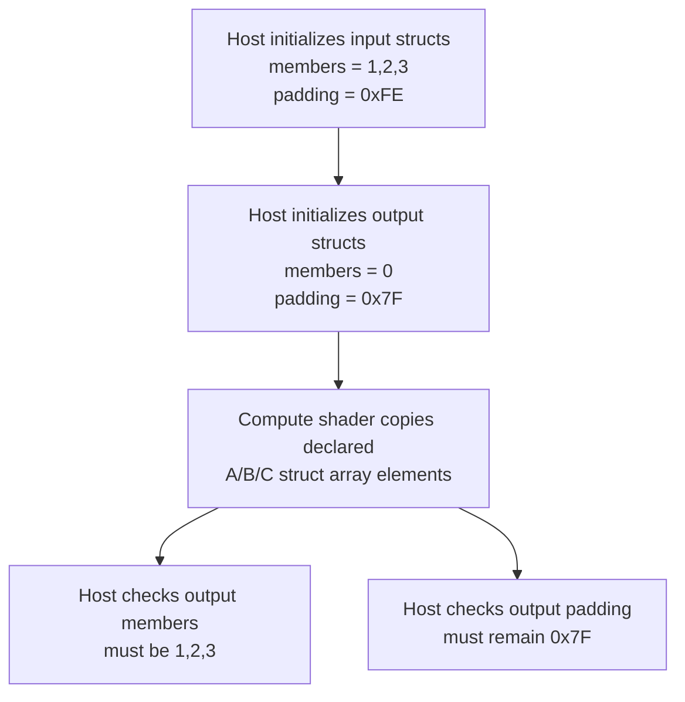

## Overview

**Core question:** Can a shader copy `std140` structures through declared members without overwriting destination bytes that are
padding from the shader's point of view?

- This page covers the delegated `memory_model.padding` test family implemented in
  [vktMemoryModelPadding.cpp](../../../modules/vulkan/memory_model/vktMemoryModelPadding.cpp) and attached to the category root by
  [vktMemoryModelMessagePassing.cpp](../../../modules/vulkan/memory_model/vktMemoryModelMessagePassing.cpp#L2410-L2413).
- The test family registers exactly one CTS test case, `memory_model.padding.test`
  [vktMemoryModelPadding.cpp](../../../modules/vulkan/memory_model/vktMemoryModelPadding.cpp#L360-L367),
  [memory-model.txt](../../../mustpass/main/vk-default/memory-model.txt#L8256-L8260).
- The test copies arrays of `std140` structures from a uniform buffer to a storage buffer in a compute shader. The shader sees
  only declared integer members, while the host mirror structures expose the padding bytes explicitly.
- Passing requires the scalar members to be copied and the destination padding bytes to remain at their original host-initialized
  value.

## Background Knowledge

- **`std140` structure layout.** `std140` applies alignment and array-stride rules that can leave bytes between or after declared members. For example, a structure containing one 32-bit integer can occupy a 16-byte array stride, leaving 12 bytes that are not a declared shader member.
- **Declared values versus representation bytes.** Shader structure assignment operates on declared members and their values, not on padding as if it were an additional field. Host code can nevertheless represent and inspect the complete byte layout, including bytes the shader cannot name directly.
- **Padding preservation.** Because padding is outside the declared value, copying a structure's members does not grant the shader an independent value to store in those bytes. This distinction matters whenever byte-level observation is used to check a higher-level shader assignment.

## Registration Hierarchy

```text
memory_model.padding
└── test
```

The hierarchy is small: there is one registered case, `test`, and no generated matrix of padding variants.

## Parameter Dimensions and Observed Values

This page has no generated parameter matrix. The fixed values below are part of the single `memory_model.padding.test` case; the
path has no intermediate nodes between the `padding` test family and the final test case leaf.

| Fixed value | Value in this test | Meaning in this test | Evidence |
|-------------|--------------------|----------------------|----------|
| Registered case count | one case: `test` | Confirms there are no intermediate nodes under `memory_model.padding` before the final test case leaf. | [registration](../../../modules/vulkan/memory_model/vktMemoryModelPadding.cpp#L360-L367), [mustpass](../../../mustpass/main/vk-default/memory-model.txt#L8256-L8260) |
| Array length | `3` | Creates three elements in each of `subA`, `subB`, and `subC`; dispatch x dimension is also `3`. | [kArrayLength](../../../modules/vulkan/memory_model/vktMemoryModelPadding.cpp#L68-L75), [dispatch](../../../modules/vulkan/memory_model/vktMemoryModelPadding.cpp#L340-L345) |
| Host padding regions | 12, 8, and 4 bytes | Makes the trailing `std140` padding of the three structure shapes directly checkable on the host. | [host structures](../../../modules/vulkan/memory_model/vktMemoryModelPadding.cpp#L44-L75) |
| Scalar input values | `a = 1`, `b = 2`, `c = 3` | Distinguishes copied declared members from untouched padding bytes. | [constants](../../../modules/vulkan/memory_model/vktMemoryModelPadding.cpp#L242-L247) |
| Padding sentinels | input padding `0xFE`, output-initial padding `0x7F` | Verifies output padding is not overwritten by the shader copy, even though input padding has a different value. | [constants and initialization](../../../modules/vulkan/memory_model/vktMemoryModelPadding.cpp#L242-L270) |

## Behavior Parameters

There is no multi-value behavioral axis under the `padding` test family. The registered path goes directly from
`memory_model.padding` to the single `test` case leaf, so the behavior parameter is the fixed leaf `test`.

The `test` case copies three arrays from input to output: `subA`, `subB`, and `subC`. Each array has three elements, so three
compute invocations copy one element from each array
[vktMemoryModelPadding.cpp](../../../modules/vulkan/memory_model/vktMemoryModelPadding.cpp#L68-L75),
[vktMemoryModelPadding.cpp](../../../modules/vulkan/memory_model/vktMemoryModelPadding.cpp#L214-L220),
[vktMemoryModelPadding.cpp](../../../modules/vulkan/memory_model/vktMemoryModelPadding.cpp#L340-L345).

The shader-side structures are compact declarations:

- `A` has one `int` member;
- `B` has two `int` members;
- `C` has three `int` members.

The host-side mirror structures deliberately expose the corresponding trailing padding as byte arrays: 12 bytes for `Pad12`,
8 bytes for `Pad8`, and 4 bytes for `Pad4`
[vktMemoryModelPadding.cpp](../../../modules/vulkan/memory_model/vktMemoryModelPadding.cpp#L44-L75).

## Shader Analysis

### Representative Shader Walkthrough 1

#### Parameter Values Chosen

Representative path:

```text
memory_model.padding.test
```

| Parameter choice | Meaning in this representative case |
|------------------|-------------------------------------|
| `padding.test` | Selects the only executable case in the delegated `memory_model.padding` test family. |
| `std140` input/output blocks | Makes the three shader-declared structure shapes use 16-byte structure alignment, leaving trailing padding bytes outside the declared GLSL members. |
| `A`, `B`, and `C` arrays | Copies three arrays whose element structures have one, two, and three declared `int` members. |
| `kArrayLength = 3` | Dispatches three compute invocations; each invocation copies one element from each array. |
| Host padding sentinels | Initializes input padding to `0xFE` and output padding to `0x7F`, so an illegal padding-byte overwrite is observable on readback. |

#### Purpose

This shader copies only shader-declared `std140` structure members from a uniform buffer to a storage buffer. The test passes only if
host-visible destination padding bytes remain untouched while declared scalar members are copied correctly.

#### Structural Design



#### Shader Code

Reconstructed GLSL for this path:

```glsl
#version 450
#pragma use_vulkan_memory_model

/// `std140` makes this structure occupy a 16-byte-aligned slot in the buffer layout.
/// GLSL declares only `a`; the host mirror exposes the trailing 12 bytes as padding.
struct A {
    int a;
};

/// GLSL declares two 32-bit integer members; the host mirror checks the trailing 8 padding bytes.
struct B {
    int a, b;
};

/// GLSL declares three 32-bit integer members; the host mirror checks the trailing 4 padding bytes.
struct C {
    int a, b, c;
};

/// Both input and output blocks contain three elements of each structure shape.
struct BufferStructure {
    A subA[3];
    B subB[3];
    C subC[3];
};

/// Binding 0 is the host-initialized uniform buffer. Its scalar members contain 1, 2, and 3;
/// its padding bytes contain 0xFE but are not declared as shader-visible fields.
layout (set=0, binding=0, std140) uniform InputBlock
{
    BufferStructure inBlock;
};

/// Binding 1 is the host-readable storage buffer. It starts with scalar members 0 and padding bytes 0x7F.
/// The shader writes declared structure values here, and the host later checks that padding stayed 0x7F.
layout (set=0, binding=1, std140) buffer OutputBlock
{
    BufferStructure outBlock;
};

void main()
{
    /// One compute invocation handles one array element from each of the three structure arrays.
    const uint idx = gl_GlobalInvocationID.x;

    /// Structure assignment copies only GLSL-declared members. Padding bytes are not addressable shader fields.
    outBlock.subA[idx] = inBlock.subA[idx];
    outBlock.subB[idx] = inBlock.subB[idx];
    outBlock.subC[idx] = inBlock.subC[idx];
}
```

#### Additional Info

- The host mirror structures deliberately add explicit `padding` byte arrays after the shader-visible members, so readback can
  detect whether padding was overwritten by the structure assignments
  [host mirror structures](../../../modules/vulkan/memory_model/vktMemoryModelPadding.cpp#L44-L75).
- The shader source does not declare padding fields; the generated GLSL contains only `A.a`, `B.a`, `B.b`, and `C.a` / `C.b` /
  `C.c` [shader generation](../../../modules/vulkan/memory_model/vktMemoryModelPadding.cpp#L177-L223).
- The host dispatches exactly `kArrayLength` compute invocations, matching the three elements in each `subA`, `subB`, and `subC`
  array [dispatch](../../../modules/vulkan/memory_model/vktMemoryModelPadding.cpp#L340-L345).

#### Parameter Variation Summary

There are no shader-level parameter variants for this test family. The only registered path is `memory_model.padding.test`; all
values above are fixed by the single registered case.

#### SPIR-V

- Status: generated and validated
- Source: reconstructed GLSL from this walkthrough
- Stage: `comp`
- Target SPIRV version: `spirv1.3`

<details>
<summary>Click to expand SPIRV asm code</summary>

```llvm
; SPIR-V
; Version: 1.3
; Generator: Khronos Glslang Reference Front End; 10
; Bound: 55
; Schema: 0
               OpCapability Shader
               OpCapability VulkanMemoryModel
               OpExtension "SPV_KHR_vulkan_memory_model"
          %1 = OpExtInstImport "GLSL.std.450"
               OpMemoryModel Logical Vulkan
               OpEntryPoint GLCompute %main "main" %gl_GlobalInvocationID
               OpExecutionMode %main LocalSize 1 1 1
               OpSource GLSL 450
               OpName %main "main"
               OpName %idx "idx"
               OpName %gl_GlobalInvocationID "gl_GlobalInvocationID"
               OpName %A "A"
               OpMemberName %A 0 "a"
               OpName %B "B"
               OpMemberName %B 0 "a"
               OpMemberName %B 1 "b"
               OpName %C "C"
               OpMemberName %C 0 "a"
               OpMemberName %C 1 "b"
               OpMemberName %C 2 "c"
               OpName %BufferStructure "BufferStructure"
               OpMemberName %BufferStructure 0 "subA"
               OpMemberName %BufferStructure 1 "subB"
               OpMemberName %BufferStructure 2 "subC"
               OpName %OutputBlock "OutputBlock"
               OpMemberName %OutputBlock 0 "outBlock"
               OpName %_ ""
               OpName %InputBlock "InputBlock"
               OpMemberName %InputBlock 0 "inBlock"
               OpName %__0 ""
               OpDecorate %gl_GlobalInvocationID BuiltIn GlobalInvocationId
               OpMemberDecorate %A 0 Offset 0
               OpDecorate %_arr_A_uint_3 ArrayStride 16
               OpMemberDecorate %B 0 Offset 0
               OpMemberDecorate %B 1 Offset 4
               OpDecorate %_arr_B_uint_3 ArrayStride 16
               OpMemberDecorate %C 0 Offset 0
               OpMemberDecorate %C 1 Offset 4
               OpMemberDecorate %C 2 Offset 8
               OpDecorate %_arr_C_uint_3 ArrayStride 16
               OpMemberDecorate %BufferStructure 0 Offset 0
               OpMemberDecorate %BufferStructure 1 Offset 48
               OpMemberDecorate %BufferStructure 2 Offset 96
               OpMemberDecorate %OutputBlock 0 Offset 0
               OpDecorate %OutputBlock Block
               OpDecorate %_ DescriptorSet 0
               OpDecorate %_ Binding 1
               OpMemberDecorate %InputBlock 0 Offset 0
               OpDecorate %InputBlock Block
               OpDecorate %__0 DescriptorSet 0
               OpDecorate %__0 Binding 0
       %void = OpTypeVoid
          %3 = OpTypeFunction %void
       %uint = OpTypeInt 32 0
%_ptr_Function_uint = OpTypePointer Function %uint
     %v3uint = OpTypeVector %uint 3
%_ptr_Input_v3uint = OpTypePointer Input %v3uint
%gl_GlobalInvocationID = OpVariable %_ptr_Input_v3uint Input
     %uint_0 = OpConstant %uint 0
%_ptr_Input_uint = OpTypePointer Input %uint
        %int = OpTypeInt 32 1
          %A = OpTypeStruct %int
     %uint_3 = OpConstant %uint 3
%_arr_A_uint_3 = OpTypeArray %A %uint_3
          %B = OpTypeStruct %int %int
%_arr_B_uint_3 = OpTypeArray %B %uint_3
          %C = OpTypeStruct %int %int %int
%_arr_C_uint_3 = OpTypeArray %C %uint_3
%BufferStructure = OpTypeStruct %_arr_A_uint_3 %_arr_B_uint_3 %_arr_C_uint_3
%OutputBlock = OpTypeStruct %BufferStructure
%_ptr_StorageBuffer_OutputBlock = OpTypePointer StorageBuffer %OutputBlock
          %_ = OpVariable %_ptr_StorageBuffer_OutputBlock StorageBuffer
      %int_0 = OpConstant %int 0
 %InputBlock = OpTypeStruct %BufferStructure
%_ptr_Uniform_InputBlock = OpTypePointer Uniform %InputBlock
        %__0 = OpVariable %_ptr_Uniform_InputBlock Uniform
%_ptr_Uniform_A = OpTypePointer Uniform %A
%_ptr_StorageBuffer_A = OpTypePointer StorageBuffer %A
      %int_1 = OpConstant %int 1
%_ptr_Uniform_B = OpTypePointer Uniform %B
%_ptr_StorageBuffer_B = OpTypePointer StorageBuffer %B
      %int_2 = OpConstant %int 2
%_ptr_Uniform_C = OpTypePointer Uniform %C
%_ptr_StorageBuffer_C = OpTypePointer StorageBuffer %C
       %main = OpFunction %void None %3
          %5 = OpLabel
        %idx = OpVariable %_ptr_Function_uint Function
         %14 = OpAccessChain %_ptr_Input_uint %gl_GlobalInvocationID %uint_0
         %15 = OpLoad %uint %14
               OpStore %idx %15
         %29 = OpLoad %uint %idx
         %33 = OpLoad %uint %idx
         %35 = OpAccessChain %_ptr_Uniform_A %__0 %int_0 %int_0 %33
         %36 = OpLoad %A %35
         %38 = OpAccessChain %_ptr_StorageBuffer_A %_ %int_0 %int_0 %29
               OpStore %38 %36
         %40 = OpLoad %uint %idx
         %41 = OpLoad %uint %idx
         %43 = OpAccessChain %_ptr_Uniform_B %__0 %int_0 %int_1 %41
         %44 = OpLoad %B %43
         %46 = OpAccessChain %_ptr_StorageBuffer_B %_ %int_0 %int_1 %40
               OpStore %46 %44
         %48 = OpLoad %uint %idx
         %49 = OpLoad %uint %idx
         %51 = OpAccessChain %_ptr_Uniform_C %__0 %int_0 %int_2 %49
         %52 = OpLoad %C %51
         %54 = OpAccessChain %_ptr_StorageBuffer_C %_ %int_0 %int_2 %48
               OpStore %54 %52
               OpReturn
               OpFunctionEnd
```

</details>

## Runtime Execution and Result Checking

- The host allocates two host-visible buffers with the size of `BufferStructure`: binding `0` is a uniform buffer input, and
  binding `1` is a storage buffer output
  [vktMemoryModelPadding.cpp](../../../modules/vulkan/memory_model/vktMemoryModelPadding.cpp#L242-L255),
  [vktMemoryModelPadding.cpp](../../../modules/vulkan/memory_model/vktMemoryModelPadding.cpp#L272-L296).
- The input buffer is initialized with scalar values `1`, `2`, and `3`, and all input padding bytes are initialized to `0xFE`.
  The output buffer starts with scalar values `0` and padding bytes `0x7F`
  [vktMemoryModelPadding.cpp](../../../modules/vulkan/memory_model/vktMemoryModelPadding.cpp#L256-L270).
- The host flushes both allocations, records a single compute dispatch, and uses host-to-compute and compute-to-host buffer memory
  barriers around the dispatch
  [vktMemoryModelPadding.cpp](../../../modules/vulkan/memory_model/vktMemoryModelPadding.cpp#L269-L270),
  [vktMemoryModelPadding.cpp](../../../modules/vulkan/memory_model/vktMemoryModelPadding.cpp#L322-L348).
- After execution, the host invalidates the output allocation and calls `checkValues(kA, kB, kC, kOutputPaddingByte)`
  [vktMemoryModelPadding.cpp](../../../modules/vulkan/memory_model/vktMemoryModelPadding.cpp#L350-L355).
- Passing requires every copied scalar member to equal `1`, `2`, or `3` as appropriate, and every output padding byte to remain
  `0x7F` [vktMemoryModelPadding.cpp](../../../modules/vulkan/memory_model/vktMemoryModelPadding.cpp#L99-L133).

| Resource | Created/configured by host? | Bound to GPU? | Device access | Host readback | Role |
|----------|-----------------------------|---------------|---------------|---------------|------|
| Input uniform buffer | Yes | Descriptor binding `0` | Read by compute shader | No | Provides `std140` source structures with scalar values and input padding sentinel bytes. |
| Output storage buffer | Yes | Descriptor binding `1` | Written by compute shader | Yes | Contains copied scalar members and destination padding bytes checked by the host. |
| Compute pipeline | Yes | Pipeline state | Executes structure assignments | No | Runs the generated GLSL compute shader. |
| Padding byte arrays | Host-side struct fields only | No descriptor | Not directly addressed as shader fields | Yes, through output struct mirror | Oracle for bytes not declared in shader structures. |

## Failure Meaning

### Failure Cause Mapping

Because `memory_model.padding.test` is a single fixed case with no multi-value behavioral axis, any failure points to the same
combined check: declared scalar members must be copied correctly, and destination padding bytes must remain untouched.

| If this behavior parameter value fails | Possible failure cause(s) |
|----------------------------------------|---------------------------|
| `test` | Incorrect declared-member copy or padding preservation for `std140` structure assignment. |

### Cause Analysis

#### Incorrect declared-member copy or padding preservation for `std140` structure assignment

**Possible failure symptoms:** The host-side `checkValues(kA, kB, kC, kOutputPaddingByte)` check fails because at least one copied
scalar member is not `1`, `2`, or `3` as expected, or at least one destination padding byte changed from the output sentinel
value `0x7F` [vktMemoryModelPadding.cpp](../../../modules/vulkan/memory_model/vktMemoryModelPadding.cpp#L99-L133),
[vktMemoryModelPadding.cpp](../../../modules/vulkan/memory_model/vktMemoryModelPadding.cpp#L350-L355).

**Possible implementation causes:** The generated compute shader assigns whole GLSL structures in `std140` input and output
blocks, but the shader-declared structures contain only scalar members and no padding fields
[vktMemoryModelPadding.cpp](../../../modules/vulkan/memory_model/vktMemoryModelPadding.cpp#L177-L223). A failure can therefore
come from compiler lowering or buffer-access code that copies, stores, or coalesces more bytes than the shader-declared members
require, from incorrect `std140` offset/stride handling for the three structure shapes, or from the host/device visibility path
failing to make the initialized input or written output data visible at the points checked by the test
[vktMemoryModelPadding.cpp](../../../modules/vulkan/memory_model/vktMemoryModelPadding.cpp#L322-L355).

## Case Pruning

### Requirement-based pruning

- The case requires the `VK_KHR_vulkan_memory_model` extension and the `vulkanMemoryModel` feature
  [vktMemoryModelPadding.cpp](../../../modules/vulkan/memory_model/vktMemoryModelPadding.cpp#L225-L232).
- If that requirement is not met, the case is unsupported rather than failed.

### Design-based pruning

- There is no generated padding-case matrix to prune. The test family registers one test case leaf, `test`
  [vktMemoryModelPadding.cpp](../../../modules/vulkan/memory_model/vktMemoryModelPadding.cpp#L360-L367).
- The fixed structure shapes cover trailing padding sizes of 12, 8, and 4 bytes under the selected `std140` layout. Other possible
  structure shapes are not registered as separate CTS cases in this file.

## Key Takeaways

- `memory_model.padding.test` is a single fixed case, so the behavioral axis is the fixed `test` leaf rather than a generated
  matrix of padding variants.
- The shader copies only declared structure members, while the host checks explicit padding byte arrays in mirror structures.
- Different sentinel values make corruption visible: input padding is `0xFE`, while output padding must remain `0x7F`.
- See `## Failure Meaning` for the failure interpretation: a failing result means the declared scalar copy, padding preservation,
  layout handling, or host/device visibility path did not satisfy the test's validation rule.

## Source Reference Appendix

| Entry point | Link | Why it matters |
|-------------|------|----------------|
| Delegated test family attachment | [vktMemoryModelMessagePassing.cpp#L2410-L2413](../../../modules/vulkan/memory_model/vktMemoryModelMessagePassing.cpp#L2410-L2413) | Adds the `padding` test family under the `memory_model` test category. |
| Factory declaration | [vktMemoryModelPadding.hpp#L30-L35](../../../modules/vulkan/memory_model/vktMemoryModelPadding.hpp#L30-L35) | Declares `createPaddingTests`. |
| Host mirror structures | [vktMemoryModelPadding.cpp#L44-L75](../../../modules/vulkan/memory_model/vktMemoryModelPadding.cpp#L44-L75) | Defines host-visible scalar fields and explicit padding byte arrays. |
| Initialization and padding checks | [vktMemoryModelPadding.cpp#L77-L133](../../../modules/vulkan/memory_model/vktMemoryModelPadding.cpp#L77-L133) | Initializes scalar values and padding sentinels, then checks copied members and untouched padding. |
| Shader generation | [vktMemoryModelPadding.cpp#L177-L223](../../../modules/vulkan/memory_model/vktMemoryModelPadding.cpp#L177-L223) | Emits the `std140` input/output blocks and structure assignments. |
| Support checks | [vktMemoryModelPadding.cpp#L225-L232](../../../modules/vulkan/memory_model/vktMemoryModelPadding.cpp#L225-L232) | Requires the Vulkan memory model extension and feature. |
| Runtime execution | [vktMemoryModelPadding.cpp#L234-L355](../../../modules/vulkan/memory_model/vktMemoryModelPadding.cpp#L234-L355) | Creates buffers, descriptors, pipeline, barriers, dispatch, and final host validation. |
| Test case leaf registration | [vktMemoryModelPadding.cpp#L360-L367](../../../modules/vulkan/memory_model/vktMemoryModelPadding.cpp#L360-L367) | Registers exactly one test case leaf named `test`. |
| Mustpass entry | [memory-model.txt#L8256-L8260](../../../mustpass/main/vk-default/memory-model.txt#L8256-L8260) | Shows the single `dEQP-VK.memory_model.padding.test` entry between message-passing and shared-layout coverage. |
