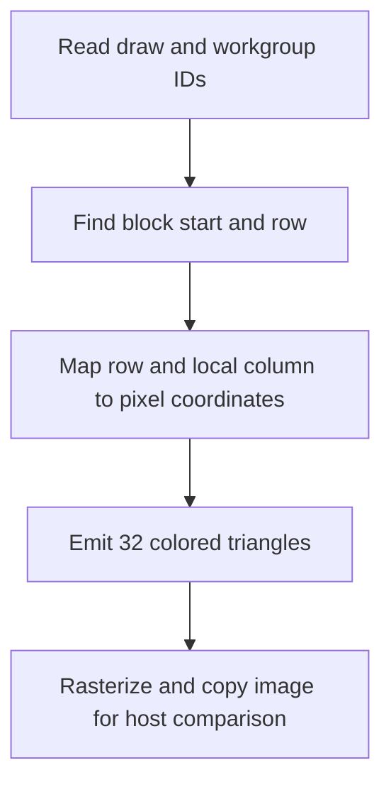

## Overview

**Core question:** Do the NV mesh task draw commands honor direct, indirect, and indirect-count parameters while producing the expected image?

- This page covers the `mesh_shader.nv.api` test family implemented by [vktMeshShaderApiTests.cpp](../../../modules/vulkan/mesh_shader/vktMeshShaderApiTests.cpp#L64-L113).
- The factory registers three draw-command families. The cases vary task count, indirect-buffer layout, count-buffer selection, task-shader use, and `firstTask`.
- Each case renders a 32 by 64 `VK_FORMAT_R8G8B8A8_UNORM` image. The host copies that image to a host-visible buffer and compares every pixel with a generated reference.
- The current default mustpass contains 436 `mesh_shader.nv.api` cases: 20 `draw`, 96 `draw_indirect`, and 320 `draw_indirect_count` entries.

## Background Knowledge

- A mesh draw launches mesh workgroups directly, or launches task workgroups whose output determines the mesh workgroups. The NV task shader can pass per-task data to its mesh children through `PerTaskNV` outputs.
- Direct mesh draws take their workgroup count and first workgroup ID from command parameters. Indirect draws read `VkDrawMeshTasksIndirectCommandNV` records from a buffer. Indirect-count draws additionally read a 32-bit draw count and execute the minimum of that value and `maxDrawCount`.
- A mesh shader writes output primitives, indices, and per-primitive attributes. The fragment shader consumes the per-primitive color used by this test's image oracle.

## Registration Hierarchy

```text
mesh_shader.nv.api
├── draw
├── draw_indirect
└── draw_indirect_count
```

The three direct children are the draw-command families. Their generated parameter paths are expanded in the mustpass file rather than in this compact tree.

## Parameter Dimensions and Observed Values

The factory loops over every listed dimension and skips combinations that do not apply to the selected draw family. The values below are the observed registration inputs, not merely the values that happen to appear in one case.

| Dimension | Registered values | Meaning in this test | Evidence |
|-----------|-------------------|----------------------|----------|
| Draw family | `draw`, `draw_indirect`, `draw_indirect_count` | Selects the Vulkan command used to launch mesh workgroups. | [factory](../../../modules/vulkan/mesh_shader/vktMeshShaderApiTests.cpp#L658-L666) |
| `drawCount` | `0`, `1`, `2`, `32`, `64` | For `draw`, this is the direct task count. For `draw_indirect`, it is the number of draws to execute. For `draw_indirect_count`, it supplies either the count-buffer value or `maxDrawCount`; the effective draw count is the selected value. The host still allocates one indirect record when this value is zero. | [draw-count cases](../../../modules/vulkan/mesh_shader/vktMeshShaderApiTests.cpp#L668-L670), [record allocation and count selection](../../../modules/vulkan/mesh_shader/vktMeshShaderApiTests.cpp#L431-L448), [indirect command recording](../../../modules/vulkan/mesh_shader/vktMeshShaderApiTests.cpp#L577-L596) |
| Indirect arguments | `no_indirect_args`; `offset_0_stride_0`, `offset_0_stride_normal`, `offset_0_stride_large`; `offset_alt_stride_0`, `offset_alt_stride_normal`, `offset_alt_stride_large` | Selects no buffer for direct draws, or selects the indirect record offset and stride. `normal` is `sizeof(VkDrawMeshTasksIndirectCommandNV)`, `large` is twice that size plus 4, and `alt` is offset `20`. | [indirect argument cases](../../../modules/vulkan/mesh_shader/vktMeshShaderApiTests.cpp#L671-L691) |
| Count limit | `no_count_limit`, `count_limit_buffer`, `count_limit_max_count` | Direct and non-count indirect draws have no count-buffer mode. Count indirect draws either use the buffer value as the actual count or use `maxDrawCount` to limit a larger buffer value. | [count-limit cases](../../../modules/vulkan/mesh_shader/vktMeshShaderApiTests.cpp#L693-L701), [count-buffer setup](../../../modules/vulkan/mesh_shader/vktMeshShaderApiTests.cpp#L547-L559) |
| Count-buffer offset | `no_count_offset`, `count_offset_0`, `count_offset_alt` | Count indirect draws read the count at offset `0` or `20`; other families have no count buffer. | [count-offset cases](../../../modules/vulkan/mesh_shader/vktMeshShaderApiTests.cpp#L703-L711) |
| Task stage | `no_task_shader`, `with_task_shader` | Selects direct mesh workgroups or a task-to-mesh path. | [task cases](../../../modules/vulkan/mesh_shader/vktMeshShaderApiTests.cpp#L713-L719) |
| First workgroup | `first_task_zero`, `first_task_nonzero` | Uses `firstTask = 0` or `1001` in command parameters and push constants. | [first-task cases](../../../modules/vulkan/mesh_shader/vktMeshShaderApiTests.cpp#L722-L729) |
| Seed | Per-case values beginning at `1628678795u` | Gives each case's block-size generator a deterministic pseudorandom seed. It changes the partition of rows for indirect records, not the registered path. | [seed and case construction](../../../modules/vulkan/mesh_shader/vktMeshShaderApiTests.cpp#L731-L796) |

The default mustpass has 20 direct cases, 96 indirect cases, and 320 indirect-count cases. The counts reflect pruning of inapplicable dimensions and invalid stride-zero combinations, not a Cartesian product of every table row. [mesh-shader.txt](../../../mustpass/main/vk-default/mesh-shader.txt#L26891-L26910) shows the direct entries, and the following lines continue with the indirect families.

## Behavior Parameters

The primary behavioral axis is the registered draw family. It changes how the command obtains the number and parameters of mesh workgroups, while the remaining dimensions exercise legal variants of that command path.

### `draw` | Direct task draw

`vkCmdDrawMeshTasksNV` receives `drawCount` and `firstTask` directly. With no task shader, each dispatched workgroup runs the mesh shader. With a task shader, each task workgroup emits one mesh workgroup through `gl_TaskCountNV = 1`.

### `draw_indirect` | Buffer-sourced draw records

`vkCmdDrawMeshTasksIndirectNV` reads `drawCount` `VkDrawMeshTasksIndirectCommandNV` records from a host-visible indirect buffer. Each record contains a task count derived from the generated block sizes and the selected `firstTask`; the first `drawCount - 1` block sizes are pseudorandomly chosen and the final block receives the remaining rows. The record address advances by the selected stride.

### `draw_indirect_count` | Buffer-sourced draw count

`vkCmdDrawMeshTasksIndirectCountNV` reads a 32-bit count from the count buffer, then executes no more than the selected `maxDrawCount`. The `count_limit_buffer` case stores `drawCount`, while `count_limit_max_count` stores `max(1, drawCount) + 1` and relies on `maxDrawCount = drawCount` to clamp execution.

## Shader Analysis

The mesh shader is central to the image check, so one representative no-task path is shown. It uses the direct command family and avoids duplicating the same shader for indirect parameter layouts, which do not change the generated mesh shader source.

### Representative Shader Walkthrough 1

#### Parameter Values Chosen

Representative path:

```text
dEQP-VK.mesh_shader.nv.api.draw.draw_count_1.no_indirect_args.no_count_limit.no_count_offset.no_task_shader.first_task_zero
```

| Parameter choice | Meaning in this representative case |
|------------------|---------------------------------------|
| `draw` | Selects `vkCmdDrawMeshTasksNV`. |
| `draw_count_1` | Launches one mesh workgroup, which fills one framebuffer row. |
| `no_task_shader` | The mesh shader receives workgroup execution directly. |
| `first_task_zero` | Uses `firstTask = 0`, so `gl_WorkGroupID.x` directly identifies the row. |
| `BlockSizes` binding | Supplies the row partition used by the common shader source. With one draw, the sole block contains all 64 rows. |

#### Purpose

The mesh shader emits 32 triangles, one per framebuffer column, and assigns each primitive a color derived from its pixel center. The fragment shader passes that color through, allowing the host to compare the rendered image against the expected row and column coordinates.

#### Structural Design



#### Shader Code

Reconstructed GLSL for the no-task representative path:

```glsl
#version 460
#extension GL_NV_mesh_shader : enable

layout (local_size_x=32) in;
layout (triangles) out;
layout (max_vertices=96, max_primitives=32) out;

layout (push_constant, std430) uniform MeshPushConstantBlock {
    uint width;
    uint height;
    uint firstTask;
} pc;

layout (location=0) perprimitiveNV out vec4 primitiveColor[];

layout (set=0, binding=0, std430) readonly buffer BlockSizes {
    uint blockSize[];
} bsz;

uint startOfBlock (uint blockNumber)
{
    uint start = 0;
    for (uint i = 0; i < blockNumber; i++)
        start += bsz.blockSize[i];
    return start;
}

void main ()
{
    const uint blockNumber = uint(gl_DrawID);
    const uint blockRow = (gl_WorkGroupID.x - pc.firstTask);

    // Each workgroup will fill one row, and each invocation will generate a
    // triangle around the pixel center in each column.
    const uint row = startOfBlock(blockNumber) + blockRow;
    const uint col = gl_LocalInvocationID.x;

    const float fHeight = float(pc.height);
    const float fWidth = float(pc.width);

    // Pixel coordinates, normalized.
    const float rowNorm = (float(row) + 0.5) / fHeight;
    const float colNorm = (float(col) + 0.5) / fWidth;

    // Framebuffer coordinates.
    const float coordX = (colNorm * 2.0) - 1.0;
    const float coordY = (rowNorm * 2.0) - 1.0;

    const float pixelWidth = 2.0 / fWidth;
    const float pixelHeight = 2.0 / fHeight;

    const float offsetX = pixelWidth / 2.0;
    const float offsetY = pixelHeight / 2.0;

    const uint baseIndex = col*3;
    const uvec3 indices = uvec3(baseIndex, baseIndex + 1, baseIndex + 2);

    gl_PrimitiveCountNV = 32u;
    primitiveColor[col] = vec4(rowNorm, colNorm, 0.0, 1.0);

    gl_PrimitiveIndicesNV[indices.x] = indices.x;
    gl_PrimitiveIndicesNV[indices.y] = indices.y;
    gl_PrimitiveIndicesNV[indices.z] = indices.z;

    gl_MeshVerticesNV[indices.x].gl_Position = vec4(coordX - offsetX, coordY + offsetY, 0.0, 1.0);
    gl_MeshVerticesNV[indices.y].gl_Position = vec4(coordX + offsetX, coordY + offsetY, 0.0, 1.0);
    gl_MeshVerticesNV[indices.z].gl_Position = vec4(coordX, coordY - offsetY, 0.0, 1.0);
}
```

#### Additional Info

- The host creates a 32 by 64 color attachment and initializes it to `(0, 0, 0, 1)`. The mesh shader fills one row per workgroup; the direct `draw_count_1` path therefore fills only row zero.
- The task shader variant changes the producer of mesh workgroups and adds a `PerTaskNV` payload, but it does not change the mesh shader's row and pixel construction.
- `gl_DrawID` selects the indirect block. It is zero for this direct representative and remains useful for the common source shared by indirect paths.

#### Parameter Variation Summary

| Parameter dimension | Shader-level variation from this shader | Evidence |
|---------------------|---------------------------------------|----------|
| Draw family | The command source changes, but the mesh shader source stays the same across direct and indirect families. | [draw dispatch](../../../modules/vulkan/mesh_shader/vktMeshShaderApiTests.cpp#L577-L597) |
| `drawCount` | The number of executed workgroups changes. The shader maps each workgroup to a row; indirect cases also change the number of block-size records. | [block sizes and dispatch](../../../modules/vulkan/mesh_shader/vktMeshShaderApiTests.cpp#L431-L452) |
| Task stage | With a task shader, the mesh shader reads `PerTaskNV` values for block number and row. Without it, the mesh shader uses `gl_DrawID` and `gl_WorkGroupID` directly. | [shader generation](../../../modules/vulkan/mesh_shader/vktMeshShaderApiTests.cpp#L213-L317) |
| `firstTask` | Changes the workgroup ID origin used in `blockRow`; the generated shader source remains unchanged. | [push constants and dispatch](../../../modules/vulkan/mesh_shader/vktMeshShaderApiTests.cpp#L483-L489), [direct draw](../../../modules/vulkan/mesh_shader/vktMeshShaderApiTests.cpp#L577-L580) |

#### SPIR-V

- Status: generated and validated
- Source: reconstructed GLSL from this walkthrough
- Stage: `mesh`
- Target SPIRV version: `spirv1.0`

<details>
<summary>Click to expand SPIRV asm code</summary>

```llvm
; SPIR-V
; Version: 1.0
; Generator: Khronos Glslang Reference Front End; 11
; Bound: 201
; Schema: 0
               OpCapability DrawParameters
               OpCapability MeshShadingNV
               OpExtension "SPV_KHR_shader_draw_parameters"
               OpExtension "SPV_NV_mesh_shader"
          %1 = OpExtInstImport "GLSL.std.450"
               OpMemoryModel Logical GLSL450
               OpEntryPoint MeshNV %main "main" %gl_DrawID %gl_WorkGroupID %gl_LocalInvocationID %gl_PrimitiveCountNV %primitiveColor %gl_PrimitiveIndicesNV %gl_MeshVerticesNV
               OpExecutionMode %main LocalSize 32 1 1
               OpExecutionMode %main OutputVertices 96
               OpExecutionMode %main OutputPrimitivesEXT 32
               OpExecutionMode %main OutputTrianglesEXT
               OpSource GLSL 460
               OpSourceExtension "GL_NV_mesh_shader"
               OpName %main "main"
               OpName %startOfBlock_u1_ "startOfBlock(u1;"
               OpName %blockNumber "blockNumber"
               OpName %start "start"
               OpName %i "i"
               OpName %BlockSizes "BlockSizes"
               OpMemberName %BlockSizes 0 "blockSize"
               OpName %bsz "bsz"
               OpName %blockNumber_0 "blockNumber"
               OpName %gl_DrawID "gl_DrawID"
               OpName %blockRow "blockRow"
               OpName %gl_WorkGroupID "gl_WorkGroupID"
               OpName %MeshPushConstantBlock "MeshPushConstantBlock"
               OpMemberName %MeshPushConstantBlock 0 "width"
               OpMemberName %MeshPushConstantBlock 1 "height"
               OpMemberName %MeshPushConstantBlock 2 "firstTask"
               OpName %pc "pc"
               OpName %row "row"
               OpName %param "param"
               OpName %col "col"
               OpName %gl_LocalInvocationID "gl_LocalInvocationID"
               OpName %fHeight "fHeight"
               OpName %fWidth "fWidth"
               OpName %rowNorm "rowNorm"
               OpName %colNorm "colNorm"
               OpName %coordX "coordX"
               OpName %coordY "coordY"
               OpName %pixelWidth "pixelWidth"
               OpName %pixelHeight "pixelHeight"
               OpName %offsetX "offsetX"
               OpName %offsetY "offsetY"
               OpName %baseIndex "baseIndex"
               OpName %indices "indices"
               OpName %gl_PrimitiveCountNV "gl_PrimitiveCountNV"
               OpName %primitiveColor "primitiveColor"
               OpName %gl_PrimitiveIndicesNV "gl_PrimitiveIndicesNV"
               OpName %gl_MeshPerVertexNV "gl_MeshPerVertexNV"
               OpMemberName %gl_MeshPerVertexNV 0 "gl_Position"
               OpMemberName %gl_MeshPerVertexNV 1 "gl_PointSize"
               OpMemberName %gl_MeshPerVertexNV 2 "gl_ClipDistance"
               OpMemberName %gl_MeshPerVertexNV 3 "gl_CullDistance"
               OpMemberName %gl_MeshPerVertexNV 4 "gl_PositionPerViewNV"
               OpMemberName %gl_MeshPerVertexNV 5 "gl_ClipDistancePerViewNV"
               OpMemberName %gl_MeshPerVertexNV 6 "gl_CullDistancePerViewNV"
               OpName %gl_MeshVerticesNV "gl_MeshVerticesNV"
               OpDecorate %_runtimearr_uint ArrayStride 4
               OpDecorate %BlockSizes BufferBlock
               OpMemberDecorate %BlockSizes 0 NonWritable
               OpMemberDecorate %BlockSizes 0 Offset 0
               OpDecorate %bsz NonWritable
               OpDecorate %bsz Binding 0
               OpDecorate %bsz DescriptorSet 0
               OpDecorate %gl_DrawID BuiltIn DrawIndex
               OpDecorate %gl_WorkGroupID BuiltIn WorkgroupId
               OpDecorate %MeshPushConstantBlock Block
               OpMemberDecorate %MeshPushConstantBlock 0 Offset 0
               OpMemberDecorate %MeshPushConstantBlock 1 Offset 4
               OpMemberDecorate %MeshPushConstantBlock 2 Offset 8
               OpDecorate %gl_LocalInvocationID BuiltIn LocalInvocationId
               OpDecorate %gl_PrimitiveCountNV BuiltIn PrimitiveCountNV
               OpDecorate %primitiveColor Location 0
               OpDecorate %primitiveColor PerPrimitiveEXT
               OpDecorate %gl_PrimitiveIndicesNV BuiltIn PrimitiveIndicesNV
               OpDecorate %gl_MeshPerVertexNV Block
               OpMemberDecorate %gl_MeshPerVertexNV 0 BuiltIn Position
               OpMemberDecorate %gl_MeshPerVertexNV 1 BuiltIn PointSize
               OpMemberDecorate %gl_MeshPerVertexNV 2 BuiltIn ClipDistance
               OpMemberDecorate %gl_MeshPerVertexNV 3 BuiltIn CullDistance
               OpMemberDecorate %gl_MeshPerVertexNV 4 BuiltIn PositionPerViewNV
               OpMemberDecorate %gl_MeshPerVertexNV 4 PerViewNV
               OpMemberDecorate %gl_MeshPerVertexNV 5 BuiltIn ClipDistancePerViewNV
               OpMemberDecorate %gl_MeshPerVertexNV 5 PerViewNV
               OpMemberDecorate %gl_MeshPerVertexNV 6 BuiltIn CullDistancePerViewNV
               OpMemberDecorate %gl_MeshPerVertexNV 6 PerViewNV
               OpDecorate %gl_WorkGroupSize BuiltIn WorkgroupSize
       %void = OpTypeVoid
          %3 = OpTypeFunction %void
       %uint = OpTypeInt 32 0
%_ptr_Function_uint = OpTypePointer Function %uint
          %8 = OpTypeFunction %uint %_ptr_Function_uint
     %uint_0 = OpConstant %uint 0
       %bool = OpTypeBool
%_runtimearr_uint = OpTypeRuntimeArray %uint
 %BlockSizes = OpTypeStruct %_runtimearr_uint
%_ptr_Uniform_BlockSizes = OpTypePointer Uniform %BlockSizes
        %bsz = OpVariable %_ptr_Uniform_BlockSizes Uniform
        %int = OpTypeInt 32 1
      %int_0 = OpConstant %int 0
%_ptr_Uniform_uint = OpTypePointer Uniform %uint
      %int_1 = OpConstant %int 1
%_ptr_Input_int = OpTypePointer Input %int
  %gl_DrawID = OpVariable %_ptr_Input_int Input
     %v3uint = OpTypeVector %uint 3
%_ptr_Input_v3uint = OpTypePointer Input %v3uint
%gl_WorkGroupID = OpVariable %_ptr_Input_v3uint Input
%_ptr_Input_uint = OpTypePointer Input %uint
%MeshPushConstantBlock = OpTypeStruct %uint %uint %uint
%_ptr_PushConstant_MeshPushConstantBlock = OpTypePointer PushConstant %MeshPushConstantBlock
         %pc = OpVariable %_ptr_PushConstant_MeshPushConstantBlock PushConstant
      %int_2 = OpConstant %int 2
%_ptr_PushConstant_uint = OpTypePointer PushConstant %uint
%gl_LocalInvocationID = OpVariable %_ptr_Input_v3uint Input
      %float = OpTypeFloat 32
%_ptr_Function_float = OpTypePointer Function %float
  %float_0_5 = OpConstant %float 0.5
    %float_2 = OpConstant %float 2
    %float_1 = OpConstant %float 1
     %uint_3 = OpConstant %uint 3
%_ptr_Function_v3uint = OpTypePointer Function %v3uint
     %uint_1 = OpConstant %uint 1
     %uint_2 = OpConstant %uint 2
%_ptr_Output_uint = OpTypePointer Output %uint
%gl_PrimitiveCountNV = OpVariable %_ptr_Output_uint Output
    %uint_32 = OpConstant %uint 32
    %v4float = OpTypeVector %float 4
%_arr_v4float_uint_32 = OpTypeArray %v4float %uint_32
%_ptr_Output__arr_v4float_uint_32 = OpTypePointer Output %_arr_v4float_uint_32
%primitiveColor = OpVariable %_ptr_Output__arr_v4float_uint_32 Output
    %float_0 = OpConstant %float 0
%_ptr_Output_v4float = OpTypePointer Output %v4float
    %uint_96 = OpConstant %uint 96
%_arr_uint_uint_96 = OpTypeArray %uint %uint_96
%_ptr_Output__arr_uint_uint_96 = OpTypePointer Output %_arr_uint_uint_96
%gl_PrimitiveIndicesNV = OpVariable %_ptr_Output__arr_uint_uint_96 Output
%_arr_float_uint_1 = OpTypeArray %float %uint_1
     %uint_4 = OpConstant %uint 4
%_arr_v4float_uint_4 = OpTypeArray %v4float %uint_4
%_arr__arr_float_uint_1_uint_4 = OpTypeArray %_arr_float_uint_1 %uint_4
%gl_MeshPerVertexNV = OpTypeStruct %v4float %float %_arr_float_uint_1 %_arr_float_uint_1 %_arr_v4float_uint_4 %_arr__arr_float_uint_1_uint_4 %_arr__arr_float_uint_1_uint_4
%_arr_gl_MeshPerVertexNV_uint_96 = OpTypeArray %gl_MeshPerVertexNV %uint_96
%_ptr_Output__arr_gl_MeshPerVertexNV_uint_96 = OpTypePointer Output %_arr_gl_MeshPerVertexNV_uint_96
%gl_MeshVerticesNV = OpVariable %_ptr_Output__arr_gl_MeshPerVertexNV_uint_96 Output
%gl_WorkGroupSize = OpConstantComposite %v3uint %uint_32 %uint_1 %uint_1
       %main = OpFunction %void None %3
          %5 = OpLabel
%blockNumber_0 = OpVariable %_ptr_Function_uint Function
   %blockRow = OpVariable %_ptr_Function_uint Function
        %row = OpVariable %_ptr_Function_uint Function
      %param = OpVariable %_ptr_Function_uint Function
        %col = OpVariable %_ptr_Function_uint Function
    %fHeight = OpVariable %_ptr_Function_float Function
     %fWidth = OpVariable %_ptr_Function_float Function
    %rowNorm = OpVariable %_ptr_Function_float Function
    %colNorm = OpVariable %_ptr_Function_float Function
     %coordX = OpVariable %_ptr_Function_float Function
     %coordY = OpVariable %_ptr_Function_float Function
 %pixelWidth = OpVariable %_ptr_Function_float Function
%pixelHeight = OpVariable %_ptr_Function_float Function
    %offsetX = OpVariable %_ptr_Function_float Function
    %offsetY = OpVariable %_ptr_Function_float Function
  %baseIndex = OpVariable %_ptr_Function_uint Function
    %indices = OpVariable %_ptr_Function_v3uint Function
         %45 = OpLoad %int %gl_DrawID
         %46 = OpBitcast %uint %45
               OpStore %blockNumber_0 %46
         %52 = OpAccessChain %_ptr_Input_uint %gl_WorkGroupID %uint_0
         %53 = OpLoad %uint %52
         %59 = OpAccessChain %_ptr_PushConstant_uint %pc %int_2
         %60 = OpLoad %uint %59
         %61 = OpISub %uint %53 %60
               OpStore %blockRow %61
         %64 = OpLoad %uint %blockNumber_0
               OpStore %param %64
         %65 = OpFunctionCall %uint %startOfBlock_u1_ %param
         %66 = OpLoad %uint %blockRow
         %67 = OpIAdd %uint %65 %66
               OpStore %row %67
         %70 = OpAccessChain %_ptr_Input_uint %gl_LocalInvocationID %uint_0
         %71 = OpLoad %uint %70
               OpStore %col %71
         %75 = OpAccessChain %_ptr_PushConstant_uint %pc %int_1
         %76 = OpLoad %uint %75
         %77 = OpConvertUToF %float %76
               OpStore %fHeight %77
         %79 = OpAccessChain %_ptr_PushConstant_uint %pc %int_0
         %80 = OpLoad %uint %79
         %81 = OpConvertUToF %float %80
               OpStore %fWidth %81
         %83 = OpLoad %uint %row
         %84 = OpConvertUToF %float %83
         %86 = OpFAdd %float %84 %float_0_5
         %87 = OpLoad %float %fHeight
         %88 = OpFDiv %float %86 %87
               OpStore %rowNorm %88
         %90 = OpLoad %uint %col
         %91 = OpConvertUToF %float %90
         %92 = OpFAdd %float %91 %float_0_5
         %93 = OpLoad %float %fWidth
         %94 = OpFDiv %float %92 %93
               OpStore %colNorm %94
         %96 = OpLoad %float %colNorm
         %98 = OpFMul %float %96 %float_2
        %100 = OpFSub %float %98 %float_1
               OpStore %coordX %100
        %102 = OpLoad %float %rowNorm
        %103 = OpFMul %float %102 %float_2
        %104 = OpFSub %float %103 %float_1
               OpStore %coordY %104
        %106 = OpLoad %float %fWidth
        %107 = OpFDiv %float %float_2 %106
               OpStore %pixelWidth %107
        %109 = OpLoad %float %fHeight
        %110 = OpFDiv %float %float_2 %109
               OpStore %pixelHeight %110
        %112 = OpLoad %float %pixelWidth
        %113 = OpFDiv %float %112 %float_2
               OpStore %offsetX %113
        %115 = OpLoad %float %pixelHeight
        %116 = OpFDiv %float %115 %float_2
               OpStore %offsetY %116
        %118 = OpLoad %uint %col
        %120 = OpIMul %uint %118 %uint_3
               OpStore %baseIndex %120
        %123 = OpLoad %uint %baseIndex
        %124 = OpLoad %uint %baseIndex
        %126 = OpIAdd %uint %124 %uint_1
        %127 = OpLoad %uint %baseIndex
        %129 = OpIAdd %uint %127 %uint_2
        %130 = OpCompositeConstruct %v3uint %123 %126 %129
               OpStore %indices %130
               OpStore %gl_PrimitiveCountNV %uint_32
        %138 = OpLoad %uint %col
        %139 = OpLoad %float %rowNorm
        %140 = OpLoad %float %colNorm
        %142 = OpCompositeConstruct %v4float %139 %140 %float_0 %float_1
        %144 = OpAccessChain %_ptr_Output_v4float %primitiveColor %138
               OpStore %144 %142
        %149 = OpAccessChain %_ptr_Function_uint %indices %uint_0
        %150 = OpLoad %uint %149
        %151 = OpAccessChain %_ptr_Function_uint %indices %uint_0
        %152 = OpLoad %uint %151
        %153 = OpAccessChain %_ptr_Output_uint %gl_PrimitiveIndicesNV %150
               OpStore %153 %152
        %154 = OpAccessChain %_ptr_Function_uint %indices %uint_1
        %155 = OpLoad %uint %154
        %156 = OpAccessChain %_ptr_Function_uint %indices %uint_1
        %157 = OpLoad %uint %156
        %158 = OpAccessChain %_ptr_Output_uint %gl_PrimitiveIndicesNV %155
               OpStore %158 %157
        %159 = OpAccessChain %_ptr_Function_uint %indices %uint_2
        %160 = OpLoad %uint %159
        %161 = OpAccessChain %_ptr_Function_uint %indices %uint_2
        %162 = OpLoad %uint %161
        %163 = OpAccessChain %_ptr_Output_uint %gl_PrimitiveIndicesNV %160
               OpStore %163 %162
        %172 = OpAccessChain %_ptr_Function_uint %indices %uint_0
        %173 = OpLoad %uint %172
        %174 = OpLoad %float %coordX
        %175 = OpLoad %float %offsetX
        %176 = OpFSub %float %174 %175
        %177 = OpLoad %float %coordY
        %178 = OpLoad %float %offsetY
        %179 = OpFAdd %float %177 %178
        %180 = OpCompositeConstruct %v4float %176 %179 %float_0 %float_1
        %181 = OpAccessChain %_ptr_Output_v4float %gl_MeshVerticesNV %173 %int_0
               OpStore %181 %180
        %182 = OpAccessChain %_ptr_Function_uint %indices %uint_1
        %183 = OpLoad %uint %182
        %184 = OpLoad %float %coordX
        %185 = OpLoad %float %offsetX
        %186 = OpFAdd %float %184 %185
        %187 = OpLoad %float %coordY
        %188 = OpLoad %float %offsetY
        %189 = OpFAdd %float %187 %188
        %190 = OpCompositeConstruct %v4float %186 %189 %float_0 %float_1
        %191 = OpAccessChain %_ptr_Output_v4float %gl_MeshVerticesNV %183 %int_0
               OpStore %191 %190
        %192 = OpAccessChain %_ptr_Function_uint %indices %uint_2
        %193 = OpLoad %uint %192
        %194 = OpLoad %float %coordX
        %195 = OpLoad %float %coordY
        %196 = OpLoad %float %offsetY
        %197 = OpFSub %float %195 %196
        %198 = OpCompositeConstruct %v4float %194 %197 %float_0 %float_1
        %199 = OpAccessChain %_ptr_Output_v4float %gl_MeshVerticesNV %193 %int_0
               OpStore %199 %198
               OpReturn
               OpFunctionEnd
%startOfBlock_u1_ = OpFunction %uint None %8
%blockNumber = OpFunctionParameter %_ptr_Function_uint
         %11 = OpLabel
      %start = OpVariable %_ptr_Function_uint Function
          %i = OpVariable %_ptr_Function_uint Function
               OpStore %start %uint_0
               OpStore %i %uint_0
               OpBranch %15
         %15 = OpLabel
               OpLoopMerge %17 %18 None
               OpBranch %19
         %19 = OpLabel
         %20 = OpLoad %uint %i
         %21 = OpLoad %uint %blockNumber
         %23 = OpULessThan %bool %20 %21
               OpBranchConditional %23 %16 %17
         %16 = OpLabel
         %30 = OpLoad %uint %i
         %32 = OpAccessChain %_ptr_Uniform_uint %bsz %int_0 %30
         %33 = OpLoad %uint %32
         %34 = OpLoad %uint %start
         %35 = OpIAdd %uint %34 %33
               OpStore %start %35
               OpBranch %18
         %18 = OpLabel
         %36 = OpLoad %uint %i
         %38 = OpIAdd %uint %36 %int_1
               OpStore %i %38
               OpBranch %15
         %17 = OpLabel
         %39 = OpLoad %uint %start
               OpReturnValue %39
               OpFunctionEnd
```

</details>

## Runtime Execution and Result Checking

- `MeshApiInstance::iterate` creates a 32 by 64 single-sample `VK_FORMAT_R8G8B8A8_UNORM` color image with color-attachment and transfer-source usage, plus a matching framebuffer and render pass. [runtime setup](../../../modules/vulkan/mesh_shader/vktMeshShaderApiTests.cpp#L381-L429), [render target](../../../modules/vulkan/mesh_shader/vktMeshShaderApiTests.cpp#L491-L493)
- The host partitions the 64 rows into `max(1, drawCount)` positive block sizes. The final block receives the remaining rows. It stores those sizes in a storage buffer at descriptor set `0`, binding `0`. [block-size setup](../../../modules/vulkan/mesh_shader/vktMeshShaderApiTests.cpp#L431-L475)
- Push constants carry image width, image height, and `firstTask` to the mesh stage. When a task shader is enabled, a second push-constant range carries `one` and `firstTask` to the task stage. [push-constant layout](../../../modules/vulkan/mesh_shader/vktMeshShaderApiTests.cpp#L180-L209), [push data](../../../modules/vulkan/mesh_shader/vktMeshShaderApiTests.cpp#L477-L489)
- Indirect families allocate an indirect buffer containing one command per block. Count indirect cases also allocate a count buffer at offset `0` or `20`; the command uses the selected offset, stride, count-buffer offset, and maximum count. [indirect setup](../../../modules/vulkan/mesh_shader/vktMeshShaderApiTests.cpp#L518-L560), [command recording](../../../modules/vulkan/mesh_shader/vktMeshShaderApiTests.cpp#L577-L597)
- The command buffer begins a render pass, binds the descriptor set, pushes constants, binds the graphics pipeline, records the selected mesh draw, ends the render pass, copies the color image to a host-visible buffer, and waits for queue completion. [command recording and readback](../../../modules/vulkan/mesh_shader/vktMeshShaderApiTests.cpp#L563-L619)
- The host expects clear black pixels when `drawCount == 0`. For direct draws, rows at or above `drawCount` also remain clear. Other pixels must contain red `(y + 0.5) / 64` and green `(x + 0.5) / 32` components, with blue `0` and alpha `1`. The comparison threshold is `0.005` for red and green. [reference generation and comparison](../../../modules/vulkan/mesh_shader/vktMeshShaderApiTests.cpp#L621-L650)

| Resource | Created/configured by host? | Bound to GPU? | Device access | Host readback | Role |
|----------|-----------------------------|---------------|---------------|---------------|------|
| Color image | Yes | Color attachment and framebuffer view | Written by rasterization | Copied to output buffer | Rendered image under test. |
| `BlockSizes` buffer | Yes | Descriptor set `0`, binding `0` | Read by mesh shader | No | Maps each draw and local row to a framebuffer row. |
| Push constants | Yes | Mesh stage, and task stage when enabled | Read by shader stages | No | Supplies image dimensions and workgroup origin. |
| Indirect buffer | For indirect families | Mesh draw command | Read by device | No | Stores `VkDrawMeshTasksIndirectCommandNV` records with selected offsets and strides. |
| Count buffer | For `draw_indirect_count` | Mesh count command | Read by device | No | Stores the device-sourced draw count at the selected offset. |
| Output buffer | Yes | Transfer destination | Written by image copy | Yes | Provides the pixels to the host comparison. |

## Failure Meaning

### Failure Cause Mapping

| If this behavior parameter value fails | Possible failure cause(s) |
|----------------------------------------|---------------------------|
| `draw` | Direct task count or `firstTask` handling, mesh workgroup execution, or rendered pixel generation does not match the reference. |
| `draw_indirect` | Indirect command-buffer address or stride handling, record contents, draw count, or mesh execution does not match the reference. |
| `draw_indirect_count` | Count-buffer address or value, `maxDrawCount` limiting, indirect record traversal, or mesh execution does not match the reference. |

### Cause Analysis

#### Direct draw parameter or mesh output mismatch

**Possible failure symptoms:** The host image comparison reports a mismatch in a row or column that should contain the normalized primitive color, or reports rendered pixels where the reference remains clear.

**Possible implementation causes:** The direct command may launch the wrong number of workgroups or use the wrong first workgroup ID. The mesh shader or rasterization path may also produce incorrect primitive indices, positions, or per-primitive color. The source and NV mesh-shader specification define these inputs and outputs, but the exact faulty implementation layer requires investigation.

#### Indirect command-buffer addressing or traversal mismatch

**Possible failure symptoms:** A direct case passes while an indirect case with a particular offset, stride, or draw count produces missing rows, extra rows, or colors for the wrong rows.

**Possible implementation causes:** The device may read an indirect record from the wrong byte offset, advance by the wrong stride, or mishandle the command structure. The Vulkan command description requires the device to read successive records from `offset + stride * i`; the observed symptom alone does not identify whether command processing, memory access, or subsequent mesh execution is at fault. [NV indirect draw rules](../../../../vulkan-docs/src/chapters/drawing.adoc#L2351-L2402)

#### Indirect count selection or limiting mismatch

**Possible failure symptoms:** A count-buffer case renders a different number of row blocks than the buffer value and `maxDrawCount` require, especially when the buffer contains `max(1, drawCount) + 1` and the maximum is `drawCount`.

**Possible implementation causes:** The device may read the count from the wrong offset, fail to apply the minimum of the count-buffer value and `maxDrawCount`, or traverse too many or too few indirect records. The Vulkan specification defines the count-buffer read and maximum-count behavior, while the failing image identifies only the resulting command or rendering mismatch. [NV indirect-count rules](../../../../vulkan-docs/src/chapters/drawing.adoc#L2429-L2479)

#### Host readback or image comparison mismatch

**Possible failure symptoms:** The output buffer contains pixels that do not compare within the `0.005` threshold, or the copyback observes stale or incomplete image data.

**Possible implementation causes:** The image-to-buffer copy, queue completion, allocation invalidation, format interpretation, or host-side comparison path may be wrong. The source waits for the queue before invalidating the host-visible output allocation, so a failure still requires investigation of the observed mismatch rather than an assumed GPU-only cause. [copyback and compare](../../../modules/vulkan/mesh_shader/vktMeshShaderApiTests.cpp#L617-L650)

## Case Pruning

### Requirement-based pruning

- Every case calls `checkTaskMeshShaderSupportNV(context, useTask, true)`, so the required NV mesh shader support and the selected task and mesh features must exist. An unsupported device is reported as unsupported, not as a failed image comparison. [support check](../../../modules/vulkan/mesh_shader/vktMeshShaderApiTests.cpp#L337-L350)
- `draw_indirect` cases with `drawCount > 1` require the core `multiDrawIndirect` feature. [multi-draw gate](../../../modules/vulkan/mesh_shader/vktMeshShaderApiTests.cpp#L341-L345)
- `draw_indirect_count` requires `VK_KHR_draw_indirect_count`. [count-draw gate](../../../modules/vulkan/mesh_shader/vktMeshShaderApiTests.cpp#L347-L350)
- The source asserts 4-byte alignment and the minimum command size for nonzero indirect strides. The registered matrix avoids invalid stride-zero combinations where the command validity rules require a real stride. [validity assertions and pruning](../../../modules/vulkan/mesh_shader/vktMeshShaderApiTests.cpp#L524-L532), [pruning conditions](../../../modules/vulkan/mesh_shader/vktMeshShaderApiTests.cpp#L747-L757)

This requirement-based pruning means that a case is unsupported or omitted because the command or device prerequisites are unavailable. It does not represent an image failure.

### Design-based pruning

- `no_indirect_args` is retained only for `draw`; all indirect families require one of the six named indirect argument layouts. [dimension routing](../../../modules/vulkan/mesh_shader/vktMeshShaderApiTests.cpp#L747-L759)
- Count-limit variants are retained only for `draw_indirect_count`, and count-buffer offsets are retained only for that family. Other families use `no_count_limit` and `no_count_offset`. [dimension routing](../../../modules/vulkan/mesh_shader/vktMeshShaderApiTests.cpp#L761-L777)
- For `draw_indirect`, stride zero is kept for `drawCount` 0 and 1 because the specification ignores the stride when at most one draw executes. It is removed for larger draw counts. For `draw_indirect_count`, stride zero is removed for every case because that command requires a valid stride. [pruning conditions](../../../modules/vulkan/mesh_shader/vktMeshShaderApiTests.cpp#L749-L757), [stride rules](../../../../vulkan-docs/src/chapters/drawing.adoc#L2371-L2387)
- `largeDrawCount = max(1, drawCount) + 1` gives the indirect buffer end padding and supplies the larger count-buffer value for `count_limit_max_count`; it is an implementation detail of the selected count test shape, not another registered dimension. [large count setup](../../../modules/vulkan/mesh_shader/vktMeshShaderApiTests.cpp#L435-L438), [count value selection](../../../modules/vulkan/mesh_shader/vktMeshShaderApiTests.cpp#L552-L559)

## Key Takeaways

- `mesh_shader.nv.api` tests the three NV mesh draw commands through one common rendered-image oracle.
- The primary distinction is where command parameters come from: direct call arguments, indirect records, or indirect records plus a device-sourced draw count.
- The matrix deliberately exercises zero and nonzero counts, offset `20`, normal and padded strides, both task-stage paths, and `firstTask = 1001`.
- A zero draw count must leave the clear color intact. A nonzero draw must place each primitive at the row and column encoded by its normalized color.
- A failed case identifies an image mismatch under one command-parameter path. The failure mapping above separates command selection, buffer traversal, count limiting, shader output, and host readback as possible causes.

## Source Reference Appendix

| Entry point | Link | Why it matters |
|-------------|------|----------------|
| Parameter types and draw enums | [vktMeshShaderApiTests.cpp#L64-L114](../../../modules/vulkan/mesh_shader/vktMeshShaderApiTests.cpp#L64-L114) | Defines the registered draw, indirect, count, task, and first-task dimensions. |
| Shader generation | [vktMeshShaderApiTests.cpp#L213-L335](../../../modules/vulkan/mesh_shader/vktMeshShaderApiTests.cpp#L213-L335) | Emits the optional task shader, mesh shader, and fragment shader. |
| Support checks | [vktMeshShaderApiTests.cpp#L337-L350](../../../modules/vulkan/mesh_shader/vktMeshShaderApiTests.cpp#L337-L350) | Applies NV mesh support, multi-draw, and indirect-count requirements. |
| Resource and pipeline setup | [vktMeshShaderApiTests.cpp#L381-L560](../../../modules/vulkan/mesh_shader/vktMeshShaderApiTests.cpp#L381-L560) | Creates the image, block-size storage buffer, descriptors, push constants, pipeline, and indirect buffers. |
| Command recording and readback | [vktMeshShaderApiTests.cpp#L563-L619](../../../modules/vulkan/mesh_shader/vktMeshShaderApiTests.cpp#L563-L619) | Records the selected draw command, copies the image, and waits for completion. |
| Reference image comparison | [vktMeshShaderApiTests.cpp#L621-L653](../../../modules/vulkan/mesh_shader/vktMeshShaderApiTests.cpp#L621-L653) | Defines expected pixels, threshold, failure message, and pass result. |
| Test factory | [vktMeshShaderApiTests.cpp#L658-L817](../../../modules/vulkan/mesh_shader/vktMeshShaderApiTests.cpp#L658-L817) | Builds the full hierarchy and prunes inapplicable combinations. |
| Mustpass registration | [mesh-shader.txt#L26891-L26910](../../../mustpass/main/vk-default/mesh-shader.txt#L26891-L26910) | Shows the exact direct registration paths; subsequent lines contain indirect and count families. |
| Mesh shading model | [Mesh Shading](../../../../vulkan-docs/src/chapters/VK_NV_mesh_shader/mesh.adoc#L8-L24) | Explains task-to-mesh workgroup generation and mesh output. |
| NV draw commands | [NV mesh draw commands](../../../../vulkan-docs/src/chapters/drawing.adoc#L2318-L2482) | Defines direct, indirect, and indirect-count command parameters and valid usage. |
