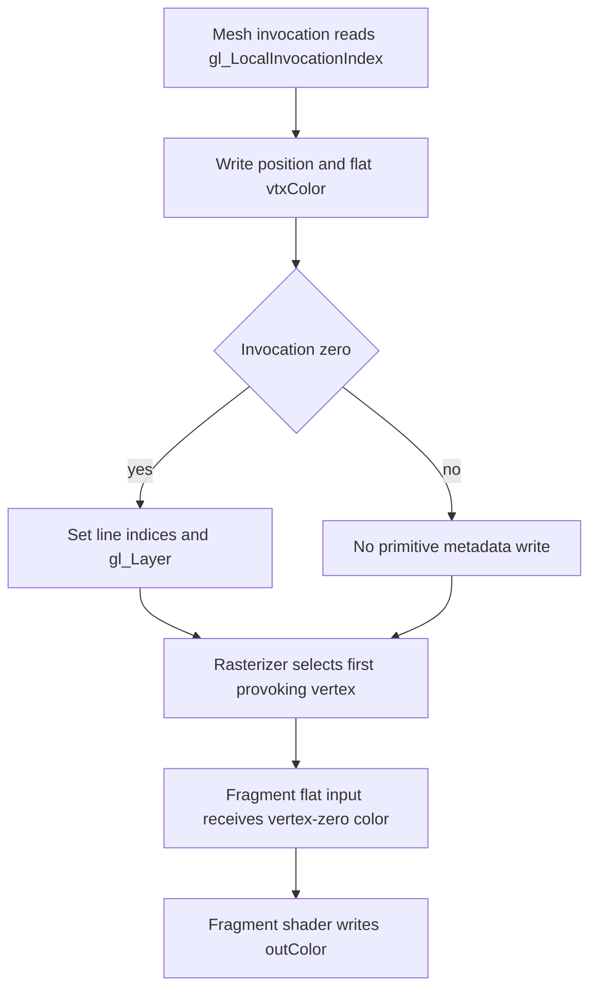

## Overview

**Core question:** Does a mesh shader preserve the selected first- or last-vertex provoking convention for flat-shaded lines and triangles?

- [`vktMeshShaderProvokingVertexTestsEXT.cpp`](../../../modules/vulkan/mesh_shader/vktMeshShaderProvokingVertexTestsEXT.cpp#L450) implements the `mesh_shader.ext.provoking_vertex` test family. It builds one mesh shader and one fragment shader, then renders either one or two array layers for each case.
- The test varies output geometry (`lines` or `triangles`) and the provoking-mode sequence (`first`, `last`, `first_last`, or `last_first`). The mode sequence determines how many pipelines and framebuffer layers the case uses.
- The mesh shader assigns distinct flat colors to the vertices. The fragment shader writes the flat value to a 1x1 `VK_FORMAT_R8G8B8A8_UNORM` color attachment, so the readback identifies which vertex supplied the flat-shaded color.
- The Vulkan default mustpass contains the eight registered leaves under this family: [`mesh-shader.txt`](../../../mustpass/main/vk-default/mesh-shader.txt#L2055-L2062).

## Background Knowledge

- Flat shading gives all fragments of a primitive the value written by its provoking vertex. With `VK_EXT_mesh_shader`, the mesh output execution mode (`OutputLinesEXT` or `OutputTrianglesEXT`) supplies the primitive topology used to determine that vertex. See [`Flat Shading`](../../../../vulkan-docs/src/chapters/vertexpostproc.adoc#L735-L770).
- `VK_EXT_provoking_vertex` selects the first or last non-adjacency vertex through `VkPipelineRasterizationProvokingVertexStateCreateInfoEXT` in the rasterization state's `pNext` chain. If the structure is absent, Vulkan uses the first-vertex mode. See [`VkPipelineRasterizationProvokingVertexStateCreateInfoEXT`](../../../../vulkan-docs/src/chapters/vertexpostproc.adoc#L782-L820) and [`VkProvokingVertexModeEXT`](../../../../vulkan-docs/src/chapters/vertexpostproc.adoc#L823-L839).
- A mesh shader writes vertex positions, per-vertex outputs, and primitive indices. The `flat` qualifier on `vtxColor` makes the fragment shader's `inColor` come from the primitive's provoking vertex rather than interpolate the three or two values.

## Registration Hierarchy

```text
mesh_shader.ext.provoking_vertex
├── lines
└── triangles
```

The category dispatcher adds the `provoking_vertex` test family to the `ext` branch through [`createMeshShaderProvokingVertexTestsEXT`](../../../modules/vulkan/mesh_shader/vktMeshShaderTests.cpp#L71-L81). The family factory creates the `lines` and `triangles` intermediate groups and adds four test case leaves to each group. The mustpass file confirms those eight leaves, with no additional registered mode or geometry values.

## Parameter Dimensions and Observed Values

| Dimension | Registered values | Meaning in this test | Evidence |
|-----------|-------------------|----------------------|----------|
| Geometry | `lines`, `triangles` | Selects the mesh output primitive type, vertex count, position array, color array, and primitive-index built-in. | [`Geometry` and geometry selection](../../../modules/vulkan/mesh_shader/vktMeshShaderProvokingVertexTestsEXT.cpp#L52-L56), [`initPrograms`](../../../modules/vulkan/mesh_shader/vktMeshShaderProvokingVertexTestsEXT.cpp#L202-L208) |
| Provoking-vertex sequence | `first`, `last`, `first_last`, `last_first` | Selects one pipeline and layer or two pipelines and layers. In a two-element sequence, each element selects the mode for the corresponding render-pass layer. | [`testModeCases`](../../../modules/vulkan/mesh_shader/vktMeshShaderProvokingVertexTestsEXT.cpp#L454-L459), [`iterate` pipeline loop](../../../modules/vulkan/mesh_shader/vktMeshShaderProvokingVertexTestsEXT.cpp#L357-L364) |
| Mesh output shape | `local_size_x=2`, `max_vertices=2` for lines; `local_size_x=3`, `max_vertices=3` for triangles; `max_primitives=1` for both | Makes one workgroup produce exactly one line or one triangle. | [`initPrograms`](../../../modules/vulkan/mesh_shader/vktMeshShaderProvokingVertexTestsEXT.cpp#L202-L216) |
| Render target layers | `1` for a one-element mode sequence; `2` for `first_last` and `last_first` | Gives each pipeline/mode its own 1x1 image layer, allowing mode changes inside one render pass when supported. | [`colorLayers` and view type](../../../modules/vulkan/mesh_shader/vktMeshShaderProvokingVertexTestsEXT.cpp#L277-L307) |
| Mustpass coverage | 8 leaves | The `vk-default` profile includes four mode leaves under each geometry child. | [`mesh-shader.txt`](../../../mustpass/main/vk-default/mesh-shader.txt#L2055-L2062) |

## Behavior Parameters

The primary behavioral axis is the provoking-vertex sequence. Geometry is a second axis because it changes the primitive assembled by the mesh shader and therefore the set of vertices from which the provoking vertex is chosen.

### `first` — first vertex in one pipeline

The case creates one pipeline with `VK_PROVOKING_VERTEX_MODE_FIRST_VERTEX_EXT`, draws one mesh workgroup, and checks layer zero. The flat color must come from the first non-adjacency vertex in the line or triangle's index list.

### `last` — last vertex in one pipeline

The case creates one pipeline with `VK_PROVOKING_VERTEX_MODE_LAST_VERTEX_EXT`, draws one mesh workgroup, and checks layer zero. The flat color must come from the last non-adjacency vertex in the index list. The source does not change the mesh shader for this value; it changes the rasterization pipeline state.

### `first_last` — first then last across two pipelines

The case creates two pipelines, selects first-vertex mode for layer zero and last-vertex mode for layer one, and records both draws in the same render pass. The two layers must contain the first-vertex color and last-vertex color respectively.

### `last_first` — last then first across two pipelines

This is the reverse two-pipeline sequence. Layer zero must use the last-vertex color and layer one must use the first-vertex color. Together with `first_last`, it checks that the implementation does not retain the first pipeline's mode for a later pipeline bind.

### Geometry variation — lines and triangles

For `lines`, the mesh shader emits two vertices at `(-1, 0)` and `(1, 0)`, assigns yellow to vertex zero and magenta to vertex one, and sets `gl_PrimitiveLineIndicesEXT[0]` to `uvec2(0, 1)`. For `triangles`, it emits three vertices at `(-1,-1)`, `(-1,1)`, and `(3,-1)`, assigns yellow, cyan, and magenta, and sets `gl_PrimitiveTriangleIndicesEXT[0]` to `uvec3(0, 1, 2)`. The large triangle covers the 1x1 target; the distinct colors make the selected provoking vertex observable.

## Shader Analysis

The generated shader source is central to the test because it constructs the exact mesh primitive and carries a flat per-vertex color into the fragment stage. One representative walkthrough covers the `lines.first` case. The geometry and mode variations change constants and pipeline state, not the flat-shading dataflow.

### Representative Shader Walkthrough 1

#### Parameter Values Chosen

Representative path:

```text
dEQP-VK.mesh_shader.ext.provoking_vertex.lines.first
```

| Parameter choice | Meaning in this representative case |
|------------------|-------------------------------------|
| `lines` | The mesh stage uses two invocations, `layout (lines) out`, two output vertices, and `gl_PrimitiveLineIndicesEXT[0] = uvec2(0, 1)`. |
| `first` | The host creates one pipeline with `VK_PROVOKING_VERTEX_MODE_FIRST_VERTEX_EXT`; the expected flat color is the color assigned to vertex zero. |
| `VK_EXT_mesh_shader` | The source enables `GL_EXT_mesh_shader` and compiles the mesh stage with `getMinMeshEXTBuildOptions`, whose source helper requests SPIR-V 1.4. |

#### Purpose

The mesh shader emits one line whose two vertices carry different flat colors. The fragment shader should receive the first vertex's color when the pipeline selects `VK_PROVOKING_VERTEX_MODE_FIRST_VERTEX_EXT`.

#### Structural Design



#### Shader Code

```glsl
#version 460
/// The EXT mesh-shader execution model uses two invocations because this case
/// emits one line with two vertices.
#extension GL_EXT_mesh_shader : enable
layout (local_size_x=2, local_size_y=1, local_size_z=1) in;
/// This output mode defines the primitive topology used by the mesh stage.
layout (lines) out;
layout (max_vertices=2, max_primitives=1) out;
/// The host writes the target array-layer index through this push constant.
layout (push_constant, std430) uniform PushConstantBlock {
    int layer;
} pc;
/// The mesh stage writes the framebuffer layer for its one output primitive.
perprimitiveEXT out gl_MeshPerPrimitiveEXT {
   int gl_Layer;
} gl_MeshPrimitivesEXT[];
/// The two values deliberately differ so flat interpolation reveals the
/// selected provoking vertex. Vertex zero is yellow; vertex one is magenta.
uvec4 colors[] = uvec4[](
    uvec4(1, 1, 0, 1),
    uvec4(1, 0, 1, 1)
);
/// The line crosses the 1x1 viewport horizontally.
vec4 vertices[] = vec4[](
    vec4(-1.0, 0.0, 0.0, 1.0),
    vec4(1.0, 0.0, 0.0, 1.0)
);
/// Flat interpolation carries one selected vertex color to the fragment stage.
layout (location=0) flat out uvec4 vtxColor[];

void main ()
{
    SetMeshOutputsEXT(2, 1);
    gl_MeshVerticesEXT[gl_LocalInvocationIndex].gl_Position = vertices[gl_LocalInvocationIndex];
    vtxColor[gl_LocalInvocationIndex] = colors[gl_LocalInvocationIndex];

    /// One invocation owns primitive metadata. The index order makes the
    /// first/last choice unambiguous for this line.
    if (gl_LocalInvocationIndex == 0u) {
        gl_PrimitiveLineIndicesEXT[0] = uvec2(0, 1);
        gl_MeshPrimitivesEXT[0].gl_Layer = pc.layer;
    }
}
```

#### Additional Info

- The fragment shader remains the same for `lines` and `triangles`; only the mesh-stage constants, output mode, and primitive-index built-in change. The host selects the expected color from the first or last entry of the matching geometry color array.
- The generated source uses `layout (push_constant, std430)` only for the layer number. The provoking mode is not a shader value; it is the `VkPipelineRasterizationProvokingVertexStateCreateInfoEXT` chained into each graphics pipeline.

#### Parameter Variation Summary

| Parameter dimension | Shader-level variation from this shader | Evidence |
|---------------------|---------------------------------------|----------|
| Geometry | `triangles` changes `local_size_x` and `max_vertices` to `3`, selects `layout (triangles) out`, emits three positions and colors, and writes `gl_PrimitiveTriangleIndicesEXT[0]`. | [`initPrograms` geometry branches](../../../modules/vulkan/mesh_shader/vktMeshShaderProvokingVertexTestsEXT.cpp#L202-L252) |
| Provoking-vertex sequence | `first`, `last`, `first_last`, and `last_first` do not change either shader. The host creates one or two pipelines and writes the layer push constant for each draw. | [`pipeline creation and draw loop`](../../../modules/vulkan/mesh_shader/vktMeshShaderProvokingVertexTestsEXT.cpp#L336-L379) |
| Shader compilation target | Both generated stages use GLSL 4.60. The mesh stage receives `getMinMeshEXTBuildOptions`, which requests SPIR-V 1.4; the fragment stage uses the default source-collection options. | [`initPrograms`](../../../modules/vulkan/mesh_shader/vktMeshShaderProvokingVertexTestsEXT.cpp#L188-L200), [`getMinMeshEXTBuildOptions`](../../../modules/vulkan/mesh_shader/vktMeshShaderUtil.cpp#L141-L144) |

#### SPIR-V

- Status: generated and validated
- Source: reconstructed GLSL from this walkthrough
- Stage: `mesh`
- Target SPIRV version: `spirv1.4`

<details>
<summary>Click to expand SPIRV asm code</summary>

```llvm
; SPIR-V
; Version: 1.4
; Generator: Khronos Glslang Reference Front End; 11
; Bound: 79
; Schema: 0
               OpCapability MeshShadingEXT
               OpExtension "SPV_EXT_mesh_shader"
          %1 = OpExtInstImport "GLSL.std.450"
               OpMemoryModel Logical GLSL450
               OpEntryPoint MeshEXT %main "main" %colors %vertices %gl_MeshVerticesEXT %gl_LocalInvocationIndex %vtxColor %gl_PrimitiveLineIndicesEXT %gl_MeshPrimitivesEXT %pc
               OpExecutionMode %main LocalSize 2 1 1
               OpExecutionMode %main OutputVertices 2
               OpExecutionMode %main OutputPrimitivesEXT 1
               OpExecutionMode %main OutputLinesEXT
               OpSource GLSL 460
               OpSourceExtension "GL_EXT_mesh_shader"
               OpName %main "main"
               OpName %colors "colors"
               OpName %vertices "vertices"
               OpName %gl_MeshPerVertexEXT "gl_MeshPerVertexEXT"
               OpMemberName %gl_MeshPerVertexEXT 0 "gl_Position"
               OpMemberName %gl_MeshPerVertexEXT 1 "gl_PointSize"
               OpMemberName %gl_MeshPerVertexEXT 2 "gl_ClipDistance"
               OpMemberName %gl_MeshPerVertexEXT 3 "gl_CullDistance"
               OpName %gl_MeshVerticesEXT "gl_MeshVerticesEXT"
               OpName %gl_LocalInvocationIndex "gl_LocalInvocationIndex"
               OpName %vtxColor "vtxColor"
               OpName %gl_PrimitiveLineIndicesEXT "gl_PrimitiveLineIndicesEXT"
               OpName %gl_MeshPerPrimitiveEXT "gl_MeshPerPrimitiveEXT"
               OpMemberName %gl_MeshPerPrimitiveEXT 0 "gl_Layer"
               OpName %gl_MeshPrimitivesEXT "gl_MeshPrimitivesEXT"
               OpName %PushConstantBlock "PushConstantBlock"
               OpMemberName %PushConstantBlock 0 "layer"
               OpName %pc "pc"
               OpDecorate %gl_MeshPerVertexEXT Block
               OpMemberDecorate %gl_MeshPerVertexEXT 0 BuiltIn Position
               OpMemberDecorate %gl_MeshPerVertexEXT 1 BuiltIn PointSize
               OpMemberDecorate %gl_MeshPerVertexEXT 2 BuiltIn ClipDistance
               OpMemberDecorate %gl_MeshPerVertexEXT 3 BuiltIn CullDistance
               OpDecorate %gl_LocalInvocationIndex BuiltIn LocalInvocationIndex
               OpDecorate %vtxColor Flat
               OpDecorate %vtxColor Location 0
               OpDecorate %gl_PrimitiveLineIndicesEXT BuiltIn PrimitiveLineIndicesEXT
               OpDecorate %gl_MeshPerPrimitiveEXT Block
               OpMemberDecorate %gl_MeshPerPrimitiveEXT 0 BuiltIn Layer
               OpMemberDecorate %gl_MeshPerPrimitiveEXT 0 PerPrimitiveEXT
               OpDecorate %PushConstantBlock Block
               OpMemberDecorate %PushConstantBlock 0 Offset 0
               OpDecorate %gl_WorkGroupSize BuiltIn WorkgroupSize
       %void = OpTypeVoid
          %3 = OpTypeFunction %void
       %uint = OpTypeInt 32 0
     %v4uint = OpTypeVector %uint 4
     %uint_2 = OpConstant %uint 2
%_arr_v4uint_uint_2 = OpTypeArray %v4uint %uint_2
%_ptr_Private__arr_v4uint_uint_2 = OpTypePointer Private %_arr_v4uint_uint_2
     %colors = OpVariable %_ptr_Private__arr_v4uint_uint_2 Private
     %uint_1 = OpConstant %uint 1
     %uint_0 = OpConstant %uint 0
         %14 = OpConstantComposite %v4uint %uint_1 %uint_1 %uint_0 %uint_1
         %15 = OpConstantComposite %v4uint %uint_1 %uint_0 %uint_1 %uint_1
         %16 = OpConstantComposite %_arr_v4uint_uint_2 %14 %15
      %float = OpTypeFloat 32
    %v4float = OpTypeVector %float 4
%_arr_v4float_uint_2 = OpTypeArray %v4float %uint_2
%_ptr_Private__arr_v4float_uint_2 = OpTypePointer Private %_arr_v4float_uint_2
   %vertices = OpVariable %_ptr_Private__arr_v4float_uint_2 Private
   %float_n1 = OpConstant %float -1
    %float_0 = OpConstant %float 0
    %float_1 = OpConstant %float 1
         %25 = OpConstantComposite %v4float %float_n1 %float_0 %float_0 %float_1
         %26 = OpConstantComposite %v4float %float_1 %float_0 %float_0 %float_1
         %27 = OpConstantComposite %_arr_v4float_uint_2 %25 %26
%_arr_float_uint_1 = OpTypeArray %float %uint_1
%gl_MeshPerVertexEXT = OpTypeStruct %v4float %float %_arr_float_uint_1 %_arr_float_uint_1
%_arr_gl_MeshPerVertexEXT_uint_2 = OpTypeArray %gl_MeshPerVertexEXT %uint_2
%_ptr_Output__arr_gl_MeshPerVertexEXT_uint_2 = OpTypePointer Output %_arr_gl_MeshPerVertexEXT_uint_2
%gl_MeshVerticesEXT = OpVariable %_ptr_Output__arr_gl_MeshPerVertexEXT_uint_2 Output
%_ptr_Input_uint = OpTypePointer Input %uint
%gl_LocalInvocationIndex = OpVariable %_ptr_Input_uint Input
        %int = OpTypeInt 32 1
      %int_0 = OpConstant %int 0
%_ptr_Private_v4float = OpTypePointer Private %v4float
%_ptr_Output_v4float = OpTypePointer Output %v4float
%_ptr_Output__arr_v4uint_uint_2 = OpTypePointer Output %_arr_v4uint_uint_2
   %vtxColor = OpVariable %_ptr_Output__arr_v4uint_uint_2 Output
%_ptr_Private_v4uint = OpTypePointer Private %v4uint
%_ptr_Output_v4uint = OpTypePointer Output %v4uint
       %bool = OpTypeBool
     %v2uint = OpTypeVector %uint 2
%_arr_v2uint_uint_1 = OpTypeArray %v2uint %uint_1
%_ptr_Output__arr_v2uint_uint_1 = OpTypePointer Output %_arr_v2uint_uint_1
%gl_PrimitiveLineIndicesEXT = OpVariable %_ptr_Output__arr_v2uint_uint_1 Output
         %62 = OpConstantComposite %v2uint %uint_0 %uint_1
%_ptr_Output_v2uint = OpTypePointer Output %v2uint
%gl_MeshPerPrimitiveEXT = OpTypeStruct %int
%_arr_gl_MeshPerPrimitiveEXT_uint_1 = OpTypeArray %gl_MeshPerPrimitiveEXT %uint_1
%_ptr_Output__arr_gl_MeshPerPrimitiveEXT_uint_1 = OpTypePointer Output %_arr_gl_MeshPerPrimitiveEXT_uint_1
%gl_MeshPrimitivesEXT = OpVariable %_ptr_Output__arr_gl_MeshPerPrimitiveEXT_uint_1 Output
%PushConstantBlock = OpTypeStruct %int
%_ptr_PushConstant_PushConstantBlock = OpTypePointer PushConstant %PushConstantBlock
         %pc = OpVariable %_ptr_PushConstant_PushConstantBlock PushConstant
%_ptr_PushConstant_int = OpTypePointer PushConstant %int
%_ptr_Output_int = OpTypePointer Output %int
     %v3uint = OpTypeVector %uint 3
%gl_WorkGroupSize = OpConstantComposite %v3uint %uint_2 %uint_1 %uint_1
       %main = OpFunction %void None %3
          %5 = OpLabel
               OpStore %colors %16
               OpStore %vertices %27
               OpSetMeshOutputsEXT %uint_2 %uint_1
         %35 = OpLoad %uint %gl_LocalInvocationIndex
         %38 = OpLoad %uint %gl_LocalInvocationIndex
         %40 = OpAccessChain %_ptr_Private_v4float %vertices %38
         %41 = OpLoad %v4float %40
         %43 = OpAccessChain %_ptr_Output_v4float %gl_MeshVerticesEXT %35 %int_0
               OpStore %43 %41
         %46 = OpLoad %uint %gl_LocalInvocationIndex
         %47 = OpLoad %uint %gl_LocalInvocationIndex
         %49 = OpAccessChain %_ptr_Private_v4uint %colors %47
         %50 = OpLoad %v4uint %49
         %52 = OpAccessChain %_ptr_Output_v4uint %vtxColor %46
               OpStore %52 %50
         %53 = OpLoad %uint %gl_LocalInvocationIndex
         %55 = OpIEqual %bool %53 %uint_0
               OpSelectionMerge %57 None
               OpBranchConditional %55 %56 %57
         %56 = OpLabel
         %64 = OpAccessChain %_ptr_Output_v2uint %gl_PrimitiveLineIndicesEXT %int_0
               OpStore %64 %62
         %73 = OpAccessChain %_ptr_PushConstant_int %pc %int_0
         %74 = OpLoad %int %73
         %76 = OpAccessChain %_ptr_Output_int %gl_MeshPrimitivesEXT %int_0 %int_0
               OpStore %76 %74
               OpBranch %57
         %57 = OpLabel
               OpReturn
               OpFunctionEnd
```

</details>

## Runtime Execution and Result Checking

- **Support and setup.** Each case calls `checkTaskMeshShaderSupportEXT(context, false, true)`, which requires `VK_EXT_mesh_shader` and the EXT mesh-shader feature `meshShader`; it does not require a task shader. The case then requires `VK_EXT_provoking_vertex`. For a two-element mode sequence, it queries `provokingVertexModePerPipeline` and skips with `NotSupportedError` if pipelines in one render pass cannot use different modes. The Vulkan specification also requires `provokingVertexLast` when a pipeline selects `VK_PROVOKING_VERTEX_MODE_LAST_VERTEX_EXT`; the source's explicit `checkSupport` path does not perform a separate query for that feature, so the device must satisfy the extension's feature requirements for those cases. See [`checkSupport`](../../../modules/vulkan/mesh_shader/vktMeshShaderProvokingVertexTestsEXT.cpp#L256-L268) and [`mesh support helper`](../../../modules/vulkan/mesh_shader/vktMeshShaderUtil.cpp#L126-L139).
- **Color target and readback.** The host creates a 1x1 `VK_FORMAT_R8G8B8A8_UNORM` image with color-attachment and transfer-source usage. It uses a 2D view for one mode and a 2D-array view for two modes. A host-visible transfer-destination buffer holds one four-byte pixel per layer. See [`color image and verification buffer`](../../../modules/vulkan/mesh_shader/vktMeshShaderProvokingVertexTestsEXT.cpp#L277-L312).
- **Pipeline state.** The host creates a pipeline layout with a mesh-stage push-constant range containing one `int`. Each pipeline chains `VkPipelineRasterizationProvokingVertexStateCreateInfoEXT` through the rasterization state and assigns the current mode to `provokingVertexMode`. One-element sequences produce one pipeline; two-element sequences produce two pipelines in sequence. See [`pipeline construction`](../../../modules/vulkan/mesh_shader/vktMeshShaderProvokingVertexTestsEXT.cpp#L315-L364).
- **Draw sequence.** The command buffer begins one render pass, binds each pipeline in order, pushes the layer index, and calls `vkCmdDrawMeshTasksEXT(1, 1, 1)` once per pipeline. Invocation zero writes the primitive indices and `gl_Layer`; all invocations write their position and flat color. See [`command recording`](../../../modules/vulkan/mesh_shader/vktMeshShaderProvokingVertexTestsEXT.cpp#L366-L400).
- **Synchronization and copyback.** After ending the render pass, the host transitions the color image from `COLOR_ATTACHMENT_OPTIMAL` to `TRANSFER_SRC_OPTIMAL`, copies all layers to the verification buffer, inserts a transfer-write to host-read barrier, waits for the universal queue, and invalidates the host allocation. See [`image copy and host synchronization`](../../../modules/vulkan/mesh_shader/vktMeshShaderProvokingVertexTestsEXT.cpp#L380-L405).
- **Reference check.** For each layer, the host selects `colors.front()` for `VK_PROVOKING_VERTEX_MODE_FIRST_VERTEX_EXT` and `colors.back()` for `VK_PROVOKING_VERTEX_MODE_LAST_VERTEX_EXT`. It compares every pixel in the 1x1xlayer access with that exact expected `tcu::Vec4`. Any mismatch logs the layer and coordinates, returns `Failed -- check log for details`, and otherwise returns `Pass`. See [`color verification`](../../../modules/vulkan/mesh_shader/vktMeshShaderProvokingVertexTestsEXT.cpp#L407-L443).

## Failure Meaning

### Failure Cause Mapping

| If this behavior parameter value fails | Possible failure cause(s) |
|----------------------------------------|---------------------------|
| `first` | The first-vertex pipeline mode did not select the first non-adjacency mesh vertex, or shared image/pipeline/readback work produced the wrong color. |
| `last` | The last-vertex pipeline mode did not select the last non-adjacency mesh vertex, or shared image/pipeline/readback work produced the wrong color. |
| `first_last` | The first pipeline/layer or the second pipeline/layer selected the wrong mode, or the implementation failed to honor per-pipeline provoking modes in one render pass. |
| `last_first` | The reverse pipeline sequence selected the wrong mode for one layer, or the implementation failed to honor per-pipeline provoking modes in one render pass. |

All four values use the same geometry-specific colors and exact host comparison. A failure does not by itself distinguish provoking-vertex selection from a mesh output, render-pass, image-layout, copyback, or host-readback defect.

### Cause Analysis

#### Flat color came from the wrong mesh vertex

**Possible failure symptoms:** The host logs an unexpected color for a layer and the case returns `Failed -- check log for details`. In a line case, the result differs from the expected yellow first-vertex or magenta last-vertex color. In a triangle case, a non-selected cyan value can also expose the error.

**Possible implementation causes:** The rasterizer or mesh-output path may have applied the wrong provoking-vertex rule to the `OutputLinesEXT` or `OutputTrianglesEXT` primitive. The specification defines first and last as the first and last non-adjacency vertices in the primitive's vertex list, and flat shading takes the value from that vertex. A source-level investigation is needed to separate a pipeline-state defect from a mesh primitive-assembly defect.

#### Two pipelines did not retain their own provoking modes

**Possible failure symptoms:** A `first_last` or `last_first` case has the correct color in one layer and the wrong color in the other, or both layers show the color associated with the first bound pipeline.

**Possible implementation causes:** The device advertises `provokingVertexModePerPipeline` but fails to apply the `VkPipelineRasterizationProvokingVertexStateCreateInfoEXT` value from the currently bound pipeline. The two draws occur in one render pass, which is the condition covered by that property. Source-level investigation is needed to distinguish pipeline-state lifetime handling from primitive assembly.

#### Mesh output or primitive indices were wrong

**Possible failure symptoms:** The color check fails for both first and last cases of a geometry, or a geometry-specific case fails even though pipeline mode changes produce the expected ordering. The log still reports only an unexpected pixel color because the host sees the final image, not the intermediate mesh outputs.

**Possible implementation causes:** The mesh shader may have received an incorrect `gl_LocalInvocationIndex`, failed to write `gl_MeshVerticesEXT` or `vtxColor`, or mishandled `gl_PrimitiveLineIndicesEXT`/`gl_PrimitiveTriangleIndicesEXT`. A bad `gl_Layer` value could also direct the draw to the wrong array layer. These possibilities follow from the generated shader and runtime setup; source-level investigation is needed to locate the defect.

#### Render target or readback did not match the reference

**Possible failure symptoms:** The case logs a color mismatch even when the selected provoking vertex should have supplied the expected value. The mismatch may affect every layer or every geometry value.

**Possible implementation causes:** The image layout transition, color-attachment write, render-pass store, image-to-buffer copy, queue wait, allocation invalidation, or exact pixel interpretation may be wrong. The test's final check cannot distinguish these shared-path failures from a provoking-vertex failure without the log pattern and additional investigation.

## Case Pruning

### Requirement-based pruning

- A case is unsupported unless `VK_EXT_mesh_shader` is enabled and the EXT mesh-shader `meshShader` feature is available. The helper is called with `requireTask=false` and `requireMesh=true`, so task-shader support is not a requirement for this family.
- Every case requires `VK_EXT_provoking_vertex`.
- `first_last` and `last_first` contain two modes in one render pass. The source queries `provokingVertexModePerPipeline` and raises `NotSupportedError` when it is false. A one-mode case does not need that property.
- The Vulkan specification requires `provokingVertexLast` for `VK_PROVOKING_VERTEX_MODE_LAST_VERTEX_EXT`. The source uses the last mode in the `last`, `first_last`, and `last_first` leaves but does not add a separate explicit feature query in `checkSupport`; the extension feature requirements still govern whether those pipelines are legal. See [`provokingVertexLast` feature rule](../../../../vulkan-docs/src/chapters/vertexpostproc.adoc#L811-L817) and [`provoking vertex features`](../../../../vulkan-docs/src/chapters/features.adoc#L6084-L6110).
- No task shader, geometry shader, transform feedback, adjacency topology, multiview feature, or portability-subset gate belongs to this family. The source does not create or require those facilities.

### Design-based pruning

- The factory intentionally fixes the primitive count at one and tests only `lines` and `triangles`. Those are the two geometry values declared by `Geometry`; the test does not generate strips, fans, adjacency forms, or multiple primitives. See [`createMeshShaderProvokingVertexTestsEXT`](../../../modules/vulkan/mesh_shader/vktMeshShaderProvokingVertexTestsEXT.cpp#L450-L482).
- The mode vectors intentionally have at most two elements. A one-element vector tests one pipeline and one layer; the two two-element vectors test both orderings of a mode change across two pipelines and two layers. The constructor asserts that no longer sequence is accepted.
- The expected color always comes from the first or last entry of the geometry color array. The middle triangle color is retained to make an accidental non-endpoint selection visible, while there is no separate mode for it.
- The exact matrix is `2` geometries × `4` mode sequences = `8` test cases, matching the eight `vk-default` mustpass entries. There are no additional generated combinations to prune.

## Key Takeaways

- `mesh_shader.ext.provoking_vertex` tests the interaction between `VK_EXT_mesh_shader` primitive output and `VK_EXT_provoking_vertex` flat-shading selection.
- The mesh shader supplies distinct per-vertex colors and explicit line or triangle indices. The fragment shader only copies its flat input, so the readback color identifies the selected provoking vertex.
- `first` and `last` test one pipeline. `first_last` and `last_first` test two pipeline modes in one render pass and therefore depend on `provokingVertexModePerPipeline`.
- Geometry and mode values change the primitive assembly and pipeline state, not the shader's fundamental flat-color dataflow. The host checks each layer against an exact geometry- and mode-derived color.
- A failed case reports a wrong final pixel, so provoking-vertex selection is the main interpretation, but shared mesh-output, render-target, synchronization, copyback, and host-readback paths remain possible causes.

## Source Reference Appendix

| Entry point | Link | Why it matters |
|-------------|------|----------------|
| Category dispatcher | [`vktMeshShaderTests.cpp#L71-L81`](../../../modules/vulkan/mesh_shader/vktMeshShaderTests.cpp#L71-L81) | Routes the EXT `provoking_vertex` factory into the `mesh_shader.ext` branch. |
| Test factory and registration loops | [`createMeshShaderProvokingVertexTestsEXT`](../../../modules/vulkan/mesh_shader/vktMeshShaderProvokingVertexTestsEXT.cpp#L450-L482) | Defines the `provoking_vertex` root, `lines` and `triangles` children, four mode sequences, and eight leaves. |
| Geometry and color data | [`Geometry`, color and position helpers](../../../modules/vulkan/mesh_shader/vktMeshShaderProvokingVertexTestsEXT.cpp#L52-L92) | Defines the two primitive shapes and the distinct values used to identify the provoking vertex. |
| Generated GLSL | [`ProvokingVertexCase::initPrograms`](../../../modules/vulkan/mesh_shader/vktMeshShaderProvokingVertexTestsEXT.cpp#L188-L253) | Emits the fixed fragment shader and geometry-dependent EXT mesh shader. |
| Support gates | [`ProvokingVertexCase::checkSupport`](../../../modules/vulkan/mesh_shader/vktMeshShaderProvokingVertexTestsEXT.cpp#L256-L268) | Requires EXT mesh and provoking-vertex functionality and gates two-mode cases on per-pipeline support. |
| Color target and buffers | [`ProvokingVertexInstance::iterate`](../../../modules/vulkan/mesh_shader/vktMeshShaderProvokingVertexTestsEXT.cpp#L270-L330) | Creates the layered 1x1 color image and host-visible verification buffer. |
| Pipeline state | [`pipeline setup`](../../../modules/vulkan/mesh_shader/vktMeshShaderProvokingVertexTestsEXT.cpp#L336-L364) | Chains the provoking-vertex state into rasterization and creates one pipeline per mode element. |
| Draw and copyback | [`command recording`](../../../modules/vulkan/mesh_shader/vktMeshShaderProvokingVertexTestsEXT.cpp#L366-L405) | Records one mesh draw per pipeline, transitions the image, copies layers, and synchronizes host reads. |
| Reference comparison | [`color verification`](../../../modules/vulkan/mesh_shader/vktMeshShaderProvokingVertexTestsEXT.cpp#L407-L443) | Maps first/last modes to expected colors and returns pass or failure. |
| EXT mesh support helper | [`checkTaskMeshShaderSupportEXT`](../../../modules/vulkan/mesh_shader/vktMeshShaderUtil.cpp#L126-L139) | Shows that this family requires the EXT mesh shader feature but not a task shader. |
| EXT mesh shader build options | [`getMinMeshEXTBuildOptions`](../../../modules/vulkan/mesh_shader/vktMeshShaderUtil.cpp#L141-L144) | Supplies the mesh shader's SPIR-V 1.4 build target. |
| Flat shading and mesh provoking vertex | [`Flat Shading`](../../../../vulkan-docs/src/chapters/vertexpostproc.adoc#L735-L770) | Defines how flat outputs select a provoking vertex for `MeshEXT`. |
| Pipeline provoking mode | [`VkPipelineRasterizationProvokingVertexStateCreateInfoEXT`](../../../../vulkan-docs/src/chapters/vertexpostproc.adoc#L782-L820) | Defines the pipeline state, default mode, per-pipeline restriction, and last-mode requirement. |
| Provoking mode values | [`VkProvokingVertexModeEXT`](../../../../vulkan-docs/src/chapters/vertexpostproc.adoc#L823-L839) | Defines first and last non-adjacency vertices. |
| Feature semantics | [`VkPhysicalDeviceProvokingVertexFeaturesEXT`](../../../../vulkan-docs/src/chapters/features.adoc#L6084-L6124) | Defines `provokingVertexLast` and transform-feedback preservation features. |
| vk-default coverage | [`mesh-shader.txt#L2055-L2062`](../../../mustpass/main/vk-default/mesh-shader.txt#L2055-L2062) | Lists all eight `mesh_shader.ext.provoking_vertex` leaves. |
