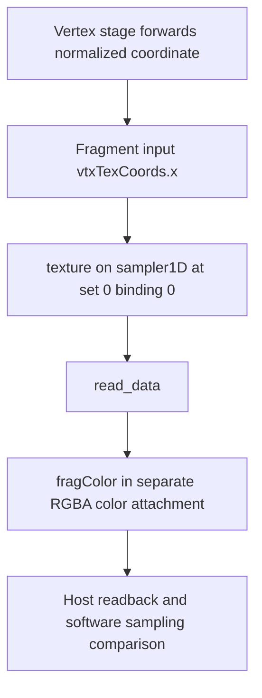

## Overview

**Core question:** Can a graphics pipeline read an attachment image while writing it in the same render pass when the image layout and feedback-loop state describe the selected color, depth, or stencil access?

[`vktPipelineAttachmentFeedbackLoopLayoutTests.cpp`](../../../modules/vulkan/pipeline/vktPipelineAttachmentFeedbackLoopLayoutTests.cpp#L1) implements the `attachment_feedback_loop_layout` test family for `VK_EXT_attachment_feedback_loop_layout`. The family exercises the sampler matrix under several pipeline-construction roots and adds monolithic-only `misc` leaves for a draw without a color attachment and for using separate sampled and attachment mip levels of one image.

The current pipeline mustpass files contain 2,383 monolithic leaves, 2,376 leaves each for fast-linked-library and pipeline-library, and 1,584 leaves in each shader-object mustpass file. These counts use the literal `.attachment_feedback_loop_layout.` path segment.

## Background Knowledge

For the shared concept pipeline construction type, see [Background Knowledge](../../categories/pipeline.md#background-knowledge) of the `pipeline` page.

- **Feedback-loop attachment use.** An image subresource can act as a rendering attachment and as a non-attachment resource in the same render pass when feedback loop use is enabled. The [feature contract](../../../../vulkan-docs/src/chapters/features.adoc#features-attachmentFeedbackLoopLayout) permits `VK_IMAGE_LAYOUT_ATTACHMENT_FEEDBACK_LOOP_OPTIMAL_EXT` for an image with `VK_IMAGE_USAGE_ATTACHMENT_FEEDBACK_LOOP_BIT_EXT`. The [render-pass rules](../../../../vulkan-docs/src/chapters/renderpass.adoc#renderpass-feedbackloop) also require feedback-loop state for the accessed aspect.
- **Aspect-specific declaration.** A color attachment requires `VK_PIPELINE_CREATE_COLOR_ATTACHMENT_FEEDBACK_LOOP_BIT_EXT`; a depth/stencil attachment requires `VK_PIPELINE_CREATE_DEPTH_STENCIL_ATTACHMENT_FEEDBACK_LOOP_BIT_EXT`. The dynamic path selects enabled aspects with [`vkCmdSetAttachmentFeedbackLoopEnableEXT`](../../../../vulkan-docs/src/chapters/renderpass.adoc#vkCmdSetAttachmentFeedbackLoopEnableEXT).
- **Final-image comparison.** CTS submits the draw, transfers the image to host-visible data, and compares that data against a reference texture built from the same selected access pattern. The comparison finds a visible disagreement, but the final image combines attachment state, sampling, fragment output, transitions, and copyback.

## Registration Hierarchy

```text
pipeline.monolithic.attachment_feedback_loop_layout
├── sampler
└── misc
```

The tree uses the monolithic root as the concrete parseable hierarchy. [`createAttachmentFeedbackLoopLayoutTests`](../../../modules/vulkan/pipeline/vktPipelineAttachmentFeedbackLoopLayoutTests.cpp#L3366-L3390) creates `sampler` for every supported construction type and fills root-level `misc` only for monolithic construction. The sampler registration also adds a monolithic-only `misc` intermediate node below each layout for the maintenance5 leaves.

## Parameter Dimensions and Observed Values

| Dimension | Registered values | Meaning in this test | Evidence |
|---|---|---|---|
| Feedback-loop layout | `attachment_feedback_loop_optimal`, `general` | Selects the dedicated layout or the `VK_IMAGE_LAYOUT_GENERAL` path. | [`sampler registration`](../../../modules/vulkan/pipeline/vktPipelineAttachmentFeedbackLoopLayoutTests.cpp#L3160-L3364) |
| Descriptor type | `combined_image_sampler`, `sampled_image` | Selects whether the shader receives a combined descriptor or a separate sampled image. | [`sampler registration`](../../../modules/vulkan/pipeline/vktPipelineAttachmentFeedbackLoopLayoutTests.cpp#L3160-L3364) |
| Image view type | `1d`, `1d_unnormalized`, `1d_array`, `2d`, `2d_unnormalized`, `2d_array`, `3d`, `cube`, `cube_array` | Expands the image-view and coordinate forms used for the same feedback access. | [`view-type loop`](../../../modules/vulkan/pipeline/vktPipelineAttachmentFeedbackLoopLayoutTests.cpp#L3198-L3208) |
| Format and aspect | `r8g8b8a8_unorm`; depth, stencil, and depth/stencil formats; color, depth, stencil | Selects the data representation and attachment aspect whose feedback state must be declared. | [`format and aspect registration`](../../../modules/vulkan/pipeline/vktPipelineAttachmentFeedbackLoopLayoutTests.cpp#L3213-L3320) |
| Test mode | `read`, `read_write_different_areas`, `read_write_same_pixel` | Determines the sampling and write relationship that CTS models in the reference image. `TEST_MODE_WRITE_ONLY` exists in the source enum but is not included in the registered `testModes` array. | [`TestMode`](../../../modules/vulkan/pipeline/vktPipelineAttachmentFeedbackLoopLayoutTests.cpp#L70-L78) and [`testModes`](../../../modules/vulkan/pipeline/vktPipelineAttachmentFeedbackLoopLayoutTests.cpp#L3194-L3202) |
| Component interleaving | absent or `_interleave_read_write_components` | For eligible same-pixel color cases, combines sampled and output components in a single expected pixel. | [`reference construction`](../../../modules/vulkan/pipeline/vktPipelineAttachmentFeedbackLoopLayoutTests.cpp#L1778-L1850) |
| Feedback-loop state | static, `_dynamic_zero_static`, `_dynamic_bad_static` | Selects pipeline-create flags or dynamic feedback-loop enable state. | [`PipelineStateMode`](../../../modules/vulkan/pipeline/vktPipelineAttachmentFeedbackLoopLayoutTests.cpp#L103-L127) |
| Pipeline construction type | monolithic, fast-linked-library, pipeline-library, shader-object variants | Repeats the sampler matrix under supported pipeline construction mechanisms. | [`pipeline dispatcher`](../../../modules/vulkan/pipeline/vktPipelineTests.cpp#L159) |

## Behavior Parameters

The primary behavioral axis is the feedback-loop access pattern. Layout, descriptors, views, formats, aspects, dynamic state, and construction type broaden the coverage of each pattern.

### Sampled read-only access: observe initialized attachment data

The `read` sampler leaves render while sampling the selected image but do not apply the read/write transformation used by the write patterns. CTS reads back the attachment and checks that the result matches the reference image for the chosen color, depth, or stencil representation.

### Same-pixel read/write: use the sampled value at the written pixel

The `read_write_same_pixel` leaves sample and write the same pixel. The ordinary variant applies the source-defined value adjustment and clamps it for the expected image. The interleaving variant preserves selected sampled components while taking the remaining components from the generated output value.

### Different-area read/write: transfer values between image regions

The `read_write_different_areas` leaves sample one region and write the value into another. Their reference image encodes the source and destination relationship, so an incorrect coordinate mapping or region selection appears as a spatial mismatch.

### No-color draw: observe fragment execution through an atomic counter

The monolithic-only `misc.no_color_draw` leaf transitions one previously rendered color image to feedback-loop layout, then performs a draw in an empty framebuffer. Its fragment path increments a storage-buffer atomic counter. CTS checks that counter exactly and also compares the first image for preservation and a second, normally rendered image against exact color references. The leaf therefore observes both no-color fragment execution and the surrounding image results.

### Separate mip levels: bind feedback roles to different subresources

`misc.separate_mip_levels` and `misc.separate_mip_levels_large_fb` sample mip level 1 while rendering to mip level 0 of the same image. Because the two roles use distinct subresources, the test keeps the sampled mip in `VK_IMAGE_LAYOUT_SHADER_READ_ONLY_OPTIMAL` and the attachment mip in `VK_IMAGE_LAYOUT_COLOR_ATTACHMENT_OPTIMAL`; it does not use feedback-loop layout for this draw. The comparison allows `0.005` error in red and green and requires exact blue and alpha, including the larger-framebuffer variation.

## Shader Analysis

### Representative Shader Walkthrough 1

#### Parameter Values Chosen

Representative path:

```text
dEQP-VK.pipeline.shader_object_linked_binary.attachment_feedback_loop_layout.sampler.attachment_feedback_loop_optimal.combined_image_sampler.image_type.1d.format.d16_unorm_depth_read
```

| Parameter choice | Meaning in this representative case |
|------------------|-------------------------------------|
| `shader_object_linked_binary` | Builds the graphics stages through the linked-binary shader-object path. |
| `attachment_feedback_loop_optimal` | Places the sampled image in `VK_IMAGE_LAYOUT_ATTACHMENT_FEEDBACK_LOOP_OPTIMAL_EXT` rather than the `general` alternative. |
| `combined_image_sampler` | Exposes the image and sampler together at descriptor set 0, binding 0. |
| `1d` | Selects a normalized one-dimensional view, so the fragment shader samples with `vtxTexCoords.x`. |
| `d16_unorm_depth_read` | Selects `VK_FORMAT_D16_UNORM`, its depth aspect, and the read-only mode; sampling produces floating-point data and the shader writes it to a separate color attachment. |

#### Purpose

This fragment shader samples initialized D16 depth data while the image is in the attachment-feedback-loop layout and exports the sampled value to a color attachment. The host then compares that image against its software sampling reference, making the shader the read/observation path for the selected layout case.

#### Structural Design



#### Shader Code

```glsl
#version 440
/// Binding 0 is the combined sampler for the one-dimensional D16_UNORM image view.
layout(set = 0, binding = 0) uniform highp sampler1D texSampler;
/// Read-only depth sampling is observed through a separate RGBA color attachment.
layout(location = 0) out highp vec4 fragColor;
/// The vertex stage forwards the normalized 1D lookup coordinate in x.
layout(location = 0) in highp vec4 vtxTexCoords;
void main (void)
{
    /// Sample the initialized depth aspect at the rasterized coordinate.
    vec4 read_data = texture(texSampler, vtxTexCoords.x);
    /// Export the sampled value for host-side image verification.
    fragColor = read_data;
}
```

#### Additional Info

- The fixed vertex shader only copies `position` to `gl_Position` and `texCoords` to `vtxTexCoords`; it does not participate in the sampled-value transformation. [`initPrograms`](../../../modules/vulkan/pipeline/vktPipelineAttachmentFeedbackLoopLayoutTests.cpp#L2147-L2158)
- This read-only case uses the initialized sampled image and a separate `VK_FORMAT_R8G8B8A8_UNORM` color attachment; the descriptor records the selected feedback-loop layout, and verification follows the shared image-sampling reference path. [`setup`](../../../modules/vulkan/pipeline/vktPipelineAttachmentFeedbackLoopLayoutTests.cpp#L439-L577) [`verifyImage`](../../../modules/vulkan/pipeline/vktPipelineAttachmentFeedbackLoopLayoutTests.cpp#L1778-L1782)

#### Parameter Variation Summary

| Parameter dimension | Shader-level variation from this shader | Evidence |
|---------------------|---------------------------------------|----------|
| Descriptor type | `sampled_image` splits the declaration into a sampler at binding 0 and a typed texture at binding 1, then constructs the combined sampler at the lookup. | [`initPrograms`](../../../modules/vulkan/pipeline/vktPipelineAttachmentFeedbackLoopLayoutTests.cpp#L2168-L2179) |
| Image view type | The sampler type and coordinate swizzle change across 1D, array, 2D, 3D, cube, and cube-array views; unnormalized views use `textureLod(..., 0)`. | [`coordinate selection and sampling`](../../../modules/vulkan/pipeline/vktPipelineAttachmentFeedbackLoopLayoutTests.cpp#L2125-L2145) [`sampling branches`](../../../modules/vulkan/pipeline/vktPipelineAttachmentFeedbackLoopLayoutTests.cpp#L2240-L2254) |
| Format and aspect | Integer formats add `u` or `i` sampler prefixes. Stencil read-only converts the sampled integer to normalized red, while depth/stencil write cases can emit `gl_FragDepth` or `gl_FragStencilRefARB`. | [`sampler type`](../../../modules/vulkan/pipeline/vktPipelineAttachmentFeedbackLoopLayoutTests.cpp#L2458-L2504) [`fragment generation`](../../../modules/vulkan/pipeline/vktPipelineAttachmentFeedbackLoopLayoutTests.cpp#L2162-L2297) |
| Test mode and interleaving | Same-pixel and different-area write modes add `0.1` to sampled data; eligible interleaved cases route selected sampled components to the attachment output. Host-generated vertices change the sampled region for different-area cases. | [`fragment generation`](../../../modules/vulkan/pipeline/vktPipelineAttachmentFeedbackLoopLayoutTests.cpp#L2193-L2297) [`vertex generation`](../../../modules/vulkan/pipeline/vktPipelineAttachmentFeedbackLoopLayoutTests.cpp#L2403-L2422) |
| Feedback-loop state | Dynamic variants do not change this GLSL; they change whether and how the selected image aspect is enabled with `vkCmdSetAttachmentFeedbackLoopEnableEXT`. | [`state registration`](../../../modules/vulkan/pipeline/vktPipelineAttachmentFeedbackLoopLayoutTests.cpp#L3224-L3232) [`command recording`](../../../modules/vulkan/pipeline/vktPipelineAttachmentFeedbackLoopLayoutTests.cpp#L1015-L1018) |

#### SPIR-V

- Status: generated and validated
- Source: reconstructed `GLSL` from this walkthrough
- Stage: `frag`
- Target SPIRV version: `spirv1.0`

<details>
<summary>Click to expand SPIRV asm code</summary>

```llvm
; SPIR-V
; Version: 1.0
; Generator: Khronos Glslang Reference Front End; 11
; Bound: 26
; Schema: 0
               OpCapability Shader
               OpCapability Sampled1D
          %1 = OpExtInstImport "GLSL.std.450"
               OpMemoryModel Logical GLSL450
               OpEntryPoint Fragment %main "main" %vtxTexCoords %fragColor
               OpExecutionMode %main OriginUpperLeft
               OpSource GLSL 440
               OpName %main "main"
               OpName %read_data "read_data"
               OpName %texSampler "texSampler"
               OpName %vtxTexCoords "vtxTexCoords"
               OpName %fragColor "fragColor"
               OpDecorate %texSampler Binding 0
               OpDecorate %texSampler DescriptorSet 0
               OpDecorate %vtxTexCoords Location 0
               OpDecorate %fragColor Location 0
       %void = OpTypeVoid
          %3 = OpTypeFunction %void
      %float = OpTypeFloat 32
    %v4float = OpTypeVector %float 4
%_ptr_Function_v4float = OpTypePointer Function %v4float
         %10 = OpTypeImage %float 1D 0 0 0 1 Unknown
         %11 = OpTypeSampledImage %10
%_ptr_UniformConstant_11 = OpTypePointer UniformConstant %11
 %texSampler = OpVariable %_ptr_UniformConstant_11 UniformConstant
%_ptr_Input_v4float = OpTypePointer Input %v4float
%vtxTexCoords = OpVariable %_ptr_Input_v4float Input
       %uint = OpTypeInt 32 0
     %uint_0 = OpConstant %uint 0
%_ptr_Input_float = OpTypePointer Input %float
%_ptr_Output_v4float = OpTypePointer Output %v4float
  %fragColor = OpVariable %_ptr_Output_v4float Output
       %main = OpFunction %void None %3
          %5 = OpLabel
  %read_data = OpVariable %_ptr_Function_v4float Function
         %14 = OpLoad %11 %texSampler
         %20 = OpAccessChain %_ptr_Input_float %vtxTexCoords %uint_0
         %21 = OpLoad %float %20
         %22 = OpImageSampleImplicitLod %v4float %14 %21
               OpStore %read_data %22
         %25 = OpLoad %v4float %read_data
               OpStore %fragColor %25
               OpReturn
               OpFunctionEnd
```

</details>

## Runtime Execution and Result Checking

- A sampler leaf selects its parameters, creates feedback-loop-capable images and views, prepares descriptors, initializes image contents, and records the render operations in [`AttachmentFeedbackLoopLayoutImageSamplingInstance::setup`](../../../modules/vulkan/pipeline/vktPipelineAttachmentFeedbackLoopLayoutTests.cpp#L422-L1035) or its depth/stencil counterpart.
- The pipeline setup derives static flags from the selected image aspect. Dynamic-state leaves set the selected aspect during command recording, while `DYNAMIC_WITH_ZERO_STATIC` and `DYNAMIC_WITH_CONTRADICTORY_STATIC` ensure the result depends on dynamic state rather than matching static flags.
- [`iterate`](../../../modules/vulkan/pipeline/vktPipelineAttachmentFeedbackLoopLayoutTests.cpp#L1766-L1859) submits the command buffer and waits. The verification path reads each image in the selected layout and creates a reference texture by replaying the source's access-pattern calculation on the host.
- Color paths use `tcu::floatThresholdCompare` or `tcu::intThresholdCompare`; [`AttachmentFeedbackLoopLayoutDepthStencilImageSamplingInstance::verifyImage`](../../../modules/vulkan/pipeline/vktPipelineAttachmentFeedbackLoopLayoutTests.cpp#L1626-L1764) performs separate depth and stencil checks.
- [`noColorAttachmentTest`](../../../modules/vulkan/pipeline/vktPipelineAttachmentFeedbackLoopLayoutTests.cpp#L2590-L2850) submits its draws, compares both color images exactly, and verifies the atomic counter. [`feedbackLoopDiffMipsRun`](../../../modules/vulkan/pipeline/vktPipelineAttachmentFeedbackLoopLayoutTests.cpp#L2877-L3158) performs the separate-mip draw, copyback, and threshold comparison.

## Failure Meaning

### Failure Cause Mapping

| If this behavior parameter value fails | Possible failure cause(s) |
|----------------------------------------|---------------------------|
| Sampled read-only access | Attachment-feedback-loop layout, descriptor sampling, aspect selection, or image readback produces values different from the initialized image. |
| Same-pixel read/write or component interleaving | Feedback-loop enable state, same-pixel sampling, fragment output, or component preservation produces a result different from the generated reference. |
| Different-area read/write | Coordinate mapping or attachment feedback access reads from or writes to the wrong region. |
| No-color draw | The empty-framebuffer draw produces the wrong atomic count, or either surrounding color-image comparison fails. |
| Separate mip levels | Image-view subresource selection, ordinary per-mip layout handling, sampling, rasterization, or image copyback produces the wrong mip-level result. |

### Cause Analysis

#### Feedback-loop layout, descriptor sampling, or aspect selection

**Possible failure symptoms:** A read-only sampler leaf reports a color, depth, or stencil comparison failure after image readback. Failures can cluster by layout, descriptor type, format, view type, or image aspect.

**Possible implementation causes:** The implementation may mishandle the selected feedback-loop layout, descriptor sampling view, image aspect, pipeline feedback-loop declaration, or the transition and transfer path used for observation. The final comparison cannot identify which stage changed the data, so source-level investigation must examine the selected leaf and command sequence.

#### Same-pixel feedback state or component preservation

**Possible failure symptoms:** Same-pixel leaves differ from the generated expected value, or the interleaving leaves preserve the wrong components.

**Possible implementation causes:** The dynamic or static feedback-loop enable state may not apply to the selected aspect, sampling may not use the expected attachment data, or fragment output/component handling may diverge from the reference calculation. The source combines these operations before the host comparison, so the image alone does not isolate one operation.

#### Region mapping for different-area access

**Possible failure symptoms:** Different-area leaves show a spatially displaced, duplicated, or unchanged region in the copied image.

**Possible implementation causes:** The result can involve texture-coordinate generation, image-view addressing, sampling, attachment writes, feedback-loop state, or readback. The source-generated reference identifies the expected source and destination regions; it does not assign an exclusive internal fault location.

#### Storage-buffer observation without a color attachment

**Possible failure symptoms:** `no_color_draw` returns a counter value other than the framebuffer pixel count, either exact color-image comparison fails, or the case fails during setup or submission.

**Possible implementation causes:** An atomic-count failure may involve the no-color-attachment render path, fragment execution, storage-buffer binding, atomic operations, or synchronization before host readback. An image mismatch may instead involve preservation of the image transitioned to feedback-loop layout or the independent color render and copyback path. [`noColorAttachmentSupport`](../../../modules/vulkan/pipeline/vktPipelineAttachmentFeedbackLoopLayoutTests.cpp#L2550-L2554) skips missing feature prerequisites, but the combined checks still require the specific failing assertion to localize the affected path.

#### Subresource selection or copyback for separate mip levels

**Possible failure symptoms:** `separate_mip_levels` or `separate_mip_levels_large_fb` exceeds the red/green threshold or differs in the exactly checked blue or alpha component.

**Possible implementation causes:** The issue may lie in mip-level view selection, attachment and sampled subresource binding, the ordinary color-attachment or shader-read-only layout transitions, sampling, rasterization, or image copyback. The final texture combines those stages, so source-level investigation is needed to localize the error.

## Case Pruning

### Requirement-based pruning

- [`AttachmentFeedbackLoopLayoutSamplerTest::checkSupport`](../../../modules/vulkan/pipeline/vktPipelineAttachmentFeedbackLoopLayoutTests.cpp#L1984-L2109) requires `VK_EXT_attachment_feedback_loop_layout` for sampler leaves and checks construction-type support. It also requires `VK_EXT_attachment_feedback_loop_dynamic_state` for non-static state, `VK_KHR_unified_image_layouts` for the general-layout path, and selected stencil-export or maintenance5 support where applicable.
- [`noColorAttachmentSupport`](../../../modules/vulkan/pipeline/vktPipelineAttachmentFeedbackLoopLayoutTests.cpp#L2550-L2554) requires `VK_EXT_attachment_feedback_loop_layout` and fragment stores and atomics for `no_color_draw`.
- Unsupported features cause a skip through the CTS support check rather than a failed image comparison.

### Design-based pruning

- Root-level `misc` is registered only for monolithic construction. [`createAttachmentFeedbackLoopLayoutTests`](../../../modules/vulkan/pipeline/vktPipelineAttachmentFeedbackLoopLayoutTests.cpp#L3374-L3386)
- The maintenance5 sampler leaves are also monolithic-only. [`createAttachmentFeedbackLoopLayoutSamplerTests`](../../../modules/vulkan/pipeline/vktPipelineAttachmentFeedbackLoopLayoutTests.cpp#L3339-L3354)
- Component interleaving appears only for eligible same-pixel color forms, and depth/stencil variants are added only when the selected format supports the relevant aspect. [`format registration`](../../../modules/vulkan/pipeline/vktPipelineAttachmentFeedbackLoopLayoutTests.cpp#L3230-L3331)

## Key Takeaways

- This family checks the result of sampling from and rendering to a feedback-loop image under dedicated or general layout, not ordinary independent sampling and attachment use.
- The access pattern is the behavioral axis: read-only, same-pixel, different-area, component-interleaving, no-color, and separate-mip paths each define a different observed result. The source's write-only enum value is not registered.
- Dynamic-state variants verify that the selected color or depth/stencil aspect comes from dynamic feedback-loop state even when static pipeline flags are zero or contradictory.
- A final-image mismatch identifies the affected access pattern and coverage dimensions, but it can span setup, sampling, output, transitions, and transfer-copy observation.

## Source Reference Appendix

| Entry point | Link | Why it matters |
|---|---|---|
| Family registration | [`createAttachmentFeedbackLoopLayoutTests`](../../../modules/vulkan/pipeline/vktPipelineAttachmentFeedbackLoopLayoutTests.cpp#L3366-L3390) | Creates the family and monolithic-only root `misc` group. |
| Sampler matrix registration | [`createAttachmentFeedbackLoopLayoutSamplerTests`](../../../modules/vulkan/pipeline/vktPipelineAttachmentFeedbackLoopLayoutTests.cpp#L3160-L3364) | Registers layouts, descriptors, view types, formats, access patterns, and state variants. |
| Color sampler execution | [`AttachmentFeedbackLoopLayoutImageSamplingInstance::setup`, `verifyImage`, and `iterate`](../../../modules/vulkan/pipeline/vktPipelineAttachmentFeedbackLoopLayoutTests.cpp#L422-L1035) | Creates the color sampler path, reads back images, and compares the reference. |
| Depth/stencil verification | [`AttachmentFeedbackLoopLayoutDepthStencilImageSamplingInstance::verifyImage`](../../../modules/vulkan/pipeline/vktPipelineAttachmentFeedbackLoopLayoutTests.cpp#L1626-L1764) | Performs aspect-specific image comparison. |
| Support and shader generation | [`checkSupport` and `initPrograms`](../../../modules/vulkan/pipeline/vktPipelineAttachmentFeedbackLoopLayoutTests.cpp#L1984-L2548) | Applies feature gates and generates sampler shaders. |
| No-color leaf | [`noColorAttachmentSupport`, `noColorAttachmentPrograms`, and `noColorAttachmentTest`](../../../modules/vulkan/pipeline/vktPipelineAttachmentFeedbackLoopLayoutTests.cpp#L2550-L2850) | Uses storage-buffer atomic output without a color attachment. |
| Separate-mip leaves | [`feedbackLoopDiffMipsInitPrograms` and `feedbackLoopDiffMipsRun`](../../../modules/vulkan/pipeline/vktPipelineAttachmentFeedbackLoopLayoutTests.cpp#L2852-L3158) | Generates, runs, and validates the separate-mip cases. |
| Vulkan feedback-loop rules | [`renderpass-feedbackloop`](../../../../vulkan-docs/src/chapters/renderpass.adoc#renderpass-feedbackloop) | Defines the layout and aspect-state contract used by the test. |
