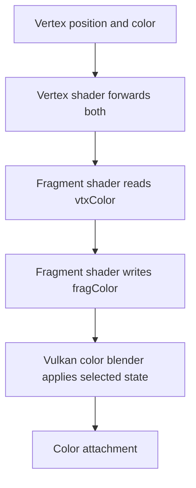

## Overview

**Core question:** Does the pipeline apply Vulkan color blending, write control, and attachment-location rules to the intended color attachments?

- This page covers the implementation of `pipeline.monolithic.blend`, with the same blend implementation exercised under the pipeline construction variants that register it.
- The test family combines seeded blend-state generation, selected normalized-format clamp cases, dual-source fragment outputs, dynamic blend state, and dynamic-rendering attachment remapping.
- The host compares rendered images or readback colors with a software reference or exact expected values.

## Background Knowledge

For the shared concept pipeline construction type, see [Background Knowledge](../../categories/pipeline.md#background-knowledge) of the `pipeline` page.

- A `VkPipelineColorBlendAttachmentState` selects whether blending is enabled, the RGB and alpha factors and operations, and the component write mask. Vulkan defines the source and destination values, factor selection, blend operation, and normalized-format clamping in [the framebuffer blending specification](../../../../vulkan-docs/src/chapters/framebuffer.adoc#L190-L218).
- Dual-source blending gives the blender a second fragment output selected with `Index = 1`. `SRC1` factors require `dualSrcBlend`, as described in [Dual-Source Blending](../../../../vulkan-docs/src/chapters/framebuffer.adoc#L632-L650).
- Dynamic rendering can map fragment output locations to attachment indices. The `drlr_remap` family uses that mapping while rendering two known colors.

## Registration Hierarchy

```text
pipeline.monolithic.blend
├── format
├── dynamic_mask
├── clamp
├── dual_source
├── dynamic_dual_disable
└── drlr_remap
```

`format`, `dynamic_mask`, `dual_source`, `dynamic_dual_disable`, and `drlr_remap` are generated for the construction types selected by `genFormatTests`. `clamp` is generated for every construction type. The `dual_source.multi_attachments` branch is registered here but implemented by [`addDualBlendMultiAttachmentTests()`](../../../modules/vulkan/pipeline/vktPipelineDualBlendTests.cpp#L1).

## Parameter Dimensions and Observed Values

| Dimension | Registered values | Meaning in this test | Evidence |
|-----------|-------------------|----------------------|----------|
| Intermediate node | `format`, `dynamic_mask`, `clamp`, `dual_source`, `dynamic_dual_disable`, `drlr_remap` | Selects the blend mechanism under test. | [`createBlendTests()`](../../../modules/vulkan/pipeline/vktPipelineBlendTests.cpp#L2713-L3068) |
| Blend format | 42 entries in `getBlendFormats()`, excluding `VK_FORMAT_E5B9G9R9_UFLOAT_PACK32` from regular format tests | Exercises blend support and format conversion across packed, normalized, sRGB, floating-point, and extended formats. | [`getBlendFormats()`](../../../modules/vulkan/pipeline/vktPipelineBlendTestsCommon.cpp#L42-L88) |
| Regular blend states | 100 four-quad state sets per format, iterator seed `123` | Varies the source and destination RGB and alpha factors, RGB and alpha operations, and per-quad write masks. | [`BlendStateUniqueRandomIterator`](../../../modules/vulkan/pipeline/vktPipelineBlendTestsCommon.cpp#L76-L98), [`createBlendTests()`](../../../modules/vulkan/pipeline/vktPipelineBlendTests.cpp#L2737-L2782) |
| Clamp format | `R8G8B8A8_UNORM`, `R8G8B8A8_SNORM`, `B8G8R8A8_UNORM`, `B8G8R8A8_SNORM`, `R16G16B16A16_UNORM`, `R16G16B16A16_SNORM` | Separates normalized-format clamping from the broad blend matrix. | [`clampFormats`](../../../modules/vulkan/pipeline/vktPipelineBlendTests.cpp#L2831-L2869) |
| Dynamic mask | `VK_FORMAT_E5B9G9R9_UFLOAT_PACK32`; `mask_0` or `mask_rgba`, each with `no_blend` or `alpha_blend` | Checks the all-components-or-none mask rule while setting the mask dynamically. | [`ColorMaskTestCase`](../../../modules/vulkan/pipeline/vktPipelineBlendTests.cpp#L2899-L2959) |
| Dual-source output form | `output_variable`, `output_array` | Confirms both fragment-output declaration forms feed the second blender input. | [`shaderOutputTypes`](../../../modules/vulkan/pipeline/vktPipelineBlendTests.cpp#L2721-L2725), [`DualSourceBlendTest::initPrograms()`](../../../modules/vulkan/pipeline/vktPipelineBlendTests.cpp#L502-L546) |
| Dynamic dual disable | Attachment counts `1`, `2`, `8`; optional extra attachment `false` or `true` | Varies the number of color attachments and the final attachment that cannot use the dual equation in the extra-attachment case. | [`createBlendTests()`](../../../modules/vulkan/pipeline/vktPipelineBlendTests.cpp#L2976-L3002) |
| Attachment remap | Locations `{1, 0}`; write-enable cases `YY`, `YN`, `NY`; dynamic blend and dynamic write-enable each `false` or `true` | Separates output location from attachment index and combines static and dynamic state. | [`RemapParams`](../../../modules/vulkan/pipeline/vktPipelineBlendTests.cpp#L2261-L2345), [`createBlendTests()`](../../../modules/vulkan/pipeline/vktPipelineBlendTests.cpp#L3007-L3060) |

The mustpass files contain 48,833 distinct `blend` leaves across seven pipeline construction roots: `monolithic`, `fast_linked_library`, `pipeline_library`, `shader_object_linked_binary`, `shader_object_linked_spirv`, `shader_object_unlinked_binary`, and `shader_object_unlinked_spirv`. `genFormatTests` restricts the regular format branches to non-shader-object construction and `shader_object_unlinked_spirv`; the other shader-object roots contain only the six `clamp` leaves.

## Behavior Parameters

The primary behavioral axis is the registered **intermediate node** directly below the `blend` test family. Each intermediate node changes the blend behavior or the state path being checked.

### `format`: General blend equations across formats

The test selects a supported blend format and 100 seeded blend states per format. Four overlapping quads use separate component masks, so the reference and device paths exercise RGB and alpha factors, operations, constants, and masked writes together.

### `dynamic_mask`: Dynamic write-mask legality and application

The test uses `VK_FORMAT_E5B9G9R9_UFLOAT_PACK32` and dynamically sets either no components or all RGBA components. It pairs each mask with disabled blending or standard alpha blending.

### `clamp`: Normalized attachment clamping

The test supplies out-of-range quad colors and blend constants. For UNORM formats it uses values outside `[0, 1]`; for SNORM formats it uses values outside `[-1, 1]`. The expected color is computed after clamping the values to the selected format range.

### `dual_source`: Secondary fragment output as a blend input

The generated fragment shader writes `index = 0` and `index = 1` outputs as separate variables or one-element arrays. Only generated states containing an `SRC1` factor remain in this family. Multi-attachment cases are delegated to `vktPipelineDualBlendTests.cpp`.

### `dynamic_dual_disable`: Dynamic replacement of blend state

The pipeline starts with static dual-source equations and zero write masks. The command buffer dynamically sets equations, disables or enables blending per attachment, and enables all color writes. Attachment counts are `1`, `2`, or `8`, with an optional extra attachment.

### `drlr_remap`: Dynamic-rendering output-location remapping

The fragment shader writes two fixed colors to output locations 0 and 1. The pipeline and command buffer map those locations to attachment indices `{1, 0}`. The cases vary write enables, dynamic blend equations, and dynamic color-write enables.

## Shader Analysis

The shaders supply source colors and output declarations. They do not perform the blend arithmetic under test. The representative fragment shader below is the exact source emitted by `BlendTest::initPrograms()` for a regular `format` case, with only `///` explanatory comments added.

### Representative Shader Walkthrough 1

#### Parameter Values Chosen

Representative path:

```text
dEQP-VK.pipeline.monolithic.blend.format.r8g8b8a8_unorm.states.<generated blend-state set>
```

| Parameter choice | Meaning in this representative case |
|------------------|-------------------------------------|
| `format` | Uses the general blend path rather than a special dynamic or clamp family. |
| `r8g8b8a8_unorm` | Makes the rendered attachment a normalized fixed-point color target. |
| `states.<generated blend-state set>` | Selects one exact four-quad state set produced by the iterator with seed `123`. |

#### Purpose

The shader forwards vertex color to a fragment output. The pipeline's fixed-function color-blend state then determines the stored result.

#### Structural Design



#### Shader Code

```glsl
#version 310 es
layout(location = 0) in highp vec4 vtxColor;
layout(location = 0) out highp vec4 fragColor;
void main (void)
{
    /// The shader supplies the source color. Blend factors and operations run in fixed-function state.
    fragColor = vtxColor;
}
```

#### Additional Info

- `BlendTest::initPrograms()` also emits a vertex shader that assigns `gl_Position = position` and forwards the vertex color to `vtxColor`.
- The host renders four overlapping quads. It creates a separate graphics pipeline for each quad so each draw uses its selected blend attachment state.

#### Parameter Variation Summary

| Parameter dimension | Shader-level variation from this shader | Evidence |
|---------------------|---------------------------------------|----------|
| `format` | The pass-through shader stays the same while the attachment format and host-side vertex-color conversion vary. | [`BlendTest::initPrograms()`](../../../modules/vulkan/pipeline/vktPipelineBlendTests.cpp#L402-L445), [`BlendTestInstance` setup](../../../modules/vulkan/pipeline/vktPipelineBlendTests.cpp#L555-L815) |
| `dual_source` | The fragment stage changes to two indexed outputs, either variables or one-element arrays. | [`DualSourceBlendTest::initPrograms()`](../../../modules/vulkan/pipeline/vktPipelineBlendTests.cpp#L502-L546) |
| `drlr_remap` | The fragment stage emits one output per remapped location and uses generated fixed colors. | [`RemapCase::initPrograms()`](../../../modules/vulkan/pipeline/vktPipelineBlendTests.cpp#L2404-L2430) |

#### SPIR-V

- Status: generated and validated
- Source: reconstructed `GLSL` from this walkthrough
- Stage: `frag`
- Target SPIRV version: `spirv1.0`

<details>
<summary>Click to expand SPIRV asm code</summary>

```llvm
; SPIR-V
; Version: 1.0
; Generator: Khronos Glslang Reference Front End; 11
; Bound: 13
; Schema: 0
               OpCapability Shader
          %1 = OpExtInstImport "GLSL.std.450"
               OpMemoryModel Logical GLSL450
               OpEntryPoint Fragment %main "main" %fragColor %vtxColor
               OpExecutionMode %main OriginUpperLeft
               OpSource ESSL 310
               OpName %main "main"
               OpName %fragColor "fragColor"
               OpName %vtxColor "vtxColor"
               OpDecorate %fragColor Location 0
               OpDecorate %vtxColor Location 0
       %void = OpTypeVoid
          %3 = OpTypeFunction %void
      %float = OpTypeFloat 32
    %v4float = OpTypeVector %float 4
%_ptr_Output_v4float = OpTypePointer Output %v4float
  %fragColor = OpVariable %_ptr_Output_v4float Output
%_ptr_Input_v4float = OpTypePointer Input %v4float
   %vtxColor = OpVariable %_ptr_Input_v4float Input
       %main = OpFunction %void None %3
          %5 = OpLabel
         %12 = OpLoad %v4float %vtxColor
               OpStore %fragColor %12
               OpReturn
               OpFunctionEnd
```

</details>

## Runtime Execution and Result Checking

- `BlendTestInstance` creates a 32 by 32 color image with color-attachment and transfer-source usage, an image view, a render pass, four graphics pipelines, and a host-visible vertex buffer. It records a layout transition, draws four overlapping quads, submits, and waits.
- `BlendTestInstance::verifyImage()` repeats the four draws in `ReferenceRenderer` with the same blend factors, operations, constants, and masks. It reads the Vulkan color attachment and uses `tcu::floatThresholdCompare`. Expandable formats can use wider intermediate reference formats when the primary comparison fails.
- `ClampTestInstance` uses one fullscreen quad and a fixed blend state. It clamps both inputs to the mapped format range, multiplies the clamped values, and compares the readback image.
- `DynamicDualBlendDisableInstance` creates `1`, `2`, or `8` 1 by 1 attachments, records dynamic equations, blend enables, and write masks, then copies every image to a host-visible buffer. It expects each buffer to contain the generated output color.
- `RemapInstance` uses dynamic rendering with two `VK_FORMAT_R8G8B8A8_UNORM` attachments. It sets the attachment-location mapping `{1, 0}`, records selected dynamic blend and write-enable state, copies each image to a buffer, and compares each pixel with its expected or clear color.

## Failure Meaning

### Failure Cause Mapping

| If this behavior parameter value fails | Possible failure cause(s) |
|----------------------------------------|---------------------------|
| `format` | Incorrect blend factors, RGB/alpha operation, blend constant, component mask, format conversion, or reference-visible output. |
| `dynamic_mask` | Incorrect dynamic color-write-mask application for `VK_FORMAT_E5B9G9R9_UFLOAT_PACK32`. |
| `clamp` | Missing or incorrect normalized-format clamping before blend evaluation. |
| `dual_source` | Incorrect second fragment-output routing or `SRC1` blend-factor use. |
| `dynamic_dual_disable` | Incorrect dynamic blend-enable, equation, or color-write-mask replacement across attachments. |
| `drlr_remap` | Incorrect dynamic-rendering attachment-location remap, dynamic equation/write-enable application, or attachment readback. |

### Cause Analysis

#### Blend equation, factor, mask, or format errors

**Possible failure symptoms:** The `format` image comparison reports mismatched pixels. The mismatch can be limited to channels selected by a write mask or can vary with the attachment format and generated state.

**Possible implementation causes:** The implementation may apply an RGB or alpha factor or operation incorrectly, use the wrong blend constant, ignore a component mask, or convert the source or destination value incorrectly for a packed, normalized, sRGB, or floating-point format. The source and reference paths both exercise four overlapping draws, so the final image alone does not isolate one state or quad.

#### Normalized-format clamping errors

**Possible failure symptoms:** A `clamp` case reports a pixel mismatch after the host computes its expected color from clamped inputs.

**Possible implementation causes:** The implementation may evaluate the blend with an out-of-range source, destination, or factor value instead of applying the normalized-format range required before the operation. The test uses UNORM and SNORM targets to distinguish `[0, 1]` from `[-1, 1]` behavior.

#### Dynamic mask rule or state application errors

**Possible failure symptoms:** A `dynamic_mask` case produces a stored value when the mask is zero, fails to write a component when the mask is RGBA, or is rejected for a state combination that the test expects to be legal. A mismatch in `dynamic_dual_disable` appears in one or more attachment buffers.

**Possible implementation causes:** The implementation may mishandle `VK_DYNAMIC_STATE_COLOR_WRITE_MASK_EXT`, the all-components-or-none rule for `VK_FORMAT_E5B9G9R9_UFLOAT_PACK32`, or the ordering of dynamic state commands relative to the draw. For `dynamic_dual_disable`, it may apply the static equation or enable state instead of the command state, or use the wrong attachment count.

#### Dual-source output routing errors

**Possible failure symptoms:** A `dual_source` image comparison fails only for generated states containing `SRC1` factors, or one output declaration form fails while the other passes. A device may report the feature as unsupported when the required feature is enabled.

**Possible implementation causes:** The implementation may bind the `Index = 1` output incorrectly, consume the wrong secondary component, or mishandle the resource and attachment limits associated with dual-source blending. The test's state generator filters out non-`SRC1` states, but the final image cannot identify which factor caused a mismatch.

#### Dynamic-rendering location or write-enable errors

**Possible failure symptoms:** A `drlr_remap` result contains the two colors in the original rather than swapped attachment order, or a disabled write leaves an unexpected value. Failures can affect only the dynamic-blend or dynamic-write-enable variants.

**Possible implementation causes:** The implementation may ignore `VkRenderingAttachmentLocationInfo`, use the pipeline mapping after the command mapping changes, or apply color-write enables to the wrong attachment. It may also mishandle the image transition, copy, or host visibility path; source-level investigation is needed to separate rendering state from readback failure.

## Case Pruning

### Requirement-based pruning

- A regular or dual-source format must support color attachment blending. The test also checks the selected pipeline construction requirements.
- Dual-source cases require the `dualSrcBlend` feature when a generated state uses an `SRC1` factor.
- The dynamic dual-disable family requires `extendedDynamicState3ColorBlendEnable`, `extendedDynamicState3ColorBlendEquation`, and `extendedDynamicState3ColorWriteMask`.
- `drlr_remap` requires `dynamicRenderingLocalRead`. Dynamic blend requires `extendedDynamicState3ColorBlendEquation`; dynamic write enables or disabled writes require `colorWriteEnable`.
- The portability subset can remove states using constant-alpha blend factors when `constantAlphaColorBlendFactors` is unavailable.
- `dynamic_dual_disable` and `drlr_remap` are excluded from Vulkan SC builds by source guards.

### Design-based pruning

- The regular format family excludes `VK_FORMAT_E5B9G9R9_UFLOAT_PACK32` because that format has a dedicated dynamic-mask family.
- Dual-source generation discards states without an `SRC1` factor because the ordinary blend family already covers them.
- The `drlr_remap` construction path skips combinations where neither dynamic blend nor dynamic write enable is active for shader-object construction.
- The broad blend matrix uses a seeded unique iterator rather than enumerating every possible factor and operation cross-product.

## Key Takeaways

- The page's primary axis is the registered intermediate node below the `blend` test family. The six intermediate nodes separate general format coverage, clamping, dynamic masks, dual-source outputs, dynamic dual blending, and attachment remapping.
- The regular shader only supplies source colors. The implementation under test performs the blend arithmetic in fixed-function pipeline state.
- `format` uses a seeded 100-state-per-format matrix and four overlapping quads. Its final image comparison can expose several state or conversion errors but cannot localize one blend factor without source-level investigation.
- `clamp` isolates the normalized-format rule with out-of-range inputs and an explicit host-side expected-color calculation.
- `dual_source` checks both indexed output declaration forms and requires `dualSrcBlend` for states that consume the second source.
- Dynamic-state families verify that command state changes the result or the attachment mapping before the draw, then validate each attachment through readback.

## Source Reference Appendix

| Entry point | Link | Why it matters |
|-------------|------|----------------|
| Blend family registration | [`createBlendTests()`](../../../modules/vulkan/pipeline/vktPipelineBlendTests.cpp#L2713-L3068) | Builds the six registered families and their parameter loops. |
| Format inventory and support helper | [`getBlendFormats()`](../../../modules/vulkan/pipeline/vktPipelineBlendTestsCommon.cpp#L42-L88) and [`isSupportedBlendFormat()`](../../../modules/vulkan/pipeline/vktPipelineBlendTestsCommon.cpp#L210-L230) | Defines candidate formats and the color-attachment blend support check. |
| Regular state generator | [`BlendStateUniqueRandomIterator`](../../../modules/vulkan/pipeline/vktPipelineBlendTestsCommon.cpp#L76-L98) | Produces the seeded blend-state matrix. |
| Regular setup and command recording | [`BlendTestInstance`](../../../modules/vulkan/pipeline/vktPipelineBlendTests.cpp#L555-L828) | Creates resources, pipelines, draws, submits, and waits. |
| Regular verification | [`BlendTestInstance::verifyImage()`](../../../modules/vulkan/pipeline/vktPipelineBlendTests.cpp#L929-L1033) | Renders the reference image and compares readback. |
| Dual-source support and programs | [`DualSourceBlendTest`](../../../modules/vulkan/pipeline/vktPipelineBlendTests.cpp#L458-L546) | Checks `dualSrcBlend` and emits indexed output variants. |
| Clamp verification | [`ClampTestInstance::iterate()`](../../../modules/vulkan/pipeline/vktPipelineBlendTests.cpp#L1580-L1838) | Computes clamped expected colors and checks the image. |
| Dynamic dual-blend verification | [`DynamicDualBlendDisableInstance::iterate()`](../../../modules/vulkan/pipeline/vktPipelineBlendTests.cpp#L2029-L2258) | Applies dynamic equations, enables, masks, and checks each attachment. |
| Dynamic rendering remap verification | [`RemapInstance::iterate()`](../../../modules/vulkan/pipeline/vktPipelineBlendTests.cpp#L2437-L2700) | Applies output-location remapping and checks copied attachment data. |
| Blend attachment state contract | [`VkPipelineColorBlendAttachmentState`](../../../../vulkan-docs/src/chapters/framebuffer.adoc#L190-L218) | Defines factors, operations, alpha behavior, and write masks. |
| Blend operation and clamp contract | [`Blend Operations`](../../../../vulkan-docs/src/chapters/framebuffer.adoc#L665-L748) | Defines basic operations and normalized-format clamping. |
| Dynamic color write mask validity | [`VK_FORMAT_E5B9G9R9_UFLOAT_PACK32` validity](../../../../vulkan-docs/src/chapters/pipelines.adoc#L5349-L5358) | Defines the all-components-or-none mask restriction. |
