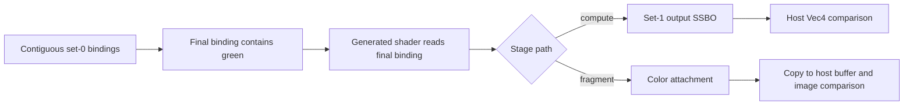

## Overview

**Core question:** Can the implementation create and use a stage-visible descriptor-set layout containing many bindings of one descriptor type, then read the final binding correctly?

- This test family varies descriptor type and a registered count parameter across 36 values from `3` to `65535`. That parameter is the set-0 binding count except in compute storage-buffer cases, where set 0 contains one fewer binding because set 1 contains the output storage buffer.
- It registers `compute_shader` only for monolithic pipelines. `fragment_shader` is registered for every inspected construction root.
- The test fills earlier bindings with red data and the final binding with green data. The shader reads only that final binding, so a green result makes the high binding observable.
- The source skips leaves whose requested count exceeds the relevant device property before it creates a pipeline.

## Background Knowledge

For the shared concept pipeline construction type, see [Background Knowledge](../../categories/pipeline.md#background-knowledge) of the `pipeline` page.

A descriptor set layout describes numbered bindings and the descriptor type visible at each binding. A pipeline layout makes those sets available to its shader stages. Vulkan limits how many resources a stage can access. The type-specific fields such as `maxPerStageDescriptorStorageBuffers` count resources of one descriptor class, while `maxPerStageResources` bounds the combined stage-visible resources ([per-stage limits](../../../../vulkan-docs/src/chapters/limits.adoc#L151-L272)). Pipeline creation also requires stage-visible resources not to exceed `maxPerStageResources` ([compute rule](../../../../vulkan-docs/src/chapters/pipelines.adoc#L987-L990), [graphics rule](../../../../vulkan-docs/src/chapters/pipelines.adoc#L3134-L3137)).

The case builds contiguous set-0 bindings from zero through `getDescCount() - 1`. It does not rely on unaccessed descriptors to produce a result. Instead, it attaches red resources to the earlier bindings and a green resource to the final binding; the generated shader declares and reads that final binding. This arrangement tests layout size, descriptor updates, pipeline-layout association, and a high binding number in one execution.

## Registration Hierarchy

```text
pipeline.monolithic.descriptor_limits
├── compute_shader
└── fragment_shader
```

`compute_shader` has five descriptor-type leaf prefixes: `samplers`, `uniform_buffers`, `storage_buffers`, `sampled_images`, and `storage_images`. `fragment_shader` adds `input_attachments`. The factory omits input-attachment leaves for shader-object construction and omits the complete compute intermediate node for non-monolithic construction types ([registration factory](../../../modules/vulkan/pipeline/vktPipelineDescriptorLimitsTests.cpp#L963-L1063)).

The inspected mustpass files contain 1,548 leaves in this family: 396 under `monolithic`; 216 each under `pipeline_library` and `fast_linked_library`; and 180 under each of `shader_object_linked_binary`, `shader_object_linked_spirv`, `shader_object_unlinked_binary`, and `shader_object_unlinked_spirv`.

## Parameter Dimensions and Observed Values

| Dimension | Values | What it changes | Evidence |
|-----------|--------|-----------------|----------|
| Intermediate node | `compute_shader`, `fragment_shader` | Selects the stage, command path, and observation method. | [factory](../../../modules/vulkan/pipeline/vktPipelineDescriptorLimitsTests.cpp#L974-L1060) |
| Descriptor type | `samplers`, `uniform_buffers`, `storage_buffers`, `sampled_images`, `storage_images`; plus fragment-only `input_attachments` | Selects the layout and pool descriptor type, generated declaration, resource access, and type-specific limit. | [program generator](../../../modules/vulkan/pipeline/vktPipelineDescriptorLimitsTests.cpp#L785-L847) |
| Registered count | `3` through `20`, `31`, `32`, `63`, `64`, `100`, `127`, `128`, `199`, `200`, `256`, `512`, `1024`, `2048`, `4096`, `8192`, `16384`, `32768`, `65535` | Usually selects the number of contiguous set-0 bindings. For compute storage-buffer leaves, set 0 has one fewer binding and the set-1 output storage buffer supplies the remaining resource. | [count list](../../../modules/vulkan/pipeline/vktPipelineDescriptorLimitsTests.cpp#L969-L972), [getDescCount()](../../../modules/vulkan/pipeline/vktPipelineDescriptorLimitsTests.cpp#L179-L187) |
| Construction type | monolithic, pipeline-library, fast-linked-library, and shader-object roots | Selects available intermediate nodes and construction requirements. | [registration predicate](../../../modules/vulkan/pipeline/vktPipelineDescriptorLimitsTests.cpp#L974-L975) |
| Compute storage-buffer effective count | `descCount - 1` | Reserves one storage-buffer resource for the set-1 output binding while testing the requested total. | [getDescCount()](../../../modules/vulkan/pipeline/vktPipelineDescriptorLimitsTests.cpp#L179-L187) |

## Behavior Parameters

The primary behavioral axis is the **shader-stage intermediate node**.

### `compute_shader`: dispatch and storage-buffer observation

The monolithic compute path binds set 0, which holds the tested descriptors, and set 1, which holds an output storage buffer. It dispatches one workgroup and inserts a memory barrier from shader writes to host reads. The host invalidates the output allocation and checks for green. The compute storage-buffer variation subtracts one from the registered count when building set 0 because the output SSBO consumes the remaining storage-buffer descriptor resource.

### `fragment_shader`: draw and image observation

The graphics path creates a render pass, draws a six-vertex full-screen quad, then copies the color image into a host-visible transfer buffer. It compares the full result against a solid green reference. Input attachments take this path because they are only valid for the fragment stage in this implementation.

## Shader Analysis

The generated shaders are small probes rather than the behavior under test. `initPrograms()` makes the final set-0 binding's number `descCount - 1` and chooses a declaration and read operation from the descriptor type. The red resources occupy earlier bindings; the green resource occupies the declared binding. The fragment program assigns that read value to `fragColor`; the compute program assigns it to `outputData.color` ([generator](../../../modules/vulkan/pipeline/vktPipelineDescriptorLimitsTests.cpp#L778-L892)).

### Representative Shader Walkthrough

#### Parameter Values Chosen

Representative paths:

```text
dEQP-VK.pipeline.monolithic.descriptor_limits.compute_shader.storage_buffers_64
dEQP-VK.pipeline.monolithic.descriptor_limits.fragment_shader.sampled_images_64
```

| Choice | Compute storage-buffer case | Fragment sampled-image case |
|--------|-----------------------------|-----------------------------|
| Effective set-0 bindings | `63`, numbered `0` through `62` | `64`, numbered `0` through `63` |
| Final shader binding | set 0, binding `62` | set 0, binding `63` |
| Green observation | shader writes set 1 output SSBO | shader writes the color attachment |
| Host oracle | exact green `tcu::Vec4` | zero-threshold solid-green image comparison |

#### Purpose

These two paths use the same final-binding observation pattern while changing descriptor type, effective set-0 binding count, command interface, and host observation route. The source emits `readonly buffer ssboInput` for the compute storage-buffer leaf and `texture2D imageInput` plus `texelFetch` for the sampled-image fragment leaf ([selected fragments](../../../modules/vulkan/pipeline/vktPipelineDescriptorLimitsTests.cpp#L808-L828)).

#### Structural Design



#### Parameter Variation Summary

| Variation | Generated-shader effect | Runtime effect |
|-----------|-------------------------|----------------|
| Registered count | Changes the final binding literal in the declaration; compute storage-buffer leaves first subtract one. | Changes layout, pool, and descriptor-update size. |
| Descriptor type | Changes declaration and read expression. | Changes descriptor, backing resource, and checked property. |
| Compute versus fragment | Chooses output SSBO assignment or `fragColor` assignment. | Chooses dispatch/barrier/readback or draw/copy/image comparison. |
| Input attachment | Uses `subpassInput` and `subpassLoad`. | Uses the dedicated input-attachment render pass. |

#### SPIR-V

The implementation generates GLSL through `DescriptorLimitTest::initPrograms()` at run time. This page does not reproduce a supposedly exact SPIR-V artifact because the selected leaf changes the generated binding literal and shader type. The source-level declarations and operations above identify the relevant generated branches; the test harness compiles the generated `test` program before execution ([program registration](../../../modules/vulkan/pipeline/vktPipelineDescriptorLimitsTests.cpp#L859-L890)).

## Runtime Execution and Result Checking

`DescriptorLimitTestInstance::iterate()` selects a stage flag and an image layout from the leaf. It creates two image resources, two samplers, two uniform buffers, two storage buffers, and, for compute, a host-visible output SSBO. It fills resource zero with red and resource one with green, then flushes the host-visible allocations ([resource setup](../../../modules/vulkan/pipeline/vktPipelineDescriptorLimitsTests.cpp#L213-L345)).

The descriptor pool and set-0 layout contain one selected descriptor type per binding. The update loop writes resource zero to every binding except the last, then writes resource one to the last binding. Compute adds set 1 with the output SSBO. In compute storage-buffer leaves, set 0 has `m_descCount - 1` bindings while the pool reserves `m_descCount` storage-buffer descriptors across both sets. The pipeline layout contains set 0 and, when needed, set 1 ([layout and updates](../../../modules/vulkan/pipeline/vktPipelineDescriptorLimitsTests.cpp#L387-L630)).

For compute, the command buffer binds the compute pipeline and both sets, dispatches `(1, 1, 1)`, and records a compute-write to host-read barrier. For graphics, it begins the render pass, binds the graphics pipeline, vertex buffer, and set 0, draws six vertices, then copies the color image to the result buffer. The queue submission waits for completion. The fragment path invalidates its transfer allocation and runs `tcu::floatThresholdCompare()` against green with a zero threshold. The compute path invalidates its output allocation and requires exact equality with `tcu::Vec4(0.0, 1.0, 0.0, 1.0)` ([commands and checks](../../../modules/vulkan/pipeline/vktPipelineDescriptorLimitsTests.cpp#L690-L754)).

## Failure Meaning

### Failure Cause Mapping

| If this behavior parameter value fails | Possible failure cause(s) |
|----------------------------------------|---------------------------|
| `compute_shader` | Incorrect compute-stage descriptor-limit accounting, creation or update of a high-numbered binding, descriptor-set or pipeline-layout binding, compute access to the final descriptor, synchronization, or output-buffer readback. |
| `fragment_shader` | Incorrect fragment-stage descriptor-limit accounting, creation or update of a high-numbered binding, graphics descriptor binding, fragment access to the final descriptor, render-pass output, image copy, or image comparison. |

### Cause Analysis

#### Compute descriptor access or output visibility errors

**Possible failure symptoms:** A `compute_shader` leaf returns a non-green output value, or failures occur when a count reaches a boundary value such as `64`, `128`, or `65535`. Other fragment leaves may still pass.

**Possible implementation causes:** Driver descriptor bookkeeping may omit the set-1 output SSBO, create or update the high-numbered set-0 binding incorrectly, or resolve the final shader binding incorrectly. The compute-to-host visibility path can also produce a non-green host value because the comparison reads the output allocation after the barrier. The result alone cannot separate descriptor access from output visibility.

#### Fragment descriptor access or image-result errors

**Possible failure symptoms:** A `fragment_shader` leaf produces red, clear, or mixed pixels instead of solid green. Failures may affect one descriptor type, one count range, or only input attachments.

**Possible implementation causes:** The implementation may miscount stage-visible descriptors, bind or update the final binding incorrectly, or compile the generated fragment declaration or read incorrectly. The final image also depends on render-pass execution, color-image transfer, and host comparison, so source-level investigation is required to distinguish a descriptor fault from that path.

#### Limit-gate or construction-path errors

**Possible failure symptoms:** A leaf runs although its requested count exceeds a reported limit, a supported leaf is skipped, or failures occur only under a particular pipeline construction root.

**Possible implementation causes:** The CTS gate checks the registered count against the selected type-specific property, requires it not to exceed `maxPerStageResources - 1`, checks Vulkan SC's `maxDescriptorSetLayoutBindings` where enabled, and applies construction requirements ([support checks](../../../modules/vulkan/pipeline/vktPipelineDescriptorLimitsTests.cpp#L894-L954)). A mismatch can indicate incorrect physical-device limit reporting, a construction-specific resource-accounting issue, or a source-level gate defect. The total-resource gate is deliberately conservative for compute storage-buffer leaves: their set-0 reduction means the output SSBO is already included in the registered count, but the gate still reserves one additional resource.

## Case Pruning

### Support-based pruning

- The source rejects registered counts greater than `maxPerStageResources - 1`. This leaves room for the compute output SSBO or fragment color attachment in most leaves. For compute storage-buffer leaves, the output SSBO is already included by reducing set 0 to `m_descCount - 1`, so this gate is one resource more conservative than the actual pipeline layout.
- It checks the selected per-stage descriptor field: samplers, uniform buffers, storage buffers, sampled images, storage images, or input attachments.
- Vulkan SC additionally rejects requests above `maxDescriptorSetLayoutBindings`.
- `checkPipelineConstructionRequirements()` applies construction-specific support conditions.

### Design-based pruning

- Compute cases are registered only for monolithic construction because the factory wraps that intermediate node in the monolithic predicate.
- Input attachments are never registered for compute and are omitted from fragment shader-object roots.
- The test samples selected counts rather than enumerating every integer. Its list includes adjacent small values and common power-of-two boundaries.

## Key Takeaways

- Each leaf creates a contiguous descriptor layout and makes its final binding observable through a green result.
- `compute_shader` and `fragment_shader` test the same descriptor-layout idea through different execution and host-observation paths.
- Type-specific device limits, total per-stage resources, Vulkan SC layout bindings, and pipeline construction requirements determine whether a leaf runs.
- The test proves reachability of the final binding, not independent contents for every preceding descriptor.
- A failed result can involve descriptor accounting or access, but the final observable path also includes synchronization or image readback.

## Source Reference Appendix

| Entry point or contract | Link | Why it matters |
|-------------------------|------|----------------|
| Runtime setup and checks | [`DescriptorLimitTestInstance::iterate()`](../../../modules/vulkan/pipeline/vktPipelineDescriptorLimitsTests.cpp#L213-L755) | Creates resources, layouts, updates, commands, and host comparisons. |
| Generated program and support checks | [`DescriptorLimitTest::initPrograms()` and `checkSupport()`](../../../modules/vulkan/pipeline/vktPipelineDescriptorLimitsTests.cpp#L778-L954) | Emits final-binding access and rejects unsupported counts. |
| Registration factory | [`createDescriptorLimitsTests()`](../../../modules/vulkan/pipeline/vktPipelineDescriptorLimitsTests.cpp#L963-L1063) | Defines intermediate nodes, descriptor types, count list, and pruning. |
| Pipeline dispatcher | [`createPipelineTests()`](../../../modules/vulkan/pipeline/vktPipelineTests.cpp#L109-L113) | Registers this family for each construction type that reaches the dispatcher. |
| Per-stage descriptor limits | [limits](../../../../vulkan-docs/src/chapters/limits.adoc#L151-L272) | Defines type-specific and combined stage-resource limits. |
| Pipeline resource validity | [compute](../../../../vulkan-docs/src/chapters/pipelines.adoc#L987-L990) and [graphics](../../../../vulkan-docs/src/chapters/pipelines.adoc#L3134-L3137) | Requires a stage's accessible resources to stay within `maxPerStageResources`. |
| Descriptor-layout binding count | [`VkDescriptorSetLayoutCreateInfo`](../../../../vulkan-docs/src/chapters/descriptorsets.adoc#L201-L204) | Defines the `maxDescriptorSetLayoutBindings` validity requirement. |
