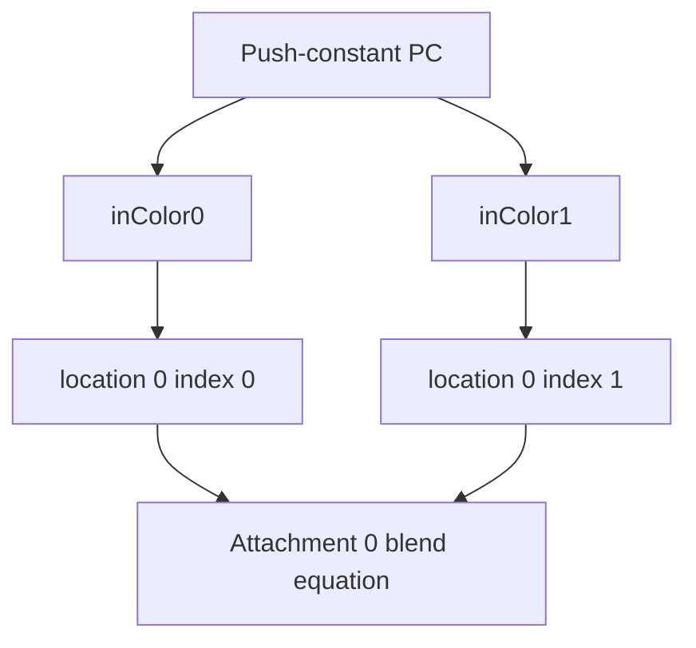

## Overview

**Core question:** Does dual-source blending on attachment 0 reproduce the ordinary-blend result for the reused color while leaving the other three attachments unchanged?

- [`vktPipelineDualBlendTests.cpp`](../../../modules/vulkan/pipeline/vktPipelineDualBlendTests.cpp#L1) implements the `multi_attachments` test family under `pipeline.monolithic.blend.dual_source`, with the same family exercised by the linked-library and shader-object construction variants.
- Each test case selects one format from [`getBlendFormats()`](../../../modules/vulkan/pipeline/vktPipelineBlendTestsCommon.cpp#L41-L89). The case then enumerates generated blend-state combinations and compares a dual-source draw with an ordinary reference draw.
- The generic shader writes four fragment outputs. The dual-source shader writes two outputs at location 0, with output indices 0 and 1. The blend state consumes the second output through `SRC1` factors.
- The host copies all four color attachments to readback buffers and compares pixels with a format-aware threshold. A zero-valued destination produces a quality warning and skips that iteration.

## Background Knowledge

For the shared concept pipeline construction type, see [Background Knowledge](../../categories/pipeline.md#background-knowledge) of the `pipeline` page.

- Dual-source blending lets one fragment output at location 0, index 1 supply the `SRC1_COLOR` or `SRC1_ALPHA` operand. The `dualSrcBlend` feature permits these factors.
- Vulkan applies color blending independently to each color attachment. The selected format determines its channel mask and numeric comparison threshold. Formats without alpha omit alpha-factor combinations in this test.

## Registration Hierarchy

```text
pipeline.monolithic.blend.dual_source.multi_attachments
├── r4g4_unorm_pack8
├── r4g4b4a4_unorm_pack16
├── r5g6b5_unorm_pack16
├── r5g5b5a1_unorm_pack16
├── a1r5g5b5_unorm_pack16
├── r8_unorm
├── r8_snorm
├── r8_srgb
├── r8g8_unorm
├── r8g8_snorm
├── r8g8_srgb
├── r8g8b8_unorm
├── r8g8b8_snorm
├── r8g8b8_srgb
├── r8g8b8a8_unorm
├── r8g8b8a8_snorm
├── r8g8b8a8_srgb
├── a2r10g10b10_unorm_pack32
├── a2b10g10r10_unorm_pack32
├── r16_unorm
├── r16_snorm
├── r16_sfloat
├── r16g16_unorm
├── r16g16_snorm
├── r16g16_sfloat
├── r16g16b16_unorm
├── r16g16b16_snorm
├── r16g16b16_sfloat
├── r16g16b16a16_unorm
├── r16g16b16a16_snorm
├── r16g16b16a16_sfloat
├── r32_sfloat
├── r32g32_sfloat
├── r32g32b32_sfloat
├── r32g32b32a32_sfloat
├── b10g11r11_ufloat_pack32
├── e5b9g9r9_ufloat_pack32
├── b4g4r4a4_unorm_pack16
├── b5g5r5a1_unorm_pack16
├── a4r4g4b4_unorm_pack16
├── a4b4g4r4_unorm_pack16
└── r10x6g10x6b10x6a10x6_unorm_4pack16
```

The source registration loop is [`addDualBlendMultiAttachmentTests()`](../../../modules/vulkan/pipeline/vktPipelineDualBlendTests.cpp#L1758-L1774). Mustpass evidence includes, for example, `dEQP-VK.pipeline.monolithic.blend.dual_source.multi_attachments.r8g8b8a8_unorm` in [`monolithic.txt`](../../../mustpass/main/vk-default/pipeline/monolithic/monolithic.txt#L11872), plus corresponding linked-library and fast-linked-library lists.

## Parameter Dimensions and Observed Values

| Dimension | Registered or generated values | Meaning in this test | Evidence |
|-----------|--------------------------------|----------------------|----------|
| Format | 42 entries from `r4g4_unorm_pack8` through `r10x6g10x6b10x6a10x6_unorm_4pack16` | Selects the image format, channel count, write mask, and comparison threshold. | [`getBlendFormats()`](../../../modules/vulkan/pipeline/vktPipelineBlendTestsCommon.cpp#L41-L89) |
| Pipeline construction type | Monolithic, fast-linked library, pipeline library, or shader object where registered | Changes pipeline construction and command setup while preserving the blending property. | [`addDualBlendMultiAttachmentTests()`](../../../modules/vulkan/pipeline/vktPipelineDualBlendTests.cpp#L1758-L1773) |
| Dual-source mask | `dstColorFactor | dstAlphaFactor` | Enables `SRC1` choices for the destination color and alpha factors in the generated state. | [`iterate()`](../../../modules/vulkan/pipeline/vktPipelineDualBlendTests.cpp#L1174-L1180) |
| Blend factors | Ordinary factors plus `SRC1_COLOR`, `SRC1_ALPHA`, and their complements | Supplies the operands used by the generic and dual-source equations. | [`getBlendWithDualSourceFactors()`](../../../modules/vulkan/pipeline/vktPipelineBlendTestsCommon.cpp#L113-L147) |
| Blend operations | `ADD`, `SUBTRACT`, `REVERSE_SUBTRACT`, `MIN`, `MAX` | Selects the color and alpha equation applied by the attachment blend state. | [`getBlendOps()`](../../../modules/vulkan/pipeline/vktPipelineBlendTestsCommon.cpp#L150-L155) |
| Attachment count | 4 | Tests the dual-source path alongside multiple render targets. | `ATTACHMENT_COUNT` and [`createRenderPassesAndFramebuffers()`](../../../modules/vulkan/pipeline/vktPipelineDualBlendTests.cpp#L593-L680) |

## Behavior Parameters

The primary behavioral axis is the generated blend-state combination. Each case enumerates source color, destination color, source alpha, destination alpha, color operation, and alpha operation selections. The format controls which selections are meaningful, especially for alpha-less formats.

### Blend factors and operations: generated equation

The generator creates a `VkPipelineColorBlendAttachmentState` with blending enabled, chooses factors from format-appropriate sets, selects color and alpha operations, and applies the format's color write mask. The host uses the same state to configure the generic and dual-source draws, replacing `SRC1` factors in the generic state with ordinary `SRC` equivalents.

### Format: channel and representation variation

The format is the registration axis rather than the main equation axis. It changes the attachment's channel layout and numeric representation. For a format without an alpha component, the generator sets alpha factors to zero and does not enumerate alpha behavior.

### Pipeline construction type: construction variation

Monolithic, pipeline-library, fast-linked-library, and shader-object variants exercise different construction or dynamic-state paths for the same generated blend behavior. Shader-object cases use dynamic rendering and the color-write-enable extension.

## Shader Analysis

The shader control flow is fixed. The representative fragment shader is the dual-source output path; the generic fragment shader is a second, fixed program used to establish the reference images.

### Representative Shader Walkthrough 1

#### Parameter Values Chosen

Representative path:

```text
dEQP-VK.pipeline.monolithic.blend.dual_source.multi_attachments.r8g8b8a8_unorm
```

| Parameter choice | Meaning in this representative case |
|------------------|-------------------------------------|
| `r8g8b8a8_unorm` | Uses four normalized color channels, so the generator includes color and alpha factor/operation combinations. |
| `reusedColor = 2` | The dual-source draw receives the generic draw's attachment-2 color in both output fields. |
| `pipeline.monolithic` | Uses the ordinary render-pass pipeline path rather than shader-object dynamic commands. |

#### Purpose

This fragment shader exposes two source values for one color attachment. The fixed-function blend state decides how output index 1 participates through the selected `SRC1` factors.

#### Structural Design



#### Shader Code

```glsl
#version 450

/// The host supplies four vec4 values through push constants. This shader reads the
/// first two fields for output indices 0 and 1; the host fills both from its reused color.
layout(push_constant) uniform PC
{
    vec4 inColor0, inColor1, inColor2, inColor3;
};

/// Index 0 is the ordinary source color for location 0.
layout(location = 0, index = 0) out vec4 outColor0;
/// Index 1 is the second source value consumed by SRC1_COLOR or SRC1_ALPHA factors.
layout(location = 0, index = 1) out vec4 outColor1;

void main()
{
    outColor0 = inColor0;
    outColor1 = inColor1;
}
```

#### Additional Info

- [`initPrograms()`](../../../modules/vulkan/pipeline/vktPipelineDualBlendTests.cpp#L903-L945) keeps this shader and the generic fragment shader fixed; the generated variation is in host-side blend state and format selection.
- The shader has no descriptor reads or control-flow branches. The tested arithmetic occurs in the color-blend stage after the fragment shader writes its two outputs.

#### Parameter Variation Summary

| Parameter dimension | Shader-level variation from this shader | Evidence |
|---------------------|---------------------------------------|----------|
| Format | The fragment declarations remain `vec4`; format-specific channel use and write masking occur in the attachment blend state. | [`BlendAttachmentStateGenerator::getCurrentCombination()`](../../../modules/vulkan/pipeline/vktPipelineDualBlendTests.cpp#L1097-L1132) |
| Pipeline construction type | Monolithic and library paths reuse the same shader modules. Shader-object paths create the same shader source as `VkShaderEXT` objects and bind it with dynamic state. | [`DualSourceBlendMACase` constructor](../../../modules/vulkan/pipeline/vktPipelineDualBlendTests.cpp#L384-L413) |
| Generic versus dual-source draw | The generic path uses `generic_frag` with four outputs. The dual-source path uses this shader and enables only attachment 0 for the draw. | [`recordGenericBlending()`](../../../modules/vulkan/pipeline/vktPipelineDualBlendTests.cpp#L1378-L1437), [`recordDualSourceBlending()`](../../../modules/vulkan/pipeline/vktPipelineDualBlendTests.cpp#L1439-L1500) |

#### SPIR-V

- Status: generated and validated
- Source: reconstructed `GLSL` from this walkthrough
- Stage: `frag`
- Target SPIRV version: `spirv1.0`

<details>
<summary>Click to expand SPIRV asm code</summary>

```llvm
; SPIR-V
; Version: 1.0
; Generator: Khronos Glslang Reference Front End; 11
; Bound: 22
; Schema: 0
               OpCapability Shader
          %1 = OpExtInstImport "GLSL.std.450"
               OpMemoryModel Logical GLSL450
               OpEntryPoint Fragment %main "main" %outColor0 %outColor1
               OpExecutionMode %main OriginUpperLeft
               OpSource GLSL 450
               OpName %main "main"
               OpName %outColor0 "outColor0"
               OpName %PC "PC"
               OpMemberName %PC 0 "inColor0"
               OpMemberName %PC 1 "inColor1"
               OpMemberName %PC 2 "inColor2"
               OpMemberName %PC 3 "inColor3"
               OpName %_ ""
               OpName %outColor1 "outColor1"
               OpDecorate %outColor0 Location 0
               OpDecorate %outColor0 Index 0
               OpDecorate %PC Block
               OpMemberDecorate %PC 0 Offset 0
               OpMemberDecorate %PC 1 Offset 16
               OpMemberDecorate %PC 2 Offset 32
               OpMemberDecorate %PC 3 Offset 48
               OpDecorate %outColor1 Location 0
               OpDecorate %outColor1 Index 1
       %void = OpTypeVoid
          %3 = OpTypeFunction %void
      %float = OpTypeFloat 32
    %v4float = OpTypeVector %float 4
%_ptr_Output_v4float = OpTypePointer Output %v4float
  %outColor0 = OpVariable %_ptr_Output_v4float Output
         %PC = OpTypeStruct %v4float %v4float %v4float %v4float
%_ptr_PushConstant_PC = OpTypePointer PushConstant %PC
          %_ = OpVariable %_ptr_PushConstant_PC PushConstant
        %int = OpTypeInt 32 1
      %int_0 = OpConstant %int 0
%_ptr_PushConstant_v4float = OpTypePointer PushConstant %v4float
  %outColor1 = OpVariable %_ptr_Output_v4float Output
      %int_1 = OpConstant %int 1
       %main = OpFunction %void None %3
          %5 = OpLabel
         %16 = OpAccessChain %_ptr_PushConstant_v4float %_ %int_0
         %17 = OpLoad %v4float %16
               OpStore %outColor0 %17
         %20 = OpAccessChain %_ptr_PushConstant_v4float %_ %int_1
         %21 = OpLoad %v4float %20
               OpStore %outColor1 %21
               OpReturn
               OpFunctionEnd
```

</details>

## Runtime Execution and Result Checking

- `iterate()` creates four same-format image/storage pairs and builds the generic and dual-source render targets. It seeds the blend-state generator from the CTS base seed, using `13` when no base seed is supplied. The generator takes at most the first five entries from each factor list and the first two entries from each operation list.
- Each iteration clears source and destination state, pushes four generic colors, and issues the generic draw. The generic shader emits four outputs, but attachment 0 is disabled for this draw: the generic render pass marks its first color reference unused, and the shader-object path disables its color write. Attachments 1 through 3 therefore provide the generic reference results.
- The test transitions the images for transfer, copies all four images to `m_genericAttachments`, and makes those buffers host-readable.
- It then pushes the attachment-2 generic color into all four dual-source push-constant fields, renders with the dual-source shader to attachment 0, and copies all four images to `m_dualAttachments`.
- The host first checks the generic readbacks against the initialized destination and source buffers. For attachments 1 through 3, the predicate accepts equality with either initial buffer. For attachment 0, `mustDiff` inverts each comparison, and the `||` expression therefore requires the readback to differ from at least one of those buffers; it does not require a difference from both. The host then checks dual attachments 1 through 3 against the corresponding generic results and dual attachment 0 against generic attachment 2.
- `compareBuffers()` scans every pixel and channel and uses `getFormatThreshold(format, 1)`. The case passes only when every generated iteration passes. Any failed iteration records the state and affected attachments.

## Failure Meaning

### Failure Cause Mapping

| If this behavior parameter value fails | Possible failure cause(s) |
|----------------------------------------|---------------------------|
| A generated blend-state combination for a format with an alpha component | Incorrect dual-source blend-factor or blend-operation behavior, format conversion, attachment routing, or reference setup for that combination. |
| A generated blend-state combination for a format without an alpha component | Incorrect color blending, channel-mask handling, format conversion, attachment routing, or reference setup for that combination. |

### Cause Analysis

#### Dual-source equation or attachment routing

**Possible failure symptoms:** Attachment 0 differs from the generic result for `reusedColor = 2`, or an untouched attachment differs from its generic counterpart after the dual-source draw.

**Possible implementation causes:** The selected `SRC1` factor, output-index routing, color blend equation, attachment enable state, or dynamic color-blend state may not produce the required result. The test source establishes the comparison, but a failing case alone does not identify which implementation layer is responsible.

#### Format conversion or channel handling

**Possible failure symptoms:** Pixel comparisons fail only for particular packed, normalized, floating-point, or alpha-less formats, often in one or more channels after the format-aware threshold is applied.

**Possible implementation causes:** The format's channel order, component precision, transfer operation, write mask, or blend arithmetic may differ from the expected Vulkan behavior. The source-level comparison does not prove a specific hardware or driver cause, so further investigation is needed.

#### Reference setup or synchronization

**Possible failure symptoms:** The generic draw fails its required difference checks, readback values are stale, or several attachments fail together before the dual-source equivalence check.

**Possible implementation causes:** The render-target initialization, image layout transition, image-to-buffer copy, host visibility barrier, or reference push-constant setup may be incorrect. The test reports the affected stage and attachments, but it does not by itself localize the defect.

## Case Pruning

- `checkSupport()` prunes construction types that do not meet their pipeline requirements, devices without `dualSrcBlend`, devices with fewer than four fragment output attachments, unsupported blend or transfer formats, and shader-object paths without `VK_EXT_shader_object` or `VK_EXT_color_write_enable`.
- The source places this family under `#ifndef CTS_USES_VULKANSC`, so Vulkan SC builds do not register it.
- A zero destination buffer causes a quality warning for that iteration. It is not reported as a pass and does not become a comparison failure.

## Key Takeaways

- The test varies blend equations and formats while holding the shader logic simple.
- The generic four-output draw supplies the reference. The dual-source draw writes only attachment 0 with two indexed outputs at location 0.
- The host compares all relevant attachments after image-to-buffer copies and applies a format-aware per-channel threshold.
- A failure establishes a mismatch in the tested blend, format, attachment, or readback path. It does not identify a unique implementation defect without further investigation.

## Source Reference Appendix

- Test registration: [`addDualBlendMultiAttachmentTests()`](../../../modules/vulkan/pipeline/vktPipelineDualBlendTests.cpp#L1758-L1774), called from [`createBlendTests()`](../../../modules/vulkan/pipeline/vktPipelineBlendTests.cpp#L2976-L2983).
- Support and generated programs: [`checkSupport()`](../../../modules/vulkan/pipeline/vktPipelineDualBlendTests.cpp#L871-L901), [`initPrograms()`](../../../modules/vulkan/pipeline/vktPipelineDualBlendTests.cpp#L903-L945).
- Format and blend-factor sets: [`getBlendFormats()`](../../../modules/vulkan/pipeline/vktPipelineBlendTestsCommon.cpp#L41-L89), [`getBlendWithDualSourceFactors()`](../../../modules/vulkan/pipeline/vktPipelineBlendTestsCommon.cpp#L113-L147), [`getBlendOps()`](../../../modules/vulkan/pipeline/vktPipelineBlendTestsCommon.cpp#L150-L155).
- Behavior generation: [`BlendAttachmentStateGenerator`](../../../modules/vulkan/pipeline/vktPipelineDualBlendTests.cpp#L952-L1155).
- Runtime flow and checks: [`iterate()`](../../../modules/vulkan/pipeline/vktPipelineDualBlendTests.cpp#L1157-L1245), [`iteratePerArgs()`](../../../modules/vulkan/pipeline/vktPipelineDualBlendTests.cpp#L1249-L1609), [`compareBuffers()`](../../../modules/vulkan/pipeline/vktPipelineDualBlendTests.cpp#L1619-L1677).
- Vulkan semantics: [`dualSrcBlend`](../../../../vulkan-docs/src/chapters/features.adoc#L266-L271), [`VkPipelineColorBlendAttachmentState` dual-source validity](../../../../vulkan-docs/src/chapters/framebuffer.adoc#L217-L227).
- Mustpass example: [`monolithic.txt`](../../../mustpass/main/vk-default/pipeline/monolithic/monolithic.txt#L11872).
