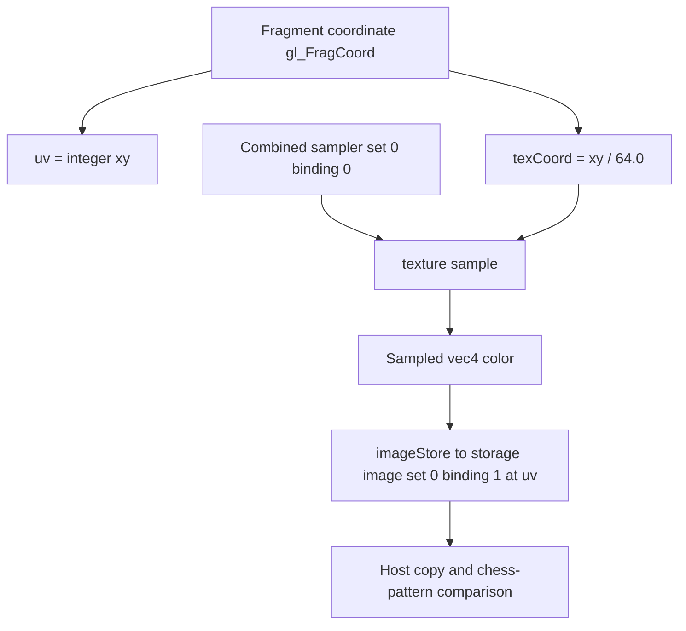

## Overview

**Core question:** Can a shader correctly access one selected slice of a 3D image through a 2D image view?

- [`vktPipelineImage2DViewOf3DTests.cpp`](../../../modules/vulkan/pipeline/vktPipelineImage2DViewOf3DTests.cpp#L1) implements the `image_2d_view_3d_image` test family for `VK_EXT_image_2d_view_of_3d`.
- The tests access a selected 2D view of a 3D image through storage-image, separate-sampler, and combined-image-sampler descriptors.
- The file registers fragment cases for applicable pipeline variants and compute cases for monolithic construction.
- This page explains the registration matrix, the descriptor access forms, the host/device flow, and what an image mismatch indicates.

## Background Knowledge

For the shared concept pipeline construction type, see [Background Knowledge](../../categories/pipeline.md#background-knowledge) of the `pipeline` page.

- A 2D view of a 3D image selects one mip level and one depth slice. Shader operations through the view therefore use 2D coordinates while referring to that selected part of the 3D image. `image2DViewOf3D` enables this form of image view; `sampler2DViewOf3D` additionally enables sampled access, as defined in [the feature chapter](../../../../vulkan-docs/src/chapters/features.adoc#L7437-L7463).
- A storage-image descriptor permits shader image loads and stores. Sampled access uses either a separate sampled-image descriptor plus sampler descriptor, or a combined image sampler descriptor.
- Sparse binding creates an image whose memory binding is submitted with `queueBindSparse`. The sparse variant still has to expose the same selected 2D view and preserve the requested image contents.

## Registration Hierarchy

```text
pipeline.monolithic.image_2d_view_3d_image
├── compute
└── fragment
```

`compute` contains test cases only when `pipelineConstructionType` is `PIPELINE_CONSTRUCTION_TYPE_MONOLITHIC`. `fragment` is registered for every applicable pipeline construction type. The dispatcher excludes the family from Vulkan SC with `#ifndef CTS_USES_VULKANSC`.

## Parameter Dimensions and Observed Values

| Dimension | Registered values | Meaning in this test | Evidence |
|-----------|-------------------|----------------------|----------|
| execution stage | `compute`, `fragment` | Selects dispatch or graphics-pipeline execution. `compute` is monolithic only. | [`createImage2DViewOf3DTests()`](../../../modules/vulkan/pipeline/vktPipelineImage2DViewOf3DTests.cpp#L1014-L1071) |
| descriptor access type | `storage`, `sampler`, `combined_image_sampler` | Selects storage access, separate sampled-image and sampler access, or combined sampled access. | [access-type registration](../../../modules/vulkan/pipeline/vktPipelineImage2DViewOf3DTests.cpp#L1023-L1028) |
| `mipLevel` | `0`, `2` | Selects the 3D-image mip level for the 2D view. | [mip loop](../../../modules/vulkan/pipeline/vktPipelineImage2DViewOf3DTests.cpp#L1033-L1036) |
| `layerNdx` | first and final slice of each selected mip | Checks both ends of the available depth range. For a base dimension of `64`, the registered final slices are `63` at mip `0` and `15` at mip `2`. | [layer selection](../../../modules/vulkan/pipeline/vktPipelineImage2DViewOf3DTests.cpp#L1035-L1039) |
| image binding type | normal, `_sparse` | Selects ordinary memory binding or sparse memory binding. | [binding loop](../../../modules/vulkan/pipeline/vktPipelineImage2DViewOf3DTests.cpp#L1039-L1051) |
| image format and base size | `VK_FORMAT_R8G8B8A8_UNORM`, `64 x 64 x 64` | Fixes the stored pixel format and the base 3D image extent. | [test parameters](../../../modules/vulkan/pipeline/vktPipelineImage2DViewOf3DTests.cpp#L1042-L1049) |

The monolithic mustpass file has 48 leaves under this family: 24 `compute` and 24 `fragment`. Each non-monolithic applicable pipeline variant has 24 `fragment` leaves.

## Behavior Parameters

The primary behavior parameter is the descriptor access type. Each value accesses the same kind of selected 2D view, but uses a different descriptor contract.

### storage: storage-image write access

The test creates a `VK_DESCRIPTOR_TYPE_STORAGE_IMAGE` binding for the selected 2D view. The shader generates a chess pattern and writes it directly through the view with `imageStore`; it does not read the view. The host then copies the selected slice from the 3D image for comparison. This isolates storage-image writes through a 2D view of a 3D image.

### sampler: separate sampled image and sampler

The test creates separate `VK_DESCRIPTOR_TYPE_SAMPLED_IMAGE` and `VK_DESCRIPTOR_TYPE_SAMPLER` bindings for the selected view. It uploads a chess pattern to the chosen 3D-image slice, samples through the 2D view, and writes the sampled result to a separate 2D storage image.

### combined_image_sampler: combined sampled access

The test binds the selected view with `VK_DESCRIPTOR_TYPE_COMBINED_IMAGE_SAMPLER`. It uses the same sampled-input and 2D-result-image model as `sampler`, but exercises the combined descriptor form instead of separate sampled-image and sampler bindings.

The `compute` and `fragment` test families execute these behavior values through different pipeline paths. Mip level, selected slice, and normal or sparse binding vary the resource instance without changing the primary descriptor-access behavior.

## Shader Analysis

### Representative Shader Walkthrough 1

#### Parameter Values Chosen

Representative path:

```text
dEQP-VK.pipeline.shader_object_linked_binary.image_2d_view_3d_image.fragment.combined_image_sampler.mip0_layer0
```

| Parameter choice | Meaning in this representative case |
|------------------|-------------------------------------|
| `fragment` | Runs the view access from a fragment shader; the monolithic variant uses the same generated fragment source in its graphics path. |
| `combined_image_sampler` | Uses one combined descriptor at set 0, binding 0 for the selected 2D view, while binding 1 is a separate storage image receiving the sampled result. |
| `mip0_layer0` | Selects mip level 0 and the first depth slice of the 64×64×64 source image. The view range contains exactly one mip and one layer, so shader coordinates are 2D. |
| `VK_FORMAT_R8G8B8A8_UNORM`, normal binding | Keeps the fixed format and ordinary image-memory path; sparse suffixes vary backing and submission ordering without changing this shader. |

#### Purpose

The fragment shader samples the selected `VK_IMAGE_VIEW_TYPE_2D` view of the 3D image through a combined image sampler and stores the result into a separate 2D storage image. The host copies that result to a buffer and compares it with the generated chess pattern, making an incorrect mip/layer selection or sampled-view access visible as a pixel mismatch.

#### Structural Design



#### Shader Code

```glsl
#version 450 core
/// Binding 0 is the combined image-sampler descriptor for the 2D view selecting
/// mip 0, layer 0 of the 64×64×64 R8G8B8A8_UNORM 3D image.
layout (set = 0, binding = 0) uniform sampler2D combinedSampler;
/// Binding 1 is a separate 64×64 R8G8B8A8_UNORM 2D storage image used to retain
/// the sampled texels for transfer to the host-side comparison buffer.
layout (rgba8, set = 0, binding = 1) uniform image2D verifyImage;
void main (void) {
    /// Fragment coordinates are integerized for the output-image texel address.
    ivec2 uv = ivec2(gl_FragCoord.xy);
    /// The 64-pixel framebuffer maps the fragment center coordinate to normalized
    /// texture space; the selected 2D view supplies the fixed mip and layer.
    vec2 texCoord = gl_FragCoord.xy / 64.0;
    vec4 color = texture(combinedSampler, texCoord);
    /// Store the sampled value so the host can compare every output texel.
    imageStore(verifyImage, uv, color);
}
```

#### Additional Info

- `Image2DView3DImageInstance::iterate()` uploads a chess pattern only into the selected source layer and clears the other layers white; the reference image is depth one because the result is a 2D image.
- The same generated fragment source is used for `sampler` after splitting the input descriptor into bindings 0 and 1, and for `storage` after replacing the sample with the direct `imageStore` pattern generator; mip, layer, and sparse registration values do not alter this combined-sampler shader body.

#### Parameter Variation Summary

| Parameter dimension | Shader-level variation from this shader | Evidence |
|---------------------|----------------------------------------|----------|
| descriptor access type | `combined_image_sampler` emits `sampler2D` plus `texture`; `sampler` emits separate `texture2D` and `sampler` objects combined at the call site; `storage` emits a write-only `image2D` and writes the chess value directly. | [`ComputeImage2DView3DImageTest::initPrograms()`](../../../modules/vulkan/pipeline/vktPipelineImage2DViewOf3DTests.cpp#L848-L893), [`FragmentImage2DView3DImageTest::initPrograms()`](../../../modules/vulkan/pipeline/vktPipelineImage2DViewOf3DTests.cpp#L921-L976) |
| execution stage | Fragment code uses `gl_FragCoord`; the compute counterpart uses `gl_GlobalInvocationID` with the same normalized-coordinate and output-image dataflow. | [`FragmentImage2DView3DImageTest::initPrograms()`](../../../modules/vulkan/pipeline/vktPipelineImage2DViewOf3DTests.cpp#L921-L976), [`ComputeImage2DView3DImageTest::initPrograms()`](../../../modules/vulkan/pipeline/vktPipelineImage2DViewOf3DTests.cpp#L848-L893) |
| mip level and selected layer | These values change the host-created view range and the generated divisor (`64.0` at mip 0 or `16.0` at mip 2); the shader remains 2D because the view has one mip and one layer. | [`createImage2DViewOf3DTests()`](../../../modules/vulkan/pipeline/vktPipelineImage2DViewOf3DTests.cpp#L1028-L1064), [`Image2DView3DImageInstance::iterate()`](../../../modules/vulkan/pipeline/vktPipelineImage2DViewOf3DTests.cpp#L411-L542) |
| normal versus sparse binding | No shader text changes; sparse setup binds the 3D image through `queueBindSparse` and passes a semaphore that the execution submission waits on before the shader work. | [`Image2DView3DImageInstance::iterate()`](../../../modules/vulkan/pipeline/vktPipelineImage2DViewOf3DTests.cpp#L441-L535), [`commonSubmission()`](../../../modules/vulkan/pipeline/vktPipelineImage2DViewOf3DTests.cpp#L254-L262) |

#### SPIR-V

- Status: generated and validated
- Source: reconstructed `GLSL` from this walkthrough
- Stage: `frag`
- Target SPIRV version: `spirv1.0`

<details>
<summary>Click to expand SPIRV asm code</summary>

```llvm
; SPIR-V
; Version: 1.0
; Generator: Khronos Glslang Reference Front End; 11
; Bound: 40
; Schema: 0
               OpCapability Shader
          %1 = OpExtInstImport "GLSL.std.450"
               OpMemoryModel Logical GLSL450
               OpEntryPoint Fragment %main "main" %gl_FragCoord
               OpExecutionMode %main OriginUpperLeft
               OpSource GLSL 450
               OpName %main "main"
               OpName %uv "uv"
               OpName %gl_FragCoord "gl_FragCoord"
               OpName %texCoord "texCoord"
               OpName %color "color"
               OpName %combinedSampler "combinedSampler"
               OpName %verifyImage "verifyImage"
               OpDecorate %gl_FragCoord BuiltIn FragCoord
               OpDecorate %combinedSampler Binding 0
               OpDecorate %combinedSampler DescriptorSet 0
               OpDecorate %verifyImage Binding 1
               OpDecorate %verifyImage DescriptorSet 0
       %void = OpTypeVoid
          %3 = OpTypeFunction %void
        %int = OpTypeInt 32 1
      %v2int = OpTypeVector %int 2
%_ptr_Function_v2int = OpTypePointer Function %v2int
      %float = OpTypeFloat 32
    %v4float = OpTypeVector %float 4
%_ptr_Input_v4float = OpTypePointer Input %v4float
%gl_FragCoord = OpVariable %_ptr_Input_v4float Input
    %v2float = OpTypeVector %float 2
%_ptr_Function_v2float = OpTypePointer Function %v2float
   %float_64 = OpConstant %float 64
%_ptr_Function_v4float = OpTypePointer Function %v4float
         %27 = OpTypeImage %float 2D 0 0 0 1 Unknown
         %28 = OpTypeSampledImage %27
%_ptr_UniformConstant_28 = OpTypePointer UniformConstant %28
%combinedSampler = OpVariable %_ptr_UniformConstant_28 UniformConstant
         %34 = OpTypeImage %float 2D 0 0 0 2 Rgba8
%_ptr_UniformConstant_34 = OpTypePointer UniformConstant %34
%verifyImage = OpVariable %_ptr_UniformConstant_34 UniformConstant
       %main = OpFunction %void None %3
          %5 = OpLabel
         %uv = OpVariable %_ptr_Function_v2int Function
   %texCoord = OpVariable %_ptr_Function_v2float Function
      %color = OpVariable %_ptr_Function_v4float Function
         %15 = OpLoad %v4float %gl_FragCoord
         %16 = OpVectorShuffle %v2float %15 %15 0 1
         %17 = OpConvertFToS %v2int %16
               OpStore %uv %17
         %20 = OpLoad %v4float %gl_FragCoord
         %21 = OpVectorShuffle %v2float %20 %20 0 1
         %23 = OpCompositeConstruct %v2float %float_64 %float_64
         %24 = OpFDiv %v2float %21 %23
               OpStore %texCoord %24
         %31 = OpLoad %28 %combinedSampler
         %32 = OpLoad %v2float %texCoord
         %33 = OpImageSampleImplicitLod %v4float %31 %32
               OpStore %color %33
         %37 = OpLoad %34 %verifyImage
         %38 = OpLoad %v2int %uv
         %39 = OpLoad %v4float %color
               OpImageWrite %37 %38 %39
               OpReturn
               OpFunctionEnd

```

</details>

## Runtime Execution and Result Checking

- The test creates a 3D image with `VK_IMAGE_CREATE_2D_VIEW_COMPATIBLE_BIT_EXT`, three mip levels, and either sampled-image or storage-image usage according to the descriptor access type.
- Normal cases allocate image memory in the ordinary path. Sparse cases create the image, allocate memory blocks, bind them with `queueBindSparse`, and pass the resulting semaphore to the execution path.
- The test creates a `VK_IMAGE_VIEW_TYPE_2D` view with the selected `mipLevel` and `layerNdx` in its `VkImageSubresourceRange`.
- For sampled cases, the host fills the selected 3D-image slice with a chess pattern, uploads it through a buffer, clears a separate 2D result image, and binds that result image as storage output. Storage-image cases clear the test image before shader execution.
- The host selects a compute or fragment pipeline, records the associated commands, then copies the observed result to a host-visible `outputBuffer`.
- The test builds a depth-one reference image with the expected chess pattern and calls [`tcu::floatThresholdCompare`](../../../modules/vulkan/pipeline/vktPipelineImage2DViewOf3DTests.cpp#L796) using a `0.01f` threshold. A failed comparison returns `Pixel comparison failed.`

## Failure Meaning

### Failure Cause Mapping

| If this behavior parameter value fails | Possible failure cause(s) |
|----------------------------------------|---------------------------|
| `storage` | The implementation may create, bind, or access the selected 2D view of the 3D image incorrectly through a storage-image descriptor. |
| `sampler` | The implementation may handle the selected 2D view, separate sampled-image and sampler descriptors, or sampled readback incorrectly. |
| `combined_image_sampler` | The implementation may handle the selected 2D view or the combined image sampler descriptor incorrectly. |

A failure limited to a sparse suffix can also indicate sparse-image allocation, binding, or sparse-queue synchronization trouble before the shader access.

### Cause Analysis

#### 2D-view selection or descriptor access failure

**Possible failure symptoms:** The copied output differs from the chess-pattern reference, causing `tcu::floatThresholdCompare` to report a mismatch. The pattern of failures may be restricted to a descriptor access type, mip level, selected first or final slice, or execution stage.

**Possible implementation causes:** The implementation may associate the view with the wrong mip level or selected depth slice, fail to honor `VK_IMAGE_VIEW_TYPE_2D` access to the compatible 3D image, or mishandle the descriptor type used by the failing behavior value. The source comparison cannot distinguish these paths once the final pixel image mismatches, so source-level investigation should use the failing descriptor, view range, and registered suffix to narrow the cause.

#### Sparse binding setup or ordering failure

**Possible failure symptoms:** Only `_sparse` cases fail, while equivalent normal-binding cases pass. The observed output may contain missing or incorrect pixels before the final comparison.

**Possible implementation causes:** Sparse memory allocation or `queueBindSparse` submission may fail to make the image backing available to the subsequent pipeline work, or sparse-specific feature support may be incomplete. The test passes the sparse-binding semaphore into the execution path, so investigation should also examine sparse-queue and pipeline-work ordering.

## Case Pruning

### Requirement-based pruning

- All cases require `VK_EXT_image_2d_view_of_3d` and `image2DViewOf3D`.
- `sampler` and `combined_image_sampler` cases also require `sampler2DViewOf3D`.
- Fragment cases require `fragmentStoresAndAtomics` because sampled paths write a result image and fragment execution uses storage-image operations.
- Sparse variants require `DEVICE_CORE_FEATURE_SPARSE_BINDING`, `VK_KHR_maintenance9`, and the `image2DViewOf3DSparse` property. The source also rejects a sparse image whose required memory exceeds `sparseAddressSpaceSize`.
- Vulkan SC does not register this family, and compute cases are restricted to monolithic pipeline construction.

### Design-based pruning

The generator tests only mip levels `0` and `2`, and only the first and final slice of each selected mip. This gives boundary coverage over the image's mip and depth selection without enumerating every slice. It fixes the image format to `VK_FORMAT_R8G8B8A8_UNORM` and base extent to `64 x 64 x 64` so the comparison can use one predictable chess-pattern reference.

## Key Takeaways

- The family verifies that a selected mip-level slice of a 3D image behaves as a 2D view for storage and sampled descriptor access.
- `storage`, `sampler`, and `combined_image_sampler` are the primary behavioral values; stage, mip, slice, and binding type extend their coverage.
- The test uses normal and sparse backing for the same view model, then compares the copied image against a depth-one chess-pattern reference.
- The monolithic variant covers both compute and fragment execution, while other applicable variants cover fragment execution only.

## Source Reference Appendix

| Entry point | Link | Why it matters |
|-------------|------|----------------|
| Feature checks | [`ComputeImage2DView3DImageTest::checkSupport()`](../../../modules/vulkan/pipeline/vktPipelineImage2DViewOf3DTests.cpp#L831-L839) | Checks required 2D-view and sampler features. |
| Resource setup and comparison | [`Image2DView3DImageTestInstance::iterate()`](../../../modules/vulkan/pipeline/vktPipelineImage2DViewOf3DTests.cpp#L409-L806) | Creates images and views, executes work, copies results, and compares pixels. |
| Test registration | [`createImage2DViewOf3DTests()`](../../../modules/vulkan/pipeline/vktPipelineImage2DViewOf3DTests.cpp#L1014-L1071) | Generates the access, mip, slice, sparse, and stage matrix. |
| Pipeline dispatcher | [`createChildren()`](../../../modules/vulkan/pipeline/vktPipelineTests.cpp#L123-L124) | Adds the family outside Vulkan SC. |
| Feature definition | [`VkPhysicalDeviceImage2DViewOf3DFeaturesEXT`](../../../../vulkan-docs/src/chapters/features.adoc#L7437-L7463) | Defines `image2DViewOf3D` and `sampler2DViewOf3D`. |
