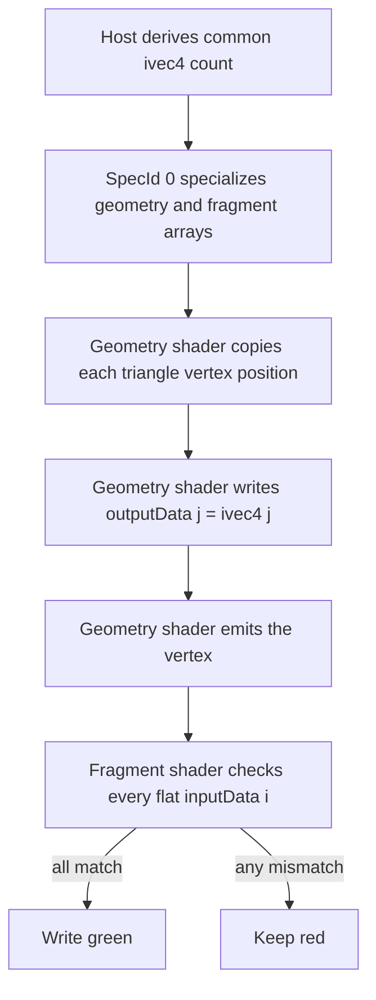

## Overview

**Core question:** Can a graphics-stage chain carry the maximum tested number of 32-bit varying components across a selected shader-stage interface and still produce the expected fragment result?

- This page documents the `max_varyings` test family implemented by [`vktPipelineMaxVaryingsTests.cpp`](../../../modules/vulkan/pipeline/vktPipelineMaxVaryingsTests.cpp#L57-L1158).
- Six test case leaves select vertex-to-fragment, tessellation-evaluation-to-fragment, or geometry-to-fragment pipelines, then stress either the producer output or fragment input side of that interface.
- The test converts the device's component limits into a specialization-sized `ivec4` array, sends indexed values through the interface, and accepts only an all-green rendered image.
- The same six leaves occur under seven pipeline-construction roots in the Vulkan default mustpass scope: monolithic, two graphics-pipeline-library modes, and four shader-object modes.

## Background Knowledge

For the shared concept pipeline construction type, see [Background Knowledge](../../categories/pipeline.md#background-knowledge) of the `pipeline` page.

- A user-defined shader interface uses `Location` decorations. For the 32-bit types used here, a location has four component slots, so an `ivec4` consumes one location. The Vulkan specification defines this accounting in [Location and Component Assignment](../../../../vulkan-docs/src/chapters/interfaces.adoc#interfaces-iointerfaces-locations).
- Stage-specific component limits translate to available interface locations by division by four. The [interface limits table](../../../../vulkan-docs/src/chapters/interfaces.adoc#interfaces-iointerfaces-limits) lists the vertex-output, tessellation-evaluation input/output, geometry input/output, and fragment-input limits used here.
- `gl_Position` is a built-in vertex-like output. This test reserves one four-component output slot for it when it calculates a producer array length.
- A Vulkan specialization constant supplies a value when the shader is specialized during pipeline or shader-object creation. Here it makes the SPIR-V array type large enough for the current device without maintaining a separate shader binary for every limit.

## Registration Hierarchy

```text
pipeline.monolithic.max_varyings
├── test_vertex_io_between_vertex_fragment
├── test_fragment_io_between_vertex_fragment
├── test_tess_eval_io_between_tess_eval_fragment
├── test_fragment_io_between_tess_eval_fragment
├── test_geometry_io_between_geometry_fragment
└── test_fragment_io_between_geometry_fragment
```

The source registers these six leaves in [`createMaxVaryingsTests`](../../../modules/vulkan/pipeline/vktPipelineMaxVaryingsTests.cpp#L1133-L1158). Equivalent leaf sets are also present under `pipeline.pipeline_library`, `pipeline.fast_linked_library`, `pipeline.shader_object_unlinked_spirv`, `pipeline.shader_object_unlinked_binary`, `pipeline.shader_object_linked_spirv`, and `pipeline.shader_object_linked_binary`. Each of the seven mustpass files contains six `max_varyings` entries.

## Parameter Dimensions and Observed Values

| Dimension | Registered values | Meaning in this test | Evidence |
|---|---|---|---|
| Test case leaf | `test_vertex_io_between_vertex_fragment`, `test_fragment_io_between_vertex_fragment`, `test_tess_eval_io_between_tess_eval_fragment`, `test_fragment_io_between_tess_eval_fragment`, `test_geometry_io_between_geometry_fragment`, `test_fragment_io_between_geometry_fragment` | Selects the stage chain and whether the stressed side is the producer or fragment input. | [`createMaxVaryingsTests`](../../../modules/vulkan/pipeline/vktPipelineMaxVaryingsTests.cpp#L1133-L1158) |
| `pipelineConstructionType` | monolithic, pipeline-library, fast-linked-library, shader-object-unlinked-SPIR-V, shader-object-unlinked-binary, shader-object-linked-SPIR-V, shader-object-linked-binary | Reuses the same interface test under the pipeline construction roots represented in the mustpass files. | [`vktPipelineTests.cpp`](../../../modules/vulkan/pipeline/vktPipelineTests.cpp#L166-L176) |
| Producer stage | `VK_SHADER_STAGE_VERTEX_BIT`, `VK_SHADER_STAGE_TESSELLATION_EVALUATION_BIT`, `VK_SHADER_STAGE_GEOMETRY_BIT` | Determines the output-component limit used to size the producer array. | [`getMaxIOComponents`](../../../modules/vulkan/pipeline/vktPipelineMaxVaryingsTests.cpp#L915-L948) |
| Consumer stage | `VK_SHADER_STAGE_FRAGMENT_BIT` | Supplies the input-component limit for the matching fragment array. | [`getMaxIOComponents`](../../../modules/vulkan/pipeline/vktPipelineMaxVaryingsTests.cpp#L939-L942) |
| Array length | `min(maxOutput, maxInput)` `ivec4` elements, via `SpecId 0` | Sizes both ends to the largest common interface capacity for the selected pair. Producer capacities subtract one `vec4` for `gl_Position`. | [`test`](../../../modules/vulkan/pipeline/vktPipelineMaxVaryingsTests.cpp#L995-L1025) |

## Behavior Parameters

The primary behavioral axis is the registered test case leaf. Each leaf chooses the interface side that must reach its device-reported capacity while the other side supplies the compatible endpoint.

### test_vertex_io_between_vertex_fragment: vertex output capacity

The vertex shader writes every element of its specialization-sized output array before rasterization. The fragment shader consumes the array, so this leaf tests the usable vertex output interface after reserving capacity for `gl_Position`.

### test_fragment_io_between_vertex_fragment: fragment input capacity after vertex output

The vertex shader provides the compatible array, while the fragment shader declares and checks the array at the fragment input limit. This separates fragment input capacity from the preceding vertex output stress leaf.

### test_tess_eval_io_between_tess_eval_fragment: tessellation-evaluation output capacity

A vertex and tessellation-control passthrough establish a patch pipeline. The tessellation-evaluation shader writes the indexed array, then the fragment shader checks it. This leaf requires `tessellationShader`.

### test_fragment_io_between_tess_eval_fragment: fragment input capacity after tessellation evaluation

The tessellation-evaluation stage supplies the compatible output array and the fragment stage is stressed at its input capacity. It also requires `tessellationShader`.

### test_geometry_io_between_geometry_fragment: geometry output capacity

The geometry shader reproduces the input triangle, writes the indexed array for each emitted vertex, and sends it to the fragment shader. This leaf requires `geometryShader`.

### test_fragment_io_between_geometry_fragment: fragment input capacity after geometry

The geometry shader provides the compatible array, while the fragment input array is sized to the fragment limit. It checks the consumer side of the geometry-to-fragment interface and requires `geometryShader`.

## Shader Analysis

### Representative Shader Walkthrough 1

#### Parameter Values Chosen

Representative path:

```text
dEQP-VK.pipeline.shader_object_linked_binary.max_varyings.test_fragment_io_between_geometry_fragment
```

| Parameter choice | Meaning in this representative case |
|------------------|-------------------------------------|
| `shader_object_linked_binary` | Builds the same inline SPIR-V modules through the linked-binary shader-object construction path. |
| `outputStage = VK_SHADER_STAGE_GEOMETRY_BIT` | Selects the geometry shader as the producer of the varying array and emits the source triangle as a triangle strip. |
| `inputStage = VK_SHADER_STAGE_FRAGMENT_BIT` | Selects the fragment shader as the consumer of the varying array. |
| `stageToStressIO = VK_SHADER_STAGE_FRAGMENT_BIT` | Requires the geometry producer to support the fragment stage's full reported input capacity; unsupported asymmetric limits are pruned. |
| specialization constant `SpecId 0` | Sets both array types to `min((maxGeometryOutputComponents / 4) - 1, maxFragmentInputComponents / 4)` `ivec4` elements for the device. |

#### Purpose

This case fills a specialization-sized, location-0 geometry output array with `ivec4(i)` values and verifies every element in the fragment shader. A green image proves that the complete fragment-input-capacity payload survived the geometry-to-fragment interface.

#### Structural Design



#### Shader Code

##### Fragment Shader

```glsl
#version 450
/// SpecId 0 is supplied to both interface stages from the device's common geometry-output/fragment-input capacity.
layout(constant_id = 0) const int arraySize = 1;
/// This flat array begins at Location 0 and consumes one location per ivec4 element.
layout(location = 0) flat in ivec4 inputData[arraySize];
/// Red reports an interface mismatch; green reports that every specialized array element arrived intact.
layout(location = 0) out vec4 color;
void main()
{
    color = vec4(1.0, 0.0, 0.0, 1.0);
    int i;
    bool result = true;
    /// Compare the complete fragment-input interface payload against the producer's index pattern.
    for (i = 0; i < arraySize; i++)
    {
        if (result && inputData[i] != ivec4(i))
            result = false;
    }
    if (result)
        color = vec4(0.0, 1.0, 0.0, 1.0);
}
```

##### Geometry Shader

```glsl
#version 450
/// Consume triangles and re-emit each input triangle as a three-vertex strip.
layout (triangles) in;
layout (triangle_strip, max_vertices = 3) out;
/// The same SpecId 0 value specializes the producer and fragment-consumer array types.
layout(constant_id = 0) const int arraySize = 1;
/// Each ivec4 consumes one user-defined output location beginning at Location 0.
layout(location = 0) out ivec4 outputData[arraySize];
in gl_PerVertex {
    vec4 gl_Position;
} gl_in[];
void main()
{
    int i;
    int j;
    /// Preserve triangle geometry while regenerating the complete varying payload for every emitted vertex.
    for(i = 0; i < gl_in.length(); i++)
    {
        gl_Position = gl_in[i].gl_Position;
        for (j = 0; j < arraySize; j++)
        {
            outputData[j] = ivec4(j);
        }
        EmitVertex();
    }
    EndPrimitive();
}
```

#### Additional Info

- The geometry shader is the non-primary stage shown here. Geometry cases use it while vertex and tessellation-evaluation cases replace it with their corresponding producer; its per-emitted-vertex stores are what supply the fragment shader's checked interface payload.
- [`initPrograms`](../../../modules/vulkan/pipeline/vktPipelineMaxVaryingsTests.cpp#L98-L702) stores inline SPIR-V assembly and includes the GLSL origins reconstructed above in source comments; the test builds those modules for SPIR-V 1.3.
- The support check permits this fragment-stress leaf only when usable geometry outputs, after reserving one `vec4` for `gl_Position`, can cover all reported fragment inputs.

#### Parameter Variation Summary

| Parameter dimension | Shader-level variation from this shader | Evidence |
|---------------------|---------------------------------------|----------|
| Stressed interface side | Producer-stress leaves size and validate the selected producer's usable output capacity; this leaf stresses the fragment declaration at its reported input capacity. | [`supportedCheck`](../../../modules/vulkan/pipeline/vktPipelineMaxVaryingsTests.cpp#L727-L793) |
| Producer stage | Vertex cases write the same indexed array directly in the vertex shader; tessellation cases interpolate position in the tessellation-evaluation shader before writing it; geometry cases write it once per emitted vertex. | [`initPrograms`](../../../modules/vulkan/pipeline/vktPipelineMaxVaryingsTests.cpp#L98-L702) |
| Pipeline construction type | The shader logic and specialization remain the same while module and pipeline construction changes across monolithic, pipeline-library, and shader-object roots. | [`createPipelineTests`](../../../modules/vulkan/pipeline/vktPipelineTests.cpp#L166-L176) |
| Device interface limits | `SpecId 0` changes the concrete array length to the common producer-output and fragment-input capacity reported by the device. | [`getMaxIOComponents` and `test`](../../../modules/vulkan/pipeline/vktPipelineMaxVaryingsTests.cpp#L915-L1025) |

#### SPIR-V

##### Fragment Shader

- Status: generated and validated
- Source: reconstructed `GLSL` from this walkthrough
- Stage: `frag`
- Target SPIRV version: `spirv1.3`

<details>
<summary>Click to expand SPIRV asm code</summary>

```llvm
; SPIR-V
; Version: 1.3
; Generator: Khronos Glslang Reference Front End; 11
; Bound: 56
; Schema: 0
               OpCapability Shader
          %1 = OpExtInstImport "GLSL.std.450"
               OpMemoryModel Logical GLSL450
               OpEntryPoint Fragment %main "main" %color %inputData
               OpExecutionMode %main OriginUpperLeft
               OpSource GLSL 450
               OpName %main "main"
               OpName %color "color"
               OpName %result "result"
               OpName %i "i"
               OpName %arraySize "arraySize"
               OpName %inputData "inputData"
               OpDecorate %color Location 0
               OpDecorate %arraySize SpecId 0
               OpDecorate %inputData Flat
               OpDecorate %inputData Location 0
       %void = OpTypeVoid
          %3 = OpTypeFunction %void
      %float = OpTypeFloat 32
    %v4float = OpTypeVector %float 4
%_ptr_Output_v4float = OpTypePointer Output %v4float
      %color = OpVariable %_ptr_Output_v4float Output
    %float_1 = OpConstant %float 1
    %float_0 = OpConstant %float 0
         %12 = OpConstantComposite %v4float %float_1 %float_0 %float_0 %float_1
       %bool = OpTypeBool
%_ptr_Function_bool = OpTypePointer Function %bool
       %true = OpConstantTrue %bool
        %int = OpTypeInt 32 1
%_ptr_Function_int = OpTypePointer Function %int
      %int_0 = OpConstant %int 0
  %arraySize = OpSpecConstant %int 1
      %v4int = OpTypeVector %int 4
%_arr_v4int_arraySize = OpTypeArray %v4int %arraySize
%_ptr_Input__arr_v4int_arraySize = OpTypePointer Input %_arr_v4int_arraySize
  %inputData = OpVariable %_ptr_Input__arr_v4int_arraySize Input
%_ptr_Input_v4int = OpTypePointer Input %v4int
     %v4bool = OpTypeVector %bool 4
      %false = OpConstantFalse %bool
      %int_1 = OpConstant %int 1
         %55 = OpConstantComposite %v4float %float_0 %float_1 %float_0 %float_1
       %main = OpFunction %void None %3
          %5 = OpLabel
     %result = OpVariable %_ptr_Function_bool Function
          %i = OpVariable %_ptr_Function_int Function
               OpStore %color %12
               OpStore %result %true
               OpStore %i %int_0
               OpBranch %21
         %21 = OpLabel
               OpLoopMerge %23 %24 None
               OpBranch %25
         %25 = OpLabel
         %26 = OpLoad %int %i
         %28 = OpSLessThan %bool %26 %arraySize
               OpBranchConditional %28 %22 %23
         %22 = OpLabel
         %29 = OpLoad %bool %result
               OpSelectionMerge %31 None
               OpBranchConditional %29 %30 %31
         %30 = OpLabel
         %36 = OpLoad %int %i
         %38 = OpAccessChain %_ptr_Input_v4int %inputData %36
         %39 = OpLoad %v4int %38
         %40 = OpLoad %int %i
         %41 = OpCompositeConstruct %v4int %40 %40 %40 %40
         %43 = OpINotEqual %v4bool %39 %41
         %44 = OpAny %bool %43
               OpBranch %31
         %31 = OpLabel
         %45 = OpPhi %bool %29 %22 %44 %30
               OpSelectionMerge %47 None
               OpBranchConditional %45 %46 %47
         %46 = OpLabel
               OpStore %result %false
               OpBranch %47
         %47 = OpLabel
               OpBranch %24
         %24 = OpLabel
         %49 = OpLoad %int %i
         %51 = OpIAdd %int %49 %int_1
               OpStore %i %51
               OpBranch %21
         %23 = OpLabel
         %52 = OpLoad %bool %result
               OpSelectionMerge %54 None
               OpBranchConditional %52 %53 %54
         %53 = OpLabel
               OpStore %color %55
               OpBranch %54
         %54 = OpLabel
               OpReturn
               OpFunctionEnd
```

</details>

##### Geometry Shader

- Status: generated and validated
- Source: reconstructed `GLSL` from this walkthrough
- Stage: `geom`
- Target SPIRV version: `spirv1.3`

<details>
<summary>Click to expand SPIRV asm code</summary>

```llvm
; SPIR-V
; Version: 1.3
; Generator: Khronos Glslang Reference Front End; 11
; Bound: 61
; Schema: 0
               OpCapability Geometry
          %1 = OpExtInstImport "GLSL.std.450"
               OpMemoryModel Logical GLSL450
               OpEntryPoint Geometry %main "main" %_ %gl_in %outputData
               OpExecutionMode %main Triangles
               OpExecutionMode %main Invocations 1
               OpExecutionMode %main OutputTriangleStrip
               OpExecutionMode %main OutputVertices 3
               OpSource GLSL 450
               OpName %main "main"
               OpName %i "i"
               OpName %gl_PerVertex "gl_PerVertex"
               OpMemberName %gl_PerVertex 0 "gl_Position"
               OpMemberName %gl_PerVertex 1 "gl_PointSize"
               OpMemberName %gl_PerVertex 2 "gl_ClipDistance"
               OpMemberName %gl_PerVertex 3 "gl_CullDistance"
               OpName %_ ""
               OpName %gl_PerVertex_0 "gl_PerVertex"
               OpMemberName %gl_PerVertex_0 0 "gl_Position"
               OpName %gl_in "gl_in"
               OpName %j "j"
               OpName %arraySize "arraySize"
               OpName %outputData "outputData"
               OpDecorate %gl_PerVertex Block
               OpMemberDecorate %gl_PerVertex 0 BuiltIn Position
               OpMemberDecorate %gl_PerVertex 1 BuiltIn PointSize
               OpMemberDecorate %gl_PerVertex 2 BuiltIn ClipDistance
               OpMemberDecorate %gl_PerVertex 3 BuiltIn CullDistance
               OpDecorate %gl_PerVertex_0 Block
               OpMemberDecorate %gl_PerVertex_0 0 BuiltIn Position
               OpDecorate %arraySize SpecId 0
               OpDecorate %outputData Location 0
       %void = OpTypeVoid
          %3 = OpTypeFunction %void
        %int = OpTypeInt 32 1
%_ptr_Function_int = OpTypePointer Function %int
      %int_0 = OpConstant %int 0
      %int_3 = OpConstant %int 3
       %bool = OpTypeBool
      %float = OpTypeFloat 32
    %v4float = OpTypeVector %float 4
       %uint = OpTypeInt 32 0
     %uint_1 = OpConstant %uint 1
%_arr_float_uint_1 = OpTypeArray %float %uint_1
%gl_PerVertex = OpTypeStruct %v4float %float %_arr_float_uint_1 %_arr_float_uint_1
%_ptr_Output_gl_PerVertex = OpTypePointer Output %gl_PerVertex
          %_ = OpVariable %_ptr_Output_gl_PerVertex Output
%gl_PerVertex_0 = OpTypeStruct %v4float
     %uint_3 = OpConstant %uint 3
%_arr_gl_PerVertex_0_uint_3 = OpTypeArray %gl_PerVertex_0 %uint_3
%_ptr_Input__arr_gl_PerVertex_0_uint_3 = OpTypePointer Input %_arr_gl_PerVertex_0_uint_3
      %gl_in = OpVariable %_ptr_Input__arr_gl_PerVertex_0_uint_3 Input
%_ptr_Input_v4float = OpTypePointer Input %v4float
%_ptr_Output_v4float = OpTypePointer Output %v4float
  %arraySize = OpSpecConstant %int 1
      %v4int = OpTypeVector %int 4
%_arr_v4int_arraySize = OpTypeArray %v4int %arraySize
%_ptr_Output__arr_v4int_arraySize = OpTypePointer Output %_arr_v4int_arraySize
 %outputData = OpVariable %_ptr_Output__arr_v4int_arraySize Output
%_ptr_Output_v4int = OpTypePointer Output %v4int
      %int_1 = OpConstant %int 1
       %main = OpFunction %void None %3
          %5 = OpLabel
          %i = OpVariable %_ptr_Function_int Function
          %j = OpVariable %_ptr_Function_int Function
               OpStore %i %int_0
               OpBranch %10
         %10 = OpLabel
               OpLoopMerge %12 %13 None
               OpBranch %14
         %14 = OpLabel
         %15 = OpLoad %int %i
         %18 = OpSLessThan %bool %15 %int_3
               OpBranchConditional %18 %11 %12
         %11 = OpLabel
         %32 = OpLoad %int %i
         %34 = OpAccessChain %_ptr_Input_v4float %gl_in %32 %int_0
         %35 = OpLoad %v4float %34
         %37 = OpAccessChain %_ptr_Output_v4float %_ %int_0
               OpStore %37 %35
               OpStore %j %int_0
               OpBranch %39
         %39 = OpLabel
               OpLoopMerge %41 %42 None
               OpBranch %43
         %43 = OpLabel
         %44 = OpLoad %int %j
         %46 = OpSLessThan %bool %44 %arraySize
               OpBranchConditional %46 %40 %41
         %40 = OpLabel
         %51 = OpLoad %int %j
         %52 = OpLoad %int %j
         %53 = OpCompositeConstruct %v4int %52 %52 %52 %52
         %55 = OpAccessChain %_ptr_Output_v4int %outputData %51
               OpStore %55 %53
               OpBranch %42
         %42 = OpLabel
         %56 = OpLoad %int %j
         %58 = OpIAdd %int %56 %int_1
               OpStore %j %58
               OpBranch %39
         %41 = OpLabel
               OpEmitVertex
               OpBranch %13
         %13 = OpLabel
         %59 = OpLoad %int %i
         %60 = OpIAdd %int %59 %int_1
               OpStore %i %60
               OpBranch %10
         %12 = OpLabel
               OpEndPrimitive
               OpReturn
               OpFunctionEnd
```

</details>

## Runtime Execution and Result Checking

- The support callback queries features and physical-device limits. Tessellation leaves skip when `tessellationShader` is absent; geometry leaves skip when `geometryShader` is absent. It also skips incompatible producer and fragment capacities rather than attempting a non-common array size. See [`supportedCheck`](../../../modules/vulkan/pipeline/vktPipelineMaxVaryingsTests.cpp#L704-L798).
- The test converts the selected producer and fragment limits into `ivec4` element counts, takes their minimum, and installs that integer as specialization constant ID 0 for both relevant stages. [`getMaxIOComponents`](../../../modules/vulkan/pipeline/vktPipelineMaxVaryingsTests.cpp#L915-L948) subtracts one element from vertex, tessellation-evaluation, and geometry outputs for position data.
- It creates a 32x32 `VK_FORMAT_R8G8B8A8_UNORM` color attachment, a host-visible transfer-destination buffer, and a six-vertex screen-covering draw. Tessellation cases use patch topology; geometry cases attach a geometry module. The pipeline setup is in [`test`](../../../modules/vulkan/pipeline/vktPipelineMaxVaryingsTests.cpp#L950-L1073).
- After the draw, the command buffer transitions the color image from color-attachment output to transfer source, copies it to the host-visible buffer, establishes transfer-write to host-read visibility, submits, and waits. The host invalidates the allocation, builds an all-green reference image, and uses `tcu::floatThresholdCompare` with `tcu::Vec4(0.02f)`. See [`test`](../../../modules/vulkan/pipeline/vktPipelineMaxVaryingsTests.cpp#L1102-L1129).

## Failure Meaning

### Failure Cause Mapping

| If this behavior parameter value fails | Possible failure cause(s) |
|----------------------------------------|---------------------------|
| `VK_SHADER_STAGE_VERTEX_BIT` | Vertex output interface sizing, specialization, or vertex-to-fragment interpolation/consumption. |
| `VK_SHADER_STAGE_FRAGMENT_BIT` in the vertex-fragment family | Fragment input interface sizing or matching against vertex outputs. |
| `VK_SHADER_STAGE_TESSELLATION_EVALUATION_BIT` | Tessellation-evaluation output interface sizing, tessellation-stage plumbing, or its fragment consumer. |
| `VK_SHADER_STAGE_FRAGMENT_BIT` in the tessellation family | Fragment input interface sizing or matching across the tessellation chain. |
| `VK_SHADER_STAGE_GEOMETRY_BIT` | Geometry output interface sizing, emitted primitive data, or its fragment consumer. |
| `VK_SHADER_STAGE_FRAGMENT_BIT` in the geometry family | Fragment input interface sizing or matching across the geometry chain. |

### Cause Analysis

#### Producer output sizing and propagation

**Possible failure symptoms:** The fragment shader detects at least one indexed `ivec4` value that differs from its expected value, writes red, and the host image comparison fails.

**Possible implementation causes:** A failure may indicate that a stage's output-component limit was applied incorrectly when the specialized array was created, that the position reservation was not honored, or that user-defined output locations were not preserved through the selected stage chain. The Vulkan interface rules define the component accounting, while the CTS source supplies the stage-specific array sizing and payload checks. Further source-level investigation is needed to localize a failure to shader compilation, interface allocation, or a later pipeline stage.

#### Fragment input sizing and matching

**Possible failure symptoms:** A fragment-input stress leaf produces an image that is not within the all-green `0.02` threshold, even though the producer writes the indexed payload.

**Possible implementation causes:** The fragment input declaration may be allocated or matched incorrectly at the selected common capacity. In the tessellation and geometry families, the same visible symptom can also arise while carrying the interface through the intervening stages, so the final image alone does not isolate the fault path.

#### Tessellation or geometry stage handling

**Possible failure symptoms:** Only a tessellation or geometry leaf fails, or the affected chain produces red pixels while the vertex-to-fragment leaves pass.

**Possible implementation causes:** The implementation may mishandle stage-specific output accounting, tessellation patch processing, or geometry emission while transferring the payload to the fragment stage. The test source includes stage-local passthrough and pipeline topology setup, so a failure is an operation-chain classification rather than proof that a single shader stage caused it.

## Case Pruning

### Requirement-based pruning

- Tessellation leaves require the `tessellationShader` feature; geometry leaves require `geometryShader`. Otherwise [`supportedCheck`](../../../modules/vulkan/pipeline/vktPipelineMaxVaryingsTests.cpp#L712-L725) reports the case as not supported.
- The support callback rejects a leaf when the selected producer's usable output capacity and fragment input capacity do not permit the leaf's intended limit. The implementation checks both directions so it does not present a smaller endpoint as a maximum-interface test. See [`supportedCheck`](../../../modules/vulkan/pipeline/vktPipelineMaxVaryingsTests.cpp#L727-L793).
- The same callback checks requirements for the selected pipeline construction type. See [`supportedCheck`](../../../modules/vulkan/pipeline/vktPipelineMaxVaryingsTests.cpp#L796-L797).

### Design-based pruning

- The family tests only vertex, tessellation-evaluation, and geometry producers paired with a fragment consumer. It does not enumerate every legal graphics-stage adjacency.
- The array uses `ivec4` elements at `Location 0`, which makes each element consume one four-component location and keeps the payload check uniform across all six leaves.
- The source uses a single common length, `min(maxOutput, maxInput)`, rather than attempting mismatched endpoint limits. This makes each leaf an executable data-preservation test instead of a pipeline-creation-only limit check.

## Key Takeaways

- `max_varyings` turns device component limits into a concrete cross-stage data path by specializing matching `ivec4` arrays.
- The producer-output leaves reserve one `vec4` for `gl_Position`; the fragment-input leaves test the consumer limit through the same indexed payload.
- The green-image result proves that every tested array element survived the selected graphics-stage chain, but a failure may involve any stage or interface boundary in that chain.
- Feature and capacity checks deliberately prune chains that cannot express the intended maximum-capacity case.

## Source Reference Appendix

| Entry point | Link | Why it matters |
|---|---|---|
| Parameters and names | [`MaxVaryingsParam` and `generateTestName`](../../../modules/vulkan/pipeline/vktPipelineMaxVaryingsTests.cpp#L57-L96) | Defines the pipeline construction type, stage roles, stressed side, and exact leaf names. |
| Program generation | [`initPrograms`](../../../modules/vulkan/pipeline/vktPipelineMaxVaryingsTests.cpp#L98-L702) | Provides the inline SPIR-V assembly, indexed payload, and selected module chains. |
| Feature and compatibility gates | [`supportedCheck`](../../../modules/vulkan/pipeline/vktPipelineMaxVaryingsTests.cpp#L704-L798) | Enforces tessellation/geometry features, common capacities, and construction requirements. |
| Limit conversion | [`getMaxIOComponents`](../../../modules/vulkan/pipeline/vktPipelineMaxVaryingsTests.cpp#L915-L948) | Converts physical-device component limits to the array length. |
| Draw and host comparison | [`test`](../../../modules/vulkan/pipeline/vktPipelineMaxVaryingsTests.cpp#L950-L1130) | Specializes shaders, renders, copies back, and compares the result. |
| Family registration | [`createMaxVaryingsTests`](../../../modules/vulkan/pipeline/vktPipelineMaxVaryingsTests.cpp#L1133-L1158) | Registers all six leaves. |
| Category registration | [`createPipelineTests`](../../../modules/vulkan/pipeline/vktPipelineTests.cpp#L166-L176) | Adds this family for each applicable construction root. |
| Vulkan interface accounting | [Location and Component Assignment](../../../../vulkan-docs/src/chapters/interfaces.adoc#interfaces-iointerfaces-locations) | Defines locations and component slots. |
| Vulkan stage limits | [Input and output interface limits](../../../../vulkan-docs/src/chapters/interfaces.adoc#interfaces-iointerfaces-limits) | Maps the relevant limits to locations. |
