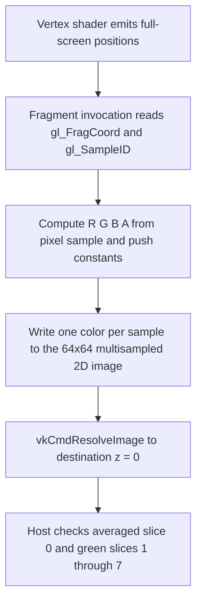

## Overview

**Core question:** Do multisampled-image rendering, access, ordering, and resolve paths preserve the expected per-sample behavior and final image values?

- This page documents the `pipeline.multisample` image-access intermediate nodes implemented by [`vktPipelineMultisampleImageTests.cpp`](../../../modules/vulkan/pipeline/vktPipelineMultisampleImageTests.cpp#L1-L2988).
- The source is mixed implementation and registration code. It implements `sampled_image`, `storage_image`, `standardsampleposition`, `samples_mapping_order`, and `3d`, while [`createMultisampleTests()`](../../../modules/vulkan/pipeline/vktPipelineMultisampleTests.cpp#L7247-L8096) attaches those intermediate nodes below each multisample construction root.
- The direct intermediate node is the behavioral axis. Format, extent, layer count, sample count, and construction type broaden the coverage of its selected mechanism.

## Background Knowledge

For the shared concept pipeline construction type, see [Background Knowledge](../../categories/pipeline.md#background-knowledge) of the `pipeline` page.

- **Multisampled image access.** A multisampled image holds separate samples at each pixel. [`VkPipelineMultisampleStateCreateInfo`](../../../../vulkan-docs/src/chapters/pipelines.adoc#L2188-L2200) sets rasterization sample state, and graphics-pipeline rules require compatible attachment and rasterization sample counts ([`rasterizationSamples`](../../../../vulkan-docs/src/chapters/pipelines.adoc#L3016-L3028)). A shader sample or fetch can address an individual image sample.
- **Storage-image feature and locations.** [`shaderStorageImageMultisample`](../../../../vulkan-docs/src/chapters/features.adoc#L577-L581) enables multisampled storage-image access. `standardsampleposition` relies on the physical-device `standardSampleLocations` limit, which the source checks before execution.
- **Host observation.** The source makes device-side results visible through a checksum image, resolved image, or storage buffer. CTS waits for the submission, invalidates the mapped allocation, and applies a behavior-specific comparison.

## Registration Hierarchy

```text
pipeline.monolithic.multisample
├── sampled_image
├── storage_image
├── standardsampleposition
├── samples_mapping_order
└── 3d
```

The same factories create the corresponding intermediate nodes under `pipeline.fast_linked_library.multisample`, `pipeline.pipeline_library.multisample`, shader-object roots, and `pipeline.multisample_with_fragment_shading_rate`. The mustpass scope contains 216 leaves in each of `monolithic/monolithic.txt`, `fast-linked-library.txt`, and `shader-object-unlinked-spirv/shader-object-unlinked-spirv.txt`; it contains 210 leaves in each of `pipeline-library.txt`, `shader-object-linked-binary.txt`, `shader-object-linked-spirv.txt`, and `shader-object-unlinked-binary.txt`. The latter files omit the six `samples_mapping_order` leaves.

## Parameter Dimensions and Observed Values

| Dimension | Registered values | Meaning in this test | Evidence |
|-----------|-------------------|----------------------|----------|
| Intermediate node | `sampled_image`, `storage_image`, `standardsampleposition`, `samples_mapping_order`, `3d` | Selects the image-access or sample-identity mechanism and its validator. | [Factories](../../../modules/vulkan/pipeline/vktPipelineMultisampleImageTests.cpp#L2916-L2988) |
| 2D extent and layers | `64x64_1`, `64x64_4`, `79x31_1`, `79x31_4` | Exercises square and non-square images with one or four array layers in the sampled and storage paths. | [`addTestCasesWithFunctions()`](../../../modules/vulkan/pipeline/vktPipelineMultisampleImageTests.cpp#L2748-L2799) |
| 3D extent and layers | `64x64x8_1` | Uses the separate 3D-image setup. | [`addTestCasesWithFunctions3d()`](../../../modules/vulkan/pipeline/vktPipelineMultisampleImageTests.cpp#L2801-L2845) |
| Format | `r8g8b8a8_unorm`, `r32_uint`, `r16g16_sint`, `r32g32b32a32_sfloat`; position path also uses `r32g32b32a32_sfloat` | Changes the storage and comparison representation. | [2D matrix](../../../modules/vulkan/pipeline/vktPipelineMultisampleImageTests.cpp#L2763-L2799), [position matrix](../../../modules/vulkan/pipeline/vktPipelineMultisampleImageTests.cpp#L2847-L2885) |
| Sample count | `samples_2`, `samples_4`, `samples_8`, `samples_16`, `samples_32`, `samples_64` | Changes the number of per-pixel values the selected mechanism must handle. | [Common matrix](../../../modules/vulkan/pipeline/vktPipelineMultisampleImageTests.cpp#L2754-L2799) |
| Pipeline construction type | Supported construction variants | Repeats each C++ matrix through the pipeline registration framework. | [Parent registration](../../../modules/vulkan/pipeline/vktPipelineMultisampleTests.cpp#L7247-L8096) |

## Behavior Parameters

The primary behavioral axis is the direct intermediate node below `pipeline.monolithic.multisample`. Each value selects a different image-access or sample-identity contract.

### `sampled_image`: sampled per-sample reads

This intermediate node renders values into a multisampled image, then samples its individual values in a fragment shader. CTS copies a checksum image to host memory and rejects any pixel that reports an unexpected sample color ([validation](../../../modules/vulkan/pipeline/vktPipelineMultisampleImageTests.cpp#L1356-L1391)).

### `storage_image`: storage-image load/store comparison

This intermediate node accesses a multisampled image through storage-image operations. The test produces two layered outputs and applies [`compareImages()`](../../../modules/vulkan/pipeline/vktPipelineMultisampleImageTests.cpp#L2074-L2139), which permits the source-defined integer-format error handling before declaring a mismatch.

### `standardsampleposition`: standard-location identity

This intermediate node renders colors tied to standard sample positions and checks a checksum of the result. The support path requires `standardSampleLocations`, and the validator fails when a checksum pixel records one or more unexpected sample colors ([support and validation](../../../modules/vulkan/pipeline/vktPipelineMultisampleImageTests.cpp#L2278-L2491)).

### `samples_mapping_order`: cross-fragment sample order

This intermediate node writes a sample-index-weighted value for each pixel through a compute shader. The host reads the storage buffer and requires every result after the first to equal the first within `0.001`, so it detects an inconsistent sample-index mapping ([validation](../../../modules/vulkan/pipeline/vktPipelineMultisampleImageTests.cpp#L2708-L2723)).

### `3d`: resolving into a 3D image

This intermediate node renders per-sample values into a multisampled 2D image, clears a single-sampled `64x64x8` 3D image to green, and resolves the 2D image into the first depth slice of the 3D image. CTS compares every destination slice with a host-generated reference using a per-component threshold of `0.01`: slice zero must contain the average-resolved colors and the other seven slices must retain the green clear color ([implementation](../../../modules/vulkan/pipeline/vktPipelineMultisampleImageTests.cpp#L1396-L1860)).

## Shader Analysis

### Representative Shader Walkthrough 1

#### Parameter Values Chosen

Representative path:

```text
dEQP-VK.pipeline.shader_object_linked_binary.multisample.3d.64x64x8_1.r8g8b8a8_unorm.samples_16
```

| Parameter choice | Meaning in this representative case |
|------------------|-------------------------------------|
| `shader_object_linked_binary` | Uses linked shader objects created from binary shader code; pipeline construction changes how the stages are installed but not the GLSL generated by `Image3d::initPrograms()`. |
| `3d` | Selects the path that renders a multisampled 2D source and resolves it into depth slice zero of a single-sampled 3D image. |
| `64x64x8_1` | Pushes width and height `64` to the fragment shader; depth `8` belongs to the transfer destination and host validator, and the suffix records one array layer. |
| `r8g8b8a8_unorm` | Stores the shader's floating-point `vec4` output in the only format registered for this path. |
| `samples_16` | Pushes `numSamples = 16`; `gl_SampleID` ranges over the samples whose colors are later averaged by the resolve. |

#### Purpose

The fragment shader writes a deterministic color for every pixel/sample pair. CTS then checks that resolving those 16 values changes only depth slice zero of the 3D destination and produces their component-wise average.

#### Structural Design



#### Shader Code

##### Fragment Shader

```glsl
#version 450
/// One floating-point color is written for each covered sample.
layout(location = 0) out vec4 outColor;

/// Host-provided 2D source dimensions and rasterization sample count.
layout(push_constant) uniform PushConsts {
    int width;
    int height;
    int numSamples;
} pc;

void main()
{
    /// Using SampleId makes the output sample-specific and requires per-sample evaluation.
    int s = gl_SampleID;

    /// Pixel coordinates distinguish locations; the sample index distinguishes samples at each location.
    float R = float(int(gl_FragCoord.x) + s) / float(pc.width + pc.numSamples);
    float G = float(int(gl_FragCoord.y) + s) / float(pc.height + pc.numSamples);
    float B = (pc.numSamples > 1) ? float(s) / float(pc.numSamples - 1) : 0.0;
    float A = 1.0f;

    outColor = vec4(R, G, B, A);
}
```

##### Vertex Shader

```glsl
#version 450
/// Location 0 supplies the six host-generated positions for a full-screen two-triangle quad.
layout(location = 0) in vec4 inPosition;
void main()
{
    /// No transform is needed because the input positions are already in clip space.
    gl_Position = inPosition;
}
```

#### Additional Info

- The vertex shader stays fixed for every `3d` case. It matters only as the full-screen producer that covers every source pixel; all sample-distinguishing logic is in the fragment shader.
- [`Image3d::initPrograms()`](../../../modules/vulkan/pipeline/vktPipelineMultisampleImageTests.cpp#L1399-L1438) explicitly ignores `caseDef`, so the shown stage sources are exact for every sample-count leaf; width, height, and sample count enter through push constants instead.
- The host constructs the same per-sample values, resolves the 2D image into a depth-one region at destination offset `(0,0,0)`, and compares slice zero against the average while requiring slices 1-7 to retain the green clear value ([runtime and validation](../../../modules/vulkan/pipeline/vktPipelineMultisampleImageTests.cpp#L1567-L1860)).

#### Parameter Variation Summary

| Parameter dimension | Shader-level variation from this shader | Evidence |
|---------------------|---------------------------------------|----------|
| Sample count | The source text is unchanged. `pc.numSamples` changes the R/G denominators, the B normalization, and the number of `gl_SampleID` values that contribute to the resolve. | [`addTestCasesWithFunctions3d()`](../../../modules/vulkan/pipeline/vktPipelineMultisampleImageTests.cpp#L2801-L2845) |
| Extent, layer count, and format | This path registers only `64x64x8_1` and `r8g8b8a8_unorm`; width and height are runtime push constants, while depth, layer count, and format do not alter either shader. | [`addTestCasesWithFunctions3d()`](../../../modules/vulkan/pipeline/vktPipelineMultisampleImageTests.cpp#L2806-L2814) |
| Pipeline construction type | Registration repeats the same builder for each supported construction route; no construction-type branch exists in `Image3d::initPrograms()`. | [`create3dImageTestsInGroup()`](../../../modules/vulkan/pipeline/vktPipelineMultisampleImageTests.cpp#L2922-L2925) |

#### SPIR-V

##### Fragment Shader

- Status: generated and validated
- Source: reconstructed `GLSL` from this walkthrough
- Stage: `frag`
- Target SPIRV version: `spirv1.0`

<details>
<summary>Click to expand SPIRV asm code</summary>

```llvm
; SPIR-V
; Version: 1.0
; Generator: Khronos Glslang Reference Front End; 11
; Bound: 83
; Schema: 0
               OpCapability Shader
               OpCapability SampleRateShading
          %1 = OpExtInstImport "GLSL.std.450"
               OpMemoryModel Logical GLSL450
               OpEntryPoint Fragment %main "main" %gl_SampleID %gl_FragCoord %outColor
               OpExecutionMode %main OriginUpperLeft
               OpSource GLSL 450
               OpName %main "main"
               OpName %s "s"
               OpName %gl_SampleID "gl_SampleID"
               OpName %R "R"
               OpName %gl_FragCoord "gl_FragCoord"
               OpName %PushConsts "PushConsts"
               OpMemberName %PushConsts 0 "width"
               OpMemberName %PushConsts 1 "height"
               OpMemberName %PushConsts 2 "numSamples"
               OpName %pc "pc"
               OpName %G "G"
               OpName %B "B"
               OpName %A "A"
               OpName %outColor "outColor"
               OpDecorate %gl_SampleID BuiltIn SampleId
               OpDecorate %gl_SampleID Flat
               OpDecorate %gl_FragCoord BuiltIn FragCoord
               OpDecorate %PushConsts Block
               OpMemberDecorate %PushConsts 0 Offset 0
               OpMemberDecorate %PushConsts 1 Offset 4
               OpMemberDecorate %PushConsts 2 Offset 8
               OpDecorate %outColor Location 0
       %void = OpTypeVoid
          %3 = OpTypeFunction %void
        %int = OpTypeInt 32 1
%_ptr_Function_int = OpTypePointer Function %int
%_ptr_Input_int = OpTypePointer Input %int
%gl_SampleID = OpVariable %_ptr_Input_int Input
      %float = OpTypeFloat 32
%_ptr_Function_float = OpTypePointer Function %float
    %v4float = OpTypeVector %float 4
%_ptr_Input_v4float = OpTypePointer Input %v4float
%gl_FragCoord = OpVariable %_ptr_Input_v4float Input
       %uint = OpTypeInt 32 0
     %uint_0 = OpConstant %uint 0
%_ptr_Input_float = OpTypePointer Input %float
 %PushConsts = OpTypeStruct %int %int %int
%_ptr_PushConstant_PushConsts = OpTypePointer PushConstant %PushConsts
         %pc = OpVariable %_ptr_PushConstant_PushConsts PushConstant
      %int_0 = OpConstant %int 0
%_ptr_PushConstant_int = OpTypePointer PushConstant %int
      %int_2 = OpConstant %int 2
     %uint_1 = OpConstant %uint 1
      %int_1 = OpConstant %int 1
       %bool = OpTypeBool
    %float_0 = OpConstant %float 0
    %float_1 = OpConstant %float 1
%_ptr_Output_v4float = OpTypePointer Output %v4float
   %outColor = OpVariable %_ptr_Output_v4float Output
       %main = OpFunction %void None %3
          %5 = OpLabel
          %s = OpVariable %_ptr_Function_int Function
          %R = OpVariable %_ptr_Function_float Function
          %G = OpVariable %_ptr_Function_float Function
          %B = OpVariable %_ptr_Function_float Function
         %61 = OpVariable %_ptr_Function_float Function
          %A = OpVariable %_ptr_Function_float Function
         %11 = OpLoad %int %gl_SampleID
               OpStore %s %11
         %21 = OpAccessChain %_ptr_Input_float %gl_FragCoord %uint_0
         %22 = OpLoad %float %21
         %23 = OpConvertFToS %int %22
         %24 = OpLoad %int %s
         %25 = OpIAdd %int %23 %24
         %26 = OpConvertSToF %float %25
         %32 = OpAccessChain %_ptr_PushConstant_int %pc %int_0
         %33 = OpLoad %int %32
         %35 = OpAccessChain %_ptr_PushConstant_int %pc %int_2
         %36 = OpLoad %int %35
         %37 = OpIAdd %int %33 %36
         %38 = OpConvertSToF %float %37
         %39 = OpFDiv %float %26 %38
               OpStore %R %39
         %42 = OpAccessChain %_ptr_Input_float %gl_FragCoord %uint_1
         %43 = OpLoad %float %42
         %44 = OpConvertFToS %int %43
         %45 = OpLoad %int %s
         %46 = OpIAdd %int %44 %45
         %47 = OpConvertSToF %float %46
         %49 = OpAccessChain %_ptr_PushConstant_int %pc %int_1
         %50 = OpLoad %int %49
         %51 = OpAccessChain %_ptr_PushConstant_int %pc %int_2
         %52 = OpLoad %int %51
         %53 = OpIAdd %int %50 %52
         %54 = OpConvertSToF %float %53
         %55 = OpFDiv %float %47 %54
               OpStore %G %55
         %57 = OpAccessChain %_ptr_PushConstant_int %pc %int_2
         %58 = OpLoad %int %57
         %60 = OpSGreaterThan %bool %58 %int_1
               OpSelectionMerge %63 None
               OpBranchConditional %60 %62 %71
         %62 = OpLabel
         %64 = OpLoad %int %s
         %65 = OpConvertSToF %float %64
         %66 = OpAccessChain %_ptr_PushConstant_int %pc %int_2
         %67 = OpLoad %int %66
         %68 = OpISub %int %67 %int_1
         %69 = OpConvertSToF %float %68
         %70 = OpFDiv %float %65 %69
               OpStore %61 %70
               OpBranch %63
         %71 = OpLabel
               OpStore %61 %float_0
               OpBranch %63
         %63 = OpLabel
         %73 = OpLoad %float %61
               OpStore %B %73
               OpStore %A %float_1
         %78 = OpLoad %float %R
         %79 = OpLoad %float %G
         %80 = OpLoad %float %B
         %81 = OpLoad %float %A
         %82 = OpCompositeConstruct %v4float %78 %79 %80 %81
               OpStore %outColor %82
               OpReturn
               OpFunctionEnd
```

</details>

##### Vertex Shader

- Status: generated and validated
- Source: reconstructed `GLSL` from this walkthrough
- Stage: `vert`
- Target SPIRV version: `spirv1.0`

<details>
<summary>Click to expand SPIRV asm code</summary>

```llvm
; SPIR-V
; Version: 1.0
; Generator: Khronos Glslang Reference Front End; 11
; Bound: 21
; Schema: 0
               OpCapability Shader
          %1 = OpExtInstImport "GLSL.std.450"
               OpMemoryModel Logical GLSL450
               OpEntryPoint Vertex %main "main" %_ %inPosition
               OpSource GLSL 450
               OpName %main "main"
               OpName %gl_PerVertex "gl_PerVertex"
               OpMemberName %gl_PerVertex 0 "gl_Position"
               OpMemberName %gl_PerVertex 1 "gl_PointSize"
               OpMemberName %gl_PerVertex 2 "gl_ClipDistance"
               OpMemberName %gl_PerVertex 3 "gl_CullDistance"
               OpName %_ ""
               OpName %inPosition "inPosition"
               OpDecorate %gl_PerVertex Block
               OpMemberDecorate %gl_PerVertex 0 BuiltIn Position
               OpMemberDecorate %gl_PerVertex 1 BuiltIn PointSize
               OpMemberDecorate %gl_PerVertex 2 BuiltIn ClipDistance
               OpMemberDecorate %gl_PerVertex 3 BuiltIn CullDistance
               OpDecorate %inPosition Location 0
       %void = OpTypeVoid
          %3 = OpTypeFunction %void
      %float = OpTypeFloat 32
    %v4float = OpTypeVector %float 4
       %uint = OpTypeInt 32 0
     %uint_1 = OpConstant %uint 1
%_arr_float_uint_1 = OpTypeArray %float %uint_1
%gl_PerVertex = OpTypeStruct %v4float %float %_arr_float_uint_1 %_arr_float_uint_1
%_ptr_Output_gl_PerVertex = OpTypePointer Output %gl_PerVertex
          %_ = OpVariable %_ptr_Output_gl_PerVertex Output
        %int = OpTypeInt 32 1
      %int_0 = OpConstant %int 0
%_ptr_Input_v4float = OpTypePointer Input %v4float
 %inPosition = OpVariable %_ptr_Input_v4float Input
%_ptr_Output_v4float = OpTypePointer Output %v4float
       %main = OpFunction %void None %3
          %5 = OpLabel
         %18 = OpLoad %v4float %inPosition
         %20 = OpAccessChain %_ptr_Output_v4float %_ %int_0
               OpStore %20 %18
               OpReturn
               OpFunctionEnd
```

</details>

## Runtime Execution and Result Checking

- The 2D paths use [`checkImageFormatRequirements()`](../../../modules/vulkan/pipeline/vktPipelineMultisampleImageTests.cpp#L590-L608) to check sample-count and format support for the requested usage. It also rejects a storage-image usage when `shaderStorageImageMultisample` is unavailable. The `3d` path instead checks the multisampled 2D source and single-sampled 3D destination format support separately ([support check](../../../modules/vulkan/pipeline/vktPipelineMultisampleImageTests.cpp#L1440-L1473)).
- The selected path creates multisampled images and views, descriptor sets, graphics pipelines, and, where required, a host-visible checksum or storage buffer. The `samples_mapping_order` path submits a graphics pass, runs compute work over the multisample image, inserts a compute-to-host barrier, and reads the buffer after completion.
- `sampled_image` and `standardsampleposition` copy a checksum image to a buffer, wait, invalidate its allocation, and fail on a nonzero error result. `storage_image` copies and compares its layered images. `samples_mapping_order` checks all computed values against the first value. `3d` resolves into depth slice zero, copies the full 3D image to a host-visible buffer, and threshold-compares all eight slices with generated references.
- A failing final image identifies the selected behavior class, but its result cannot independently isolate image creation, rasterization, shader access, copyback, or comparison code. The source-level validators define the localization boundary.

## Failure Meaning

### Failure Cause Mapping

| If this behavior parameter value fails | Possible failure cause(s) |
|----------------------------------------|---------------------------|
| `sampled_image` | Per-sample sampled-image read or sample-derived checksum does not match rendered data. |
| `storage_image` | Multisampled storage-image load/store behavior disagrees with the reference image path. |
| `standardsampleposition` | Rendered sample identity does not match the required standard sample positions. |
| `samples_mapping_order` | Sample indices do not map to a consistent order across fragments. |
| `3d` | Resolving a multisampled 2D image into the first slice of a single-sampled 3D image produces incorrect data or modifies another depth slice. |

### Cause Analysis

#### Per-sample sampled-image read or checksum mismatch

**Possible failure symptoms:** `sampled_image` reports `Some samples have incorrect color` or a checksum mismatch after CTS copies and reads the checksum image.

**Possible implementation causes:** The graphics or fragment stage may render, address, or sample a multisample image value incorrectly. Image layout transitions, descriptor image views, copyback, or checksum generation can produce the same observation. The final checksum classifies the path but source-level investigation is needed to localize the stage.

#### Multisampled storage-image comparison mismatch

**Possible failure symptoms:** `storage_image` reports `Rendered images are not correct` after `compareImages()` compares the layered outputs.

**Possible implementation causes:** A driver may mishandle multisampled storage-image loads or stores, format conversion, or the synchronization and transfer sequence that exposes either output. The comparison operates on final images, so it does not distinguish those causes without inspecting the recorded images and execution path.

#### Standard sample-position mismatch

**Possible failure symptoms:** `standardsampleposition` reports that one or more multisamples have an unexpected color.

**Possible implementation causes:** The implementation may use an incorrect standard sample location, associate a rendered value with the wrong sample identity, or mishandle the checksum readback. The source checks the advertised `standardSampleLocations` limit before execution, so an unsupported-location device should not reach this failure path.

#### Inconsistent sample-index mapping

**Possible failure symptoms:** `samples_mapping_order` reports the first storage-buffer index whose weighted sample value differs from the first pixel beyond the `0.001` tolerance.

**Possible implementation causes:** Sample indices may map to different physical samples across fragments, or the compute shader's multisample fetch path may read a value from the wrong index. The buffer comparison exposes inconsistent final values but cannot separate rasterization order from image fetch behavior.

#### 3D multisampled-image result mismatch

**Possible failure symptoms:** `3d` returns `Fail` when any component in any destination depth slice differs from its reference by more than `0.01`.

**Possible implementation causes:** The path may mishandle rendering the multisampled 2D source, resolving into depth slice zero of the 3D destination, preserving the cleared values in the other depth slices, or transferring the 3D image for host comparison. The result is a whole-path observation, so the source does not justify an exclusive stage diagnosis.

## Case Pruning

### Requirement-based pruning

- The 2D paths call [`checkImageFormatRequirements()`](../../../modules/vulkan/pipeline/vktPipelineMultisampleImageTests.cpp#L590-L608) for the requested sample count, format, and image usage. The `3d` path has separate source and destination image-format queries and checks sample-count support on the multisampled 2D source.
- `storage_image` and `samples_mapping_order` require `shaderStorageImageMultisample`; `3d` does not use a multisampled storage image and does not require that feature.
- `standardsampleposition` requires the `standardSampleLocations` device limit. Pipeline construction requirements also filter variants that the device cannot construct.

### Design-based pruning

- The 2D matrix uses two extents, two layer counts, four formats, and six sample counts. The 3D path intentionally narrows this to one extent, one layer count, and one format because it targets 3D multisample access rather than the full 2D format matrix.
- `standardsampleposition` uses a `1x1` target and two formats because its validator focuses on individual standard sample locations. `samples_mapping_order` fixes the target at `16x16` and `VK_FORMAT_R8G8B8A8_UNORM` because it compares a uniform weighted ordering over pixels.
- Some mustpass construction files omit `samples_mapping_order`; this is registration coverage, not a relaxed validator for the registered leaves.

## Key Takeaways

- The source implements five direct `multisample` intermediate nodes with distinct observation and validation mechanisms.
- `sampled_image` and `storage_image` test shader image access; `3d` tests a resolve from a multisampled 2D source into one depth slice of a single-sampled 3D destination; `standardsampleposition` checks sample identity against standard positions; `samples_mapping_order` checks that identity remains ordered across fragments.
- The common parameter matrix expands coverage, while the direct intermediate node determines what CTS treats as the behavior under test.
- The final checksum, image, or buffer exposes a path-level fault class. It does not establish one exclusive Vulkan pipeline stage.

## Source Reference Appendix

| Entry point | Link | Why it matters |
|-------------|------|----------------|
| Format and feature support | [`checkImageFormatRequirements()`](../../../modules/vulkan/pipeline/vktPipelineMultisampleImageTests.cpp#L590-L608) | Checks image properties and multisampled storage-image support. |
| Sampled-image path | [`SampledImage`](../../../modules/vulkan/pipeline/vktPipelineMultisampleImageTests.cpp#L1081-L1394) | Implements generated shaders and checksum validation for `sampled_image`. |
| 3D path | [`Image3d`](../../../modules/vulkan/pipeline/vktPipelineMultisampleImageTests.cpp#L1396-L1863) | Implements the 3D image case. |
| Storage-image path | [`StorageImage`](../../../modules/vulkan/pipeline/vktPipelineMultisampleImageTests.cpp#L1865-L2211) | Implements storage-image access and image comparison. |
| Position and ordering paths | [`StandardSamplePosition` and `SamplesMappingOrder`](../../../modules/vulkan/pipeline/vktPipelineMultisampleImageTests.cpp#L2213-L2725) | Implement standard-position and sample-order validators. |
| Matrix and factories | [`addTestCasesWithFunctions()` through `createMultisample3dImageTests()`](../../../modules/vulkan/pipeline/vktPipelineMultisampleImageTests.cpp#L2748-L2988) | Builds the registered matrices and intermediate nodes. |
| Parent dispatcher | [`createMultisampleTests()`](../../../modules/vulkan/pipeline/vktPipelineMultisampleTests.cpp#L7247-L8096) | Attaches these factories below multisample construction roots. |
| Vulkan multisample state | [`VkPipelineMultisampleStateCreateInfo`](../../../../vulkan-docs/src/chapters/pipelines.adoc#L2188-L2200) | Defines pipeline multisample state. |
| Multisampled storage-image feature | [`shaderStorageImageMultisample`](../../../../vulkan-docs/src/chapters/features.adoc#L577-L581) | Defines support for multisampled storage images. |
