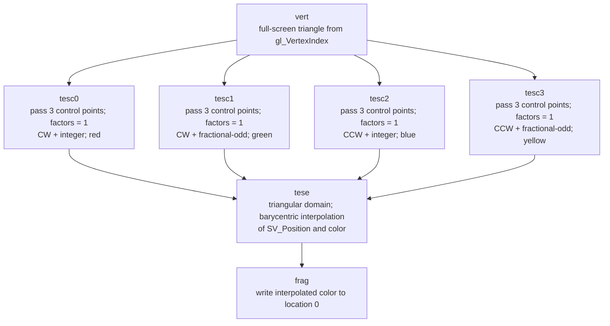

## Overview

**Core question:** Does `VK_EXT_shader_module_identifier` return valid and consistent shader identifiers, then let pipelines use those identifiers without changing the selected shaders' observable work?

[`vktPipelineShaderModuleIdentifierTests.cpp`](../../../modules/vulkan/pipeline/vktPipelineShaderModuleIdentifierTests.cpp#L1) implements the `shader_module_identifier` test family. It covers physical-device identifier properties, identifiers obtained through module and create-info queries, pipeline creation with `VkPipelineShaderStageModuleIdentifierCreateInfoEXT`, HLSL tessellation, and maintenance5 executable-property capture. Runnable cases cover compute, graphics, ray tracing, and ray-tracing-library pipelines where registration allows them.

The family requires `VK_EXT_shader_module_identifier` and the `shaderModuleIdentifier` feature documented in the [extension metadata](../../../scripts/src/extensions/VK_EXT_shader_module_identifier.json#L1). Individual shader selections request geometry, tessellation, mesh-shader, or ray-tracing support when needed. The source excludes Vulkan SC through `CTS_USES_VULKANSC` guards.

## Background Knowledge

For the shared concept pipeline construction type, see [Background Knowledge](../../categories/pipeline.md#background-knowledge) of the `pipeline` page.

A shader-module identifier is driver-produced binary data that represents shader code for pipeline creation. Applications query an ID from a `VkShaderModule` with `vkGetShaderModuleIdentifierEXT`, or from matching code in `VkShaderModuleCreateInfo` with `vkGetShaderModuleCreateInfoIdentifierEXT`. They can then attach `VkPipelineShaderStageModuleIdentifierCreateInfoEXT` to a pipeline stage and omit the full module-code route.

The extension also reports `shaderModuleIdentifierAlgorithmUUID` in `VkPhysicalDeviceShaderModuleIdentifierPropertiesEXT`. CTS checks that repeated property queries return the same UUID and reports a quality warning if the UUID is all zeros. Its helper rejects an identifier with `identifierSize` of zero or greater than `VK_MAX_SHADER_MODULE_IDENTIFIER_SIZE_EXT` before any identifier comparison.

An ID selects shader code; it does not replace stage-specific execution or specialization data. The runnable tests create a classic pipeline to collect stage IDs, create an equivalent pipeline with identifier structures, execute that latter pipeline, and compare shader-written results. This lets CTS test the lookup path without needing a fixed driver-specific identifier value.

## Registration Hierarchy

```text
pipeline.monolithic.shader_module_identifier
├── properties
├── constant_identifiers
├── pipeline_from_id
├── hlsl_tessellation
└── misc
```

The concrete monolithic root includes all five intermediate nodes. `properties`, `constant_identifiers`, and `misc` are monolithic-only. `pipeline_from_id` and `hlsl_tessellation` also register under the fast-linked-library and pipeline-library construction roots, although non-graphics `pipeline_from_id` branches are pruned there.

Mustpass lists contain 1,556 monolithic leaves: 1 `properties`, 336 `constant_identifiers`, 1,216 `pipeline_from_id`, 1 `hlsl_tessellation`, and 2 `misc`. Each library list contains 513 leaves: 512 `pipeline_from_id` plus 1 `hlsl_tessellation`. The three files therefore contain 2,582 leaves for this family.

## Parameter Dimensions and Observed Values

| Parameter | Registered or source values | Effect on the observation |
|---|---|---|
| Intermediate node | `properties`, `constant_identifiers`, `pipeline_from_id`, `hlsl_tessellation`, `misc` | Selects the tested contract and validation path. |
| Pipeline type | `compute`, `graphics`, `ray_tracing`, `ray_tracing_libs` | Selects compute dispatch, graphics draw, ray trace, or ray-tracing-library setup. |
| Shader set | vertex, fragment, tessellation, geometry, mesh, task, and ray-tracing combinations | Determines modules whose IDs are queried and shader stages that write results. |
| Pipeline count | `1_variants`, `4_variants` | Controls the count of ordinary pipelines created before the selected identifier-backed pipeline runs. |
| Specialization | `no_spec_constants`, `use_spec_constants` | Supplies no specialization data or stage-specific specialization data. |
| Query API | `module_id`, `create_info_id`, `both_ids` | Chooses which identifier-query results CTS compares. |
| Device choice | `same_device`, `different_devices` | Uses the context device or a helper-created device for the second query. |
| Cache selection | `no_pipeline_cache`, `use_pipeline_cache` | Selects pipeline-cache use. |
| Stage payload | `use_id`, `zero_len_id`, `zero_len_id_null_ptr`, `zero_len_id_garbage_ptr`, `all_zeros_id`, `all_ones_id`, `pseudorandom_id` | Supplies a valid ID, empty representation, or invalid identifier bytes. |
| Capture selection | `no_exec_properties`, `capture_stats`, `capture_irs` | Requests no executable data, statistics, or internal representations. |
| HLSL tessellation mode | clockwise or counter-clockwise; integer or fractional-odd partitioning | Produces four colored tessellation-control variants. |

## Behavior Parameters

The primary behavioral axis is the direct intermediate node. Each node changes the contract: property stability, ID consistency, runnable identifier-backed pipeline creation, HLSL tessellation, or maintenance5 capture behavior.

### properties: physical-device algorithm UUID stability

`properties.constant_algorithm_uuid` queries `VkPhysicalDeviceShaderModuleIdentifierPropertiesEXT` twice. It fails if the UUID changes between calls and reports a quality warning, rather than a failure, if it consists entirely of zero bytes.

### constant_identifiers: identifier equality for shader code

These monolithic-only leaves query IDs through `module_id`, `create_info_id`, or both. They vary pipeline type, one or four variants, specialization constants, same or different device, and shader-stage combinations. CTS requires equal IDs for the same binary through the selected routes and unique IDs across different binary collection entries.

### pipeline_from_id: creation and execution with stage identifiers

CTS creates ordinary pipelines, collects IDs from their shader modules, then creates a selected equivalent pipeline with stage identifier structures. The branch varies pipeline type, count, specialization constants, cache selection, module-use payload, and capture selection. Graphics remains available in the library construction types. Compute and ray-tracing branches remain monolithic-only.

Capture is attempted only for one-pipeline `use_id` cases. That restriction lets CTS compare executable property sets from classic and identifier-backed versions of the same pipeline.

### hlsl_tessellation: identifiers for HLSL-generated tessellation stages

This branch creates four tessellation-control shaders with different winding and partitioning modes. It checks that all module IDs differ, builds pipelines that reference those IDs, draws four one-pixel regions, and expects a fixed color for each region.

### misc: maintenance5 capture leaves

The monolithic-only `misc` leaves use one graphics pipeline with a valid ID and request either `capture_statistics_maintenance5` or `capture_internal_representations_maintenance5`.

## Shader Analysis

### Representative Shader Walkthrough 1

#### Parameter Values Chosen

Representative path:

```text
dEQP-VK.pipeline.pipeline_library.shader_module_identifier.hlsl_tessellation.test
```

The HLSL tessellation case is the most shader-specific leaf in this family. It creates four `tesc` modules, one for each `(winding, partitioning)` pair, queries an identifier for every module, and uses those identifiers when creating four pipeline-library graphics pipelines. The common `vert`, `tese`, and `frag` modules are also identifier-backed. The SPIR-V shown below is the canonical compiled form of the common `frag` source; the four `tesc` modules are compiled from HLSL by the CTS shader collection and differ in execution-mode decorations and output color.

| Parameter choice | Meaning in this representative case |
|---|---|
| `hlsl_tessellation.test` | Exercises identifiers for HLSL tessellation-control and tessellation-evaluation stages, with pipeline-library construction. |
| winding | `CW` and `CCW` are selected through HLSL `[outputtopology]`; changing it changes the generated module and its identifier. |
| partitioning | `INTEGER` and `FRACTIONAL_ODD` are selected through HLSL `[partitioning]`; changing it also changes the generated module and its identifier. |
| four variants | The four combinations write red, green, blue, and yellow respectively. All four IDs must be distinct. |
| `frag` | A common GLSL fragment stage forwards the tessellation evaluation color to location 0. |

#### Purpose

The shaders make identifier substitution observable. The four hull/tessellation-control modules are intentionally different even though their geometric input is the same: each writes a different color and carries a different tessellation execution mode. CTS first verifies that the driver returns unique IDs, then builds pipelines with the IDs instead of the shader modules. It draws one quadrant per pipeline and compares the resulting 2 by 2 image with red, green, blue, and yellow reference pixels. A wrong ID therefore appears as a wrong quadrant color rather than merely as a pipeline-creation discrepancy.

#### Structural Design

The common vertex shader emits a full-screen triangle from `gl_VertexIndex`. The four HLSL tessellation-control shaders pass through the three control points, write a color constant, and provide tessellation factors of one. Their attributes select a triangular domain, three output control points, either clockwise or counter-clockwise topology, and either integer or fractional-odd partitioning. The common HLSL tessellation-evaluation shader barycentrically interpolates `SV_Position` and the color into its output. The fragment shader writes that color to location 0.



#### Shader Code

```glsl
#version 450
layout (location=0) in vec4 inColor;
layout (location=0) out vec4 outColor;
void main (void)
{
    outColor = inColor;
}
```

The source is registered as `programCollection.glslSources.add("frag")` in [`HLSLTessellationCase::initPrograms`](../../../modules/vulkan/pipeline/vktPipelineShaderModuleIdentifierTests.cpp#L3305-L3318). The four HLSL sources are registered as `tesc0` through `tesc3` immediately afterward ([source](../../../modules/vulkan/pipeline/vktPipelineShaderModuleIdentifierTests.cpp#L3349-L3408)). The identifier query and uniqueness check cover `vert`, `frag`, `tese`, and all `tesc` modules ([source](../../../modules/vulkan/pipeline/vktPipelineShaderModuleIdentifierTests.cpp#L3520-L3548)).

#### Additional Info

- `pipeline_from_id` generates one shader per active stage and per pipeline variant. Each shader embeds a stage constant `0xEB000000 | (pipelineType << 16) | (pipelineIndex << 8) | stageIndex`, optionally replaces it with specialization constant ID 0, adds the pipeline's UBO values, and stores the result to `ssbo.values[stageIndex]` ([source](../../../modules/vulkan/pipeline/vktPipelineShaderModuleIdentifierTests.cpp#L908-L987)).
- In graphics, vertex/tessellation/geometry/mesh/task stages store their stage value in the SSBO; the fragment stage stores its value and writes blue to `outColor` ([source](../../../modules/vulkan/pipeline/vktPipelineShaderModuleIdentifierTests.cpp#L1090-L1280)). Compute, ray-generation, hit, miss, intersection, and callable stages use analogous generated stores ([source](../../../modules/vulkan/pipeline/vktPipelineShaderModuleIdentifierTests.cpp#L1000-L1020), [source](../../../modules/vulkan/pipeline/vktPipelineShaderModuleIdentifierTests.cpp#L1340-L1460)).
- The HLSL path requires tessellation support and the shader-module-identifier extension, checks all module IDs for uniqueness, and compares the copied 2 by 2 image against the four expected colors ([source](../../../modules/vulkan/pipeline/vktPipelineShaderModuleIdentifierTests.cpp#L3290-L3303), [source](../../../modules/vulkan/pipeline/vktPipelineShaderModuleIdentifierTests.cpp#L3520-L3548)).
- The extension's algorithm UUID is checked separately for stability across property queries; an all-zero UUID is a quality warning, while a changed UUID fails ([source](../../../modules/vulkan/pipeline/vktPipelineShaderModuleIdentifierTests.cpp#L865-L903)).

#### Parameter Variation Summary

| Parameter dimension | Shader-level variation from this shader | Evidence |
|---------------------|---------------------------------------|----------|
| `winding` | HLSL `[outputtopology("triangle_cw")]` or `[outputtopology("triangle_ccw")]`; the generated modules must have different IDs and remain executable through identifier-backed pipelines. | [source](../../../modules/vulkan/pipeline/vktPipelineShaderModuleIdentifierTests.cpp#L3349-L3408) |
| `partitioning` | HLSL `[partitioning("integer")]` or `[partitioning("fractional_odd")]`; the generated module and its ID must reflect the selected tessellation mode. | [source](../../../modules/vulkan/pipeline/vktPipelineShaderModuleIdentifierTests.cpp#L3349-L3408) |
| output color | `tesc0`..`tesc3` assign red, green, blue, yellow; each pipeline must render the corresponding quadrant color. | [source](../../../modules/vulkan/pipeline/vktPipelineShaderModuleIdentifierTests.cpp#L3349-L3408) |
| construction type | Monolithic, fast-linked-library, or pipeline-library registration; the same stage-identifier contract is exercised through each supported construction path. | [source](../../../modules/vulkan/pipeline/vktPipelineShaderModuleIdentifierTests.cpp#L3737) |
| `pipeline_from_id` payload | `use_id`, zero-length, all-zero, all-one, and pseudorandom ID forms; valid IDs must select the intended shader, while invalid/empty forms exercise the specified compile/validation behavior. | [source](../../../modules/vulkan/pipeline/vktPipelineShaderModuleIdentifierTests.cpp#L908-L987) |
| ordinary pipeline families | Compute, graphics, ray tracing, and ray-tracing libraries; generated stage constants are written to an SSBO, while graphics additionally writes blue from `frag`, allowing stage substitution to be detected. | [source](../../../modules/vulkan/pipeline/vktPipelineShaderModuleIdentifierTests.cpp#L908-L987), [source](../../../modules/vulkan/pipeline/vktPipelineShaderModuleIdentifierTests.cpp#L1000-L1020), [source](../../../modules/vulkan/pipeline/vktPipelineShaderModuleIdentifierTests.cpp#L1090-L1280), [source](../../../modules/vulkan/pipeline/vktPipelineShaderModuleIdentifierTests.cpp#L1340-L1460) |

#### SPIR-V

- Status: generated and validated
- Source: reconstructed `GLSL` from this walkthrough
- Stage: `frag`
- Target SPIRV version: `spirv1.0`

<details>
<summary>Click to expand SPIRV asm code</summary>

```llvm
; SPIR-V
; Version: 1.0
; Generator: Khronos Glslang Reference Front End; 11
; Bound: 13
; Schema: 0
               OpCapability Shader
          %1 = OpExtInstImport "GLSL.std.450"
               OpMemoryModel Logical GLSL450
               OpEntryPoint Fragment %main "main" %outColor %inColor
               OpExecutionMode %main OriginUpperLeft
               OpSource GLSL 450
               OpName %main "main"
               OpName %outColor "outColor"
               OpName %inColor "inColor"
               OpDecorate %outColor Location 0
               OpDecorate %inColor Location 0
       %void = OpTypeVoid
          %3 = OpTypeFunction %void
      %float = OpTypeFloat 32
    %v4float = OpTypeVector %float 4
%_ptr_Output_v4float = OpTypePointer Output %v4float
   %outColor = OpVariable %_ptr_Output_v4float Output
%_ptr_Input_v4float = OpTypePointer Input %v4float
    %inColor = OpVariable %_ptr_Input_v4float Input
       %main = OpFunction %void None %3
          %5 = OpLabel
         %12 = OpLoad %v4float %inColor
               OpStore %outColor %12
               OpReturn
               OpFunctionEnd
```

</details>

## Runtime Execution and Result Checking

1. The support check requires `VK_EXT_shader_module_identifier`. Cases requiring additional shader capabilities request the relevant device functionality before execution. The constant-identifier branch can create a helper device to obtain the second ID for `different_devices` leaves; `TestGroupWithClean` deletes that helper during group deinitialization.
2. `properties` chains `VkPhysicalDeviceShaderModuleIdentifierPropertiesEXT` into two physical-device-properties queries. It compares `shaderModuleIdentifierAlgorithmUUID` byte-for-byte; a mismatch fails, while an all-zero UUID produces a quality warning.
3. `constant_identifiers` obtains a module ID or a create-info ID for each binary. It compares the two selected results for each binary and inserts the first result into a set. A mismatch means one binary had inconsistent query results; a set-size mismatch means distinct binaries shared an ID.
4. A `pipeline_from_id` case creates descriptor layouts, host-visible storage and uniform buffers, and graphics color-image resources when appropriate. It creates ordinary pipeline stages and records executable properties when the selected capture flags require them. It then builds the selected pipeline with either valid identifier data, an empty form, or deliberately invalid bytes.
5. If the selected case runs a pipeline, graphics records a draw, compute records `cmdDispatch`, and ray tracing records `cmdTraceRaysKHR`. CTS inserts barriers for color-image copy, storage-buffer writes, and host reads, submits the command buffer, and waits for completion.
6. For graphics, CTS copies the color attachment to a host-visible verification buffer and expects blue when the selected shader set includes a fragment stage; otherwise it expects the clear color. For every runnable pipeline type, CTS invalidates the storage allocation and compares each stage's output word with its generated expected constant.
7. Capture leaves query executable properties from classic and identifier-backed pipelines and compare their sets. A difference fails. `VK_PIPELINE_COMPILE_REQUIRED` is handled by the selected payload and cache case: an expected miss passes, while cache use without capture can produce a quality warning.
8. `hlsl_tessellation` creates temporary pipelines to prime the cache, then builds four runnable pipelines with identifier structures. It draws each into one pixel of a 2 by 2 image, copies the image to memory, and compares it against red, green, blue, and yellow reference pixels with a zero threshold.

## Failure Meaning

### Failure Cause Mapping

| If this behavior parameter value fails | The test observed | Likely fault area |
|---|---|---|
| `properties` | `shaderModuleIdentifierAlgorithmUUID` changed between queries, or an all-zero UUID triggered a quality warning | Physical-device shader-module-identifier property query |
| `constant_identifiers` | The same binary returned different IDs, or different binaries shared an ID | Identifier generation or the module/create-info query path |
| `pipeline_from_id` with `use_id` | An identifier-backed pipeline fails to create, produces a wrong color, or writes wrong stage data | Identifier lookup, pipeline compilation, or stage substitution |
| `capture_stats` or `capture_irs` | Classic and identifier-backed executable-property sets differ | Pipeline executable capture or identifier-backed compilation metadata |
| `hlsl_tessellation` | IDs are not unique or the 2 by 2 output differs from the four expected colors | HLSL tessellation stage handling or identifier-backed graphics pipeline creation |
| Invalid or empty identifier forms | The result conflicts with the selected expected cache-miss or compile-required behavior | Validation of `VkPipelineShaderStageModuleIdentifierCreateInfoEXT` payloads or pipeline-cache handling |

### Cause Analysis

#### Unstable or invalid identifier properties

**Possible failure symptoms:** The property leaf fails because `shaderModuleIdentifierAlgorithmUUID` changed between the two queries. An all-zero UUID is reported as a quality warning, not a test failure.

**Possible implementation causes:** The physical-device property query may not preserve the algorithm UUID across calls, or the driver may leave the extension property uninitialized. The source distinguishes the failure result from the quality-warning result; driver investigation must determine whether property enumeration or extension initialization caused the fault.

#### Inconsistent identifier generation

**Possible failure symptoms:** A constant-identifier leaf reports different IDs for the same binary or reports that different shader binaries share an ID.

**Possible implementation causes:** The module query and create-info query may hash or canonicalize shader code differently. The implementation may also lose code distinctions while producing the ID. The test identifies the relation between queried binaries but cannot expose the driver's ID-generation algorithm.

#### Incorrect identifier-backed shader selection

**Possible failure symptoms:** A valid-ID runnable leaf fails pipeline creation, produces an unexpected graphics color, or returns a storage-buffer word different from the selected stage constant.

**Possible implementation causes:** The pipeline compiler may fail to recover the cached shader for a valid identifier, bind the wrong shader binary, or mishandle stage-specific specialization and pipeline-state data after lookup. A wrong storage word identifies a selected stage failure, but it does not distinguish lookup from later compilation without driver tracing.

#### Capture metadata disagreement

**Possible failure symptoms:** A capture leaf reports different executable-property sets for classic and identifier-backed pipeline construction.

**Possible implementation causes:** The capture flags may reach a different compilation path when a stage carries an identifier, or the executable-property query may report inconsistent metadata for equivalent compiled shaders. The set comparison does not identify the compiler or query layer responsible.

#### HLSL tessellation execution mismatch

**Possible failure symptoms:** The HLSL case reports duplicate IDs or one of the four framebuffer pixels differs from its red, green, blue, or yellow reference.

**Possible implementation causes:** The driver may generate colliding IDs for different HLSL tessellation-control modules, fail to attach an identifier to a tessellation stage, or compile a stage with the wrong winding or partitioning variant. The color result identifies the affected pipeline region but requires driver investigation for root cause.

## Case Pruning

### Requirement-based pruning

The whole family is excluded from Vulkan SC by source guards.

### Design-based pruning

The registration function adds `properties`, `constant_identifiers`, and `misc` only for `PIPELINE_CONSTRUCTION_TYPE_MONOLITHIC`. `constant_identifiers` also skips the `ray_tracing_libs` pipeline-type value. For `pipeline_from_id`, the registration loop keeps only graphics when the construction type is not monolithic. Capture leaves occur only when `pipelineCount` is one and `moduleUseCase` is `ID`. The source comments identify those as the subset where CTS attempts executable-property capture.

`hlsl_tessellation` remains registered for all construction types. The whole family is excluded from shader-object construction by the parent pipeline architecture.

## Key Takeaways

- The family checks relation-based contracts for driver-generated IDs rather than a fixed identifier value.
- It compares module and create-info query routes, then uses IDs to select shaders in executable pipelines.
- Runnable leaves validate both a graphics color path and stage-written storage data where appropriate.
- Capture leaves compare classic and identifier-backed executable-property sets.
- Monolithic coverage includes every intermediate node; library coverage contains graphics `pipeline_from_id` and the HLSL tessellation leaf.

## Source Reference Appendix

- [Legacy navigation page](vktPipelineShaderModuleIdentifierTests.md)
- [Implementation file](../../../modules/vulkan/pipeline/vktPipelineShaderModuleIdentifierTests.cpp#L1)
- [Identifier helper and size validation](../../../modules/vulkan/pipeline/vktPipelineShaderModuleIdentifierTests.cpp#L80)
- [Extension support and UUID property test](../../../modules/vulkan/pipeline/vktPipelineShaderModuleIdentifierTests.cpp#L865)
- [Constant-identifier comparison](../../../modules/vulkan/pipeline/vktPipelineShaderModuleIdentifierTests.cpp#L1570)
- [Identifier-backed pipeline runtime and result checks](../../../modules/vulkan/pipeline/vktPipelineShaderModuleIdentifierTests.cpp#L2025)
- [HLSL tessellation identifier execution](../../../modules/vulkan/pipeline/vktPipelineShaderModuleIdentifierTests.cpp#L3258)
- [Family registration](../../../modules/vulkan/pipeline/vktPipelineShaderModuleIdentifierTests.cpp#L3737)
- [Extension feature requirement](../../../scripts/src/extensions/VK_EXT_shader_module_identifier.json#L1)
- Mustpass files: `external/vulkancts/mustpass/main/vk-default/pipeline/monolithic/monolithic.txt`, `external/vulkancts/mustpass/main/vk-default/pipeline/fast-linked-library.txt`, and `external/vulkancts/mustpass/main/vk-default/pipeline/pipeline-library.txt`

