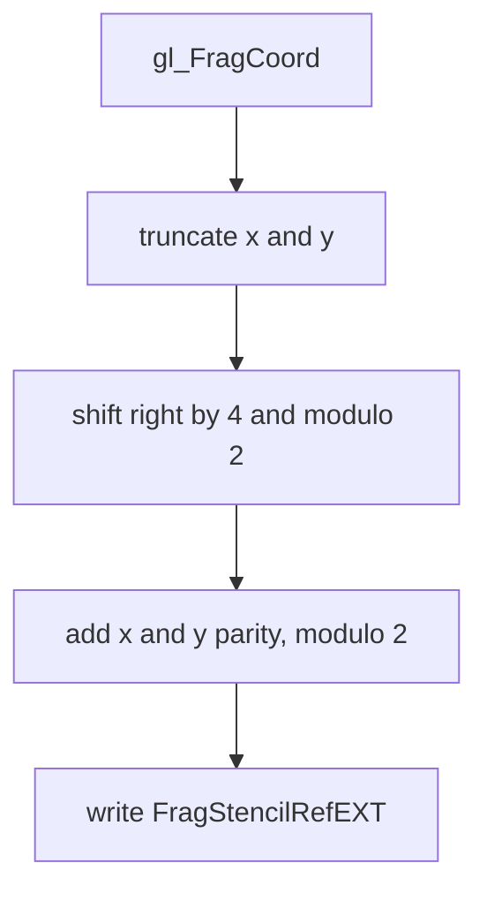

## Overview

**Core question:** Does a fragment shader's exported stencil reference control a later stencil comparison across the supported depth/stencil formats and pipeline-construction paths?

[`vktPipelineStencilExportTests.cpp`](../../../modules/vulkan/pipeline/vktPipelineStencilExportTests.cpp#L1) implements the `shader_stencil_export` test family below `pipeline`. Each case draws a full-screen primitive into a stencil attachment, uses the exported reference with `VK_STENCIL_OP_REPLACE`, then draws blue through a second subpass where stencil comparison equals zero. The host compares the copied color image with a generated checkerboard.

The source registers three direct intermediate nodes, one per stencil format. Each node has `op_replace`; non-Vulkan-SC builds also add `op_replace_early_and_late`.

## Background Knowledge

For the shared concept pipeline construction type, see [Background Knowledge](../../categories/pipeline.md#background-knowledge) of the `pipeline` page.

- `FragStencilRefEXT` is a fragment-shader output built-in. A shader that writes it declares `StencilRefReplacingEXT`; Vulkan uses the written value as the stencil reference for covered samples. Only the low-order bits that fit the stencil attachment are considered. See [the Vulkan built-in variable contract](../../../../vulkan-docs/src/chapters/interfaces.adoc#interfaces-builtin-variables-fragstencilref).
- Stencil comparison controls fragment coverage. A later draw with `VK_COMPARE_OP_EQUAL` and reference zero writes color only where the first draw stored zero. The [fragment-operation rules](../../../../vulkan-docs/src/chapters/fragops.adoc#fragops) define this ordering and the stencil operation state.
- `VK_AMD_shader_early_and_late_fragment_tests` adds execution modes that describe how early tests may assume the shader-produced stencil reference relates to the API reference. Late tests use the value written by the shader.

## Registration Hierarchy

```text
pipeline.monolithic.shader_stencil_export
├── s8_uint
├── d24_unorm_s8_uint
└── d32_sfloat_s8_uint
```

[`createStencilExportTests`](../../../modules/vulkan/pipeline/vktPipelineStencilExportTests.cpp#L621-L651) creates these format intermediate nodes. The same family is added by [`createPipelineTests`](../../../modules/vulkan/pipeline/vktPipelineTests.cpp#L99-L220) for the pipeline-construction variants represented in mustpass files.

## Parameter Dimensions and Observed Values

| Dimension | Registered values | Meaning in this test | Evidence |
|-----------|-------------------|----------------------|----------|
| Stencil format | `s8_uint`, `d24_unorm_s8_uint`, `d32_sfloat_s8_uint` | Selects the stencil attachment representation and tests stencil-only or combined depth/stencil aspect handling. | [`kFormats` and registration](../../../modules/vulkan/pipeline/vktPipelineStencilExportTests.cpp#L621-L651) |
| Test case leaf | `op_replace`, `op_replace_early_and_late` | Selects ordinary shader stencil export or the AMD early-and-late execution-mode matrix. | [`addFunctionCaseWithPrograms`](../../../modules/vulkan/pipeline/vktPipelineStencilExportTests.cpp#L636-L648) |
| Construction type | `monolithic`, `pipeline_library`, `fast_linked_library`, `shader_object_linked_spirv`, `shader_object_linked_binary`, `shader_object_unlinked_spirv`, `shader_object_unlinked_binary`; Vulkan SC uses `monolithic` | Selects the pipeline-construction implementation under test. | [`createPipelineTests`](../../../modules/vulkan/pipeline/vktPipelineTests.cpp#L99-L220); [mustpass files](../../../mustpass/main/vk-default/pipeline/) |
| Early-and-late mode | `StencilRefGreaterFrontAMD`, `StencilRefLessFrontAMD`, `StencilRefGreaterBackAMD`, `StencilRefLessBackAMD`, `StencilRefUnchangedFrontAMD`, `StencilRefUnchangedBackAMD` | Selects the SPIR-V execution mode used by `op_replace_early_and_late`. | [`ExecutionModeStencil`](../../../modules/vulkan/pipeline/vktPipelineStencilExportTests.cpp#L82-L96) |

The default Vulkan mustpass files contain six leaves for each of `monolithic`, `pipeline_library`, `fast_linked_library`, `shader_object_linked_spirv`, `shader_object_linked_binary`, `shader_object_unlinked_spirv`, and `shader_object_unlinked_binary`. `external/vulkancts/mustpass/main/vksc-default/pipeline/monolithic.txt` contains the three ordinary leaves only.

## Behavior Parameters

The primary behavioral axis is the direct intermediate node below `shader_stencil_export`: the stencil format. The leaf and construction dimensions expand each format's coverage.

### s8_uint: stencil-only attachment

This value uses `VK_FORMAT_S8_UINT`. It checks that shader-exported references reach the stencil aspect when the attachment contains no depth component.

### d24_unorm_s8_uint: 24-bit depth with 8-bit stencil

This value uses `VK_FORMAT_D24_UNORM_S8_UINT`. It checks the same stencil-reference path through the stencil aspect of a combined depth/stencil attachment.

### d32_sfloat_s8_uint: 32-bit float depth with 8-bit stencil

This value uses `VK_FORMAT_D32_SFLOAT_S8_UINT`. It provides a second combined depth/stencil representation while the test uses the same stencil behavior.

## Shader Analysis

The shader code supplies the stencil reference and simple color output. The fixed-function stencil state, two-subpass render pass, and host image comparison carry the tested property. One representative `op_replace` fragment shader is shown below; the six AMD SPIR-V variants replace its GLSL source with equivalent arithmetic plus their distinct execution modes.

### Representative Shader Walkthrough 1

#### Parameter Values Chosen

Representative path:

```text
dEQP-VK.pipeline.monolithic.shader_stencil_export.s8_uint.op_replace
```

| Parameter choice | Meaning in this representative case |
|---|---|
| Leaf: `op_replace` | Selects the ordinary shader-stencil-export leaf. |
| Fragment source: `frag-stencil0` | Names the representative GLSL fragment source. |
| Shader stage: Fragment | Identifies the stage that writes the exported stencil reference. |
| Stencil export: `gl_FragStencilRefARB` with `GL_ARB_shader_stencil_export` | Supplies the shader-written stencil reference used by the test. |

#### Purpose

The shader divides fragment coordinates into 16 by 16 blocks, computes each block's checkerboard parity, and exports zero or one as the stencil reference.

#### Structural Design

The shader has one input path and one output path:



#### Shader Code

```glsl
#version 450
#extension GL_ARB_shader_stencil_export: enable

void main(void)
{
    /// Select one 16 by 16 block in each screen direction.
    int refX = (int(gl_FragCoord.x) >> 4) % 2;
    int refY = (int(gl_FragCoord.y) >> 4) % 2;
    /// Export the checkerboard value as the stencil reference.
    gl_FragStencilRefARB = (refX + refY) % 2;
}
```

#### Additional Info

- The vertex shader emits six indexed positions covering the viewport.
- The second fragment shader writes `vec4(0, 0, 1, 1)`; it does not export stencil.
- The source builds the ordinary GLSL fragment shader with `GL_ARB_shader_stencil_export`. CTS source uses `gl_FragStencilRefARB`; SPIR-V disassembly expresses the output as `FragStencilRefEXT`.

#### Parameter Variation Summary

| Parameter dimension | Shader-level variation from this shader | Evidence |
|---|---|---|
| `op_replace_early_and_late` | Uses six CTS-authored SPIR-V strings. They preserve the coordinate calculation and `FragStencilRefEXT` output, add `OpExecutionMode ... EarlyAndLateFragmentTestsAMD`, and select one of the six `ExecutionModeStencil` values. | [`vktPipelineStencilExportTests.cpp`](../../../modules/vulkan/pipeline/vktPipelineStencilExportTests.cpp#L82-L85); [`vktPipelineStencilExportTests.cpp`](../../../modules/vulkan/pipeline/vktPipelineStencilExportTests.cpp#L121-L203) |

#### SPIR-V

- Status: generated and validated
- Source: reconstructed GLSL from this walkthrough
- Stage: `frag`
- Target SPIRV version: `spirv1.0`

<details>
<summary>Click to expand SPIRV asm code</summary>

```llvm
; SPIR-V
; Version: 1.0
; Generator: Khronos Glslang Reference Front End; 11
; Bound: 36
; Schema: 0
               OpCapability Shader
               OpCapability StencilExportEXT
               OpExtension "SPV_EXT_shader_stencil_export"
          %1 = OpExtInstImport "GLSL.std.450"
               OpMemoryModel Logical GLSL450
               OpEntryPoint Fragment %main "main" %gl_FragCoord %gl_FragStencilRefARB
               OpExecutionMode %main OriginUpperLeft
               OpExecutionMode %main StencilRefReplacingEXT
               OpSource GLSL 450
               OpSourceExtension "GL_ARB_shader_stencil_export"
               OpName %main "main"
               OpName %refX "refX"
               OpName %gl_FragCoord "gl_FragCoord"
               OpName %refY "refY"
               OpName %gl_FragStencilRefARB "gl_FragStencilRefARB"
               OpDecorate %gl_FragCoord BuiltIn FragCoord
               OpDecorate %gl_FragStencilRefARB BuiltIn FragStencilRefEXT
       %void = OpTypeVoid
          %3 = OpTypeFunction %void
        %int = OpTypeInt 32 1
%_ptr_Function_int = OpTypePointer Function %int
      %float = OpTypeFloat 32
    %v4float = OpTypeVector %float 4
%_ptr_Input_v4float = OpTypePointer Input %v4float
%gl_FragCoord = OpVariable %_ptr_Input_v4float Input
       %uint = OpTypeInt 32 0
     %uint_0 = OpConstant %uint 0
%_ptr_Input_float = OpTypePointer Input %float
      %int_4 = OpConstant %int 4
      %int_2 = OpConstant %int 2
     %uint_1 = OpConstant %uint 1
%_ptr_Output_int = OpTypePointer Output %int
%gl_FragStencilRefARB = OpVariable %_ptr_Output_int Output
       %main = OpFunction %void None %3
          %5 = OpLabel
       %refX = OpVariable %_ptr_Function_int Function
       %refY = OpVariable %_ptr_Function_int Function
         %16 = OpAccessChain %_ptr_Input_float %gl_FragCoord %uint_0
         %17 = OpLoad %float %16
         %18 = OpConvertFToS %int %17
         %20 = OpShiftRightArithmetic %int %18 %int_4
         %22 = OpSMod %int %20 %int_2
               OpStore %refX %22
         %25 = OpAccessChain %_ptr_Input_float %gl_FragCoord %uint_1
         %26 = OpLoad %float %25
         %27 = OpConvertFToS %int %26
         %28 = OpShiftRightArithmetic %int %27 %int_4
         %29 = OpSMod %int %28 %int_2
               OpStore %refY %29
         %32 = OpLoad %int %refX
         %33 = OpLoad %int %refY
         %34 = OpIAdd %int %32 %33
         %35 = OpSMod %int %34 %int_2
               OpStore %gl_FragStencilRefARB %35
               OpReturn
               OpFunctionEnd
```

</details>

## Runtime Execution and Result Checking

- `checkSupport` requires `VK_EXT_shader_stencil_export`, a depth/stencil attachment format with `VK_FORMAT_FEATURE_DEPTH_STENCIL_ATTACHMENT_BIT`, and the selected pipeline-construction support. AMD leaves additionally require `VK_AMD_shader_early_and_late_fragment_tests` and `shaderEarlyAndLateFragmentTests`.
- CTS creates a 128 by 128 stencil image, an `R8G8B8A8_UNORM` color image, their views, a two-subpass render pass, a framebuffer, two graphics pipelines, and a host-visible color buffer. The stencil attachment clears its stencil aspect and stores it at the end of the render pass.
- The first subpass binds the stencil-export pipeline and draws six vertices. For both leaves, its stencil state uses `VK_COMPARE_OP_NEVER` with `VK_STENCIL_OP_REPLACE` as the stencil-fail operation, a full write mask, and API reference 1. The ordinary leaf clears stencil to 0; every AMD execution-mode iteration clears it to 1. The AMD iterations vary the embedded SPIR-V execution mode, not the pipeline stencil state.
- The subpass dependency carries stencil writes from late fragment tests in the first subpass to early fragment-test reads in the second. The second pipeline uses `VK_COMPARE_OP_EQUAL`, reference zero, a full compare mask, and a zero write mask, then draws the same primitive and writes blue without modifying stencil.
- CTS copies the color image to the buffer, waits for the universal queue, invalidates the host allocation, and compares the result with `generateReferenceImage`: a gray clear image with blue 16 by 16 squares where `(row + column) % 2 == 0`.

## Failure Meaning

### Failure Cause Mapping

| If this behavior parameter value fails | Possible failure cause(s) |
|----------------------------------------|---------------------------|
| `s8_uint` | Shader stencil-reference export, replace operation, stencil comparison, or stencil-only attachment handling is incorrect. |
| `d24_unorm_s8_uint` | Shader stencil-reference export or the stencil aspect of a combined depth/stencil attachment is incorrect. |
| `d32_sfloat_s8_uint` | Shader stencil-reference export or the stencil aspect of a combined depth/stencil attachment is incorrect. |

### Cause Analysis

#### Shader stencil-reference export

**Possible failure symptoms:** The blue checkerboard differs from the reference across all formats, or the mismatch follows the 16 by 16 block boundaries expected from the exported value.

**Possible implementation causes:** The implementation may fail to recognize `StencilRefReplacingEXT` or use the wrong `FragStencilRefEXT` value. The shaders export only 0 and 1 to 8-bit stencil formats, so these cases do not independently stress truncation of higher-order reference bits. The source's color image comparison combines shader export with later stencil testing, so the result does not isolate shader export from fixed-function use.

#### Stencil operation or comparison state

**Possible failure symptoms:** The first draw appears to run, but the second draw produces blue in the wrong blocks or produces no blue where the reference expects it.

**Possible implementation causes:** The implementation may apply the first subpass's stencil-fail `VK_STENCIL_OP_REPLACE` at the wrong point, select the wrong front or back state, use the wrong comparison reference, or mishandle either subpass's compare or write mask. The second subpass depends on the first subpass's stored stencil values and uses `VK_COMPARE_OP_EQUAL` with reference zero, a full compare mask, and a zero write mask.

#### Attachment or subpass synchronization

**Possible failure symptoms:** A mismatch occurs for one format or construction type, or the second draw observes stale, cleared, or otherwise inconsistent stencil values.

**Possible implementation causes:** Combined depth/stencil aspect handling, attachment layout transitions, the subpass dependency, or framebuffer attachment binding may be incorrect. The final color image also depends on draw, copyback, queue completion, and host invalidation, so source-level investigation is needed to localize a failure further.

#### Early-and-late fragment-test execution mode

**Possible failure symptoms:** Only `op_replace_early_and_late` fails, with the failure message naming one of the six `OpExecutionMode` values.

**Possible implementation causes:** The implementation may apply the AMD early-test assumption incorrectly, fail to use the shader-written reference for late tests, or mishandle the relation between the selected front/back mode and the API stencil reference. All six iterations use the same pipeline stencil state and the same initial stencil value; only the embedded SPIR-V execution mode changes. The ordinary leaf shares the render-pass and comparison machinery, which makes an AMD-only result useful for narrowing the operation shape but not for proving one internal fault.

## Case Pruning

### Requirement-based pruning

- `VK_EXT_shader_stencil_export` is required for every leaf.
- CTS skips a format when its optimal-tiling features do not include `VK_FORMAT_FEATURE_DEPTH_STENCIL_ATTACHMENT_BIT`.
- The selected `PipelineConstructionType` must satisfy the pipeline-construction requirements.
- AMD leaves are excluded from Vulkan SC by `#ifndef CTS_USES_VULKANSC`; other builds require `VK_AMD_shader_early_and_late_fragment_tests` and its feature bit.

### Design-based pruning

The source fixes the render size at 128 by 128, uses one color format, one render pass, one pair of full-screen draws, and one stencil operation shape. It varies the stencil attachment format and, outside Vulkan SC, the early-and-late execution-mode path. The six AMD modes share the same coordinate arithmetic and color oracle, so they are leaves of one behavior branch rather than separate format families.

## Key Takeaways

- The tested signal is a shader-written stencil reference consumed by a later fixed-function stencil comparison.
- The three format intermediate nodes exercise both a stencil-only attachment and the stencil aspect of two combined depth/stencil formats.
- The final color comparison validates the complete two-subpass path. A failure localizes to the observed format, leaf, and construction type, but does not by itself identify one internal implementation stage.

## Source Reference Appendix

| Topic | Source link | Purpose |
|-------|-------------|---------|
| Shader generation | [`initPrograms`](../../../modules/vulkan/pipeline/vktPipelineStencilExportTests.cpp#L98-L218) | Shows the ordinary GLSL shader, AMD SPIR-V strings, and color shader. |
| Attachment and render pass | [`makeImageCreateInfo` and `makeTestRenderPass`](../../../modules/vulkan/pipeline/vktPipelineStencilExportTests.cpp#L229-L340) | Defines formats, aspects, two subpasses, and dependency. |
| Pipeline stencil state | [`preparePipelineWrapper`](../../../modules/vulkan/pipeline/vktPipelineStencilExportTests.cpp#L342-L418) | Defines replace, compare, mask, and reference state. |
| Execution and validation | [`testStencilExportReplace`](../../../modules/vulkan/pipeline/vktPipelineStencilExportTests.cpp#L443-L596) | Draws both subpasses, copies color, waits, and compares. |
| Requirements and registration | [`checkSupport` and `createStencilExportTests`](../../../modules/vulkan/pipeline/vktPipelineStencilExportTests.cpp#L598-L651) | Defines feature checks and registered leaves. |
| Parent registration | [`createPipelineTests`](../../../modules/vulkan/pipeline/vktPipelineTests.cpp#L99-L220) | Adds the family under each construction type. |
| Vulkan shader contract | [Fragment stencil reference](../../../../vulkan-docs/src/chapters/interfaces.adoc#interfaces-builtin-variables-fragstencilref) | Defines `FragStencilRefEXT`, `StencilRefReplacingEXT`, and valid usage. |
| Fragment operations | [Fragment Operations](../../../../vulkan-docs/src/chapters/fragops.adoc#fragops) | Grounds stencil-test and fragment-test ordering claims. |
| Mustpass coverage | [Pipeline mustpass directory](../../../mustpass/main/vk-default/pipeline/) | Contains construction-specific registered leaves. |
