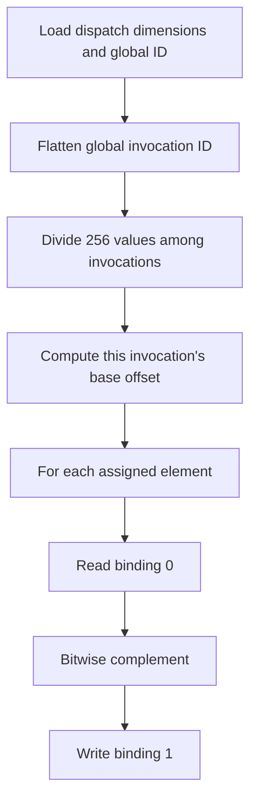

## Overview

**Core question:** What happens when a queued compute dispatch still refers to buffers whose backing allocations were freed before submission?

- This page documents the experimental `postmortem.use_after_free` family implemented in [`vktPostmortemUseAfterFreeTests.cpp`](../../../modules/vulkan/postmortem/vktPostmortemUseAfterFreeTests.cpp#L99-L121).
- The factory registers two leaves: `ubo_to_ssbo_single_invocation` and `ssbo_to_ssbo_single_invocation` ([registration](../../../modules/vulkan/postmortem/vktPostmortemUseAfterFreeTests.cpp#L349-L361)).
- Each case creates a 256-element input and output buffer, records one compute dispatch, releases both allocator-owned memory allocations, then submits the already-recorded command buffer and waits ([execution](../../../modules/vulkan/postmortem/vktPostmortemUseAfterFreeTests.cpp#L238-L345)).
- The compute shader is real test logic, not a placeholder: it partitions the input array across invocations and writes the bitwise complement to the output storage buffer. The host never reads that output after freeing its allocation, so the observable result is queue completion without device loss.

This is an experimental invalid-lifetime probe. A successful run does not make freeing memory while queued commands may access it valid Vulkan usage, and this family is not part of the standard postmortem children ([experimental registration](../../../modules/vulkan/postmortem/vktPostmortemTests.cpp#L41-L66)).

## Background Knowledge

- **Vulkan buffer lifetime.** A `VkBuffer` object and the `VkDeviceMemory` allocation bound to it are separate objects. Commands and descriptors can retain references to the buffer object, but an application must keep the resources and their backing memory valid until all uses have completed. This test deliberately breaks that lifetime rule by deleting its `Allocation` objects before queue submission.
- **Descriptor-backed shader resources.** Binding 0 is either a uniform-buffer descriptor or a storage-buffer descriptor; binding 1 is a write-only storage-buffer descriptor. The descriptor set supplies the shader-visible buffer ranges, while the allocator-owned memory supplies their backing storage.
- **Compute indexing.** `gl_GlobalInvocationID` identifies one invocation in global dispatch space. The shader computes a flattened invocation index and assigns each invocation a contiguous slice of the 256 `uint` elements.
- **Host/device ordering.** The recorded barriers order the host's input writes before compute shader reads and compute shader writes before possible host reads. They do not repair the lifetime violation; they only describe the intended access ordering ([barriers and dispatch](../../../modules/vulkan/postmortem/vktPostmortemUseAfterFreeTests.cpp#L311-L335)).

## Registration Hierarchy

```text
postmortem.use_after_free
├── ubo_to_ssbo_single_invocation
└── ssbo_to_ssbo_single_invocation
```

The root and leaves are constructed by `createUseAfterFreeTests`; the root is attached only by `createChildrenExperimental` ([factory](../../../modules/vulkan/postmortem/vktPostmortemUseAfterFreeTests.cpp#L349-L361), [experimental dispatcher](../../../modules/vulkan/postmortem/vktPostmortemTests.cpp#L47-L65)).

## Parameter Dimensions and Observed Values

| Dimension | Registered values | Meaning in this test | Evidence |
|---|---|---|---|
| input descriptor path | `ubo_to_ssbo_single_invocation`, `ssbo_to_ssbo_single_invocation` | Selects uniform-buffer versus storage-buffer usage, descriptor type, shader declaration, and deterministic input seed. | [case construction](../../../modules/vulkan/postmortem/vktPostmortemUseAfterFreeTests.cpp#L159-L170), [selection](../../../modules/vulkan/postmortem/vktPostmortemUseAfterFreeTests.cpp#L246-L252) |
| element count | `256` | The generated arrays contain 256 `uint` elements; host allocation size is `sizeof(tcu::UVec4) * 256`. | [fixed cases](../../../modules/vulkan/postmortem/vktPostmortemUseAfterFreeTests.cpp#L354-L359), [allocation](../../../modules/vulkan/postmortem/vktPostmortemUseAfterFreeTests.cpp#L254-L258) |
| local size | `(1, 1, 1)` | One invocation per workgroup. | [registered arguments](../../../modules/vulkan/postmortem/vktPostmortemUseAfterFreeTests.cpp#L354-L359) |
| work-group count | `(1, 1, 1)` | One workgroup and one total invocation, so that invocation owns all 256 values. | [dispatch arguments](../../../modules/vulkan/postmortem/vktPostmortemUseAfterFreeTests.cpp#L354-L359) |
| output path | write-only storage buffer at binding 1 | Both leaves write the complemented values to the same kind of output resource. | [descriptor layout and update](../../../modules/vulkan/postmortem/vktPostmortemUseAfterFreeTests.cpp#L277-L302) |

The factory has no runtime parameter matrix beyond these fixed values.

## Behavior Parameters

The primary behavioral axis is the input descriptor/storage path. Both leaves use the same dispatch, free point, output resource, and pass condition; they differ in how the input buffer is declared and described.

### `ubo_to_ssbo_single_invocation` — uniform-buffer input

Binding 0 uses `VK_BUFFER_USAGE_UNIFORM_BUFFER_BIT` and `VK_DESCRIPTOR_TYPE_UNIFORM_BUFFER`. The generated shader declares a read-only uniform block named `ub_in`, reads `ub_in.values`, and writes `~ub_in.values[...]` to the storage buffer at binding 1 ([uniform branch](../../../modules/vulkan/postmortem/vktPostmortemUseAfterFreeTests.cpp#L173-L197), [host selection](../../../modules/vulkan/postmortem/vktPostmortemUseAfterFreeTests.cpp#L248-L252)).

### `ssbo_to_ssbo_single_invocation` — storage-buffer input

Binding 0 uses `VK_BUFFER_USAGE_STORAGE_BUFFER_BIT` and `VK_DESCRIPTOR_TYPE_STORAGE_BUFFER`. The shader changes only the input declaration and name: it reads `sb_in.values` from a read-only storage block and writes the same bitwise complement to `sb_out` ([storage branch](../../../modules/vulkan/postmortem/vktPostmortemUseAfterFreeTests.cpp#L198-L218)).

## Shader Analysis

The source builds the compute shader dynamically in `UseAfterFreeTestCase::initPrograms` and stores it under the `comp` program key ([generation](../../../modules/vulkan/postmortem/vktPostmortemUseAfterFreeTests.cpp#L173-L222)). The two generated variants are materially the same algorithm, so one representative walkthrough covers the shared indexing and inversion logic; the parameter variation is called out explicitly below.

### Representative Shader Walkthrough 1

#### Parameter Values Chosen

Representative path:

```text
dEQP-VK.postmortem.use_after_free.ubo_to_ssbo_single_invocation
```

| Parameter choice | Meaning in this representative case |
|---|---|
| `ubo_to_ssbo_single_invocation` | Binding 0 is a read-only uniform block and binding 1 is a write-only storage block. |
| `numValues = 256`, local size `(1,1,1)`, work-group count `(1,1,1)` | One invocation processes all 256 `uint` elements. |

#### Purpose

The shader reads the input descriptor and writes the bitwise complement to the output descriptor. Both descriptors refer to buffers whose backing allocations the host frees before submission; the test observes completion, not the transformed data.

#### Structural Design



The generator emits general partitioning arithmetic. With the registered sizes, the total invocation count is one, so `numValuesPerInv` is 256, `groupNdx` is zero, and the sole invocation owns the complete array.

#### Shader Code

```glsl
#version 310 es
layout (local_size_x = 1, local_size_y = 1, local_size_z = 1) in;

/// Binding 0 is the input descriptor freed before queue submission.
layout(binding = 0) readonly uniform Input {
    uint values[256];
} ub_in;

/// Binding 1 is the output descriptor freed before queue submission.
layout(binding = 1, std140) writeonly buffer Output {
    uint values[256];
} sb_out;

void main (void) {
    /// Compute global dispatch dimensions and this invocation's slice size.
    uvec3 size = gl_NumWorkGroups * gl_WorkGroupSize;
    uint numValuesPerInv = uint(ub_in.values.length()) / (size.x*size.y*size.z);

    /// Flatten the three-dimensional invocation ID.
    uint groupNdx = size.x*size.y*gl_GlobalInvocationID.z
                  + size.x*gl_GlobalInvocationID.y
                  + gl_GlobalInvocationID.x;
    uint offset = numValuesPerInv*groupNdx;

    /// Invert each uint in this invocation's contiguous slice.
    for (uint ndx = 0u; ndx < numValuesPerInv; ndx++)
        sb_out.values[offset + ndx] = ~ub_in.values[offset + ndx];
}
```

#### Additional Info

- The source emits one `comp` shader for the selected buffer type; the host creates the module from the binary collection before recording the dispatch ([module creation](../../../modules/vulkan/postmortem/vktPostmortemUseAfterFreeTests.cpp#L304-L309)).
- The generated loop is not the pass/fail oracle. The only recorded result check is whether `submitCommandsAndWait` completes, after which the test returns `pass` without reading the invalidated host pointers ([wait and return](../../../modules/vulkan/postmortem/vktPostmortemUseAfterFreeTests.cpp#L337-L345)).

#### Parameter Variation Summary

| Parameter dimension | Shader-level variation from this shader | Evidence |
|---|---|---|
| input descriptor path | `ssbo_to_ssbo_single_invocation` replaces the binding-0 uniform block with a read-only storage block. The indexing and inversion remain unchanged. | [storage shader branch](../../../modules/vulkan/postmortem/vktPostmortemUseAfterFreeTests.cpp#L198-L218) |
| dispatch dimensions | The registered `(1,1,1)` values make one invocation process all 256 elements; the generator retains arithmetic that would partition a larger dispatch. | [fixed registration](../../../modules/vulkan/postmortem/vktPostmortemUseAfterFreeTests.cpp#L354-L359) |

#### SPIR-V

- Status: generated and validated
- Source: reconstructed GLSL from this walkthrough
- Stage: `comp`
- Target SPIRV version: `spirv1.0`

<details>
<summary>Click to expand SPIRV asm code</summary>

```llvm
; SPIR-V
; Version: 1.0
; Generator: Khronos Glslang Reference Front End; 11
; Bound: 88
; Schema: 0
               OpCapability Shader
          %1 = OpExtInstImport "GLSL.std.450"
               OpMemoryModel Logical GLSL450
               OpEntryPoint GLCompute %main "main" %gl_NumWorkGroups %gl_GlobalInvocationID
               OpExecutionMode %main LocalSize 1 1 1
               OpSource ESSL 310
               OpName %main "main"
               OpName %size "size"
               OpName %gl_NumWorkGroups "gl_NumWorkGroups"
               OpName %numValuesPerInv "numValuesPerInv"
               OpName %groupNdx "groupNdx"
               OpName %gl_GlobalInvocationID "gl_GlobalInvocationID"
               OpName %offset "offset"
               OpName %ndx "ndx"
               OpName %Output "Output"
               OpMemberName %Output 0 "values"
               OpName %sb_out "sb_out"
               OpName %Input "Input"
               OpMemberName %Input 0 "values"
               OpName %ub_in "ub_in"
               OpDecorate %gl_NumWorkGroups BuiltIn NumWorkgroups
               OpDecorate %gl_WorkGroupSize BuiltIn WorkgroupSize
               OpDecorate %gl_GlobalInvocationID BuiltIn GlobalInvocationId
               OpDecorate %_arr_uint_uint_256 ArrayStride 16
               OpDecorate %Output BufferBlock
               OpMemberDecorate %Output 0 NonReadable
               OpMemberDecorate %Output 0 Offset 0
               OpDecorate %sb_out NonReadable
               OpDecorate %sb_out Binding 1
               OpDecorate %sb_out DescriptorSet 0
               OpDecorate %_arr_uint_uint_256_0 ArrayStride 16
               OpDecorate %Input Block
               OpMemberDecorate %Input 0 Offset 0
               OpDecorate %ub_in NonWritable
               OpDecorate %ub_in Binding 0
               OpDecorate %ub_in DescriptorSet 0
       %void = OpTypeVoid
          %3 = OpTypeFunction %void
       %uint = OpTypeInt 32 0
     %v3uint = OpTypeVector %uint 3
%_ptr_Function_v3uint = OpTypePointer Function %v3uint
%_ptr_Input_v3uint = OpTypePointer Input %v3uint
%gl_NumWorkGroups = OpVariable %_ptr_Input_v3uint Input
     %uint_1 = OpConstant %uint 1
%gl_WorkGroupSize = OpConstantComposite %v3uint %uint_1 %uint_1 %uint_1
%_ptr_Function_uint = OpTypePointer Function %uint
   %uint_256 = OpConstant %uint 256
     %uint_0 = OpConstant %uint 0
     %uint_2 = OpConstant %uint 2
%gl_GlobalInvocationID = OpVariable %_ptr_Input_v3uint Input
%_ptr_Input_uint = OpTypePointer Input %uint
       %bool = OpTypeBool
%_arr_uint_uint_256 = OpTypeArray %uint %uint_256
     %Output = OpTypeStruct %_arr_uint_uint_256
%_ptr_Uniform_Output = OpTypePointer Uniform %Output
     %sb_out = OpVariable %_ptr_Uniform_Output Uniform
        %int = OpTypeInt 32 1
      %int_0 = OpConstant %int 0
%_arr_uint_uint_256_0 = OpTypeArray %uint %uint_256
      %Input = OpTypeStruct %_arr_uint_uint_256_0
%_ptr_Uniform_Input = OpTypePointer Uniform %Input
      %ub_in = OpVariable %_ptr_Uniform_Input Uniform
%_ptr_Uniform_uint = OpTypePointer Uniform %uint
      %int_1 = OpConstant %int 1
       %main = OpFunction %void None %3
          %5 = OpLabel
       %size = OpVariable %_ptr_Function_v3uint Function
%numValuesPerInv = OpVariable %_ptr_Function_uint Function
   %groupNdx = OpVariable %_ptr_Function_uint Function
     %offset = OpVariable %_ptr_Function_uint Function
        %ndx = OpVariable %_ptr_Function_uint Function
         %12 = OpLoad %v3uint %gl_NumWorkGroups
         %15 = OpIMul %v3uint %12 %gl_WorkGroupSize
               OpStore %size %15
         %20 = OpAccessChain %_ptr_Function_uint %size %uint_0
         %21 = OpLoad %uint %20
         %22 = OpAccessChain %_ptr_Function_uint %size %uint_1
         %23 = OpLoad %uint %22
         %24 = OpIMul %uint %21 %23
         %26 = OpAccessChain %_ptr_Function_uint %size %uint_2
         %27 = OpLoad %uint %26
         %28 = OpIMul %uint %24 %27
         %29 = OpUDiv %uint %uint_256 %28
               OpStore %numValuesPerInv %29
         %31 = OpAccessChain %_ptr_Function_uint %size %uint_0
         %32 = OpLoad %uint %31
         %33 = OpAccessChain %_ptr_Function_uint %size %uint_1
         %34 = OpLoad %uint %33
         %35 = OpIMul %uint %32 %34
         %38 = OpAccessChain %_ptr_Input_uint %gl_GlobalInvocationID %uint_2
         %39 = OpLoad %uint %38
         %40 = OpIMul %uint %35 %39
         %41 = OpAccessChain %_ptr_Function_uint %size %uint_0
         %42 = OpLoad %uint %41
         %43 = OpAccessChain %_ptr_Input_uint %gl_GlobalInvocationID %uint_1
         %44 = OpLoad %uint %43
         %45 = OpIMul %uint %42 %44
         %46 = OpIAdd %uint %40 %45
         %47 = OpAccessChain %_ptr_Input_uint %gl_GlobalInvocationID %uint_0
         %48 = OpLoad %uint %47
         %49 = OpIAdd %uint %46 %48
               OpStore %groupNdx %49
         %51 = OpLoad %uint %numValuesPerInv
         %52 = OpLoad %uint %groupNdx
         %53 = OpIMul %uint %51 %52
               OpStore %offset %53
               OpStore %ndx %uint_0
               OpBranch %55
         %55 = OpLabel
               OpLoopMerge %57 %58 None
               OpBranch %59
         %59 = OpLabel
         %60 = OpLoad %uint %ndx
         %61 = OpLoad %uint %numValuesPerInv
         %63 = OpULessThan %bool %60 %61
               OpBranchConditional %63 %56 %57
         %56 = OpLabel
         %70 = OpLoad %uint %offset
         %71 = OpLoad %uint %ndx
         %72 = OpIAdd %uint %70 %71
         %77 = OpLoad %uint %offset
         %78 = OpLoad %uint %ndx
         %79 = OpIAdd %uint %77 %78
         %81 = OpAccessChain %_ptr_Uniform_uint %ub_in %int_0 %79
         %82 = OpLoad %uint %81
         %83 = OpNot %uint %82
         %84 = OpAccessChain %_ptr_Uniform_uint %sb_out %int_0 %72
               OpStore %84 %83
               OpBranch %58
         %58 = OpLabel
         %85 = OpLoad %uint %ndx
         %87 = OpIAdd %uint %85 %int_1
               OpStore %ndx %87
               OpBranch %55
         %57 = OpLabel
               OpReturn
               OpFunctionEnd
```

</details>

## Runtime Execution and Result Checking

- The host allocates both buffers as host-visible. It fills the input's first component with deterministic pseudo-random values, using a seed selected by the input descriptor type, and flushes the input allocation ([initialization](../../../modules/vulkan/postmortem/vktPostmortemUseAfterFreeTests.cpp#L246-L269)).
- It creates a descriptor set with binding 0 set to the selected input descriptor type and binding 1 set to `VK_DESCRIPTOR_TYPE_STORAGE_BUFFER`, then records the compute pipeline, descriptor set, host-to-compute barrier, dispatch, and compute-to-host barrier ([descriptor update](../../../modules/vulkan/postmortem/vktPostmortemUseAfterFreeTests.cpp#L277-L335)).
- After recording and ending the command buffer, it calls `freeAllocation()` on both buffers. That method deletes the allocator `Allocation` while the `VkBuffer` wrapper, descriptors, and recorded commands remain in the test's object graph ([free method](../../../modules/vulkan/postmortem/vktPostmortemUseAfterFreeTests.cpp#L59-L86), [free point](../../../modules/vulkan/postmortem/vktPostmortemUseAfterFreeTests.cpp#L337-L342)).
- `submitCommandsAndWait` is then called. If it returns, the test reports `pass("Test succeeded without device loss")`; there is no output map, comparison, or post-submit pointer dereference ([result contract](../../../modules/vulkan/postmortem/vktPostmortemUseAfterFreeTests.cpp#L341-L345)).

## Failure Meaning

### Failure Cause Mapping

| If this behavior parameter value fails | Possible failure cause(s) |
|---|---|
| `ubo_to_ssbo_single_invocation` | The invalid-lifetime submission fails or causes device loss while the compute dispatch uses the uniform-buffer input and storage-buffer output. |
| `ssbo_to_ssbo_single_invocation` | The invalid-lifetime submission fails or causes device loss while both shader buffers use storage-buffer descriptors. |

### Cause Analysis

#### Submission or device-loss failure after allocation release

**Possible failure symptoms:** The queue submission or wait does not complete normally, the test reports a framework error, or the device is lost before the pass return. A wrong complemented value alone is not a failure signal because the source never reads or compares the output after freeing its allocation.

**Possible implementation causes:** The source establishes only that queued commands and descriptors refer to buffers whose backing allocations were released before submission. It cannot distinguish driver lifetime handling, memory-management behavior, shader execution, or hardware recovery as the cause. A narrower diagnosis requires the implementation's device-loss report or external debugging evidence.

## Case Pruning

### Requirement-based pruning

The factory performs no explicit feature, limit, or support query and registers no conditional variants. The surrounding framework still determines whether the device can create the requested Vulkan objects, but this source does not add a family-specific pruning rule.

### Design-based pruning

The factory intentionally fixes the data count at 256, the local and work-group sizes at `(1,1,1)`, the output as a storage buffer, and the lifetime sequence. It registers only the uniform-input and storage-input descriptor paths ([fixed registration](../../../modules/vulkan/postmortem/vktPostmortemUseAfterFreeTests.cpp#L349-L361)). It does not explore other array lengths, dispatch geometries, descriptor combinations, or result-checking modes.

## Key Takeaways

- The tested event sequence is the point: record descriptor use, release both backing allocations, submit, and wait.
- The two leaves compare a uniform-buffer input path with a storage-buffer input path; the output path and free point do not change.
- The compute shader performs a real 256-element bitwise inversion, but its data result is deliberately not observed. Completion without device loss is the pass condition.
- The family is experimental-only: `createChildrenExperimental` registers it, while ordinary `createChildren` does not ([dispatcher](../../../modules/vulkan/postmortem/vktPostmortemTests.cpp#L41-L66)).

## Source Reference Appendix

| Entry point | Link | Why it matters |
|---|---|---|
| `UseAfterFreeTestCase::initPrograms` | [shader generation](../../../modules/vulkan/postmortem/vktPostmortemUseAfterFreeTests.cpp#L173-L222) | Emits the two compute-shader variants and adds program key `comp`. |
| `UseAfterFreeTestInstance::iterate` | [resource setup and execution](../../../modules/vulkan/postmortem/vktPostmortemUseAfterFreeTests.cpp#L238-L345) | Initializes buffers, records synchronization and dispatch, frees allocations, waits, and returns the result. |
| `Buffer::freeAllocation` | [allocation release](../../../modules/vulkan/postmortem/vktPostmortemUseAfterFreeTests.cpp#L59-L86) | Deletes the allocator-owned backing allocation while the buffer wrapper remains alive. |
| `createUseAfterFreeTests` | [registered leaves](../../../modules/vulkan/postmortem/vktPostmortemUseAfterFreeTests.cpp#L349-L361) | Defines the exact group names and fixed dimensions. |
| `createChildrenExperimental` | [experimental dispatcher](../../../modules/vulkan/postmortem/vktPostmortemTests.cpp#L47-L65) | Establishes that the family is not attached to the standard postmortem tree. |
