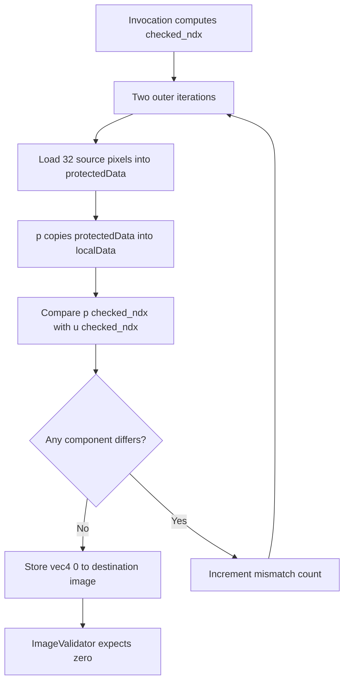

## Overview

**Core question:** Does a protected compute shader preserve image values when it copies them through function-local array storage at each tested stack size?

- [`vktProtectedMemStackTests.cpp`](../../../modules/vulkan/protected_memory/vktProtectedMemStackTests.cpp#L59-L86) defines the `protected_memory.stack` parameters and derives an image extent for each selected size.
- [`StackTestCase::initPrograms`](../../../modules/vulkan/protected_memory/vktProtectedMemStackTests.cpp#L137-L213) generates one compute shader. The shader loads protected image data into a global array, copies that array into a function-local array, and compares both reads.
- The registered test case leaves are `stacksize_32`, `stacksize_64`, `stacksize_128`, `stacksize_256`, and `stacksize_512` ([registration](../../../modules/vulkan/protected_memory/vktProtectedMemStackTests.cpp#L409-L423)).
- The page explains the generated shader, protected image setup, repeated protected dispatches, image validation, and what a mismatch can mean.

## Background Knowledge

- Protected device memory may be visible to device operations but must not be visible to the host. The Vulkan protected-memory rules permit access in the compute shader and transfer stages when the protected resources and command buffer are used consistently ([protected memory](../../../../vulkan-docs/src/chapters/memory.adoc#L5566-L5654)).
- A global GLSL array and an array declared inside a function have different language-level scopes. `p(idx)` reads a function-local copy of `protectedData`, while `u(idx)` reads the global array. The test compares their values without claiming that the compiler uses a particular physical stack layout.

## Registration Hierarchy

```text
protected_memory.stack
├── stacksize_32
├── stacksize_64
├── stacksize_128
├── stacksize_256
└── stacksize_512
```

## Parameter Dimensions and Observed Values

| Dimension | Registered values | Meaning in this test | Evidence |
|-----------|-------------------|----------------------|----------|
| Stack-size test case | `stacksize_32`, `stacksize_64`, `stacksize_128`, `stacksize_256`, `stacksize_512` | Selects the array length, image area, local workgroup dimensions, loop bound, and checked index range. | [`stackMemSizes` and registration](../../../modules/vulkan/protected_memory/vktProtectedMemStackTests.cpp#L409-L423) |
| `stackSize` | `32`, `64`, `128`, `256`, `512` | Substitutes the selected count into `protectedData`, `localData`, the load loop, and the shader constant `n`. | [`Params` and shader generation](../../../modules/vulkan/protected_memory/vktProtectedMemStackTests.cpp#L59-L81), [shader generator](../../../modules/vulkan/protected_memory/vktProtectedMemStackTests.cpp#L151-L182) |
| Derived image and local size | `8 x 4`, `8 x 8`, `16 x 8`, `16 x 16`, `32 x 16` | Provides one invocation for each selected array element and maps `gl_GlobalInvocationID` to a linear index. | [`Params` constructor](../../../modules/vulkan/protected_memory/vktProtectedMemStackTests.cpp#L65-L80), [index calculation](../../../modules/vulkan/protected_memory/vktProtectedMemStackTests.cpp#L183-L190) |
| Outer verification repetition | `2` shader iterations; up to `8` host submissions | Repeats the shader comparison and protected command-buffer execution to reduce coincidental matches. | [shader loop](../../../modules/vulkan/protected_memory/vktProtectedMemStackTests.cpp#L192-L210), [submission loop](../../../modules/vulkan/protected_memory/vktProtectedMemStackTests.cpp#L341-L367) |

`Params` starts both dimensions at 1 and alternates doubling the width and height until their product reaches `stackSize`. The five products equal the five registered sizes, so each invocation checks one array element for the selected case.

## Behavior Parameters

The primary behavioral axis is the registered stack-size test case. Changing it changes the generated array length and the invocation grid, while the global-to-local copy and comparison remain the same.

### stacksize_32 — 32-element array

The shader declares `vec4 protectedData[32]` and `vec4 localData[32]`. An 8 by 4 workgroup supplies 32 invocations, and each invocation checks one linear index.

### stacksize_64 — 64-element array

The shader declares 64-element global and local arrays. An 8 by 8 workgroup supplies one invocation per checked element.

### stacksize_128 — 128-element array

The shader declares 128-element global and local arrays. A 16 by 8 workgroup covers the selected index range.

### stacksize_256 — 256-element array

The shader declares 256-element global and local arrays. A 16 by 16 workgroup covers the selected index range.

### stacksize_512 — 512-element array

The shader declares 512-element global and local arrays. A 32 by 16 workgroup covers the selected index range.

## Shader Analysis

One representative walkthrough is sufficient because all five leaves use the same generated control flow. The selected `stacksize_32` case exposes the smallest complete array and invocation grid; larger cases substitute different dimensions and bounds without changing the tested comparison.

### Representative Shader Walkthrough 1

#### Parameter Values Chosen

Representative path:

```text
dEQP-VK.protected_memory.stack.stacksize_32
```

| Parameter choice | Meaning in this representative case |
|------------------|-------------------------------------|
| `stacksize_32` | Sets `stackSize` and both shader arrays to 32 elements. |
| `imageWidth = 8`, `imageHeight = 4` | Gives the compute shader 32 invocations and maps each invocation to one array index. |
| `local_size_x = 8`, `local_size_y = 4`, `local_size_z = 1` | Matches the derived image dimensions and the `maxComputeWorkGroupInvocations` support check. |
| `VK_FORMAT_R8G8B8A8_UNORM` | Defines the source and destination storage-image format used by the shader and validator. |

#### Purpose

This shader checks that a value copied from the global `protectedData` array into function-local `localData` can be read back through `p(idx)` with the same value that `u(idx)` reads from the global array.

#### Structural Design



#### Shader Code

```glsl
#version 450
layout(local_size_x = 8, local_size_y = 4, local_size_z = 1) in;

/// Binding 0 is the protected destination storage image. Each invocation writes
/// one match or mismatch value at its global coordinates.
layout(set = 0, binding = 0, rgba8) writeonly uniform highp image2D u_resultImage;

/// Binding 1 is the protected source storage image populated before the protected
/// dispatch. The shader reads one vec4 for each array element.
layout(set = 0, binding = 1, rgba8) readonly uniform highp image2D u_srcImage;

/// This global array receives the source-image values and is read directly by u().
vec4 protectedData[32];

vec4 p(int idx)
{
    /// localData is the function-local array whose storage and value preservation
    /// are compared with the global array.
    vec4 localData[32];
    for (int i = 0; i < 32; i++)
        localData[i] = protectedData[i];
    return localData[idx];
}

vec4 u(int idx)
{
    /// This path reads the same selected element directly from global storage.
    return protectedData[idx];
}

void main()
{
    const int n = 32;
    int m = 0;
    int w = 8;
    int gx = int(gl_GlobalInvocationID.x);
    int gy = int(gl_GlobalInvocationID.y);
    int checked_ndx = gy * w + gx;
    vec4 outColor;

    /// Rebuild the global array twice. The shifted index changes which source
    /// pixel populates each element on the second iteration.
    for (int j = 0; j < 2; j++)
    {
        for (int i = 0; i < n; i++)
        {
            const int idx = (i + j) % n;
            protectedData[i] = imageLoad(u_srcImage, ivec2(idx % w, idx / w));
        }

        vec4 vp = p(checked_ndx);
        vec4 vu = u(checked_ndx);
        if (any(notEqual(vp, vu)))
            m++;
    }

    /// The expected image is zero everywhere. A one-valued texel records a
    /// mismatch observed by this invocation.
    if (m <= 0)
        outColor = vec4(0.0f);
    else
        outColor = vec4(1.0f);
    imageStore(u_resultImage, ivec2(gx, gy), outColor);
}
```

#### Additional Info

- `getSeedValue()` hashes the selected stack size, so the source image gets deterministic but size-specific unique colors ([seed and texture creation](../../../modules/vulkan/protected_memory/vktProtectedMemStackTests.cpp#L83-L86), [texture initialization](../../../modules/vulkan/protected_memory/vktProtectedMemStackTests.cpp#L223-L234)).
- The source comments describe each invocation as checking a byte element, but the generated shader uses `vec4` array elements and one `vec4` image texel per index. This page uses “element” for the generated behavior.
- The shader is compiled as GLSL compute code for the default source-collection SPIR-V target. The disassembler run below used `spirv1.0`, matching the generated assembly header.

#### Parameter Variation Summary

| Parameter dimension | Shader-level variation from this shader | Evidence |
|---------------------|---------------------------------------|----------|
| Stack-size test case | The array declarations and `n` loop bound become 32, 64, 128, 256, or 512. | [`stackMemSizes` and generator substitutions](../../../modules/vulkan/protected_memory/vktProtectedMemStackTests.cpp#L151-L182) |
| Derived image and local size | The `local_size_x`, `local_size_y`, and `w` values follow the alternating dimension calculation; the linear index still covers one element per invocation. | [`Params` constructor and index generation](../../../modules/vulkan/protected_memory/vktProtectedMemStackTests.cpp#L65-L80), [shader dimensions](../../../modules/vulkan/protected_memory/vktProtectedMemStackTests.cpp#L151-L190) |
| Source data seed | The source image values change with `deInt32Hash(stackSize)`, while the shader's comparison logic stays fixed. | [`getSeedValue`](../../../modules/vulkan/protected_memory/vktProtectedMemStackTests.cpp#L83-L86), [source texture initialization](../../../modules/vulkan/protected_memory/vktProtectedMemStackTests.cpp#L223-L234) |
| Protected image setup | The GLSL text stays the same; protected source/destination allocation and protected submission surround the dispatch. | [image creation](../../../modules/vulkan/protected_memory/vktProtectedMemStackTests.cpp#L266-L295), [protected submit](../../../modules/vulkan/protected_memory/vktProtectedMemStackTests.cpp#L341-L366) |

#### SPIR-V

- Status: generated and validated
- Source: reconstructed `GLSL` from this walkthrough
- Stage: `comp`
- Target SPIRV version: `spirv1.0`

<details>
<summary>Click to expand SPIRV asm code</summary>

```llvm
; SPIR-V
; Version: 1.0
; Generator: Khronos Glslang Reference Front End; 11
; Bound: 155
; Schema: 0
               OpCapability Shader
          %1 = OpExtInstImport "GLSL.std.450"
               OpMemoryModel Logical GLSL450
               OpEntryPoint GLCompute %main "main" %gl_GlobalInvocationID
               OpExecutionMode %main LocalSize 8 4 1
               OpSource GLSL 450
               OpName %main "main"
               OpName %p_i1_ "p(i1;"
               OpName %idx "idx"
               OpName %u_i1_ "u(i1;"
               OpName %idx_0 "idx"
               OpName %i "i"
               OpName %localData "localData"
               OpName %protectedData "protectedData"
               OpName %m "m"
               OpName %w "w"
               OpName %gx "gx"
               OpName %gl_GlobalInvocationID "gl_GlobalInvocationID"
               OpName %gy "gy"
               OpName %checked_ndx "checked_ndx"
               OpName %j "j"
               OpName %i_0 "i"
               OpName %idx_1 "idx"
               OpName %u_srcImage "u_srcImage"
               OpName %vp "vp"
               OpName %param "param"
               OpName %vu "vu"
               OpName %param_0 "param"
               OpName %outColor "outColor"
               OpName %u_resultImage "u_resultImage"
               OpDecorate %gl_GlobalInvocationID BuiltIn GlobalInvocationId
               OpDecorate %u_srcImage NonWritable
               OpDecorate %u_srcImage Binding 1
               OpDecorate %u_srcImage DescriptorSet 0
               OpDecorate %u_resultImage NonReadable
               OpDecorate %u_resultImage Binding 0
               OpDecorate %u_resultImage DescriptorSet 0
               OpDecorate %gl_WorkGroupSize BuiltIn WorkgroupSize
       %void = OpTypeVoid
          %3 = OpTypeFunction %void
        %int = OpTypeInt 32 1
%_ptr_Function_int = OpTypePointer Function %int
      %float = OpTypeFloat 32
    %v4float = OpTypeVector %float 4
         %10 = OpTypeFunction %v4float %_ptr_Function_int
      %int_0 = OpConstant %int 0
     %int_32 = OpConstant %int 32
       %bool = OpTypeBool
       %uint = OpTypeInt 32 0
    %uint_32 = OpConstant %uint 32
%_arr_v4float_uint_32 = OpTypeArray %v4float %uint_32
%_ptr_Function__arr_v4float_uint_32 = OpTypePointer Function %_arr_v4float_uint_32
%_ptr_Private__arr_v4float_uint_32 = OpTypePointer Private %_arr_v4float_uint_32
%protectedData = OpVariable %_ptr_Private__arr_v4float_uint_32 Private
%_ptr_Private_v4float = OpTypePointer Private %v4float
%_ptr_Function_v4float = OpTypePointer Function %v4float
      %int_1 = OpConstant %int 1
      %int_8 = OpConstant %int 8
     %v3uint = OpTypeVector %uint 3
%_ptr_Input_v3uint = OpTypePointer Input %v3uint
%gl_GlobalInvocationID = OpVariable %_ptr_Input_v3uint Input
     %uint_0 = OpConstant %uint 0
%_ptr_Input_uint = OpTypePointer Input %uint
     %uint_1 = OpConstant %uint 1
      %int_2 = OpConstant %int 2
        %101 = OpTypeImage %float 2D 0 0 0 2 Rgba8
%_ptr_UniformConstant_101 = OpTypePointer UniformConstant %101
 %u_srcImage = OpVariable %_ptr_UniformConstant_101 UniformConstant
      %v2int = OpTypeVector %int 2
     %v4bool = OpTypeVector %bool 4
    %float_0 = OpConstant %float 0
        %142 = OpConstantComposite %v4float %float_0 %float_0 %float_0 %float_0
    %float_1 = OpConstant %float 1
        %145 = OpConstantComposite %v4float %float_1 %float_1 %float_1 %float_1
%u_resultImage = OpVariable %_ptr_UniformConstant_101 UniformConstant
     %uint_8 = OpConstant %uint 8
     %uint_4 = OpConstant %uint 4
%gl_WorkGroupSize = OpConstantComposite %v3uint %uint_8 %uint_4 %uint_1
       %main = OpFunction %void None %3
          %5 = OpLabel
          %m = OpVariable %_ptr_Function_int Function
          %w = OpVariable %_ptr_Function_int Function
         %gx = OpVariable %_ptr_Function_int Function
         %gy = OpVariable %_ptr_Function_int Function
%checked_ndx = OpVariable %_ptr_Function_int Function
          %j = OpVariable %_ptr_Function_int Function
        %i_0 = OpVariable %_ptr_Function_int Function
      %idx_1 = OpVariable %_ptr_Function_int Function
         %vp = OpVariable %_ptr_Function_v4float Function
      %param = OpVariable %_ptr_Function_int Function
         %vu = OpVariable %_ptr_Function_v4float Function
    %param_0 = OpVariable %_ptr_Function_int Function
   %outColor = OpVariable %_ptr_Function_v4float Function
               OpStore %m %int_0
               OpStore %w %int_8
         %64 = OpAccessChain %_ptr_Input_uint %gl_GlobalInvocationID %uint_0
         %65 = OpLoad %uint %64
         %66 = OpBitcast %int %65
               OpStore %gx %66
         %69 = OpAccessChain %_ptr_Input_uint %gl_GlobalInvocationID %uint_1
         %70 = OpLoad %uint %69
         %71 = OpBitcast %int %70
               OpStore %gy %71
         %73 = OpLoad %int %gy
         %74 = OpLoad %int %w
         %75 = OpIMul %int %73 %74
         %76 = OpLoad %int %gx
         %77 = OpIAdd %int %75 %76
               OpStore %checked_ndx %77
               OpStore %j %int_0
               OpBranch %79
         %79 = OpLabel
               OpLoopMerge %81 %82 None
               OpBranch %83
         %83 = OpLabel
         %84 = OpLoad %int %j
         %86 = OpSLessThan %bool %84 %int_2
               OpBranchConditional %86 %80 %81
         %80 = OpLabel
               OpStore %i_0 %int_0
               OpBranch %88
         %88 = OpLabel
               OpLoopMerge %90 %91 None
               OpBranch %92
         %92 = OpLabel
         %93 = OpLoad %int %i_0
         %94 = OpSLessThan %bool %93 %int_32
               OpBranchConditional %94 %89 %90
         %89 = OpLabel
         %96 = OpLoad %int %i_0
         %97 = OpLoad %int %j
         %98 = OpIAdd %int %96 %97
         %99 = OpSMod %int %98 %int_32
               OpStore %idx_1 %99
        %100 = OpLoad %int %i_0
        %104 = OpLoad %101 %u_srcImage
        %105 = OpLoad %int %idx_1
        %106 = OpLoad %int %w
        %107 = OpSMod %int %105 %106
        %108 = OpLoad %int %idx_1
        %109 = OpLoad %int %w
        %110 = OpSDiv %int %108 %109
        %112 = OpCompositeConstruct %v2int %107 %110
        %113 = OpImageRead %v4float %104 %112
        %114 = OpAccessChain %_ptr_Private_v4float %protectedData %100
               OpStore %114 %113
               OpBranch %91
         %91 = OpLabel
        %115 = OpLoad %int %i_0
        %116 = OpIAdd %int %115 %int_1
               OpStore %i_0 %116
               OpBranch %88
         %90 = OpLabel
        %119 = OpLoad %int %checked_ndx
               OpStore %param %119
        %120 = OpFunctionCall %v4float %p_i1_ %param
               OpStore %vp %120
        %123 = OpLoad %int %checked_ndx
               OpStore %param_0 %123
        %124 = OpFunctionCall %v4float %u_i1_ %param_0
               OpStore %vu %124
        %125 = OpLoad %v4float %vp
        %126 = OpLoad %v4float %vu
        %128 = OpFUnordNotEqual %v4bool %125 %126
        %129 = OpAny %bool %128
               OpSelectionMerge %131 None
               OpBranchConditional %129 %130 %131
        %130 = OpLabel
        %132 = OpLoad %int %m
        %133 = OpIAdd %int %132 %int_1
               OpStore %m %133
               OpBranch %131
        %131 = OpLabel
               OpBranch %82
         %82 = OpLabel
        %134 = OpLoad %int %j
        %135 = OpIAdd %int %134 %int_1
               OpStore %j %135
               OpBranch %79
         %81 = OpLabel
        %136 = OpLoad %int %m
        %137 = OpSLessThanEqual %bool %136 %int_0
               OpSelectionMerge %139 None
               OpBranchConditional %137 %138 %143
        %138 = OpLabel
               OpStore %outColor %142
               OpBranch %139
        %143 = OpLabel
               OpStore %outColor %145
               OpBranch %139
        %139 = OpLabel
        %147 = OpLoad %101 %u_resultImage
        %148 = OpLoad %int %gx
        %149 = OpLoad %int %gy
        %150 = OpCompositeConstruct %v2int %148 %149
        %151 = OpLoad %v4float %outColor
               OpImageWrite %147 %150 %151
               OpReturn
               OpFunctionEnd
      %p_i1_ = OpFunction %v4float None %10
        %idx = OpFunctionParameter %_ptr_Function_int
         %13 = OpLabel
          %i = OpVariable %_ptr_Function_int Function
  %localData = OpVariable %_ptr_Function__arr_v4float_uint_32 Function
               OpStore %i %int_0
               OpBranch %19
         %19 = OpLabel
               OpLoopMerge %21 %22 None
               OpBranch %23
         %23 = OpLabel
         %24 = OpLoad %int %i
         %27 = OpSLessThan %bool %24 %int_32
               OpBranchConditional %27 %20 %21
         %20 = OpLabel
         %33 = OpLoad %int %i
         %36 = OpLoad %int %i
         %38 = OpAccessChain %_ptr_Private_v4float %protectedData %36
         %39 = OpLoad %v4float %38
         %41 = OpAccessChain %_ptr_Function_v4float %localData %33
               OpStore %41 %39
               OpBranch %22
         %22 = OpLabel
         %42 = OpLoad %int %i
         %44 = OpIAdd %int %42 %int_1
               OpStore %i %44
               OpBranch %19
         %21 = OpLabel
         %45 = OpLoad %int %idx
         %46 = OpAccessChain %_ptr_Function_v4float %localData %45
         %47 = OpLoad %v4float %46
               OpReturnValue %47
               OpFunctionEnd
      %u_i1_ = OpFunction %v4float None %10
      %idx_0 = OpFunctionParameter %_ptr_Function_int
         %16 = OpLabel
         %50 = OpLoad %int %idx_0
         %51 = OpAccessChain %_ptr_Private_v4float %protectedData %50
         %52 = OpLoad %v4float %51
               OpReturnValue %52
               OpFunctionEnd
```

</details>

## Runtime Execution and Result Checking

- `StackTestCase::checkSupport()` requires protected-context support and rejects a case when `maxComputeWorkGroupInvocations` is smaller than `imageWidth * imageHeight` ([support check](../../../modules/vulkan/protected_memory/vktProtectedMemStackTests.cpp#L116-L124)).
- `createTestTexture2D()` creates an `R8G8B8A8_UNORM` texture with the derived extent and fills it with deterministic unique colors. The runtime uploads those pixels to an unprotected staging image, then copies them into the protected source image ([texture and upload](../../../modules/vulkan/protected_memory/vktProtectedMemStackTests.cpp#L223-L291)).
- The runtime creates protected source and destination images with transfer, sampled, and storage usage. Descriptor binding 0 addresses `imageDst`; binding 1 addresses `imageSrc`, both in `VK_IMAGE_LAYOUT_GENERAL` ([image setup and descriptors](../../../modules/vulkan/protected_memory/vktProtectedMemStackTests.cpp#L266-L334)).
- The runtime builds a compute pipeline, records a protected command buffer, binds the two storage-image descriptors, and dispatches one workgroup. It waits on a fence before checking the destination ([pipeline and dispatch](../../../modules/vulkan/protected_memory/vktProtectedMemStackTests.cpp#L310-L366)).
- `calculateRef()` sets every reference texel to zero. `validateResult()` samples four deterministic normalized coordinates and asks `ImageValidator` to compare the protected destination against that zero reference ([reference and validation](../../../modules/vulkan/protected_memory/vktProtectedMemStackTests.cpp#L375-L405)).
- The runtime repeats pipeline creation, protected submission, fence wait, and validation up to eight times. It returns `Pass` only when every validation succeeds; a mismatch returns `Result validation failed` ([repeat and result](../../../modules/vulkan/protected_memory/vktProtectedMemStackTests.cpp#L339-L372)).

## Failure Meaning

### Failure Cause Mapping

| If this behavior parameter value fails | Possible failure cause(s) |
|----------------------------------------|---------------------------|
| `stacksize_32` | Protected source-image access, function-local array storage for 32 elements, global/local value comparison, protected destination write, or image validation does not produce the expected zero image. |
| `stacksize_64` | Protected source-image access, function-local array storage for 64 elements, global/local value comparison, protected destination write, or image validation does not produce the expected zero image. |
| `stacksize_128` | Protected source-image access, function-local array storage for 128 elements, global/local value comparison, protected destination write, or image validation does not produce the expected zero image. |
| `stacksize_256` | Protected source-image access, function-local array storage for 256 elements, global/local value comparison, protected destination write, or image validation does not produce the expected zero image. |
| `stacksize_512` | Protected source-image access, function-local array storage for 512 elements, global/local value comparison, protected destination write, or image validation does not produce the expected zero image. |

### Cause Analysis

#### Protected image access or synchronization failures

**Possible failure symptoms:** `ImageValidator` observes a nonzero destination sample or a destination value that does not match the all-zero reference after the protected dispatch.

**Possible implementation causes:** The transfer from the unprotected upload image may not make the initialized pixels available to the protected source image, or the protected compute operation may not access the source and destination images according to the selected layouts and command-buffer protection. The exact failing dependency requires investigation of the reported case and validation data.

#### Global-to-local array value failures

**Possible failure symptoms:** An invocation writes `vec4(1.0f)` because `any(notEqual(vp, vu))` is true in one of the two shader repetitions. The failed samples identify an image texel written by an invocation whose local-array read differed from its global-array read.

**Possible implementation causes:** The generated array accesses, function call, or compiler lowering may produce a value different from the value stored in the corresponding array element at the selected size. The test does not inspect physical stack allocation, so the exact implementation cause requires source-level investigation of the failing shader and device.

#### Destination write or image-validation failures

**Possible failure symptoms:** The shader's output cannot be sampled as the expected zero image, or validation fails even when the shader comparison should have produced zero-valued texels.

**Possible implementation causes:** The destination storage-image write, image view or format interpretation, command completion, or `ImageValidator` sampling path may not preserve the shader's result. The exact failing layer requires investigation rather than an assumption about hardware, driver, compiler, or host code.

## Case Pruning

### Requirement-based pruning

- `checkProtectedContextSupport(context)` must pass before the case runs. A device without the required protected-memory support skips the case ([support gate](../../../modules/vulkan/protected_memory/vktProtectedMemStackTests.cpp#L116-L124)).
- The derived local size must fit `maxComputeWorkGroupInvocations`. Cases whose image area exceeds that device limit are rejected as unsupported, rather than reported as shader failures ([invocation-limit check](../../../modules/vulkan/protected_memory/vktProtectedMemStackTests.cpp#L120-L123)).

### Design-based pruning

- The five registered sizes are the complete matrix: `{32, 64, 128, 256, 512}`. The test does not generate intermediate sizes ([registration array](../../../modules/vulkan/protected_memory/vktProtectedMemStackTests.cpp#L414-L420)).
- The image dimensions are derived from the selected size by alternating width and height growth. This keeps the invocation count equal to the selected array length while avoiding a separate arbitrary dimension parameter ([dimension derivation](../../../modules/vulkan/protected_memory/vktProtectedMemStackTests.cpp#L65-L80)).
- The shader uses two outer comparison iterations and the host uses up to eight submissions. These repetitions are fixed design choices, not independent registered behavior parameters ([shader repetition](../../../modules/vulkan/protected_memory/vktProtectedMemStackTests.cpp#L192-L210), [host repetition](../../../modules/vulkan/protected_memory/vktProtectedMemStackTests.cpp#L341-L367)).

## Key Takeaways

- The five `stacksize_*` leaves scale one compute shader by changing its array length and invocation grid.
- The shader tests value preservation through a function-local array by comparing `p(idx)` with the direct global-array read `u(idx)`.
- The shader records mismatches in a protected destination image, and the host expects that image to remain zero at its validation samples.
- A failure identifies a mismatch in the tested protected image, array-access, execution, or validation path. It does not identify a physical stack-allocation bug by itself.

## Source Reference Appendix

| Entry point | Link | Why it matters |
|-------------|------|----------------|
| Parameter derivation | [`Params` and `getSeedValue`](../../../modules/vulkan/protected_memory/vktProtectedMemStackTests.cpp#L59-L86) | Defines the stack-size input, image dimensions, and deterministic source seed. |
| Support and registration | [`StackTestCase::checkSupport`](../../../modules/vulkan/protected_memory/vktProtectedMemStackTests.cpp#L104-L130), [`createStackTests`](../../../modules/vulkan/protected_memory/vktProtectedMemStackTests.cpp#L409-L423) | Applies the protected-context and invocation-limit gates and registers the five test case leaves. |
| Compute shader generator | [`StackTestCase::initPrograms`](../../../modules/vulkan/protected_memory/vktProtectedMemStackTests.cpp#L137-L213) | Emits the storage-image interface, global/local arrays, comparison loops, and result write. |
| Texture creation and source upload | [`createTestTexture2D`](../../../modules/vulkan/protected_memory/vktProtectedMemStackTests.cpp#L223-L234), [`StackTestInstance::iterate`](../../../modules/vulkan/protected_memory/vktProtectedMemStackTests.cpp#L266-L295) | Creates deterministic source data and moves it into the protected source image. |
| Descriptor and pipeline setup | [`StackTestInstance::iterate`](../../../modules/vulkan/protected_memory/vktProtectedMemStackTests.cpp#L296-L334) | Creates storage-image descriptors and binds destination at 0 and source at 1. |
| Protected dispatch and repetition | [`StackTestInstance::iterate`](../../../modules/vulkan/protected_memory/vktProtectedMemStackTests.cpp#L336-L372) | Records, submits, waits for, and validates protected compute work. |
| Reference and result checking | [`calculateRef` and `validateResult`](../../../modules/vulkan/protected_memory/vktProtectedMemStackTests.cpp#L375-L405) | Defines the zero reference and sampled image comparison. |
| Protected-memory semantics | [`Protected Memory`](../../../../vulkan-docs/src/chapters/memory.adoc#L5566-L5654) | Defines protected device-memory visibility and permitted compute/transfer access. |
