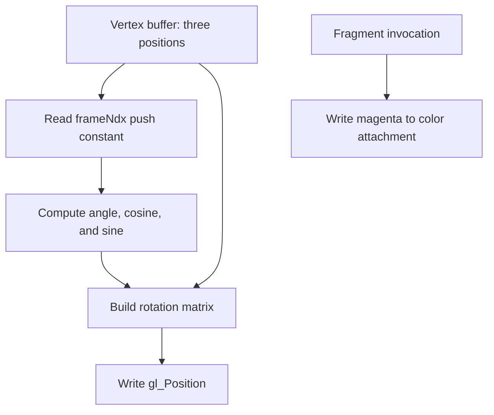

## Overview

**Core question:** Can each supported WSI platform create and present protected swapchain images through the tested swapchain settings and protected render loop?

- This page covers `protected_memory.interaction.wsi`, implemented in [vktProtectedMemWsiSwapchainTests.cpp](../../../modules/vulkan/protected_memory/vktProtectedMemWsiSwapchainTests.cpp).
- Each WSI type registers ten `swapchain.create` cases, one for each `VkSwapchainCreateInfoKHR` dimension, plus a `swapchain.render.basic` case.
- The create family checks protected swapchain construction. The render family acquires images, draws a rotating triangle in a protected submission, and presents the images for 600 frames.
- The page covers the nine registered WSI types: `android`, `direct`, `direct_drm`, `headless`, `metal`, `wayland`, `win32`, `xcb`, and `xlib`.

## Background Knowledge

- **Protected WSI.** A `VkSurfaceKHR` connects Vulkan to a native window, display, or headless presentation target. A swapchain created with `VK_SWAPCHAIN_CREATE_PROTECTED_BIT_KHR` contains protected images. `VkSurfaceProtectedCapabilitiesKHR::supportsProtected` reports whether the selected surface can display those images.
- **Protected queue submission.** Protected command buffers come from a pool created with `VK_COMMAND_POOL_CREATE_PROTECTED_BIT`, and a protected submission sets `VkProtectedSubmitInfo::protectedSubmit` to `VK_TRUE`. The queue family must support graphics, compute, surface presentation, and protected operations for this test.

## Registration Hierarchy

```text
protected_memory.interaction.wsi
├── android
├── direct
├── direct_drm
├── headless
├── metal
├── wayland
├── win32
├── xcb
└── xlib
```

Each WSI type contains the `swapchain` test family with `create` and `render` groups. The parent `protected_memory` dispatcher excludes this WSI branch when building Vulkan SC tests.

## Parameter Dimensions and Observed Values

| Dimension | Registered values | Meaning in this test | Evidence |
|-----------|-------------------|----------------------|----------|
| WSI type | `android`, `direct`, `direct_drm`, `headless`, `metal`, `wayland`, `win32`, `xcb`, `xlib` | Selects the native display/window path and its surface rules. | [WSI registration](../../../modules/vulkan/protected_memory/vktProtectedMemWsiSwapchainTests.cpp#L1461-L1471) |
| Test family | `create`, `render` | Selects protected swapchain construction checks or the protected acquire, draw, and present loop. | [swapchain groups](../../../modules/vulkan/protected_memory/vktProtectedMemWsiSwapchainTests.cpp#L1440-L1457) |
| Create parameter dimension | `min_image_count`, `image_format`, `image_extent`, `image_array_layers`, `image_usage`, `image_sharing_mode`, `pre_transform`, `composite_alpha`, `present_mode`, `clipped` | Selects which reported or valid `VkSwapchainCreateInfoKHR` field the create family varies. | [dimension enum and names](../../../modules/vulkan/protected_memory/vktProtectedMemWsiSwapchainTests.cpp#L173-L195), [registration](../../../modules/vulkan/protected_memory/vktProtectedMemWsiSwapchainTests.cpp#L960-L969) |
| Render size | `256 x 256` desired size | Sets the native window request and the basic render swapchain extent, subject to platform capabilities. | [basic render setup](../../../modules/vulkan/protected_memory/vktProtectedMemWsiSwapchainTests.cpp#L1286-L1329) |
| Render count | `600` frames | Exercises repeated image acquisition, protected submission, and presentation. | [render loop](../../../modules/vulkan/protected_memory/vktProtectedMemWsiSwapchainTests.cpp#L1351-L1418) |

The mustpass file contains ten create paths and one render path for each WSI type, for 99 paths total: [protected-memory.txt](../../../mustpass/main/vk-default/protected-memory.txt#L739-L837).

## Behavior Parameters

The primary behavioral axis is the test family. WSI type and the selected create dimension are secondary axes that change the platform or `VkSwapchainCreateInfoKHR` input.

### `create` - protected swapchain construction

The test queries surface capabilities, formats, and present modes, creates a protected context and surface, then varies one swapchain field at a time. Each case creates and destroys the protected swapchain. The field values come from surface support or from valid candidates checked against the surface and device.

### `render` - protected acquire, draw, and present

The test creates a basic protected swapchain, obtains its images, renders a triangle into the acquired image, submits the work with protected submission enabled, and presents the image. It repeats this sequence for 600 frames. Successful acquire, submission, presentation, and final device idle are the result checks.

## Shader Analysis

The render family uses two generated GLSL shaders. They do not read protected memory directly. The vertex shader rotates three host-uploaded vertex positions using a push constant, while the fragment shader writes a constant magenta color. The walkthrough uses the headless render path because it shows the platform-independent protected acquire, submit, and present sequence.

### Representative Shader Walkthrough 1

#### Parameter Values Chosen

Representative path:

```text
dEQP-VK.protected_memory.interaction.wsi.headless.swapchain.render.basic
```

| Parameter choice | Meaning in this representative case |
|------------------|-------------------------------------|
| `headless` | Selects the headless WSI branch while retaining the same protected swapchain and render implementation. |
| `swapchain.render.basic` | Selects the fixed basic swapchain and the 600-frame triangle render loop. |
| `frameNdx` from `0` through `599` | Changes the vertex rotation angle on each draw without changing shader declarations or resource bindings. |

#### Purpose

The vertex shader supplies changing triangle positions to the protected swapchain render pass. The fragment shader supplies a fixed color so the test exercises protected presentation rather than image-content comparison.

#### Structural Design

The vertex stage applies a frame-dependent 2D rotation before writing `gl_Position`; the fragment stage writes one constant color.



#### Shader Code

##### Vertex Shader

```glsl
#version 310 es
/// Location 0 receives the three host-uploaded vec4 triangle positions.
layout(location = 0) in highp vec4 a_position;
/// The host writes one uint per frame at push-constant offset 0. It controls the rotation only.
layout(push_constant) uniform FrameData
{
    highp uint frameNdx;
} frameData;
void main (void)
{
    /// The host increments frameNdx for each draw, producing a changing rotation angle.
    highp float angle = float(frameData.frameNdx) / 100.0;
    highp float c     = cos(angle);
    highp float s     = sin(angle);
    highp mat4  t     = mat4( c, -s,  0,  0,
                              s,  c,  0,  0,
                              0,  0,  1,  0,
                              0,  0,  0,  1);
    /// The rotated position becomes the vertex output for the protected render pass.
    gl_Position = t * a_position;
}
```

##### Fragment Shader

```glsl
#version 310 es
/// Location 0 is the color attachment written by the render pass.
layout(location = 0) out lowp vec4 o_color;
void main (void) { o_color = vec4(1.0, 0.0, 1.0, 1.0); }
```

#### Additional Info

- The vertex buffer is host-visible and unprotected. The swapchain images and the command buffers carrying the draw are protected.
- `frameNdx` is pushed through a pipeline layout range visible to the vertex stage; the fragment shader has no descriptor or push-constant input.
- The render path validates operation results and does not copy the protected swapchain image back to the host.

#### Parameter Variation Summary

| Parameter dimension | Shader-level variation from this shader | Evidence |
|---------------------|----------------------------------------|----------|
| WSI type | No shader-source change. The WSI type changes native surface creation and platform extent rules around the same shaders. | [WSI setup](../../../modules/vulkan/protected_memory/vktProtectedMemWsiSwapchainTests.cpp#L1286-L1329) |
| `frameNdx` | Changes the vertex rotation angle at runtime; declarations and fragment output stay fixed. | [push constant and draw](../../../modules/vulkan/protected_memory/vktProtectedMemWsiSwapchainTests.cpp#L1199-L1219) |
| Render image format | No shader-source change. The fragment output is written to the format selected by the surface and swapchain. | [pipeline and swapchain format](../../../modules/vulkan/protected_memory/vktProtectedMemWsiSwapchainTests.cpp#L1131-L1157), [basic swapchain parameters](../../../modules/vulkan/protected_memory/vktProtectedMemWsiSwapchainTests.cpp#L971-L1009) |

#### SPIR-V

##### Vertex SPIR-V

- Status: generated and validated
- Source: reconstructed `GLSL` from this walkthrough
- Stage: `vert`
- Target SPIRV version: `spirv1.0`

<details>
<summary>Click to expand SPIRV asm code</summary>

```llvm
; SPIR-V
; Version: 1.0
; Generator: Khronos Glslang Reference Front End; 11
; Bound: 53
; Schema: 0
               OpCapability Shader
          %1 = OpExtInstImport "GLSL.std.450"
               OpMemoryModel Logical GLSL450
               OpEntryPoint Vertex %main "main" %_ %a_position
               OpSource ESSL 310
               OpName %main "main"
               OpName %angle "angle"
               OpName %FrameData "FrameData"
               OpMemberName %FrameData 0 "frameNdx"
               OpName %frameData "frameData"
               OpName %c "c"
               OpName %s "s"
               OpName %t "t"
               OpName %gl_PerVertex "gl_PerVertex"
               OpMemberName %gl_PerVertex 0 "gl_Position"
               OpMemberName %gl_PerVertex 1 "gl_PointSize"
               OpName %_ ""
               OpName %a_position "a_position"
               OpDecorate %FrameData Block
               OpMemberDecorate %FrameData 0 Offset 0
               OpDecorate %gl_PerVertex Block
               OpMemberDecorate %gl_PerVertex 0 BuiltIn Position
               OpMemberDecorate %gl_PerVertex 1 BuiltIn PointSize
               OpDecorate %a_position Location 0
       %void = OpTypeVoid
          %3 = OpTypeFunction %void
      %float = OpTypeFloat 32
%_ptr_Function_float = OpTypePointer Function %float
       %uint = OpTypeInt 32 0
  %FrameData = OpTypeStruct %uint
%_ptr_PushConstant_FrameData = OpTypePointer PushConstant %FrameData
  %frameData = OpVariable %_ptr_PushConstant_FrameData PushConstant
        %int = OpTypeInt 32 1
      %int_0 = OpConstant %int 0
%_ptr_PushConstant_uint = OpTypePointer PushConstant %uint
  %float_100 = OpConstant %float 100
    %v4float = OpTypeVector %float 4
%mat4v4float = OpTypeMatrix %v4float 4
%_ptr_Function_mat4v4float = OpTypePointer Function %mat4v4float
    %float_0 = OpConstant %float 0
    %float_1 = OpConstant %float 1
%gl_PerVertex = OpTypeStruct %v4float %float
%_ptr_Output_gl_PerVertex = OpTypePointer Output %gl_PerVertex
          %_ = OpVariable %_ptr_Output_gl_PerVertex Output
%_ptr_Input_v4float = OpTypePointer Input %v4float
 %a_position = OpVariable %_ptr_Input_v4float Input
%_ptr_Output_v4float = OpTypePointer Output %v4float
       %main = OpFunction %void None %3
          %5 = OpLabel
      %angle = OpVariable %_ptr_Function_float Function
          %c = OpVariable %_ptr_Function_float Function
          %s = OpVariable %_ptr_Function_float Function
          %t = OpVariable %_ptr_Function_mat4v4float Function
         %16 = OpAccessChain %_ptr_PushConstant_uint %frameData %int_0
         %17 = OpLoad %uint %16
         %18 = OpConvertUToF %float %17
         %20 = OpFDiv %float %18 %float_100
               OpStore %angle %20
         %22 = OpLoad %float %angle
         %23 = OpExtInst %float %1 Cos %22
               OpStore %c %23
         %25 = OpLoad %float %angle
         %26 = OpExtInst %float %1 Sin %25
               OpStore %s %26
         %31 = OpLoad %float %c
         %32 = OpLoad %float %s
         %33 = OpFNegate %float %32
         %35 = OpLoad %float %s
         %36 = OpLoad %float %c
         %38 = OpCompositeConstruct %v4float %31 %33 %float_0 %float_0
         %39 = OpCompositeConstruct %v4float %35 %36 %float_0 %float_0
         %40 = OpCompositeConstruct %v4float %float_0 %float_0 %float_1 %float_0
         %41 = OpCompositeConstruct %v4float %float_0 %float_0 %float_0 %float_1
         %42 = OpCompositeConstruct %mat4v4float %38 %39 %40 %41
               OpStore %t %42
         %46 = OpLoad %mat4v4float %t
         %49 = OpLoad %v4float %a_position
         %50 = OpMatrixTimesVector %v4float %46 %49
         %52 = OpAccessChain %_ptr_Output_v4float %_ %int_0
               OpStore %52 %50
               OpReturn
               OpFunctionEnd
```

</details>

##### Fragment SPIR-V

- Status: generated and validated
- Source: reconstructed `GLSL` from this walkthrough
- Stage: `frag`
- Target SPIRV version: `spirv1.0`

<details>
<summary>Click to expand SPIRV asm code</summary>

```llvm
; SPIR-V
; Version: 1.0
; Generator: Khronos Glslang Reference Front End; 11
; Bound: 13
; Schema: 0
               OpCapability Shader
          %1 = OpExtInstImport "GLSL.std.450"
               OpMemoryModel Logical GLSL450
               OpEntryPoint Fragment %main "main" %o_color
               OpExecutionMode %main OriginUpperLeft
               OpSource ESSL 310
               OpName %main "main"
               OpName %o_color "o_color"
               OpDecorate %o_color RelaxedPrecision
               OpDecorate %o_color Location 0
       %void = OpTypeVoid
          %3 = OpTypeFunction %void
      %float = OpTypeFloat 32
    %v4float = OpTypeVector %float 4
%_ptr_Output_v4float = OpTypePointer Output %v4float
    %o_color = OpVariable %_ptr_Output_v4float Output
    %float_1 = OpConstant %float 1
    %float_0 = OpConstant %float 0
         %12 = OpConstantComposite %v4float %float_1 %float_0 %float_1 %float_1
       %main = OpFunction %void None %3
          %5 = OpLabel
               OpStore %o_color %12
               OpReturn
               OpFunctionEnd
```

</details>

## Runtime Execution and Result Checking

- For each selected WSI type, the host enumerates instance extensions and enables `VK_KHR_surface` plus the WSI-specific surface extension. Display WSI types also require `VK_KHR_display`; `direct_drm` additionally requires `VK_EXT_direct_mode_display`. Advertised `VK_EXT_swapchain_colorspace` is enabled as an optional extension.
- The host creates the native display and window, then creates a `VkSurfaceKHR` and a protected context. The context chooses a queue family that supports graphics, compute, protected operations, and surface presentation [protected context](../../../modules/vulkan/protected_memory/vktProtectedMemContext.cpp#L52-L73), [queue selection](../../../modules/vulkan/protected_memory/vktProtectedMemUtils.cpp#L129-L159).
- The protected-surface capability query chains `VkSurfaceProtectedCapabilitiesKHR` through `VkSurfaceCapabilities2KHR`. When the extension is available, `supportsProtected` must be true before protected swapchain creation [protected capability query](../../../modules/vulkan/protected_memory/vktProtectedMemWsiSwapchainTests.cpp#L912-L933).
- The create family builds a base `VkSwapchainCreateInfoKHR` with `VK_SWAPCHAIN_CREATE_PROTECTED_BIT_KHR`, one color-attachment layer, exclusive sharing, a supported transform, a supported composite-alpha mode, FIFO present mode, and `clipped = VK_FALSE`. It changes the selected dimension and calls `createWsiSwapchain` [base parameters](../../../modules/vulkan/protected_memory/vktProtectedMemWsiSwapchainTests.cpp#L237-L281), [create executor](../../../modules/vulkan/protected_memory/vktProtectedMemWsiSwapchainTests.cpp#L226-L235).
- The render family requests a 256 x 256 target, creates a protected swapchain with two requested images, obtains the swapchain images, and builds an image view and framebuffer for each image [render setup](../../../modules/vulkan/protected_memory/vktProtectedMemWsiSwapchainTests.cpp#L1293-L1329).
- `TriangleRenderer` creates a single color-attachment render pass that stores to `VK_IMAGE_LAYOUT_PRESENT_SRC_KHR`, a push-constant pipeline layout, the vertex and fragment pipeline, and an unprotected host-visible vertex buffer containing three positions [renderer setup](../../../modules/vulkan/protected_memory/vktProtectedMemWsiSwapchainTests.cpp#L1052-L1192).
- The host allocates protected command buffers plus fences and semaphore pools. The loop waits for the fence from the queue submission occupying a reusable slot after the queue budget is reached, acquires an image using the acquire semaphore, records the rotating triangle, and waits at the color-attachment-output stage on that semaphore [synchronization setup](../../../modules/vulkan/protected_memory/vktProtectedMemWsiSwapchainTests.cpp#L1331-L1385).
- The host submits the command buffer with `VkProtectedSubmitInfo::protectedSubmit = VK_TRUE`, signals a rendering-complete semaphore, and presents the acquired image using that semaphore. Acquisition logs `VK_SUBOPTIMAL_KHR` and accepts no other non-success result; presentation uses `VK_CHECK_WSI`, which accepts `VK_SUBOPTIMAL_KHR` and, outside Vulkan SC, `VK_ERROR_FULL_SCREEN_EXCLUSIVE_MODE_LOST_EXT`, while checking other results [submit and present](../../../modules/vulkan/protected_memory/vktProtectedMemWsiSwapchainTests.cpp#L1386-L1415), [WSI result handling](../../../framework/vulkan/vkDefs.cpp#L126-L135).
- After 600 frames, the host waits for device idle. The render case returns success only after this wait. The create case returns success after all selected swapchain creations complete.

| Resource | Protection and binding | Device access | Host result role |
|----------|------------------------|---------------|------------------|
| `VkSurfaceKHR` and native display/window | Native WSI objects associated with the surface | Used by surface queries and presentation | Selects the platform target; no image readback. |
| Swapchain images | Protected images created by the protected swapchain | Written as color attachments and consumed by presentation | Carries the rendered content to the presentation engine. |
| Vertex buffer | Host-visible, unprotected, vertex binding 0 | Read by the vertex stage | Supplies the three triangle positions. |
| `frameNdx` push constant | Four-byte vertex-stage push-constant range at offset 0 | Read by the vertex stage | Changes the triangle rotation. |
| Command buffers | Allocated from a protected command pool | Execute render-pass and draw commands | Carry the protected rendering work. |
| Acquire and render-complete semaphores | Binary synchronization objects | Order acquire, rendering, and presentation | Connect the three operations. |
| Fences | Host-observed completion objects | Signaled by queue work | Limit queued frames and permit object reuse. |

## Failure Meaning

### Failure Cause Mapping

| If this behavior parameter value fails | Possible failure cause(s) |
|----------------------------------------|---------------------------|
| `create` | Protected swapchain creation, surface capability handling, WSI extension setup, or the selected `VkSwapchainCreateInfoKHR` parameter is mishandled. |
| `render` | Protected swapchain lifecycle, protected graphics submission, acquire/present synchronization, WSI presentation, or the basic triangle pipeline path is mishandled. |

Failures across both families can also arise from missing protected-memory support, queue-family selection, native display/window setup, or platform-specific WSI availability.

### Cause Analysis

#### Protected swapchain creation or surface capability handling

**Possible failure symptoms:** A create case fails while creating the swapchain, or all candidates for a selected dimension become unsupported after capability and memory checks.

**Possible implementation causes:** The implementation may reject a valid protected `VkSwapchainCreateInfoKHR`, report surface capabilities that do not match the supported WSI configuration, or fail to honor the requirement that `VK_SWAPCHAIN_CREATE_PROTECTED_BIT_KHR` requires `supportsProtected = VK_TRUE` when the protected-capability extension is queried [protected swapchain requirements](../../../../vulkan-docs/src/chapters/VK_KHR_surface/wsi.adoc#L6220-L6298).

#### Protected acquire, submission, or presentation

**Possible failure symptoms:** A render case reports an error from image acquisition, protected queue submission, or presentation, or the final device-idle wait does not complete.

**Possible implementation causes:** Source-level investigation is needed to distinguish a swapchain lifecycle error, an invalid semaphore dependency, protected command execution failure, or a platform presentation failure. The test orders acquire before rendering, attaches `VkProtectedSubmitInfo`, and uses the rendering-complete semaphore for presentation, so a failure at any of these checked calls identifies the corresponding operation boundary rather than proving a particular internal fault [render loop](../../../modules/vulkan/protected_memory/vktProtectedMemWsiSwapchainTests.cpp#L1351-L1427).

#### Basic triangle pipeline or protected render execution

**Possible failure symptoms:** The render submission or present operation fails after successful swapchain creation and image acquisition, or the protected render loop cannot complete 600 frames.

**Possible implementation causes:** Source-level investigation is needed to separate pipeline creation, protected command-buffer execution, render-pass image transitions, and presentation behavior. The shaders only generate a rotating triangle and a constant color; they do not independently validate protected contents.

#### Shared support and platform path

**Possible failure symptoms:** Both create and render families are unsupported or fail before their family-specific operation, native display/window creation fails, or no queue family satisfies the protected graphics and surface requirements.

**Possible implementation causes:** The selected platform extension or native WSI backend may be unavailable, the device may lack Vulkan 1.1 protected-memory support, or no queue family may support the required flags and surface. These conditions are setup limitations and should not be attributed to swapchain parameter behavior without further source and environment investigation [support checks](../../../modules/vulkan/protected_memory/vktProtectedMemUtils.cpp#L102-L159).

## Case Pruning

### Requirement-based pruning

- `checkProtectedContextSupport` requires Vulkan 1.1, the protected-memory feature, and a protected queue. For WSI contexts, queue selection also requires graphics, compute, protected, and surface support [support check](../../../modules/vulkan/protected_memory/vktProtectedMemUtils.cpp#L102-L159).
- The selected WSI instance extension and `VK_KHR_swapchain` device extension must be supported. Display and `direct_drm` paths add their required extensions [extension selection](../../../modules/vulkan/protected_memory/vktProtectedMemWsiSwapchainTests.cpp#L82-L121).
- If protected-surface capability support is advertised, the test skips the surface when `supportsProtected` is false. Missing required WSI or platform display support is reported as unsupported; once the backend is considered supported, a native display/window wrapper failure is converted to a test error [native setup](../../../modules/vulkan/protected_memory/vktProtectedMemWsiSwapchainTests.cpp#L124-L155).
- The image-usage dimension retains only usage masks supported by `vkGetPhysicalDeviceImageFormatProperties`. The sharing-mode dimension adds the concurrent case only when a second protected queue family exists [usage and sharing cases](../../../modules/vulkan/protected_memory/vktProtectedMemWsiSwapchainTests.cpp#L693-L770).
- Image-count, format, and extent cases estimate protected image memory and catch out-of-memory results. If no viable candidate remains, the test reports insufficient protected heap support rather than a functional failure [memory pruning](../../../modules/vulkan/protected_memory/vktProtectedMemWsiSwapchainTests.cpp#L290-L477).
- Shared present modes require `VK_KHR_shared_presentable_image`; without it, the corresponding mode is logged as unsupported and skipped [present-mode cases](../../../modules/vulkan/protected_memory/vktProtectedMemWsiSwapchainTests.cpp#L819-L844).

### Design-based pruning

- The create family changes one `VkSwapchainCreateInfoKHR` dimension per test case while holding the other fields at a valid base configuration. It does not form a Cartesian product of all ten dimensions.
- The image extent candidates are `{1,1}`, `{16,32}`, `{32,16}`, `{632,231}`, and `{117,998}` for platforms that permit application-selected extents. The implementation clamps candidates to the reported surface range and adds current, minimum, or maximum extents according to platform rules [extent cases](../../../modules/vulkan/protected_memory/vktProtectedMemWsiSwapchainTests.cpp#L482-L676).
- The render family deliberately uses one fixed basic configuration and varies only the runtime frame index. It does not repeat the full create-dimension matrix before rendering.
- The parent dispatcher excludes this WSI branch for Vulkan SC, so the registered WSI paths documented here are the non-Vulkan-SC registration path [protected-memory dispatcher](../../../modules/vulkan/protected_memory/vktProtectedMemTests.cpp#L50-L90).

## Key Takeaways

- `create` checks whether protected swapchains accept valid, surface-dependent creation fields across nine WSI types.
- `render` checks the protected image lifecycle from acquire through protected submission to presentation for 600 frames.
- The swapchain images are protected, but the triangle's vertex buffer is deliberately host-visible and unprotected. The shaders do not read protected memory directly.
- Capability, extension, queue, native-window, and protected-heap checks can make cases unsupported. A family-specific failure needs to be interpreted separately from those setup conditions.

## Source Reference Appendix

| Entry point | Link | Why it matters |
|-------------|------|----------------|
| WSI extension selection | [getRequiredWsiExtensions](../../../modules/vulkan/protected_memory/vktProtectedMemWsiSwapchainTests.cpp#L82-L121) | Selects required platform, display, colorspace, and protected-surface extensions. |
| Native display and window wrappers | [NativeObjects](../../../modules/vulkan/protected_memory/vktProtectedMemWsiSwapchainTests.cpp#L124-L171) | Creates the native WSI objects used by the surface. |
| Protected WSI context | [ProtectedContext](../../../modules/vulkan/protected_memory/vktProtectedMemContext.cpp#L52-L73) | Creates the surface, protected device, and protected queue. |
| Create dimensions | [TestDimension](../../../modules/vulkan/protected_memory/vktProtectedMemWsiSwapchainTests.cpp#L173-L195) | Names the ten independent swapchain creation dimensions. |
| Create matrix execution | [executeSwapchainParameterCases](../../../modules/vulkan/protected_memory/vktProtectedMemWsiSwapchainTests.cpp#L237-L864) | Builds cases, applies capability and memory pruning, and creates swapchains. |
| Protected surface query | [createSwapchainTest](../../../modules/vulkan/protected_memory/vktProtectedMemWsiSwapchainTests.cpp#L884-L937) | Enables extensions and checks `supportsProtected`. |
| Triangle renderer and shader generation | [TriangleRenderer](../../../modules/vulkan/protected_memory/vktProtectedMemWsiSwapchainTests.cpp#L1015-L1245) | Creates the render pass, pipeline, vertex buffer, and generated shaders. |
| Protected render loop | [basicRenderTest](../../../modules/vulkan/protected_memory/vktProtectedMemWsiSwapchainTests.cpp#L1286-L1428) | Acquires, submits, presents, and repeats for 600 frames. |
| Registration | [createSwapchainTests](../../../modules/vulkan/protected_memory/vktProtectedMemWsiSwapchainTests.cpp#L1440-L1473) | Registers WSI types, `swapchain`, `create`, and `render.basic`. |
| Protected support and queue selection | [vktProtectedMemUtils.cpp](../../../modules/vulkan/protected_memory/vktProtectedMemUtils.cpp#L102-L159) | Defines feature and queue prerequisites. |
| Protected submission and command pool | [queueSubmit](../../../modules/vulkan/protected_memory/vktProtectedMemUtils.cpp#L460-L495), [makeCommandPool](../../../modules/vulkan/protected_memory/vktProtectedMemUtils.cpp#L512-L525) | Defines protected command-buffer and submit behavior. |
| Mustpass registration | [protected-memory.txt](../../../mustpass/main/vk-default/protected-memory.txt#L739-L837) | Confirms the nine WSI branches and their create/render paths. |
| Protected surface semantics | [wsi.adoc](../../../../vulkan-docs/src/chapters/VK_KHR_surface/wsi.adoc#L3237-L3273) | Defines `supportsProtected` for a surface. |
| Protected swapchain semantics | [wsi.adoc](../../../../vulkan-docs/src/chapters/VK_KHR_surface/wsi.adoc#L6220-L6298) | Defines the protected swapchain flag and validity requirements. |
