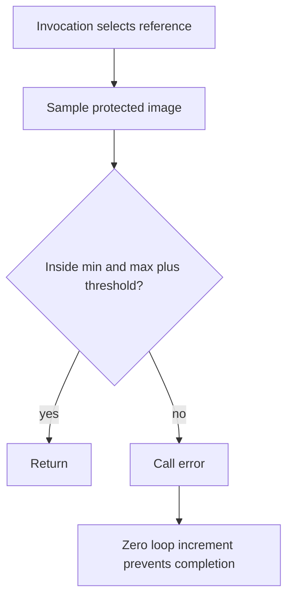

## Overview

**Core question:** Does protected-image sampling produce values allowed by the selected YCbCr reconstruction, range, and color model?

- `vktProtectedMemYCbCrConversionTests.cpp` implements `protected_memory.interaction.ycbcr` across 64 format groups.
- Each case creates a protected sampled image and an immutable sampler YCbCr conversion. Deterministic source planes and host-computed bounds let shaders check conversion without reading protected memory on the host.
- Compute cases validate converted samples directly. Fragment cases render green or red point results to a protected color image, then validate that image with compute.

## Background Knowledge

- A sampler YCbCr conversion attaches format, component mapping, encoded range, color model, chroma locations, reconstruction filter, and explicit-reconstruction state to the sampler and image view. The shader's `texture()` call applies the conversion.
- Chroma-subsampled formats store chroma at lower spatial resolution than luma. Chroma location and reconstruction determine the chroma contribution at a sampled luma coordinate.
- Protected device memory is not host-visible. Protected command buffers and submissions keep source values, rendered results, and validation signals on the device.
- Conversion permits implementation-dependent precision and some reconstruction choices, so the test checks a computed interval instead of one exact vector.

## Registration Hierarchy

```text
protected_memory.interaction.ycbcr
├── a1b5g5r5_unorm_pack16
├── a1r5g5b5_unorm_pack16
├── a2b10g10r10_unorm_pack32
├── a2r10g10b10_unorm_pack32
├── a4b4g4r4_unorm_pack16
├── a4r4g4b4_unorm_pack16
├── a8_unorm
├── a8b8g8r8_unorm_pack32
├── b10g11r11_ufloat_pack32
├── b10x6g10x6r10x6g10x6_422_unorm_4pack16
├── b12x4g12x4r12x4g12x4_422_unorm_4pack16
├── b16g16r16g16_422_unorm
├── b4g4r4a4_unorm_pack16
├── b5g5r5a1_unorm_pack16
├── b5g6r5_unorm_pack16
├── b8g8r8_unorm
├── b8g8r8a8_unorm
├── b8g8r8g8_422_unorm
├── g10x6_b10x6_r10x6_3plane_420_unorm_3pack16
├── g10x6_b10x6_r10x6_3plane_422_unorm_3pack16
├── g10x6_b10x6_r10x6_3plane_444_unorm_3pack16
├── g10x6_b10x6r10x6_2plane_420_unorm_3pack16
├── g10x6_b10x6r10x6_2plane_422_unorm_3pack16
├── g10x6_b10x6r10x6_2plane_444_unorm_3pack16
├── g10x6b10x6g10x6r10x6_422_unorm_4pack16
├── g12x4_b12x4_r12x4_3plane_420_unorm_3pack16
├── g12x4_b12x4_r12x4_3plane_422_unorm_3pack16
├── g12x4_b12x4_r12x4_3plane_444_unorm_3pack16
├── g12x4_b12x4r12x4_2plane_420_unorm_3pack16
├── g12x4_b12x4r12x4_2plane_422_unorm_3pack16
├── g12x4_b12x4r12x4_2plane_444_unorm_3pack16
├── g12x4b12x4g12x4r12x4_422_unorm_4pack16
├── g16_b16_r16_3plane_420_unorm
├── g16_b16_r16_3plane_422_unorm
├── g16_b16_r16_3plane_444_unorm
├── g16_b16r16_2plane_420_unorm
├── g16_b16r16_2plane_422_unorm
├── g16_b16r16_2plane_444_unorm
├── g16b16g16r16_422_unorm
├── g8_b8_r8_3plane_420_unorm
├── g8_b8_r8_3plane_422_unorm
├── g8_b8_r8_3plane_444_unorm
├── g8_b8r8_2plane_420_unorm
├── g8_b8r8_2plane_422_unorm
├── g8_b8r8_2plane_444_unorm
├── g8b8g8r8_422_unorm
├── r10x6_unorm_pack16
├── r10x6g10x6_unorm_2pack16
├── r10x6g10x6b10x6a10x6_unorm_4pack16
├── r12x4_unorm_pack16
├── r12x4g12x4_unorm_2pack16
├── r12x4g12x4b12x4a12x4_unorm_4pack16
├── r16_unorm
├── r16g16_unorm
├── r16g16b16_unorm
├── r16g16b16a16_unorm
├── r4g4_unorm_pack8
├── r4g4b4a4_unorm_pack16
├── r5g5b5a1_unorm_pack16
├── r5g6b5_unorm_pack16
├── r8_unorm
├── r8g8_unorm
├── r8g8b8_unorm
└── r8g8b8a8_unorm
```

Each shader intermediate node contains applicable color-model nodes, then `itu_full` or `itu_narrow`. Leaves combine `tiling_optimal` with `cosited` or `midpoint`, optionally followed by `_disjoint`.

## Parameter Dimensions and Observed Values

| Dimension | Registered values | Meaning in this test | Evidence |
|-----------|-------------------|----------------------|----------|
| Format group | 64 names from `formats::basicUnsignedFloatFormats` | Selects component count and depth, storage layout, subsampling, plane count, image extent, and possible disjoint binding. | [`format loop`](../../../modules/vulkan/protected_memory/vktProtectedMemYCbCrConversionTests.cpp#L1281-L1284) and [`mustpass`](../../../mustpass/main/vk-default/protected-memory.txt) |
| Shader path | `compute`, `fragment` | Selects direct validation or point rendering followed by compute validation. | [`shader types`](../../../modules/vulkan/protected_memory/vktProtectedMemYCbCrConversionTests.cpp#L1234-L1238) |
| Color model | `rgb_identity`, `ycbcr_identity`, `ycbcr_709`, `ycbcr_601`, `ycbcr_2020` | Selects the conversion and forms the main behavioral axis. | [`color models`](../../../modules/vulkan/protected_memory/vktProtectedMemYCbCrConversionTests.cpp#L1261-L1269) |
| Encoded range | `itu_full`, `itu_narrow` | Selects full or narrow range expansion. | [`ranges`](../../../modules/vulkan/protected_memory/vktProtectedMemYCbCrConversionTests.cpp#L1255-L1256) |
| Chroma location | `cosited`, `midpoint` | Uses the same location in X and Y. | [`locations`](../../../modules/vulkan/protected_memory/vktProtectedMemYCbCrConversionTests.cpp#L1258-L1259) |
| Plane binding | no suffix, `_disjoint` | Selects ordinary or per-plane memory binding. | [`disjoint loop`](../../../modules/vulkan/protected_memory/vktProtectedMemYCbCrConversionTests.cpp#L1325-L1337) |
| Fixed choices | `tiling_optimal`, nearest filters, clamp-to-edge U/V, identity mapping | Holds tiling, filtering, addressing, and swizzle constant. | [`case construction`](../../../modules/vulkan/protected_memory/vktProtectedMemYCbCrConversionTests.cpp#L1271-L1279) and [`configuration`](../../../modules/vulkan/protected_memory/vktProtectedMemYCbCrConversionTests.cpp#L1328-L1332) |

The Vulkan mustpass list contains 4,000 leaves; the Vulkan SC list contains 3,952. Registration omits non-identity models for formats with fewer than three channels and omits narrow range when any first-three component depth is below eight.

## Behavior Parameters

The color-model intermediate node is the primary behavioral axis. Other dimensions extend representation and execution coverage around it.

### `rgb_identity`: preserve RGB-model values

Sampling applies component interpretation and reconstruction without YCbCr range expansion or a YCbCr-to-RGB matrix.

### `ycbcr_identity`: expand range without a model matrix

Sampling treats components as YCbCr and applies the selected range expansion, but no BT.601, BT.709, or BT.2020 matrix.

### `ycbcr_709`: apply BT.709 conversion

Sampling reconstructs chroma, expands the selected range, and applies the BT.709 model.

### `ycbcr_601`: apply BT.601 conversion

This value uses the BT.601 model. The execution structure stays the same while expected bounds change.

### `ycbcr_2020`: apply BT.2020 conversion

This value uses the BT.2020 model. Comparison with nearby cases helps separate model-specific behavior from common protected sampling.

## Shader Analysis

The compute path is representative because one shader contains the conversion-bearing sample, bounds check, and protected timeout signal. The fragment path adds graphics output and a second validation pass.

### Representative Shader Walkthrough 1

#### Parameter Values Chosen

Representative path:

```text
dEQP-VK.protected_memory.interaction.ycbcr.g8_b8r8_2plane_420_unorm.compute.ycbcr_709.itu_full.tiling_optimal_cosited_disjoint
```

| Parameter choice | Meaning in this representative case |
|------------------|-------------------------------------|
| `g8_b8r8_2plane_420_unorm` | Uses an 8-bit, two-plane 4:2:0 format. |
| `compute` | Samples and validates in one compute dispatch. |
| `ycbcr_709`, `itu_full` | Applies full-range expansion and BT.709 conversion. |
| `tiling_optimal_cosited_disjoint` | Uses optimal tiling, cosited chroma, and separately bound planes. |

#### Purpose

The shader checks 50 protected-image samples against host-computed intervals. Its `texture()` operation applies reconstruction and conversion through the immutable sampler.

#### Structural Design



#### Shader Code

```glsl
#version 450

layout(constant_id = 1) const float threshold = 0.01f;
/// Binding 0 is the protected sampled image and immutable YCbCr conversion sampler.
layout(set = 0, binding = 0) uniform highp sampler2D protectedImage;

struct validationData {
    highp vec4 imageCoord;
    highp vec4 imageRefMinBound;
    highp vec4 imageRefMaxBound;
};
/// Binding 1 contains host-computed coordinates and acceptable converted-value bounds.
layout(std140, set = 0, binding = 1) uniform Data
{
    validationData ref[250];
};

/// Binding 2 is protected. A mismatch enters error(), whose zero increment prevents completion.
layout(std140, set = 0, binding = 2) buffer ProtectedHelper
{
    highp uint zero;
    highp uint unusedOut;
} helper;

void error()
{
    for (uint x = 0u; x < 10u; x += helper.zero)
        atomicAdd(helper.unusedOut, 1u);
}

bool compare(highp vec4 value, highp vec4 minValue, highp vec4 maxValue)
{
    return all(greaterThanEqual(value, minValue - threshold)) && all(lessThanEqual(value, maxValue + threshold));
}

void main(void)
{
    /// One invocation samples one coordinate. The immutable sampler applies reconstruction, range expansion, and model conversion.
    int idx = int(gl_GlobalInvocationID.x);
    vec4 currentValue = texture(protectedImage, ref[idx].imageCoord.xy);
    /// Bounds include format precision and permitted reconstruction behavior; threshold adds 0.01 per component.
    if (!compare(currentValue, ref[idx].imageRefMinBound, ref[idx].imageRefMaxBound))
    {
      error();
    }
}
```

#### Additional Info

- The source supplies no explicit `ShaderBuildOptions`, so the `SourceCollections` baseline target is SPIR-V 1.0.
- The shader declares a 250-entry reference array, but the host uploads only the generated coordinate/bound records; the validator dispatches 50 workgroups.
- Disjoint binding changes image creation and memory binding, not GLSL.

#### Parameter Variation Summary

| Parameter dimension | Shader-level variation from this shader | Evidence |
|---------------------|---------------------------------------|----------|
| Shader path | `fragment` moves sampling and comparison into the fragment shader, writes green or red, and later validates the color image. | [`fragment generation`](../../../modules/vulkan/protected_memory/vktProtectedMemYCbCrConversionTests.cpp#L662-L737) |
| Format | GLSL stays `sampler2D`; host image and conversion state change plane layout, bit depth, subsampling, and descriptor use. | [`setup`](../../../modules/vulkan/protected_memory/vktProtectedMemYCbCrConversionTests.cpp#L1119-L1155) |
| Model and range | GLSL stays unchanged; immutable conversion state and host bounds carry these choices. | [`conversion`](../../../modules/vulkan/protected_memory/vktProtectedMemYCbCrConversionTests.cpp#L1124-L1130) and [`bounds`](../../../modules/vulkan/protected_memory/vktProtectedMemYCbCrConversionTests.cpp#L1001-L1007) |
| Chroma location | GLSL stays unchanged; conversion and reference reconstruction use the selected location. | [`registration`](../../../modules/vulkan/protected_memory/vktProtectedMemYCbCrConversionTests.cpp#L1319-L1337) |
| Disjoint binding | Shader resources stay unchanged; image flags and allocation select per-plane binding. | [`image flags`](../../../modules/vulkan/protected_memory/vktProtectedMemYCbCrConversionTests.cpp#L1119-L1123) |

#### SPIR-V

- Status: generated and validated
- Source: reconstructed `GLSL` from this walkthrough
- Stage: `comp`
- Target SPIRV version: `spirv1.0`

<details>
<summary>Click to expand SPIRV asm code</summary>

```llvm
; SPIR-V
; Version: 1.0
; Generator: Khronos Glslang Reference Front End; 11
; Bound: 108
; Schema: 0
               OpCapability Shader
          %1 = OpExtInstImport "GLSL.std.450"
               OpMemoryModel Logical GLSL450
               OpEntryPoint GLCompute %main "main" %gl_GlobalInvocationID
               OpExecutionMode %main LocalSize 1 1 1
               OpSource GLSL 450
               OpName %main "main"
               OpName %error_ "error("
               OpName %compare_vf4_vf4_vf4_ "compare(vf4;vf4;vf4;"
               OpName %value "value"
               OpName %minValue "minValue"
               OpName %maxValue "maxValue"
               OpName %x "x"
               OpName %ProtectedHelper "ProtectedHelper"
               OpMemberName %ProtectedHelper 0 "zero"
               OpMemberName %ProtectedHelper 1 "unusedOut"
               OpName %helper "helper"
               OpName %threshold "threshold"
               OpName %idx "idx"
               OpName %gl_GlobalInvocationID "gl_GlobalInvocationID"
               OpName %currentValue "currentValue"
               OpName %protectedImage "protectedImage"
               OpName %validationData "validationData"
               OpMemberName %validationData 0 "imageCoord"
               OpMemberName %validationData 1 "imageRefMinBound"
               OpMemberName %validationData 2 "imageRefMaxBound"
               OpName %Data "Data"
               OpMemberName %Data 0 "ref"
               OpName %_ ""
               OpName %param "param"
               OpName %param_0 "param"
               OpName %param_1 "param"
               OpDecorate %ProtectedHelper BufferBlock
               OpMemberDecorate %ProtectedHelper 0 Offset 0
               OpMemberDecorate %ProtectedHelper 1 Offset 4
               OpDecorate %helper Binding 2
               OpDecorate %helper DescriptorSet 0
               OpDecorate %threshold SpecId 1
               OpDecorate %gl_GlobalInvocationID BuiltIn GlobalInvocationId
               OpDecorate %protectedImage Binding 0
               OpDecorate %protectedImage DescriptorSet 0
               OpMemberDecorate %validationData 0 Offset 0
               OpMemberDecorate %validationData 1 Offset 16
               OpMemberDecorate %validationData 2 Offset 32
               OpDecorate %_arr_validationData_uint_250 ArrayStride 48
               OpDecorate %Data Block
               OpMemberDecorate %Data 0 Offset 0
               OpDecorate %_ Binding 1
               OpDecorate %_ DescriptorSet 0
       %void = OpTypeVoid
          %3 = OpTypeFunction %void
      %float = OpTypeFloat 32
    %v4float = OpTypeVector %float 4
%_ptr_Function_v4float = OpTypePointer Function %v4float
       %bool = OpTypeBool
         %12 = OpTypeFunction %bool %_ptr_Function_v4float %_ptr_Function_v4float %_ptr_Function_v4float
       %uint = OpTypeInt 32 0
%_ptr_Function_uint = OpTypePointer Function %uint
     %uint_0 = OpConstant %uint 0
    %uint_10 = OpConstant %uint 10
%ProtectedHelper = OpTypeStruct %uint %uint
%_ptr_Uniform_ProtectedHelper = OpTypePointer Uniform %ProtectedHelper
     %helper = OpVariable %_ptr_Uniform_ProtectedHelper Uniform
        %int = OpTypeInt 32 1
      %int_1 = OpConstant %int 1
%_ptr_Uniform_uint = OpTypePointer Uniform %uint
     %uint_1 = OpConstant %uint 1
      %int_0 = OpConstant %int 0
  %threshold = OpSpecConstant %float 0.00999999978
     %v4bool = OpTypeVector %bool 4
%_ptr_Function_int = OpTypePointer Function %int
     %v3uint = OpTypeVector %uint 3
%_ptr_Input_v3uint = OpTypePointer Input %v3uint
%gl_GlobalInvocationID = OpVariable %_ptr_Input_v3uint Input
%_ptr_Input_uint = OpTypePointer Input %uint
         %73 = OpTypeImage %float 2D 0 0 0 1 Unknown
         %74 = OpTypeSampledImage %73
%_ptr_UniformConstant_74 = OpTypePointer UniformConstant %74
%protectedImage = OpVariable %_ptr_UniformConstant_74 UniformConstant
%validationData = OpTypeStruct %v4float %v4float %v4float
   %uint_250 = OpConstant %uint 250
%_arr_validationData_uint_250 = OpTypeArray %validationData %uint_250
       %Data = OpTypeStruct %_arr_validationData_uint_250
%_ptr_Uniform_Data = OpTypePointer Uniform %Data
          %_ = OpVariable %_ptr_Uniform_Data Uniform
    %v2float = OpTypeVector %float 2
%_ptr_Uniform_v4float = OpTypePointer Uniform %v4float
    %float_0 = OpConstant %float 0
      %int_2 = OpConstant %int 2
       %main = OpFunction %void None %3
          %5 = OpLabel
        %idx = OpVariable %_ptr_Function_int Function
%currentValue = OpVariable %_ptr_Function_v4float Function
      %param = OpVariable %_ptr_Function_v4float Function
    %param_0 = OpVariable %_ptr_Function_v4float Function
    %param_1 = OpVariable %_ptr_Function_v4float Function
         %69 = OpAccessChain %_ptr_Input_uint %gl_GlobalInvocationID %uint_0
         %70 = OpLoad %uint %69
         %71 = OpBitcast %int %70
               OpStore %idx %71
         %77 = OpLoad %74 %protectedImage
         %84 = OpLoad %int %idx
         %87 = OpAccessChain %_ptr_Uniform_v4float %_ %int_0 %84 %int_0
         %88 = OpLoad %v4float %87
         %89 = OpVectorShuffle %v2float %88 %88 0 1
         %91 = OpImageSampleExplicitLod %v4float %77 %89 Lod %float_0
               OpStore %currentValue %91
         %92 = OpLoad %int %idx
         %93 = OpLoad %int %idx
         %96 = OpLoad %v4float %currentValue
               OpStore %param %96
         %98 = OpAccessChain %_ptr_Uniform_v4float %_ %int_0 %92 %int_1
         %99 = OpLoad %v4float %98
               OpStore %param_0 %99
        %101 = OpAccessChain %_ptr_Uniform_v4float %_ %int_0 %93 %int_2
        %102 = OpLoad %v4float %101
               OpStore %param_1 %102
        %103 = OpFunctionCall %bool %compare_vf4_vf4_vf4_ %param %param_0 %param_1
        %104 = OpLogicalNot %bool %103
               OpSelectionMerge %106 None
               OpBranchConditional %104 %105 %106
        %105 = OpLabel
        %107 = OpFunctionCall %void %error_
               OpBranch %106
        %106 = OpLabel
               OpReturn
               OpFunctionEnd
     %error_ = OpFunction %void None %3
          %7 = OpLabel
          %x = OpVariable %_ptr_Function_uint Function
               OpStore %x %uint_0
               OpBranch %22
         %22 = OpLabel
               OpLoopMerge %24 %25 None
               OpBranch %26
         %26 = OpLabel
         %27 = OpLoad %uint %x
         %29 = OpULessThan %bool %27 %uint_10
               OpBranchConditional %29 %23 %24
         %23 = OpLabel
         %36 = OpAccessChain %_ptr_Uniform_uint %helper %int_1
         %38 = OpAtomicIAdd %uint %36 %uint_1 %uint_0 %uint_1
               OpBranch %25
         %25 = OpLabel
         %40 = OpAccessChain %_ptr_Uniform_uint %helper %int_0
         %41 = OpLoad %uint %40
         %42 = OpLoad %uint %x
         %43 = OpIAdd %uint %42 %41
               OpStore %x %43
               OpBranch %22
         %24 = OpLabel
               OpReturn
               OpFunctionEnd
%compare_vf4_vf4_vf4_ = OpFunction %bool None %12
      %value = OpFunctionParameter %_ptr_Function_v4float
   %minValue = OpFunctionParameter %_ptr_Function_v4float
   %maxValue = OpFunctionParameter %_ptr_Function_v4float
         %17 = OpLabel
         %44 = OpLoad %v4float %value
         %45 = OpLoad %v4float %minValue
         %47 = OpCompositeConstruct %v4float %threshold %threshold %threshold %threshold
         %48 = OpFSub %v4float %45 %47
         %50 = OpFOrdGreaterThanEqual %v4bool %44 %48
         %51 = OpAll %bool %50
               OpSelectionMerge %53 None
               OpBranchConditional %51 %52 %53
         %52 = OpLabel
         %54 = OpLoad %v4float %value
         %55 = OpLoad %v4float %maxValue
         %56 = OpCompositeConstruct %v4float %threshold %threshold %threshold %threshold
         %57 = OpFAdd %v4float %55 %56
         %58 = OpFOrdLessThanEqual %v4bool %54 %57
         %59 = OpAll %bool %58
               OpBranch %53
         %53 = OpLabel
         %60 = OpPhi %bool %51 %17 %59 %52
               OpReturnValue %60
               OpFunctionEnd
```

</details>

## Runtime Execution and Result Checking

- `checkSupport()` requires protected context support with compute capability, then checks conversion, sampling, chroma location, reconstruction, and disjoint format features.
- The case creates a protected transfer-destination and sampled image. Width is 12 for horizontal subsampling and 7 otherwise; height is 8 for vertical subsampling and 13 otherwise.
- `generateYCbCrImage()` fills channels with deterministic gradients and calls `ycbcr::calculateBounds()` using format precision, sub-texel precision, filters, model, range, chroma locations, mapping, and address modes.
- For nearest implicit reconstruction with cosited chroma, the source also calculates midpoint bounds and widens the accepted interval.
- `uploadYCbCrImage()` uses one host-visible staging buffer per plane, copies each plane, and transitions the protected image for shader reads.
- The conversion object is attached to the sampler and image view. The descriptor pool reserves the queried `combinedImageSamplerDescriptorCount`.
- Compute cases validate the YCbCr image directly. Fragment cases render one point per coordinate to a protected RGBA8 image, transition it for sampling, and validate 50 positions for green.
- Validation uploads coordinates and bounds to a host-visible uniform and creates a protected helper buffer. A reset dispatch writes both helper words to zero.
- The validator dispatches 50 workgroups. A mismatch enters a loop whose zero increment prevents completion. Timeout returns failure; other queue errors propagate through `VK_CHECK`.
- The final check covers 50 coordinates. Fragment rendering can produce more pixels, so it does not independently inspect every rendered point.

## Failure Meaning

### Failure Cause Mapping

| If this behavior parameter value fails | Possible failure cause(s) |
|----------------------------------------|---------------------------|
| `rgb_identity` | Protected sampling, component interpretation, filtering or reconstruction, descriptor setup, or bounds validation failed while source values should remain in the RGB model. |
| `ycbcr_identity` | Protected sampling, YCbCr range expansion, component interpretation, reconstruction, descriptor setup, or bounds validation failed without a YCbCr-to-RGB matrix conversion. |
| `ycbcr_709` | Protected sampling, BT.709 range/model conversion, chroma reconstruction, descriptor setup, or bounds validation failed. |
| `ycbcr_601` | Protected sampling, BT.601 range/model conversion, chroma reconstruction, descriptor setup, or bounds validation failed. |
| `ycbcr_2020` | Protected sampling, BT.2020 range/model conversion, chroma reconstruction, descriptor setup, or bounds validation failed. |

### Cause Analysis

#### Image creation, binding, and plane upload

**Possible failure symptoms:** Failures cluster on multi-planar or `_disjoint` leaves, or both shader paths sample values outside their intervals.

**Possible implementation causes:** Protected allocation, per-plane binding, plane extents, copies, aspect selection, or transfer-to-shader visibility may be wrong. Isolation needs the failing format, binding mode, and Vulkan result.

#### Reconstruction, range, and model conversion

**Possible failure symptoms:** Cases fail only for one chroma location, range, or color model.

**Possible implementation causes:** Chroma selection, nearest reconstruction, range expansion, or model coefficients may be wrong. Comparison with adjacent cases is needed before assigning one cause.

#### Sampler, image view, and descriptors

**Possible failure symptoms:** Multi-planar formats fail broadly, or descriptor creation/update returns an error.

**Possible implementation causes:** Sampler and view conversion state may differ, descriptor consumption may be wrong, or the descriptor may reference the wrong view or layout.

#### Compute and fragment paths

**Possible failure symptoms:** A compute-only failure affects direct sampling; a fragment-only failure appears during point rendering or color-image validation.

**Possible implementation causes:** Stage sampling, graphics setup, protected attachment writes, image visibility, or second-stage validation may be wrong. The path comparison narrows but does not prove the cause.

#### Bounds and timeout validation

**Possible failure symptoms:** The submission times out after a mismatch, or another queue error prevents a result.

**Possible implementation causes:** Coordinates, intervals, uniform layout, threshold, descriptor bindings, helper reset, or mismatch loop may be wrong. Diagnosis needs logged bounds and the queue result.

## Case Pruning

### Requirement-based pruning

- Cases require protected memory, a protected-capable compute queue, and sampler YCbCr conversion support.
- The format must support optimal-tiling YCbCr conversion and sampled-image use.
- Subsampled dimensions require the selected cosited or midpoint format feature.
- `_disjoint` requires `VK_FORMAT_FEATURE_DISJOINT_BIT`.
- Required or forced explicit reconstruction must have matching feature support.

### Design-based pruning

- Registration uses 64 names from `basicUnsignedFloatFormats`, not arbitrary formats.
- Formats with fewer than three channels receive only `rgb_identity`.
- `itu_narrow` is omitted when any first-three component depth is below eight.
- Only optimal tiling, nearest filters, clamp-to-edge addressing, and identity mapping are registered.
- X and Y chroma locations always match; mixed pairs are absent.
- Validation fixes its sample count at 50 and threshold at `0.01`.

## Key Takeaways

- The color-model node is the behavioral axis because it selects identity, BT.709, BT.601, or BT.2020 conversion.
- Conversion happens inside `texture()` through matching sampler and image-view state; GLSL contains no explicit YCbCr arithmetic.
- Host bounds account for precision and permitted reconstruction. Device shaders compare protected samples with those intervals.
- Compute validates directly; fragment renders protected comparison results and validates 50 positions in a second pass.
- Compare neighboring model, range, location, format, binding, and shader-path cases before attributing a failure.

## Source Reference Appendix

| Entry point | Link | Why it matters |
|-------------|------|----------------|
| Configuration and support | [`TestConfig` and `checkSupport()`](../../../modules/vulkan/protected_memory/vktProtectedMemYCbCrConversionTests.cpp#L100-L217) | Defines state and support pruning. |
| Conversion objects | [`creation helpers`](../../../modules/vulkan/protected_memory/vktProtectedMemYCbCrConversionTests.cpp#L219-L297) | Builds matching conversion state. |
| Plane upload | [`uploadYCbCrImage()`](../../../modules/vulkan/protected_memory/vktProtectedMemYCbCrConversionTests.cpp#L299-L414) | Copies planes and records transitions. |
| Validation | [`validateImage()`](../../../modules/vulkan/protected_memory/vktProtectedMemYCbCrConversionTests.cpp#L458-L583) | Dispatches validation and interprets timeout. |
| Shader generation | [`testShaders()`](../../../modules/vulkan/protected_memory/vktProtectedMemYCbCrConversionTests.cpp#L585-L738) | Emits compute and fragment checks. |
| Fragment path | [`renderYCbCrToColor()`](../../../modules/vulkan/protected_memory/vktProtectedMemYCbCrConversionTests.cpp#L781-L932) | Renders and transitions protected results. |
| Reference generation | [`generateYCbCrImage()`](../../../modules/vulkan/protected_memory/vktProtectedMemYCbCrConversionTests.cpp#L934-L1092) | Generates source values and intervals. |
| Case execution | [`conversionTest()`](../../../modules/vulkan/protected_memory/vktProtectedMemYCbCrConversionTests.cpp#L1094-L1226) | Connects resources and path validation. |
| Registration | [`createYCbCrConversionTests()`](../../../modules/vulkan/protected_memory/vktProtectedMemYCbCrConversionTests.cpp#L1230-L1353) | Generates the matrix. |
| Protected memory | [`memory.adoc`](../../../../vulkan-docs/src/chapters/memory.adoc#L5564-L5653) | Defines visibility and protected operations. |
| YCbCr conversion | [`samplers.adoc`](../../../../vulkan-docs/src/chapters/samplers.adoc#L773-L1095) | Defines conversion state and models. |
| Descriptor count | [`capabilities.adoc`](../../../../vulkan-docs/src/chapters/capabilities.adoc#L935-L971) | Defines multi-planar descriptor consumption. |
| Vulkan coverage | [`vk-default/protected-memory.txt`](../../../mustpass/main/vk-default/protected-memory.txt) | Contains 4,000 family leaves. |
| Vulkan SC coverage | [`vksc-default/protected-memory.txt`](../../../mustpass/main/vksc-default/protected-memory.txt) | Contains 3,952 family leaves. |
