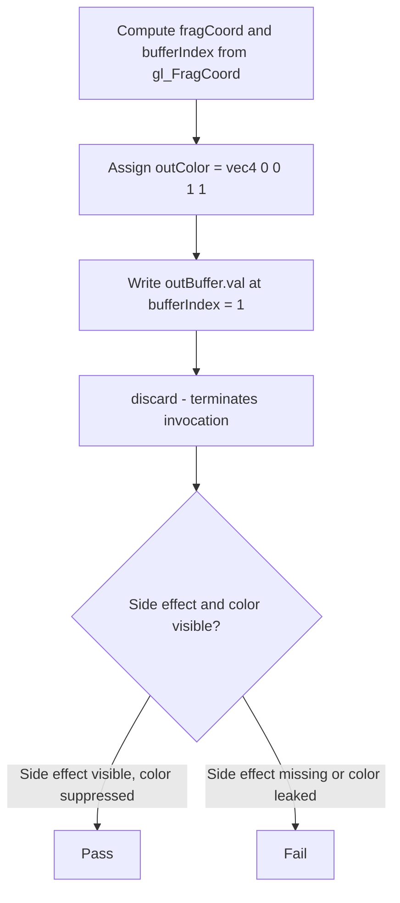
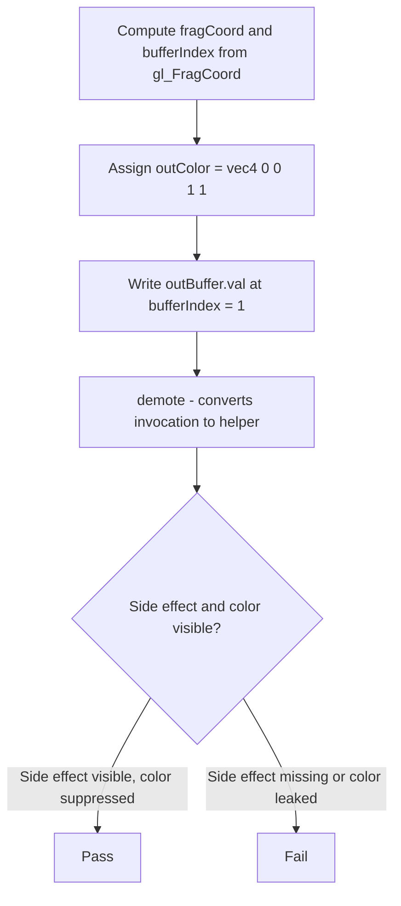
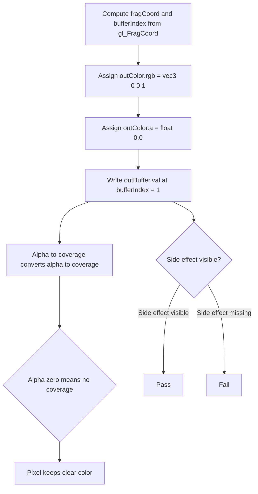

## Overview

**Core question:** Does the implementation keep a fragment-shader storage-buffer write live when every
subsequent color-output suppression mechanism (kill, demote, terminate, sample mask, stencil/depth rejection,
alpha-to-coverage, depth bounds) is exercised, regardless of whether the color assignment appears before or
after the side effect?

- [`vktRasterizationFragShaderSideEffectsTests.cpp`](../../../modules/vulkan/rasterization/vktRasterizationFragShaderSideEffectsTests.cpp#L1) implements the `frag_side_effects` test family through [`createFragSideEffectsTests()`](../../../modules/vulkan/rasterization/vktRasterizationFragShaderSideEffectsTests.cpp#L684-L777).
- The family has two direct color-order children (`color_at_beginning`, `color_at_end`), each holding the
  same 10 case-type leaves: `kill`, `demote`, `terminate_invocation`, `sample_mask_before`, `sample_mask_after`,
  `stencil_never`, `depth_never`, `alpha_coverage_before`, `alpha_coverage_after`, `depth_bounds`.
- The core test idea is that fragment-shader side effects (a per-pixel SSBO write of `1`) must remain observable
  even when the color output is suppressed by later pipeline stages.
- The page covers the implemented test logic, the parameter matrix, representative shader walkthroughs, the
  host-side result checking, failure meaning, and the requirement and design pruning that shapes the matrix.

## Background Knowledge

- **Fragment-shader side effects versus color output visibility.** A fragment shader may execute stores and
  atomics to storage buffers, storage images, or other non-color storage. Whether the per-fragment color
  survives `OpKill`, sample mask, stencil/depth/depth-bounds rejection, or alpha-to-coverage does not change
  the fact that the shader executed and its side effects must be visible to the host after the pipeline
  completes. This independence is the property under test.
- **Helper invocation and `demote`.** See the category-level [Background Knowledge](../../categories/rasterization.md#background-knowledge) for helper invocations. `VK_EXT_shader_demote_to_helper_invocation` introduces `OpDemoteToHelperInvocation` (GLSL `demote`), which converts the current invocation to a helper invocation. This differs from `OpKill`/`discard`, which terminates the invocation.
- **`terminateInvocation` versus `OpKill`.** `VK_KHR_shader_terminate_invocation` introduces
  `OpTerminateInvocation` (GLSL `terminateInvocation`). Like `OpKill`, it ends the invocation immediately, but
  the spec restricts it from affecting derivative computations or other invocations' execution. For
  side-effect purposes, both stop the invocation, so any side effect performed before the terminating
  instruction must remain visible.
- **Per-fragment tests that suppress color output.** Sample mask written to zero in the fragment shader
  removes per-sample coverage; with `VK_SAMPLE_COUNT_1_BIT`, this means no color output for that pixel.
  Stencil test (`VK_COMPARE_OP_NEVER`) and depth test (`VK_COMPARE_OP_NEVER`) reject fragments before color
  blending/output. Depth bounds test compares the framebuffer depth value against
  `[minDepthBounds, maxDepthBounds]`.
- **Alpha-to-coverage.** Alpha-to-coverage converts the fragment's alpha value into a temporary coverage
  mask. With alpha `0.0`, no samples are covered, so the pixel keeps the clear color. The per-pixel coverage
  outcome is implementation-dependent, so the host accepts either the clear color or the draw color as a valid
  color attachment outcome for these cases.

## Registration Hierarchy

```text
rasterization.frag_side_effects
├── color_at_beginning
└── color_at_end
```

Each color-order child holds the same 10 case-type leaves listed in `## Behavior Parameters` below.

## Parameter Dimensions and Observed Values

| Dimension | Registered values | Meaning in this test | Evidence |
|-----------|-------------------|----------------------|----------|
| Color-output placement | `color_at_beginning`, `color_at_end` | Selects whether the `outColor` assignment is emitted before or after the SSBO write in the generated fragment shader. Catches implementations that move or elide the side effect relative to the color write. | [kColorOrders[]](../../../modules/vulkan/rasterization/vktRasterizationFragShaderSideEffectsTests.cpp#L692-L701) |
| Case type | `kill`, `demote`, `terminate_invocation`, `sample_mask_before`, `sample_mask_after`, `stencil_never`, `depth_never`, `alpha_coverage_before`, `alpha_coverage_after`, `depth_bounds` | Selects which color-output suppression mechanism is exercised. Each value is a distinct failure mechanism. | [case-type registration](../../../modules/vulkan/rasterization/vktRasterizationFragShaderSideEffectsTests.cpp#L708-L770) |
| Clear color | `(0.0, 0.0, 0.0, 1.0)` | The render-pass clear value used as the expected color attachment outcome for all non-alpha-coverage cases. | [kDefaultClearColor](../../../modules/vulkan/rasterization/vktRasterizationFragShaderSideEffectsTests.cpp#L688) |
| Draw color | `(0.0, 0.0, 1.0, 1.0)` for most cases; `(0.0, 0.0, 1.0, 0.0)` for alpha-coverage cases | The fragment shader's `outColor` assignment. The alpha-zero variant forces alpha-to-coverage to produce no coverage. | [kDefaultDrawColor](../../../modules/vulkan/rasterization/vktRasterizationFragShaderSideEffectsTests.cpp#L689), [alpha-coverage drawColor](../../../modules/vulkan/rasterization/vktRasterizationFragShaderSideEffectsTests.cpp#L751) |
| Depth-bounds parameters | min `0.25`, max `0.5`, mesh depth `0.75` | Used only by the `depth_bounds` case. The mesh depth is intentionally outside the bounds so the depth-bounds test rejects the fragment after shader execution. | [DepthBoundsParameters](../../../modules/vulkan/rasterization/vktRasterizationFragShaderSideEffectsTests.cpp#L765-L768) |
| Framebuffer extent | 32 x 32 (`kFramebufferWidth`, `kFramebufferHeight`) | One SSBO int32 slot per framebuffer pixel; 1024 entries total. | [kFramebufferWidth/Height](../../../modules/vulkan/rasterization/vktRasterizationFragShaderSideEffectsTests.cpp#L72-L73) |
| Color format | `VK_FORMAT_R8G8B8A8_UNORM` | Color attachment format used for the result image and its readback buffer. | [kColorFormat](../../../modules/vulkan/rasterization/vktRasterizationFragShaderSideEffectsTests.cpp#L76) |
| Depth/stencil formats | `VK_FORMAT_D32_SFLOAT_S8_UINT`, `VK_FORMAT_D24_UNORM_S8_UINT` | Tried in order; the first one with `VK_FORMAT_FEATURE_DEPTH_STENCIL_ATTACHMENT_BIT` is used for cases that need a depth/stencil attachment. | [kDepthStencilFormats](../../../modules/vulkan/rasterization/vktRasterizationFragShaderSideEffectsTests.cpp#L79) |

## Behavior Parameters

The primary behavioral axis is the **case-type leaf**. Each case type exercises a materially different
suppression mechanism for the fragment color output; the color-order direct child is a secondary axis that
varies only the relative position of the `outColor` assignment. The 10 case-type leaves are listed below.

### kill — `discard` after SSBO write

The `kill` case emits `discard;` after the SSBO write. `discard` lowers to `OpKill`, which terminates the
fragment invocation. The test asserts that the prior SSBO write remains observable and that no color output is
produced for the discarded pixels [vktRasterizationFragShaderSideEffectsTests.cpp](../../../modules/vulkan/rasterization/vktRasterizationFragShaderSideEffectsTests.cpp#L224-L226).

### demote — `demote` after SSBO write

The `demote` case emits `demote;` after the SSBO write, requiring `VK_EXT_shader_demote_to_helper_invocation`.
`demote` lowers to `OpDemoteToHelperInvocation`, which converts the invocation to a helper invocation. The
shader continues executing, but its color and depth outputs are discarded. Stores and atomics performed by
demoted invocations remain visible [vktRasterizationFragShaderSideEffectsTests.cpp](../../../modules/vulkan/rasterization/vktRasterizationFragShaderSideEffectsTests.cpp#L227-L229).

### terminate_invocation — `terminateInvocation` after SSBO write

The `terminate_invocation` case emits `terminateInvocation;` after the SSBO write, requiring
`VK_KHR_shader_terminate_invocation`. `terminateInvocation` lowers to `OpTerminateInvocation`, which ends the
invocation immediately but is restricted from affecting derivative computations or other invocations. The
prior SSBO write must remain visible [vktRasterizationFragShaderSideEffectsTests.cpp](../../../modules/vulkan/rasterization/vktRasterizationFragShaderSideEffectsTests.cpp#L231-L233).

### sample_mask_before — `gl_SampleMask[0] = 0` before SSBO write

The `sample_mask_before` case emits `gl_SampleMask[0] = 0;` before the SSBO write. With
`VK_SAMPLE_COUNT_1_BIT`, this removes the only sample's coverage, so the pixel keeps the clear color. The
shader still executes the SSBO write after the mask assignment
[vktRasterizationFragShaderSideEffectsTests.cpp](../../../modules/vulkan/rasterization/vktRasterizationFragShaderSideEffectsTests.cpp#L235-L236).

### sample_mask_after — `gl_SampleMask[0] = 0` after SSBO write

The `sample_mask_after` case emits `gl_SampleMask[0] = 0;` after the SSBO write. Same suppression effect as
`sample_mask_before`, but the mask assignment happens after the side effect. Catches implementations that
might treat the post-side-effect mask as a reason to skip the prior write
[vktRasterizationFragShaderSideEffectsTests.cpp](../../../modules/vulkan/rasterization/vktRasterizationFragShaderSideEffectsTests.cpp#L237-L239).

### stencil_never — SSBO write with stencil test never passing

The `stencil_never` case enables the stencil test with `VK_COMPARE_OP_NEVER` for both front and back faces.
The stencil test always fails, so no color output is produced. The shader still executes and writes the SSBO
[vktRasterizationFragShaderSideEffectsTests.cpp](../../../modules/vulkan/rasterization/vktRasterizationFragShaderSideEffectsTests.cpp#L520-L523).

### depth_never — SSBO write with depth test never passing

The `depth_never` case enables the depth test with `VK_COMPARE_OP_NEVER`. The depth test always fails, so no
color output is produced. The shader still executes and writes the SSBO
[vktRasterizationFragShaderSideEffectsTests.cpp](../../../modules/vulkan/rasterization/vktRasterizationFragShaderSideEffectsTests.cpp#L518-L519).

### alpha_coverage_before — alpha-to-coverage with alpha zero before SSBO write

The `alpha_coverage_before` case enables `alphaToCoverageEnable` in the multisample state and assigns
`outColor.a = 0.0` before the SSBO write. With alpha `0.0`, alpha-to-coverage produces no coverage, so the
pixel keeps the clear color. The host accepts either the clear color or the draw color as a valid color
attachment outcome because the per-pixel coverage is implementation-dependent
[vktRasterizationFragShaderSideEffectsTests.cpp](../../../modules/vulkan/rasterization/vktRasterizationFragShaderSideEffectsTests.cpp#L241-L242).

### alpha_coverage_after — alpha-to-coverage with alpha zero after SSBO write

The `alpha_coverage_after` case is the same as `alpha_coverage_before` but assigns `outColor.a = 0.0` after
the SSBO write. Catches implementations that might treat the post-side-effect alpha assignment as a reason to
skip the prior write [vktRasterizationFragShaderSideEffectsTests.cpp](../../../modules/vulkan/rasterization/vktRasterizationFragShaderSideEffectsTests.cpp#L243-L245).

### depth_bounds — SSBO write with depth bounds test failing

The `depth_bounds` case enables the depth bounds test with bounds `[0.25, 0.5]` and uses mesh depth `0.75`,
which is intentionally outside the bounds. The depth bounds test fails after shader execution, so no color
output is produced [vktRasterizationFragShaderSideEffectsTests.cpp](../../../modules/vulkan/rasterization/vktRasterizationFragShaderSideEffectsTests.cpp#L515, #L765-L768).

## Shader Analysis

The shaders are generated as GLSL strings from the `caseType` and `colorAtEnd` parameters in
[`FragSideEffectsTestCase::initPrograms()`](../../../modules/vulkan/rasterization/vktRasterizationFragShaderSideEffectsTests.cpp#L184-L270).
Three walkthroughs are used: `kill` as the default (the simplest suppression mechanism), `demote` (requires
an extension and uses a different SPIR-V opcode), and `alpha_coverage_before` (uses a different color
statement structure and a different multisample state). Ordinary parameter differences across the other
case types are summarized in the variation tables.

### Representative Shader Walkthrough 1

#### Parameter Values Chosen

Representative path:

```text
dEQP-VK.rasterization.frag_side_effects.color_at_beginning.kill
```

| Parameter choice | Meaning in this representative case |
|------------------|-------------------------------------|
| `color_at_beginning` | The `outColor` assignment is emitted before the SSBO write, so the side effect is the last shader action before `discard`. |
| `kill` | The case emits `discard;` after the SSBO write. `discard` lowers to `OpKill`, which terminates the fragment invocation. |
| Default clear/draw colors | The clear color is `(0, 0, 0, 1)` and the draw color is `(0, 0, 1, 1)`. The expected color attachment outcome is the clear color, since `discard` suppresses color output. |
| No depth-bounds parameters | The mesh depth defaults to `0.0`, and no depth bounds test is enabled. |

#### Purpose

This shader checks that a fragment-shader SSBO write performed before `discard` remains visible to the host,
and that no color output is produced for the discarded pixels.

#### Structural Design



#### Shader Code

```glsl
#version 450
/// Storage buffer at set 0, binding 0: one int32 slot per framebuffer pixel (32x32 = 1024 entries).
/// Host-visible, zeroed before the draw, scanned after.
layout(set=0, binding=0, std430) buffer OutputBuffer {
    int val[1024];
} outBuffer;
/// Color attachment output at location 0. The expected framebuffer outcome is the clear color,
/// because discard suppresses color output.
layout (location=0) out vec4 outColor;

void main() {
    /// Convert gl_FragCoord to integer pixel coordinates for SSBO addressing.
    const ivec2 fragCoord = ivec2(gl_FragCoord);
    const int bufferIndex = (fragCoord.y * 32) + fragCoord.x;
    /// color_at_beginning: assign outColor before the side effect.
    outColor = vec4(0.0, 0.0, 1.0, 1.0);
    /// The tested side effect: per-pixel SSBO write of 1. Must remain visible despite the
    /// subsequent discard.
    outBuffer.val[bufferIndex] = 1;
    /// Lowers to OpKill: terminates the fragment invocation. Must not retroactively remove
    /// the prior SSBO write.
    discard;
}
```

#### Additional Info

- The vertex shader for this case is the same as for all other cases: it places a 2D position with depth
  `0.0` (the default when no depth-bounds parameters are present). It is omitted from this walkthrough because
  it is not part of the tested behavior.

#### Parameter Variation Summary

| Parameter dimension | GLSL-level variation from this shader | Evidence |
|---------------------|---------------------------------------|----------|
| Color-output placement | `color_at_end` swaps the order: the `outColor` assignment is emitted after the SSBO write and before `discard`. | [fragment shader generation](../../../modules/vulkan/rasterization/vktRasterizationFragShaderSideEffectsTests.cpp#L265-L266) |
| Case type | `demote` replaces `discard;` with `demote;` and adds `#extension GL_EXT_demote_to_helper_invocation`; `terminate_invocation` replaces it with `terminateInvocation;` and adds `#extension GL_EXT_terminate_invocation`. `sample_mask_before`/`_after` replace it with `gl_SampleMask[0] = 0;` and emit it before or after the SSBO write. `stencil_never`, `depth_never`, and `depth_bounds` emit no statement at all; suppression comes from the pipeline state. | [case-type switch](../../../modules/vulkan/rasterization/vktRasterizationFragShaderSideEffectsTests.cpp#L222-L254) |
| Alpha-coverage cases | The `colorStatement` leaves out the alpha component and a separate `outColor.a = float(0.0);` is emitted before or after the SSBO write. The draw color uses alpha `0.0` for these cases. | [alpha-coverage colorStatement](../../../modules/vulkan/rasterization/vktRasterizationFragShaderSideEffectsTests.cpp#L207-L220) |

#### SPIR-V

- Status: generated and validated
- Source: reconstructed GLSL from this walkthrough
- Stage: `frag`
- Target SPIRV version: `spirv1.0`

<details>
<summary>Click to expand SPIRV asm code</summary>

```llvm
; SPIR-V
; Version: 1.0
; Generator: Khronos Glslang Reference Front End; 11
; Bound: 48
; Schema: 0
               OpCapability Shader
          %1 = OpExtInstImport "GLSL.std.450"
               OpMemoryModel Logical GLSL450
               OpEntryPoint Fragment %main "main" %gl_FragCoord %outColor
               OpExecutionMode %main OriginUpperLeft
               OpSource GLSL 450
               OpName %main "main"
               OpName %fragCoord "fragCoord"
               OpName %gl_FragCoord "gl_FragCoord"
               OpName %bufferIndex "bufferIndex"
               OpName %outColor "outColor"
               OpName %OutputBuffer "OutputBuffer"
               OpMemberName %OutputBuffer 0 "val"
               OpName %outBuffer "outBuffer"
               OpDecorate %gl_FragCoord BuiltIn FragCoord
               OpDecorate %outColor Location 0
               OpDecorate %_arr_int_uint_1024 ArrayStride 4
               OpDecorate %OutputBuffer BufferBlock
               OpMemberDecorate %OutputBuffer 0 Offset 0
               OpDecorate %outBuffer Binding 0
               OpDecorate %outBuffer DescriptorSet 0
       %void = OpTypeVoid
          %3 = OpTypeFunction %void
        %int = OpTypeInt 32 1
      %v2int = OpTypeVector %int 2
%_ptr_Function_v2int = OpTypePointer Function %v2int
      %float = OpTypeFloat 32
    %v4float = OpTypeVector %float 4
%_ptr_Input_v4float = OpTypePointer Input %v4float
%gl_FragCoord = OpVariable %_ptr_Input_v4float Input
      %v4int = OpTypeVector %int 4
%_ptr_Function_int = OpTypePointer Function %int
       %uint = OpTypeInt 32 0
     %uint_1 = OpConstant %uint 1
     %int_32 = OpConstant %int 32
     %uint_0 = OpConstant %uint 0
%_ptr_Output_v4float = OpTypePointer Output %v4float
   %outColor = OpVariable %_ptr_Output_v4float Output
    %float_0 = OpConstant %float 0
    %float_1 = OpConstant %float 1
         %36 = OpConstantComposite %v4float %float_0 %float_0 %float_1 %float_1
  %uint_1024 = OpConstant %uint 1024
%_arr_int_uint_1024 = OpTypeArray %int %uint_1024
%OutputBuffer = OpTypeStruct %_arr_int_uint_1024
%_ptr_Uniform_OutputBuffer = OpTypePointer Uniform %OutputBuffer
  %outBuffer = OpVariable %_ptr_Uniform_OutputBuffer Uniform
      %int_0 = OpConstant %int 0
      %int_1 = OpConstant %int 1
%_ptr_Uniform_int = OpTypePointer Uniform %int
       %main = OpFunction %void None %3
          %5 = OpLabel
  %fragCoord = OpVariable %_ptr_Function_v2int Function
%bufferIndex = OpVariable %_ptr_Function_int Function
         %14 = OpLoad %v4float %gl_FragCoord
         %16 = OpConvertFToS %v4int %14
         %17 = OpCompositeExtract %int %16 0
         %18 = OpCompositeExtract %int %16 1
         %19 = OpCompositeConstruct %v2int %17 %18
               OpStore %fragCoord %19
         %24 = OpAccessChain %_ptr_Function_int %fragCoord %uint_1
         %25 = OpLoad %int %24
         %27 = OpIMul %int %25 %int_32
         %29 = OpAccessChain %_ptr_Function_int %fragCoord %uint_0
         %30 = OpLoad %int %29
         %31 = OpIAdd %int %27 %30
               OpStore %bufferIndex %31
               OpStore %outColor %36
         %43 = OpLoad %int %bufferIndex
         %46 = OpAccessChain %_ptr_Uniform_int %outBuffer %int_0 %43
               OpStore %46 %int_1
               OpKill
               OpFunctionEnd
```

</details>

### Representative Shader Walkthrough 2

#### Parameter Values Chosen

Representative path:

```text
dEQP-VK.rasterization.frag_side_effects.color_at_beginning.demote
```

| Parameter choice | Meaning in this representative case |
|------------------|-------------------------------------|
| `color_at_beginning` | The `outColor` assignment is emitted before the SSBO write. |
| `demote` | The case emits `demote;` after the SSBO write. `demote` lowers to `OpDemoteToHelperInvocation`. |
| `VK_EXT_shader_demote_to_helper_invocation` | Required by this case; the generated shader adds `#extension GL_EXT_demote_to_helper_invocation : enable`. |
| Default clear/draw colors | Same as the `kill` case; the expected color attachment outcome is the clear color, since the demoted invocation produces no color output. |

#### Purpose

This shader checks that a fragment-shader SSBO write performed before `demote` remains visible to the host,
and that the demoted invocation produces no color output. It differs from `kill` because `demote` converts the
invocation to a helper invocation rather than terminating it; the SPIR-V uses
`OpDemoteToHelperInvocation` and adds the `DemoteToHelperInvocation` capability.

#### Structural Design



#### Shader Code

```glsl
#version 450
/// Storage buffer at set 0, binding 0: one int32 slot per framebuffer pixel (32x32 = 1024 entries).
/// Host-visible, zeroed before the draw, scanned after.
layout(set=0, binding=0, std430) buffer OutputBuffer {
    int val[1024];
} outBuffer;
/// Color attachment output at location 0. The expected framebuffer outcome is the clear color,
/// because the demoted invocation produces no color output.
layout (location=0) out vec4 outColor;
/// Required for the `demote` keyword. Lowers to OpDemoteToHelperInvocation and the
/// SPV_EXT_demote_to_helper_invocation extension in SPIR-V.
#extension GL_EXT_demote_to_helper_invocation : enable

void main() {
    /// Convert gl_FragCoord to integer pixel coordinates for SSBO addressing.
    const ivec2 fragCoord = ivec2(gl_FragCoord);
    const int bufferIndex = (fragCoord.y * 32) + fragCoord.x;
    /// color_at_beginning: assign outColor before the side effect.
    outColor = vec4(0.0, 0.0, 1.0, 1.0);
    /// The tested side effect: per-pixel SSBO write of 1. Must remain visible despite the
    /// subsequent demote.
    outBuffer.val[bufferIndex] = 1;
    /// Lowers to OpDemoteToHelperInvocation: converts this invocation to a helper invocation.
    /// The invocation continues, but its color and depth outputs are discarded. Stores and
    /// atomics performed by demoted invocations remain visible.
    demote;
}
```

#### Additional Info

- The vertex shader is identical to the `kill` case (depth `0.0`) and is omitted from this walkthrough.
- The SPIR-V output adds the `DemoteToHelperInvocation` capability and the `SPV_EXT_demote_to_helper_invocation`
  extension. The `demote;` statement lowers to `OpDemoteToHelperInvocation`, and the function ends with an
  `OpReturn` (unlike `OpKill`, which terminates the function body directly).

#### Parameter Variation Summary

| Parameter dimension | GLSL-level variation from this shader | Evidence |
|---------------------|---------------------------------------|----------|
| Color-output placement | `color_at_end` swaps the order: the `outColor` assignment is emitted after the SSBO write and before `demote`. | [fragment shader generation](../../../modules/vulkan/rasterization/vktRasterizationFragShaderSideEffectsTests.cpp#L265-L266) |
| Case type | `kill` replaces `demote;` with `discard;` and removes the `#extension` directive; `terminate_invocation` uses `terminateInvocation;` and `#extension GL_EXT_terminate_invocation`. The case-type switch also drives the pipeline state (multisample, depth/stencil) for the non-shader-statement cases. | [case-type switch](../../../modules/vulkan/rasterization/vktRasterizationFragShaderSideEffectsTests.cpp#L222-L254) |

#### SPIR-V

- Status: generated and validated
- Source: reconstructed GLSL from this walkthrough
- Stage: `frag`
- Target SPIRV version: `spirv1.0`

<details>
<summary>Click to expand SPIRV asm code</summary>

```llvm
; SPIR-V
; Version: 1.0
; Generator: Khronos Glslang Reference Front End; 11
; Bound: 47
; Schema: 0
               OpCapability Shader
               OpCapability DemoteToHelperInvocation
               OpExtension "SPV_EXT_demote_to_helper_invocation"
          %1 = OpExtInstImport "GLSL.std.450"
               OpMemoryModel Logical GLSL450
               OpEntryPoint Fragment %main "main" %gl_FragCoord %outColor
               OpExecutionMode %main OriginUpperLeft
               OpSource GLSL 450
               OpSourceExtension "GL_EXT_demote_to_helper_invocation"
               OpName %main "main"
               OpName %fragCoord "fragCoord"
               OpName %gl_FragCoord "gl_FragCoord"
               OpName %bufferIndex "bufferIndex"
               OpName %outColor "outColor"
               OpName %OutputBuffer "OutputBuffer"
               OpMemberName %OutputBuffer 0 "val"
               OpName %outBuffer "outBuffer"
               OpDecorate %gl_FragCoord BuiltIn FragCoord
               OpDecorate %outColor Location 0
               OpDecorate %_arr_int_uint_1024 ArrayStride 4
               OpDecorate %OutputBuffer BufferBlock
               OpMemberDecorate %OutputBuffer 0 Offset 0
               OpDecorate %outBuffer Binding 0
               OpDecorate %outBuffer DescriptorSet 0
       %void = OpTypeVoid
          %3 = OpTypeFunction %void
        %int = OpTypeInt 32 1
      %v2int = OpTypeVector %int 2
%_ptr_Function_v2int = OpTypePointer Function %v2int
      %float = OpTypeFloat 32
    %v4float = OpTypeVector %float 4
%_ptr_Input_v4float = OpTypePointer Input %v4float
%gl_FragCoord = OpVariable %_ptr_Input_v4float Input
      %v4int = OpTypeVector %int 4
%_ptr_Function_int = OpTypePointer Function %int
       %uint = OpTypeInt 32 0
     %uint_1 = OpConstant %uint 1
     %int_32 = OpConstant %int 32
     %uint_0 = OpConstant %uint 0
%_ptr_Output_v4float = OpTypePointer Output %v4float
   %outColor = OpVariable %_ptr_Output_v4float Output
    %float_0 = OpConstant %float 0
    %float_1 = OpConstant %float 1
         %36 = OpConstantComposite %v4float %float_0 %float_0 %float_1 %float_1
  %uint_1024 = OpConstant %uint 1024
%_arr_int_uint_1024 = OpTypeArray %int %uint_1024
%OutputBuffer = OpTypeStruct %_arr_int_uint_1024
%_ptr_Uniform_OutputBuffer = OpTypePointer Uniform %OutputBuffer
  %outBuffer = OpVariable %_ptr_Uniform_OutputBuffer Uniform
      %int_0 = OpConstant %int 0
      %int_1 = OpConstant %int 1
%_ptr_Uniform_int = OpTypePointer Uniform %int
       %main = OpFunction %void None %3
          %5 = OpLabel
  %fragCoord = OpVariable %_ptr_Function_v2int Function
%bufferIndex = OpVariable %_ptr_Function_int Function
         %14 = OpLoad %v4float %gl_FragCoord
         %16 = OpConvertFToS %v4int %14
         %17 = OpCompositeExtract %int %16 0
         %18 = OpCompositeExtract %int %16 1
         %19 = OpCompositeConstruct %v2int %17 %18
               OpStore %fragCoord %19
         %24 = OpAccessChain %_ptr_Function_int %fragCoord %uint_1
         %25 = OpLoad %int %24
         %27 = OpIMul %int %25 %int_32
         %29 = OpAccessChain %_ptr_Function_int %fragCoord %uint_0
         %30 = OpLoad %int %29
         %31 = OpIAdd %int %27 %30
               OpStore %bufferIndex %31
               OpStore %outColor %36
         %43 = OpLoad %int %bufferIndex
         %46 = OpAccessChain %_ptr_Uniform_int %outBuffer %int_0 %43
               OpStore %46 %int_1
               OpDemoteToHelperInvocation
               OpReturn
               OpFunctionEnd
```

</details>

### Representative Shader Walkthrough 3

#### Parameter Values Chosen

Representative path:

```text
dEQP-VK.rasterization.frag_side_effects.color_at_beginning.alpha_coverage_before
```

| Parameter choice | Meaning in this representative case |
|------------------|-------------------------------------|
| `color_at_beginning` | The `outColor.rgb` assignment is emitted before the SSBO write. |
| `alpha_coverage_before` | The case assigns `outColor.a = float(0.0);` before the SSBO write and enables `alphaToCoverageEnable` in the multisample state. |
| Alpha-zero draw color | The draw color is `(0, 0, 1, 0)`; the alpha component is forced to `0.0` so alpha-to-coverage produces no coverage. |
| Two valid color outcomes | The host accepts either the clear color `(0, 0, 0, 1)` or the draw color `(0, 0, 1, 0)` as a valid color attachment outcome, because per-pixel coverage from alpha-to-coverage is implementation-dependent. |

#### Purpose

This shader checks that a fragment-shader SSBO write performed before the alpha-zero assignment remains
visible to the host when alpha-to-coverage is enabled. It differs from the `kill` and `demote` walkthroughs
because the suppression comes from a fixed-function pipeline stage (alpha-to-coverage) rather than a shader
control-flow exit, and because the color statement is split into RGB and A parts.

#### Structural Design



#### Shader Code

```glsl
#version 450
/// Storage buffer at set 0, binding 0: one int32 slot per framebuffer pixel (32x32 = 1024 entries).
/// Host-visible, zeroed before the draw, scanned after.
layout(set=0, binding=0, std430) buffer OutputBuffer {
    int val[1024];
} outBuffer;
/// Color attachment output at location 0. The host accepts either the clear color or the draw
/// color as a valid outcome, because alpha-to-coverage with alpha 0 may or may not produce
/// coverage on a given pixel.
layout (location=0) out vec4 outColor;

void main() {
    /// Convert gl_FragCoord to integer pixel coordinates for SSBO addressing.
    const ivec2 fragCoord = ivec2(gl_FragCoord);
    const int bufferIndex = (fragCoord.y * 32) + fragCoord.x;
    /// Alpha-coverage cases leave out the alpha component from the colorStatement and emit
    /// a separate outColor.a assignment. color_at_beginning: assign RGB first.
    outColor.rgb = vec3(0.0, 0.0, 1.0);
    /// alpha_coverage_before: assign alpha before the SSBO write. With alpha 0.0,
    /// alpha-to-coverage produces no coverage.
    outColor.a = float(0.0);
    /// The tested side effect: per-pixel SSBO write of 1. Must remain visible despite
    /// alpha-to-coverage removing color output.
    outBuffer.val[bufferIndex] = 1;
}
```

#### Additional Info

- The vertex shader is identical to the `kill` case (depth `0.0`) and is omitted from this walkthrough.
- The pipeline state for this case sets `alphaToCoverageEnable = VK_TRUE` in the multisample state, which is
  the only case type that enables alpha-to-coverage
  [vktRasterizationFragShaderSideEffectsTests.cpp](../../../modules/vulkan/rasterization/vktRasterizationFragShaderSideEffectsTests.cpp#L500-L512).
- The shader ends with an implicit `OpReturn`; there is no `discard`, `demote`, or `terminateInvocation`
  statement. The color-output suppression happens entirely in the fixed-function alpha-to-coverage stage.

#### Parameter Variation Summary

| Parameter dimension | GLSL-level variation from this shader | Evidence |
|---------------------|---------------------------------------|----------|
| Color-output placement | `color_at_end` swaps the order: the `outColor.rgb` assignment is emitted after the SSBO write, and the `outColor.a` assignment is also moved to after the SSBO write. | [fragment shader generation](../../../modules/vulkan/rasterization/vktRasterizationFragShaderSideEffectsTests.cpp#L265-L266) |
| Alpha-coverage case | `alpha_coverage_after` keeps the same `colorStatement` form but emits `outColor.a = float(0.0);` after the SSBO write. | [case-type switch](../../../modules/vulkan/rasterization/vktRasterizationFragShaderSideEffectsTests.cpp#L241-L245) |
| Non-alpha-coverage cases | The `colorStatement` writes the full `outColor = vec4(...)` including alpha, and there is no separate `outColor.a` assignment. | [colorStatement construction](../../../modules/vulkan/rasterization/vktRasterizationFragShaderSideEffectsTests.cpp#L207-L220) |

#### SPIR-V

- Status: generated and validated
- Source: reconstructed GLSL from this walkthrough
- Stage: `frag`
- Target SPIRV version: `spirv1.0`

<details>
<summary>Click to expand SPIRV asm code</summary>

```llvm
; SPIR-V
; Version: 1.0
; Generator: Khronos Glslang Reference Front End; 11
; Bound: 58
; Schema: 0
               OpCapability Shader
          %1 = OpExtInstImport "GLSL.std.450"
               OpMemoryModel Logical GLSL450
               OpEntryPoint Fragment %main "main" %gl_FragCoord %outColor
               OpExecutionMode %main OriginUpperLeft
               OpSource GLSL 450
               OpName %main "main"
               OpName %fragCoord "fragCoord"
               OpName %gl_FragCoord "gl_FragCoord"
               OpName %bufferIndex "bufferIndex"
               OpName %outColor "outColor"
               OpName %OutputBuffer "OutputBuffer"
               OpMemberName %OutputBuffer 0 "val"
               OpName %outBuffer "outBuffer"
               OpDecorate %gl_FragCoord BuiltIn FragCoord
               OpDecorate %outColor Location 0
               OpDecorate %_arr_int_uint_1024 ArrayStride 4
               OpDecorate %OutputBuffer BufferBlock
               OpMemberDecorate %OutputBuffer 0 Offset 0
               OpDecorate %outBuffer Binding 0
               OpDecorate %outBuffer DescriptorSet 0
       %void = OpTypeVoid
          %3 = OpTypeFunction %void
        %int = OpTypeInt 32 1
      %v2int = OpTypeVector %int 2
%_ptr_Function_v2int = OpTypePointer Function %v2int
      %float = OpTypeFloat 32
    %v4float = OpTypeVector %float 4
%_ptr_Input_v4float = OpTypePointer Input %v4float
%gl_FragCoord = OpVariable %_ptr_Input_v4float Input
      %v4int = OpTypeVector %int 4
%_ptr_Function_int = OpTypePointer Function %int
       %uint = OpTypeInt 32 0
     %uint_1 = OpConstant %uint 1
     %int_32 = OpConstant %int 32
     %uint_0 = OpConstant %uint 0
%_ptr_Output_v4float = OpTypePointer Output %v4float
   %outColor = OpVariable %_ptr_Output_v4float Output
    %v3float = OpTypeVector %float 3
    %float_0 = OpConstant %float 0
    %float_1 = OpConstant %float 1
         %37 = OpConstantComposite %v3float %float_0 %float_0 %float_1
%_ptr_Output_float = OpTypePointer Output %float
     %uint_2 = OpConstant %uint 2
     %uint_3 = OpConstant %uint 3
  %uint_1024 = OpConstant %uint 1024
%_arr_int_uint_1024 = OpTypeArray %int %uint_1024
%OutputBuffer = OpTypeStruct %_arr_int_uint_1024
%_ptr_Uniform_OutputBuffer = OpTypePointer Uniform %OutputBuffer
  %outBuffer = OpVariable %_ptr_Uniform_OutputBuffer Uniform
      %int_0 = OpConstant %int 0
      %int_1 = OpConstant %int 1
%_ptr_Uniform_int = OpTypePointer Uniform %int
       %main = OpFunction %void None %3
          %5 = OpLabel
  %fragCoord = OpVariable %_ptr_Function_v2int Function
%bufferIndex = OpVariable %_ptr_Function_int Function
         %14 = OpLoad %v4float %gl_FragCoord
         %16 = OpConvertFToS %v4int %14
         %17 = OpCompositeExtract %int %16 0
         %18 = OpCompositeExtract %int %16 1
         %19 = OpCompositeConstruct %v2int %17 %18
               OpStore %fragCoord %19
         %24 = OpAccessChain %_ptr_Function_int %fragCoord %uint_1
         %25 = OpLoad %int %24
         %27 = OpIMul %int %25 %int_32
         %29 = OpAccessChain %_ptr_Function_int %fragCoord %uint_0
         %30 = OpLoad %int %29
         %31 = OpIAdd %int %27 %30
               OpStore %bufferIndex %31
         %39 = OpAccessChain %_ptr_Output_float %outColor %uint_0
         %40 = OpCompositeExtract %float %37 0
               OpStore %39 %40
         %41 = OpAccessChain %_ptr_Output_float %outColor %uint_1
         %42 = OpCompositeExtract %float %37 1
               OpStore %41 %42
         %44 = OpAccessChain %_ptr_Output_float %outColor %uint_2
         %45 = OpCompositeExtract %float %37 2
               OpStore %44 %45
         %47 = OpAccessChain %_ptr_Output_float %outColor %uint_3
               OpStore %47 %float_0
         %54 = OpLoad %int %bufferIndex
         %57 = OpAccessChain %_ptr_Uniform_int %outBuffer %int_0 %54
               OpStore %57 %int_1
               OpReturn
               OpFunctionEnd
```

</details>

## Runtime Execution and Result Checking

- **Resource setup.** The host creates a 32x32 color image (`VK_FORMAT_R8G8B8A8_UNORM`) with
  color-attachment and transfer-src usage, a host-visible color image buffer for readback, a vertex buffer
  containing a full-screen triangle list (six `vec2` vertices), and a 1024-entry int32 storage buffer that is
  host-visible and zeroed before the draw
  [vktRasterizationFragShaderSideEffectsTests.cpp](../../../modules/vulkan/rasterization/vktRasterizationFragShaderSideEffectsTests.cpp#L293-L402).
- **Depth/stencil attachment.** For `depth_bounds`, `depth_never`, and `stencil_never` cases, the host picks
  the first supported format from `{VK_FORMAT_D32_SFLOAT_S8_UINT, VK_FORMAT_D24_UNORM_S8_UINT}` and creates a
  depth/stencil image
  [vktRasterizationFragShaderSideEffectsTests.cpp](../../../modules/vulkan/rasterization/vktRasterizationFragShaderSideEffectsTests.cpp#L317-L353).
- **Descriptor set.** A single `VK_DESCRIPTOR_TYPE_STORAGE_BUFFER` binding at set 0, binding 0, fragment stage
  connects the storage buffer to the shader
  [vktRasterizationFragShaderSideEffectsTests.cpp](../../../modules/vulkan/rasterization/vktRasterizationFragShaderSideEffectsTests.cpp#L404-L426).
- **Pipeline state.** The graphics pipeline configures multisample state (`alphaToCoverageEnable` for
  alpha-coverage cases), depth/stencil state (depth test, stencil test, depth bounds test enabled as
  appropriate), and color-blend state with no blending and a full color-write mask
  [vktRasterizationFragShaderSideEffectsTests.cpp](../../../modules/vulkan/rasterization/vktRasterizationFragShaderSideEffectsTests.cpp#L482-L567).
- **Draw.** The host begins the render pass with the clear color and depth/stencil `(1.0, 0)`, binds the
  pipeline, descriptor set, and vertex buffer, and draws six vertices forming a full-screen triangle list
  [vktRasterizationFragShaderSideEffectsTests.cpp](../../../modules/vulkan/rasterization/vktRasterizationFragShaderSideEffectsTests.cpp#L575-L588).
- **Barriers and copyback.** After the render pass ends, the host inserts a buffer memory barrier for the
  storage buffer (fragment-shader write to host read), an image memory barrier for the color image
  (color-attachment write to transfer read), copies the color image to the color image buffer, and inserts a
  final buffer memory barrier for the color image buffer (transfer write to host read)
  [vktRasterizationFragShaderSideEffectsTests.cpp](../../../modules/vulkan/rasterization/vktRasterizationFragShaderSideEffectsTests.cpp#L591-L619).
- **SSBO check.** The host invalidates the storage buffer allocation and scans every one of the 1024 int32
  entries. Any entry not equal to `1` fails the case immediately with the failing element index. This check
  runs before the color attachment check
  [vktRasterizationFragShaderSideEffectsTests.cpp](../../../modules/vulkan/rasterization/vktRasterizationFragShaderSideEffectsTests.cpp#L622-L636).
- **Color attachment check.** The host invalidates the color image buffer allocation and checks every pixel
  against the expected color set: `{clearColor}` for non-alpha-coverage cases, `{clearColor, drawColor}` for
  `alpha_coverage_before`/`_after`. On any mismatch, the host writes a red/green error mask image and the
  color buffer image to the test log, then fails the case
  [vktRasterizationFragShaderSideEffectsTests.cpp](../../../modules/vulkan/rasterization/vktRasterizationFragShaderSideEffectsTests.cpp#L639-L676).
- **Pass condition.** The case passes only if both the SSBO scan and the color attachment scan succeed. There
  is no tolerance: a single mismatched SSBO entry or color pixel fails the case.

## Failure Meaning

### Failure Cause Mapping

| If this behavior parameter value fails | Possible failure cause(s) |
|----------------------------------------|---------------------------|
| `kill` | `OpKill`/`discard` retroactively removed the prior SSBO write, or the color attachment was unexpectedly updated despite the discard. |
| `demote` | The demoted helper invocation did not execute (or its stores were elided), or the demoted invocation unexpectedly produced color output. |
| `terminate_invocation` | `OpTerminateInvocation` was treated as if it suppressed prior side effects, or it was implemented by lowering that lost the SSBO store. |
| `sample_mask_before` | The shader exited early after `gl_SampleMask[0] = 0` and did not perform the SSBO write, or the sample-mask write did not suppress color output. |
| `sample_mask_after` | Setting `gl_SampleMask[0] = 0` after the SSBO write suppressed the SSBO write, or did not suppress color output. |
| `stencil_never` | The stencil-rejected fragment skipped shader execution entirely, or the stencil test let color output through. |
| `depth_never` | The depth-rejected fragment skipped shader execution entirely, or the depth test let color output through. |
| `alpha_coverage_before` | The alpha-to-coverage path removed the SSBO write, or the alpha-zero color output produced an unexpected pixel value. |
| `alpha_coverage_after` | Same as `alpha_coverage_before` but with the alpha assignment after the SSBO write. |
| `depth_bounds` | The depth-bounds-rejected fragment skipped shader execution, or the depth-bounds test let color output through. |

All cases also share a common failure surface: the storage-buffer-to-host barrier, the storage buffer
zeroing, or the host-side scan logic could be wrong independently of the case-specific mechanism.

### Cause Analysis

#### Side effect missing after a shader-side suppression instruction

**Possible failure symptoms:** A `kill`, `demote`, or `terminate_invocation` case fails the SSBO scan with
one or more entries not equal to `1`. The color attachment may also show unexpected color for the `demote`
case, since a demoted invocation should not produce color output.

**Possible implementation causes:** The shader compiler may have lowered `discard`, `demote`, or
`terminateInvocation` in a way that allowed later instructions to be moved before the SSBO write, or that
allowed the SSBO write to be elided because the invocation was known to exit immediately after. Vulkan
spec semantics treat stores and atomics performed before a terminating instruction as observable, so any
compiler lowering that loses the store is a defect. Source-level investigation would be needed to distinguish
a compiler-level store-elision defect from a hardware-side visibility defect.

#### Side effect missing after a fixed-function pipeline rejection

**Possible failure symptoms:** A `sample_mask_before`, `sample_mask_after`, `stencil_never`, `depth_never`,
or `depth_bounds` case fails the SSBO scan with one or more entries not equal to `1`. The color attachment
may also show unexpected color if the per-fragment test let color output through when it should not have.

**Possible implementation causes:** The implementation may have skipped fragment shader execution for
fragments it knew would be rejected by a later per-fragment test. Vulkan spec semantics require the fragment
shader to execute for fragments that reach the fragment shading stage, regardless of whether later tests
reject the fragment. A defect here could be in the pipeline state setup (the host enabled the wrong test or
used the wrong compare op) or in the implementation's fragment-shader scheduling. Source-level investigation
would be needed to confirm whether the host configured the pipeline state correctly for the failing case.

#### Side effect missing or unexpected color after alpha-to-coverage

**Possible failure symptoms:** An `alpha_coverage_before` or `alpha_coverage_after` case fails the SSBO scan
with one or more entries not equal to `1`, or fails the color attachment scan with a pixel value outside the
accepted `{clearColor, drawColor}` set.

**Possible implementation causes:** The alpha-to-coverage stage runs after the fragment shader and converts
the alpha value to a temporary coverage mask. With alpha `0.0`, the mask should be all zeros, so the pixel
keeps the clear color. If the SSBO write is missing, the implementation may have skipped shader execution
for pixels it knew would be uncovered. If the color attachment shows an unexpected value, the
alpha-to-coverage conversion may have produced coverage when it should not have, or the color-blend state may
have been configured incorrectly. The host-side alpha-zero assignment is generated from `drawColor.w() == 0.0`,
so a host-side configuration error is unlikely but should be checked if the color attachment shows the draw
color on every pixel.

#### Color attachment unexpectedly updated despite suppression

**Possible failure symptoms:** Any case fails the color attachment scan with a pixel value that does not
match the expected color set. For non-alpha-coverage cases, the only accepted value is the clear color; for
alpha-coverage cases, both the clear color and the draw color are accepted.

**Possible implementation causes:** The suppression mechanism (kill, demote, terminate, sample mask,
stencil/depth/depth-bounds rejection, alpha-to-coverage) did not prevent color output for the affected
pixels. Vulkan spec semantics require these mechanisms to suppress color output, so any implementation that
lets color through is defective. Source-level investigation would be needed to determine whether the host
configured the suppression mechanism correctly (for example, whether the stencil compare op was
`VK_COMPARE_OP_NEVER`).

#### Common host-side barrier, zeroing, or scan defect

**Possible failure symptoms:** Any case fails the SSBO scan with one or more entries not equal to `1`, but
the shader-side reasoning does not explain the failure. The observable symptom is the same: a nonzero value
remained in the storage buffer at copyback time, or a value other than `1` was read.

**Possible implementation causes:** The host clears the storage buffer to zero before the draw, inserts a
buffer memory barrier from `FRAGMENT_SHADER_BIT`/`SHADER_WRITE_BIT` to `HOST_BIT`/`HOST_READ_BIT` after the
render pass, and invalidates the allocation before scanning. A defect in any of these steps (a missing
clear, a missing barrier, an invalidation that did not cover the allocation) could produce a false failure.
Source-level investigation would be needed to distinguish a real shader-side defect from a host-side
mechanical defect; the host-side code path is shared across all case types, so a host-side defect would
likely affect all cases, not just one.

## Case Pruning

### Requirement-based pruning

- Every case requires `fragmentStoresAndAtomics`, checked in
  [`FragSideEffectsTestCase::checkSupport()`](../../../modules/vulkan/rasterization/vktRasterizationFragShaderSideEffectsTests.cpp#L162-L168).
- `depth_bounds` requires `depthBounds` feature support
  [vktRasterizationFragShaderSideEffectsTests.cpp](../../../modules/vulkan/rasterization/vktRasterizationFragShaderSideEffectsTests.cpp#L169-L173).
- `demote` requires `VK_EXT_shader_demote_to_helper_invocation` device functionality
  [vktRasterizationFragShaderSideEffectsTests.cpp](../../../modules/vulkan/rasterization/vktRasterizationFragShaderSideEffectsTests.cpp#L174-L177).
- `terminate_invocation` requires `VK_KHR_shader_terminate_invocation` device functionality
  [vktRasterizationFragShaderSideEffectsTests.cpp](../../../modules/vulkan/rasterization/vktRasterizationFragShaderSideEffectsTests.cpp#L178-L181).
- Cases that need a depth/stencil attachment (`depth_bounds`, `depth_never`, `stencil_never`) require one of
  `VK_FORMAT_D32_SFLOAT_S8_UINT` or `VK_FORMAT_D24_UNORM_S8_UINT` to support
  `VK_FORMAT_FEATURE_DEPTH_STENCIL_ATTACHMENT_BIT`; the test fails with `TCU_FAIL` if neither is available
  [vktRasterizationFragShaderSideEffectsTests.cpp](../../../modules/vulkan/rasterization/vktRasterizationFragShaderSideEffectsTests.cpp#L317-L353).

### Design-based pruning

- The case matrix is fixed: 10 case types x 2 color orders = 20 cases. No parameter matrix is generated
  beyond that, so no redundant-combination pruning applies
  [vktRasterizationFragShaderSideEffectsTests.cpp](../../../modules/vulkan/rasterization/vktRasterizationFragShaderSideEffectsTests.cpp#L708-L770).
- The two color-order children are intentionally separated so that an implementation cannot mask a missing
  side effect by moving or eliding the color write relative to the SSBO write. The separation is deliberate
  design, not a pruning rule.

## Key Takeaways

- The test's central property is that fragment-shader storage-buffer side effects are observable
  independently of color output visibility. The SSBO check runs before the color attachment check and is the
  primary correctness signal.
- The case-type leaf is the primary behavioral axis. Each case type exercises a materially different
  suppression mechanism: shader-side exits (`kill`, `demote`, `terminate_invocation`), shader-side coverage
  manipulation (`sample_mask_before`/`_after`), fixed-function pipeline rejection
  (`stencil_never`, `depth_never`, `depth_bounds`), and alpha-to-coverage
  (`alpha_coverage_before`/`_after`).
- The color-order child is a secondary axis that varies only the relative position of the `outColor`
  assignment in the generated fragment shader. This catches implementations that might treat the side effect
  differently depending on whether it appears before or after the color write.
- The `demote` and `terminate_invocation` cases require their respective Vulkan extensions because they use
  SPIR-V opcodes (`OpDemoteToHelperInvocation`, `OpTerminateInvocation`) that are not in the core SPIR-V 1.0
  opcode set.
- The alpha-coverage cases are the only cases that accept two valid color attachment outcomes (the clear
  color and the draw color), because per-pixel coverage from alpha-to-coverage is implementation-dependent.
- See `## Failure Meaning` for the case-specific failure analysis. The common failure surface (host-side
  barrier, zeroing, scan) is shared across all case types.

## Source Reference Appendix

| Entry point | Link | Why it matters |
|-------------|------|----------------|
| Case-type enumeration | [vktRasterizationFragShaderSideEffectsTests.cpp#L58-L70](../../../modules/vulkan/rasterization/vktRasterizationFragShaderSideEffectsTests.cpp#L58-L70) | Defines the 10 case types and their identifiers. |
| Test parameters and depth-bounds struct | [vktRasterizationFragShaderSideEffectsTests.cpp#L81-L107](../../../modules/vulkan/rasterization/vktRasterizationFragShaderSideEffectsTests.cpp#L81-L107) | Carries `caseType`, `clearColor`, `drawColor`, `colorAtEnd`, and optional depth-bounds parameters. |
| Feature support check | [FragSideEffectsTestCase::checkSupport()](../../../modules/vulkan/rasterization/vktRasterizationFragShaderSideEffectsTests.cpp#L162-L182) | Applies `fragmentStoresAndAtomics`, `depthBounds`, `VK_EXT_shader_demote_to_helper_invocation`, and `VK_KHR_shader_terminate_invocation` gates. |
| Vertex shader generation | [initPrograms() vertex shader](../../../modules/vulkan/rasterization/vktRasterizationFragShaderSideEffectsTests.cpp#L197-L203) | Emits the vertex shader that places depth at the chosen mesh depth. |
| Fragment shader generation | [initPrograms() fragment shader](../../../modules/vulkan/rasterization/vktRasterizationFragShaderSideEffectsTests.cpp#L205-L266) | Builds the per-case fragment shader with the color statement ordering and case-specific terminator/mask/test statement. |
| Pipeline state setup | [iterate() pipeline state](../../../modules/vulkan/rasterization/vktRasterizationFragShaderSideEffectsTests.cpp#L482-L567) | Configures multisample, depth/stencil, color-blend, and rasterization state per case type. |
| Render pass and draw | [iterate() render pass](../../../modules/vulkan/rasterization/vktRasterizationFragShaderSideEffectsTests.cpp#L575-L620) | Records the full-screen triangle-list draw with the configured clear values. |
| SSBO check | [iterate() SSBO scan](../../../modules/vulkan/rasterization/vktRasterizationFragShaderSideEffectsTests.cpp#L622-L636) | The primary pass condition: every SSBO entry must equal `1`. |
| Color attachment check | [iterate() color scan](../../../modules/vulkan/rasterization/vktRasterizationFragShaderSideEffectsTests.cpp#L639-L676) | The secondary pass condition: every pixel must match an expected color. Logs an error mask on failure. |
| Test family registration | [createFragSideEffectsTests()](../../../modules/vulkan/rasterization/vktRasterizationFragShaderSideEffectsTests.cpp#L684-L777) | Creates the root, color-order children, and case-type leaves. |
| Mustpass evidence (vk-default) | [vk-default/rasterization.txt#L8562-L8581](../../../mustpass/main/vk-default/rasterization.txt#L8562-L8581) | Lists all 20 cases under `rasterization.frag_side_effects`. |
| Mustpass evidence (vksc-default) | [vksc-default/rasterization.txt#L449-L468](../../../mustpass/main/vksc-default/rasterization.txt#L449-L468) | Lists the same 20 cases with the `dEQP-VKSC.` prefix. |
| Factory declaration | [vktRasterizationFragShaderSideEffectsTests.hpp#L35](../../../modules/vulkan/rasterization/vktRasterizationFragShaderSideEffectsTests.hpp#L35) | Declares `createFragSideEffectsTests`. |
