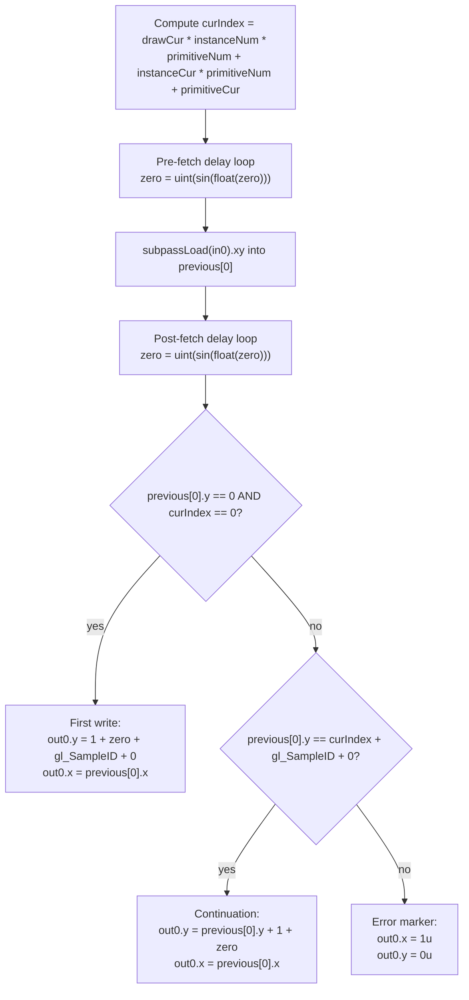
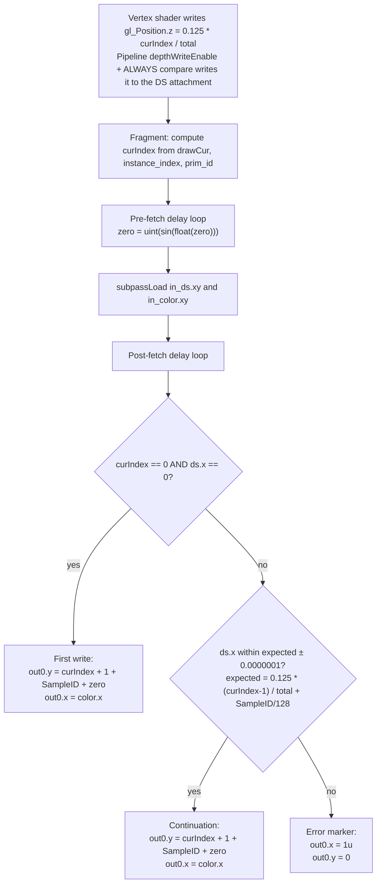

## Overview

**Core question:** When overlapping draws, primitives, or instances in one subpass write to a color, depth, or stencil attachment that is also bound as an input attachment, does a later fragment shader invocation that performs `subpassLoad` on that attachment see the value an earlier overlapping invocation wrote?

- [vktRasterizationOrderAttachmentAccessTests.cpp](../../../modules/vulkan/rasterization/vktRasterizationOrderAttachmentAccessTests.cpp) implements the `rasterization_order_attachment_access` test family. `createRasterizationOrderAttachmentAccessTests()` registers the four direct children `format_float`, `format_integer`, `depth`, and `stencil` [vktRasterizationOrderAttachmentAccessTests.cpp](../../../modules/vulkan/rasterization/vktRasterizationOrderAttachmentAccessTests.cpp#L1831-L1852).
- The core test idea is a feedback attachment: subpass 0 of a two-subpass render pass writes to an attachment that it also reads through an input attachment. Overlapping draws, primitives, or instances in subpass 0 race on the same pixels, and the test asks whether each fragment invocation observes the most recent overlapping write.
- Two synchronization forms cover the same shader behavior. `multi_draw_barriers` uses an explicit subpass self-dependency plus `vkCmdPipelineBarrier` between draws. The other four leaf cases rely on the `VK_ARM_rasterization_order_attachment_access` / `VK_EXT_rasterization_order_attachment_access` extension through subpass description flags and pipeline create flags.
- The rasterization-order guarantee, the explicit-barrier contrast, the overlap-pattern axis, the representative shaders, the host-side result scan, and per-leaf failure meaning are each developed in dedicated sections below.

## Background Knowledge

- **Rasterization-order attachment access.** By default Vulkan does not order fragment invocations that read an attachment through an input attachment against invocations that write to the same attachment within a subpass. The `VK_ARM_rasterization_order_attachment_access` and `VK_EXT_rasterization_order_attachment_access` extensions opt a subpass into a rasterization-order guarantee for color, depth, or stencil attachment reads from input attachments. The CTS source activates the guarantee through subpass description flags `VK_SUBPASS_DESCRIPTION_RASTERIZATION_ORDER_ATTACHMENT_*_ACCESS_BIT_ARM` [vktRasterizationOrderAttachmentAccessTests.cpp](../../../modules/vulkan/rasterization/vktRasterizationOrderAttachmentAccessTests.cpp#L1340-L1351) and matching pipeline create flags [vktRasterizationOrderAttachmentAccessTests.cpp](../../../modules/vulkan/rasterization/vktRasterizationOrderAttachmentAccessTests.cpp#L126-L133), and gates the path on `VkPhysicalDeviceRasterizationOrderAttachmentAccessFeaturesEXT` feature bits [vktRasterizationOrderAttachmentAccessTests.cpp](../../../modules/vulkan/rasterization/vktRasterizationOrderAttachmentAccessTests.cpp#L910-L916).
- **Input attachment feedback.** An input attachment is a descriptor-bound view of an attachment that the fragment shader reads through `subpassLoad`. When the same attachment is also written by the same subpass, fragment invocations can observe values written by other invocations. The test uses this pattern in subpass 0 of a two-subpass render pass, then funnels the per-pixel result through subpass 1 into a host-readable buffer [vktRasterizationOrderAttachmentAccessTests.cpp](../../../modules/vulkan/rasterization/vktRasterizationOrderAttachmentAccessTests.cpp#L1308-L1322).
- **Subpass self-dependency and explicit pipeline barriers.** When `m_explicitSync` is true the source adds a subpass 0 self-dependency from `VK_PIPELINE_STAGE_COLOR_ATTACHMENT_OUTPUT_BIT` to `VK_PIPELINE_STAGE_FRAGMENT_SHADER_BIT` with `VK_ACCESS_COLOR_ATTACHMENT_WRITE_BIT` → `VK_ACCESS_INPUT_ATTACHMENT_READ_BIT`, plus a depth/stencil analog for DS cases [vktRasterizationOrderAttachmentAccessTests.cpp](../../../modules/vulkan/rasterization/vktRasterizationOrderAttachmentAccessTests.cpp#L1327-L1337). The host loop then inserts `vkCmdPipelineBarrier` between consecutive overlapping draws [vktRasterizationOrderAttachmentAccessTests.cpp](../../../modules/vulkan/rasterization/vktRasterizationOrderAttachmentAccessTests.cpp#L1617-L1633). The shader source is identical for both synchronization forms; only the host-side synchronization differs.
- **Overlap patterns as the primary axis.** Five leaf cases change which invocations race on the same attachment: draw-to-draw (`multi_draw_barriers`, `multi_draw`), primitive-to-primitive (`multi_primitives`), instance-to-instance (`multi_instances`), or all combined (`all`) [vktRasterizationOrderAttachmentAccessTests.cpp](../../../modules/vulkan/rasterization/vktRasterizationOrderAttachmentAccessTests.cpp#L1715-L1756). Only `multi_draw_barriers` uses explicit synchronization; the other four depend on the extension.

## Registration Hierarchy

```text
rasterization.rasterization_order_attachment_access
├── format_float
├── format_integer
├── depth
└── stencil
```

`format_float` and `format_integer` expand an `attachments_1_`, `attachments_4_`, or `attachments_8_` prefix and a `samples_<N>` group below the format root, then attach the five leaf cases. `depth` and `stencil` expand only a `samples_<N>` group below the format root, then attach the five leaf cases. Sample counts `1, 2, 4, 8, 16, 32, 64` are taken from `sampleCountValues[]` [vktRasterizationOrderAttachmentAccessTests.cpp](../../../modules/vulkan/rasterization/vktRasterizationOrderAttachmentAccessTests.cpp#L1759-L1763).

## Parameter Dimensions and Observed Values

The matrix is built by `createRasterizationOrderAttachmentAccessTestVariations()` and `createRasterizationOrderAttachmentAccessFormatTests()` [vktRasterizationOrderAttachmentAccessTests.cpp](../../../modules/vulkan/rasterization/vktRasterizationOrderAttachmentAccessTests.cpp#L1703-L1829).

| Dimension | Registered values | Meaning in this test | Evidence |
|-----------|-------------------|----------------------|----------|
| Attachment class | `format_float`, `format_integer`, `depth`, `stencil` | Selects which attachment aspect is fed back: float color, integer color, depth, or stencil. Each class uses a different shader generator and a different rasterization-order feature bit. | [createRasterizationOrderAttachmentAccessTests](../../../modules/vulkan/rasterization/vktRasterizationOrderAttachmentAccessTests.cpp#L1835-L1849) |
| Color attachment count | `attachments_1_`, `attachments_4_`, `attachments_8_` | Number of color attachments in subpass 0 for `format_float` / `format_integer`. Each is also bound as an input attachment and checked independently by the subpass 1 resolve shader. | [inputNum](../../../modules/vulkan/rasterization/vktRasterizationOrderAttachmentAccessTests.cpp#L1805-L1826) |
| Sample count | `samples_1`, `samples_2`, `samples_4`, `samples_8`, `samples_16`, `samples_32`, `samples_64` | `VkSampleCountFlagBits` for subpass 0. The fragment shader differentiates per-sample writes via `gl_SampleID`, so each sample's `subpassLoad` must observe the per-sample write of the most recent overlapping invocation. | [sampleCountValues](../../../modules/vulkan/rasterization/vktRasterizationOrderAttachmentAccessTests.cpp#L1759-L1763) |
| Overlap pattern | `multi_draw_barriers`, `multi_draw`, `multi_primitives`, `multi_instances`, `all` | The primary behavioral axis. Each pattern stresses a different rasterization-order surface and selects between explicit synchronization and extension-ordered access. | [leafTestCreateParams](../../../modules/vulkan/rasterization/vktRasterizationOrderAttachmentAccessTests.cpp#L1715-L1756) |

## Behavior Parameters

The primary behavioral axis for this page is the **overlap pattern** registered as the leaf case name. Each value changes which invocations race on the same attachment and which synchronization mechanism orders the writes and reads. The attachment class is a secondary axis; it changes which aspect is fed back and which feature bit is required, but the ordering question is the same across all four classes.

### multi_draw_barriers — Explicit synchronization across draws

`multi_draw_barriers` records six overlapping draws in subpass 0 with `vkCmdPipelineBarrier` between consecutive draws [vktRasterizationOrderAttachmentAccessTests.cpp](../../../modules/vulkan/rasterization/vktRasterizationOrderAttachmentAccessTests.cpp#L1617-L1633). The subpass 0 self-dependency plus the inter-draw pipeline barrier make each draw's color or depth/stencil writes visible to the next draw's input-attachment reads. This case does not require the rasterization-order extension and uses zero pipeline create flags.

### multi_draw — Extension-ordered across draws

`multi_draw` records the same six overlapping draws as `multi_draw_barriers`, but with no inter-draw barrier. The subpass instead carries `VK_SUBPASS_DESCRIPTION_RASTERIZATION_ORDER_ATTACHMENT_COLOR_ACCESS_BIT_ARM` (and the depth or stencil analog for DS cases), and the pipeline carries the matching `VK_PIPELINE_*_CREATE_RASTERIZATION_ORDER_ATTACHMENT_*_ACCESS_BIT_ARM` flag. The shader source is identical to `multi_draw_barriers` for the same attachment class, sample count, and attachment count.

### multi_primitives — Extension-ordered across primitives

`multi_primitives` records a single draw with `numPrimitives = 12` overlapping triangles (6 logical primitive pairs, since the shader groups every two triangles into one primitive via `prim_id / 2u`). The rasterization-order guarantee must hold across primitives within one draw, so each fragment's `subpassLoad` observes the value written by the most recent overlapping primitive.

### multi_instances — Extension-ordered across instances

`multi_instances` records a single draw with `numInstances = 6` overlapping instances. The rasterization-order guarantee must hold across instances within one draw, so each fragment's `subpassLoad` observes the value written by the most recent overlapping instance.

### all — Extension-ordered with all overlap dimensions

`all` records six overlapping draws, each with `numPrimitives = 12` and `numInstances = 6`. The rasterization-order guarantee must hold simultaneously across draws, primitives, and instances.

## Shader Analysis

The fragment shader in subpass 0 is part of the tested behavior: it reads the attachment through an input attachment, computes a per-invocation `curIndex`, and writes a new value that depends on what was read. Two walkthroughs follow. The first covers the simplest color case with explicit synchronization. The second covers the depth variant, which uses a materially different shader that writes `gl_FragDepth` and reads the depth/stencil input attachment with a tolerance comparison. The stencil variant is similar to the depth variant and is described in `### stencil` and the Parameter Variation Summary rather than receiving a separate walkthrough.

### Representative Shader Walkthrough 1

#### Parameter Values Chosen

Representative path:

```text
dEQP-VK.rasterization.rasterization_order_attachment_access.format_float.attachments_1_samples_1.multi_draw_barriers
```

| Parameter choice | Meaning in this representative case |
|------------------|-------------------------------------|
| `format_float` | Selects the color shader generator with `vec` / `subpassInput` / `float` tokens. The host attachment is `VK_FORMAT_R32G32_SFLOAT` and the host scan reads `tcu::Vec2` pixels. |
| `attachments_1_` | One color attachment bound as input attachment at binding 0. Isolates the ordering test from any multi-attachment iteration in shader code, so the validation expression is the single-attachment form. |
| `samples_1` | Single-sample subpass 0. `subpassLoad(in0)` takes no sample argument; `gl_SampleID` is still referenced in the validation expression but evaluates to 0. |
| `multi_draw_barriers` | Explicit-sync leaf. Six overlapping draws are recorded in subpass 0 with `vkCmdPipelineBarrier` between consecutive draws. The shader constants are `DRAW_NUM=6`, `INSTANCE_NUM=1`, `PRIMITIVE_NUM=1`; runtime `numDraws=6`, `numInstances=1`, `numPrimitives=2`. |

#### Purpose

Verify that an explicit subpass 0 self-dependency plus an inter-draw `vkCmdPipelineBarrier` makes each draw's color-attachment write visible to the next draw's input-attachment read, so each fragment sees the most recent overlapping invocation's `out0.y` counter.

#### Structural Design



The shader is a read-modify-write feedback loop on the input attachment. `curIndex` identifies which overlapping invocation is running. The two delay loops compute `zero = uint(sin(float(zero)))` to make the read-modify-write sequence non-trivially ordered; `zero` is folded into the written value so a reordered read cannot accidentally produce the correct counter. The validation has three branches: the first invocation writes the seed counter, a correctly-ordered later invocation increments the counter, and any other observed value triggers the error marker that subpass 1 forwards to the host.

#### Shader Code

##### Fragment Shader

```glsl
#version 450
precision highp float;
precision highp subpassInput;
/// Single color attachment bound as input attachment at binding 0; subpass 0
/// reads and writes the same image, so subpassLoad observes prior writes only
/// when the subpass self-dependency or the rasterization-order guarantee holds.
layout( set = 0, binding = 0, input_attachment_index = 0 ) uniform subpassInput in0;
/// Single output at location 0. .x is the error flag (0 = ok, 1 = mismatch);
/// .y is the running counter that overlapping invocations increment.
layout( location = 0 ) out vec2 out0;
/// drawCur is pushed per-draw by the host loop. It selects which of the six
/// overlapping draws the fragment belongs to.
layout( push_constant ) uniform ConstBlock
{
    uint drawCur;
};
/// prim_id is the emulated gl_PrimitiveID from vert1, used to derive primitiveCur.
layout(location = 1) flat in int prim_id;
void main()
{
    /// instanceCur is recovered from gl_FragCoord.z, which vert1 wrote as
    /// gl_InstanceIndex / 256.0. Single-instance case → instanceCur = 0.
    uint instanceCur = uint(round(gl_FragCoord.z * 256.0));
    /// primitiveCur groups every two triangles into one logical primitive pair.
    uint primitiveCur = uint(prim_id) / 2u;
    uint primitiveNum = 1u;
    uint instanceNum = 1u;
    uint drawNum = 6u;
    /// curIndex uniquely identifies the overlapping invocation across draws,
    /// instances, and primitive pairs. For this leaf it equals drawCur.
    uint curIndex = drawCur * instanceNum * primitiveNum + instanceCur * primitiveNum + primitiveCur;
    uint total = drawNum * instanceNum * primitiveNum;
    /// zero is 0 for curIndex < total (always true here) and is used as an
    /// opaque nonce folded into the written counter value.
    uint zero = curIndex / total;
    uint index;
    /// pre_fetch_loop length depends on gl_FragCoord and the remaining draws /
    /// primitives, so different invocations execute different iteration counts
    /// before the subpassLoad. This stresses ordering between invocations.
    uint pre_fetch_loop = uint(gl_FragCoord.x) * uint(gl_FragCoord.y) * (drawNum * primitiveNum - drawCur * primitiveNum - primitiveCur);
    uint post_fetch_loop = uint(gl_FragCoord.x) + uint(gl_FragCoord.y) + (drawNum * instanceNum - drawCur * instanceNum - instanceCur);
    for(index = 0u; index < pre_fetch_loop; index++)
    {
        zero = uint(sin(float(zero)));
    }
    vec2 previous[1];
    /// Single-sample form: subpassLoad takes no sample argument. The .xy
    /// components are the prior error flag and counter.
    previous[0] = subpassLoad( in0).xy;
    for(index = 0u; index < post_fetch_loop; index++)
    {
        zero = uint(sin(float(zero)));
    }
    /// First invocation (curIndex == 0): seed the counter at 1 + zero + SampleID + attIndex.
    /// gl_SampleID is 0 in single-sample mode but is referenced unconditionally
    /// so the same generator can emit the multisample form.
    if (previous[0].y == 0 && curIndex == 0)
    {
        out0.y = previous[0].y + (1u + zero + gl_SampleID + 0u);
        out0.x = previous[0].x;
    }
    /// Correctly-ordered later invocation: previous.y must equal curIndex (offset
    /// by SampleID and attachment index). If so, increment by 1 + zero.
    else if (previous[0].y == curIndex + gl_SampleID + 0u)
    {
        out0.y = previous[0].y + 1 + zero;
        out0.x = previous[0].x;
    }
    /// Mis-ordered read: write the error marker. Subpass 1 forwards this to the
    /// host result buffer, where pixel[0] != 0 fails validation.
    else
    {
        out0.y = 0u;
        out0.x = 1u;
    }
}
```

##### Vertex Shader (`vert1`)

The subpass 0 vertex shader is the simple vertex shader from `AttachmentAccessOrderTestCase::addSimpleVertexShader` [vktRasterizationOrderAttachmentAccessTests.cpp](../../../modules/vulkan/rasterization/vktRasterizationOrderAttachmentAccessTests.cpp#L403-L423). It is shared across all color-case leaves and does not vary with overlap pattern or attachment count.

```glsl
#version 310 es
layout(location = 0) in highp vec2 v_position;
layout(location = 1) flat out int prim_id;
void main ()
{
    prim_id = gl_VertexIndex / 3;
    gl_Position = vec4(v_position, float(gl_InstanceIndex)/256.0, 1);
}
```

#### Additional Info

- The same fragment shader text is generated for `multi_draw` with the same attachment class, sample count, and attachment count. The difference between `multi_draw_barriers` and `multi_draw` is purely host-side synchronization: explicit subpass self-dependency plus `vkCmdPipelineBarrier` versus the rasterization-order subpass description flag and pipeline create flag.
- `gl_SampleID` is referenced unconditionally in the validation expression even in `samples_1` cases. In single-sample mode it evaluates to 0; the generator emits the same expression for all sample counts and switches only the `subpassLoad` form.
- `zero` is folded into both the first-write seed and the continuation increment. Its purpose is to make the read-modify-write sequence depend on a computed value rather than a constant, so a reordering that happens to produce the right counter from a stale read is still detectable through `zero` mismatches in adjacent invocations.

#### Parameter Variation Summary

| Parameter dimension | Shader-level variation from this shader | Evidence |
|---------------------|---------------------------------------|----------|
| Sample count | `samples_N` with N > 1 changes the `subpassLoad` form to `subpassLoad(in0, gl_SampleID)` and the input type to `subpassInputMS`. The validation expression is unchanged because `gl_SampleID` is already referenced unconditionally. | [addShadersInternal](../../../modules/vulkan/rasterization/vktRasterizationOrderAttachmentAccessTests.cpp#L471-L478) |
| Color attachment count | `attachments_4_` and `attachments_8_` unroll the declaration loop and the per-attachment validation block four and eight times. Each attachment is validated independently; `curIndex + gl_SampleID + <attIndex>` offsets the expected `previous.y` per attachment. | [addShadersInternal](../../../modules/vulkan/rasterization/vktRasterizationOrderAttachmentAccessTests.cpp#L435-L501) |
| Integer format | `format_integer` substitutes `uvec` / `usubpassInput` / `int` tokens for `vec` / `subpassInput` / `float`. The host attachment becomes `VK_FORMAT_R32G32_UINT` and the host scan reads `tcu::UVec2`. | [initPrograms](../../../modules/vulkan/rasterization/vktRasterizationOrderAttachmentAccessTests.cpp#L723-L734) |
| Overlap pattern | `DRAW_NUM`, `INSTANCE_NUM`, `PRIMITIVE_NUM` are substituted from `m_overlapDraws`, `m_overlapInstances`, `m_overlapPrimitives` (each either 1 or `ELEM_NUM=6`). The shader text is otherwise identical across leaves. | [initPrograms](../../../modules/vulkan/rasterization/vktRasterizationOrderAttachmentAccessTests.cpp#L717-L721) |

#### SPIR-V

- Status: `generated and validated`
- Source: reconstructed `GLSL` from this walkthrough.
- Stage: `frag`
- Target SPIRV version: `spirv1.0`

<details>
<summary>Click to expand SPIRV asm code</summary>

```llvm
; SPIR-V
; Version: 1.0
; Generator: Khronos Glslang Reference Front End; 11
; Bound: 199
; Schema: 0
               OpCapability Shader
               OpCapability SampleRateShading
               OpCapability InputAttachment
          %1 = OpExtInstImport "GLSL.std.450"
               OpMemoryModel Logical GLSL450
               OpEntryPoint Fragment %main "main" %gl_FragCoord %prim_id %out0 %gl_SampleID
               OpExecutionMode %main OriginUpperLeft
               OpSource GLSL 450
               OpName %main "main"
               OpName %instanceCur "instanceCur"
               OpName %gl_FragCoord "gl_FragCoord"
               OpName %primitiveCur "primitiveCur"
               OpName %prim_id "prim_id"
               OpName %primitiveNum "primitiveNum"
               OpName %instanceNum "instanceNum"
               OpName %drawNum "drawNum"
               OpName %curIndex "curIndex"
               OpName %ConstBlock "ConstBlock"
               OpMemberName %ConstBlock 0 "drawCur"
               OpName %_ ""
               OpName %total "total"
               OpName %zero "zero"
               OpName %pre_fetch_loop "pre_fetch_loop"
               OpName %post_fetch_loop "post_fetch_loop"
               OpName %index "index"
               OpName %previous "previous"
               OpName %in0 "in0"
               OpName %out0 "out0"
               OpName %gl_SampleID "gl_SampleID"
               OpDecorate %gl_FragCoord BuiltIn FragCoord
               OpDecorate %prim_id Flat
               OpDecorate %prim_id Location 1
               OpDecorate %ConstBlock Block
               OpMemberDecorate %ConstBlock 0 Offset 0
               OpDecorate %in0 Binding 0
               OpDecorate %in0 DescriptorSet 0
               OpDecorate %in0 InputAttachmentIndex 0
               OpDecorate %out0 Location 0
               OpDecorate %gl_SampleID BuiltIn SampleId
               OpDecorate %gl_SampleID Flat
       %void = OpTypeVoid
          %3 = OpTypeFunction %void
       %uint = OpTypeInt 32 0
%_ptr_Function_uint = OpTypePointer Function %uint
      %float = OpTypeFloat 32
    %v4float = OpTypeVector %float 4
%_ptr_Input_v4float = OpTypePointer Input %v4float
%gl_FragCoord = OpVariable %_ptr_Input_v4float Input
     %uint_2 = OpConstant %uint 2
%_ptr_Input_float = OpTypePointer Input %float
  %float_256 = OpConstant %float 256
        %int = OpTypeInt 32 1
%_ptr_Input_int = OpTypePointer Input %int
    %prim_id = OpVariable %_ptr_Input_int Input
     %uint_1 = OpConstant %uint 1
     %uint_6 = OpConstant %uint 6
 %ConstBlock = OpTypeStruct %uint
%_ptr_PushConstant_ConstBlock = OpTypePointer PushConstant %ConstBlock
          %_ = OpVariable %_ptr_PushConstant_ConstBlock PushConstant
      %int_0 = OpConstant %int 0
%_ptr_PushConstant_uint = OpTypePointer PushConstant %uint
     %uint_0 = OpConstant %uint 0
       %bool = OpTypeBool
      %int_1 = OpConstant %int 1
    %v2float = OpTypeVector %float 2
%_arr_v2float_uint_1 = OpTypeArray %v2float %uint_1
%_ptr_Function__arr_v2float_uint_1 = OpTypePointer Function %_arr_v2float_uint_1
        %121 = OpTypeImage %float SubpassData 0 0 0 2 Unknown
%_ptr_UniformConstant_121 = OpTypePointer UniformConstant %121
        %in0 = OpVariable %_ptr_UniformConstant_121 UniformConstant
      %v2int = OpTypeVector %int 2
        %126 = OpConstantComposite %v2int %int_0 %int_0
%_ptr_Function_v2float = OpTypePointer Function %v2float
%_ptr_Function_float = OpTypePointer Function %float
    %float_0 = OpConstant %float 0
%_ptr_Output_v2float = OpTypePointer Output %v2float
       %out0 = OpVariable %_ptr_Output_v2float Output
%gl_SampleID = OpVariable %_ptr_Input_int Input
%_ptr_Output_float = OpTypePointer Output %float
    %float_1 = OpConstant %float 1
       %main = OpFunction %void None %3
          %5 = OpLabel
%instanceCur = OpVariable %_ptr_Function_uint Function
%primitiveCur = OpVariable %_ptr_Function_uint Function
%primitiveNum = OpVariable %_ptr_Function_uint Function
%instanceNum = OpVariable %_ptr_Function_uint Function
    %drawNum = OpVariable %_ptr_Function_uint Function
   %curIndex = OpVariable %_ptr_Function_uint Function
      %total = OpVariable %_ptr_Function_uint Function
       %zero = OpVariable %_ptr_Function_uint Function
%pre_fetch_loop = OpVariable %_ptr_Function_uint Function
%post_fetch_loop = OpVariable %_ptr_Function_uint Function
      %index = OpVariable %_ptr_Function_uint Function
   %previous = OpVariable %_ptr_Function__arr_v2float_uint_1 Function
         %15 = OpAccessChain %_ptr_Input_float %gl_FragCoord %uint_2
         %16 = OpLoad %float %15
         %18 = OpFMul %float %16 %float_256
         %19 = OpExtInst %float %1 Round %18
         %20 = OpConvertFToU %uint %19
               OpStore %instanceCur %20
         %25 = OpLoad %int %prim_id
         %26 = OpBitcast %uint %25
         %27 = OpUDiv %uint %26 %uint_2
               OpStore %primitiveCur %27
               OpStore %primitiveNum %uint_1
               OpStore %instanceNum %uint_1
               OpStore %drawNum %uint_6
         %39 = OpAccessChain %_ptr_PushConstant_uint %_ %int_0
         %40 = OpLoad %uint %39
         %41 = OpLoad %uint %instanceNum
         %42 = OpIMul %uint %40 %41
         %43 = OpLoad %uint %primitiveNum
         %44 = OpIMul %uint %42 %43
         %45 = OpLoad %uint %instanceCur
         %46 = OpLoad %uint %primitiveNum
         %47 = OpIMul %uint %45 %46
         %48 = OpIAdd %uint %44 %47
         %49 = OpLoad %uint %primitiveCur
         %50 = OpIAdd %uint %48 %49
               OpStore %curIndex %50
         %52 = OpLoad %uint %drawNum
         %53 = OpLoad %uint %instanceNum
         %54 = OpIMul %uint %52 %53
         %55 = OpLoad %uint %primitiveNum
         %56 = OpIMul %uint %54 %55
               OpStore %total %56
         %58 = OpLoad %uint %curIndex
         %59 = OpLoad %uint %total
         %60 = OpUDiv %uint %58 %59
               OpStore %zero %60
         %63 = OpAccessChain %_ptr_Input_float %gl_FragCoord %uint_0
         %64 = OpLoad %float %63
         %65 = OpConvertFToU %uint %64
         %66 = OpAccessChain %_ptr_Input_float %gl_FragCoord %uint_1
         %67 = OpLoad %float %66
         %68 = OpConvertFToU %uint %67
         %69 = OpIMul %uint %65 %68
         %70 = OpLoad %uint %drawNum
         %71 = OpLoad %uint %primitiveNum
         %72 = OpIMul %uint %70 %71
         %73 = OpAccessChain %_ptr_PushConstant_uint %_ %int_0
         %74 = OpLoad %uint %73
         %75 = OpLoad %uint %primitiveNum
         %76 = OpIMul %uint %74 %75
         %77 = OpISub %uint %72 %76
         %78 = OpLoad %uint %primitiveCur
         %79 = OpISub %uint %77 %78
         %80 = OpIMul %uint %69 %79
               OpStore %pre_fetch_loop %80
         %82 = OpAccessChain %_ptr_Input_float %gl_FragCoord %uint_0
         %83 = OpLoad %float %82
         %84 = OpConvertFToU %uint %83
         %85 = OpAccessChain %_ptr_Input_float %gl_FragCoord %uint_1
         %86 = OpLoad %float %85
         %87 = OpConvertFToU %uint %86
         %88 = OpIAdd %uint %84 %87
         %89 = OpLoad %uint %drawNum
         %90 = OpLoad %uint %instanceNum
         %91 = OpIMul %uint %89 %90
         %92 = OpAccessChain %_ptr_PushConstant_uint %_ %int_0
         %93 = OpLoad %uint %92
         %94 = OpLoad %uint %instanceNum
         %95 = OpIMul %uint %93 %94
         %96 = OpISub %uint %91 %95
         %97 = OpLoad %uint %instanceCur
         %98 = OpISub %uint %96 %97
         %99 = OpIAdd %uint %88 %98
               OpStore %post_fetch_loop %99
               OpStore %index %uint_0
               OpBranch %101
        %101 = OpLabel
               OpLoopMerge %103 %104 None
               OpBranch %105
        %105 = OpLabel
        %106 = OpLoad %uint %index
        %107 = OpLoad %uint %pre_fetch_loop
        %109 = OpULessThan %bool %106 %107
               OpBranchConditional %109 %102 %103
        %102 = OpLabel
        %110 = OpLoad %uint %zero
        %111 = OpConvertUToF %float %110
        %112 = OpExtInst %float %1 Sin %111
        %113 = OpConvertFToU %uint %112
               OpStore %zero %113
               OpBranch %104
        %104 = OpLabel
        %114 = OpLoad %uint %index
        %116 = OpIAdd %uint %114 %int_1
               OpStore %index %116
               OpBranch %101
        %103 = OpLabel
        %124 = OpLoad %121 %in0
        %127 = OpImageRead %v4float %124 %126
        %128 = OpVectorShuffle %v2float %127 %127 0 1
        %130 = OpAccessChain %_ptr_Function_v2float %previous %int_0
               OpStore %130 %128
               OpStore %index %uint_0
               OpBranch %131
        %131 = OpLabel
               OpLoopMerge %133 %134 None
               OpBranch %135
        %135 = OpLabel
        %136 = OpLoad %uint %index
        %137 = OpLoad %uint %post_fetch_loop
        %138 = OpULessThan %bool %136 %137
               OpBranchConditional %138 %132 %133
        %132 = OpLabel
        %139 = OpLoad %uint %zero
        %140 = OpConvertUToF %float %139
        %141 = OpExtInst %float %1 Sin %140
        %142 = OpConvertFToU %uint %141
               OpStore %zero %142
               OpBranch %134
        %134 = OpLabel
        %143 = OpLoad %uint %index
        %144 = OpIAdd %uint %143 %int_1
               OpStore %index %144
               OpBranch %131
        %133 = OpLabel
        %146 = OpAccessChain %_ptr_Function_float %previous %int_0 %uint_1
        %147 = OpLoad %float %146
        %149 = OpFOrdEqual %bool %147 %float_0
        %150 = OpLoad %uint %curIndex
        %151 = OpIEqual %bool %150 %uint_0
        %152 = OpLogicalAnd %bool %149 %151
               OpSelectionMerge %154 None
               OpBranchConditional %152 %153 %173
        %153 = OpLabel
        %157 = OpAccessChain %_ptr_Function_float %previous %int_0 %uint_1
        %158 = OpLoad %float %157
        %159 = OpLoad %uint %zero
        %160 = OpIAdd %uint %uint_1 %159
        %162 = OpLoad %int %gl_SampleID
        %163 = OpBitcast %uint %162
        %164 = OpIAdd %uint %160 %163
        %165 = OpIAdd %uint %164 %uint_0
        %166 = OpConvertUToF %float %165
        %167 = OpFAdd %float %158 %166
        %169 = OpAccessChain %_ptr_Output_float %out0 %uint_1
               OpStore %169 %167
        %170 = OpAccessChain %_ptr_Function_float %previous %int_0 %uint_0
        %171 = OpLoad %float %170
        %172 = OpAccessChain %_ptr_Output_float %out0 %uint_0
               OpStore %172 %171
               OpBranch %154
        %173 = OpLabel
        %174 = OpAccessChain %_ptr_Function_float %previous %int_0 %uint_1
        %175 = OpLoad %float %174
        %176 = OpLoad %uint %curIndex
        %177 = OpLoad %int %gl_SampleID
        %178 = OpBitcast %uint %177
        %179 = OpIAdd %uint %176 %178
        %180 = OpIAdd %uint %179 %uint_0
        %181 = OpConvertUToF %float %180
        %182 = OpFOrdEqual %bool %175 %181
               OpSelectionMerge %184 None
               OpBranchConditional %182 %183 %196
        %183 = OpLabel
        %185 = OpAccessChain %_ptr_Function_float %previous %int_0 %uint_1
        %186 = OpLoad %float %185
        %188 = OpFAdd %float %186 %float_1
        %189 = OpLoad %uint %zero
        %190 = OpConvertUToF %float %189
        %191 = OpFAdd %float %188 %190
        %192 = OpAccessChain %_ptr_Output_float %out0 %uint_1
               OpStore %192 %191
        %193 = OpAccessChain %_ptr_Function_float %previous %int_0 %uint_0
        %194 = OpLoad %float %193
        %195 = OpAccessChain %_ptr_Output_float %out0 %uint_0
               OpStore %195 %194
               OpBranch %184
        %196 = OpLabel
        %197 = OpAccessChain %_ptr_Output_float %out0 %uint_1
               OpStore %197 %float_0
        %198 = OpAccessChain %_ptr_Output_float %out0 %uint_0
               OpStore %198 %float_1
               OpBranch %184
        %184 = OpLabel
               OpBranch %154
        %154 = OpLabel
               OpReturn
               OpFunctionEnd
```

</details>

### Representative Shader Walkthrough 2

#### Parameter Values Chosen

Representative path:

```text
dEQP-VK.rasterization.rasterization_order_attachment_access.depth.samples_1.multi_draw
```

| Parameter choice | Meaning in this representative case |
|------------------|-------------------------------------|
| `depth` | Selects the depth shader generator. Subpass 0 has one color attachment plus one combined depth/stencil attachment bound as a second input attachment. The host reads back depth through `subpassLoad(in_ds).x` and compares against an expected value derived from `curIndex`. |
| `samples_1` | Single-sample subpass 0. The fragment shader does not write `gl_FragDepth`; depth comes from `gl_Position.z` set by the custom vertex shader. The host validation threshold is `0.0000001`. |
| `multi_draw` | Extension-ordered leaf. Six overlapping draws are recorded with no inter-draw barrier. The rasterization-order depth-attachment access guarantee must make each draw's depth write visible to the next draw's `subpassLoad(in_ds)`. |
| `attachments_1_` (implicit) | Depth cases always have one color attachment plus one depth/stencil attachment, so the attachment-count dimension is not expanded. |

#### Purpose

Verify that the `VK_EXT_rasterization_order_attachment_access` depth-attachment access guarantee makes each draw's depth write (from `gl_Position.z`) visible to the next draw's input-attachment read, so each fragment's `subpassLoad(in_ds).x` matches the expected `0.125 * (curIndex - 1) / total` within the shader's `0.0000001` threshold.

#### Structural Design



The depth case differs from the color case in three ways. First, the depth value is written by the pipeline's fixed-function depth write from `gl_Position.z`, not by the fragment shader's `out0`. Second, the fragment shader reads two input attachments: `in_color` for the error-flag/counter pair and `in_ds` for the depth value. Third, the validation uses a floating-point tolerance comparison (`ds.x >= expected - threshold && ds.x <= expected + threshold`) instead of the color case's exact integer/float equality on `previous.y`.

#### Shader Code

##### Fragment Shader

```glsl
#version 450
precision highp float;
precision highp subpassInput;
/// Color attachment at binding 0 carries the error flag (.x) and the running
/// counter (.y). Depth attachment at binding 1 carries the depth value in .x
/// that the fragment shader reads back through subpassLoad.
layout( set = 0, binding = 0, input_attachment_index = 0 ) uniform subpassInput in_color;
layout( set = 0, binding = 1, input_attachment_index = 1 ) uniform subpassInput in_ds;
layout( location = 0 ) out vec2 out0;
/// instance_index and prim_id come from the custom depth vertex shader, which
/// computes curIndex and passes instance_index through for the fragment shader.
layout( location = 1 ) flat in uint instance_index;
layout( location = 2 ) flat in int prim_id;
layout( push_constant ) uniform ConstBlock
{
    uint drawCur;
};
void main()
{
    uint instanceCur = instance_index;
    uint primitiveCur = uint(prim_id) / 2u;
    uint primitiveNum = 1u;
    uint instanceNum = 1u;
    uint drawNum = 6u;
    uint curIndex = drawCur * instanceNum * primitiveNum + instanceCur * primitiveNum + primitiveCur;
    uint total = drawNum * instanceNum * primitiveNum;
    uint zero = curIndex / total;
    uint index;
    uint pre_fetch_loop = uint(gl_FragCoord.x) * uint(gl_FragCoord.y) * (drawNum * primitiveNum - drawCur * primitiveNum - primitiveCur);
    uint post_fetch_loop = uint(gl_FragCoord.x) + uint(gl_FragCoord.y) + (drawNum * instanceNum - drawCur * instanceNum - instanceCur);
    for(index = 0u; index < pre_fetch_loop; index++)
    {
        zero = uint(sin(float(zero)));
    }
    /// ds.x is the depth value written by the most recent overlapping invocation.
    /// color.xy carries the prior error flag and counter from the color attachment.
    vec2 ds = subpassLoad( in_ds ).xy;
    vec2 color = subpassLoad( in_color ).xy;
    for(index = 0u; index < post_fetch_loop; index++)
    {
        zero = uint(sin(float(zero)));
    }
    /// First invocation: depth attachment is still 0 from the host clear.
    if (curIndex == 0 && ds.x == 0)
    {
        out0.x = color.x;
        out0.y = curIndex + 1 + gl_SampleID + zero;
    }
    else
    {
        /// Expected depth = 0.125 * (curIndex-1) / total + SampleID/128.
        /// For samples_1, SampleID=0 so this is 0.125 * (curIndex-1) / total,
        /// matching gl_Position.z written by the vertex shader for curIndex-1.
        const float expected = 0.125 * float(curIndex - 1) / float(total) + gl_SampleID / 128.0;
        const float threshold = 0.0000001;
        if (ds.x >= expected - threshold && ds.x <= expected + threshold)
        {
            out0.x = color.x;
            out0.y = curIndex + 1 + gl_SampleID + zero;
        }
        else
        {
            out0.y = 0;
            out0.x = 1u;
        }
    }
}
```

##### Vertex Shader (`vert1`)

The depth case uses a custom vertex shader instead of `addSimpleVertexShader`. It receives `drawCur` through push constants, computes `curIndex`, and writes `gl_Position.z = 0.125 * float(curIndex) / float(indexNum)` so the pipeline's depth write stores a per-invocation depth value that the next overlapping fragment can read back through `in_ds`.

```glsl
#version 460
layout(location = 0) in highp vec2 v_position;
layout(location = 1) flat out uint instance_index;
layout(location = 2) flat out int prim_id;
layout( push_constant ) uniform ConstBlock
{
    uint drawCur;
};
void main ()
{
    uint primitiveCur = uint(gl_VertexIndex) / 6u;
    prim_id = gl_VertexIndex / 3;
    uint instanceNum = 1;
    uint primitiveNum = 1;
    uint drawNum = 6;
    uint curIndex = drawCur * instanceNum * primitiveNum + gl_InstanceIndex * primitiveNum + primitiveCur;
    uint indexNum = drawNum * instanceNum * primitiveNum;
    instance_index = gl_InstanceIndex;
    gl_Position = vec4(v_position, 0.125 * float(curIndex) / float(indexNum), 1);
}
```

#### Additional Info

- The vertex shader is shown as a secondary stage because it produces the depth value that the fragment shader validates. It varies with the overlap pattern through `DRAW_NUM` / `INSTANCE_NUM` / `PRIMITIVE_NUM` but stays structurally identical across depth-case leaves.
- For `samples_N` with N > 1, the fragment shader additionally writes `gl_FragDepth = 0.125 * (float(curIndex) / float(total)) + gl_SampleID / 128.0` in both the first-write and continuation branches. This per-sample depth write is necessary because `gl_Position.z` is per-vertex, not per-sample. The `samples_1` representative case omits the `gl_FragDepth` write because there is only one sample per pixel.
- The `expected` expression uses `0.125 * (curIndex - 1) / total`, not `0.125 * curIndex / total`, because the fragment reads the depth value written by the *previous* overlapping invocation (`curIndex - 1`). The vertex shader writes `0.125 * curIndex / total` for the *current* invocation, which the next invocation (`curIndex + 1`) will read back.
- The depth case pushes `drawCur` to both `VK_SHADER_STAGE_FRAGMENT_BIT` and `VK_SHADER_STAGE_VERTEX_BIT` [vktRasterizationOrderAttachmentAccessTests.cpp](../../../modules/vulkan/rasterization/vktRasterizationOrderAttachmentAccessTests.cpp#L1614-L1616), unlike the color case which pushes only to the fragment stage.

#### Parameter Variation Summary

| Parameter dimension | Shader-level variation from this shader | Evidence |
|---------------------|---------------------------------------|----------|
| Sample count | `samples_N` with N > 1 changes `subpassLoad` to take `gl_SampleID`, switches the input type to `subpassInputMS`, and adds a `gl_FragDepth` write in both the first-write and continuation branches. The depth comparison expression already accounts for `gl_SampleID / 128.0`. | [addShadersInternal](../../../modules/vulkan/rasterization/vktRasterizationOrderAttachmentAccessTests.cpp#L571-L605) |
| Stencil vs depth | The stencil variant reads `in_ds` the same way but checks `ds.x == curIndex` exactly, with no floating-point tolerance. The stencil value is incremented by the pipeline's `VK_STENCIL_OP_INCREMENT_AND_WRAP` state, not by `gl_Position.z`. | [AttachmentAccessOrderStencilTestCase::addShadersInternal](../../../modules/vulkan/rasterization/vktRasterizationOrderAttachmentAccessTests.cpp#L696-L705) |
| Overlap pattern | `DRAW_NUM`, `INSTANCE_NUM`, `PRIMITIVE_NUM` are substituted from the overlap flags (each either 1 or `ELEM_NUM=6`). The shader text is otherwise identical across depth-case leaves. | [initPrograms](../../../modules/vulkan/rasterization/vktRasterizationOrderAttachmentAccessTests.cpp#L717-L721) |
| Synchronization form | `multi_draw_barriers` uses the same shader text as `multi_draw`; only the host-side synchronization differs (explicit subpass self-dependency plus `vkCmdPipelineBarrier` versus the rasterization-order subpass description flag). | [createRenderPass](../../../modules/vulkan/rasterization/vktRasterizationOrderAttachmentAccessTests.cpp#L1327-L1351) |

#### SPIR-V

- Status: `generated and validated`
- Source: reconstructed `GLSL` from this walkthrough.
- Stage: `frag`
- Target SPIRV version: `spirv1.0`

<details>
<summary>Click to expand SPIRV asm code</summary>

```llvm
; SPIR-V
; Version: 1.0
; Generator: Khronos Glslang Reference Front End; 11
; Bound: 219
; Schema: 0
               OpCapability Shader
               OpCapability SampleRateShading
               OpCapability InputAttachment
          %1 = OpExtInstImport "GLSL.std.450"
               OpMemoryModel Logical GLSL450
               OpEntryPoint Fragment %main "main" %instance_index %prim_id %gl_FragCoord %out0 %gl_SampleID
               OpExecutionMode %main OriginUpperLeft
               OpSource GLSL 450
               OpName %main "main"
               OpName %instanceCur "instanceCur"
               OpName %instance_index "instance_index"
               OpName %primitiveCur "primitiveCur"
               OpName %prim_id "prim_id"
               OpName %primitiveNum "primitiveNum"
               OpName %instanceNum "instanceNum"
               OpName %drawNum "drawNum"
               OpName %curIndex "curIndex"
               OpName %ConstBlock "ConstBlock"
               OpMemberName %ConstBlock 0 "drawCur"
               OpName %_ ""
               OpName %total "total"
               OpName %zero "zero"
               OpName %pre_fetch_loop "pre_fetch_loop"
               OpName %gl_FragCoord "gl_FragCoord"
               OpName %post_fetch_loop "post_fetch_loop"
               OpName %index "index"
               OpName %ds "ds"
               OpName %in_ds "in_ds"
               OpName %color "color"
               OpName %in_color "in_color"
               OpName %out0 "out0"
               OpName %gl_SampleID "gl_SampleID"
               OpName %expected "expected"
               OpDecorate %instance_index Flat
               OpDecorate %instance_index Location 1
               OpDecorate %prim_id Flat
               OpDecorate %prim_id Location 2
               OpDecorate %ConstBlock Block
               OpMemberDecorate %ConstBlock 0 Offset 0
               OpDecorate %gl_FragCoord BuiltIn FragCoord
               OpDecorate %in_ds Binding 1
               OpDecorate %in_ds DescriptorSet 0
               OpDecorate %in_ds InputAttachmentIndex 1
               OpDecorate %in_color Binding 0
               OpDecorate %in_color DescriptorSet 0
               OpDecorate %in_color InputAttachmentIndex 0
               OpDecorate %out0 Location 0
               OpDecorate %gl_SampleID BuiltIn SampleId
               OpDecorate %gl_SampleID Flat
       %void = OpTypeVoid
          %3 = OpTypeFunction %void
       %uint = OpTypeInt 32 0
%_ptr_Function_uint = OpTypePointer Function %uint
%_ptr_Input_uint = OpTypePointer Input %uint
%instance_index = OpVariable %_ptr_Input_uint Input
        %int = OpTypeInt 32 1
%_ptr_Input_int = OpTypePointer Input %int
    %prim_id = OpVariable %_ptr_Input_int Input
     %uint_2 = OpConstant %uint 2
     %uint_1 = OpConstant %uint 1
     %uint_6 = OpConstant %uint 6
 %ConstBlock = OpTypeStruct %uint
%_ptr_PushConstant_ConstBlock = OpTypePointer PushConstant %ConstBlock
          %_ = OpVariable %_ptr_PushConstant_ConstBlock PushConstant
      %int_0 = OpConstant %int 0
%_ptr_PushConstant_uint = OpTypePointer PushConstant %uint
      %float = OpTypeFloat 32
    %v4float = OpTypeVector %float 4
%_ptr_Input_v4float = OpTypePointer Input %v4float
%gl_FragCoord = OpVariable %_ptr_Input_v4float Input
     %uint_0 = OpConstant %uint 0
%_ptr_Input_float = OpTypePointer Input %float
       %bool = OpTypeBool
      %int_1 = OpConstant %int 1
    %v2float = OpTypeVector %float 2
%_ptr_Function_v2float = OpTypePointer Function %v2float
        %117 = OpTypeImage %float SubpassData 0 0 0 2 Unknown
%_ptr_UniformConstant_117 = OpTypePointer UniformConstant %117
      %in_ds = OpVariable %_ptr_UniformConstant_117 UniformConstant
      %v2int = OpTypeVector %int 2
        %122 = OpConstantComposite %v2int %int_0 %int_0
   %in_color = OpVariable %_ptr_UniformConstant_117 UniformConstant
%_ptr_Function_float = OpTypePointer Function %float
    %float_0 = OpConstant %float 0
%_ptr_Output_v2float = OpTypePointer Output %v2float
       %out0 = OpVariable %_ptr_Output_v2float Output
%_ptr_Output_float = OpTypePointer Output %float
%gl_SampleID = OpVariable %_ptr_Input_int Input
%float_0_125 = OpConstant %float 0.125
  %float_128 = OpConstant %float 128
%float_1_00000001en07 = OpConstant %float 1.00000001e-07
    %float_1 = OpConstant %float 1
       %main = OpFunction %void None %3
          %5 = OpLabel
%instanceCur = OpVariable %_ptr_Function_uint Function
%primitiveCur = OpVariable %_ptr_Function_uint Function
%primitiveNum = OpVariable %_ptr_Function_uint Function
%instanceNum = OpVariable %_ptr_Function_uint Function
    %drawNum = OpVariable %_ptr_Function_uint Function
   %curIndex = OpVariable %_ptr_Function_uint Function
      %total = OpVariable %_ptr_Function_uint Function
       %zero = OpVariable %_ptr_Function_uint Function
%pre_fetch_loop = OpVariable %_ptr_Function_uint Function
%post_fetch_loop = OpVariable %_ptr_Function_uint Function
      %index = OpVariable %_ptr_Function_uint Function
         %ds = OpVariable %_ptr_Function_v2float Function
      %color = OpVariable %_ptr_Function_v2float Function
   %expected = OpVariable %_ptr_Function_float Function
         %11 = OpLoad %uint %instance_index
               OpStore %instanceCur %11
         %16 = OpLoad %int %prim_id
         %17 = OpBitcast %uint %16
         %19 = OpUDiv %uint %17 %uint_2
               OpStore %primitiveCur %19
               OpStore %primitiveNum %uint_1
               OpStore %instanceNum %uint_1
               OpStore %drawNum %uint_6
         %31 = OpAccessChain %_ptr_PushConstant_uint %_ %int_0
         %32 = OpLoad %uint %31
         %33 = OpLoad %uint %instanceNum
         %34 = OpIMul %uint %32 %33
         %35 = OpLoad %uint %primitiveNum
         %36 = OpIMul %uint %34 %35
         %37 = OpLoad %uint %instanceCur
         %38 = OpLoad %uint %primitiveNum
         %39 = OpIMul %uint %37 %38
         %40 = OpIAdd %uint %36 %39
         %41 = OpLoad %uint %primitiveCur
         %42 = OpIAdd %uint %40 %41
               OpStore %curIndex %42
         %44 = OpLoad %uint %drawNum
         %45 = OpLoad %uint %instanceNum
         %46 = OpIMul %uint %44 %45
         %47 = OpLoad %uint %primitiveNum
         %48 = OpIMul %uint %46 %47
               OpStore %total %48
         %50 = OpLoad %uint %curIndex
         %51 = OpLoad %uint %total
         %52 = OpUDiv %uint %50 %51
               OpStore %zero %52
         %60 = OpAccessChain %_ptr_Input_float %gl_FragCoord %uint_0
         %61 = OpLoad %float %60
         %62 = OpConvertFToU %uint %61
         %63 = OpAccessChain %_ptr_Input_float %gl_FragCoord %uint_1
         %64 = OpLoad %float %63
         %65 = OpConvertFToU %uint %64
         %66 = OpIMul %uint %62 %65
         %67 = OpLoad %uint %drawNum
         %68 = OpLoad %uint %primitiveNum
         %69 = OpIMul %uint %67 %68
         %70 = OpAccessChain %_ptr_PushConstant_uint %_ %int_0
         %71 = OpLoad %uint %70
         %72 = OpLoad %uint %primitiveNum
         %73 = OpIMul %uint %71 %72
         %74 = OpISub %uint %69 %73
         %75 = OpLoad %uint %primitiveCur
         %76 = OpISub %uint %74 %75
         %77 = OpIMul %uint %66 %76
               OpStore %pre_fetch_loop %77
         %79 = OpAccessChain %_ptr_Input_float %gl_FragCoord %uint_0
         %80 = OpLoad %float %79
         %81 = OpConvertFToU %uint %80
         %82 = OpAccessChain %_ptr_Input_float %gl_FragCoord %uint_1
         %83 = OpLoad %float %82
         %84 = OpConvertFToU %uint %83
         %85 = OpIAdd %uint %81 %84
         %86 = OpLoad %uint %drawNum
         %87 = OpLoad %uint %instanceNum
         %88 = OpIMul %uint %86 %87
         %89 = OpAccessChain %_ptr_PushConstant_uint %_ %int_0
         %90 = OpLoad %uint %89
         %91 = OpLoad %uint %instanceNum
         %92 = OpIMul %uint %90 %91
         %93 = OpISub %uint %88 %92
         %94 = OpLoad %uint %instanceCur
         %95 = OpISub %uint %93 %94
         %96 = OpIAdd %uint %85 %95
               OpStore %post_fetch_loop %96
               OpStore %index %uint_0
               OpBranch %98
         %98 = OpLabel
               OpLoopMerge %100 %101 None
               OpBranch %102
        %102 = OpLabel
        %103 = OpLoad %uint %index
        %104 = OpLoad %uint %pre_fetch_loop
        %106 = OpULessThan %bool %103 %104
               OpBranchConditional %106 %99 %100
         %99 = OpLabel
        %107 = OpLoad %uint %zero
        %108 = OpConvertUToF %float %107
        %109 = OpExtInst %float %1 Sin %108
        %110 = OpConvertFToU %uint %109
               OpStore %zero %110
               OpBranch %101
        %101 = OpLabel
        %111 = OpLoad %uint %index
        %113 = OpIAdd %uint %111 %int_1
               OpStore %index %113
               OpBranch %98
        %100 = OpLabel
        %120 = OpLoad %117 %in_ds
        %123 = OpImageRead %v4float %120 %122
        %124 = OpVectorShuffle %v2float %123 %123 0 1
               OpStore %ds %124
        %127 = OpLoad %117 %in_color
        %128 = OpImageRead %v4float %127 %122
        %129 = OpVectorShuffle %v2float %128 %128 0 1
               OpStore %color %129
               OpStore %index %uint_0
               OpBranch %130
        %130 = OpLabel
               OpLoopMerge %132 %133 None
               OpBranch %134
        %134 = OpLabel
        %135 = OpLoad %uint %index
        %136 = OpLoad %uint %post_fetch_loop
        %137 = OpULessThan %bool %135 %136
               OpBranchConditional %137 %131 %132
        %131 = OpLabel
        %138 = OpLoad %uint %zero
        %139 = OpConvertUToF %float %138
        %140 = OpExtInst %float %1 Sin %139
        %141 = OpConvertFToU %uint %140
               OpStore %zero %141
               OpBranch %133
        %133 = OpLabel
        %142 = OpLoad %uint %index
        %143 = OpIAdd %uint %142 %int_1
               OpStore %index %143
               OpBranch %130
        %132 = OpLabel
        %144 = OpLoad %uint %curIndex
        %145 = OpIEqual %bool %144 %uint_0
               OpSelectionMerge %147 None
               OpBranchConditional %145 %146 %147
        %146 = OpLabel
        %149 = OpAccessChain %_ptr_Function_float %ds %uint_0
        %150 = OpLoad %float %149
        %152 = OpFOrdEqual %bool %150 %float_0
               OpBranch %147
        %147 = OpLabel
        %153 = OpPhi %bool %145 %132 %152 %146
               OpSelectionMerge %155 None
               OpBranchConditional %153 %154 %172
        %154 = OpLabel
        %158 = OpAccessChain %_ptr_Function_float %color %uint_0
        %159 = OpLoad %float %158
        %161 = OpAccessChain %_ptr_Output_float %out0 %uint_0
               OpStore %161 %159
        %162 = OpLoad %uint %curIndex
        %163 = OpIAdd %uint %162 %uint_1
        %165 = OpLoad %int %gl_SampleID
        %166 = OpBitcast %uint %165
        %167 = OpIAdd %uint %163 %166
        %168 = OpLoad %uint %zero
        %169 = OpIAdd %uint %167 %168
        %170 = OpConvertUToF %float %169
        %171 = OpAccessChain %_ptr_Output_float %out0 %uint_1
               OpStore %171 %170
               OpBranch %155
        %172 = OpLabel
        %175 = OpLoad %uint %curIndex
        %176 = OpISub %uint %175 %uint_1
        %177 = OpConvertUToF %float %176
        %178 = OpFMul %float %float_0_125 %177
        %179 = OpLoad %uint %total
        %180 = OpConvertUToF %float %179
        %181 = OpFDiv %float %178 %180
        %182 = OpLoad %int %gl_SampleID
        %183 = OpConvertSToF %float %182
        %185 = OpFDiv %float %183 %float_128
        %186 = OpFAdd %float %181 %185
               OpStore %expected %186
        %187 = OpAccessChain %_ptr_Function_float %ds %uint_0
        %188 = OpLoad %float %187
        %189 = OpLoad %float %expected
        %191 = OpFSub %float %189 %float_1_00000001en07
        %192 = OpFOrdGreaterThanEqual %bool %188 %191
               OpSelectionMerge %194 None
               OpBranchConditional %192 %193 %194
        %193 = OpLabel
        %195 = OpAccessChain %_ptr_Function_float %ds %uint_0
        %196 = OpLoad %float %195
        %197 = OpLoad %float %expected
        %198 = OpFAdd %float %197 %float_1_00000001en07
        %199 = OpFOrdLessThanEqual %bool %196 %198
               OpBranch %194
        %194 = OpLabel
        %200 = OpPhi %bool %192 %172 %199 %193
               OpSelectionMerge %202 None
               OpBranchConditional %200 %201 %215
        %201 = OpLabel
        %203 = OpAccessChain %_ptr_Function_float %color %uint_0
        %204 = OpLoad %float %203
        %205 = OpAccessChain %_ptr_Output_float %out0 %uint_0
               OpStore %205 %204
        %206 = OpLoad %uint %curIndex
        %207 = OpIAdd %uint %206 %uint_1
        %208 = OpLoad %int %gl_SampleID
        %209 = OpBitcast %uint %208
        %210 = OpIAdd %uint %207 %209
        %211 = OpLoad %uint %zero
        %212 = OpIAdd %uint %210 %211
        %213 = OpConvertUToF %float %212
        %214 = OpAccessChain %_ptr_Output_float %out0 %uint_1
               OpStore %214 %213
               OpBranch %202
        %215 = OpLabel
        %216 = OpAccessChain %_ptr_Output_float %out0 %uint_1
               OpStore %216 %float_0
        %218 = OpAccessChain %_ptr_Output_float %out0 %uint_0
               OpStore %218 %float_1
               OpBranch %202
        %202 = OpLabel
               OpBranch %155
        %155 = OpLabel
               OpReturn
               OpFunctionEnd
```

</details>

## Runtime Execution and Result Checking

- **Resource setup.** The host creates one or more subpass 0 color images (`VK_FORMAT_R32G32_SFLOAT` for float cases, `VK_FORMAT_R32G32_UINT` for integer cases) with `VK_IMAGE_USAGE_INPUT_ATTACHMENT_BIT | VK_IMAGE_USAGE_COLOR_ATTACHMENT_BIT | VK_IMAGE_USAGE_TRANSFER_SRC_BIT | VK_IMAGE_USAGE_TRANSFER_DST_BIT` [vktRasterizationOrderAttachmentAccessTests.cpp](../../../modules/vulkan/rasterization/vktRasterizationOrderAttachmentAccessTests.cpp#L96-L118), [vktRasterizationOrderAttachmentAccessTests.cpp](../../../modules/vulkan/rasterization/vktRasterizationOrderAttachmentAccessTests.cpp#L951-L1054). Depth and stencil cases add a combined depth/stencil image (`VK_FORMAT_D32_SFLOAT_S8_UINT` or `VK_FORMAT_D24_UNORM_S8_UINT`) with `VK_IMAGE_USAGE_INPUT_ATTACHMENT_BIT | VK_IMAGE_USAGE_DEPTH_STENCIL_ATTACHMENT_BIT | VK_IMAGE_USAGE_TRANSFER_SRC_BIT | VK_IMAGE_USAGE_TRANSFER_DST_BIT` and select the first format that supports the requested sample count [vktRasterizationOrderAttachmentAccessTests.cpp](../../../modules/vulkan/rasterization/vktRasterizationOrderAttachmentAccessTests.cpp#L800-L830). Subpass 1 has a single-sample color image. The host creates a vertex buffer with `ELEM_NUM * 2 = 12` overlapping triangles (6 logical primitive pairs) when `m_overlapPrimitives` is set, otherwise 2 overlapping triangles (1 pair), covering the 8x8 framebuffer; the host-visible result buffer is `WIDTH * HEIGHT * sizeof(UVec2)` [vktRasterizationOrderAttachmentAccessTests.cpp](../../../modules/vulkan/rasterization/vktRasterizationOrderAttachmentAccessTests.cpp#L1369-L1433).
- **Render pass.** `createRenderPass()` builds a two-subpass render pass [vktRasterizationOrderAttachmentAccessTests.cpp](../../../modules/vulkan/rasterization/vktRasterizationOrderAttachmentAccessTests.cpp#L1280-L1367). Subpass 0 references all input attachments as both input and color attachments (and a depth/stencil attachment when applicable). Subpass 1 references subpass 0's color attachments as input attachments and writes the single-sample resolve target. A `VK_DEPENDENCY_BY_REGION_BIT` subpass 0 → subpass 1 dependency orders `COLOR_ATTACHMENT_OUTPUT` / `COLOR_ATTACHMENT_WRITE` before `FRAGMENT_SHADER` / `INPUT_ATTACHMENT_READ`. Explicit-sync cases add a subpass 0 self-dependency on the same stages and access masks (plus `EARLY_FRAGMENT_TESTS` / `LATE_FRAGMENT_TESTS` and `DEPTH_STENCIL_ATTACHMENT_WRITE` for DS cases). Extension-ordered cases instead set the rasterization-order subpass description flags on both subpasses.
- **Pipeline.** Subpass 0 uses `vert1` + `frag` with `sampleShadingEnable = VK_TRUE` and `minSampleShading = 1.0`, additive blend (`VK_BLEND_FACTOR_ONE` + `VK_BLEND_OP_ADD`, R/G channel write mask), `VK_COMPARE_OP_ALWAYS` depth test with depth write enabled, and `VK_STENCIL_OP_INCREMENT_AND_WRAP` for pass, fail, and depth-fail stencil operations [vktRasterizationOrderAttachmentAccessTests.cpp](../../../modules/vulkan/rasterization/vktRasterizationOrderAttachmentAccessTests.cpp#L1056-L1189). The color-blend, depth-stencil, and pipeline create flags pick up the rasterization-order bits only for extension-ordered cases [vktRasterizationOrderAttachmentAccessTests.cpp](../../../modules/vulkan/rasterization/vktRasterizationOrderAttachmentAccessTests.cpp#L126-L133). Subpass 1 uses `vert2` + `frag_resolve`.
- **Submission.** The host clears every subpass 0 color image to zero and clears the depth/stencil image to 0/0 when present, then inserts a memory barrier from `TRANSFER_WRITE` to the appropriate fragment-stage access mask [vktRasterizationOrderAttachmentAccessTests.cpp](../../../modules/vulkan/rasterization/vktRasterizationOrderAttachmentAccessTests.cpp#L1555-L1594). It then begins the render pass, binds the subpass 0 pipeline, descriptor set, and vertex buffer, and records `numDraws` iterations. Each iteration pushes `drawCur = i` to the fragment shader (and to the vertex shader for DS cases), inserts an explicit `vkCmdPipelineBarrier` between draws only when `m_explicitSync` is true and `i > 0`, and calls `cmdDraw(numPrimitives * 3, numInstances, 0, 0)` [vktRasterizationOrderAttachmentAccessTests.cpp](../../../modules/vulkan/rasterization/vktRasterizationOrderAttachmentAccessTests.cpp#L1608-L1635). After the loop it advances to subpass 1, binds the resolve pipeline, draws a 6-vertex fullscreen quad, ends the render pass, and copies the subpass 1 color image to the host-visible result buffer.
- **Result checking.** `validateResults(numDraws, numPrimitives, numInstances)` invalidates the result buffer allocation and scans every pixel of the 8x8 grid [vktRasterizationOrderAttachmentAccessTests.cpp](../../../modules/vulkan/rasterization/vktRasterizationOrderAttachmentAccessTests.cpp#L1658-L1699). Integer cases read `tcu::UVec2` pixels and require `pixel[0] == 0 && pixel[1] == numDraws * numPrimitives / 2 * numInstances`. Float cases read `tcu::Vec2` pixels and require `pixel[0] == 0 && pixel[1] == (float)(numDraws * numPrimitives / 2 * numInstances)`. The first failing pixel stops the scan and returns `QP_TEST_RESULT_FAIL`. There is no host-side tolerance; depth-case tolerance is applied inside the subpass 0 fragment shader's depth comparison, not in the host scan.

## Failure Meaning

### Failure Cause Mapping

| If this behavior parameter value fails | Possible failure cause(s) |
|----------------------------------------|---------------------------|
| `multi_draw_barriers` | The implementation did not honor the subpass self-dependency or the explicit `vkCmdPipelineBarrier` between draws within subpass 0, so a later draw's `subpassLoad` observed a stale attachment value. |
| `multi_draw` | The implementation did not honor the rasterization-order color-attachment access guarantee across consecutive draws within a subpass. |
| `multi_primitives` | The implementation did not honor the rasterization-order guarantee across primitives within a single draw, so a fragment's `subpassLoad` observed a value from a non-most-recent overlapping primitive. |
| `multi_instances` | The implementation did not honor the rasterization-order guarantee across instances within a single draw, so a fragment's `subpassLoad` observed a value from a non-most-recent overlapping instance. |
| `all` | The implementation did not honor the rasterization-order guarantee when draws, primitives, and instances all overlap simultaneously. |

All five values share a common host-side validation surface: a nonzero `pixel[0]` or wrong `pixel[1]` in the result buffer. The distinction between values is which rasterization-order surface the failing case exercises.

### Cause Analysis

#### Explicit barrier did not order draws within the subpass

**Possible failure symptoms:** A `multi_draw_barriers` case fails with a nonzero `pixel[0]` or a wrong `pixel[1]` in the result buffer. The subpass 0 shader's error branch (`out0.x = 1; out0.y = 0`) was triggered for at least one pixel, so subpass 1 forwarded that mismatched value to its color output.

**Possible implementation causes:** The explicit-sync path depends on a subpass 0 self-dependency from `COLOR_ATTACHMENT_OUTPUT` / `COLOR_ATTACHMENT_WRITE` to `FRAGMENT_SHADER` / `INPUT_ATTACHMENT_READ`, plus an inter-draw `vkCmdPipelineBarrier` with `VK_DEPENDENCY_BY_REGION_BIT` [vktRasterizationOrderAttachmentAccessTests.cpp](../../../modules/vulkan/rasterization/vktRasterizationOrderAttachmentAccessTests.cpp#L1327-L1337), [vktRasterizationOrderAttachmentAccessTests.cpp](../../../modules/vulkan/rasterization/vktRasterizationOrderAttachmentAccessTests.cpp#L1617-L1623). Investigation should check whether the driver lowered the subpass self-dependency to a real execution and memory dependency, whether the inter-draw pipeline barrier carried the correct source and destination access masks, and whether the by-region dependency was honored at the pixel granularity the test requires. Depth and stencil `multi_draw_barriers` cases additionally depend on the `EARLY_FRAGMENT_TESTS` / `LATE_FRAGMENT_TESTS` source stage and `DEPTH_STENCIL_ATTACHMENT_WRITE` source access mask in the self-dependency and inter-draw barrier [vktRasterizationOrderAttachmentAccessTests.cpp](../../../modules/vulkan/rasterization/vktRasterizationOrderAttachmentAccessTests.cpp#L1624-L1633); a missing depth/stencil barrier would let a later draw's input-attachment read see a stale depth or stencil value.

#### Rasterization-order guarantee did not hold across overlapping invocations

**Possible failure symptoms:** A `multi_draw`, `multi_primitives`, `multi_instances`, or `all` case fails with a nonzero `pixel[0]` or a wrong `pixel[1]`. The subpass 0 shader's error branch fired because `subpassLoad` returned a value that did not match the expected running total for the current `curIndex` and `gl_SampleID`.

**Possible implementation causes:** The extension-ordered path sets subpass description flags `VK_SUBPASS_DESCRIPTION_RASTERIZATION_ORDER_ATTACHMENT_*_ACCESS_BIT_ARM` and pipeline create flags `VK_PIPELINE_*_CREATE_RASTERIZATION_ORDER_ATTACHMENT_*_ACCESS_BIT_ARM`, and gates the case on the corresponding `rasterizationOrderColorAttachmentAccess`, `rasterizationOrderDepthAttachmentAccess`, or `rasterizationOrderStencilAttachmentAccess` feature bit [vktRasterizationOrderAttachmentAccessTests.cpp](../../../modules/vulkan/rasterization/vktRasterizationOrderAttachmentAccessTests.cpp#L836-L916), [vktRasterizationOrderAttachmentAccessTests.cpp](../../../modules/vulkan/rasterization/vktRasterizationOrderAttachmentAccessTests.cpp#L1340-L1351). A source-level check would ask whether the driver actually enabled the rasterization-order path for the subpass (rather than falling back to an unordered path), whether the pipeline create flag was honored, and whether the guarantee extended across the specific overlap dimension the failing case exercises (draws, primitives, instances, or all three). Source-level investigation would be needed to distinguish a missing guarantee for a specific overlap dimension from a broader failure to enable the feature.

#### Depth or stencil write mechanism mismatch

**Possible failure symptoms:** A `depth` or `stencil` case fails with a wrong `pixel[1]`. The subpass 0 shader's error branch fired because the depth or stencil value read back through `in_ds` did not match the expected `curIndex` (stencil) or the expected `0.125 * (curIndex-1) / total + gl_SampleID / 128.0` within the shader's `0.0000001` threshold (depth).

**Possible implementation causes:** The depth shader writes `gl_FragDepth` per draw and per sample only when `m_sampleCount != VK_SAMPLE_COUNT_1_BIT`; in `samples_1` cases the depth value comes from `gl_Position.z` set by the vertex shader and written by the fixed-function depth write. The stencil pipeline state uses `VK_STENCIL_OP_INCREMENT_AND_WRAP` with `VK_COMPARE_OP_ALWAYS` so the stencil value increments by one for every fragment that passes [vktRasterizationOrderAttachmentAccessTests.cpp](../../../modules/vulkan/rasterization/vktRasterizationOrderAttachmentAccessTests.cpp#L1142-L1150), [vktRasterizationOrderAttachmentAccessTests.cpp](../../../modules/vulkan/rasterization/vktRasterizationOrderAttachmentAccessTests.cpp#L585-L613). The investigation should examine whether depth or stencil writes from one draw, primitive, or instance became visible to a later overlapping fragment's `subpassLoad(in_ds)`, and whether the stencil increment-and-wrap operation produced the expected integer sequence under rasterization-order access. Float-rounding in the depth comparison is bounded by the shader's fixed `0.0000001` threshold; values outside that threshold indicate an ordering failure, not a precision issue.

#### Result buffer or host-side scan error

**Possible failure symptoms:** The host reports failure because at least one result-buffer pixel has `pixel[0] != 0` or `pixel[1] != numDraws * numPrimitives / 2 * numInstances`. If shader-side reasoning does not explain the entry, the observable problem is still the same host validation condition: a wrong value remained in the result buffer at copyback time.

**Possible implementation causes:** The host clears every subpass 0 attachment before the render pass, copies the subpass 1 color image to the host-visible result buffer, and invalidates the allocation before scanning [vktRasterizationOrderAttachmentAccessTests.cpp](../../../modules/vulkan/rasterization/vktRasterizationOrderAttachmentAccessTests.cpp#L1555-L1573), [vktRasterizationOrderAttachmentAccessTests.cpp](../../../modules/vulkan/rasterization/vktRasterizationOrderAttachmentAccessTests.cpp#L1648-L1655), [vktRasterizationOrderAttachmentAccessTests.cpp](../../../modules/vulkan/rasterization/vktRasterizationOrderAttachmentAccessTests.cpp#L1664-L1698). Source-level investigation would be needed to distinguish an actual shader-detected ordering violation from an unexpected problem in image clear, layout transition, copyback, or host invalidation. The shader-side error marker (`out0.x = 1`) is a reliable signal that the failure originated in subpass 0; a wrong `pixel[1]` with `pixel[0] == 0` would point to subpass 1 forwarding an unexpected value.

## Case Pruning

### Requirement-based pruning

- Every case requires instance functionality `VK_KHR_get_physical_device_properties2` [vktRasterizationOrderAttachmentAccessTests.cpp](../../../modules/vulkan/rasterization/vktRasterizationOrderAttachmentAccessTests.cpp#L834).
- Cases other than `multi_draw_barriers` require either `VK_ARM_rasterization_order_attachment_access` or `VK_EXT_rasterization_order_attachment_access` [vktRasterizationOrderAttachmentAccessTests.cpp](../../../modules/vulkan/rasterization/vktRasterizationOrderAttachmentAccessTests.cpp#L836-L841).
- All non-explicit-sync cases require the `rasterizationOrderColorAttachmentAccess` feature bit. The base class `checkSupport` enforces this unconditionally for every non-explicit-sync case regardless of attachment class [vktRasterizationOrderAttachmentAccessTests.cpp](../../../modules/vulkan/rasterization/vktRasterizationOrderAttachmentAccessTests.cpp#L910-L914).
- Non-explicit-sync depth cases additionally require the `rasterizationOrderDepthAttachmentAccess` feature bit, gated by `AttachmentAccessOrderDepthTestCase::checkAdditionalRasterizationFlags` [vktRasterizationOrderAttachmentAccessTests.cpp](../../../modules/vulkan/rasterization/vktRasterizationOrderAttachmentAccessTests.cpp#L239-L244).
- Non-explicit-sync stencil cases additionally require the `rasterizationOrderStencilAttachmentAccess` feature bit, gated by `AttachmentAccessOrderStencilTestCase::checkAdditionalRasterizationFlags` [vktRasterizationOrderAttachmentAccessTests.cpp](../../../modules/vulkan/rasterization/vktRasterizationOrderAttachmentAccessTests.cpp#L293-L298).
- Integer-format cases require the format's image format properties to support the requested sample count, and the device's `sampledImageIntegerSampleCounts` must include the requested sample count [vktRasterizationOrderAttachmentAccessTests.cpp](../../../modules/vulkan/rasterization/vktRasterizationOrderAttachmentAccessTests.cpp#L855-L880).
- Float-format cases require both `framebufferColorSampleCounts` and `sampledImageColorSampleCounts` to include the requested sample count [vktRasterizationOrderAttachmentAccessTests.cpp](../../../modules/vulkan/rasterization/vktRasterizationOrderAttachmentAccessTests.cpp#L882-L888).
- Depth and stencil cases require at least one of `VK_FORMAT_D32_SFLOAT_S8_UINT` or `VK_FORMAT_D24_UNORM_S8_UINT` to support the requested image usage and sample count [vktRasterizationOrderAttachmentAccessTests.cpp](../../../modules/vulkan/rasterization/vktRasterizationOrderAttachmentAccessTests.cpp#L800-L830), [vktRasterizationOrderAttachmentAccessTests.cpp](../../../modules/vulkan/rasterization/vktRasterizationOrderAttachmentAccessTests.cpp#L890-L896).
- Multisample cases require the `sampleRateShading` feature because the shader uses `gl_SampleID` to differentiate per-sample writes [vktRasterizationOrderAttachmentAccessTests.cpp](../../../modules/vulkan/rasterization/vktRasterizationOrderAttachmentAccessTests.cpp#L898-L902).
- Cases require `maxFragmentOutputAttachments` and `maxPerStageDescriptorInputAttachments` to be at least `m_inputAttachmentNum` [vktRasterizationOrderAttachmentAccessTests.cpp](../../../modules/vulkan/rasterization/vktRasterizationOrderAttachmentAccessTests.cpp#L904-L908).

### Design-based pruning

- Only `multi_draw_barriers` uses explicit synchronization. The other four leaf cases all rely on the extension. This isolates the explicit-barrier path from the extension-ordered path so that a failure on one points to a specific synchronization surface [vktRasterizationOrderAttachmentAccessTests.cpp](../../../modules/vulkan/rasterization/vktRasterizationOrderAttachmentAccessTests.cpp#L1715-L1756).
- `format_float` and `format_integer` expand the same `attachments_1_`, `attachments_4_`, `attachments_8_` and `samples_<N>` matrix because the only differences are the type tokens substituted through `StringTemplate` and the host-side color format. Depth and stencil cases do not expand the color-attachment-count dimension because they have a single color attachment plus the depth/stencil attachment [vktRasterizationOrderAttachmentAccessTests.cpp](../../../modules/vulkan/rasterization/vktRasterizationOrderAttachmentAccessTests.cpp#L1802-L1849).
- The subpass 1 resolve pipeline is always single-sample regardless of subpass 0 sample count, because subpass 1 only funnels the per-pixel result into the host-readable buffer and does not exercise the rasterization-order property.

## Key Takeaways

- The same shader source is used for `multi_draw_barriers` and `multi_draw`. The difference between them is purely the synchronization mechanism: explicit subpass self-dependency plus `vkCmdPipelineBarrier` versus the rasterization-order extension's subpass description and pipeline create flags.
- Only the `multi_draw_barriers` leaf exercises explicit synchronization. The other four leaves all depend on the rasterization-order extension and require the corresponding feature bit.
- The overlap pattern is the primary behavioral axis. Each pattern stresses a different rasterization-order surface: draw-to-draw, primitive-to-primitive, instance-to-instance, or all combined.
- The host validation rule is exact: `pixel[0] == 0 && pixel[1] == numDraws * numPrimitives / 2 * numInstances` for every pixel. The depth shader's floating-point tolerance is applied inside the shader, not in the host scan.
- The stencil pipeline state uses `VK_STENCIL_OP_INCREMENT_AND_WRAP` with `VK_COMPARE_OP_ALWAYS`, so the stencil value increments by one for every fragment that passes. The stencil-case shader reads this counter through the depth/stencil input attachment and checks it against `curIndex`.
- Failures point to different implementation surfaces depending on the failing leaf: explicit barrier handling for `multi_draw_barriers`, the rasterization-order guarantee for the other four leaves, and depth/stencil write visibility for `depth` and `stencil` cases.

## Source Reference Appendix

| Entry point | Link | Why it matters |
|-------------|------|----------------|
| Test family factory | [createRasterizationOrderAttachmentAccessTests](../../../modules/vulkan/rasterization/vktRasterizationOrderAttachmentAccessTests.cpp#L1831-L1852) | Builds the four direct children of the test family root. |
| Attachment-count expansion | [createRasterizationOrderAttachmentAccessFormatTests](../../../modules/vulkan/rasterization/vktRasterizationOrderAttachmentAccessTests.cpp#L1802-L1829) | Builds `format_float` / `format_integer` with attachment counts 1/4/8. |
| Sample-count and leaf expansion | [createRasterizationOrderAttachmentAccessTestVariations](../../../modules/vulkan/rasterization/vktRasterizationOrderAttachmentAccessTests.cpp#L1703-L1800) | Builds `samples_*` groups and the five leaf cases. |
| Leaf case table | [leafTestCreateParams](../../../modules/vulkan/rasterization/vktRasterizationOrderAttachmentAccessTests.cpp#L1715-L1756) | Names and overlap / explicit-sync flags for each leaf. |
| Color fragment shader generator | [AttachmentAccessOrderColorTestCase::addShadersInternal](../../../modules/vulkan/rasterization/vktRasterizationOrderAttachmentAccessTests.cpp#L425-L507) | Generates the `format_float` and `format_integer` subpass 0 fragment shaders. |
| Depth fragment shader generator | [AttachmentAccessOrderDepthTestCase::addShadersInternal](../../../modules/vulkan/rasterization/vktRasterizationOrderAttachmentAccessTests.cpp#L508-L618) | Generates the `depth` subpass 0 fragment shader with `gl_FragDepth`. |
| Stencil fragment shader generator | [AttachmentAccessOrderStencilTestCase::addShadersInternal](../../../modules/vulkan/rasterization/vktRasterizationOrderAttachmentAccessTests.cpp#L619-L711) | Generates the `stencil` subpass 0 fragment shader. |
| Resolve shader generator | [AttachmentAccessOrderTestCase::initPrograms](../../../modules/vulkan/rasterization/vktRasterizationOrderAttachmentAccessTests.cpp#L713-L793) | Generates the subpass 1 fragment shader and selects type tokens. |
| Simple vertex shader | [AttachmentAccessOrderTestCase::addSimpleVertexShader](../../../modules/vulkan/rasterization/vktRasterizationOrderAttachmentAccessTests.cpp#L403-L423) | `vert2` used by subpass 1. |
| Pipeline create-flag selectors | [getBlendStateFlags / getDSStateFlags](../../../modules/vulkan/rasterization/vktRasterizationOrderAttachmentAccessTests.cpp#L126-L133), [AttachmentAccessOrderDepthTestCase::getDSStateFlags](../../../modules/vulkan/rasterization/vktRasterizationOrderAttachmentAccessTests.cpp#L226-L231), [AttachmentAccessOrderStencilTestCase::getDSStateFlags](../../../modules/vulkan/rasterization/vktRasterizationOrderAttachmentAccessTests.cpp#L280-L285) | Select the rasterization-order pipeline create flags for extension-ordered cases. |
| Support gates | [AttachmentAccessOrderTestCase::checkSupport](../../../modules/vulkan/rasterization/vktRasterizationOrderAttachmentAccessTests.cpp#L832-L917) | Applies instance / device / feature / format / sample-count / limit gates. |
| Depth/stencil format selection | [checkAndGetDSFormat](../../../modules/vulkan/rasterization/vktRasterizationOrderAttachmentAccessTests.cpp#L800-L830) | Picks the first supported combined depth/stencil format for the requested sample count. |
| Render pass construction | [AttachmentAccessOrderTestInstance::createRenderPass](../../../modules/vulkan/rasterization/vktRasterizationOrderAttachmentAccessTests.cpp#L1280-L1367) | Builds the two-subpass render pass with explicit-sync self-dependency or rasterization-order subpass flags. |
| Pipeline construction | [AttachmentAccessOrderTestInstance::RenderSubpass::createPipeline](../../../modules/vulkan/rasterization/vktRasterizationOrderAttachmentAccessTests.cpp#L1056-L1189) | Builds the graphics pipeline with rasterization-order create flags and stencil increment-and-wrap state. |
| Attachment creation | [AttachmentAccessOrderTestInstance::RenderSubpass::createAttachments](../../../modules/vulkan/rasterization/vktRasterizationOrderAttachmentAccessTests.cpp#L951-L1054) | Creates color and depth/stencil images and views. |
| Vertex and result buffer creation | [createVertexBuffer / createResultBuffer](../../../modules/vulkan/rasterization/vktRasterizationOrderAttachmentAccessTests.cpp#L1369-L1433) | Builds the host-visible vertex buffer and the host-visible result buffer. |
| Runtime command buffer | [AttachmentAccessOrderTestInstance::iterate](../../../modules/vulkan/rasterization/vktRasterizationOrderAttachmentAccessTests.cpp#L1548-L1656) | Clears attachments, runs subpass 0 with the explicit-sync barrier loop, runs subpass 1, copies result. |
| Host-side validation | [AttachmentAccessOrderTestInstance::validateResults](../../../modules/vulkan/rasterization/vktRasterizationOrderAttachmentAccessTests.cpp#L1658-L1699) | Scans the result buffer for the first failing pixel. |
| Mustpass examples | [rasterization.txt](../../../mustpass/main/vk-default/rasterization.txt#L9302-L9351) | Concrete `depth.samples_*` and `format_float.attachments_1_samples_*` test names. |
