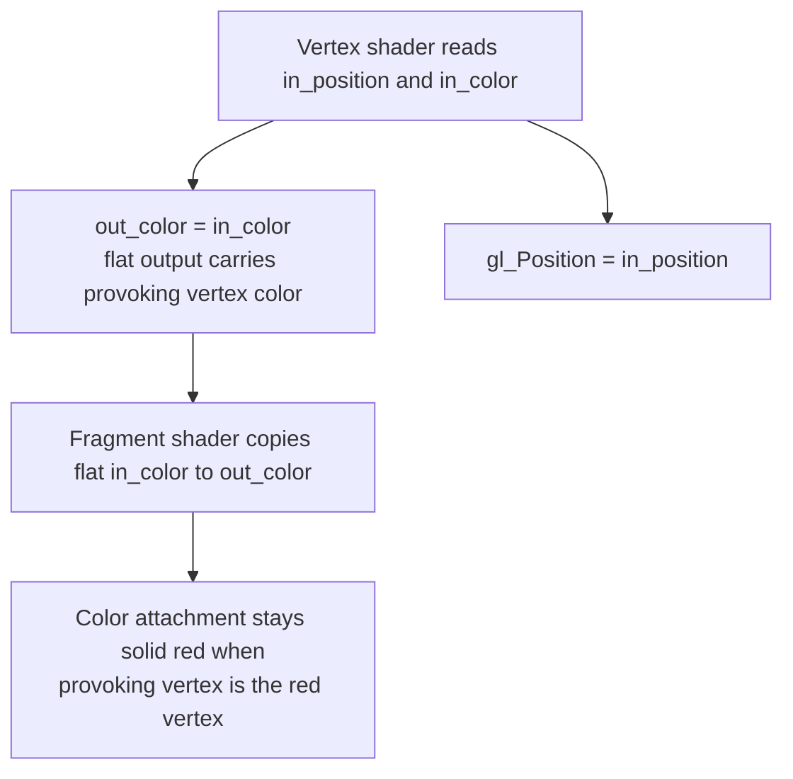
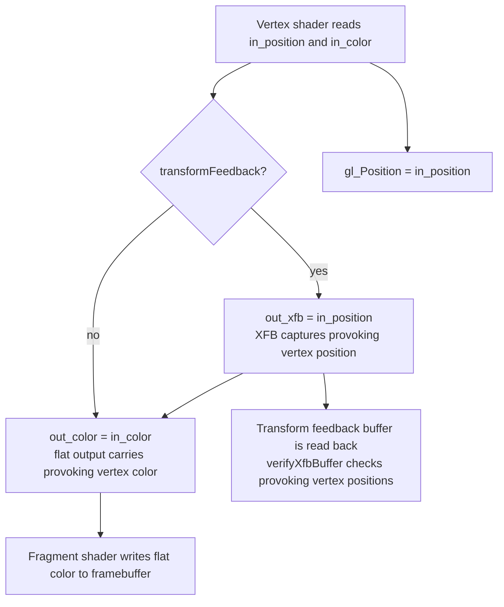

## Overview

**Core question:** Does the implementation pick the spec-correct provoking vertex for each flat-shaded primitive, both for fragment color and for transform-feedback capture, across the supported provoking-vertex modes and primitive topologies?

- [`vktRasterizationProvokingVertexTests.cpp`](../../../modules/vulkan/rasterization/vktRasterizationProvokingVertexTests.cpp#L1) implements the `rasterization.provoking_vertex` test family through [`createProvokingVertexTests()`](../../../modules/vulkan/rasterization/vktRasterizationProvokingVertexTests.cpp#L1156-L1159), attached to the category root by the non-VulkanSC block of [`vktRasterizationTests.cpp`](../../../modules/vulkan/rasterization/vktRasterizationTests.cpp#L10294-L10299).
- The family has two direct test-type children: `draw` and `transform_feedback`. Each is crossed with four provoking-mode children (`default`, `first`, `last`, `per_pipeline`) and nine topology leaves, with `default` skipped for `transform_feedback`.
- The test checks that the provoking vertex's color drives every flat-shaded fragment, and that the provoking vertex's position is the one captured per primitive during transform feedback.
- The page covers the implemented test logic, the parameter matrix, two representative shader walkthroughs, host-side result checking, failure meaning, and the requirement and design pruning that shape the matrix.

## Background Knowledge

- **Provoking vertex and flat shading.** For `flat`-qualified vertex outputs, the fragment shader receives the value from one specific vertex of each primitive, the *provoking vertex*. Vulkan's default convention is the first vertex of the primitive. `VK_EXT_provoking_vertex` allows switching to the last-vertex convention used by OpenGL, and allows pipelines in the same render pass to use different modes when `provokingVertexModePerPipeline` is supported.
- **Provoking vertex per topology.** Which vertex is the provoking vertex depends on primitive topology and convention. For `*_LIST` topologies the provoking vertex is the first (or last) vertex of the primitive itself. For `*_STRIP` and `triangle_fan` topologies the provoking vertex follows the strip/fan convention defined by the spec. Adjacency topologies carry extra adjacency vertices that are not part of the rendered primitive, so the provoking vertex is one of the non-adjacency vertices.
- **Transform feedback capture and the provoking vertex.** `VK_EXT_transform_feedback` lets the vertex shader write selected outputs to a transform feedback buffer. When `VK_EXT_provoking_vertex` is also in use, the extension's `transformFeedbackPreservesProvokingVertex` feature requires the implementation to write transform-feedback vertices in an order that preserves each primitive's provoking vertex. Triangle fans get a separate property, `transformFeedbackPreservesTriangleFanProvokingVertex`, because some implementations cannot reorder triangle-fan output.

## Registration Hierarchy

```text
rasterization.provoking_vertex
├── draw
└── transform_feedback
```

Each direct child is crossed with the same provoking-mode children (`default`, `first`, `last`, `per_pipeline`) and the same nine topology leaves listed in `## Parameter Dimensions and Observed Values`. The `default` mode is intentionally skipped for `transform_feedback` (see `## Case Pruning`).

## Parameter Dimensions and Observed Values

| Dimension | Registered values | Meaning in this test | Evidence |
|-----------|-------------------|----------------------|----------|
| Test type | `draw`, `transform_feedback` | Selects the observation path: framebuffer color for `draw`, transform-feedback buffer contents for `transform_feedback`. This is the primary behavioral axis. | [testTypes[]](../../../modules/vulkan/rasterization/vktRasterizationProvokingVertexTests.cpp#L1110-L1117) |
| Provoking-vertex mode | `default`, `first`, `last`, `per_pipeline` | Selects the provoking-vertex convention. `default` uses Vulkan's built-in first-vertex convention without `VK_EXT_provoking_vertex`. `first` and `last` request `VK_PROVOKING_VERTEX_MODE_FIRST_VERTEX_EXT` or `VK_PROVOKING_VERTEX_MODE_LAST_VERTEX_EXT` through the extension. `per_pipeline` binds two pipelines with different modes inside the same render pass. | [provokingVertexModes[]](../../../modules/vulkan/rasterization/vktRasterizationProvokingVertexTests.cpp#L1073-L1093) |
| Primitive topology | `line_list`, `line_strip`, `triangle_list`, `triangle_strip`, `triangle_fan`, `line_list_with_adjacency`, `line_strip_with_adjacency`, `triangle_list_with_adjacency`, `triangle_strip_with_adjacency` | Selects the primitive topology drawn for each case. The four `*_with_adjacency` topologies require the geometry shader feature. Topology drives vertex-buffer layout, transform-feedback buffer sizing, and the provoking-vertex index calculation. | [topologies[]](../../../modules/vulkan/rasterization/vktRasterizationProvokingVertexTests.cpp#L1095-L1108) |
| Render target format | `VK_FORMAT_R8G8B8A8_UNORM` | Color attachment format used for the result image and its readback buffer. | [Params](../../../modules/vulkan/rasterization/vktRasterizationProvokingVertexTests.cpp#L1135-L1142) |
| Render target extent | `32 x 32` | Framebuffer size used for the solid-red reference compare. | [Params](../../../modules/vulkan/rasterization/vktRasterizationProvokingVertexTests.cpp#L1135-L1142) |

## Behavior Parameters

The primary behavioral axis is the **test-type direct child**. The two values select two independent observation paths that share the same vertex shader, fragment shader, vertex buffer, and provoking-mode/topology matrix, but differ in what the host inspects after the draw.

### draw — Flat-shaded framebuffer color check

The `draw` value checks that every flat-shaded fragment receives the provoking vertex's color. The host clears the color attachment to solid red and draws a topology-specific vertex set whose provoking vertices are red and whose non-provoking vertices use other colors (green, blue, yellow, white). If the implementation picks the correct provoking vertex, the framebuffer stays solid red; if it picks a non-provoking vertex, non-red pixels appear and the exact memory compare fails [vktRasterizationProvokingVertexTests.cpp](../../../modules/vulkan/rasterization/vktRasterizationProvokingVertexTests.cpp#L836-L1002). This value runs across all four provoking modes including `default`, which exercises Vulkan's built-in first-vertex convention without `VK_EXT_provoking_vertex`.

### transform_feedback — Transform-feedback buffer position check

The `transform_feedback` value checks that the implementation writes transform-feedback vertices in an order that preserves the provoking vertex of each primitive. The vertex shader adds an `out_xfb` output that captures `in_position`. After the draw, the host inspects the captured positions with [`verifyXfbBuffer()`](../../../modules/vulkan/rasterization/vktRasterizationProvokingVertexTests.cpp#L94-L130), which walks the captured buffer in primitive-sized steps and checks that each captured provoking vertex matches the expected position from the topology-specific `provoking` index list [vktRasterizationProvokingVertexTests.cpp](../../../modules/vulkan/rasterization/vktRasterizationProvokingVertexTests.cpp#L952-L986). The `default` mode is skipped for this value because the tested property is the `transformFeedbackPreservesProvokingVertex` behavior of `VK_EXT_provoking_vertex`.

## Shader Analysis

The shaders are generated as GLSL strings in [`ProvokingVertexTestCase::initPrograms()`](../../../modules/vulkan/rasterization/vktRasterizationProvokingVertexTests.cpp#L168-L200). The fragment shader and the structure of the vertex shader are constant across the matrix; the only generator branch is whether `m_params.transformFeedback` is set, which adds the `out_xfb` output and the `out_xfb = in_position;` assignment. Two walkthroughs are used: `draw.default.line_list` as the default (no extension, no XFB output), and `transform_feedback.last.line_list` (XFB output present, `VK_EXT_provoking_vertex` enabled with last-vertex mode). The vertex shader is the primary stage for both walkthroughs because it carries the flat output and the XFB capture logic; the fragment shader is included as a secondary block because the `flat` interpolation chain end-to-end is part of the tested behavior. Ordinary parameter differences across modes and topologies are summarized in the variation tables.

### Representative Shader Walkthrough 1

#### Parameter Values Chosen

Representative path:

```text
dEQP-VK.rasterization.provoking_vertex.draw.default.line_list
```

| Parameter choice | Meaning in this representative case |
|------------------|-------------------------------------|
| `draw` | Observation path is framebuffer color, checked against a solid-red reference image. |
| `default` | Uses Vulkan's built-in first-vertex provoking convention. `VK_EXT_provoking_vertex` is not enabled; the pipeline is created without the provoking-vertex pNext. |
| `line_list` | Each pair of vertices forms an independent line primitive. With the first-vertex convention, the provoking vertex is the first vertex of each pair. |
| No transform feedback | The vertex shader does not declare `out_xfb`; only `out_color` and `gl_Position` are written. |

#### Purpose

This shader passes the vertex color through as a `flat` output so the fragment shader receives the provoking vertex's color. The test passes only if the framebuffer stays solid red after the draw, which requires every rendered line to have used its provoking vertex's color.

#### Structural Design



#### Shader Code

##### Vertex Shader

```glsl
#version 450
/// Vertex position attribute at location 0 (VK_FORMAT_R32G32B32A32_SFLOAT).
layout(location = 0) in vec4 in_position;
/// Vertex color attribute at location 1 (VK_FORMAT_R32G32B32A32_SFLOAT).
/// The host-populated colors include red, green, blue, yellow, and white.
layout(location = 1) in vec4 in_color;
/// Flat output at location 0. The fragment shader receives this value from
/// the provoking vertex only; non-provoking vertex colors are discarded.
layout(location = 0) flat out vec4 out_color;

void main()
{
    /// Flat output carries the provoking vertex's color to the fragment shader.
    out_color = in_color;
    gl_Position = in_position;
}
```

##### Fragment Shader

```glsl
#version 450
/// Flat input at location 0. Comes from the provoking vertex of the primitive
/// that produced this fragment.
layout(location = 0) flat in vec4 in_color;
/// Color attachment output at location 0. Compared against a solid-red
/// reference by the host.
layout(location = 0) out vec4 out_color;

void main()
{
    out_color = in_color;
}
```

#### Additional Info

- The fragment shader is identical for every case in the family. It is included here because the `flat` interpolation chain from vertex to fragment to framebuffer is part of the tested behavior.
- The pipeline for this case is created without the `VkPipelineRasterizationProvokingVertexStateCreateInfoEXT` pNext because `provokingVertexMode == PROVOKING_VERTEX_DEFAULT`. Vulkan's built-in first-vertex convention applies [vktRasterizationProvokingVertexTests.cpp](../../../modules/vulkan/rasterization/vktRasterizationProvokingVertexTests.cpp#L374-L398).
- The vertex buffer for `line_list` contains four line primitives: two forward lines whose provoking vertices are red, and two reverse lines whose provoking vertices are also red. Non-provoking vertices use blue, so a wrong provoking-vertex pick produces visible blue pixels [vktRasterizationProvokingVertexTests.cpp](../../../modules/vulkan/rasterization/vktRasterizationProvokingVertexTests.cpp#L467-L490).

#### Parameter Variation Summary

| Parameter dimension | GLSL-level variation from this shader | Evidence |
|---------------------|---------------------------------------|----------|
| Provoking-vertex mode | No GLSL change. `first`/`last`/`per_pipeline` enable `VK_EXT_provoking_vertex` and add the provoking-vertex pNext to the pipeline; the shader source is unchanged. | [pipeline setup](../../../modules/vulkan/rasterization/vktRasterizationProvokingVertexTests.cpp#L374-L452) |
| Primitive topology | No GLSL change. Topology only changes the vertex buffer contents, the XFB buffer sizing for `transform_feedback`, and the provoking-vertex index computation. | [topology switch](../../../modules/vulkan/rasterization/vktRasterizationProvokingVertexTests.cpp#L465-L792) |
| Test type | `transform_feedback` adds the `out_xfb` declaration and the `out_xfb = in_position;` assignment shown in Walkthrough 2. | [vertex shader generation](../../../modules/vulkan/rasterization/vktRasterizationProvokingVertexTests.cpp#L177-L188) |

#### SPIR-V

- Status: generated and validated
- Source: reconstructed GLSL from this walkthrough
- Stage: `vert`
- Target SPIRV version: `spirv1.0`

<details>
<summary>Click to expand SPIRV asm code</summary>

```llvm
; SPIR-V
; Version: 1.0
; Generator: Khronos Glslang Reference Front End; 11
; Bound: 24
; Schema: 0
               OpCapability Shader
          %1 = OpExtInstImport "GLSL.std.450"
               OpMemoryModel Logical GLSL450
               OpEntryPoint Vertex %main "main" %out_color %in_color %_ %in_position
               OpSource GLSL 450
               OpName %main "main"
               OpName %out_color "out_color"
               OpName %in_color "in_color"
               OpName %gl_PerVertex "gl_PerVertex"
               OpMemberName %gl_PerVertex 0 "gl_Position"
               OpMemberName %gl_PerVertex 1 "gl_PointSize"
               OpMemberName %gl_PerVertex 2 "gl_ClipDistance"
               OpMemberName %gl_PerVertex 3 "gl_CullDistance"
               OpName %_ ""
               OpName %in_position "in_position"
               OpDecorate %out_color Flat
               OpDecorate %out_color Location 0
               OpDecorate %in_color Location 1
               OpDecorate %gl_PerVertex Block
               OpMemberDecorate %gl_PerVertex 0 BuiltIn Position
               OpMemberDecorate %gl_PerVertex 1 BuiltIn PointSize
               OpMemberDecorate %gl_PerVertex 2 BuiltIn ClipDistance
               OpMemberDecorate %gl_PerVertex 3 BuiltIn CullDistance
               OpDecorate %in_position Location 0
       %void = OpTypeVoid
          %3 = OpTypeFunction %void
      %float = OpTypeFloat 32
    %v4float = OpTypeVector %float 4
%_ptr_Output_v4float = OpTypePointer Output %v4float
  %out_color = OpVariable %_ptr_Output_v4float Output
%_ptr_Input_v4float = OpTypePointer Input %v4float
   %in_color = OpVariable %_ptr_Input_v4float Input
       %uint = OpTypeInt 32 0
     %uint_1 = OpConstant %uint 1
%_arr_float_uint_1 = OpTypeArray %float %uint_1
%gl_PerVertex = OpTypeStruct %v4float %float %_arr_float_uint_1 %_arr_float_uint_1
%_ptr_Output_gl_PerVertex = OpTypePointer Output %gl_PerVertex
          %_ = OpVariable %_ptr_Output_gl_PerVertex Output
        %int = OpTypeInt 32 1
      %int_0 = OpConstant %int 0
%in_position = OpVariable %_ptr_Input_v4float Input
       %main = OpFunction %void None %3
          %5 = OpLabel
         %12 = OpLoad %v4float %in_color
               OpStore %out_color %12
         %22 = OpLoad %v4float %in_position
         %23 = OpAccessChain %_ptr_Output_v4float %_ %int_0
               OpStore %23 %22
               OpReturn
               OpFunctionEnd
```

</details>

### Representative Shader Walkthrough 2

#### Parameter Values Chosen

Representative path:

```text
dEQP-VK.rasterization.provoking_vertex.transform_feedback.last.line_list
```

| Parameter choice | Meaning in this representative case |
|------------------|-------------------------------------|
| `transform_feedback` | Observation path is the transform-feedback buffer. The host calls `verifyXfbBuffer()` after the draw. |
| `last` | Uses `VK_PROVOKING_VERTEX_MODE_LAST_VERTEX_EXT` via `VK_EXT_provoking_vertex`. Requires `provokingVertexLast` and `transformFeedbackPreservesProvokingVertex`. |
| `line_list` | Each pair of vertices forms an independent line primitive. With the last-vertex convention, the provoking vertex is the second vertex of each pair. |
| Transform feedback enabled | The vertex shader declares `out_xfb` and assigns `out_xfb = in_position;` so the host can inspect which vertex position was captured per primitive. |

#### Purpose

This shader captures the vertex position into a transform-feedback buffer so the host can verify that the implementation writes transform-feedback vertices in an order that preserves the last-vertex provoking convention. It differs from Walkthrough 1 because the tested observation is the XFB buffer rather than the framebuffer, and because the shader carries an additional XFB-decorated output.

#### Structural Design



#### Shader Code

##### Vertex Shader

```glsl
#version 450
/// Vertex position attribute at location 0 (VK_FORMAT_R32G32B32A32_SFLOAT).
layout(location = 0) in vec4 in_position;
/// Vertex color attribute at location 1 (VK_FORMAT_R32G32B32A32_SFLOAT).
layout(location = 1) in vec4 in_color;
/// Flat output at location 0. The fragment shader receives this value from
/// the provoking vertex only.
layout(location = 0) flat out vec4 out_color;
/// Transform-feedback output at location 1. Captures in_position so the host
/// can verify which vertex position was written per primitive. The xfb_buffer
/// and xfb_offset layout qualifiers map to SPIR-V XfbBuffer and Offset
/// decorations.
layout(xfb_buffer = 0, xfb_offset = 0, location = 1) out vec4 out_xfb;

void main()
{
    /// XFB capture: written to the transform feedback buffer in primitive order.
    /// The implementation must order these writes so the provoking vertex of
    /// each primitive is preserved.
    out_xfb = in_position;
    /// Flat output carries the provoking vertex's color to the fragment shader.
    out_color = in_color;
    gl_Position = in_position;
}
```

##### Fragment Shader

```glsl
#version 450
/// Flat input at location 0. Same fragment shader as Walkthrough 1.
layout(location = 0) flat in vec4 in_color;
/// Color attachment output at location 0.
layout(location = 0) out vec4 out_color;

void main()
{
    out_color = in_color;
}
```

#### Additional Info

- The fragment shader is identical to Walkthrough 1. It is included because the `flat` interpolation chain remains part of the tested behavior even when the primary observation is the XFB buffer.
- The `out_xfb` declaration maps to SPIR-V decorations `XfbBuffer 0`, `XfbStride 16`, `Offset 0`, and `Location 1`, and the SPIR-V adds the `TransformFeedback` capability and `OpExecutionMode %main Xfb`. The fragment shader is unaffected.
- For `per_pipeline`, the host binds a second pipeline with the opposite provoking mode and draws the second half of the vertex buffer with it. The vertex shader source is unchanged; the per-pipeline variation is purely a host-side pipeline and draw-record concern [vktRasterizationProvokingVertexTests.cpp](../../../modules/vulkan/rasterization/vktRasterizationProvokingVertexTests.cpp#L415-L452).

#### Parameter Variation Summary

| Parameter dimension | GLSL-level variation from this shader | Evidence |
|---------------------|---------------------------------------|----------|
| Test type | `draw` removes the `out_xfb` declaration and the `out_xfb = in_position;` assignment, producing the Walkthrough 1 shader. | [vertex shader generation](../../../modules/vulkan/rasterization/vktRasterizationProvokingVertexTests.cpp#L177-L188) |
| Provoking-vertex mode | No GLSL change. `first` uses `VK_PROVOKING_VERTEX_MODE_FIRST_VERTEX_EXT`; `per_pipeline` adds a second pipeline with the opposite mode. `default` is skipped for `transform_feedback`. | [pipeline setup](../../../modules/vulkan/rasterization/vktRasterizationProvokingVertexTests.cpp#L374-L452) |
| Primitive topology | No GLSL change. Topology changes the vertex buffer, the XFB buffer size, and the provoking-vertex index arithmetic inside `verifyXfbBuffer()`. | [getXfbBufferSize()](../../../modules/vulkan/rasterization/vktRasterizationProvokingVertexTests.cpp#L69-L92), [verifyXfbBuffer()](../../../modules/vulkan/rasterization/vktRasterizationProvokingVertexTests.cpp#L94-L130) |

#### SPIR-V

- Status: generated and validated
- Source: reconstructed GLSL from this walkthrough
- Stage: `vert`
- Target SPIRV version: `spirv1.0`

<details>
<summary>Click to expand SPIRV asm code</summary>

```llvm
; SPIR-V
; Version: 1.0
; Generator: Khronos Glslang Reference Front End; 11
; Bound: 26
; Schema: 0
               OpCapability Shader
               OpCapability TransformFeedback
          %1 = OpExtInstImport "GLSL.std.450"
               OpMemoryModel Logical GLSL450
               OpEntryPoint Vertex %main "main" %out_xfb %in_position %out_color %in_color %_
               OpExecutionMode %main Xfb
               OpSource GLSL 450
               OpName %main "main"
               OpName %out_xfb "out_xfb"
               OpName %in_position "in_position"
               OpName %out_color "out_color"
               OpName %in_color "in_color"
               OpName %gl_PerVertex "gl_PerVertex"
               OpMemberName %gl_PerVertex 0 "gl_Position"
               OpMemberName %gl_PerVertex 1 "gl_PointSize"
               OpMemberName %gl_PerVertex 2 "gl_ClipDistance"
               OpMemberName %gl_PerVertex 3 "gl_CullDistance"
               OpName %_ ""
               OpDecorate %out_xfb Location 1
               OpDecorate %out_xfb Offset 0
               OpDecorate %out_xfb XfbBuffer 0
               OpDecorate %out_xfb XfbStride 16
               OpDecorate %in_position Location 0
               OpDecorate %out_color Flat
               OpDecorate %out_color Location 0
               OpDecorate %out_color XfbBuffer 0
               OpDecorate %out_color XfbStride 16
               OpDecorate %in_color Location 1
               OpDecorate %gl_PerVertex Block
               OpMemberDecorate %gl_PerVertex 0 BuiltIn Position
               OpMemberDecorate %gl_PerVertex 1 BuiltIn PointSize
               OpMemberDecorate %gl_PerVertex 2 BuiltIn ClipDistance
               OpMemberDecorate %gl_PerVertex 3 BuiltIn CullDistance
               OpDecorate %_ XfbBuffer 0
               OpDecorate %_ XfbStride 16
       %void = OpTypeVoid
          %3 = OpTypeFunction %void
      %float = OpTypeFloat 32
    %v4float = OpTypeVector %float 4
%_ptr_Output_v4float = OpTypePointer Output %v4float
    %out_xfb = OpVariable %_ptr_Output_v4float Output
%_ptr_Input_v4float = OpTypePointer Input %v4float
%in_position = OpVariable %_ptr_Input_v4float Input
  %out_color = OpVariable %_ptr_Output_v4float Output
   %in_color = OpVariable %_ptr_Input_v4float Input
       %uint = OpTypeInt 32 0
     %uint_1 = OpConstant %uint 1
%_arr_float_uint_1 = OpTypeArray %float %uint_1
%gl_PerVertex = OpTypeStruct %v4float %float %_arr_float_uint_1 %_arr_float_uint_1
%_ptr_Output_gl_PerVertex = OpTypePointer Output %gl_PerVertex
          %_ = OpVariable %_ptr_Output_gl_PerVertex Output
        %int = OpTypeInt 32 1
      %int_0 = OpConstant %int 0
       %main = OpFunction %void None %3
          %5 = OpLabel
         %12 = OpLoad %v4float %in_position
               OpStore %out_xfb %12
         %15 = OpLoad %v4float %in_color
               OpStore %out_color %15
         %24 = OpLoad %v4float %in_position
         %25 = OpAccessChain %_ptr_Output_v4float %_ %int_0
               OpStore %25 %24
               OpReturn
               OpFunctionEnd
```

</details>

## Runtime Execution and Result Checking

- **Resource setup.** The host creates a 32x32 `VK_FORMAT_R8G8B8A8_UNORM` color image with color-attachment and transfer-src usage, an image view, and a host-visible result buffer large enough to hold the framebuffer pixels [vktRasterizationProvokingVertexTests.cpp](../../../modules/vulkan/rasterization/vktRasterizationProvokingVertexTests.cpp#L276-L330).
- **Pipeline and provoking mode.** The host builds a graphics pipeline with the topology from `Params`. When `provokingVertexMode != PROVOKING_VERTEX_DEFAULT`, it chains a `VkPipelineRasterizationProvokingVertexStateCreateInfoEXT` pNext selecting `VK_PROVOKING_VERTEX_MODE_FIRST_VERTEX_EXT` or `VK_PROVOKING_VERTEX_MODE_LAST_VERTEX_EXT` [vktRasterizationProvokingVertexTests.cpp](../../../modules/vulkan/rasterization/vktRasterizationProvokingVertexTests.cpp#L374-L413). For `per_pipeline`, the host builds a second pipeline with the opposite mode [vktRasterizationProvokingVertexTests.cpp](../../../modules/vulkan/rasterization/vktRasterizationProvokingVertexTests.cpp#L415-L452).
- **Vertex buffer.** A topology-specific switch populates interleaved `vec4` position and color vertices. For each primitive, the host records the index of the expected provoking vertex in a parallel `provoking` vector. Each topology includes both a forward and a reverse primitive set so that first-vertex and last-vertex conventions are exercised by different vertices [vktRasterizationProvokingVertexTests.cpp](../../../modules/vulkan/rasterization/vktRasterizationProvokingVertexTests.cpp#L455-L805).
- **Transform feedback resources.** For `transform_feedback` cases, the host creates a transform-feedback buffer sized by [`getXfbBufferSize()`](../../../modules/vulkan/rasterization/vktRasterizationProvokingVertexTests.cpp#L69-L92) (doubled for `per_pipeline`) and a counter buffer zeroed before the draw [vktRasterizationProvokingVertexTests.cpp](../../../modules/vulkan/rasterization/vktRasterizationProvokingVertexTests.cpp#L808-L834).
- **Render pass.** The render pass has a single subpass and one color attachment. For the `transform_feedback` + `per_pipeline` combination, the host adds a self-dependency on the transform-feedback counter stage so the second pipeline can resume transform feedback after a counter barrier [vktRasterizationProvokingVertexTests.cpp](../../../modules/vulkan/rasterization/vktRasterizationProvokingVertexTests.cpp#L1009-L1067).
- **Draw and XFB control.** The command buffer transitions the color image to `COLOR_ATTACHMENT_OPTIMAL`, begins the render pass with a solid-red clear, binds the vertex buffer and pipeline, and (for `transform_feedback`) binds the XFB buffer and calls `vkCmdBeginTransformFeedbackEXT`. The draw uses `firstVertex = vertexCount` for `PROVOKING_VERTEX_LAST` so the second half of the vertex buffer is used, and `firstVertex = 0` otherwise. For `per_pipeline`, the host ends transform feedback, inserts a counter barrier, binds the alternate pipeline, restarts transform feedback, and draws the second half. After the draw, transform feedback is ended if active [vktRasterizationProvokingVertexTests.cpp](../../../modules/vulkan/rasterization/vktRasterizationProvokingVertexTests.cpp#L880-L934).
- **Barriers and copyback.** After the render pass, the host inserts a transform-feedback-write to host-read memory barrier for `transform_feedback` cases, then copies the color image to the result buffer [vktRasterizationProvokingVertexTests.cpp](../../../modules/vulkan/rasterization/vktRasterizationProvokingVertexTests.cpp#L925-L939).
- **XFB verification.** For `transform_feedback`, the host invalidates the XFB allocation, logs the captured `vec4` values, and calls [`verifyXfbBuffer()`](../../../modules/vulkan/rasterization/vktRasterizationProvokingVertexTests.cpp#L94-L130). For `per_pipeline`, `verifyXfbBuffer()` is called twice: once on the first half with `PROVOKING_VERTEX_FIRST`, once on the second half with `PROVOKING_VERTEX_LAST`. A single mismatched position fails the case with an index and expected/got message [vktRasterizationProvokingVertexTests.cpp](../../../modules/vulkan/rasterization/vktRasterizationProvokingVertexTests.cpp#L952-L986).
- **Reference image compare.** The host builds a solid-red reference surface and compares it against the result buffer with `deMemCmp` over the full pixel byte range. Any byte difference fails the case with `Incorrect rendering` [vktRasterizationProvokingVertexTests.cpp](../../../modules/vulkan/rasterization/vktRasterizationProvokingVertexTests.cpp#L988-L1002).
- **Pass condition.** The case passes only if both checks (XFB verification when applicable, and the exact reference image compare) succeed. There is no tolerance: a single mismatched XFB entry or a single mismatched framebuffer byte fails the case.

## Failure Meaning

### Failure Cause Mapping

| If this behavior parameter value fails | Possible failure cause(s) |
|----------------------------------------|---------------------------|
| `draw` | Wrong provoking-vertex color reached the fragment shader, or the framebuffer diverged from the solid-red reference for another reason (clear, pipeline, vertex buffer, copyback). |
| `transform_feedback` | Transform-feedback capture wrote the wrong vertex position per primitive (provoking-vertex order not preserved), or the XFB buffer/counter setup, barrier, or host verification logic failed. |

Both values share the solid-red reference image compare, so a wrong provoking-vertex pick in a `draw` case and an unrelated framebuffer defect can both surface as `Incorrect rendering`. The XFB check is unique to `transform_feedback`.

### Cause Analysis

#### Wrong provoking-vertex color in the framebuffer

**Possible failure symptoms:** A `draw` case fails the exact memory compare with `Incorrect rendering`. The framebuffer contains non-red pixels because a non-provoking vertex's color (green, blue, yellow, or white) reached the fragment shader through the `flat` output [vktRasterizationProvokingVertexTests.cpp](../../../modules/vulkan/rasterization/vktRasterizationProvokingVertexTests.cpp#L988-L1002).

**Possible implementation causes:** The implementation picked the wrong vertex as the provoking vertex for the primitive. For `default` and `first` modes, this means the first-vertex convention was not applied correctly; for `last`, the last-vertex convention was not applied; for `per_pipeline`, the second pipeline may have inherited the first pipeline's mode or the per-pipeline property may not be correctly honored. The Vulkan spec defines the provoking vertex per topology and mode, so any deviation is a defect. Source-level investigation would be needed to distinguish a driver pipeline-state defect from a hardware rasterizer defect.

#### Transform-feedback capture did not preserve the provoking vertex

**Possible failure symptoms:** A `transform_feedback` case fails `verifyXfbBuffer()` with an index, an expected position, and a got position. The captured XFB buffer contains the wrong vertex position for at least one primitive [vktRasterizationProvokingVertexTests.cpp](../../../modules/vulkan/rasterization/vktRasterizationProvokingVertexTests.cpp#L94-L130, #L952-L986).

**Possible implementation causes:** `VK_EXT_provoking_vertex` requires `transformFeedbackPreservesProvokingVertex` (and `transformFeedbackPreservesTriangleFanProvokingVertex` for triangle fans) so that transform-feedback writes preserve the provoking vertex of each primitive. A defect here could be the implementation writing vertices in submission order rather than primitive order, incorrect handling of strip/fan topologies under the last-vertex convention, or incorrect counter-buffer accounting for `per_pipeline`. The feature gates are checked in `checkSupport()`, so a failure here means the implementation advertised support but did not honor it. Source-level investigation would be needed to distinguish a transform-feedback unit defect from a vertex-ordering defect in the rasterizer.

#### Framebuffer diverged from the solid-red reference for an unrelated reason

**Possible failure symptoms:** A `draw` or `transform_feedback` case fails the exact memory compare with `Incorrect rendering`, but the failure pattern does not match a non-provoking vertex color. The framebuffer may show the clear color missing, partial coverage, or copyback artifacts.

**Possible implementation causes:** The host clears the color attachment to red before the draw and copies the color image to a host-visible buffer after the render pass. A defect in the clear, the image layout transition, the render-pass store, the image-to-buffer copy, or the host invalidation of the result allocation could all produce a non-matching framebuffer without indicating a provoking-vertex defect. The vertex buffer itself could also be wrong if the topology-specific vertex setup is faulty. These causes are shared across all cases, so a host-side or copyback defect would likely affect multiple cases, not just one. Source-level investigation would be needed to isolate the failing step.

#### XFB buffer, counter, or barrier setup defect

**Possible failure symptoms:** A `transform_feedback` case fails `verifyXfbBuffer()` with captured positions that do not match any plausible vertex ordering, or the case fails before verification due to a device loss or a validation error.

**Possible implementation causes:** The host binds the XFB buffer with `vkCmdBindTransformFeedbackBuffersEXT`, starts and stops transform feedback with `vkCmdBeginTransformFeedbackEXT`/`vkCmdEndTransformFeedbackEXT`, and for `per_pipeline` inserts a counter barrier between the two pipeline binds. A defect in any of these steps (a wrong buffer size, a missing counter zero, a missing counter barrier, a wrong `firstVertex` for the second draw) could produce a corrupted XFB buffer. These causes are host-side or driver-side transform-feedback control defects rather than provoking-vertex defects. Source-level investigation would be needed to confirm the host-side command-buffer recording is correct.

## Case Pruning

### Requirement-based pruning

- Adjacency topologies (`line_list_with_adjacency`, `line_strip_with_adjacency`, `triangle_list_with_adjacency`, `triangle_strip_with_adjacency`) require the `geometryShader` core feature [vktRasterizationProvokingVertexTests.cpp](../../../modules/vulkan/rasterization/vktRasterizationProvokingVertexTests.cpp#L202-L205).
- `transform_feedback` cases require `VK_EXT_transform_feedback` device functionality [vktRasterizationProvokingVertexTests.cpp](../../../modules/vulkan/rasterization/vktRasterizationProvokingVertexTests.cpp#L207-L208).
- `first`, `last`, and `per_pipeline` modes require `VK_EXT_provoking_vertex`. `last` and `per_pipeline` additionally require `provokingVertexLast`; `per_pipeline` additionally requires `provokingVertexModePerPipeline`. `transform_feedback` cases under non-default modes additionally require `transformFeedbackPreservesProvokingVertex`, and triangle-fan `transform_feedback` cases additionally require `transformFeedbackPreservesTriangleFanProvokingVertex` [vktRasterizationProvokingVertexTests.cpp](../../../modules/vulkan/rasterization/vktRasterizationProvokingVertexTests.cpp#L210-L233).
- `triangle_fan` cases are rejected with `NotSupportedError` when `VK_KHR_portability_subset` is present and `triangleFans` is not supported [vktRasterizationProvokingVertexTests.cpp](../../../modules/vulkan/rasterization/vktRasterizationProvokingVertexTests.cpp#L235-L241).
- The `rasterization.provoking_vertex` tree is registered only on non-VulkanSC builds; the parent file gates the registration with `#ifndef CTS_USES_VULKANSC` [vktRasterizationTests.cpp](../../../modules/vulkan/rasterization/vktRasterizationTests.cpp#L10294-L10299).

### Design-based pruning

- The `default` mode is skipped for `transform_feedback` [vktRasterizationProvokingVertexTests.cpp](../../../modules/vulkan/rasterization/vktRasterizationProvokingVertexTests.cpp#L1123-L1127). The `transform_feedback` value exists to test the `transformFeedbackPreservesProvokingVertex` property of `VK_EXT_provoking_vertex`, which has no meaning without the extension. Skipping `default` here avoids registering cases that would exercise only `VK_EXT_transform_feedback` and not the provoking-vertex preservation property.
- The matrix is fixed: 9 topologies × 4 modes for `draw` (36 cases) and 9 topologies × 3 modes for `transform_feedback` (27 cases), for 63 cases total. There is no generated parameter matrix beyond that, so there is no redundant-combination pruning to document.
- The `per_pipeline` mode uses two pipelines with opposite provoking modes inside a single render pass. The mode is only meaningful when `provokingVertexModePerPipeline` is supported, and the test uses two draws (one per pipeline) rather than one draw with a mid-draw pipeline change, which Vulkan does not allow.

## Key Takeaways

- The test-type direct child (`draw` versus `transform_feedback`) is the primary behavioral axis. It selects the observation path: framebuffer color for `draw`, transform-feedback buffer contents for `transform_feedback`. Both values share the same shaders, vertex buffer, and provoking-mode/topology matrix.
- The provoking-mode and topology dimensions are configuration axes, not the primary behavioral axis. They do not change the shader source; they only change the pipeline state, the vertex buffer contents, the XFB buffer sizing, and the provoking-vertex index arithmetic.
- The `draw` value uses a solid-red reference image and an exact `deMemCmp` check. Any non-red pixel fails the case, so the test catches any case where a non-provoking vertex's color leaks into the framebuffer.
- The `transform_feedback` value uses `verifyXfbBuffer()` to walk the captured XFB buffer in primitive-sized steps and check each captured provoking-vertex position. The `default` mode is skipped because the tested property is the XFB-preservation behavior of `VK_EXT_provoking_vertex`.
- The `per_pipeline` mode is the most complex host-side path: it builds two pipelines with opposite modes, ends transform feedback, inserts a counter barrier, binds the alternate pipeline, restarts transform feedback, and draws the second half of the vertex buffer. The render pass carries a self-dependency on the transform-feedback counter stage to allow this sequence inside a single subpass.
- See `## Failure Meaning` for the failure interpretation. A `draw` failure points to a wrong provoking-vertex color or an unrelated framebuffer defect; a `transform_feedback` failure points to a transform-feedback vertex-ordering defect or an XFB/counter/barrier setup defect.

## Source Reference Appendix

| Entry point | Link | Why it matters |
|-------------|------|----------------|
| Parent category attachment | [vktRasterizationTests.cpp#L10294-L10299](../../../modules/vulkan/rasterization/vktRasterizationTests.cpp#L10294-L10299) | Adds `provoking_vertex` to the `rasterization` test category on non-VulkanSC builds. |
| Factory declaration | [vktRasterizationProvokingVertexTests.hpp#L34](../../../modules/vulkan/rasterization/vktRasterizationProvokingVertexTests.hpp#L34) | Declares `createProvokingVertexTests`. |
| Factory entry | [createProvokingVertexTests()](../../../modules/vulkan/rasterization/vktRasterizationProvokingVertexTests.cpp#L1156-L1159) | Creates the root group `provoking_vertex` and dispatches to `createTests()`. |
| Provoking-vertex mode enumeration | [ProvokingVertexMode enum](../../../modules/vulkan/rasterization/vktRasterizationProvokingVertexTests.cpp#L51-L57) | Defines `PROVOKING_VERTEX_DEFAULT`, `_FIRST`, `_LAST`, `_PER_PIPELINE`. |
| Test parameters | [Params struct](../../../modules/vulkan/rasterization/vktRasterizationProvokingVertexTests.cpp#L59-L67) | Carries format, size, topology, geometry-shader requirement, transform-feedback flag, and provoking mode. |
| XFB buffer sizing | [getXfbBufferSize()](../../../modules/vulkan/rasterization/vktRasterizationProvokingVertexTests.cpp#L69-L92) | Computes the XFB buffer size per topology and vertex count. |
| XFB verification | [verifyXfbBuffer()](../../../modules/vulkan/rasterization/vktRasterizationProvokingVertexTests.cpp#L94-L130) | Walks the XFB buffer in primitive-sized steps and checks each captured provoking vertex. |
| Shader generation | [ProvokingVertexTestCase::initPrograms()](../../../modules/vulkan/rasterization/vktRasterizationProvokingVertexTests.cpp#L168-L200) | Emits the vertex and fragment GLSL. The vertex shader conditionally adds the `out_xfb` output. |
| Feature and property gates | [ProvokingVertexTestCase::checkSupport()](../../../modules/vulkan/rasterization/vktRasterizationProvokingVertexTests.cpp#L202-L242) | Applies geometry-shader, transform-feedback, provoking-vertex, per-pipeline, triangle-fan preservation, and portability-subset gates. |
| Pipeline and provoking-mode setup | [iterate() pipeline creation](../../../modules/vulkan/rasterization/vktRasterizationProvokingVertexTests.cpp#L374-L452) | Builds the graphics pipeline with the provoking-vertex pNext and the alternate pipeline for `per_pipeline`. |
| Topology-specific vertex buffer | [iterate() vertex setup](../../../modules/vulkan/rasterization/vktRasterizationProvokingVertexTests.cpp#L455-L805) | Populates positions, colors, and the `provoking` index vector per topology. |
| Transform feedback resources | [iterate() XFB setup](../../../modules/vulkan/rasterization/vktRasterizationProvokingVertexTests.cpp#L808-L834) | Creates and zeroes the XFB buffer and counter buffer. |
| Draw and XFB control | [iterate() command recording](../../../modules/vulkan/rasterization/vktRasterizationProvokingVertexTests.cpp#L880-L934) | Records the render pass, pipeline bind, XFB begin/end, per-pipeline rebind, and draw calls. |
| Result verification | [iterate() result check](../../../modules/vulkan/rasterization/vktRasterizationProvokingVertexTests.cpp#L941-L1003) | Runs `verifyXfbBuffer()` for `transform_feedback`, builds the solid-red reference, and compares with `deMemCmp`. |
| Render pass with optional self-dependency | [ProvokingVertexTestInstance::makeRenderPass()](../../../modules/vulkan/rasterization/vktRasterizationProvokingVertexTests.cpp#L1009-L1067) | Adds the transform-feedback counter self-dependency for the `per_pipeline` + `transform_feedback` combination. |
| Test matrix registration | [createTests()](../../../modules/vulkan/rasterization/vktRasterizationProvokingVertexTests.cpp#L1069-L1152) | Walks the test-type, provoking-mode, and topology arrays and registers each leaf case. |
| Test-type and mode arrays | [testTypes[], provokingVertexModes[], topologies[]](../../../modules/vulkan/rasterization/vktRasterizationProvokingVertexTests.cpp#L1073-L1117) | Defines the registered values used in the parameter dimensions. |
| Mustpass evidence (vk-default) | [vk-default/rasterization.txt#L9239-L9301](../../../mustpass/main/vk-default/rasterization.txt#L9239-L9301) | Lists all 63 cases under `rasterization.provoking_vertex`. |
