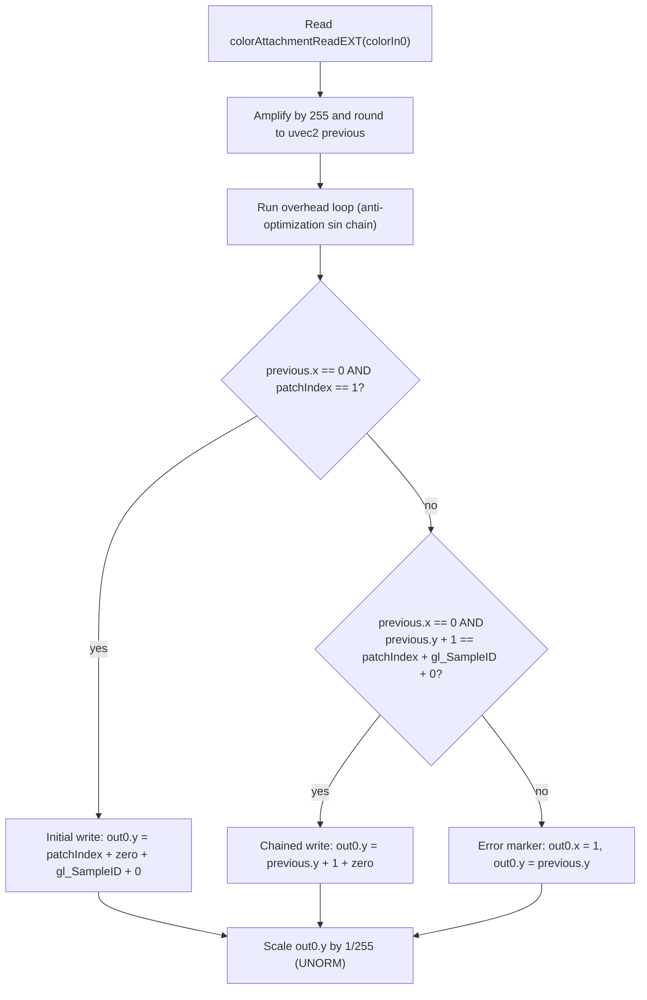
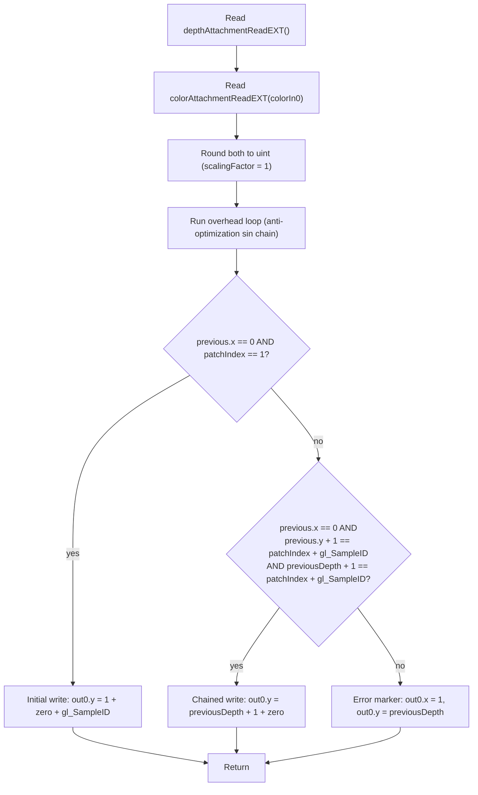
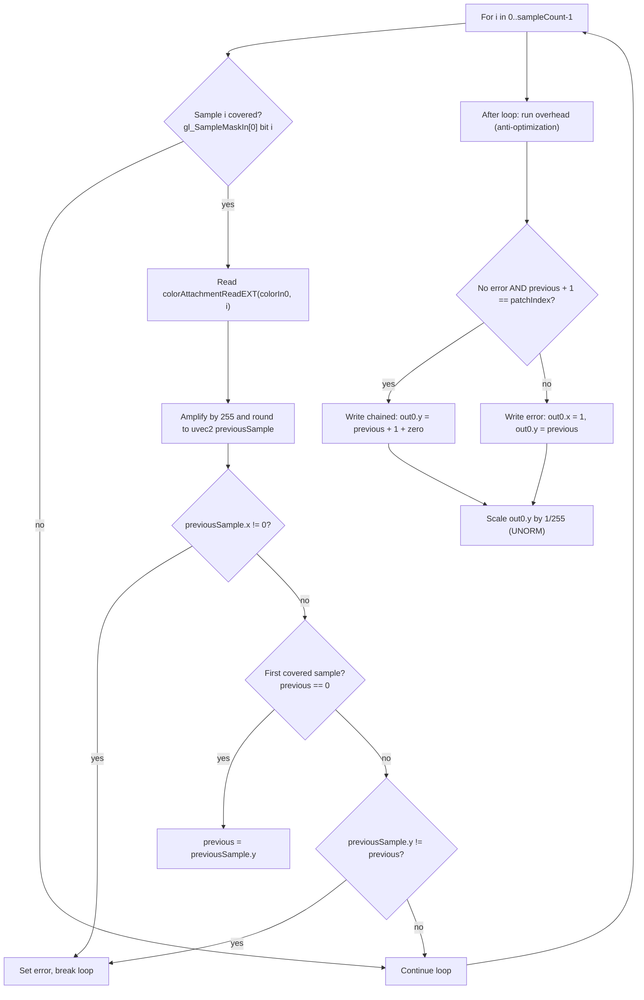

## Overview

**Core question:** after a fragment shader writes a per-patch value to a color, depth, or stencil attachment through dynamic rendering, can a later fragment shader invocation in the same or a subsequent draw read that exact value back through a `colorAttachmentReadEXT`, `depthAttachmentReadEXT`, or `stencilAttachmentReadEXT` call?

[`vktShaderTileImageTests.cpp`](../../../modules/vulkan/rasterization/vktShaderTileImageTests.cpp#L1) implements the `rasterization.shader_tile_image` test family for `VK_EXT_shader_tile_image`. The family is registered by [`createShaderTileImageTests()`](../../../modules/vulkan/rasterization/vktShaderTileImageTests.cpp#L2193-L2200) and the full case matrix is generated by [`createShaderTileImageTestVariations()`](../../../modules/vulkan/rasterization/vktShaderTileImageTests.cpp#L1968-L2189).

- The family has two coherency direct children, `coherent` and `non_coherent`, that share the same test-type, sample-count, draw-count, patch-count, and format matrix but differ in shader qualifiers and inter-draw barriers.
- Beneath each coherency child, nine test-type groups (`color`, `mrt`, `mrt_dynamic_index`, `msaa_sample_mask`, `helper_class_color`, `helper_class_depth`, `helper_class_stencil`, `depth`, `stencil`) exercise distinct extension features: color reads, MRT reads, dynamic-index reads, per-sample reads, helper-invocation reads, and depth or stencil reads.
- Each fragment shader writes a per-patch chained value to a color attachment and marks the result with an error marker when a tile-image read returns the wrong value. A compute shader copies the attachment into a host-visible buffer that [`checkResult()`](../../../modules/vulkan/rasterization/vktShaderTileImageTests.cpp#L1669-L1750) scans for the error marker and the expected chained value.

## Background Knowledge

For the shared concept helper invocations, see [Background Knowledge](../../categories/rasterization.md#background-knowledge) of the `rasterization` page.

### VK_EXT_shader_tile_image and tile-image reads

`VK_EXT_shader_tile_image` exposes fragment-shader built-ins that read the current pixel's color, depth, or stencil attachment directly from tile memory within a dynamic-rendering pass. The shader-side reads are `colorAttachmentReadEXT`, `depthAttachmentReadEXT`, and `stencilAttachmentReadEXT`; color reads optionally take a sample ID for per-sample access. The corresponding tile-image variables are declared as `attachmentEXT` / `iattachmentEXT` / `uattachmentEXT` selected by the color format's channel class at [`initPrograms()`](../../../modules/vulkan/rasterization/vktShaderTileImageTests.cpp#L900-L944). The test relies on these reads to chain per-patch values across fragment shader invocations.

### VK_KHR_dynamic_rendering and tile memory lifetime

Tests use `VK_KHR_dynamic_rendering` (`vkCmdBeginRendering` / `vkCmdEndRendering`) rather than a traditional render pass. Color and depth/stencil attachments are bound through `VkRenderingAttachmentInfoKHR` and the rendering info struct in [`rendering()`](../../../modules/vulkan/rasterization/vktShaderTileImageTests.cpp#L1752-L1956). The pipeline is created with `VkPipelineRenderingCreateInfoKHR` chained to the graphics pipeline create info in [`generateGraphicsPipeline()`](../../../modules/vulkan/rasterization/vktShaderTileImageTests.cpp#L1219-L1440) so attachment formats are known at pipeline creation. Tile-image reads only return valid data inside a dynamic-rendering pass for fragments that touch the same pixel as the prior write.

### Coherent versus non-coherent tile-image reads

Coherent reads are the default tile-image behavior: a fragment shader invocation can read the most recent value written to its pixel by an earlier overlapping invocation in the same rendering pass without an explicit memory barrier. Non-coherent reads add the layout qualifiers `non_coherent_color_attachment_readEXT`, `non_coherent_depth_attachment_readEXT`, and `non_coherent_stencil_attachment_readEXT` to the fragment shader, and the host inserts a `VkMemoryBarrier2KHR` between draw calls at [`vktShaderTileImageTests.cpp#L1871-L1910`](../../../modules/vulkan/rasterization/vktShaderTileImageTests.cpp#L1871-L1910). Non-coherent multi-patch cases are skipped because the implementation cannot guarantee non-coherent visibility between fragment shader invocations of the same draw.

### Helper fragment invocations

The Vulkan property `shaderTileImageReadFromHelperInvocation` reports whether tile-image reads from helper invocations return valid values. The `helper_class_*` test types verify this property by using a second draw whose pipeline disables color0, depth, and stencil writes so its fragment shader runs as helper invocations.

### MSAA sample-rate reads

For multisampled attachments, `colorAttachmentReadEXT` can be called without a sample parameter (returns the pixel-rate value), or with a `gl_SampleID` parameter (returns a per-sample value). The property `shaderTileImageReadSampleFromPixelRateInvocation` reports whether pixel-rate fragment invocations can read per-sample values when `rasterizationSamples > 1`. The `msaa_sample_mask` test type verifies this property by iterating covered samples from `gl_SampleMaskIn[0]` and calling `colorAttachmentReadEXT(colorIn0, i)` for each.

## Registration Hierarchy

```text
rasterization.shader_tile_image
├── coherent
└── non_coherent
```

The two direct children differ only in coherency mode. Beneath each, the same test-type, sample-count, draw-count, patch-count, and format dimensions are generated by [`createShaderTileImageTestVariations()`](../../../modules/vulkan/rasterization/vktShaderTileImageTests.cpp#L1968-L2189), with the pruning rules documented in [## Case Pruning](#case-pruning).

## Parameter Dimensions and Observed Values

| Dimension | Registered values | Meaning in this test | Evidence |
|-----------|-------------------|----------------------|----------|
| Coherency | `coherent`, `non_coherent` | Selects coherent tile-image reads or non-coherent reads with an inter-draw `VkMemoryBarrier2KHR` and `non_coherent_*_attachment_readEXT` qualifiers. | [`coherentParams`](../../../modules/vulkan/rasterization/vktShaderTileImageTests.cpp#L1988-L1989) |
| Test type | `color`, `mrt`, `mrt_dynamic_index`, `msaa_sample_mask`, `helper_class_color`, `helper_class_depth`, `helper_class_stencil`, `depth`, `stencil` | Primary behavioral axis; changes which extension feature is exercised and which shader generator is dispatched. | [`testTypeParams`](../../../modules/vulkan/rasterization/vktShaderTileImageTests.cpp#L1990-L2000) |
| Sample count | `samples_1`, `samples_2`, `samples_4`, `samples_8`, `samples_16`, `samples_32` | Selects `VkSampleCountFlagBits`; sample-shading is enabled for non-`msaa_sample_mask` multi-sample cases. `msaa_sample_mask` skips `samples_1` and helper-class tests are restricted to `samples_1`. | [`sampleCountParams`](../../../modules/vulkan/rasterization/vktShaderTileImageTests.cpp#L2002-L2006), [`vktShaderTileImageTests.cpp#L2073-L2084`](../../../modules/vulkan/rasterization/vktShaderTileImageTests.cpp#L2073-L2084) |
| Draw count | `single_draw`, `multi_draws` | `multi_draws` issues three draw calls and raises the expected chained value. Helper-class tests always run two draws but are registered as `single_draw` because the second draw is the helper-invocation probe. | [`multiDrawsParams`](../../../modules/vulkan/rasterization/vktShaderTileImageTests.cpp#L2008), [`vktShaderTileImageTests.cpp#L2089-L2095`](../../../modules/vulkan/rasterization/vktShaderTileImageTests.cpp#L2089-L2095) |
| Patch count | `single_patch`, `multi_patches` | `multi_patches` uses three patches per draw and exercises coherent visibility between overlapping invocations of the same draw. Non-coherent and helper-class multi-patch cases are pruned. | [`multiPatchParams`](../../../modules/vulkan/rasterization/vktShaderTileImageTests.cpp#L2010), [`vktShaderTileImageTests.cpp#L2101-L2111`](../../../modules/vulkan/rasterization/vktShaderTileImageTests.cpp#L2101-L2111) |
| Color format | 37 color formats across UNORM, SNORM, UINT, SINT, SRGB, PACK16, and SFLOAT channel classes | Selects the tile-image variable type (`attachmentEXT` / `iattachmentEXT` / `uattachmentEXT`) and an `amplifier` derived from the channel bit depth for normalized formats. | [`formats`](../../../modules/vulkan/rasterization/vktShaderTileImageTests.cpp#L2012-L2056), [`vktShaderTileImageTests.cpp#L2117-L2177`](../../../modules/vulkan/rasterization/vktShaderTileImageTests.cpp#L2117-L2177) |
| Depth/stencil format | `D16_UNORM`, `X8_D24_UNORM_PACK32`, `D32_SFLOAT`, `S8_UINT`, `D16_UNORM_S8_UINT`, `D24_UNORM_S8_UINT`, `D32_SFLOAT_S8_UINT` | Selects the depth/stencil attachment format for `depth`, `stencil`, and `helper_class_depth` / `helper_class_stencil` cases. | [`formats`](../../../modules/vulkan/rasterization/vktShaderTileImageTests.cpp#L2050-L2056) |

## Behavior Parameters

The primary behavioral axis is the `testType` dimension: each value exercises a distinct extension feature and dispatches to a different shader generator. The `coherent` / `non_coherent` direct child is a secondary axis that changes shader qualifiers and inter-draw barriers but does not change what is being tested.

### color — Coherent or non-coherent `colorAttachmentReadEXT`

The basic case: a fragment shader reads `colorAttachmentReadEXT(colorIn0)`, applies the chained-patch rule, and writes either the next chained value or an error marker to a single color attachment. The shader generator is [`getColorTestTypeFS()`](../../../modules/vulkan/rasterization/vktShaderTileImageTests.cpp#L343-L472). Support requires `shaderTileImageColorReadAccess` at [`vktShaderTileImageTests.cpp#L974-L977`](../../../modules/vulkan/rasterization/vktShaderTileImageTests.cpp#L974-L977).

### mrt — Multiple render target color reads

The fragment shader declares two `tileImageEXT` variables (`colorIn0`, `colorIn1`) and reads both attachments with separate `colorAttachmentReadEXT` calls. The chained-value rule is applied per render target. The same generator [`getColorTestTypeFS()`](../../../modules/vulkan/rasterization/vktShaderTileImageTests.cpp#L343-L472) emits the additional declarations and reads based on `getColorAttachmentCount(testType)`.

### mrt_dynamic_index — Dynamically-indexed color reads

The fragment shader declares `colorIn[ATTACHMENT_COUNT]` as an array of tile-image variables and reads through a dynamic index (`colorAttachmentReadEXT(colorIn[i])`). This exercises the implementation's ability to index the tile-image descriptor correctly. The shader generator is the same [`getColorTestTypeFS()`](../../../modules/vulkan/rasterization/vktShaderTileImageTests.cpp#L343-L472) with the array form.

### msaa_sample_mask — Per-sample reads from a pixel-rate invocation

The fragment shader iterates samples 0..`sampleCount - 1`, checks each bit in `gl_SampleMaskIn[0]`, and calls `colorAttachmentReadEXT(colorIn0, i)` for each covered sample. Sample shading is disabled and `pSampleMask = 0xaaaaaaaa` is set, so the invocation runs at pixel rate. The shader generator is [`getSampleMaskTypeFS()`](../../../modules/vulkan/rasterization/vktShaderTileImageTests.cpp#L586-L672). Support requires `shaderTileImageReadSampleFromPixelRateInvocation` at [`vktShaderTileImageTests.cpp#L1017-L1026`](../../../modules/vulkan/rasterization/vktShaderTileImageTests.cpp#L1017-L1026). `samples_1` is pruned because the test requires more than one sample.

### helper_class_color — Helper-invocation color reads

The test uses two draw calls. The first draw uses the main pipeline and writes a per-patch value to color attachment 0. The second draw uses a pipeline that disables color0, depth, and stencil writes so its fragment shader runs as helper invocations. The shader reads the previous value through `colorAttachmentReadEXT` and uses `dFdxFine` / `dFdyFine` to distinguish diagonal from off-diagonal pixels. The shader generator is [`getHelperClassTestTypeFS()`](../../../modules/vulkan/rasterization/vktShaderTileImageTests.cpp#L474-L584). Support requires `shaderTileImageReadFromHelperInvocation` at [`vktShaderTileImageTests.cpp#L1029-L1034`](../../../modules/vulkan/rasterization/vktShaderTileImageTests.cpp#L1029-L1034).

### helper_class_depth — Helper-invocation depth reads

The same two-draw structure as `helper_class_color`, but the shader also reads `depthAttachmentReadEXT` and writes the chained value derived from the previous depth. Support requires both `shaderTileImageDepthReadAccess` and `shaderTileImageReadFromHelperInvocation`.

### helper_class_stencil — Helper-invocation stencil reads

The same two-draw structure as `helper_class_color`, but the shader also reads `stencilAttachmentReadEXT` and writes the chained value derived from the previous stencil. Support requires both `shaderTileImageStencilReadAccess` and `shaderTileImageReadFromHelperInvocation`.

### depth — `depthAttachmentReadEXT`

The fragment shader reads `depthAttachmentReadEXT()` and `colorAttachmentReadEXT(colorIn0)`, applies the chained-value rule on both, and writes the chained depth-derived value to the color attachment. Multi-sample cases also write `gl_FragDepth` to force all samples. The shader generator is [`getDepthTestTypeFS()`](../../../modules/vulkan/rasterization/vktShaderTileImageTests.cpp#L674-L742). Support requires `shaderTileImageDepthReadAccess` at [`vktShaderTileImageTests.cpp#L978-L986`](../../../modules/vulkan/rasterization/vktShaderTileImageTests.cpp#L978-L986).

### stencil — `stencilAttachmentReadEXT`

The fragment shader reads `stencilAttachmentReadEXT()` and `colorAttachmentReadEXT(colorIn0)`, applies the chained-value rule, and writes the chained stencil-derived value to the color attachment. Stencil writes are configured so each fragment increments the stencil value by one. The shader generator is [`getStencilTestTypeFS()`](../../../modules/vulkan/rasterization/vktShaderTileImageTests.cpp#L744-L789). Support requires `shaderTileImageStencilReadAccess` at [`vktShaderTileImageTests.cpp#L987-L993`](../../../modules/vulkan/rasterization/vktShaderTileImageTests.cpp#L987-L993).

## Shader Analysis

Three representative walkthroughs cover the distinct shader-generator shapes. Walkthrough 1 (`coherent.color.samples_1.single_draw.single_patch.r8g8b8a8_unorm`) is the default color-read path. Walkthrough 2 (`coherent.depth.samples_1.single_draw.single_patch.d32_sfloat`) adds `depthAttachmentReadEXT` and the depth chained-value rule. Walkthrough 3 (`coherent.msaa_sample_mask.samples_2.single_draw.single_patch.r8g8b8a8_unorm`) iterates covered samples from `gl_SampleMaskIn[0]` and calls per-sample `colorAttachmentReadEXT`. Helper-class and stencil paths are documented in [## Behavior Parameters](#behavior-parameters); they share the chained-value skeleton with these three walkthroughs.

### Representative Shader Walkthrough 1

#### Parameter Values Chosen

| Parameter | Value | Source |
|-----------|-------|--------|
| CTS path | `dEQP-VK.rasterization.shader_tile_image.coherent.color.samples_1.single_draw.single_patch.r8g8b8a8_unorm` | mustpass line 9729 |
| Coherency | `coherent` | no `non_coherent_*_attachment_readEXT` qualifier emitted |
| Test type | `Color` | dispatched to [`getColorTestTypeFS()`](../../../modules/vulkan/rasterization/vktShaderTileImageTests.cpp#L343-L472) |
| Sample count | `samples_1` (`VK_SAMPLE_COUNT_1_BIT`) | sample shading not enabled |
| Draw count | `single_draw` | `drawIndex` advances once |
| Patch count | `single_patch` | `PATCH_COUNT_PER_DRAW = 1`, `TOTAL_PATCH_COUNT = 1` |
| Color format | `VK_FORMAT_R8G8B8A8_UNORM` | normalized → `attachmentEXT`, `amplifier = 255.0` |
| Attachment count | 1 | `colorIn0` only |

#### Purpose

Verify that `colorAttachmentReadEXT(colorIn0)` returns the value written by the most recent overlapping fragment for the same pixel when reads are coherent and the attachment is single-sample. The fragment shader writes the next chained value when the read matches the expected rule, otherwise writes an error marker that the host detects.

#### Structural Design



The fragment shader is the primary shader. The vertex shader is included as a secondary block because it produces `patchIndex`, the chained-value driver consumed by the fragment shader.

#### Shader Code

##### Vertex Shader

```glsl
#version 450 core
precision highp float;
precision highp int;
layout(location = 0) in highp vec2 v_position;
layout(location = 0) flat out uint patchIndex; /// Stage-to-stage transport: per-vertex patch index consumed by fragment shader
layout( push_constant ) uniform ConstBlock
{
    highp uint drawIndex; /// Push constant: per-draw index used to compute global patch index
};
void main ()
{
    uint localPatchIndex = uint(gl_VertexIndex) / 6 + 1; /// 6 vertices per patch; patches are 1-indexed
    uint patchCountPerDraw = 1; /// Fixed: PATCH_COUNT_PER_DRAW from generator
    uint globalPatchIndex = drawIndex * patchCountPerDraw + localPatchIndex; /// drawIndex advances per draw
    patchIndex = globalPatchIndex;
    gl_Position = vec4(v_position, 1.000000 * globalPatchIndex, 1); /// Z carries patchIndex for depth overlap
}
```

##### Fragment Shader

```glsl
#version 450 core
#extension GL_EXT_shader_tile_image : require /// Extension: enables tile-image reads
precision highp float;
precision highp int;
layout( push_constant ) uniform ConstBlock
{
    highp uint drawIndex; /// Push constant: bound at draw-record time
};
layout( location = 0 ) flat in uint patchIndex; /// From vertex shader: drives chained-value rule
layout( location = 0) tileImageEXT highp attachmentEXT colorIn0; /// Tile-image variable: R8G8B8A8_UNORM → floating-point form
layout( location = 0 ) out highp vec4 out0; /// Color attachment 0: (error_flag, chained_value, 0, 0)
void main()
{
    uint zero = 0; /// Always 0; touched by overhead loop to discourage reordering
    uvec2 previous[1];
    previous[0] = uvec2(round((colorAttachmentReadEXT(colorIn0) * 255).xy)); /// Coherent read; amplifier 255 for UNORM
    {
        uint overheadLoop = uint(gl_FragCoord.x) * uint(1 + 1); /// Anti-optimization: data-dependent loop count
        zero = patchIndex / (1 + 1);
        for(uint index = 0u; index < overheadLoop; index++)
        {
            zero = uint(sin(float(zero))); /// Trig chain has no semantic meaning
        }
    }
    if (previous[0].x == 0 && patchIndex == 1)
    {
        out0.x = 0; /// No error
        out0.y = float(patchIndex + zero + gl_SampleID + 0); /// First fragment of first patch: seed value
    }
    else if (previous[0].x == 0 && (previous[0].y + 1) == (patchIndex + gl_SampleID + 0))
    {
        out0.x = 0; /// No error
        out0.y = float(previous[0].y + 1 + zero); /// Chained write: increment previous
    }
    else
    {
        out0.x = 1; /// Error marker: host reads nonzero x as failure
        out0.y = float(previous[0].y); /// Preserve previous y for diagnostics
    }
    out0.y *= 0.00392157; /// Divide by amplifier (1/255) for UNORM output
}
```

#### Additional Info

- The vertex shader is fixed across all `color`, `mrt`, and `mrt_dynamic_index` cases; only `PATCH_COUNT_PER_DRAW` and `INV_TOTAL_PATCH_COUNT` change with the patch-count dimension. The fragment shader is what differs across test types.
- The `255` amplifier is specific to `R8G8B8A8_UNORM`; the generator derives it from the format's channel bit depth so the chained-value integer rule survives UNORM precision loss.
- The overhead loop has no semantic role; it exists to discourage shader compilers from reordering the tile-image read relative to the dependent write.
- `gl_SampleID` is always 0 for `samples_1` but appears in the chained rule so the same generator handles multi-sample cases.

#### Parameter Variation Summary

| Variation | Effect on this shader |
|-----------|------------------------|
| `non_coherent` | Adds `layout(non_coherent_color_attachment_readEXT) tileImageEXT` qualifier; host inserts `VkMemoryBarrier2KHR` between draws. |
| `samples_2`/`4`/`8`/`16`/`32` | Host enables sample shading (`minSampleShading = 1.0`); `gl_SampleID` becomes nonzero and contributes to the chained rule. |
| `multi_draws` | Three draws issued; `drawIndex` advances per draw; expected value rises by `PATCH_COUNT_PER_DRAW` per draw. |
| `multi_patches` | `PATCH_COUNT_PER_DRAW = 3`; three patches overlap per draw; coherent visibility is tested within a single draw. |
| `mrt` | Generator emits a second `colorIn1` tile-image variable and a second chained-value write to `out1`. |
| `mrt_dynamic_index` | Generator emits `colorIn[ATTACHMENT_COUNT]` array and uses `colorAttachmentReadEXT(colorIn[i])` with a dynamic index. |
| Integer color formats | `TILE_IMAGE_TYPE` becomes `uattachmentEXT` or `iattachmentEXT`; `OUTPUT_BASIC_TYPE` becomes `uvec4` / `ivec4`; `amplifier` becomes 1. |

#### SPIR-V

- Status: generated and validated
- Source: reconstructed GLSL from this walkthrough
- Stage: frag
- Target SPIRV version: spirv1.0

<details>
<summary>Click to expand SPIRV asm code</summary>

```llvm
; SPIR-V
; Version: 1.0
; Generator: Khronos Glslang Reference Front End; 11
; Bound: 129
; Schema: 0
               OpCapability Shader
               OpCapability SampleRateShading
               OpCapability TileImageColorReadAccessEXT
               OpExtension "SPV_EXT_shader_tile_image"
          %1 = OpExtInstImport "GLSL.std.450"
               OpMemoryModel Logical GLSL450
               OpEntryPoint Fragment %main "main" %gl_FragCoord %patchIndex %out0 %gl_SampleID
               OpExecutionMode %main OriginUpperLeft
               OpSource GLSL 450
               OpSourceExtension "GL_EXT_shader_tile_image"
               OpName %main "main"
               OpName %zero "zero"
               OpName %previous "previous"
               OpName %colorIn0 "colorIn0"
               OpName %overheadLoop "overheadLoop"
               OpName %gl_FragCoord "gl_FragCoord"
               OpName %patchIndex "patchIndex"
               OpName %index "index"
               OpName %out0 "out0"
               OpName %gl_SampleID "gl_SampleID"
               OpName %ConstBlock "ConstBlock"
               OpMemberName %ConstBlock 0 "drawIndex"
               OpName %_ ""
               OpDecorate %colorIn0 Location 0
               OpDecorate %gl_FragCoord BuiltIn FragCoord
               OpDecorate %patchIndex Flat
               OpDecorate %patchIndex Location 0
               OpDecorate %out0 Location 0
               OpDecorate %gl_SampleID BuiltIn SampleId
               OpDecorate %gl_SampleID Flat
               OpDecorate %ConstBlock Block
               OpMemberDecorate %ConstBlock 0 Offset 0
       %void = OpTypeVoid
          %3 = OpTypeFunction %void
       %uint = OpTypeInt 32 0
%_ptr_Function_uint = OpTypePointer Function %uint
     %uint_0 = OpConstant %uint 0
     %v2uint = OpTypeVector %uint 2
     %uint_1 = OpConstant %uint 1
%_arr_v2uint_uint_1 = OpTypeArray %v2uint %uint_1
%_ptr_Function__arr_v2uint_uint_1 = OpTypePointer Function %_arr_v2uint_uint_1
        %int = OpTypeInt 32 1
      %int_0 = OpConstant %int 0
      %float = OpTypeFloat 32
         %18 = OpTypeImage %float TileImageDataEXT 0 0 0 2 Unknown
%_ptr_TileImageEXT_18 = OpTypePointer TileImageEXT %18
   %colorIn0 = OpVariable %_ptr_TileImageEXT_18 TileImageEXT
    %v4float = OpTypeVector %float 4
  %float_255 = OpConstant %float 255
    %v2float = OpTypeVector %float 2
%_ptr_Function_v2uint = OpTypePointer Function %v2uint
%_ptr_Input_v4float = OpTypePointer Input %v4float
%gl_FragCoord = OpVariable %_ptr_Input_v4float Input
%_ptr_Input_float = OpTypePointer Input %float
     %uint_2 = OpConstant %uint 2
%_ptr_Input_uint = OpTypePointer Input %uint
 %patchIndex = OpVariable %_ptr_Input_uint Input
       %bool = OpTypeBool
      %int_1 = OpConstant %int 1
%_ptr_Output_v4float = OpTypePointer Output %v4float
       %out0 = OpVariable %_ptr_Output_v4float Output
    %float_0 = OpConstant %float 0
%_ptr_Output_float = OpTypePointer Output %float
%_ptr_Input_int = OpTypePointer Input %int
%gl_SampleID = OpVariable %_ptr_Input_int Input
    %float_1 = OpConstant %float 1
%float_0_00392156979 = OpConstant %float 0.00392156979
 %ConstBlock = OpTypeStruct %uint
%_ptr_PushConstant_ConstBlock = OpTypePointer PushConstant %ConstBlock
          %_ = OpVariable %_ptr_PushConstant_ConstBlock PushConstant
       %main = OpFunction %void None %3
          %5 = OpLabel
       %zero = OpVariable %_ptr_Function_uint Function
   %previous = OpVariable %_ptr_Function__arr_v2uint_uint_1 Function
%overheadLoop = OpVariable %_ptr_Function_uint Function
      %index = OpVariable %_ptr_Function_uint Function
               OpStore %zero %uint_0
         %21 = OpLoad %18 %colorIn0
         %23 = OpColorAttachmentReadEXT %v4float %21
         %25 = OpVectorTimesScalar %v4float %23 %float_255
         %27 = OpVectorShuffle %v2float %25 %25 0 1
         %28 = OpExtInst %v2float %1 Round %27
         %29 = OpConvertFToU %v2uint %28
         %31 = OpAccessChain %_ptr_Function_v2uint %previous %int_0
               OpStore %31 %29
         %36 = OpAccessChain %_ptr_Input_float %gl_FragCoord %uint_0
         %37 = OpLoad %float %36
         %38 = OpConvertFToU %uint %37
         %40 = OpIMul %uint %38 %uint_2
               OpStore %overheadLoop %40
         %43 = OpLoad %uint %patchIndex
         %44 = OpUDiv %uint %43 %uint_2
               OpStore %zero %44
               OpStore %index %uint_0
               OpBranch %46
         %46 = OpLabel
               OpLoopMerge %48 %49 None
               OpBranch %50
         %50 = OpLabel
         %51 = OpLoad %uint %index
         %52 = OpLoad %uint %overheadLoop
         %54 = OpULessThan %bool %51 %52
               OpBranchConditional %54 %47 %48
         %47 = OpLabel
         %55 = OpLoad %uint %zero
         %56 = OpConvertUToF %float %55
         %57 = OpExtInst %float %1 Sin %56
         %58 = OpConvertFToU %uint %57
               OpStore %zero %58
               OpBranch %49
         %49 = OpLabel
         %59 = OpLoad %uint %index
         %61 = OpIAdd %uint %59 %int_1
               OpStore %index %61
               OpBranch %46
         %48 = OpLabel
         %62 = OpAccessChain %_ptr_Function_uint %previous %int_0 %uint_0
         %63 = OpLoad %uint %62
         %64 = OpIEqual %bool %63 %uint_0
               OpSelectionMerge %66 None
               OpBranchConditional %64 %65 %66
         %65 = OpLabel
         %67 = OpLoad %uint %patchIndex
         %68 = OpIEqual %bool %67 %uint_1
               OpBranch %66
         %66 = OpLabel
         %69 = OpPhi %bool %64 %48 %68 %65
               OpSelectionMerge %71 None
               OpBranchConditional %69 %70 %88
         %70 = OpLabel
         %76 = OpAccessChain %_ptr_Output_float %out0 %uint_0
               OpStore %76 %float_0
         %77 = OpLoad %uint %patchIndex
         %78 = OpLoad %uint %zero
         %79 = OpIAdd %uint %77 %78
         %82 = OpLoad %int %gl_SampleID
         %83 = OpBitcast %uint %82
         %84 = OpIAdd %uint %79 %83
         %85 = OpIAdd %uint %84 %uint_0
         %86 = OpConvertUToF %float %85
         %87 = OpAccessChain %_ptr_Output_float %out0 %uint_1
               OpStore %87 %86
               OpBranch %71
         %88 = OpLabel
         %89 = OpAccessChain %_ptr_Function_uint %previous %int_0 %uint_0
         %90 = OpLoad %uint %89
         %91 = OpIEqual %bool %90 %uint_0
               OpSelectionMerge %93 None
               OpBranchConditional %91 %92 %93
         %92 = OpLabel
         %94 = OpAccessChain %_ptr_Function_uint %previous %int_0 %uint_1
         %95 = OpLoad %uint %94
         %96 = OpIAdd %uint %95 %uint_1
         %97 = OpLoad %uint %patchIndex
         %98 = OpLoad %int %gl_SampleID
         %99 = OpBitcast %uint %98
        %100 = OpIAdd %uint %97 %99
        %101 = OpIAdd %uint %100 %uint_0
        %102 = OpIEqual %bool %96 %101
               OpBranch %93
         %93 = OpLabel
        %103 = OpPhi %bool %91 %88 %102 %92
               OpSelectionMerge %105 None
               OpBranchConditional %103 %104 %114
        %104 = OpLabel
        %106 = OpAccessChain %_ptr_Output_float %out0 %uint_0
               OpStore %106 %float_0
        %107 = OpAccessChain %_ptr_Function_uint %previous %int_0 %uint_1
        %108 = OpLoad %uint %107
        %109 = OpIAdd %uint %108 %uint_1
        %110 = OpLoad %uint %zero
        %111 = OpIAdd %uint %109 %110
        %112 = OpConvertUToF %float %111
        %113 = OpAccessChain %_ptr_Output_float %out0 %uint_1
               OpStore %113 %112
               OpBranch %105
        %114 = OpLabel
        %116 = OpAccessChain %_ptr_Output_float %out0 %uint_0
               OpStore %116 %float_1
        %117 = OpAccessChain %_ptr_Function_uint %previous %int_0 %uint_1
        %118 = OpLoad %uint %117
        %119 = OpConvertUToF %float %118
        %120 = OpAccessChain %_ptr_Output_float %out0 %uint_1
               OpStore %120 %119
               OpBranch %105
        %105 = OpLabel
               OpBranch %71
         %71 = OpLabel
        %122 = OpAccessChain %_ptr_Output_float %out0 %uint_1
        %123 = OpLoad %float %122
        %124 = OpFMul %float %123 %float_0_00392156979
        %125 = OpAccessChain %_ptr_Output_float %out0 %uint_1
               OpStore %125 %124
               OpReturn
               OpFunctionEnd
```

</details>

### Representative Shader Walkthrough 2

#### Parameter Values Chosen

| Parameter | Value | Source |
|-----------|-------|--------|
| CTS path | `dEQP-VK.rasterization.shader_tile_image.coherent.depth.samples_1.single_draw.single_patch.d32_sfloat` | mustpass line 10487 |
| Coherency | `coherent` | no `non_coherent_*_attachment_readEXT` qualifier emitted |
| Test type | `Depth` | dispatched to [`getDepthTestTypeFS()`](../../../modules/vulkan/rasterization/vktShaderTileImageTests.cpp#L674-L742) |
| Sample count | `samples_1` | `gl_SampleID` is 0 |
| Draw count | `single_draw` | one draw |
| Patch count | `single_patch` | `TOTAL_PATCH_COUNT = 1`, `scalingFactor = 1` |
| Color format | `VK_FORMAT_R32G32B32A32_UINT` (default color attachment for depth tests) | `uattachmentEXT`, `amplifier = 1` |
| Depth/stencil format | `VK_FORMAT_D32_SFLOAT` | depth-only format |

#### Purpose

Verify that `depthAttachmentReadEXT()` returns the depth value written by the most recent overlapping fragment for the same pixel when reads are coherent. The shader reads both depth and color, applies the chained-value rule on both, and writes the next chained depth-derived value to the color attachment.

#### Structural Design



The depth test adds a second read (`depthAttachmentReadEXT`) and requires both the color and depth chained-value rules to hold before writing the next value. The chained value written to `out0.y` derives from the previous depth, not the previous color, so a depth-read failure surfaces directly.

#### Shader Code

```glsl
#version 450 core
#extension GL_EXT_shader_tile_image : require /// Extension: enables tile-image reads
precision highp float;
precision highp int;
layout( push_constant ) uniform ConstBlock
{
    highp uint drawIndex; /// Push constant: per-draw index
};
layout( location = 0 ) flat in uint patchIndex; /// From vertex shader: drives chained-value rule
layout( location = 0 ) tileImageEXT highp uattachmentEXT colorIn0; /// Tile-image variable: UINT color format → uattachmentEXT
layout( location = 0 ) out highp uvec4 out0; /// Color attachment 0: uvec4 because color format is UINT

void main()
{
    uint zero = 0; /// Touched by overhead loop
    uint scalingFactor = 1; /// TOTAL_PATCH_COUNT for depth; matches the depth-value range
    uint previousDepth = uint(round(depthAttachmentReadEXT() * scalingFactor)); /// Coherent depth read
    uvec4 previous = uvec4(round(colorAttachmentReadEXT(colorIn0))); /// Coherent color read; UINT → no amplifier
    {
        uint overheadLoop = uint(gl_FragCoord.x) * uint(1 + 1); /// Anti-optimization
        zero = patchIndex / (1 + 1);
        for(uint index = 0u; index < overheadLoop; index++)
        {
            zero = uint(sin(float(zero))); /// Trig chain has no semantic meaning
        }
    }
    if (previous.x == 0 && patchIndex == 1)
    {
        out0.x = 0; /// No error
        out0.y = (1u + zero + gl_SampleID); /// Initial seed; matches simulate() expected = 1
    }
    else if (previous.x == 0 && (previous.y + 1) == (patchIndex + gl_SampleID) && (previousDepth + 1) == (patchIndex + gl_SampleID))
    {
        out0.x = 0; /// No error
        out0.y = uint(previousDepth + 1 + zero); /// Chained write: derive from previous depth
    }
    else
    {
        out0.x = 1; /// Error marker
        out0.y = uint(previousDepth); /// Preserve previous depth for diagnostics
    }
}
```

#### Additional Info

- The vertex shader is identical to walkthrough 1; it is omitted here because it does not change for depth tests.
- `scalingFactor = TOTAL_PATCH_COUNT` ensures `depthAttachmentReadEXT * scalingFactor` rounds to an integer that survives the chained-value rule. For `single_patch`, `scalingFactor = 1`; for `multi_patches`, `scalingFactor = 3`.
- The color attachment for depth tests defaults to `R32G32B32A32_UINT`, so `colorIn0` is `uattachmentEXT` and `amplifier = 1`. The chained color value is only used to detect the error marker (`previous.x`); the actual chained value written is derived from `previousDepth`.
- For multi-sample depth cases the generator emits an additional `gl_FragDepth` write that forces all samples to receive the depth value, preventing per-sample depth test divergence.

#### Parameter Variation Summary

| Variation | Effect on this shader |
|-----------|------------------------|
| `non_coherent` | Adds `layout(non_coherent_color_attachment_readEXT)` and `layout(non_coherent_depth_attachment_readEXT)` qualifiers; host inserts `VkMemoryBarrier2KHR` between draws. |
| `samples_2`/`4`/`8`/`16`/`32` | Host enables sample shading; shader reads `depthAttachmentReadEXT(gl_SampleID)` and writes `gl_FragDepth`. |
| `multi_draws` | Three draws; `drawIndex` advances; expected value rises per draw. |
| `multi_patches` | `TOTAL_PATCH_COUNT = 3`, so `scalingFactor = 3`; `patchIndex` ranges 1..3 within a single draw. |
| Other depth formats | `D16_UNORM`, `X8_D24_UNORM_PACK32`, `D16_UNORM_S8_UINT`, `D24_UNORM_S8_UINT`, `D32_SFLOAT_S8_UINT` are also registered; `D32_SFLOAT` is shown here as the canonical case. |

#### SPIR-V

- Status: generated and validated
- Source: reconstructed GLSL from this walkthrough
- Stage: frag
- Target SPIRV version: spirv1.0

<details>
<summary>Click to expand SPIRV asm code</summary>

```llvm
; SPIR-V
; Version: 1.0
; Generator: Khronos Glslang Reference Front End; 11
; Bound: 125
; Schema: 0
               OpCapability Shader
               OpCapability SampleRateShading
               OpCapability TileImageColorReadAccessEXT
               OpCapability TileImageDepthReadAccessEXT
               OpExtension "SPV_EXT_shader_tile_image"
          %1 = OpExtInstImport "GLSL.std.450"
               OpMemoryModel Logical GLSL450
               OpEntryPoint Fragment %main "main" %gl_FragCoord %patchIndex %out0 %gl_SampleID
               OpExecutionMode %main OriginUpperLeft
               OpSource GLSL 450
               OpSourceExtension "GL_EXT_shader_tile_image"
               OpName %main "main"
               OpName %zero "zero"
               OpName %scalingFactor "scalingFactor"
               OpName %previousDepth "previousDepth"
               OpName %previous "previous"
               OpName %colorIn0 "colorIn0"
               OpName %overheadLoop "overheadLoop"
               OpName %gl_FragCoord "gl_FragCoord"
               OpName %patchIndex "patchIndex"
               OpName %index "index"
               OpName %out0 "out0"
               OpName %gl_SampleID "gl_SampleID"
               OpName %ConstBlock "ConstBlock"
               OpMemberName %ConstBlock 0 "drawIndex"
               OpName %_ ""
               OpDecorate %colorIn0 Location 0
               OpDecorate %gl_FragCoord BuiltIn FragCoord
               OpDecorate %patchIndex Flat
               OpDecorate %patchIndex Location 0
               OpDecorate %out0 Location 0
               OpDecorate %gl_SampleID BuiltIn SampleId
               OpDecorate %gl_SampleID Flat
               OpDecorate %ConstBlock Block
               OpMemberDecorate %ConstBlock 0 Offset 0
       %void = OpTypeVoid
          %3 = OpTypeFunction %void
       %uint = OpTypeInt 32 0
%_ptr_Function_uint = OpTypePointer Function %uint
     %uint_0 = OpConstant %uint 0
     %uint_1 = OpConstant %uint 1
      %float = OpTypeFloat 32
     %v4uint = OpTypeVector %uint 4
%_ptr_Function_v4uint = OpTypePointer Function %v4uint
         %23 = OpTypeImage %uint TileImageDataEXT 0 0 0 2 Unknown
%_ptr_TileImageEXT_23 = OpTypePointer TileImageEXT %23
   %colorIn0 = OpVariable %_ptr_TileImageEXT_23 TileImageEXT
    %v4float = OpTypeVector %float 4
%_ptr_Input_v4float = OpTypePointer Input %v4float
%gl_FragCoord = OpVariable %_ptr_Input_v4float Input
%_ptr_Input_float = OpTypePointer Input %float
     %uint_2 = OpConstant %uint 2
%_ptr_Input_uint = OpTypePointer Input %uint
 %patchIndex = OpVariable %_ptr_Input_uint Input
       %bool = OpTypeBool
        %int = OpTypeInt 32 1
      %int_1 = OpConstant %int 1
%_ptr_Output_v4uint = OpTypePointer Output %v4uint
       %out0 = OpVariable %_ptr_Output_v4uint Output
%_ptr_Output_uint = OpTypePointer Output %uint
%_ptr_Input_int = OpTypePointer Input %int
%gl_SampleID = OpVariable %_ptr_Input_int Input
 %ConstBlock = OpTypeStruct %uint
%_ptr_PushConstant_ConstBlock = OpTypePointer PushConstant %ConstBlock
          %_ = OpVariable %_ptr_PushConstant_ConstBlock PushConstant
       %main = OpFunction %void None %3
          %5 = OpLabel
       %zero = OpVariable %_ptr_Function_uint Function
%scalingFactor = OpVariable %_ptr_Function_uint Function
%previousDepth = OpVariable %_ptr_Function_uint Function
   %previous = OpVariable %_ptr_Function_v4uint Function
%overheadLoop = OpVariable %_ptr_Function_uint Function
      %index = OpVariable %_ptr_Function_uint Function
               OpStore %zero %uint_0
               OpStore %scalingFactor %uint_1
         %14 = OpDepthAttachmentReadEXT %float
         %15 = OpLoad %uint %scalingFactor
         %16 = OpConvertUToF %float %15
         %17 = OpFMul %float %14 %16
         %18 = OpExtInst %float %1 Round %17
         %19 = OpConvertFToU %uint %18
               OpStore %previousDepth %19
         %26 = OpLoad %23 %colorIn0
         %27 = OpColorAttachmentReadEXT %v4uint %26
         %29 = OpConvertUToF %v4float %27
         %30 = OpExtInst %v4float %1 Round %29
         %31 = OpConvertFToU %v4uint %30
               OpStore %previous %31
         %36 = OpAccessChain %_ptr_Input_float %gl_FragCoord %uint_0
         %37 = OpLoad %float %36
         %38 = OpConvertFToU %uint %37
         %40 = OpIMul %uint %38 %uint_2
               OpStore %overheadLoop %40
         %43 = OpLoad %uint %patchIndex
         %44 = OpUDiv %uint %43 %uint_2
               OpStore %zero %44
               OpStore %index %uint_0
               OpBranch %46
         %46 = OpLabel
               OpLoopMerge %48 %49 None
               OpBranch %50
         %50 = OpLabel
         %51 = OpLoad %uint %index
         %52 = OpLoad %uint %overheadLoop
         %54 = OpULessThan %bool %51 %52
               OpBranchConditional %54 %47 %48
         %47 = OpLabel
         %55 = OpLoad %uint %zero
         %56 = OpConvertUToF %float %55
         %57 = OpExtInst %float %1 Sin %56
         %58 = OpConvertFToU %uint %57
               OpStore %zero %58
               OpBranch %49
         %49 = OpLabel
         %59 = OpLoad %uint %index
         %62 = OpIAdd %uint %59 %int_1
               OpStore %index %62
               OpBranch %46
         %48 = OpLabel
         %63 = OpAccessChain %_ptr_Function_uint %previous %uint_0
         %64 = OpLoad %uint %63
         %65 = OpIEqual %bool %64 %uint_0
               OpSelectionMerge %67 None
               OpBranchConditional %65 %66 %67
         %66 = OpLabel
         %68 = OpLoad %uint %patchIndex
         %69 = OpIEqual %bool %68 %uint_1
               OpBranch %67
         %67 = OpLabel
         %70 = OpPhi %bool %65 %48 %69 %66
               OpSelectionMerge %72 None
               OpBranchConditional %70 %71 %85
         %71 = OpLabel
         %76 = OpAccessChain %_ptr_Output_uint %out0 %uint_0
               OpStore %76 %uint_0
         %77 = OpLoad %uint %zero
         %78 = OpIAdd %uint %uint_1 %77
         %81 = OpLoad %int %gl_SampleID
         %82 = OpBitcast %uint %81
         %83 = OpIAdd %uint %78 %82
         %84 = OpAccessChain %_ptr_Output_uint %out0 %uint_1
               OpStore %84 %83
               OpBranch %72
         %85 = OpLabel
         %86 = OpAccessChain %_ptr_Function_uint %previous %uint_0
         %87 = OpLoad %uint %86
         %88 = OpIEqual %bool %87 %uint_0
               OpSelectionMerge %90 None
               OpBranchConditional %88 %89 %90
         %89 = OpLabel
         %91 = OpAccessChain %_ptr_Function_uint %previous %uint_1
         %92 = OpLoad %uint %91
         %93 = OpIAdd %uint %92 %uint_1
         %94 = OpLoad %uint %patchIndex
         %95 = OpLoad %int %gl_SampleID
         %96 = OpBitcast %uint %95
         %97 = OpIAdd %uint %94 %96
         %98 = OpIEqual %bool %93 %97
               OpBranch %90
         %90 = OpLabel
         %99 = OpPhi %bool %88 %85 %98 %89
               OpSelectionMerge %101 None
               OpBranchConditional %99 %100 %101
        %100 = OpLabel
        %102 = OpLoad %uint %previousDepth
        %103 = OpIAdd %uint %102 %uint_1
        %104 = OpLoad %uint %patchIndex
        %105 = OpLoad %int %gl_SampleID
        %106 = OpBitcast %uint %105
        %107 = OpIAdd %uint %104 %106
        %108 = OpIEqual %bool %103 %107
               OpBranch %101
        %101 = OpLabel
        %109 = OpPhi %bool %99 %90 %108 %100
               OpSelectionMerge %111 None
               OpBranchConditional %109 %110 %118
        %110 = OpLabel
        %112 = OpAccessChain %_ptr_Output_uint %out0 %uint_0
               OpStore %112 %uint_0
        %113 = OpLoad %uint %previousDepth
        %114 = OpIAdd %uint %113 %uint_1
        %115 = OpLoad %uint %zero
        %116 = OpIAdd %uint %114 %115
        %117 = OpAccessChain %_ptr_Output_uint %out0 %uint_1
               OpStore %117 %116
               OpBranch %111
        %118 = OpLabel
        %119 = OpAccessChain %_ptr_Output_uint %out0 %uint_0
               OpStore %119 %uint_1
        %120 = OpLoad %uint %previousDepth
        %121 = OpAccessChain %_ptr_Output_uint %out0 %uint_1
               OpStore %121 %120
               OpBranch %111
        %111 = OpLabel
               OpBranch %72
         %72 = OpLabel
               OpReturn
               OpFunctionEnd
```

</details>

### Representative Shader Walkthrough 3

#### Parameter Values Chosen

| Parameter | Value | Source |
|-----------|-------|--------|
| CTS path | `dEQP-VK.rasterization.shader_tile_image.coherent.msaa_sample_mask.samples_2.single_draw.single_patch.r8g8b8a8_unorm` | mustpass line 12700 |
| Coherency | `coherent` | no `non_coherent_*_attachment_readEXT` qualifier emitted |
| Test type | `MsaaSampleMask` | dispatched to [`getSampleMaskTypeFS()`](../../../modules/vulkan/rasterization/vktShaderTileImageTests.cpp#L586-L672) |
| Sample count | `samples_2` (`VK_SAMPLE_COUNT_2_BIT`) | loop iterates samples 0..1 |
| Draw count | `single_draw` | one draw |
| Patch count | `single_patch` | `TOTAL_PATCH_COUNT = 1` |
| Color format | `VK_FORMAT_R8G8B8A8_UNORM` | normalized → `attachmentEXT`, `amplifier = 255.0` |
| `pSampleMask` | `0xaaaaaaaa` | set by host at [`vktShaderTileImageTests.cpp#L1289-L1294`](../../../modules/vulkan/rasterization/vktShaderTileImageTests.cpp#L1289-L1294); alternates covered samples |
| Sample shading | disabled | unique to `msaa_sample_mask`; all other multi-sample cases enable it |

#### Purpose

Verify that `colorAttachmentReadEXT(colorIn0, sampleID)` returns the correct per-sample value when called from a pixel-rate fragment invocation. The shader iterates covered samples from `gl_SampleMaskIn[0]`, reads each sample's value, validates all covered samples agree, and writes the chained value or an error marker. This is the only test type that runs the fragment shader at pixel rate rather than sample rate.

#### Structural Design



The control flow is dominated by the per-sample loop. The shader aggregates a single `previous` value from all covered samples and flags an error if any covered sample disagrees. This shape is unique to `msaa_sample_mask`; every other multi-sample case uses sample shading and reads `colorAttachmentReadEXT(colorIn0, gl_SampleID)` directly.

#### Shader Code

```glsl
#version 450 core
#extension GL_EXT_shader_tile_image : require /// Extension: enables tile-image reads
precision highp float;
precision highp int;
layout( push_constant ) uniform ConstBlock
{
    highp uint drawIndex; /// Push constant: per-draw index
};
layout( location = 0 ) flat in uint patchIndex; /// From vertex shader: drives chained-value rule
layout( location = 0 ) tileImageEXT highp attachmentEXT colorIn0; /// Tile-image variable: UNORM → attachmentEXT
layout( location = 0 ) out highp vec4 out0; /// Color attachment 0: (error_flag, chained_value, 0, 0)

void main()
{
    uint zero = 0; /// Touched by overhead loop
    uint previous = 0; /// Aggregated covered-sample value; 0 means "no covered sample seen yet"
    bool error = false; /// Sticky error flag; set on any sample disagreement
    for (int i = 0; i < 2; ++i) /// sampleCount = 2; literal-bounded for samples_2
    {
        if (((gl_SampleMaskIn[0] >> i) & 0x1) == 0x1) /// Per-sample coverage check from rasterizer
        {
            uvec2 previousSample = uvec2(round(colorAttachmentReadEXT(colorIn0, i) * 255)).xy; /// Per-sample tile-image read; amplifier 255 for UNORM
            if (previousSample.x != 0)
            {
                error = true; /// Propagate error marker from an earlier invocation
                break;
            }
            if (previous == 0)
            {
                previous = previousSample.y; /// First covered sample seeds the aggregated value
            }

            if ((patchIndex != 1 && previousSample.y == 0) || previous != previousSample.y)
            {
                error = true; /// Sample disagreement or unexpected zero value
                break;
            }
        }
    }

    {
        uint overheadLoop = uint(gl_FragCoord.x) * uint(1 + 1); /// Anti-optimization
        zero = patchIndex / (1 + 1);
        for(uint index = 0u; index < overheadLoop; index++)
        {
            zero = uint(sin(float(zero))); /// Trig chain has no semantic meaning
        }
    }
    if (!error && (previous + 1 == patchIndex))
    {
        out0.x = 0; /// No error
        out0.y = float(previous + 1 + zero); /// Chained write: increment aggregated previous
    }
    else
    {
        out0.x = 1; /// Error marker
        out0.y = float(previous); /// Preserve previous for diagnostics
    }
    out0.y *= 0.00392157; /// Divide by amplifier (1/255) for UNORM output
}
```

#### Additional Info

- `pSampleMask = 0xaaaaaaaa` is unique to `msaa_sample_mask`; it alternates covered samples so the per-sample loop sees a deterministic pattern. Every other multi-sample test type enables sample shading instead and lets `gl_SampleID` vary naturally.
- `simulate()` for `MsaaSampleMask` returns `totalLayerCount + rt` when the sample is covered and `0` otherwise, mirroring the shader's aggregated-previous logic. The host's `getResultValue()` reads `resultData[index + 1]` (the y channel) when the x channel is zero, so an uncovered sample with `previous == 0` and `out0.x == 0` matches `expectedValue == 0`.
- The `samples_1` case is pruned because the test requires more than one sample to exercise pixel-rate per-sample reads.
- The per-sample loop is literal-bounded (`i < 2` for `samples_2`) because `sampleCount` is a compile-time constant in the generator.

#### Parameter Variation Summary

| Variation | Effect on this shader |
|-----------|------------------------|
| `non_coherent` | Adds `layout(non_coherent_color_attachment_readEXT)` qualifier; host inserts `VkMemoryBarrier2KHR` between draws. |
| `samples_4`/`8`/`16`/`32` | Per-sample loop bound becomes the matching literal (`i < 4` etc.); `pSampleMask` is unchanged. |
| `multi_draws` | Three draws; `drawIndex` advances; expected `previous + 1 == patchIndex` rises per draw. |
| `multi_patches` | `patchIndex` ranges 1..3 within a single draw; multiple overlapping fragments per draw. |
| Integer color formats | `colorIn0` becomes `uattachmentEXT` / `iattachmentEXT`; `amplifier` becomes 1; the `* 255` multiply is removed. |

#### SPIR-V

- Status: generated and validated
- Source: reconstructed GLSL from this walkthrough
- Stage: frag
- Target SPIRV version: spirv1.0

<details>
<summary>Click to expand SPIRV asm code</summary>

```llvm
; SPIR-V
; Version: 1.0
; Generator: Khronos Glslang Reference Front End; 11
; Bound: 158
; Schema: 0
               OpCapability Shader
               OpCapability TileImageColorReadAccessEXT
               OpExtension "SPV_EXT_shader_tile_image"
          %1 = OpExtInstImport "GLSL.std.450"
               OpMemoryModel Logical GLSL450
               OpEntryPoint Fragment %main "main" %gl_SampleMaskIn %patchIndex %gl_FragCoord %out0
               OpExecutionMode %main OriginUpperLeft
               OpSource GLSL 450
               OpSourceExtension "GL_EXT_shader_tile_image"
               OpName %main "main"
               OpName %zero "zero"
               OpName %previous "previous"
               OpName %error "error"
               OpName %i "i"
               OpName %gl_SampleMaskIn "gl_SampleMaskIn"
               OpName %previousSample "previousSample"
               OpName %colorIn0 "colorIn0"
               OpName %patchIndex "patchIndex"
               OpName %overheadLoop "overheadLoop"
               OpName %gl_FragCoord "gl_FragCoord"
               OpName %index "index"
               OpName %out0 "out0"
               OpName %ConstBlock "ConstBlock"
               OpMemberName %ConstBlock 0 "drawIndex"
               OpName %_ ""
               OpDecorate %gl_SampleMaskIn BuiltIn SampleMask
               OpDecorate %gl_SampleMaskIn Flat
               OpDecorate %colorIn0 Location 0
               OpDecorate %patchIndex Flat
               OpDecorate %patchIndex Location 0
               OpDecorate %gl_FragCoord BuiltIn FragCoord
               OpDecorate %out0 Location 0
               OpDecorate %ConstBlock Block
               OpMemberDecorate %ConstBlock 0 Offset 0
       %void = OpTypeVoid
          %3 = OpTypeFunction %void
       %uint = OpTypeInt 32 0
%_ptr_Function_uint = OpTypePointer Function %uint
     %uint_0 = OpConstant %uint 0
       %bool = OpTypeBool
%_ptr_Function_bool = OpTypePointer Function %bool
      %false = OpConstantFalse %bool
        %int = OpTypeInt 32 1
%_ptr_Function_int = OpTypePointer Function %int
      %int_0 = OpConstant %int 0
      %int_2 = OpConstant %int 2
     %uint_1 = OpConstant %uint 1
%_arr_int_uint_1 = OpTypeArray %int %uint_1
%_ptr_Input__arr_int_uint_1 = OpTypePointer Input %_arr_int_uint_1
%gl_SampleMaskIn = OpVariable %_ptr_Input__arr_int_uint_1 Input
%_ptr_Input_int = OpTypePointer Input %int
      %int_1 = OpConstant %int 1
     %v2uint = OpTypeVector %uint 2
%_ptr_Function_v2uint = OpTypePointer Function %v2uint
      %float = OpTypeFloat 32
         %45 = OpTypeImage %float TileImageDataEXT 0 0 0 2 Unknown
%_ptr_TileImageEXT_45 = OpTypePointer TileImageEXT %45
   %colorIn0 = OpVariable %_ptr_TileImageEXT_45 TileImageEXT
    %v4float = OpTypeVector %float 4
  %float_255 = OpConstant %float 255
     %v4uint = OpTypeVector %uint 4
       %true = OpConstantTrue %bool
%_ptr_Input_uint = OpTypePointer Input %uint
 %patchIndex = OpVariable %_ptr_Input_uint Input
%_ptr_Input_v4float = OpTypePointer Input %v4float
%gl_FragCoord = OpVariable %_ptr_Input_v4float Input
%_ptr_Input_float = OpTypePointer Input %float
     %uint_2 = OpConstant %uint 2
%_ptr_Output_v4float = OpTypePointer Output %v4float
       %out0 = OpVariable %_ptr_Output_v4float Output
    %float_0 = OpConstant %float 0
%_ptr_Output_float = OpTypePointer Output %float
    %float_1 = OpConstant %float 1
%float_0_00392156979 = OpConstant %float 0.00392156979
 %ConstBlock = OpTypeStruct %uint
%_ptr_PushConstant_ConstBlock = OpTypePointer PushConstant %ConstBlock
          %_ = OpVariable %_ptr_PushConstant_ConstBlock PushConstant
       %main = OpFunction %void None %3
          %5 = OpLabel
       %zero = OpVariable %_ptr_Function_uint Function
   %previous = OpVariable %_ptr_Function_uint Function
      %error = OpVariable %_ptr_Function_bool Function
          %i = OpVariable %_ptr_Function_int Function
%previousSample = OpVariable %_ptr_Function_v2uint Function
%overheadLoop = OpVariable %_ptr_Function_uint Function
      %index = OpVariable %_ptr_Function_uint Function
               OpStore %zero %uint_0
               OpStore %previous %uint_0
               OpStore %error %false
               OpStore %i %int_0
               OpBranch %19
         %19 = OpLabel
               OpLoopMerge %21 %22 None
               OpBranch %23
         %23 = OpLabel
         %24 = OpLoad %int %i
         %26 = OpSLessThan %bool %24 %int_2
               OpBranchConditional %26 %20 %21
         %20 = OpLabel
         %32 = OpAccessChain %_ptr_Input_int %gl_SampleMaskIn %int_0
         %33 = OpLoad %int %32
         %34 = OpLoad %int %i
         %35 = OpShiftRightArithmetic %int %33 %34
         %37 = OpBitwiseAnd %int %35 %int_1
         %38 = OpIEqual %bool %37 %int_1
               OpSelectionMerge %40 None
               OpBranchConditional %38 %39 %40
         %39 = OpLabel
         %48 = OpLoad %45 %colorIn0
         %49 = OpLoad %int %i
         %51 = OpColorAttachmentReadEXT %v4float %48 %49
         %53 = OpVectorTimesScalar %v4float %51 %float_255
         %54 = OpExtInst %v4float %1 Round %53
         %56 = OpConvertFToU %v4uint %54
         %57 = OpCompositeExtract %uint %56 0
         %58 = OpCompositeExtract %uint %56 1
         %59 = OpCompositeConstruct %v2uint %57 %58
               OpStore %previousSample %59
         %60 = OpAccessChain %_ptr_Function_uint %previousSample %uint_0
         %61 = OpLoad %uint %60
         %62 = OpINotEqual %bool %61 %uint_0
               OpSelectionMerge %64 None
               OpBranchConditional %62 %63 %64
         %63 = OpLabel
               OpStore %error %true
               OpBranch %21
         %64 = OpLabel
         %67 = OpLoad %uint %previous
         %68 = OpIEqual %bool %67 %uint_0
               OpSelectionMerge %70 None
               OpBranchConditional %68 %69 %70
         %69 = OpLabel
         %71 = OpAccessChain %_ptr_Function_uint %previousSample %uint_1
         %72 = OpLoad %uint %71
               OpStore %previous %72
               OpBranch %70
         %70 = OpLabel
         %75 = OpLoad %uint %patchIndex
         %76 = OpINotEqual %bool %75 %uint_1
               OpSelectionMerge %78 None
               OpBranchConditional %76 %77 %78
         %77 = OpLabel
         %79 = OpAccessChain %_ptr_Function_uint %previousSample %uint_1
         %80 = OpLoad %uint %79
         %81 = OpIEqual %bool %80 %uint_0
               OpBranch %78
         %78 = OpLabel
         %82 = OpPhi %bool %76 %70 %81 %77
         %83 = OpLogicalNot %bool %82
               OpSelectionMerge %85 None
               OpBranchConditional %83 %84 %85
         %84 = OpLabel
         %86 = OpLoad %uint %previous
         %87 = OpAccessChain %_ptr_Function_uint %previousSample %uint_1
         %88 = OpLoad %uint %87
         %89 = OpINotEqual %bool %86 %88
               OpBranch %85
         %85 = OpLabel
         %90 = OpPhi %bool %82 %78 %89 %84
               OpSelectionMerge %92 None
               OpBranchConditional %90 %91 %92
         %91 = OpLabel
               OpStore %error %true
               OpBranch %21
         %92 = OpLabel
               OpBranch %40
         %40 = OpLabel
               OpBranch %22
         %22 = OpLabel
         %94 = OpLoad %int %i
         %95 = OpIAdd %int %94 %int_1
               OpStore %i %95
               OpBranch %19
         %21 = OpLabel
        %100 = OpAccessChain %_ptr_Input_float %gl_FragCoord %uint_0
        %101 = OpLoad %float %100
        %102 = OpConvertFToU %uint %101
        %104 = OpIMul %uint %102 %uint_2
               OpStore %overheadLoop %104
        %105 = OpLoad %uint %patchIndex
        %106 = OpUDiv %uint %105 %uint_2
               OpStore %zero %106
               OpStore %index %uint_0
               OpBranch %108
        %108 = OpLabel
               OpLoopMerge %110 %111 None
               OpBranch %112
        %112 = OpLabel
        %113 = OpLoad %uint %index
        %114 = OpLoad %uint %overheadLoop
        %115 = OpULessThan %bool %113 %114
               OpBranchConditional %115 %109 %110
        %109 = OpLabel
        %116 = OpLoad %uint %zero
        %117 = OpConvertUToF %float %116
        %118 = OpExtInst %float %1 Sin %117
        %119 = OpConvertFToU %uint %118
               OpStore %zero %119
               OpBranch %111
        %111 = OpLabel
        %120 = OpLoad %uint %index
        %121 = OpIAdd %uint %120 %int_1
               OpStore %index %121
               OpBranch %108
        %110 = OpLabel
        %122 = OpLoad %bool %error
        %123 = OpLogicalNot %bool %122
               OpSelectionMerge %125 None
               OpBranchConditional %123 %124 %125
        %124 = OpLabel
        %126 = OpLoad %uint %previous
        %127 = OpIAdd %uint %126 %uint_1
        %128 = OpLoad %uint %patchIndex
        %129 = OpIEqual %bool %127 %128
               OpBranch %125
        %125 = OpLabel
        %130 = OpPhi %bool %123 %110 %129 %124
               OpSelectionMerge %132 None
               OpBranchConditional %130 %131 %144
        %131 = OpLabel
        %137 = OpAccessChain %_ptr_Output_float %out0 %uint_0
               OpStore %137 %float_0
        %138 = OpLoad %uint %previous
        %139 = OpIAdd %uint %138 %uint_1
        %140 = OpLoad %uint %zero
        %141 = OpIAdd %uint %139 %140
        %142 = OpConvertUToF %float %141
        %143 = OpAccessChain %_ptr_Output_float %out0 %uint_1
               OpStore %143 %142
               OpBranch %132
        %144 = OpLabel
        %146 = OpAccessChain %_ptr_Output_float %out0 %uint_0
               OpStore %146 %float_1
        %147 = OpLoad %uint %previous
        %148 = OpConvertUToF %float %147
        %149 = OpAccessChain %_ptr_Output_float %out0 %uint_1
               OpStore %149 %148
               OpBranch %132
        %132 = OpLabel
        %151 = OpAccessChain %_ptr_Output_float %out0 %uint_1
        %152 = OpLoad %float %151
        %153 = OpFMul %float %152 %float_0_00392156979
        %154 = OpAccessChain %_ptr_Output_float %out0 %uint_1
               OpStore %154 %153
               OpReturn
               OpFunctionEnd
```

</details>

## Runtime Execution and Result Checking

The host-side runtime is in [`rendering()`](../../../modules/vulkan/rasterization/vktShaderTileImageTests.cpp#L1752-L1956) and the result check is in [`checkResult()`](../../../modules/vulkan/rasterization/vktShaderTileImageTests.cpp#L1669-L1750).

### Resource setup and pipeline creation

- One or two color attachments are created in [`generateAttachments()`](../../../modules/vulkan/rasterization/vktShaderTileImageTests.cpp#L1442-L1524). MRT and helper-class tests use two attachments; everything else uses one. The depth/stencil attachment is created when the test type requires it.
- The graphics pipeline is built in [`generateGraphicsPipeline()`](../../../modules/vulkan/rasterization/vktShaderTileImageTests.cpp#L1219-L1440) with `VkPipelineRenderingCreateInfoKHR` chained to the create info. The helper-class test type builds a second pipeline that disables writes to color0, depth, and stencil (`colorWriteMask = 0`, `depthWriteEnable = VK_FALSE`, `stencilTest` failures set to `KEEP`).
- Vertex buffers are generated in [`generateVertexBuffer()`](../../../modules/vulkan/rasterization/vktShaderTileImageTests.cpp#L1526-L1591) with one or two triangle patches per draw. Helper-class tests render a degenerate first patch.

### Draw loop and barriers

- The host begins dynamic rendering with the color and depth/stencil attachments bound through `VkRenderingAttachmentInfoKHR`.
- For each draw, the host binds the pipeline (helper-class tests switch to the helper pipeline for the second draw), pushes the `drawIndex` constant, and draws the patches.
- Non-coherent tests insert a `VkMemoryBarrier2KHR` between draws at [`vktShaderTileImageTests.cpp#L1871-L1910`](../../../modules/vulkan/rasterization/vktShaderTileImageTests.cpp#L1871-L1910). The barrier's `dstAccessMask` selects color, depth, or stencil based on the test type.
- After dynamic rendering ends, the host transitions color attachments to `SHADER_READ_ONLY_OPTIMAL` and dispatches the compute shader ([`addCS()`](../../../modules/vulkan/rasterization/vktShaderTileImageTests.cpp#L826-L898)) to copy texels into a host-visible `uvec2` storage buffer.

### Result scan and pass/fail

- [`getResultValue(fx, fy, fs, rt)`](../../../modules/vulkan/rasterization/vktShaderTileImageTests.cpp#L1607-L1620) reads `resultData[index]` (the x channel). If x is nonzero, the fragment shader wrote the error marker and the function returns `0xFFFFFFFF`. Otherwise it returns `resultData[index + 1]` (the y channel).
- [`simulate(fx, fy, fs, rt)`](../../../modules/vulkan/rasterization/vktShaderTileImageTests.cpp#L1622-L1667) computes the expected value:
  - `MsaaSampleMask`: `totalLayerCount + rt` if the sample is covered by `pSampleMask`, otherwise `0`.
  - `Stencil`: `totalLayerCount + rt` (stencil does not include `gl_SampleID`).
  - Helper-class: `kDerivative1` on the diagonal, `kDerivative0` elsewhere.
  - Everything else: `totalLayerCount + rt + fs`.
- The comparison in [`checkResult()`](../../../modules/vulkan/rasterization/vktShaderTileImageTests.cpp#L1669-L1750):
  - Helper-class tests accept `kDerivative1` for off-diagonal pixels (`|fx - fy| == 1`) because `max(dx, dy)` is ambiguous there.
  - 6-vertex-patch cases fill the whole framebuffer, so every pixel must match.
  - 3-vertex-patch cases fill only a triangle; inside the triangle (`fy > fx`) the value must match, outside the value may be zero or the expected value.
- The comparison is exact: no tolerance is applied. Any mismatch yields `QP_TEST_RESULT_FAIL`.

## Failure Meaning

### Failure Cause Mapping

| If this behavior parameter value fails | Possible failure cause(s) |
|----------------------------------------|---------------------------|
| `color` | Coherent or non-coherent `colorAttachmentReadEXT` returned a value that was not the value written by the most recent overlapping fragment for the same pixel/sample. |
| `mrt` | Coherent or non-coherent `colorAttachmentReadEXT` returned a wrong value for at least one of multiple color attachments. |
| `mrt_dynamic_index` | The dynamically-indexed `colorIn[i]` array form returned a value for the wrong attachment, or the implementation mis-indexed the tile-image descriptor. |
| `msaa_sample_mask` | `colorAttachmentReadEXT(colorIn0, sampleID)` returned a wrong value for a covered sample, or `shaderTileImageReadSampleFromPixelRateInvocation` is reported as supported but does not return per-sample values from a pixel-rate invocation. |
| `helper_class_color` | `colorAttachmentReadEXT` returned a wrong value when called from a helper invocation; `shaderTileImageReadFromHelperInvocation` is reported as supported but is not honored. |
| `helper_class_depth` | `depthAttachmentReadEXT` returned a wrong value when called from a helper invocation, or the helper-invocation read path does not cover depth. |
| `helper_class_stencil` | `stencilAttachmentReadEXT` returned a wrong value when called from a helper invocation, or the helper-invocation read path does not cover stencil. |
| `depth` | `depthAttachmentReadEXT` returned a wrong depth value, or the implementation does not correctly chain depth writes between overlapping fragments. |
| `stencil` | `stencilAttachmentReadEXT` returned a wrong stencil value, or the implementation does not correctly chain stencil writes between overlapping fragments. |

All nine test types share the same host-side pass/fail mechanism: a fragment shader writes an error marker into the color attachment, the compute shader copies it to a host-visible buffer, and `checkResult()` scans the buffer for any mismatch.

### Cause Analysis

#### Tile-image read returns the wrong value

**Possible failure symptoms:** `getResultValue()` returns `0xFFFFFFFF` (the fragment shader wrote `out0.x = 1`) or returns a y value that does not match `simulate()`. The host-side scan in `checkResult()` flags the mismatch and returns `QP_TEST_RESULT_FAIL`.

**Possible implementation causes:** the tile-image read returned a stale or uninitialized value instead of the most recent overlapping write. For coherent reads this points to a tiling or memory-coherence bug in the implementation's tile memory. For non-coherent reads this points to a missing or insufficient inter-draw `VkMemoryBarrier2KHR` handling, or to a driver that does not correctly route the `non_coherent_*_attachment_readEXT` qualifier to the tile-memory non-coherent read path. Source-level investigation of the driver's tile-image descriptor binding is needed when the symptom is exclusive to one test type.

#### Per-sample pixel-rate read returns the wrong sample

**Possible failure symptoms:** `msaa_sample_mask` cases fail with `out0.x == 1` set by the per-sample agreement check, or with the aggregated `previous` not matching `patchIndex`. The host scan flags the mismatch.

**Possible implementation causes:** the implementation reports `shaderTileImageReadSampleFromPixelRateInvocation` as `VK_TRUE` but its pixel-rate invocation path does not route per-sample reads to the correct sample slot. Alternatively, `gl_SampleMaskIn[0]` and the implementation's coverage mask disagree, so the shader iterates a sample that the implementation did not cover.

#### Helper-invocation read returns the wrong value

**Possible failure symptoms:** `helper_class_*` cases fail with `out0.y` not matching `kDerivative0` or `kDerivative1` on the off-diagonal. The derivative-based validation in the shader flagged an unexpected rasterization pattern.

**Possible implementation causes:** the implementation reports `shaderTileImageReadFromHelperInvocation` as `VK_TRUE` but its helper-invocation path returns a stale or zero value instead of the most recent overlapping write. The bug may be specific to one attachment type (color, depth, or stencil), in which case only the corresponding `helper_class_*` case fails.

#### MRT dynamic-index read returns the wrong attachment

**Possible failure symptoms:** `mrt_dynamic_index` cases fail with `out0.x == 1` while `mrt` cases with the same parameters pass. The host scan flags the mismatch.

**Possible implementation causes:** the implementation's tile-image descriptor indexing for `colorAttachmentReadEXT(colorIn[i])` with a dynamic `i` does not correctly select the i-th attachment. This bug is exclusive to the dynamic-index form and would not surface in `mrt` cases that read each attachment by a separate static `colorIn0` / `colorIn1` declaration.

## Case Pruning

### Requirement-based pruning

- Every case requires `VK_KHR_dynamic_rendering` and `VK_EXT_shader_tile_image` at [`ShaderTileImageTestCase::checkSupport()`](../../../modules/vulkan/rasterization/vktShaderTileImageTests.cpp#L951-L961). Cases that fail this gate are not run.
- All cases require `shaderTileImageColorReadAccess` at [`vktShaderTileImageTests.cpp#L974-L977`](../../../modules/vulkan/rasterization/vktShaderTileImageTests.cpp#L974-L977).
- Depth and `helper_class_depth` cases additionally require `shaderTileImageDepthReadAccess` at [`vktShaderTileImageTests.cpp#L978-L986`](../../../modules/vulkan/rasterization/vktShaderTileImageTests.cpp#L978-L986).
- Stencil and `helper_class_stencil` cases additionally require `shaderTileImageStencilReadAccess` at [`vktShaderTileImageTests.cpp#L987-L993`](../../../modules/vulkan/rasterization/vktShaderTileImageTests.cpp#L987-L993).
- `msaa_sample_mask` cases require `shaderTileImageReadSampleFromPixelRateInvocation` at [`vktShaderTileImageTests.cpp#L1017-L1026`](../../../modules/vulkan/rasterization/vktShaderTileImageTests.cpp#L1017-L1026) and skip `samples_1` because the test requires more than one sample.
- Helper-class cases require `shaderTileImageReadFromHelperInvocation` at [`vktShaderTileImageTests.cpp#L1029-L1034`](../../../modules/vulkan/rasterization/vktShaderTileImageTests.cpp#L1029-L1034) and `sampleRateShading` is not required because they are restricted to `samples_1`.
- Non-`msaa_sample_mask` multi-sample cases require `sampleRateShading` at [`vktShaderTileImageTests.cpp#L1057-L1061`](../../../modules/vulkan/rasterization/vktShaderTileImageTests.cpp#L1057-L1061).
- Format support is verified before run; unsupported formats are skipped.

### Design-based pruning

- `msaa_sample_mask` skips `samples_1` because the test requires more than one sample to exercise per-sample reads at pixel rate ([`vktShaderTileImageTests.cpp#L2075-L2079`](../../../modules/vulkan/rasterization/vktShaderTileImageTests.cpp#L2075-L2079)).
- Helper-class tests are restricted to `samples_1` because the derivative-based validation logic assumes a single sample per pixel ([`vktShaderTileImageTests.cpp#L2080-L2084`](../../../modules/vulkan/rasterization/vktShaderTileImageTests.cpp#L2080-L2084)).
- Helper-class tests skip `multi_draws` because the helper-class flow always uses exactly two draws (one main, one helper) and does not vary draw count ([`vktShaderTileImageTests.cpp#L2091-L2095`](../../../modules/vulkan/rasterization/vktShaderTileImageTests.cpp#L2091-L2095)).
- Non-coherent tests skip `multi_patches` because the implementation cannot guarantee non-coherent visibility between fragment shader invocations of the same draw ([`vktShaderTileImageTests.cpp#L2103-L2106`](../../../modules/vulkan/rasterization/vktShaderTileImageTests.cpp#L2103-L2106)).
- Helper-class tests skip `multi_patches` because the helper-class design works on a single patch ([`vktShaderTileImageTests.cpp#L2107-L2111`](../../../modules/vulkan/rasterization/vktShaderTileImageTests.cpp#L2107-L2111)).
- Helper-class tests skip normalized color formats to keep the derivative logic simple ([`vktShaderTileImageTests.cpp#L2155-L2159`](../../../modules/vulkan/rasterization/vktShaderTileImageTests.cpp#L2155-L2159)).
- Color formats are filtered by channel bit depth: a format is registered only when `1 << (channelBitDepth.y() - 1) > maxResultValue`, where `maxResultValue = drawCount * patchCountPerDraw * attachmentCount + sampleCount` ([`vktShaderTileImageTests.cpp#L2161-L2175`](../../../modules/vulkan/rasterization/vktShaderTileImageTests.cpp#L2161-L2175)). This prevents the chained-value rule from overflowing the format's channel capacity.
- Depth and `helper_class_depth` cases register only formats with a depth component; stencil and `helper_class_stencil` cases register only formats with a stencil component; color cases register only formats with neither depth nor stencil ([`vktShaderTileImageTests.cpp#L2133-L2153`](../../../modules/vulkan/rasterization/vktShaderTileImageTests.cpp#L2133-L2153)).

## Key Takeaways

- The page's two coherency direct children exercise coherent and non-coherent tile-image reads; the primary behavioral axis beneath them is the test-type group, which selects the extension feature under test.
- All nine test types share the same chained-value skeleton: a fragment shader reads the previous value, validates it against `previous.y + 1 == patchIndex + gl_SampleID + i`, and writes either the next chained value or an error marker that the host detects.
- The host's pass/fail rule in `checkResult()` is exact with no tolerance; helper-class tests are the only case that accepts two outcomes (`kDerivative0` or `kDerivative1`) on the off-diagonal because `max(dx, dy)` is ambiguous there.
- `msaa_sample_mask` is the only test type that runs the fragment shader at pixel rate; every other multi-sample case enables sample shading and lets `gl_SampleID` vary naturally.
- Non-coherent multi-patch cases are pruned because the implementation cannot guarantee non-coherent visibility between fragment shader invocations of the same draw, while coherent multi-patch cases exercise the strongest coherent guarantee.
- See [## Failure Meaning](#failure-meaning) for analysis of what each failure mode points to in the implementation.

## Source Reference Appendix

| Entry point | Link | Why it matters |
|-------------|------|----------------|
| File-level design comment | [`vktShaderTileImageTests.cpp#L25-L37`](../../../modules/vulkan/rasterization/vktShaderTileImageTests.cpp#L25-L37) | Authoritative comment on the chained-patch design and the per-sample-shading exception for `msaa_sample_mask`. |
| Test parameter struct | [`vktShaderTileImageTests.cpp#L97-L107`](../../../modules/vulkan/rasterization/vktShaderTileImageTests.cpp#L97-L107) | Defines per-case state used by shader generation and the host runtime. |
| `checkSupport()` | [`ShaderTileImageTestCase::checkSupport()`](../../../modules/vulkan/rasterization/vktShaderTileImageTests.cpp#L951-L1087) | Applies all feature, property, format, and sample-count gates. |
| Vertex shader | [`addVS()`](../../../modules/vulkan/rasterization/vktShaderTileImageTests.cpp#L317-L341) | Computes `patchIndex` from `gl_VertexIndex` and `drawIndex`. |
| Color / MRT fragment shader | [`getColorTestTypeFS()`](../../../modules/vulkan/rasterization/vktShaderTileImageTests.cpp#L343-L472) | Generates the chained-value read/write for `color`, `mrt`, and `mrt_dynamic_index`. |
| Helper-class fragment shader | [`getHelperClassTestTypeFS()`](../../../modules/vulkan/rasterization/vktShaderTileImageTests.cpp#L474-L584) | Generates the helper-invocation read with derivative validation. |
| MSAA sample-mask fragment shader | [`getSampleMaskTypeFS()`](../../../modules/vulkan/rasterization/vktShaderTileImageTests.cpp#L586-L672) | Generates the per-sample loop using `gl_SampleMaskIn[0]`. |
| Depth fragment shader | [`getDepthTestTypeFS()`](../../../modules/vulkan/rasterization/vktShaderTileImageTests.cpp#L674-L742) | Generates the chained depth-value read/write and `gl_FragDepth` write. |
| Stencil fragment shader | [`getStencilTestTypeFS()`](../../../modules/vulkan/rasterization/vktShaderTileImageTests.cpp#L744-L789) | Generates the chained stencil-value read/write. |
| Compute shader | [`addCS()`](../../../modules/vulkan/rasterization/vktShaderTileImageTests.cpp#L826-L898) | Copies color attachment texels into a host-visible storage buffer. |
| `initPrograms()` | [`vktShaderTileImageTests.cpp#L900-L944`](../../../modules/vulkan/rasterization/vktShaderTileImageTests.cpp#L900-L944) | Selects `OUTPUT_VECTOR_NAME`, `OUTPUT_BASIC_TYPE`, and `TILE_IMAGE_TYPE` from the color format's channel class. |
| Pipeline setup | [`generateGraphicsPipeline()`](../../../modules/vulkan/rasterization/vktShaderTileImageTests.cpp#L1219-L1440) | Builds the graphics pipeline and the helper-class pipeline variant. |
| Color and depth/stencil attachments | [`generateAttachments()`](../../../modules/vulkan/rasterization/vktShaderTileImageTests.cpp#L1442-L1524) | Creates the test images and views. |
| Vertex buffer | [`generateVertexBuffer()`](../../../modules/vulkan/rasterization/vktShaderTileImageTests.cpp#L1526-L1591) | Generates the per-patch triangle vertices. |
| Compute pipeline and descriptor set | [`generateComputePipeline()`](../../../modules/vulkan/rasterization/vktShaderTileImageTests.cpp#L1107-L1217) | Builds the compute pipeline used to copy color attachment data into host memory. |
| `iterate()` | [`vktShaderTileImageTests.cpp#L1601-L1605`](../../../modules/vulkan/rasterization/vktShaderTileImageTests.cpp#L1601-L1605) | Entry point: calls `rendering()` then `checkResult()`. |
| `getResultValue()` | [`vktShaderTileImageTests.cpp#L1607-L1620`](../../../modules/vulkan/rasterization/vktShaderTileImageTests.cpp#L1607-L1620) | Reads the host-visible copy buffer and returns `0xFFFFFFFF` on error marker. |
| `simulate()` | [`vktShaderTileImageTests.cpp#L1622-L1667`](../../../modules/vulkan/rasterization/vktShaderTileImageTests.cpp#L1622-L1667) | Computes the expected value for a given `(fx, fy, fs, rt)`. |
| `checkResult()` | [`vktShaderTileImageTests.cpp#L1669-L1750`](../../../modules/vulkan/rasterization/vktShaderTileImageTests.cpp#L1669-L1750) | Reads the host-visible copy buffer and decides pass/fail. |
| Dynamic rendering loop | [`rendering()`](../../../modules/vulkan/rasterization/vktShaderTileImageTests.cpp#L1752-L1956) | Drives the dynamic-rendering pass, draw loop, non-coherent barriers, and the final compute copy. |
| Test hierarchy generation | [`createShaderTileImageTestVariations()`](../../../modules/vulkan/rasterization/vktShaderTileImageTests.cpp#L1968-L2189) | Builds the full coherency / test-type / sample-count / draw-count / patch-count / format matrix with pruning. |
| Test family registration | [`createShaderTileImageTests()`](../../../modules/vulkan/rasterization/vktShaderTileImageTests.cpp#L2193-L2200) | Creates the `shader_tile_image` root group. |
| Mustpass entry list | [`rasterization.txt`](../../../mustpass/main/vk-default/rasterization.txt) | Lists every `dEQP-VK.rasterization.shader_tile_image.*` case in `vk-default`; first `shader_tile_image` entry at line 9582. |
