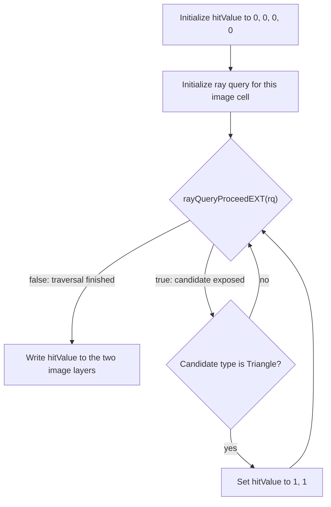

## Overview

**Core question:** Do inline ray queries keep producing the expected traversal result when acceleration structures are built and transformed through the family’s supported flags, formats, operations, update paths, indexing forms, residency modes, and empty-input cases?

This page covers the `acceleration_structures` test family registered by [vktRayQueryAccelerationStructuresTests.cpp](../../../modules/vulkan/ray_query/vktRayQueryAccelerationStructuresTests.cpp#L4744-L4768).

- Seven families use a shared generated-GLSL ray-query body and an `8 × 8 × 2` R32_UINT result image. Compute, fragment, and ray-tracing cases expect the interior checkerboard hit pattern; vertex, tessellation, and geometry cases use stage-specific reference locations in the same image.
- Those seven families rebuild a checkerboard scene per leaf and exercise distinct create, build, copy, update, culling, or empty-AS configurations. Empty-AS leaves expect misses at every location that the selected stage validates.
- For `host_threading` leaves the host repeats the copy or serialization path through Vulkan deferred operations on multiple worker threads, and the test passes only when both the ordinary and worker-thread runs independently match the reference.
- For `function_argument`, a hand-written SPIR-V shader passes the acceleration structure through nested wrapper functions: the outer wrapper receives a UniformConstant pointer, loads the AS value, and passes that bare value to the inner wrapper. It writes the same stage-appropriate hit/miss image as the generated-GLSL cases.
- For `dynamic_indexing`, a separate hand-written SPIR-V shader uses `SPV_EXT_descriptor_indexing` to drive non-uniform indexing into a 500-element TLAS descriptor array and an SSBO of TLAS device-address values, then checks four result-buffer regions for `2`, `3`, `5`, and `7`.

## Background Knowledge

For the shared concept acceleration-structure and traversal, see [Background Knowledge](../../categories/ray_query.md#background-knowledge) of the `ray_query` page.

- **Acceleration-structure hierarchy.** A BLAS stores geometry, while a TLAS stores transformed instances that
  reference BLASes. This family varies how those structures are built, represented, and changed while requiring
  equivalent traversal results.
- **Host and device builds.** Vulkan can build acceleration structures through host commands on the CPU or recorded device commands on the GPU. Host builds require the `accelerationStructureHostCommands` feature; both paths must produce structures with equivalent traversal semantics.
- **Post-build operations and updates.** A built acceleration structure can be copied, compacted, or serialized; those operations preserve the logical traversal content while changing storage or representation. An update is different: it revises the structure’s traversal data after a build that allowed updates.
- **Update modes.** A normal update uses source and destination roles that may refer to different acceleration structures, while an in-place update uses the same acceleration structure for both roles. The ray-query tests include both because they can exercise different implementation paths.
- **Deferred host operations.** Some host acceleration-structure work can be represented by `VkDeferredOperationKHR` and joined by multiple CPU threads. Completion of the deferred operation must make the same final structure available regardless of how many threads participate.

## Registration Hierarchy

```text
ray_query.acceleration_structures
├── flags
├── format
├── operations
├── host_threading
├── function_argument
├── instance_triangle_culling
├── instance_update
├── dynamic_indexing
└── empty
```

Each family uses its own intermediate-node layout, and the actual test case leaves live several levels deeper inside each subtree. The families share the same `CheckerboardSceneBuilder`, the same result-image verification, and (with one exception) the same ray-query body fragment.

## Parameter Dimensions and Observed Values

| Dimension | Family | Registered values | Meaning in this test | Evidence |
|-----------|--------|-------------------|----------------------|----------|
| Residency | most families | `traditional_structures`, `sparse_binding_structures` | Where the acceleration-structure buffer memory lives; cross-gates host-build cases. | [vktRayQueryAccelerationStructuresTests.cpp:3528-L3536](../../../modules/vulkan/ray_query/vktRayQueryAccelerationStructuresTests.cpp#L3528-L3536) |
| Shader source / pipeline | most families | vert, tesc, tese, geom, frag, comp, rgen, isect, ahit, chit, miss, call | Selects the pipeline that runs the ray query; stage-specific feature gates apply. | [vktRayQueryAccelerationStructuresTests.cpp:3539-L3561](../../../modules/vulkan/ray_query/vktRayQueryAccelerationStructuresTests.cpp#L3539-L3561) |
| Build type | most families | `cpu_built` (HOST_KHR), `gpu_built` (DEVICE_KHR) | Where the BLAS/TLAS build runs. | [vktRayQueryAccelerationStructuresTests.cpp:3562-L3570](../../../modules/vulkan/ray_query/vktRayQueryAccelerationStructuresTests.cpp#L3562-L3570) |
| Bottom geometry | most families | `triangles`, `aabbs` (plus `triangles_aop` and `aabbs_aop` for `flags`) | The BLAS geometry and whether it uses arrays-of-pointers. | [vktRayQueryAccelerationStructuresTests.cpp:3571-L3582](../../../modules/vulkan/ray_query/vktRayQueryAccelerationStructuresTests.cpp#L3571-L3582) |
| Top instance pattern | most families | `identical_instances`, `different_instances` (plus `*_aop`) | Single-BLAS-many-instances vs one-instance-per-geometry placement. | [vktRayQueryAccelerationStructuresTests.cpp:3583-L3594](../../../modules/vulkan/ray_query/vktRayQueryAccelerationStructuresTests.cpp#L3583-L3594) |
| Padding | `flags`, `format` | `nopadding`, `padded` | Whether vertex stride matches the BLAS input layout. | [vktRayQueryAccelerationStructuresTests.cpp:3622-L3629](../../../modules/vulkan/ray_query/vktRayQueryAccelerationStructuresTests.cpp#L3622-L3629) |
| Build flags (4 axes) | `flags` | optimization (`0/fasttrace/fastbuild`), update (`0/update`), compaction (`0/compaction`), lowmemory (`0/lowmemory`) | Combines the four flags into one name token; encoded into the leaf name. | [vktRayQueryAccelerationStructuresTests.cpp:3595-L3621](../../../modules/vulkan/ray_query/vktRayQueryAccelerationStructuresTests.cpp#L3595-L3621) |
| Generic creation | `flags` | `""`, `_bottomgeneric`, `_topgeneric`, `_bothgeneric` | Whether the BLAS and/or TLAS are created as generic (no typed create info). | [vktRayQueryAccelerationStructuresTests.cpp:3631-L3641](../../../modules/vulkan/ray_query/vktRayQueryAccelerationStructuresTests.cpp#L3631-L3641) |
| Vertex format | `format` | 15 listed `VkFormat`s (e.g. `R32G32B32_SFLOAT`, `R16G16B16_SFLOAT`, `R64G64B64A64_SFLOAT`) | The BLAS vertex buffer format; format-specific texture layout. | [vktRayQueryAccelerationStructuresTests.cpp:3776-L3887](../../../modules/vulkan/ray_query/vktRayQueryAccelerationStructuresTests.cpp#L3776-L3887) |
| Index format | `format`, `instance_triangle_culling`, `empty` | `index_none`, `index_uint16`, `index_uint32` | The BLAS index buffer type where supported. | [vktRayQueryAccelerationStructuresTests.cpp:3879-L3887](../../../modules/vulkan/ray_query/vktRayQueryAccelerationStructuresTests.cpp#L3879-L3887) |
| Operation type | `operations`, `instance_update`, `host_threading` | `copy`, `compaction`, `serialization`, `update`, `update_in_place` | The AS post-build operation. | [vktRayQueryAccelerationStructuresTests.cpp:4048-L4056](../../../modules/vulkan/ray_query/vktRayQueryAccelerationStructuresTests.cpp#L4048-L4056), [L4476-L4484](../../../modules/vulkan/ray_query/vktRayQueryAccelerationStructuresTests.cpp#L4476-L4484) |
| Operation target | `operations` | `top_acceleration_structure`, `bottom_acceleration_structure` | Which AS the operation acts on. | [vktRayQueryAccelerationStructuresTests.cpp:4067-L4074](../../../modules/vulkan/ray_query/vktRayQueryAccelerationStructuresTests.cpp#L4067-L4074) |
| Worker threads | `host_threading` | `1`, `2`, `3`, `4`, `8`, `max` | Number of CPU threads joining the deferred copy or serialization operation. | [vktRayQueryAccelerationStructuresTests.cpp:4178-L4190](../../../modules/vulkan/ray_query/vktRayQueryAccelerationStructuresTests.cpp#L4176-L4190) |
| Function-call representation | `function_argument` | fixed nested pointer-to-value path | The outer SPIR-V wrapper receives a UniformConstant pointer, loads the AS, and passes the bare value to the inner wrapper; this is one mechanism inside every leaf, not a registered choice. | [vktRayQueryAccelerationStructuresTests.cpp:2199-L2489](../../../modules/vulkan/ray_query/vktRayQueryAccelerationStructuresTests.cpp#L2199-L2489) |
| Cull flags | `instance_triangle_culling` | `noflags`, `ccw`, `nocull`, `ccw_nocull` | Per-instance face-culling flags combined with the back-face cull ray flag. | [vktRayQueryAccelerationStructuresTests.cpp:4339-L4357](../../../modules/vulkan/ray_query/vktRayQueryAccelerationStructuresTests.cpp#L4339-L4357) |
| Empty case | `empty` | `inactive_triangles`, `inactive_instances`, `no_geometries_bottom`, `no_primitives_top`, `no_primitives_bottom` | The kind of empty AS the build produces. | [vktRayQueryAccelerationStructuresTests.cpp:4664-L4674](../../../modules/vulkan/ray_query/vktRayQueryAccelerationStructuresTests.cpp#L4664-L4674) |
| Dynamic-index form | `dynamic_indexing` | `nonuniformEXT(tlasIndex)` into `tlasArray[]`, or `*tlasPointers.ptr[nonuniformEXT(...)]` | The way the shader picks a TLAS for the ray query. | [vktRayQueryAccelerationStructuresTests.cpp:3020-L3068](../../../modules/vulkan/ray_query/vktRayQueryAccelerationStructuresTests.cpp#L3020-L3068) |

## Behavior Parameters

Each family defines its own behavioral axis. The matrix describes what changes in the AS construction flow or post-build operation under test.

### `flags` — Build flags, residency, geometry, instance pattern, padding, generic creation

The primary behavioral axis is the chain of `(optimization, update, compaction, lowMemory)` flags combined with the create-generic suffix (`""`, `_bottomgeneric`, `_topgeneric`, `_bothgeneric`) and the optional `_device_address` suffix (a small subset of leaves). Each leaf rebuilds the BLAS and TLAS with the chosen combination on the chosen residency and shader-source pipeline. The leaf passes when its result image exactly matches the stage-appropriate reference.

### `format` — Vertex and index formats

The primary behavioral axis is the choice of vertex format (one of 15 listed `VkFormat`s) and the padding mode. Unsupported vertex formats are pruned by `checkAccelerationStructureVertexBufferFormat`; an executed leaf expects the stage-appropriate reference pattern, so failure means a format reported as supported produced wrong geometry or interacted with the padded stride incorrectly.

### `operations` — Copy, compaction, serialization

The primary behavioral axis is `OperationType × OperationTarget × BuildType`. The host runs an operation on the chosen target AS first and then uses the result as the ray-query TLAS. The test fails when the destination AS traces a different hit/miss pattern from the source.

### `host_threading` — Multi-threaded CPU build via deferred operations

The primary behavioral axis is `workerThreads ∈ {1, 2, 3, 4, 8, max}`; the second axis is the restricted `OperationType ∈ {copy, serialization}`. The host runs the case once without workers and once with `workerThreads`, then compares each result independently with the stage-appropriate reference. A failure can come from either run; only a passing ordinary run paired with a failing worker run specifically implicates the deferred worker path.

### `function_argument` — AS loaded from a pointer and passed as a bare value

There is no registered pointer-versus-value axis. Every leaf executes the same nested SPIR-V call path: the outer wrapper receives a UniformConstant pointer, loads the acceleration-structure value, and passes that bare value to the inner wrapper that executes `OpRayQueryInitializeKHR`. The output must match the normal hit/miss reference for the selected residency and build type.

### `instance_triangle_culling` — Counterclockwise triangles and face culling

The primary behavioral axis is `cullFlags × topType × indexFormat`. The shader sets `gl_RayFlagsCullBackFacingTrianglesEXT` when `cullFlags != NONE` and combines that with the per-instance culling flag in the instance record. The expected checkerboard changes if the implementation ignores the ray flag, the per-instance flag, the triangle winding, or any combination.

### `instance_update` — `OP_UPDATE` and `OP_UPDATE_IN_PLACE`

The primary behavioral axis is the operation type. The test rebuilds the TLAS with a different geometry count and confirms the traced triangle count matches.

### `dynamic_indexing` — Non-uniform TLAS array indexing

The two mechanisms under test are `tlasArray[nonuniformEXT(tlasIndex)]` and conversion of an SSBO-loaded device address to an AS value. The hand-written SPIR-V issues both paths in every invocation and writes unconditional markers `2` and `5` plus hit-dependent markers `3` and `7` into four separate result regions. A mismatch identifies the region and therefore narrows which initialization or traversal step failed.

### `empty` — Empty acceleration structures

The primary behavioral axis is `EmptyAccelerationStructureCase ∈ {NOT_EMPTY, INACTIVE_TRIANGLES, INACTIVE_INSTANCES, NO_GEOMETRIES_BOTTOM, NO_PRIMITIVES_TOP, NO_PRIMITIVES_BOTTOM}`. `NOT_EMPTY` uses the normal stage reference; the other five expect a miss at every location written and validated by that stage, while untouched graphics-stage locations retain the clear value. A failure at a written location means the implementation treated the empty AS as if it contained an intersection.

## Shader Analysis

Seven families share one ray-query body fragment inside a per-stage generated-GLSL wrapper: `flags`, `format`, `operations`, `host_threading`, `instance_triangle_culling`, `instance_update`, and `empty`. The triangle path initializes the query, proceeds once, observes a triangle candidate, and writes `hitValue.x = 1` and `hitValue.y = 1`; the AABB path checks for an AABB candidate instead. Empty-AS cases execute the same body but observe no candidate.

The `function_argument` and `dynamic_indexing` families use separate hand-written SPIR-V. The former preserves the standard image result while changing the function-call representation; the latter uses a distinct buffer and point-value check. The representative walkthrough below is therefore limited to the shared generated-GLSL mechanism.

### Representative Shader Walkthrough 1

#### Parameter Values Chosen

Representative path:

```text
dEQP-VK.ray_query.acceleration_structures.flags.traditional_structures.compute_shader.cpu_built.triangles.identical_instances.nopadding.0_0_0_0
```

| Parameter choice | Meaning in this representative case |
|------------------|-------------------------------------|
| `traditional_structures` | Non-sparse residency keeps the matrix down to the simplest build flow. |
| `compute_shader` | Compute is the simplest pipeline for a ray-query result: 8x8 dispatch, one invocation per cell. |
| `cpu_built` | The BLAS and TLAS are built by the host command, requiring `accelerationStructureHostCommands`; this isolates the host-build path from device-command AS construction. |
| `triangles` | Triangle BLAS produces a triangle candidate when the ray hits, exercising the confirm path of the shader. |
| `identical_instances` | All TLAS instances reference the same geometry; the test exercises the multi-instance traversal path but the per-cell hit pattern matches the single-geometry result. |
| `0_0_0_0` | No `PREFER_FAST_TRACE`, no `ALLOW_UPDATE`, no `ALLOW_COMPACTION`, no `LOW_MEMORY`. The leaf uses the default build flag set. |

#### Purpose

Verify that an inline ray query initializes against a host-built TLAS with the simplest combination of build flags and observes the compute case's checkerboard hit pattern. The same body fragment is shared by the seven generated-GLSL families; the walkthrough does not represent the two hand-written SPIR-V mechanisms or the stage-specific result layouts of non-compute wrappers.

#### Structural Design



For interior cells where `(x + y) % 2 != 0` expected output is `(1, 1)`; for border cells and empty-AS cases expected output is `(0, 0)`.

#### Shader Code

```glsl
#version 460 core
#extension GL_EXT_ray_query : require
/// Two-layer 3D R32_UINT storage image: layer 0 = candidate type (1 for triangle), layer 1 = candidate-found flag
layout(r32ui, set = 0, binding = 0) uniform uimage3D result;
/// Top-level acceleration structure the ray query traces against
layout(set = 0, binding = 1) uniform accelerationStructureEXT rqTopLevelAS;

void main()
{
    /// Per-invocation ray origin: cell center at z = 0.5, ray direction -Z, tmin=0, tmax=1
    vec3  origin   = vec3(float(gl_GlobalInvocationID.x) + 0.5,
                          float(gl_GlobalInvocationID.y) + 0.5, 0.5);
    /// hitValue.x is 1 when a triangle candidate appeared; hitValue.y tracks the same condition
    uvec4 hitValue = uvec4(0, 0, 0, 0);

    rayQueryEXT rq;
    rayQueryInitializeEXT(rq, rqTopLevelAS, 0, 0xFF, origin, 0.0, vec3(0.0, 0.0, -1.0), 1.0);

    /// Step 1: proceed to the first candidate
    if (rayQueryProceedEXT(rq))
    {
        /// Step 2: a triangle candidate was found; record it on both layers
        if (rayQueryGetIntersectionTypeEXT(rq, false) == gl_RayQueryCandidateIntersectionTriangleEXT)
        {
            hitValue.y = 1;
            hitValue.x = 1;
        }
    }

    imageStore(result, ivec3(gl_GlobalInvocationID.xy, 0), uvec4(hitValue.x, 0, 0, 0));
    imageStore(result, ivec3(gl_GlobalInvocationID.xy, 1), uvec4(hitValue.y, 0, 0, 0));
}
```

#### Additional Info

- The shader body is the verbatim compute wrapper from [`RayQueryASBasicTestCase::initPrograms`](../../../modules/vulkan/ray_query/vktRayQueryAccelerationStructuresTests.cpp#L1667-L2198) with the triangle ray-query fragment from [vktRayQueryAccelerationStructuresTests.cpp:1677-L1695](../../../modules/vulkan/ray_query/vktRayQueryAccelerationStructuresTests.cpp#L1677-L1695) spliced in. The build options are `vk::ShaderBuildOptions` with `SPIRV_VERSION_1_4` ([vktRayQueryAccelerationStructuresTests.cpp:1669](../../../modules/vulkan/ray_query/vktRayQueryAccelerationStructuresTests.cpp#L1669)).
- In generated GLSL, the AABB variant replaces the triangle-candidate check with `gl_RayQueryCandidateIntersectionAABBEXT` ([vktRayQueryAccelerationStructuresTests.cpp:1697-L1712](../../../modules/vulkan/ray_query/vktRayQueryAccelerationStructuresTests.cpp#L1697-L1712)); the hand-written `function_argument` and `dynamic_indexing` shaders are separate mechanisms.
- `instance_triangle_culling` substitutes `gl_RayFlagsCullBackFacingTrianglesEXT` for the `0` ray flag when `cullFlags != NONE` ([vktRayQueryAccelerationStructuresTests.cpp:1684](../../../modules/vulkan/ray_query/vktRayQueryAccelerationStructuresTests.cpp#L1684)); this is the only shader-side parameter variation across the seven generated-GLSL families.
- The result-image layout in graphics wrappers writes a per-vertex entry (`gl_VertexIndex`), in tessellation/geometry a per-primitive-vertex entry, and in ray-tracing a per-launch entry; compute uses `gl_GlobalInvocationID.xy` as above.

#### Parameter Variation Summary

| Parameter dimension | Shader-level variation from this shader | Evidence |
|---------------------|---------------------------------------|----------|
| `BottomTestType` | AABB replaces `gl_RayQueryCandidateIntersectionTriangleEXT` with `gl_RayQueryCandidateIntersectionAABBEXT`; the rest of the body stays the same. | [vktRayQueryAccelerationStructuresTests.cpp:1697-L1712](../../../modules/vulkan/ray_query/vktRayQueryAccelerationStructuresTests.cpp#L1697-L1712) |
| `InstanceCullFlags` (in `instance_triangle_culling`) | Ray flag value flips from `0` to `gl_RayFlagsCullBackFacingTrianglesEXT` when `cullFlags != NONE`. | [vktRayQueryAccelerationStructuresTests.cpp:1683-L1685](../../../modules/vulkan/ray_query/vktRayQueryAccelerationStructuresTests.cpp#L1683-L1685) |
| Empty AS (`empty` family, non-`NOT_EMPTY` cases) | Same body fragment, no candidate appears, both layers stay at `(0, 0)`. | [vktRayQueryAccelerationStructuresTests.cpp:871-L901](../../../modules/vulkan/ray_query/vktRayQueryAccelerationStructuresTests.cpp#L871-L901) |
| `function_argument`, `dynamic_indexing` | Switch from generated GLSL to hand-written SPIR-V with an explicit wrapper function or `nonuniformEXT` indexing. | [vktRayQueryAccelerationStructuresTests.cpp:2199-L2498](../../../modules/vulkan/ray_query/vktRayQueryAccelerationStructuresTests.cpp#L2199-L2498), [L3018-L3342](../../../modules/vulkan/ray_query/vktRayQueryAccelerationStructuresTests.cpp#L3018-L3342) |

#### SPIR-V

- Status: generated and validated
- Source: reconstructed GLSL from this walkthrough
- Stage: `comp`
- Target SPIRV version: `spirv1.4`

<details>
<summary>Click to expand SPIRV asm code</summary>

```llvm
; SPIR-V
; Version: 1.4
; Generator: Khronos Glslang Reference Front End; 11
; Bound: 85
; Schema: 0
               OpCapability Shader
               OpCapability RayQueryKHR
               OpExtension "SPV_KHR_ray_query"
          %1 = OpExtInstImport "GLSL.std.450"
               OpMemoryModel Logical GLSL450
               OpEntryPoint GLCompute %main "main" %gl_GlobalInvocationID %rq %rqTopLevelAS %result
               OpExecutionMode %main LocalSize 1 1 1
               OpSource GLSL 460
               OpSourceExtension "GL_EXT_ray_query"
               OpName %main "main"
               OpName %origin "origin"
               OpName %gl_GlobalInvocationID "gl_GlobalInvocationID"
               OpName %hitValue "hitValue"
               OpName %rq "rq"
               OpName %rqTopLevelAS "rqTopLevelAS"
               OpName %result "result"
               OpDecorate %gl_GlobalInvocationID BuiltIn GlobalInvocationId
               OpDecorate %rqTopLevelAS Binding 1
               OpDecorate %rqTopLevelAS DescriptorSet 0
               OpDecorate %result Binding 0
               OpDecorate %result DescriptorSet 0
       %void = OpTypeVoid
          %3 = OpTypeFunction %void
      %float = OpTypeFloat 32
    %v3float = OpTypeVector %float 3
%_ptr_Function_v3float = OpTypePointer Function %v3float
       %uint = OpTypeInt 32 0
     %v3uint = OpTypeVector %uint 3
%_ptr_Input_v3uint = OpTypePointer Input %v3uint
%gl_GlobalInvocationID = OpVariable %_ptr_Input_v3uint Input
     %uint_0 = OpConstant %uint 0
%_ptr_Input_uint = OpTypePointer Input %uint
  %float_0_5 = OpConstant %float 0.5
     %uint_1 = OpConstant %uint 1
     %v4uint = OpTypeVector %uint 4
%_ptr_Function_v4uint = OpTypePointer Function %v4uint
         %30 = OpConstantComposite %v4uint %uint_0 %uint_0 %uint_0 %uint_0
         %31 = OpTypeRayQueryKHR
%_ptr_Private_31 = OpTypePointer Private %31
          %rq = OpVariable %_ptr_Private_31 Private
         %34 = OpTypeAccelerationStructureKHR
%_ptr_UniformConstant_34 = OpTypePointer UniformConstant %34
%rqTopLevelAS = OpVariable %_ptr_UniformConstant_34 UniformConstant
   %uint_255 = OpConstant %uint 255
    %float_0 = OpConstant %float 0
   %float_n1 = OpConstant %float -1
         %42 = OpConstantComposite %v3float %float_0 %float_0 %float_n1
    %float_1 = OpConstant %float 1
       %bool = OpTypeBool
      %false = OpConstantFalse %bool
        %int = OpTypeInt 32 1
      %int_0 = OpConstant %int 0
%_ptr_Function_uint = OpTypePointer Function %uint
         %58 = OpTypeImage %uint 3D 0 0 0 2 R32ui
%_ptr_UniformConstant_58 = OpTypePointer UniformConstant %58
     %result = OpVariable %_ptr_UniformConstant_58 UniformConstant
     %v2uint = OpTypeVector %uint 2
      %v2int = OpTypeVector %int 2
      %v3int = OpTypeVector %int 3
      %int_1 = OpConstant %int 1
       %main = OpFunction %void None %3
          %5 = OpLabel
     %origin = OpVariable %_ptr_Function_v3float Function
   %hitValue = OpVariable %_ptr_Function_v4uint Function
         %16 = OpAccessChain %_ptr_Input_uint %gl_GlobalInvocationID %uint_0
         %17 = OpLoad %uint %16
         %18 = OpConvertUToF %float %17
         %20 = OpFAdd %float %18 %float_0_5
         %22 = OpAccessChain %_ptr_Input_uint %gl_GlobalInvocationID %uint_1
         %23 = OpLoad %uint %22
         %24 = OpConvertUToF %float %23
         %25 = OpFAdd %float %24 %float_0_5
         %26 = OpCompositeConstruct %v3float %20 %25 %float_0_5
               OpStore %origin %26
               OpStore %hitValue %30
         %37 = OpLoad %34 %rqTopLevelAS
         %39 = OpLoad %v3float %origin
               OpRayQueryInitializeKHR %rq %37 %uint_0 %uint_255 %39 %float_0 %42 %float_1
         %45 = OpRayQueryProceedKHR %bool %rq
               OpSelectionMerge %47 None
               OpBranchConditional %45 %46 %47
         %46 = OpLabel
         %51 = OpRayQueryGetIntersectionTypeKHR %uint %rq %int_0
         %52 = OpIEqual %bool %51 %uint_0
               OpSelectionMerge %54 None
               OpBranchConditional %52 %53 %54
         %53 = OpLabel
         %56 = OpAccessChain %_ptr_Function_uint %hitValue %uint_1
               OpStore %56 %uint_1
         %57 = OpAccessChain %_ptr_Function_uint %hitValue %uint_0
               OpStore %57 %uint_1
               OpBranch %54
         %54 = OpLabel
               OpBranch %47
         %47 = OpLabel
         %61 = OpLoad %58 %result
         %63 = OpLoad %v3uint %gl_GlobalInvocationID
         %64 = OpVectorShuffle %v2uint %63 %63 0 1
         %66 = OpBitcast %v2int %64
         %68 = OpCompositeExtract %int %66 0
         %69 = OpCompositeExtract %int %66 1
         %70 = OpCompositeConstruct %v3int %68 %69 %int_0
         %71 = OpAccessChain %_ptr_Function_uint %hitValue %uint_0
         %72 = OpLoad %uint %71
         %73 = OpCompositeConstruct %v4uint %72 %uint_0 %uint_0 %uint_0
               OpImageWrite %61 %70 %73 ZeroExtend
         %74 = OpLoad %58 %result
         %75 = OpLoad %v3uint %gl_GlobalInvocationID
         %76 = OpVectorShuffle %v2uint %75 %75 0 1
         %77 = OpBitcast %v2int %76
         %79 = OpCompositeExtract %int %77 0
         %80 = OpCompositeExtract %int %77 1
         %81 = OpCompositeConstruct %v3int %79 %80 %int_1
         %82 = OpAccessChain %_ptr_Function_uint %hitValue %uint_1
         %83 = OpLoad %uint %82
         %84 = OpCompositeConstruct %v4uint %83 %uint_0 %uint_0 %uint_0
               OpImageWrite %74 %81 %84 ZeroExtend
               OpReturn
               OpFunctionEnd
```

</details>

## Runtime Execution and Result Checking

- **Resource setup.** The host allocates a 3D `R32_UINT` image sized `8 × 8 × 2` and a host-visible readback buffer. The image is cleared to `0xFF` for graphics and ray-tracing; for compute it stays cleared through `vkCmdClearColorImage` then transitions to `VK_IMAGE_LAYOUT_GENERAL` before the shader writes to it.
- **Acceleration structure build.** Per leaf, the host instantiates `CheckerboardSceneBuilder`, which emits a single BLAS geometry covering `[1..width-1, 1..height-1]`. For `TopTestType::IDENTICAL_INSTANCES` the TLAS holds multiple instances referencing that single BLAS; for `DIFFERENT_INSTANCES` it holds one instance per identity placement. Build is `VK_ACCELERATION_STRUCTURE_BUILD_TYPE_HOST_KHR` or `VK_ACCELERATION_STRUCTURE_BUILD_TYPE_DEVICE_KHR` per the leaf parameter. For `sparse_binding_structures` the BLAS/TLAS backing buffer is allocated sparsely.
- **Per-family operation step.** Before dispatch, the host runs the chosen operation when `OperationType != OP_NONE`. For `OP_COPY`, `OP_COMPACT`, `OP_SERIALIZE`, and the `update` variants of `instance_update` it issues the relevant Vulkan command on the chosen `OperationTarget`. For `host_threading` with `workerThreads > 0` it additionally issues a multi-threaded build through Vulkan deferred operations.
- **Descriptor binding.** Compute / graphics bind the result image at b0 and the ray-query TLAS at b1 ([vktRayQueryAccelerationStructuresTests.cpp:251-L255](../../../modules/vulkan/ray_query/vktRayQueryAccelerationStructuresTests.cpp#L251-L255), [L741-L743](../../../modules/vulkan/ray_query/vktRayQueryAccelerationStructuresTests.cpp#L741-L743)). Ray-tracing pipeline variants bind the result image at b0, the regular TLAS at b1, and the ray-query TLAS at b2.
- **Dispatch.** Compute dispatches `8 × 8 × 1`; graphics variants draw a 4-vertex quad; ray-tracing variants use `cmdTraceRays(8, 8, 1)`. For `host_threading` the single-thread and multi-thread runs each trigger one of the above dispatches against the corresponding AS.
- **Result copyback.** The host records `vkCmdCopyImageToBuffer` for the full `8 × 8 × 2` extent into the readback buffer, awaits with a `SHADER_WRITE → TRANSFER_READ` barrier followed by a `TRANSFER_WRITE → HOST_READ` barrier, and then `invalidateMappedMemoryRange`s the buffer.
- **Verification.** Each `verifyImage` overload ([vktRayQueryAccelerationStructuresTests.cpp:682-L757](../../../modules/vulkan/ray_query/vktRayQueryAccelerationStructuresTests.cpp#L682-L757), [L871-L901](../../../modules/vulkan/ray_query/vktRayQueryAccelerationStructuresTests.cpp#L871-L901), [L1149-L1181](../../../modules/vulkan/ray_query/vktRayQueryAccelerationStructuresTests.cpp#L1149-L1181)) builds a stage-appropriate 8x8x2 reference. Compute, fragment, and ray-tracing cases use the spatial checkerboard; vertex, tessellation, and geometry cases validate only the locations written by their wrapper and retain the clear value elsewhere. Empty-AS cases replace expected hits with misses. Comparison is exact through `tcu::intThresholdCompare` with threshold `UVec4(0)`.
- **Host-threading double-pass.** For `host_threading` the instance runs `iterateWithWorkers`, which compares both the ordinary and worker-thread result buffers independently against the same stage-appropriate reference ([vktRayQueryAccelerationStructuresTests.cpp:2939-L2957](../../../modules/vulkan/ray_query/vktRayQueryAccelerationStructuresTests.cpp#L2939-L2957)). The case passes only when both runs succeed.
- **Dynamic-indexing point-value check.** For `dynamic_indexing`, 32 invocations each add unconditional markers `2` and `5` plus hit-dependent markers `3` and `7` into four result-buffer regions. The host requires every element in those regions to equal `2`, `3`, `5`, and `7`, respectively ([vktRayQueryAccelerationStructuresTests.cpp:3489-L3515](../../../modules/vulkan/ray_query/vktRayQueryAccelerationStructuresTests.cpp#L3489-L3515)).

## Failure Meaning

### Failure Cause Mapping

| If this family or value fails | Possible failure cause(s) |
|--------------------------------|---------------------------|
| `flags` | BLAS or TLAS build went wrong under the chosen build-flag combination, vertex format, residency, or AOP/typed-create configuration. |
| `format` | A vertex format reported as supported, or its padded/unpadded stride handling, produces different geometry from the reference. |
| `operations` (`copy` / `compaction` / `serialization`) | A copy, compact, or serialize operation produced a destination AS that traces a different hit/miss pattern from the source. |
| `host_threading` | The ordinary or worker-thread deferred copy/serialization path did not produce the expected traversal result; comparison with the paired run narrows which path failed. |
| `function_argument` | Loading the AS from the outer wrapper's pointer and passing the bare value to the inner wrapper did not produce the expected hit/miss image. |
| `instance_triangle_culling` | The ray-query back-face culling flag plus the per-instance culling flag and per-vertex winding did not produce the expected hit pattern. |
| `instance_update` | `OP_UPDATE` or `OP_UPDATE_IN_PLACE` produced a TLAS that traverses to the wrong geometry. |
| `dynamic_indexing` | Indexing the TLAS array through `nonuniformEXT(tlasIndex)` or through an SSBO pointer produced a different result. |
| `empty` (any of the five non-`NOT_EMPTY` cases) | An empty acceleration structure (zero geometry or primitive count, inactive triangles or instances) is not treated as empty during traversal. |

### Cause Analysis

#### Build flag and vertex-format coverage

**Possible failure symptoms:** A cell that should hold `(1, 1)` shows `(0, 0)` for some `flags` or `format` leaf; the failure may localize to one build-flag combination, one vertex format, or one residency variant.

**Possible implementation causes:** The BLAS or TLAS build may have applied the flag bits incorrectly (for example, ignoring `ALLOW_UPDATE_BIT_KHR` while still attempting an update later). The vertex format stride may not match the chosen padding, so the BLAS reads past the vertex buffer. Source-level investigation is needed to determine whether the failure is in the build encoder, the format-driven geometry conversion, or the sparse-binding memory allocation path. The Vulkan spec defines the build flag bits; an implementation that incorrectly ORs flags or applies them to the wrong AS would produce these symptoms.

#### Operation correctness

**Possible failure symptoms:** After `OP_COPY`, `OP_COMPACT`, `OP_SERIALIZE`, or `OP_UPDATE`, the destination AS traces a different hit/miss pattern from the source.

**Possible implementation causes:** The Vulkan operation may have been applied to a stale or wrong AS handle. `OP_COMPACT` requires the source AS to have been built with `ALLOW_COMPACTION_BIT_KHR`; `OP_SERIALIZE` and `OP_COPY` work on any built AS; `OP_UPDATE` requires `ALLOW_UPDATE_BIT_KHR`. A driver that ignores those prerequisites, or that uses the wrong source/dst pair when both top and bottom ASes are present, would produce a destination that traces wrong geometry. Source-level investigation is needed to confirm which operation path misbehaved.

#### Host threading

**Possible failure symptoms:** The single-thread result buffer matches the reference but the multi-thread result buffer does not, or both fail.

**Possible implementation causes:** Vulkan deferred operations (`VkDeferredOperationKHR`) split a host operation into a kick and a join that can run on multiple worker threads. A driver or CPU runner that uses a non-thread-safe code path inside `vkBuildAccelerationStructureKHR`, or that returns a partially-built AS when the join happens before the operation completes, would expose this bug. The Vulkan spec requires the join to be paired with the same deferred operation; a missing synchronize or a reused operation handle is a typical source. Source-level investigation is needed to confirm which synchronization step is missing.

#### Face culling

**Possible failure symptoms:** The expected checkerboard under one `CullFlags` setting becomes a uniform miss (culled everything) or a fully-quad hit (culled nothing) when the implementation ignores the ray flag, the per-instance flag, or the winding.

**Possible implementation causes:** The shader sets `gl_RayFlagsCullBackFacingTrianglesEXT` only when `cullFlags != NONE`; the per-instance culling flag is stored in the instance record's `flags` field at TLAS build time. A driver that fails to apply the per-instance flag, that uses the wrong winding convention for the front-face bit, or that drops the ray flag during `rayQueryInitializeEXT` would expose this bug. Source-level investigation is needed to confirm which flag is being ignored.

#### Empty acceleration structures

**Possible failure symptoms:** For one of the five `NOT_EMPTY`-excluding cases, every cell that should hold `(0, 0)` instead holds `(1, 1)`.

**Possible implementation causes:** A BLAS with `geometryCount = 0` or `primitiveCount = 0` must produce an AS that traversal treats as empty; the same applies to a TLAS built from inactive triangles or inactive instances. A driver that builds non-empty BVH nodes for a zero-geometry/primitive input, or that walks an inactive instance's transform during traversal, would report a hit when the test expects a miss. Source-level investigation is needed to confirm whether the empty AS is constructed correctly or whether traversal ignores the empty flag.

#### Dynamic indexing

**Possible failure symptoms:** One of the four expected `result.value[i]` slots does not contain the expected `2`, `3`, `5`, or `7`; the failure localizes to either `tlasArray[nonuniformEXT(tlasIndex)]` or `*tlasPointers.ptr[nonuniformEXT(...)]`.

**Possible implementation causes:** The hand-written SPIR-V shader indexes a TLAS array either through a direct descriptor-index or through an SSBO of device-address pointers. A SPIR-V processor that fails to handle `SPV_EXT_descriptor_indexing`, that mishandles non-uniform decoration, or that treats the SSBO pointer differently from the direct handle would expose this bug. Source-level investigation is needed to determine which indexing path is at fault.

#### Function argument

**Possible failure symptoms:** One or more locations in the stage-appropriate hit/miss image differ from the exact reference even though the same checkerboard scene and query are used by the ordinary path.

**Possible implementation causes:** The hand-written SPIR-V shader's outer wrapper receives a UniformConstant pointer, loads the AS value, and passes that bare value to the inner wrapper before `OpRayQueryInitializeKHR`. A SPIR-V processor that lowers the bare AS parameter incorrectly or fails to preserve it across the nested calls would expose this bug. Source-level investigation is needed to determine which SPIR-V lowering is at fault.

## Case Pruning

### Requirement-based pruning

- All leaves require `VK_KHR_acceleration_structure` and `VK_KHR_ray_query` (via `commonASTestsCheckSupport` at [vktRayQueryAccelerationStructuresTests.cpp:1606-L1608](../../../modules/vulkan/ray_query/vktRayQueryAccelerationStructuresTests.cpp#L1606-L1608)).
- A subset of `flags` cases additionally requires `VK_KHR_device_address_commands` ([vktRayQueryAccelerationStructuresTests.cpp:1610-L1611](../../../modules/vulkan/ray_query/vktRayQueryAccelerationStructuresTests.cpp#L1610-L1611)).
- Tessellation-control, tessellation-evaluation, geometry, vertex, and ray-tracing stages require their stage-specific feature bits ([vktRayQueryAccelerationStructuresTests.cpp:1613-L1646](../../../modules/vulkan/ray_query/vktRayQueryAccelerationStructuresTests.cpp#L1613-L1646)).
- Host-built (`cpu_built`) cases require `VkPhysicalDeviceAccelerationStructureFeaturesKHR::accelerationStructureHostCommands` ([vktRayQueryAccelerationStructuresTests.cpp:1648-L1653](../../../modules/vulkan/ray_query/vktRayQueryAccelerationStructuresTests.cpp#L1648-L1653)).
- Each vertex format is checked through `checkAccelerationStructureVertexBufferFormat` ([vktRayQueryAccelerationStructuresTests.cpp:1656-L1657](../../../modules/vulkan/ray_query/vktRayQueryAccelerationStructuresTests.cpp#L1656-L1657)).
- Sparse-binding residency requires `VkPhysicalDeviceFeatures::sparseBinding` ([vktRayQueryAccelerationStructuresTests.cpp:1660-L1664](../../../modules/vulkan/ray_query/vktRayQueryAccelerationStructuresTests.cpp#L1660-L1664)).

### Design-based pruning

- The cross `cpu_built × sparse_binding_structures` is pruned in every family because Vulkan host commands cannot write into sparse-backed buffer memory. The pruning appears at [vktRayQueryAccelerationStructuresTests.cpp:3695-L3699](../../../modules/vulkan/ray_query/vktRayQueryAccelerationStructuresTests.cpp#L3695-L3699), [L4228-L4230](../../../modules/vulkan/ray_query/vktRayQueryAccelerationStructuresTests.cpp#L4228-L4230), [L4407-L4409](../../../modules/vulkan/ray_query/vktRayQueryAccelerationStructuresTests.cpp#L4407-L4409), [L4500-L4502](../../../modules/vulkan/ray_query/vktRayQueryAccelerationStructuresTests.cpp#L4500-L4502), and [L4701-L4703](../../../modules/vulkan/ray_query/vktRayQueryAccelerationStructuresTests.cpp#L4701-L4703).
- The `_device_address` suffix is registered only for `flags` cases that match a small predicate on the matrix index ([vktRayQueryAccelerationStructuresTests.cpp:3746-L3756](../../../modules/vulkan/ray_query/vktRayQueryAccelerationStructuresTests.cpp#L3746-L3756)).
- The `host_threading` matrix is restricted to `OP_COPY`/`OP_SERIALIZE` and to host-built ASes ([vktRayQueryAccelerationStructuresTests.cpp:4098-L4111](../../../modules/vulkan/ray_query/vktRayQueryAccelerationStructuresTests.cpp#L4098-L4111)).
- The `function_argument` family uses only the compute pipeline and triangle BLAS ([vktRayQueryAccelerationStructuresTests.cpp:2203-L2204](../../../modules/vulkan/ray_query/vktRayQueryAccelerationStructuresTests.cpp#L2203-L2204)).
- The `instance_triangle_culling` family uses only triangle BLAS; the cull flag dimensions do not apply to AABBs ([vktRayQueryAccelerationStructuresTests.cpp:4418](../../../modules/vulkan/ray_query/vktRayQueryAccelerationStructuresTests.cpp#L4418)).

## Key Takeaways

- Seven families use the checkerboard scene but validate stage-specific image locations; empty cases expect misses rather than the non-empty hit pattern. `dynamic_indexing` instead builds 500 TLASes, selects 32 active entries, and validates four point-value regions.
- Failures can arise in AS building (flags, format, residency, AOP, or generic creation), post-build operations, deferred worker execution, traversal/culling, or SPIR-V handling of acceleration-structure values and non-uniform indexing.
- The two hand-written-SPIR-V families have different observables: `function_argument` retains the normal hit/miss image, while `dynamic_indexing` expects the `2`, `3`, `5`, and `7` result-buffer pattern.

## Source Reference Appendix

| Entry point | Link | Why it matters |
|-------------|------|----------------|
| Enums (`BottomTestType`, `TopTestType`, `OperationTarget`, `OperationType`, `InstanceCullFlags`, `EmptyAccelerationStructureCase`) | [vktRayQueryAccelerationStructuresTests.cpp:87-L205](../../../modules/vulkan/ray_query/vktRayQueryAccelerationStructuresTests.cpp#L87-L205) | Defines every behavioral parameter the test crosses. |
| `RayQueryASBasicTestCase::checkSupport` | [vktRayQueryAccelerationStructuresTests.cpp:1606-L1665](../../../modules/vulkan/ray_query/vktRayQueryAccelerationStructuresTests.cpp#L1606-L1665) | Feature gates and per-leaf support checks. |
| `RayQueryASBasicTestCase::initPrograms` (per-stage GLSL wrapper) | [vktRayQueryAccelerationStructuresTests.cpp:1667-L2198](../../../modules/vulkan/ray_query/vktRayQueryAccelerationStructuresTests.cpp#L1667-L2198) | The per-stage shader wrapper that splices the per-`BottomTestType` ray-query body. |
| `RayQueryASFuncArgTestCase::initPrograms` (SPIR-V wrapper function) | [vktRayQueryAccelerationStructuresTests.cpp:2199-L2498](../../../modules/vulkan/ray_query/vktRayQueryAccelerationStructuresTests.cpp#L2199-L2498) | The hand-written SPIR-V for the function-argument family. |
| `RayQueryASBasicTestInstance::iterateNoWorkers` / `iterateWithWorkers` | [vktRayQueryAccelerationStructuresTests.cpp:2929-L2971](../../../modules/vulkan/ray_query/vktRayQueryAccelerationStructuresTests.cpp#L2929-L2971) | Single-thread vs. multi-thread orchestration. |
| `RayQueryASDynamicIndexingTestCase::initPrograms` | [vktRayQueryAccelerationStructuresTests.cpp:3018-L3342](../../../modules/vulkan/ray_query/vktRayQueryAccelerationStructuresTests.cpp#L3018-L3342) | The hand-written SPIR-V for the dynamic-indexing family. |
| `GraphicsConfiguration::verifyImage`, `ComputeConfiguration::verifyImage`, `RayTracingConfiguration::verifyImage` | [vktRayQueryAccelerationStructuresTests.cpp:682-L690](../../../modules/vulkan/ray_query/vktRayQueryAccelerationStructuresTests.cpp#L682-L690), [L871-L901](../../../modules/vulkan/ray_query/vktRayQueryAccelerationStructuresTests.cpp#L871-L901), [L1149-L1181](../../../modules/vulkan/ray_query/vktRayQueryAccelerationStructuresTests.cpp#L1149-L1181) | Reference image builders and `intThresholdCompare`. |
| `addBasicBuildingTests` | [vktRayQueryAccelerationStructuresTests.cpp:3522-L3773](../../../modules/vulkan/ray_query/vktRayQueryAccelerationStructuresTests.cpp#L3522-L3773) | Registers `flags`. |
| `addVertexIndexFormatsTests` | [vktRayQueryAccelerationStructuresTests.cpp:3776-L3972](../../../modules/vulkan/ray_query/vktRayQueryAccelerationStructuresTests.cpp#L3776-L3972) | Registers `format`. |
| `addOperationTestsImpl` | [vktRayQueryAccelerationStructuresTests.cpp:3975-L4168](../../../modules/vulkan/ray_query/vktRayQueryAccelerationStructuresTests.cpp#L3975-L4168) | Registers `operations` and is reused by `host_threading`. |
| `addHostThreadingOperationTests` | [vktRayQueryAccelerationStructuresTests.cpp:4176-L4190](../../../modules/vulkan/ray_query/vktRayQueryAccelerationStructuresTests.cpp#L4176-L4190) | Thread-count grouping `1`/`2`/`3`/`4`/`8`/`max`. |
| `addFuncArgTests` | [vktRayQueryAccelerationStructuresTests.cpp:4193-L4263](../../../modules/vulkan/ray_query/vktRayQueryAccelerationStructuresTests.cpp#L4193-L4263) | Registers `function_argument`. |
| `addInstanceTriangleCullingTests` | [vktRayQueryAccelerationStructuresTests.cpp:4266-L4448](../../../modules/vulkan/ray_query/vktRayQueryAccelerationStructuresTests.cpp#L4266-L4448) | Registers `instance_triangle_culling`. |
| `addInstanceUpdateTests` | [vktRayQueryAccelerationStructuresTests.cpp:4450-L4538](../../../modules/vulkan/ray_query/vktRayQueryAccelerationStructuresTests.cpp#L4450-L4538) | Registers `instance_update`. |
| `addDynamicIndexingTests` | [vktRayQueryAccelerationStructuresTests.cpp:4540-L4570](../../../modules/vulkan/ray_query/vktRayQueryAccelerationStructuresTests.cpp#L4540-L4570) | Registers `dynamic_indexing`. |
| `addEmptyAccelerationStructureTests` | [vktRayQueryAccelerationStructuresTests.cpp:4572-L4742](../../../modules/vulkan/ray_query/vktRayQueryAccelerationStructuresTests.cpp#L4572-L4742) | Registers `empty` with five empty-AS cases. |
| `createAccelerationStructuresTests` | [vktRayQueryAccelerationStructuresTests.cpp:4744-L4768](../../../modules/vulkan/ray_query/vktRayQueryAccelerationStructuresTests.cpp#L4744-L4768) | Top-level registration. |
