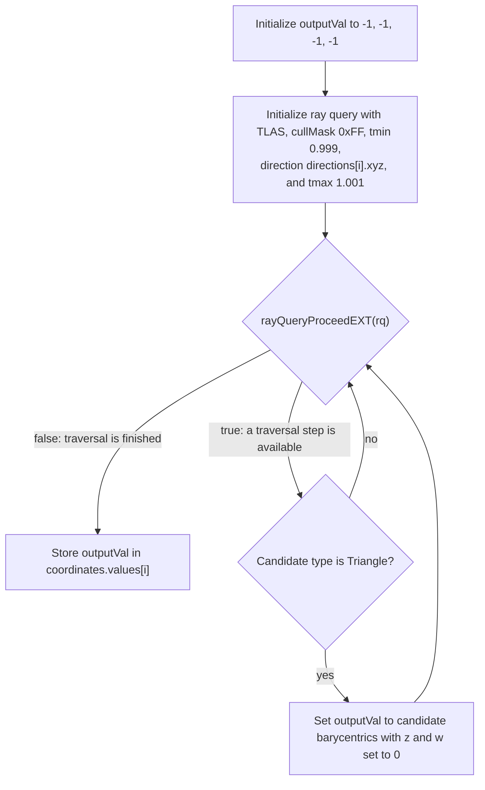

## Overview

**Core question:** Does `rayQueryGetIntersectionBarycentricsEXT` return the expected candidate-state `(b, c)` barycentric coordinates within a small tolerance when the host constructs each ray from known triangle coordinates?

This page covers the `barycentric_coordinates` test family registered by [vktRayQueryBarycentricCoordinatesTests.cpp](../../../modules/vulkan/ray_query/vktRayQueryBarycentricCoordinatesTests.cpp#L381-L390).

- The family registers a single `compute` test case with deterministic seed `1614674687u` ([vktRayQueryBarycentricCoordinatesTests.cpp:388-L389](../../../modules/vulkan/ray_query/vktRayQueryBarycentricCoordinatesTests.cpp#L388-L389)).
- The host builds one triangle in a single BLAS inside one TLAS instance, then traces `kNumRays = 20` rays from the origin in directions that land strictly inside the triangle. The first three directions target the vertex-adjacent barycentric `(0.999, 0.0005, 0.0005)` and permutations; the remaining directions are sampled by a deterministic `de::Random` seeded with `TestParams::seed`.
- The shader issues an inline ray query and records the queried candidate-state `(b, c)` when `proceed` exposes the triangle candidate. The host compares each output cell against its constructed `(b, c)` with tolerance `kThreshold = 0.001` and also requires the padded `.z` and `.w` components to equal zero exactly.

## Background Knowledge

For the shared acceleration-structure and traversal model, see the
[ray-query category background](../../categories/ray_query.md#background-knowledge).

- **Barycentric coordinates.** For triangle vertices `v0`, `v1`, and `v2`, an interior point can be written as `p = a*v0 + b*v1 + c*v2`, where `a + b + c = 1` and all three weights are non-negative. Ray-query triangle intersections expose `(b, c)`; the remaining weight is `a = 1 - b - c`.
- **Candidate and committed state.** During `rayQueryProceedEXT`, `false` in `rayQueryGetIntersectionBarycentricsEXT(rq, false)` selects the current candidate intersection. Passing `true` selects the closest committed intersection found so far. This page must therefore identify which traversal state supplies the reported barycentrics. The [ray traversal chapter](../../../../vulkan-docs/src/chapters/raytraversal.adoc) defines these states.
- **Parametric ray position.** A ray point is `origin + t * direction`. Choosing a direction vector that reaches a known triangle point at a known `t` provides a geometric way to construct reference barycentric coordinates without asking traversal to produce the reference itself.

## Registration Hierarchy

```text
ray_query.barycentric_coordinates
└── compute
```

The single `compute` test case leaf is registered under `barycentric_coordinates`. There are no intermediate nodes.

## Parameter Dimensions and Observed Values

| Dimension | Registered values | Meaning in this test | Evidence |
|-----------|-------------------|----------------------|----------|
| Deterministic seed | `1614674687u` | Drives the single case's RNG for `kNumRays - 3 = 17` extra ray directions and expected `(b, c)` values. The post-increment changes only the local registration variable after this sole case receives the initial value. | [vktRayQueryBarycentricCoordinatesTests.cpp:388-L389](../../../modules/vulkan/ray_query/vktRayQueryBarycentricCoordinatesTests.cpp#L388-L389) |
| Direction budget | 3 vertex-adjacent + 17 RNG-sampled = `kNumRays = 20u` | The shader uses `local_size_x = kNumRays` so each invocation corresponds to one stored `(b, c)` in the output buffer. | [vktRayQueryBarycentricCoordinatesTests.cpp:63](../../../modules/vulkan/ray_query/vktRayQueryBarycentricCoordinatesTests.cpp#L63), [116](../../../modules/vulkan/ray_query/vktRayQueryBarycentricCoordinatesTests.cpp#L116) |
| Tolerance | `kThreshold = 0.001f` (float); `tmin = 1.0 - threshold`, `tmax = 1.0 + threshold` | A tight float tolerance on `(b, c)` plus a thin ray slab around `t = 1.0`; rays must hit the triangle near the expected distance. | [vktRayQueryBarycentricCoordinatesTests.cpp:60-L62](../../../modules/vulkan/ray_query/vktRayQueryBarycentricCoordinatesTests.cpp#L60-L62) |

## Behavior Parameters

The family has no registered behavioral axis beyond the single `compute` leaf. The triangle, BLAS geometry, TLAS instance, shader body, seed, and verification routine are fixed; variation occurs only among the 20 deterministic samples generated inside that case.

## Shader Analysis

The central tested behavior is the shader's candidate-state call to `rayQueryGetIntersectionBarycentricsEXT`; host-side scene and ray construction provide known reference coordinates and validation.

### Representative Shader Walkthrough 1

#### Parameter Values Chosen

Representative path:

```text
dEQP-VK.ray_query.barycentric_coordinates.compute
```

The representative path is the single registered test case. There are no other dimensions to vary.

| Parameter choice | Meaning in this representative case |
|------------------|-------------------------------------|
| `compute` | The single registered test case leaf; the shader runs at `local_size_x = 20` so one invocation handles one ray direction. |
| Seed `1614674687u` | Deterministic. Every cell of the output buffer corresponds to a direction the host also computed, so the comparison is reproducible. |

#### Purpose

Verify that `rayQueryGetIntersectionBarycentricsEXT` reports the candidate triangle's barycentric `(b, c)` within `kThreshold = 0.001` of the host-constructed reference for every one of the 20 directions.

#### Structural Design

The shader starts with `outputVal = (-1, -1, -1, -1)` and overwrites it when `rayQueryProceedEXT` exposes a triangle candidate. The scene contains only one opaque triangle and every constructed ray intersects it, so the loop exposes that candidate once and the stored value is its `(b, c)`.



The loop tests `rayQueryProceedEXT(rq)` before each traversal step. A `true` result enters the loop body, where the current candidate is inspected; a `false` result exits the loop and stores the final `outputVal`. If no triangle candidate was recorded, that value remains `(-1, -1, -1, -1)`.

The host tolerates this design: every direction is guaranteed to hit the only triangle in the scene, so each stored `.xy` should equal the expected `(b, c)`. Cells for which the shader never saw a triangle candidate would surface as `(-1, -1)` and fail the `outputVal.x`/`outputVal.y` comparison.

#### Shader Code

```glsl
#version 460 core
#extension GL_EXT_ray_query : require

layout(local_size_x=20, local_size_y=1, local_size_z=1) in;

layout(set=0, binding=0) uniform accelerationStructureEXT topLevelAS;
layout(set=0, binding=1) uniform RayDirections { vec4 values[20]; } directions;
layout(set=0, binding=2, std430) buffer OutputBarycentrics { vec4 values[20]; } coordinates;

void main()
{
    const uint  cullMask  = 0xFF;
    const vec3  origin    = vec3(0.0, 0.0, 0.0);
    const vec3  direction = directions.values[gl_LocalInvocationID.x].xyz;
    const float tMin      = 0.999;
    const float tMax      = 1.001;
    vec4        outputVal = vec4(-1.0, -1.0, -1.0, -1.0);
    rayQueryEXT rq;

    rayQueryInitializeEXT(rq, topLevelAS, gl_RayFlagsNoneEXT, cullMask, origin, tMin, direction, tMax);
    while (rayQueryProceedEXT(rq))
    {
        if (rayQueryGetIntersectionTypeEXT(rq, false) == gl_RayQueryCandidateIntersectionTriangleEXT)
        {
            outputVal = vec4(rayQueryGetIntersectionBarycentricsEXT(rq, false), 0.0, 0.0);
        }
    }
    coordinates.values[gl_LocalInvocationID.x] = vec4(outputVal);
}
```

#### SPIR-V

- Status: generated and validated
- Source: reconstructed GLSL from this walkthrough
- Stage: `comp`
- Target SPIRV version: `spirv1.4`

<details>
<summary>Click to expand SPIRV asm code</summary>

```llvm
; SPIR-V
; Version: 1.4
; Generator: Khronos Glslang Reference Front End; 11
; Bound: 75
; Schema: 0
               OpCapability Shader
               OpCapability RayQueryKHR
               OpExtension "SPV_KHR_ray_query"
          %1 = OpExtInstImport "GLSL.std.450"
               OpMemoryModel Logical GLSL450
               OpEntryPoint GLCompute %main "main" %directions %gl_LocalInvocationID %rq %topLevelAS %coordinates
               OpExecutionMode %main LocalSize 20 1 1
               OpSource GLSL 460
               OpSourceExtension "GL_EXT_ray_query"
               OpName %main "main"
               OpName %direction "direction"
               OpName %RayDirections "RayDirections"
               OpMemberName %RayDirections 0 "values"
               OpName %directions "directions"
               OpName %gl_LocalInvocationID "gl_LocalInvocationID"
               OpName %outputVal "outputVal"
               OpName %rq "rq"
               OpName %topLevelAS "topLevelAS"
               OpName %OutputBarycentrics "OutputBarycentrics"
               OpMemberName %OutputBarycentrics 0 "values"
               OpName %coordinates "coordinates"
               OpDecorate %_arr_v4float_uint_20 ArrayStride 16
               OpDecorate %RayDirections Block
               OpMemberDecorate %RayDirections 0 Offset 0
               OpDecorate %directions Binding 1
               OpDecorate %directions DescriptorSet 0
               OpDecorate %gl_LocalInvocationID BuiltIn LocalInvocationId
               OpDecorate %topLevelAS Binding 0
               OpDecorate %topLevelAS DescriptorSet 0
               OpDecorate %_arr_v4float_uint_20_0 ArrayStride 16
               OpDecorate %OutputBarycentrics Block
               OpMemberDecorate %OutputBarycentrics 0 Offset 0
               OpDecorate %coordinates Binding 2
               OpDecorate %coordinates DescriptorSet 0
               OpDecorate %gl_WorkGroupSize BuiltIn WorkgroupSize
       %void = OpTypeVoid
          %3 = OpTypeFunction %void
      %float = OpTypeFloat 32
    %v3float = OpTypeVector %float 3
%_ptr_Function_v3float = OpTypePointer Function %v3float
    %v4float = OpTypeVector %float 4
       %uint = OpTypeInt 32 0
    %uint_20 = OpConstant %uint 20
%_arr_v4float_uint_20 = OpTypeArray %v4float %uint_20
%RayDirections = OpTypeStruct %_arr_v4float_uint_20
%_ptr_Uniform_RayDirections = OpTypePointer Uniform %RayDirections
 %directions = OpVariable %_ptr_Uniform_RayDirections Uniform
        %int = OpTypeInt 32 1
      %int_0 = OpConstant %int 0
     %v3uint = OpTypeVector %uint 3
%_ptr_Input_v3uint = OpTypePointer Input %v3uint
%gl_LocalInvocationID = OpVariable %_ptr_Input_v3uint Input
     %uint_0 = OpConstant %uint 0
%_ptr_Input_uint = OpTypePointer Input %uint
%_ptr_Uniform_v4float = OpTypePointer Uniform %v4float
%_ptr_Function_v4float = OpTypePointer Function %v4float
   %float_n1 = OpConstant %float -1
         %33 = OpConstantComposite %v4float %float_n1 %float_n1 %float_n1 %float_n1
         %34 = OpTypeRayQueryKHR
%_ptr_Private_34 = OpTypePointer Private %34
         %rq = OpVariable %_ptr_Private_34 Private
         %37 = OpTypeAccelerationStructureKHR
%_ptr_UniformConstant_37 = OpTypePointer UniformConstant %37
 %topLevelAS = OpVariable %_ptr_UniformConstant_37 UniformConstant
   %uint_255 = OpConstant %uint 255
    %float_0 = OpConstant %float 0
         %43 = OpConstantComposite %v3float %float_0 %float_0 %float_0
%float_0_999000013 = OpConstant %float 0.999000013
%float_1_00100005 = OpConstant %float 1.00100005
       %bool = OpTypeBool
      %false = OpConstantFalse %bool
    %v2float = OpTypeVector %float 2
%_arr_v4float_uint_20_0 = OpTypeArray %v4float %uint_20
%OutputBarycentrics = OpTypeStruct %_arr_v4float_uint_20_0
%_ptr_StorageBuffer_OutputBarycentrics = OpTypePointer StorageBuffer %OutputBarycentrics
%coordinates = OpVariable %_ptr_StorageBuffer_OutputBarycentrics StorageBuffer
%_ptr_StorageBuffer_v4float = OpTypePointer StorageBuffer %v4float
     %uint_1 = OpConstant %uint 1
%gl_WorkGroupSize = OpConstantComposite %v3uint %uint_20 %uint_1 %uint_1
       %main = OpFunction %void None %3
          %5 = OpLabel
  %direction = OpVariable %_ptr_Function_v3float Function
  %outputVal = OpVariable %_ptr_Function_v4float Function
         %24 = OpAccessChain %_ptr_Input_uint %gl_LocalInvocationID %uint_0
         %25 = OpLoad %uint %24
         %27 = OpAccessChain %_ptr_Uniform_v4float %directions %int_0 %25
         %28 = OpLoad %v4float %27
         %29 = OpVectorShuffle %v3float %28 %28 0 1 2
               OpStore %direction %29
               OpStore %outputVal %33
         %40 = OpLoad %37 %topLevelAS
         %45 = OpLoad %v3float %direction
               OpRayQueryInitializeKHR %rq %40 %uint_0 %uint_255 %43 %float_0_999000013 %45 %float_1_00100005
               OpBranch %47
         %47 = OpLabel
               OpLoopMerge %49 %50 None
               OpBranch %51
         %51 = OpLabel
         %53 = OpRayQueryProceedKHR %bool %rq
               OpBranchConditional %53 %48 %49
         %48 = OpLabel
         %55 = OpRayQueryGetIntersectionTypeKHR %uint %rq %int_0
         %56 = OpIEqual %bool %55 %uint_0
               OpSelectionMerge %58 None
               OpBranchConditional %56 %57 %58
         %57 = OpLabel
         %60 = OpRayQueryGetIntersectionBarycentricsKHR %v2float %rq %int_0
         %61 = OpCompositeExtract %float %60 0
         %62 = OpCompositeExtract %float %60 1
         %63 = OpCompositeConstruct %v4float %61 %62 %float_0 %float_0
               OpStore %outputVal %63
               OpBranch %58
         %58 = OpLabel
               OpBranch %50
         %50 = OpLabel
               OpBranch %47
         %49 = OpLabel
         %68 = OpAccessChain %_ptr_Input_uint %gl_LocalInvocationID %uint_0
         %69 = OpLoad %uint %68
         %70 = OpLoad %v4float %outputVal
         %72 = OpAccessChain %_ptr_StorageBuffer_v4float %coordinates %int_0 %69
               OpStore %72 %70
               OpReturn
               OpFunctionEnd
```

</details>

#### Additional Info

- `updateRayTracingGLSL()` is an identity passthrough in this CTS version ([vkRayTracingUtil.hpp:111](../../../framework/vulkan/vkRayTracingUtil.hpp#L111)), so the reconstructed GLSL above is the GLSL the host feeds to `glslangValidator`. `kNumRays`, `kTMin`, `kTMax` are baked in as constants at shader-build time by [`initPrograms`](../../../modules/vulkan/ray_query/vktRayQueryBarycentricCoordinatesTests.cpp#L108-L145).
- The shader deliberately reads candidate-state barycentrics (`rayQueryGetIntersectionBarycentricsEXT(rq, false)`) during the iteration where `proceed` returns the triangle candidate. Opaque-triangle processing can establish the committed hit as traversal continues, but the tested value is the candidate query itself; the page does not substitute committed-state semantics for that call.
- The host sets `tmin = 1.0 - 0.001` and `tmax = 1.0 + 0.001` to require the same precision in `t` as in the barycentric comparison: the triangle vertex is at distance `5.0` from the origin in `z`, the directions carry only the `.xyz` of the stored `vec4`, and the ray must hit the triangle inside a thin slab around `t = 1.0`.
- `gl_RayFlagsNoneEXT` is used, so triangle geometry is treated as opaque and the candidate is auto-committed on `proceed` without a `rayQueryConfirmIntersectionEXT` call. With a single triangle in the scene and a `tmax` just past the triangle, the loop runs exactly once for every direction.

## Runtime Execution and Result Checking

- **Resource setup.** The host builds a single-triangle BLAS, wraps it in one TLAS instance with the identity transform, `cullMask = 0xFF`, and `VK_GEOMETRY_INSTANCE_TRIANGLE_FACING_CULL_DISABLE_BIT_KHR`, and allocates a uniform buffer of `kNumRays` `vec4` directions plus a `std430` storage buffer of `kNumRays` `vec4` output cells ([vktRayQueryBarycentricCoordinatesTests.cpp:211-L273](../../../modules/vulkan/ray_query/vktRayQueryBarycentricCoordinatesTests.cpp#L211-L273)).
- **Direction generation.** Three directions target the vertex-adjacent `(0.999, 0.0005, 0.0005)` barycentric in three permutations; the remaining `kNumRays - 3` directions and expected `(b, c)` values are sampled with `de::Random` initialized from `TestParams::seed`. The loops exclude zero `b` and `c`, while `calcCoordinates` asserts `b + c < 1`, so all samples lie strictly inside the triangle ([vktRayQueryBarycentricCoordinatesTests.cpp:239-L262](../../../modules/vulkan/ray_query/vktRayQueryBarycentricCoordinatesTests.cpp#L239-L262)).
- **Descriptor binding.** The TLAS is at binding 0, the directions uniform buffer at binding 1, and the output storage buffer at binding 2 ([vktRayQueryBarycentricCoordinatesTests.cpp:277-L292](../../../modules/vulkan/ray_query/vktRayQueryBarycentricCoordinatesTests.cpp#L277-L292)).
- **Dispatch.** A single compute dispatch of `1 x 1 x 1` workgroup runs `kNumRays = 20` invocations at `local_size_x = 20` ([vktRayQueryBarycentricCoordinatesTests.cpp:340-L343](../../../modules/vulkan/ray_query/vktRayQueryBarycentricCoordinatesTests.cpp#L340-L343)).
- **Result copyback.** A `SHADER_WRITE -> HOST_READ` memory barrier is recorded before `endCommandBuffer` and `submitCommandsAndWait`, then the host invalidates and copies the storage buffer ([vktRayQueryBarycentricCoordinatesTests.cpp:346-L359](../../../modules/vulkan/ray_query/vktRayQueryBarycentricCoordinatesTests.cpp#L346-L359)).
- **Verification.** [`iterate`](../../../modules/vulkan/ray_query/vktRayQueryBarycentricCoordinatesTests.cpp#L361-L374) requires each cell's `.x` and `.y` to match the expected `(b, c)` within `kThreshold`, and `.z` and `.w` to be exactly `0.0`. Any deviation fails with a per-cell message naming the ray index, the expected value, and the observed value.
- **Pass condition.** All `kNumRays` cells pass; the instance returns `tcu::TestStatus::pass("Pass")`.

## Failure Meaning

### Failure Cause Mapping

This family has a single fixed test case, so the cause mapping is a short paragraph instead of a table.

A failure means that, for one or more of the 20 directions, the value returned by `rayQueryGetIntersectionBarycentricsEXT` did not match the host-computed expected `(b, c)` within `kThreshold`, or `.z`/`.w` were non-zero, or the shader never observed a triangle candidate and stored `(-1, -1, -1, -1)`.

### Cause Analysis

#### Barycentric built-in returns wrong `(b, c)`

**Possible failure symptoms:** The storage buffer cell's `.x` or `.y` differs from the expected `(b, c)` by more than `kThreshold = 0.001`. A wrong `.x` value points to the `b` coordinate; a wrong `.y` value points to the `c` coordinate. The most common failure pattern is a `(b, c)` that is close to but not equal to the expected value, especially for the vertex-adjacent rays where one component is `0.0005` and the other is `0.999`.

**Possible implementation causes:** The driver's ray-triangle intersection routine may miscompute the barycentric coordinates, particularly near vertices where two components approach `0`. The Vulkan spec defines the barycentrics as the unique `(b, c)` such that the hit point equals `triangle[0] * (1 - b - c) + triangle[1] * b + triangle[2] * c`; a driver with a precision issue, a wrong interpolation basis, or a swapped axis would produce the off-by-epsilon symptom on the vertex-adjacent rays.

#### Triangle candidate never reported

**Possible failure symptoms:** A cell stores `(-1, -1, -1, -1)`, the value the shader initializes before the `proceed` loop. Both the exact `.z`/`.w == 0` checks and the comparisons against expected `(b, c)` fail for that cell.

**Possible implementation causes:** The BLAS or TLAS build, the ray's `tmin/tmax`, the `cullMask`, or the triangle facing-culling setting may be wrong. The host sets `VK_GEOMETRY_INSTANCE_TRIANGLE_FACING_CULL_DISABLE_BIT_KHR` precisely so that back-face culling cannot drop the ray ([vktRayQueryBarycentricCoordinatesTests.cpp:222-L223](../../../modules/vulkan/ray_query/vktRayQueryBarycentricCoordinatesTests.cpp#L222-L223)). If the shader reports no candidate, the cause is more likely an acceleration-structure build failure or a `tmin/tmax` exclusion than a barycentric built-in bug, and source-level investigation is needed to localize it.

#### Output `.z` or `.w` is non-zero

**Possible failure symptoms:** The host's `outVal.z() != 0.0f || outVal.w() != 0.0f` check fires for a cell that should store a valid `(b, c)`.

**Possible implementation causes:** `rayQueryGetIntersectionBarycentricsEXT` returns a `vec2`; the shader pads it with `0.0, 0.0`. A driver or SPIR-V processor that emits a non-zero component for the padding (for example, by leaving the result of an uninitialized read in the high lanes of a `vec4` register) would trip this check. Source-level investigation is needed to confirm whether the failure is in the shader lowering, the `std430` storage buffer layout, or the ray-query built-in return type.

## Case Pruning

### Requirement-based pruning

- `VK_KHR_acceleration_structure` and `VK_KHR_ray_query` are required ([vktRayQueryBarycentricCoordinatesTests.cpp:102-L106](../../../modules/vulkan/ray_query/vktRayQueryBarycentricCoordinatesTests.cpp#L102-L106)).
- The dispatch is compute only; `rayTracingPipeline` is not required.

### Design-based pruning

- There are no additional leaves to prune. The single `compute` test case is the entire family.
- The host deliberately excludes triangle boundaries by using `getBarycentricVertex() = (0.999, 0.0005, 0.0005)` rather than `(1, 0, 0)`, skipping zero `b` and `c`, and requiring `a = 1 - b - c > 0` in `calcCoordinates` ([vktRayQueryBarycentricCoordinatesTests.cpp:159-L180](../../../modules/vulkan/ray_query/vktRayQueryBarycentricCoordinatesTests.cpp#L159-L180), [L249-L261](../../../modules/vulkan/ray_query/vktRayQueryBarycentricCoordinatesTests.cpp#L249-L261)). This avoids shared-edge and exact-vertex ownership/precision behavior and keeps the test focused on coordinates for strict interior intersections.

## Key Takeaways

- The test asks a single, mechanical question: does the candidate-state `rayQueryGetIntersectionBarycentricsEXT` call return the `(b, c)` used to construct the ray, within `kThreshold`?
- Direction variety is not the point of the test. The vertex-adjacent first three rays exercise the precision-sensitive corner of the intersection routine, and the deterministic RNG fills the rest to give a per-cell reproducible distribution.
- The host uses `tmin = 0.999` and `tmax = 1.001` to force the ray to land in a thin slab around the expected parametric distance, so a failure in the `t` computation surfaces as a missed candidate rather than a wrong `(b, c)`.

## Source Reference Appendix

| Entry point | Link | Why it matters |
|-------------|------|----------------|
| `kNumRays`, `kTMin`, `kTMax`, `kThreshold`, `kZCoord`, `kXYCoordAbs` | [vktRayQueryBarycentricCoordinatesTests.cpp:57-L63](../../../modules/vulkan/ray_query/vktRayQueryBarycentricCoordinatesTests.cpp#L57-L63) | Geometry constants and the shader-baked ray slab. |
| `checkSupport` | [vktRayQueryBarycentricCoordinatesTests.cpp:102-L106](../../../modules/vulkan/ray_query/vktRayQueryBarycentricCoordinatesTests.cpp#L102-L106) | Acceleration-structure and ray-query feature gates. |
| `initPrograms` (compute shader) | [vktRayQueryBarycentricCoordinatesTests.cpp:108-L145](../../../modules/vulkan/ray_query/vktRayQueryBarycentricCoordinatesTests.cpp#L108-L145) | The GLSL source the host compiles and the only shader the family runs. |
| `calcCoordinates` and `getBarycentricVertex` | [vktRayQueryBarycentricCoordinatesTests.cpp:159-L181](../../../modules/vulkan/ray_query/vktRayQueryBarycentricCoordinatesTests.cpp#L159-L181) | Host-side `(b, c)`-to-world-point inversion and the vertex-adjacent barycentric used for the first three rays. |
| `iterate` (test instance) | [vktRayQueryBarycentricCoordinatesTests.cpp:188-L377](../../../modules/vulkan/ray_query/vktRayQueryBarycentricCoordinatesTests.cpp#L188-L377) | BLAS/TLAS build, direction and expected-value generation, descriptor setup, dispatch, copyback, and verification. |
| Verification loop | [vktRayQueryBarycentricCoordinatesTests.cpp:361-L374](../../../modules/vulkan/ray_query/vktRayQueryBarycentricCoordinatesTests.cpp#L361-L374) | The exact `.x`/`.y` tolerance check plus the `.z`/`.w == 0` check. |
| `createBarycentricCoordinatesTests` registration | [vktRayQueryBarycentricCoordinatesTests.cpp:381-L390](../../../modules/vulkan/ray_query/vktRayQueryBarycentricCoordinatesTests.cpp#L381-L390) | Top-level registration of the single `compute` test case with deterministic seed. |
| `updateRayTracingGLSL` (identity passthrough) | [vkRayTracingUtil.hpp:111](../../../framework/vulkan/vkRayTracingUtil.hpp#L111) | Confirms the reconstructed GLSL is unmodified by the helper. |
| Vulkan spec: ray traversal | [raytraversal.adoc](../../../../vulkan-docs/src/chapters/raytraversal.adoc) | `rayQueryGetIntersectionBarycentricsEXT` semantics. |