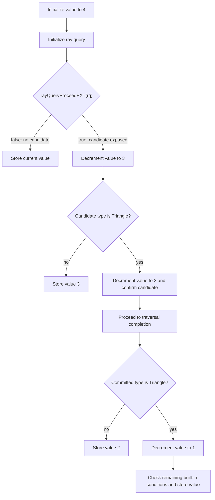

## Overview

**Core question:** Does the implementation report correct values for the registered `VK_KHR_ray_query` built-ins and traversal operations, and do the two advanced cases (a null acceleration-structure descriptor and a SPIR-V wrapper function) still produce the correct result?

This page covers the `builtin` and `advanced` test families registered by [vktRayQueryBuiltinTests.cpp](../../../modules/vulkan/ray_query/vktRayQueryBuiltinTests.cpp#L6291-L6492). Both families are rooted in the same implementation file.

- The `builtin` family iterates 24 ray-query cases, including result functions, traversal flow, and termination, each exercised across up to 12 shader stages and two geometry types.
- The `advanced` family covers `null_as` (tracing against a null acceleration-structure descriptor) and `using_wrapper_function` (ray-query calls inside a hand-written SPIR-V wrapper function, compute only).
- Every case traces a ray query inline in the shader and writes one or more scalar results into an `R32_SINT` storage image; the host compares the relevant cells or image layers against values derived from the case's geometry and instance parameters.
- The `flow` case is the structural backbone: it is a stepwise counter that records the traversal control-flow path, and every other built-in depends on that same traversal state machine.

## Background Knowledge

For the shared concept acceleration-structure and traversal, see [Background Knowledge](../../categories/ray_query.md#background-knowledge) of the `ray_query` page.

- **Instance metadata.** A TLAS instance carries a transform, visibility mask, custom index, shader-binding-table record offset, flags, and a reference to a BLAS. Its position in the TLAS instance array is the instance ID, which is distinct from the application-provided custom index.
- **Object and world space.** TLAS instance transforms connect object-space BLAS geometry to world-space rays. Ray-query built-ins may report vectors or matrices in either space, so the direction of the transform and its inverse matters when interpreting their values.
- **Inline traversal and state.** A `rayQueryEXT` object advances inside the current shader through
  `rayQueryProceedEXT`, exposing candidates while separately retaining the committed result. Triangle confirmation,
  AABB-generated intersections, and termination change this state; the built-ins report selected parts of it.
- **Inline queries inside ray-tracing stages.** `traceRayEXT` transfers control through a ray tracing pipeline, while
  a ray query remains inline in the shader that initializes it. A ray-tracing stage can therefore be reached by one
  traversal and start a separate query with independent state.

## Registration Hierarchy

```text
ray_query
├── builtin
└── advanced
```

Each test family iterates its `TestType` values, then crosses each with shader stage and geometry type to produce the full leaf set. The stage and geometry dimensions are registered as intermediate groups below each `TestType`.

## Parameter Dimensions and Observed Values

| Dimension | Registered values | Meaning in this test | Evidence |
|-----------|-------------------|----------------------|----------|
| Built-in test type | `flow`, `primitiveid`, `instanceid`, `instancecustomindex`, `intersectiont`, `objectrayorigin`, `objectraydirection`, `objecttoworld`, `worldtoobject`, `getraytmin`, `getworldrayorigin`, `getworldraydirection`, `getintersectioncandidateaabbopaque`, `getintersectionfrontfaceCandidate`/`Committed`, `getintersectiongeometryindexCandidate`/`Committed`, `getintersectionbarycentricsCandidate`/`Committed`, `getintersectioninstanceshaderbindingtablerecordoffsetCandidate`/`Committed`, `rayqueryterminate`, `getintersectiontypeCandidate`/`Committed` | Selects which ray-query built-in the shader queries; this is the primary behavioral axis. | [vktRayQueryBuiltinTests.cpp](../../../modules/vulkan/ray_query/vktRayQueryBuiltinTests.cpp#L6301-L6327) |
| Advanced test type | `null_as`, `using_wrapper_function` | Selects the advanced query behavior; `using_wrapper_function` is limited to compute. | [vktRayQueryBuiltinTests.cpp](../../../modules/vulkan/ray_query/vktRayQueryBuiltinTests.cpp#L6427-L6428) |
| Shader stage | `vert`, `tesc`, `tese`, `geom`, `frag`, `comp`, `rgen`, `ahit`, `chit`, `miss`, `sect`, `call` | Selects the pipeline stage that runs the ray query; stage-specific feature support is filtered by `getPipelineCheckSupport()`. | [vktRayQueryBuiltinTests.cpp](../../../modules/vulkan/ray_query/vktRayQueryBuiltinTests.cpp#L6267-L6280) |
| Geometry type | `triangles`, `aabbs` | Selects the bottom-level acceleration structure geometry; some built-ins are filtered to one geometry type. | [vktRayQueryBuiltinTests.cpp](../../../modules/vulkan/ray_query/vktRayQueryBuiltinTests.cpp#L6286-L6289) |

## Behavior Parameters

The primary behavioral axis is `TestType`: the built-in or advanced query under test. Each value changes what the shader queries and what expected value the host checks. The 24 built-in values plus 2 advanced values are grouped below by the property they test.

### `flow` - Traversal control-flow counter

A stepwise counter starting at 4 that decrements at each traversal event: a candidate appeared (`4 -> 3`), the candidate is a triangle (`3 -> 2`), and the committed intersection is a triangle (`2 -> 1`). This case does not query a result built-in; it exercises the `proceed` / `confirm` / `getIntersectionType` control flow that underpins every other built-in.

### Identifier built-ins - `primitiveid`, `instanceid`, `instancecustomindex`, `getintersectiongeometryindex*`

These built-ins return per-geometry or per-instance integer identifiers. The multi-geometry and multi-instance built-ins use 2 instances and 8 geometries so the expected values differ per cell. `getintersectiongeometryindexCandidate` and `Committed` are registered as separate values to localize a failure to one of the two states.

### Parametric distance built-ins - `intersectiont`, `getraytmin`

`intersectiont` returns the parametric distance `t` of the committed intersection; `getraytmin` returns the `tmin` passed to `rayQueryInitializeEXT`. Both are floating-point and are encoded as fixed-point integers for comparison.

### Ray vector built-ins - `objectrayorigin`, `objectraydirection`, `getworldrayorigin`, `getworldraydirection`

These return the ray origin or direction in world space or object space. Object-space values depend on the per-instance transform applied during TLAS construction. All four are floating-point vectors encoded as fixed-point.

### Transform matrix built-ins - `objecttoworld`, `worldtoobject`

These return the per-instance 3x4 transform matrix (or its inverse) as a 4x4 fixed-point matrix. They verify that the instance transform registered during TLAS build is correctly reported in both directions.

### Intersection property built-ins - `getintersectioncandidateaabbopaque`, `getintersectionfrontface*`, `getintersectionbarycentrics*`, `getintersectiontype*`

- `getintersectioncandidateaabbopaque` returns the opaque flag of a candidate AABB intersection (AABB geometry only).
- `getintersectionfrontfaceCandidate` / `Committed` return the front-face flag for a triangle (triangles only).
- `getintersectionbarycentricsCandidate` / `Committed` return the barycentric coordinates of a triangle hit (triangles only).
- `getintersectiontypeCandidate` / `Committed` return the intersection type enum (candidate: AABB or triangle; committed: none, triangle, or generated).

The candidate and committed variants are separate `TestType` values so a failure localizes to one state.

### SBT record offset built-ins - `getintersectioninstanceshaderbindingtablerecordoffset*`

Returns the shader binding table record offset of the instance for the candidate or committed intersection. These are separate candidate/committed values and are compared as exact integers.

### `rayqueryterminate` - Early termination

Initializes eleven independent ray queries. Ten are terminated after their first successful `proceed`, while the middle control query is allowed to continue and must produce three successful `proceed` calls. Each query contributes one bit only when its observed count matches that expectation, so the expected result has all eleven bits set.

### `null_as` (advanced) - Null acceleration-structure descriptor

Initializes a ray query against a `VK_NULL_HANDLE` acceleration-structure descriptor. The expected result is that traversal behaves as if the acceleration structure is empty: no candidate appears, `proceed` returns `false`, and the committed intersection type is `none`.

### `using_wrapper_function` (advanced) - SPIR-V wrapper function

Tests ray-query calls inside a hand-written SPIR-V wrapper function rather than generated GLSL. This case uses SPIR-V assembly directly (`isSPIRV == true`) and is limited to the compute stage. The expected value is the same as the equivalent GLSL path.

## Shader Analysis

Shader code is central to this page: every case is a generated GLSL (or, for `using_wrapper_function`, SPIR-V) shader that drives a ray query inline and stores the queried built-in result. The representative walkthrough below uses the `flow` case, which exercises the traversal control-flow state machine that every other built-in depends on.

### Representative Shader Walkthrough 1

#### Parameter Values Chosen

Representative path:

```text
dEQP-VK.ray_query.builtin.flow.comp.triangles
```

| Parameter choice | Meaning in this representative case |
|------------------|-------------------------------------|
| `flow` | Exercises `proceed` / `confirm` / `getIntersectionType` control flow rather than a value-returning built-in; this is the traversal backbone all other built-ins rely on. |
| `comp` (compute stage) | Compute is the simplest stage wrapper: a 1x1x1 local-size dispatch over an 8x8 grid of workgroups, one ray per cell. |
| `triangles` | Triangle geometry produces a triangle candidate that requires `rayQueryConfirmIntersectionEXT` to commit, exercising the full confirm path. |

#### Purpose

Verify that the ray-query traversal control-flow built-ins (`rayQueryProceedEXT`, `rayQueryGetIntersectionTypeEXT`, `rayQueryConfirmIntersectionEXT`) report the correct candidate and committed state at each step of inline traversal.

#### Structural Design

The shader starts `value` at 4 and decrements it at each traversal event. Each decrement is gated on a distinct, spec-defined outcome, so the final value localizes which step failed.



Expected output is `1` for every cell.

#### Shader Code

```glsl
#version 460 core
#extension GL_EXT_ray_query : require
/// Storage image holding per-cell result; R32_SINT, 3D, set 0 binding 0
layout(set = 0, binding = 0, r32i) uniform iimage3D result;
/// Top-level acceleration structure the ray query traces against; set 0 binding 1
layout(set = 0, binding = 1) uniform accelerationStructureEXT rayQueryTopLevelAccelerationStructure;

void main()
{
  /// Per-invocation cell coordinate and dispatch size, from the compute launch (8x8x1 workgroups)
  ivec3       pos      = ivec3(gl_WorkGroupID);
  ivec3       size     = ivec3(gl_NumWorkGroups);
  /// flow: stepwise counter that records traversal control-flow events
  uint        rayFlags = gl_RayFlagsNoOpaqueEXT;
  uint        cullMask = 0xFF;
  float       tmin     = 0.0;
  float       tmax     = 9.0;
  vec3        origin   = vec3((float(pos.x) + 0.5f) / float(size.x), (float(pos.y) + 0.5f) / float(size.y), 0.0);
  vec3        direct   = vec3(0.0, 0.0, -1.0);
  uint        value    = 4;
  rayQueryEXT rayQuery;

  rayQueryInitializeEXT(rayQuery, rayQueryTopLevelAccelerationStructure, rayFlags, cullMask, origin, tmin, direct, tmax);

  if (rayQueryProceedEXT(rayQuery))
  {
    value--;
    if (rayQueryGetIntersectionTypeEXT(rayQuery, false) == gl_RayQueryCandidateIntersectionTriangleEXT)
    {
      value--;
      rayQueryConfirmIntersectionEXT(rayQuery);

      rayQueryProceedEXT(rayQuery);

      if (rayQueryGetIntersectionTypeEXT(rayQuery, true) == gl_RayQueryCommittedIntersectionTriangleEXT)
        value--;
    }
  }

  imageStore(result, pos, ivec4(value, 0, 0, 0));
}
```

#### Additional Info

- `updateRayTracingGLSL()` is an identity passthrough in this CTS version, so the reconstructed GLSL above is exactly the source fed to the compiler; the `///` comments are wiki annotations added during reconstruction.
- The compute boilerplate wrapper (`ivec3 pos = ivec3(gl_WorkGroupID)` and `ivec3 size = ivec3(gl_NumWorkGroups)`) is generated by [`ComputeConfiguration::initPrograms`](../../../modules/vulkan/ray_query/vktRayQueryBuiltinTests.cpp#L1003-L1036); the `flow`-specific body (`rayFlags` through `imageStore`) is generated by [`TestConfigurationFlow::getShaderBodyText`](../../../modules/vulkan/ray_query/vktRayQueryBuiltinTests.cpp#L1986). Other `TestType` values splice a different body into the same wrapper.
- `gl_RayFlagsNoOpaqueEXT` forces triangle geometry to be treated as non-opaque, so the candidate requires an explicit `rayQueryConfirmIntersectionEXT` call before it commits. This is what makes the `flow` counter test the confirm path.

#### Parameter Variation Summary

| Parameter dimension | Shader-level variation from this shader | Evidence |
|---------------------|---------------------------------------|----------|
| `TestType` | Replaces the `flow` body with a body that calls the selected built-in (e.g. `rayQueryGetIntersectionPrimitiveIndexEXT`) and stores its return value. | [vktRayQueryBuiltinTests.cpp](../../../modules/vulkan/ray_query/vktRayQueryBuiltinTests.cpp#L6301-L6327) |
| Shader stage | Replaces the compute wrapper with a graphics or ray-tracing pipeline wrapper; the ray-query body stays the same but the stage boilerplate and resource layout differ. | [vktRayQueryBuiltinTests.cpp](../../../modules/vulkan/ray_query/vktRayQueryBuiltinTests.cpp#L6267-L6280) |
| Geometry type | Switches the bottom-level AS between triangles and AABBs; AABB candidates use `rayQueryGenerateIntersectionEXT(t)` instead of `rayQueryConfirmIntersectionEXT` in the `flow` body. | [vktRayQueryBuiltinTests.cpp](../../../modules/vulkan/ray_query/vktRayQueryBuiltinTests.cpp#L6286-L6289) |
| `using_wrapper_function` | Replaces generated GLSL with hand-written SPIR-V assembly that wraps the ray-query calls in a function; otherwise the semantics are identical. | [vktRayQueryBuiltinTests.cpp](../../../modules/vulkan/ray_query/vktRayQueryBuiltinTests.cpp#L6445-L6450) |

#### SPIR-V

- Status: generated and validated
- Source: reconstructed GLSL from this walkthrough
- Stage: `comp`
- Target SPIRV version: `spirv1.4`

<details>
<summary>Click to expand SPIRV asm code</summary>

```llvm
; SPIR-V
; Version: 1.4
; Generator: Khronos Glslang Reference Front End; 10
; Bound: 105
; Schema: 0
               OpCapability Shader
               OpCapability RayQueryKHR
               OpExtension "SPV_KHR_ray_query"
          %1 = OpExtInstImport "GLSL.std.450"
               OpMemoryModel Logical GLSL450
               OpEntryPoint GLCompute %main "main" %gl_WorkGroupID %gl_NumWorkGroups %rayQuery %rayQueryTopLevelAccelerationStructure %result
               OpExecutionMode %main LocalSize 1 1 1
               OpSource GLSL 460
               OpSourceExtension "GL_EXT_ray_query"
               OpName %main "main"
               OpName %pos "pos"
               OpName %gl_WorkGroupID "gl_WorkGroupID"
               OpName %size "size"
               OpName %gl_NumWorkGroups "gl_NumWorkGroups"
               OpName %rayFlags "rayFlags"
               OpName %cullMask "cullMask"
               OpName %tmin "tmin"
               OpName %tmax "tmax"
               OpName %origin "origin"
               OpName %direct "direct"
               OpName %value "value"
               OpName %rayQuery "rayQuery"
               OpName %rayQueryTopLevelAccelerationStructure "rayQueryTopLevelAccelerationStructure"
               OpName %result "result"
               OpDecorate %gl_WorkGroupID BuiltIn WorkgroupId
               OpDecorate %gl_NumWorkGroups BuiltIn NumWorkgroups
               OpDecorate %rayQueryTopLevelAccelerationStructure DescriptorSet 0
               OpDecorate %rayQueryTopLevelAccelerationStructure Binding 1
               OpDecorate %result DescriptorSet 0
               OpDecorate %result Binding 0
       %void = OpTypeVoid
          %3 = OpTypeFunction %void
        %int = OpTypeInt 32 1
      %v3int = OpTypeVector %int 3
%_ptr_Function_v3int = OpTypePointer Function %v3int
       %uint = OpTypeInt 32 0
     %v3uint = OpTypeVector %uint 3
%_ptr_Input_v3uint = OpTypePointer Input %v3uint
%gl_WorkGroupID = OpVariable %_ptr_Input_v3uint Input
%gl_NumWorkGroups = OpVariable %_ptr_Input_v3uint Input
%_ptr_Function_uint = OpTypePointer Function %uint
     %uint_2 = OpConstant %uint 2
   %uint_255 = OpConstant %uint 255
      %float = OpTypeFloat 32
%_ptr_Function_float = OpTypePointer Function %float
    %float_0 = OpConstant %float 0
    %float_9 = OpConstant %float 9
    %v3float = OpTypeVector %float 3
%_ptr_Function_v3float = OpTypePointer Function %v3float
     %uint_0 = OpConstant %uint 0
%_ptr_Function_int = OpTypePointer Function %int
  %float_0_5 = OpConstant %float 0.5
     %uint_1 = OpConstant %uint 1
   %float_n1 = OpConstant %float -1
         %57 = OpConstantComposite %v3float %float_0 %float_0 %float_n1
     %uint_4 = OpConstant %uint 4
         %60 = OpTypeRayQueryKHR
%_ptr_Private_60 = OpTypePointer Private %60
   %rayQuery = OpVariable %_ptr_Private_60 Private
         %63 = OpTypeAccelerationStructureKHR
%_ptr_UniformConstant_63 = OpTypePointer UniformConstant %63
%rayQueryTopLevelAccelerationStructure = OpVariable %_ptr_UniformConstant_63 UniformConstant
       %bool = OpTypeBool
      %int_1 = OpConstant %int 1
      %false = OpConstantFalse %bool
      %int_0 = OpConstant %int 0
       %true = OpConstantTrue %bool
         %96 = OpTypeImage %int 3D 0 0 0 2 R32i
%_ptr_UniformConstant_96 = OpTypePointer UniformConstant %96
     %result = OpVariable %_ptr_UniformConstant_96 UniformConstant
      %v4int = OpTypeVector %int 4
       %main = OpFunction %void None %3
          %5 = OpLabel
        %pos = OpVariable %_ptr_Function_v3int Function
       %size = OpVariable %_ptr_Function_v3int Function
   %rayFlags = OpVariable %_ptr_Function_uint Function
   %cullMask = OpVariable %_ptr_Function_uint Function
       %tmin = OpVariable %_ptr_Function_float Function
       %tmax = OpVariable %_ptr_Function_float Function
     %origin = OpVariable %_ptr_Function_v3float Function
     %direct = OpVariable %_ptr_Function_v3float Function
      %value = OpVariable %_ptr_Function_uint Function
         %14 = OpLoad %v3uint %gl_WorkGroupID
         %15 = OpBitcast %v3int %14
               OpStore %pos %15
         %18 = OpLoad %v3uint %gl_NumWorkGroups
         %19 = OpBitcast %v3int %18
               OpStore %size %19
               OpStore %rayFlags %uint_2
               OpStore %cullMask %uint_255
               OpStore %tmin %float_0
               OpStore %tmax %float_9
         %36 = OpAccessChain %_ptr_Function_int %pos %uint_0
         %37 = OpLoad %int %36
         %38 = OpConvertSToF %float %37
         %40 = OpFAdd %float %38 %float_0_5
         %41 = OpAccessChain %_ptr_Function_int %size %uint_0
         %42 = OpLoad %int %41
         %43 = OpConvertSToF %float %42
         %44 = OpFDiv %float %40 %43
         %46 = OpAccessChain %_ptr_Function_int %pos %uint_1
         %47 = OpLoad %int %46
         %48 = OpConvertSToF %float %47
         %49 = OpFAdd %float %48 %float_0_5
         %50 = OpAccessChain %_ptr_Function_int %size %uint_1
         %51 = OpLoad %int %50
         %52 = OpConvertSToF %float %51
         %53 = OpFDiv %float %49 %52
         %54 = OpCompositeConstruct %v3float %44 %53 %float_0
               OpStore %origin %54
               OpStore %direct %57
               OpStore %value %uint_4
         %66 = OpLoad %63 %rayQueryTopLevelAccelerationStructure
         %67 = OpLoad %uint %rayFlags
         %68 = OpLoad %uint %cullMask
         %69 = OpLoad %v3float %origin
         %70 = OpLoad %float %tmin
         %71 = OpLoad %v3float %direct
         %72 = OpLoad %float %tmax
               OpRayQueryInitializeKHR %rayQuery %66 %67 %68 %69 %70 %71 %72
         %74 = OpRayQueryProceedKHR %bool %rayQuery
               OpSelectionMerge %76 None
               OpBranchConditional %74 %75 %76
         %75 = OpLabel
         %77 = OpLoad %uint %value
         %79 = OpISub %uint %77 %int_1
               OpStore %value %79
         %82 = OpRayQueryGetIntersectionTypeKHR %uint %rayQuery %int_0
         %83 = OpIEqual %bool %82 %uint_0
               OpSelectionMerge %85 None
               OpBranchConditional %83 %84 %85
         %84 = OpLabel
         %86 = OpLoad %uint %value
         %87 = OpISub %uint %86 %int_1
               OpStore %value %87
               OpRayQueryConfirmIntersectionKHR %rayQuery
         %88 = OpRayQueryProceedKHR %bool %rayQuery
         %90 = OpRayQueryGetIntersectionTypeKHR %uint %rayQuery %int_1
         %91 = OpIEqual %bool %90 %uint_1
               OpSelectionMerge %93 None
               OpBranchConditional %91 %92 %93
         %92 = OpLabel
         %94 = OpLoad %uint %value
         %95 = OpISub %uint %94 %int_1
               OpStore %value %95
               OpBranch %93
         %93 = OpLabel
               OpBranch %85
         %85 = OpLabel
               OpBranch %76
         %76 = OpLabel
         %99 = OpLoad %96 %result
        %100 = OpLoad %v3int %pos
        %101 = OpLoad %uint %value
        %102 = OpBitcast %int %101
        %104 = OpCompositeConstruct %v4int %102 %int_0 %int_0 %int_0
               OpImageWrite %99 %100 %104 SignExtend
               OpReturn
               OpFunctionEnd
```

</details>

## Runtime Execution and Result Checking

- **Resource setup.** The host builds a bottom-level acceleration structure (triangles or AABBs) with per-instance transforms, IDs, and SBT offsets, then builds a top-level acceleration structure over the instances. A result storage image (`VK_FORMAT_R32_SINT`, 8x8xN depth) and a host-visible readback buffer are created.
- **Descriptor binding.** The result image is bound at descriptor binding 0, the TLAS (for ray-tracing pipeline cases) at binding 1, and the ray-query TLAS at binding 2. For compute cases, the ray-query TLAS is at binding 1.
- **Dispatch.** The host dispatches or traces the selected pipeline stage. For compute, the dispatch is `8x8x1` workgroups with 1x1x1 local size, so one invocation maps to one result-image cell.
- **Result copyback.** After the shader stores its result, the host copies the result image to the readback buffer with `vkCmdCopyImageToBuffer` and maps it.
- **Verification.** The verification routine selected for the result shape compares the copied values with `m_expected`. [`TestConfiguration::verify`](../../../modules/vulkan/ray_query/vktRayQueryBuiltinTests.cpp#L1591-L1608) uses exact equality for scalar integer outputs; float, vector, and matrix configurations use their specialized fixed-point comparisons with `FIXED_POINT_ALLOWED_ERROR`. A case passes only when its verifier reports no failures.

## Failure Meaning

### Failure Cause Mapping

| If this behavior parameter value fails | Possible failure cause(s) |
|----------------------------------------|---------------------------|
| `flow` | Ray-query traversal control-flow built-ins (`proceed`/`confirm`/`generate`/`terminate`/`getIntersectionType`) report wrong candidate or committed state. |
| `primitiveid`, `instanceid`, `instancecustomindex`, `getintersection*index*` | Identifier-returning built-ins report a wrong per-geometry or per-instance integer value. |
| `intersectiont`, `getraytmin` | Parametric-distance / `tmin` built-ins report a wrong float (encoded as fixed-point). |
| `objectrayorigin`, `objectraydirection`, `getworldrayorigin`, `getworldraydirection` | Ray origin/direction built-ins report a wrong vector in world or object space. |
| `objecttoworld`, `worldtoobject` | Per-instance transform matrix built-ins report a wrong 3x4 matrix. |
| `getintersectioncandidateaabbopaque` | Candidate-AABB opacity built-in reports a wrong opaque flag. |
| `getintersectionfrontface*` | Front-face built-in reports a wrong facing flag for the candidate/committed triangle. |
| `getintersectionbarycentrics*` | Barycentric built-in reports wrong candidate/committed triangle barycentrics. |
| `getintersectioninstanceshaderbindingtablerecordoffset*` | SBT-record-offset built-in reports a wrong instance offset for candidate/committed. |
| `rayqueryterminate` | `rayQueryTerminateEXT` does not stop traversal as required. |
| `getintersectiontype*` | Intersection-type built-in reports a wrong candidate/committed enum value. |
| `null_as` (advanced) | Null acceleration-structure descriptor is not treated as empty traversal. |
| `using_wrapper_function` (advanced) | Ray-query calls inside a hand-written SPIR-V wrapper function misbehave (compute only). |

### Cause Analysis

#### Traversal control-flow built-in failure

**Possible failure symptoms:** The `flow` counter stores a value other than `1` for a cell that should hit a triangle. A value of `4` means `proceed` returned `false` when a candidate should exist. A value of `3` means the candidate type was not reported as triangle. A value of `2` means the committed type was not reported as triangle after `confirm`.

**Possible implementation causes:** The driver's ray-query traversal state machine may misreport the candidate or committed intersection type, or may not correctly advance traversal state after `rayQueryConfirmIntersectionEXT`. The [ray traversal chapter](../../../../vulkan-docs/src/chapters/raytraversal.adoc) defines that `proceed` returns `true` when a candidate is available and that `confirm` commits a triangle candidate as a `triangle` committed intersection; a driver that skips the confirm step or reports the wrong committed enum would produce these symptoms.

#### Identifier-returning built-in failure

**Possible failure symptoms:** `primitiveid`, `instanceid`, `instancecustomindex`, or `getintersection*index*` stores a wrong integer for one or more cells. Because multi-geometry and multi-instance cases use 2 instances and 8 geometries with distinct IDs, the wrong value localizes which identifier is incorrect.

**Possible implementation causes:** The driver may report the wrong geometry or instance index from the committed intersection. The acceleration structure build stores per-geometry and per-instance IDs during TLAS construction; if the driver's traversal returns a stale or off-by-one index, the stored value will not match the expected ID derived from the build parameters.

#### Float-encoding built-in failure

**Possible failure symptoms:** Any fixed-point built-in (ray vectors, barycentrics, transforms, `intersectiont`, `getraytmin`) stores a value outside the `FIXED_POINT_ALLOWED_ERROR` tolerance after dividing by `FIXED_POINT_DIVISOR`.

**Possible implementation causes:** The driver may compute the world-space or object-space ray vector, barycentric coordinates, or transform matrix incorrectly. Object-space values depend on the per-instance transform applied during TLAS build; a driver that applies the wrong transform or its inverse transpose would produce wrong object-space results. For `intersectiont`, the driver may report the wrong parametric distance along the ray. Source-level investigation is needed to determine whether the error stems from the transform matrix stored in the acceleration structure or from the traversal math.

#### Intersection property built-in failure

**Possible failure symptoms:** `getintersectioncandidateaabbopaque` returns the wrong opaque flag, `getintersectionfrontface*` returns the wrong facing, `getintersectionbarycentrics*` returns wrong coordinates, or `getintersectiontype*` returns the wrong enum.

**Possible implementation causes:** The opaque flag is derived from the geometry's `VK_GEOMETRY_OPAQUE_BIT_KHR` flag set during BLAS build; a driver that ignores or misapplies this flag would report the wrong opacity. The front-face flag depends on the triangle winding order and the ray direction; a driver that uses the wrong winding convention would flip the flag. Barycentric coordinates are derived from the ray-triangle intersection; a driver with a precision or ordering issue in its intersection routine would report wrong barycentrics.

#### Null acceleration-structure descriptor failure

**Possible failure symptoms:** The `null_as` case stores a value indicating that a candidate appeared or that the committed type is not `none`, when the expected result is empty traversal.

**Possible implementation causes:** The driver may not correctly handle `VK_NULL_HANDLE` bound as an acceleration-structure descriptor. The robustness2 extension specifies that a null descriptor behaves as if the resource is empty; a driver that dereferences the null handle or does not short-circuit traversal would produce a non-empty result.

#### Wrapper function failure

**Possible failure symptoms:** The `using_wrapper_function` case stores a wrong result while the equivalent GLSL path passes.

**Possible implementation causes:** The SPIR-V wrapper function places ray-query calls inside a non-entrypoint function. A driver or SPIR-V processor that does not correctly handle ray-query operations across function boundaries (for example, by not preserving the ray query object's private storage class state across the call) would produce a wrong result. Source-level investigation is needed to confirm whether the failure is in the SPIR-V function-call lowering or in the ray-query state tracking.

## Case Pruning

### Requirement-based pruning

- `VK_KHR_acceleration_structure`, `VK_KHR_ray_query`, and the `rayQuery` and `accelerationStructure` feature bits are required for all cases ([vktRayQueryBuiltinTests.cpp](../../../modules/vulkan/ray_query/vktRayQueryBuiltinTests.cpp#L6052-L6067)).
- Graphics-stage variants require vertex-pipeline stores and, when selected, tessellation or geometry features ([vktRayQueryBuiltinTests.cpp](../../../modules/vulkan/ray_query/vktRayQueryBuiltinTests.cpp#L381-L404)).
- Ray-tracing shader stages require `VK_KHR_ray_tracing_pipeline` and its feature bit ([vktRayQueryBuiltinTests.cpp](../../../modules/vulkan/ray_query/vktRayQueryBuiltinTests.cpp#L1172-L1181)).
- The `null_as` case additionally requires `VK_EXT_robustness2` with `nullDescriptor` and `VK_KHR_buffer_device_address` ([vktRayQueryBuiltinTests.cpp](../../../modules/vulkan/ray_query/vktRayQueryBuiltinTests.cpp#L6083-L6117)).
- `using_wrapper_function` is limited to compute because the SPIR-V assembly path is registered only for `VK_SHADER_STAGE_COMPUTE_BIT` ([vktRayQueryBuiltinTests.cpp](../../../modules/vulkan/ray_query/vktRayQueryBuiltinTests.cpp#L6445-L6450)).

### Design-based pruning

- `getintersectioncandidateaabbopaque` is run only with AABB geometry, because the candidate-AABB opaque flag is meaningful only for AABB candidates.
- `getintersectionfrontface*` and `getintersectionbarycentrics*` are run only with triangles, because front-face and barycentric properties are triangle-specific.
- Cases listed by the registration's `single` selector use one instance and one geometry; the remaining cases use 2 instances and 8 geometry groups so their expected values can vary across cells ([vktRayQueryBuiltinTests.cpp](../../../modules/vulkan/ray_query/vktRayQueryBuiltinTests.cpp#L6345-L6368)).

## Key Takeaways

- The `flow` case is the structural backbone: it verifies the traversal control-flow state machine (`proceed` / `confirm` / `getIntersectionType`) that every value-returning built-in depends on. A wrong `flow` value localizes which traversal step failed.
- Candidate and committed variants of the same property (`frontface`, `geometryindex`, `barycentrics`, `intersectiontype`, SBT offset) are separate `TestType` values, so a failure localizes to one of the two traversal states rather than the property in general.
- Floating-point built-ins are encoded as fixed-point integers because the result image is `R32_SINT`; verification uses tolerance for these and exact equality for integer built-ins.
- The `advanced` family extends coverage to edge cases: `null_as` verifies the null-descriptor contract, and `using_wrapper_function` verifies that ray-query calls work inside a hand-written SPIR-V function.

## Source Reference Appendix

| Entry point | Link | Why it matters |
|-------------|------|----------------|
| `TestType` enum and geometry types | [vktRayQueryBuiltinTests.cpp:61](../../../modules/vulkan/ray_query/vktRayQueryBuiltinTests.cpp#L61) | Defines which built-in each case queries. |
| `TestParams` and fixed-point constants | [vktRayQueryBuiltinTests.cpp:187](../../../modules/vulkan/ray_query/vktRayQueryBuiltinTests.cpp#L187) | Carries per-case config and the fixed-point encoding constants. |
| `TestConfigurationFlow::getShaderBodyText` | [vktRayQueryBuiltinTests.cpp:1986](../../../modules/vulkan/ray_query/vktRayQueryBuiltinTests.cpp#L1986) | Representative `flow` shader body (triangles and AABBs). |
| `TestConfiguration::verify` (int) | [vktRayQueryBuiltinTests.cpp:1591](../../../modules/vulkan/ray_query/vktRayQueryBuiltinTests.cpp#L1591) | Exact int32 comparison and failure counting. |
| `TestConfigurationFloat::verify` | [vktRayQueryBuiltinTests.cpp:1649](../../../modules/vulkan/ray_query/vktRayQueryBuiltinTests.cpp#L1649) | Fixed-point tolerance comparison. |
| `ComputeConfiguration::initPrograms` | [vktRayQueryBuiltinTests.cpp:1003](../../../modules/vulkan/ray_query/vktRayQueryBuiltinTests.cpp#L1003) | Compute shader boilerplate wrapper generation. |
| `RayQueryBuiltinTestCase::checkSupport` | [vktRayQueryBuiltinTests.cpp:6052](../../../modules/vulkan/ray_query/vktRayQueryBuiltinTests.cpp#L6052) | Ray-query + acceleration-structure feature gates and per-stage support. |
| `null_as` capability setup | [vktRayQueryBuiltinTests.cpp:6083](../../../modules/vulkan/ray_query/vktRayQueryBuiltinTests.cpp#L6083) | Robustness2 / nullDescriptor requirements for the advanced null-AS case. |
| `createBuiltinTests` registration | [vktRayQueryBuiltinTests.cpp:6291](../../../modules/vulkan/ray_query/vktRayQueryBuiltinTests.cpp#L6291) | 24 built-in `TestType` values crossed with stages and geometry. |
| `createAdvancedTests` registration | [vktRayQueryBuiltinTests.cpp:6419](../../../modules/vulkan/ray_query/vktRayQueryBuiltinTests.cpp#L6419) | `null_as` + `using_wrapper_function` advanced cases. |
| `updateRayTracingGLSL` (identity passthrough) | [vkRayTracingUtil.hpp:111](../../../framework/vulkan/vkRayTracingUtil.hpp#L111) | Confirms the reconstructed GLSL is unmodified by the helper. |
| Vulkan spec: ray traversal | [raytraversal.adoc](../../../../vulkan-docs/src/chapters/raytraversal.adoc) | Candidate/committed/confirm/generate/terminate semantics. |
