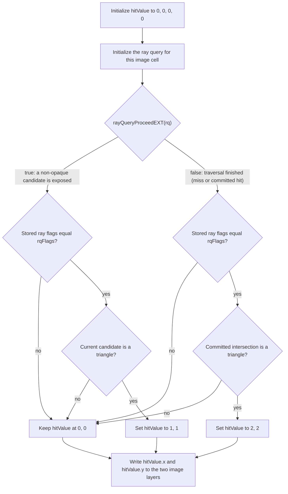

## Overview

**Core question:** Does the implementation apply each registered `gl_RayFlags*EXT` value correctly during inline ray-query traversal, producing the expected hit/miss pattern across all twelve shader stages that can host a ray query?

This page covers the `ray_flags` test family registered by [vktRayQueryCullRayFlagsTests.cpp](../../../modules/vulkan/ray_query/vktRayQueryCullRayFlagsTests.cpp#L2112-L2259).

- Four flag families (`opacity`, `terminate_on_first_hit`, `face_culling`, `skip_geometry`) exercise ten registered ray-flag values; the enum's `RF_SkipClosestHitShader` value is not registered.
- The triangle configuration contains four BLAS instances arranged as a 2x2 grid. Each BLAS contains one square made from two triangles, so the scene contains eight triangles total: the top row is front-facing, the bottom row is back-facing, the left column is forced opaque, and the right column is forced non-opaque. The AABB configuration replaces those eight triangles with two BLAS instances, each containing one AABB: a full-height opaque rectangle on the left and a full-height non-opaque rectangle on the right. AABBs are stored as min/max corners, not as triangles, so there is no internal triangle configuration or face orientation for the AABB path. Each flag produces a source-defined expected pattern computed by `getHitResult`; for AABBs, its four entries duplicate the left/right opacity results across the two conceptual rows used by image verification.
- The shader calls `rayQueryProceedEXT` exactly once and never confirms or generates an intersection. For triangles, an opaque hit auto-commits during traversal, so `proceed` returns `false` after traversal completes and the committed-type check can produce token `2`; a non-opaque triangle returns `true` as a candidate and produces token `1`. An AABB intersection always returns `true` as a candidate, and the AABB shader maps its queried candidate-opacity value to token `2` (opaque) or `1` (non-opaque).
- The same ray-query body fragment is spliced into twelve stage wrappers (vert, tesc, tese, geom, frag, comp, rgen, isect, ahit, chit, miss, call). Only the dispatch path and reference image layout change per stage.

## Background Knowledge

For the shared concept acceleration-structure and traversal, see [Background Knowledge](../../categories/ray_query.md#background-knowledge) of the `ray_query` page.

- **Ray flags.** The `rayFlags` argument to `rayQueryInitializeEXT` changes traversal by overriding opacity, culling intersections, skipping a geometry type, or terminating after the first committed hit. The [ray traversal chapter](../../../../vulkan-docs/src/chapters/raytraversal.adoc) defines the individual `gl_RayFlags*EXT` values.
- **Effective opacity.** Opacity begins with the geometry's opaque state and can be overridden by mutually exclusive per-instance force-opaque or force-non-opaque flags, then by ray flags that force all intersections opaque or non-opaque. Opacity determines whether a triangle can commit automatically (opaque) or must be exposed for shader confirmation (partially transparent).
- **Triangle and AABB candidates.** An opaque triangle may auto-commit during traversal, while a non-opaque triangle is exposed as a candidate that the shader may confirm. An AABB is always exposed as a candidate and needs an application-generated intersection distance before it can commit, regardless of its queried opacity.
- **Facing and geometry type.** Front/back facing is defined by triangle winding and does not apply to AABBs. Geometry-skip flags operate on the primitive type itself, independently of facing.

## Registration Hierarchy

```text
ray_query.ray_flags
├── vertex_shader
├── tess_control_shader
├── tess_evaluation_shader
├── geometry_shader
├── fragment_shader
├── compute_shader
├── rgen_shader
├── isect_shader
├── ahit_shader
├── chit_shader
├── miss_shader
└── call_shader
```

Each intermediate node registers four test-type groups (`opacity`, `terminate_on_first_hit`, `face_culling`, `skip_geometry`). Each test-type group registers one or two bottom-type groups (`triangles`, `aabbs`), and each bottom-type group registers one leaf per concrete ray flag. The `face_culling` family registers only triangle leaves because AABBs have no facing.

## Parameter Dimensions and Observed Values

| Dimension | Registered values | Meaning in this test | Evidence |
|-----------|-------------------|----------------------|----------|
| Shader source stage | `vertex_shader`, `tess_control_shader`, `tess_evaluation_shader`, `geometry_shader`, `fragment_shader`, `compute_shader`, `rgen_shader`, `isect_shader`, `ahit_shader`, `chit_shader`, `miss_shader`, `call_shader` | Selects which stage runs the inline ray query and which `verifyImage` overload builds the reference image. | [vktRayQueryCullRayFlagsTests.cpp:2122-L2171](../../../modules/vulkan/ray_query/vktRayQueryCullRayFlagsTests.cpp#L2122-L2171) |
| Shader test type | `opacity`, `terminate_on_first_hit`, `face_culling`, `skip_geometry` | Selects the ray-flag family under test. This is the behavioral axis. | [vktRayQueryCullRayFlagsTests.cpp:2178-L2203](../../../modules/vulkan/ray_query/vktRayQueryCullRayFlagsTests.cpp#L2178-L2203) |
| Bottom test type | `triangles`, `aabbs` | Selects the BLAS geometry and the ray-query body fragment spliced into the shader. | [vktRayQueryCullRayFlagsTests.cpp:2205-L2212](../../../modules/vulkan/ray_query/vktRayQueryCullRayFlagsTests.cpp#L2205-L2212) |
| Ray flag (`flag0`) | `none`, `opaque`, `noopaque`, `cullopaque`, `cullnoopaque`, `terminateonfirsthit`, `cullbackfacingtriangles`, `cullfrontfacingtriangles`, `skiptriangles`, `skipaabb` | The concrete ray flag passed to `rayQueryInitializeEXT` via the paramBuffer uniform. | [vktRayQueryCullRayFlagsTests.cpp:118-L148](../../../modules/vulkan/ray_query/vktRayQueryCullRayFlagsTests.cpp#L118-L148), [L2178-L2203](../../../modules/vulkan/ray_query/vktRayQueryCullRayFlagsTests.cpp#L2178-L2203) |

## Behavior Parameters

The primary behavioral axis is `ShaderTestType`. Each value selects a different category of ray flags. The concrete `flag0` values enumerate the flags tested inside each family; `flag0` is a configuration axis, not the behavioral axis.

### `opacity` — Opacity override and cull flags

Tests `RF_None`, `RF_Opaque`, `RF_NoOpaque`, `RF_CullOpaque`, `RF_CullNoOpaque` against both triangle and AABB bottom types. The default expected pattern is `{2, 1, 2, 1}`. For triangles, `2` means an opaque hit auto-committed and `1` means a non-opaque candidate was returned. For AABBs, both values come from a returned AABB candidate: `2` means its queried opacity is true and `1` means false. `RF_Opaque` produces `{2, 2, 2, 2}`, `RF_NoOpaque` produces `{1, 1, 1, 1}`, `RF_CullOpaque` produces `{0, 1, 0, 1}`, and `RF_CullNoOpaque` produces `{2, 0, 2, 0}` ([vktRayQueryCullRayFlagsTests.cpp:268-L278](../../../modules/vulkan/ray_query/vktRayQueryCullRayFlagsTests.cpp#L268-L278)).

### `terminate_on_first_hit` — Termination after first committed hit

Tests `RF_TerminateOnFirstHit` against both bottom types. The expected pattern stays `{2, 1, 2, 1}`, identical to the `RF_None` baseline. For triangles this preserves the opaque committed/non-opaque candidate split; for AABBs it preserves the candidate-opacity tokens because the shader does not generate a committed intersection ([vktRayQueryCullRayFlagsTests.cpp:280-L284](../../../modules/vulkan/ray_query/vktRayQueryCullRayFlagsTests.cpp#L280-L284)).

### `face_culling` — Front/back-facing triangle culling

Tests `RF_CullBackFacingTriangles` and `RF_CullFrontFacingTriangles` against triangle bottom type only. The default pattern is `{2, 1, 2, 1}`. `RF_CullBackFacingTriangles` removes the bottom row, producing `{2, 1, 0, 0}`. `RF_CullFrontFacingTriangles` removes the top row, producing `{0, 0, 2, 1}` ([vktRayQueryCullRayFlagsTests.cpp:285-L294](../../../modules/vulkan/ray_query/vktRayQueryCullRayFlagsTests.cpp#L285-L294)). No AABB leaves are registered because AABBs have no facing.

### `skip_geometry` — Skip entire geometry type

Tests `RF_SkipTriangles` and `RF_SkipAABB` against both bottom types. When the skip flag matches the bottom geometry, every cell is expected to miss: `{0, 0, 0, 0}`. When the skip flag does not match (for example `RF_SkipTriangles` with AABB geometry), the expected pattern stays `{2, 1, 2, 1}` ([vktRayQueryCullRayFlagsTests.cpp:295-L302](../../../modules/vulkan/ray_query/vktRayQueryCullRayFlagsTests.cpp#L295-L302)).

## Shader Analysis

Every case issues a ray query from the stage's own per-cell entry point: `gl_GlobalInvocationID` for compute, `gl_VertexIndex` for vert, `gl_FragCoord.xy - 0.5` for frag, `gl_LaunchIDEXT.xy` for ray-tracing stages, and the primitive index for tesc/tese/geom. The ray-query body fragment is shared across all stages; only the dispatch coordinate and reference image layout change. The representative walkthrough below uses the compute path with triangle geometry and `RF_None`, the simplest stage wrapper that exercises the proceed-once candidate-vs-committed logic.

### Representative Shader Walkthrough 1

#### Parameter Values Chosen

Representative path:

```text
dEQP-VK.ray_query.ray_flags.compute_shader.opacity.triangles.none
```

| Parameter choice | Meaning in this representative case |
|------------------|-------------------------------------|
| `compute_shader` | Compute is the simplest stage wrapper: one invocation per result-image cell, one ray origin per cell. |
| `opacity` | The opacity test type; the `flag0` value selects the concrete opacity flag. |
| `triangles` | Triangle BLAS geometry so the candidate-vs-committed distinction depends on the instance opaque bit. |
| `none` (`RF_None`) | No ray flag overrides; the expected pattern is the natural `{2, 1, 2, 1}` split. |

#### Purpose

Verify that for each cell the ray query reports a candidate (`hitValue = (1, 1)`) when the instance is non-opaque and reports a committed triangle (`hitValue = (2, 2)`) when the instance is opaque, with no ray flag overrides applied.

#### Structural Design



This shader calls `rayQueryProceedEXT` only once. A `true` result enters the candidate branch; for this triangle scene, that is the expected path for a non-opaque triangle and produces token `1`. A `false` result means traversal has finished: either no intersection was found, or an opaque triangle was auto-committed during traversal. The committed-state check distinguishes the latter, producing token `2`, from a miss, which leaves token `0`. Both branches also require `rayQueryGetRayFlagsEXT(rq)` to equal the flags passed to `rayQueryInitializeEXT`; a mismatch leaves the result at `0`.

For the four-square triangle scene with `RF_None`, opaque squares produce `(2, 2)` and non-opaque squares produce `(1, 1)`.

#### Shader Code

```glsl
#version 460 core
#extension GL_EXT_ray_query : require
/// Two-layer 3D R32_UINT storage image: layer 0 = hitValue.x, layer 1 = hitValue.y
layout(r32ui, set = 0, binding = 0) uniform uimage3D result;
/// Top-level acceleration structure the ray query traces against
layout(set = 0, binding = 1) uniform accelerationStructureEXT rqTopLevelAS;
/// Uniform buffer carrying the test's ray flag as uvec4(flag0 | flag1, 0, 0, 0)
layout(set = 0, binding = 2) uniform params { uvec4 rayFlags; };

void main()
{
    /// Per-invocation ray origin: cell center at z = 0.5, ray direction -Z, tmin=0, tmax=1
    vec3  origin   = vec3(float(gl_GlobalInvocationID.x) + 0.5f,
                          float(gl_GlobalInvocationID.y) + 0.5f, 0.5f);
    /// hitValue.x and hitValue.y both record the candidate (1) or committed (2) token
    uvec4 hitValue = uvec4(0, 0, 0, 0);
    uint  rqFlags  = rayFlags.x;
    float tmin     = 0.0;
    float tmax     = 1.0;
    vec3  direct   = vec3(0.0, 0.0, -1.0);

    rayQueryEXT rq;
    rayQueryInitializeEXT(rq, rqTopLevelAS, rqFlags, 0xFF, origin, tmin, direct, tmax);

    /// Step 1: proceed once. True means a candidate was reported (non-opaque).
    ///         False means the implementation auto-committed (opaque) or found nothing.
    if (rayQueryProceedEXT(rq))
    {
        /// Step 2: guard that the implementation preserved the flags we passed
        if (rayQueryGetRayFlagsEXT(rq) == rqFlags)
        {
            /// Step 3: triangle candidate -> write (1, 1); no confirm called, candidate dropped
            if (rayQueryGetIntersectionTypeEXT(rq, false) == gl_RayQueryCandidateIntersectionTriangleEXT)
            {
                hitValue.x = 1;
                hitValue.y = 1;
            }
        }
    }
    else
    {
        /// Step 2 alt: proceed returned false; check committed type
        if (rayQueryGetRayFlagsEXT(rq) == rqFlags)
        {
            /// Step 3 alt: committed triangle -> write (2, 2); opaque auto-commit path
            if (rayQueryGetIntersectionTypeEXT(rq, true) == gl_RayQueryCommittedIntersectionTriangleEXT)
            {
                hitValue.x = 2;
                hitValue.y = 2;
            }
        }
    }

    imageStore(result, ivec3(gl_GlobalInvocationID.xy, 0), uvec4(hitValue.x, 0, 0, 0));
    imageStore(result, ivec3(gl_GlobalInvocationID.xy, 1), uvec4(hitValue.y, 0, 0, 0));
}
```

#### Additional Info

- The shader body is the verbatim triangle fragment from [`initPrograms`](../../../modules/vulkan/ray_query/vktRayQueryCullRayFlagsTests.cpp#L1308-L1336) spliced into the compute wrapper at [vktRayQueryCullRayFlagsTests.cpp:1602-L1622](../../../modules/vulkan/ray_query/vktRayQueryCullRayFlagsTests.cpp#L1602-L1622). The build options are `vk::ShaderBuildOptions` with `SPIRV_VERSION_1_4` ([vktRayQueryCullRayFlagsTests.cpp:1298](../../../modules/vulkan/ray_query/vktRayQueryCullRayFlagsTests.cpp#L1298)).
- The compute dispatch is `width x height x 1 = 8 x 8 x 1` ([vktRayQueryCullRayFlagsTests.cpp:862](../../../modules/vulkan/ray_query/vktRayQueryCullRayFlagsTests.cpp#L862)).
- The AABB variant replaces the candidate-type check with `gl_RayQueryCandidateIntersectionAABBEXT` and uses `rayQueryGetIntersectionCandidateAABBOpaqueEXT` to read the candidate opacity, writing `(2, 2)` for opaque or `(1, 1)` for non-opaque ([vktRayQueryCullRayFlagsTests.cpp:1339-L1366](../../../modules/vulkan/ray_query/vktRayQueryCullRayFlagsTests.cpp#L1339-L1366)).
- The graphics and ray-tracing stages share the same per-bottom-type ray-query body fragments; only the stage wrapper around them changes. Ray-tracing stages bind a second TLAS descriptor (b1 for `traceRayEXT`, b2 for `rayQueryInitializeEXT`).
- The `rayQueryGetRayFlagsEXT(rq) == rqFlags` guard verifies that the implementation stored the flags the shader passed. A mismatch would indicate a SPIR-V lowering bug in the ray-query initialization path.

#### Parameter Variation Summary

| Parameter dimension | Shader-level variation from this shader | Evidence |
|---------------------|---------------------------------------|----------|
| `flag0` | Changes `rqFlags` read from `paramBuffer`, which changes what `rayQueryInitializeEXT` receives. The shader body is identical; the implementation must apply the flag. | [vktRayQueryCullRayFlagsTests.cpp:2178-L2203](../../../modules/vulkan/ray_query/vktRayQueryCullRayFlagsTests.cpp#L2178-L2203) |
| `BottomTestType` | Switches the BLAS geometry between triangles and AABBs and switches the ray-query body fragment. The AABB fragment uses `rayQueryGetIntersectionCandidateAABBOpaqueEXT` instead of the proceed-return contract. | [vktRayQueryCullRayFlagsTests.cpp:1339-L1366](../../../modules/vulkan/ray_query/vktRayQueryCullRayFlagsTests.cpp#L1339-L1366) |
| `ShaderSourceType` | Replaces the compute wrapper with a graphics stage wrapper (vert/tesc/tese/geom/frag) or a ray-tracing pipeline wrapper (rgen/isect/ahit/chit/miss/call); each variant produces a different reference image layout in its `verifyImage` overload. | [vktRayQueryCullRayFlagsTests.cpp:1370-L1867](../../../modules/vulkan/ray_query/vktRayQueryCullRayFlagsTests.cpp#L1370-L1867) |

#### SPIR-V

- Status: generated and validated
- Source: reconstructed GLSL from this walkthrough
- Stage: `comp`
- Target SPIRV version: `spirv1.4`

<details>
<summary>Click to expand SPIRV asm code</summary>

```llvm
; SPIR-V
; Version: 1.4
; Generator: Khronos Glslang Reference Front End; 11
; Bound: 119
; Schema: 0
               OpCapability Shader
               OpCapability RayQueryKHR
               OpExtension "SPV_KHR_ray_query"
          %1 = OpExtInstImport "GLSL.std.450"
               OpMemoryModel Logical GLSL450
               OpEntryPoint GLCompute %main "main" %gl_GlobalInvocationID %_ %rq %rqTopLevelAS %result
               OpExecutionMode %main LocalSize 1 1 1
               OpSource GLSL 460
               OpSourceExtension "GL_EXT_ray_query"
               OpName %main "main"
               OpName %origin "origin"
               OpName %gl_GlobalInvocationID "gl_GlobalInvocationID"
               OpName %hitValue "hitValue"
               OpName %rqFlags "rqFlags"
               OpName %params "params"
               OpMemberName %params 0 "rayFlags"
               OpName %_ ""
               OpName %tmin "tmin"
               OpName %tmax "tmax"
               OpName %direct "direct"
               OpName %rq "rq"
               OpName %rqTopLevelAS "rqTopLevelAS"
               OpName %result "result"
               OpDecorate %gl_GlobalInvocationID BuiltIn GlobalInvocationId
               OpDecorate %params Block
               OpMemberDecorate %params 0 Offset 0
               OpDecorate %_ Binding 2
               OpDecorate %_ DescriptorSet 0
               OpDecorate %rqTopLevelAS Binding 1
               OpDecorate %rqTopLevelAS DescriptorSet 0
               OpDecorate %result Binding 0
               OpDecorate %result DescriptorSet 0
       %void = OpTypeVoid
          %3 = OpTypeFunction %void
      %float = OpTypeFloat 32
    %v3float = OpTypeVector %float 3
%_ptr_Function_v3float = OpTypePointer Function %v3float
       %uint = OpTypeInt 32 0
     %v3uint = OpTypeVector %uint 3
%_ptr_Input_v3uint = OpTypePointer Input %v3uint
%gl_GlobalInvocationID = OpVariable %_ptr_Input_v3uint Input
     %uint_0 = OpConstant %uint 0
%_ptr_Input_uint = OpTypePointer Input %uint
  %float_0_5 = OpConstant %float 0.5
     %uint_1 = OpConstant %uint 1
     %v4uint = OpTypeVector %uint 4
%_ptr_Function_v4uint = OpTypePointer Function %v4uint
         %30 = OpConstantComposite %v4uint %uint_0 %uint_0 %uint_0 %uint_0
%_ptr_Function_uint = OpTypePointer Function %uint
     %params = OpTypeStruct %v4uint
%_ptr_Uniform_params = OpTypePointer Uniform %params
          %_ = OpVariable %_ptr_Uniform_params Uniform
        %int = OpTypeInt 32 1
      %int_0 = OpConstant %int 0
%_ptr_Uniform_uint = OpTypePointer Uniform %uint
%_ptr_Function_float = OpTypePointer Function %float
    %float_0 = OpConstant %float 0
    %float_1 = OpConstant %float 1
   %float_n1 = OpConstant %float -1
         %48 = OpConstantComposite %v3float %float_0 %float_0 %float_n1
         %49 = OpTypeRayQueryKHR
%_ptr_Private_49 = OpTypePointer Private %49
         %rq = OpVariable %_ptr_Private_49 Private
         %52 = OpTypeAccelerationStructureKHR
%_ptr_UniformConstant_52 = OpTypePointer UniformConstant %52
%rqTopLevelAS = OpVariable %_ptr_UniformConstant_52 UniformConstant
   %uint_255 = OpConstant %uint 255
       %bool = OpTypeBool
      %false = OpConstantFalse %bool
       %true = OpConstantTrue %bool
      %int_1 = OpConstant %int 1
     %uint_2 = OpConstant %uint 2
         %93 = OpTypeImage %uint 3D 0 0 0 2 R32ui
%_ptr_UniformConstant_93 = OpTypePointer UniformConstant %93
     %result = OpVariable %_ptr_UniformConstant_93 UniformConstant
     %v2uint = OpTypeVector %uint 2
      %v2int = OpTypeVector %int 2
      %v3int = OpTypeVector %int 3
       %main = OpFunction %void None %3
          %5 = OpLabel
     %origin = OpVariable %_ptr_Function_v3float Function
   %hitValue = OpVariable %_ptr_Function_v4uint Function
    %rqFlags = OpVariable %_ptr_Function_uint Function
       %tmin = OpVariable %_ptr_Function_float Function
       %tmax = OpVariable %_ptr_Function_float Function
     %direct = OpVariable %_ptr_Function_v3float Function
         %16 = OpAccessChain %_ptr_Input_uint %gl_GlobalInvocationID %uint_0
         %17 = OpLoad %uint %16
         %18 = OpConvertUToF %float %17
         %20 = OpFAdd %float %18 %float_0_5
         %22 = OpAccessChain %_ptr_Input_uint %gl_GlobalInvocationID %uint_1
         %23 = OpLoad %uint %22
         %24 = OpConvertUToF %float %23
         %25 = OpFAdd %float %24 %float_0_5
         %26 = OpCompositeConstruct %v3float %20 %25 %float_0_5
               OpStore %origin %26
               OpStore %hitValue %30
         %39 = OpAccessChain %_ptr_Uniform_uint %_ %int_0 %uint_0
         %40 = OpLoad %uint %39
               OpStore %rqFlags %40
               OpStore %tmin %float_0
               OpStore %tmax %float_1
               OpStore %direct %48
         %55 = OpLoad %52 %rqTopLevelAS
         %56 = OpLoad %uint %rqFlags
         %58 = OpLoad %v3float %origin
         %59 = OpLoad %float %tmin
         %60 = OpLoad %v3float %direct
         %61 = OpLoad %float %tmax
               OpRayQueryInitializeKHR %rq %55 %56 %uint_255 %58 %59 %60 %61
         %63 = OpRayQueryProceedKHR %bool %rq
               OpSelectionMerge %65 None
               OpBranchConditional %63 %64 %78
         %64 = OpLabel
         %66 = OpRayQueryGetRayFlagsKHR %uint %rq
         %67 = OpLoad %uint %rqFlags
         %68 = OpIEqual %bool %66 %67
               OpSelectionMerge %70 None
               OpBranchConditional %68 %69 %70
         %69 = OpLabel
         %72 = OpRayQueryGetIntersectionTypeKHR %uint %rq %int_0
         %73 = OpIEqual %bool %72 %uint_0
               OpSelectionMerge %75 None
               OpBranchConditional %73 %74 %75
         %74 = OpLabel
         %76 = OpAccessChain %_ptr_Function_uint %hitValue %uint_0
               OpStore %76 %uint_1
         %77 = OpAccessChain %_ptr_Function_uint %hitValue %uint_1
               OpStore %77 %uint_1
               OpBranch %75
         %75 = OpLabel
               OpBranch %70
         %70 = OpLabel
               OpBranch %65
         %78 = OpLabel
         %79 = OpRayQueryGetRayFlagsKHR %uint %rq
         %80 = OpLoad %uint %rqFlags
         %81 = OpIEqual %bool %79 %80
               OpSelectionMerge %83 None
               OpBranchConditional %81 %82 %83
         %82 = OpLabel
         %86 = OpRayQueryGetIntersectionTypeKHR %uint %rq %int_1
         %87 = OpIEqual %bool %86 %uint_1
               OpSelectionMerge %89 None
               OpBranchConditional %87 %88 %89
         %88 = OpLabel
         %91 = OpAccessChain %_ptr_Function_uint %hitValue %uint_0
               OpStore %91 %uint_2
         %92 = OpAccessChain %_ptr_Function_uint %hitValue %uint_1
               OpStore %92 %uint_2
               OpBranch %89
         %89 = OpLabel
               OpBranch %83
         %83 = OpLabel
               OpBranch %65
         %65 = OpLabel
         %96 = OpLoad %93 %result
         %98 = OpLoad %v3uint %gl_GlobalInvocationID
         %99 = OpVectorShuffle %v2uint %98 %98 0 1
        %101 = OpBitcast %v2int %99
        %103 = OpCompositeExtract %int %101 0
        %104 = OpCompositeExtract %int %101 1
        %105 = OpCompositeConstruct %v3int %103 %104 %int_0
        %106 = OpAccessChain %_ptr_Function_uint %hitValue %uint_0
        %107 = OpLoad %uint %106
        %108 = OpCompositeConstruct %v4uint %107 %uint_0 %uint_0 %uint_0
               OpImageWrite %96 %105 %108 ZeroExtend
        %109 = OpLoad %93 %result
        %110 = OpLoad %v3uint %gl_GlobalInvocationID
        %111 = OpVectorShuffle %v2uint %110 %110 0 1
        %112 = OpBitcast %v2int %111
        %113 = OpCompositeExtract %int %112 0
        %114 = OpCompositeExtract %int %112 1
        %115 = OpCompositeConstruct %v3int %113 %114 %int_1
        %116 = OpAccessChain %_ptr_Function_uint %hitValue %uint_1
        %117 = OpLoad %uint %116
        %118 = OpCompositeConstruct %v4uint %117 %uint_0 %uint_0 %uint_0
               OpImageWrite %109 %115 %118 ZeroExtend
               OpReturn
               OpFunctionEnd
```

</details>

## Runtime Execution and Result Checking

- **Resource setup.** The host allocates a 3D `R32_UINT` image sized `8 x 8 x 2` and a host-visible readback buffer. The image is cleared to `0xFF` and transitions to `VK_IMAGE_LAYOUT_GENERAL` before the shader writes to it ([vktRayQueryCullRayFlagsTests.cpp:1954-L1971](../../../modules/vulkan/ray_query/vktRayQueryCullRayFlagsTests.cpp#L1954-L1971)).
- **Acceleration structure build.** In the triangle configuration, the host builds four BLASes arranged as a 2x2 grid. Each BLAS contains one square represented by two triangles, for eight triangles total. The top row is front-facing, the bottom row is back-facing. The left column uses `VK_GEOMETRY_INSTANCE_FORCE_OPAQUE_BIT_KHR`, and the right column uses `VK_GEOMETRY_INSTANCE_FORCE_NO_OPAQUE_BIT_KHR`; the TLAS holds the four instances. In the AABB configuration, the host instead builds two BLASes and two TLAS instances. Each BLAS contains one AABB described by its minimum and maximum corners: the left AABB spans the full grid height and is forced opaque, while the right AABB spans the full grid height and is forced non-opaque. AABBs have no triangle winding or internal triangle subdivision ([vktRayQueryCullRayFlagsTests.cpp:1988-L2064](../../../modules/vulkan/ray_query/vktRayQueryCullRayFlagsTests.cpp#L1988-L2064)).
- **Param buffer.** The host writes `uvec4(flag0 | flag1, 0, 0, 0)` to a host-visible uniform buffer. The shader reads `rayFlags.x` from this buffer and passes it to `rayQueryInitializeEXT` ([vktRayQueryCullRayFlagsTests.cpp:1920-L1926](../../../modules/vulkan/ray_query/vktRayQueryCullRayFlagsTests.cpp#L1920-L1926)).
- **Descriptor binding.** Graphics and compute bind the result image at b0, the TLAS at b1, and the param buffer at b2. Ray-tracing stages bind the result image at b0, the regular TLAS at b1, the ray-query TLAS at b2, and the param buffer at b3 ([vktRayQueryCullRayFlagsTests.cpp:650-L657](../../../modules/vulkan/ray_query/vktRayQueryCullRayFlagsTests.cpp#L650-L657), [L848-L855](../../../modules/vulkan/ray_query/vktRayQueryCullRayFlagsTests.cpp#L848-L855), [L1110-L1119](../../../modules/vulkan/ray_query/vktRayQueryCullRayFlagsTests.cpp#L1110-L1119)).
- **Dispatch.** Compute dispatches `8 x 8 x 1`; graphics draws four vertices (or six for tessellation); ray-tracing uses `cmdTraceRays(8, 8, 1)` ([vktRayQueryCullRayFlagsTests.cpp:862](../../../modules/vulkan/ray_query/vktRayQueryCullRayFlagsTests.cpp#L862), [L675](../../../modules/vulkan/ray_query/vktRayQueryCullRayFlagsTests.cpp#L675), [L1148-L1150](../../../modules/vulkan/ray_query/vktRayQueryCullRayFlagsTests.cpp#L1148-L1150)).
- **Result copyback.** The host records `vkCmdCopyImageToBuffer` for the full `8 x 8 x 2` extent into the readback buffer, awaits with a `SHADER_WRITE -> TRANSFER_READ` barrier followed by a `TRANSFER_WRITE -> HOST_READ` barrier, then `invalidateMappedMemoryRange`s the buffer ([vktRayQueryCullRayFlagsTests.cpp:2082-L2101](../../../modules/vulkan/ray_query/vktRayQueryCullRayFlagsTests.cpp#L2082-L2101)).
- **Verification.** Each `verifyImage` overload calls `getHitResult(testParams)` to compute the expected four-element pattern, then builds a reference image matching the per-stage layout. For vertex, the reference writes one entry per `gl_VertexIndex`. For tesc/tese/geom, it writes per-primitive-vertex entries. For frag/comp/ray-tracing, it writes per-cell entries in the four-square regions ([vktRayQueryCullRayFlagsTests.cpp:679-L749](../../../modules/vulkan/ray_query/vktRayQueryCullRayFlagsTests.cpp#L679-L749), [L865-L904](../../../modules/vulkan/ray_query/vktRayQueryCullRayFlagsTests.cpp#L865-L904), [L1153-L1192](../../../modules/vulkan/ray_query/vktRayQueryCullRayFlagsTests.cpp#L1153-L1192)). Comparison uses `tcu::intThresholdCompare` with threshold `UVec4(0)` (exact equality).
- **Pass condition.** Comparison reports no failure; otherwise the instance returns `tcu::TestStatus::fail("Fail")` ([vktRayQueryCullRayFlagsTests.cpp:2102-L2108](../../../modules/vulkan/ray_query/vktRayQueryCullRayFlagsTests.cpp#L2102-L2108)).

## Failure Meaning

### Failure Cause Mapping

| If this behavior parameter value fails | Possible failure cause(s) |
|----------------------------------------|---------------------------|
| `opacity` | The implementation does not apply `gl_RayFlagsOpaqueEXT`, `gl_RayFlagsNoOpaqueEXT`, `gl_RayFlagsCullOpaqueEXT`, or `gl_RayFlagsCullNoOpaqueEXT` correctly, so the auto-commit vs. candidate-report pattern or the culling pattern deviates from `getHitResult`. |
| `terminate_on_first_hit` | The implementation does not preserve the candidate-vs-committed pattern when `gl_RayFlagsTerminateOnFirstHitEXT` is set, or it terminates before reporting a candidate that should have been reported. |
| `face_culling` | The implementation culls the wrong facing under `gl_RayFlagsCullBackFacingTrianglesEXT` or `gl_RayFlagsCullFrontFacingTrianglesEXT`, or it applies face culling to AABB geometry. |
| `skip_geometry` | The implementation does not skip the entire geometry type when `gl_RayFlagsSkipTrianglesEXT` or `gl_RayFlagsSkipAABBEXT` is set, so cells that should miss report a hit. |

### Cause Analysis

#### Opacity flag application

**Possible failure symptoms:** For a triangle `opacity` leaf, a cell that should hold `(2, 2)` (opaque auto-commit) instead holds `(1, 1)` (non-opaque candidate), or vice versa. For an AABB leaf, that same mismatch means the candidate-opacity query returned the wrong effective opacity. Under `RF_CullOpaque` or `RF_CullNoOpaque`, a cell that should hold `(0, 0)` instead holds `(2, 2)` or `(1, 1)`, meaning culled geometry was not culled.

**Possible implementation causes:** The ray flags `gl_RayFlagsOpaqueEXT` and `gl_RayFlagsNoOpaqueEXT` override both the geometry opaque bit and the instance force-opaque / force-no-opaque flags. A driver that ignores the ray flag and falls back to the instance flag would produce the default pattern instead of the forced pattern. `gl_RayFlagsCullOpaqueEXT` and `gl_RayFlagsCullNoOpaqueEXT` must cull candidates whose effective opacity matches; a driver that applies the cull check before the override, or that uses the geometry opaque bit instead of the effective opacity, would leave culled cells hit. Source-level investigation is needed to determine whether the failure is in the flag-override path or the cull-check path.

#### Terminate-on-first-hit interaction

**Possible failure symptoms:** For a `terminate_on_first_hit` leaf, the expected pattern matches the `RF_None` baseline `{2, 1, 2, 1}`. In a triangle leaf, `(1, 1)` is a non-opaque candidate and `(2, 2)` is an opaque committed hit. In an AABB leaf, both are candidate-opacity tokens. A change to `(0, 0)`, or a swap between `1` and `2`, means the flag changed traversal or the reported effective opacity.

**Possible implementation causes:** `gl_RayFlagsTerminateOnFirstHitEXT` tells traversal to stop after the first committed hit. For non-opaque geometry the shader must still receive a candidate before any commit can happen. A driver that treats the terminate flag as "auto-commit the first candidate" would skip the candidate-report step and write `(2, 2)` where `(1, 1)` is expected. A driver that terminates before reporting any candidate would write `(0, 0)`. Source-level investigation is needed to confirm whether the flag is being applied at the wrong traversal stage.

#### Face culling direction

**Possible failure symptoms:** For a `face_culling` leaf, `RF_CullBackFacingTriangles` should produce `{2, 1, 0, 0}` (bottom row culled). A failure shows the top row culled instead (`{0, 0, 2, 1}`), or both rows culled (`{0, 0, 0, 0}`), or neither row culled (`{2, 1, 2, 1}`).

**Possible implementation causes:** The test encodes front-facing as the top row and back-facing as the bottom row using the `faceCullingOffsets` vertex ordering ([vktRayQueryCullRayFlagsTests.cpp:1991-L1994](../../../modules/vulkan/ray_query/vktRayQueryCullRayFlagsTests.cpp#L1991-L1994)). A driver that inverts the front-face determination, or that uses the wrong winding convention (clockwise vs. counterclockwise), would cull the wrong row. A driver that applies the cull flag to AABB geometry would produce wrong results on any AABB leaf, but the `face_culling` family registers only triangle leaves, so that path is not exercised here. Source-level investigation is needed to confirm the winding convention the driver uses.

#### Skip-geometry flag matching

**Possible failure symptoms:** For a `skip_geometry` leaf where the skip flag matches the bottom geometry (for example `RF_SkipTriangles` with triangles), every cell should hold `(0, 0)`. A failure shows `(2, 2)` or `(1, 1)` in some cells, meaning the skip flag did not skip the geometry. For a non-matching combination (for example `RF_SkipTriangles` with AABBs), the pattern should stay `{2, 1, 2, 1}`; a failure shows `(0, 0)`, meaning the skip flag was applied to the wrong geometry type.

**Possible implementation causes:** `gl_RayFlagsSkipTrianglesEXT` and `gl_RayFlagsSkipAABBEXT` must skip all geometry of the named type. A driver that checks the skip flag against the wrong geometry type, or that applies both skip flags when only one is set, would produce these symptoms. Source-level investigation is needed to determine whether the skip check uses the BLAS geometry type or the candidate intersection type.

#### Ray-flag storage round-trip

**Possible failure symptoms:** The `rayQueryGetRayFlagsEXT(rq) == rqFlags` guard in the shader fails, so `hitValue` stays at `(0, 0)` for cells that should hold `(1, 1)` or `(2, 2)`. The failure appears across all cells of a leaf, not localized to one square.

**Possible implementation causes:** `rayQueryGetRayFlagsEXT` must return the flags the shader passed to `rayQueryInitializeEXT`. A SPIR-V lowering bug that drops the flag argument, or a driver that stores a modified flag set (for example, OR-ing in implementation-internal flags), would make the guard fail. Source-level investigation is needed to confirm whether the flag storage is preserved through the initialization path.

## Case Pruning

### Requirement-based pruning

- All leaves require `VK_KHR_acceleration_structure` and `VK_KHR_ray_query` device extensions with their associated feature bits ([vktRayQueryCullRayFlagsTests.cpp:1245-L1258](../../../modules/vulkan/ray_query/vktRayQueryCullRayFlagsTests.cpp#L1245-L1258)).
- Tessellation-control and tessellation-evaluation stages require `VkPhysicalDeviceFeatures2.tessellationShader` ([vktRayQueryCullRayFlagsTests.cpp:1262-L1265](../../../modules/vulkan/ray_query/vktRayQueryCullRayFlagsTests.cpp#L1262-L1265)).
- Geometry stage requires `VkPhysicalDeviceFeatures2.geometryShader` ([vktRayQueryCullRayFlagsTests.cpp:1267-L1268](../../../modules/vulkan/ray_query/vktRayQueryCullRayFlagsTests.cpp#L1267-L1268)).
- Vertex, tessellation-control, tessellation-evaluation, and geometry stages require `DEVICE_CORE_FEATURE_VERTEX_PIPELINE_STORES_AND_ATOMICS` because they `imageStore` from graphics stages ([vktRayQueryCullRayFlagsTests.cpp:1270-L1280](../../../modules/vulkan/ray_query/vktRayQueryCullRayFlagsTests.cpp#L1270-L1280)).
- Ray-generation, intersection, any-hit, closest-hit, miss, and callable stages require `VK_KHR_ray_tracing_pipeline` with `rayTracingPipeline` feature bit ([vktRayQueryCullRayFlagsTests.cpp:1282-L1293](../../../modules/vulkan/ray_query/vktRayQueryCullRayFlagsTests.cpp#L1282-L1293)).

### Design-based pruning

- The `face_culling` family registers only triangle leaves. The AABB `flag` vector is empty because AABBs have no facing ([vktRayQueryCullRayFlagsTests.cpp:2193-L2196](../../../modules/vulkan/ray_query/vktRayQueryCullRayFlagsTests.cpp#L2193-L2196)).
- The `terminate_on_first_hit` family registers only `RF_TerminateOnFirstHit`; no other flag is crossed with this test type. The expected pattern is identical to the `RF_None` baseline, so the test verifies that the flag does not break the normal pattern.
- The `skip_geometry` family registers `RF_SkipTriangles` and `RF_SkipAABB` against both bottom types. The non-matching combinations (skip flag does not match the geometry) are intentional: they verify that the skip flag does not affect the other geometry type.
- The `RayFlags` enum defines `RF_SkipClosestHitShader`, but no `ShaderTestType` registers it. The flag is unused by this test.
- Triangle leaves build four square instances spanning the four facing/opacity combinations. AABB leaves instead build two full-height rectangular instances, one opaque and one non-opaque.

## Key Takeaways

- The test exercises four ray-flag families through proceed-once shaders. The triangle path uses four square instances (eight triangles total) and distinguishes opaque auto-commit from a non-opaque candidate. The AABB path uses two full-height AABB instances (one opaque and one non-opaque) with no triangle geometry or face orientation; it always observes an AABB candidate and records its queried effective opacity.
- `getHitResult` computes the expected four-element pattern from the flag value, test type, and bottom geometry type. The host compares the result image against this pattern with exact equality.
- The `face_culling` family is triangle-only because AABBs have no facing. The `skip_geometry` family crosses both skip flags against both bottom types to verify that non-matching skip flags do not affect the other geometry type.
- The `rayQueryGetRayFlagsEXT(rq) == rqFlags` guard in the shader checks that the implementation preserved the flags the shader passed to `rayQueryInitializeEXT`. A failure here points to a SPIR-V lowering or flag-storage bug, not to traversal logic.

## Source Reference Appendix

| Entry point | Link | Why it matters |
|-------------|------|----------------|
| `ShaderTestType`, `RayFlags`, `BottomTestType` enums | [vktRayQueryCullRayFlagsTests.cpp:84-L111](../../../modules/vulkan/ray_query/vktRayQueryCullRayFlagsTests.cpp#L84-L111) | Defines the four flag families, the concrete ray flag values, and the bottom geometry types. |
| `getRayFlagTestName` | [vktRayQueryCullRayFlagsTests.cpp:118-L148](../../../modules/vulkan/ray_query/vktRayQueryCullRayFlagsTests.cpp#L118-L148) | Maps `RayFlags` enum values to registered test case names. |
| `getHitResult` | [vktRayQueryCullRayFlagsTests.cpp:262-L307](../../../modules/vulkan/ray_query/vktRayQueryCullRayFlagsTests.cpp#L262-L307) | Computes the expected per-square hit pattern for each `(testType, flag, bottomType)`. |
| `GraphicsConfiguration::verifyImage` | [vktRayQueryCullRayFlagsTests.cpp:679-L749](../../../modules/vulkan/ray_query/vktRayQueryCullRayFlagsTests.cpp#L679-L749) | Reference image builder for graphics stages. |
| `ComputeConfiguration::verifyImage` | [vktRayQueryCullRayFlagsTests.cpp:865-L904](../../../modules/vulkan/ray_query/vktRayQueryCullRayFlagsTests.cpp#L865-L904) | Reference image builder for compute. |
| `RayTracingConfiguration::verifyImage` | [vktRayQueryCullRayFlagsTests.cpp:1153-L1192](../../../modules/vulkan/ray_query/vktRayQueryCullRayFlagsTests.cpp#L1153-L1192) | Reference image builder for ray-tracing stages. |
| Triangle ray-query body fragment | [vktRayQueryCullRayFlagsTests.cpp:1308-L1336](../../../modules/vulkan/ray_query/vktRayQueryCullRayFlagsTests.cpp#L1308-L1336) | The proceed-once candidate-vs-committed logic for triangle geometry. |
| AABB ray-query body fragment | [vktRayQueryCullRayFlagsTests.cpp:1339-L1366](../../../modules/vulkan/ray_query/vktRayQueryCullRayFlagsTests.cpp#L1339-L1366) | The candidate-opacity read for AABB geometry. |
| `initPrograms` (per-stage wrappers) | [vktRayQueryCullRayFlagsTests.cpp:1296-L1867](../../../modules/vulkan/ray_query/vktRayQueryCullRayFlagsTests.cpp#L1296-L1867) | Per-stage shader wrappers that splice the ray-query body fragment. |
| `checkSupport` | [vktRayQueryCullRayFlagsTests.cpp:1245-L1294](../../../modules/vulkan/ray_query/vktRayQueryCullRayFlagsTests.cpp#L1245-L1294) | Feature gates and per-stage support checks. |
| `iterate` | [vktRayQueryCullRayFlagsTests.cpp:1884-L2108](../../../modules/vulkan/ray_query/vktRayQueryCullRayFlagsTests.cpp#L1884-L2108) | Image / buffer allocation, AS build, dispatch / draw / trace, copy-back, verification. |
| `createCullRayFlagsTests` | [vktRayQueryCullRayFlagsTests.cpp:2112-L2259](../../../modules/vulkan/ray_query/vktRayQueryCullRayFlagsTests.cpp#L2112-L2259) | Top-level registration: `ray_flags.<shader_source>.<test_type>.<bottom_type>.<flag>`. |
| Vulkan spec: ray traversal | [raytraversal.adoc](../../../../vulkan-docs/src/chapters/raytraversal.adoc) | Ray flag semantics and candidate/committed contract. |
