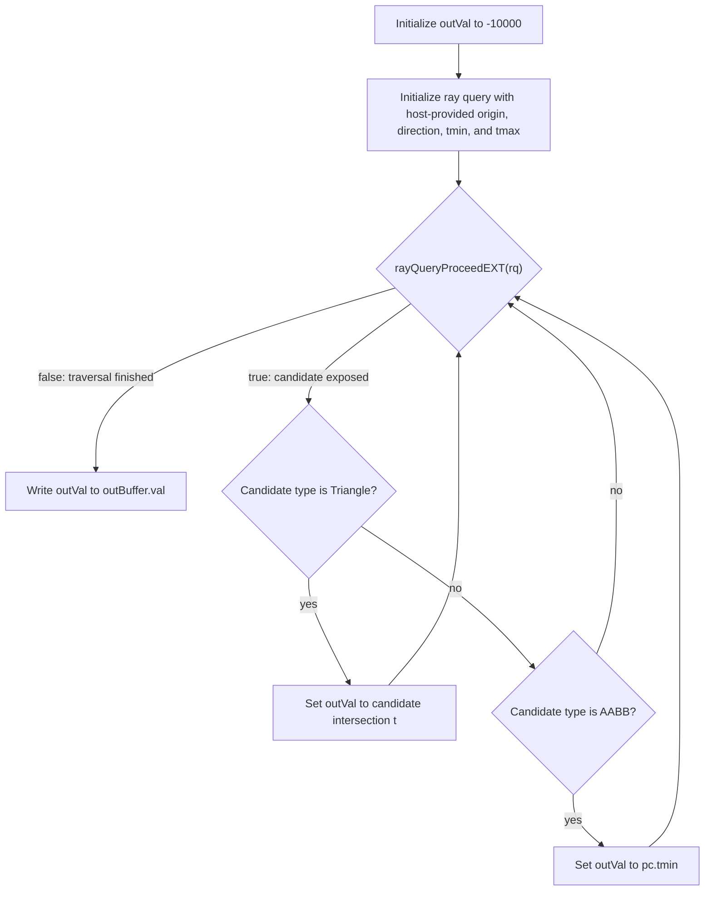

## Overview

**Core question:** Does `VK_KHR_ray_query` traversal report a hit `t` that matches the host-computed expected distance when the host scales the direction vector and rotates the scene, and does it produce a zero result for rays that start inside an AABB across several `tmax` windows?

This page covers the `direction_length` and `inside_aabbs` test families registered by [vktRayQueryDirectionTests.cpp](../../../modules/vulkan/ray_query/vktRayQueryDirectionTests.cpp#L546-L683). Both families live in one source file because they share the same compute shader, the same host-side BLAS/TLAS build path, and the same push-constant layout.

- `direction_length` shoots rays from outside the geometry, scales the ray direction vector by factors in `[0.5, 10.0]`, rotates the scene by random X/Y angles, and verifies the reported hit `t` equals `4.0 / scale` within `kDefaultTolerance = 0.001`.
- `inside_aabbs` shoots rays from `(0, 0, 1)` inside an AABB spanning `z = 0` through `z = 5`, sweeps four `tmax` windows (`tmax_zero`, `inside`, `edge`, `outside`), and verifies the shader-reported value equals `0.0`.
- One compute shader runs for every case. It writes a single `float` to a storage buffer. The host reads the float back and applies the family-specific verification.

## Background Knowledge

For the shared acceleration-structure and traversal model, see the
[ray-query category background](../../categories/ray_query.md#background-knowledge).

- **Parametric distance.** A ray is `origin + t * direction`; `t` is not necessarily world-space distance. Scaling
  `direction` by a factor scales the `t` needed to reach the same point by the inverse factor.
- **Coherent transforms.** Applying the same rigid rotation to a scene and its ray changes their orientation but not their relative intersection parameter. Scaling only the ray direction is different: it changes the parameterization even though the geometric ray line is unchanged.
- **Rays starting inside an AABB.** An AABB candidate can be encountered even when the ray origin is already inside the box. `tmin` and `tmax` still delimit the accepted ray interval, including degenerate or boundary-ending intervals.
- **TLAS instance-transform updates.** A TLAS instance transform maps a referenced BLAS from object space into the scene. Replacing that transform before traversal must affect the instance used by the query rather than leaving stale build-time placement.

## Registration Hierarchy

```text
ray_query
├── direction_length
└── inside_aabbs
```

Both families are direct children of the `ray_query` test category. Each family fans out into intermediate nodes (`triangles`/`aabbs` for `direction_length`, `ray_end_*` for `inside_aabbs`) and then into `scaling_factor_*` and `rotation_*` leaves; the enumerations live in `## Parameter Dimensions and Observed Values` instead of the tree.

## Parameter Dimensions and Observed Values

| Dimension | Registered values | Meaning in this test | Evidence |
|-----------|-------------------|----------------------|----------|
| Test family | `direction_length`, `inside_aabbs` | Selects the host-side verification routine and the ray origin type. `direction_length` shoots from outside and checks `t`; `inside_aabbs` shoots from inside and checks for a zero result. | [vktRayQueryDirectionTests.cpp:546-L683](../../../modules/vulkan/ray_query/vktRayQueryDirectionTests.cpp#L546-L683) |
| Geometry type | `triangles`, `aabbs` | Selects BLAS geometry in `direction_length`. Triangles exercise `rayQueryGetIntersectionTEXT`; AABBs exercise the `pc.tmin` storage path. | [vktRayQueryDirectionTests.cpp:552-L558](../../../modules/vulkan/ray_query/vktRayQueryDirectionTests.cpp#L552-L558) |
| Scaling factor | `1.0` plus 5 random values in `[0.5, 10.0]` | Scales only the ray direction vector. The scene is not scaled. Because `t` is parametric along the supplied direction, the expected hit value is `4.0 / scale`. The host fixes the seed per family so the factors reproduce. | [vktRayQueryDirectionTests.cpp:507-L524](../../../modules/vulkan/ray_query/vktRayQueryDirectionTests.cpp#L507-L524) |
| Rotation angles | `(0.0, 0.0)` plus 4 random `(x, y)` pairs in `[0, 2π]` | Rotates the scene with the TLAS instance matrix and applies the same rotation to the ray origin and direction. Rotation changes orientation, not the direction's scale. Each case combines one rotation pair with one scaling factor. | [vktRayQueryDirectionTests.cpp:527-L542](../../../modules/vulkan/ray_query/vktRayQueryDirectionTests.cpp#L527-L542) |
| Ray end type | `tmax_zero`, `inside`, `edge`, `outside` | Sets `tmax` in `inside_aabbs` to `0.0`, `distanceToEdge / 2`, `distanceToEdge`, or `distanceToEdge + 1.0`. | [vktRayQueryDirectionTests.cpp:622-L631](../../../modules/vulkan/ray_query/vktRayQueryDirectionTests.cpp#L622-L631) |
| `useArraysOfPointers` | `true`/`false`, alternating by `caseCounter % 2` | Toggles the TLAS array-of-pointers instance path in `direction_length`. | [vktRayQueryDirectionTests.cpp:597](../../../modules/vulkan/ray_query/vktRayQueryDirectionTests.cpp#L597) |
| `updateMatrixAfterBuild` | `true`/`false`, alternating by `caseCounter % 3` | In `direction_length`, when true the host builds the TLAS with identity, then calls `updateInstanceMatrix` before submit. | [vktRayQueryDirectionTests.cpp:599](../../../modules/vulkan/ray_query/vktRayQueryDirectionTests.cpp#L599) |

## Behavior Parameters

The primary behavioral axis is the test family. Each family tests a different property of ray traversal under scaled and rotated directions.

### `direction_length` — traversal respects direction vector length

The host scales only the ray direction by a non-unit factor and rotates both the scene and the matching ray frame. Each case combines one scaling factor with one rotation pair, then shoots from outside the geometry. For triangle geometry the shader reports `rayQueryGetIntersectionTEXT`; for AABB geometry the shader reports `pc.tmin` (which the host sets to `distanceToEdge - margin`). The host accepts the result when `|bufferValue - distanceToEdge| <= kDefaultTolerance`, where `distanceToEdge = 4.0 / scale`. The matrix of geometry types, direction scales, and scene orientations exposes precision loss or wrong parametric scaling in traversal.

### `inside_aabbs` — rays starting inside an AABB produce a zero candidate report

The host places the ray origin at `(0, 0, 1)` inside an AABB spanning `z = 0..5`, with the ray traveling toward `+Z` and leaving through the back face at `z = 5`. It sets `tmin = 0.0` and varies `tmax` across four windows. The shader writes `pc.tmin` (zero) when an AABB candidate appears. The host requires the readback value to equal `0.0`. The four windows cover zero-length, ending inside the AABB, ending exactly at the back face, and ending beyond the back face.

## Shader Analysis

Every case in both families runs the same compute shader. Shader code participates in the tested behavior: the host relies on the shader's candidate-type dispatch (`rayQueryGetIntersectionTEXT` for triangles, `pc.tmin` for AABBs) to produce the value the host verifies. The representative walkthrough below uses the `direction_length.triangles.scaling_factor_0.rotation_0` path because it exercises the triangle branch end to end; the parameter variation summary covers the AABB branch.

### Representative Shader Walkthrough 1

#### Parameter Values Chosen

Representative path:

```text
dEQP-VK.ray_query.direction_length.triangles.scaling_factor_0.rotation_0
```

| Parameter choice | Meaning in this representative case |
|------------------|-------------------------------------|
| `triangles` | BLAS contains one triangle at `z = 5`. The shader takes the triangle branch and stores `rayQueryGetIntersectionTEXT`. |
| `scaling_factor_0` | The first direction scale, `1.0`; the host does not scale the ray direction in this case. Expected distance is `4.0 / 1.0 = 4.0`. |
| `rotation_0` | The first rotation pair, `(0.0, 0.0)`; the scene, ray origin, and ray direction are unrotated in this case. |
| `useArraysOfPointers = true`, `updateMatrixAfterBuild = true` | Both alternate flags are true at `caseCounter = 0`. The TLAS uses the array-of-pointers path and the host updates the instance matrix after build. |

#### Purpose

Verify the ray query reports a triangle candidate hit at parametric `t` within `kDefaultTolerance = 0.001` of `4.0` when the direction is `(0, 0, 1)`, the origin is `(0, 0, 1)`, and the triangle sits at `z = 5`.

#### Structural Design



The shader loops until traversal finishes. On the selected triangle walkthrough, the triangle branch records the candidate's parametric `t`; the AABB branch is present in the shared shader but is not taken. The final buffer value is the last recorded value, or the `-10000.0` sentinel if no candidate matched either geometry type. The candidate `t` is measured along `pc.direction.xyz`. In general, the host pre-scales that direction by `directionScale` and then applies the selected rotation; the same rotation is applied to the scene through the TLAS instance matrix. The host's expected `4.0 / scale` matches this parametric form.

#### Shader Code

```glsl
#version 460 core
#extension GL_EXT_ray_query : require

layout(local_size_x=1, local_size_y=1, local_size_z=1) in;

layout(set=0, binding=0) uniform accelerationStructureEXT topLevelAS;
layout(set=0, binding=1, std430) buffer OutBuffer { float val; } outBuffer;
layout(push_constant, std430) uniform PushConstants {
  vec4 origin;
  vec4 direction;
  float tmin;
  float tmax;
} pc;

void main()
{
  const uint  cullMask = 0xFF;
  float       outVal   = -10000.0f;
  rayQueryEXT rq;
  rayQueryInitializeEXT(rq, topLevelAS, gl_RayFlagsNoneEXT, cullMask, pc.origin.xyz, pc.tmin, pc.direction.xyz, pc.tmax);
  while (rayQueryProceedEXT(rq)) {
    const uint candidateType = rayQueryGetIntersectionTypeEXT(rq, false);
    if (candidateType == gl_RayQueryCandidateIntersectionTriangleEXT) {
      outVal = rayQueryGetIntersectionTEXT(rq, false);
    }
    else if (candidateType == gl_RayQueryCandidateIntersectionAABBEXT) {
      outVal = pc.tmin;
    }
  }
  outBuffer.val = outVal;
}
```

#### Additional Info

- `updateRayTracingGLSL()` is an identity passthrough in this CTS version ([vkRayTracingUtil.hpp:111](../../../framework/vulkan/vkRayTracingUtil.hpp#L111)), so the reconstructed GLSL is the GLSL the host feeds to `glslangValidator`. The shader build options target `SPIRV_VERSION_1_4` ([vktRayQueryDirectionTests.cpp:281](../../../modules/vulkan/ray_query/vktRayQueryDirectionTests.cpp#L281)).
- The host-side `PushConstants` struct names the third field `tmix` ([vktRayQueryDirectionTests.cpp:270](../../../modules/vulkan/ray_query/vktRayQueryDirectionTests.cpp#L270)). The shader names it `tmin`. Both occupy the same `std430` offset, so the value passed by the host reaches `pc.tmin` in the shader without reinterpretation.
- The shader uses the candidate state (`false` argument) for both `rayQueryGetIntersectionTypeEXT` and `rayQueryGetIntersectionTEXT`. With `gl_RayFlagsNoneEXT` and a single piece of opaque geometry, the candidate auto-commits on `proceed`, so candidate `t` and committed `t` are equal at the iteration that fires.
- The `-10000.0f` initializer is the no-candidate sentinel. If a ray misses every piece of geometry, the sentinel reaches the output buffer and the host's tolerance check fails with a large delta.

#### Parameter Variation Summary

| Parameter dimension | Shader-level variation from this shader | Evidence |
|---------------------|---------------------------------------|----------|
| `aabbs` geometry | Same shader binary. The AABB branch fires; `outVal = pc.tmin`. The host verifies `|pc.tmin - distanceToEdge| <= kDefaultTolerance` because `pc.tmin = max(distanceToEdge - margin, 0.0)`. | [vktRayQueryDirectionTests.cpp:311-L313](../../../modules/vulkan/ray_query/vktRayQueryDirectionTests.cpp#L311-L313), [L137](../../../modules/vulkan/ray_query/vktRayQueryDirectionTests.cpp#L137) |
| `inside_aabbs` family | Same shader binary. The host sets `tmin = 0.0`, so `outVal = 0.0` for AABB candidates. The host verifies `bufferValue == 0.0`. | [vktRayQueryDirectionTests.cpp:141-L160](../../../modules/vulkan/ray_query/vktRayQueryDirectionTests.cpp#L141-L160), [L491-L500](../../../modules/vulkan/ray_query/vktRayQueryDirectionTests.cpp#L491-L500) |
| Scaling factor | Same shader binary. `pc.direction` is pre-scaled by the host; the reported `t` scales inversely. | [vktRayQueryDirectionTests.cpp:450](../../../modules/vulkan/ray_query/vktRayQueryDirectionTests.cpp#L450) |
| Rotation angles | Same shader binary. `pc.origin` and `pc.direction` are pre-rotated by the host. The TLAS instance matrix carries the same rotation. | [vktRayQueryDirectionTests.cpp:449-L450](../../../modules/vulkan/ray_query/vktRayQueryDirectionTests.cpp#L449-L450) |

#### SPIR-V

- Status: generated and validated
- Source: reconstructed GLSL from this walkthrough
- Stage: `comp`
- Target SPIRV version: `spirv1.4`

<details>
<summary>Click to expand SPIRV asm code</summary>

```llvm
; SPIR-V
; Version: 1.4
; Generator: Khronos Glslang Reference Front End; 11
; Bound: 74
; Schema: 0
               OpCapability Shader
               OpCapability RayQueryKHR
               OpExtension "SPV_KHR_ray_query"
          %1 = OpExtInstImport "GLSL.std.450"
               OpMemoryModel Logical GLSL450
               OpEntryPoint GLCompute %main "main" %rq %topLevelAS %pc %outBuffer
               OpExecutionMode %main LocalSize 1 1 1
               OpSource GLSL 460
               OpSourceExtension "GL_EXT_ray_query"
               OpName %main "main"
               OpName %outVal "outVal"
               OpName %rq "rq"
               OpName %topLevelAS "topLevelAS"
               OpName %PushConstants "PushConstants"
               OpMemberName %PushConstants 0 "origin"
               OpMemberName %PushConstants 1 "direction"
               OpMemberName %PushConstants 2 "tmin"
               OpMemberName %PushConstants 3 "tmax"
               OpName %pc "pc"
               OpName %candidateType "candidateType"
               OpName %OutBuffer "OutBuffer"
               OpMemberName %OutBuffer 0 "val"
               OpName %outBuffer "outBuffer"
               OpDecorate %topLevelAS Binding 0
               OpDecorate %topLevelAS DescriptorSet 0
               OpDecorate %PushConstants Block
               OpMemberDecorate %PushConstants 0 Offset 0
               OpMemberDecorate %PushConstants 1 Offset 16
               OpMemberDecorate %PushConstants 2 Offset 32
               OpMemberDecorate %PushConstants 3 Offset 36
               OpDecorate %OutBuffer Block
               OpMemberDecorate %OutBuffer 0 Offset 0
               OpDecorate %outBuffer Binding 1
               OpDecorate %outBuffer DescriptorSet 0
               OpDecorate %gl_WorkGroupSize BuiltIn WorkgroupSize
       %void = OpTypeVoid
          %3 = OpTypeFunction %void
      %float = OpTypeFloat 32
%_ptr_Function_float = OpTypePointer Function %float
%float_n10000 = OpConstant %float -10000
         %10 = OpTypeRayQueryKHR
%_ptr_Private_10 = OpTypePointer Private %10
         %rq = OpVariable %_ptr_Private_10 Private
         %13 = OpTypeAccelerationStructureKHR
%_ptr_UniformConstant_13 = OpTypePointer UniformConstant %13
 %topLevelAS = OpVariable %_ptr_UniformConstant_13 UniformConstant
       %uint = OpTypeInt 32 0
     %uint_0 = OpConstant %uint 0
   %uint_255 = OpConstant %uint 255
    %v4float = OpTypeVector %float 4
%PushConstants = OpTypeStruct %v4float %v4float %float %float
%_ptr_PushConstant_PushConstants = OpTypePointer PushConstant %PushConstants
         %pc = OpVariable %_ptr_PushConstant_PushConstants PushConstant
        %int = OpTypeInt 32 1
      %int_0 = OpConstant %int 0
    %v3float = OpTypeVector %float 3
%_ptr_PushConstant_v4float = OpTypePointer PushConstant %v4float
      %int_2 = OpConstant %int 2
%_ptr_PushConstant_float = OpTypePointer PushConstant %float
      %int_1 = OpConstant %int 1
      %int_3 = OpConstant %int 3
       %bool = OpTypeBool
%_ptr_Function_uint = OpTypePointer Function %uint
      %false = OpConstantFalse %bool
     %uint_1 = OpConstant %uint 1
  %OutBuffer = OpTypeStruct %float
%_ptr_StorageBuffer_OutBuffer = OpTypePointer StorageBuffer %OutBuffer
  %outBuffer = OpVariable %_ptr_StorageBuffer_OutBuffer StorageBuffer
%_ptr_StorageBuffer_float = OpTypePointer StorageBuffer %float
     %v3uint = OpTypeVector %uint 3
%gl_WorkGroupSize = OpConstantComposite %v3uint %uint_1 %uint_1 %uint_1
       %main = OpFunction %void None %3
          %5 = OpLabel
     %outVal = OpVariable %_ptr_Function_float Function
%candidateType = OpVariable %_ptr_Function_uint Function
               OpStore %outVal %float_n10000
         %16 = OpLoad %13 %topLevelAS
         %28 = OpAccessChain %_ptr_PushConstant_v4float %pc %int_0
         %29 = OpLoad %v4float %28
         %30 = OpVectorShuffle %v3float %29 %29 0 1 2
         %33 = OpAccessChain %_ptr_PushConstant_float %pc %int_2
         %34 = OpLoad %float %33
         %36 = OpAccessChain %_ptr_PushConstant_v4float %pc %int_1
         %37 = OpLoad %v4float %36
         %38 = OpVectorShuffle %v3float %37 %37 0 1 2
         %40 = OpAccessChain %_ptr_PushConstant_float %pc %int_3
         %41 = OpLoad %float %40
               OpRayQueryInitializeKHR %rq %16 %uint_0 %uint_255 %30 %34 %38 %41
               OpBranch %42
         %42 = OpLabel
               OpLoopMerge %44 %45 None
               OpBranch %46
         %46 = OpLabel
         %48 = OpRayQueryProceedKHR %bool %rq
               OpBranchConditional %48 %43 %44
         %43 = OpLabel
         %52 = OpRayQueryGetIntersectionTypeKHR %uint %rq %int_0
               OpStore %candidateType %52
         %53 = OpLoad %uint %candidateType
         %54 = OpIEqual %bool %53 %uint_0
               OpSelectionMerge %56 None
               OpBranchConditional %54 %55 %58
         %55 = OpLabel
         %57 = OpRayQueryGetIntersectionTKHR %float %rq %int_0
               OpStore %outVal %57
               OpBranch %56
         %58 = OpLabel
         %59 = OpLoad %uint %candidateType
         %61 = OpIEqual %bool %59 %uint_1
               OpSelectionMerge %63 None
               OpBranchConditional %61 %62 %63
         %62 = OpLabel
         %64 = OpAccessChain %_ptr_PushConstant_float %pc %int_2
         %65 = OpLoad %float %64
               OpStore %outVal %65
               OpBranch %63
         %63 = OpLabel
               OpBranch %56
         %56 = OpLabel
               OpBranch %45
         %45 = OpLabel
               OpBranch %42
         %44 = OpLabel
         %69 = OpLoad %float %outVal
         %71 = OpAccessChain %_ptr_StorageBuffer_float %outBuffer %int_0
               OpStore %71 %69
               OpReturn
               OpFunctionEnd
```

</details>

## Runtime Execution and Result Checking

- **Geometry setup.** The host builds one BLAS with either a triangle at `z = 5`, an outside-ray AABB collapsed to the plane at `z = 5`, or an inside-ray AABB spanning `z = 0` through `z = 5`. One TLAS instance wraps the BLAS. The instance transform is the rotation matrix; the host uses identity at build time when the case enables `updateMatrixAfterBuild`, then swaps in the real matrix before submit ([vktRayQueryDirectionTests.cpp:353-L378](../../../modules/vulkan/ray_query/vktRayQueryDirectionTests.cpp#L353-L378)). The host applies the selected direction scale only to the ray direction; it does not scale the BLAS geometry.
- **Push constants.** The host computes `rotatedOrigin = origin * rotationMatrix`, `finalDirection = direction * scaleMatrix * rotationMatrix`, `distanceToEdge = 4.0 / directionScale`, and `tmin/tmax` from `calcTminTmax`. These reach the shader as a single `PushConstants` struct ([vktRayQueryDirectionTests.cpp:448-L458](../../../modules/vulkan/ray_query/vktRayQueryDirectionTests.cpp#L448-L458)).
- **Dispatch.** A single `1x1x1` compute dispatch runs one shader invocation against the TLAS ([vktRayQueryDirectionTests.cpp:465](../../../modules/vulkan/ray_query/vktRayQueryDirectionTests.cpp#L465)).
- **Result copyback.** The host records a `SHADER_WRITE -> HOST_READ` memory barrier before `endCommandBuffer`. After `submitCommandsAndWait`, the host invalidates the allocation and copies one `float` from the buffer ([vktRayQueryDirectionTests.cpp:468-L478](../../../modules/vulkan/ray_query/vktRayQueryDirectionTests.cpp#L468-L478)).
- **Verification.** For `CROSS` (the `direction_length` family), the host requires `|bufferValue - distanceToEdge| <= kDefaultTolerance = 0.001`. For all `inside_aabbs` ray end types, the host requires `bufferValue == 0.0` ([vktRayQueryDirectionTests.cpp:480-L500](../../../modules/vulkan/ray_query/vktRayQueryDirectionTests.cpp#L480-L500)).
- **Pass condition.** The instance returns `tcu::TestStatus::pass("Pass")` when the verification holds.

## Failure Meaning

### Failure Cause Mapping

| If this behavior parameter value fails | Possible failure cause(s) |
|----------------------------------------|---------------------------|
| `direction_length` (triangles) | Reported `t` differs from `4.0 / scale` by more than `kDefaultTolerance`. Traversal did not respect the direction vector length, or the host and device applied the rotation matrix inconsistently. |
| `direction_length` (aabbs) | Reported `pc.tmin` differs from `4.0 / scale` by more than `kDefaultTolerance`. AABB candidate reporting or `tmin` propagation is wrong, or the `updateMatrixAfterBuild` path produced a stale instance matrix. |
| `inside_aabbs` (any ray end type) | Reported value is not `0.0`. The shader did not observe an AABB candidate and left the sentinel, or the pushed `tmin` value was corrupted. The shader does not read candidate `t` on this path. |

### Cause Analysis

#### Direction vector length not respected (triangle hits)

**Possible failure symptoms:** The host reads a `float` whose delta from `distanceToEdge = 4.0 / scale` exceeds `kDefaultTolerance = 0.001`. The reported value sits near `4.0` when it should be `4.0 / scale`, or sits near `4.0 / scale` with a small drift.

**Possible implementation causes:** The host pre-scales `pc.direction` before pushing it. A driver that normalizes the direction before traversal and reports `t` in world-space distance would return `4.0` instead of `4.0 / scale`. The [ray traversal chapter](../../../../vulkan-docs/src/chapters/raytraversal.adoc) defines `t` as parametric along the supplied direction; a driver that deviates from this contract produces the symptom. Confirming whether the failure lies in BVH traversal or in the `rayQueryGetIntersectionTEXT` return value needs source-level investigation.

#### AABB candidate reporting or `tmin` propagation

**Possible failure symptoms:** For `direction_length.aabbs` cases, the readback value differs from `4.0 / scale` by more than `kDefaultTolerance`. The shader stores `pc.tmin`, so the symptom points to either the host pushing the wrong `tmin` or the shader receiving a corrupted push constant.

**Possible implementation causes:** The host computes `pc.tmin = max(distanceToEdge - margin, 0.0)` with `margin = kDefaultTolerance / 2`. Source-level inspection shows the host field `tmix` and the shader field `tmin` occupy the same `std430` offset, so the value reaches the shader unchanged. A driver bug in push-constant delivery, or a compiler that reorders the push-constant struct, would produce the symptom. The `updateMatrixAfterBuild` path adds a second surface: if `topLevelAS->updateInstanceMatrix` does not take effect before submit, the TLAS still carries identity and the ray misses the AABB, leaving the `-10000.0` sentinel in the buffer.

#### Inside-AABB ray origin not handled

**Possible failure symptoms:** For `inside_aabbs` cases, the readback value is not `0.0`. It is the `-10000.0` sentinel (the shader reported no candidate), a small positive `t` (the shader reported the candidate with a non-zero `t`), or some other value.

**Possible implementation causes:** The host sets `tmin = 0.0` for inside rays, so `outVal = pc.tmin = 0.0` on the AABB branch. A non-zero readback means either the AABB branch did not fire (the sentinel case, pointing to BVH traversal skipping the AABB candidate when the ray starts inside) or something corrupted the push-constant `tmin` value in transit. The `tmax_zero` ray end type sets `tmax = 0.0`, which is a degenerate ray; a driver that rejects zero-length rays would skip the candidate and leave the sentinel. Confirming which step is wrong needs source-level investigation.

## Case Pruning

### Requirement-based pruning

- Cases require `VK_KHR_acceleration_structure` and `VK_KHR_ray_query` device extensions ([vktRayQueryDirectionTests.cpp:258-L262](../../../modules/vulkan/ray_query/vktRayQueryDirectionTests.cpp#L258-L262)).
- The dispatch runs compute, not a ray-tracing pipeline; the test does not require `rayTracingPipeline`.

### Design-based pruning

- `inside_aabbs` uses AABB geometry and no triangles. The `SpaceObjects` constructor asserts that `RayOriginType::INSIDE` requires `VK_GEOMETRY_TYPE_AABBS_KHR` ([vktRayQueryDirectionTests.cpp:93](../../../modules/vulkan/ray_query/vktRayQueryDirectionTests.cpp#L93)). Triangle geometry has no defined inside-outside test for a ray that starts on its surface, so the inside path is AABB-only by design.
- `direction_length` pins the ray end type to `CROSS`. Each family tests one property; `CROSS` covers the outside-in traversal path that respects direction length, and `inside_aabbs` covers the inside-out path on its own.
- `inside_aabbs` pins `useArraysOfPointers` and `updateMatrixAfterBuild` to `false`. Those toggles exist to exercise TLAS build variants for the outside path; the inside path focuses on `tmax` window coverage.

## Key Takeaways

- `direction_length` verifies the reported hit `t` scales as `1 / length(direction)` when the host pre-scales the direction. The expected value `4.0 / scale` and the `0.001` tolerance define the correctness contract.
- `inside_aabbs` verifies the shader sees an AABB candidate when the ray starts inside the only AABB, across four `tmax` windows. The `0.0` equality check defines the correctness contract.
- One shader binary backs every case. The triangle branch and the AABB branch in that shader are the two surfaces the host verification reaches.
- A non-zero readback on `inside_aabbs` or a large-delta readback on `direction_length` identifies the failed end-to-end path; the check alone does not distinguish traversal faults from push-constant, transform-update, shader-compilation, or readback faults.

## Source Reference Appendix

| Entry point | Link | Why it matters |
|-------------|------|----------------|
| `SpaceObjects` constructor | [vktRayQueryDirectionTests.cpp:87-L110](../../../modules/vulkan/ray_query/vktRayQueryDirectionTests.cpp#L87-L110) | Geometry placement for outside (triangle/AABB) and inside (AABB only) ray origins. |
| `calcTminTmax` | [vktRayQueryDirectionTests.cpp:129-L163](../../../modules/vulkan/ray_query/vktRayQueryDirectionTests.cpp#L129-L163) | Computes `tmin/tmax` from `rayOriginType`, `rayEndType`, and `distanceToEdge`. |
| `getScaleMatrix`, `getRotationMatrix`, `toTransformMatrixKHR` | [vktRayQueryDirectionTests.cpp:166-L207](../../../modules/vulkan/ray_query/vktRayQueryDirectionTests.cpp#L166-L207) | Host-side matrices applied to the direction and the TLAS instance. |
| `DirectionTestCase::checkSupport` | [vktRayQueryDirectionTests.cpp:258-L262](../../../modules/vulkan/ray_query/vktRayQueryDirectionTests.cpp#L258-L262) | Acceleration-structure and ray-query feature gates. |
| `DirectionTestCase::initPrograms` (compute shader) | [vktRayQueryDirectionTests.cpp:279-L319](../../../modules/vulkan/ray_query/vktRayQueryDirectionTests.cpp#L279-L319) | The single GLSL compute shader shared by every case. |
| `DirectionTestInstance::iterate` | [vktRayQueryDirectionTests.cpp:332-L503](../../../modules/vulkan/ray_query/vktRayQueryDirectionTests.cpp#L332-L503) | BLAS/TLAS build, push-constant setup, dispatch, copyback, and verification. |
| `createDirectionLengthTests` registration | [vktRayQueryDirectionTests.cpp:546-L615](../../../modules/vulkan/ray_query/vktRayQueryDirectionTests.cpp#L546-L615) | Registers `direction_length` with `triangles`/`aabbs`, scaling, and rotation. |
| `createInsideAABBsTests` registration | [vktRayQueryDirectionTests.cpp:617-L683](../../../modules/vulkan/ray_query/vktRayQueryDirectionTests.cpp#L617-L683) | Registers `inside_aabbs` with four ray end types, scaling, and rotation. |
| `updateRayTracingGLSL` (identity passthrough) | [vkRayTracingUtil.hpp:111](../../../framework/vulkan/vkRayTracingUtil.hpp#L111) | Confirms the helper does not modify the reconstructed GLSL. |
| Vulkan spec: ray traversal | [raytraversal.adoc](../../../../vulkan-docs/src/chapters/raytraversal.adoc) | Parametric `t` and candidate intersection semantics. |
